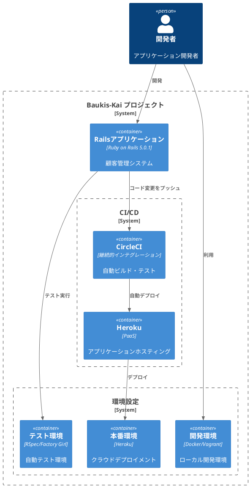
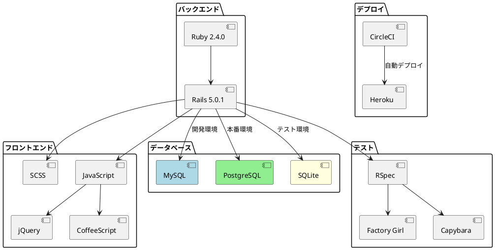

# 作業履歴 2017-01-11

## 概要

2017-01-11の作業内容をまとめています。このジャーナルでは、プロジェクトの基本構成、開発環境のセットアップ、およびデプロイメント設定に関する作業を記録しています。

## プロジェクト構成図



## 作業内容

### プロジェクト基本構成の設定

プロジェクトの基本構成を整備し、開発からデプロイまでのワークフローを確立しました。これにより、効率的な開発プロセスと一貫した環境での動作確認が可能になります。

#### 変更点の概要

1. プロジェクト構成の整理
   - READMEの構造化
   - 各セクションの詳細化
   - 開発手順の明確化

2. 開発環境の整備
   - 追加Gemのセットアップ
   - テスト環境の構築（RSpec, Factory Girl）
   - 国際化対応の設定

3. デプロイメント設定
   - Herokuデプロイの設定
   - CircleCIによる継続的インテグレーションの設定

### 開発・テスト環境の技術スタック



## コミット: 2a33184

### メッセージ

```
構成
```

### 変更されたファイル

- M	README.md

### 変更内容

```diff
commit 2a3318491cbad4c50276cabde33bf6de08b30c26
Author: k2works <kakimomokuri@gmail.com>
Date:   Wed Jan 11 19:19:00 2017 +0900

    構成

diff --git a/README.md b/README.md
index c4e067d..a0fc0b4 100644
--- a/README.md
+++ b/README.md
@@ -3,6 +3,7 @@ Baukis 改
 [](https://circleci.com/gh/k2works/baukis-kai) [](https://raw.githubusercontent.com/k2works/baukis-kai/master/MIT-LICENSE.txt) 

 # 目的 #
+[実践Ruby on Rails 4 現場のプロから学ぶ本格Webプログラミング](https://www.amazon.co.jp/%E5%AE%9F%E8%B7%B5Ruby-Rails-4-%E7%8F%BE%E5%A0%B4%E3%81%AE%E3%83%97%E3%83%AD%E3%81%8B%E3%82%89%E5%AD%A6%E3%81%B6%E6%9C%AC%E6%A0%BCWeb%E3%83%97%E3%83%AD%E3%82%B0%E3%83%A9%E3%83%9F%E3%83%B3%E3%82%B0-%E9%BB%92%E7%94%B0/dp/4844335928)をRails5での実装及びフロント部分にモダンCSS設計(BEM)を組み込む

 # 前提 #
 | ソフトウェア   | バージョン   | 備考        |
@@ -15,8 +16,31 @@ Baukis 改

 # 構成 #
 1. [アプリケーション環境構築](#アプリケーション環境構築)
+   1. [Vagarntのセットアップ](#Vagarntのセットアップ)
+   1. [Dockerのセットアップ](#Dockerのセットアップ)
+   1. [追加Gemセットアップ](#追加Gemセットアップ)
+   1. [その他の準備作業](#その他の準備作業)
+   1. [テスト環境のセットアップ](#テスト環境のセットアップ)
 1. [アプリケーション配置](#アプリケーション配置)
+   1. [Herokuセットアップ](#Herokuセットアップ)
+   1. [CircleCIセットアップ](#CircleCIセットアップ)
 1. [アプリケーション開発](#アプリケーション開発)
+   1. [ビジュアルデザイン](#ビジュアルデザイン)
+   1. [エラーページ](#エラーページ)
+   1. [ユーザー認証(1)](#ユーザー認証(1))
+   1. [ユーザー認証(2)](#ユーザー認証(2))
+   1. [ルーティング](#ルーティング)
+   1. [レコードの表示、新規作成、更新、削除](#レコードの表示、新規作成、更新、削除)
+   1. [String Parameters](#String Parameters])
+   1. [アクセス制御](#アクセス制御)
+   1. [モデル間の関連付け](#モデル間の関連付け)
+   1. [値の正規化とバリデーション](#値の正規化とバリデーション)
+   1. [プレゼンター](#プレゼンター)
+   1. [jQueryとCoffeeScript](#jQueryとCoffeeScript)
+   1. [単一テーブ継承](#単一テーブ継承)
+   1. [Capybra](#Capybara)
+   1. [フォームオブジェクト](#フォームオブジェクト)
+   1. [検索フォーム](#検索フォーム)

 ## アプリケーション環境構築
 ### Vagarntのセットアップ
@@ -57,6 +81,23 @@ git push heroku master

 **[⬆ back to top](#構成)**
 ## アプリケーション開発
+### ビジュアルデザイン
+### エラーページ
+### ユーザー認証
+### ユーザー認証
+### ルーティング
+### レコードの表示、新規作成、更新、削除
+### String Parameters
+### アクセス制御
+### モデル間の関連付け
+### 値の正規化とバリデーション
+### プレゼンター
+### jQueryとCoffeeScript
+### 単一テーブ継承
+### Capybara
+### フォームオブジェクト
+### 検索フォーム
+**[⬆ back to top](#構成)**

 # 参照 #
-
++ [実践Ruby on Rails 4 現場のプロから学ぶ本格Webプログラミング](https://www.amazon.co.jp/%E5%AE%9F%E8%B7%B5Ruby-Rails-4-%E7%8F%BE%E5%A0%B4%E3%81%AE%E3%83%97%E3%83%AD%E3%81%8B%E3%82%89%E5%AD%A6%E3%81%B6%E6%9C%AC%E6%A0%BCWeb%E3%83%97%E3%83%AD%E3%82%B0%E3%83%A9%E3%83%9F%E3%83%B3%E3%82%B0-%E9%BB%92%E7%94%B0/dp/4844335928)

```

## コミット: 6336c1b

### メッセージ

```
構成
```

### 変更されたファイル

- M	README.md

### 変更内容

```diff
commit 6336c1b2a3d3124106be36dfa13fda18975d8724
Author: k2works <kakimomokuri@gmail.com>
Date:   Wed Jan 11 19:00:43 2017 +0900

    構成

diff --git a/README.md b/README.md
index 742bdff..c4e067d 100644
--- a/README.md
+++ b/README.md
@@ -14,6 +14,10 @@ Baukis 改
 | docker-compose |1.8.0    |             |

 # 構成 #
+1. [アプリケーション環境構築](#アプリケーション環境構築)
+1. [アプリケーション配置](#アプリケーション配置)
+1. [アプリケーション開発](#アプリケーション開発)
+   
 ## アプリケーション環境構築
 ### Vagarntのセットアップ
 ```
@@ -39,6 +43,8 @@ docker-compose build
 + RSpecの初期設定
 + Factory Girlの初期設定

+**[⬆ back to top](#構成)**
+
 ## アプリケーション配置

 ### Herokuセットアップ
@@ -49,6 +55,7 @@ git push heroku master

 ### CircleCIセットアップ

+**[⬆ back to top](#構成)**
 ## アプリケーション開発

 # 参照 #

```

## コミット: 8040e18

### メッセージ

```
アプリケーション配置
```

### 変更されたファイル

- M	README.md
- A	circle.yml

### 変更内容

```diff
commit 8040e18a935dfa8a6ab8a9f183f2cc4c057a8175
Author: k2works <kakimomokuri@gmail.com>
Date:   Wed Jan 11 18:46:33 2017 +0900

    アプリケーション配置

diff --git a/README.md b/README.md
index 2eb5bb5..742bdff 100644
--- a/README.md
+++ b/README.md
@@ -1,5 +1,6 @@
 Baukis 改
 ===================
+[](https://circleci.com/gh/k2works/baukis-kai) [](https://raw.githubusercontent.com/k2works/baukis-kai/master/MIT-LICENSE.txt) 

 # 目的 #

@@ -46,6 +47,8 @@ heroku create baukis-kai
 git push heroku master
 ```

+### CircleCIセットアップ
+
 ## アプリケーション開発

 # 参照 #
diff --git a/circle.yml b/circle.yml
new file mode 100644
index 0000000..150a280
--- /dev/null
+++ b/circle.yml
@@ -0,0 +1,5 @@
+deployment:
+  staging:
+    branch: master
+    heroku:
+      appname: baukis-kai
\ No newline at end of file

```

## コミット: 521eead

### メッセージ

```
Herokuセットアップ
```

### 変更されたファイル

- M	Gemfile
- M	README.md

### 変更内容

```diff
commit 521eead1b40fd919fb87dc6c6f81073f9fd41f78
Author: k2works <kakimomokuri@gmail.com>
Date:   Wed Jan 11 18:27:42 2017 +0900

    Herokuセットアップ

diff --git a/Gemfile b/Gemfile
index 4652a91..a71748d 100644
--- a/Gemfile
+++ b/Gemfile
@@ -1,4 +1,5 @@
 source 'https://rubygems.org'
+ruby '2.4.0'

 git_source(:github) do |repo_name|
   repo_name = "#{repo_name}/#{repo_name}" unless repo_name.include?("/")
diff --git a/README.md b/README.md
index 8fe9719..2eb5bb5 100644
--- a/README.md
+++ b/README.md
@@ -38,10 +38,15 @@ docker-compose build
 + RSpecの初期設定
 + Factory Girlの初期設定

-## アプリケーション開発
-
 ## アプリケーション配置

-# 参照 #
+### Herokuセットアップ
+```bash
+heroku create baukis-kai
+git push heroku master
+```
+
+## アプリケーション開発

 # 参照 #
+

```

## コミット: 8d2a1d0

### メッセージ

```
テスト環境のセットアップ
```

### 変更されたファイル

- M	spec/rails_helper.rb

### 変更内容

```diff
commit 8d2a1d0202b9effc2f49d34978e4d05180523092
Author: k2works <kakimomokuri@gmail.com>
Date:   Wed Jan 11 18:18:53 2017 +0900

    テスト環境のセットアップ

diff --git a/spec/rails_helper.rb b/spec/rails_helper.rb
index 6f1ab14..ad9274e 100644
--- a/spec/rails_helper.rb
+++ b/spec/rails_helper.rb
@@ -54,4 +54,10 @@ RSpec.configure do |config|
   config.filter_rails_from_backtrace!
   # arbitrary gems may also be filtered via:
   # config.filter_gems_from_backtrace("gem name")
+
+  config.include FactoryGirl::Syntax::Methods
+
+  config.before(:suite) do
+    FactoryGirl.reload
+  end
 end

```

## コミット: 164239a

### メッセージ

```
テスト環境のセットアップ
```

### 変更されたファイル

- M	README.md
- A	spec/rails_helper.rb
- A	spec/spec_helper.rb

### 変更内容

```diff
commit 164239a87601d4725832e5ea234f7006558bd872
Author: k2works <kakimomokuri@gmail.com>
Date:   Wed Jan 11 18:13:25 2017 +0900

    テスト環境のセットアップ

diff --git a/README.md b/README.md
index 3ee6927..8fe9719 100644
--- a/README.md
+++ b/README.md
@@ -34,6 +34,10 @@ docker-compose build
 + ジェネレータの設定
 + アプリケーション実行URLの設定

+### テスト環境のセットアップ
++ RSpecの初期設定
++ Factory Girlの初期設定
+
 ## アプリケーション開発

 ## アプリケーション配置
diff --git a/spec/rails_helper.rb b/spec/rails_helper.rb
new file mode 100644
index 0000000..6f1ab14
--- /dev/null
+++ b/spec/rails_helper.rb
@@ -0,0 +1,57 @@
+# This file is copied to spec/ when you run 'rails generate rspec:install'
+ENV['RAILS_ENV'] ||= 'test'
+require File.expand_path('../../config/environment', __FILE__)
+# Prevent database truncation if the environment is production
+abort("The Rails environment is running in production mode!") if Rails.env.production?
+require 'spec_helper'
+require 'rspec/rails'
+# Add additional requires below this line. Rails is not loaded until this point!
+
+# Requires supporting ruby files with custom matchers and macros, etc, in
+# spec/support/ and its subdirectories. Files matching `spec/**/*_spec.rb` are
+# run as spec files by default. This means that files in spec/support that end
+# in _spec.rb will both be required and run as specs, causing the specs to be
+# run twice. It is recommended that you do not name files matching this glob to
+# end with _spec.rb. You can configure this pattern with the --pattern
+# option on the command line or in ~/.rspec, .rspec or `.rspec-local`.
+#
+# The following line is provided for convenience purposes. It has the downside
+# of increasing the boot-up time by auto-requiring all files in the support
+# directory. Alternatively, in the individual `*_spec.rb` files, manually
+# require only the support files necessary.
+#
+# Dir[Rails.root.join('spec/support/**/*.rb')].each { |f| require f }
+
+# Checks for pending migration and applies them before tests are run.
+# If you are not using ActiveRecord, you can remove this line.
+ActiveRecord::Migration.maintain_test_schema!
+
+RSpec.configure do |config|
+  # Remove this line if you're not using ActiveRecord or ActiveRecord fixtures
+  config.fixture_path = "#{::Rails.root}/spec/fixtures"
+
+  # If you're not using ActiveRecord, or you'd prefer not to run each of your
+  # examples within a transaction, remove the following line or assign false
+  # instead of true.
+  config.use_transactional_fixtures = true
+
+  # RSpec Rails can automatically mix in different behaviours to your tests
+  # based on their file location, for example enabling you to call `get` and
+  # `post` in specs under `spec/controllers`.
+  #
+  # You can disable this behaviour by removing the line below, and instead
+  # explicitly tag your specs with their type, e.g.:
+  #
+  #     RSpec.describe UsersController, :type => :controller do
+  #       # ...
+  #     end
+  #
+  # The different available types are documented in the features, such as in
+  # https://relishapp.com/rspec/rspec-rails/docs
+  config.infer_spec_type_from_file_location!
+
+  # Filter lines from Rails gems in backtraces.
+  config.filter_rails_from_backtrace!
+  # arbitrary gems may also be filtered via:
+  # config.filter_gems_from_backtrace("gem name")
+end
diff --git a/spec/spec_helper.rb b/spec/spec_helper.rb
new file mode 100644
index 0000000..8f698be
--- /dev/null
+++ b/spec/spec_helper.rb
@@ -0,0 +1,99 @@
+# This file was generated by the `rails generate rspec:install` command. Conventionally, all
+# specs live under a `spec` directory, which RSpec adds to the `$LOAD_PATH`.
+# The generated `.rspec` file contains `--require spec_helper` which will cause
+# this file to always be loaded, without a need to explicitly require it in any
+# files.
+#
+# Given that it is always loaded, you are encouraged to keep this file as
+# light-weight as possible. Requiring heavyweight dependencies from this file
+# will add to the boot time of your test suite on EVERY test run, even for an
+# individual file that may not need all of that loaded. Instead, consider making
+# a separate helper file that requires the additional dependencies and performs
+# the additional setup, and require it from the spec files that actually need
+# it.
+#
+# The `.rspec` file also contains a few flags that are not defaults but that
+# users commonly want.
+#
+# See http://rubydoc.info/gems/rspec-core/RSpec/Core/Configuration
+RSpec.configure do |config|
+  # rspec-expectations config goes here. You can use an alternate
+  # assertion/expectation library such as wrong or the stdlib/minitest
+  # assertions if you prefer.
+  config.expect_with :rspec do |expectations|
+    # This option will default to `true` in RSpec 4. It makes the `description`
+    # and `failure_message` of custom matchers include text for helper methods
+    # defined using `chain`, e.g.:
+    #     be_bigger_than(2).and_smaller_than(4).description
+    #     # => "be bigger than 2 and smaller than 4"
+    # ...rather than:
+    #     # => "be bigger than 2"
+    expectations.include_chain_clauses_in_custom_matcher_descriptions = true
+  end
+
+  # rspec-mocks config goes here. You can use an alternate test double
+  # library (such as bogus or mocha) by changing the `mock_with` option here.
+  config.mock_with :rspec do |mocks|
+    # Prevents you from mocking or stubbing a method that does not exist on
+    # a real object. This is generally recommended, and will default to
+    # `true` in RSpec 4.
+    mocks.verify_partial_doubles = true
+  end
+
+  # This option will default to `:apply_to_host_groups` in RSpec 4 (and will
+  # have no way to turn it off -- the option exists only for backwards
+  # compatibility in RSpec 3). It causes shared context metadata to be
+  # inherited by the metadata hash of host groups and examples, rather than
+  # triggering implicit auto-inclusion in groups with matching metadata.
+  config.shared_context_metadata_behavior = :apply_to_host_groups
+
+# The settings below are suggested to provide a good initial experience
+# with RSpec, but feel free to customize to your heart's content.
+=begin
+  # This allows you to limit a spec run to individual examples or groups
+  # you care about by tagging them with `:focus` metadata. When nothing
+  # is tagged with `:focus`, all examples get run. RSpec also provides
+  # aliases for `it`, `describe`, and `context` that include `:focus`
+  # metadata: `fit`, `fdescribe` and `fcontext`, respectively.
+  config.filter_run_when_matching :focus
+
+  # Allows RSpec to persist some state between runs in order to support
+  # the `--only-failures` and `--next-failure` CLI options. We recommend
+  # you configure your source control system to ignore this file.
+  config.example_status_persistence_file_path = "spec/examples.txt"
+
+  # Limits the available syntax to the non-monkey patched syntax that is
+  # recommended. For more details, see:
+  #   - http://rspec.info/blog/2012/06/rspecs-new-expectation-syntax/
+  #   - http://www.teaisaweso.me/blog/2013/05/27/rspecs-new-message-expectation-syntax/
+  #   - http://rspec.info/blog/2014/05/notable-changes-in-rspec-3/#zero-monkey-patching-mode
+  config.disable_monkey_patching!
+
+  # Many RSpec users commonly either run the entire suite or an individual
+  # file, and it's useful to allow more verbose output when running an
+  # individual spec file.
+  if config.files_to_run.one?
+    # Use the documentation formatter for detailed output,
+    # unless a formatter has already been configured
+    # (e.g. via a command-line flag).
+    config.default_formatter = 'doc'
+  end
+
+  # Print the 10 slowest examples and example groups at the
+  # end of the spec run, to help surface which specs are running
+  # particularly slow.
+  config.profile_examples = 10
+
+  # Run specs in random order to surface order dependencies. If you find an
+  # order dependency and want to debug it, you can fix the order by providing
+  # the seed, which is printed after each run.
+  #     --seed 1234
+  config.order = :random
+
+  # Seed global randomization in this process using the `--seed` CLI option.
+  # Setting this allows you to use `--seed` to deterministically reproduce
+  # test failures related to randomization by passing the same `--seed` value
+  # as the one that triggered the failure.
+  Kernel.srand config.seed
+=end
+end

```

## コミット: 1f68583

### メッセージ

```
その他の準備作業
```

### 変更されたファイル

- A	MIT-LICENSE.txt
- M	README.md
- M	config/environments/development.rb
- M	config/environments/production.rb
- A	config/initializers/generators.rb
- A	config/initializers/i18n.rb

### 変更内容

```diff
commit 1f68583b4dac5168bc35351b1a027d39b9b63b53
Author: k2works <kakimomokuri@gmail.com>
Date:   Wed Jan 11 18:07:28 2017 +0900

    その他の準備作業

diff --git a/MIT-LICENSE.txt b/MIT-LICENSE.txt
new file mode 100644
index 0000000..63b4b68
--- /dev/null
+++ b/MIT-LICENSE.txt
@@ -0,0 +1,21 @@
+MIT License
+
+Copyright (c) [year] [fullname]
+
+Permission is hereby granted, free of charge, to any person obtaining a copy
+of this software and associated documentation files (the "Software"), to deal
+in the Software without restriction, including without limitation the rights
+to use, copy, modify, merge, publish, distribute, sublicense, and/or sell
+copies of the Software, and to permit persons to whom the Software is
+furnished to do so, subject to the following conditions:
+
+The above copyright notice and this permission notice shall be included in all
+copies or substantial portions of the Software.
+
+THE SOFTWARE IS PROVIDED "AS IS", WITHOUT WARRANTY OF ANY KIND, EXPRESS OR
+IMPLIED, INCLUDING BUT NOT LIMITED TO THE WARRANTIES OF MERCHANTABILITY,
+FITNESS FOR A PARTICULAR PURPOSE AND NONINFRINGEMENT. IN NO EVENT SHALL THE
+AUTHORS OR COPYRIGHT HOLDERS BE LIABLE FOR ANY CLAIM, DAMAGES OR OTHER
+LIABILITY, WHETHER IN AN ACTION OF CONTRACT, TORT OR OTHERWISE, ARISING FROM,
+OUT OF OR IN CONNECTION WITH THE SOFTWARE OR THE USE OR OTHER DEALINGS IN THE
+SOFTWARE.
\ No newline at end of file
diff --git a/README.md b/README.md
index 6f0b160..3ee6927 100644
--- a/README.md
+++ b/README.md
@@ -28,6 +28,12 @@ docker-compose build

 ### 追加Gemセットアップ

+### その他の準備作業
++ ライセンス文書の作成
++ タイムゾーンとロケールの設定
++ ジェネレータの設定
++ アプリケーション実行URLの設定
+
 ## アプリケーション開発

 ## アプリケーション配置
diff --git a/config/environments/development.rb b/config/environments/development.rb
index 6f71970..ae94b97 100644
--- a/config/environments/development.rb
+++ b/config/environments/development.rb
@@ -51,4 +51,10 @@ Rails.application.configure do
   # Use an evented file watcher to asynchronously detect changes in source code,
   # routes, locales, etc. This feature depends on the listen gem.
   config.file_watcher = ActiveSupport::EventedFileUpdateChecker
+
+  config.baukis_kai = {
+      staff: { host: '0.0.0.0', path: '' },
+      admin: { host: '0.0.0.0', path: 'admin' },
+      customer: { host: '0.0.0.0', path: 'mypage' }
+  }
 end
diff --git a/config/environments/production.rb b/config/environments/production.rb
index 66be215..a736dfc 100644
--- a/config/environments/production.rb
+++ b/config/environments/production.rb
@@ -83,4 +83,10 @@ Rails.application.configure do

   # Do not dump schema after migrations.
   config.active_record.dump_schema_after_migration = false
+
+  config.baukis_kai = {
+      staff: { host: ENV["PRD_URL"] , path: '' },
+      admin: { host: ENV["PRD_URL"], path: 'admin' },
+      customer: { host: ENV["PRD_URL"], path: 'mypage' }
+  }
 end
diff --git a/config/initializers/generators.rb b/config/initializers/generators.rb
new file mode 100644
index 0000000..2feedb4
--- /dev/null
+++ b/config/initializers/generators.rb
@@ -0,0 +1,7 @@
+Rails.application.config.generators do |g|
+  g.helper false
+  g.assets false
+  g.test_framework :rspec
+  g.controller_specs false
+  g.view_specs false
+end
\ No newline at end of file
diff --git a/config/initializers/i18n.rb b/config/initializers/i18n.rb
new file mode 100644
index 0000000..6c3c01a
--- /dev/null
+++ b/config/initializers/i18n.rb
@@ -0,0 +1,3 @@
+Rails.application.config.time_zone = 'Tokyo'
+Rails.application.config.i18n.load_path += Dir[Rails.root.join('config','locales','**','*.{rb,yml}').to_s]
+Rails.application.config.i18n.default_locale = :ja
\ No newline at end of file

```

## コミット: 7752183

### メッセージ

```
追加Gemセットアップ
```

### 変更されたファイル

- M	.idea/.generators
- M	.idea/.rakeTasks
- A	.ruby-version
- M	Gemfile
- M	Gemfile.lock
- M	README.md
- M	baukis-kai.iml
- M	config/database.yml
- A	db/schema.rb

### 変更内容

```diff
commit 77521839daed76995ef0c6306174b16577eae53f
Author: k2works <kakimomokuri@gmail.com>
Date:   Tue Jan 10 19:38:47 2017 +0900

    追加Gemセットアップ

diff --git a/.idea/.generators b/.idea/.generators
index 1618976..8e11556 100644
--- a/.idea/.generators
+++ b/.idea/.generators
@@ -5,4 +5,4 @@ You are allowed to:
 2. Remove generators
 3. Add installed generators
 To add new installed generators automatically delete this file and reload the project.
---><GeneratorsGroup><Generator name="active_record:migration" /><Generator name="active_record:model" /><Generator name="active_record:observer" /><Generator name="active_record:session_migration" /><Generator name="controller" /><Generator name="erb:controller" /><Generator name="erb:mailer" /><Generator name="erb:scaffold" /><Generator name="generator" /><Generator name="helper" /><Generator name="integration_test" /><Generator name="mailer" /><Generator name="metal" /><Generator name="migration" /><Generator name="model" /><Generator name="model_subclass" /><Generator name="observer" /><Generator name="performance_test" /><Generator name="plugin" /><Generator name="resource" /><Generator name="scaffold" /><Generator name="scaffold_controller" /><Generator name="session_migration" /><Generator name="stylesheets" /><Generator name="test_unit:controller" /><Generator name="test_unit:helper" /><Generator name="test_unit:integration" /><Generator name="test_unit:mailer" /><Generator name="test_unit:model" /><Generator name="test_unit:observer" /><Generator name="test_unit:performance" /><Generator name="test_unit:plugin" /><Generator name="test_unit:scaffold" /></GeneratorsGroup></Settings>
+--><GeneratorsGroup><Generator name="annotate:install" /><Generator name="assets" /><Generator name="channel" /><Generator name="coffee:assets" /><Generator name="controller" /><Generator name="erd:install" /><Generator name="factory_girl:model" /><Generator name="generator" /><Generator name="helper" /><Generator name="i18n" /><Generator name="i18n_locale" /><Generator name="i18n_translation" /><Generator name="integration_test" /><Generator name="jbuilder" /><Generator name="job" /><Generator name="js:assets" /><Generator name="mailer" /><Generator name="migration" /><Generator name="model" /><Generator name="rack:dev-mark:install" /><Generator name="resource" /><Generator name="rspec:controller" /><Generator name="rspec:feature" /><Generator name="rspec:helper" /><Generator name="rspec:install" /><Generator name="rspec:integration" /><Generator name="rspec:job" /><Generator name="rspec:mailer" /><Generator name="rspec:model" /><Generator name="rspec:observer" /><Generator name="rspec:request" /><Generator name="rspec:scaffold" /><Generator name="rspec:view" /><Generator name="scaffold" /><Generator name="scaffold_controller" /><Generator name="task" /><Generator name="test_unit:controller" /><Generator name="test_unit:generator" /><Generator name="test_unit:helper" /><Generator name="test_unit:integration" /><Generator name="test_unit:job" /><Generator name="test_unit:mailer" /><Generator name="test_unit:model" /><Generator name="test_unit:plugin" /><Generator name="test_unit:scaffold" /></GeneratorsGroup></Settings>
diff --git a/.idea/.rakeTasks b/.idea/.rakeTasks
index 1bb59d0..ef72890 100644
--- a/.idea/.rakeTasks
+++ b/.idea/.rakeTasks
@@ -4,4 +4,4 @@ You are allowed to:
 1. Remove rake task
 2. Add existing rake tasks
 To add existing rake tasks automatically delete this file and reload the project.
---><RakeGroup description="" fullCmd="" taksId="rake"><RakeTask description="" fullCmd="about" taksId="about" /><RakeGroup description="" fullCmd="" taksId="app"><RakeTask description="" fullCmd="app:template" taksId="template" /><RakeGroup description="" fullCmd="" taksId="templates"><RakeTask description="" fullCmd="app:templates:copy" taksId="copy" /></RakeGroup><RakeTask description="" fullCmd="app:update" taksId="update" /><RakeGroup description="" fullCmd="" taksId="update"><RakeTask description="" fullCmd="app:update:bin" taksId="bin" /><RakeTask description="" fullCmd="app:update:configs" taksId="configs" /><RakeTask description="" fullCmd="app:update:upgrade_guide_info" taksId="upgrade_guide_info" /></RakeGroup></RakeGroup><RakeGroup description="" fullCmd="" taksId="assets"><RakeTask description="" fullCmd="assets:clean" taksId="clean" /><RakeTask description="" fullCmd="assets:clobber" taksId="clobber" /><RakeTask description="" fullCmd="assets:environment" taksId="environment" /><RakeTask description="" fullCmd="assets:precompile" taksId="precompile" /></RakeGroup><RakeGroup description="" fullCmd="" taksId="cache_digests"><RakeTask description="" fullCmd="cache_digests:dependencies" taksId="dependencies" /><RakeTask description="" fullCmd="cache_digests:nested_dependencies" taksId="nested_dependencies" /></RakeGroup><RakeGroup description="" fullCmd="" taksId="db"><RakeTask description="" fullCmd="db:_dump" taksId="_dump" /><RakeTask description="" fullCmd="db:abort_if_pending_migrations" taksId="abort_if_pending_migrations" /><RakeTask description="" fullCmd="db:charset" taksId="charset" /><RakeTask description="" fullCmd="db:check_protected_environments" taksId="check_protected_environments" /><RakeTask description="" fullCmd="db:collation" taksId="collation" /><RakeTask description="" fullCmd="db:create" taksId="create" /><RakeGroup description="" fullCmd="" taksId="create"><RakeTask description="" fullCmd="db:create:all" taksId="all" /></RakeGroup><RakeTask description="" fullCmd="db:drop" taksId="drop" /><RakeGroup description="" fullCmd="" taksId="drop"><RakeTask description="" fullCmd="db:drop:_unsafe" taksId="_unsafe" /><RakeTask description="" fullCmd="db:drop:all" taksId="all" /></RakeGroup><RakeGroup description="" fullCmd="" taksId="environment"><RakeTask description="" fullCmd="db:environment:set" taksId="set" /></RakeGroup><RakeGroup description="" fullCmd="" taksId="fixtures"><RakeTask description="" fullCmd="db:fixtures:identify" taksId="identify" /><RakeTask description="" fullCmd="db:fixtures:load" taksId="load" /></RakeGroup><RakeTask description="" fullCmd="db:forward" taksId="forward" /><RakeTask description="" fullCmd="db:load_config" taksId="load_config" /><RakeTask description="" fullCmd="db:migrate" taksId="migrate" /><RakeGroup description="" fullCmd="" taksId="migrate"><RakeTask description="" fullCmd="db:migrate:down" taksId="down" /><RakeTask description="" fullCmd="db:migrate:redo" taksId="redo" /><RakeTask description="" fullCmd="db:migrate:reset" taksId="reset" /><RakeTask description="" fullCmd="db:migrate:status" taksId="status" /><RakeTask description="" fullCmd="db:migrate:up" taksId="up" /></RakeGroup><RakeTask description="" fullCmd="db:purge" taksId="purge" /><RakeGroup description="" fullCmd="" taksId="purge"><RakeTask description="" fullCmd="db:purge:all" taksId="all" /></RakeGroup><RakeTask description="" fullCmd="db:reset" taksId="reset" /><RakeTask description="" fullCmd="db:rollback" taksId="rollback" /><RakeGroup description="" fullCmd="" taksId="schema"><RakeGroup description="" fullCmd="" taksId="cache"><RakeTask description="" fullCmd="db:schema:cache:clear" taksId="clear" /><RakeTask description="" fullCmd="db:schema:cache:dump" taksId="dump" /></RakeGroup><RakeTask description="" fullCmd="db:schema:dump" taksId="dump" /><RakeTask description="" fullCmd="db:schema:load" taksId="load" /><RakeTask description="" fullCmd="db:schema:load_if_ruby" taksId="load_if_ruby" /></RakeGroup><RakeTask description="" fullCmd="db:seed" taksId="seed" /><RakeTask description="" fullCmd="db:setup" taksId="setup" /><RakeGroup description="" fullCmd="" taksId="structure"><RakeTask description="" fullCmd="db:structure:dump" taksId="dump" /><RakeTask description="" fullCmd="db:structure:load" taksId="load" /><RakeTask description="" fullCmd="db:structure:load_if_sql" taksId="load_if_sql" /></RakeGroup><RakeGroup description="" fullCmd="" taksId="test"><RakeTask description="" fullCmd="db:test:clone" taksId="clone" /><RakeTask description="" fullCmd="db:test:clone_schema" taksId="clone_schema" /><RakeTask description="" fullCmd="db:test:clone_structure" taksId="clone_structure" /><RakeTask description="" fullCmd="db:test:deprecated" taksId="deprecated" /><RakeTask description="" fullCmd="db:test:load" taksId="load" /><RakeTask description="" fullCmd="db:test:load_schema" taksId="load_schema" /><RakeTask description="" fullCmd="db:test:load_structure" taksId="load_structure" /><RakeTask description="" fullCmd="db:test:prepare" taksId="prepare" /><RakeTask description="" fullCmd="db:test:purge" taksId="purge" /></RakeGroup><RakeTask description="" fullCmd="db:version" taksId="version" /></RakeGroup><RakeTask description="" fullCmd="default" taksId="default" /><RakeGroup description="" fullCmd="" taksId="dev"><RakeTask description="" fullCmd="dev:cache" taksId="cache" /></RakeGroup><RakeTask description="" fullCmd="environment" taksId="environment" /><RakeTask description="" fullCmd="initializers" taksId="initializers" /><RakeGroup description="" fullCmd="" taksId="log"><RakeTask description="" fullCmd="log:clear" taksId="clear" /></RakeGroup><RakeTask description="" fullCmd="middleware" taksId="middleware" /><RakeTask description="" fullCmd="notes" taksId="notes" /><RakeGroup description="" fullCmd="" taksId="notes"><RakeTask description="" fullCmd="notes:custom" taksId="custom" /><RakeTask description="" fullCmd="notes:fixme" taksId="fixme" /><RakeTask description="" fullCmd="notes:optimize" taksId="optimize" /><RakeTask description="" fullCmd="notes:todo" taksId="todo" /></RakeGroup><RakeGroup description="" fullCmd="" taksId="rails"><RakeTask description="" fullCmd="rails:template" taksId="template" /><RakeGroup description="" fullCmd="" taksId="templates"><RakeTask description="" fullCmd="rails:templates:copy" taksId="copy" /></RakeGroup><RakeTask description="" fullCmd="rails:update" taksId="update" /><RakeGroup description="" fullCmd="" taksId="update"><RakeTask description="" fullCmd="rails:update:bin" taksId="bin" /><RakeTask description="" fullCmd="rails:update:configs" taksId="configs" /></RakeGroup></RakeGroup><RakeGroup description="" fullCmd="" taksId="railties"><RakeGroup description="" fullCmd="" taksId="install"><RakeTask description="" fullCmd="railties:install:migrations" taksId="migrations" /></RakeGroup></RakeGroup><RakeTask description="" fullCmd="restart" taksId="restart" /><RakeTask description="" fullCmd="routes" taksId="routes" /><RakeTask description="" fullCmd="secret" taksId="secret" /><RakeTask description="" fullCmd="stats" taksId="stats" /><RakeTask description="" fullCmd="test" taksId="test" /><RakeGroup description="" fullCmd="" taksId="test"><RakeTask description="" fullCmd="test:controllers" taksId="controllers" /><RakeTask description="" fullCmd="test:db" taksId="db" /><RakeTask description="" fullCmd="test:functionals" taksId="functionals" /><RakeTask description="" fullCmd="test:generators" taksId="generators" /><RakeTask description="" fullCmd="test:helpers" taksId="helpers" /><RakeTask description="" fullCmd="test:integration" taksId="integration" /><RakeTask description="" fullCmd="test:jobs" taksId="jobs" /><RakeTask description="" fullCmd="test:mailers" taksId="mailers" /><RakeTask description="" fullCmd="test:models" taksId="models" /><RakeTask description="" fullCmd="test:prepare" taksId="prepare" /><RakeTask description="" fullCmd="test:run" taksId="run" /><RakeTask description="" fullCmd="test:units" taksId="units" /></RakeGroup><RakeGroup description="" fullCmd="" taksId="time"><RakeTask description="" fullCmd="time:zones" taksId="zones" /><RakeGroup description="" fullCmd="" taksId="zones"><RakeTask description="" fullCmd="time:zones:all" taksId="all" /><RakeTask description="" fullCmd="time:zones:local" taksId="local" /><RakeTask description="" fullCmd="time:zones:us" taksId="us" /></RakeGroup></RakeGroup><RakeTask description="" fullCmd="tmp" taksId="tmp" /><RakeTask description="" fullCmd="tmp/cache" taksId="tmp/cache" /><RakeTask description="" fullCmd="tmp/cache/assets" taksId="tmp/cache/assets" /><RakeTask description="" fullCmd="tmp/pids" taksId="tmp/pids" /><RakeTask description="" fullCmd="tmp/sockets" taksId="tmp/sockets" /><RakeGroup description="" fullCmd="" taksId="tmp"><RakeGroup description="" fullCmd="" taksId="cache"><RakeTask description="" fullCmd="tmp:cache:clear" taksId="clear" /></RakeGroup><RakeTask description="" fullCmd="tmp:clear" taksId="clear" /><RakeTask description="" fullCmd="tmp:create" taksId="create" /><RakeGroup description="" fullCmd="" taksId="pids"><RakeTask description="" fullCmd="tmp:pids:clear" taksId="clear" /></RakeGroup><RakeGroup description="" fullCmd="" taksId="sockets"><RakeTask description="" fullCmd="tmp:sockets:clear" taksId="clear" /></RakeGroup></RakeGroup></RakeGroup></Settings>
+--><RakeGroup description="" fullCmd="" taksId="rake"><RakeTask description="List versions of all Rails frameworks and the environment" fullCmd="about" taksId="about" /><RakeGroup description="" fullCmd="" taksId="app"><RakeTask description="Applies the template supplied by LOCATION=(/path/to/template) or URL" fullCmd="app:template" taksId="template" /><RakeTask description="Update configs and some other initially generated files (or use just update:configs or update:bin)" fullCmd="app:update" taksId="update" /><RakeGroup description="" fullCmd="" taksId="templates"><RakeTask description="" fullCmd="app:templates:copy" taksId="copy" /></RakeGroup><RakeGroup description="" fullCmd="" taksId="update"><RakeTask description="" fullCmd="app:update:bin" taksId="bin" /><RakeTask description="" fullCmd="app:update:configs" taksId="configs" /><RakeTask description="" fullCmd="app:update:upgrade_guide_info" taksId="upgrade_guide_info" /></RakeGroup></RakeGroup><RakeGroup description="" fullCmd="" taksId="assets"><RakeTask description="Remove old compiled assets" fullCmd="assets:clean[keep]" taksId="clean[keep]" /><RakeTask description="Remove compiled assets" fullCmd="assets:clobber" taksId="clobber" /><RakeTask description="Load asset compile environment" fullCmd="assets:environment" taksId="environment" /><RakeTask description="Compile all the assets named in config.assets.precompile" fullCmd="assets:precompile" taksId="precompile" /><RakeTask description="" fullCmd="assets:clean" taksId="clean" /></RakeGroup><RakeGroup description="" fullCmd="" taksId="cache_digests"><RakeTask description="Lookup first-level dependencies for TEMPLATE (like messages/show or comments/_comment.html)" fullCmd="cache_digests:dependencies" taksId="dependencies" /><RakeTask description="Lookup nested dependencies for TEMPLATE (like messages/show or comments/_comment.html)" fullCmd="cache_digests:nested_dependencies" taksId="nested_dependencies" /></RakeGroup><RakeGroup description="" fullCmd="" taksId="db"><RakeTask description="Creates the database from DATABASE_URL or config/database.yml for the current RAILS_ENV (use db:create:all to create all databases in the config). Without RAILS_ENV or when RAILS_ENV is development, it defaults to creating the development and test databases" fullCmd="db:create" taksId="create" /><RakeTask description="Drops the database from DATABASE_URL or config/database.yml for the current RAILS_ENV (use db:drop:all to drop all databases in the config). Without RAILS_ENV or when RAILS_ENV is development, it defaults to dropping the development and test databases" fullCmd="db:drop" taksId="drop" /><RakeGroup description="" fullCmd="" taksId="environment"><RakeTask description="Set the environment value for the database" fullCmd="db:environment:set" taksId="set" /></RakeGroup><RakeGroup description="" fullCmd="" taksId="fixtures"><RakeTask description="Loads fixtures into the current environment's database" fullCmd="db:fixtures:load" taksId="load" /><RakeTask description="" fullCmd="db:fixtures:identify" taksId="identify" /></RakeGroup><RakeTask description="Migrate the database (options: VERSION=x, VERBOSE=false, SCOPE=blog)" fullCmd="db:migrate" taksId="migrate" /><RakeGroup description="" fullCmd="" taksId="migrate"><RakeTask description="Display status of migrations" fullCmd="db:migrate:status" taksId="status" /><RakeTask description="" fullCmd="db:migrate:down" taksId="down" /><RakeTask description="" fullCmd="db:migrate:redo" taksId="redo" /><RakeTask description="" fullCmd="db:migrate:reset" taksId="reset" /><RakeTask description="" fullCmd="db:migrate:up" taksId="up" /></RakeGroup><RakeTask description="Rolls the schema back to the previous version (specify steps w/ STEP=n)" fullCmd="db:rollback" taksId="rollback" /><RakeGroup description="" fullCmd="" taksId="schema"><RakeGroup description="" fullCmd="" taksId="cache"><RakeTask description="Clears a db/schema_cache.dump file" fullCmd="db:schema:cache:clear" taksId="clear" /><RakeTask description="Creates a db/schema_cache.dump file" fullCmd="db:schema:cache:dump" taksId="dump" /></RakeGroup><RakeTask description="Creates a db/schema.rb file that is portable against any DB supported by Active Record" fullCmd="db:schema:dump" taksId="dump" /><RakeTask description="Loads a schema.rb file into the database" fullCmd="db:schema:load" taksId="load" /><RakeTask description="" fullCmd="db:schema:load_if_ruby" taksId="load_if_ruby" /></RakeGroup><RakeTask description="Loads the seed data from db/seeds.rb" fullCmd="db:seed" taksId="seed" /><RakeTask description="Creates the database, loads the schema, and initializes with the seed data (use db:reset to also drop the database first)" fullCmd="db:setup" taksId="setup" /><RakeGroup description="" fullCmd="" taksId="structure"><RakeTask description="Dumps the database structure to db/structure.sql" fullCmd="db:structure:dump" taksId="dump" /><RakeTask description="Recreates the databases from the structure.sql file" fullCmd="db:structure:load" taksId="load" /><RakeTask description="" fullCmd="db:structure:load_if_sql" taksId="load_if_sql" /></RakeGroup><RakeTask description="Retrieves the current schema version number" fullCmd="db:version" taksId="version" /><RakeTask description="" fullCmd="db:_dump" taksId="_dump" /><RakeTask description="" fullCmd="db:abort_if_pending_migrations" taksId="abort_if_pending_migrations" /><RakeTask description="" fullCmd="db:charset" taksId="charset" /><RakeTask description="" fullCmd="db:check_protected_environments" taksId="check_protected_environments" /><RakeTask description="" fullCmd="db:collation" taksId="collation" /><RakeGroup description="" fullCmd="" taksId="create"><RakeTask description="" fullCmd="db:create:all" taksId="all" /></RakeGroup><RakeGroup description="" fullCmd="" taksId="drop"><RakeTask description="" fullCmd="db:drop:_unsafe" taksId="_unsafe" /><RakeTask description="" fullCmd="db:drop:all" taksId="all" /></RakeGroup><RakeTask description="" fullCmd="db:forward" taksId="forward" /><RakeTask description="" fullCmd="db:load_config" taksId="load_config" /><RakeTask description="" fullCmd="db:purge" taksId="purge" /><RakeGroup description="" fullCmd="" taksId="purge"><RakeTask description="" fullCmd="db:purge:all" taksId="all" /></RakeGroup><RakeTask description="" fullCmd="db:reset" taksId="reset" /><RakeGroup description="" fullCmd="" taksId="test"><RakeTask description="" fullCmd="db:test:clone" taksId="clone" /><RakeTask description="" fullCmd="db:test:clone_schema" taksId="clone_schema" /><RakeTask description="" fullCmd="db:test:clone_structure" taksId="clone_structure" /><RakeTask description="" fullCmd="db:test:deprecated" taksId="deprecated" /><RakeTask description="" fullCmd="db:test:load" taksId="load" /><RakeTask description="" fullCmd="db:test:load_schema" taksId="load_schema" /><RakeTask description="" fullCmd="db:test:load_structure" taksId="load_structure" /><RakeTask description="" fullCmd="db:test:prepare" taksId="prepare" /><RakeTask description="" fullCmd="db:test:purge" taksId="purge" /></RakeGroup></RakeGroup><RakeGroup description="" fullCmd="" taksId="dev"><RakeTask description="Toggle development mode caching on/off" fullCmd="dev:cache" taksId="cache" /></RakeGroup><RakeTask description="Generate an Entity-Relationship Diagram based on your models" fullCmd="erd" taksId="erd" /><RakeTask description="Print out all defined initializers in the order they are invoked by Rails" fullCmd="initializers" taksId="initializers" /><RakeGroup description="" fullCmd="" taksId="log"><RakeTask description="Truncates all/specified *.log files in log/ to zero bytes (specify which logs with LOGS=test,development)" fullCmd="log:clear" taksId="clear" /></RakeGroup><RakeTask description="Prints out your Rack middleware stack" fullCmd="middleware" taksId="middleware" /><RakeTask description="Enumerate all annotations (use notes:optimize, :fixme, :todo for focus)" fullCmd="notes" taksId="notes" /><RakeGroup description="" fullCmd="" taksId="notes"><RakeTask description="Enumerate a custom annotation, specify with ANNOTATION=CUSTOM" fullCmd="notes:custom" taksId="custom" /><RakeTask description="" fullCmd="notes:fixme" taksId="fixme" /><RakeTask description="" fullCmd="notes:optimize" taksId="optimize" /><RakeTask description="" fullCmd="notes:todo" taksId="todo" /></RakeGroup><RakeTask description="Restart app by touching tmp/restart.txt" fullCmd="restart" taksId="restart" /><RakeTask description="Print out all defined routes in match order, with names" fullCmd="routes" taksId="routes" /><RakeTask description="Generate a cryptographically secure secret key (this is typically used to generate a secret for cookie sessions)" fullCmd="secret" taksId="secret" /><RakeTask description="Run all specs in spec directory (excluding plugin specs)" fullCmd="spec" taksId="spec" /><RakeTask description="Report code statistics (KLOCs, etc) from the application or engine" fullCmd="stats" taksId="stats" /><RakeTask description="Runs all tests in test folder" fullCmd="test" taksId="test" /><RakeGroup description="" fullCmd="" taksId="test"><RakeTask description="Run tests quickly, but also reset db" fullCmd="test:db" taksId="db" /><RakeTask description="" fullCmd="test:controllers" taksId="controllers" /><RakeTask description="" fullCmd="test:functionals" taksId="functionals" /><RakeTask description="" fullCmd="test:generators" taksId="generators" /><RakeTask description="" fullCmd="test:helpers" taksId="helpers" /><RakeTask description="" fullCmd="test:integration" taksId="integration" /><RakeTask description="" fullCmd="test:jobs" taksId="jobs" /><RakeTask description="" fullCmd="test:mailers" taksId="mailers" /><RakeTask description="" fullCmd="test:models" taksId="models" /><RakeTask description="" fullCmd="test:prepare" taksId="prepare" /><RakeTask description="" fullCmd="test:run" taksId="run" /><RakeTask description="" fullCmd="test:units" taksId="units" /></RakeGroup><RakeGroup description="" fullCmd="" taksId="time"><RakeTask description="List all time zones, list by two-letter country code (`rails time:zones[US]`), or list by UTC offset (`rails time:zones[-8]`)" fullCmd="time:zones[country_or_offset]" taksId="zones[country_or_offset]" /><RakeTask description="" fullCmd="time:zones" taksId="zones" /><RakeGroup description="" fullCmd="" taksId="zones"><RakeTask description="" fullCmd="time:zones:all" taksId="all" /><RakeTask description="" fullCmd="time:zones:local" taksId="local" /><RakeTask description="" fullCmd="time:zones:us" taksId="us" /></RakeGroup></RakeGroup><RakeGroup description="" fullCmd="" taksId="tmp"><RakeTask description="Clear cache and socket files from tmp/ (narrow w/ tmp:cache:clear, tmp:sockets:clear)" fullCmd="tmp:clear" taksId="clear" /><RakeTask description="Creates tmp directories for cache, sockets, and pids" fullCmd="tmp:create" taksId="create" /><RakeGroup description="" fullCmd="" taksId="cache"><RakeTask description="" fullCmd="tmp:cache:clear" taksId="clear" /></RakeGroup><RakeGroup description="" fullCmd="" taksId="pids"><RakeTask description="" fullCmd="tmp:pids:clear" taksId="clear" /></RakeGroup><RakeGroup description="" fullCmd="" taksId="sockets"><RakeTask description="" fullCmd="tmp:sockets:clear" taksId="clear" /></RakeGroup></RakeGroup><RakeTask description="" fullCmd="default" taksId="default" /><RakeTask description="" fullCmd="environment" taksId="environment" /><RakeGroup description="" fullCmd="" taksId="erd"><RakeTask description="" fullCmd="erd:generate" taksId="generate" /><RakeTask description="" fullCmd="erd:load_models" taksId="load_models" /><RakeTask description="" fullCmd="erd:options" taksId="options" /></RakeGroup><RakeGroup description="" fullCmd="" taksId="rails"><RakeTask description="" fullCmd="rails:template" taksId="template" /><RakeGroup description="" fullCmd="" taksId="templates"><RakeTask description="" fullCmd="rails:templates:copy" taksId="copy" /></RakeGroup><RakeTask description="" fullCmd="rails:update" taksId="update" /><RakeGroup description="" fullCmd="" taksId="update"><RakeTask description="" fullCmd="rails:update:bin" taksId="bin" /><RakeTask description="" fullCmd="rails:update:configs" taksId="configs" /></RakeGroup></RakeGroup><RakeGroup description="" fullCmd="" taksId="railties"><RakeGroup description="" fullCmd="" taksId="install"><RakeTask description="" fullCmd="railties:install:migrations" taksId="migrations" /></RakeGroup></RakeGroup><RakeGroup description="" fullCmd="" taksId="spec"><RakeTask description="" fullCmd="spec:prepare" taksId="prepare" /><RakeTask description="" fullCmd="spec:statsetup" taksId="statsetup" /></RakeGroup><RakeTask description="" fullCmd="tmp" taksId="tmp" /><RakeTask description="" fullCmd="tmp/cache" taksId="tmp/cache" /><RakeTask description="" fullCmd="tmp/cache/assets" taksId="tmp/cache/assets" /><RakeTask description="" fullCmd="tmp/pids" taksId="tmp/pids" /><RakeTask description="" fullCmd="tmp/sockets" taksId="tmp/sockets" /></RakeGroup></Settings>
diff --git a/.ruby-version b/.ruby-version
new file mode 100644
index 0000000..197c4d5
--- /dev/null
+++ b/.ruby-version
@@ -0,0 +1 @@
+2.4.0
diff --git a/Gemfile b/Gemfile
index 649a89f..4652a91 100644
--- a/Gemfile
+++ b/Gemfile
@@ -9,7 +9,7 @@ end
 # Bundle edge Rails instead: gem 'rails', github: 'rails/rails'
 gem 'rails', '~> 5.0.1'
 # Use mysql as the database for Active Record
-gem 'mysql2', '>= 0.3.18', '< 0.5'
+gem 'pg', '~> 0.18'
 # Use Puma as the app server
 gem 'puma', '~> 3.0'
 # Use SCSS for stylesheets
@@ -38,16 +38,45 @@ gem 'jbuilder', '~> 2.5'
 group :development, :test do
   # Call 'byebug' anywhere in the code to stop execution and get a debugger console
   gem 'byebug', platform: :mri
+  gem 'sqlite3'
+  gem 'rspec-rails', '~> 3.5'
+  gem 'spring-commands-rspec'
+  gem 'factory_girl_rails'
+  gem 'debase'
 end

 group :development do
+  gem 'mysql2', '>= 0.3.18', '< 0.5'
   # Access an IRB console on exception pages or by using <%= console %> anywhere in the code.
   gem 'web-console', '>= 3.3.0'
   gem 'listen', '~> 3.0.5'
   # Spring speeds up development by keeping your application running in the background. Read more: https://github.com/rails/spring
   gem 'spring'
   gem 'spring-watcher-listen', '~> 2.0.0'
+  gem 'better_errors'
+  gem 'binding_of_caller'
+  gem 'migration_comments'
+  gem 'annotate'
+  gem 'i18n_generators'
+  gem 'yard'
+  gem 'rails-erd'
+end
+
+group :test do
+  gem 'faker', '~> 1.4.3'
+  gem 'capybara', '~> 2.5.0'
+  gem 'capybara-webkit'
+  gem 'database_cleaner', '~> 1.3.0'
+  gem 'launchy', '~> 2.4.2'
+  gem 'selenium-webdriver'
+  gem 'shoulda-matchers', '~> 2.6.2'
+  gem 'capybara-screenshot'
 end

 # Windows does not include zoneinfo files, so bundle the tzinfo-data gem
 gem 'tzinfo-data', platforms: [:mingw, :mswin, :x64_mingw, :jruby]
+
+gem 'font-awesome-rails'
+gem 'rails_12factor', group: :production
+gem 'rack-dev-mark'
+gem 'enum_help'
diff --git a/Gemfile.lock b/Gemfile.lock
index 8710da6..22b35e1 100644
--- a/Gemfile.lock
+++ b/Gemfile.lock
@@ -38,9 +38,36 @@ GEM
       i18n (~> 0.7)
       minitest (~> 5.1)
       tzinfo (~> 1.1)
+    addressable (2.5.0)
+      public_suffix (~> 2.0, >= 2.0.2)
+    annotate (2.6.5)
+      activerecord (>= 2.3.0)
+      rake (>= 0.8.7)
     arel (7.1.4)
+    better_errors (2.1.1)
+      coderay (>= 1.0.0)
+      erubis (>= 2.6.6)
+      rack (>= 0.9.0)
+    binding_of_caller (0.7.2)
+      debug_inspector (>= 0.0.1)
     builder (3.2.2)
     byebug (9.0.6)
+    capybara (2.5.0)
+      mime-types (>= 1.16)
+      nokogiri (>= 1.3.3)
+      rack (>= 1.0.0)
+      rack-test (>= 0.5.4)
+      xpath (~> 2.0)
+    capybara-screenshot (1.0.14)
+      capybara (>= 1.0, < 3)
+      launchy
+    capybara-webkit (1.11.1)
+      capybara (>= 2.3.0, < 2.8.0)
+      json
+    childprocess (0.5.9)
+      ffi (~> 1.0, >= 1.0.11)
+    choice (0.2.0)
+    coderay (1.1.1)
     coffee-rails (4.2.1)
       coffee-script (>= 2.2.0)
       railties (>= 4.0.0, < 5.2.x)
@@ -49,13 +76,30 @@ GEM
       execjs
     coffee-script-source (1.12.2)
     concurrent-ruby (1.0.4)
+    database_cleaner (1.3.0)
+    debase (0.2.1)
+      debase-ruby_core_source
+    debase-ruby_core_source (0.9.6)
     debug_inspector (0.0.2)
+    diff-lcs (1.2.5)
+    enum_help (0.0.16)
     erubis (2.7.0)
     execjs (2.7.0)
+    factory_girl (4.8.0)
+      activesupport (>= 3.0.0)
+    factory_girl_rails (4.8.0)
+      factory_girl (~> 4.8.0)
+      railties (>= 3.0.0)
+    faker (1.4.3)
+      i18n (~> 0.5)
     ffi (1.9.14)
+    font-awesome-rails (4.7.0.1)
+      railties (>= 3.2, < 5.1)
     globalid (0.3.7)
       activesupport (>= 4.1.0)
     i18n (0.7.0)
+    i18n_generators (2.1.1)
+      rails (>= 3.0.0)
     jbuilder (2.6.1)
       activesupport (>= 3.0.0, < 5.1)
       multi_json (~> 1.2)
@@ -63,6 +107,9 @@ GEM
       rails-dom-testing (>= 1, < 3)
       railties (>= 4.2.0)
       thor (>= 0.14, < 2.0)
+    json (2.0.2)
+    launchy (2.4.3)
+      addressable (~> 2.3)
     listen (3.0.8)
       rb-fsevent (~> 0.9, >= 0.9.4)
       rb-inotify (~> 0.9, >= 0.9.7)
@@ -71,6 +118,8 @@ GEM
     mail (2.6.4)
       mime-types (>= 1.16, < 4)
     method_source (0.8.2)
+    migration_comments (0.4.1)
+      activerecord (>= 4.2.0)
     mime-types (3.1)
       mime-types-data (~> 3.2015)
     mime-types-data (3.2016.0521)
@@ -81,8 +130,12 @@ GEM
     nio4r (1.2.1)
     nokogiri (1.7.0.1)
       mini_portile2 (~> 2.1.0)
+    pg (0.19.0)
+    public_suffix (2.0.5)
     puma (3.6.2)
     rack (2.0.1)
+    rack-dev-mark (0.7.5)
+      rack (>= 1.1)
     rack-test (0.6.3)
       rack (>= 1.0)
     rails (5.0.1)
@@ -100,8 +153,18 @@ GEM
     rails-dom-testing (2.0.2)
       activesupport (>= 4.2.0, < 6.0)
       nokogiri (~> 1.6)
+    rails-erd (1.5.0)
+      activerecord (>= 3.2)
+      activesupport (>= 3.2)
+      choice (~> 0.2.0)
+      ruby-graphviz (~> 1.2)
     rails-html-sanitizer (1.0.3)
       loofah (~> 2.0)
+    rails_12factor (0.0.3)
+      rails_serve_static_assets
+      rails_stdout_logging
+    rails_serve_static_assets (0.0.5)
+    rails_stdout_logging (0.0.5)
     railties (5.0.1)
       actionpack (= 5.0.1)
       activesupport (= 5.0.1)
@@ -112,6 +175,25 @@ GEM
     rb-fsevent (0.9.8)
     rb-inotify (0.9.7)
       ffi (>= 0.5.0)
+    rspec-core (3.5.4)
+      rspec-support (~> 3.5.0)
+    rspec-expectations (3.5.0)
+      diff-lcs (>= 1.2.0, < 2.0)
+      rspec-support (~> 3.5.0)
+    rspec-mocks (3.5.0)
+      diff-lcs (>= 1.2.0, < 2.0)
+      rspec-support (~> 3.5.0)
+    rspec-rails (3.5.2)
+      actionpack (>= 3.0)
+      activesupport (>= 3.0)
+      railties (>= 3.0)
+      rspec-core (~> 3.5.0)
+      rspec-expectations (~> 3.5.0)
+      rspec-mocks (~> 3.5.0)
+      rspec-support (~> 3.5.0)
+    rspec-support (3.5.0)
+    ruby-graphviz (1.2.2)
+    rubyzip (1.2.0)
     sass (3.4.23)
     sass-rails (5.0.6)
       railties (>= 4.0.0, < 6)
@@ -119,8 +201,16 @@ GEM
       sprockets (>= 2.8, < 4.0)
       sprockets-rails (>= 2.0, < 4.0)
       tilt (>= 1.1, < 3)
+    selenium-webdriver (3.0.5)
+      childprocess (~> 0.5)
+      rubyzip (~> 1.0)
+      websocket (~> 1.0)
+    shoulda-matchers (2.6.2)
+      activesupport (>= 3.0.0)
     spring (2.0.0)
       activesupport (>= 4.2)
+    spring-commands-rspec (1.0.4)
+      spring (>= 0.9.1)
     spring-watcher-listen (2.0.1)
       listen (>= 2.7, < 4.0)
       spring (>= 1.2, < 3.0)
@@ -131,6 +221,7 @@ GEM
       actionpack (>= 4.0)
       activesupport (>= 4.0)
       sprockets (>= 3.0.0)
+    sqlite3 (1.3.12)
     thor (0.19.4)
     thread_safe (0.3.5)
     tilt (2.0.5)
@@ -146,29 +237,58 @@ GEM
       activemodel (>= 5.0)
       debug_inspector
       railties (>= 5.0)
+    websocket (1.2.3)
     websocket-driver (0.6.4)
       websocket-extensions (>= 0.1.0)
     websocket-extensions (0.1.2)
+    xpath (2.0.0)
+      nokogiri (~> 1.3)
+    yard (0.9.7)

 PLATFORMS
   ruby

 DEPENDENCIES
+  annotate
+  better_errors
+  binding_of_caller
   byebug
+  capybara (~> 2.5.0)
+  capybara-screenshot
+  capybara-webkit
   coffee-rails (~> 4.2)
+  database_cleaner (~> 1.3.0)
+  debase
+  enum_help
+  factory_girl_rails
+  faker (~> 1.4.3)
+  font-awesome-rails
+  i18n_generators
   jbuilder (~> 2.5)
   jquery-rails
+  launchy (~> 2.4.2)
   listen (~> 3.0.5)
+  migration_comments
   mysql2 (>= 0.3.18, < 0.5)
+  pg (~> 0.18)
   puma (~> 3.0)
+  rack-dev-mark
   rails (~> 5.0.1)
+  rails-erd
+  rails_12factor
+  rspec-rails (~> 3.5)
   sass-rails (~> 5.0)
+  selenium-webdriver
+  shoulda-matchers (~> 2.6.2)
   spring
+  spring-commands-rspec
   spring-watcher-listen (~> 2.0.0)
+  sqlite3
   turbolinks (~> 5)
   tzinfo-data
   uglifier (>= 1.3.0)
   web-console (>= 3.3.0)
+  yard

 BUNDLED WITH
    1.13.7
diff --git a/README.md b/README.md
index 3c0f78e..6f0b160 100644
--- a/README.md
+++ b/README.md
@@ -26,6 +26,7 @@ cd /vagrant/
 docker-compose build
 ```

+### 追加Gemセットアップ

 ## アプリケーション開発

diff --git a/baukis-kai.iml b/baukis-kai.iml
index 45e13de..e1c054c 100644
--- a/baukis-kai.iml
+++ b/baukis-kai.iml
@@ -30,26 +30,48 @@
     <orderEntry type="library" scope="PROVIDED" name="activemodel (v5.0.1, rbenv: 2.4.0) [gem]" level="application" />
     <orderEntry type="library" scope="PROVIDED" name="activerecord (v5.0.1, rbenv: 2.4.0) [gem]" level="application" />
     <orderEntry type="library" scope="PROVIDED" name="activesupport (v5.0.1, rbenv: 2.4.0) [gem]" level="application" />
+    <orderEntry type="library" scope="PROVIDED" name="addressable (v2.5.0, rbenv: 2.4.0) [gem]" level="application" />
+    <orderEntry type="library" scope="PROVIDED" name="annotate (v2.6.5, rbenv: 2.4.0) [gem]" level="application" />
     <orderEntry type="library" scope="PROVIDED" name="arel (v7.1.4, rbenv: 2.4.0) [gem]" level="application" />
+    <orderEntry type="library" scope="PROVIDED" name="better_errors (v2.1.1, rbenv: 2.4.0) [gem]" level="application" />
+    <orderEntry type="library" scope="PROVIDED" name="binding_of_caller (v0.7.2, rbenv: 2.4.0) [gem]" level="application" />
     <orderEntry type="library" scope="PROVIDED" name="builder (v3.2.2, rbenv: 2.4.0) [gem]" level="application" />
     <orderEntry type="library" scope="PROVIDED" name="bundler (v1.13.7, rbenv: 2.4.0) [gem]" level="application" />
     <orderEntry type="library" scope="PROVIDED" name="byebug (v9.0.6, rbenv: 2.4.0) [gem]" level="application" />
+    <orderEntry type="library" scope="PROVIDED" name="capybara (v2.5.0, rbenv: 2.4.0) [gem]" level="application" />
+    <orderEntry type="library" scope="PROVIDED" name="capybara-screenshot (v1.0.14, rbenv: 2.4.0) [gem]" level="application" />
+    <orderEntry type="library" scope="PROVIDED" name="capybara-webkit (v1.11.1, rbenv: 2.4.0) [gem]" level="application" />
+    <orderEntry type="library" scope="PROVIDED" name="childprocess (v0.5.9, rbenv: 2.4.0) [gem]" level="application" />
+    <orderEntry type="library" scope="PROVIDED" name="choice (v0.2.0, rbenv: 2.4.0) [gem]" level="application" />
+    <orderEntry type="library" scope="PROVIDED" name="coderay (v1.1.1, rbenv: 2.4.0) [gem]" level="application" />
     <orderEntry type="library" scope="PROVIDED" name="coffee-rails (v4.2.1, rbenv: 2.4.0) [gem]" level="application" />
     <orderEntry type="library" scope="PROVIDED" name="coffee-script (v2.4.1, rbenv: 2.4.0) [gem]" level="application" />
     <orderEntry type="library" scope="PROVIDED" name="coffee-script-source (v1.12.2, rbenv: 2.4.0) [gem]" level="application" />
     <orderEntry type="library" scope="PROVIDED" name="concurrent-ruby (v1.0.4, rbenv: 2.4.0) [gem]" level="application" />
+    <orderEntry type="library" scope="PROVIDED" name="database_cleaner (v1.3.0, rbenv: 2.4.0) [gem]" level="application" />
+    <orderEntry type="library" scope="PROVIDED" name="debase (v0.2.1, rbenv: 2.4.0) [gem]" level="application" />
+    <orderEntry type="library" scope="PROVIDED" name="debase-ruby_core_source (v0.9.6, rbenv: 2.4.0) [gem]" level="application" />
     <orderEntry type="library" scope="PROVIDED" name="debug_inspector (v0.0.2, rbenv: 2.4.0) [gem]" level="application" />
+    <orderEntry type="library" scope="PROVIDED" name="diff-lcs (v1.2.5, rbenv: 2.4.0) [gem]" level="application" />
+    <orderEntry type="library" scope="PROVIDED" name="enum_help (v0.0.16, rbenv: 2.4.0) [gem]" level="application" />
     <orderEntry type="library" scope="PROVIDED" name="erubis (v2.7.0, rbenv: 2.4.0) [gem]" level="application" />
     <orderEntry type="library" scope="PROVIDED" name="execjs (v2.7.0, rbenv: 2.4.0) [gem]" level="application" />
+    <orderEntry type="library" scope="PROVIDED" name="factory_girl (v4.8.0, rbenv: 2.4.0) [gem]" level="application" />
+    <orderEntry type="library" scope="PROVIDED" name="factory_girl_rails (v4.8.0, rbenv: 2.4.0) [gem]" level="application" />
+    <orderEntry type="library" scope="PROVIDED" name="faker (v1.4.3, rbenv: 2.4.0) [gem]" level="application" />
     <orderEntry type="library" scope="PROVIDED" name="ffi (v1.9.14, rbenv: 2.4.0) [gem]" level="application" />
+    <orderEntry type="library" scope="PROVIDED" name="font-awesome-rails (v4.7.0.1, rbenv: 2.4.0) [gem]" level="application" />
     <orderEntry type="library" scope="PROVIDED" name="globalid (v0.3.7, rbenv: 2.4.0) [gem]" level="application" />
     <orderEntry type="library" scope="PROVIDED" name="i18n (v0.7.0, rbenv: 2.4.0) [gem]" level="application" />
+    <orderEntry type="library" scope="PROVIDED" name="i18n_generators (v2.1.1, rbenv: 2.4.0) [gem]" level="application" />
     <orderEntry type="library" scope="PROVIDED" name="jbuilder (v2.6.1, rbenv: 2.4.0) [gem]" level="application" />
     <orderEntry type="library" scope="PROVIDED" name="jquery-rails (v4.2.2, rbenv: 2.4.0) [gem]" level="application" />
+    <orderEntry type="library" scope="PROVIDED" name="launchy (v2.4.3, rbenv: 2.4.0) [gem]" level="application" />
     <orderEntry type="library" scope="PROVIDED" name="listen (v3.0.8, rbenv: 2.4.0) [gem]" level="application" />
     <orderEntry type="library" scope="PROVIDED" name="loofah (v2.0.3, rbenv: 2.4.0) [gem]" level="application" />
     <orderEntry type="library" scope="PROVIDED" name="mail (v2.6.4, rbenv: 2.4.0) [gem]" level="application" />
     <orderEntry type="library" scope="PROVIDED" name="method_source (v0.8.2, rbenv: 2.4.0) [gem]" level="application" />
+    <orderEntry type="library" scope="PROVIDED" name="migration_comments (v0.4.1, rbenv: 2.4.0) [gem]" level="application" />
     <orderEntry type="library" scope="PROVIDED" name="mime-types (v3.1, rbenv: 2.4.0) [gem]" level="application" />
     <orderEntry type="library" scope="PROVIDED" name="mime-types-data (v3.2016.0521, rbenv: 2.4.0) [gem]" level="application" />
     <orderEntry type="library" scope="PROVIDED" name="mini_portile2 (v2.1.0, rbenv: 2.4.0) [gem]" level="application" />
@@ -58,22 +80,40 @@
     <orderEntry type="library" scope="PROVIDED" name="mysql2 (v0.4.5, rbenv: 2.4.0) [gem]" level="application" />
     <orderEntry type="library" scope="PROVIDED" name="nio4r (v1.2.1, rbenv: 2.4.0) [gem]" level="application" />
     <orderEntry type="library" scope="PROVIDED" name="nokogiri (v1.7.0.1, rbenv: 2.4.0) [gem]" level="application" />
+    <orderEntry type="library" scope="PROVIDED" name="pg (v0.19.0, rbenv: 2.4.0) [gem]" level="application" />
+    <orderEntry type="library" scope="PROVIDED" name="public_suffix (v2.0.5, rbenv: 2.4.0) [gem]" level="application" />
     <orderEntry type="library" scope="PROVIDED" name="puma (v3.6.2, rbenv: 2.4.0) [gem]" level="application" />
     <orderEntry type="library" scope="PROVIDED" name="rack (v2.0.1, rbenv: 2.4.0) [gem]" level="application" />
+    <orderEntry type="library" scope="PROVIDED" name="rack-dev-mark (v0.7.5, rbenv: 2.4.0) [gem]" level="application" />
     <orderEntry type="library" scope="PROVIDED" name="rack-test (v0.6.3, rbenv: 2.4.0) [gem]" level="application" />
     <orderEntry type="library" scope="PROVIDED" name="rails (v5.0.1, rbenv: 2.4.0) [gem]" level="application" />
     <orderEntry type="library" scope="PROVIDED" name="rails-dom-testing (v2.0.2, rbenv: 2.4.0) [gem]" level="application" />
+    <orderEntry type="library" scope="PROVIDED" name="rails-erd (v1.5.0, rbenv: 2.4.0) [gem]" level="application" />
     <orderEntry type="library" scope="PROVIDED" name="rails-html-sanitizer (v1.0.3, rbenv: 2.4.0) [gem]" level="application" />
+    <orderEntry type="library" scope="PROVIDED" name="rails_12factor (v0.0.3, rbenv: 2.4.0) [gem]" level="application" />
+    <orderEntry type="library" scope="PROVIDED" name="rails_serve_static_assets (v0.0.5, rbenv: 2.4.0) [gem]" level="application" />
+    <orderEntry type="library" scope="PROVIDED" name="rails_stdout_logging (v0.0.5, rbenv: 2.4.0) [gem]" level="application" />
     <orderEntry type="library" scope="PROVIDED" name="railties (v5.0.1, rbenv: 2.4.0) [gem]" level="application" />
     <orderEntry type="library" scope="PROVIDED" name="rake (v12.0.0, rbenv: 2.4.0) [gem]" level="application" />
     <orderEntry type="library" scope="PROVIDED" name="rb-fsevent (v0.9.8, rbenv: 2.4.0) [gem]" level="application" />
     <orderEntry type="library" scope="PROVIDED" name="rb-inotify (v0.9.7, rbenv: 2.4.0) [gem]" level="application" />
+    <orderEntry type="library" scope="PROVIDED" name="rspec-core (v3.5.4, rbenv: 2.4.0) [gem]" level="application" />
+    <orderEntry type="library" scope="PROVIDED" name="rspec-expectations (v3.5.0, rbenv: 2.4.0) [gem]" level="application" />
+    <orderEntry type="library" scope="PROVIDED" name="rspec-mocks (v3.5.0, rbenv: 2.4.0) [gem]" level="application" />
+    <orderEntry type="library" scope="PROVIDED" name="rspec-rails (v3.5.2, rbenv: 2.4.0) [gem]" level="application" />
+    <orderEntry type="library" scope="PROVIDED" name="rspec-support (v3.5.0, rbenv: 2.4.0) [gem]" level="application" />
+    <orderEntry type="library" scope="PROVIDED" name="ruby-graphviz (v1.2.2, rbenv: 2.4.0) [gem]" level="application" />
+    <orderEntry type="library" scope="PROVIDED" name="rubyzip (v1.2.0, rbenv: 2.4.0) [gem]" level="application" />
     <orderEntry type="library" scope="PROVIDED" name="sass (v3.4.23, rbenv: 2.4.0) [gem]" level="application" />
     <orderEntry type="library" scope="PROVIDED" name="sass-rails (v5.0.6, rbenv: 2.4.0) [gem]" level="application" />
+    <orderEntry type="library" scope="PROVIDED" name="selenium-webdriver (v3.0.5, rbenv: 2.4.0) [gem]" level="application" />
+    <orderEntry type="library" scope="PROVIDED" name="shoulda-matchers (v2.6.2, rbenv: 2.4.0) [gem]" level="application" />
     <orderEntry type="library" scope="PROVIDED" name="spring (v2.0.0, rbenv: 2.4.0) [gem]" level="application" />
+    <orderEntry type="library" scope="PROVIDED" name="spring-commands-rspec (v1.0.4, rbenv: 2.4.0) [gem]" level="application" />
     <orderEntry type="library" scope="PROVIDED" name="spring-watcher-listen (v2.0.1, rbenv: 2.4.0) [gem]" level="application" />
     <orderEntry type="library" scope="PROVIDED" name="sprockets (v3.7.1, rbenv: 2.4.0) [gem]" level="application" />
     <orderEntry type="library" scope="PROVIDED" name="sprockets-rails (v3.2.0, rbenv: 2.4.0) [gem]" level="application" />
+    <orderEntry type="library" scope="PROVIDED" name="sqlite3 (v1.3.12, rbenv: 2.4.0) [gem]" level="application" />
     <orderEntry type="library" scope="PROVIDED" name="thor (v0.19.4, rbenv: 2.4.0) [gem]" level="application" />
     <orderEntry type="library" scope="PROVIDED" name="thread_safe (v0.3.5, rbenv: 2.4.0) [gem]" level="application" />
     <orderEntry type="library" scope="PROVIDED" name="tilt (v2.0.5, rbenv: 2.4.0) [gem]" level="application" />
@@ -82,8 +122,11 @@
     <orderEntry type="library" scope="PROVIDED" name="tzinfo (v1.2.2, rbenv: 2.4.0) [gem]" level="application" />
     <orderEntry type="library" scope="PROVIDED" name="uglifier (v3.0.4, rbenv: 2.4.0) [gem]" level="application" />
     <orderEntry type="library" scope="PROVIDED" name="web-console (v3.4.0, rbenv: 2.4.0) [gem]" level="application" />
+    <orderEntry type="library" scope="PROVIDED" name="websocket (v1.2.3, rbenv: 2.4.0) [gem]" level="application" />
     <orderEntry type="library" scope="PROVIDED" name="websocket-driver (v0.6.4, rbenv: 2.4.0) [gem]" level="application" />
     <orderEntry type="library" scope="PROVIDED" name="websocket-extensions (v0.1.2, rbenv: 2.4.0) [gem]" level="application" />
+    <orderEntry type="library" scope="PROVIDED" name="xpath (v2.0.0, rbenv: 2.4.0) [gem]" level="application" />
+    <orderEntry type="library" scope="PROVIDED" name="yard (v0.9.7, rbenv: 2.4.0) [gem]" level="application" />
   </component>
   <component name="RModuleSettingsStorage">
     <LOAD_PATH number="0" />
diff --git a/config/database.yml b/config/database.yml
index 3018451..b097f5f 100644
--- a/config/database.yml
+++ b/config/database.yml
@@ -14,8 +14,8 @@ default: &default
   encoding: utf8
   pool: 5
   username: root
-  password:
-  host: localhost
+  password: password
+  host: 127.0.0.1

 development:
   <<: *default
@@ -25,8 +25,10 @@ development:
 # re-generated from your development database when you run "rake".
 # Do not set this db to the same as development or production.
 test:
-  <<: *default
-  database: baukis-kai_test
+  adapter: sqlite3
+  pool: 5
+  timeout: 5000
+  database: db/test.sqlite3

 # As with config/secrets.yml, you never want to store sensitive information,
 # like your database password, in your source code. If your source code is
@@ -48,7 +50,14 @@ test:
 #     url: <%= ENV['DATABASE_URL'] %>
 #
 production:
-  <<: *default
+  adapter: postgresql
+  encoding: unicode
+  # For details on connection pooling, see rails configuration guide
+  # http://guides.rubyonrails.org/configuring.html#database-pooling
+  pool: <%= ENV.fetch("RAILS_MAX_THREADS") { 5 } %>
   database: baukis-kai_production
-  username: baukis-kai
-  password: <%= ENV['BAUKIS-KAI_DATABASE_PASSWORD'] %>
+  username: postgres
+  password: password
+  host: 127.0.0.1
+  port: 5432
+
diff --git a/db/schema.rb b/db/schema.rb
new file mode 100644
index 0000000..52ab025
--- /dev/null
+++ b/db/schema.rb
@@ -0,0 +1,15 @@
+# This file is auto-generated from the current state of the database. Instead
+# of editing this file, please use the migrations feature of Active Record to
+# incrementally modify your database, and then regenerate this schema definition.
+#
+# Note that this schema.rb definition is the authoritative source for your
+# database schema. If you need to create the application database on another
+# system, you should be using db:schema:load, not running all the migrations
+# from scratch. The latter is a flawed and unsustainable approach (the more migrations
+# you'll amass, the slower it'll run and the greater likelihood for issues).
+#
+# It's strongly recommended that you check this file into your version control system.
+
+ActiveRecord::Schema.define(version: 0) do
+
+end

```
