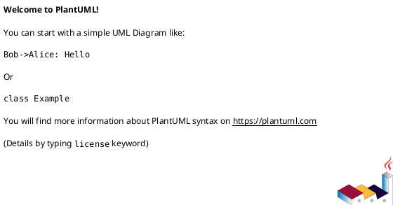

# 作業履歴 2017-01-14

## 概要

2017-01-14の作業内容をまとめています。

## コミット: 9dfbc1a

### メッセージ

```
寸法を変数で表現する #1
```

### 変更されたファイル

- A	app/assets/stylesheets/staff/_dimensions.css.scss
- M	app/assets/stylesheets/staff/container.css.scss
- M	app/assets/stylesheets/staff/layout.css.scss

### 変更内容

```diff
commit 9dfbc1a22d7c11cd19ef215a526e3b784c2e2b59
Author: k2works <kakimomokuri@gmail.com>
Date:   Sat Jan 14 14:18:08 2017 +0900

    寸法を変数で表現する #1

diff --git a/app/assets/stylesheets/staff/_dimensions.css.scss b/app/assets/stylesheets/staff/_dimensions.css.scss
new file mode 100644
index 0000000..8d4d2dd
--- /dev/null
+++ b/app/assets/stylesheets/staff/_dimensions.css.scss
@@ -0,0 +1,18 @@
+/* マージン、パディング */
+
+$narrow: 2px;
+$moderate: 6px;
+$wide: 10px;
+$very_wide: 20px;
+
+/* フォントサイズ */
+
+$tiny: 8px;
+$small: 10px;
+$normal: 12px;
+$large: 16px;
+$huge: 20px;
+
+/* 行の高さ */
+
+$standard_line_height: 16px;
diff --git a/app/assets/stylesheets/staff/container.css.scss b/app/assets/stylesheets/staff/container.css.scss
index d638edf..901cb2a 100644
--- a/app/assets/stylesheets/staff/container.css.scss
+++ b/app/assets/stylesheets/staff/container.css.scss
@@ -1,11 +1,12 @@
 @import "colors";
+@import "dimensions";
 
 div.wrapper {
   div.container {
     h1 {
       margin: 0;
-      padding: 9px 6px;
-      font-size: 16px;
+      padding: $moderate * 1.5 $moderate;
+      font-size: $large;
       font-weight: normal;
       background-color: $very_dark_cyan;
       color: $light_gray;
diff --git a/app/assets/stylesheets/staff/layout.css.scss b/app/assets/stylesheets/staff/layout.css.scss
index 19e9e46..3682fa0 100644
--- a/app/assets/stylesheets/staff/layout.css.scss
+++ b/app/assets/stylesheets/staff/layout.css.scss
@@ -1,4 +1,5 @@
 @import "colors";
+@import "dimensions";
 
 html, body {
   margin: 0;
@@ -10,11 +11,11 @@ div.wrapper {
   box-sizing: border-box;
   min-height: 100%;
   margin: 0 auto;
-  padding-bottom: 20px;
+  padding-bottom: ($wide + $moderate) * 2 + $standard_line_height;
   background-color: $gray;
 }
 header {
-  padding: 5px;
+  padding: $moderate;
   background-color: $dark_cyan;
   color: $very_light_gray;
   span.logo-mark {
@@ -29,7 +30,7 @@ footer {
   color: $very_light_gray;
   p {
     text-align: center;
-    padding: 5px;
+    padding: $moderate;
     margin: 0;
   }
 }

```

## コミット: c2cd80d

### メッセージ

```
色を変数で表現する #1
```

### 変更されたファイル

- A	app/assets/stylesheets/staff/_colors.css.scss
- M	app/assets/stylesheets/staff/container.css.scss
- M	app/assets/stylesheets/staff/layout.css.scss

### 変更内容

```diff
commit c2cd80d7f5ab2f5f7477f7bcad9948e56af1c1b2
Author: k2works <kakimomokuri@gmail.com>
Date:   Sat Jan 14 14:12:55 2017 +0900

    色を変数で表現する #1

diff --git a/app/assets/stylesheets/staff/_colors.css.scss b/app/assets/stylesheets/staff/_colors.css.scss
new file mode 100644
index 0000000..11d6a3d
--- /dev/null
+++ b/app/assets/stylesheets/staff/_colors.css.scss
@@ -0,0 +1,11 @@
+/* グレー系 */
+
+$dark_gray: #666666;
+$gray: #cccccc;
+$light_gray: #eeeeee;
+$very_light_gray: #fafafa;
+
+/* シアン系 */
+
+$dark_cyan: #448888;
+$very_dark_cyan: darken($dark_cyan, 25%);
diff --git a/app/assets/stylesheets/staff/container.css.scss b/app/assets/stylesheets/staff/container.css.scss
index 365483c..d638edf 100644
--- a/app/assets/stylesheets/staff/container.css.scss
+++ b/app/assets/stylesheets/staff/container.css.scss
@@ -1,3 +1,5 @@
+@import "colors";
+
 div.wrapper {
   div.container {
     h1 {
@@ -5,8 +7,8 @@ div.wrapper {
       padding: 9px 6px;
       font-size: 16px;
       font-weight: normal;
-      background-color: #1a3333;
-      color: #eeeeee;
+      background-color: $very_dark_cyan;
+      color: $light_gray;
     }
   }
 }
diff --git a/app/assets/stylesheets/staff/layout.css.scss b/app/assets/stylesheets/staff/layout.css.scss
index 1ef288d..19e9e46 100644
--- a/app/assets/stylesheets/staff/layout.css.scss
+++ b/app/assets/stylesheets/staff/layout.css.scss
@@ -1,3 +1,5 @@
+@import "colors";
+
 html, body {
   margin: 0;
   padding: 0;
@@ -9,12 +11,12 @@ div.wrapper {
   min-height: 100%;
   margin: 0 auto;
   padding-bottom: 20px;
-  background-color: #cccccc;
+  background-color: $gray;
 }
 header {
   padding: 5px;
-  background-color: #448888;
-  color: #eeeeee;
+  background-color: $dark_cyan;
+  color: $very_light_gray;
   span.logo-mark {
     font-weight: bold;
   }
@@ -23,8 +25,8 @@ footer {
   bottom: 0;
   position: absolute;
   width: 100%;
-  background-color: #666666;
-  color: #eeeeee;
+  background-color: $dark_gray;
+  color: $very_light_gray;
   p {
     text-align: center;
     padding: 5px;

```

## コミット: 99a7b4f

### メッセージ

```
見出し(h1要素)のスタイル #1
```

### 変更されたファイル

- A	app/assets/stylesheets/staff/container.css.scss
- M	app/views/layouts/staff.html.erb

### 変更内容

```diff
commit 99a7b4f3999a8c732a80ac519ba7b026f0d36e1d
Author: k2works <kakimomokuri@gmail.com>
Date:   Sat Jan 14 13:56:44 2017 +0900

    見出し(h1要素)のスタイル #1

diff --git a/app/assets/stylesheets/staff/container.css.scss b/app/assets/stylesheets/staff/container.css.scss
new file mode 100644
index 0000000..365483c
--- /dev/null
+++ b/app/assets/stylesheets/staff/container.css.scss
@@ -0,0 +1,12 @@
+div.wrapper {
+  div.container {
+    h1 {
+      margin: 0;
+      padding: 9px 6px;
+      font-size: 16px;
+      font-weight: normal;
+      background-color: #1a3333;
+      color: #eeeeee;
+    }
+  }
+}
diff --git a/app/views/layouts/staff.html.erb b/app/views/layouts/staff.html.erb
index 5790280..3994f4a 100644
--- a/app/views/layouts/staff.html.erb
+++ b/app/views/layouts/staff.html.erb
@@ -10,7 +10,7 @@
   <body>
     <div class="wrapper">
       <%= render 'shared/header' %>
-      <div id="container">
+      <div class="container">
         <%= yield %>
       </div>
       <%= render 'shared/footer' %>

```

## コミット: 68443ae

### メッセージ

```
ヘッダとフッタのスタイル #1
```

### 変更されたファイル

- M	app/assets/stylesheets/staff/layout.css.scss

### 変更内容

```diff
commit 68443ae38141093fb07c2bca5db425a5a9dab8ff
Author: k2works <kakimomokuri@gmail.com>
Date:   Sat Jan 14 13:51:55 2017 +0900

    ヘッダとフッタのスタイル #1

diff --git a/app/assets/stylesheets/staff/layout.css.scss b/app/assets/stylesheets/staff/layout.css.scss
index a5c944e..1ef288d 100644
--- a/app/assets/stylesheets/staff/layout.css.scss
+++ b/app/assets/stylesheets/staff/layout.css.scss
@@ -11,3 +11,23 @@ div.wrapper {
   padding-bottom: 20px;
   background-color: #cccccc;
 }
+header {
+  padding: 5px;
+  background-color: #448888;
+  color: #eeeeee;
+  span.logo-mark {
+    font-weight: bold;
+  }
+}
+footer {
+  bottom: 0;
+  position: absolute;
+  width: 100%;
+  background-color: #666666;
+  color: #eeeeee;
+  p {
+    text-align: center;
+    padding: 5px;
+    margin: 0;
+  }
+}

```

## コミット: 7a42803

### メッセージ

```
スタイルシートの切り替え #1
```

### 変更されたファイル

- M	.idea/misc.xml
- M	Gemfile.lock
- D	app/assets/stylesheets/application.css
- A	app/assets/stylesheets/staff.css
- A	app/assets/stylesheets/staff/layout.css.scss
- M	app/controllers/application_controller.rb
- M	baukis-kai.iml
- M	config/initializers/assets.rb

### 変更内容

```diff
commit 7a428034c067741161cc03baffe07908056f3fc3
Author: k2works <kakimomokuri@gmail.com>
Date:   Sat Jan 14 13:45:19 2017 +0900

    スタイルシートの切り替え #1

diff --git a/.idea/misc.xml b/.idea/misc.xml
index 6997697..5e26784 100644
--- a/.idea/misc.xml
+++ b/.idea/misc.xml
@@ -1,57 +1,6 @@
 <?xml version="1.0" encoding="UTF-8"?>
 <project version="4">
-  <component name="ProjectRootManager" version="2" languageLevel="JDK_1_8" default="true" project-jdk-name="rbenv: 2.4.0" project-jdk-type="RUBY_SDK">
+  <component name="ProjectRootManager" version="2" languageLevel="JDK_1_3" default="false" project-jdk-name="rbenv: 2.4.0" project-jdk-type="RUBY_SDK">
     <output url="file://$PROJECT_DIR$/out" />
   </component>
-  <component name="masterDetails">
-    <states>
-      <state key="GlobalLibrariesConfigurable.UI">
-        <settings>
-          <last-edited>actionmailer (v3.2.13, rbenv: 2.1.10) [gem]</last-edited>
-          <splitter-proportions>
-            <option name="proportions">
-              <list>
-                <option value="0.2" />
-              </list>
-            </option>
-          </splitter-proportions>
-        </settings>
-      </state>
-      <state key="JdkListConfigurable.UI">
-        <settings>
-          <last-edited>rbenv: 2.1.2</last-edited>
-          <splitter-proportions>
-            <option name="proportions">
-              <list>
-                <option value="0.2" />
-              </list>
-            </option>
-          </splitter-proportions>
-        </settings>
-      </state>
-      <state key="ProjectJDKs.UI">
-        <settings>
-          <last-edited>1.8</last-edited>
-          <splitter-proportions>
-            <option name="proportions">
-              <list>
-                <option value="0.2" />
-              </list>
-            </option>
-          </splitter-proportions>
-        </settings>
-      </state>
-      <state key="ProjectLibrariesConfigurable.UI">
-        <settings>
-          <splitter-proportions>
-            <option name="proportions">
-              <list>
-                <option value="0.2" />
-              </list>
-            </option>
-          </splitter-proportions>
-        </settings>
-      </state>
-    </states>
-  </component>
 </project>
\ No newline at end of file
diff --git a/Gemfile.lock b/Gemfile.lock
index 22b35e1..3746378 100644
--- a/Gemfile.lock
+++ b/Gemfile.lock
@@ -290,5 +290,8 @@ DEPENDENCIES
   web-console (>= 3.3.0)
   yard
 
+RUBY VERSION
+   ruby 2.4.0p0
+
 BUNDLED WITH
    1.13.7
diff --git a/app/assets/stylesheets/application.css b/app/assets/stylesheets/application.css
deleted file mode 100644
index 0ebd7fe..0000000
--- a/app/assets/stylesheets/application.css
+++ /dev/null
@@ -1,15 +0,0 @@
-/*
- * This is a manifest file that'll be compiled into application.css, which will include all the files
- * listed below.
- *
- * Any CSS and SCSS file within this directory, lib/assets/stylesheets, vendor/assets/stylesheets,
- * or any plugin's vendor/assets/stylesheets directory can be referenced here using a relative path.
- *
- * You're free to add application-wide styles to this file and they'll appear at the bottom of the
- * compiled file so the styles you add here take precedence over styles defined in any other CSS/SCSS
- * files in this directory. Styles in this file should be added after the last require_* statement.
- * It is generally better to create a new file per style scope.
- *
- *= require_tree .
- *= require_self
- */
diff --git a/app/assets/stylesheets/staff.css b/app/assets/stylesheets/staff.css
new file mode 100644
index 0000000..d043395
--- /dev/null
+++ b/app/assets/stylesheets/staff.css
@@ -0,0 +1,3 @@
+/*
+ *= require_tree ./staff
+ */
diff --git a/app/assets/stylesheets/staff/layout.css.scss b/app/assets/stylesheets/staff/layout.css.scss
new file mode 100644
index 0000000..a5c944e
--- /dev/null
+++ b/app/assets/stylesheets/staff/layout.css.scss
@@ -0,0 +1,13 @@
+html, body {
+  margin: 0;
+  padding: 0;
+  height: 100%;
+}
+div.wrapper {
+  position: relative;
+  box-sizing: border-box;
+  min-height: 100%;
+  margin: 0 auto;
+  padding-bottom: 20px;
+  background-color: #cccccc;
+}
diff --git a/app/controllers/application_controller.rb b/app/controllers/application_controller.rb
index 1c07694..1b2c7e6 100644
--- a/app/controllers/application_controller.rb
+++ b/app/controllers/application_controller.rb
@@ -1,3 +1,14 @@
 class ApplicationController < ActionController::Base
   protect_from_forgery with: :exception
+
+  layout :set_layout
+
+  private
+  def set_layout
+    if params[:controller].match(%r{\A(staff|admin|customer)/})
+      Regexp.last_match[1]
+    else
+      'customer'
+    end
+  end
 end
diff --git a/app/views/layouts/application.html.erb b/app/views/layouts/staff.html.erb
similarity index 80%
rename from app/views/layouts/application.html.erb
rename to app/views/layouts/staff.html.erb
index 65895dc..5790280 100644
--- a/app/views/layouts/application.html.erb
+++ b/app/views/layouts/staff.html.erb
@@ -3,7 +3,7 @@
   <head>
     <title><%= document_title %></title>
     <%= csrf_meta_tags %>
-    <%= stylesheet_link_tag    'application', media: 'all', 'data-turbolinks-track': 'reload' %>
+    <%= stylesheet_link_tag    'staff', media: 'all', 'data-turbolinks-track': 'reload' %>
     <%= javascript_include_tag 'application', 'data-turbolinks-track': 'reload' %>
   </head>
 
diff --git a/baukis-kai.iml b/baukis-kai.iml
index e1c054c..1808fb8 100644
--- a/baukis-kai.iml
+++ b/baukis-kai.iml
@@ -20,113 +20,113 @@
       <excludeFolder url="file://$MODULE_DIR$/tmp" />
       <excludeFolder url="file://$MODULE_DIR$/vendor/bundle" />
     </content>
-    <orderEntry type="jdk" jdkName="rbenv: 2.4.0" jdkType="RUBY_SDK" />
+    <orderEntry type="jdk" jdkName="Remote:ruby-2.4.0-p0" jdkType="RUBY_SDK" />
     <orderEntry type="sourceFolder" forTests="false" />
-    <orderEntry type="library" scope="PROVIDED" name="actioncable (v5.0.1, rbenv: 2.4.0) [gem]" level="application" />
-    <orderEntry type="library" scope="PROVIDED" name="actionmailer (v5.0.1, rbenv: 2.4.0) [gem]" level="application" />
-    <orderEntry type="library" scope="PROVIDED" name="actionpack (v5.0.1, rbenv: 2.4.0) [gem]" level="application" />
-    <orderEntry type="library" scope="PROVIDED" name="actionview (v5.0.1, rbenv: 2.4.0) [gem]" level="application" />
-    <orderEntry type="library" scope="PROVIDED" name="activejob (v5.0.1, rbenv: 2.4.0) [gem]" level="application" />
-    <orderEntry type="library" scope="PROVIDED" name="activemodel (v5.0.1, rbenv: 2.4.0) [gem]" level="application" />
-    <orderEntry type="library" scope="PROVIDED" name="activerecord (v5.0.1, rbenv: 2.4.0) [gem]" level="application" />
-    <orderEntry type="library" scope="PROVIDED" name="activesupport (v5.0.1, rbenv: 2.4.0) [gem]" level="application" />
-    <orderEntry type="library" scope="PROVIDED" name="addressable (v2.5.0, rbenv: 2.4.0) [gem]" level="application" />
-    <orderEntry type="library" scope="PROVIDED" name="annotate (v2.6.5, rbenv: 2.4.0) [gem]" level="application" />
-    <orderEntry type="library" scope="PROVIDED" name="arel (v7.1.4, rbenv: 2.4.0) [gem]" level="application" />
-    <orderEntry type="library" scope="PROVIDED" name="better_errors (v2.1.1, rbenv: 2.4.0) [gem]" level="application" />
-    <orderEntry type="library" scope="PROVIDED" name="binding_of_caller (v0.7.2, rbenv: 2.4.0) [gem]" level="application" />
-    <orderEntry type="library" scope="PROVIDED" name="builder (v3.2.2, rbenv: 2.4.0) [gem]" level="application" />
-    <orderEntry type="library" scope="PROVIDED" name="bundler (v1.13.7, rbenv: 2.4.0) [gem]" level="application" />
-    <orderEntry type="library" scope="PROVIDED" name="byebug (v9.0.6, rbenv: 2.4.0) [gem]" level="application" />
-    <orderEntry type="library" scope="PROVIDED" name="capybara (v2.5.0, rbenv: 2.4.0) [gem]" level="application" />
-    <orderEntry type="library" scope="PROVIDED" name="capybara-screenshot (v1.0.14, rbenv: 2.4.0) [gem]" level="application" />
-    <orderEntry type="library" scope="PROVIDED" name="capybara-webkit (v1.11.1, rbenv: 2.4.0) [gem]" level="application" />
-    <orderEntry type="library" scope="PROVIDED" name="childprocess (v0.5.9, rbenv: 2.4.0) [gem]" level="application" />
-    <orderEntry type="library" scope="PROVIDED" name="choice (v0.2.0, rbenv: 2.4.0) [gem]" level="application" />
-    <orderEntry type="library" scope="PROVIDED" name="coderay (v1.1.1, rbenv: 2.4.0) [gem]" level="application" />
-    <orderEntry type="library" scope="PROVIDED" name="coffee-rails (v4.2.1, rbenv: 2.4.0) [gem]" level="application" />
-    <orderEntry type="library" scope="PROVIDED" name="coffee-script (v2.4.1, rbenv: 2.4.0) [gem]" level="application" />
-    <orderEntry type="library" scope="PROVIDED" name="coffee-script-source (v1.12.2, rbenv: 2.4.0) [gem]" level="application" />
-    <orderEntry type="library" scope="PROVIDED" name="concurrent-ruby (v1.0.4, rbenv: 2.4.0) [gem]" level="application" />
-    <orderEntry type="library" scope="PROVIDED" name="database_cleaner (v1.3.0, rbenv: 2.4.0) [gem]" level="application" />
-    <orderEntry type="library" scope="PROVIDED" name="debase (v0.2.1, rbenv: 2.4.0) [gem]" level="application" />
-    <orderEntry type="library" scope="PROVIDED" name="debase-ruby_core_source (v0.9.6, rbenv: 2.4.0) [gem]" level="application" />
-    <orderEntry type="library" scope="PROVIDED" name="debug_inspector (v0.0.2, rbenv: 2.4.0) [gem]" level="application" />
-    <orderEntry type="library" scope="PROVIDED" name="diff-lcs (v1.2.5, rbenv: 2.4.0) [gem]" level="application" />
-    <orderEntry type="library" scope="PROVIDED" name="enum_help (v0.0.16, rbenv: 2.4.0) [gem]" level="application" />
-    <orderEntry type="library" scope="PROVIDED" name="erubis (v2.7.0, rbenv: 2.4.0) [gem]" level="application" />
-    <orderEntry type="library" scope="PROVIDED" name="execjs (v2.7.0, rbenv: 2.4.0) [gem]" level="application" />
-    <orderEntry type="library" scope="PROVIDED" name="factory_girl (v4.8.0, rbenv: 2.4.0) [gem]" level="application" />
-    <orderEntry type="library" scope="PROVIDED" name="factory_girl_rails (v4.8.0, rbenv: 2.4.0) [gem]" level="application" />
-    <orderEntry type="library" scope="PROVIDED" name="faker (v1.4.3, rbenv: 2.4.0) [gem]" level="application" />
-    <orderEntry type="library" scope="PROVIDED" name="ffi (v1.9.14, rbenv: 2.4.0) [gem]" level="application" />
-    <orderEntry type="library" scope="PROVIDED" name="font-awesome-rails (v4.7.0.1, rbenv: 2.4.0) [gem]" level="application" />
-    <orderEntry type="library" scope="PROVIDED" name="globalid (v0.3.7, rbenv: 2.4.0) [gem]" level="application" />
-    <orderEntry type="library" scope="PROVIDED" name="i18n (v0.7.0, rbenv: 2.4.0) [gem]" level="application" />
-    <orderEntry type="library" scope="PROVIDED" name="i18n_generators (v2.1.1, rbenv: 2.4.0) [gem]" level="application" />
-    <orderEntry type="library" scope="PROVIDED" name="jbuilder (v2.6.1, rbenv: 2.4.0) [gem]" level="application" />
-    <orderEntry type="library" scope="PROVIDED" name="jquery-rails (v4.2.2, rbenv: 2.4.0) [gem]" level="application" />
-    <orderEntry type="library" scope="PROVIDED" name="launchy (v2.4.3, rbenv: 2.4.0) [gem]" level="application" />
-    <orderEntry type="library" scope="PROVIDED" name="listen (v3.0.8, rbenv: 2.4.0) [gem]" level="application" />
-    <orderEntry type="library" scope="PROVIDED" name="loofah (v2.0.3, rbenv: 2.4.0) [gem]" level="application" />
-    <orderEntry type="library" scope="PROVIDED" name="mail (v2.6.4, rbenv: 2.4.0) [gem]" level="application" />
-    <orderEntry type="library" scope="PROVIDED" name="method_source (v0.8.2, rbenv: 2.4.0) [gem]" level="application" />
-    <orderEntry type="library" scope="PROVIDED" name="migration_comments (v0.4.1, rbenv: 2.4.0) [gem]" level="application" />
-    <orderEntry type="library" scope="PROVIDED" name="mime-types (v3.1, rbenv: 2.4.0) [gem]" level="application" />
-    <orderEntry type="library" scope="PROVIDED" name="mime-types-data (v3.2016.0521, rbenv: 2.4.0) [gem]" level="application" />
-    <orderEntry type="library" scope="PROVIDED" name="mini_portile2 (v2.1.0, rbenv: 2.4.0) [gem]" level="application" />
-    <orderEntry type="library" scope="PROVIDED" name="minitest (v5.10.1, rbenv: 2.4.0) [gem]" level="application" />
-    <orderEntry type="library" scope="PROVIDED" name="multi_json (v1.12.1, rbenv: 2.4.0) [gem]" level="application" />
-    <orderEntry type="library" scope="PROVIDED" name="mysql2 (v0.4.5, rbenv: 2.4.0) [gem]" level="application" />
-    <orderEntry type="library" scope="PROVIDED" name="nio4r (v1.2.1, rbenv: 2.4.0) [gem]" level="application" />
-    <orderEntry type="library" scope="PROVIDED" name="nokogiri (v1.7.0.1, rbenv: 2.4.0) [gem]" level="application" />
-    <orderEntry type="library" scope="PROVIDED" name="pg (v0.19.0, rbenv: 2.4.0) [gem]" level="application" />
-    <orderEntry type="library" scope="PROVIDED" name="public_suffix (v2.0.5, rbenv: 2.4.0) [gem]" level="application" />
-    <orderEntry type="library" scope="PROVIDED" name="puma (v3.6.2, rbenv: 2.4.0) [gem]" level="application" />
-    <orderEntry type="library" scope="PROVIDED" name="rack (v2.0.1, rbenv: 2.4.0) [gem]" level="application" />
-    <orderEntry type="library" scope="PROVIDED" name="rack-dev-mark (v0.7.5, rbenv: 2.4.0) [gem]" level="application" />
-    <orderEntry type="library" scope="PROVIDED" name="rack-test (v0.6.3, rbenv: 2.4.0) [gem]" level="application" />
-    <orderEntry type="library" scope="PROVIDED" name="rails (v5.0.1, rbenv: 2.4.0) [gem]" level="application" />
-    <orderEntry type="library" scope="PROVIDED" name="rails-dom-testing (v2.0.2, rbenv: 2.4.0) [gem]" level="application" />
-    <orderEntry type="library" scope="PROVIDED" name="rails-erd (v1.5.0, rbenv: 2.4.0) [gem]" level="application" />
-    <orderEntry type="library" scope="PROVIDED" name="rails-html-sanitizer (v1.0.3, rbenv: 2.4.0) [gem]" level="application" />
-    <orderEntry type="library" scope="PROVIDED" name="rails_12factor (v0.0.3, rbenv: 2.4.0) [gem]" level="application" />
-    <orderEntry type="library" scope="PROVIDED" name="rails_serve_static_assets (v0.0.5, rbenv: 2.4.0) [gem]" level="application" />
-    <orderEntry type="library" scope="PROVIDED" name="rails_stdout_logging (v0.0.5, rbenv: 2.4.0) [gem]" level="application" />
-    <orderEntry type="library" scope="PROVIDED" name="railties (v5.0.1, rbenv: 2.4.0) [gem]" level="application" />
-    <orderEntry type="library" scope="PROVIDED" name="rake (v12.0.0, rbenv: 2.4.0) [gem]" level="application" />
-    <orderEntry type="library" scope="PROVIDED" name="rb-fsevent (v0.9.8, rbenv: 2.4.0) [gem]" level="application" />
-    <orderEntry type="library" scope="PROVIDED" name="rb-inotify (v0.9.7, rbenv: 2.4.0) [gem]" level="application" />
-    <orderEntry type="library" scope="PROVIDED" name="rspec-core (v3.5.4, rbenv: 2.4.0) [gem]" level="application" />
-    <orderEntry type="library" scope="PROVIDED" name="rspec-expectations (v3.5.0, rbenv: 2.4.0) [gem]" level="application" />
-    <orderEntry type="library" scope="PROVIDED" name="rspec-mocks (v3.5.0, rbenv: 2.4.0) [gem]" level="application" />
-    <orderEntry type="library" scope="PROVIDED" name="rspec-rails (v3.5.2, rbenv: 2.4.0) [gem]" level="application" />
-    <orderEntry type="library" scope="PROVIDED" name="rspec-support (v3.5.0, rbenv: 2.4.0) [gem]" level="application" />
-    <orderEntry type="library" scope="PROVIDED" name="ruby-graphviz (v1.2.2, rbenv: 2.4.0) [gem]" level="application" />
-    <orderEntry type="library" scope="PROVIDED" name="rubyzip (v1.2.0, rbenv: 2.4.0) [gem]" level="application" />
-    <orderEntry type="library" scope="PROVIDED" name="sass (v3.4.23, rbenv: 2.4.0) [gem]" level="application" />
-    <orderEntry type="library" scope="PROVIDED" name="sass-rails (v5.0.6, rbenv: 2.4.0) [gem]" level="application" />
-    <orderEntry type="library" scope="PROVIDED" name="selenium-webdriver (v3.0.5, rbenv: 2.4.0) [gem]" level="application" />
-    <orderEntry type="library" scope="PROVIDED" name="shoulda-matchers (v2.6.2, rbenv: 2.4.0) [gem]" level="application" />
-    <orderEntry type="library" scope="PROVIDED" name="spring (v2.0.0, rbenv: 2.4.0) [gem]" level="application" />
-    <orderEntry type="library" scope="PROVIDED" name="spring-commands-rspec (v1.0.4, rbenv: 2.4.0) [gem]" level="application" />
-    <orderEntry type="library" scope="PROVIDED" name="spring-watcher-listen (v2.0.1, rbenv: 2.4.0) [gem]" level="application" />
-    <orderEntry type="library" scope="PROVIDED" name="sprockets (v3.7.1, rbenv: 2.4.0) [gem]" level="application" />
-    <orderEntry type="library" scope="PROVIDED" name="sprockets-rails (v3.2.0, rbenv: 2.4.0) [gem]" level="application" />
-    <orderEntry type="library" scope="PROVIDED" name="sqlite3 (v1.3.12, rbenv: 2.4.0) [gem]" level="application" />
-    <orderEntry type="library" scope="PROVIDED" name="thor (v0.19.4, rbenv: 2.4.0) [gem]" level="application" />
-    <orderEntry type="library" scope="PROVIDED" name="thread_safe (v0.3.5, rbenv: 2.4.0) [gem]" level="application" />
-    <orderEntry type="library" scope="PROVIDED" name="tilt (v2.0.5, rbenv: 2.4.0) [gem]" level="application" />
-    <orderEntry type="library" scope="PROVIDED" name="turbolinks (v5.0.1, rbenv: 2.4.0) [gem]" level="application" />
-    <orderEntry type="library" scope="PROVIDED" name="turbolinks-source (v5.0.0, rbenv: 2.4.0) [gem]" level="application" />
-    <orderEntry type="library" scope="PROVIDED" name="tzinfo (v1.2.2, rbenv: 2.4.0) [gem]" level="application" />
-    <orderEntry type="library" scope="PROVIDED" name="uglifier (v3.0.4, rbenv: 2.4.0) [gem]" level="application" />
-    <orderEntry type="library" scope="PROVIDED" name="web-console (v3.4.0, rbenv: 2.4.0) [gem]" level="application" />
-    <orderEntry type="library" scope="PROVIDED" name="websocket (v1.2.3, rbenv: 2.4.0) [gem]" level="application" />
-    <orderEntry type="library" scope="PROVIDED" name="websocket-driver (v0.6.4, rbenv: 2.4.0) [gem]" level="application" />
-    <orderEntry type="library" scope="PROVIDED" name="websocket-extensions (v0.1.2, rbenv: 2.4.0) [gem]" level="application" />
-    <orderEntry type="library" scope="PROVIDED" name="xpath (v2.0.0, rbenv: 2.4.0) [gem]" level="application" />
-    <orderEntry type="library" scope="PROVIDED" name="yard (v0.9.7, rbenv: 2.4.0) [gem]" level="application" />
+    <orderEntry type="library" scope="PROVIDED" name="actioncable (v5.0.1, Remote:ruby-2.4.0-p0) [gem]" level="application" />
+    <orderEntry type="library" scope="PROVIDED" name="actionmailer (v5.0.1, Remote:ruby-2.4.0-p0) [gem]" level="application" />
+    <orderEntry type="library" scope="PROVIDED" name="actionpack (v5.0.1, Remote:ruby-2.4.0-p0) [gem]" level="application" />
+    <orderEntry type="library" scope="PROVIDED" name="actionview (v5.0.1, Remote:ruby-2.4.0-p0) [gem]" level="application" />
+    <orderEntry type="library" scope="PROVIDED" name="activejob (v5.0.1, Remote:ruby-2.4.0-p0) [gem]" level="application" />
+    <orderEntry type="library" scope="PROVIDED" name="activemodel (v5.0.1, Remote:ruby-2.4.0-p0) [gem]" level="application" />
+    <orderEntry type="library" scope="PROVIDED" name="activerecord (v5.0.1, Remote:ruby-2.4.0-p0) [gem]" level="application" />
+    <orderEntry type="library" scope="PROVIDED" name="activesupport (v5.0.1, Remote:ruby-2.4.0-p0) [gem]" level="application" />
+    <orderEntry type="library" scope="PROVIDED" name="addressable (v2.5.0, Remote:ruby-2.4.0-p0) [gem]" level="application" />
+    <orderEntry type="library" scope="PROVIDED" name="annotate (v2.6.5, Remote:ruby-2.4.0-p0) [gem]" level="application" />
+    <orderEntry type="library" scope="PROVIDED" name="arel (v7.1.4, Remote:ruby-2.4.0-p0) [gem]" level="application" />
+    <orderEntry type="library" scope="PROVIDED" name="better_errors (v2.1.1, Remote:ruby-2.4.0-p0) [gem]" level="application" />
+    <orderEntry type="library" scope="PROVIDED" name="binding_of_caller (v0.7.2, Remote:ruby-2.4.0-p0) [gem]" level="application" />
+    <orderEntry type="library" scope="PROVIDED" name="builder (v3.2.2, Remote:ruby-2.4.0-p0) [gem]" level="application" />
+    <orderEntry type="library" scope="PROVIDED" name="bundler (v1.13.7, Remote:ruby-2.4.0-p0) [gem]" level="application" />
+    <orderEntry type="library" scope="PROVIDED" name="byebug (v9.0.6, Remote:ruby-2.4.0-p0) [gem]" level="application" />
+    <orderEntry type="library" scope="PROVIDED" name="capybara (v2.5.0, Remote:ruby-2.4.0-p0) [gem]" level="application" />
+    <orderEntry type="library" scope="PROVIDED" name="capybara-screenshot (v1.0.14, Remote:ruby-2.4.0-p0) [gem]" level="application" />
+    <orderEntry type="library" scope="PROVIDED" name="capybara-webkit (v1.11.1, Remote:ruby-2.4.0-p0) [gem]" level="application" />
+    <orderEntry type="library" scope="PROVIDED" name="childprocess (v0.5.9, Remote:ruby-2.4.0-p0) [gem]" level="application" />
+    <orderEntry type="library" scope="PROVIDED" name="choice (v0.2.0, Remote:ruby-2.4.0-p0) [gem]" level="application" />
+    <orderEntry type="library" scope="PROVIDED" name="coderay (v1.1.1, Remote:ruby-2.4.0-p0) [gem]" level="application" />
+    <orderEntry type="library" scope="PROVIDED" name="coffee-rails (v4.2.1, Remote:ruby-2.4.0-p0) [gem]" level="application" />
+    <orderEntry type="library" scope="PROVIDED" name="coffee-script (v2.4.1, Remote:ruby-2.4.0-p0) [gem]" level="application" />
+    <orderEntry type="library" scope="PROVIDED" name="coffee-script-source (v1.12.2, Remote:ruby-2.4.0-p0) [gem]" level="application" />
+    <orderEntry type="library" scope="PROVIDED" name="concurrent-ruby (v1.0.4, Remote:ruby-2.4.0-p0) [gem]" level="application" />
+    <orderEntry type="library" scope="PROVIDED" name="database_cleaner (v1.3.0, Remote:ruby-2.4.0-p0) [gem]" level="application" />
+    <orderEntry type="library" scope="PROVIDED" name="debase (v0.2.1, Remote:ruby-2.4.0-p0) [gem]" level="application" />
+    <orderEntry type="library" scope="PROVIDED" name="debase-ruby_core_source (v0.9.6, Remote:ruby-2.4.0-p0) [gem]" level="application" />
+    <orderEntry type="library" scope="PROVIDED" name="debug_inspector (v0.0.2, Remote:ruby-2.4.0-p0) [gem]" level="application" />
+    <orderEntry type="library" scope="PROVIDED" name="diff-lcs (v1.2.5, Remote:ruby-2.4.0-p0) [gem]" level="application" />
+    <orderEntry type="library" scope="PROVIDED" name="enum_help (v0.0.16, Remote:ruby-2.4.0-p0) [gem]" level="application" />
+    <orderEntry type="library" scope="PROVIDED" name="erubis (v2.7.0, Remote:ruby-2.4.0-p0) [gem]" level="application" />
+    <orderEntry type="library" scope="PROVIDED" name="execjs (v2.7.0, Remote:ruby-2.4.0-p0) [gem]" level="application" />
+    <orderEntry type="library" scope="PROVIDED" name="factory_girl (v4.8.0, Remote:ruby-2.4.0-p0) [gem]" level="application" />
+    <orderEntry type="library" scope="PROVIDED" name="factory_girl_rails (v4.8.0, Remote:ruby-2.4.0-p0) [gem]" level="application" />
+    <orderEntry type="library" scope="PROVIDED" name="faker (v1.4.3, Remote:ruby-2.4.0-p0) [gem]" level="application" />
+    <orderEntry type="library" scope="PROVIDED" name="ffi (v1.9.14, Remote:ruby-2.4.0-p0) [gem]" level="application" />
+    <orderEntry type="library" scope="PROVIDED" name="font-awesome-rails (v4.7.0.1, Remote:ruby-2.4.0-p0) [gem]" level="application" />
+    <orderEntry type="library" scope="PROVIDED" name="globalid (v0.3.7, Remote:ruby-2.4.0-p0) [gem]" level="application" />
+    <orderEntry type="library" scope="PROVIDED" name="i18n (v0.7.0, Remote:ruby-2.4.0-p0) [gem]" level="application" />
+    <orderEntry type="library" scope="PROVIDED" name="i18n_generators (v2.1.1, Remote:ruby-2.4.0-p0) [gem]" level="application" />
+    <orderEntry type="library" scope="PROVIDED" name="jbuilder (v2.6.1, Remote:ruby-2.4.0-p0) [gem]" level="application" />
+    <orderEntry type="library" scope="PROVIDED" name="jquery-rails (v4.2.2, Remote:ruby-2.4.0-p0) [gem]" level="application" />
+    <orderEntry type="library" scope="PROVIDED" name="launchy (v2.4.3, Remote:ruby-2.4.0-p0) [gem]" level="application" />
+    <orderEntry type="library" scope="PROVIDED" name="listen (v3.0.8, Remote:ruby-2.4.0-p0) [gem]" level="application" />
+    <orderEntry type="library" scope="PROVIDED" name="loofah (v2.0.3, Remote:ruby-2.4.0-p0) [gem]" level="application" />
+    <orderEntry type="library" scope="PROVIDED" name="mail (v2.6.4, Remote:ruby-2.4.0-p0) [gem]" level="application" />
+    <orderEntry type="library" scope="PROVIDED" name="method_source (v0.8.2, Remote:ruby-2.4.0-p0) [gem]" level="application" />
+    <orderEntry type="library" scope="PROVIDED" name="migration_comments (v0.4.1, Remote:ruby-2.4.0-p0) [gem]" level="application" />
+    <orderEntry type="library" scope="PROVIDED" name="mime-types (v3.1, Remote:ruby-2.4.0-p0) [gem]" level="application" />
+    <orderEntry type="library" scope="PROVIDED" name="mime-types-data (v3.2016.0521, Remote:ruby-2.4.0-p0) [gem]" level="application" />
+    <orderEntry type="library" scope="PROVIDED" name="mini_portile2 (v2.1.0, Remote:ruby-2.4.0-p0) [gem]" level="application" />
+    <orderEntry type="library" scope="PROVIDED" name="minitest (v5.10.1, Remote:ruby-2.4.0-p0) [gem]" level="application" />
+    <orderEntry type="library" scope="PROVIDED" name="multi_json (v1.12.1, Remote:ruby-2.4.0-p0) [gem]" level="application" />
+    <orderEntry type="library" scope="PROVIDED" name="mysql2 (v0.4.5, Remote:ruby-2.4.0-p0) [gem]" level="application" />
+    <orderEntry type="library" scope="PROVIDED" name="nio4r (v1.2.1, Remote:ruby-2.4.0-p0) [gem]" level="application" />
+    <orderEntry type="library" scope="PROVIDED" name="nokogiri (v1.7.0.1, Remote:ruby-2.4.0-p0) [gem]" level="application" />
+    <orderEntry type="library" scope="PROVIDED" name="pg (v0.19.0, Remote:ruby-2.4.0-p0) [gem]" level="application" />
+    <orderEntry type="library" scope="PROVIDED" name="public_suffix (v2.0.5, Remote:ruby-2.4.0-p0) [gem]" level="application" />
+    <orderEntry type="library" scope="PROVIDED" name="puma (v3.6.2, Remote:ruby-2.4.0-p0) [gem]" level="application" />
+    <orderEntry type="library" scope="PROVIDED" name="rack (v2.0.1, Remote:ruby-2.4.0-p0) [gem]" level="application" />
+    <orderEntry type="library" scope="PROVIDED" name="rack-dev-mark (v0.7.5, Remote:ruby-2.4.0-p0) [gem]" level="application" />
+    <orderEntry type="library" scope="PROVIDED" name="rack-test (v0.6.3, Remote:ruby-2.4.0-p0) [gem]" level="application" />
+    <orderEntry type="library" scope="PROVIDED" name="rails (v5.0.1, Remote:ruby-2.4.0-p0) [gem]" level="application" />
+    <orderEntry type="library" scope="PROVIDED" name="rails-dom-testing (v2.0.2, Remote:ruby-2.4.0-p0) [gem]" level="application" />
+    <orderEntry type="library" scope="PROVIDED" name="rails-erd (v1.5.0, Remote:ruby-2.4.0-p0) [gem]" level="application" />
+    <orderEntry type="library" scope="PROVIDED" name="rails-html-sanitizer (v1.0.3, Remote:ruby-2.4.0-p0) [gem]" level="application" />
+    <orderEntry type="library" scope="PROVIDED" name="rails_12factor (v0.0.3, Remote:ruby-2.4.0-p0) [gem]" level="application" />
+    <orderEntry type="library" scope="PROVIDED" name="rails_serve_static_assets (v0.0.5, Remote:ruby-2.4.0-p0) [gem]" level="application" />
+    <orderEntry type="library" scope="PROVIDED" name="rails_stdout_logging (v0.0.5, Remote:ruby-2.4.0-p0) [gem]" level="application" />
+    <orderEntry type="library" scope="PROVIDED" name="railties (v5.0.1, Remote:ruby-2.4.0-p0) [gem]" level="application" />
+    <orderEntry type="library" scope="PROVIDED" name="rake (v12.0.0, Remote:ruby-2.4.0-p0) [gem]" level="application" />
+    <orderEntry type="library" scope="PROVIDED" name="rb-fsevent (v0.9.8, Remote:ruby-2.4.0-p0) [gem]" level="application" />
+    <orderEntry type="library" scope="PROVIDED" name="rb-inotify (v0.9.7, Remote:ruby-2.4.0-p0) [gem]" level="application" />
+    <orderEntry type="library" scope="PROVIDED" name="rspec-core (v3.5.4, Remote:ruby-2.4.0-p0) [gem]" level="application" />
+    <orderEntry type="library" scope="PROVIDED" name="rspec-expectations (v3.5.0, Remote:ruby-2.4.0-p0) [gem]" level="application" />
+    <orderEntry type="library" scope="PROVIDED" name="rspec-mocks (v3.5.0, Remote:ruby-2.4.0-p0) [gem]" level="application" />
+    <orderEntry type="library" scope="PROVIDED" name="rspec-rails (v3.5.2, Remote:ruby-2.4.0-p0) [gem]" level="application" />
+    <orderEntry type="library" scope="PROVIDED" name="rspec-support (v3.5.0, Remote:ruby-2.4.0-p0) [gem]" level="application" />
+    <orderEntry type="library" scope="PROVIDED" name="ruby-graphviz (v1.2.2, Remote:ruby-2.4.0-p0) [gem]" level="application" />
+    <orderEntry type="library" scope="PROVIDED" name="rubyzip (v1.2.0, Remote:ruby-2.4.0-p0) [gem]" level="application" />
+    <orderEntry type="library" scope="PROVIDED" name="sass (v3.4.23, Remote:ruby-2.4.0-p0) [gem]" level="application" />
+    <orderEntry type="library" scope="PROVIDED" name="sass-rails (v5.0.6, Remote:ruby-2.4.0-p0) [gem]" level="application" />
+    <orderEntry type="library" scope="PROVIDED" name="selenium-webdriver (v3.0.5, Remote:ruby-2.4.0-p0) [gem]" level="application" />
+    <orderEntry type="library" scope="PROVIDED" name="shoulda-matchers (v2.6.2, Remote:ruby-2.4.0-p0) [gem]" level="application" />
+    <orderEntry type="library" scope="PROVIDED" name="spring (v2.0.0, Remote:ruby-2.4.0-p0) [gem]" level="application" />
+    <orderEntry type="library" scope="PROVIDED" name="spring-commands-rspec (v1.0.4, Remote:ruby-2.4.0-p0) [gem]" level="application" />
+    <orderEntry type="library" scope="PROVIDED" name="spring-watcher-listen (v2.0.1, Remote:ruby-2.4.0-p0) [gem]" level="application" />
+    <orderEntry type="library" scope="PROVIDED" name="sprockets (v3.7.1, Remote:ruby-2.4.0-p0) [gem]" level="application" />
+    <orderEntry type="library" scope="PROVIDED" name="sprockets-rails (v3.2.0, Remote:ruby-2.4.0-p0) [gem]" level="application" />
+    <orderEntry type="library" scope="PROVIDED" name="sqlite3 (v1.3.12, Remote:ruby-2.4.0-p0) [gem]" level="application" />
+    <orderEntry type="library" scope="PROVIDED" name="thor (v0.19.4, Remote:ruby-2.4.0-p0) [gem]" level="application" />
+    <orderEntry type="library" scope="PROVIDED" name="thread_safe (v0.3.5, Remote:ruby-2.4.0-p0) [gem]" level="application" />
+    <orderEntry type="library" scope="PROVIDED" name="tilt (v2.0.5, Remote:ruby-2.4.0-p0) [gem]" level="application" />
+    <orderEntry type="library" scope="PROVIDED" name="turbolinks (v5.0.1, Remote:ruby-2.4.0-p0) [gem]" level="application" />
+    <orderEntry type="library" scope="PROVIDED" name="turbolinks-source (v5.0.0, Remote:ruby-2.4.0-p0) [gem]" level="application" />
+    <orderEntry type="library" scope="PROVIDED" name="tzinfo (v1.2.2, Remote:ruby-2.4.0-p0) [gem]" level="application" />
+    <orderEntry type="library" scope="PROVIDED" name="uglifier (v3.0.4, Remote:ruby-2.4.0-p0) [gem]" level="application" />
+    <orderEntry type="library" scope="PROVIDED" name="web-console (v3.4.0, Remote:ruby-2.4.0-p0) [gem]" level="application" />
+    <orderEntry type="library" scope="PROVIDED" name="websocket (v1.2.3, Remote:ruby-2.4.0-p0) [gem]" level="application" />
+    <orderEntry type="library" scope="PROVIDED" name="websocket-driver (v0.6.4, Remote:ruby-2.4.0-p0) [gem]" level="application" />
+    <orderEntry type="library" scope="PROVIDED" name="websocket-extensions (v0.1.2, Remote:ruby-2.4.0-p0) [gem]" level="application" />
+    <orderEntry type="library" scope="PROVIDED" name="xpath (v2.0.0, Remote:ruby-2.4.0-p0) [gem]" level="application" />
+    <orderEntry type="library" scope="PROVIDED" name="yard (v0.9.7, Remote:ruby-2.4.0-p0) [gem]" level="application" />
   </component>
   <component name="RModuleSettingsStorage">
     <LOAD_PATH number="0" />
diff --git a/config/initializers/assets.rb b/config/initializers/assets.rb
index 01ef3e6..9bc9783 100644
--- a/config/initializers/assets.rb
+++ b/config/initializers/assets.rb
@@ -8,4 +8,4 @@ Rails.application.config.assets.version = '1.0'
 
 # Precompile additional assets.
 # application.js, application.css, and all non-JS/CSS in app/assets folder are already added.
-# Rails.application.config.assets.precompile += %w( search.js )
+Rails.application.config.assets.precompile += %w( staff.css )

```

### 構造変更



## コミット: 8e5777b

### メッセージ

```
Sass/SCSS #1
```

### 変更されたファイル

- M	README.md

### 変更内容

```diff
commit 8e5777be434a9519f1902a81b822417e7971184e
Author: k2works <kakimomokuri@gmail.com>
Date:   Sat Jan 14 13:03:38 2017 +0900

    Sass/SCSS #1

diff --git a/README.md b/README.md
index 7c65ac3..4cc0dcd 100644
--- a/README.md
+++ b/README.md
@@ -90,6 +90,16 @@ git push heroku master
 + 部分テンプレート
 + ヘルパーメソッドの定義
 
+#### Sass/SCSS
++ アセットパイプライン
++ Sass/SCSSとは
++ スタイルシートの切り替え
++ ヘッダとフッタのスタイル
++ 見出し(h1要素)のスタイル
++ 色を変数で表現する
++ 寸法を変数で表現する
++ アセットのプリコンパイル
+
 ### エラーページ
 ### ユーザー認証
 ### ユーザー認証

```

## コミット: 3301a1d

### メッセージ

```
仮設トップページ
```

### 変更されたファイル

- M	README.md

### 変更内容

```diff
commit 3301a1d6c0b73e0ee5261c9ada380821aec45c4e
Author: k2works <kakimomokuri@gmail.com>
Date:   Sat Jan 14 12:19:25 2017 +0900

    仮設トップページ

diff --git a/README.md b/README.md
index 218c068..7c65ac3 100644
--- a/README.md
+++ b/README.md
@@ -1,6 +1,6 @@
 Baukis 改
 ===================
-[](https://circleci.com/gh/k2works/baukis-kai) [](https://raw.githubusercontent.com/k2works/baukis-kai/master/MIT-LICENSE.txt) 
+[](https://circleci.com/gh/k2works/baukis-kai) [](https://raw.githubusercontent.com/k2works/baukis-kai/master/MIT-LICENSE.txt)
 
 # 目的 #
 [実践Ruby on Rails 4 現場のプロから学ぶ本格Webプログラミング](https://www.amazon.co.jp/%E5%AE%9F%E8%B7%B5Ruby-Rails-4-%E7%8F%BE%E5%A0%B4%E3%81%AE%E3%83%97%E3%83%AD%E3%81%8B%E3%82%89%E5%AD%A6%E3%81%B6%E6%9C%AC%E6%A0%BCWeb%E3%83%97%E3%83%AD%E3%82%B0%E3%83%A9%E3%83%9F%E3%83%B3%E3%82%B0-%E9%BB%92%E7%94%B0/dp/4844335928)をRails5での実装及びフロント部分にモダンCSS設計(BEM)を組み込む
@@ -41,7 +41,7 @@ Baukis 改
    1. [Capybra](#Capybara)
    1. [フォームオブジェクト](#フォームオブジェクト)
    1. [検索フォーム](#検索フォーム)
-   
+
 ## アプリケーション環境構築
 ### Vagarntのセットアップ
 ```
@@ -82,6 +82,7 @@ git push heroku master
 **[⬆ back to top](#構成)**
 ## アプリケーション開発
 ### ビジュアルデザイン
+#### 仮設トップページ
 + ルーティングの設定
 + コントローラとアクションの作成
 + ERBテンプレートの作成

```

## コミット: 7afd187

### メッセージ

```
ヘルパーメソッドの定義
```

### 変更されたファイル

- M	app/helpers/application_helper.rb
- M	app/views/layouts/application.html.erb

### 変更内容

```diff
commit 7afd187d405f538fa08a5a3aaa6cbb416684d31e
Author: k2works <kakimomokuri@gmail.com>
Date:   Sat Jan 14 12:17:49 2017 +0900

    ヘルパーメソッドの定義

diff --git a/app/helpers/application_helper.rb b/app/helpers/application_helper.rb
index de6be79..b4a86ef 100644
--- a/app/helpers/application_helper.rb
+++ b/app/helpers/application_helper.rb
@@ -1,2 +1,9 @@
 module ApplicationHelper
+  def document_title
+    if @title.present?
+      "#{@title} - BaukisKai"
+    else
+      'BaukisKai'
+    end
+  end
 end
diff --git a/app/views/layouts/application.html.erb b/app/views/layouts/application.html.erb
index 729a430..65895dc 100644
--- a/app/views/layouts/application.html.erb
+++ b/app/views/layouts/application.html.erb
@@ -1,9 +1,8 @@
 <!DOCTYPE html>
 <html>
   <head>
-    <title>BaukisKai</title>
+    <title><%= document_title %></title>
     <%= csrf_meta_tags %>
-
     <%= stylesheet_link_tag    'application', media: 'all', 'data-turbolinks-track': 'reload' %>
     <%= javascript_include_tag 'application', 'data-turbolinks-track': 'reload' %>
   </head>

```

## コミット: c26ab9e

### メッセージ

```
部分テンプレート
```

### 変更されたファイル

- M	app/views/layouts/application.html.erb
- A	app/views/shared/_footer.html.erb
- A	app/views/shared/_header.html.erb

### 変更内容

```diff
commit c26ab9e3b0c282f07092dff94274cfd16a9dd870
Author: k2works <kakimomokuri@gmail.com>
Date:   Sat Jan 14 12:07:04 2017 +0900

    部分テンプレート

diff --git a/app/views/layouts/application.html.erb b/app/views/layouts/application.html.erb
index 3986591..729a430 100644
--- a/app/views/layouts/application.html.erb
+++ b/app/views/layouts/application.html.erb
@@ -9,6 +9,12 @@
   </head>
 
   <body>
-    <%= yield %>
+    <div class="wrapper">
+      <%= render 'shared/header' %>
+      <div id="container">
+        <%= yield %>
+      </div>
+      <%= render 'shared/footer' %>
+    </div>
   </body>
 </html>
diff --git a/app/views/shared/_footer.html.erb b/app/views/shared/_footer.html.erb
new file mode 100644
index 0000000..ad0aaa0
--- /dev/null
+++ b/app/views/shared/_footer.html.erb
@@ -0,0 +1,3 @@
+<footer>
+  <p>Powered by BAUKIS KAI &copy; 2014 k2works</p>
+</footer>
diff --git a/app/views/shared/_header.html.erb b/app/views/shared/_header.html.erb
new file mode 100644
index 0000000..e774ae8
--- /dev/null
+++ b/app/views/shared/_header.html.erb
@@ -0,0 +1,3 @@
+<header>
+  <span class="logo-mark">BAUKIS KAI</span>
+</header>

```

## コミット: 73e91db

### メッセージ

```
ERBテンプレートの作成
```

### 変更されたファイル

- A	app/views/admin/top/index.html.erb
- A	app/views/customer/top/index.html.erb
- A	app/views/staff/top/index.html.erb

### 変更内容

```diff
commit 73e91db01e78225061fe58b7cf1e61175e01747f
Author: k2works <kakimomokuri@gmail.com>
Date:   Sat Jan 14 11:47:10 2017 +0900

    ERBテンプレートの作成

diff --git a/app/views/admin/top/index.html.erb b/app/views/admin/top/index.html.erb
new file mode 100644
index 0000000..4a793fe
--- /dev/null
+++ b/app/views/admin/top/index.html.erb
@@ -0,0 +1,2 @@
+<% @title = '管理者トップページ' %>
+<h1><%= @title %></h1>
\ No newline at end of file
diff --git a/app/views/customer/top/index.html.erb b/app/views/customer/top/index.html.erb
new file mode 100644
index 0000000..a57dbd7
--- /dev/null
+++ b/app/views/customer/top/index.html.erb
@@ -0,0 +1,2 @@
+<% @title = '顧客トップページ' %>
+<h1><%= @title %></h1>
\ No newline at end of file
diff --git a/app/views/staff/top/index.html.erb b/app/views/staff/top/index.html.erb
new file mode 100644
index 0000000..e4d87bc
--- /dev/null
+++ b/app/views/staff/top/index.html.erb
@@ -0,0 +1,2 @@
+<% @title = '職員トップページ' %>
+<h1><%= @title %></h1>
\ No newline at end of file

```

## コミット: 7bc348a

### メッセージ

```
コントローラとアクションの作成
```

### 変更されたファイル

- A	app/controllers/admin/top_controller.rb
- A	app/controllers/customer/top_controller.rb
- A	app/controllers/staff/top_controller.rb

### 変更内容

```diff
commit 7bc348a44c363258f50170e662bc8b0a11855e09
Author: k2works <kakimomokuri@gmail.com>
Date:   Sat Jan 14 11:36:45 2017 +0900

    コントローラとアクションの作成

diff --git a/app/controllers/admin/top_controller.rb b/app/controllers/admin/top_controller.rb
new file mode 100644
index 0000000..d9a88b5
--- /dev/null
+++ b/app/controllers/admin/top_controller.rb
@@ -0,0 +1,5 @@
+class Admin::TopController < ApplicationController
+  def index
+    render action: 'index'
+  end
+end
diff --git a/app/controllers/customer/top_controller.rb b/app/controllers/customer/top_controller.rb
new file mode 100644
index 0000000..9fc6012
--- /dev/null
+++ b/app/controllers/customer/top_controller.rb
@@ -0,0 +1,5 @@
+class Customer::TopController < ApplicationController
+  def index
+    render action: 'index'
+  end
+end
diff --git a/app/controllers/staff/top_controller.rb b/app/controllers/staff/top_controller.rb
new file mode 100644
index 0000000..290f42f
--- /dev/null
+++ b/app/controllers/staff/top_controller.rb
@@ -0,0 +1,5 @@
+class Staff::TopController < ApplicationController
+  def index
+    render action: 'index'
+  end
+end

```

### 構造変更


## コミット: 96519f2

### メッセージ

```
ルーティングの設定
```

### 変更されたファイル

- M	config/routes.rb

### 変更内容

```diff
commit 96519f2acbd2dda85e5e89ccb1f4de1ef1c0071c
Author: k2works <kakimomokuri@gmail.com>
Date:   Sat Jan 14 11:21:54 2017 +0900

    ルーティングの設定

diff --git a/config/routes.rb b/config/routes.rb
index 787824f..de42cfb 100644
--- a/config/routes.rb
+++ b/config/routes.rb
@@ -1,3 +1,13 @@
 Rails.application.routes.draw do
-  # For details on the DSL available within this file, see http://guides.rubyonrails.org/routing.html
+  namespace :staff do
+    root 'top#index'
+  end
+
+  namespace :admin do
+    root 'top#index'
+  end
+
+  namespace :customer do
+    root 'top#index'
+  end
 end

```

## コミット: fc189a1

### メッセージ

```
ビジュアルデザイン
```

### 変更されたファイル

- M	README.md

### 変更内容

```diff
commit fc189a17c5f377687c5ec1408e747eab7eb9710d
Author: k2works <kakimomokuri@gmail.com>
Date:   Sat Jan 14 10:42:16 2017 +0900

    ビジュアルデザイン

diff --git a/README.md b/README.md
index a0fc0b4..218c068 100644
--- a/README.md
+++ b/README.md
@@ -82,6 +82,13 @@ git push heroku master
 **[⬆ back to top](#構成)**
 ## アプリケーション開発
 ### ビジュアルデザイン
++ ルーティングの設定
++ コントローラとアクションの作成
++ ERBテンプレートの作成
++ レイアウト
++ 部分テンプレート
++ ヘルパーメソッドの定義
+
 ### エラーページ
 ### ユーザー認証
 ### ユーザー認証

```

