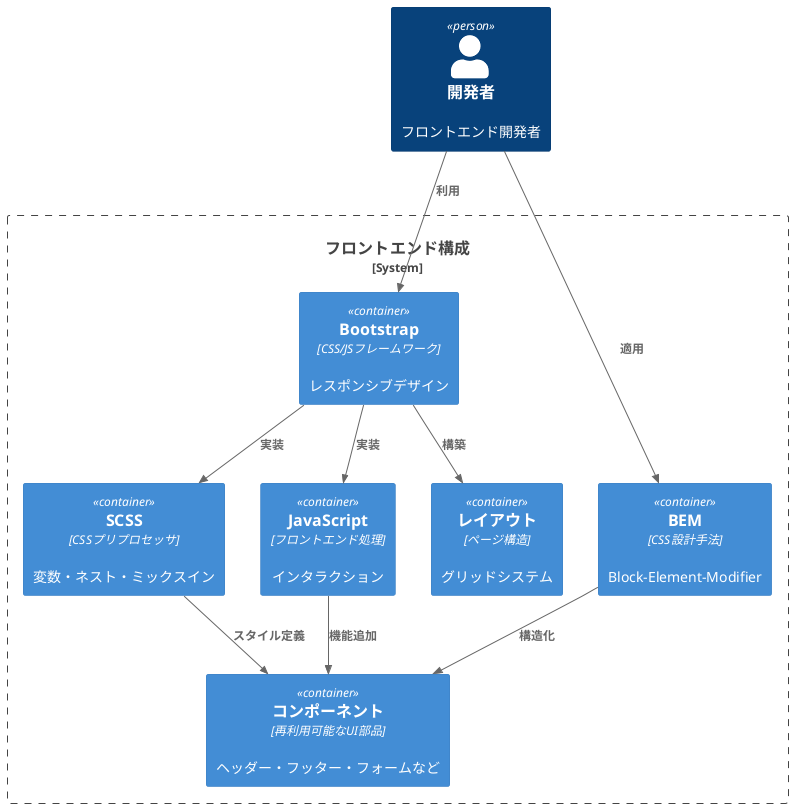
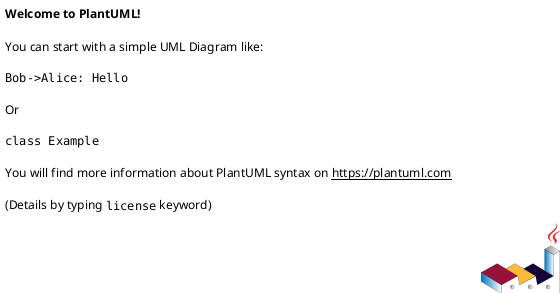

# 作業履歴 2017-01-16

## 概要

2017-01-16の作業内容をまとめています。このジャーナルでは、フロントエンドフレームワークの導入とモダンCSS設計（BEM）の実装に関する作業を記録しています。

## フロントエンド構成図



## 作業内容

### Bootstrapの導入とBEM設計の適用

フロントエンド開発の効率化と一貫性を確保するため、Bootstrapフレームワークを導入し、BEM（Block-Element-Modifier）設計手法を適用しました。これにより、保守性の高いCSSコードとレスポンシブなUIを実現しています。

#### 変更点の概要

1. Bootstrapの導入
   - bootstrap-sassとbootstrap_formのGem追加
   - JavaScriptとSCSSの設定
   - カスタマイズ用SCSSファイルの作成

2. BEM設計の適用
   - コンポーネントベースのSCSS構造
   - Block、Element、Modifierの命名規則の適用
   - SCSSファイルの整理と構造化

## コミット: b512963

### メッセージ

```
Bootstrap組み込み
```

### 変更されたファイル

- M	Gemfile
- M	Gemfile.lock
- M	README.md
- M	app/assets/javascripts/application.js
- A	app/assets/stylesheets/components/_bootstrap-custom.scss
- M	app/assets/stylesheets/main.scss
- M	baukis-kai.iml

### 変更内容

```diff
commit b512963731553809f7a476b0b48f073e33c9f947
Author: k2works <kakimomokuri@gmail.com>
Date:   Mon Jan 16 17:58:11 2017 +0900

    Bootstrap組み込み

diff --git a/Gemfile b/Gemfile
index 94f25f0..1f609ad 100644
--- a/Gemfile
+++ b/Gemfile
@@ -83,3 +83,5 @@ gem 'font-awesome-rails'
 gem 'rails_12factor', group: :production
 gem 'rack-dev-mark'
 gem 'enum_help'
+gem 'bootstrap-sass', '~> 3.3.6'
+gem 'bootstrap_form'
\ No newline at end of file
diff --git a/Gemfile.lock b/Gemfile.lock
index 0bcaa5d..f06af1b 100644
--- a/Gemfile.lock
+++ b/Gemfile.lock
@@ -44,12 +44,18 @@ GEM
       activerecord (>= 2.3.0)
       rake (>= 0.8.7)
     arel (7.1.4)
+    autoprefixer-rails (6.6.1)
+      execjs
     better_errors (2.1.1)
       coderay (>= 1.0.0)
       erubis (>= 2.6.6)
       rack (>= 0.9.0)
     binding_of_caller (0.7.2)
       debug_inspector (>= 0.0.1)
+    bootstrap-sass (3.3.7)
+      autoprefixer-rails (>= 5.2.1)
+      sass (>= 3.3.4)
+    bootstrap_form (2.5.3)
     builder (3.2.2)
     byebug (9.0.6)
     capybara (2.5.0)
@@ -286,6 +292,8 @@ DEPENDENCIES
   annotate
   better_errors
   binding_of_caller
+  bootstrap-sass (~> 3.3.6)
+  bootstrap_form
   byebug
   capybara (~> 2.5.0)
   capybara-screenshot
diff --git a/README.md b/README.md
index 843e4b6..e23f947 100644
--- a/README.md
+++ b/README.md
@@ -328,4 +328,6 @@ git push heroku master
 # 参照 #
 + [実践Ruby on Rails 4 現場のプロから学ぶ本格Webプログラミング](https://www.amazon.co.jp/%E5%AE%9F%E8%B7%B5Ruby-Rails-4-%E7%8F%BE%E5%A0%B4%E3%81%AE%E3%83%97%E3%83%AD%E3%81%8B%E3%82%89%E5%AD%A6%E3%81%B6%E6%9C%AC%E6%A0%BCWeb%E3%83%97%E3%83%AD%E3%82%B0%E3%83%A9%E3%83%9F%E3%83%B3%E3%82%B0-%E9%BB%92%E7%94%B0/dp/4844335928)
 + [現場のプロが本気で教える HTML/CSSデザイン講義](https://www.amazon.co.jp/dp/B01K3SZGR0/ref=dp-kindle-redirect?_encoding=UTF8&btkr=1)
-+ [現場のプロが本気で教える HTML/CSSデザイン講義 サンプルデータ](https://github.com/basara669/html_css_book)
\ No newline at end of file
++ [現場のプロが本気で教える HTML/CSSデザイン講義 サンプルデータ](https://github.com/basara669/html_css_book)
++ [Bootstrap for Sass](https://github.com/twbs/bootstrap-sass)
++ [Rails Bootstrap Forms](https://github.com/bootstrap-ruby/rails-bootstrap-forms)
\ No newline at end of file
diff --git a/app/assets/javascripts/application.js b/app/assets/javascripts/application.js
index b12018d..759d92e 100644
--- a/app/assets/javascripts/application.js
+++ b/app/assets/javascripts/application.js
@@ -13,4 +13,5 @@
 //= require jquery
 //= require jquery_ujs
 //= require turbolinks
+//= require bootstrap-sprockets
 //= require_tree .
diff --git a/app/assets/stylesheets/components/_bootstrap-custom.scss b/app/assets/stylesheets/components/_bootstrap-custom.scss
new file mode 100644
index 0000000..00ac39a
--- /dev/null
+++ b/app/assets/stylesheets/components/_bootstrap-custom.scss
@@ -0,0 +1,59 @@
+/*!
+ * Bootstrap v3.3.6 (http://getbootstrap.com)
+ * Copyright 2011-2015 Twitter, Inc.
+ * Licensed under MIT (https://github.com/twbs/bootstrap/blob/master/LICENSE)
+ */
+
+// Core variables and mixins
+@import "bootstrap/variables";
+@import "bootstrap/mixins";
+
+// Reset and dependencies
+@import "bootstrap/normalize";
+@import "bootstrap/print";
+@import "bootstrap/glyphicons";
+
+// Core CSS
+@import "bootstrap/scaffolding";
+@import "bootstrap/type";
+@import "bootstrap/code";
+@import "bootstrap/grid";
+@import "bootstrap/tables";
+@import "bootstrap/forms";
+@import "bootstrap/buttons";
+
+// Components
+@import "bootstrap/component-animations";
+@import "bootstrap/dropdowns";
+@import "bootstrap/button-groups";
+@import "bootstrap/input-groups";
+@import "bootstrap/navs";
+@import "bootstrap/navbar";
+@import "bootstrap/breadcrumbs";
+@import "bootstrap/pagination";
+@import "bootstrap/pager";
+@import "bootstrap/labels";
+@import "bootstrap/badges";
+@import "bootstrap/jumbotron";
+@import "bootstrap/thumbnails";
+@import "bootstrap/alerts";
+@import "bootstrap/progress-bars";
+@import "bootstrap/media";
+@import "bootstrap/list-group";
+@import "bootstrap/panels";
+@import "bootstrap/responsive-embed";
+@import "bootstrap/wells";
+@import "bootstrap/close";
+
+// Components w/ JavaScript
+@import "bootstrap/modals";
+@import "bootstrap/tooltip";
+@import "bootstrap/popovers";
+@import "bootstrap/carousel";
+
+// Utility classes
+@import "bootstrap/utilities";
+@import "bootstrap/responsive-utilities";
+
+@import "rails_bootstrap_forms";
+@import "./base/reset";
\ No newline at end of file
diff --git a/app/assets/stylesheets/main.scss b/app/assets/stylesheets/main.scss
index 02d93af..8e0ff1d 100644
--- a/app/assets/stylesheets/main.scss
+++ b/app/assets/stylesheets/main.scss
@@ -63,7 +63,9 @@

 //font-awesome
 @import "font-awesome";
-
+//BootStrap
+@import "bootstrap-sprockets";
+@import "components/bootstrap-custom";
 // ===========================
 // Pages
 // ===========================
diff --git a/baukis-kai.iml b/baukis-kai.iml
index bb892a7..ea1f98f 100644
--- a/baukis-kai.iml
+++ b/baukis-kai.iml
@@ -33,8 +33,11 @@
     <orderEntry type="library" scope="PROVIDED" name="addressable (v2.5.0, rbenv: 2.4.0) [gem]" level="application" />
     <orderEntry type="library" scope="PROVIDED" name="annotate (v2.6.5, rbenv: 2.4.0) [gem]" level="application" />
     <orderEntry type="library" scope="PROVIDED" name="arel (v7.1.4, rbenv: 2.4.0) [gem]" level="application" />
+    <orderEntry type="library" scope="PROVIDED" name="autoprefixer-rails (v6.6.1, rbenv: 2.4.0) [gem]" level="application" />
     <orderEntry type="library" scope="PROVIDED" name="better_errors (v2.1.1, rbenv: 2.4.0) [gem]" level="application" />
     <orderEntry type="library" scope="PROVIDED" name="binding_of_caller (v0.7.2, rbenv: 2.4.0) [gem]" level="application" />
+    <orderEntry type="library" scope="PROVIDED" name="bootstrap-sass (v3.3.7, rbenv: 2.4.0) [gem]" level="application" />
+    <orderEntry type="library" scope="PROVIDED" name="bootstrap_form (v2.5.3, rbenv: 2.4.0) [gem]" level="application" />
     <orderEntry type="library" scope="PROVIDED" name="builder (v3.2.2, rbenv: 2.4.0) [gem]" level="application" />
     <orderEntry type="library" scope="PROVIDED" name="bundler (v1.13.7, rbenv: 2.4.0) [gem]" level="application" />
     <orderEntry type="library" scope="PROVIDED" name="byebug (v9.0.6, rbenv: 2.4.0) [gem]" level="application" />

```

## コミット: 6fe06df

### メッセージ

```
リファクタリング（リンク追加）
```

### 変更されたファイル

- M	app/views/shared/_footer.html.erb
- M	app/views/shared/_header.html.erb
- M	app/views/staff/top/index.html.erb

### 変更内容

```diff
commit 6fe06df5411fa0d7d4a6471719a7784f8c4cb509
Author: k2works <kakimomokuri@gmail.com>
Date:   Mon Jan 16 17:26:14 2017 +0900

    リファクタリング（リンク追加）

diff --git a/app/views/shared/_footer.html.erb b/app/views/shared/_footer.html.erb
index 308c006..8aa429a 100644
--- a/app/views/shared/_footer.html.erb
+++ b/app/views/shared/_footer.html.erb
@@ -1,12 +1,12 @@
 <footer class="Footer">
   <div class="l-row l-column">
     <div class="Footer__head">
-      <a href="./" class="logo">BAUKIS KAI</a>
+      <%= link_to('BAUKIS KAI', staff_root_url, class:'logo') %>
       <ul class="Menu Menu--sub">
         <li><a href="#" class="Menu__item">Services</a></li>
         <li><a href="#" class="Menu__item">Work</a></li>
         <li><a href="#" class="Menu__item">About us</a></li>
-        <li><a href="#" class="Menu__item">Blog</a></li>
+        <li><%= link_to('Blog', staff_article_index_url,class:"Menu__item") %></li>
         <li><a href="#" class="Menu__item">Contact</a></li>
       </ul>
     </div>
diff --git a/app/views/shared/_header.html.erb b/app/views/shared/_header.html.erb
index 898aaff..cb460e5 100644
--- a/app/views/shared/_header.html.erb
+++ b/app/views/shared/_header.html.erb
@@ -3,14 +3,14 @@
     <%= fa_icon 'bars' %>
   </div>
   <div class="Header__head">
-    <h1 class="logo">BAUKIS KAI</h1>
+    <h1 class="logo"><%= link_to('BAUKIS KAI', staff_root_url, class:'logo') %></h1>
   </div>
   <nav class="Header__body SpMenu">
     <ul class="Menu">
       <li class="Menu__item"><a href="#">Services</a></li>
       <li class="Menu__item"><a href="#">Work</a></li>
       <li class="Menu__item"><a href="#">About</a></li>
-      <li class="Menu__item"><a href="#">Blog</a></li>
+      <li class="Menu__item"><%= link_to('Blog', staff_article_index_url) %></li>
       <li class="Menu__item"><a href="#">Contact</a></li>
     </ul>
   </nav>
diff --git a/app/views/staff/top/index.html.erb b/app/views/staff/top/index.html.erb
index 1c180af..1dba71a 100644
--- a/app/views/staff/top/index.html.erb
+++ b/app/views/staff/top/index.html.erb
@@ -1,7 +1,6 @@
 <% @title = '職員トップページ' %>
 <h1><%= @title %></h1>

-
 <div class="ImageSlide Section">
   <ul id="Slide" class="ImageSlide__main">
     <li class="ImageSlide__item js-slide-item">
@@ -38,7 +37,7 @@
         <div class="EntryPanel__body">
           大切なあの方にありがとうを届けたい。心も体も温まる素敵なギフト。プレゼントキャンペーン実施中！
         </div>
-        <div class="EntryPanel__foot"><a href="#" class="button">READ MORE</a></div>
+        <div class="EntryPanel__foot"><%= link_to('READ MORE',staff_campaign_index_url,class:"button") %></div>
       </div>
     </div>

@@ -51,7 +50,7 @@
         <div class="EntryPanel__body">
           今話題の人気店、Macaron'n Thingsのパンケーキを使ったコラボ商品のセットメニューを販売中。
         </div>
-        <div class="EntryPanel__foot"><a href="#" class="button">READ MORE</a></div>
+        <div class="EntryPanel__foot"><%= link_to('READ MORE',staff_campaign_index_url,class:"button") %></div>
       </div>
     </div>
   </div>
@@ -109,34 +108,34 @@
       </a>
     </div>
   </div>
+</section>

-  <section class="Section l-column">
-    <div class="Section__head">
-      <h2 class="sectionLabel">News</h2>
-    </div>
-    <ol class="NewsList">
-      <li class="NewsList__item">
-        <time class="NewsList__head" datatime="2016-10-12">2016.10.12</time>
-        <span class="NewsList__body">「かぼちゃタルト」「ヘーゼルナッツラテ」「ストロベリーブラウニー」「ハニーソイラテ」「たっぷりチーズときのこのパニーニ」新発売。</span>
-      </li>
-      <li class="NewsList__item">
-        <time class="NewsList__head" datatime="2016-09-01">2016.09.01</time>
-        <span class="NewsList__body">営業時間変更に関するお知らせ</span>
-      </li>
-      <li class="NewsList__item">
-        <time class="NewsList__head" datatime="2016-08-20">2016.08.20</time>
-        <span class="NewsList__body">鎌倉店ニューオープン</span>
-      </li>
-      <li class="NewsList__item">
-        <time class="NewsList__head" datatime="2016-08-10">2016.08.10</time>
-        <span class="NewsList__body">夏季限定。マンゴースムージー発売</span>
-      </li>
-      <li class="NewsList__item">
-        <time class="NewsList__head" datatime="2016-04-02">2016.04.02</time>
-        <span class="NewsList__body">[期間限定]さくら抹茶ラテ販売開始</span>
-      </li>
-    </ol>
-  </section>
+<section class="Section l-column">
+  <div class="Section__head">
+    <h2 class="sectionLabel">News</h2>
+  </div>
+  <ol class="NewsList">
+    <li class="NewsList__item">
+      <time class="NewsList__head" datatime="2016-10-12">2016.10.12</time>
+      <span class="NewsList__body">「かぼちゃタルト」「ヘーゼルナッツラテ」「ストロベリーブラウニー」「ハニーソイラテ」「たっぷりチーズときのこのパニーニ」新発売。</span>
+    </li>
+    <li class="NewsList__item">
+      <time class="NewsList__head" datatime="2016-09-01">2016.09.01</time>
+      <span class="NewsList__body">営業時間変更に関するお知らせ</span>
+    </li>
+    <li class="NewsList__item">
+      <time class="NewsList__head" datatime="2016-08-20">2016.08.20</time>
+      <span class="NewsList__body">鎌倉店ニューオープン</span>
+    </li>
+    <li class="NewsList__item">
+      <time class="NewsList__head" datatime="2016-08-10">2016.08.10</time>
+      <span class="NewsList__body">夏季限定。マンゴースムージー発売</span>
+    </li>
+    <li class="NewsList__item">
+      <time class="NewsList__head" datatime="2016-04-02">2016.04.02</time>
+      <span class="NewsList__body">[期間限定]さくら抹茶ラテ販売開始</span>
+    </li>
+  </ol>
 </section>

 <div class="l-column u-mt60px u-mb100px">
@@ -148,4 +147,4 @@
       <%= image_tag('top/top_banner_2.jpg', class:'l-fitImg', alt:'Dummy banner') %>
     </a>
   </div>
-</div>
+</div>
\ No newline at end of file

```

## コミット: 84c7aa1

### メッセージ

```
リファクタリング（コメント追加）
```

### 変更されたファイル

- M	app/assets/stylesheets/base/_mixins.scss
- M	app/assets/stylesheets/base/_reset.scss
- M	app/assets/stylesheets/base/_variables.scss
- M	app/assets/stylesheets/components/_form.scss
- M	app/assets/stylesheets/components/_iconPanel.scss
- M	app/assets/stylesheets/components/_imageSlide.scss
- M	app/assets/stylesheets/components/_newsList.scss
- M	app/assets/stylesheets/components/_overlayPanel.scss
- M	app/assets/stylesheets/components/common/_footer.scss
- M	app/assets/stylesheets/components/common/_header.scss
- M	app/assets/stylesheets/components/common/_menu.scss
- M	app/assets/stylesheets/components/common/_section.scss
- M	app/assets/stylesheets/components/common/_sns.scss
- M	app/assets/stylesheets/components/parts/_labels.scss
- M	app/assets/stylesheets/components/parts/_layouts.scss
- M	app/assets/stylesheets/pages/_article.scss
- M	app/assets/stylesheets/pages/_campaign.scss
- M	app/assets/stylesheets/pages/_index.scss
- M	app/assets/stylesheets/utils/_arrangements.scss

### 変更内容

```diff
commit 84c7aa11c68de0f70ba5df8d796ea11c8c16fae0
Author: k2works <kakimomokuri@gmail.com>
Date:   Mon Jan 16 17:14:01 2017 +0900

    リファクタリング（コメント追加）

diff --git a/app/assets/stylesheets/base/_mixins.scss b/app/assets/stylesheets/base/_mixins.scss
index 1eb54ff..3911835 100644
--- a/app/assets/stylesheets/base/_mixins.scss
+++ b/app/assets/stylesheets/base/_mixins.scss
@@ -1,18 +1,30 @@
-//fonts
+@charset 'utf-8';
+
+// ===========================
+// Font mixins
+// ===========================
+
+/// フォント切替mixin(タイトルフォント用)
 @mixin title-font() {
   font-family: $font-sub;
   font-weight: 400;
 }
+/// フォント切替mixin(メニュー用)
 @mixin menu-font() {
   font-family: $font-sub;
   font-weight: 300;
 }
-//Media Queries
+
+/// スマートフォン表示用メディアクエリmixin
+/// @param {number} [$sp-max-width] - ブレークポイント
 @mixin mq-sp($max: $sp-max-width) {
   @media only screen and (max-width: #{$max}) {
-    @content
+    @content;
   }
 }
+
+/// デスクトップ表示用メディアクエリmixin
+/// @param {number} [$sp-max-width] - ブレークポイント
 @mixin mq-pc($min: $pc-min-width) {
   @media only screen and (min-width: #{$min}) {
     @content;
diff --git a/app/assets/stylesheets/base/_reset.scss b/app/assets/stylesheets/base/_reset.scss
index cd2af85..5ff7e11 100644
--- a/app/assets/stylesheets/base/_reset.scss
+++ b/app/assets/stylesheets/base/_reset.scss
@@ -1,3 +1,8 @@
+@charset 'utf-8';
+
+// ===========================
+// Reset
+// ===========================
 @import "./lib/sanitize";

 :root, html, body {
@@ -19,4 +24,4 @@ a {
 a:hover {
   text-decoration: none;
   color: $color-link;
-}
\ No newline at end of file
+}
diff --git a/app/assets/stylesheets/base/_variables.scss b/app/assets/stylesheets/base/_variables.scss
index 53d409c..e3a5b8a 100644
--- a/app/assets/stylesheets/base/_variables.scss
+++ b/app/assets/stylesheets/base/_variables.scss
@@ -1,19 +1,30 @@
-$color-base: #fbf7fe;
+@charset 'utf-8';
+
+// colors
+$color-white: #fff;
+$color-black: #252525;
+
+$color-base: #fbf7f3;
 $color-main-text: #474747;
 $color-link: #878378;
+
 $color-reverse-line: #fff;
 $color-reverse-fill: #252525;
-//sizes
+
+
+// sizes
 $base-content-width: 1180px;
 $space-unit: 20px;
 $sp-space-unit: 15px;
 $column-space: $space-unit*2;
-$color-black: #252525;
-$color-main-text: #474747;
-$color-white: #fff;
+
+// paths
+$image-path: "../images/";
+
+// fonts
 $font-sub: 'Lato';
-//break points
+
+// break points
 $sp-max-width: 640px;
 $pc-min-width: 641px;
-
 $sp-menu-width: 200px;
\ No newline at end of file
diff --git a/app/assets/stylesheets/components/_form.scss b/app/assets/stylesheets/components/_form.scss
index 9fe83d1..4ba9e32 100644
--- a/app/assets/stylesheets/components/_form.scss
+++ b/app/assets/stylesheets/components/_form.scss
@@ -1,3 +1,9 @@
+// =====================
+// FormStyle
+// ---------------------
+// フォーム
+// =====================
+
 .Form {
   margin: auto;
   max-width: 400px;
diff --git a/app/assets/stylesheets/components/_iconPanel.scss b/app/assets/stylesheets/components/_iconPanel.scss
index d03298e..40a9c42 100644
--- a/app/assets/stylesheets/components/_iconPanel.scss
+++ b/app/assets/stylesheets/components/_iconPanel.scss
@@ -1,26 +1,35 @@
+@charset 'utf-8';
+
+// =====================
+// IconPanel
+// ---------------------
+// アイコンつきのコンテンツメニュー
+// =====================
+
 .IconPanel {
   display: flex;
-  flex-direction: column;
   align-items: center;
+  flex-direction: column;
   cursor: pointer;
   @include mq-sp {
     display: block;
     padding: $space-unit 0;
   }
+
   &__head {
     padding: $space-unit;
-    font-size: 18px;
     text-align: center;
+    font-size: 18px;
     @include mq-sp {
+      text-align: left;
       margin-left: 52px;
       padding: 0 0 15px;
-      text-align: left;
       font-size: 16px;
     }
   }
   &__body {
-    max-width: 100%;
     padding: $space-unit*1.5;
+    max-width: 100%;
     line-height: 1.5;
     @include mq-sp {
       margin-left: 52px;
@@ -28,7 +37,7 @@
       font-size: 12px;
     }
   }
-  //Font Awesomeでアイコンを設定する
+  // font-awesomeでアイコンを設定する
   &__icon {
     margin-bottom: $space-unit;
     padding: $space-unit/2;
diff --git a/app/assets/stylesheets/components/_imageSlide.scss b/app/assets/stylesheets/components/_imageSlide.scss
index 32cd903..2c2b18d 100644
--- a/app/assets/stylesheets/components/_imageSlide.scss
+++ b/app/assets/stylesheets/components/_imageSlide.scss
@@ -1,23 +1,31 @@
-//Carousel
+@charset 'utf-8';
+
+// =====================
+// ImageSlide
+// ---------------------
+// 画像カルーセル
+// =====================
+
 .ImageSlide {
   position: relative;
   display: flex;
   flex-direction: column;
   overflow: hidden;
-  //画像のラッパー
+  // 画像のラッパー
   &__main {
     display: flex;
     flex-wrap: nowrap;
   }
-  //画像１つ分
+  // 画像1つ分
   &__item {
     flex: 0 0 80%;
   }
-  //本体画像
+  // 画像本体：高さに合わせてアス比を保つ指定
   &__image {
     width: 100%;
     height: auto;
   }
+  // インジケーター領域
   &__sub {
     position: relative;
     top: -40px;
@@ -27,27 +35,31 @@
       top: -20px;
     }
   }
+  // インジケーターの○ひとつぶん
   &__dot {
     display: block;
     overflow: hidden;
-    text-indent: 100%;
-    white-space: nowrap;
-    cursor: pointer;
+    margin-right: 20px;
     width: 20px;
     height: 20px;
     border: 1px solid $color-black;
     border-radius: 10px;
-    margin-right: 20px;
+    text-indent: 100%;
+    white-space: nowrap;
+    cursor: pointer;
     &:last-child {
       margin-right: 0;
     }
+    &:hover {
+      background: rgba($color-black, .7);
+    }
     &.isActive {
       background: $color-black;
     }
     @include mq-sp {
+      margin-right: 10px;
       width: 10px;
       height: 10px;
-      margin-right: 10px;
     }
   }
 }
\ No newline at end of file
diff --git a/app/assets/stylesheets/components/_newsList.scss b/app/assets/stylesheets/components/_newsList.scss
index 737a67b..91ec144 100644
--- a/app/assets/stylesheets/components/_newsList.scss
+++ b/app/assets/stylesheets/components/_newsList.scss
@@ -1,16 +1,28 @@
+@charset 'utf-8';
+
+// =====================
+// NewsList
+// ---------------------
+// お知らせ一覧
+// =====================
+
 .NewsList {
   display: table;
-  border-spacing: 0px $space-unit/2;
+  border-spacing: 0 $space-unit/2;
   border-collapse: separate;
   @include mq-sp {
     font-size: 12px;
   }
-  &__item {
+
+  &__item　{
     display: table-row;
   }
   &__head {
     display: table-cell;
     padding-right: $column-space;
+    @include mq-sp {
+      font-size: 12px;
+    }
   }
   &__body {
     display: table-cell;
diff --git a/app/assets/stylesheets/components/_overlayPanel.scss b/app/assets/stylesheets/components/_overlayPanel.scss
index 91c312c..6e4a31b 100644
--- a/app/assets/stylesheets/components/_overlayPanel.scss
+++ b/app/assets/stylesheets/components/_overlayPanel.scss
@@ -1,3 +1,11 @@
+@charset 'utf-8';
+
+// =====================
+// Overlay Panel
+// ---------------------
+// 写真背景の上にテキストを載せるパネル
+// =====================
+
 .OverlayPanel {
   $root: &;
   display: flex;
@@ -6,11 +14,11 @@
   align-items: center;
   width: 100%;
   padding: 10% 20%;
-  background-color: rgba(0,0,0,0.2);
+  background-color: rgba(0,0,0,.2);
   color: $color-white;
   &:hover {
-    background-color: rgba(0,0,0,0.4);
     color: $color-white;
+    background-color: rgba(0,0,0,.4);
   }
   &__head {
     margin: 0 10%;
diff --git a/app/assets/stylesheets/components/common/_footer.scss b/app/assets/stylesheets/components/common/_footer.scss
index 536a905..9cf04c1 100644
--- a/app/assets/stylesheets/components/common/_footer.scss
+++ b/app/assets/stylesheets/components/common/_footer.scss
@@ -1,3 +1,11 @@
+@charset 'utf-8';
+
+// =====================
+// Footer
+// ---------------------
+// グローバルフッター
+// =====================
+
 .Footer {
   display: flex;
   justify-content: space-between;
@@ -30,4 +38,4 @@
       color: $color-white;
     }
   }
-}
\ No newline at end of file
+}
diff --git a/app/assets/stylesheets/components/common/_header.scss b/app/assets/stylesheets/components/common/_header.scss
index f3dacfb..2a68577 100644
--- a/app/assets/stylesheets/components/common/_header.scss
+++ b/app/assets/stylesheets/components/common/_header.scss
@@ -1,3 +1,5 @@
+@charset 'utf-8';
+
 .Header {
   display: flex;
   justify-content: flex-start;
@@ -8,9 +10,9 @@
     text-align: center;
   }
   &__body {
-    flex: 3 1 auto
+    flex: 3 1 auto;
+    font-size: 16px;
   }
-  //スマートフォン用ハンバーガーボタン
   &__button {
     @include mq-pc {
       display: none;
diff --git a/app/assets/stylesheets/components/common/_menu.scss b/app/assets/stylesheets/components/common/_menu.scss
index be59a6b..0880b2c 100644
--- a/app/assets/stylesheets/components/common/_menu.scss
+++ b/app/assets/stylesheets/components/common/_menu.scss
@@ -1,3 +1,5 @@
+@charset 'utf-8';
+
 .Menu {
   display: flex;
   justify-content: space-around;
@@ -10,11 +12,13 @@
     padding: 10px 15px;
     text-transform: uppercase;
   }
+  // フッターのメニュー
   &--sub {
     flex-direction: column;
   }
 }

+
 .SpMenu {
   @include mq-sp {
     position: fixed;
@@ -23,21 +27,25 @@
     left: 0;
     z-index: -1;
     opacity: 0;
-    transition: opacity 0s 0.3s ease;
+    transition: opacity 0s .3s ease;
     .isOpened & {
       opacity: 1;
       transition: opacity 0s 0s ease;
     }
   }
+  // 本文のラッパー
   &__wrapper {
     left: 0;
     width: 100%;
+    transition: left .3s 0s ease;
     &.isOpened {
       position: fixed;
       left: $sp-menu-width;
-      box-shadow: 0 1px 10px rgba(black, 0.3);
+      z-index: 1;
+      box-shadow: 0 1px 10px rgba(black, .3);
     }
   }
+  // メニュー以外の部分をタップでメニュー開閉するためのオーバーレイ
   &__overlay {
     position: relative;
     display: none;
diff --git a/app/assets/stylesheets/components/common/_section.scss b/app/assets/stylesheets/components/common/_section.scss
index d8a3d1e..e89cfb5 100644
--- a/app/assets/stylesheets/components/common/_section.scss
+++ b/app/assets/stylesheets/components/common/_section.scss
@@ -1,3 +1,11 @@
+@charset 'utf-8';
+
+// =====================
+// Section
+// ---------------------
+// ページの節
+// =====================
+
 .Section {
   margin-bottom: $space-unit*2;
   &__item {
diff --git a/app/assets/stylesheets/components/common/_sns.scss b/app/assets/stylesheets/components/common/_sns.scss
index 678074e..5f0337f 100644
--- a/app/assets/stylesheets/components/common/_sns.scss
+++ b/app/assets/stylesheets/components/common/_sns.scss
@@ -1,3 +1,11 @@
+@charset 'utf-8';
+
+// =====================
+// SNS
+// ---------------------
+// SNSのリスト
+// =====================
+
 .SNS {
   display: flex;
   align-items: center;
@@ -5,19 +13,19 @@
   @include mq-sp {
     font-size: 16px;
   }
+  &__item {
+    margin-right: 20px;
+    &:last-child {
+      margin-right: 0;
+    }
+  }
   &__text {
     position: absolute;
     clip: rect(1px, 1px, 1px, 1px);
     width: 1px;
     height: 1px;
-    padding: 0;
-    border: 0;
+    padding:0;
+    border:0;
     overflow: hidden;
   }
-  &__item {
-    margin-right: 20px;
-    &:last-child {
-      margin-right: 0;
-    }
-  }
-}
\ No newline at end of file
+}
diff --git a/app/assets/stylesheets/components/parts/_labels.scss b/app/assets/stylesheets/components/parts/_labels.scss
index f277178..4ca79c0 100644
--- a/app/assets/stylesheets/components/parts/_labels.scss
+++ b/app/assets/stylesheets/components/parts/_labels.scss
@@ -1,9 +1,10 @@
+// 節の見出し
 .sectionLabel {
   display: flex;
-  flex: 1 1 auto;
   align-items: center;
-  padding-top: 14px;
-  padding-bottom: 14px;
+  flex: 1 1 auto;
+  padding-top: $space-unit;
+  padding-bottom: $space-unit*2;
   color: $color-main-text;
   text-transform: uppercase;
   font-size: 22px;
@@ -11,11 +12,11 @@
   @include menu-font;
   &::before,
   &::after {
-    content: '';
     display: block;
     flex: 1 0 10%;
     height: 0;
     border-bottom: 1px solid $color-main-text;
+    content: '';
   }
   &::before {
     margin-right: 22px;
@@ -25,6 +26,7 @@
   }
 }

+// ロゴ
 .logo {
   display: inline-block;
   padding: 10px 0;
@@ -33,4 +35,25 @@
   font-weight: lighter;
   font-size: 26px;
   @include menu-font;
+}
+
+// 記事の大見出し
+.articleLabelL {
+  padding: 0 0 20px;
+  font-weight: normal;
+  font-size: 34px;
+}
+
+// 記事の中見出し
+.articleLabelM {
+  padding: 40px 0 20px;
+  font-weight: normal;
+  font-size: 26px;
+}
+
+// 記事の小見出し
+.articleLabelS {
+  padding: 40px 0 20px;
+  font-weight: normal;
+  font-size: 26px;
 }
\ No newline at end of file
diff --git a/app/assets/stylesheets/components/parts/_layouts.scss b/app/assets/stylesheets/components/parts/_layouts.scss
index 942bff5..28f311a 100644
--- a/app/assets/stylesheets/components/parts/_layouts.scss
+++ b/app/assets/stylesheets/components/parts/_layouts.scss
@@ -1,19 +1,59 @@
-.l-column {
+// =====================
+// レイアウトを指定する特別な要素
+// =====================
+
+// 2カラム構成のラッパー
+.l-content {
+  display: flex;
+  justify-content: space-between;
   flex: 0 1 $base-content-width;
+  flex-wrap: nowrap;
+  margin: 0 auto;
   max-width: $base-content-width;
+  @include mq-sp {
+    flex-direction: column;
+  }
+}
+
+// メインカラム
+.l-main {
+  flex: 0 2 auto;
+  margin: 0 $space-unit;
+  max-width: 865px;
+}
+
+// サブカラム
+.l-sub {
+  flex: 0 0 275px;
+  margin: 0 $space-unit;
+  margin-left: $column-space;
+  @include mq-sp {
+    flex: 1 1 100%;
+    margin: $sp-space-unit;
+  }
+}
+
+// 1カラムでメインのコンテンツ幅に納める
+.l-column {
+  flex: 0 1 $base-content-width;
   margin: 0 auto;
   padding: 0 $space-unit;
+  max-width: $base-content-width;
   @include mq-sp {
     padding: 0 $sp-space-unit*2;
     width: auto;
   }
 }
+
+// 横並びラッパー
 .l-row {
   display: flex;
   justify-content: space-between;
   flex-wrap: wrap;
   margin: 0 auto;
 }
+
+// メインのコンテンツ幅に対して1/2の幅にする
 .l-halfColumn {
   flex: 1 0 0px;
   max-width: ($base-content-width - $column-space)/2;
@@ -28,15 +68,8 @@
     margin-right: 0;
   }
 }
-.l-halfTile {
-  display: flex;
-  flex: 1 1 50%;
-  margin: 0;
-  padding: 0;
-  @include mq-sp {
-    flex-basis: 100%;
-  }
-}
+
+// メインのコンテンツ幅に対して1/4の幅にする
 .l-quaterColumn {
   flex: 1 0 0px;
   max-width: ($base-content-width - $column-space*3)/4;
@@ -50,16 +83,12 @@
     margin: 0;
   }
 }
-.l-fitImg {
-  max-width: 100%;
-  max-height: 100%;
-}
+
+// メインのコンテンツ幅に対して1/3の幅にする
 .l-tripartitionColumn {
-  flex: 1
-  0 0px;
+  flex: 1 0 0px;
   max-width: ($base-content-width - $column-space*(2/3))/3;
   margin-right: $column-space*2/3;
-  width: ($base-content-width - $column-space*6)/3;
   @include mq-sp {
     flex: 1 1 100%;
     max-width: none;
@@ -69,51 +98,20 @@
     margin-right: 0;
   }
 }
-//記事の大見出し
-.articleLabelL {
-  padding: 0 0 20px;
-  font-weight: normal;
-  font-size: 34px;
-}

-//記事の中見出し
-.articleLabelM {
-  padding: 40px 0 20px;
-  font-weight: normal;
-  font-size: 26px;
-}
-
-//記事の小見出し
-.articleLabelS {
-  padding: 40px 0 20px;
-  font-weight: normal;
-  font-size: 26px;
-}
-
-.l-content {
+// 100%画面幅に対して1/2の幅にする
+.l-halfTile {
   display: flex;
-  justify-content: space-between;
-  flex: 0 1 $base-content-width;
-  flex-wrap: nowrap;
-  margin: 0 auto;
-  max-width: $base-content-width;
+  flex: 1 1 50%;
+  margin: 0;
+  padding: 0;
   @include mq-sp {
-    flex-direction: column;
+    flex-basis: 100%;
   }
 }

-.l-main {
-  flex: 0 2 auto;
-  margin: 0 $space-unit;
-  max-width: 865px;
-}
-
-.l-sub {
-  flex: 0 0 275px;
-  margin: 0 $space-unit;
-  margin-left: $column-space;
-  @include mq-sp {
-    flex: 1 1 100%;
-    margin: $sp-space-unit;
-  }
+// 横幅にfitする画像
+.l-fitImg {
+  max-width: 100%;
+  max-height: 100%;
 }
\ No newline at end of file
diff --git a/app/assets/stylesheets/pages/_article.scss b/app/assets/stylesheets/pages/_article.scss
index f8d93f1..7538487 100644
--- a/app/assets/stylesheets/pages/_article.scss
+++ b/app/assets/stylesheets/pages/_article.scss
@@ -1,4 +1,10 @@
-//記事全体の構成
+@charset 'utf-8';
+
+// =====================
+// 記事ページ固有のスタイル
+// =====================
+
+// 記事全体の構成
 .Article {
   &__text {
     margin-bottom: $space-unit*2;
@@ -10,7 +16,7 @@
   }
 }

-//リスト
+// リスト
 .textList {
   margin-bottom: $space-unit*2;
   margin-left: $space-unit*2;
@@ -19,7 +25,7 @@
   }
 }

-//サムネイル付きのアイテム
+// サムネイル付きのアイテム
 .ThumbnailItem {
   display: flex;
   align-items: center;
@@ -29,4 +35,4 @@
     width: 80px;
     height: 80px;
   }
-}
\ No newline at end of file
+}
diff --git a/app/assets/stylesheets/pages/_campaign.scss b/app/assets/stylesheets/pages/_campaign.scss
index dbc6b84..249f906 100644
--- a/app/assets/stylesheets/pages/_campaign.scss
+++ b/app/assets/stylesheets/pages/_campaign.scss
@@ -1,8 +1,14 @@
+@charset 'utf-8';
+
+// =====================
+// キャンペーンページ固有のスタイル
+// =====================
+
 .Campaign {
   &__sweets {
     display: block;
     padding: 10% $space-unit;
-    background-image: image_url('campaign/sweets.jpg'),linear-gradient(to right, #e4e8ea 0%,#e4e8ea 47%,#f6f8f7 80%,#f6f8f7 100%);
+    background-image: image_url('campaign/sweets.jpg'), linear-gradient(to right,  #e4e8ea 0%,#e4e8ea  47%,#f6f8f7 80%,#f6f8f7 100%);
     background-position: right bottom;
     background-size: cover;
     background-repeat: no-repeat;
@@ -11,21 +17,24 @@
       padding: $space-unit*2;
       background-size: contain;
     }
+
     &__main {
       display: flex;
-      flex-direction: column;
       align-items: center;
+      flex-direction: column;
       width: 66%;
       @include mq-sp {
         width: 100%;
       }
     }
+
     &__head {
       margin-bottom: $space-unit*2;
       text-transform: uppercase;
       font-weight: normal;
       font-size: 22px;
     }
+
     &__body {
       margin-bottom: $space-unit;
       font-size: 14px;
@@ -33,6 +42,7 @@
         font-size: 12px;
       }
     }
+
     &__button {
       padding: 8px 16px;
       border: 1px solid $color-link;
diff --git a/app/assets/stylesheets/pages/_index.scss b/app/assets/stylesheets/pages/_index.scss
index 3be23af..ba04b7b 100644
--- a/app/assets/stylesheets/pages/_index.scss
+++ b/app/assets/stylesheets/pages/_index.scss
@@ -1,12 +1,19 @@
+@charset 'utf-8';
+
+// =====================
+// トップページ固有のスタイル
+// =====================
+
 .IndexPage {
   &__foodMenu,
   &__drinkMenu {
-    background-repeat: no-repeat;
+    display: flex;
     background-position: center center;
     background-size: cover;
+    background-repeat: no-repeat;
   }
   &__drinkMenu {
-    background-image: image_url('top/menu_drink.jpg')
+    background-image: image_url('top/menu_drink.jpg');
   }
   &__foodMenu {
     background-image: image_url('top/menu_food.jpg');
diff --git a/app/assets/stylesheets/utils/_arrangements.scss b/app/assets/stylesheets/utils/_arrangements.scss
index f0ff359..be3ef4b 100644
--- a/app/assets/stylesheets/utils/_arrangements.scss
+++ b/app/assets/stylesheets/utils/_arrangements.scss
@@ -1,6 +1,13 @@
+@charset 'utf-8';
+
+// ===========================
+// Arrangement utils
+// ===========================
+
 .u-mt60px {
   margin-top: 60px;
 }
+
 .u-mb100px {
   margin-bottom: 100px;
 }
\ No newline at end of file

```

## コミット: b6b31f6

### メッセージ

```
Flexを活用してサイドバーのあるレイアウトを作る
```

### 変更されたファイル

- M	app/assets/stylesheets/components/parts/_layouts.scss
- M	app/assets/stylesheets/main.scss
- A	app/assets/stylesheets/pages/_article.scss

### 変更内容

```diff
commit b6b31f66d60c30ba6d53bdd4e3a4966e2a871060
Author: k2works <kakimomokuri@gmail.com>
Date:   Mon Jan 16 17:09:55 2017 +0900

    Flexを活用してサイドバーのあるレイアウトを作る

diff --git a/app/assets/stylesheets/components/parts/_layouts.scss b/app/assets/stylesheets/components/parts/_layouts.scss
index ac615b5..942bff5 100644
--- a/app/assets/stylesheets/components/parts/_layouts.scss
+++ b/app/assets/stylesheets/components/parts/_layouts.scss
@@ -68,4 +68,52 @@
   &:last-child {
     margin-right: 0;
   }
+}
+//記事の大見出し
+.articleLabelL {
+  padding: 0 0 20px;
+  font-weight: normal;
+  font-size: 34px;
+}
+
+//記事の中見出し
+.articleLabelM {
+  padding: 40px 0 20px;
+  font-weight: normal;
+  font-size: 26px;
+}
+
+//記事の小見出し
+.articleLabelS {
+  padding: 40px 0 20px;
+  font-weight: normal;
+  font-size: 26px;
+}
+
+.l-content {
+  display: flex;
+  justify-content: space-between;
+  flex: 0 1 $base-content-width;
+  flex-wrap: nowrap;
+  margin: 0 auto;
+  max-width: $base-content-width;
+  @include mq-sp {
+    flex-direction: column;
+  }
+}
+
+.l-main {
+  flex: 0 2 auto;
+  margin: 0 $space-unit;
+  max-width: 865px;
+}
+
+.l-sub {
+  flex: 0 0 275px;
+  margin: 0 $space-unit;
+  margin-left: $column-space;
+  @include mq-sp {
+    flex: 1 1 100%;
+    margin: $sp-space-unit;
+  }
 }
\ No newline at end of file
diff --git a/app/assets/stylesheets/main.scss b/app/assets/stylesheets/main.scss
index ec7aaf4..02d93af 100644
--- a/app/assets/stylesheets/main.scss
+++ b/app/assets/stylesheets/main.scss
@@ -71,6 +71,8 @@

 @import "./pages/campaign";

+@import "./pages/article";
+
 // ===========================
 // Utils
 // ===========================
diff --git a/app/assets/stylesheets/pages/_article.scss b/app/assets/stylesheets/pages/_article.scss
new file mode 100644
index 0000000..f8d93f1
--- /dev/null
+++ b/app/assets/stylesheets/pages/_article.scss
@@ -0,0 +1,32 @@
+//記事全体の構成
+.Article {
+  &__text {
+    margin-bottom: $space-unit*2;
+  }
+  &__image {
+    margin-bottom: $space-unit*2;
+    width: 100%;
+    height: auto;
+  }
+}
+
+//リスト
+.textList {
+  margin-bottom: $space-unit*2;
+  margin-left: $space-unit*2;
+  &__item {
+    list-style: disc;
+  }
+}
+
+//サムネイル付きのアイテム
+.ThumbnailItem {
+  display: flex;
+  align-items: center;
+  padding-bottom: $space-unit;
+  &__thumb {
+    margin-right: $space-unit;
+    width: 80px;
+    height: 80px;
+  }
+}
\ No newline at end of file

```

## コミット: 8b51aba

### メッセージ

```
Articleページを作成する
```

### 変更されたファイル

- A	app/assets/images/article/article1.jpg
- A	app/assets/images/article/article_entry1.jpg
- A	app/assets/images/article/article_sub1.jpg
- A	app/assets/images/article/article_sub2.jpg
- A	app/assets/images/article/article_sub3.jpg
- A	app/controllers/staff/article_controller.rb
- A	app/views/staff/article/index.html.erb
- M	config/routes.rb

### 変更内容

```diff
commit 8b51aba6cf27acef6ee07091cbd81b30fcf22a2f
Author: k2works <kakimomokuri@gmail.com>
Date:   Mon Jan 16 17:06:51 2017 +0900

    Articleページを作成する

diff --git a/app/assets/images/article/article1.jpg b/app/assets/images/article/article1.jpg
new file mode 100755
index 0000000..303325a
Binary files /dev/null and b/app/assets/images/article/article1.jpg differ
diff --git a/app/assets/images/article/article_entry1.jpg b/app/assets/images/article/article_entry1.jpg
new file mode 100755
index 0000000..9c9222d
Binary files /dev/null and b/app/assets/images/article/article_entry1.jpg differ
diff --git a/app/assets/images/article/article_sub1.jpg b/app/assets/images/article/article_sub1.jpg
new file mode 100755
index 0000000..396be6d
Binary files /dev/null and b/app/assets/images/article/article_sub1.jpg differ
diff --git a/app/assets/images/article/article_sub2.jpg b/app/assets/images/article/article_sub2.jpg
new file mode 100755
index 0000000..2ce9773
Binary files /dev/null and b/app/assets/images/article/article_sub2.jpg differ
diff --git a/app/assets/images/article/article_sub3.jpg b/app/assets/images/article/article_sub3.jpg
new file mode 100755
index 0000000..09fb416
Binary files /dev/null and b/app/assets/images/article/article_sub3.jpg differ
diff --git a/app/controllers/staff/article_controller.rb b/app/controllers/staff/article_controller.rb
new file mode 100644
index 0000000..ad2a69e
--- /dev/null
+++ b/app/controllers/staff/article_controller.rb
@@ -0,0 +1,4 @@
+class Staff::ArticleController < ApplicationController
+  def index
+  end
+end
\ No newline at end of file
diff --git a/app/views/staff/article/index.html.erb b/app/views/staff/article/index.html.erb
new file mode 100644
index 0000000..0d5bf68
--- /dev/null
+++ b/app/views/staff/article/index.html.erb
@@ -0,0 +1,64 @@
+<div class="l-content">
+  <article class="Article  l-main">
+    <section class="Section">
+      <h1 class="articleLabelL">コーヒースクール</h1>
+      <h2 class="articleLabelM">コーヒーの機能</h2>
+      <p class="Article__text">コーヒーは発見当初から眠気防止や疲労回復などの作用を持つことに注目されてきた薬用植物です。しかしその一方、コーヒーが過度の刺激剤や興奮剤として働く可能性を指摘し、敬遠する人も存在しています。近年になってコーヒーの制癌作用や抗酸化作用が注目され始めてきました。コーヒーが人体に及ぼす作用は医学・薬学的な関心を集め、さまざまな知見が得られています。<br>※引用：wikipedia</p>
+
+      <h3 class="sectionLabel">おいしいコーヒーの淹れ方</h3>
+
+      <%= image_tag('article/article1.jpg',class:"Article__image",alt:"", width:"865", height:"380" ) %>
+      <p class="Article__text">さあ、おいしいコーヒーをいれましょう。あなたはどんなコーヒーがお好みでしょうか？
今度の休日には、新しいコーヒー豆を買いに出かけませんか？</p>
+      <p class="Article__text">ご自分で淹れたコーヒーはお店で飲むコーヒーとはまた違った味わいを感じることができます。インスタントコーヒーもきちんといれると上質な味と香りを堪能することができます。美味しいコーヒーの淹れ方のポイントは以下になります。</p>
+      <ol class="textList">
+        <li class="textList__item">１. コーヒーは新鮮なものを使用。</li>
+        <li class="textList__item">２. 水は汲みたての新しいものを使って沸す。</li>
+        <li class="textList__item">３. 抽出器具やカップは清潔な物を使用し、あらかじめ温めておきましょう。</li>
+        <li class="textList__item">４. コーヒーは抽出器具に合わせて挽いたものを使用。</li>
+        <li class="textList__item">５. コーヒーと水の量は、適正な分量を使用します（パッケージなどの解説を参考に）。</li>
+        <li class="textList__item">６. 抽出時間や抽出温度を守りましょう。</li>
+      </ol>
+      <p class="Article__text">その他にも、<a href="#">ペーパードリップ式</a>、<a href="#">サイフォン式</a>、<a href="#">ネル・ドリップ式</a>、<a href="#">エスプレッソ式</a>など様々な淹れ方があります。自分好みの入れ方を見つけてみてはいかがでしょうか。<a href="http://coffee.ajca.or.jp/">全日本コーヒー協会</a>を参考にしております</p>
+    </section>
+  </article><!--/.l-main-->
+
+  <div class="l-sub">
+    <div class="Section">
+      <div class="EntryPanel EntryPanel--vertical">
+        <div class="EntryPanel__sub">
+          <%= image_tag("article/article_entry1.jpg", class:"EntryPanel__thumb", alt:"",  width:"275", height:"200") %>
+        </div>
+        <div class="EntryPanel__main">
+          <h3 class="EntryPanel__head">サブエントリー</h3>
+          <div class="EntryPanel__body">
+            大切なあの方にありがとうを届けたい。心も体も温まる素敵なギフト。プレゼントキャンペーン実施中！
+          </div>
+          <div class="EntryPanel__foot"><a href="#" class="button">READ MORE</a></div>
+        </div>
+      </div>
+    </div>
+
+    <h4 class="sectionLabel">コーヒーの知識を深めよう</h4>
+    <ul class="textList">
+      <li class="textList__item"><a href="#">コーヒーの木</a></li>
+      <li class="textList__item"><a href="#">コーヒーの生豆</a></li>
+      <li class="textList__item"><a href="#">コーヒーの焙煎</a></li>
+    </ul>
+
+    <h4 class="sectionLabel">健康ブログ</h4>
+    <a href="#" class="ThumbnailItem">
+      <%= image_tag("article/article_sub1.jpg",class:"ThumbnailItem__thumb", alt:"",  width:"80", height:"80") %>
+      <p class="Thumbnail__text">フルーツとコーヒー</p>
+    </a>
+    <a href="#" class="ThumbnailItem">
+      <%= image_tag("article/article_sub2.jpg", class:"ThumbnailItem__thumb", alt:"",  width:"80", height:"80") %>
+      <p class="Thumbnail__text">コーヒーと美容</p>
+    </a>
+    <a href="#" class="ThumbnailItem">
+      <%= image_tag("article/article_sub3.jpg", class:"ThumbnailItem__thumb", alt:"", width:"80", height:"80") %>
+      <p class="Thumbnail__text">カフェインの効能</p>
+    </a>
+
+
+  </div><!--/.l-sub-->
+</div>
\ No newline at end of file
diff --git a/config/routes.rb b/config/routes.rb
index cd671b9..29cbde1 100644
--- a/config/routes.rb
+++ b/config/routes.rb
@@ -1,6 +1,7 @@
 Rails.application.routes.draw do
   namespace :staff do
     root 'top#index'
+    get 'article/index'
     get 'campaign/index'
     get 'campaign_submit', to: 'campaign#submit'
   end

```

### 構造変更



## コミット: 18f175f

### メッセージ

```
フォームを作成する
```

### 変更されたファイル

- A	app/assets/stylesheets/components/_form.scss
- M	app/assets/stylesheets/main.scss
- M	app/controllers/staff/campaign_controller.rb
- M	app/views/staff/campaign/index.html.erb
- M	config/routes.rb

### 変更内容

```diff
commit 18f175f437e35904e89bffb5c6c5de9c619ba8e7
Author: k2works <kakimomokuri@gmail.com>
Date:   Mon Jan 16 17:01:08 2017 +0900

    フォームを作成する

diff --git a/app/assets/stylesheets/components/_form.scss b/app/assets/stylesheets/components/_form.scss
new file mode 100644
index 0000000..9fe83d1
--- /dev/null
+++ b/app/assets/stylesheets/components/_form.scss
@@ -0,0 +1,15 @@
+.Form {
+  margin: auto;
+  max-width: 400px;
+  &__input {
+    display: block;
+    margin-bottom: $space-unit*2;
+    padding: 5px 10px;
+    width: 100%;
+    border: 1px solid $color-main-text;
+  }
+  &__button {
+    display: block;
+    margin: auto;
+  }
+}
\ No newline at end of file
diff --git a/app/assets/stylesheets/main.scss b/app/assets/stylesheets/main.scss
index 0bc16a4..ec7aaf4 100644
--- a/app/assets/stylesheets/main.scss
+++ b/app/assets/stylesheets/main.scss
@@ -58,6 +58,9 @@
 // おしらせ一覧
 @import "./components/newsList";

+// フォーム
+@import "./components/form";
+
 //font-awesome
 @import "font-awesome";

diff --git a/app/controllers/staff/campaign_controller.rb b/app/controllers/staff/campaign_controller.rb
index fc13aa9..8ed36b0 100644
--- a/app/controllers/staff/campaign_controller.rb
+++ b/app/controllers/staff/campaign_controller.rb
@@ -1,4 +1,8 @@
 class Staff::CampaignController < ApplicationController
   def index
   end
+
+  def submit
+    redirect_to :staff_root
+  end
 end
\ No newline at end of file
diff --git a/app/views/staff/campaign/index.html.erb b/app/views/staff/campaign/index.html.erb
index ecf30b4..414407f 100644
--- a/app/views/staff/campaign/index.html.erb
+++ b/app/views/staff/campaign/index.html.erb
@@ -112,4 +112,16 @@
       </div>
     </div>
   </div>
-</section>
\ No newline at end of file
+</section>
+
+<section class="Section l-column">
+  <div class="Section__head">
+    <h2 class="sectionLabel">More Info</h2>
+  </div>
+  <%= form_tag(staff_campaign_submit_path, :method => :get, class:'Form') do %>
+      <%= text_field :campaign, :name, placeholder:'NAME',size:40,class: 'Form__input' %>
+      <%= text_field :campaign, :mail, placeholder:'MAIL',size:40,class: 'Form__input' %>
+      <%= button_tag('SUBSCRIBE',class:'button Form__button') %>
+  <% end %>
+
+</section>
diff --git a/config/routes.rb b/config/routes.rb
index 8c661b4..cd671b9 100644
--- a/config/routes.rb
+++ b/config/routes.rb
@@ -2,6 +2,7 @@ Rails.application.routes.draw do
   namespace :staff do
     root 'top#index'
     get 'campaign/index'
+    get 'campaign_submit', to: 'campaign#submit'
   end

   namespace :admin do

```

### 構造変更


## コミット: af1eda2

### メッセージ

```
横幅いっぱいの画像のコンポーネントと「アイコン+テキストコンポーネント」
```

### 変更されたファイル

- A	app/assets/images/campaign/sweets.jpg
- M	app/assets/stylesheets/main.scss
- A	app/assets/stylesheets/pages/_campaign.scss
- M	app/views/staff/campaign/index.html.erb

### 変更内容

```diff
commit af1eda2612c167a8bb57a14e7669f6807d577b04
Author: k2works <kakimomokuri@gmail.com>
Date:   Mon Jan 16 16:45:49 2017 +0900

    横幅いっぱいの画像のコンポーネントと「アイコン+テキストコンポーネント」

diff --git a/app/assets/images/campaign/sweets.jpg b/app/assets/images/campaign/sweets.jpg
new file mode 100755
index 0000000..c028649
Binary files /dev/null and b/app/assets/images/campaign/sweets.jpg differ
diff --git a/app/assets/stylesheets/main.scss b/app/assets/stylesheets/main.scss
index 4811499..0bc16a4 100644
--- a/app/assets/stylesheets/main.scss
+++ b/app/assets/stylesheets/main.scss
@@ -66,6 +66,8 @@
 // ===========================
 @import "./pages/index";

+@import "./pages/campaign";
+
 // ===========================
 // Utils
 // ===========================
diff --git a/app/assets/stylesheets/pages/_campaign.scss b/app/assets/stylesheets/pages/_campaign.scss
new file mode 100644
index 0000000..dbc6b84
--- /dev/null
+++ b/app/assets/stylesheets/pages/_campaign.scss
@@ -0,0 +1,44 @@
+.Campaign {
+  &__sweets {
+    display: block;
+    padding: 10% $space-unit;
+    background-image: image_url('campaign/sweets.jpg'),linear-gradient(to right, #e4e8ea 0%,#e4e8ea 47%,#f6f8f7 80%,#f6f8f7 100%);
+    background-position: right bottom;
+    background-size: cover;
+    background-repeat: no-repeat;
+    color: $color-link;
+    @include mq-sp {
+      padding: $space-unit*2;
+      background-size: contain;
+    }
+    &__main {
+      display: flex;
+      flex-direction: column;
+      align-items: center;
+      width: 66%;
+      @include mq-sp {
+        width: 100%;
+      }
+    }
+    &__head {
+      margin-bottom: $space-unit*2;
+      text-transform: uppercase;
+      font-weight: normal;
+      font-size: 22px;
+    }
+    &__body {
+      margin-bottom: $space-unit;
+      font-size: 14px;
+      @include mq-sp {
+        font-size: 12px;
+      }
+    }
+    &__button {
+      padding: 8px 16px;
+      border: 1px solid $color-link;
+      color: $color-link;
+      text-align: center;
+      font-size: 16px;
+    }
+  }
+}
\ No newline at end of file
diff --git a/app/views/staff/campaign/index.html.erb b/app/views/staff/campaign/index.html.erb
index 4aba120..ecf30b4 100644
--- a/app/views/staff/campaign/index.html.erb
+++ b/app/views/staff/campaign/index.html.erb
@@ -23,6 +23,7 @@
   </div>
 </div>

+
 <section class="Section l-column">
   <div class="Section__head">
     <h2 class="sectionLabel">CAMPAIGN</h2>
@@ -94,4 +95,21 @@
       </a>
     </div>
   </div>
+</section>
+
+<section class="Section">
+  <div class="Section__item Campaign__sweets">
+    <div class="Campaign__sweets__main">
+      <div class="Campaign__sweets__main">
+        <h2 class="Campaign__sweets__head">Special Sweets</h2>
+        <div class="Campaign__sweets__body">
+          <p>毎日日替わりでコーヒーに合うスィーツをご用意しています。</p>
+          <p>オープン以来人気No.1のスィーツメニューSPECIAL NUTS CHOCOLATEは<br>パリの老舗で修行を積んだチョコラティエが提案するとっておきチョコレート。</p>
+          <p>香ばしいヘーゼルナッツのかおりに甘酸っぱいクランベリーがコーヒーとベストマッチ！</p>
+          <p>他では味わえない魔法のくちどけをぜひ、おためしください。</p>
+        </div>
+        <a href="#" class="Campaign__sweets__button">OUR SWEETS</a>
+      </div>
+    </div>
+  </div>
 </section>
\ No newline at end of file

```

## コミット: 4ffd065

### メッセージ

```
3つのコンテンツが並んでいるコンポーネントの制作
```

### 変更されたファイル

- A	app/assets/images/campaign/cp_entry1.jpg
- A	app/assets/images/campaign/cp_entry2.jpg
- A	app/assets/images/campaign/cp_entry3.jpg
- M	app/assets/stylesheets/components/_entryPanel.scss
- M	app/assets/stylesheets/components/parts/_layouts.scss
- M	app/views/staff/campaign/index.html.erb

### 変更内容

```diff
commit 4ffd065c8282acb2077ee3491f114f8384258224
Author: k2works <kakimomokuri@gmail.com>
Date:   Mon Jan 16 16:40:25 2017 +0900

    3つのコンテンツが並んでいるコンポーネントの制作

diff --git a/app/assets/images/campaign/cp_entry1.jpg b/app/assets/images/campaign/cp_entry1.jpg
new file mode 100755
index 0000000..8835759
Binary files /dev/null and b/app/assets/images/campaign/cp_entry1.jpg differ
diff --git a/app/assets/images/campaign/cp_entry2.jpg b/app/assets/images/campaign/cp_entry2.jpg
new file mode 100755
index 0000000..edd29c2
Binary files /dev/null and b/app/assets/images/campaign/cp_entry2.jpg differ
diff --git a/app/assets/images/campaign/cp_entry3.jpg b/app/assets/images/campaign/cp_entry3.jpg
new file mode 100755
index 0000000..25c0c77
Binary files /dev/null and b/app/assets/images/campaign/cp_entry3.jpg differ
diff --git a/app/assets/stylesheets/components/_entryPanel.scss b/app/assets/stylesheets/components/_entryPanel.scss
index 50ee7d2..0ed450e 100644
--- a/app/assets/stylesheets/components/_entryPanel.scss
+++ b/app/assets/stylesheets/components/_entryPanel.scss
@@ -32,4 +32,7 @@
     margin-top: 10px;
     text-align: right;
   }
+  &--vertical {
+    display: block;
+  }
 }
\ No newline at end of file
diff --git a/app/assets/stylesheets/components/parts/_layouts.scss b/app/assets/stylesheets/components/parts/_layouts.scss
index a461b90..ac615b5 100644
--- a/app/assets/stylesheets/components/parts/_layouts.scss
+++ b/app/assets/stylesheets/components/parts/_layouts.scss
@@ -53,4 +53,19 @@
 .l-fitImg {
   max-width: 100%;
   max-height: 100%;
+}
+.l-tripartitionColumn {
+  flex: 1
+  0 0px;
+  max-width: ($base-content-width - $column-space*(2/3))/3;
+  margin-right: $column-space*2/3;
+  width: ($base-content-width - $column-space*6)/3;
+  @include mq-sp {
+    flex: 1 1 100%;
+    max-width: none;
+    margin: 0;
+  }
+  &:last-child {
+    margin-right: 0;
+  }
 }
\ No newline at end of file
diff --git a/app/views/staff/campaign/index.html.erb b/app/views/staff/campaign/index.html.erb
index cf9a00a..4aba120 100644
--- a/app/views/staff/campaign/index.html.erb
+++ b/app/views/staff/campaign/index.html.erb
@@ -21,4 +21,77 @@
     <span class="ImageSlide__dot js-slide-point">image2</span>
     <span class="ImageSlide__dot js-slide-point">image3</span>
   </div>
-</div>
\ No newline at end of file
+</div>
+
+<section class="Section l-column">
+  <div class="Section__head">
+    <h2 class="sectionLabel">CAMPAIGN</h2>
+  </div>
+  <div class="l-row">
+    <section class="EntryPanel EntryPanel--vertical l-tripartitionColumn">
+      <div class="EntryPanel__sub">
+        <%= image_tag('campaign/cp_entry1.jpg',class:'EntryPanel__thumb',alt:'フルーツとグラノーラ') %>
+      </div>
+      <div class="EntryPanel__main">
+        <h3 class="EntryPanel__head">1日のはじまりに</h3>
+        <div class="EntryPanel__body">
+          大切なあの方にありがとうを届けたい。<br>心も体も温まる素敵なギフト。<br>プレゼントキャンペーン実施中
+        </div>
+        <div class="EntryPanel__foot"><a href="#" class="button">READ MORE</a></div>
+      </div>
+    </section>
+
+    <section class="EntryPanel EntryPanel--vertical l-tripartitionColumn">
+      <div class="EntryPanel__sub">
+        <%= image_tag('campaign/cp_entry2.jpg',class:'EntryPanel__thumb',alt:'自家製グラノーラとカフェオレ') %>
+      </div>
+      <div class="EntryPanel__main">
+        <h3 class="EntryPanel__head">自家製グラノーラ</h3>
+        <div class="EntryPanel__body">
+          大切なあの方にありがとうを届けたい。<br>心も体も温まる素敵なギフト。<br>プレゼントキャンペーン実施中
+        </div>
+        <div class="EntryPanel__foot"><a href="#" class="button">READ MORE</a></div>
+      </div>
+    </section>
+
+    <section class="EntryPanel EntryPanel--vertical l-tripartitionColumn">
+      <div class="EntryPanel__sub">
+        <%= image_tag('campaign/cp_entry3.jpg',class:'EntryPanel__thumb',alt:'自家製レモネード') %>
+      </div>
+      <div class="EntryPanel__main">
+        <h3 class="EntryPanel__head">フルーツの恵であたたまる</h3>
+        <div class="EntryPanel__body">
+          大切なあの方にありがとうを届けたい。<br>心も体も温まる素敵なギフト。<br>プレゼントキャンペーン実施中
+        </div>
+        <div class="EntryPanel__foot"><a href="#" class="button">READ MORE</a></div>
+      </div>
+    </section>
+  </div>
+
+  <div class="Section__item l-column l-row">
+    <div class="l-row">
+      <a class="IconPanel l-tripartitionColumn">
+        <%= fa_icon 'heart', class:'IconPanel__icon' %>
+        <h3 class="IconPanel__head">魔法のくちどけ</h3>
+        <p class="IconPanel__body">
+          SPECIAL NUTS CHOCOLATEは最上級のカカオ豆を使用して作っております。<br>製法にあった配合で作り出すSWEETSはまさに絶品。魔法の口溶けをご体験してみてください。
+        </p>
+      </a>
+      <a class="IconPanel l-tripartitionColumn">
+        <%= fa_icon 'leaf', class:'IconPanel__icon' %>
+        <h3 class="IconPanel__head">選び抜かれた素材</h3>
+        <p class="IconPanel__body">
+          素材は世界各地から選びぬかれた素材のみを使用しています。じっくり味わって、素材の違いを感じてください。
+        </p>
+      </a>
+      <a class="IconPanel l-tripartitionColumn">
+        <%= fa_icon 'smile-o', class:'IconPanel__icon' %>
+        <h3 class="IconPanel__head">プレゼントにも</h3>
+        <p class="IconPanel__body">
+          SPECIAL SWEETSはテイクアウトも可能です。<br>
+          お家でのティータイムや、友達へのプレゼントにもぴったりです。オリジナルマグカップとコーヒー、SPECIAL SWEETSのセットもあります。
+        </p>
+      </a>
+    </div>
+  </div>
+</section>
\ No newline at end of file

```

## コミット: 98df9c6

### メッセージ

```
キャンペーンページのHTMLを確認する
```

### 変更されたファイル

- A	app/controllers/staff/campaign_controller.rb
- A	app/views/staff/campaign/index.html.erb
- M	config/routes.rb

### 変更内容

```diff
commit 98df9c608df436b72089cd3d8b9d41d5246aa3aa
Author: k2works <kakimomokuri@gmail.com>
Date:   Mon Jan 16 16:35:15 2017 +0900

    キャンペーンページのHTMLを確認する

diff --git a/app/controllers/staff/campaign_controller.rb b/app/controllers/staff/campaign_controller.rb
new file mode 100644
index 0000000..fc13aa9
--- /dev/null
+++ b/app/controllers/staff/campaign_controller.rb
@@ -0,0 +1,4 @@
+class Staff::CampaignController < ApplicationController
+  def index
+  end
+end
\ No newline at end of file
diff --git a/app/views/staff/campaign/index.html.erb b/app/views/staff/campaign/index.html.erb
new file mode 100644
index 0000000..cf9a00a
--- /dev/null
+++ b/app/views/staff/campaign/index.html.erb
@@ -0,0 +1,24 @@
+<div class="ImageSlide Section">
+  <ul id="Slide" class="ImageSlide__main">
+    <li class="ImageSlide__item js-slide-item">
+      <a href="#">
+        <%= image_tag('top/slide1.jpg', class: 'ImageSlide__image', alt:'about our tea', width:'1180', height:'490') %>
+      </a>
+    </li>
+    <li class="ImageSlide__item js-slide-item">
+      <a href="#">
+        <%= image_tag('top/slide2.jpg', class: 'ImageSlide__image', alt:'about our tea', width:'1180', height:'490') %>
+      </a>
+    </li>
+    <li class="ImageSlide__item js-slide-item">
+      <a href="#">
+        <%= image_tag('top/slide3.jpg', class: 'ImageSlide__image', alt:'about our tea', width:'1180', height:'490') %>
+      </a>
+    </li>
+  </ul>
+  <div class="ImageSlide__sub">
+    <span class="ImageSlide__dot js-slide-point">image1</span>
+    <span class="ImageSlide__dot js-slide-point">image2</span>
+    <span class="ImageSlide__dot js-slide-point">image3</span>
+  </div>
+</div>
\ No newline at end of file
diff --git a/config/routes.rb b/config/routes.rb
index de42cfb..8c661b4 100644
--- a/config/routes.rb
+++ b/config/routes.rb
@@ -1,6 +1,7 @@
 Rails.application.routes.draw do
   namespace :staff do
     root 'top#index'
+    get 'campaign/index'
   end

   namespace :admin do

```

### 構造変更


## コミット: d0d4b9e

### メッセージ

```
WebFontを使ってみよう
```

### 変更されたファイル

- M	config/initializers/assets.rb

### 変更内容

```diff
commit d0d4b9ee830612adc81ba967663c26fca473d9d5
Author: k2works <kakimomokuri@gmail.com>
Date:   Mon Jan 16 16:25:07 2017 +0900

    WebFontを使ってみよう

diff --git a/config/initializers/assets.rb b/config/initializers/assets.rb
index 2256f19..ac8c972 100644
--- a/config/initializers/assets.rb
+++ b/config/initializers/assets.rb
@@ -9,3 +9,4 @@ Rails.application.config.assets.version = '1.0'
 # Precompile additional assets.
 # application.js, application.css, and all non-JS/CSS in app/assets folder are already added.
 # Rails.application.config.assets.precompile += %w( staff.css )
+Rails.application.config.assets.paths << Rails.root.join("app", "assets", "fonts")

```

## コミット: 59815f3

### メッセージ

```
各コンポーネントのスマートフォン対応
```

### 変更されたファイル

- M	app/assets/javascripts/main.js
- M	app/assets/stylesheets/base/_mixins.scss
- M	app/assets/stylesheets/base/_variables.scss
- M	app/assets/stylesheets/components/_entryPanel.scss
- M	app/assets/stylesheets/components/_iconPanel.scss
- M	app/assets/stylesheets/components/_imageSlide.scss
- M	app/assets/stylesheets/components/_newsList.scss
- M	app/assets/stylesheets/components/_overlayPanel.scss
- M	app/assets/stylesheets/components/common/_footer.scss
- M	app/assets/stylesheets/components/common/_header.scss
- M	app/assets/stylesheets/components/common/_menu.scss
- M	app/assets/stylesheets/components/common/_sns.scss
- M	app/assets/stylesheets/components/parts/_layouts.scss
- M	app/views/layouts/staff.html.erb
- M	app/views/shared/_header.html.erb
- M	app/views/staff/top/index.html.erb

### 変更内容

```diff
commit 59815f3479daf962805d69913441ab2132666720
Author: k2works <kakimomokuri@gmail.com>
Date:   Mon Jan 16 16:18:36 2017 +0900

    各コンポーネントのスマートフォン対応

diff --git a/app/assets/javascripts/main.js b/app/assets/javascripts/main.js
index e46d703..ffd10d2 100644
--- a/app/assets/javascripts/main.js
+++ b/app/assets/javascripts/main.js
@@ -1,5 +1,27 @@
 /* main.js */

+/* メニュー */
+(function(){
+    function toggle(targetDOM, _className, callback) {
+        var className = ' '+_className;
+        return function(e) {
+            if(targetDOM.className.indexOf(_className)>-1) {
+                targetDOM.className = targetDOM.className.replace(className, '');
+            } else {
+                targetDOM.className += className;
+            }
+        }
+    }
+    var menuButton = document.getElementById('menu-button'),
+        wrapper = document.getElementById('wrapper'),
+        overlay = document.getElementById('overlay'),
+        toggleMenu = toggle(wrapper, 'isOpened');
+
+    menuButton.addEventListener('click', toggleMenu, false);
+    overlay.addEventListener('click', toggleMenu, false);
+
+}());
+
 /* 画像スライダー */
 // @param {string} id - ラッパー要素のid
 // @param {object} options - itemClassName, pointClassName, extraのオプション
diff --git a/app/assets/stylesheets/base/_mixins.scss b/app/assets/stylesheets/base/_mixins.scss
index d213cb1..1eb54ff 100644
--- a/app/assets/stylesheets/base/_mixins.scss
+++ b/app/assets/stylesheets/base/_mixins.scss
@@ -8,7 +8,7 @@
   font-weight: 300;
 }
 //Media Queries
-@mixin mq-sq($max: $sp-max-width) {
+@mixin mq-sp($max: $sp-max-width) {
   @media only screen and (max-width: #{$max}) {
     @content
   }
diff --git a/app/assets/stylesheets/base/_variables.scss b/app/assets/stylesheets/base/_variables.scss
index 81980e2..53d409c 100644
--- a/app/assets/stylesheets/base/_variables.scss
+++ b/app/assets/stylesheets/base/_variables.scss
@@ -14,4 +14,6 @@ $color-white: #fff;
 $font-sub: 'Lato';
 //break points
 $sp-max-width: 640px;
-$pc-min-width: 641px;
\ No newline at end of file
+$pc-min-width: 641px;
+
+$sp-menu-width: 200px;
\ No newline at end of file
diff --git a/app/assets/stylesheets/components/_entryPanel.scss b/app/assets/stylesheets/components/_entryPanel.scss
index b12b500..50ee7d2 100644
--- a/app/assets/stylesheets/components/_entryPanel.scss
+++ b/app/assets/stylesheets/components/_entryPanel.scss
@@ -24,6 +24,9 @@
   &__body {
     margin-top: 10px;
     font-size: 14px;
+    @include mq-sp {
+      font-size: 12px;
+    }
   }
   &__foot {
     margin-top: 10px;
diff --git a/app/assets/stylesheets/components/_iconPanel.scss b/app/assets/stylesheets/components/_iconPanel.scss
index db10519..d03298e 100644
--- a/app/assets/stylesheets/components/_iconPanel.scss
+++ b/app/assets/stylesheets/components/_iconPanel.scss
@@ -2,14 +2,44 @@
   display: flex;
   flex-direction: column;
   align-items: center;
+  cursor: pointer;
+  @include mq-sp {
+    display: block;
+    padding: $space-unit 0;
+  }
   &__head {
     padding: $space-unit;
     font-size: 18px;
     text-align: center;
+    @include mq-sp {
+      margin-left: 52px;
+      padding: 0 0 15px;
+      text-align: left;
+      font-size: 16px;
+    }
   }
   &__body {
     max-width: 100%;
     padding: $space-unit*1.5;
     line-height: 1.5;
+    @include mq-sp {
+      margin-left: 52px;
+      padding: 0;
+      font-size: 12px;
+    }
+  }
+  //Font Awesomeでアイコンを設定する
+  &__icon {
+    margin-bottom: $space-unit;
+    padding: $space-unit/2;
+    font-size: 26px;
+    color: $color-link;
+    @include mq-sp {
+      float: left;
+      margin-bottom: 0;
+      padding-left: 0;
+      width: 52px;
+      text-align: center;
+    }
   }
 }
\ No newline at end of file
diff --git a/app/assets/stylesheets/components/_imageSlide.scss b/app/assets/stylesheets/components/_imageSlide.scss
index af9c8ab..32cd903 100644
--- a/app/assets/stylesheets/components/_imageSlide.scss
+++ b/app/assets/stylesheets/components/_imageSlide.scss
@@ -3,6 +3,7 @@
   position: relative;
   display: flex;
   flex-direction: column;
+  overflow: hidden;
   //画像のラッパー
   &__main {
     display: flex;
@@ -22,6 +23,9 @@
     top: -40px;
     display: flex;
     justify-content: center;
+    @include mq-sp {
+      top: -20px;
+    }
   }
   &__dot {
     display: block;
@@ -40,5 +44,10 @@
     &.isActive {
       background: $color-black;
     }
+    @include mq-sp {
+      width: 10px;
+      height: 10px;
+      margin-right: 10px;
+    }
   }
 }
\ No newline at end of file
diff --git a/app/assets/stylesheets/components/_newsList.scss b/app/assets/stylesheets/components/_newsList.scss
index c02272b..737a67b 100644
--- a/app/assets/stylesheets/components/_newsList.scss
+++ b/app/assets/stylesheets/components/_newsList.scss
@@ -1,6 +1,10 @@
 .NewsList {
   display: table;
   border-spacing: 0px $space-unit/2;
+  border-collapse: separate;
+  @include mq-sp {
+    font-size: 12px;
+  }
   &__item {
     display: table-row;
   }
diff --git a/app/assets/stylesheets/components/_overlayPanel.scss b/app/assets/stylesheets/components/_overlayPanel.scss
index 872d411..91c312c 100644
--- a/app/assets/stylesheets/components/_overlayPanel.scss
+++ b/app/assets/stylesheets/components/_overlayPanel.scss
@@ -27,5 +27,8 @@
   }
   &__body {
     margin: 16px auto;
+    @include mq-sp {
+      display: none;
+    }
   }
 }
\ No newline at end of file
diff --git a/app/assets/stylesheets/components/common/_footer.scss b/app/assets/stylesheets/components/common/_footer.scss
index 5fda619..536a905 100644
--- a/app/assets/stylesheets/components/common/_footer.scss
+++ b/app/assets/stylesheets/components/common/_footer.scss
@@ -12,11 +12,17 @@
   &__head,
   &__body {
     padding-right: $space-unit;
+    @include mq-sp {
+      margin-bottom: $sp-space-unit;
+    }
   }
   &__body,
   &__foot {
     align-self: flex-start;
     flex: 1 1 25%;
+    @include mq-sp {
+      flex-basis: 100%;
+    }
   }
   a {
     color: $color-link;
diff --git a/app/assets/stylesheets/components/common/_header.scss b/app/assets/stylesheets/components/common/_header.scss
index 23a2c65..f3dacfb 100644
--- a/app/assets/stylesheets/components/common/_header.scss
+++ b/app/assets/stylesheets/components/common/_header.scss
@@ -10,4 +10,15 @@
   &__body {
     flex: 3 1 auto
   }
+  //スマートフォン用ハンバーガーボタン
+  &__button {
+    @include mq-pc {
+      display: none;
+    }
+    @include mq-sp {
+      display: block;
+      color: $color-main-text;
+      font-size: 22px;
+    }
+  }
 }
\ No newline at end of file
diff --git a/app/assets/stylesheets/components/common/_menu.scss b/app/assets/stylesheets/components/common/_menu.scss
index 040aa6f..be59a6b 100644
--- a/app/assets/stylesheets/components/common/_menu.scss
+++ b/app/assets/stylesheets/components/common/_menu.scss
@@ -2,6 +2,9 @@
   display: flex;
   justify-content: space-around;
   @include menu-font;
+  @include mq-sp {
+    flex-direction: column;
+  }
   &__item {
     display: block;
     padding: 10px 15px;
@@ -10,4 +13,42 @@
   &--sub {
     flex-direction: column;
   }
+}
+
+.SpMenu {
+  @include mq-sp {
+    position: fixed;
+    top: $sp-space-unit;
+    right: 0;
+    left: 0;
+    z-index: -1;
+    opacity: 0;
+    transition: opacity 0s 0.3s ease;
+    .isOpened & {
+      opacity: 1;
+      transition: opacity 0s 0s ease;
+    }
+  }
+  &__wrapper {
+    left: 0;
+    width: 100%;
+    &.isOpened {
+      position: fixed;
+      left: $sp-menu-width;
+      box-shadow: 0 1px 10px rgba(black, 0.3);
+    }
+  }
+  &__overlay {
+    position: relative;
+    display: none;
+    .isOpened & {
+      position: fixed;
+      top: 0;
+      right: 0;
+      bottom: 0;
+      left: $sp-menu-width;
+      z-index: 2;
+      display: block;
+    }
+  }
 }
\ No newline at end of file
diff --git a/app/assets/stylesheets/components/common/_sns.scss b/app/assets/stylesheets/components/common/_sns.scss
index 7eb3a1e..678074e 100644
--- a/app/assets/stylesheets/components/common/_sns.scss
+++ b/app/assets/stylesheets/components/common/_sns.scss
@@ -2,6 +2,9 @@
   display: flex;
   align-items: center;
   font-size: 22px;
+  @include mq-sp {
+    font-size: 16px;
+  }
   &__text {
     position: absolute;
     clip: rect(1px, 1px, 1px, 1px);
diff --git a/app/assets/stylesheets/components/parts/_layouts.scss b/app/assets/stylesheets/components/parts/_layouts.scss
index 4b3b8d3..a461b90 100644
--- a/app/assets/stylesheets/components/parts/_layouts.scss
+++ b/app/assets/stylesheets/components/parts/_layouts.scss
@@ -3,6 +3,10 @@
   max-width: $base-content-width;
   margin: 0 auto;
   padding: 0 $space-unit;
+  @include mq-sp {
+    padding: 0 $sp-space-unit*2;
+    width: auto;
+  }
 }
 .l-row {
   display: flex;
@@ -17,12 +21,21 @@
   &:nth-child(even) {
     margin-right: 0;
   }
+  @include mq-sp {
+    display: block;
+    flex: 1 1 100%;
+    max-width: none;
+    margin-right: 0;
+  }
 }
 .l-halfTile {
   display: flex;
   flex: 1 1 50%;
   margin: 0;
   padding: 0;
+  @include mq-sp {
+    flex-basis: 100%;
+  }
 }
 .l-quaterColumn {
   flex: 1 0 0px;
@@ -31,6 +44,11 @@
   &:nth-child(4n) {
     margin-right: 0;
   }
+  @include mq-sp {
+    flex: 1 1 100%;
+    max-width: none;
+    margin: 0;
+  }
 }
 .l-fitImg {
   max-width: 100%;
diff --git a/app/views/layouts/staff.html.erb b/app/views/layouts/staff.html.erb
index 8aa72f1..68b8185 100644
--- a/app/views/layouts/staff.html.erb
+++ b/app/views/layouts/staff.html.erb
@@ -1,20 +1,24 @@
 <!DOCTYPE html>
 <html>
-  <head>
-    <title><%= document_title %></title>
-    <%= csrf_meta_tags %>
-    <%= stylesheet_link_tag    'application', media: 'all', 'data-turbolinks-track': 'reload' %>
-    <%= javascript_include_tag 'application', 'data-turbolinks-track': 'reload' %>
-  </head>
+<head>
+  <meta charset="utf-8">
+  <meta name="description" content="">
+  <meta name="viewport" content="width=device-width, initial-scale=1">
+  <title><%= document_title %></title>
+  <%= csrf_meta_tags %>
+</head>

-  <body>
-    <div id="wrapper">
-      <%= render 'shared/header' %>
-      <%= yield %>
-      <%= render 'shared/footer' %>
-    </div>
-    <script>
-        imageSlide('Slide', 2);
-    </script>
-  </body>
-</html>
+<body>
+<div id="wrapper" class="SpMenu__wrapper">
+  <div id="overlay" class="SpMenu__overlay"></div>
+  <%= render 'shared/header' %>
+  <%= yield %>
+  <%= render 'shared/footer' %>
+</div>
+<%= stylesheet_link_tag    'application', media: 'all', 'data-turbolinks-track': 'reload' %>
+<%= javascript_include_tag 'application', 'data-turbolinks-track': 'reload' %>
+<script>
+    imageSlide('Slide', 2);
+</script>
+</body>
+</html>
\ No newline at end of file
diff --git a/app/views/shared/_header.html.erb b/app/views/shared/_header.html.erb
index 260d38f..898aaff 100644
--- a/app/views/shared/_header.html.erb
+++ b/app/views/shared/_header.html.erb
@@ -1,8 +1,11 @@
-<header class="Header">
+<header class="Header l-column">
+  <div id="menu-button" class="Header__button">
+    <%= fa_icon 'bars' %>
+  </div>
   <div class="Header__head">
     <h1 class="logo">BAUKIS KAI</h1>
   </div>
-  <nav class="Header__body">
+  <nav class="Header__body SpMenu">
     <ul class="Menu">
       <li class="Menu__item"><a href="#">Services</a></li>
       <li class="Menu__item"><a href="#">Work</a></li>
diff --git a/app/views/staff/top/index.html.erb b/app/views/staff/top/index.html.erb
index 864a6dd..1c180af 100644
--- a/app/views/staff/top/index.html.erb
+++ b/app/views/staff/top/index.html.erb
@@ -80,28 +80,28 @@
   <div class="Section__item l-column">
     <div class="l-row">
       <a class="IconPanel l-quaterColumn">
-        <%= fa_icon 'tree' %>
+        <%= fa_icon 'tree', class:'IconPanel__icon' %>
         <h3 class="IconPanel__head">こだわりの空間</h3>
         <p class="IconPanel__body">
           ランチからディナーまでいつまでもリラックスして使えるくつろぎ空間。椅子や壁、細部にまでこだわっています。
         </p>
       </a>
       <a class="IconPanel l-quaterColumn">
-        <%= fa_icon 'coffee' %>
+        <%= fa_icon 'coffee', class:'IconPanel__icon' %>
         <h3 class="IconPanel__head">豆へのこだわり</h3>
         <p class="IconPanel__body">
           原産地、豆の種類、焙煎方法のこだわりを紹介する
         </p>
       </a>
       <a class="IconPanel l-quaterColumn">
-        <%= fa_icon 'pencil' %>
+        <%= fa_icon 'pencil', class:'IconPanel__icon' %>
         <h3 class="IconPanel__head">コーヒースクール</h3>
         <p class="IconPanel__body">
           コーヒー豆の基礎知識から、美味しいコーヒーを淹れるコツをお教えします。
         </p>
       </a>
       <a class="IconPanel l-quaterColumn">
-        <%= fa_icon 'laptop' %>
+        <%= fa_icon 'laptop', class:'IconPanel__icon' %>
         <h3 class="IconPanel__head">BLOG</h3>
         <p class="IconPanel__body">
           お店の最新情報を、いち早くお届け。

```

## コミット: 933243c

### メッセージ

```
mixinを作成する
```

### 変更されたファイル

- M	app/assets/stylesheets/base/_mixins.scss
- M	app/assets/stylesheets/base/_variables.scss

### 変更内容

```diff
commit 933243c8c5e0245ac20575676f5ed29e8d18b0b3
Author: k2works <kakimomokuri@gmail.com>
Date:   Mon Jan 16 15:57:21 2017 +0900

    mixinを作成する

diff --git a/app/assets/stylesheets/base/_mixins.scss b/app/assets/stylesheets/base/_mixins.scss
index 5cdc6c3..d213cb1 100644
--- a/app/assets/stylesheets/base/_mixins.scss
+++ b/app/assets/stylesheets/base/_mixins.scss
@@ -6,4 +6,15 @@
 @mixin menu-font() {
   font-family: $font-sub;
   font-weight: 300;
+}
+//Media Queries
+@mixin mq-sq($max: $sp-max-width) {
+  @media only screen and (max-width: #{$max}) {
+    @content
+  }
+}
+@mixin mq-pc($min: $pc-min-width) {
+  @media only screen and (min-width: #{$min}) {
+    @content;
+  }
 }
\ No newline at end of file
diff --git a/app/assets/stylesheets/base/_variables.scss b/app/assets/stylesheets/base/_variables.scss
index 22eaf47..81980e2 100644
--- a/app/assets/stylesheets/base/_variables.scss
+++ b/app/assets/stylesheets/base/_variables.scss
@@ -11,4 +11,7 @@ $column-space: $space-unit*2;
 $color-black: #252525;
 $color-main-text: #474747;
 $color-white: #fff;
-$font-sub: 'Lato';
\ No newline at end of file
+$font-sub: 'Lato';
+//break points
+$sp-max-width: 640px;
+$pc-min-width: 641px;
\ No newline at end of file

```

## コミット: d73ca10

### メッセージ

```
ユーティリティclassを作成する
```

### 変更されたファイル

- M	app/assets/stylesheets/main.scss
- A	app/assets/stylesheets/utils/_arrangements.scss
- M	app/views/staff/top/index.html.erb

### 変更内容

```diff
commit d73ca10837a8d43bc5919157439bc1904e9ca610
Author: k2works <kakimomokuri@gmail.com>
Date:   Mon Jan 16 15:53:29 2017 +0900

    ユーティリティclassを作成する

diff --git a/app/assets/stylesheets/main.scss b/app/assets/stylesheets/main.scss
index b47a24b..4811499 100644
--- a/app/assets/stylesheets/main.scss
+++ b/app/assets/stylesheets/main.scss
@@ -60,10 +60,17 @@

 //font-awesome
 @import "font-awesome";
+
 // ===========================
 // Pages
 // ===========================
 @import "./pages/index";

+// ===========================
+// Utils
+// ===========================
+// サイズ、余白などの便利class
+@import "./utils/arrangements";
+
 //@import "pages/staff/container";
 //@import "pages/staff/layout";
\ No newline at end of file
diff --git a/app/assets/stylesheets/utils/_arrangements.scss b/app/assets/stylesheets/utils/_arrangements.scss
new file mode 100644
index 0000000..f0ff359
--- /dev/null
+++ b/app/assets/stylesheets/utils/_arrangements.scss
@@ -0,0 +1,6 @@
+.u-mt60px {
+  margin-top: 60px;
+}
+.u-mb100px {
+  margin-bottom: 100px;
+}
\ No newline at end of file
diff --git a/app/views/staff/top/index.html.erb b/app/views/staff/top/index.html.erb
index 4463fe4..864a6dd 100644
--- a/app/views/staff/top/index.html.erb
+++ b/app/views/staff/top/index.html.erb
@@ -139,7 +139,7 @@
   </section>
 </section>

-<div class="l-column">
+<div class="l-column u-mt60px u-mb100px">
   <div class="l-row">
     <a href="#" class="l-halfColumn">
       <%= image_tag('top/top_banner_1.jpg', class:'l-fitImg', alt:'Dummy banner') %>

```

## コミット: b12075e

### メッセージ

```
突発的な修正に上手に対応するには？
```

### 変更されたファイル

- A	app/assets/images/top/top_banner_1.jpg
- A	app/assets/images/top/top_banner_2.jpg
- M	app/assets/stylesheets/components/parts/_layouts.scss
- M	app/views/staff/top/index.html.erb

### 変更内容

```diff
commit b12075eac8fdd78e590ff5aa99277f712ad2ebea
Author: k2works <kakimomokuri@gmail.com>
Date:   Mon Jan 16 15:48:44 2017 +0900

    突発的な修正に上手に対応するには？

diff --git a/app/assets/images/top/top_banner_1.jpg b/app/assets/images/top/top_banner_1.jpg
new file mode 100755
index 0000000..28e0865
Binary files /dev/null and b/app/assets/images/top/top_banner_1.jpg differ
diff --git a/app/assets/images/top/top_banner_2.jpg b/app/assets/images/top/top_banner_2.jpg
new file mode 100755
index 0000000..79b1757
Binary files /dev/null and b/app/assets/images/top/top_banner_2.jpg differ
diff --git a/app/assets/stylesheets/components/parts/_layouts.scss b/app/assets/stylesheets/components/parts/_layouts.scss
index 2923fbd..4b3b8d3 100644
--- a/app/assets/stylesheets/components/parts/_layouts.scss
+++ b/app/assets/stylesheets/components/parts/_layouts.scss
@@ -32,3 +32,7 @@
     margin-right: 0;
   }
 }
+.l-fitImg {
+  max-width: 100%;
+  max-height: 100%;
+}
\ No newline at end of file
diff --git a/app/views/staff/top/index.html.erb b/app/views/staff/top/index.html.erb
index 7e44e86..4463fe4 100644
--- a/app/views/staff/top/index.html.erb
+++ b/app/views/staff/top/index.html.erb
@@ -137,4 +137,15 @@
       </li>
     </ol>
   </section>
-</section>
\ No newline at end of file
+</section>
+
+<div class="l-column">
+  <div class="l-row">
+    <a href="#" class="l-halfColumn">
+      <%= image_tag('top/top_banner_1.jpg', class:'l-fitImg', alt:'Dummy banner') %>
+    </a>
+    <a href="#" class="l-halfColumn">
+      <%= image_tag('top/top_banner_2.jpg', class:'l-fitImg', alt:'Dummy banner') %>
+    </a>
+  </div>
+</div>

```

## コミット: 129100f

### メッセージ

```
WebFontを使ってみよう
```

### 変更されたファイル

- M	app/assets/config/manifest.js
- A	app/assets/stylesheets/base/_mixins.scss
- M	app/assets/stylesheets/base/_variables.scss
- M	app/assets/stylesheets/components/_overlayPanel.scss
- M	app/assets/stylesheets/components/common/_menu.scss
- M	app/assets/stylesheets/components/parts/_labels.scss
- M	app/assets/stylesheets/main.scss
- M	app/views/shared/_header.html.erb

### 変更内容

```diff
commit 129100f8beda930a0176a978115fbbb8e40a2e41
Author: k2works <kakimomokuri@gmail.com>
Date:   Mon Jan 16 15:39:18 2017 +0900

    WebFontを使ってみよう

diff --git a/app/assets/config/manifest.js b/app/assets/config/manifest.js
index b16e53d..c372c47 100644
--- a/app/assets/config/manifest.js
+++ b/app/assets/config/manifest.js
@@ -1,3 +1,4 @@
 //= link_tree ../images
+//= link_tree ../fonts
 //= link_directory ../javascripts .js
 //= link_directory ../stylesheets .css
diff --git a/app/assets/stylesheets/base/_mixins.scss b/app/assets/stylesheets/base/_mixins.scss
new file mode 100644
index 0000000..5cdc6c3
--- /dev/null
+++ b/app/assets/stylesheets/base/_mixins.scss
@@ -0,0 +1,9 @@
+//fonts
+@mixin title-font() {
+  font-family: $font-sub;
+  font-weight: 400;
+}
+@mixin menu-font() {
+  font-family: $font-sub;
+  font-weight: 300;
+}
\ No newline at end of file
diff --git a/app/assets/stylesheets/base/_variables.scss b/app/assets/stylesheets/base/_variables.scss
index eec22b2..22eaf47 100644
--- a/app/assets/stylesheets/base/_variables.scss
+++ b/app/assets/stylesheets/base/_variables.scss
@@ -10,4 +10,5 @@ $sp-space-unit: 15px;
 $column-space: $space-unit*2;
 $color-black: #252525;
 $color-main-text: #474747;
-$color-white: #fff;
\ No newline at end of file
+$color-white: #fff;
+$font-sub: 'Lato';
\ No newline at end of file
diff --git a/app/assets/stylesheets/components/_overlayPanel.scss b/app/assets/stylesheets/components/_overlayPanel.scss
index 172bd96..872d411 100644
--- a/app/assets/stylesheets/components/_overlayPanel.scss
+++ b/app/assets/stylesheets/components/_overlayPanel.scss
@@ -20,6 +20,7 @@
     text-transform: uppercase;
     letter-spacing: .1em;
     font-size: 24px;
+    @include title-font;
     #{$root}:hover & {
       background-color: rgba(255,255,255,0.2);
     }
diff --git a/app/assets/stylesheets/components/common/_menu.scss b/app/assets/stylesheets/components/common/_menu.scss
index c7fbe71..040aa6f 100644
--- a/app/assets/stylesheets/components/common/_menu.scss
+++ b/app/assets/stylesheets/components/common/_menu.scss
@@ -1,6 +1,7 @@
 .Menu {
   display: flex;
   justify-content: space-around;
+  @include menu-font;
   &__item {
     display: block;
     padding: 10px 15px;
diff --git a/app/assets/stylesheets/components/parts/_labels.scss b/app/assets/stylesheets/components/parts/_labels.scss
index 44f3c44..f277178 100644
--- a/app/assets/stylesheets/components/parts/_labels.scss
+++ b/app/assets/stylesheets/components/parts/_labels.scss
@@ -8,7 +8,7 @@
   text-transform: uppercase;
   font-size: 22px;
   line-height: 1;
-
+  @include menu-font;
   &::before,
   &::after {
     content: '';
@@ -23,4 +23,14 @@
   &::after {
     margin-left: 22px;
   }
+}
+
+.logo {
+  display: inline-block;
+  padding: 10px 0;
+  color: $color-main-text;
+  text-transform: uppercase;
+  font-weight: lighter;
+  font-size: 26px;
+  @include menu-font;
 }
\ No newline at end of file
diff --git a/app/assets/stylesheets/main.scss b/app/assets/stylesheets/main.scss
index a3a27c9..b47a24b 100644
--- a/app/assets/stylesheets/main.scss
+++ b/app/assets/stylesheets/main.scss
@@ -1,7 +1,12 @@
 // ===========================
 // Base
 // ===========================
+@font-face {
+  font-family: 'Lato';
+  src: url('Lato/Lato-Regular.ttf') format('truetype');
+}
 @import "./base/variables";
+@import "./base/mixins";
 @import "./base/reset";

 // ===========================
diff --git a/app/views/shared/_header.html.erb b/app/views/shared/_header.html.erb
index 824585b..260d38f 100644
--- a/app/views/shared/_header.html.erb
+++ b/app/views/shared/_header.html.erb
@@ -1,6 +1,6 @@
 <header class="Header">
   <div class="Header__head">
-    <h1 class="loglo">BAUKIS KAI</h1>
+    <h1 class="logo">BAUKIS KAI</h1>
   </div>
   <nav class="Header__body">
     <ul class="Menu">

```

## コミット: 50fbe26

### メッセージ

```
WebFontを使うための準備
```

### 変更されたファイル

- A	app/assets/fonts/Lato/Lato-Black.ttf
- A	app/assets/fonts/Lato/Lato-BlackItalic.ttf
- A	app/assets/fonts/Lato/Lato-Bold.ttf
- A	app/assets/fonts/Lato/Lato-BoldItalic.ttf
- A	app/assets/fonts/Lato/Lato-Hairline.ttf
- A	app/assets/fonts/Lato/Lato-HairlineItalic.ttf
- A	app/assets/fonts/Lato/Lato-Italic.ttf
- A	app/assets/fonts/Lato/Lato-Light.ttf
- A	app/assets/fonts/Lato/Lato-LightItalic.ttf
- A	app/assets/fonts/Lato/Lato-Regular.ttf

### 変更内容

```diff
commit 50fbe2618b3fe36f114b427a33b17c9ce77ae1d2
Author: k2works <kakimomokuri@gmail.com>
Date:   Mon Jan 16 15:32:17 2017 +0900

    WebFontを使うための準備

diff --git a/app/assets/fonts/Lato/Lato-Black.ttf b/app/assets/fonts/Lato/Lato-Black.ttf
new file mode 100755
index 0000000..6848db0
Binary files /dev/null and b/app/assets/fonts/Lato/Lato-Black.ttf differ
diff --git a/app/assets/fonts/Lato/Lato-BlackItalic.ttf b/app/assets/fonts/Lato/Lato-BlackItalic.ttf
new file mode 100755
index 0000000..5decf12
Binary files /dev/null and b/app/assets/fonts/Lato/Lato-BlackItalic.ttf differ
diff --git a/app/assets/fonts/Lato/Lato-Bold.ttf b/app/assets/fonts/Lato/Lato-Bold.ttf
new file mode 100755
index 0000000..7434369
Binary files /dev/null and b/app/assets/fonts/Lato/Lato-Bold.ttf differ
diff --git a/app/assets/fonts/Lato/Lato-BoldItalic.ttf b/app/assets/fonts/Lato/Lato-BoldItalic.ttf
new file mode 100755
index 0000000..684aacf
Binary files /dev/null and b/app/assets/fonts/Lato/Lato-BoldItalic.ttf differ
diff --git a/app/assets/fonts/Lato/Lato-Hairline.ttf b/app/assets/fonts/Lato/Lato-Hairline.ttf
new file mode 100755
index 0000000..288be29
Binary files /dev/null and b/app/assets/fonts/Lato/Lato-Hairline.ttf differ
diff --git a/app/assets/fonts/Lato/Lato-HairlineItalic.ttf b/app/assets/fonts/Lato/Lato-HairlineItalic.ttf
new file mode 100755
index 0000000..c2bfd33
Binary files /dev/null and b/app/assets/fonts/Lato/Lato-HairlineItalic.ttf differ
diff --git a/app/assets/fonts/Lato/Lato-Italic.ttf b/app/assets/fonts/Lato/Lato-Italic.ttf
new file mode 100755
index 0000000..3d3b7a2
Binary files /dev/null and b/app/assets/fonts/Lato/Lato-Italic.ttf differ
diff --git a/app/assets/fonts/Lato/Lato-Light.ttf b/app/assets/fonts/Lato/Lato-Light.ttf
new file mode 100755
index 0000000..a958067
Binary files /dev/null and b/app/assets/fonts/Lato/Lato-Light.ttf differ
diff --git a/app/assets/fonts/Lato/Lato-LightItalic.ttf b/app/assets/fonts/Lato/Lato-LightItalic.ttf
new file mode 100755
index 0000000..5e45ad9
Binary files /dev/null and b/app/assets/fonts/Lato/Lato-LightItalic.ttf differ
diff --git a/app/assets/fonts/Lato/Lato-Regular.ttf b/app/assets/fonts/Lato/Lato-Regular.ttf
new file mode 100755
index 0000000..04ea8ef
Binary files /dev/null and b/app/assets/fonts/Lato/Lato-Regular.ttf differ

```

## コミット: d6085e3

### メッセージ

```
ヘッダー修正
```

### 変更されたファイル

- M	app/views/shared/_header.html.erb

### 変更内容

```diff
commit d6085e32d93948e43fe2d6eacd04fd768ad06ad1
Author: k2works <kakimomokuri@gmail.com>
Date:   Mon Jan 16 15:30:46 2017 +0900

    ヘッダー修正

diff --git a/app/views/shared/_header.html.erb b/app/views/shared/_header.html.erb
index 96a2711..824585b 100644
--- a/app/views/shared/_header.html.erb
+++ b/app/views/shared/_header.html.erb
@@ -1,14 +1,14 @@
 <header class="Header">
   <div class="Header__head">
     <h1 class="loglo">BAUKIS KAI</h1>
-    <nav class="Header__body">
-      <ul class="Menu">
-        <li class="Menu__item"><a href="#">Services</a></li>
-        <li class="Menu__item"><a href="#">Work</a></li>
-        <li class="Menu__item"><a href="#">About</a></li>
-        <li class="Menu__item"><a href="#">Blog</a></li>
-        <li class="Menu__item"><a href="#">Contact</a></li>
-      </ul>
-    </nav>
   </div>
-</header>
+  <nav class="Header__body">
+    <ul class="Menu">
+      <li class="Menu__item"><a href="#">Services</a></li>
+      <li class="Menu__item"><a href="#">Work</a></li>
+      <li class="Menu__item"><a href="#">About</a></li>
+      <li class="Menu__item"><a href="#">Blog</a></li>
+      <li class="Menu__item"><a href="#">Contact</a></li>
+    </ul>
+  </nav>
+</header>
\ No newline at end of file

```

## コミット: be1ebf1

### メッセージ

```
アイコンフォントを使う
```

### 変更されたファイル

- A	app/assets/stylesheets/components/common/_sns.scss
- M	app/assets/stylesheets/main.scss
- M	app/views/shared/_footer.html.erb
- M	app/views/staff/top/index.html.erb

### 変更内容

```diff
commit be1ebf1d47afd6ac07023677c7a2594ffb4a82e9
Author: k2works <kakimomokuri@gmail.com>
Date:   Mon Jan 16 15:27:49 2017 +0900

    アイコンフォントを使う

diff --git a/app/assets/stylesheets/components/common/_sns.scss b/app/assets/stylesheets/components/common/_sns.scss
new file mode 100644
index 0000000..7eb3a1e
--- /dev/null
+++ b/app/assets/stylesheets/components/common/_sns.scss
@@ -0,0 +1,20 @@
+.SNS {
+  display: flex;
+  align-items: center;
+  font-size: 22px;
+  &__text {
+    position: absolute;
+    clip: rect(1px, 1px, 1px, 1px);
+    width: 1px;
+    height: 1px;
+    padding: 0;
+    border: 0;
+    overflow: hidden;
+  }
+  &__item {
+    margin-right: 20px;
+    &:last-child {
+      margin-right: 0;
+    }
+  }
+}
\ No newline at end of file
diff --git a/app/assets/stylesheets/main.scss b/app/assets/stylesheets/main.scss
index d6db270..a3a27c9 100644
--- a/app/assets/stylesheets/main.scss
+++ b/app/assets/stylesheets/main.scss
@@ -33,6 +33,9 @@
 // セクション分け
 @import "./components/common/section";

+// SNS
+@import "./components/common/sns";
+
 // Others
 //----------------------------
 // ブログ抜粋
@@ -50,6 +53,8 @@
 // おしらせ一覧
 @import "./components/newsList";

+//font-awesome
+@import "font-awesome";
 // ===========================
 // Pages
 // ===========================
diff --git a/app/views/shared/_footer.html.erb b/app/views/shared/_footer.html.erb
index 2d9f425..308c006 100644
--- a/app/views/shared/_footer.html.erb
+++ b/app/views/shared/_footer.html.erb
@@ -15,14 +15,14 @@
       <p><a href="#">Legal Notice</a></p>
       <p><a href="#">Privacy policy</a></p>
     </div>
-    <ul class="Footer__foot">
-      <li><a href="#">Facebook</a></li>
-      <li><a href="#">Youtube</a></li>
-      <li><a href="#">Twitter</a></li>
-      <li><a href="#">LinkedIn</a></li>
-      <li><a href="#">Flickr</a></li>
-      <li><a href="#">Instagram</a></li>
-      <li><a href="#">Yelp</a></li>
+    <ul class="Footer__foot SNS">
+      <li class="SNS__item"><a class="fa fa-facebook-official" href="#"><span class="SNS__text">Facebook</span></a></li>
+      <li class="SNS__item"><a class="fa fa-youtube-square" href="#"><span class="SNS__text">Youtube</span></a></li>
+      <li class="SNS__item"><a class="fa fa-twitter-square" href="#"><span class="SNS__text">Twitter</span></a></li>
+      <li class="SNS__item"><a class="fa fa-linkedin-square" href="#"><span class="SNS__text">LinkedIn</span></a></li>
+      <li class="SNS__item"><a class="fa fa-flickr" href="#"><span class="SNS__text">Flickr</span></a></li>
+      <li class="SNS__item"><a class="fa fa-instagram" href="#"><span class="SNS__text">Instagram</span></a></li>
+      <li class="SNS__item"><a class="fa fa-yelp" href="#"><span class="SNS__text">Yelp</span></a></li>
     </ul>
   </div>
 </footer>
\ No newline at end of file
diff --git a/app/views/staff/top/index.html.erb b/app/views/staff/top/index.html.erb
index 32da682..7e44e86 100644
--- a/app/views/staff/top/index.html.erb
+++ b/app/views/staff/top/index.html.erb
@@ -1,6 +1,32 @@
 <% @title = '職員トップページ' %>
 <h1><%= @title %></h1>

+
+<div class="ImageSlide Section">
+  <ul id="Slide" class="ImageSlide__main">
+    <li class="ImageSlide__item js-slide-item">
+      <a href="#">
+        <%= image_tag('top/slide1.jpg', class: 'ImageSlide__image', alt:'about our tea', width:'1180', height:'490') %>
+      </a>
+    </li>
+    <li class="ImageSlide__item js-slide-item">
+      <a href="#">
+        <%= image_tag('top/slide2.jpg', class: 'ImageSlide__image', alt:'about our tea', width:'1180', height:'490') %>
+      </a>
+    </li>
+    <li class="ImageSlide__item js-slide-item">
+      <a href="#">
+        <%= image_tag('top/slide3.jpg', class: 'ImageSlide__image', alt:'about our tea', width:'1180', height:'490') %>
+      </a>
+    </li>
+  </ul>
+  <div class="ImageSlide__sub">
+    <span class="ImageSlide__dot js-slide-point">image1</span>
+    <span class="ImageSlide__dot js-slide-point">image2</span>
+    <span class="ImageSlide__dot js-slide-point">image3</span>
+  </div>
+</div>
+
 <section class="Section l-column">
   <div class="l-row">
     <div class="EntryPanel l-halfColumn">
@@ -54,24 +80,28 @@
   <div class="Section__item l-column">
     <div class="l-row">
       <a class="IconPanel l-quaterColumn">
+        <%= fa_icon 'tree' %>
         <h3 class="IconPanel__head">こだわりの空間</h3>
         <p class="IconPanel__body">
           ランチからディナーまでいつまでもリラックスして使えるくつろぎ空間。椅子や壁、細部にまでこだわっています。
         </p>
       </a>
       <a class="IconPanel l-quaterColumn">
+        <%= fa_icon 'coffee' %>
         <h3 class="IconPanel__head">豆へのこだわり</h3>
         <p class="IconPanel__body">
           原産地、豆の種類、焙煎方法のこだわりを紹介する
         </p>
       </a>
       <a class="IconPanel l-quaterColumn">
+        <%= fa_icon 'pencil' %>
         <h3 class="IconPanel__head">コーヒースクール</h3>
         <p class="IconPanel__body">
           コーヒー豆の基礎知識から、美味しいコーヒーを淹れるコツをお教えします。
         </p>
       </a>
       <a class="IconPanel l-quaterColumn">
+        <%= fa_icon 'laptop' %>
         <h3 class="IconPanel__head">BLOG</h3>
         <p class="IconPanel__body">
           お店の最新情報を、いち早くお届け。

```

## コミット: 4c3fcb8

### メッセージ

```
これまで作成したもののおさらい
```

### 変更されたファイル

- M	app/assets/stylesheets/main.scss

### 変更内容

```diff
commit 4c3fcb8fe55c9eece360d901c75252bdde37c4c7
Author: k2works <kakimomokuri@gmail.com>
Date:   Mon Jan 16 15:13:00 2017 +0900

    これまで作成したもののおさらい

diff --git a/app/assets/stylesheets/main.scss b/app/assets/stylesheets/main.scss
index daff4eb..d6db270 100644
--- a/app/assets/stylesheets/main.scss
+++ b/app/assets/stylesheets/main.scss
@@ -1,30 +1,59 @@
+// ===========================
+// Base
+// ===========================
 @import "./base/variables";
 @import "./base/reset";
+
+// ===========================
+// Components
+// ===========================
+
+// Parts
+//----------------------------
+// レイアウト
+@import "./components/parts/layouts";
+
+// ボタン
+@import "./components/parts/buttons";
+
+// ラベル、見出し
+@import "./components/parts/labels";
+
+// フッター
+@import "./components/common/footer";
+
+// Common
+//----------------------------
+// ヘッダー
 @import "./components/common/header";

 // メニュー
 @import "./components/common/menu";
+
+// セクション分け
+@import "./components/common/section";
+
+// Others
+//----------------------------
 // ブログ抜粋
 @import "./components/entryPanel";
-// ボタン
-@import "./components/parts/buttons";
-// レイアウト
-@import "components/parts/layouts";
+
 // カルーセル
-@import "components/imageSlide";
-@import "./components/common/section";
-// ラベル
-@import "components/parts/labels";
-// オーバーレイパネル
-@import "components/overlayPanel";
-// Indexページ
-@import "pages/index";
-// アイコンパネル
-@import "components/iconPanel";
+@import "./components/imageSlide";
+
+// 写真背景パネル
+@import "./components/overlayPanel";
+
+// アイコンつき説明パネル
+@import "./components/iconPanel";
+
 // おしらせ一覧
 @import "./components/newsList";
-// フッター
-@import "./components/common/footer";
+
+// ===========================
+// Pages
+// ===========================
+@import "./pages/index";

 //@import "pages/staff/container";
 //@import "pages/staff/layout";
\ No newline at end of file

```

## コミット: 5ee5aee

### メッセージ

```
Menuを修正する
```

### 変更されたファイル

- M	app/assets/stylesheets/components/common/_menu.scss
- M	app/views/shared/_footer.html.erb

### 変更内容

```diff
commit 5ee5aeea9d04ac8e28a1c69dee67c72f3a376ed9
Author: k2works <kakimomokuri@gmail.com>
Date:   Mon Jan 16 15:11:34 2017 +0900

    Menuを修正する

diff --git a/app/assets/stylesheets/components/common/_menu.scss b/app/assets/stylesheets/components/common/_menu.scss
index bf85687..c7fbe71 100644
--- a/app/assets/stylesheets/components/common/_menu.scss
+++ b/app/assets/stylesheets/components/common/_menu.scss
@@ -6,4 +6,7 @@
     padding: 10px 15px;
     text-transform: uppercase;
   }
+  &--sub {
+    flex-direction: column;
+  }
 }
\ No newline at end of file
diff --git a/app/views/shared/_footer.html.erb b/app/views/shared/_footer.html.erb
index 8b38a75..2d9f425 100644
--- a/app/views/shared/_footer.html.erb
+++ b/app/views/shared/_footer.html.erb
@@ -2,7 +2,7 @@
   <div class="l-row l-column">
     <div class="Footer__head">
       <a href="./" class="logo">BAUKIS KAI</a>
-      <ul class="Menu">
+      <ul class="Menu Menu--sub">
         <li><a href="#" class="Menu__item">Services</a></li>
         <li><a href="#" class="Menu__item">Work</a></li>
         <li><a href="#" class="Menu__item">About us</a></li>

```

## コミット: 6e7ef6f

### メッセージ

```
フッター作成を始める
```

### 変更されたファイル

- A	app/assets/stylesheets/components/common/_footer.scss
- M	app/assets/stylesheets/main.scss
- M	app/views/shared/_footer.html.erb

### 変更内容

```diff
commit 6e7ef6f93137a9a80993467436b3fa39a32b3693
Author: k2works <kakimomokuri@gmail.com>
Date:   Mon Jan 16 15:06:38 2017 +0900

    フッター作成を始める

diff --git a/app/assets/stylesheets/components/common/_footer.scss b/app/assets/stylesheets/components/common/_footer.scss
new file mode 100644
index 0000000..5fda619
--- /dev/null
+++ b/app/assets/stylesheets/components/common/_footer.scss
@@ -0,0 +1,27 @@
+.Footer {
+  display: flex;
+  justify-content: space-between;
+  align-items: flex-start;
+  margin: $space-unit*2 auto 0;
+  padding: $space-unit 0;
+  background-color: $color-black;
+  color: $color-link;
+  &__head {
+    flex: 2 1 50%;
+  }
+  &__head,
+  &__body {
+    padding-right: $space-unit;
+  }
+  &__body,
+  &__foot {
+    align-self: flex-start;
+    flex: 1 1 25%;
+  }
+  a {
+    color: $color-link;
+    &:hover {
+      color: $color-white;
+    }
+  }
+}
\ No newline at end of file
diff --git a/app/assets/stylesheets/main.scss b/app/assets/stylesheets/main.scss
index c9a0f84..daff4eb 100644
--- a/app/assets/stylesheets/main.scss
+++ b/app/assets/stylesheets/main.scss
@@ -23,6 +23,8 @@
 @import "components/iconPanel";
 // おしらせ一覧
 @import "./components/newsList";
+// フッター
+@import "./components/common/footer";

 //@import "pages/staff/container";
 //@import "pages/staff/layout";
\ No newline at end of file
diff --git a/app/views/shared/_footer.html.erb b/app/views/shared/_footer.html.erb
index ad0aaa0..8b38a75 100644
--- a/app/views/shared/_footer.html.erb
+++ b/app/views/shared/_footer.html.erb
@@ -1,3 +1,28 @@
-<footer>
-  <p>Powered by BAUKIS KAI &copy; 2014 k2works</p>
-</footer>
+<footer class="Footer">
+  <div class="l-row l-column">
+    <div class="Footer__head">
+      <a href="./" class="logo">BAUKIS KAI</a>
+      <ul class="Menu">
+        <li><a href="#" class="Menu__item">Services</a></li>
+        <li><a href="#" class="Menu__item">Work</a></li>
+        <li><a href="#" class="Menu__item">About us</a></li>
+        <li><a href="#" class="Menu__item">Blog</a></li>
+        <li><a href="#" class="Menu__item">Contact</a></li>
+      </ul>
+    </div>
+    <div class="Footer__body">
+      <p>Powered by BAUKIS KAI &copy; 2014 k2works</p>
+      <p><a href="#">Legal Notice</a></p>
+      <p><a href="#">Privacy policy</a></p>
+    </div>
+    <ul class="Footer__foot">
+      <li><a href="#">Facebook</a></li>
+      <li><a href="#">Youtube</a></li>
+      <li><a href="#">Twitter</a></li>
+      <li><a href="#">LinkedIn</a></li>
+      <li><a href="#">Flickr</a></li>
+      <li><a href="#">Instagram</a></li>
+      <li><a href="#">Yelp</a></li>
+    </ul>
+  </div>
+</footer>
\ No newline at end of file

```

## コミット: 21eaf57

### メッセージ

```
ニュースのコンポーネントを作成する
```

### 変更されたファイル

- A	app/assets/stylesheets/components/_newsList.scss
- M	app/assets/stylesheets/main.scss
- M	app/views/staff/top/index.html.erb

### 変更内容

```diff
commit 21eaf57d9add5f4f82490b23f118ddd98a828f94
Author: k2works <kakimomokuri@gmail.com>
Date:   Mon Jan 16 15:00:12 2017 +0900

    ニュースのコンポーネントを作成する

diff --git a/app/assets/stylesheets/components/_newsList.scss b/app/assets/stylesheets/components/_newsList.scss
new file mode 100644
index 0000000..c02272b
--- /dev/null
+++ b/app/assets/stylesheets/components/_newsList.scss
@@ -0,0 +1,14 @@
+.NewsList {
+  display: table;
+  border-spacing: 0px $space-unit/2;
+  &__item {
+    display: table-row;
+  }
+  &__head {
+    display: table-cell;
+    padding-right: $column-space;
+  }
+  &__body {
+    display: table-cell;
+  }
+}
\ No newline at end of file
diff --git a/app/assets/stylesheets/main.scss b/app/assets/stylesheets/main.scss
index 8828b6a..c9a0f84 100644
--- a/app/assets/stylesheets/main.scss
+++ b/app/assets/stylesheets/main.scss
@@ -21,6 +21,8 @@
 @import "pages/index";
 // アイコンパネル
 @import "components/iconPanel";
+// おしらせ一覧
+@import "./components/newsList";

 //@import "pages/staff/container";
 //@import "pages/staff/layout";
\ No newline at end of file
diff --git a/app/views/staff/top/index.html.erb b/app/views/staff/top/index.html.erb
index 65d1ae3..32da682 100644
--- a/app/views/staff/top/index.html.erb
+++ b/app/views/staff/top/index.html.erb
@@ -1,31 +1,6 @@
 <% @title = '職員トップページ' %>
 <h1><%= @title %></h1>

-<div class="ImageSlide Section">
-  <ul id="Slide" class="ImageSlide__main">
-    <li class="ImageSlide__item js-slide-item">
-      <a href="#">
-        <%= image_tag('top/slide1.jpg', class: 'ImageSlide__image', alt:'about our tea', width:'1180', height:'490') %>
-      </a>
-    </li>
-    <li class="ImageSlide__item js-slide-item">
-      <a href="#">
-        <%= image_tag('top/slide2.jpg', class: 'ImageSlide__image', alt:'about our tea', width:'1180', height:'490') %>
-      </a>
-    </li>
-    <li class="ImageSlide__item js-slide-item">
-      <a href="#">
-        <%= image_tag('top/slide3.jpg', class: 'ImageSlide__image', alt:'about our tea', width:'1180', height:'490') %>
-      </a>
-    </li>
-  </ul>
-  <div class="ImageSlide__sub">
-    <span class="ImageSlide__dot js-slide-point">image1</span>
-    <span class="ImageSlide__dot js-slide-point">image2</span>
-    <span class="ImageSlide__dot js-slide-point">image3</span>
-  </div>
-</div>
-
 <section class="Section l-column">
   <div class="l-row">
     <div class="EntryPanel l-halfColumn">
@@ -56,8 +31,6 @@
   </div>
 </section>

-
-
 <section class="Section">
   <h2 class="sectionLabel l-column">Content</h2>
   <div class="Section__item l-row">
@@ -106,4 +79,32 @@
       </a>
     </div>
   </div>
+
+  <section class="Section l-column">
+    <div class="Section__head">
+      <h2 class="sectionLabel">News</h2>
+    </div>
+    <ol class="NewsList">
+      <li class="NewsList__item">
+        <time class="NewsList__head" datatime="2016-10-12">2016.10.12</time>
+        <span class="NewsList__body">「かぼちゃタルト」「ヘーゼルナッツラテ」「ストロベリーブラウニー」「ハニーソイラテ」「たっぷりチーズときのこのパニーニ」新発売。</span>
+      </li>
+      <li class="NewsList__item">
+        <time class="NewsList__head" datatime="2016-09-01">2016.09.01</time>
+        <span class="NewsList__body">営業時間変更に関するお知らせ</span>
+      </li>
+      <li class="NewsList__item">
+        <time class="NewsList__head" datatime="2016-08-20">2016.08.20</time>
+        <span class="NewsList__body">鎌倉店ニューオープン</span>
+      </li>
+      <li class="NewsList__item">
+        <time class="NewsList__head" datatime="2016-08-10">2016.08.10</time>
+        <span class="NewsList__body">夏季限定。マンゴースムージー発売</span>
+      </li>
+      <li class="NewsList__item">
+        <time class="NewsList__head" datatime="2016-04-02">2016.04.02</time>
+        <span class="NewsList__body">[期間限定]さくら抹茶ラテ販売開始</span>
+      </li>
+    </ol>
+  </section>
 </section>
\ No newline at end of file

```

## コミット: 759c15c

### メッセージ

```
アイコン付きのコンテンツメニューを作成する
```

### 変更されたファイル

- A	app/assets/stylesheets/components/_iconPanel.scss
- M	app/assets/stylesheets/components/parts/_layouts.scss
- M	app/assets/stylesheets/main.scss
- M	app/views/staff/top/index.html.erb

### 変更内容

```diff
commit 759c15caaa9b02f87684461bd80adbc4ffc2c29e
Author: k2works <kakimomokuri@gmail.com>
Date:   Mon Jan 16 14:55:55 2017 +0900

    アイコン付きのコンテンツメニューを作成する

diff --git a/app/assets/stylesheets/components/_iconPanel.scss b/app/assets/stylesheets/components/_iconPanel.scss
new file mode 100644
index 0000000..db10519
--- /dev/null
+++ b/app/assets/stylesheets/components/_iconPanel.scss
@@ -0,0 +1,15 @@
+.IconPanel {
+  display: flex;
+  flex-direction: column;
+  align-items: center;
+  &__head {
+    padding: $space-unit;
+    font-size: 18px;
+    text-align: center;
+  }
+  &__body {
+    max-width: 100%;
+    padding: $space-unit*1.5;
+    line-height: 1.5;
+  }
+}
\ No newline at end of file
diff --git a/app/assets/stylesheets/components/parts/_layouts.scss b/app/assets/stylesheets/components/parts/_layouts.scss
index f5ad201..2923fbd 100644
--- a/app/assets/stylesheets/components/parts/_layouts.scss
+++ b/app/assets/stylesheets/components/parts/_layouts.scss
@@ -24,3 +24,11 @@
   margin: 0;
   padding: 0;
 }
+.l-quaterColumn {
+  flex: 1 0 0px;
+  max-width: ($base-content-width - $column-space*3)/4;
+  margin-right: $column-space;
+  &:nth-child(4n) {
+    margin-right: 0;
+  }
+}
diff --git a/app/assets/stylesheets/main.scss b/app/assets/stylesheets/main.scss
index 24992b5..8828b6a 100644
--- a/app/assets/stylesheets/main.scss
+++ b/app/assets/stylesheets/main.scss
@@ -19,6 +19,8 @@
 @import "components/overlayPanel";
 // Indexページ
 @import "pages/index";
+// アイコンパネル
+@import "components/iconPanel";

 //@import "pages/staff/container";
 //@import "pages/staff/layout";
\ No newline at end of file
diff --git a/app/views/staff/top/index.html.erb b/app/views/staff/top/index.html.erb
index b7e02ae..65d1ae3 100644
--- a/app/views/staff/top/index.html.erb
+++ b/app/views/staff/top/index.html.erb
@@ -57,9 +57,10 @@
 </section>


+
 <section class="Section">
   <h2 class="sectionLabel l-column">Content</h2>
-  <div class="l-row">
+  <div class="Section__item l-row">
     <div class="l-halfTile IndexPage__drinkMenu">
       <a href="#" class="OverlayPanel">
         <h3 class="OverlayPanel__head">Drink Menu</h3>
@@ -77,4 +78,32 @@
       </a>
     </div>
   </div>
+  <div class="Section__item l-column">
+    <div class="l-row">
+      <a class="IconPanel l-quaterColumn">
+        <h3 class="IconPanel__head">こだわりの空間</h3>
+        <p class="IconPanel__body">
+          ランチからディナーまでいつまでもリラックスして使えるくつろぎ空間。椅子や壁、細部にまでこだわっています。
+        </p>
+      </a>
+      <a class="IconPanel l-quaterColumn">
+        <h3 class="IconPanel__head">豆へのこだわり</h3>
+        <p class="IconPanel__body">
+          原産地、豆の種類、焙煎方法のこだわりを紹介する
+        </p>
+      </a>
+      <a class="IconPanel l-quaterColumn">
+        <h3 class="IconPanel__head">コーヒースクール</h3>
+        <p class="IconPanel__body">
+          コーヒー豆の基礎知識から、美味しいコーヒーを淹れるコツをお教えします。
+        </p>
+      </a>
+      <a class="IconPanel l-quaterColumn">
+        <h3 class="IconPanel__head">BLOG</h3>
+        <p class="IconPanel__body">
+          お店の最新情報を、いち早くお届け。
+        </p>
+      </a>
+    </div>
+  </div>
 </section>
\ No newline at end of file

```

## コミット: 98fbd7e

### メッセージ

```
背景画像を設定する
```

### 変更されたファイル

- A	app/assets/images/top/menu_drink.jpg
- A	app/assets/images/top/menu_food.jpg
- M	app/assets/stylesheets/main.scss
- A	app/assets/stylesheets/pages/_index.scss
- M	app/views/staff/top/index.html.erb

### 変更内容

```diff
commit 98fbd7ef76905c15c9b8e928056e5fa15865adab
Author: k2works <kakimomokuri@gmail.com>
Date:   Mon Jan 16 14:48:22 2017 +0900

    背景画像を設定する

diff --git a/app/assets/images/top/menu_drink.jpg b/app/assets/images/top/menu_drink.jpg
new file mode 100755
index 0000000..6cea785
Binary files /dev/null and b/app/assets/images/top/menu_drink.jpg differ
diff --git a/app/assets/images/top/menu_food.jpg b/app/assets/images/top/menu_food.jpg
new file mode 100755
index 0000000..4c129c2
Binary files /dev/null and b/app/assets/images/top/menu_food.jpg differ
diff --git a/app/assets/stylesheets/main.scss b/app/assets/stylesheets/main.scss
index 96feba5..24992b5 100644
--- a/app/assets/stylesheets/main.scss
+++ b/app/assets/stylesheets/main.scss
@@ -17,6 +17,8 @@
 @import "components/parts/labels";
 // オーバーレイパネル
 @import "components/overlayPanel";
+// Indexページ
+@import "pages/index";

 //@import "pages/staff/container";
 //@import "pages/staff/layout";
\ No newline at end of file
diff --git a/app/assets/stylesheets/pages/_index.scss b/app/assets/stylesheets/pages/_index.scss
new file mode 100644
index 0000000..3be23af
--- /dev/null
+++ b/app/assets/stylesheets/pages/_index.scss
@@ -0,0 +1,14 @@
+.IndexPage {
+  &__foodMenu,
+  &__drinkMenu {
+    background-repeat: no-repeat;
+    background-position: center center;
+    background-size: cover;
+  }
+  &__drinkMenu {
+    background-image: image_url('top/menu_drink.jpg')
+  }
+  &__foodMenu {
+    background-image: image_url('top/menu_food.jpg');
+  }
+}
\ No newline at end of file
diff --git a/app/views/staff/top/index.html.erb b/app/views/staff/top/index.html.erb
index d967ca8..b7e02ae 100644
--- a/app/views/staff/top/index.html.erb
+++ b/app/views/staff/top/index.html.erb
@@ -60,7 +60,7 @@
 <section class="Section">
   <h2 class="sectionLabel l-column">Content</h2>
   <div class="l-row">
-    <div class="l-halfTile">
+    <div class="l-halfTile IndexPage__drinkMenu">
       <a href="#" class="OverlayPanel">
         <h3 class="OverlayPanel__head">Drink Menu</h3>
         <p class="OverlayPanel__body">
@@ -68,7 +68,7 @@
         </p>
       </a>
     </div>
-    <div class="l-halfTile">
+    <div class="l-halfTile IndexPage__foodMenu">
       <a href="#" class="OverlayPanel">
         <h3 class="OverlayPanel__head">Food Menu</h3>
         <p class="OverlayPanel__body">

```

## コミット: 1b94129

### メッセージ

```
OverlayPanelを作成する
```

### 変更されたファイル

- M	app/assets/stylesheets/base/_variables.scss
- A	app/assets/stylesheets/components/_overlayPanel.scss
- M	app/assets/stylesheets/components/parts/_layouts.scss
- M	app/assets/stylesheets/main.scss
- M	app/views/staff/top/index.html.erb

### 変更内容

```diff
commit 1b94129a04f1dd80ba26e4b76055ff9f95ce891b
Author: k2works <kakimomokuri@gmail.com>
Date:   Mon Jan 16 14:43:08 2017 +0900

    OverlayPanelを作成する

diff --git a/app/assets/stylesheets/base/_variables.scss b/app/assets/stylesheets/base/_variables.scss
index e79ce22..eec22b2 100644
--- a/app/assets/stylesheets/base/_variables.scss
+++ b/app/assets/stylesheets/base/_variables.scss
@@ -9,4 +9,5 @@ $space-unit: 20px;
 $sp-space-unit: 15px;
 $column-space: $space-unit*2;
 $color-black: #252525;
-$color-main-text: #474747;
\ No newline at end of file
+$color-main-text: #474747;
+$color-white: #fff;
\ No newline at end of file
diff --git a/app/assets/stylesheets/components/_overlayPanel.scss b/app/assets/stylesheets/components/_overlayPanel.scss
new file mode 100644
index 0000000..172bd96
--- /dev/null
+++ b/app/assets/stylesheets/components/_overlayPanel.scss
@@ -0,0 +1,30 @@
+.OverlayPanel {
+  $root: &;
+  display: flex;
+  flex-direction: column;
+  justify-content: center;
+  align-items: center;
+  width: 100%;
+  padding: 10% 20%;
+  background-color: rgba(0,0,0,0.2);
+  color: $color-white;
+  &:hover {
+    background-color: rgba(0,0,0,0.4);
+    color: $color-white;
+  }
+  &__head {
+    margin: 0 10%;
+    padding: 24px 36px;
+    border: 2px solid $color-white;
+    text-align: center;
+    text-transform: uppercase;
+    letter-spacing: .1em;
+    font-size: 24px;
+    #{$root}:hover & {
+      background-color: rgba(255,255,255,0.2);
+    }
+  }
+  &__body {
+    margin: 16px auto;
+  }
+}
\ No newline at end of file
diff --git a/app/assets/stylesheets/components/parts/_layouts.scss b/app/assets/stylesheets/components/parts/_layouts.scss
index d1c444b..f5ad201 100644
--- a/app/assets/stylesheets/components/parts/_layouts.scss
+++ b/app/assets/stylesheets/components/parts/_layouts.scss
@@ -18,3 +18,9 @@
     margin-right: 0;
   }
 }
+.l-halfTile {
+  display: flex;
+  flex: 1 1 50%;
+  margin: 0;
+  padding: 0;
+}
diff --git a/app/assets/stylesheets/main.scss b/app/assets/stylesheets/main.scss
index 34e2ea5..96feba5 100644
--- a/app/assets/stylesheets/main.scss
+++ b/app/assets/stylesheets/main.scss
@@ -15,6 +15,8 @@
 @import "./components/common/section";
 // ラベル
 @import "components/parts/labels";
+// オーバーレイパネル
+@import "components/overlayPanel";

 //@import "pages/staff/container";
 //@import "pages/staff/layout";
\ No newline at end of file
diff --git a/app/views/staff/top/index.html.erb b/app/views/staff/top/index.html.erb
index 293e7b6..d967ca8 100644
--- a/app/views/staff/top/index.html.erb
+++ b/app/views/staff/top/index.html.erb
@@ -56,6 +56,25 @@
   </div>
 </section>

+
 <section class="Section">
   <h2 class="sectionLabel l-column">Content</h2>
+  <div class="l-row">
+    <div class="l-halfTile">
+      <a href="#" class="OverlayPanel">
+        <h3 class="OverlayPanel__head">Drink Menu</h3>
+        <p class="OverlayPanel__body">
+          定番メニューから、季節に合わせた商品まで品揃え豊富に取り揃えております。あなたのお気に入りを見つけましょう。
+        </p>
+      </a>
+    </div>
+    <div class="l-halfTile">
+      <a href="#" class="OverlayPanel">
+        <h3 class="OverlayPanel__head">Food Menu</h3>
+        <p class="OverlayPanel__body">
+          サンドイッチ、ケーキ、パスタ、当店自慢のコーヒーと一緒にどうぞ。
+        </p>
+      </a>
+    </div>
+  </div>
 </section>
\ No newline at end of file

```

## コミット: b56a9cb

### メッセージ

```
タイトル部分を作成する
```

### 変更されたファイル

- M	app/assets/stylesheets/base/_variables.scss
- A	app/assets/stylesheets/components/parts/_labels.scss
- M	app/assets/stylesheets/main.scss
- M	app/views/staff/top/index.html.erb

### 変更内容

```diff
commit b56a9cb19318dd9335aba2741b3b56c318a5d44e
Author: k2works <kakimomokuri@gmail.com>
Date:   Mon Jan 16 14:38:23 2017 +0900

    タイトル部分を作成する

diff --git a/app/assets/stylesheets/base/_variables.scss b/app/assets/stylesheets/base/_variables.scss
index 888f4e2..e79ce22 100644
--- a/app/assets/stylesheets/base/_variables.scss
+++ b/app/assets/stylesheets/base/_variables.scss
@@ -8,4 +8,5 @@ $base-content-width: 1180px;
 $space-unit: 20px;
 $sp-space-unit: 15px;
 $column-space: $space-unit*2;
-$color-black: #252525;
\ No newline at end of file
+$color-black: #252525;
+$color-main-text: #474747;
\ No newline at end of file
diff --git a/app/assets/stylesheets/components/parts/_labels.scss b/app/assets/stylesheets/components/parts/_labels.scss
new file mode 100644
index 0000000..44f3c44
--- /dev/null
+++ b/app/assets/stylesheets/components/parts/_labels.scss
@@ -0,0 +1,26 @@
+.sectionLabel {
+  display: flex;
+  flex: 1 1 auto;
+  align-items: center;
+  padding-top: 14px;
+  padding-bottom: 14px;
+  color: $color-main-text;
+  text-transform: uppercase;
+  font-size: 22px;
+  line-height: 1;
+
+  &::before,
+  &::after {
+    content: '';
+    display: block;
+    flex: 1 0 10%;
+    height: 0;
+    border-bottom: 1px solid $color-main-text;
+  }
+  &::before {
+    margin-right: 22px;
+  }
+  &::after {
+    margin-left: 22px;
+  }
+}
\ No newline at end of file
diff --git a/app/assets/stylesheets/main.scss b/app/assets/stylesheets/main.scss
index 4d7a3cf..34e2ea5 100644
--- a/app/assets/stylesheets/main.scss
+++ b/app/assets/stylesheets/main.scss
@@ -13,6 +13,8 @@
 // カルーセル
 @import "components/imageSlide";
 @import "./components/common/section";
+// ラベル
+@import "components/parts/labels";

 //@import "pages/staff/container";
 //@import "pages/staff/layout";
\ No newline at end of file
diff --git a/app/views/staff/top/index.html.erb b/app/views/staff/top/index.html.erb
index 6850873..293e7b6 100644
--- a/app/views/staff/top/index.html.erb
+++ b/app/views/staff/top/index.html.erb
@@ -57,5 +57,5 @@
 </section>

 <section class="Section">
-
+  <h2 class="sectionLabel l-column">Content</h2>
 </section>
\ No newline at end of file

```

## コミット: a3554ad

### メッセージ

```
コンテンツ部の作成をはじめる
```

### 変更されたファイル

- M	app/views/staff/top/index.html.erb

### 変更内容

```diff
commit a3554ade743b557cd04810d669413609031ab8cb
Author: k2works <kakimomokuri@gmail.com>
Date:   Mon Jan 16 14:34:22 2017 +0900

    コンテンツ部の作成をはじめる

diff --git a/app/views/staff/top/index.html.erb b/app/views/staff/top/index.html.erb
index dc1b8da..6850873 100644
--- a/app/views/staff/top/index.html.erb
+++ b/app/views/staff/top/index.html.erb
@@ -54,4 +54,8 @@
       </div>
     </div>
   </div>
+</section>
+
+<section class="Section">
+
 </section>
\ No newline at end of file

```

## コミット: 8687332

### メッセージ

```
JavaScriptを有効化する
```

### 変更されたファイル

- A	app/assets/javascripts/lib/flipsnap.js
- A	app/assets/javascripts/lib/underscore.js
- A	app/assets/stylesheets/components/common/_section.scss
- M	app/assets/stylesheets/main.scss
- M	app/views/staff/top/index.html.erb

### 変更内容

```diff
commit 86873324b7c264ae4450b874da08ca72b0265fc2
Author: k2works <kakimomokuri@gmail.com>
Date:   Mon Jan 16 14:32:40 2017 +0900

    JavaScriptを有効化する

diff --git a/app/assets/javascripts/lib/flipsnap.js b/app/assets/javascripts/lib/flipsnap.js
new file mode 100755
index 0000000..1df35e6
--- /dev/null
+++ b/app/assets/javascripts/lib/flipsnap.js
@@ -0,0 +1,608 @@
+/**
+ * flipsnap.js
+ *
+ * @version  0.6.3
+ * @url http://hokaccha.github.com/js-flipsnap/
+ *
+ * Copyright 2011 PixelGrid, Inc.
+ * Licensed under the MIT License:
+ * http://www.opensource.org/licenses/mit-license.php
+ */
+
+(function(root, factory) {
+  if (typeof define === 'function' && define.amd) {
+    define([], factory);
+  } else if (typeof exports === 'object') {
+    module.exports = factory();
+  } else {
+    root.Flipsnap = factory();
+  }
+})(this, function() {
+
+var div = document.createElement('div');
+var prefix = ['webkit', 'moz', 'o', 'ms'];
+var saveProp = {};
+var support = Flipsnap.support = {};
+var gestureStart = false;
+
+var DISTANCE_THRESHOLD = 5;
+var ANGLE_THREHOLD = 55;
+
+support.transform3d = hasProp([
+  'perspectiveProperty',
+  'WebkitPerspective',
+  'MozPerspective',
+  'OPerspective',
+  'msPerspective'
+]);
+
+support.transform = hasProp([
+  'transformProperty',
+  'WebkitTransform',
+  'MozTransform',
+  'OTransform',
+  'msTransform'
+]);
+
+support.transition = hasProp([
+  'transitionProperty',
+  'WebkitTransitionProperty',
+  'MozTransitionProperty',
+  'OTransitionProperty',
+  'msTransitionProperty'
+]);
+
+support.addEventListener = 'addEventListener' in window;
+support.mspointer = window.navigator.msPointerEnabled;
+
+support.cssAnimation = (support.transform3d || support.transform) && support.transition;
+
+var eventTypes = ['touch', 'mouse'];
+var events = {
+  start: {
+    touch: 'touchstart',
+    mouse: 'mousedown'
+  },
+  move: {
+    touch: 'touchmove',
+    mouse: 'mousemove'
+  },
+  end: {
+    touch: 'touchend',
+    mouse: 'mouseup'
+  }
+};
+
+if (support.addEventListener) {
+  document.addEventListener('gesturestart', function() {
+    gestureStart = true;
+  });
+
+  document.addEventListener('gestureend', function() {
+    gestureStart = false;
+  });
+}
+
+function Flipsnap(element, opts) {
+  return (this instanceof Flipsnap)
+    ? this.init(element, opts)
+    : new Flipsnap(element, opts);
+}
+
+Flipsnap.prototype.init = function(element, opts) {
+  var self = this;
+
+  // set element
+  self.element = element;
+  if (typeof element === 'string') {
+    self.element = document.querySelector(element);
+  }
+
+  if (!self.element) {
+    throw new Error('element not found');
+  }
+
+  if (support.mspointer) {
+    self.element.style.msTouchAction = 'pan-y';
+  }
+
+  // set opts
+  opts = opts || {};
+  self.distance = opts.distance;
+  self.maxPoint = opts.maxPoint;
+  self.disableTouch = (opts.disableTouch === undefined) ? false : opts.disableTouch;
+  self.disable3d = (opts.disable3d === undefined) ? false : opts.disable3d;
+  self.transitionDuration = (opts.transitionDuration === undefined) ? '350ms' : opts.transitionDuration + 'ms';
+  self.threshold = opts.threshold || 0;
+
+  // set property
+  self.currentPoint = 0;
+  self.currentX = 0;
+  self.animation = false;
+  self.timerId = null;
+  self.use3d = support.transform3d;
+  if (self.disable3d === true) {
+    self.use3d = false;
+  }
+
+  // set default style
+  if (support.cssAnimation) {
+    self._setStyle({
+      transitionProperty: getCSSVal('transform'),
+      transitionTimingFunction: 'cubic-bezier(0,0,0.25,1)',
+      transitionDuration: '0ms',
+      transform: self._getTranslate(0)
+    });
+  }
+  else {
+    self._setStyle({
+      position: 'relative',
+      left: '0px'
+    });
+  }
+
+  // initilize
+  self.refresh();
+
+  eventTypes.forEach(function(type) {
+    self.element.addEventListener(events.start[type], self, false);
+  });
+
+  return self;
+};
+
+Flipsnap.prototype.handleEvent = function(event) {
+  var self = this;
+
+  switch (event.type) {
+    // start
+    case events.start.touch: self._touchStart(event, 'touch'); break;
+    case events.start.mouse: self._touchStart(event, 'mouse'); break;
+
+    // move
+    case events.move.touch: self._touchMove(event, 'touch'); break;
+    case events.move.mouse: self._touchMove(event, 'mouse'); break;
+
+    // end
+    case events.end.touch: self._touchEnd(event, 'touch'); break;
+    case events.end.mouse: self._touchEnd(event, 'mouse'); break;
+
+    // click
+    case 'click': self._click(event); break;
+  }
+};
+
+Flipsnap.prototype.refresh = function() {
+  var self = this;
+
+  // setting max point
+  self._maxPoint = (self.maxPoint === undefined) ? (function() {
+    var childNodes = self.element.childNodes,
+      itemLength = -1,
+      i = 0,
+      len = childNodes.length,
+      node;
+    for(; i < len; i++) {
+      node = childNodes[i];
+      if (node.nodeType === 1) {
+        itemLength++;
+      }
+    }
+
+    return itemLength;
+  })() : self.maxPoint;
+
+  // setting distance
+  if (self.distance === undefined) {
+    if (self._maxPoint < 0) {
+      self._distance = 0;
+    }
+    else {
+      self._distance = self.element.scrollWidth / (self._maxPoint + 1);
+    }
+  }
+  else {
+    self._distance = self.distance;
+  }
+
+  // setting maxX
+  self._maxX = -self._distance * self._maxPoint;
+
+  self.moveToPoint();
+};
+
+Flipsnap.prototype.hasNext = function() {
+  var self = this;
+
+  return self.currentPoint < self._maxPoint;
+};
+
+Flipsnap.prototype.hasPrev = function() {
+  var self = this;
+
+  return self.currentPoint > 0;
+};
+
+Flipsnap.prototype.toNext = function(transitionDuration) {
+  var self = this;
+
+  if (!self.hasNext()) {
+    return;
+  }
+
+  self.moveToPoint(self.currentPoint + 1, transitionDuration);
+};
+
+Flipsnap.prototype.toPrev = function(transitionDuration) {
+  var self = this;
+
+  if (!self.hasPrev()) {
+    return;
+  }
+
+  self.moveToPoint(self.currentPoint - 1, transitionDuration);
+};
+
+Flipsnap.prototype.moveToPoint = function(point, transitionDuration) {
+  var self = this;
+  
+  transitionDuration = transitionDuration === undefined
+    ? self.transitionDuration : transitionDuration + 'ms';
+
+  var beforePoint = self.currentPoint;
+
+  // not called from `refresh()`
+  if (point === undefined) {
+    point = self.currentPoint;
+  }
+
+  if (point < 0) {
+    self.currentPoint = 0;
+  }
+  else if (point > self._maxPoint) {
+    self.currentPoint = self._maxPoint;
+  }
+  else {
+    self.currentPoint = parseInt(point, 10);
+  }
+
+  if (support.cssAnimation) {
+    self._setStyle({ transitionDuration: transitionDuration });
+  }
+  else {
+    self.animation = true;
+  }
+  self._setX(- self.currentPoint * self._distance, transitionDuration);
+
+  if (beforePoint !== self.currentPoint) { // is move?
+    // `fsmoveend` is deprecated
+    // `fspointmove` is recommend.
+    self._triggerEvent('fsmoveend', true, false);
+    self._triggerEvent('fspointmove', true, false);
+  }
+};
+
+Flipsnap.prototype._setX = function(x, transitionDuration) {
+  var self = this;
+
+  self.currentX = x;
+  if (support.cssAnimation) {
+    self.element.style[ saveProp.transform ] = self._getTranslate(x);
+  }
+  else {
+    if (self.animation) {
+      self._animate(x, transitionDuration || self.transitionDuration);
+    }
+    else {
+      self.element.style.left = x + 'px';
+    }
+  }
+};
+
+Flipsnap.prototype._touchStart = function(event, type) {
+  var self = this;
+
+  if (self.disableTouch || self.scrolling || gestureStart) {
+    return;
+  }
+
+  self.element.addEventListener(events.move[type], self, false);
+  document.addEventListener(events.end[type], self, false);
+
+  var tagName = event.target.tagName;
+  if (type === 'mouse' && tagName !== 'SELECT' && tagName !== 'INPUT' && tagName !== 'TEXTAREA' && tagName !== 'BUTTON') {
+    event.preventDefault();
+  }
+
+  if (support.cssAnimation) {
+    self._setStyle({ transitionDuration: '0ms' });
+  }
+  else {
+    self.animation = false;
+  }
+  self.scrolling = true;
+  self.moveReady = false;
+  self.startPageX = getPage(event, 'pageX');
+  self.startPageY = getPage(event, 'pageY');
+  self.basePageX = self.startPageX;
+  self.directionX = 0;
+  self.startTime = event.timeStamp;
+  self._triggerEvent('fstouchstart', true, false);
+};
+
+Flipsnap.prototype._touchMove = function(event, type) {
+  var self = this;
+
+  if (!self.scrolling || gestureStart) {
+    return;
+  }
+
+  var pageX = getPage(event, 'pageX');
+  var pageY = getPage(event, 'pageY');
+  var distX;
+  var newX;
+
+  if (self.moveReady) {
+    event.preventDefault();
+
+    distX = pageX - self.basePageX;
+    newX = self.currentX + distX;
+    if (newX >= 0 || newX < self._maxX) {
+      newX = Math.round(self.currentX + distX / 3);
+    }
+
+    // When distX is 0, use one previous value.
+    // For android firefox. When touchend fired, touchmove also
+    // fired and distX is certainly set to 0. 
+    self.directionX =
+      distX === 0 ? self.directionX :
+      distX > 0 ? -1 : 1;
+
+    // if they prevent us then stop it
+    var isPrevent = !self._triggerEvent('fstouchmove', true, true, {
+      delta: distX,
+      direction: self.directionX
+    });
+
+    if (isPrevent) {
+      self._touchAfter({
+        moved: false,
+        originalPoint: self.currentPoint,
+        newPoint: self.currentPoint,
+        cancelled: true
+      });
+    } else {
+      self._setX(newX);
+    }
+  }
+  else {
+    // https://github.com/hokaccha/js-flipsnap/pull/36
+    var triangle = getTriangleSide(self.startPageX, self.startPageY, pageX, pageY);
+    if (triangle.z > DISTANCE_THRESHOLD) {
+      if (getAngle(triangle) > ANGLE_THREHOLD) {
+        event.preventDefault();
+        self.moveReady = true;
+        self.element.addEventListener('click', self, true);
+      }
+      else {
+        self.scrolling = false;
+      }
+    }
+  }
+
+  self.basePageX = pageX;
+};
+
+Flipsnap.prototype._touchEnd = function(event, type) {
+  var self = this;
+
+  self.element.removeEventListener(events.move[type], self, false);
+  document.removeEventListener(events.end[type], self, false);
+
+  if (!self.scrolling) {
+    return;
+  }
+
+  var newPoint = -self.currentX / self._distance;
+  newPoint =
+    (self.directionX > 0) ? Math.ceil(newPoint) :
+    (self.directionX < 0) ? Math.floor(newPoint) :
+    Math.round(newPoint);
+
+  if (newPoint < 0) {
+    newPoint = 0;
+  }
+  else if (newPoint > self._maxPoint) {
+    newPoint = self._maxPoint;
+  }
+
+  if (Math.abs(self.startPageX - self.basePageX) < self.threshold) {
+    newPoint = self.currentPoint;
+  }
+
+  self._touchAfter({
+    moved: newPoint !== self.currentPoint,
+    originalPoint: self.currentPoint,
+    newPoint: newPoint,
+    cancelled: false
+  });
+
+  self.moveToPoint(newPoint);
+};
+
+Flipsnap.prototype._click = function(event) {
+  var self = this;
+
+  event.stopPropagation();
+  event.preventDefault();
+};
+
+Flipsnap.prototype._touchAfter = function(params) {
+  var self = this;
+
+  self.scrolling = false;
+  self.moveReady = false;
+
+  setTimeout(function() {
+    self.element.removeEventListener('click', self, true);
+  }, 200);
+
+  self._triggerEvent('fstouchend', true, false, params);
+};
+
+Flipsnap.prototype._setStyle = function(styles) {
+  var self = this;
+  var style = self.element.style;
+
+  for (var prop in styles) {
+    setStyle(style, prop, styles[prop]);
+  }
+};
+
+Flipsnap.prototype._animate = function(x, transitionDuration) {
+  var self = this;
+
+  var elem = self.element;
+  var begin = +new Date();
+  var from = parseInt(elem.style.left, 10);
+  var to = x;
+  var duration = parseInt(transitionDuration, 10);
+  var easing = function(time, duration) {
+    return -(time /= duration) * (time - 2);
+  };
+
+  if (self.timerId) {
+    clearInterval(self.timerId);
+  }
+  self.timerId = setInterval(function() {
+    var time = new Date() - begin;
+    var pos, now;
+    if (time > duration) {
+      clearInterval(self.timerId);
+      self.timerId = null;
+      now = to;
+    }
+    else {
+      pos = easing(time, duration);
+      now = pos * (to - from) + from;
+    }
+    elem.style.left = now + "px";
+  }, 10);
+};
+
+Flipsnap.prototype.destroy = function() {
+  var self = this;
+
+  eventTypes.forEach(function(type) {
+    self.element.removeEventListener(events.start[type], self, false);
+  });
+};
+
+Flipsnap.prototype._getTranslate = function(x) {
+  var self = this;
+
+  return self.use3d
+    ? 'translate3d(' + x + 'px, 0, 0)'
+    : 'translate(' + x + 'px, 0)';
+};
+
+Flipsnap.prototype._triggerEvent = function(type, bubbles, cancelable, data) {
+  var self = this;
+
+  var ev = document.createEvent('Event');
+  ev.initEvent(type, bubbles, cancelable);
+
+  if (data) {
+    for (var d in data) {
+      if (data.hasOwnProperty(d)) {
+        ev[d] = data[d];
+      }
+    }
+  }
+
+  return self.element.dispatchEvent(ev);
+};
+
+function getPage(event, page) {
+  return event.changedTouches ? event.changedTouches[0][page] : event[page];
+}
+
+function hasProp(props) {
+  return some(props, function(prop) {
+    return div.style[ prop ] !== undefined;
+  });
+}
+
+function setStyle(style, prop, val) {
+  var _saveProp = saveProp[ prop ];
+  if (_saveProp) {
+    style[ _saveProp ] = val;
+  }
+  else if (style[ prop ] !== undefined) {
+    saveProp[ prop ] = prop;
+    style[ prop ] = val;
+  }
+  else {
+    some(prefix, function(_prefix) {
+      var _prop = ucFirst(_prefix) + ucFirst(prop);
+      if (style[ _prop ] !== undefined) {
+        saveProp[ prop ] = _prop;
+        style[ _prop ] = val;
+        return true;
+      }
+    });
+  }
+}
+
+function getCSSVal(prop) {
+  if (div.style[ prop ] !== undefined) {
+    return prop;
+  }
+  else {
+    var ret;
+    some(prefix, function(_prefix) {
+      var _prop = ucFirst(_prefix) + ucFirst(prop);
+      if (div.style[ _prop ] !== undefined) {
+        ret = '-' + _prefix + '-' + prop;
+        return true;
+      }
+    });
+    return ret;
+  }
+}
+
+function ucFirst(str) {
+  return str.charAt(0).toUpperCase() + str.substr(1);
+}
+
+function some(ary, callback) {
+  for (var i = 0, len = ary.length; i < len; i++) {
+    if (callback(ary[i], i)) {
+      return true;
+    }
+  }
+  return false;
+}
+
+function getTriangleSide(x1, y1, x2, y2) {
+  var x = Math.abs(x1 - x2);
+  var y = Math.abs(y1 - y2);
+  var z = Math.sqrt(Math.pow(x, 2) + Math.pow(y, 2));
+
+  return {
+    x: x,
+    y: y,
+    z: z
+  };
+}
+
+function getAngle(triangle) {
+  var cos = triangle.y / triangle.z;
+  var radian = Math.acos(cos);
+
+  return 180 / (Math.PI / radian);
+}
+
+return Flipsnap;
+
+});
diff --git a/app/assets/javascripts/lib/underscore.js b/app/assets/javascripts/lib/underscore.js
new file mode 100755
index 0000000..b29332f
--- /dev/null
+++ b/app/assets/javascripts/lib/underscore.js
@@ -0,0 +1,1548 @@
+//     Underscore.js 1.8.3
+//     http://underscorejs.org
+//     (c) 2009-2015 Jeremy Ashkenas, DocumentCloud and Investigative Reporters & Editors
+//     Underscore may be freely distributed under the MIT license.
+
+(function() {
+
+  // Baseline setup
+  // --------------
+
+  // Establish the root object, `window` in the browser, or `exports` on the server.
+  var root = this;
+
+  // Save the previous value of the `_` variable.
+  var previousUnderscore = root._;
+
+  // Save bytes in the minified (but not gzipped) version:
+  var ArrayProto = Array.prototype, ObjProto = Object.prototype, FuncProto = Function.prototype;
+
+  // Create quick reference variables for speed access to core prototypes.
+  var
+    push             = ArrayProto.push,
+    slice            = ArrayProto.slice,
+    toString         = ObjProto.toString,
+    hasOwnProperty   = ObjProto.hasOwnProperty;
+
+  // All **ECMAScript 5** native function implementations that we hope to use
+  // are declared here.
+  var
+    nativeIsArray      = Array.isArray,
+    nativeKeys         = Object.keys,
+    nativeBind         = FuncProto.bind,
+    nativeCreate       = Object.create;
+
+  // Naked function reference for surrogate-prototype-swapping.
+  var Ctor = function(){};
+
+  // Create a safe reference to the Underscore object for use below.
+  var _ = function(obj) {
+    if (obj instanceof _) return obj;
+    if (!(this instanceof _)) return new _(obj);
+    this._wrapped = obj;
+  };
+
+  // Export the Underscore object for **Node.js**, with
+  // backwards-compatibility for the old `require()` API. If we're in
+  // the browser, add `_` as a global object.
+  if (typeof exports !== 'undefined') {
+    if (typeof module !== 'undefined' && module.exports) {
+      exports = module.exports = _;
+    }
+    exports._ = _;
+  } else {
+    root._ = _;
+  }
+
+  // Current version.
+  _.VERSION = '1.8.3';
+
+  // Internal function that returns an efficient (for current engines) version
+  // of the passed-in callback, to be repeatedly applied in other Underscore
+  // functions.
+  var optimizeCb = function(func, context, argCount) {
+    if (context === void 0) return func;
+    switch (argCount == null ? 3 : argCount) {
+      case 1: return function(value) {
+        return func.call(context, value);
+      };
+      case 2: return function(value, other) {
+        return func.call(context, value, other);
+      };
+      case 3: return function(value, index, collection) {
+        return func.call(context, value, index, collection);
+      };
+      case 4: return function(accumulator, value, index, collection) {
+        return func.call(context, accumulator, value, index, collection);
+      };
+    }
+    return function() {
+      return func.apply(context, arguments);
+    };
+  };
+
+  // A mostly-internal function to generate callbacks that can be applied
+  // to each element in a collection, returning the desired result — either
+  // identity, an arbitrary callback, a property matcher, or a property accessor.
+  var cb = function(value, context, argCount) {
+    if (value == null) return _.identity;
+    if (_.isFunction(value)) return optimizeCb(value, context, argCount);
+    if (_.isObject(value)) return _.matcher(value);
+    return _.property(value);
+  };
+  _.iteratee = function(value, context) {
+    return cb(value, context, Infinity);
+  };
+
+  // An internal function for creating assigner functions.
+  var createAssigner = function(keysFunc, undefinedOnly) {
+    return function(obj) {
+      var length = arguments.length;
+      if (length < 2 || obj == null) return obj;
+      for (var index = 1; index < length; index++) {
+        var source = arguments[index],
+            keys = keysFunc(source),
+            l = keys.length;
+        for (var i = 0; i < l; i++) {
+          var key = keys[i];
+          if (!undefinedOnly || obj[key] === void 0) obj[key] = source[key];
+        }
+      }
+      return obj;
+    };
+  };
+
+  // An internal function for creating a new object that inherits from another.
+  var baseCreate = function(prototype) {
+    if (!_.isObject(prototype)) return {};
+    if (nativeCreate) return nativeCreate(prototype);
+    Ctor.prototype = prototype;
+    var result = new Ctor;
+    Ctor.prototype = null;
+    return result;
+  };
+
+  var property = function(key) {
+    return function(obj) {
+      return obj == null ? void 0 : obj[key];
+    };
+  };
+
+  // Helper for collection methods to determine whether a collection
+  // should be iterated as an array or as an object
+  // Related: http://people.mozilla.org/~jorendorff/es6-draft.html#sec-tolength
+  // Avoids a very nasty iOS 8 JIT bug on ARM-64. #2094
+  var MAX_ARRAY_INDEX = Math.pow(2, 53) - 1;
+  var getLength = property('length');
+  var isArrayLike = function(collection) {
+    var length = getLength(collection);
+    return typeof length == 'number' && length >= 0 && length <= MAX_ARRAY_INDEX;
+  };
+
+  // Collection Functions
+  // --------------------
+
+  // The cornerstone, an `each` implementation, aka `forEach`.
+  // Handles raw objects in addition to array-likes. Treats all
+  // sparse array-likes as if they were dense.
+  _.each = _.forEach = function(obj, iteratee, context) {
+    iteratee = optimizeCb(iteratee, context);
+    var i, length;
+    if (isArrayLike(obj)) {
+      for (i = 0, length = obj.length; i < length; i++) {
+        iteratee(obj[i], i, obj);
+      }
+    } else {
+      var keys = _.keys(obj);
+      for (i = 0, length = keys.length; i < length; i++) {
+        iteratee(obj[keys[i]], keys[i], obj);
+      }
+    }
+    return obj;
+  };
+
+  // Return the results of applying the iteratee to each element.
+  _.map = _.collect = function(obj, iteratee, context) {
+    iteratee = cb(iteratee, context);
+    var keys = !isArrayLike(obj) && _.keys(obj),
+        length = (keys || obj).length,
+        results = Array(length);
+    for (var index = 0; index < length; index++) {
+      var currentKey = keys ? keys[index] : index;
+      results[index] = iteratee(obj[currentKey], currentKey, obj);
+    }
+    return results;
+  };
+
+  // Create a reducing function iterating left or right.
+  function createReduce(dir) {
+    // Optimized iterator function as using arguments.length
+    // in the main function will deoptimize the, see #1991.
+    function iterator(obj, iteratee, memo, keys, index, length) {
+      for (; index >= 0 && index < length; index += dir) {
+        var currentKey = keys ? keys[index] : index;
+        memo = iteratee(memo, obj[currentKey], currentKey, obj);
+      }
+      return memo;
+    }
+
+    return function(obj, iteratee, memo, context) {
+      iteratee = optimizeCb(iteratee, context, 4);
+      var keys = !isArrayLike(obj) && _.keys(obj),
+          length = (keys || obj).length,
+          index = dir > 0 ? 0 : length - 1;
+      // Determine the initial value if none is provided.
+      if (arguments.length < 3) {
+        memo = obj[keys ? keys[index] : index];
+        index += dir;
+      }
+      return iterator(obj, iteratee, memo, keys, index, length);
+    };
+  }
+
+  // **Reduce** builds up a single result from a list of values, aka `inject`,
+  // or `foldl`.
+  _.reduce = _.foldl = _.inject = createReduce(1);
+
+  // The right-associative version of reduce, also known as `foldr`.
+  _.reduceRight = _.foldr = createReduce(-1);
+
+  // Return the first value which passes a truth test. Aliased as `detect`.
+  _.find = _.detect = function(obj, predicate, context) {
+    var key;
+    if (isArrayLike(obj)) {
+      key = _.findIndex(obj, predicate, context);
+    } else {
+      key = _.findKey(obj, predicate, context);
+    }
+    if (key !== void 0 && key !== -1) return obj[key];
+  };
+
+  // Return all the elements that pass a truth test.
+  // Aliased as `select`.
+  _.filter = _.select = function(obj, predicate, context) {
+    var results = [];
+    predicate = cb(predicate, context);
+    _.each(obj, function(value, index, list) {
+      if (predicate(value, index, list)) results.push(value);
+    });
+    return results;
+  };
+
+  // Return all the elements for which a truth test fails.
+  _.reject = function(obj, predicate, context) {
+    return _.filter(obj, _.negate(cb(predicate)), context);
+  };
+
+  // Determine whether all of the elements match a truth test.
+  // Aliased as `all`.
+  _.every = _.all = function(obj, predicate, context) {
+    predicate = cb(predicate, context);
+    var keys = !isArrayLike(obj) && _.keys(obj),
+        length = (keys || obj).length;
+    for (var index = 0; index < length; index++) {
+      var currentKey = keys ? keys[index] : index;
+      if (!predicate(obj[currentKey], currentKey, obj)) return false;
+    }
+    return true;
+  };
+
+  // Determine if at least one element in the object matches a truth test.
+  // Aliased as `any`.
+  _.some = _.any = function(obj, predicate, context) {
+    predicate = cb(predicate, context);
+    var keys = !isArrayLike(obj) && _.keys(obj),
+        length = (keys || obj).length;
+    for (var index = 0; index < length; index++) {
+      var currentKey = keys ? keys[index] : index;
+      if (predicate(obj[currentKey], currentKey, obj)) return true;
+    }
+    return false;
+  };
+
+  // Determine if the array or object contains a given item (using `===`).
+  // Aliased as `includes` and `include`.
+  _.contains = _.includes = _.include = function(obj, item, fromIndex, guard) {
+    if (!isArrayLike(obj)) obj = _.values(obj);
+    if (typeof fromIndex != 'number' || guard) fromIndex = 0;
+    return _.indexOf(obj, item, fromIndex) >= 0;
+  };
+
+  // Invoke a method (with arguments) on every item in a collection.
+  _.invoke = function(obj, method) {
+    var args = slice.call(arguments, 2);
+    var isFunc = _.isFunction(method);
+    return _.map(obj, function(value) {
+      var func = isFunc ? method : value[method];
+      return func == null ? func : func.apply(value, args);
+    });
+  };
+
+  // Convenience version of a common use case of `map`: fetching a property.
+  _.pluck = function(obj, key) {
+    return _.map(obj, _.property(key));
+  };
+
+  // Convenience version of a common use case of `filter`: selecting only objects
+  // containing specific `key:value` pairs.
+  _.where = function(obj, attrs) {
+    return _.filter(obj, _.matcher(attrs));
+  };
+
+  // Convenience version of a common use case of `find`: getting the first object
+  // containing specific `key:value` pairs.
+  _.findWhere = function(obj, attrs) {
+    return _.find(obj, _.matcher(attrs));
+  };
+
+  // Return the maximum element (or element-based computation).
+  _.max = function(obj, iteratee, context) {
+    var result = -Infinity, lastComputed = -Infinity,
+        value, computed;
+    if (iteratee == null && obj != null) {
+      obj = isArrayLike(obj) ? obj : _.values(obj);
+      for (var i = 0, length = obj.length; i < length; i++) {
+        value = obj[i];
+        if (value > result) {
+          result = value;
+        }
+      }
+    } else {
+      iteratee = cb(iteratee, context);
+      _.each(obj, function(value, index, list) {
+        computed = iteratee(value, index, list);
+        if (computed > lastComputed || computed === -Infinity && result === -Infinity) {
+          result = value;
+          lastComputed = computed;
+        }
+      });
+    }
+    return result;
+  };
+
+  // Return the minimum element (or element-based computation).
+  _.min = function(obj, iteratee, context) {
+    var result = Infinity, lastComputed = Infinity,
+        value, computed;
+    if (iteratee == null && obj != null) {
+      obj = isArrayLike(obj) ? obj : _.values(obj);
+      for (var i = 0, length = obj.length; i < length; i++) {
+        value = obj[i];
+        if (value < result) {
+          result = value;
+        }
+      }
+    } else {
+      iteratee = cb(iteratee, context);
+      _.each(obj, function(value, index, list) {
+        computed = iteratee(value, index, list);
+        if (computed < lastComputed || computed === Infinity && result === Infinity) {
+          result = value;
+          lastComputed = computed;
+        }
+      });
+    }
+    return result;
+  };
+
+  // Shuffle a collection, using the modern version of the
+  // [Fisher-Yates shuffle](http://en.wikipedia.org/wiki/Fisher–Yates_shuffle).
+  _.shuffle = function(obj) {
+    var set = isArrayLike(obj) ? obj : _.values(obj);
+    var length = set.length;
+    var shuffled = Array(length);
+    for (var index = 0, rand; index < length; index++) {
+      rand = _.random(0, index);
+      if (rand !== index) shuffled[index] = shuffled[rand];
+      shuffled[rand] = set[index];
+    }
+    return shuffled;
+  };
+
+  // Sample **n** random values from a collection.
+  // If **n** is not specified, returns a single random element.
+  // The internal `guard` argument allows it to work with `map`.
+  _.sample = function(obj, n, guard) {
+    if (n == null || guard) {
+      if (!isArrayLike(obj)) obj = _.values(obj);
+      return obj[_.random(obj.length - 1)];
+    }
+    return _.shuffle(obj).slice(0, Math.max(0, n));
+  };
+
+  // Sort the object's values by a criterion produced by an iteratee.
+  _.sortBy = function(obj, iteratee, context) {
+    iteratee = cb(iteratee, context);
+    return _.pluck(_.map(obj, function(value, index, list) {
+      return {
+        value: value,
+        index: index,
+        criteria: iteratee(value, index, list)
+      };
+    }).sort(function(left, right) {
+      var a = left.criteria;
+      var b = right.criteria;
+      if (a !== b) {
+        if (a > b || a === void 0) return 1;
+        if (a < b || b === void 0) return -1;
+      }
+      return left.index - right.index;
+    }), 'value');
+  };
+
+  // An internal function used for aggregate "group by" operations.
+  var group = function(behavior) {
+    return function(obj, iteratee, context) {
+      var result = {};
+      iteratee = cb(iteratee, context);
+      _.each(obj, function(value, index) {
+        var key = iteratee(value, index, obj);
+        behavior(result, value, key);
+      });
+      return result;
+    };
+  };
+
+  // Groups the object's values by a criterion. Pass either a string attribute
+  // to group by, or a function that returns the criterion.
+  _.groupBy = group(function(result, value, key) {
+    if (_.has(result, key)) result[key].push(value); else result[key] = [value];
+  });
+
+  // Indexes the object's values by a criterion, similar to `groupBy`, but for
+  // when you know that your index values will be unique.
+  _.indexBy = group(function(result, value, key) {
+    result[key] = value;
+  });
+
+  // Counts instances of an object that group by a certain criterion. Pass
+  // either a string attribute to count by, or a function that returns the
+  // criterion.
+  _.countBy = group(function(result, value, key) {
+    if (_.has(result, key)) result[key]++; else result[key] = 1;
+  });
+
+  // Safely create a real, live array from anything iterable.
+  _.toArray = function(obj) {
+    if (!obj) return [];
+    if (_.isArray(obj)) return slice.call(obj);
+    if (isArrayLike(obj)) return _.map(obj, _.identity);
+    return _.values(obj);
+  };
+
+  // Return the number of elements in an object.
+  _.size = function(obj) {
+    if (obj == null) return 0;
+    return isArrayLike(obj) ? obj.length : _.keys(obj).length;
+  };
+
+  // Split a collection into two arrays: one whose elements all satisfy the given
+  // predicate, and one whose elements all do not satisfy the predicate.
+  _.partition = function(obj, predicate, context) {
+    predicate = cb(predicate, context);
+    var pass = [], fail = [];
+    _.each(obj, function(value, key, obj) {
+      (predicate(value, key, obj) ? pass : fail).push(value);
+    });
+    return [pass, fail];
+  };
+
+  // Array Functions
+  // ---------------
+
+  // Get the first element of an array. Passing **n** will return the first N
+  // values in the array. Aliased as `head` and `take`. The **guard** check
+  // allows it to work with `_.map`.
+  _.first = _.head = _.take = function(array, n, guard) {
+    if (array == null) return void 0;
+    if (n == null || guard) return array[0];
+    return _.initial(array, array.length - n);
+  };
+
+  // Returns everything but the last entry of the array. Especially useful on
+  // the arguments object. Passing **n** will return all the values in
+  // the array, excluding the last N.
+  _.initial = function(array, n, guard) {
+    return slice.call(array, 0, Math.max(0, array.length - (n == null || guard ? 1 : n)));
+  };
+
+  // Get the last element of an array. Passing **n** will return the last N
+  // values in the array.
+  _.last = function(array, n, guard) {
+    if (array == null) return void 0;
+    if (n == null || guard) return array[array.length - 1];
+    return _.rest(array, Math.max(0, array.length - n));
+  };
+
+  // Returns everything but the first entry of the array. Aliased as `tail` and `drop`.
+  // Especially useful on the arguments object. Passing an **n** will return
+  // the rest N values in the array.
+  _.rest = _.tail = _.drop = function(array, n, guard) {
+    return slice.call(array, n == null || guard ? 1 : n);
+  };
+
+  // Trim out all falsy values from an array.
+  _.compact = function(array) {
+    return _.filter(array, _.identity);
+  };
+
+  // Internal implementation of a recursive `flatten` function.
+  var flatten = function(input, shallow, strict, startIndex) {
+    var output = [], idx = 0;
+    for (var i = startIndex || 0, length = getLength(input); i < length; i++) {
+      var value = input[i];
+      if (isArrayLike(value) && (_.isArray(value) || _.isArguments(value))) {
+        //flatten current level of array or arguments object
+        if (!shallow) value = flatten(value, shallow, strict);
+        var j = 0, len = value.length;
+        output.length += len;
+        while (j < len) {
+          output[idx++] = value[j++];
+        }
+      } else if (!strict) {
+        output[idx++] = value;
+      }
+    }
+    return output;
+  };
+
+  // Flatten out an array, either recursively (by default), or just one level.
+  _.flatten = function(array, shallow) {
+    return flatten(array, shallow, false);
+  };
+
+  // Return a version of the array that does not contain the specified value(s).
+  _.without = function(array) {
+    return _.difference(array, slice.call(arguments, 1));
+  };
+
+  // Produce a duplicate-free version of the array. If the array has already
+  // been sorted, you have the option of using a faster algorithm.
+  // Aliased as `unique`.
+  _.uniq = _.unique = function(array, isSorted, iteratee, context) {
+    if (!_.isBoolean(isSorted)) {
+      context = iteratee;
+      iteratee = isSorted;
+      isSorted = false;
+    }
+    if (iteratee != null) iteratee = cb(iteratee, context);
+    var result = [];
+    var seen = [];
+    for (var i = 0, length = getLength(array); i < length; i++) {
+      var value = array[i],
+          computed = iteratee ? iteratee(value, i, array) : value;
+      if (isSorted) {
+        if (!i || seen !== computed) result.push(value);
+        seen = computed;
+      } else if (iteratee) {
+        if (!_.contains(seen, computed)) {
+          seen.push(computed);
+          result.push(value);
+        }
+      } else if (!_.contains(result, value)) {
+        result.push(value);
+      }
+    }
+    return result;
+  };
+
+  // Produce an array that contains the union: each distinct element from all of
+  // the passed-in arrays.
+  _.union = function() {
+    return _.uniq(flatten(arguments, true, true));
+  };
+
+  // Produce an array that contains every item shared between all the
+  // passed-in arrays.
+  _.intersection = function(array) {
+    var result = [];
+    var argsLength = arguments.length;
+    for (var i = 0, length = getLength(array); i < length; i++) {
+      var item = array[i];
+      if (_.contains(result, item)) continue;
+      for (var j = 1; j < argsLength; j++) {
+        if (!_.contains(arguments[j], item)) break;
+      }
+      if (j === argsLength) result.push(item);
+    }
+    return result;
+  };
+
+  // Take the difference between one array and a number of other arrays.
+  // Only the elements present in just the first array will remain.
+  _.difference = function(array) {
+    var rest = flatten(arguments, true, true, 1);
+    return _.filter(array, function(value){
+      return !_.contains(rest, value);
+    });
+  };
+
+  // Zip together multiple lists into a single array -- elements that share
+  // an index go together.
+  _.zip = function() {
+    return _.unzip(arguments);
+  };
+
+  // Complement of _.zip. Unzip accepts an array of arrays and groups
+  // each array's elements on shared indices
+  _.unzip = function(array) {
+    var length = array && _.max(array, getLength).length || 0;
+    var result = Array(length);
+
+    for (var index = 0; index < length; index++) {
+      result[index] = _.pluck(array, index);
+    }
+    return result;
+  };
+
+  // Converts lists into objects. Pass either a single array of `[key, value]`
+  // pairs, or two parallel arrays of the same length -- one of keys, and one of
+  // the corresponding values.
+  _.object = function(list, values) {
+    var result = {};
+    for (var i = 0, length = getLength(list); i < length; i++) {
+      if (values) {
+        result[list[i]] = values[i];
+      } else {
+        result[list[i][0]] = list[i][1];
+      }
+    }
+    return result;
+  };
+
+  // Generator function to create the findIndex and findLastIndex functions
+  function createPredicateIndexFinder(dir) {
+    return function(array, predicate, context) {
+      predicate = cb(predicate, context);
+      var length = getLength(array);
+      var index = dir > 0 ? 0 : length - 1;
+      for (; index >= 0 && index < length; index += dir) {
+        if (predicate(array[index], index, array)) return index;
+      }
+      return -1;
+    };
+  }
+
+  // Returns the first index on an array-like that passes a predicate test
+  _.findIndex = createPredicateIndexFinder(1);
+  _.findLastIndex = createPredicateIndexFinder(-1);
+
+  // Use a comparator function to figure out the smallest index at which
+  // an object should be inserted so as to maintain order. Uses binary search.
+  _.sortedIndex = function(array, obj, iteratee, context) {
+    iteratee = cb(iteratee, context, 1);
+    var value = iteratee(obj);
+    var low = 0, high = getLength(array);
+    while (low < high) {
+      var mid = Math.floor((low + high) / 2);
+      if (iteratee(array[mid]) < value) low = mid + 1; else high = mid;
+    }
+    return low;
+  };
+
+  // Generator function to create the indexOf and lastIndexOf functions
+  function createIndexFinder(dir, predicateFind, sortedIndex) {
+    return function(array, item, idx) {
+      var i = 0, length = getLength(array);
+      if (typeof idx == 'number') {
+        if (dir > 0) {
+            i = idx >= 0 ? idx : Math.max(idx + length, i);
+        } else {
+            length = idx >= 0 ? Math.min(idx + 1, length) : idx + length + 1;
+        }
+      } else if (sortedIndex && idx && length) {
+        idx = sortedIndex(array, item);
+        return array[idx] === item ? idx : -1;
+      }
+      if (item !== item) {
+        idx = predicateFind(slice.call(array, i, length), _.isNaN);
+        return idx >= 0 ? idx + i : -1;
+      }
+      for (idx = dir > 0 ? i : length - 1; idx >= 0 && idx < length; idx += dir) {
+        if (array[idx] === item) return idx;
+      }
+      return -1;
+    };
+  }
+
+  // Return the position of the first occurrence of an item in an array,
+  // or -1 if the item is not included in the array.
+  // If the array is large and already in sort order, pass `true`
+  // for **isSorted** to use binary search.
+  _.indexOf = createIndexFinder(1, _.findIndex, _.sortedIndex);
+  _.lastIndexOf = createIndexFinder(-1, _.findLastIndex);
+
+  // Generate an integer Array containing an arithmetic progression. A port of
+  // the native Python `range()` function. See
+  // [the Python documentation](http://docs.python.org/library/functions.html#range).
+  _.range = function(start, stop, step) {
+    if (stop == null) {
+      stop = start || 0;
+      start = 0;
+    }
+    step = step || 1;
+
+    var length = Math.max(Math.ceil((stop - start) / step), 0);
+    var range = Array(length);
+
+    for (var idx = 0; idx < length; idx++, start += step) {
+      range[idx] = start;
+    }
+
+    return range;
+  };
+
+  // Function (ahem) Functions
+  // ------------------
+
+  // Determines whether to execute a function as a constructor
+  // or a normal function with the provided arguments
+  var executeBound = function(sourceFunc, boundFunc, context, callingContext, args) {
+    if (!(callingContext instanceof boundFunc)) return sourceFunc.apply(context, args);
+    var self = baseCreate(sourceFunc.prototype);
+    var result = sourceFunc.apply(self, args);
+    if (_.isObject(result)) return result;
+    return self;
+  };
+
+  // Create a function bound to a given object (assigning `this`, and arguments,
+  // optionally). Delegates to **ECMAScript 5**'s native `Function.bind` if
+  // available.
+  _.bind = function(func, context) {
+    if (nativeBind && func.bind === nativeBind) return nativeBind.apply(func, slice.call(arguments, 1));
+    if (!_.isFunction(func)) throw new TypeError('Bind must be called on a function');
+    var args = slice.call(arguments, 2);
+    var bound = function() {
+      return executeBound(func, bound, context, this, args.concat(slice.call(arguments)));
+    };
+    return bound;
+  };
+
+  // Partially apply a function by creating a version that has had some of its
+  // arguments pre-filled, without changing its dynamic `this` context. _ acts
+  // as a placeholder, allowing any combination of arguments to be pre-filled.
+  _.partial = function(func) {
+    var boundArgs = slice.call(arguments, 1);
+    var bound = function() {
+      var position = 0, length = boundArgs.length;
+      var args = Array(length);
+      for (var i = 0; i < length; i++) {
+        args[i] = boundArgs[i] === _ ? arguments[position++] : boundArgs[i];
+      }
+      while (position < arguments.length) args.push(arguments[position++]);
+      return executeBound(func, bound, this, this, args);
+    };
+    return bound;
+  };
+
+  // Bind a number of an object's methods to that object. Remaining arguments
+  // are the method names to be bound. Useful for ensuring that all callbacks
+  // defined on an object belong to it.
+  _.bindAll = function(obj) {
+    var i, length = arguments.length, key;
+    if (length <= 1) throw new Error('bindAll must be passed function names');
+    for (i = 1; i < length; i++) {
+      key = arguments[i];
+      obj[key] = _.bind(obj[key], obj);
+    }
+    return obj;
+  };
+
+  // Memoize an expensive function by storing its results.
+  _.memoize = function(func, hasher) {
+    var memoize = function(key) {
+      var cache = memoize.cache;
+      var address = '' + (hasher ? hasher.apply(this, arguments) : key);
+      if (!_.has(cache, address)) cache[address] = func.apply(this, arguments);
+      return cache[address];
+    };
+    memoize.cache = {};
+    return memoize;
+  };
+
+  // Delays a function for the given number of milliseconds, and then calls
+  // it with the arguments supplied.
+  _.delay = function(func, wait) {
+    var args = slice.call(arguments, 2);
+    return setTimeout(function(){
+      return func.apply(null, args);
+    }, wait);
+  };
+
+  // Defers a function, scheduling it to run after the current call stack has
+  // cleared.
+  _.defer = _.partial(_.delay, _, 1);
+
+  // Returns a function, that, when invoked, will only be triggered at most once
+  // during a given window of time. Normally, the throttled function will run
+  // as much as it can, without ever going more than once per `wait` duration;
+  // but if you'd like to disable the execution on the leading edge, pass
+  // `{leading: false}`. To disable execution on the trailing edge, ditto.
+  _.throttle = function(func, wait, options) {
+    var context, args, result;
+    var timeout = null;
+    var previous = 0;
+    if (!options) options = {};
+    var later = function() {
+      previous = options.leading === false ? 0 : _.now();
+      timeout = null;
+      result = func.apply(context, args);
+      if (!timeout) context = args = null;
+    };
+    return function() {
+      var now = _.now();
+      if (!previous && options.leading === false) previous = now;
+      var remaining = wait - (now - previous);
+      context = this;
+      args = arguments;
+      if (remaining <= 0 || remaining > wait) {
+        if (timeout) {
+          clearTimeout(timeout);
+          timeout = null;
+        }
+        previous = now;
+        result = func.apply(context, args);
+        if (!timeout) context = args = null;
+      } else if (!timeout && options.trailing !== false) {
+        timeout = setTimeout(later, remaining);
+      }
+      return result;
+    };
+  };
+
+  // Returns a function, that, as long as it continues to be invoked, will not
+  // be triggered. The function will be called after it stops being called for
+  // N milliseconds. If `immediate` is passed, trigger the function on the
+  // leading edge, instead of the trailing.
+  _.debounce = function(func, wait, immediate) {
+    var timeout, args, context, timestamp, result;
+
+    var later = function() {
+      var last = _.now() - timestamp;
+
+      if (last < wait && last >= 0) {
+        timeout = setTimeout(later, wait - last);
+      } else {
+        timeout = null;
+        if (!immediate) {
+          result = func.apply(context, args);
+          if (!timeout) context = args = null;
+        }
+      }
+    };
+
+    return function() {
+      context = this;
+      args = arguments;
+      timestamp = _.now();
+      var callNow = immediate && !timeout;
+      if (!timeout) timeout = setTimeout(later, wait);
+      if (callNow) {
+        result = func.apply(context, args);
+        context = args = null;
+      }
+
+      return result;
+    };
+  };
+
+  // Returns the first function passed as an argument to the second,
+  // allowing you to adjust arguments, run code before and after, and
+  // conditionally execute the original function.
+  _.wrap = function(func, wrapper) {
+    return _.partial(wrapper, func);
+  };
+
+  // Returns a negated version of the passed-in predicate.
+  _.negate = function(predicate) {
+    return function() {
+      return !predicate.apply(this, arguments);
+    };
+  };
+
+  // Returns a function that is the composition of a list of functions, each
+  // consuming the return value of the function that follows.
+  _.compose = function() {
+    var args = arguments;
+    var start = args.length - 1;
+    return function() {
+      var i = start;
+      var result = args[start].apply(this, arguments);
+      while (i--) result = args[i].call(this, result);
+      return result;
+    };
+  };
+
+  // Returns a function that will only be executed on and after the Nth call.
+  _.after = function(times, func) {
+    return function() {
+      if (--times < 1) {
+        return func.apply(this, arguments);
+      }
+    };
+  };
+
+  // Returns a function that will only be executed up to (but not including) the Nth call.
+  _.before = function(times, func) {
+    var memo;
+    return function() {
+      if (--times > 0) {
+        memo = func.apply(this, arguments);
+      }
+      if (times <= 1) func = null;
+      return memo;
+    };
+  };
+
+  // Returns a function that will be executed at most one time, no matter how
+  // often you call it. Useful for lazy initialization.
+  _.once = _.partial(_.before, 2);
+
+  // Object Functions
+  // ----------------
+
+  // Keys in IE < 9 that won't be iterated by `for key in ...` and thus missed.
+  var hasEnumBug = !{toString: null}.propertyIsEnumerable('toString');
+  var nonEnumerableProps = ['valueOf', 'isPrototypeOf', 'toString',
+                      'propertyIsEnumerable', 'hasOwnProperty', 'toLocaleString'];
+
+  function collectNonEnumProps(obj, keys) {
+    var nonEnumIdx = nonEnumerableProps.length;
+    var constructor = obj.constructor;
+    var proto = (_.isFunction(constructor) && constructor.prototype) || ObjProto;
+
+    // Constructor is a special case.
+    var prop = 'constructor';
+    if (_.has(obj, prop) && !_.contains(keys, prop)) keys.push(prop);
+
+    while (nonEnumIdx--) {
+      prop = nonEnumerableProps[nonEnumIdx];
+      if (prop in obj && obj[prop] !== proto[prop] && !_.contains(keys, prop)) {
+        keys.push(prop);
+      }
+    }
+  }
+
+  // Retrieve the names of an object's own properties.
+  // Delegates to **ECMAScript 5**'s native `Object.keys`
+  _.keys = function(obj) {
+    if (!_.isObject(obj)) return [];
+    if (nativeKeys) return nativeKeys(obj);
+    var keys = [];
+    for (var key in obj) if (_.has(obj, key)) keys.push(key);
+    // Ahem, IE < 9.
+    if (hasEnumBug) collectNonEnumProps(obj, keys);
+    return keys;
+  };
+
+  // Retrieve all the property names of an object.
+  _.allKeys = function(obj) {
+    if (!_.isObject(obj)) return [];
+    var keys = [];
+    for (var key in obj) keys.push(key);
+    // Ahem, IE < 9.
+    if (hasEnumBug) collectNonEnumProps(obj, keys);
+    return keys;
+  };
+
+  // Retrieve the values of an object's properties.
+  _.values = function(obj) {
+    var keys = _.keys(obj);
+    var length = keys.length;
+    var values = Array(length);
+    for (var i = 0; i < length; i++) {
+      values[i] = obj[keys[i]];
+    }
+    return values;
+  };
+
+  // Returns the results of applying the iteratee to each element of the object
+  // In contrast to _.map it returns an object
+  _.mapObject = function(obj, iteratee, context) {
+    iteratee = cb(iteratee, context);
+    var keys =  _.keys(obj),
+          length = keys.length,
+          results = {},
+          currentKey;
+      for (var index = 0; index < length; index++) {
+        currentKey = keys[index];
+        results[currentKey] = iteratee(obj[currentKey], currentKey, obj);
+      }
+      return results;
+  };
+
+  // Convert an object into a list of `[key, value]` pairs.
+  _.pairs = function(obj) {
+    var keys = _.keys(obj);
+    var length = keys.length;
+    var pairs = Array(length);
+    for (var i = 0; i < length; i++) {
+      pairs[i] = [keys[i], obj[keys[i]]];
+    }
+    return pairs;
+  };
+
+  // Invert the keys and values of an object. The values must be serializable.
+  _.invert = function(obj) {
+    var result = {};
+    var keys = _.keys(obj);
+    for (var i = 0, length = keys.length; i < length; i++) {
+      result[obj[keys[i]]] = keys[i];
+    }
+    return result;
+  };
+
+  // Return a sorted list of the function names available on the object.
+  // Aliased as `methods`
+  _.functions = _.methods = function(obj) {
+    var names = [];
+    for (var key in obj) {
+      if (_.isFunction(obj[key])) names.push(key);
+    }
+    return names.sort();
+  };
+
+  // Extend a given object with all the properties in passed-in object(s).
+  _.extend = createAssigner(_.allKeys);
+
+  // Assigns a given object with all the own properties in the passed-in object(s)
+  // (https://developer.mozilla.org/docs/Web/JavaScript/Reference/Global_Objects/Object/assign)
+  _.extendOwn = _.assign = createAssigner(_.keys);
+
+  // Returns the first key on an object that passes a predicate test
+  _.findKey = function(obj, predicate, context) {
+    predicate = cb(predicate, context);
+    var keys = _.keys(obj), key;
+    for (var i = 0, length = keys.length; i < length; i++) {
+      key = keys[i];
+      if (predicate(obj[key], key, obj)) return key;
+    }
+  };
+
+  // Return a copy of the object only containing the whitelisted properties.
+  _.pick = function(object, oiteratee, context) {
+    var result = {}, obj = object, iteratee, keys;
+    if (obj == null) return result;
+    if (_.isFunction(oiteratee)) {
+      keys = _.allKeys(obj);
+      iteratee = optimizeCb(oiteratee, context);
+    } else {
+      keys = flatten(arguments, false, false, 1);
+      iteratee = function(value, key, obj) { return key in obj; };
+      obj = Object(obj);
+    }
+    for (var i = 0, length = keys.length; i < length; i++) {
+      var key = keys[i];
+      var value = obj[key];
+      if (iteratee(value, key, obj)) result[key] = value;
+    }
+    return result;
+  };
+
+   // Return a copy of the object without the blacklisted properties.
+  _.omit = function(obj, iteratee, context) {
+    if (_.isFunction(iteratee)) {
+      iteratee = _.negate(iteratee);
+    } else {
+      var keys = _.map(flatten(arguments, false, false, 1), String);
+      iteratee = function(value, key) {
+        return !_.contains(keys, key);
+      };
+    }
+    return _.pick(obj, iteratee, context);
+  };
+
+  // Fill in a given object with default properties.
+  _.defaults = createAssigner(_.allKeys, true);
+
+  // Creates an object that inherits from the given prototype object.
+  // If additional properties are provided then they will be added to the
+  // created object.
+  _.create = function(prototype, props) {
+    var result = baseCreate(prototype);
+    if (props) _.extendOwn(result, props);
+    return result;
+  };
+
+  // Create a (shallow-cloned) duplicate of an object.
+  _.clone = function(obj) {
+    if (!_.isObject(obj)) return obj;
+    return _.isArray(obj) ? obj.slice() : _.extend({}, obj);
+  };
+
+  // Invokes interceptor with the obj, and then returns obj.
+  // The primary purpose of this method is to "tap into" a method chain, in
+  // order to perform operations on intermediate results within the chain.
+  _.tap = function(obj, interceptor) {
+    interceptor(obj);
+    return obj;
+  };
+
+  // Returns whether an object has a given set of `key:value` pairs.
+  _.isMatch = function(object, attrs) {
+    var keys = _.keys(attrs), length = keys.length;
+    if (object == null) return !length;
+    var obj = Object(object);
+    for (var i = 0; i < length; i++) {
+      var key = keys[i];
+      if (attrs[key] !== obj[key] || !(key in obj)) return false;
+    }
+    return true;
+  };
+
+
+  // Internal recursive comparison function for `isEqual`.
+  var eq = function(a, b, aStack, bStack) {
+    // Identical objects are equal. `0 === -0`, but they aren't identical.
+    // See the [Harmony `egal` proposal](http://wiki.ecmascript.org/doku.php?id=harmony:egal).
+    if (a === b) return a !== 0 || 1 / a === 1 / b;
+    // A strict comparison is necessary because `null == undefined`.
+    if (a == null || b == null) return a === b;
+    // Unwrap any wrapped objects.
+    if (a instanceof _) a = a._wrapped;
+    if (b instanceof _) b = b._wrapped;
+    // Compare `[[Class]]` names.
+    var className = toString.call(a);
+    if (className !== toString.call(b)) return false;
+    switch (className) {
+      // Strings, numbers, regular expressions, dates, and booleans are compared by value.
+      case '[object RegExp]':
+      // RegExps are coerced to strings for comparison (Note: '' + /a/i === '/a/i')
+      case '[object String]':
+        // Primitives and their corresponding object wrappers are equivalent; thus, `"5"` is
+        // equivalent to `new String("5")`.
+        return '' + a === '' + b;
+      case '[object Number]':
+        // `NaN`s are equivalent, but non-reflexive.
+        // Object(NaN) is equivalent to NaN
+        if (+a !== +a) return +b !== +b;
+        // An `egal` comparison is performed for other numeric values.
+        return +a === 0 ? 1 / +a === 1 / b : +a === +b;
+      case '[object Date]':
+      case '[object Boolean]':
+        // Coerce dates and booleans to numeric primitive values. Dates are compared by their
+        // millisecond representations. Note that invalid dates with millisecond representations
+        // of `NaN` are not equivalent.
+        return +a === +b;
+    }
+
+    var areArrays = className === '[object Array]';
+    if (!areArrays) {
+      if (typeof a != 'object' || typeof b != 'object') return false;
+
+      // Objects with different constructors are not equivalent, but `Object`s or `Array`s
+      // from different frames are.
+      var aCtor = a.constructor, bCtor = b.constructor;
+      if (aCtor !== bCtor && !(_.isFunction(aCtor) && aCtor instanceof aCtor &&
+                               _.isFunction(bCtor) && bCtor instanceof bCtor)
+                          && ('constructor' in a && 'constructor' in b)) {
+        return false;
+      }
+    }
+    // Assume equality for cyclic structures. The algorithm for detecting cyclic
+    // structures is adapted from ES 5.1 section 15.12.3, abstract operation `JO`.
+
+    // Initializing stack of traversed objects.
+    // It's done here since we only need them for objects and arrays comparison.
+    aStack = aStack || [];
+    bStack = bStack || [];
+    var length = aStack.length;
+    while (length--) {
+      // Linear search. Performance is inversely proportional to the number of
+      // unique nested structures.
+      if (aStack[length] === a) return bStack[length] === b;
+    }
+
+    // Add the first object to the stack of traversed objects.
+    aStack.push(a);
+    bStack.push(b);
+
+    // Recursively compare objects and arrays.
+    if (areArrays) {
+      // Compare array lengths to determine if a deep comparison is necessary.
+      length = a.length;
+      if (length !== b.length) return false;
+      // Deep compare the contents, ignoring non-numeric properties.
+      while (length--) {
+        if (!eq(a[length], b[length], aStack, bStack)) return false;
+      }
+    } else {
+      // Deep compare objects.
+      var keys = _.keys(a), key;
+      length = keys.length;
+      // Ensure that both objects contain the same number of properties before comparing deep equality.
+      if (_.keys(b).length !== length) return false;
+      while (length--) {
+        // Deep compare each member
+        key = keys[length];
+        if (!(_.has(b, key) && eq(a[key], b[key], aStack, bStack))) return false;
+      }
+    }
+    // Remove the first object from the stack of traversed objects.
+    aStack.pop();
+    bStack.pop();
+    return true;
+  };
+
+  // Perform a deep comparison to check if two objects are equal.
+  _.isEqual = function(a, b) {
+    return eq(a, b);
+  };
+
+  // Is a given array, string, or object empty?
+  // An "empty" object has no enumerable own-properties.
+  _.isEmpty = function(obj) {
+    if (obj == null) return true;
+    if (isArrayLike(obj) && (_.isArray(obj) || _.isString(obj) || _.isArguments(obj))) return obj.length === 0;
+    return _.keys(obj).length === 0;
+  };
+
+  // Is a given value a DOM element?
+  _.isElement = function(obj) {
+    return !!(obj && obj.nodeType === 1);
+  };
+
+  // Is a given value an array?
+  // Delegates to ECMA5's native Array.isArray
+  _.isArray = nativeIsArray || function(obj) {
+    return toString.call(obj) === '[object Array]';
+  };
+
+  // Is a given variable an object?
+  _.isObject = function(obj) {
+    var type = typeof obj;
+    return type === 'function' || type === 'object' && !!obj;
+  };
+
+  // Add some isType methods: isArguments, isFunction, isString, isNumber, isDate, isRegExp, isError.
+  _.each(['Arguments', 'Function', 'String', 'Number', 'Date', 'RegExp', 'Error'], function(name) {
+    _['is' + name] = function(obj) {
+      return toString.call(obj) === '[object ' + name + ']';
+    };
+  });
+
+  // Define a fallback version of the method in browsers (ahem, IE < 9), where
+  // there isn't any inspectable "Arguments" type.
+  if (!_.isArguments(arguments)) {
+    _.isArguments = function(obj) {
+      return _.has(obj, 'callee');
+    };
+  }
+
+  // Optimize `isFunction` if appropriate. Work around some typeof bugs in old v8,
+  // IE 11 (#1621), and in Safari 8 (#1929).
+  if (typeof /./ != 'function' && typeof Int8Array != 'object') {
+    _.isFunction = function(obj) {
+      return typeof obj == 'function' || false;
+    };
+  }
+
+  // Is a given object a finite number?
+  _.isFinite = function(obj) {
+    return isFinite(obj) && !isNaN(parseFloat(obj));
+  };
+
+  // Is the given value `NaN`? (NaN is the only number which does not equal itself).
+  _.isNaN = function(obj) {
+    return _.isNumber(obj) && obj !== +obj;
+  };
+
+  // Is a given value a boolean?
+  _.isBoolean = function(obj) {
+    return obj === true || obj === false || toString.call(obj) === '[object Boolean]';
+  };
+
+  // Is a given value equal to null?
+  _.isNull = function(obj) {
+    return obj === null;
+  };
+
+  // Is a given variable undefined?
+  _.isUndefined = function(obj) {
+    return obj === void 0;
+  };
+
+  // Shortcut function for checking if an object has a given property directly
+  // on itself (in other words, not on a prototype).
+  _.has = function(obj, key) {
+    return obj != null && hasOwnProperty.call(obj, key);
+  };
+
+  // Utility Functions
+  // -----------------
+
+  // Run Underscore.js in *noConflict* mode, returning the `_` variable to its
+  // previous owner. Returns a reference to the Underscore object.
+  _.noConflict = function() {
+    root._ = previousUnderscore;
+    return this;
+  };
+
+  // Keep the identity function around for default iteratees.
+  _.identity = function(value) {
+    return value;
+  };
+
+  // Predicate-generating functions. Often useful outside of Underscore.
+  _.constant = function(value) {
+    return function() {
+      return value;
+    };
+  };
+
+  _.noop = function(){};
+
+  _.property = property;
+
+  // Generates a function for a given object that returns a given property.
+  _.propertyOf = function(obj) {
+    return obj == null ? function(){} : function(key) {
+      return obj[key];
+    };
+  };
+
+  // Returns a predicate for checking whether an object has a given set of
+  // `key:value` pairs.
+  _.matcher = _.matches = function(attrs) {
+    attrs = _.extendOwn({}, attrs);
+    return function(obj) {
+      return _.isMatch(obj, attrs);
+    };
+  };
+
+  // Run a function **n** times.
+  _.times = function(n, iteratee, context) {
+    var accum = Array(Math.max(0, n));
+    iteratee = optimizeCb(iteratee, context, 1);
+    for (var i = 0; i < n; i++) accum[i] = iteratee(i);
+    return accum;
+  };
+
+  // Return a random integer between min and max (inclusive).
+  _.random = function(min, max) {
+    if (max == null) {
+      max = min;
+      min = 0;
+    }
+    return min + Math.floor(Math.random() * (max - min + 1));
+  };
+
+  // A (possibly faster) way to get the current timestamp as an integer.
+  _.now = Date.now || function() {
+    return new Date().getTime();
+  };
+
+   // List of HTML entities for escaping.
+  var escapeMap = {
+    '&': '&amp;',
+    '<': '&lt;',
+    '>': '&gt;',
+    '"': '&quot;',
+    "'": '&#x27;',
+    '`': '&#x60;'
+  };
+  var unescapeMap = _.invert(escapeMap);
+
+  // Functions for escaping and unescaping strings to/from HTML interpolation.
+  var createEscaper = function(map) {
+    var escaper = function(match) {
+      return map[match];
+    };
+    // Regexes for identifying a key that needs to be escaped
+    var source = '(?:' + _.keys(map).join('|') + ')';
+    var testRegexp = RegExp(source);
+    var replaceRegexp = RegExp(source, 'g');
+    return function(string) {
+      string = string == null ? '' : '' + string;
+      return testRegexp.test(string) ? string.replace(replaceRegexp, escaper) : string;
+    };
+  };
+  _.escape = createEscaper(escapeMap);
+  _.unescape = createEscaper(unescapeMap);
+
+  // If the value of the named `property` is a function then invoke it with the
+  // `object` as context; otherwise, return it.
+  _.result = function(object, property, fallback) {
+    var value = object == null ? void 0 : object[property];
+    if (value === void 0) {
+      value = fallback;
+    }
+    return _.isFunction(value) ? value.call(object) : value;
+  };
+
+  // Generate a unique integer id (unique within the entire client session).
+  // Useful for temporary DOM ids.
+  var idCounter = 0;
+  _.uniqueId = function(prefix) {
+    var id = ++idCounter + '';
+    return prefix ? prefix + id : id;
+  };
+
+  // By default, Underscore uses ERB-style template delimiters, change the
+  // following template settings to use alternative delimiters.
+  _.templateSettings = {
+    evaluate    : /<%([\s\S]+?)%>/g,
+    interpolate : /<%=([\s\S]+?)%>/g,
+    escape      : /<%-([\s\S]+?)%>/g
+  };
+
+  // When customizing `templateSettings`, if you don't want to define an
+  // interpolation, evaluation or escaping regex, we need one that is
+  // guaranteed not to match.
+  var noMatch = /(.)^/;
+
+  // Certain characters need to be escaped so that they can be put into a
+  // string literal.
+  var escapes = {
+    "'":      "'",
+    '\\':     '\\',
+    '\r':     'r',
+    '\n':     'n',
+    '\u2028': 'u2028',
+    '\u2029': 'u2029'
+  };
+
+  var escaper = /\\|'|\r|\n|\u2028|\u2029/g;
+
+  var escapeChar = function(match) {
+    return '\\' + escapes[match];
+  };
+
+  // JavaScript micro-templating, similar to John Resig's implementation.
+  // Underscore templating handles arbitrary delimiters, preserves whitespace,
+  // and correctly escapes quotes within interpolated code.
+  // NB: `oldSettings` only exists for backwards compatibility.
+  _.template = function(text, settings, oldSettings) {
+    if (!settings && oldSettings) settings = oldSettings;
+    settings = _.defaults({}, settings, _.templateSettings);
+
+    // Combine delimiters into one regular expression via alternation.
+    var matcher = RegExp([
+      (settings.escape || noMatch).source,
+      (settings.interpolate || noMatch).source,
+      (settings.evaluate || noMatch).source
+    ].join('|') + '|$', 'g');
+
+    // Compile the template source, escaping string literals appropriately.
+    var index = 0;
+    var source = "__p+='";
+    text.replace(matcher, function(match, escape, interpolate, evaluate, offset) {
+      source += text.slice(index, offset).replace(escaper, escapeChar);
+      index = offset + match.length;
+
+      if (escape) {
+        source += "'+\n((__t=(" + escape + "))==null?'':_.escape(__t))+\n'";
+      } else if (interpolate) {
+        source += "'+\n((__t=(" + interpolate + "))==null?'':__t)+\n'";
+      } else if (evaluate) {
+        source += "';\n" + evaluate + "\n__p+='";
+      }
+
+      // Adobe VMs need the match returned to produce the correct offest.
+      return match;
+    });
+    source += "';\n";
+
+    // If a variable is not specified, place data values in local scope.
+    if (!settings.variable) source = 'with(obj||{}){\n' + source + '}\n';
+
+    source = "var __t,__p='',__j=Array.prototype.join," +
+      "print=function(){__p+=__j.call(arguments,'');};\n" +
+      source + 'return __p;\n';
+
+    try {
+      var render = new Function(settings.variable || 'obj', '_', source);
+    } catch (e) {
+      e.source = source;
+      throw e;
+    }
+
+    var template = function(data) {
+      return render.call(this, data, _);
+    };
+
+    // Provide the compiled source as a convenience for precompilation.
+    var argument = settings.variable || 'obj';
+    template.source = 'function(' + argument + '){\n' + source + '}';
+
+    return template;
+  };
+
+  // Add a "chain" function. Start chaining a wrapped Underscore object.
+  _.chain = function(obj) {
+    var instance = _(obj);
+    instance._chain = true;
+    return instance;
+  };
+
+  // OOP
+  // ---------------
+  // If Underscore is called as a function, it returns a wrapped object that
+  // can be used OO-style. This wrapper holds altered versions of all the
+  // underscore functions. Wrapped objects may be chained.
+
+  // Helper function to continue chaining intermediate results.
+  var result = function(instance, obj) {
+    return instance._chain ? _(obj).chain() : obj;
+  };
+
+  // Add your own custom functions to the Underscore object.
+  _.mixin = function(obj) {
+    _.each(_.functions(obj), function(name) {
+      var func = _[name] = obj[name];
+      _.prototype[name] = function() {
+        var args = [this._wrapped];
+        push.apply(args, arguments);
+        return result(this, func.apply(_, args));
+      };
+    });
+  };
+
+  // Add all of the Underscore functions to the wrapper object.
+  _.mixin(_);
+
+  // Add all mutator Array functions to the wrapper.
+  _.each(['pop', 'push', 'reverse', 'shift', 'sort', 'splice', 'unshift'], function(name) {
+    var method = ArrayProto[name];
+    _.prototype[name] = function() {
+      var obj = this._wrapped;
+      method.apply(obj, arguments);
+      if ((name === 'shift' || name === 'splice') && obj.length === 0) delete obj[0];
+      return result(this, obj);
+    };
+  });
+
+  // Add all accessor Array functions to the wrapper.
+  _.each(['concat', 'join', 'slice'], function(name) {
+    var method = ArrayProto[name];
+    _.prototype[name] = function() {
+      return result(this, method.apply(this._wrapped, arguments));
+    };
+  });
+
+  // Extracts the result from a wrapped and chained object.
+  _.prototype.value = function() {
+    return this._wrapped;
+  };
+
+  // Provide unwrapping proxy for some methods used in engine operations
+  // such as arithmetic and JSON stringification.
+  _.prototype.valueOf = _.prototype.toJSON = _.prototype.value;
+
+  _.prototype.toString = function() {
+    return '' + this._wrapped;
+  };
+
+  // AMD registration happens at the end for compatibility with AMD loaders
+  // that may not enforce next-turn semantics on modules. Even though general
+  // practice for AMD registration is to be anonymous, underscore registers
+  // as a named module because, like jQuery, it is a base library that is
+  // popular enough to be bundled in a third party lib, but not be part of
+  // an AMD load request. Those cases could generate an error when an
+  // anonymous define() is called outside of a loader request.
+  if (typeof define === 'function' && define.amd) {
+    define('underscore', [], function() {
+      return _;
+    });
+  }
+}.call(this));
diff --git a/app/assets/stylesheets/components/common/_section.scss b/app/assets/stylesheets/components/common/_section.scss
new file mode 100644
index 0000000..d8a3d1e
--- /dev/null
+++ b/app/assets/stylesheets/components/common/_section.scss
@@ -0,0 +1,9 @@
+.Section {
+  margin-bottom: $space-unit*2;
+  &__item {
+    margin-bottom: $space-unit*2;
+    &:last-child {
+      margin-bottom: 0;
+    }
+  }
+}
\ No newline at end of file
diff --git a/app/assets/stylesheets/main.scss b/app/assets/stylesheets/main.scss
index 128740f..4d7a3cf 100644
--- a/app/assets/stylesheets/main.scss
+++ b/app/assets/stylesheets/main.scss
@@ -12,6 +12,7 @@
 @import "components/parts/layouts";
 // カルーセル
 @import "components/imageSlide";
+@import "./components/common/section";

 //@import "pages/staff/container";
 //@import "pages/staff/layout";
\ No newline at end of file
diff --git a/app/views/staff/top/index.html.erb b/app/views/staff/top/index.html.erb
index 8d5a22b..dc1b8da 100644
--- a/app/views/staff/top/index.html.erb
+++ b/app/views/staff/top/index.html.erb
@@ -1,32 +1,32 @@
 <% @title = '職員トップページ' %>
 <h1><%= @title %></h1>

-<div class="ImageSlide">
+<div class="ImageSlide Section">
   <ul id="Slide" class="ImageSlide__main">
-    <li class="ImageSlide__item">
+    <li class="ImageSlide__item js-slide-item">
       <a href="#">
         <%= image_tag('top/slide1.jpg', class: 'ImageSlide__image', alt:'about our tea', width:'1180', height:'490') %>
       </a>
     </li>
-    <li class="ImageSlide__item">
+    <li class="ImageSlide__item js-slide-item">
       <a href="#">
         <%= image_tag('top/slide2.jpg', class: 'ImageSlide__image', alt:'about our tea', width:'1180', height:'490') %>
       </a>
     </li>
-    <li class="ImageSlide__item">
+    <li class="ImageSlide__item js-slide-item">
       <a href="#">
         <%= image_tag('top/slide3.jpg', class: 'ImageSlide__image', alt:'about our tea', width:'1180', height:'490') %>
       </a>
     </li>
   </ul>
   <div class="ImageSlide__sub">
-    <span class="ImageSlide__dot">image1</span>
-    <span class="ImageSlide__dot isActive">image2</span>
-    <span class="ImageSlide__dot">image3</span>
+    <span class="ImageSlide__dot js-slide-point">image1</span>
+    <span class="ImageSlide__dot js-slide-point">image2</span>
+    <span class="ImageSlide__dot js-slide-point">image3</span>
   </div>
 </div>

-<section class="l-column">
+<section class="Section l-column">
   <div class="l-row">
     <div class="EntryPanel l-halfColumn">
       <div class="EntryPanel__sub">
@@ -54,4 +54,4 @@
       </div>
     </div>
   </div>
-</section>
+</section>
\ No newline at end of file

```

## コミット: 81e3f1a

### メッセージ

```
インジケータの制作
```

### 変更されたファイル

- M	app/assets/stylesheets/base/_variables.scss
- M	app/assets/stylesheets/components/_imageSlide.scss
- M	app/views/staff/top/index.html.erb

### 変更内容

```diff
commit 81e3f1a8d370d5e5b4df944429bcae66f2bc2a7b
Author: k2works <kakimomokuri@gmail.com>
Date:   Mon Jan 16 14:27:23 2017 +0900

    インジケータの制作

diff --git a/app/assets/stylesheets/base/_variables.scss b/app/assets/stylesheets/base/_variables.scss
index f8f9290..888f4e2 100644
--- a/app/assets/stylesheets/base/_variables.scss
+++ b/app/assets/stylesheets/base/_variables.scss
@@ -7,4 +7,5 @@ $color-reverse-fill: #252525;
 $base-content-width: 1180px;
 $space-unit: 20px;
 $sp-space-unit: 15px;
-$column-space: $space-unit*2;
\ No newline at end of file
+$column-space: $space-unit*2;
+$color-black: #252525;
\ No newline at end of file
diff --git a/app/assets/stylesheets/components/_imageSlide.scss b/app/assets/stylesheets/components/_imageSlide.scss
index 3c9588e..af9c8ab 100644
--- a/app/assets/stylesheets/components/_imageSlide.scss
+++ b/app/assets/stylesheets/components/_imageSlide.scss
@@ -17,4 +17,28 @@
     width: 100%;
     height: auto;
   }
+  &__sub {
+    position: relative;
+    top: -40px;
+    display: flex;
+    justify-content: center;
+  }
+  &__dot {
+    display: block;
+    overflow: hidden;
+    text-indent: 100%;
+    white-space: nowrap;
+    cursor: pointer;
+    width: 20px;
+    height: 20px;
+    border: 1px solid $color-black;
+    border-radius: 10px;
+    margin-right: 20px;
+    &:last-child {
+      margin-right: 0;
+    }
+    &.isActive {
+      background: $color-black;
+    }
+  }
 }
\ No newline at end of file
diff --git a/app/views/staff/top/index.html.erb b/app/views/staff/top/index.html.erb
index 2aee186..8d5a22b 100644
--- a/app/views/staff/top/index.html.erb
+++ b/app/views/staff/top/index.html.erb
@@ -20,6 +20,9 @@
     </li>
   </ul>
   <div class="ImageSlide__sub">
+    <span class="ImageSlide__dot">image1</span>
+    <span class="ImageSlide__dot isActive">image2</span>
+    <span class="ImageSlide__dot">image3</span>
   </div>
 </div>

@@ -51,4 +54,4 @@
       </div>
     </div>
   </div>
-</section>
\ No newline at end of file
+</section>

```

## コミット: dbd829a

### メッセージ

```
カルーセルを組み込むには
```

### 変更されたファイル

- A	app/assets/images/top/slide1.jpg
- A	app/assets/images/top/slide2.jpg
- A	app/assets/images/top/slide3.jpg
- A	app/assets/javascripts/main.js
- A	app/assets/stylesheets/components/_imageSlide.scss
- M	app/assets/stylesheets/main.scss
- M	app/views/layouts/staff.html.erb
- M	app/views/staff/top/index.html.erb

### 変更内容

```diff
commit dbd829a55b8854dfd17c76835d407e166dd0f9b9
Author: k2works <kakimomokuri@gmail.com>
Date:   Mon Jan 16 14:23:12 2017 +0900

    カルーセルを組み込むには

diff --git a/app/assets/images/top/slide1.jpg b/app/assets/images/top/slide1.jpg
new file mode 100755
index 0000000..ab7356d
Binary files /dev/null and b/app/assets/images/top/slide1.jpg differ
diff --git a/app/assets/images/top/slide2.jpg b/app/assets/images/top/slide2.jpg
new file mode 100755
index 0000000..7d12d34
Binary files /dev/null and b/app/assets/images/top/slide2.jpg differ
diff --git a/app/assets/images/top/slide3.jpg b/app/assets/images/top/slide3.jpg
new file mode 100755
index 0000000..bc70fe9
Binary files /dev/null and b/app/assets/images/top/slide3.jpg differ
diff --git a/app/assets/javascripts/main.js b/app/assets/javascripts/main.js
new file mode 100644
index 0000000..e46d703
--- /dev/null
+++ b/app/assets/javascripts/main.js
@@ -0,0 +1,140 @@
+/* main.js */
+
+/* 画像スライダー */
+// @param {string} id - ラッパー要素のid
+// @param {object} options - itemClassName, pointClassName, extraのオプション
+function imageSlide (id, options) {
+  var resizeTimer = null,
+    extra = options.extra || 2,
+    wrapper = document.getElementById(id),
+    items =  document.getElementsByClassName(options.itemClassName||'js-slide-item'),
+    points = document.getElementsByClassName(options.pointClassName||'js-slide-point'),
+    duration = options.duration || 350,
+    maxPoint = items.length+(extra),
+    flipsnap = null;
+
+  if(!wrapper || !items || !points) return;
+
+  // 要素が2つ以下の場合、インジケーターを消して処理を停止
+  if(items.length < 2) {
+    items[0].style.margin = '0 auto';
+    Array.prototype.slice.call(points).map(function(point, i) {
+      point.style.display = 'none';
+    });
+    return;
+  } else {
+    // ダミーを作成
+    var dummies =createDummy(items, extra);
+    wrapper.innerHTML='';
+    wrapper.appendChild(dummies);
+
+    init();
+
+    // リサイズされたら計算し直し
+    window.addEventListener('resize', init, false);
+  }
+
+
+  // センタリングして、再計算
+  function init () {
+    if(!resizeTimer) {
+      resizeTimer = setTimeout(function(){
+        // タイマーを戻す
+        resizeTimer = null;
+
+        // センタリングする
+        wrapper.style.position = 'relative';
+        wrapper.style.left = (window.innerWidth - items[0].clientWidth)/2+'px';
+
+        // ポインタをセット
+        activePoint(0);
+
+        // カルーセルを起動
+        flipsnap = Flipsnap(wrapper, {
+          distance: items[0].clientWidth,
+          maxPoint: maxPoint,
+          duration: duration
+        });
+        // 実際は1-3の範囲で動かすため、初期位置を移動
+        flipsnap.moveToPoint(extra,0);
+
+        // スライドが動いたら次を計算する
+        flipsnap.element.addEventListener('fspointmove', move );
+
+        // ポインタで動かせるようにする
+        Array.prototype.slice.call(points).forEach(function(point, i){
+          point.addEventListener('click', function(e){
+            console.log(i+extra);
+            flipsnap.moveToPoint(i+extra);
+          }, false)
+        })
+      }, 66);
+    }
+  }
+
+
+  // 挙動を管理する
+  function move (evt) {
+    // 右端1つ手前を動かしたら最初に戻る
+    if(flipsnap.currentPoint > flipsnap.maxPoint - 1) {
+      backTo(true);
+
+      // 左端1つ手前を動かしたら最後に戻る
+    } else if (flipsnap.currentPoint < extra) {
+      backTo();
+
+      // 通常の移動ではポインタだけを移動
+    } else {
+      activePoint(flipsnap.currentPoint-extra);
+    }
+  }
+
+  // 端の要素に来たらこっそり戻す
+  function backTo (isStart) {
+    var temp, ind;
+    if(isStart) {
+      temp=flipsnap.maxPoint; ind=extra;
+    } else {
+      temp=1; ind=flipsnap.maxPoint-1;
+    }
+    //一旦イベントを削除しておく
+    flipsnap.element.removeEventListener('fspointmove', move);
+
+    // ダミー要素に普通に動かす
+    flipsnap.moveToPoint(temp);
+
+    // ダミー要素の移動が完了しおわってから、こっそり位置を本来の要素に戻す
+    timer = setTimeout(function(){
+      flipsnap.moveToPoint(ind, 0);
+      // ポインタも移動する
+      activePoint(ind-extra);
+      flipsnap.element.addEventListener('fspointmove', move);
+      clearTimeout(timer);
+    }, duration+3);
+  }
+
+  // ダミー作成
+  function createDummy (elms, extra) {
+    var res = document.createDocumentFragment(),
+      len = elms.length,
+      arr=[];
+
+    _.range(len+(extra*2)).forEach(function(x, i){
+      var ind = (i%len+1)%len;
+      res.appendChild( elms[ind].cloneNode(true) );
+    });
+    return res;
+  }
+
+  // ポインタを動かす
+  function activePoint (ind) {
+    Array.prototype.slice.call(points).forEach(function(point, i){
+      if(i === ind && !point.className.match('isActive')) {
+        point.className += ' isActive';
+      } else if(i !== ind && point.className.match('isActive')) {
+        point.className = point.className.replace(' isActive', '');
+      }
+    })
+  }
+
+}
diff --git a/app/assets/stylesheets/components/_imageSlide.scss b/app/assets/stylesheets/components/_imageSlide.scss
new file mode 100644
index 0000000..3c9588e
--- /dev/null
+++ b/app/assets/stylesheets/components/_imageSlide.scss
@@ -0,0 +1,20 @@
+//Carousel
+.ImageSlide {
+  position: relative;
+  display: flex;
+  flex-direction: column;
+  //画像のラッパー
+  &__main {
+    display: flex;
+    flex-wrap: nowrap;
+  }
+  //画像１つ分
+  &__item {
+    flex: 0 0 80%;
+  }
+  //本体画像
+  &__image {
+    width: 100%;
+    height: auto;
+  }
+}
\ No newline at end of file
diff --git a/app/assets/stylesheets/main.scss b/app/assets/stylesheets/main.scss
index 662cb0b..128740f 100644
--- a/app/assets/stylesheets/main.scss
+++ b/app/assets/stylesheets/main.scss
@@ -10,6 +10,8 @@
 @import "./components/parts/buttons";
 // レイアウト
 @import "components/parts/layouts";
+// カルーセル
+@import "components/imageSlide";

 //@import "pages/staff/container";
 //@import "pages/staff/layout";
\ No newline at end of file
diff --git a/app/views/layouts/staff.html.erb b/app/views/layouts/staff.html.erb
index 831bb5c..8aa72f1 100644
--- a/app/views/layouts/staff.html.erb
+++ b/app/views/layouts/staff.html.erb
@@ -13,5 +13,8 @@
       <%= yield %>
       <%= render 'shared/footer' %>
     </div>
+    <script>
+        imageSlide('Slide', 2);
+    </script>
   </body>
 </html>
diff --git a/app/views/staff/top/index.html.erb b/app/views/staff/top/index.html.erb
index 549cdcf..2aee186 100644
--- a/app/views/staff/top/index.html.erb
+++ b/app/views/staff/top/index.html.erb
@@ -1,5 +1,28 @@
 <% @title = '職員トップページ' %>
 <h1><%= @title %></h1>
+
+<div class="ImageSlide">
+  <ul id="Slide" class="ImageSlide__main">
+    <li class="ImageSlide__item">
+      <a href="#">
+        <%= image_tag('top/slide1.jpg', class: 'ImageSlide__image', alt:'about our tea', width:'1180', height:'490') %>
+      </a>
+    </li>
+    <li class="ImageSlide__item">
+      <a href="#">
+        <%= image_tag('top/slide2.jpg', class: 'ImageSlide__image', alt:'about our tea', width:'1180', height:'490') %>
+      </a>
+    </li>
+    <li class="ImageSlide__item">
+      <a href="#">
+        <%= image_tag('top/slide3.jpg', class: 'ImageSlide__image', alt:'about our tea', width:'1180', height:'490') %>
+      </a>
+    </li>
+  </ul>
+  <div class="ImageSlide__sub">
+  </div>
+</div>
+
 <section class="l-column">
   <div class="l-row">
     <div class="EntryPanel l-halfColumn">

```

## コミット: 886948a

### メッセージ

```
全体的な幅を決める
```

### 変更されたファイル

- M	app/assets/stylesheets/base/_variables.scss
- M	app/assets/stylesheets/components/parts/_layouts.scss
- M	app/views/staff/top/index.html.erb

### 変更内容

```diff
commit 886948adc8e3de32f8d28b628b471d4662372b51
Author: k2works <kakimomokuri@gmail.com>
Date:   Mon Jan 16 14:16:03 2017 +0900

    全体的な幅を決める

diff --git a/app/assets/stylesheets/base/_variables.scss b/app/assets/stylesheets/base/_variables.scss
index 8461326..f8f9290 100644
--- a/app/assets/stylesheets/base/_variables.scss
+++ b/app/assets/stylesheets/base/_variables.scss
@@ -2,4 +2,9 @@ $color-base: #fbf7fe;
 $color-main-text: #474747;
 $color-link: #878378;
 $color-reverse-line: #fff;
-$color-reverse-fill: #252525;
\ No newline at end of file
+$color-reverse-fill: #252525;
+//sizes
+$base-content-width: 1180px;
+$space-unit: 20px;
+$sp-space-unit: 15px;
+$column-space: $space-unit*2;
\ No newline at end of file
diff --git a/app/assets/stylesheets/components/parts/_layouts.scss b/app/assets/stylesheets/components/parts/_layouts.scss
index e69de29..d1c444b 100644
--- a/app/assets/stylesheets/components/parts/_layouts.scss
+++ b/app/assets/stylesheets/components/parts/_layouts.scss
@@ -0,0 +1,20 @@
+.l-column {
+  flex: 0 1 $base-content-width;
+  max-width: $base-content-width;
+  margin: 0 auto;
+  padding: 0 $space-unit;
+}
+.l-row {
+  display: flex;
+  justify-content: space-between;
+  flex-wrap: wrap;
+  margin: 0 auto;
+}
+.l-halfColumn {
+  flex: 1 0 0px;
+  max-width: ($base-content-width - $column-space)/2;
+  margin-right: $column-space;
+  &:nth-child(even) {
+    margin-right: 0;
+  }
+}
diff --git a/app/views/staff/top/index.html.erb b/app/views/staff/top/index.html.erb
index b3bac9e..549cdcf 100644
--- a/app/views/staff/top/index.html.erb
+++ b/app/views/staff/top/index.html.erb
@@ -1,29 +1,31 @@
 <% @title = '職員トップページ' %>
 <h1><%= @title %></h1>
-<section>
-  <div class="EntryPanel">
-    <div class="EntryPanel__sub">
-      <%= image_tag('top/entry1.jpg',class: 'EntryPanel__thumb' , width: '275' , height: '250') %>
-    </div>
-    <div id="EntryPanel__main">
-      <h3 class="EntryPanel__head">冬のコーヒーギフト</h3>
-      <div class="EntryPanel__body">
-        大切なあの方にありがとうを届けたい。心も体も温まる素敵なギフト。プレゼントキャンペーン実施中！
+<section class="l-column">
+  <div class="l-row">
+    <div class="EntryPanel l-halfColumn">
+      <div class="EntryPanel__sub">
+        <%= image_tag('top/entry1.jpg',class: 'EntryPanel__thumb' , width: '275' , height: '250') %>
+      </div>
+      <div id="EntryPanel__main">
+        <h3 class="EntryPanel__head">冬のコーヒーギフト</h3>
+        <div class="EntryPanel__body">
+          大切なあの方にありがとうを届けたい。心も体も温まる素敵なギフト。プレゼントキャンペーン実施中！
+        </div>
+        <div class="EntryPanel__foot"><a href="#" class="button">READ MORE</a></div>
       </div>
-      <div class="EntryPanel__foot"><a href="#" class="button">READ MORE</a></div>
     </div>
-  </div>

-  <div class="EntryPanel">
-    <div class="EntryPanel__sub">
-      <%= image_tag('top/entry2.jpg',class: 'EntryPanel__thumb' , width: '275' , height: '250') %>
-    </div>
-    <div id="EntryPanel__main">
-      <h3 class="EntryPanel__head">あの人気店コラボメニュー</h3>
-      <div class="EntryPanel__body">
-        今話題の人気店、Macaron'n Thingsのパンケーキを使ったコラボ商品のセットメニューを販売中。
+    <div class="EntryPanel l-halfColumn">
+      <div class="EntryPanel__sub">
+        <%= image_tag('top/entry2.jpg',class: 'EntryPanel__thumb' , width: '275' , height: '250') %>
+      </div>
+      <div id="EntryPanel__main">
+        <h3 class="EntryPanel__head">あの人気店コラボメニュー</h3>
+        <div class="EntryPanel__body">
+          今話題の人気店、Macaron'n Thingsのパンケーキを使ったコラボ商品のセットメニューを販売中。
+        </div>
+        <div class="EntryPanel__foot"><a href="#" class="button">READ MORE</a></div>
       </div>
-      <div class="EntryPanel__foot"><a href="#" class="button">READ MORE</a></div>
     </div>
   </div>
 </section>
\ No newline at end of file

```

## コミット: 8c7c06f

### メッセージ

```
レイアウトを整えるCSSを作る
```

### 変更されたファイル

- A	app/assets/stylesheets/components/parts/_layouts.scss
- M	app/assets/stylesheets/main.scss

### 変更内容

```diff
commit 8c7c06fba73401512ae359c57410bd7b6aff3d5e
Author: k2works <kakimomokuri@gmail.com>
Date:   Mon Jan 16 14:12:21 2017 +0900

    レイアウトを整えるCSSを作る

diff --git a/app/assets/stylesheets/components/parts/_layouts.scss b/app/assets/stylesheets/components/parts/_layouts.scss
new file mode 100644
index 0000000..e69de29
diff --git a/app/assets/stylesheets/main.scss b/app/assets/stylesheets/main.scss
index 69f4d38..662cb0b 100644
--- a/app/assets/stylesheets/main.scss
+++ b/app/assets/stylesheets/main.scss
@@ -8,6 +8,8 @@
 @import "./components/entryPanel";
 // ボタン
 @import "./components/parts/buttons";
+// レイアウト
+@import "components/parts/layouts";

 //@import "pages/staff/container";
 //@import "pages/staff/layout";
\ No newline at end of file

```

## コミット: c394e25

### メッセージ

```
ボタンを作成する
```

### 変更されたファイル

- M	app/assets/stylesheets/base/_variables.scss
- M	app/assets/stylesheets/base/lib/_sanitize.scss
- M	app/assets/stylesheets/components/_entryPanel.scss
- A	app/assets/stylesheets/components/parts/_buttons.scss
- M	app/assets/stylesheets/main.scss
- M	app/views/staff/top/index.html.erb

### 変更内容

```diff
commit c394e254472f3d32fa30ea43c544c7ef779695f6
Author: k2works <kakimomokuri@gmail.com>
Date:   Mon Jan 16 14:06:57 2017 +0900

    ボタンを作成する

diff --git a/app/assets/stylesheets/base/_variables.scss b/app/assets/stylesheets/base/_variables.scss
index 402b1a0..8461326 100644
--- a/app/assets/stylesheets/base/_variables.scss
+++ b/app/assets/stylesheets/base/_variables.scss
@@ -1,3 +1,5 @@
 $color-base: #fbf7fe;
 $color-main-text: #474747;
-$color-link: #878378;
\ No newline at end of file
+$color-link: #878378;
+$color-reverse-line: #fff;
+$color-reverse-fill: #252525;
\ No newline at end of file
diff --git a/app/assets/stylesheets/base/lib/_sanitize.scss b/app/assets/stylesheets/base/lib/_sanitize.scss
index 72be512..740be11 100644
--- a/app/assets/stylesheets/base/lib/_sanitize.scss
+++ b/app/assets/stylesheets/base/lib/_sanitize.scss
@@ -1,526 +1,294 @@
-/*! sanitize.css v4.0.0 | CC0 License | github.com/10up/sanitize.css */
+@charset 'utf-8';

-/* Display definitions
-   ========================================================================== */
+/*! sanitize.css v3.2.0 | CC0 1.0 Public Domain | github.com/10up/sanitize.css */

-/**
- * Add the correct display in IE 9-.
- * 1. Add the correct display in Edge, IE, and Firefox.
- * 2. Add the correct display in IE.
- */
-
-article,
-aside,
-details, /* 1 */
-figcaption,
-figure,
-footer,
-header,
-main, /* 2 */
-menu,
-nav,
-section,
-summary { /* 1 */
-	display: block;
-}
-
-/**
- * Add the correct display in IE 9-.
- */
-
-audio,
-canvas,
-progress,
-video {
-	display: inline-block;
-}
-
-/**
- * Add the correct display in iOS 4-7.
+/*
+ * Normalization
  */

 audio:not([controls]) {
-	display: none;
-	height: 0;
+  display: none; /* Chrome 44-, iOS 8+, Safari 9+ */
 }

-/**
- * Add the correct display in IE 10-.
- * 1. Add the correct display in IE.
- */
-
-template, /* 1 */
-[hidden] {
-	display: none;
-}
-
-/* Elements of HTML (https://www.w3.org/TR/html5/semantics.html)
-   ========================================================================== */
-
-/**
- * 1. Remove repeating backgrounds in all browsers (opinionated).
- * 2. Add box sizing inheritence in all browsers (opinionated).
- */
-
-*,
-::before,
-::after {
-	background-repeat: no-repeat; /* 1 */
-	box-sizing: inherit; /* 2 */
+button {
+  -webkit-appearance: button; /* iOS 8+ */
+  overflow: visible; /* Internet Explorer 11- */
 }

-/**
- * 1. Add text decoration inheritance in all browsers (opinionated).
- * 2. Add vertical alignment inheritence in all browsers (opinionated).
- */
-
-::before,
-::after {
-	text-decoration: inherit; /* 1 */
-	vertical-align: inherit; /* 2 */
+details {
+  display: block; /* Edge 12+, Firefox 40+, Internet Explorer 11-, Windows Phone 8.1+ */
 }

-/**
- * 1. Add border box sizing in all browsers (opinionated).
- * 2. Add the default cursor in all browsers (opinionated).
- * 3. Add a flattened line height in all browsers (opinionated).
- * 4. Prevent font size adjustments after orientation changes in IE and iOS.
- */
-
 html {
-	box-sizing: border-box; /* 1 */
-	cursor: default; /* 2 */
-	font-family: sans-serif; /* 3 */
-	line-height: 1.5; /* 3 */
-	-ms-text-size-adjust: 100%; /* 4 */
-	-webkit-text-size-adjust: 100%; /* 5 */
+  -ms-overflow-style: -ms-autohiding-scrollbar; /* Edge 12+, Internet Explorer 11- */
+  overflow-y: scroll; /* All browsers without overlaying scrollbars */
+  -webkit-text-size-adjust: 100%; /* iOS 8+ */
 }

-/* Sections (https://www.w3.org/TR/html5/sections.html)
-   ========================================================================== */
-
-/**
- * Remove the margin in all browsers (opinionated).
- */
-
-body {
-	margin: 0;
+input {
+  -webkit-border-radius: 0 /* iOS 8+ */
 }

-/**
- * Correct the font sizes and margins on `h1` elements within
- * `section` and `article` contexts in Chrome, Firefox, and Safari.
- */
-
-h1 {
-	font-size: 2em;
-	margin: .67em 0;
+input[type="button"],
+input[type="reset"],
+input[type="submit"] {
+  -webkit-appearance: button;/* iOS 8+ */
 }

-/* Grouping content (https://www.w3.org/TR/html5/grouping-content.html)
-   ========================================================================== */
-
-/**
- * 1. Correct font sizing inheritance and scaling in all browsers.
- * 2. Correct the odd `em` font sizing in all browsers.
- */
-
-code,
-kbd,
-pre,
-samp {
-	font-family: monospace, monospace; /* 1 */
-	font-size: 1em; /* 2 */
+input[type="number"] {
+  width: auto;/* Firefox 36+ */
 }

-/**
- * 1. Correct the height in Firefox.
- * 2. Add visible overflow in Edge and IE.
- */
-
-hr {
-	height: 0; /* 1 */
-	overflow: visible; /* 2 */
+input[type="search"] {
+  -webkit-appearance: textfield;/* Chrome 45+, Safari 9+ */
 }

-/**
- * Remove the list style on navigation lists in all browsers (opinionated).
- */
-
-nav ol,
-nav ul {
-	list-style: none;
+input[type="search"]::-webkit-search-cancel-button,
+input[type="search"]::-webkit-search-decoration {
+  -webkit-appearance: none;/* Chrome 45+, Safari 9+ */
 }

-/* Text-level semantics
-   ========================================================================== */
-
-/**
- * 1. Add a bordered underline effect in all browsers.
- * 2. Remove text decoration in Firefox 40+.
- */
-
-abbr[title] {
-	border-bottom: 1px dotted; /* 1 */
-	text-decoration: none; /* 2 */
+main {
+  display: block; /* Android 4.3-, Internet Explorer 11-, Windows Phone 8.1+ */
 }

-/**
- * Prevent the duplicate application of `bolder` by the next rule in Safari 6.
- */
-
-b,
-strong {
-	font-weight: inherit;
+pre {
+  overflow: auto; /* Internet Explorer 11- */
 }

-/**
- * Add the correct font weight in Chrome, Edge, and Safari.
- */
-
-b,
-strong {
-	font-weight: bolder;
+progress {
+  display: inline-block; /* Internet Explorer 11-, Windows Phone 8.1+ */
 }

-/**
- * Add the correct font style in Android 4.3-.
- */
-
-dfn {
-	font-style: italic;
+small {
+  font-size: 75%; /* All browsers */
 }

-/**
- * Add the correct colors in IE 9-.
- */
-
-mark {
-	background-color: #ffff00;
-	color: #000000;
+summary {
+  display: block; /* Firefox 40+, Internet Explorer 11-, Windows Phone 8.1+ */
 }

-/**
- * Add the correct vertical alignment in Chrome, Firefox, and Opera.
- */
-
-progress {
-	vertical-align: baseline;
+svg:not(:root) {
+  overflow: hidden; /* Internet Explorer 11- */
 }

-/**
- * Correct the font size in all browsers.
- */
-
-small {
-	font-size: 83.3333%;
+template {
+  display: none; /* Android 4.3-, Internet Explorer 11-, iOS 7-, Safari 7-, Windows Phone 8.1+ */
 }

-/**
- * Change the positioning on superscript and subscript elements
- * in all browsers (opinionated).
- * 1. Correct the font size in all browsers.
- */
-
-sub,
-sup {
-	font-size: 83.3333%; /* 1 */
-	line-height: 0;
-	position: relative;
-	vertical-align: baseline;
-}
-
-sub {
-	bottom: -.25em;
+textarea {
+  overflow: auto; /* Edge 12+, Internet Explorer 11- */
 }

-sup {
-	top: -.5em;
+[hidden] {
+  display: none; /* Internet Explorer 10- */
 }

 /*
- * Remove the text shadow on text selections (opinionated).
- * 1. Restore the coloring undone by defining the text shadow (opinionated).
+ * Universal inheritance
  */

-::-moz-selection {
-	background-color: #b3d4fc; /* 1 */
-	color: #000000; /* 1 */
-	text-shadow: none;
+*,
+:before,
+:after {
+  box-sizing: inherit;
 }

-::selection {
-	background-color: #b3d4fc; /* 1 */
-	color: #000000; /* 1 */
-	text-shadow: none;
+* {
+  font-size: inherit;
+  line-height: inherit;
 }

-/* Embedded content (https://www.w3.org/TR/html5/embedded-content-0.html)
-   ========================================================================== */
-
-/*
- * Change the alignment on media elements in all browers (opinionated).
- */
-
-audio,
-canvas,
-iframe,
-img,
-svg,
-video {
-	vertical-align: middle;
+:before,
+:after {
+  text-decoration: inherit;
+  vertical-align: inherit;
 }

-/**
- * Remove the border on images inside links in IE 10-.
- */

-img {
-	border-style: none;
-}

-/**
- * Change the fill color to match the text color in all browsers (opinionated).
+/*
+ * Opinionated defaults
  */

-svg {
-	fill: currentColor;
+/* specify the border style and width of all elements */
+
+*,
+:before,
+:after {
+  border-style: solid;
+  border-width: 0;
 }

-/**
- * Hide the overflow in IE.
- */
+/* specify the core styles of all elements */

-svg:not(:root) {
-	overflow: hidden;
+* {
+  background-repeat: no-repeat;
+  margin: 0;
+  padding: 0;
 }

-/* Links (https://www.w3.org/TR/html5/links.html#links)
-   ========================================================================== */
-
-/**
- * 1. Remove the gray background on active links in IE 10.
- * 2. Remove the gaps in underlines in iOS 8+ and Safari 8+.
- */
+/* specify the root styles of the document */

-a {
-	background-color: transparent; /* 1 */
-	-webkit-text-decoration-skip: objects; /* 2 */
+:root {
+  background-color: #ffffff;
+  box-sizing: border-box;
+  color: #000000;
+  cursor: default;
+  font: 100%/1.5 sans-serif;
 }

-/**
- * Remove the outline when hovering in all browsers (opinionated.
- */
+/* specify the text decoration of anchors */

-:hover {
-	outline-width: 0;
+a {
+  text-decoration: none;
 }

-/* Tabular data (https://www.w3.org/TR/html5/tabular-data.html)
-   ========================================================================== */
+/* specify the alignment of media elements */

-/*
- * Remove border spacing in all browsers (opinionated).
- */
-
-table {
-	border-collapse: collapse;
-	border-spacing: 0;
+audio,
+canvas,
+iframe,
+img,
+svg,
+video {
+  vertical-align: middle;
 }

-/* transform-style:  (https://www.w3.org/TR/html5/forms.html)
-   ========================================================================== */
-
-/**
- * 1. Remove the default styling in all browsers (opinionated).
- * 3. Remove the margin in Firefox and Safari.
- */
+/* specify the background color of form elements */

 button,
 input,
 select,
 textarea {
-	background-color: transparent; /* 1 */
-	border-style: none; /* 1 */
-	color: inherit; /* 1 */
-	font-size: 1em; /* 1 */
-	margin: 0; /* 3 */
+  background-color: transparent;
 }

-/**
- * Correct the overflow in IE.
- * 1. Correct the overflow in Edge.
- */
-
-button,
-input { /* 1 */
-	overflow: visible;
-}
-
-/**
- * Remove the inheritance in Edge, Firefox, and IE.
- * 1. Remove the inheritance in Firefox.
- */
+/* specify the inherited color and font of form elements */

 button,
-select { /* 1 */
-	text-transform: none;
+input,
+select,
+textarea {
+  color: inherit;
+  font-family: inherit;
+  font-style: inherit;
+  font-weight: inherit;
 }

-/**
- * 1. Prevent the WebKit bug where (2) destroys native `audio` and `video`
- *    controls in Android 4.
- * 2. Correct the inability to style clickable types in iOS and Safari.
- */
+/* specify the minimum height of form elements */

 button,
-html [type="button"], /* 1 */
+[type="button"],
+[type="date"],
+[type="datetime"],
+[type="datetime-local"],
+[type="email"],
+[type="month"],
+[type="number"],
+[type="password"],
 [type="reset"],
-[type="submit"] {
-	-webkit-appearance: button; /* 2 */
+[type="search"],
+[type="submit"],
+[type="tel"],
+[type="text"],
+[type="time"],
+[type="url"],
+[type="week"],
+select,
+textarea {
+  min-height: 1.5em;
 }

-/**
- * Remove the inner border and padding in Firefox.
- */
+/* specify the font family of code elements */

-::-moz-focus-inner {
-	border-style: none;
-	padding: 0;
+code,
+kbd,
+pre,
+samp {
+  font-family: monospace, monospace;
 }

-/**
- * Correct the focus styles unset by the previous rule.
- */
+/* specify the list style of nav lists */

-:-moz-focusring {
-	outline: 1px dotted ButtonText;
+nav ol,
+nav ul {
+  list-style: none;
 }

-/**
- * Correct the border, margin, and padding in all browsers.
- */
+/* specify the standard appearance of selects */

-fieldset {
-	border: 1px solid #c0c0c0;
-	margin: 0 2px;
-	padding: .35em .625em .75em;
+select {
+  -moz-appearance: none;    /* Firefox 40+ */
+  -webkit-appearance: none /* Chrome 45+ */
 }

-/**
- * 1. Correct the text wrapping in Edge and IE.
- * 2. Remove the padding so developers are not caught out when they zero out
- *    `fieldset` elements in all browsers.
- */
-
-legend {
-	display: table; /* 1 */
-	max-width: 100%; /* 1 */
-	padding: 0; /* 2 */
-	white-space: normal; /* 1 */
+select::-ms-expand {
+  display: none;/* Edge 12+, Internet Explorer 11- */
 }

-/**
- * 1. Remove the vertical scrollbar in IE.
- * 2. Change the resize direction on textareas in all browsers (opinionated).
- */
-
-textarea {
-	overflow: auto; /* 1 */
-	resize: vertical; /* 2 */
+select::-ms-value {
+  color: currentColor;/* Edge 12+, Internet Explorer 11- */
 }

-/**
- * Remove the padding in IE 10-.
- */
+/* specify the border styling of tables */

-[type="checkbox"],
-[type="radio"] {
-	padding: 0;
+table {
+  border-collapse: collapse;
+  border-spacing: 0;
 }

-/**
- * Correct the cursor style on increment and decrement buttons in Chrome.
- */
+/* specify the resizability of textareas */

-::-webkit-inner-spin-button,
-::-webkit-outer-spin-button {
-	height: auto;
+textarea {
+  resize: vertical;
 }

-/**
- * 1. Correct the odd appearance in Chrome and Safari.
- * 2. Correct the outline style in Safari.
- */
+/* specify the background color, font color, and drop shadow of text selections */

-[type="search"] {
-	-webkit-appearance: textfield; /* 1 */
-	outline-offset: -2px; /* 2 */
+::-moz-selection {
+  background-color: #b3d4fc; /* required when declaring ::selection */
+  color: #ffffff;
+  text-shadow: none;
 }

-/**
- * Remove the inner padding and cancel buttons in Chrome and Safari for OS X.
- */
-
-::-webkit-search-cancel-button,
-::-webkit-search-decoration {
-	-webkit-appearance: none;
+::selection {
+  background-color: #b3d4fc; /* required when declaring ::selection */
+  color: #ffffff;
+  text-shadow: none;
 }

-/**
- * Correct the text style on placeholders in Chrome, Edge, and Safari.
- */
+/* specify the progress cursor of updating elements */

-::-webkit-input-placeholder {
-	color: inherit;
-	opacity: .54;
+[aria-busy="true"] {
+  cursor: progress;
 }

-/**
- * 1. Correct the inability to style clickable types in iOS and Safari.
- * 2. Change font properties to `inherit` in Safari.
- */
+/* specify the pointer cursor of trigger elements */

-::-webkit-file-upload-button {
-	-webkit-appearance: button; /* 1 */
-	font: inherit; /* 2 */
+[aria-controls] {
+  cursor: pointer;
 }

-/* WAI-ARIA (https://www.w3.org/TR/html5/dom.html#wai-aria)
-   ========================================================================== */
+/* specify the unstyled cursor of disabled, not-editable, or otherwise inoperable elements */

-/**
- * Change the cursor on busy elements (opinionated).
- */
-
-[aria-busy="true"] {
-	cursor: progress;
+[aria-disabled] {
+  cursor: default;
 }

-/*
- * Change the cursor on control elements (opinionated).
- */
+/* specify the style of visually hidden yet accessible elements */

-[aria-controls] {
-	cursor: pointer;
+[hidden][aria-hidden="false"] {
+  clip: rect(0 0 0 0);
+  display: inherit;
+  position: absolute
 }

-/*
- * Change the cursor on disabled, not-editable, or otherwise
- * inoperable elements (opinionated).
- */
-
-[aria-disabled] {
-	cursor: default;
+[hidden][aria-hidden="false"]:focus {
+  clip: auto;
 }

-/* User interaction (https://www.w3.org/TR/html5/editing.html)
-   ========================================================================== */
-
-/*
- * Remove the tapping delay on clickable elements (opinionated).
- * 1. Remove the tapping delay in IE 10.
- */
+/* remove delay from tapping on clickable elements */

 a,
 area,
@@ -530,20 +298,8 @@ label,
 select,
 textarea,
 [tabindex] {
-	-ms-touch-action: manipulation; /* 1 */
-	touch-action: manipulation;
-}
-
-/*
- * Change the display on visually hidden accessible elements (opinionated).
- */
-
-[hidden][aria-hidden="false"] {
-	clip: rect(0, 0, 0, 0);
-	display: inherit;
-	position: absolute;
+  -ms-touch-action: manipulation;
+  touch-action: manipulation;
 }

-[hidden][aria-hidden="false"]:focus {
-	clip: auto;
-}
\ No newline at end of file
+/*# sourceMappingURL=sanitize.css.map */
\ No newline at end of file
diff --git a/app/assets/stylesheets/components/_entryPanel.scss b/app/assets/stylesheets/components/_entryPanel.scss
index 420c9b7..b12b500 100644
--- a/app/assets/stylesheets/components/_entryPanel.scss
+++ b/app/assets/stylesheets/components/_entryPanel.scss
@@ -9,6 +9,14 @@
     flex-direction: column;
     padding: 20px 0;
   }
+  &__sub {
+    flex: 1 1 45%;
+    margin-right: 20px;
+  }
+  &__thumb {
+    width: 100%;
+    height: auto;
+  }
   &__head {
     font-weight: bold;
     font-size: 16px;
diff --git a/app/assets/stylesheets/components/parts/_buttons.scss b/app/assets/stylesheets/components/parts/_buttons.scss
new file mode 100644
index 0000000..e0f6ef3
--- /dev/null
+++ b/app/assets/stylesheets/components/parts/_buttons.scss
@@ -0,0 +1,9 @@
+.button {
+  display: inline-block;
+  padding: 7px 12px;
+  color: $color-reverse-line;
+  background: $color-reverse-fill;
+  font-weight: normal;
+  font-size: 14px;
+  line-height: 1;
+}
\ No newline at end of file
diff --git a/app/assets/stylesheets/main.scss b/app/assets/stylesheets/main.scss
index 0876055..69f4d38 100644
--- a/app/assets/stylesheets/main.scss
+++ b/app/assets/stylesheets/main.scss
@@ -6,6 +6,8 @@
 @import "./components/common/menu";
 // ブログ抜粋
 @import "./components/entryPanel";
+// ボタン
+@import "./components/parts/buttons";

 //@import "pages/staff/container";
 //@import "pages/staff/layout";
\ No newline at end of file
diff --git a/app/views/staff/top/index.html.erb b/app/views/staff/top/index.html.erb
index 2833ce7..b3bac9e 100644
--- a/app/views/staff/top/index.html.erb
+++ b/app/views/staff/top/index.html.erb
@@ -10,7 +10,7 @@
       <div class="EntryPanel__body">
         大切なあの方にありがとうを届けたい。心も体も温まる素敵なギフト。プレゼントキャンペーン実施中！
       </div>
-      <div class="EntryPanel__foot"><a href="#"></a>READ MORE</div>
+      <div class="EntryPanel__foot"><a href="#" class="button">READ MORE</a></div>
     </div>
   </div>

@@ -23,7 +23,7 @@
       <div class="EntryPanel__body">
         今話題の人気店、Macaron'n Thingsのパンケーキを使ったコラボ商品のセットメニューを販売中。
       </div>
-      <div class="EntryPanel__foot"><a href="#"></a>READ MORE</div>
+      <div class="EntryPanel__foot"><a href="#" class="button">READ MORE</a></div>
     </div>
   </div>
 </section>
\ No newline at end of file

```

## コミット: 538afa7

### メッセージ

```
「画像+記事」のコンポーネントを作る
```

### 変更されたファイル

- A	app/assets/stylesheets/components/_entryPanel.scss
- M	app/assets/stylesheets/main.scss

### 変更内容

```diff
commit 538afa7fb2eb042fc3a6ba29286b9277005108b3
Author: k2works <kakimomokuri@gmail.com>
Date:   Mon Jan 16 14:00:43 2017 +0900

    「画像+記事」のコンポーネントを作る

diff --git a/app/assets/stylesheets/components/_entryPanel.scss b/app/assets/stylesheets/components/_entryPanel.scss
new file mode 100644
index 0000000..420c9b7
--- /dev/null
+++ b/app/assets/stylesheets/components/_entryPanel.scss
@@ -0,0 +1,24 @@
+.EntryPanel {
+  display: flex;
+  align-items: center;
+  &__main {
+    display: flex;
+    justify-content: space-between;
+    align-self: stretch;
+    flex: 1 1 50%;
+    flex-direction: column;
+    padding: 20px 0;
+  }
+  &__head {
+    font-weight: bold;
+    font-size: 16px;
+  }
+  &__body {
+    margin-top: 10px;
+    font-size: 14px;
+  }
+  &__foot {
+    margin-top: 10px;
+    text-align: right;
+  }
+}
\ No newline at end of file
diff --git a/app/assets/stylesheets/main.scss b/app/assets/stylesheets/main.scss
index 8d700ee..0876055 100644
--- a/app/assets/stylesheets/main.scss
+++ b/app/assets/stylesheets/main.scss
@@ -4,6 +4,8 @@

 // メニュー
 @import "./components/common/menu";
+// ブログ抜粋
+@import "./components/entryPanel";

 //@import "pages/staff/container";
 //@import "pages/staff/layout";
\ No newline at end of file

```

## コミット: 5daec1f

### メッセージ

```
Flexを利用したヘッダーのCSS
```

### 変更されたファイル

- M	app/assets/stylesheets/components/common/_header.scss
- A	app/assets/stylesheets/components/common/_menu.scss
- M	app/assets/stylesheets/main.scss
- M	app/views/shared/_header.html.erb

### 変更内容

```diff
commit 5daec1f3e5e2588b5ddda36358f12339364c50c7
Author: k2works <kakimomokuri@gmail.com>
Date:   Mon Jan 16 13:58:11 2017 +0900

    Flexを利用したヘッダーのCSS

diff --git a/app/assets/stylesheets/components/common/_header.scss b/app/assets/stylesheets/components/common/_header.scss
index e40881a..23a2c65 100644
--- a/app/assets/stylesheets/components/common/_header.scss
+++ b/app/assets/stylesheets/components/common/_header.scss
@@ -1,3 +1,13 @@
-.header {
-  color: #000;
+.Header {
+  display: flex;
+  justify-content: flex-start;
+  align-items: center;
+  height: 98px;
+  &__head {
+    flex: 1 1 auto;
+    text-align: center;
+  }
+  &__body {
+    flex: 3 1 auto
+  }
 }
\ No newline at end of file
diff --git a/app/assets/stylesheets/components/common/_menu.scss b/app/assets/stylesheets/components/common/_menu.scss
new file mode 100644
index 0000000..bf85687
--- /dev/null
+++ b/app/assets/stylesheets/components/common/_menu.scss
@@ -0,0 +1,9 @@
+.Menu {
+  display: flex;
+  justify-content: space-around;
+  &__item {
+    display: block;
+    padding: 10px 15px;
+    text-transform: uppercase;
+  }
+}
\ No newline at end of file
diff --git a/app/assets/stylesheets/main.scss b/app/assets/stylesheets/main.scss
index 0b2fbae..8d700ee 100644
--- a/app/assets/stylesheets/main.scss
+++ b/app/assets/stylesheets/main.scss
@@ -1,5 +1,9 @@
 @import "./base/variables";
 @import "./base/reset";
 @import "./components/common/header";
+
+// メニュー
+@import "./components/common/menu";
+
 //@import "pages/staff/container";
 //@import "pages/staff/layout";
\ No newline at end of file
diff --git a/app/views/shared/_header.html.erb b/app/views/shared/_header.html.erb
index 3b87b24..96a2711 100644
--- a/app/views/shared/_header.html.erb
+++ b/app/views/shared/_header.html.erb
@@ -1,6 +1,6 @@
 <header class="Header">
   <div class="Header__head">
-    <span class="logo-mark">BAUKIS KAI</span>
+    <h1 class="loglo">BAUKIS KAI</h1>
     <nav class="Header__body">
       <ul class="Menu">
         <li class="Menu__item"><a href="#">Services</a></li>

```

## コミット: 585579e

### メッセージ

```
HTMLをマークアップ
```

### 変更されたファイル

- A	app/assets/images/top/entry1.jpg
- A	app/assets/images/top/entry2.jpg
- M	app/views/staff/top/index.html.erb

### 変更内容

```diff
commit 585579e20e11e5d04cc8ed3b515eb00c4ae12f38
Author: k2works <kakimomokuri@gmail.com>
Date:   Mon Jan 16 13:46:45 2017 +0900

    HTMLをマークアップ

diff --git a/app/assets/images/top/entry1.jpg b/app/assets/images/top/entry1.jpg
new file mode 100755
index 0000000..2143d76
Binary files /dev/null and b/app/assets/images/top/entry1.jpg differ
diff --git a/app/assets/images/top/entry2.jpg b/app/assets/images/top/entry2.jpg
new file mode 100755
index 0000000..f90fab5
Binary files /dev/null and b/app/assets/images/top/entry2.jpg differ
diff --git a/app/views/staff/top/index.html.erb b/app/views/staff/top/index.html.erb
index e4d87bc..2833ce7 100644
--- a/app/views/staff/top/index.html.erb
+++ b/app/views/staff/top/index.html.erb
@@ -1,2 +1,29 @@
 <% @title = '職員トップページ' %>
-<h1><%= @title %></h1>
\ No newline at end of file
+<h1><%= @title %></h1>
+<section>
+  <div class="EntryPanel">
+    <div class="EntryPanel__sub">
+      <%= image_tag('top/entry1.jpg',class: 'EntryPanel__thumb' , width: '275' , height: '250') %>
+    </div>
+    <div id="EntryPanel__main">
+      <h3 class="EntryPanel__head">冬のコーヒーギフト</h3>
+      <div class="EntryPanel__body">
+        大切なあの方にありがとうを届けたい。心も体も温まる素敵なギフト。プレゼントキャンペーン実施中！
+      </div>
+      <div class="EntryPanel__foot"><a href="#"></a>READ MORE</div>
+    </div>
+  </div>
+
+  <div class="EntryPanel">
+    <div class="EntryPanel__sub">
+      <%= image_tag('top/entry2.jpg',class: 'EntryPanel__thumb' , width: '275' , height: '250') %>
+    </div>
+    <div id="EntryPanel__main">
+      <h3 class="EntryPanel__head">あの人気店コラボメニュー</h3>
+      <div class="EntryPanel__body">
+        今話題の人気店、Macaron'n Thingsのパンケーキを使ったコラボ商品のセットメニューを販売中。
+      </div>
+      <div class="EntryPanel__foot"><a href="#"></a>READ MORE</div>
+    </div>
+  </div>
+</section>
\ No newline at end of file

```

## コミット: 8eaee14

### メッセージ

```
コンポーネントを意識してマークアップしよう
```

### 変更されたファイル

- M	app/assets/stylesheets/main.scss
- M	app/views/layouts/staff.html.erb
- M	app/views/shared/_header.html.erb

### 変更内容

```diff
commit 8eaee14a3ece5e8e9f05cba2b30ffc9029f916b0
Author: k2works <kakimomokuri@gmail.com>
Date:   Mon Jan 16 13:44:43 2017 +0900

    コンポーネントを意識してマークアップしよう

diff --git a/app/assets/stylesheets/main.scss b/app/assets/stylesheets/main.scss
index 7824e30..0b2fbae 100644
--- a/app/assets/stylesheets/main.scss
+++ b/app/assets/stylesheets/main.scss
@@ -1,5 +1,5 @@
 @import "./base/variables";
 @import "./base/reset";
 @import "./components/common/header";
-@import "pages/staff/container";
-@import "pages/staff/layout";
\ No newline at end of file
+//@import "pages/staff/container";
+//@import "pages/staff/layout";
\ No newline at end of file
diff --git a/app/views/layouts/staff.html.erb b/app/views/layouts/staff.html.erb
index 7bfc486..831bb5c 100644
--- a/app/views/layouts/staff.html.erb
+++ b/app/views/layouts/staff.html.erb
@@ -8,11 +8,9 @@
   </head>

   <body>
-    <div class="wrapper">
+    <div id="wrapper">
       <%= render 'shared/header' %>
-      <div class="container">
-        <%= yield %>
-      </div>
+      <%= yield %>
       <%= render 'shared/footer' %>
     </div>
   </body>
diff --git a/app/views/shared/_header.html.erb b/app/views/shared/_header.html.erb
index e774ae8..3b87b24 100644
--- a/app/views/shared/_header.html.erb
+++ b/app/views/shared/_header.html.erb
@@ -1,3 +1,14 @@
-<header>
-  <span class="logo-mark">BAUKIS KAI</span>
+<header class="Header">
+  <div class="Header__head">
+    <span class="logo-mark">BAUKIS KAI</span>
+    <nav class="Header__body">
+      <ul class="Menu">
+        <li class="Menu__item"><a href="#">Services</a></li>
+        <li class="Menu__item"><a href="#">Work</a></li>
+        <li class="Menu__item"><a href="#">About</a></li>
+        <li class="Menu__item"><a href="#">Blog</a></li>
+        <li class="Menu__item"><a href="#">Contact</a></li>
+      </ul>
+    </nav>
+  </div>
 </header>

```

## コミット: f295644

### メッセージ

```
背景色を設定する
```

### 変更されたファイル

- M	app/assets/stylesheets/base/_reset.scss
- A	app/assets/stylesheets/base/_variables.scss
- M	app/assets/stylesheets/main.scss

### 変更内容

```diff
commit f295644ccf60c474533379275d409ff6b252ee2d
Author: k2works <kakimomokuri@gmail.com>
Date:   Mon Jan 16 13:23:52 2017 +0900

    背景色を設定する

diff --git a/app/assets/stylesheets/base/_reset.scss b/app/assets/stylesheets/base/_reset.scss
index 98bca6a..cd2af85 100644
--- a/app/assets/stylesheets/base/_reset.scss
+++ b/app/assets/stylesheets/base/_reset.scss
@@ -1 +1,22 @@
-@import "./lib/sanitize";
\ No newline at end of file
+@import "./lib/sanitize";
+
+:root, html, body {
+  background-color: $color-base;
+  color: $color-main-text;
+  width: 100%;
+}
+* {
+  box-sizing: border-box;
+}
+
+li {
+  list-style-type: none;
+}
+
+a {
+  color: $color-main-text;
+}
+a:hover {
+  text-decoration: none;
+  color: $color-link;
+}
\ No newline at end of file
diff --git a/app/assets/stylesheets/base/_variables.scss b/app/assets/stylesheets/base/_variables.scss
new file mode 100644
index 0000000..402b1a0
--- /dev/null
+++ b/app/assets/stylesheets/base/_variables.scss
@@ -0,0 +1,3 @@
+$color-base: #fbf7fe;
+$color-main-text: #474747;
+$color-link: #878378;
\ No newline at end of file
diff --git a/app/assets/stylesheets/main.scss b/app/assets/stylesheets/main.scss
index a1c11e9..7824e30 100644
--- a/app/assets/stylesheets/main.scss
+++ b/app/assets/stylesheets/main.scss
@@ -1,3 +1,4 @@
+@import "./base/variables";
 @import "./base/reset";
 @import "./components/common/header";
 @import "pages/staff/container";

```

## コミット: fd71512

### メッセージ

```
リセットCSSを導入する
```

### 変更されたファイル

- A	app/assets/stylesheets/base/_reset.scss
- A	app/assets/stylesheets/base/lib/_sanitize.scss
- M	app/assets/stylesheets/main.scss

### 変更内容

```diff
commit fd7151224c6a97d5875f6b7c28966d63d3fa3b1d
Author: k2works <kakimomokuri@gmail.com>
Date:   Mon Jan 16 13:21:17 2017 +0900

    リセットCSSを導入する

diff --git a/app/assets/stylesheets/base/_reset.scss b/app/assets/stylesheets/base/_reset.scss
new file mode 100644
index 0000000..98bca6a
--- /dev/null
+++ b/app/assets/stylesheets/base/_reset.scss
@@ -0,0 +1 @@
+@import "./lib/sanitize";
\ No newline at end of file
diff --git a/app/assets/stylesheets/base/lib/_sanitize.scss b/app/assets/stylesheets/base/lib/_sanitize.scss
new file mode 100644
index 0000000..72be512
--- /dev/null
+++ b/app/assets/stylesheets/base/lib/_sanitize.scss
@@ -0,0 +1,549 @@
+/*! sanitize.css v4.0.0 | CC0 License | github.com/10up/sanitize.css */
+
+/* Display definitions
+   ========================================================================== */
+
+/**
+ * Add the correct display in IE 9-.
+ * 1. Add the correct display in Edge, IE, and Firefox.
+ * 2. Add the correct display in IE.
+ */
+
+article,
+aside,
+details, /* 1 */
+figcaption,
+figure,
+footer,
+header,
+main, /* 2 */
+menu,
+nav,
+section,
+summary { /* 1 */
+	display: block;
+}
+
+/**
+ * Add the correct display in IE 9-.
+ */
+
+audio,
+canvas,
+progress,
+video {
+	display: inline-block;
+}
+
+/**
+ * Add the correct display in iOS 4-7.
+ */
+
+audio:not([controls]) {
+	display: none;
+	height: 0;
+}
+
+/**
+ * Add the correct display in IE 10-.
+ * 1. Add the correct display in IE.
+ */
+
+template, /* 1 */
+[hidden] {
+	display: none;
+}
+
+/* Elements of HTML (https://www.w3.org/TR/html5/semantics.html)
+   ========================================================================== */
+
+/**
+ * 1. Remove repeating backgrounds in all browsers (opinionated).
+ * 2. Add box sizing inheritence in all browsers (opinionated).
+ */
+
+*,
+::before,
+::after {
+	background-repeat: no-repeat; /* 1 */
+	box-sizing: inherit; /* 2 */
+}
+
+/**
+ * 1. Add text decoration inheritance in all browsers (opinionated).
+ * 2. Add vertical alignment inheritence in all browsers (opinionated).
+ */
+
+::before,
+::after {
+	text-decoration: inherit; /* 1 */
+	vertical-align: inherit; /* 2 */
+}
+
+/**
+ * 1. Add border box sizing in all browsers (opinionated).
+ * 2. Add the default cursor in all browsers (opinionated).
+ * 3. Add a flattened line height in all browsers (opinionated).
+ * 4. Prevent font size adjustments after orientation changes in IE and iOS.
+ */
+
+html {
+	box-sizing: border-box; /* 1 */
+	cursor: default; /* 2 */
+	font-family: sans-serif; /* 3 */
+	line-height: 1.5; /* 3 */
+	-ms-text-size-adjust: 100%; /* 4 */
+	-webkit-text-size-adjust: 100%; /* 5 */
+}
+
+/* Sections (https://www.w3.org/TR/html5/sections.html)
+   ========================================================================== */
+
+/**
+ * Remove the margin in all browsers (opinionated).
+ */
+
+body {
+	margin: 0;
+}
+
+/**
+ * Correct the font sizes and margins on `h1` elements within
+ * `section` and `article` contexts in Chrome, Firefox, and Safari.
+ */
+
+h1 {
+	font-size: 2em;
+	margin: .67em 0;
+}
+
+/* Grouping content (https://www.w3.org/TR/html5/grouping-content.html)
+   ========================================================================== */
+
+/**
+ * 1. Correct font sizing inheritance and scaling in all browsers.
+ * 2. Correct the odd `em` font sizing in all browsers.
+ */
+
+code,
+kbd,
+pre,
+samp {
+	font-family: monospace, monospace; /* 1 */
+	font-size: 1em; /* 2 */
+}
+
+/**
+ * 1. Correct the height in Firefox.
+ * 2. Add visible overflow in Edge and IE.
+ */
+
+hr {
+	height: 0; /* 1 */
+	overflow: visible; /* 2 */
+}
+
+/**
+ * Remove the list style on navigation lists in all browsers (opinionated).
+ */
+
+nav ol,
+nav ul {
+	list-style: none;
+}
+
+/* Text-level semantics
+   ========================================================================== */
+
+/**
+ * 1. Add a bordered underline effect in all browsers.
+ * 2. Remove text decoration in Firefox 40+.
+ */
+
+abbr[title] {
+	border-bottom: 1px dotted; /* 1 */
+	text-decoration: none; /* 2 */
+}
+
+/**
+ * Prevent the duplicate application of `bolder` by the next rule in Safari 6.
+ */
+
+b,
+strong {
+	font-weight: inherit;
+}
+
+/**
+ * Add the correct font weight in Chrome, Edge, and Safari.
+ */
+
+b,
+strong {
+	font-weight: bolder;
+}
+
+/**
+ * Add the correct font style in Android 4.3-.
+ */
+
+dfn {
+	font-style: italic;
+}
+
+/**
+ * Add the correct colors in IE 9-.
+ */
+
+mark {
+	background-color: #ffff00;
+	color: #000000;
+}
+
+/**
+ * Add the correct vertical alignment in Chrome, Firefox, and Opera.
+ */
+
+progress {
+	vertical-align: baseline;
+}
+
+/**
+ * Correct the font size in all browsers.
+ */
+
+small {
+	font-size: 83.3333%;
+}
+
+/**
+ * Change the positioning on superscript and subscript elements
+ * in all browsers (opinionated).
+ * 1. Correct the font size in all browsers.
+ */
+
+sub,
+sup {
+	font-size: 83.3333%; /* 1 */
+	line-height: 0;
+	position: relative;
+	vertical-align: baseline;
+}
+
+sub {
+	bottom: -.25em;
+}
+
+sup {
+	top: -.5em;
+}
+
+/*
+ * Remove the text shadow on text selections (opinionated).
+ * 1. Restore the coloring undone by defining the text shadow (opinionated).
+ */
+
+::-moz-selection {
+	background-color: #b3d4fc; /* 1 */
+	color: #000000; /* 1 */
+	text-shadow: none;
+}
+
+::selection {
+	background-color: #b3d4fc; /* 1 */
+	color: #000000; /* 1 */
+	text-shadow: none;
+}
+
+/* Embedded content (https://www.w3.org/TR/html5/embedded-content-0.html)
+   ========================================================================== */
+
+/*
+ * Change the alignment on media elements in all browers (opinionated).
+ */
+
+audio,
+canvas,
+iframe,
+img,
+svg,
+video {
+	vertical-align: middle;
+}
+
+/**
+ * Remove the border on images inside links in IE 10-.
+ */
+
+img {
+	border-style: none;
+}
+
+/**
+ * Change the fill color to match the text color in all browsers (opinionated).
+ */
+
+svg {
+	fill: currentColor;
+}
+
+/**
+ * Hide the overflow in IE.
+ */
+
+svg:not(:root) {
+	overflow: hidden;
+}
+
+/* Links (https://www.w3.org/TR/html5/links.html#links)
+   ========================================================================== */
+
+/**
+ * 1. Remove the gray background on active links in IE 10.
+ * 2. Remove the gaps in underlines in iOS 8+ and Safari 8+.
+ */
+
+a {
+	background-color: transparent; /* 1 */
+	-webkit-text-decoration-skip: objects; /* 2 */
+}
+
+/**
+ * Remove the outline when hovering in all browsers (opinionated.
+ */
+
+:hover {
+	outline-width: 0;
+}
+
+/* Tabular data (https://www.w3.org/TR/html5/tabular-data.html)
+   ========================================================================== */
+
+/*
+ * Remove border spacing in all browsers (opinionated).
+ */
+
+table {
+	border-collapse: collapse;
+	border-spacing: 0;
+}
+
+/* transform-style:  (https://www.w3.org/TR/html5/forms.html)
+   ========================================================================== */
+
+/**
+ * 1. Remove the default styling in all browsers (opinionated).
+ * 3. Remove the margin in Firefox and Safari.
+ */
+
+button,
+input,
+select,
+textarea {
+	background-color: transparent; /* 1 */
+	border-style: none; /* 1 */
+	color: inherit; /* 1 */
+	font-size: 1em; /* 1 */
+	margin: 0; /* 3 */
+}
+
+/**
+ * Correct the overflow in IE.
+ * 1. Correct the overflow in Edge.
+ */
+
+button,
+input { /* 1 */
+	overflow: visible;
+}
+
+/**
+ * Remove the inheritance in Edge, Firefox, and IE.
+ * 1. Remove the inheritance in Firefox.
+ */
+
+button,
+select { /* 1 */
+	text-transform: none;
+}
+
+/**
+ * 1. Prevent the WebKit bug where (2) destroys native `audio` and `video`
+ *    controls in Android 4.
+ * 2. Correct the inability to style clickable types in iOS and Safari.
+ */
+
+button,
+html [type="button"], /* 1 */
+[type="reset"],
+[type="submit"] {
+	-webkit-appearance: button; /* 2 */
+}
+
+/**
+ * Remove the inner border and padding in Firefox.
+ */
+
+::-moz-focus-inner {
+	border-style: none;
+	padding: 0;
+}
+
+/**
+ * Correct the focus styles unset by the previous rule.
+ */
+
+:-moz-focusring {
+	outline: 1px dotted ButtonText;
+}
+
+/**
+ * Correct the border, margin, and padding in all browsers.
+ */
+
+fieldset {
+	border: 1px solid #c0c0c0;
+	margin: 0 2px;
+	padding: .35em .625em .75em;
+}
+
+/**
+ * 1. Correct the text wrapping in Edge and IE.
+ * 2. Remove the padding so developers are not caught out when they zero out
+ *    `fieldset` elements in all browsers.
+ */
+
+legend {
+	display: table; /* 1 */
+	max-width: 100%; /* 1 */
+	padding: 0; /* 2 */
+	white-space: normal; /* 1 */
+}
+
+/**
+ * 1. Remove the vertical scrollbar in IE.
+ * 2. Change the resize direction on textareas in all browsers (opinionated).
+ */
+
+textarea {
+	overflow: auto; /* 1 */
+	resize: vertical; /* 2 */
+}
+
+/**
+ * Remove the padding in IE 10-.
+ */
+
+[type="checkbox"],
+[type="radio"] {
+	padding: 0;
+}
+
+/**
+ * Correct the cursor style on increment and decrement buttons in Chrome.
+ */
+
+::-webkit-inner-spin-button,
+::-webkit-outer-spin-button {
+	height: auto;
+}
+
+/**
+ * 1. Correct the odd appearance in Chrome and Safari.
+ * 2. Correct the outline style in Safari.
+ */
+
+[type="search"] {
+	-webkit-appearance: textfield; /* 1 */
+	outline-offset: -2px; /* 2 */
+}
+
+/**
+ * Remove the inner padding and cancel buttons in Chrome and Safari for OS X.
+ */
+
+::-webkit-search-cancel-button,
+::-webkit-search-decoration {
+	-webkit-appearance: none;
+}
+
+/**
+ * Correct the text style on placeholders in Chrome, Edge, and Safari.
+ */
+
+::-webkit-input-placeholder {
+	color: inherit;
+	opacity: .54;
+}
+
+/**
+ * 1. Correct the inability to style clickable types in iOS and Safari.
+ * 2. Change font properties to `inherit` in Safari.
+ */
+
+::-webkit-file-upload-button {
+	-webkit-appearance: button; /* 1 */
+	font: inherit; /* 2 */
+}
+
+/* WAI-ARIA (https://www.w3.org/TR/html5/dom.html#wai-aria)
+   ========================================================================== */
+
+/**
+ * Change the cursor on busy elements (opinionated).
+ */
+
+[aria-busy="true"] {
+	cursor: progress;
+}
+
+/*
+ * Change the cursor on control elements (opinionated).
+ */
+
+[aria-controls] {
+	cursor: pointer;
+}
+
+/*
+ * Change the cursor on disabled, not-editable, or otherwise
+ * inoperable elements (opinionated).
+ */
+
+[aria-disabled] {
+	cursor: default;
+}
+
+/* User interaction (https://www.w3.org/TR/html5/editing.html)
+   ========================================================================== */
+
+/*
+ * Remove the tapping delay on clickable elements (opinionated).
+ * 1. Remove the tapping delay in IE 10.
+ */
+
+a,
+area,
+button,
+input,
+label,
+select,
+textarea,
+[tabindex] {
+	-ms-touch-action: manipulation; /* 1 */
+	touch-action: manipulation;
+}
+
+/*
+ * Change the display on visually hidden accessible elements (opinionated).
+ */
+
+[hidden][aria-hidden="false"] {
+	clip: rect(0, 0, 0, 0);
+	display: inherit;
+	position: absolute;
+}
+
+[hidden][aria-hidden="false"]:focus {
+	clip: auto;
+}
\ No newline at end of file
diff --git a/app/assets/stylesheets/main.scss b/app/assets/stylesheets/main.scss
index 346f46a..a1c11e9 100644
--- a/app/assets/stylesheets/main.scss
+++ b/app/assets/stylesheets/main.scss
@@ -1,3 +1,4 @@
+@import "./base/reset";
 @import "./components/common/header";
 @import "pages/staff/container";
 @import "pages/staff/layout";
\ No newline at end of file

```

## コミット: fc4143f

### メッセージ

```
分割したファイルを読み込む「import機能」
```

### 変更されたファイル

- A	app/assets/stylesheets/components/common/_header.scss
- M	app/assets/stylesheets/main.scss
- D	app/assets/stylesheets/staff.css
- M	app/views/layouts/staff.html.erb
- M	config/initializers/assets.rb

### 変更内容

```diff
commit fc4143f345c70218f9dde55fd7eabc0cc2996da9
Author: k2works <kakimomokuri@gmail.com>
Date:   Mon Jan 16 13:16:44 2017 +0900

    分割したファイルを読み込む「import機能」

diff --git a/app/assets/stylesheets/components/common/_header.scss b/app/assets/stylesheets/components/common/_header.scss
new file mode 100644
index 0000000..e40881a
--- /dev/null
+++ b/app/assets/stylesheets/components/common/_header.scss
@@ -0,0 +1,3 @@
+.header {
+  color: #000;
+}
\ No newline at end of file
diff --git a/app/assets/stylesheets/main.scss b/app/assets/stylesheets/main.scss
index e69de29..346f46a 100644
--- a/app/assets/stylesheets/main.scss
+++ b/app/assets/stylesheets/main.scss
@@ -0,0 +1,3 @@
+@import "./components/common/header";
+@import "pages/staff/container";
+@import "pages/staff/layout";
\ No newline at end of file
diff --git a/app/assets/stylesheets/staff/_colors.css.scss b/app/assets/stylesheets/pages/staff/_colors.css.scss
similarity index 100%
rename from app/assets/stylesheets/staff/_colors.css.scss
rename to app/assets/stylesheets/pages/staff/_colors.css.scss
diff --git a/app/assets/stylesheets/staff/_dimensions.css.scss b/app/assets/stylesheets/pages/staff/_dimensions.css.scss
similarity index 100%
rename from app/assets/stylesheets/staff/_dimensions.css.scss
rename to app/assets/stylesheets/pages/staff/_dimensions.css.scss
diff --git a/app/assets/stylesheets/staff/container.css.scss b/app/assets/stylesheets/pages/staff/container.css.scss
similarity index 100%
rename from app/assets/stylesheets/staff/container.css.scss
rename to app/assets/stylesheets/pages/staff/container.css.scss
diff --git a/app/assets/stylesheets/staff/layout.css.scss b/app/assets/stylesheets/pages/staff/layout.css.scss
similarity index 100%
rename from app/assets/stylesheets/staff/layout.css.scss
rename to app/assets/stylesheets/pages/staff/layout.css.scss
diff --git a/app/assets/stylesheets/staff.css b/app/assets/stylesheets/staff.css
deleted file mode 100644
index d043395..0000000
--- a/app/assets/stylesheets/staff.css
+++ /dev/null
@@ -1,3 +0,0 @@
-/*
- *= require_tree ./staff
- */
diff --git a/app/views/layouts/staff.html.erb b/app/views/layouts/staff.html.erb
index 3994f4a..7bfc486 100644
--- a/app/views/layouts/staff.html.erb
+++ b/app/views/layouts/staff.html.erb
@@ -3,7 +3,7 @@
   <head>
     <title><%= document_title %></title>
     <%= csrf_meta_tags %>
-    <%= stylesheet_link_tag    'staff', media: 'all', 'data-turbolinks-track': 'reload' %>
+    <%= stylesheet_link_tag    'application', media: 'all', 'data-turbolinks-track': 'reload' %>
     <%= javascript_include_tag 'application', 'data-turbolinks-track': 'reload' %>
   </head>

diff --git a/config/initializers/assets.rb b/config/initializers/assets.rb
index 9bc9783..2256f19 100644
--- a/config/initializers/assets.rb
+++ b/config/initializers/assets.rb
@@ -8,4 +8,4 @@ Rails.application.config.assets.version = '1.0'

 # Precompile additional assets.
 # application.js, application.css, and all non-JS/CSS in app/assets folder are already added.
-Rails.application.config.assets.precompile += %w( staff.css )
+# Rails.application.config.assets.precompile += %w( staff.css )

```

## コミット: 8d0fb9a

### メッセージ

```
フォルダを整理する
```

### 変更されたファイル

- A	app/assets/stylesheets/application.scss
- A	app/assets/stylesheets/base/.keep
- A	app/assets/stylesheets/base/lib/.keep
- A	app/assets/stylesheets/components/common/.keep
- A	app/assets/stylesheets/components/parts/.keep
- A	app/assets/stylesheets/main.scss
- A	app/assets/stylesheets/pages/.keep
- A	app/assets/stylesheets/utils/.keep

### 変更内容

```diff
commit 8d0fb9a3f0ae84f607869cc85005adcf3ff1d7ca
Author: k2works <kakimomokuri@gmail.com>
Date:   Mon Jan 16 13:05:11 2017 +0900

    フォルダを整理する

diff --git a/app/assets/stylesheets/application.scss b/app/assets/stylesheets/application.scss
new file mode 100644
index 0000000..a93cc06
--- /dev/null
+++ b/app/assets/stylesheets/application.scss
@@ -0,0 +1 @@
+@import "main";
\ No newline at end of file
diff --git a/app/assets/stylesheets/base/.keep b/app/assets/stylesheets/base/.keep
new file mode 100644
index 0000000..e69de29
diff --git a/app/assets/stylesheets/base/lib/.keep b/app/assets/stylesheets/base/lib/.keep
new file mode 100644
index 0000000..e69de29
diff --git a/app/assets/stylesheets/components/common/.keep b/app/assets/stylesheets/components/common/.keep
new file mode 100644
index 0000000..e69de29
diff --git a/app/assets/stylesheets/components/parts/.keep b/app/assets/stylesheets/components/parts/.keep
new file mode 100644
index 0000000..e69de29
diff --git a/app/assets/stylesheets/main.scss b/app/assets/stylesheets/main.scss
new file mode 100644
index 0000000..e69de29
diff --git a/app/assets/stylesheets/pages/.keep b/app/assets/stylesheets/pages/.keep
new file mode 100644
index 0000000..e69de29
diff --git a/app/assets/stylesheets/utils/.keep b/app/assets/stylesheets/utils/.keep
new file mode 100644
index 0000000..e69de29

```

## コミット: e97df61

### メッセージ

```
HTML/CSSデザイン
```

### 変更されたファイル

- M	README.md

### 変更内容

```diff
commit e97df614b838ad5b0ecc4656c39d432eed80fac7
Author: k2works <kakimomokuri@gmail.com>
Date:   Mon Jan 16 13:02:30 2017 +0900

    HTML/CSSデザイン

diff --git a/README.md b/README.md
index 9ba7022..843e4b6 100644
--- a/README.md
+++ b/README.md
@@ -100,6 +100,214 @@ git push heroku master
 + 寸法を変数で表現する
 + アセットのプリコンパイル

+## よいCSSを書くためのHTMLマークアップ-CSS設計-
+### デザインカンプを確認し、CSS設計を理解しよう
+#### コンポーネント
++ ヘッダー
++ カルーセル
++ サムネイル画像付きコンテンツ
++ オーバーレイパネル
++ アイコン付きコンテンツ
++ ニュースリスト
++ フッター
+
+#### CSS設計
++ BEM
++ [OOCSS](http://oocss.org/)
++ [MCSS](http://operatino.github.io/MCSS/ja/)
++ [SMACSS](https://smacss.com/)
+
+#### BEM
+ + [BEM](https://en.bem.info/)
+ + [MindBEMding](http://csswizardry.com/2013/01/mindbemding-getting-your-head-round-bem-syntax/)
+ 
+#### classの命名規則について
++ Blockの最初の文字は大文字で書くこと
++ Elementの最初の文字は小文字で書く
++ BlockとElementは「__」でつなぐ
++ Modifierをつける場合は「--」でつなぐ
+
+#### まとめ
+ 1. 最初は「見た目」からコンポーネントを割り出す
+ 1. 大文字や小文字などをうまく使い分ける
+ 1. 長いclass名はエディタの保管機能を使えば怖くない
+
+### サイト制作の下準備をしよう
+
+#### indexページ作成
+
+#### フォルダを整理する
+
+#### 分割したファイルを読み込む「import機能」
+
+#### リセットCSSを導入する
+
+#### 背景色を設定する
+
+#### まとめ
++ どんなサイトを作る場合でも、まずリセットCSSを導入する
++ コンポーネントごとにファイルを分けて、一覧できるようにする
++ 変数は、変数だけのファイルを作成すると管理が楽になって効率的
+
+### Headerを作成しよう
+
+#### コンポーネントを意識してマークアップしよう
+
+#### HTMLをマークアップ
+
+#### まとめ
++ コンポーネントを、まずはBlockとして作ってみる
++ 複雑なコンポーネントはBlockの中にBlockを作ってみる
++ Elementは汎用的な命名をなるべく使い、どこのBlockに属するのかをわかりやすくする
+
+## Sassを使ったサイト制作 その１（ヘッダーなど）
+
+### ヘッダーのスタイルを作成しよう
+
+#### Flexを利用したヘッダーのCSS  
+
+#### 「画像+記事」のコンポーネントを作る
+
+#### ボタンを作成する
+
+#### まとめ
++ レイアウトは極力Flexを使って書く
++ Flexのショートハンドの書き方に慣れる
++ それ以上細かくできないコンポーネントはpartsとして作る
+
+### レイアウトを作成しよう  
+  
+#### レイアウトを整えるCSSを作る
+
+#### 全体的な幅を決める
+#### まとめ
++ レイアウトについてはCSSからわかるように「l-」を付ける
++ レイアウトはコンポーネントではないのでpartsフォルダに作成する
++ Sassの四則演算を上手に使ってレイアウトを整える
+
+## Sassを使ったサイト制作 その２（メインコンテンツやフッターなど）
+
+### メインイメージを作成しよう
+#### カルーセルを組み込むには
+
+#### インジケータの制作 
+
+#### JavaScriptを有効化する
+
+#### まとめ
++ JavaScriptを読み込む位置は、bodyタグの終了タグの位置
++ JavaScriptと連携しているところは「js-」という接頭語をつける
++ 状態についてのCSSは「isXXX」という命名規則を使う
+
+### コンテンツ部分を作成しよう
+
+#### コンテンツ部の作成をはじめる
+
+#### タイトル部分を作成する
+
+#### OverlayPanelを作成する
+
+#### 背景画像を設定する
+
+#### アイコン付きのコンテンツメニューを作成する
+
+#### ニュースのコンポーネントを作成する
+
+#### まとめ
++ 疑似要素を使って、かしこくclassの指定をする
++ ページ専用の要素はコンポーネントとは別管理にする
++ 変数をセレクタで使える「インターポレーション」
+
+### フッターを作成しよう
+
+#### フッター作成を始める
+
+#### Menuを修正する
+
+### フォルダを整理しよう
+
+#### これまで作成したもののおさらい
+
++ baseフォルダ                            
++ componentsフォルダ
++ commonフォルダ
++ pageフォルダ
+
+#### まとめ
++ ただ作るのではなく、どのフォルダに属するのかを意識しながら作る
++ main.cssにコメントを残し、どういうファイルがあるかがひと目でわかるようにする
+
+## プロらしく「魅せる」テクニック-トップページの総仕上げ-
+
+### アイコンフォントを活用しよう
+
+#### アイコンフォントを使う
+
+#### まとめ
++ アイコンフォントと画像の違いを理解する
++ アイコンフォントは解像度に左右されない
++ FontAwesomeは便利なので、使い方をマスターする
+
+### WebFontを利用しよう
+
+#### WebFontを使うための準備
+
+#### WebFontを使ってみよう
+
+#### まとめ
++ WebFontはフォントの表現幅が大幅に上がる
++ WebFontをmixinとしておくことで、使いやすなる
++ WebFontを使いすぎるとパフォーマンスが下がるので注意する
+
+### 突発的な修正に上手に対応しよう
+
+#### 突発的な修正に上手に対応するには？
+
+#### ユーティリティclassを作成する
+
+#### まとめ
++ 汎用的なclassとわかるように「u-」の接頭辞をつける
++ 汎用的なclassを使ってうまくレイアウトを整える
++ コンポーネントの修正以外の視点を持つ
+
+### Webページをレスポンシブ化しよう
+
+#### mixinを作成する
+
+#### 各コンポーネントのスマートフォン対応
+
+#### まとめ
++ Media Queriesはレスポンシブの基本なので必ず覚える
++ @contentをうまく利用して、効率よくレスポンシブサイトを作成する
++ レスポンシブについてのCSSはmixinにして再利用可能にする
+
+## パーツの組み合わせによる「高速」Webページ制作
+
+### キャンペーンページを作成しよう
+
+#### キャンペーンページのHTMLを確認する
+
+#### 3つのコンテンツが並んでいるコンポーネントの制作
+
+#### 横幅いっぱいの画像のコンポーネントと「アイコン+テキストコンポーネント」
+
+#### フォームを作成する
+
+#### まとめ
++ 新たに作るのではなく、すでに似たものを作っていないかという視点を持つ
++ 既存のコンポーネントを組み合わせて新たなページを作成する
++ Modifierを使ってデザインを調整する
+
+### サイドバーのある画面を作ろう
+
+#### Articleページを作成する
+
+#### Flexを活用してサイドバーのあるレイアウトを作る
+
+#### まとめ
++ Flexを使えば、面倒なサイドバーのレイアウトも簡単に
++ コンポーネントベースで作ると、ページ固有のCSSを少し追加するだけでほぼ１ページ作れる
+
 ### エラーページ
 ### ユーザー認証
 ### ユーザー認証
@@ -119,3 +327,5 @@ git push heroku master

 # 参照 #
 + [実践Ruby on Rails 4 現場のプロから学ぶ本格Webプログラミング](https://www.amazon.co.jp/%E5%AE%9F%E8%B7%B5Ruby-Rails-4-%E7%8F%BE%E5%A0%B4%E3%81%AE%E3%83%97%E3%83%AD%E3%81%8B%E3%82%89%E5%AD%A6%E3%81%B6%E6%9C%AC%E6%A0%BCWeb%E3%83%97%E3%83%AD%E3%82%B0%E3%83%A9%E3%83%9F%E3%83%B3%E3%82%B0-%E9%BB%92%E7%94%B0/dp/4844335928)
++ [現場のプロが本気で教える HTML/CSSデザイン講義](https://www.amazon.co.jp/dp/B01K3SZGR0/ref=dp-kindle-redirect?_encoding=UTF8&btkr=1)
++ [現場のプロが本気で教える HTML/CSSデザイン講義 サンプルデータ](https://github.com/basara669/html_css_book)
\ No newline at end of file

```

## コミット: 20591d1

### メッセージ

```
Guard LiveReload追加
```

### 変更されたファイル

- M	Gemfile
- M	Gemfile.lock
- A	Guardfile
- M	baukis-kai.iml
- M	config/environments/development.rb

### 変更内容

```diff
commit 20591d16a691cc0164e37bc77f39adf8fa894f7f
Author: k2works <kakimomokuri@gmail.com>
Date:   Mon Jan 16 12:52:36 2017 +0900

    Guard LiveReload追加

diff --git a/Gemfile b/Gemfile
index a71748d..94f25f0 100644
--- a/Gemfile
+++ b/Gemfile
@@ -61,6 +61,8 @@ group :development do
   gem 'i18n_generators'
   gem 'yard'
   gem 'rails-erd'
+  gem 'guard-livereload', '~> 2.5', require: false
+  gem 'rack-livereload'
 end

 group :test do
diff --git a/Gemfile.lock b/Gemfile.lock
index 3746378..0bcaa5d 100644
--- a/Gemfile.lock
+++ b/Gemfile.lock
@@ -82,8 +82,12 @@ GEM
     debase-ruby_core_source (0.9.6)
     debug_inspector (0.0.2)
     diff-lcs (1.2.5)
+    em-websocket (0.5.1)
+      eventmachine (>= 0.12.9)
+      http_parser.rb (~> 0.6.0)
     enum_help (0.0.16)
     erubis (2.7.0)
+    eventmachine (1.2.1)
     execjs (2.7.0)
     factory_girl (4.8.0)
       activesupport (>= 3.0.0)
@@ -95,8 +99,25 @@ GEM
     ffi (1.9.14)
     font-awesome-rails (4.7.0.1)
       railties (>= 3.2, < 5.1)
+    formatador (0.2.5)
     globalid (0.3.7)
       activesupport (>= 4.1.0)
+    guard (2.14.0)
+      formatador (>= 0.2.4)
+      listen (>= 2.7, < 4.0)
+      lumberjack (~> 1.0)
+      nenv (~> 0.1)
+      notiffany (~> 0.0)
+      pry (>= 0.9.12)
+      shellany (~> 0.0)
+      thor (>= 0.18.1)
+    guard-compat (1.2.1)
+    guard-livereload (2.5.2)
+      em-websocket (~> 0.5)
+      guard (~> 2.8)
+      guard-compat (~> 1.0)
+      multi_json (~> 1.8)
+    http_parser.rb (0.6.0)
     i18n (0.7.0)
     i18n_generators (2.1.1)
       rails (>= 3.0.0)
@@ -115,6 +136,7 @@ GEM
       rb-inotify (~> 0.9, >= 0.9.7)
     loofah (2.0.3)
       nokogiri (>= 1.5.9)
+    lumberjack (1.0.11)
     mail (2.6.4)
       mime-types (>= 1.16, < 4)
     method_source (0.8.2)
@@ -127,15 +149,25 @@ GEM
     minitest (5.10.1)
     multi_json (1.12.1)
     mysql2 (0.4.5)
+    nenv (0.3.0)
     nio4r (1.2.1)
     nokogiri (1.7.0.1)
       mini_portile2 (~> 2.1.0)
+    notiffany (0.1.1)
+      nenv (~> 0.1)
+      shellany (~> 0.0)
     pg (0.19.0)
+    pry (0.10.4)
+      coderay (~> 1.1.0)
+      method_source (~> 0.8.1)
+      slop (~> 3.4)
     public_suffix (2.0.5)
     puma (3.6.2)
     rack (2.0.1)
     rack-dev-mark (0.7.5)
       rack (>= 1.1)
+    rack-livereload (0.3.16)
+      rack
     rack-test (0.6.3)
       rack (>= 1.0)
     rails (5.0.1)
@@ -205,8 +237,10 @@ GEM
       childprocess (~> 0.5)
       rubyzip (~> 1.0)
       websocket (~> 1.0)
+    shellany (0.0.1)
     shoulda-matchers (2.6.2)
       activesupport (>= 3.0.0)
+    slop (3.6.0)
     spring (2.0.0)
       activesupport (>= 4.2)
     spring-commands-rspec (1.0.4)
@@ -263,6 +297,7 @@ DEPENDENCIES
   factory_girl_rails
   faker (~> 1.4.3)
   font-awesome-rails
+  guard-livereload (~> 2.5)
   i18n_generators
   jbuilder (~> 2.5)
   jquery-rails
@@ -273,6 +308,7 @@ DEPENDENCIES
   pg (~> 0.18)
   puma (~> 3.0)
   rack-dev-mark
+  rack-livereload
   rails (~> 5.0.1)
   rails-erd
   rails_12factor
diff --git a/Guardfile b/Guardfile
new file mode 100644
index 0000000..9198014
--- /dev/null
+++ b/Guardfile
@@ -0,0 +1,55 @@
+# A sample Guardfile
+# More info at https://github.com/guard/guard#readme
+
+## Uncomment and set this to only include directories you want to watch
+# directories %w(app lib config test spec features) \
+#  .select{|d| Dir.exists?(d) ? d : UI.warning("Directory #{d} does not exist")}
+
+## Note: if you are using the `directories` clause above and you are not
+## watching the project directory ('.'), then you will want to move
+## the Guardfile to a watched dir and symlink it back, e.g.
+#
+#  $ mkdir config
+#  $ mv Guardfile config/
+#  $ ln -s config/Guardfile .
+#
+# and, you'll have to watch "config/Guardfile" instead of "Guardfile"
+
+guard 'livereload' do
+  extensions = {
+    css: :css,
+    scss: :css,
+    sass: :css,
+    js: :js,
+    coffee: :js,
+    html: :html,
+    png: :png,
+    gif: :gif,
+    jpg: :jpg,
+    jpeg: :jpeg,
+    # less: :less, # uncomment if you want LESS stylesheets done in browser
+  }
+
+  rails_view_exts = %w(erb haml slim)
+
+  # file types LiveReload may optimize refresh for
+  compiled_exts = extensions.values.uniq
+  watch(%r{public/.+\.(#{compiled_exts * '|'})})
+
+  extensions.each do |ext, type|
+    watch(%r{
+          (?:app|vendor)
+          (?:/assets/\w+/(?<path>[^.]+) # path+base without extension
+           (?<ext>\.#{ext})) # matching extension (must be first encountered)
+          (?:\.\w+|$) # other extensions
+          }x) do |m|
+      path = m[1]
+      "/assets/#{path}.#{type}"
+    end
+  end
+
+  # file needing a full reload of the page anyway
+  watch(%r{app/views/.+\.(#{rails_view_exts * '|'})$})
+  watch(%r{app/helpers/.+\.rb})
+  watch(%r{config/locales/.+\.yml})
+end
diff --git a/baukis-kai.iml b/baukis-kai.iml
index 1808fb8..bb892a7 100644
--- a/baukis-kai.iml
+++ b/baukis-kai.iml
@@ -20,113 +20,127 @@
       <excludeFolder url="file://$MODULE_DIR$/tmp" />
       <excludeFolder url="file://$MODULE_DIR$/vendor/bundle" />
     </content>
-    <orderEntry type="jdk" jdkName="Remote:ruby-2.4.0-p0" jdkType="RUBY_SDK" />
+    <orderEntry type="jdk" jdkName="rbenv: 2.4.0" jdkType="RUBY_SDK" />
     <orderEntry type="sourceFolder" forTests="false" />
-    <orderEntry type="library" scope="PROVIDED" name="actioncable (v5.0.1, Remote:ruby-2.4.0-p0) [gem]" level="application" />
-    <orderEntry type="library" scope="PROVIDED" name="actionmailer (v5.0.1, Remote:ruby-2.4.0-p0) [gem]" level="application" />
-    <orderEntry type="library" scope="PROVIDED" name="actionpack (v5.0.1, Remote:ruby-2.4.0-p0) [gem]" level="application" />
-    <orderEntry type="library" scope="PROVIDED" name="actionview (v5.0.1, Remote:ruby-2.4.0-p0) [gem]" level="application" />
-    <orderEntry type="library" scope="PROVIDED" name="activejob (v5.0.1, Remote:ruby-2.4.0-p0) [gem]" level="application" />
-    <orderEntry type="library" scope="PROVIDED" name="activemodel (v5.0.1, Remote:ruby-2.4.0-p0) [gem]" level="application" />
-    <orderEntry type="library" scope="PROVIDED" name="activerecord (v5.0.1, Remote:ruby-2.4.0-p0) [gem]" level="application" />
-    <orderEntry type="library" scope="PROVIDED" name="activesupport (v5.0.1, Remote:ruby-2.4.0-p0) [gem]" level="application" />
-    <orderEntry type="library" scope="PROVIDED" name="addressable (v2.5.0, Remote:ruby-2.4.0-p0) [gem]" level="application" />
-    <orderEntry type="library" scope="PROVIDED" name="annotate (v2.6.5, Remote:ruby-2.4.0-p0) [gem]" level="application" />
-    <orderEntry type="library" scope="PROVIDED" name="arel (v7.1.4, Remote:ruby-2.4.0-p0) [gem]" level="application" />
-    <orderEntry type="library" scope="PROVIDED" name="better_errors (v2.1.1, Remote:ruby-2.4.0-p0) [gem]" level="application" />
-    <orderEntry type="library" scope="PROVIDED" name="binding_of_caller (v0.7.2, Remote:ruby-2.4.0-p0) [gem]" level="application" />
-    <orderEntry type="library" scope="PROVIDED" name="builder (v3.2.2, Remote:ruby-2.4.0-p0) [gem]" level="application" />
-    <orderEntry type="library" scope="PROVIDED" name="bundler (v1.13.7, Remote:ruby-2.4.0-p0) [gem]" level="application" />
-    <orderEntry type="library" scope="PROVIDED" name="byebug (v9.0.6, Remote:ruby-2.4.0-p0) [gem]" level="application" />
-    <orderEntry type="library" scope="PROVIDED" name="capybara (v2.5.0, Remote:ruby-2.4.0-p0) [gem]" level="application" />
-    <orderEntry type="library" scope="PROVIDED" name="capybara-screenshot (v1.0.14, Remote:ruby-2.4.0-p0) [gem]" level="application" />
-    <orderEntry type="library" scope="PROVIDED" name="capybara-webkit (v1.11.1, Remote:ruby-2.4.0-p0) [gem]" level="application" />
-    <orderEntry type="library" scope="PROVIDED" name="childprocess (v0.5.9, Remote:ruby-2.4.0-p0) [gem]" level="application" />
-    <orderEntry type="library" scope="PROVIDED" name="choice (v0.2.0, Remote:ruby-2.4.0-p0) [gem]" level="application" />
-    <orderEntry type="library" scope="PROVIDED" name="coderay (v1.1.1, Remote:ruby-2.4.0-p0) [gem]" level="application" />
-    <orderEntry type="library" scope="PROVIDED" name="coffee-rails (v4.2.1, Remote:ruby-2.4.0-p0) [gem]" level="application" />
-    <orderEntry type="library" scope="PROVIDED" name="coffee-script (v2.4.1, Remote:ruby-2.4.0-p0) [gem]" level="application" />
-    <orderEntry type="library" scope="PROVIDED" name="coffee-script-source (v1.12.2, Remote:ruby-2.4.0-p0) [gem]" level="application" />
-    <orderEntry type="library" scope="PROVIDED" name="concurrent-ruby (v1.0.4, Remote:ruby-2.4.0-p0) [gem]" level="application" />
-    <orderEntry type="library" scope="PROVIDED" name="database_cleaner (v1.3.0, Remote:ruby-2.4.0-p0) [gem]" level="application" />
-    <orderEntry type="library" scope="PROVIDED" name="debase (v0.2.1, Remote:ruby-2.4.0-p0) [gem]" level="application" />
-    <orderEntry type="library" scope="PROVIDED" name="debase-ruby_core_source (v0.9.6, Remote:ruby-2.4.0-p0) [gem]" level="application" />
-    <orderEntry type="library" scope="PROVIDED" name="debug_inspector (v0.0.2, Remote:ruby-2.4.0-p0) [gem]" level="application" />
-    <orderEntry type="library" scope="PROVIDED" name="diff-lcs (v1.2.5, Remote:ruby-2.4.0-p0) [gem]" level="application" />
-    <orderEntry type="library" scope="PROVIDED" name="enum_help (v0.0.16, Remote:ruby-2.4.0-p0) [gem]" level="application" />
-    <orderEntry type="library" scope="PROVIDED" name="erubis (v2.7.0, Remote:ruby-2.4.0-p0) [gem]" level="application" />
-    <orderEntry type="library" scope="PROVIDED" name="execjs (v2.7.0, Remote:ruby-2.4.0-p0) [gem]" level="application" />
-    <orderEntry type="library" scope="PROVIDED" name="factory_girl (v4.8.0, Remote:ruby-2.4.0-p0) [gem]" level="application" />
-    <orderEntry type="library" scope="PROVIDED" name="factory_girl_rails (v4.8.0, Remote:ruby-2.4.0-p0) [gem]" level="application" />
-    <orderEntry type="library" scope="PROVIDED" name="faker (v1.4.3, Remote:ruby-2.4.0-p0) [gem]" level="application" />
-    <orderEntry type="library" scope="PROVIDED" name="ffi (v1.9.14, Remote:ruby-2.4.0-p0) [gem]" level="application" />
-    <orderEntry type="library" scope="PROVIDED" name="font-awesome-rails (v4.7.0.1, Remote:ruby-2.4.0-p0) [gem]" level="application" />
-    <orderEntry type="library" scope="PROVIDED" name="globalid (v0.3.7, Remote:ruby-2.4.0-p0) [gem]" level="application" />
-    <orderEntry type="library" scope="PROVIDED" name="i18n (v0.7.0, Remote:ruby-2.4.0-p0) [gem]" level="application" />
-    <orderEntry type="library" scope="PROVIDED" name="i18n_generators (v2.1.1, Remote:ruby-2.4.0-p0) [gem]" level="application" />
-    <orderEntry type="library" scope="PROVIDED" name="jbuilder (v2.6.1, Remote:ruby-2.4.0-p0) [gem]" level="application" />
-    <orderEntry type="library" scope="PROVIDED" name="jquery-rails (v4.2.2, Remote:ruby-2.4.0-p0) [gem]" level="application" />
-    <orderEntry type="library" scope="PROVIDED" name="launchy (v2.4.3, Remote:ruby-2.4.0-p0) [gem]" level="application" />
-    <orderEntry type="library" scope="PROVIDED" name="listen (v3.0.8, Remote:ruby-2.4.0-p0) [gem]" level="application" />
-    <orderEntry type="library" scope="PROVIDED" name="loofah (v2.0.3, Remote:ruby-2.4.0-p0) [gem]" level="application" />
-    <orderEntry type="library" scope="PROVIDED" name="mail (v2.6.4, Remote:ruby-2.4.0-p0) [gem]" level="application" />
-    <orderEntry type="library" scope="PROVIDED" name="method_source (v0.8.2, Remote:ruby-2.4.0-p0) [gem]" level="application" />
-    <orderEntry type="library" scope="PROVIDED" name="migration_comments (v0.4.1, Remote:ruby-2.4.0-p0) [gem]" level="application" />
-    <orderEntry type="library" scope="PROVIDED" name="mime-types (v3.1, Remote:ruby-2.4.0-p0) [gem]" level="application" />
-    <orderEntry type="library" scope="PROVIDED" name="mime-types-data (v3.2016.0521, Remote:ruby-2.4.0-p0) [gem]" level="application" />
-    <orderEntry type="library" scope="PROVIDED" name="mini_portile2 (v2.1.0, Remote:ruby-2.4.0-p0) [gem]" level="application" />
-    <orderEntry type="library" scope="PROVIDED" name="minitest (v5.10.1, Remote:ruby-2.4.0-p0) [gem]" level="application" />
-    <orderEntry type="library" scope="PROVIDED" name="multi_json (v1.12.1, Remote:ruby-2.4.0-p0) [gem]" level="application" />
-    <orderEntry type="library" scope="PROVIDED" name="mysql2 (v0.4.5, Remote:ruby-2.4.0-p0) [gem]" level="application" />
-    <orderEntry type="library" scope="PROVIDED" name="nio4r (v1.2.1, Remote:ruby-2.4.0-p0) [gem]" level="application" />
-    <orderEntry type="library" scope="PROVIDED" name="nokogiri (v1.7.0.1, Remote:ruby-2.4.0-p0) [gem]" level="application" />
-    <orderEntry type="library" scope="PROVIDED" name="pg (v0.19.0, Remote:ruby-2.4.0-p0) [gem]" level="application" />
-    <orderEntry type="library" scope="PROVIDED" name="public_suffix (v2.0.5, Remote:ruby-2.4.0-p0) [gem]" level="application" />
-    <orderEntry type="library" scope="PROVIDED" name="puma (v3.6.2, Remote:ruby-2.4.0-p0) [gem]" level="application" />
-    <orderEntry type="library" scope="PROVIDED" name="rack (v2.0.1, Remote:ruby-2.4.0-p0) [gem]" level="application" />
-    <orderEntry type="library" scope="PROVIDED" name="rack-dev-mark (v0.7.5, Remote:ruby-2.4.0-p0) [gem]" level="application" />
-    <orderEntry type="library" scope="PROVIDED" name="rack-test (v0.6.3, Remote:ruby-2.4.0-p0) [gem]" level="application" />
-    <orderEntry type="library" scope="PROVIDED" name="rails (v5.0.1, Remote:ruby-2.4.0-p0) [gem]" level="application" />
-    <orderEntry type="library" scope="PROVIDED" name="rails-dom-testing (v2.0.2, Remote:ruby-2.4.0-p0) [gem]" level="application" />
-    <orderEntry type="library" scope="PROVIDED" name="rails-erd (v1.5.0, Remote:ruby-2.4.0-p0) [gem]" level="application" />
-    <orderEntry type="library" scope="PROVIDED" name="rails-html-sanitizer (v1.0.3, Remote:ruby-2.4.0-p0) [gem]" level="application" />
-    <orderEntry type="library" scope="PROVIDED" name="rails_12factor (v0.0.3, Remote:ruby-2.4.0-p0) [gem]" level="application" />
-    <orderEntry type="library" scope="PROVIDED" name="rails_serve_static_assets (v0.0.5, Remote:ruby-2.4.0-p0) [gem]" level="application" />
-    <orderEntry type="library" scope="PROVIDED" name="rails_stdout_logging (v0.0.5, Remote:ruby-2.4.0-p0) [gem]" level="application" />
-    <orderEntry type="library" scope="PROVIDED" name="railties (v5.0.1, Remote:ruby-2.4.0-p0) [gem]" level="application" />
-    <orderEntry type="library" scope="PROVIDED" name="rake (v12.0.0, Remote:ruby-2.4.0-p0) [gem]" level="application" />
-    <orderEntry type="library" scope="PROVIDED" name="rb-fsevent (v0.9.8, Remote:ruby-2.4.0-p0) [gem]" level="application" />
-    <orderEntry type="library" scope="PROVIDED" name="rb-inotify (v0.9.7, Remote:ruby-2.4.0-p0) [gem]" level="application" />
-    <orderEntry type="library" scope="PROVIDED" name="rspec-core (v3.5.4, Remote:ruby-2.4.0-p0) [gem]" level="application" />
-    <orderEntry type="library" scope="PROVIDED" name="rspec-expectations (v3.5.0, Remote:ruby-2.4.0-p0) [gem]" level="application" />
-    <orderEntry type="library" scope="PROVIDED" name="rspec-mocks (v3.5.0, Remote:ruby-2.4.0-p0) [gem]" level="application" />
-    <orderEntry type="library" scope="PROVIDED" name="rspec-rails (v3.5.2, Remote:ruby-2.4.0-p0) [gem]" level="application" />
-    <orderEntry type="library" scope="PROVIDED" name="rspec-support (v3.5.0, Remote:ruby-2.4.0-p0) [gem]" level="application" />
-    <orderEntry type="library" scope="PROVIDED" name="ruby-graphviz (v1.2.2, Remote:ruby-2.4.0-p0) [gem]" level="application" />
-    <orderEntry type="library" scope="PROVIDED" name="rubyzip (v1.2.0, Remote:ruby-2.4.0-p0) [gem]" level="application" />
-    <orderEntry type="library" scope="PROVIDED" name="sass (v3.4.23, Remote:ruby-2.4.0-p0) [gem]" level="application" />
-    <orderEntry type="library" scope="PROVIDED" name="sass-rails (v5.0.6, Remote:ruby-2.4.0-p0) [gem]" level="application" />
-    <orderEntry type="library" scope="PROVIDED" name="selenium-webdriver (v3.0.5, Remote:ruby-2.4.0-p0) [gem]" level="application" />
-    <orderEntry type="library" scope="PROVIDED" name="shoulda-matchers (v2.6.2, Remote:ruby-2.4.0-p0) [gem]" level="application" />
-    <orderEntry type="library" scope="PROVIDED" name="spring (v2.0.0, Remote:ruby-2.4.0-p0) [gem]" level="application" />
-    <orderEntry type="library" scope="PROVIDED" name="spring-commands-rspec (v1.0.4, Remote:ruby-2.4.0-p0) [gem]" level="application" />
-    <orderEntry type="library" scope="PROVIDED" name="spring-watcher-listen (v2.0.1, Remote:ruby-2.4.0-p0) [gem]" level="application" />
-    <orderEntry type="library" scope="PROVIDED" name="sprockets (v3.7.1, Remote:ruby-2.4.0-p0) [gem]" level="application" />
-    <orderEntry type="library" scope="PROVIDED" name="sprockets-rails (v3.2.0, Remote:ruby-2.4.0-p0) [gem]" level="application" />
-    <orderEntry type="library" scope="PROVIDED" name="sqlite3 (v1.3.12, Remote:ruby-2.4.0-p0) [gem]" level="application" />
-    <orderEntry type="library" scope="PROVIDED" name="thor (v0.19.4, Remote:ruby-2.4.0-p0) [gem]" level="application" />
-    <orderEntry type="library" scope="PROVIDED" name="thread_safe (v0.3.5, Remote:ruby-2.4.0-p0) [gem]" level="application" />
-    <orderEntry type="library" scope="PROVIDED" name="tilt (v2.0.5, Remote:ruby-2.4.0-p0) [gem]" level="application" />
-    <orderEntry type="library" scope="PROVIDED" name="turbolinks (v5.0.1, Remote:ruby-2.4.0-p0) [gem]" level="application" />
-    <orderEntry type="library" scope="PROVIDED" name="turbolinks-source (v5.0.0, Remote:ruby-2.4.0-p0) [gem]" level="application" />
-    <orderEntry type="library" scope="PROVIDED" name="tzinfo (v1.2.2, Remote:ruby-2.4.0-p0) [gem]" level="application" />
-    <orderEntry type="library" scope="PROVIDED" name="uglifier (v3.0.4, Remote:ruby-2.4.0-p0) [gem]" level="application" />
-    <orderEntry type="library" scope="PROVIDED" name="web-console (v3.4.0, Remote:ruby-2.4.0-p0) [gem]" level="application" />
-    <orderEntry type="library" scope="PROVIDED" name="websocket (v1.2.3, Remote:ruby-2.4.0-p0) [gem]" level="application" />
-    <orderEntry type="library" scope="PROVIDED" name="websocket-driver (v0.6.4, Remote:ruby-2.4.0-p0) [gem]" level="application" />
-    <orderEntry type="library" scope="PROVIDED" name="websocket-extensions (v0.1.2, Remote:ruby-2.4.0-p0) [gem]" level="application" />
-    <orderEntry type="library" scope="PROVIDED" name="xpath (v2.0.0, Remote:ruby-2.4.0-p0) [gem]" level="application" />
-    <orderEntry type="library" scope="PROVIDED" name="yard (v0.9.7, Remote:ruby-2.4.0-p0) [gem]" level="application" />
+    <orderEntry type="library" scope="PROVIDED" name="actioncable (v5.0.1, rbenv: 2.4.0) [gem]" level="application" />
+    <orderEntry type="library" scope="PROVIDED" name="actionmailer (v5.0.1, rbenv: 2.4.0) [gem]" level="application" />
+    <orderEntry type="library" scope="PROVIDED" name="actionpack (v5.0.1, rbenv: 2.4.0) [gem]" level="application" />
+    <orderEntry type="library" scope="PROVIDED" name="actionview (v5.0.1, rbenv: 2.4.0) [gem]" level="application" />
+    <orderEntry type="library" scope="PROVIDED" name="activejob (v5.0.1, rbenv: 2.4.0) [gem]" level="application" />
+    <orderEntry type="library" scope="PROVIDED" name="activemodel (v5.0.1, rbenv: 2.4.0) [gem]" level="application" />
+    <orderEntry type="library" scope="PROVIDED" name="activerecord (v5.0.1, rbenv: 2.4.0) [gem]" level="application" />
+    <orderEntry type="library" scope="PROVIDED" name="activesupport (v5.0.1, rbenv: 2.4.0) [gem]" level="application" />
+    <orderEntry type="library" scope="PROVIDED" name="addressable (v2.5.0, rbenv: 2.4.0) [gem]" level="application" />
+    <orderEntry type="library" scope="PROVIDED" name="annotate (v2.6.5, rbenv: 2.4.0) [gem]" level="application" />
+    <orderEntry type="library" scope="PROVIDED" name="arel (v7.1.4, rbenv: 2.4.0) [gem]" level="application" />
+    <orderEntry type="library" scope="PROVIDED" name="better_errors (v2.1.1, rbenv: 2.4.0) [gem]" level="application" />
+    <orderEntry type="library" scope="PROVIDED" name="binding_of_caller (v0.7.2, rbenv: 2.4.0) [gem]" level="application" />
+    <orderEntry type="library" scope="PROVIDED" name="builder (v3.2.2, rbenv: 2.4.0) [gem]" level="application" />
+    <orderEntry type="library" scope="PROVIDED" name="bundler (v1.13.7, rbenv: 2.4.0) [gem]" level="application" />
+    <orderEntry type="library" scope="PROVIDED" name="byebug (v9.0.6, rbenv: 2.4.0) [gem]" level="application" />
+    <orderEntry type="library" scope="PROVIDED" name="capybara (v2.5.0, rbenv: 2.4.0) [gem]" level="application" />
+    <orderEntry type="library" scope="PROVIDED" name="capybara-screenshot (v1.0.14, rbenv: 2.4.0) [gem]" level="application" />
+    <orderEntry type="library" scope="PROVIDED" name="capybara-webkit (v1.11.1, rbenv: 2.4.0) [gem]" level="application" />
+    <orderEntry type="library" scope="PROVIDED" name="childprocess (v0.5.9, rbenv: 2.4.0) [gem]" level="application" />
+    <orderEntry type="library" scope="PROVIDED" name="choice (v0.2.0, rbenv: 2.4.0) [gem]" level="application" />
+    <orderEntry type="library" scope="PROVIDED" name="coderay (v1.1.1, rbenv: 2.4.0) [gem]" level="application" />
+    <orderEntry type="library" scope="PROVIDED" name="coffee-rails (v4.2.1, rbenv: 2.4.0) [gem]" level="application" />
+    <orderEntry type="library" scope="PROVIDED" name="coffee-script (v2.4.1, rbenv: 2.4.0) [gem]" level="application" />
+    <orderEntry type="library" scope="PROVIDED" name="coffee-script-source (v1.12.2, rbenv: 2.4.0) [gem]" level="application" />
+    <orderEntry type="library" scope="PROVIDED" name="concurrent-ruby (v1.0.4, rbenv: 2.4.0) [gem]" level="application" />
+    <orderEntry type="library" scope="PROVIDED" name="database_cleaner (v1.3.0, rbenv: 2.4.0) [gem]" level="application" />
+    <orderEntry type="library" scope="PROVIDED" name="debase (v0.2.1, rbenv: 2.4.0) [gem]" level="application" />
+    <orderEntry type="library" scope="PROVIDED" name="debase-ruby_core_source (v0.9.6, rbenv: 2.4.0) [gem]" level="application" />
+    <orderEntry type="library" scope="PROVIDED" name="debug_inspector (v0.0.2, rbenv: 2.4.0) [gem]" level="application" />
+    <orderEntry type="library" scope="PROVIDED" name="diff-lcs (v1.2.5, rbenv: 2.4.0) [gem]" level="application" />
+    <orderEntry type="library" scope="PROVIDED" name="em-websocket (v0.5.1, rbenv: 2.4.0) [gem]" level="application" />
+    <orderEntry type="library" scope="PROVIDED" name="enum_help (v0.0.16, rbenv: 2.4.0) [gem]" level="application" />
+    <orderEntry type="library" scope="PROVIDED" name="erubis (v2.7.0, rbenv: 2.4.0) [gem]" level="application" />
+    <orderEntry type="library" scope="PROVIDED" name="eventmachine (v1.2.1, rbenv: 2.4.0) [gem]" level="application" />
+    <orderEntry type="library" scope="PROVIDED" name="execjs (v2.7.0, rbenv: 2.4.0) [gem]" level="application" />
+    <orderEntry type="library" scope="PROVIDED" name="factory_girl (v4.8.0, rbenv: 2.4.0) [gem]" level="application" />
+    <orderEntry type="library" scope="PROVIDED" name="factory_girl_rails (v4.8.0, rbenv: 2.4.0) [gem]" level="application" />
+    <orderEntry type="library" scope="PROVIDED" name="faker (v1.4.3, rbenv: 2.4.0) [gem]" level="application" />
+    <orderEntry type="library" scope="PROVIDED" name="ffi (v1.9.14, rbenv: 2.4.0) [gem]" level="application" />
+    <orderEntry type="library" scope="PROVIDED" name="font-awesome-rails (v4.7.0.1, rbenv: 2.4.0) [gem]" level="application" />
+    <orderEntry type="library" scope="PROVIDED" name="formatador (v0.2.5, rbenv: 2.4.0) [gem]" level="application" />
+    <orderEntry type="library" scope="PROVIDED" name="globalid (v0.3.7, rbenv: 2.4.0) [gem]" level="application" />
+    <orderEntry type="library" scope="PROVIDED" name="guard (v2.14.0, rbenv: 2.4.0) [gem]" level="application" />
+    <orderEntry type="library" scope="PROVIDED" name="guard-compat (v1.2.1, rbenv: 2.4.0) [gem]" level="application" />
+    <orderEntry type="library" scope="PROVIDED" name="guard-livereload (v2.5.2, rbenv: 2.4.0) [gem]" level="application" />
+    <orderEntry type="library" scope="PROVIDED" name="http_parser.rb (v0.6.0, rbenv: 2.4.0) [gem]" level="application" />
+    <orderEntry type="library" scope="PROVIDED" name="i18n (v0.7.0, rbenv: 2.4.0) [gem]" level="application" />
+    <orderEntry type="library" scope="PROVIDED" name="i18n_generators (v2.1.1, rbenv: 2.4.0) [gem]" level="application" />
+    <orderEntry type="library" scope="PROVIDED" name="jbuilder (v2.6.1, rbenv: 2.4.0) [gem]" level="application" />
+    <orderEntry type="library" scope="PROVIDED" name="jquery-rails (v4.2.2, rbenv: 2.4.0) [gem]" level="application" />
+    <orderEntry type="library" scope="PROVIDED" name="launchy (v2.4.3, rbenv: 2.4.0) [gem]" level="application" />
+    <orderEntry type="library" scope="PROVIDED" name="listen (v3.0.8, rbenv: 2.4.0) [gem]" level="application" />
+    <orderEntry type="library" scope="PROVIDED" name="loofah (v2.0.3, rbenv: 2.4.0) [gem]" level="application" />
+    <orderEntry type="library" scope="PROVIDED" name="lumberjack (v1.0.11, rbenv: 2.4.0) [gem]" level="application" />
+    <orderEntry type="library" scope="PROVIDED" name="mail (v2.6.4, rbenv: 2.4.0) [gem]" level="application" />
+    <orderEntry type="library" scope="PROVIDED" name="method_source (v0.8.2, rbenv: 2.4.0) [gem]" level="application" />
+    <orderEntry type="library" scope="PROVIDED" name="migration_comments (v0.4.1, rbenv: 2.4.0) [gem]" level="application" />
+    <orderEntry type="library" scope="PROVIDED" name="mime-types (v3.1, rbenv: 2.4.0) [gem]" level="application" />
+    <orderEntry type="library" scope="PROVIDED" name="mime-types-data (v3.2016.0521, rbenv: 2.4.0) [gem]" level="application" />
+    <orderEntry type="library" scope="PROVIDED" name="mini_portile2 (v2.1.0, rbenv: 2.4.0) [gem]" level="application" />
+    <orderEntry type="library" scope="PROVIDED" name="minitest (v5.10.1, rbenv: 2.4.0) [gem]" level="application" />
+    <orderEntry type="library" scope="PROVIDED" name="multi_json (v1.12.1, rbenv: 2.4.0) [gem]" level="application" />
+    <orderEntry type="library" scope="PROVIDED" name="mysql2 (v0.4.5, rbenv: 2.4.0) [gem]" level="application" />
+    <orderEntry type="library" scope="PROVIDED" name="nenv (v0.3.0, rbenv: 2.4.0) [gem]" level="application" />
+    <orderEntry type="library" scope="PROVIDED" name="nio4r (v1.2.1, rbenv: 2.4.0) [gem]" level="application" />
+    <orderEntry type="library" scope="PROVIDED" name="nokogiri (v1.7.0.1, rbenv: 2.4.0) [gem]" level="application" />
+    <orderEntry type="library" scope="PROVIDED" name="notiffany (v0.1.1, rbenv: 2.4.0) [gem]" level="application" />
+    <orderEntry type="library" scope="PROVIDED" name="pg (v0.19.0, rbenv: 2.4.0) [gem]" level="application" />
+    <orderEntry type="library" scope="PROVIDED" name="pry (v0.10.4, rbenv: 2.4.0) [gem]" level="application" />
+    <orderEntry type="library" scope="PROVIDED" name="public_suffix (v2.0.5, rbenv: 2.4.0) [gem]" level="application" />
+    <orderEntry type="library" scope="PROVIDED" name="puma (v3.6.2, rbenv: 2.4.0) [gem]" level="application" />
+    <orderEntry type="library" scope="PROVIDED" name="rack (v2.0.1, rbenv: 2.4.0) [gem]" level="application" />
+    <orderEntry type="library" scope="PROVIDED" name="rack-dev-mark (v0.7.5, rbenv: 2.4.0) [gem]" level="application" />
+    <orderEntry type="library" scope="PROVIDED" name="rack-livereload (v0.3.16, rbenv: 2.4.0) [gem]" level="application" />
+    <orderEntry type="library" scope="PROVIDED" name="rack-test (v0.6.3, rbenv: 2.4.0) [gem]" level="application" />
+    <orderEntry type="library" scope="PROVIDED" name="rails (v5.0.1, rbenv: 2.4.0) [gem]" level="application" />
+    <orderEntry type="library" scope="PROVIDED" name="rails-dom-testing (v2.0.2, rbenv: 2.4.0) [gem]" level="application" />
+    <orderEntry type="library" scope="PROVIDED" name="rails-erd (v1.5.0, rbenv: 2.4.0) [gem]" level="application" />
+    <orderEntry type="library" scope="PROVIDED" name="rails-html-sanitizer (v1.0.3, rbenv: 2.4.0) [gem]" level="application" />
+    <orderEntry type="library" scope="PROVIDED" name="rails_12factor (v0.0.3, rbenv: 2.4.0) [gem]" level="application" />
+    <orderEntry type="library" scope="PROVIDED" name="rails_serve_static_assets (v0.0.5, rbenv: 2.4.0) [gem]" level="application" />
+    <orderEntry type="library" scope="PROVIDED" name="rails_stdout_logging (v0.0.5, rbenv: 2.4.0) [gem]" level="application" />
+    <orderEntry type="library" scope="PROVIDED" name="railties (v5.0.1, rbenv: 2.4.0) [gem]" level="application" />
+    <orderEntry type="library" scope="PROVIDED" name="rake (v12.0.0, rbenv: 2.4.0) [gem]" level="application" />
+    <orderEntry type="library" scope="PROVIDED" name="rb-fsevent (v0.9.8, rbenv: 2.4.0) [gem]" level="application" />
+    <orderEntry type="library" scope="PROVIDED" name="rb-inotify (v0.9.7, rbenv: 2.4.0) [gem]" level="application" />
+    <orderEntry type="library" scope="PROVIDED" name="rspec-core (v3.5.4, rbenv: 2.4.0) [gem]" level="application" />
+    <orderEntry type="library" scope="PROVIDED" name="rspec-expectations (v3.5.0, rbenv: 2.4.0) [gem]" level="application" />
+    <orderEntry type="library" scope="PROVIDED" name="rspec-mocks (v3.5.0, rbenv: 2.4.0) [gem]" level="application" />
+    <orderEntry type="library" scope="PROVIDED" name="rspec-rails (v3.5.2, rbenv: 2.4.0) [gem]" level="application" />
+    <orderEntry type="library" scope="PROVIDED" name="rspec-support (v3.5.0, rbenv: 2.4.0) [gem]" level="application" />
+    <orderEntry type="library" scope="PROVIDED" name="ruby-graphviz (v1.2.2, rbenv: 2.4.0) [gem]" level="application" />
+    <orderEntry type="library" scope="PROVIDED" name="rubyzip (v1.2.0, rbenv: 2.4.0) [gem]" level="application" />
+    <orderEntry type="library" scope="PROVIDED" name="sass (v3.4.23, rbenv: 2.4.0) [gem]" level="application" />
+    <orderEntry type="library" scope="PROVIDED" name="sass-rails (v5.0.6, rbenv: 2.4.0) [gem]" level="application" />
+    <orderEntry type="library" scope="PROVIDED" name="selenium-webdriver (v3.0.5, rbenv: 2.4.0) [gem]" level="application" />
+    <orderEntry type="library" scope="PROVIDED" name="shellany (v0.0.1, rbenv: 2.4.0) [gem]" level="application" />
+    <orderEntry type="library" scope="PROVIDED" name="shoulda-matchers (v2.6.2, rbenv: 2.4.0) [gem]" level="application" />
+    <orderEntry type="library" scope="PROVIDED" name="slop (v3.6.0, rbenv: 2.4.0) [gem]" level="application" />
+    <orderEntry type="library" scope="PROVIDED" name="spring (v2.0.0, rbenv: 2.4.0) [gem]" level="application" />
+    <orderEntry type="library" scope="PROVIDED" name="spring-commands-rspec (v1.0.4, rbenv: 2.4.0) [gem]" level="application" />
+    <orderEntry type="library" scope="PROVIDED" name="spring-watcher-listen (v2.0.1, rbenv: 2.4.0) [gem]" level="application" />
+    <orderEntry type="library" scope="PROVIDED" name="sprockets (v3.7.1, rbenv: 2.4.0) [gem]" level="application" />
+    <orderEntry type="library" scope="PROVIDED" name="sprockets-rails (v3.2.0, rbenv: 2.4.0) [gem]" level="application" />
+    <orderEntry type="library" scope="PROVIDED" name="sqlite3 (v1.3.12, rbenv: 2.4.0) [gem]" level="application" />
+    <orderEntry type="library" scope="PROVIDED" name="thor (v0.19.4, rbenv: 2.4.0) [gem]" level="application" />
+    <orderEntry type="library" scope="PROVIDED" name="thread_safe (v0.3.5, rbenv: 2.4.0) [gem]" level="application" />
+    <orderEntry type="library" scope="PROVIDED" name="tilt (v2.0.5, rbenv: 2.4.0) [gem]" level="application" />
+    <orderEntry type="library" scope="PROVIDED" name="turbolinks (v5.0.1, rbenv: 2.4.0) [gem]" level="application" />
+    <orderEntry type="library" scope="PROVIDED" name="turbolinks-source (v5.0.0, rbenv: 2.4.0) [gem]" level="application" />
+    <orderEntry type="library" scope="PROVIDED" name="tzinfo (v1.2.2, rbenv: 2.4.0) [gem]" level="application" />
+    <orderEntry type="library" scope="PROVIDED" name="uglifier (v3.0.4, rbenv: 2.4.0) [gem]" level="application" />
+    <orderEntry type="library" scope="PROVIDED" name="web-console (v3.4.0, rbenv: 2.4.0) [gem]" level="application" />
+    <orderEntry type="library" scope="PROVIDED" name="websocket (v1.2.3, rbenv: 2.4.0) [gem]" level="application" />
+    <orderEntry type="library" scope="PROVIDED" name="websocket-driver (v0.6.4, rbenv: 2.4.0) [gem]" level="application" />
+    <orderEntry type="library" scope="PROVIDED" name="websocket-extensions (v0.1.2, rbenv: 2.4.0) [gem]" level="application" />
+    <orderEntry type="library" scope="PROVIDED" name="xpath (v2.0.0, rbenv: 2.4.0) [gem]" level="application" />
+    <orderEntry type="library" scope="PROVIDED" name="yard (v0.9.7, rbenv: 2.4.0) [gem]" level="application" />
   </component>
   <component name="RModuleSettingsStorage">
     <LOAD_PATH number="0" />
diff --git a/config/environments/development.rb b/config/environments/development.rb
index ae94b97..4b808ab 100644
--- a/config/environments/development.rb
+++ b/config/environments/development.rb
@@ -57,4 +57,6 @@ Rails.application.configure do
       admin: { host: '0.0.0.0', path: 'admin' },
       customer: { host: '0.0.0.0', path: 'mypage' }
   }
+
+  config.middleware.insert_after ActionDispatch::Static, Rack::LiveReload
 end

```

## コミット: 58a6730

### メッセージ

```
アプリケーション開発
```

### 変更されたファイル

- M	README.md

### 変更内容

```diff
commit 58a6730092a44ba28a4f5acce57a176ddc791b8d
Author: k2works <kakimomokuri@gmail.com>
Date:   Mon Jan 16 12:00:01 2017 +0900

    アプリケーション開発

diff --git a/README.md b/README.md
index 4cc0dcd..9ba7022 100644
--- a/README.md
+++ b/README.md
@@ -1,6 +1,6 @@
 Baukis 改
 ===================
-[](https://circleci.com/gh/k2works/baukis-kai) [](https://raw.githubusercontent.com/k2works/baukis-kai/master/MIT-LICENSE.txt)
+[](https://circleci.com/gh/k2works/baukis-kai) [](https://codeclimate.com/github/k2works/baukis-kai) [](https://raw.githubusercontent.com/k2works/baukis-kai/master/MIT-LICENSE.txt)

 # 目的 #
 [実践Ruby on Rails 4 現場のプロから学ぶ本格Webプログラミング](https://www.amazon.co.jp/%E5%AE%9F%E8%B7%B5Ruby-Rails-4-%E7%8F%BE%E5%A0%B4%E3%81%AE%E3%83%97%E3%83%AD%E3%81%8B%E3%82%89%E5%AD%A6%E3%81%B6%E6%9C%AC%E6%A0%BCWeb%E3%83%97%E3%83%AD%E3%82%B0%E3%83%A9%E3%83%9F%E3%83%B3%E3%82%B0-%E9%BB%92%E7%94%B0/dp/4844335928)をRails5での実装及びフロント部分にモダンCSS設計(BEM)を組み込む

```
