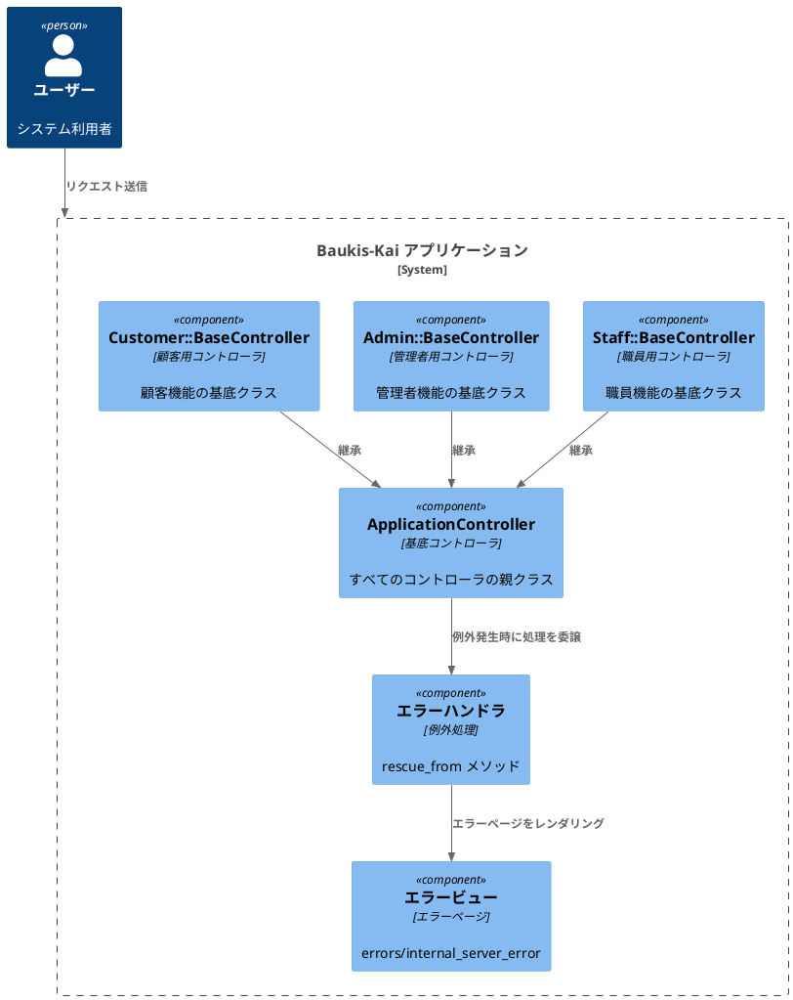
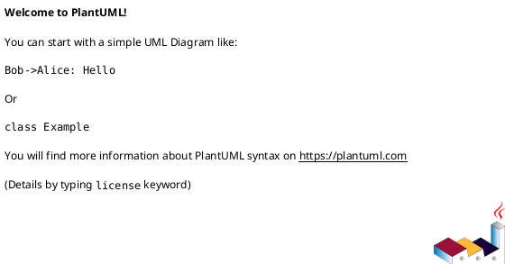

# 作業履歴 2017-01-17

## 概要

2017-01-17の作業内容をまとめています。このジャーナルでは、エラーハンドリング機能の実装に関する作業を記録しています。主に例外処理の実装とエラーページの設定を行いました。

## エラーハンドリング構成図



## 作業内容

### 例外処理の実装

アプリケーション全体でのエラーハンドリングを改善するため、ApplicationControllerに例外処理機能を追加しました。これにより、予期しない例外が発生した場合でも、ユーザーに適切なエラーページを表示できるようになります。

#### 変更点の概要

1. ApplicationControllerに例外処理を追加
   - `rescue_from Exception` で全ての例外を捕捉
   - `rescue500` メソッドで500エラーページをレンダリング

2. エラーページの準備
   - 500 Internal Server Error ページの設定

#### 技術的詳細

- `rescue_from` メソッドを使用して例外を捕捉
- 例外オブジェクトをビューに渡して詳細情報を表示（開発環境のみ）
- HTTPステータスコード500を適切に設定

## コミット: c0bcc9c

### メッセージ

```
例外の捕捉 #2
```

### 変更されたファイル

- M	README.md
- M	app/controllers/application_controller.rb

### 変更内容

```diff
commit c0bcc9caf9ce5fa6941b003b42f6dca9cd97205a
Author: k2works <kakimomokuri@gmail.com>
Date:   Tue Jan 17 19:21:39 2017 +0900

    例外の捕捉 #2

diff --git a/README.md b/README.md
index efa11f8..6931138 100644
--- a/README.md
+++ b/README.md
@@ -316,6 +316,7 @@ git push heroku master

 #### 500 Internal Server Error
 + 準備作業
++ 例外の捕捉

 #### 403 Forbidden
 #### 404 Not Found
diff --git a/app/controllers/application_controller.rb b/app/controllers/application_controller.rb
index 1b2c7e6..3ab4c91 100644
--- a/app/controllers/application_controller.rb
+++ b/app/controllers/application_controller.rb
@@ -3,6 +3,8 @@ class ApplicationController < ActionController::Base

   layout :set_layout

+  rescue_from Exception, with: :rescue500
+
   private
   def set_layout
     if params[:controller].match(%r{\A(staff|admin|customer)/})
@@ -11,4 +13,9 @@ class ApplicationController < ActionController::Base
       'customer'
     end
   end
+
+  def rescue500(e)
+    @exception = e
+    render 'errors/internal_server_error', status: 500
+  end
 end

```

## コミット: 5cf831a

### メッセージ

```
準備作業 #2
```

### 変更されたファイル

- M	.gitignore
- M	Gemfile
- M	Gemfile.lock
- M	README.md
- M	app/controllers/admin/top_controller.rb
- M	baukis-kai.iml
- M	config/environments/production.rb

### 変更内容

```diff
commit 5cf831a689b5a03be156d99450cbaf6c9cd35646
Author: k2works <kakimomokuri@gmail.com>
Date:   Tue Jan 17 19:15:21 2017 +0900

    準備作業 #2

diff --git a/.gitignore b/.gitignore
index 5ddd4e2..05ce7cf 100644
--- a/.gitignore
+++ b/.gitignore
@@ -106,3 +106,4 @@ bower.json
 # Ignore Byebug command history file.
 .byebug_history

+public/assets/
\ No newline at end of file
diff --git a/Gemfile b/Gemfile
index 1f609ad..b46c6fa 100644
--- a/Gemfile
+++ b/Gemfile
@@ -84,4 +84,5 @@ gem 'rails_12factor', group: :production
 gem 'rack-dev-mark'
 gem 'enum_help'
 gem 'bootstrap-sass', '~> 3.3.6'
-gem 'bootstrap_form'
\ No newline at end of file
+gem 'bootstrap_form'
+gem 'dotenv-rails'
\ No newline at end of file
diff --git a/Gemfile.lock b/Gemfile.lock
index f06af1b..f553bc1 100644
--- a/Gemfile.lock
+++ b/Gemfile.lock
@@ -88,6 +88,10 @@ GEM
     debase-ruby_core_source (0.9.6)
     debug_inspector (0.0.2)
     diff-lcs (1.2.5)
+    dotenv (2.1.2)
+    dotenv-rails (2.1.2)
+      dotenv (= 2.1.2)
+      railties (>= 3.2, < 5.1)
     em-websocket (0.5.1)
       eventmachine (>= 0.12.9)
       http_parser.rb (~> 0.6.0)
@@ -301,6 +305,7 @@ DEPENDENCIES
   coffee-rails (~> 4.2)
   database_cleaner (~> 1.3.0)
   debase
+  dotenv-rails
   enum_help
   factory_girl_rails
   faker (~> 1.4.3)
diff --git a/README.md b/README.md
index 7dee61a..efa11f8 100644
--- a/README.md
+++ b/README.md
@@ -310,7 +310,13 @@ git push heroku master

 ### エラーページ
 #### 例外処理の基礎知識
++ 例外とは
++ raiseメソッドと例外機構文
++ クラスメソッドrescue_from
+
 #### 500 Internal Server Error
++ 準備作業
+
 #### 403 Forbidden
 #### 404 Not Found
 #### ActiveSupport::Concern
diff --git a/app/controllers/admin/top_controller.rb b/app/controllers/admin/top_controller.rb
index d9a88b5..532994c 100644
--- a/app/controllers/admin/top_controller.rb
+++ b/app/controllers/admin/top_controller.rb
@@ -1,5 +1,6 @@
 class Admin::TopController < ApplicationController
   def index
+    raise
     render action: 'index'
   end
 end
diff --git a/baukis-kai.iml b/baukis-kai.iml
index ea1f98f..ec2b1a1 100644
--- a/baukis-kai.iml
+++ b/baukis-kai.iml
@@ -56,6 +56,8 @@
     <orderEntry type="library" scope="PROVIDED" name="debase-ruby_core_source (v0.9.6, rbenv: 2.4.0) [gem]" level="application" />
     <orderEntry type="library" scope="PROVIDED" name="debug_inspector (v0.0.2, rbenv: 2.4.0) [gem]" level="application" />
     <orderEntry type="library" scope="PROVIDED" name="diff-lcs (v1.2.5, rbenv: 2.4.0) [gem]" level="application" />
+    <orderEntry type="library" scope="PROVIDED" name="dotenv (v2.1.2, rbenv: 2.4.0) [gem]" level="application" />
+    <orderEntry type="library" scope="PROVIDED" name="dotenv-rails (v2.1.2, rbenv: 2.4.0) [gem]" level="application" />
     <orderEntry type="library" scope="PROVIDED" name="em-websocket (v0.5.1, rbenv: 2.4.0) [gem]" level="application" />
     <orderEntry type="library" scope="PROVIDED" name="enum_help (v0.0.16, rbenv: 2.4.0) [gem]" level="application" />
     <orderEntry type="library" scope="PROVIDED" name="erubis (v2.7.0, rbenv: 2.4.0) [gem]" level="application" />
diff --git a/config/environments/production.rb b/config/environments/production.rb
index a736dfc..3af0b22 100644
--- a/config/environments/production.rb
+++ b/config/environments/production.rb
@@ -2,7 +2,7 @@ Rails.application.configure do
   # Settings specified here will take precedence over those in config/application.rb.

   # Code is not reloaded between requests.
-  config.cache_classes = true
+  config.cache_classes = false

   # Eager load code on boot. This eager loads most of Rails and
   # your application in memory, allowing both threaded web servers

```

### 構造変更



## コミット: 645df51

### メッセージ

```
エラーページ #2
```

### 変更されたファイル

- M	README.md

### 変更内容

```diff
commit 645df51dbaa13cea50a7f7d213df7457b1dc769f
Author: k2works <kakimomokuri@gmail.com>
Date:   Tue Jan 17 18:54:37 2017 +0900

    エラーページ #2

diff --git a/README.md b/README.md
index e23f947..7dee61a 100644
--- a/README.md
+++ b/README.md
@@ -309,6 +309,12 @@ git push heroku master
 + コンポーネントベースで作ると、ページ固有のCSSを少し追加するだけでほぼ１ページ作れる

 ### エラーページ
+#### 例外処理の基礎知識
+#### 500 Internal Server Error
+#### 403 Forbidden
+#### 404 Not Found
+#### ActiveSupport::Concern
+
 ### ユーザー認証
 ### ユーザー認証
 ### ルーティング

```

## コミット: 6fe8464

### メッセージ

```
管理者トップページ作成 #1
```

### 変更されたファイル

- M	app/assets/stylesheets/base/_variables.scss
- M	app/assets/stylesheets/main.scss
- A	app/assets/stylesheets/pages/_admin.scss
- M	app/assets/stylesheets/pages/_staff.scss
- M	app/views/admin/top/index.html.erb
- M	app/views/layouts/admin.html.erb
- M	app/views/shared/admin/_footer.html.erb
- M	app/views/shared/admin/_header.html.erb
- M	app/views/shared/staff/_header.html.erb

### 変更内容

```diff
commit 6fe84642460f439f1152b71fcff77b0d8519e831
Author: k2works <kakimomokuri@gmail.com>
Date:   Tue Jan 17 18:22:33 2017 +0900

    管理者トップページ作成 #1

diff --git a/app/assets/stylesheets/base/_variables.scss b/app/assets/stylesheets/base/_variables.scss
index 72eca03..13563ca 100644
--- a/app/assets/stylesheets/base/_variables.scss
+++ b/app/assets/stylesheets/base/_variables.scss
@@ -42,6 +42,18 @@ $very_light_gray: #fafafa;
 $dark_cyan: #448888;
 $very_dark_cyan: darken($dark_cyan, 25%);

+/* マゼンタ系 */
+
+$dark_magenta: #884488;
+$very_dark_magenta: darken($dark_magenta, 25%);
+
+/* 赤系 */
+$red: #cc0000;
+$pink: #ffcccc;
+
+/* 緑系 */
+$green: #00cc00;
+
 /* マージン、パディング */

 $narrow: 2px;
diff --git a/app/assets/stylesheets/main.scss b/app/assets/stylesheets/main.scss
index aa747a9..898bc2b 100644
--- a/app/assets/stylesheets/main.scss
+++ b/app/assets/stylesheets/main.scss
@@ -77,6 +77,9 @@
 // Staff
 @import "pages/staff";

+// Administrator
+@import "pages/admin";
+
 // ===========================
 // Utils
 // ===========================
diff --git a/app/assets/stylesheets/pages/_admin.scss b/app/assets/stylesheets/pages/_admin.scss
new file mode 100644
index 0000000..1cc4ad7
--- /dev/null
+++ b/app/assets/stylesheets/pages/_admin.scss
@@ -0,0 +1,58 @@
+@charset 'utf-8';
+
+// =====================
+// 管理者ページ固有のスタイル
+// =====================
+
+
+html, body {
+  margin: 0;
+  padding: 0;
+  height: 100%;
+}
+
+.Admin {
+  &__wrapper {
+    position: relative;
+    box-sizing: border-box;
+    min-height: 100%;
+    margin: 0 auto;
+    padding-bottom: ($wide + $moderate) * 2 + $standard_line_height;
+    background-color: $gray;
+  }
+
+  &__title {
+    margin: 0;
+    padding: $moderate * 1.5 $moderate;
+    font-size: $large;
+    font-weight: normal;
+    background-color: $very_dark_magenta;
+    color: $light_gray;
+  }
+
+  &__header {
+    padding: $moderate;
+    background-color: $very_dark_magenta;
+    color: $very_light_gray;
+    span.logo-mark {
+      font-weight: bold;
+    }
+  }
+
+  &__footer {
+    bottom: 0;
+    position: absolute;
+    width: 100%;
+    background-color: $dark_gray;
+    color: $very_light_gray;
+    p {
+      text-align: center;
+      padding: $moderate;
+      margin: 0;
+    }
+  }
+}
+
+.logo--admin {
+  color: $color-white;
+}
diff --git a/app/assets/stylesheets/pages/_staff.scss b/app/assets/stylesheets/pages/_staff.scss
index 6f42c51..d28a135 100644
--- a/app/assets/stylesheets/pages/_staff.scss
+++ b/app/assets/stylesheets/pages/_staff.scss
@@ -53,6 +53,6 @@ html, body {
   }
 }

-div.wrapper {
-
+.logo--staff {
+  color: $color-white;
 }
\ No newline at end of file
diff --git a/app/views/admin/top/index.html.erb b/app/views/admin/top/index.html.erb
index 4a793fe..81d36bc 100644
--- a/app/views/admin/top/index.html.erb
+++ b/app/views/admin/top/index.html.erb
@@ -1,2 +1,16 @@
 <% @title = '管理者トップページ' %>
-<h1><%= @title %></h1>
\ No newline at end of file
+<section class="Section">
+  <h1 class="Admin__title"><%= @title %></h1>
+</section>
+
+<section class="Section l-column">
+  <div class="Section__head">
+    <h2 class="sectionLabel">お知らせ</h2>
+  </div>
+  <ol class="NewsList">
+    <li class="NewsList__item">
+      <time class="NewsList__head" datatime="2017-1-17">2016.10.12</time>
+      <span class="NewsList__body">開発を開始しました</span>
+    </li>
+  </ol>
+</section>
diff --git a/app/views/layouts/admin.html.erb b/app/views/layouts/admin.html.erb
index e37a09c..b1f43ad 100644
--- a/app/views/layouts/admin.html.erb
+++ b/app/views/layouts/admin.html.erb
@@ -9,7 +9,7 @@
 </head>

 <body>
-<div id="wrapper" class="SpMenu__wrapper">
+<div id="wrapper" class="SpMenu__wrapper Admin__wrapper">
   <div id="overlay" class="SpMenu__overlay"></div>
   <%= render 'shared/admin/header' %>
   <%= yield %>
diff --git a/app/views/shared/admin/_footer.html.erb b/app/views/shared/admin/_footer.html.erb
index 53fdd69..e3c34d8 100644
--- a/app/views/shared/admin/_footer.html.erb
+++ b/app/views/shared/admin/_footer.html.erb
@@ -1,4 +1,4 @@
-<footer class="Footer">
+<footer class="Footer Admin__footer">
   <div class="l-row l-column">
     <div class="Footer__head">
       <%= link_to('BAUKIS KAI', staff_root_url, class:'logo') %>
@@ -8,8 +8,6 @@
     </div>
     <div class="Footer__body">
       <p>Powered by BAUKIS KAI &copy; 2014 k2works</p>
-      <p><a href="#">Legal Notice</a></p>
-      <p><a href="#">Privacy policy</a></p>
     </div>
   </div>
 </footer>
\ No newline at end of file
diff --git a/app/views/shared/admin/_header.html.erb b/app/views/shared/admin/_header.html.erb
index 7e96b16..83fa2a1 100644
--- a/app/views/shared/admin/_header.html.erb
+++ b/app/views/shared/admin/_header.html.erb
@@ -1,9 +1,9 @@
-<header class="Header l-column">
+<header class="Header Admin__header">
   <div id="menu-button" class="Header__button">
     <%= fa_icon 'bars' %>
   </div>
   <div class="Header__head">
-    <h1 class="logo"><%= link_to('BAUKIS KAI', staff_root_url, class:'logo') %></h1>
+    <h1 class="logo"><%= link_to('BAUKIS KAI', admin_root_url, class:'logo logo--admin') %></h1>
   </div>
   <nav class="Header__body SpMenu">
     <ul class="Menu">
diff --git a/app/views/shared/staff/_header.html.erb b/app/views/shared/staff/_header.html.erb
index 6dd942a..861f549 100644
--- a/app/views/shared/staff/_header.html.erb
+++ b/app/views/shared/staff/_header.html.erb
@@ -3,7 +3,7 @@
     <%= fa_icon 'bars' %>
   </div>
   <div class="Header__head">
-    <h1 class="logo"><%= link_to('BAUKIS KAI', staff_root_url, class:'logo') %></h1>
+    <h1 class="logo"><%= link_to('BAUKIS KAI', staff_root_url, class:'logo logo--staff') %></h1>
   </div>
   <nav class="Header__body SpMenu">
     <ul class="Menu">

```

## コミット: d196c1d

### メッセージ

```
職員トップページ作成 #1
```

### 変更されたファイル

- M	app/assets/stylesheets/base/_variables.scss
- M	app/assets/stylesheets/main.scss
- A	app/assets/stylesheets/pages/_staff.scss
- D	app/assets/stylesheets/pages/staff/_colors.css.scss
- D	app/assets/stylesheets/pages/staff/_dimensions.css.scss
- D	app/assets/stylesheets/pages/staff/container.css.scss
- D	app/assets/stylesheets/pages/staff/layout.css.scss
- M	app/views/layouts/staff.html.erb
- M	app/views/shared/staff/_footer.html.erb
- M	app/views/shared/staff/_header.html.erb
- M	app/views/staff/top/index.html.erb

### 変更内容

```diff
commit d196c1dba8aecae450d7452e8775b3cdbb6a1d13
Author: k2works <kakimomokuri@gmail.com>
Date:   Tue Jan 17 17:57:34 2017 +0900

    職員トップページ作成 #1

diff --git a/app/assets/stylesheets/base/_variables.scss b/app/assets/stylesheets/base/_variables.scss
index e3a5b8a..72eca03 100644
--- a/app/assets/stylesheets/base/_variables.scss
+++ b/app/assets/stylesheets/base/_variables.scss
@@ -27,4 +27,36 @@ $font-sub: 'Lato';
 // break points
 $sp-max-width: 640px;
 $pc-min-width: 641px;
-$sp-menu-width: 200px;
\ No newline at end of file
+$sp-menu-width: 200px;
+
+//Staff
+/* グレー系 */
+
+$dark_gray: #666666;
+$gray: #cccccc;
+$light_gray: #eeeeee;
+$very_light_gray: #fafafa;
+
+/* シアン系 */
+
+$dark_cyan: #448888;
+$very_dark_cyan: darken($dark_cyan, 25%);
+
+/* マージン、パディング */
+
+$narrow: 2px;
+$moderate: 6px;
+$wide: 10px;
+$very_wide: 20px;
+
+/* フォントサイズ */
+
+$tiny: 8px;
+$small: 10px;
+$normal: 12px;
+$large: 16px;
+$huge: 20px;
+
+/* 行の高さ */
+
+$standard_line_height: 16px;
diff --git a/app/assets/stylesheets/main.scss b/app/assets/stylesheets/main.scss
index 36b286c..aa747a9 100644
--- a/app/assets/stylesheets/main.scss
+++ b/app/assets/stylesheets/main.scss
@@ -69,17 +69,16 @@
 // ===========================
 // Pages
 // ===========================
+// Customer
 @import "pages/customer/index";
-
 @import "pages/customer/campaign";
-
 @import "pages/customer/article";

+// Staff
+@import "pages/staff";
+
 // ===========================
 // Utils
 // ===========================
 // サイズ、余白などの便利class
-@import "./utils/arrangements";
-
-//@import "pages/staff/container";
-//@import "pages/staff/layout";
\ No newline at end of file
+@import "./utils/arrangements";
\ No newline at end of file
diff --git a/app/assets/stylesheets/pages/_staff.scss b/app/assets/stylesheets/pages/_staff.scss
new file mode 100644
index 0000000..6f42c51
--- /dev/null
+++ b/app/assets/stylesheets/pages/_staff.scss
@@ -0,0 +1,58 @@
+@charset 'utf-8';
+
+// =====================
+// 職員ページ固有のスタイル
+// =====================
+
+
+html, body {
+  margin: 0;
+  padding: 0;
+  height: 100%;
+}
+
+.Staff {
+  &__wrapper {
+    position: relative;
+    box-sizing: border-box;
+    min-height: 100%;
+    margin: 0 auto;
+    padding-bottom: ($wide + $moderate) * 2 + $standard_line_height;
+    background-color: $gray;
+  }
+
+  &__title {
+    margin: 0;
+    padding: $moderate * 1.5 $moderate;
+    font-size: $large;
+    font-weight: normal;
+    background-color: $very_dark_cyan;
+    color: $light_gray;
+  }
+
+  &__header {
+    padding: $moderate;
+    background-color: $dark_cyan;
+    color: $very_light_gray;
+    span.logo-mark {
+      font-weight: bold;
+    }
+  }
+
+  &__footer {
+    bottom: 0;
+    position: absolute;
+    width: 100%;
+    background-color: $dark_gray;
+    color: $very_light_gray;
+    p {
+      text-align: center;
+      padding: $moderate;
+      margin: 0;
+    }
+  }
+}
+
+div.wrapper {
+
+}
\ No newline at end of file
diff --git a/app/assets/stylesheets/pages/staff/_colors.css.scss b/app/assets/stylesheets/pages/staff/_colors.css.scss
deleted file mode 100644
index 11d6a3d..0000000
--- a/app/assets/stylesheets/pages/staff/_colors.css.scss
+++ /dev/null
@@ -1,11 +0,0 @@
-/* グレー系 */
-
-$dark_gray: #666666;
-$gray: #cccccc;
-$light_gray: #eeeeee;
-$very_light_gray: #fafafa;
-
-/* シアン系 */
-
-$dark_cyan: #448888;
-$very_dark_cyan: darken($dark_cyan, 25%);
diff --git a/app/assets/stylesheets/pages/staff/_dimensions.css.scss b/app/assets/stylesheets/pages/staff/_dimensions.css.scss
deleted file mode 100644
index 8d4d2dd..0000000
--- a/app/assets/stylesheets/pages/staff/_dimensions.css.scss
+++ /dev/null
@@ -1,18 +0,0 @@
-/* マージン、パディング */
-
-$narrow: 2px;
-$moderate: 6px;
-$wide: 10px;
-$very_wide: 20px;
-
-/* フォントサイズ */
-
-$tiny: 8px;
-$small: 10px;
-$normal: 12px;
-$large: 16px;
-$huge: 20px;
-
-/* 行の高さ */
-
-$standard_line_height: 16px;
diff --git a/app/assets/stylesheets/pages/staff/container.css.scss b/app/assets/stylesheets/pages/staff/container.css.scss
deleted file mode 100644
index 901cb2a..0000000
--- a/app/assets/stylesheets/pages/staff/container.css.scss
+++ /dev/null
@@ -1,15 +0,0 @@
-@import "colors";
-@import "dimensions";
-
-div.wrapper {
-  div.container {
-    h1 {
-      margin: 0;
-      padding: $moderate * 1.5 $moderate;
-      font-size: $large;
-      font-weight: normal;
-      background-color: $very_dark_cyan;
-      color: $light_gray;
-    }
-  }
-}
diff --git a/app/assets/stylesheets/pages/staff/layout.css.scss b/app/assets/stylesheets/pages/staff/layout.css.scss
deleted file mode 100644
index 3682fa0..0000000
--- a/app/assets/stylesheets/pages/staff/layout.css.scss
+++ /dev/null
@@ -1,36 +0,0 @@
-@import "colors";
-@import "dimensions";
-
-html, body {
-  margin: 0;
-  padding: 0;
-  height: 100%;
-}
-div.wrapper {
-  position: relative;
-  box-sizing: border-box;
-  min-height: 100%;
-  margin: 0 auto;
-  padding-bottom: ($wide + $moderate) * 2 + $standard_line_height;
-  background-color: $gray;
-}
-header {
-  padding: $moderate;
-  background-color: $dark_cyan;
-  color: $very_light_gray;
-  span.logo-mark {
-    font-weight: bold;
-  }
-}
-footer {
-  bottom: 0;
-  position: absolute;
-  width: 100%;
-  background-color: $dark_gray;
-  color: $very_light_gray;
-  p {
-    text-align: center;
-    padding: $moderate;
-    margin: 0;
-  }
-}
diff --git a/app/views/layouts/staff.html.erb b/app/views/layouts/staff.html.erb
index fd979b6..0b928de 100644
--- a/app/views/layouts/staff.html.erb
+++ b/app/views/layouts/staff.html.erb
@@ -9,7 +9,7 @@
 </head>

 <body>
-<div id="wrapper" class="SpMenu__wrapper">
+<div id="wrapper" class="SpMenu__wrapper Staff__wrapper">
   <div id="overlay" class="SpMenu__overlay"></div>
   <%= render 'shared/staff/header' %>
   <%= yield %>
diff --git a/app/views/shared/staff/_footer.html.erb b/app/views/shared/staff/_footer.html.erb
index 53fdd69..042f4c7 100644
--- a/app/views/shared/staff/_footer.html.erb
+++ b/app/views/shared/staff/_footer.html.erb
@@ -1,4 +1,4 @@
-<footer class="Footer">
+<footer class="Footer Staff__footer">
   <div class="l-row l-column">
     <div class="Footer__head">
       <%= link_to('BAUKIS KAI', staff_root_url, class:'logo') %>
@@ -8,8 +8,6 @@
     </div>
     <div class="Footer__body">
       <p>Powered by BAUKIS KAI &copy; 2014 k2works</p>
-      <p><a href="#">Legal Notice</a></p>
-      <p><a href="#">Privacy policy</a></p>
     </div>
   </div>
 </footer>
\ No newline at end of file
diff --git a/app/views/shared/staff/_header.html.erb b/app/views/shared/staff/_header.html.erb
index 7e96b16..6dd942a 100644
--- a/app/views/shared/staff/_header.html.erb
+++ b/app/views/shared/staff/_header.html.erb
@@ -1,4 +1,4 @@
-<header class="Header l-column">
+<header class="Header Staff__header">
   <div id="menu-button" class="Header__button">
     <%= fa_icon 'bars' %>
   </div>
diff --git a/app/views/staff/top/index.html.erb b/app/views/staff/top/index.html.erb
index e4d87bc..ed1fd86 100644
--- a/app/views/staff/top/index.html.erb
+++ b/app/views/staff/top/index.html.erb
@@ -1,2 +1,16 @@
 <% @title = '職員トップページ' %>
-<h1><%= @title %></h1>
\ No newline at end of file
+<section class="Section">
+  <h1 class="Staff__title"><%= @title %></h1>
+</section>
+
+<section class="Section l-column">
+  <div class="Section__head">
+    <h2 class="sectionLabel">お知らせ</h2>
+  </div>
+  <ol class="NewsList">
+    <li class="NewsList__item">
+      <time class="NewsList__head" datatime="2017-1-17">2016.10.12</time>
+      <span class="NewsList__body">開発を開始しました</span>
+    </li>
+  </ol>
+</section>

```

## コミット: 2dff57d

### メッセージ

```
職員・管理者・顧客ページ分割 #1
```

### 変更されたファイル

- M	app/assets/stylesheets/main.scss
- A	app/controllers/customer/article_controller.rb
- A	app/controllers/customer/campaign_controller.rb
- D	app/controllers/staff/article_controller.rb
- D	app/controllers/staff/campaign_controller.rb
- M	app/views/customer/top/index.html.erb
- A	app/views/layouts/admin.html.erb
- A	app/views/layouts/customer.html.erb
- M	app/views/layouts/staff.html.erb
- A	app/views/shared/admin/_footer.html.erb
- A	app/views/shared/admin/_header.html.erb
- A	app/views/shared/staff/_footer.html.erb
- A	app/views/shared/staff/_header.html.erb
- M	app/views/staff/top/index.html.erb
- M	config/routes.rb

### 変更内容

```diff
commit 2dff57d2769d76d38c126900b993c63736079883
Author: k2works <kakimomokuri@gmail.com>
Date:   Tue Jan 17 17:28:24 2017 +0900

    職員・管理者・顧客ページ分割 #1

diff --git a/app/assets/stylesheets/main.scss b/app/assets/stylesheets/main.scss
index 8e0ff1d..36b286c 100644
--- a/app/assets/stylesheets/main.scss
+++ b/app/assets/stylesheets/main.scss
@@ -69,11 +69,11 @@
 // ===========================
 // Pages
 // ===========================
-@import "./pages/index";
+@import "pages/customer/index";

-@import "./pages/campaign";
+@import "pages/customer/campaign";

-@import "./pages/article";
+@import "pages/customer/article";

 // ===========================
 // Utils
diff --git a/app/assets/stylesheets/pages/_article.scss b/app/assets/stylesheets/pages/customer/_article.scss
similarity index 100%
rename from app/assets/stylesheets/pages/_article.scss
rename to app/assets/stylesheets/pages/customer/_article.scss
diff --git a/app/assets/stylesheets/pages/_campaign.scss b/app/assets/stylesheets/pages/customer/_campaign.scss
similarity index 100%
rename from app/assets/stylesheets/pages/_campaign.scss
rename to app/assets/stylesheets/pages/customer/_campaign.scss
diff --git a/app/assets/stylesheets/pages/_index.scss b/app/assets/stylesheets/pages/customer/_index.scss
similarity index 100%
rename from app/assets/stylesheets/pages/_index.scss
rename to app/assets/stylesheets/pages/customer/_index.scss
diff --git a/app/controllers/customer/article_controller.rb b/app/controllers/customer/article_controller.rb
new file mode 100644
index 0000000..3631c55
--- /dev/null
+++ b/app/controllers/customer/article_controller.rb
@@ -0,0 +1,4 @@
+class Customer::ArticleController < ApplicationController
+  def index
+  end
+end
\ No newline at end of file
diff --git a/app/controllers/customer/campaign_controller.rb b/app/controllers/customer/campaign_controller.rb
new file mode 100644
index 0000000..897f1f3
--- /dev/null
+++ b/app/controllers/customer/campaign_controller.rb
@@ -0,0 +1,8 @@
+class Customer::CampaignController < ApplicationController
+  def index
+  end
+
+  def submit
+    redirect_to :customer_root
+  end
+end
\ No newline at end of file
diff --git a/app/controllers/staff/article_controller.rb b/app/controllers/staff/article_controller.rb
deleted file mode 100644
index ad2a69e..0000000
--- a/app/controllers/staff/article_controller.rb
+++ /dev/null
@@ -1,4 +0,0 @@
-class Staff::ArticleController < ApplicationController
-  def index
-  end
-end
\ No newline at end of file
diff --git a/app/controllers/staff/campaign_controller.rb b/app/controllers/staff/campaign_controller.rb
deleted file mode 100644
index 8ed36b0..0000000
--- a/app/controllers/staff/campaign_controller.rb
+++ /dev/null
@@ -1,8 +0,0 @@
-class Staff::CampaignController < ApplicationController
-  def index
-  end
-
-  def submit
-    redirect_to :staff_root
-  end
-end
\ No newline at end of file
diff --git a/app/views/staff/article/index.html.erb b/app/views/customer/article/index.html.erb
similarity index 100%
rename from app/views/staff/article/index.html.erb
rename to app/views/customer/article/index.html.erb
diff --git a/app/views/staff/campaign/index.html.erb b/app/views/customer/campaign/index.html.erb
similarity index 98%
rename from app/views/staff/campaign/index.html.erb
rename to app/views/customer/campaign/index.html.erb
index 414407f..a6488ee 100644
--- a/app/views/staff/campaign/index.html.erb
+++ b/app/views/customer/campaign/index.html.erb
@@ -118,7 +118,7 @@
   <div class="Section__head">
     <h2 class="sectionLabel">More Info</h2>
   </div>
-  <%= form_tag(staff_campaign_submit_path, :method => :get, class:'Form') do %>
+  <%= form_tag(customer_campaign_submit_path, :method => :get, class:'Form') do %>
       <%= text_field :campaign, :name, placeholder:'NAME',size:40,class: 'Form__input' %>
       <%= text_field :campaign, :mail, placeholder:'MAIL',size:40,class: 'Form__input' %>
       <%= button_tag('SUBSCRIBE',class:'button Form__button') %>
diff --git a/app/views/customer/top/index.html.erb b/app/views/customer/top/index.html.erb
index a57dbd7..ceabb2a 100644
--- a/app/views/customer/top/index.html.erb
+++ b/app/views/customer/top/index.html.erb
@@ -1,2 +1,147 @@
-<% @title = '顧客トップページ' %>
-<h1><%= @title %></h1>
\ No newline at end of file
+<div class="ImageSlide Section">
+  <ul id="Slide" class="ImageSlide__main">
+    <li class="ImageSlide__item js-slide-item">
+      <a href="#">
+        <%= image_tag('top/slide1.jpg', class: 'ImageSlide__image', alt:'about our tea', width:'1180', height:'490') %>
+      </a>
+    </li>
+    <li class="ImageSlide__item js-slide-item">
+      <a href="#">
+        <%= image_tag('top/slide2.jpg', class: 'ImageSlide__image', alt:'about our tea', width:'1180', height:'490') %>
+      </a>
+    </li>
+    <li class="ImageSlide__item js-slide-item">
+      <a href="#">
+        <%= image_tag('top/slide3.jpg', class: 'ImageSlide__image', alt:'about our tea', width:'1180', height:'490') %>
+      </a>
+    </li>
+  </ul>
+  <div class="ImageSlide__sub">
+    <span class="ImageSlide__dot js-slide-point">image1</span>
+    <span class="ImageSlide__dot js-slide-point">image2</span>
+    <span class="ImageSlide__dot js-slide-point">image3</span>
+  </div>
+</div>
+
+<section class="Section l-column">
+  <div class="l-row">
+    <div class="EntryPanel l-halfColumn">
+      <div class="EntryPanel__sub">
+        <%= image_tag('top/entry1.jpg',class: 'EntryPanel__thumb' , width: '275' , height: '250') %>
+      </div>
+      <div id="EntryPanel__main">
+        <h3 class="EntryPanel__head">冬のコーヒーギフト</h3>
+        <div class="EntryPanel__body">
+          大切なあの方にありがとうを届けたい。心も体も温まる素敵なギフト。プレゼントキャンペーン実施中！
+        </div>
+        <div class="EntryPanel__foot"><%= link_to('READ MORE',customer_campaign_index_url,class:"button") %></div>
+      </div>
+    </div>
+
+    <div class="EntryPanel l-halfColumn">
+      <div class="EntryPanel__sub">
+        <%= image_tag('top/entry2.jpg',class: 'EntryPanel__thumb' , width: '275' , height: '250') %>
+      </div>
+      <div id="EntryPanel__main">
+        <h3 class="EntryPanel__head">あの人気店コラボメニュー</h3>
+        <div class="EntryPanel__body">
+          今話題の人気店、Macaron'n Thingsのパンケーキを使ったコラボ商品のセットメニューを販売中。
+        </div>
+        <div class="EntryPanel__foot"><%= link_to('READ MORE',customer_campaign_index_url,class:"button") %></div>
+      </div>
+    </div>
+  </div>
+</section>
+
+<section class="Section">
+  <h2 class="sectionLabel l-column">Content</h2>
+  <div class="Section__item l-row">
+    <div class="l-halfTile IndexPage__drinkMenu">
+      <a href="#" class="OverlayPanel">
+        <h3 class="OverlayPanel__head">Drink Menu</h3>
+        <p class="OverlayPanel__body">
+          定番メニューから、季節に合わせた商品まで品揃え豊富に取り揃えております。あなたのお気に入りを見つけましょう。
+        </p>
+      </a>
+    </div>
+    <div class="l-halfTile IndexPage__foodMenu">
+      <a href="#" class="OverlayPanel">
+        <h3 class="OverlayPanel__head">Food Menu</h3>
+        <p class="OverlayPanel__body">
+          サンドイッチ、ケーキ、パスタ、当店自慢のコーヒーと一緒にどうぞ。
+        </p>
+      </a>
+    </div>
+  </div>
+  <div class="Section__item l-column">
+    <div class="l-row">
+      <a class="IconPanel l-quaterColumn">
+        <%= fa_icon 'tree', class:'IconPanel__icon' %>
+        <h3 class="IconPanel__head">こだわりの空間</h3>
+        <p class="IconPanel__body">
+          ランチからディナーまでいつまでもリラックスして使えるくつろぎ空間。椅子や壁、細部にまでこだわっています。
+        </p>
+      </a>
+      <a class="IconPanel l-quaterColumn">
+        <%= fa_icon 'coffee', class:'IconPanel__icon' %>
+        <h3 class="IconPanel__head">豆へのこだわり</h3>
+        <p class="IconPanel__body">
+          原産地、豆の種類、焙煎方法のこだわりを紹介する
+        </p>
+      </a>
+      <a class="IconPanel l-quaterColumn">
+        <%= fa_icon 'pencil', class:'IconPanel__icon' %>
+        <h3 class="IconPanel__head">コーヒースクール</h3>
+        <p class="IconPanel__body">
+          コーヒー豆の基礎知識から、美味しいコーヒーを淹れるコツをお教えします。
+        </p>
+      </a>
+      <a class="IconPanel l-quaterColumn">
+        <%= fa_icon 'laptop', class:'IconPanel__icon' %>
+        <h3 class="IconPanel__head">BLOG</h3>
+        <p class="IconPanel__body">
+          お店の最新情報を、いち早くお届け。
+        </p>
+      </a>
+    </div>
+  </div>
+</section>
+
+<section class="Section l-column">
+  <div class="Section__head">
+    <h2 class="sectionLabel">News</h2>
+  </div>
+  <ol class="NewsList">
+    <li class="NewsList__item">
+      <time class="NewsList__head" datatime="2016-10-12">2016.10.12</time>
+      <span class="NewsList__body">「かぼちゃタルト」「ヘーゼルナッツラテ」「ストロベリーブラウニー」「ハニーソイラテ」「たっぷりチーズときのこのパニーニ」新発売。</span>
+    </li>
+    <li class="NewsList__item">
+      <time class="NewsList__head" datatime="2016-09-01">2016.09.01</time>
+      <span class="NewsList__body">営業時間変更に関するお知らせ</span>
+    </li>
+    <li class="NewsList__item">
+      <time class="NewsList__head" datatime="2016-08-20">2016.08.20</time>
+      <span class="NewsList__body">鎌倉店ニューオープン</span>
+    </li>
+    <li class="NewsList__item">
+      <time class="NewsList__head" datatime="2016-08-10">2016.08.10</time>
+      <span class="NewsList__body">夏季限定。マンゴースムージー発売</span>
+    </li>
+    <li class="NewsList__item">
+      <time class="NewsList__head" datatime="2016-04-02">2016.04.02</time>
+      <span class="NewsList__body">[期間限定]さくら抹茶ラテ販売開始</span>
+    </li>
+  </ol>
+</section>
+
+<div class="l-column u-mt60px u-mb100px">
+  <div class="l-row">
+    <a href="#" class="l-halfColumn">
+      <%= image_tag('top/top_banner_1.jpg', class:'l-fitImg', alt:'Dummy banner') %>
+    </a>
+    <a href="#" class="l-halfColumn">
+      <%= image_tag('top/top_banner_2.jpg', class:'l-fitImg', alt:'Dummy banner') %>
+    </a>
+  </div>
+</div>
\ No newline at end of file
diff --git a/app/views/layouts/admin.html.erb b/app/views/layouts/admin.html.erb
new file mode 100644
index 0000000..e37a09c
--- /dev/null
+++ b/app/views/layouts/admin.html.erb
@@ -0,0 +1,24 @@
+<!DOCTYPE html>
+<html>
+<head>
+  <meta charset="utf-8">
+  <meta name="description" content="">
+  <meta name="viewport" content="width=device-width, initial-scale=1">
+  <title><%= document_title %></title>
+  <%= csrf_meta_tags %>
+</head>
+
+<body>
+<div id="wrapper" class="SpMenu__wrapper">
+  <div id="overlay" class="SpMenu__overlay"></div>
+  <%= render 'shared/admin/header' %>
+  <%= yield %>
+  <%= render 'shared/admin/footer' %>
+</div>
+<%= stylesheet_link_tag    'application', media: 'all', 'data-turbolinks-track': 'reload' %>
+<%= javascript_include_tag 'application', 'data-turbolinks-track': 'reload' %>
+<script>
+    imageSlide('Slide', 2);
+</script>
+</body>
+</html>
\ No newline at end of file
diff --git a/app/views/layouts/customer.html.erb b/app/views/layouts/customer.html.erb
new file mode 100644
index 0000000..76834c5
--- /dev/null
+++ b/app/views/layouts/customer.html.erb
@@ -0,0 +1,24 @@
+<!DOCTYPE html>
+<html>
+<head>
+  <meta charset="utf-8">
+  <meta name="description" content="">
+  <meta name="viewport" content="width=device-width, initial-scale=1">
+  <title><%= document_title %></title>
+  <%= csrf_meta_tags %>
+</head>
+
+<body>
+<div id="wrapper" class="SpMenu__wrapper">
+  <div id="overlay" class="SpMenu__overlay"></div>
+  <%= render 'shared/customer/header' %>
+  <%= yield %>
+  <%= render 'shared/customer/footer' %>
+</div>
+<%= stylesheet_link_tag    'application', media: 'all', 'data-turbolinks-track': 'reload' %>
+<%= javascript_include_tag 'application', 'data-turbolinks-track': 'reload' %>
+<script>
+    imageSlide('Slide', 2);
+</script>
+</body>
+</html>
\ No newline at end of file
diff --git a/app/views/layouts/staff.html.erb b/app/views/layouts/staff.html.erb
index 68b8185..fd979b6 100644
--- a/app/views/layouts/staff.html.erb
+++ b/app/views/layouts/staff.html.erb
@@ -11,9 +11,9 @@
 <body>
 <div id="wrapper" class="SpMenu__wrapper">
   <div id="overlay" class="SpMenu__overlay"></div>
-  <%= render 'shared/header' %>
+  <%= render 'shared/staff/header' %>
   <%= yield %>
-  <%= render 'shared/footer' %>
+  <%= render 'shared/staff/footer' %>
 </div>
 <%= stylesheet_link_tag    'application', media: 'all', 'data-turbolinks-track': 'reload' %>
 <%= javascript_include_tag 'application', 'data-turbolinks-track': 'reload' %>
diff --git a/app/views/shared/admin/_footer.html.erb b/app/views/shared/admin/_footer.html.erb
new file mode 100644
index 0000000..53fdd69
--- /dev/null
+++ b/app/views/shared/admin/_footer.html.erb
@@ -0,0 +1,15 @@
+<footer class="Footer">
+  <div class="l-row l-column">
+    <div class="Footer__head">
+      <%= link_to('BAUKIS KAI', staff_root_url, class:'logo') %>
+      <ul class="Menu Menu--sub">
+        <li><a href="#" class="Menu__item"></a></li>
+      </ul>
+    </div>
+    <div class="Footer__body">
+      <p>Powered by BAUKIS KAI &copy; 2014 k2works</p>
+      <p><a href="#">Legal Notice</a></p>
+      <p><a href="#">Privacy policy</a></p>
+    </div>
+  </div>
+</footer>
\ No newline at end of file
diff --git a/app/views/shared/admin/_header.html.erb b/app/views/shared/admin/_header.html.erb
new file mode 100644
index 0000000..7e96b16
--- /dev/null
+++ b/app/views/shared/admin/_header.html.erb
@@ -0,0 +1,13 @@
+<header class="Header l-column">
+  <div id="menu-button" class="Header__button">
+    <%= fa_icon 'bars' %>
+  </div>
+  <div class="Header__head">
+    <h1 class="logo"><%= link_to('BAUKIS KAI', staff_root_url, class:'logo') %></h1>
+  </div>
+  <nav class="Header__body SpMenu">
+    <ul class="Menu">
+      <li class="Menu__item"><a href="#"></a></li>
+    </ul>
+  </nav>
+</header>
\ No newline at end of file
diff --git a/app/views/shared/_footer.html.erb b/app/views/shared/customer/_footer.html.erb
similarity index 94%
rename from app/views/shared/_footer.html.erb
rename to app/views/shared/customer/_footer.html.erb
index 8aa429a..46d3707 100644
--- a/app/views/shared/_footer.html.erb
+++ b/app/views/shared/customer/_footer.html.erb
@@ -6,7 +6,7 @@
         <li><a href="#" class="Menu__item">Services</a></li>
         <li><a href="#" class="Menu__item">Work</a></li>
         <li><a href="#" class="Menu__item">About us</a></li>
-        <li><%= link_to('Blog', staff_article_index_url,class:"Menu__item") %></li>
+        <li><%= link_to('Blog', customer_article_index_url,class:"Menu__item") %></li>
         <li><a href="#" class="Menu__item">Contact</a></li>
       </ul>
     </div>
diff --git a/app/views/shared/_header.html.erb b/app/views/shared/customer/_header.html.erb
similarity index 73%
rename from app/views/shared/_header.html.erb
rename to app/views/shared/customer/_header.html.erb
index cb460e5..ae88d5d 100644
--- a/app/views/shared/_header.html.erb
+++ b/app/views/shared/customer/_header.html.erb
@@ -3,14 +3,14 @@
     <%= fa_icon 'bars' %>
   </div>
   <div class="Header__head">
-    <h1 class="logo"><%= link_to('BAUKIS KAI', staff_root_url, class:'logo') %></h1>
+    <h1 class="logo"><%= link_to('BAUKIS KAI', customer_root_url, class:'logo') %></h1>
   </div>
   <nav class="Header__body SpMenu">
     <ul class="Menu">
       <li class="Menu__item"><a href="#">Services</a></li>
       <li class="Menu__item"><a href="#">Work</a></li>
       <li class="Menu__item"><a href="#">About</a></li>
-      <li class="Menu__item"><%= link_to('Blog', staff_article_index_url) %></li>
+      <li class="Menu__item"><%= link_to('Blog', customer_article_index_url) %></li>
       <li class="Menu__item"><a href="#">Contact</a></li>
     </ul>
   </nav>
diff --git a/app/views/shared/staff/_footer.html.erb b/app/views/shared/staff/_footer.html.erb
new file mode 100644
index 0000000..53fdd69
--- /dev/null
+++ b/app/views/shared/staff/_footer.html.erb
@@ -0,0 +1,15 @@
+<footer class="Footer">
+  <div class="l-row l-column">
+    <div class="Footer__head">
+      <%= link_to('BAUKIS KAI', staff_root_url, class:'logo') %>
+      <ul class="Menu Menu--sub">
+        <li><a href="#" class="Menu__item"></a></li>
+      </ul>
+    </div>
+    <div class="Footer__body">
+      <p>Powered by BAUKIS KAI &copy; 2014 k2works</p>
+      <p><a href="#">Legal Notice</a></p>
+      <p><a href="#">Privacy policy</a></p>
+    </div>
+  </div>
+</footer>
\ No newline at end of file
diff --git a/app/views/shared/staff/_header.html.erb b/app/views/shared/staff/_header.html.erb
new file mode 100644
index 0000000..7e96b16
--- /dev/null
+++ b/app/views/shared/staff/_header.html.erb
@@ -0,0 +1,13 @@
+<header class="Header l-column">
+  <div id="menu-button" class="Header__button">
+    <%= fa_icon 'bars' %>
+  </div>
+  <div class="Header__head">
+    <h1 class="logo"><%= link_to('BAUKIS KAI', staff_root_url, class:'logo') %></h1>
+  </div>
+  <nav class="Header__body SpMenu">
+    <ul class="Menu">
+      <li class="Menu__item"><a href="#"></a></li>
+    </ul>
+  </nav>
+</header>
\ No newline at end of file
diff --git a/app/views/staff/top/index.html.erb b/app/views/staff/top/index.html.erb
index 1dba71a..e4d87bc 100644
--- a/app/views/staff/top/index.html.erb
+++ b/app/views/staff/top/index.html.erb
@@ -1,150 +1,2 @@
 <% @title = '職員トップページ' %>
-<h1><%= @title %></h1>
-
-<div class="ImageSlide Section">
-  <ul id="Slide" class="ImageSlide__main">
-    <li class="ImageSlide__item js-slide-item">
-      <a href="#">
-        <%= image_tag('top/slide1.jpg', class: 'ImageSlide__image', alt:'about our tea', width:'1180', height:'490') %>
-      </a>
-    </li>
-    <li class="ImageSlide__item js-slide-item">
-      <a href="#">
-        <%= image_tag('top/slide2.jpg', class: 'ImageSlide__image', alt:'about our tea', width:'1180', height:'490') %>
-      </a>
-    </li>
-    <li class="ImageSlide__item js-slide-item">
-      <a href="#">
-        <%= image_tag('top/slide3.jpg', class: 'ImageSlide__image', alt:'about our tea', width:'1180', height:'490') %>
-      </a>
-    </li>
-  </ul>
-  <div class="ImageSlide__sub">
-    <span class="ImageSlide__dot js-slide-point">image1</span>
-    <span class="ImageSlide__dot js-slide-point">image2</span>
-    <span class="ImageSlide__dot js-slide-point">image3</span>
-  </div>
-</div>
-
-<section class="Section l-column">
-  <div class="l-row">
-    <div class="EntryPanel l-halfColumn">
-      <div class="EntryPanel__sub">
-        <%= image_tag('top/entry1.jpg',class: 'EntryPanel__thumb' , width: '275' , height: '250') %>
-      </div>
-      <div id="EntryPanel__main">
-        <h3 class="EntryPanel__head">冬のコーヒーギフト</h3>
-        <div class="EntryPanel__body">
-          大切なあの方にありがとうを届けたい。心も体も温まる素敵なギフト。プレゼントキャンペーン実施中！
-        </div>
-        <div class="EntryPanel__foot"><%= link_to('READ MORE',staff_campaign_index_url,class:"button") %></div>
-      </div>
-    </div>
-
-    <div class="EntryPanel l-halfColumn">
-      <div class="EntryPanel__sub">
-        <%= image_tag('top/entry2.jpg',class: 'EntryPanel__thumb' , width: '275' , height: '250') %>
-      </div>
-      <div id="EntryPanel__main">
-        <h3 class="EntryPanel__head">あの人気店コラボメニュー</h3>
-        <div class="EntryPanel__body">
-          今話題の人気店、Macaron'n Thingsのパンケーキを使ったコラボ商品のセットメニューを販売中。
-        </div>
-        <div class="EntryPanel__foot"><%= link_to('READ MORE',staff_campaign_index_url,class:"button") %></div>
-      </div>
-    </div>
-  </div>
-</section>
-
-<section class="Section">
-  <h2 class="sectionLabel l-column">Content</h2>
-  <div class="Section__item l-row">
-    <div class="l-halfTile IndexPage__drinkMenu">
-      <a href="#" class="OverlayPanel">
-        <h3 class="OverlayPanel__head">Drink Menu</h3>
-        <p class="OverlayPanel__body">
-          定番メニューから、季節に合わせた商品まで品揃え豊富に取り揃えております。あなたのお気に入りを見つけましょう。
-        </p>
-      </a>
-    </div>
-    <div class="l-halfTile IndexPage__foodMenu">
-      <a href="#" class="OverlayPanel">
-        <h3 class="OverlayPanel__head">Food Menu</h3>
-        <p class="OverlayPanel__body">
-          サンドイッチ、ケーキ、パスタ、当店自慢のコーヒーと一緒にどうぞ。
-        </p>
-      </a>
-    </div>
-  </div>
-  <div class="Section__item l-column">
-    <div class="l-row">
-      <a class="IconPanel l-quaterColumn">
-        <%= fa_icon 'tree', class:'IconPanel__icon' %>
-        <h3 class="IconPanel__head">こだわりの空間</h3>
-        <p class="IconPanel__body">
-          ランチからディナーまでいつまでもリラックスして使えるくつろぎ空間。椅子や壁、細部にまでこだわっています。
-        </p>
-      </a>
-      <a class="IconPanel l-quaterColumn">
-        <%= fa_icon 'coffee', class:'IconPanel__icon' %>
-        <h3 class="IconPanel__head">豆へのこだわり</h3>
-        <p class="IconPanel__body">
-          原産地、豆の種類、焙煎方法のこだわりを紹介する
-        </p>
-      </a>
-      <a class="IconPanel l-quaterColumn">
-        <%= fa_icon 'pencil', class:'IconPanel__icon' %>
-        <h3 class="IconPanel__head">コーヒースクール</h3>
-        <p class="IconPanel__body">
-          コーヒー豆の基礎知識から、美味しいコーヒーを淹れるコツをお教えします。
-        </p>
-      </a>
-      <a class="IconPanel l-quaterColumn">
-        <%= fa_icon 'laptop', class:'IconPanel__icon' %>
-        <h3 class="IconPanel__head">BLOG</h3>
-        <p class="IconPanel__body">
-          お店の最新情報を、いち早くお届け。
-        </p>
-      </a>
-    </div>
-  </div>
-</section>
-
-<section class="Section l-column">
-  <div class="Section__head">
-    <h2 class="sectionLabel">News</h2>
-  </div>
-  <ol class="NewsList">
-    <li class="NewsList__item">
-      <time class="NewsList__head" datatime="2016-10-12">2016.10.12</time>
-      <span class="NewsList__body">「かぼちゃタルト」「ヘーゼルナッツラテ」「ストロベリーブラウニー」「ハニーソイラテ」「たっぷりチーズときのこのパニーニ」新発売。</span>
-    </li>
-    <li class="NewsList__item">
-      <time class="NewsList__head" datatime="2016-09-01">2016.09.01</time>
-      <span class="NewsList__body">営業時間変更に関するお知らせ</span>
-    </li>
-    <li class="NewsList__item">
-      <time class="NewsList__head" datatime="2016-08-20">2016.08.20</time>
-      <span class="NewsList__body">鎌倉店ニューオープン</span>
-    </li>
-    <li class="NewsList__item">
-      <time class="NewsList__head" datatime="2016-08-10">2016.08.10</time>
-      <span class="NewsList__body">夏季限定。マンゴースムージー発売</span>
-    </li>
-    <li class="NewsList__item">
-      <time class="NewsList__head" datatime="2016-04-02">2016.04.02</time>
-      <span class="NewsList__body">[期間限定]さくら抹茶ラテ販売開始</span>
-    </li>
-  </ol>
-</section>
-
-<div class="l-column u-mt60px u-mb100px">
-  <div class="l-row">
-    <a href="#" class="l-halfColumn">
-      <%= image_tag('top/top_banner_1.jpg', class:'l-fitImg', alt:'Dummy banner') %>
-    </a>
-    <a href="#" class="l-halfColumn">
-      <%= image_tag('top/top_banner_2.jpg', class:'l-fitImg', alt:'Dummy banner') %>
-    </a>
-  </div>
-</div>
\ No newline at end of file
+<h1><%= @title %></h1>
\ No newline at end of file
diff --git a/config/routes.rb b/config/routes.rb
index 29cbde1..504e1e9 100644
--- a/config/routes.rb
+++ b/config/routes.rb
@@ -1,9 +1,6 @@
 Rails.application.routes.draw do
   namespace :staff do
     root 'top#index'
-    get 'article/index'
-    get 'campaign/index'
-    get 'campaign_submit', to: 'campaign#submit'
   end

   namespace :admin do
@@ -12,5 +9,8 @@ Rails.application.routes.draw do

   namespace :customer do
     root 'top#index'
+    get 'article/index'
+    get 'campaign/index'
+    get 'campaign_submit', to: 'campaign#submit'
   end
 end

```

### 構造変更


