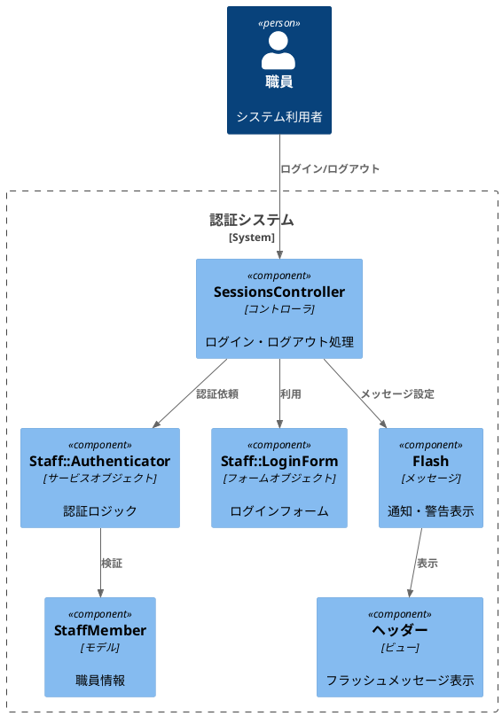
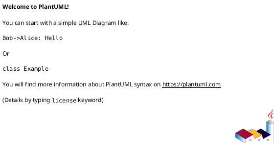

# 作業履歴 2017-01-20

## 概要

2017-01-20の作業内容をまとめています。このジャーナルでは、ユーザー認証機能の拡張に関する作業を記録しています。主にログイン・ログアウト機能のフラッシュメッセージ表示とサービスオブジェクトの実装を行いました。

## ユーザー認証機能の拡張構成図



## 作業内容

### ユーザー認証機能の拡張

ユーザー認証機能を拡張するため、ログイン・ログアウト後のフラッシュメッセージ表示機能と認証処理を行うサービスオブジェクトを実装しました。これにより、ユーザーに対して操作結果のフィードバックを提供し、認証ロジックをコントローラから分離することができました。

#### 変更点の概要

1. フラッシュメッセージの実装
   - ログイン・ログアウト後のフラッシュメッセージ表示
   - 成功・失敗時の異なるメッセージスタイル

2. サービスオブジェクトの導入
   - `Staff::Authenticator`クラスの実装
   - 認証ロジックの分離と再利用性の向上

3. フォームオブジェクトの実装
   - `Staff::LoginForm`クラスの作成
   - ログインフォームの入力値処理

#### 技術的詳細

- フラッシュメッセージ用のCSSスタイル定義
- サービスオブジェクトによる認証処理のカプセル化
- RSpecを使用したサービスオブジェクトのテスト実装

## コミット: ad31b26

### メッセージ

```
メッセージの表示 #4
```

### 変更されたファイル

- M	README.md
- A	app/assets/stylesheets/components/parts/_flash.scss
- M	app/assets/stylesheets/main.scss
- M	app/views/shared/staff/_header.html.erb

### 変更内容

```diff
commit ad31b2625ad6ce51979c2e7382e09af118d225dd
Author: k2works <kakimomokuri@gmail.com>
Date:   Fri Jan 20 21:51:27 2017 +0900

    メッセージの表示 #4

diff --git a/README.md b/README.md
index d66b2e0..6605555 100644
--- a/README.md
+++ b/README.md
@@ -376,6 +376,7 @@ git push heroku master

 #### ログイン・ログアウト後のメッセージ表示
 + フラッシュへの書き込み
++ メッセージの表示

 #### 演習問題

diff --git a/app/assets/stylesheets/components/parts/_flash.scss b/app/assets/stylesheets/components/parts/_flash.scss
new file mode 100644
index 0000000..ab416bb
--- /dev/null
+++ b/app/assets/stylesheets/components/parts/_flash.scss
@@ -0,0 +1,16 @@
+//メッセージ
+
+.Flash {
+  display: inline-block;
+  padding: $narrow $moderate;
+  margin: 0 $wide;
+  font-size: $tiny;
+  color: $very_light_gray;
+
+  &__notice {
+    background-color: $green;
+  }
+  &__alert {
+    background-color: $red;
+  }
+}
\ No newline at end of file
diff --git a/app/assets/stylesheets/main.scss b/app/assets/stylesheets/main.scss
index bdbad80..c3e124a 100644
--- a/app/assets/stylesheets/main.scss
+++ b/app/assets/stylesheets/main.scss
@@ -27,6 +27,9 @@
 // フッター
 @import "./components/common/footer";

+// メッセージ
+@import "./components/parts/flash";
+
 // Common
 //----------------------------
 // ヘッダー
diff --git a/app/views/shared/staff/_header.html.erb b/app/views/shared/staff/_header.html.erb
index f1cd59f..02c5c15 100644
--- a/app/views/shared/staff/_header.html.erb
+++ b/app/views/shared/staff/_header.html.erb
@@ -4,6 +4,12 @@
   </div>
   <div class="Header__head">
     <h1 class="logo"><%= link_to('BAUKIS KAI', staff_root_url, class:'logo logo--staff') %></h1>
+
+    <div class="Flash">
+      <%= content_tag(:span, flash.notice, class: 'Flash__notice') if flash.notice %>
+      <%= content_tag(:span, flash.alert, class: 'Flash__alert') if flash.alert %>
+    </div>
+
   </div>
   <nav class="Header__body SpMenu">
     <ul class="Menu">

```

## コミット: fc4b706

### メッセージ

```
フラッシュへの書き込み #4
```

### 変更されたファイル

- M	README.md
- M	app/controllers/staff/sessions_controller.rb

### 変更内容

```diff
commit fc4b7069c025f5f3fcae644225feb541f428eafd
Author: k2works <kakimomokuri@gmail.com>
Date:   Fri Jan 20 21:14:47 2017 +0900

    フラッシュへの書き込み #4

diff --git a/README.md b/README.md
index 5c75cea..d66b2e0 100644
--- a/README.md
+++ b/README.md
@@ -375,6 +375,8 @@ git push heroku master
 + サービスオブジェクトのspecファイル

 #### ログイン・ログアウト後のメッセージ表示
++ フラッシュへの書き込み
+
 #### 演習問題

 ### ルーティング
diff --git a/app/controllers/staff/sessions_controller.rb b/app/controllers/staff/sessions_controller.rb
index 0d35540..db17793 100644
--- a/app/controllers/staff/sessions_controller.rb
+++ b/app/controllers/staff/sessions_controller.rb
@@ -15,14 +15,17 @@ class Staff::SessionsController < Staff::Base
     end
     if Staff::Authenticator.new(staff_member).authenticate(@form.password)
       session[:staff_member_id] = staff_member.id
+      flash.notice = 'ログインしました。'
       redirect_to :staff_root
     else
+      flash.now.alert = 'メールアドレスまたはパスワードが正しくありません。'
       render action: 'new'
     end
   end

   def destroy
     session.delete(:staff_member_id)
+    flash.notice = 'ログアウトしました。'
     redirect_to :staff_root
   end


```

### 構造変更



## コミット: 5372d70

### メッセージ

```
サービスオブジェクトのspecファイル #4
```

### 変更されたファイル

- M	README.md
- M	spec/factories/staff_members.rb
- A	spec/services/staff/authenticator_spec.rb

### 変更内容

```diff
commit 5372d708650bbdb5e5c786d9d2e6a1ff095130ce
Author: k2works <kakimomokuri@gmail.com>
Date:   Fri Jan 20 21:10:51 2017 +0900

    サービスオブジェクトのspecファイル #4

diff --git a/README.md b/README.md
index f56f71e..5c75cea 100644
--- a/README.md
+++ b/README.md
@@ -372,6 +372,7 @@ git push heroku master

 #### サービスオブジェクト
 + Staff::Authenticatorクラス
++ サービスオブジェクトのspecファイル

 #### ログイン・ログアウト後のメッセージ表示
 #### 演習問題
diff --git a/spec/factories/staff_members.rb b/spec/factories/staff_members.rb
index 19592b2..ce6d3bb 100644
--- a/spec/factories/staff_members.rb
+++ b/spec/factories/staff_members.rb
@@ -24,6 +24,14 @@

 FactoryGirl.define do
   factory :staff_member do
-    
+    sequence(:email) { |n| "meber#{n}@example.com" }
+    family_name '山田'
+    given_name '太郎'
+    family_name_kana 'ヤマダ'
+    given_name_kana 'タロウ'
+    password 'pw'
+    start_date { Date.yesterday }
+    end_date nil
+    suspended false
   end
 end
diff --git a/spec/services/staff/authenticator_spec.rb b/spec/services/staff/authenticator_spec.rb
new file mode 100644
index 0000000..248260b
--- /dev/null
+++ b/spec/services/staff/authenticator_spec.rb
@@ -0,0 +1,41 @@
+require 'rails_helper'
+
+describe Staff::Authenticator do
+  describe '#authenticate' do
+    # 正しいパスワードならtrueを返す
+    it 'should return true given valid password' do
+      m = build(:staff_member)
+      expect(Staff::Authenticator.new(m).authenticate('pw')).to be_truthy
+    end
+
+    # 誤ったパスワードならfalseを返す
+    it 'should return false given invalid password' do
+      m = build(:staff_member)
+      expect(Staff::Authenticator.new(m).authenticate('xy')).to be_falsey
+    end
+
+    # パスワード未設定ならfalseを返す
+    it 'should return false given nil password' do
+      m = build(:staff_member)
+      expect(Staff::Authenticator.new(m).authenticate(nil)).to be_falsey
+    end
+
+    # 停止フラグが立っていればfalseを返す
+    it 'should return false given suspended true' do
+      m = build(:staff_member, suspended: true)
+      expect(Staff::Authenticator.new(m).authenticate('pw')).to be_falsey
+    end
+
+    # 開始前ならfalseを返す
+    it 'should return true given before start date' do
+      m = build(:staff_member, start_date: Date.tomorrow)
+      expect(Staff::Authenticator.new(m).authenticate('pw')).to be_falsey
+    end
+
+    # 終了後ならfalseを返す
+    it 'should return false given after end date' do
+      m = build(:staff_member, end_date: Date.today)
+      expect(Staff::Authenticator.new(m).authenticate('pw')).to be_falsey
+    end
+  end
+end
\ No newline at end of file

```

### 構造変更


## コミット: 35cc44c

### メッセージ

```
Staff::Authenticatorクラス #4
```

### 変更されたファイル

- M	README.md
- M	app/controllers/staff/sessions_controller.rb
- A	app/services/staff/authenticator.rb

### 変更内容

```diff
commit 35cc44c6e9780cef83783714dbf3e8be2fb18d57
Author: k2works <kakimomokuri@gmail.com>
Date:   Fri Jan 20 20:49:11 2017 +0900

    Staff::Authenticatorクラス #4

diff --git a/README.md b/README.md
index 2550255..f56f71e 100644
--- a/README.md
+++ b/README.md
@@ -371,6 +371,8 @@ git push heroku master
 + スタイルシートの作成

 #### サービスオブジェクト
++ Staff::Authenticatorクラス
+
 #### ログイン・ログアウト後のメッセージ表示
 #### 演習問題

diff --git a/app/controllers/staff/sessions_controller.rb b/app/controllers/staff/sessions_controller.rb
index 3280280..0d35540 100644
--- a/app/controllers/staff/sessions_controller.rb
+++ b/app/controllers/staff/sessions_controller.rb
@@ -13,7 +13,7 @@ class Staff::SessionsController < Staff::Base
     if @form.email.present?
       staff_member = StaffMember.find_by(email_for_index: @form.email.downcase)
     end
-    if staff_member
+    if Staff::Authenticator.new(staff_member).authenticate(@form.password)
       session[:staff_member_id] = staff_member.id
       redirect_to :staff_root
     else
diff --git a/app/services/staff/authenticator.rb b/app/services/staff/authenticator.rb
new file mode 100644
index 0000000..27cbe22
--- /dev/null
+++ b/app/services/staff/authenticator.rb
@@ -0,0 +1,14 @@
+class Staff::Authenticator
+  def initialize(staff_member)
+    @staff_member = staff_member
+  end
+
+  def authenticate(raw_password)
+    @staff_member &&
+        !@staff_member.suspended? &&
+        @staff_member.hashed_password? &&
+        @staff_member.start_date <= Date.today &&
+        (@staff_member.end_date.nil? || @staff_member.end_date > Date.today) &&
+        BCrypt::Password.new(@staff_member.hashed_password) == raw_password
+  end
+end
\ No newline at end of file

```

### 構造変更


## コミット: 9166c9d

### メッセージ

```
スタイルシートの作成 #4
```

### 変更されたファイル

- M	README.md
- M	app/assets/stylesheets/main.scss
- A	app/assets/stylesheets/pages/_login.scss
- M	app/views/staff/sessions/new.html.erb

### 変更内容

```diff
commit 9166c9d0a716f9109c574e1435827734bbcf7165
Author: k2works <kakimomokuri@gmail.com>
Date:   Fri Jan 20 20:37:47 2017 +0900

    スタイルシートの作成 #4

diff --git a/README.md b/README.md
index 04a324c..2550255 100644
--- a/README.md
+++ b/README.md
@@ -368,6 +368,7 @@ git push heroku master
 + ログインフォームの作成
 + paramsオブジェクト
 + ログアウト機能の実装
++ スタイルシートの作成

 #### サービスオブジェクト
 #### ログイン・ログアウト後のメッセージ表示
diff --git a/app/assets/stylesheets/main.scss b/app/assets/stylesheets/main.scss
index 0d4f3b2..bdbad80 100644
--- a/app/assets/stylesheets/main.scss
+++ b/app/assets/stylesheets/main.scss
@@ -83,6 +83,9 @@
 // Administrator
 @import "pages/admin";

+// Login
+@import "pages/login";
+
 // ===========================
 // Utils
 // ===========================
diff --git a/app/assets/stylesheets/pages/_login.scss b/app/assets/stylesheets/pages/_login.scss
new file mode 100644
index 0000000..dea90df
--- /dev/null
+++ b/app/assets/stylesheets/pages/_login.scss
@@ -0,0 +1,26 @@
+@charset 'utf-8';
+
+// =====================
+// ログインページ固有のスタイル
+// =====================
+
+.Login {
+  width: 400px;
+  margin: $wide * 2 auto;
+  padding: $wide * 2;
+  border-radius: $wide;
+  border: solid 4px $dark_cyan;
+  background-color: $very_light_gray;
+
+  &__head {
+    background-color: transparent;
+    color: $very_dark_cyan;
+    font-size: $huge;
+    font-weight: bold;
+  }
+
+  &__body {
+  }
+
+}
+
diff --git a/app/views/staff/sessions/new.html.erb b/app/views/staff/sessions/new.html.erb
index a38f2de..866f5ee 100644
--- a/app/views/staff/sessions/new.html.erb
+++ b/app/views/staff/sessions/new.html.erb
@@ -1,22 +1,21 @@
 <% @title = 'ログイン' %>
-<section class="Section">
-  <h1 class="Staff__title"><%= @title %></h1>
-</section>
-
 <section class="Section l-column">
-  <div class="Form__login">
-    <%= bootstrap_form_for @form, url: :staff_session do |f| %>
-        <div>
-          <%= f.label :email, 'メールアドレス' %>
-          <%= f.text_field :email %>
-        </div>
-        <div>
-          <%= f.label :password, 'パスワード' %>
-          <%= f.password_field :password %>
-        </div>
-        <div>
-          <%= f.submit 'ログイン' %>
-        </div>
-    <% end %>
+  <div class="Login">
+    <h1 class="Login__head"><%= @title %></h1>
+    <div class="Login__body">
+      <%= bootstrap_form_for @form, url: :staff_session do |f| %>
+          <div>
+            <%= f.label :email, 'メールアドレス' %>
+            <%= f.text_field :email %>
+          </div>
+          <div>
+            <%= f.label :password, 'パスワード' %>
+            <%= f.password_field :password %>
+          </div>
+          <div>
+            <%= f.submit 'ログイン' %>
+          </div>
+      <% end %>
+    </div>
   </div>
 </section>
\ No newline at end of file

```

## コミット: b555a0a

### メッセージ

```
ログアウト機能の実装 #4
```

### 変更されたファイル

- M	README.md
- M	app/controllers/staff/sessions_controller.rb

### 変更内容

```diff
commit b555a0ae10eb2edf1b825dc01313949614113e62
Author: k2works <kakimomokuri@gmail.com>
Date:   Fri Jan 20 20:09:53 2017 +0900

    ログアウト機能の実装 #4

diff --git a/README.md b/README.md
index d7f863f..04a324c 100644
--- a/README.md
+++ b/README.md
@@ -367,6 +367,7 @@ git push heroku master
 + フォームオブジェクトとは
 + ログインフォームの作成
 + paramsオブジェクト
++ ログアウト機能の実装

 #### サービスオブジェクト
 #### ログイン・ログアウト後のメッセージ表示
diff --git a/app/controllers/staff/sessions_controller.rb b/app/controllers/staff/sessions_controller.rb
index 42c01e6..3280280 100644
--- a/app/controllers/staff/sessions_controller.rb
+++ b/app/controllers/staff/sessions_controller.rb
@@ -21,6 +21,11 @@ class Staff::SessionsController < Staff::Base
     end
   end

+  def destroy
+    session.delete(:staff_member_id)
+    redirect_to :staff_root
+  end
+
   private
   def post_params
     params.require(:staff_login_form).permit(

```

### 構造変更


## コミット: 839a362

### メッセージ

```
paramsオブジェクト #4
```

### 変更されたファイル

- M	README.md
- M	app/controllers/staff/sessions_controller.rb
- M	app/views/shared/staff/_header.html.erb

### 変更内容

```diff
commit 839a3626de835012d1cfa40311484c01831a5155
Author: k2works <kakimomokuri@gmail.com>
Date:   Fri Jan 20 20:00:50 2017 +0900

    paramsオブジェクト #4

diff --git a/README.md b/README.md
index c6ae8d6..d7f863f 100644
--- a/README.md
+++ b/README.md
@@ -366,6 +366,7 @@ git push heroku master
 + フォームオブジェクト
 + フォームオブジェクトとは
 + ログインフォームの作成
++ paramsオブジェクト

 #### サービスオブジェクト
 #### ログイン・ログアウト後のメッセージ表示
diff --git a/app/controllers/staff/sessions_controller.rb b/app/controllers/staff/sessions_controller.rb
index 8768286..42c01e6 100644
--- a/app/controllers/staff/sessions_controller.rb
+++ b/app/controllers/staff/sessions_controller.rb
@@ -7,4 +7,26 @@ class Staff::SessionsController < Staff::Base
       render action: 'new'
     end
   end
+
+  def create
+    @form = Staff::LoginForm.new(post_params)
+    if @form.email.present?
+      staff_member = StaffMember.find_by(email_for_index: @form.email.downcase)
+    end
+    if staff_member
+      session[:staff_member_id] = staff_member.id
+      redirect_to :staff_root
+    else
+      render action: 'new'
+    end
+  end
+
+  private
+  def post_params
+    params.require(:staff_login_form).permit(
+                   :email,
+                   :password
+    )
+  end
+
 end
diff --git a/app/views/shared/staff/_header.html.erb b/app/views/shared/staff/_header.html.erb
index e28bfeb..f1cd59f 100644
--- a/app/views/shared/staff/_header.html.erb
+++ b/app/views/shared/staff/_header.html.erb
@@ -11,7 +11,7 @@
     </ul>
   </nav>
   <%= if current_staff_member
-        link_to 'ログアウト', :staff_session, method:delete, class: 'login--staff'
+        link_to 'ログアウト', :staff_session, method: :delete, class: 'login--staff'
       else
         link_to 'ログイン', :staff_login, class: 'login--staff'
       end

```

### 構造変更


## コミット: c33fd6a

### メッセージ

```
ログインフォームの作成 #4
```

### 変更されたファイル

- M	README.md
- A	app/controllers/staff/sessions_controller.rb
- A	app/views/staff/sessions/new.html.erb
- A	config/locales/ja.yml

### 変更内容

```diff
commit c33fd6a8e628395789896a3c6ec6396f2ac08306
Author: k2works <kakimomokuri@gmail.com>
Date:   Fri Jan 20 19:38:57 2017 +0900

    ログインフォームの作成 #4

diff --git a/README.md b/README.md
index 60c2f16..c6ae8d6 100644
--- a/README.md
+++ b/README.md
@@ -365,6 +365,7 @@ git push heroku master
 + フォームの基礎知識
 + フォームオブジェクト
 + フォームオブジェクトとは
++ ログインフォームの作成

 #### サービスオブジェクト
 #### ログイン・ログアウト後のメッセージ表示
diff --git a/app/controllers/staff/sessions_controller.rb b/app/controllers/staff/sessions_controller.rb
new file mode 100644
index 0000000..8768286
--- /dev/null
+++ b/app/controllers/staff/sessions_controller.rb
@@ -0,0 +1,10 @@
+class Staff::SessionsController < Staff::Base
+  def new
+    if current_staff_member
+      redirect_to :staff_root
+    else
+      @form = Staff::LoginForm.new
+      render action: 'new'
+    end
+  end
+end
diff --git a/app/views/staff/sessions/new.html.erb b/app/views/staff/sessions/new.html.erb
new file mode 100644
index 0000000..a38f2de
--- /dev/null
+++ b/app/views/staff/sessions/new.html.erb
@@ -0,0 +1,22 @@
+<% @title = 'ログイン' %>
+<section class="Section">
+  <h1 class="Staff__title"><%= @title %></h1>
+</section>
+
+<section class="Section l-column">
+  <div class="Form__login">
+    <%= bootstrap_form_for @form, url: :staff_session do |f| %>
+        <div>
+          <%= f.label :email, 'メールアドレス' %>
+          <%= f.text_field :email %>
+        </div>
+        <div>
+          <%= f.label :password, 'パスワード' %>
+          <%= f.password_field :password %>
+        </div>
+        <div>
+          <%= f.submit 'ログイン' %>
+        </div>
+    <% end %>
+  </div>
+</section>
\ No newline at end of file
diff --git a/config/locales/ja.yml b/config/locales/ja.yml
new file mode 100644
index 0000000..9ad8ae1
--- /dev/null
+++ b/config/locales/ja.yml
@@ -0,0 +1,2 @@
+ja:
+  hello: "Hello world"
\ No newline at end of file

```

### 構造変更


## コミット: 6b4cb99

### メッセージ

```
フォームオブジェクトとは #4
```

### 変更されたファイル

- M	README.md
- A	app/forms/staff/login_form.rb

### 変更内容

```diff
commit 6b4cb99432d6262b7848e0bc7c490ca586a05147
Author: k2works <kakimomokuri@gmail.com>
Date:   Fri Jan 20 19:07:15 2017 +0900

    フォームオブジェクトとは #4

diff --git a/README.md b/README.md
index 2566d0c..60c2f16 100644
--- a/README.md
+++ b/README.md
@@ -362,6 +362,10 @@ git push heroku master

 ### ユーザー認証(2)
 #### フォームオブジェクト
++ フォームの基礎知識
++ フォームオブジェクト
++ フォームオブジェクトとは
+
 #### サービスオブジェクト
 #### ログイン・ログアウト後のメッセージ表示
 #### 演習問題
diff --git a/app/forms/staff/login_form.rb b/app/forms/staff/login_form.rb
new file mode 100644
index 0000000..b6bbb7c
--- /dev/null
+++ b/app/forms/staff/login_form.rb
@@ -0,0 +1,5 @@
+class Staff::LoginForm
+  include ActiveModel::Model
+
+  attr_accessor :email, :password
+end
\ No newline at end of file

```

## コミット: 97f2e61

### メッセージ

```
ユーザー認証(2) #4
```

### 変更されたファイル

- M	README.md

### 変更内容

```diff
commit 97f2e61f50b550b3d239b33f1b90ac04d3e6e9ed
Author: k2works <kakimomokuri@gmail.com>
Date:   Fri Jan 20 19:03:46 2017 +0900

    ユーザー認証(2) #4

diff --git a/README.md b/README.md
index 8fcd2ec..2566d0c 100644
--- a/README.md
+++ b/README.md
@@ -360,7 +360,12 @@ git push heroku master
 + ルーティング追加
 + リンクの追加

-### ユーザー認証
+### ユーザー認証(2)
+#### フォームオブジェクト
+#### サービスオブジェクト
+#### ログイン・ログアウト後のメッセージ表示
+#### 演習問題
+
 ### ルーティング
 ### レコードの表示、新規作成、更新、削除
 ### String Parameters

```

## コミット: fd7aa50

### メッセージ

```
リンクの追加 #3
```

### 変更されたファイル

- M	README.md
- M	app/assets/stylesheets/pages/_admin.scss
- M	app/views/shared/admin/_header.html.erb

### 変更内容

```diff
commit fd7aa5050a04162cc7f5bf9309ba2ad9fee7d80a
Author: k2works <kakimomokuri@gmail.com>
Date:   Fri Jan 20 10:08:27 2017 +0900

    リンクの追加 #3

diff --git a/README.md b/README.md
index 9efbd39..8fcd2ec 100644
--- a/README.md
+++ b/README.md
@@ -358,6 +358,7 @@ git push heroku master
 + シードデータ作成
 + コントローラベースクラス作成
 + ルーティング追加
++ リンクの追加

 ### ユーザー認証
 ### ルーティング
diff --git a/app/assets/stylesheets/pages/_admin.scss b/app/assets/stylesheets/pages/_admin.scss
index 1cc4ad7..a44b621 100644
--- a/app/assets/stylesheets/pages/_admin.scss
+++ b/app/assets/stylesheets/pages/_admin.scss
@@ -11,6 +11,19 @@ html, body {
   height: 100%;
 }

+.Header__head {
+  text-align: left;
+}
+
+.logo--admin {
+  color: $color-white;
+}
+
+.login--admin {
+  float: right;
+  color: $very_light_gray;
+}
+
 .Admin {
   &__wrapper {
     position: relative;
diff --git a/app/views/shared/admin/_header.html.erb b/app/views/shared/admin/_header.html.erb
index 83fa2a1..40dbea6 100644
--- a/app/views/shared/admin/_header.html.erb
+++ b/app/views/shared/admin/_header.html.erb
@@ -10,4 +10,10 @@
       <li class="Menu__item"><a href="#"></a></li>
     </ul>
   </nav>
+  <%= if current_administrator
+        link_to 'ログアウト', :staff_session, method:delete, class: 'login--staff'
+      else
+        link_to 'ログイン', :staff_login, class: 'login--staff'
+      end
+  %>
 </header>
\ No newline at end of file

```

## コミット: cec5e4c

### メッセージ

```
ルーティング追加 #3
```

### 変更されたファイル

- M	README.md
- M	config/routes.rb

### 変更内容

```diff
commit cec5e4c644bec74df2ae9ddfed6c92c9aa29a2b5
Author: k2works <kakimomokuri@gmail.com>
Date:   Fri Jan 20 09:59:01 2017 +0900

    ルーティング追加 #3

diff --git a/README.md b/README.md
index f244fc3..9efbd39 100644
--- a/README.md
+++ b/README.md
@@ -357,6 +357,7 @@ git push heroku master
 + パスワードメソッド作成
 + シードデータ作成
 + コントローラベースクラス作成
++ ルーティング追加

 ### ユーザー認証
 ### ルーティング
diff --git a/config/routes.rb b/config/routes.rb
index 17026a1..59a0d54 100644
--- a/config/routes.rb
+++ b/config/routes.rb
@@ -7,6 +7,9 @@
 #            staff_session POST   /staff/session(.:format)            staff/sessions#create
 #                          DELETE /staff/session(.:format)            staff/sessions#destroy
 #               admin_root GET    /admin(.:format)                    admin/top#index
+#              admin_login GET    /admin/login(.:format)              admin/sessions#new
+#            admin_session POST   /admin/session(.:format)            admin/sessions#create
+#                          DELETE /admin/session(.:format)            admin/sessions#destroy
 #            customer_root GET    /customer(.:format)                 customer/top#index
 #   customer_article_index GET    /customer/article/index(.:format)   customer/article#index
 #  customer_campaign_index GET    /customer/campaign/index(.:format)  customer/campaign#index
@@ -27,6 +30,9 @@ Rails.application.routes.draw do

   namespace :admin do
     root 'top#index'
+    get    'login'   => 'sessions#new', as: :login
+    post   'session' => 'sessions#create', as: :session
+    delete 'session' => 'sessions#destroy'
   end

   namespace :customer do

```

## コミット: c4d8027

### メッセージ

```
コントローラベースクラス作成 #3
```

### 変更されたファイル

- M	README.md
- A	app/controllers/admin/base.rb
- M	app/controllers/admin/top_controller.rb

### 変更内容

```diff
commit c4d80274c6d3606f5f4b2f4432db83cf94b06728
Author: k2works <kakimomokuri@gmail.com>
Date:   Fri Jan 20 09:50:04 2017 +0900

    コントローラベースクラス作成 #3

diff --git a/README.md b/README.md
index f03ecee..f244fc3 100644
--- a/README.md
+++ b/README.md
@@ -356,6 +356,7 @@ git push heroku master
 + パスワードメソッドテスト作成
 + パスワードメソッド作成
 + シードデータ作成
++ コントローラベースクラス作成

 ### ユーザー認証
 ### ルーティング
diff --git a/app/controllers/admin/base.rb b/app/controllers/admin/base.rb
new file mode 100644
index 0000000..8e245f0
--- /dev/null
+++ b/app/controllers/admin/base.rb
@@ -0,0 +1,11 @@
+class Admin::Base < ApplicationController
+  private
+  def current_administrator
+    if session[:administrator_id]
+      @current_administrator ||=
+          Administrator.find_by(id: session[:administrator_id_id])
+    end
+  end
+
+  helper_method :current_administrator
+end
\ No newline at end of file
diff --git a/app/controllers/admin/top_controller.rb b/app/controllers/admin/top_controller.rb
index d9a88b5..e90d00d 100644
--- a/app/controllers/admin/top_controller.rb
+++ b/app/controllers/admin/top_controller.rb
@@ -1,4 +1,4 @@
-class Admin::TopController < ApplicationController
+class Admin::TopController < Admin::Base
   def index
     render action: 'index'
   end

```

### 構造変更


## コミット: 5064a51

### メッセージ

```
シードデータ作成 #3
```

### 変更されたファイル

- M	README.md
- A	db/seed/development/administrators.rb
- M	db/seeds.rb

### 変更内容

```diff
commit 5064a51c7b5d76ab5e41b9926f2cf1dc9b0c93ea
Author: k2works <kakimomokuri@gmail.com>
Date:   Fri Jan 20 09:41:46 2017 +0900

    シードデータ作成 #3

diff --git a/README.md b/README.md
index ef7270f..f03ecee 100644
--- a/README.md
+++ b/README.md
@@ -355,6 +355,7 @@ git push heroku master
 + コールバック追加
 + パスワードメソッドテスト作成
 + パスワードメソッド作成
++ シードデータ作成

 ### ユーザー認証
 ### ルーティング
diff --git a/db/seed/development/administrators.rb b/db/seed/development/administrators.rb
new file mode 100644
index 0000000..61dc988
--- /dev/null
+++ b/db/seed/development/administrators.rb
@@ -0,0 +1,4 @@
+Administrator.create(
+               email: 'hanako@example.com',
+               password: 'foobar'
+)
\ No newline at end of file
diff --git a/db/seeds.rb b/db/seeds.rb
index 3549c1d..aa5909a 100644
--- a/db/seeds.rb
+++ b/db/seeds.rb
@@ -6,7 +6,7 @@

 #   movies = Movie.create([{ name: 'Star Wars' }, { name: 'Lord of the Rings' }])
 #   Character.create(name: 'Luke', movie: movies.first)
-table_names = %w(staff_members)
+table_names = %w(staff_members administrators)
 table_names.each do |table_name|
   path = Rails.root.join('db','seed',Rails.env, "#{table_name}.rb")
   if File.exist?(path)

```

## コミット: 5f01188

### メッセージ

```
パスワードメソッド作成 #3
```

### 変更されたファイル

- M	README.md
- M	app/models/administrator.rb

### 変更内容

```diff
commit 5f01188197b6d1b681bb5518f9aab553e07b82bf
Author: k2works <kakimomokuri@gmail.com>
Date:   Fri Jan 20 09:36:25 2017 +0900

    パスワードメソッド作成 #3

diff --git a/README.md b/README.md
index e5b3977..ef7270f 100644
--- a/README.md
+++ b/README.md
@@ -354,6 +354,7 @@ git push heroku master
 + マイグレーション
 + コールバック追加
 + パスワードメソッドテスト作成
++ パスワードメソッド作成

 ### ユーザー認証
 ### ルーティング
diff --git a/app/models/administrator.rb b/app/models/administrator.rb
index 913908c..6ddd486 100644
--- a/app/models/administrator.rb
+++ b/app/models/administrator.rb
@@ -20,4 +20,11 @@ class Administrator < ApplicationRecord
     self.email_for_index = email.downcase if email
   end

+  def password=(raw_password)
+    if raw_password.kind_of?(String)
+      self.hashed_password = BCrypt::Password.create(raw_password)
+    elsif raw_password.nil?
+      self.hashed_password = nil
+    end
+  end
 end

```

### 構造変更


## コミット: 4f2eab5

### メッセージ

```
パスワードメソッドテスト作成 #3
```

### 変更されたファイル

- M	README.md
- M	spec/models/administrator_spec.rb

### 変更内容

```diff
commit 4f2eab547c0841d7e59a0cfb0f0b4281eaa0af8d
Author: k2works <kakimomokuri@gmail.com>
Date:   Fri Jan 20 09:32:31 2017 +0900

    パスワードメソッドテスト作成 #3

diff --git a/README.md b/README.md
index 1fdb467..e5b3977 100644
--- a/README.md
+++ b/README.md
@@ -353,6 +353,7 @@ git push heroku master
 + 管理者モデル作成
 + マイグレーション
 + コールバック追加
++ パスワードメソッドテスト作成

 ### ユーザー認証
 ### ルーティング
diff --git a/spec/models/administrator_spec.rb b/spec/models/administrator_spec.rb
index 8287e77..a03f296 100644
--- a/spec/models/administrator_spec.rb
+++ b/spec/models/administrator_spec.rb
@@ -18,5 +18,20 @@
 require 'rails_helper'

 RSpec.describe Administrator, type: :model do
-  pending "add some examples to (or delete) #{__FILE__}"
+  describe '#password=' do
+    # 文字列を与えると、hashed_passwordは長さ60の文字列になる
+    it 'is a string of length 60 of hashed_password when giving a string' do
+      admin = Administrator.new
+      admin.password = 'baukis'
+      expect(admin.hashed_password).to be_kind_of(String)
+      expect(admin.hashed_password.size).to eq(60)
+    end
+
+    # nilを与えると、hashed_passwordはnilになる
+    it 'is nil of hashed_password when giving a nil' do
+      admin = Administrator.new(hashed_password: 'x')
+      admin.password = nil
+      expect(admin.hashed_password).to be_nil
+    end
+  end
 end

```

### 構造変更


## コミット: 8ecfc1f

### メッセージ

```
コールバック追加 #3
```

### 変更されたファイル

- M	README.md
- M	app/models/administrator.rb

### 変更内容

```diff
commit 8ecfc1f77882af95f528522ee1e66a3c86cb2104
Author: k2works <kakimomokuri@gmail.com>
Date:   Fri Jan 20 09:27:15 2017 +0900

    コールバック追加 #3

diff --git a/README.md b/README.md
index 386b877..1fdb467 100644
--- a/README.md
+++ b/README.md
@@ -352,6 +352,7 @@ git push heroku master
 #### 演習問題
 + 管理者モデル作成
 + マイグレーション
++ コールバック追加

 ### ユーザー認証
 ### ルーティング
diff --git a/app/models/administrator.rb b/app/models/administrator.rb
index 7eea65d..913908c 100644
--- a/app/models/administrator.rb
+++ b/app/models/administrator.rb
@@ -16,4 +16,8 @@
 #

 class Administrator < ApplicationRecord
+  before_validation do
+    self.email_for_index = email.downcase if email
+  end
+
 end

```

### 構造変更


## コミット: dca861b

### メッセージ

```
マイグレーション #3
```

### 変更されたファイル

- M	README.md
- M	app/models/administrator.rb
- M	db/migrate/20170120000741_create_administrators.rb
- M	db/schema.rb
- M	spec/factories/administrators.rb
- M	spec/models/administrator_spec.rb

### 変更内容

```diff
commit dca861b3cdacaf5380757e4a3b346a785e0687c4
Author: k2works <kakimomokuri@gmail.com>
Date:   Fri Jan 20 09:23:23 2017 +0900

    マイグレーション #3

diff --git a/README.md b/README.md
index 6d59274..386b877 100644
--- a/README.md
+++ b/README.md
@@ -351,6 +351,7 @@ git push heroku master

 #### 演習問題
 + 管理者モデル作成
++ マイグレーション

 ### ユーザー認証
 ### ルーティング
diff --git a/app/models/administrator.rb b/app/models/administrator.rb
index c01d07e..7eea65d 100644
--- a/app/models/administrator.rb
+++ b/app/models/administrator.rb
@@ -1,2 +1,19 @@
+# == Schema Information
+#
+# Table name: administrators # 管理者
+#
+#  id              :integer          not null, primary key
+#  email           :string(255)      not null               # メールアドレス
+#  email_for_index :string(255)      not null               # 索引用メールアドレス
+#  hashed_password :string(255)                             # パスワード
+#  suspended       :boolean          default("0"), not null # 停止フラグ
+#  created_at      :datetime         not null
+#  updated_at      :datetime         not null
+#
+# Indexes
+#
+#  index_administrators_on_email_for_index  (email_for_index) UNIQUE
+#
+
 class Administrator < ApplicationRecord
 end
diff --git a/db/migrate/20170120000741_create_administrators.rb b/db/migrate/20170120000741_create_administrators.rb
index 29819ba..68a7747 100644
--- a/db/migrate/20170120000741_create_administrators.rb
+++ b/db/migrate/20170120000741_create_administrators.rb
@@ -1,8 +1,15 @@
 class CreateAdministrators < ActiveRecord::Migration[5.0]
   def change
-    create_table :administrators do |t|
+    create_table :administrators, comment: '管理者' do |t|
+      t.string :email, null: false, comment: 'メールアドレス'
+      t.string :email_for_index, null: false, comment: '索引用メールアドレス'
+      t.string :hashed_password, comment: 'パスワード'
+      t.boolean :suspended, null: false, default: false, comment: '停止フラグ'
+

       t.timestamps
     end
+
+    add_index :administrators, :email_for_index, unique: true
   end
 end
diff --git a/db/schema.rb b/db/schema.rb
index 8209b42..b5f43b8 100644
--- a/db/schema.rb
+++ b/db/schema.rb
@@ -10,7 +10,17 @@
 #
 # It's strongly recommended that you check this file into your version control system.

-ActiveRecord::Schema.define(version: 20170118073759) do
+ActiveRecord::Schema.define(version: 20170120000741) do
+
+  create_table "administrators", force: :cascade do |t|
+    t.string   "email",                           null: false
+    t.string   "email_for_index",                 null: false
+    t.string   "hashed_password"
+    t.boolean  "suspended",       default: false, null: false
+    t.datetime "created_at",                      null: false
+    t.datetime "updated_at",                      null: false
+    t.index ["email_for_index"], name: "index_administrators_on_email_for_index", unique: true
+  end

   create_table "staff_members", force: :cascade do |t|
     t.string   "email",                            null: false
diff --git a/spec/factories/administrators.rb b/spec/factories/administrators.rb
index c27d055..ee37bdc 100644
--- a/spec/factories/administrators.rb
+++ b/spec/factories/administrators.rb
@@ -1,3 +1,20 @@
+# == Schema Information
+#
+# Table name: administrators # 管理者
+#
+#  id              :integer          not null, primary key
+#  email           :string(255)      not null               # メールアドレス
+#  email_for_index :string(255)      not null               # 索引用メールアドレス
+#  hashed_password :string(255)                             # パスワード
+#  suspended       :boolean          default("0"), not null # 停止フラグ
+#  created_at      :datetime         not null
+#  updated_at      :datetime         not null
+#
+# Indexes
+#
+#  index_administrators_on_email_for_index  (email_for_index) UNIQUE
+#
+
 FactoryGirl.define do
   factory :administrator do

diff --git a/spec/models/administrator_spec.rb b/spec/models/administrator_spec.rb
index da3b2ad..8287e77 100644
--- a/spec/models/administrator_spec.rb
+++ b/spec/models/administrator_spec.rb
@@ -1,3 +1,20 @@
+# == Schema Information
+#
+# Table name: administrators # 管理者
+#
+#  id              :integer          not null, primary key
+#  email           :string(255)      not null               # メールアドレス
+#  email_for_index :string(255)      not null               # 索引用メールアドレス
+#  hashed_password :string(255)                             # パスワード
+#  suspended       :boolean          default("0"), not null # 停止フラグ
+#  created_at      :datetime         not null
+#  updated_at      :datetime         not null
+#
+# Indexes
+#
+#  index_administrators_on_email_for_index  (email_for_index) UNIQUE
+#
+
 require 'rails_helper'

 RSpec.describe Administrator, type: :model do

```

### 構造変更


## コミット: 5641609

### メッセージ

```
管理者モデル作成 #3
```

### 変更されたファイル

- M	README.md
- A	app/models/administrator.rb
- A	db/migrate/20170120000741_create_administrators.rb
- A	spec/factories/administrators.rb
- A	spec/models/administrator_spec.rb

### 変更内容

```diff
commit 564160942dce737616788ba548aed908ff838a5b
Author: k2works <kakimomokuri@gmail.com>
Date:   Fri Jan 20 09:10:05 2017 +0900

    管理者モデル作成 #3

diff --git a/README.md b/README.md
index 50acaf7..6d59274 100644
--- a/README.md
+++ b/README.md
@@ -349,6 +349,9 @@ git push heroku master
 + ルーティングの決定
 + リンクの設置

+#### 演習問題
++ 管理者モデル作成
+
 ### ユーザー認証
 ### ルーティング
 ### レコードの表示、新規作成、更新、削除
diff --git a/app/models/administrator.rb b/app/models/administrator.rb
new file mode 100644
index 0000000..c01d07e
--- /dev/null
+++ b/app/models/administrator.rb
@@ -0,0 +1,2 @@
+class Administrator < ApplicationRecord
+end
diff --git a/db/migrate/20170120000741_create_administrators.rb b/db/migrate/20170120000741_create_administrators.rb
new file mode 100644
index 0000000..29819ba
--- /dev/null
+++ b/db/migrate/20170120000741_create_administrators.rb
@@ -0,0 +1,8 @@
+class CreateAdministrators < ActiveRecord::Migration[5.0]
+  def change
+    create_table :administrators do |t|
+
+      t.timestamps
+    end
+  end
+end
diff --git a/spec/factories/administrators.rb b/spec/factories/administrators.rb
new file mode 100644
index 0000000..c27d055
--- /dev/null
+++ b/spec/factories/administrators.rb
@@ -0,0 +1,5 @@
+FactoryGirl.define do
+  factory :administrator do
+    
+  end
+end
diff --git a/spec/models/administrator_spec.rb b/spec/models/administrator_spec.rb
new file mode 100644
index 0000000..da3b2ad
--- /dev/null
+++ b/spec/models/administrator_spec.rb
@@ -0,0 +1,5 @@
+require 'rails_helper'
+
+RSpec.describe Administrator, type: :model do
+  pending "add some examples to (or delete) #{__FILE__}"
+end

```

### 構造変更


