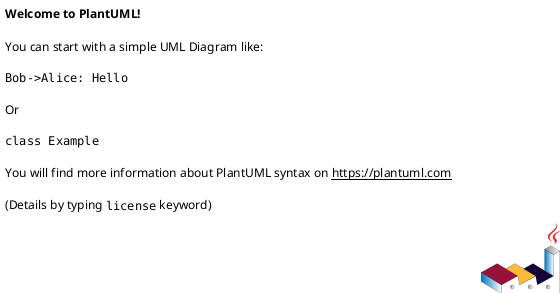

# 作業履歴 2017-01-21

## 概要

2017-01-21の作業内容をまとめています。

## コミット: 4275589

### メッセージ

```
ユーザー認証機能
```

### 変更されたファイル

- M	app/views/admin/top/index.html.erb
- M	app/views/staff/top/index.html.erb

### 変更内容

```diff
commit 4275589d1068bb49ceca3fc15a153a66363f5e52
Author: k2works <kakimomokuri@gmail.com>
Date:   Sat Jan 21 19:04:21 2017 +0900

    ユーザー認証機能

diff --git a/app/views/admin/top/index.html.erb b/app/views/admin/top/index.html.erb
index 81d36bc..fa3f9a8 100644
--- a/app/views/admin/top/index.html.erb
+++ b/app/views/admin/top/index.html.erb
@@ -9,7 +9,11 @@
   </div>
   <ol class="NewsList">
     <li class="NewsList__item">
-      <time class="NewsList__head" datatime="2017-1-17">2016.10.12</time>
+      <time class="NewsList__head" datatime="2017-1-21">2017.1.21</time>
+      <span class="NewsList__body">ログイン機能を追加</span>
+    </li>
+    <li class="NewsList__item">
+      <time class="NewsList__head" datatime="2017-1-17">2017.1.17</time>
       <span class="NewsList__body">開発を開始しました</span>
     </li>
   </ol>
diff --git a/app/views/staff/top/index.html.erb b/app/views/staff/top/index.html.erb
index feba999..f510527 100644
--- a/app/views/staff/top/index.html.erb
+++ b/app/views/staff/top/index.html.erb
@@ -8,6 +8,10 @@
     <h2 class="sectionLabel">お知らせ</h2>
   </div>
   <ol class="NewsList">
+    <li class="NewsList__item">
+      <time class="NewsList__head" datatime="2017-1-21">2017.1.21</time>
+      <span class="NewsList__body">ログイン機能を追加</span>
+    </li>
     <li class="NewsList__item">
       <time class="NewsList__head" datatime="2017-1-18">2017.1.18</time>
       <span class="NewsList__body">エラーページを追加</span>

```

## コミット: 2291956

### メッセージ

```
i18nの設定と適用
```

### 変更されたファイル

- M	.idea/.rakeTasks
- M	Gemfile
- M	README.md
- M	app/views/admin/sessions/new.html.erb
- M	app/views/admin/shared/_header.html.erb
- M	app/views/staff/sessions/new.html.erb
- M	app/views/staff/shared/_header.html.erb
- M	config/locales/ja.yml
- A	config/locales/models/models.yml
- A	config/locales/views/views.yml

### 変更内容

```diff
commit 2291956c5041add7e315ce47059d9a61f4c16b85
Author: k2works <kakimomokuri@gmail.com>
Date:   Sat Jan 21 19:02:37 2017 +0900

    i18nの設定と適用

diff --git a/.idea/.rakeTasks b/.idea/.rakeTasks
index 9cf55a4..5b28e63 100644
--- a/.idea/.rakeTasks
+++ b/.idea/.rakeTasks
@@ -4,4 +4,4 @@ You are allowed to:
 1. Remove rake task
 2. Add existing rake tasks
 To add existing rake tasks automatically delete this file and reload the project.
---><RakeGroup description="" fullCmd="" taksId="rake"><RakeTask description="List versions of all Rails frameworks and the environment" fullCmd="about" taksId="about" /><RakeTask description="Add schema information (as comments) to model and fixture files" fullCmd="annotate_models" taksId="annotate_models" /><RakeTask description="Adds the route map to routes.rb" fullCmd="annotate_routes" taksId="annotate_routes" /><RakeGroup description="" fullCmd="" taksId="app"><RakeTask description="Applies the template supplied by LOCATION=(/path/to/template) or URL" fullCmd="app:template" taksId="template" /><RakeTask description="Update configs and some other initially generated files (or use just update:configs or update:bin)" fullCmd="app:update" taksId="update" /><RakeGroup description="" fullCmd="" taksId="templates"><RakeTask description="" fullCmd="app:templates:copy" taksId="copy" /></RakeGroup><RakeGroup description="" fullCmd="" taksId="update"><RakeTask description="" fullCmd="app:update:bin" taksId="bin" /><RakeTask description="" fullCmd="app:update:configs" taksId="configs" /><RakeTask description="" fullCmd="app:update:upgrade_guide_info" taksId="upgrade_guide_info" /></RakeGroup></RakeGroup><RakeGroup description="" fullCmd="" taksId="assets"><RakeTask description="Remove old compiled assets" fullCmd="assets:clean[keep]" taksId="clean[keep]" /><RakeTask description="Remove compiled assets" fullCmd="assets:clobber" taksId="clobber" /><RakeTask description="Load asset compile environment" fullCmd="assets:environment" taksId="environment" /><RakeTask description="Compile all the assets named in config.assets.precompile" fullCmd="assets:precompile" taksId="precompile" /><RakeTask description="" fullCmd="assets:clean" taksId="clean" /></RakeGroup><RakeGroup description="" fullCmd="" taksId="cache_digests"><RakeTask description="Lookup first-level dependencies for TEMPLATE (like messages/show or comments/_comment.html)" fullCmd="cache_digests:dependencies" taksId="dependencies" /><RakeTask description="Lookup nested dependencies for TEMPLATE (like messages/show or comments/_comment.html)" fullCmd="cache_digests:nested_dependencies" taksId="nested_dependencies" /></RakeGroup><RakeGroup description="" fullCmd="" taksId="db"><RakeTask description="Creates the database from DATABASE_URL or config/database.yml for the current RAILS_ENV (use db:create:all to create all databases in the config). Without RAILS_ENV or when RAILS_ENV is development, it defaults to creating the development and test databases" fullCmd="db:create" taksId="create" /><RakeTask description="Drops the database from DATABASE_URL or config/database.yml for the current RAILS_ENV (use db:drop:all to drop all databases in the config). Without RAILS_ENV or when RAILS_ENV is development, it defaults to dropping the development and test databases" fullCmd="db:drop" taksId="drop" /><RakeGroup description="" fullCmd="" taksId="environment"><RakeTask description="Set the environment value for the database" fullCmd="db:environment:set" taksId="set" /></RakeGroup><RakeGroup description="" fullCmd="" taksId="fixtures"><RakeTask description="Loads fixtures into the current environment's database" fullCmd="db:fixtures:load" taksId="load" /><RakeTask description="" fullCmd="db:fixtures:identify" taksId="identify" /></RakeGroup><RakeTask description="Migrate the database (options: VERSION=x, VERBOSE=false, SCOPE=blog)" fullCmd="db:migrate" taksId="migrate" /><RakeGroup description="" fullCmd="" taksId="migrate"><RakeTask description="Display status of migrations" fullCmd="db:migrate:status" taksId="status" /><RakeTask description="" fullCmd="db:migrate:change" taksId="change" /><RakeTask description="" fullCmd="db:migrate:down" taksId="down" /><RakeTask description="" fullCmd="db:migrate:redo" taksId="redo" /><RakeTask description="" fullCmd="db:migrate:reset" taksId="reset" /><RakeTask description="" fullCmd="db:migrate:up" taksId="up" /></RakeGroup><RakeTask description="Rolls the schema back to the previous version (specify steps w/ STEP=n)" fullCmd="db:rollback" taksId="rollback" /><RakeGroup description="" fullCmd="" taksId="schema"><RakeGroup description="" fullCmd="" taksId="cache"><RakeTask description="Clears a db/schema_cache.dump file" fullCmd="db:schema:cache:clear" taksId="clear" /><RakeTask description="Creates a db/schema_cache.dump file" fullCmd="db:schema:cache:dump" taksId="dump" /></RakeGroup><RakeTask description="Creates a db/schema.rb file that is portable against any DB supported by Active Record" fullCmd="db:schema:dump" taksId="dump" /><RakeTask description="Loads a schema.rb file into the database" fullCmd="db:schema:load" taksId="load" /><RakeTask description="" fullCmd="db:schema:load_if_ruby" taksId="load_if_ruby" /></RakeGroup><RakeTask description="Loads the seed data from db/seeds.rb" fullCmd="db:seed" taksId="seed" /><RakeTask description="Creates the database, loads the schema, and initializes with the seed data (use db:reset to also drop the database first)" fullCmd="db:setup" taksId="setup" /><RakeGroup description="" fullCmd="" taksId="structure"><RakeTask description="Dumps the database structure to db/structure.sql" fullCmd="db:structure:dump" taksId="dump" /><RakeTask description="Recreates the databases from the structure.sql file" fullCmd="db:structure:load" taksId="load" /><RakeTask description="" fullCmd="db:structure:load_if_sql" taksId="load_if_sql" /></RakeGroup><RakeTask description="Retrieves the current schema version number" fullCmd="db:version" taksId="version" /><RakeTask description="" fullCmd="db:_dump" taksId="_dump" /><RakeTask description="" fullCmd="db:abort_if_pending_migrations" taksId="abort_if_pending_migrations" /><RakeTask description="" fullCmd="db:charset" taksId="charset" /><RakeTask description="" fullCmd="db:check_protected_environments" taksId="check_protected_environments" /><RakeTask description="" fullCmd="db:collation" taksId="collation" /><RakeGroup description="" fullCmd="" taksId="create"><RakeTask description="" fullCmd="db:create:all" taksId="all" /></RakeGroup><RakeGroup description="" fullCmd="" taksId="drop"><RakeTask description="" fullCmd="db:drop:_unsafe" taksId="_unsafe" /><RakeTask description="" fullCmd="db:drop:all" taksId="all" /></RakeGroup><RakeTask description="" fullCmd="db:forward" taksId="forward" /><RakeTask description="" fullCmd="db:load_config" taksId="load_config" /><RakeTask description="" fullCmd="db:purge" taksId="purge" /><RakeGroup description="" fullCmd="" taksId="purge"><RakeTask description="" fullCmd="db:purge:all" taksId="all" /></RakeGroup><RakeTask description="" fullCmd="db:reset" taksId="reset" /><RakeGroup description="" fullCmd="" taksId="test"><RakeTask description="" fullCmd="db:test:clone" taksId="clone" /><RakeTask description="" fullCmd="db:test:clone_schema" taksId="clone_schema" /><RakeTask description="" fullCmd="db:test:clone_structure" taksId="clone_structure" /><RakeTask description="" fullCmd="db:test:deprecated" taksId="deprecated" /><RakeTask description="" fullCmd="db:test:load" taksId="load" /><RakeTask description="" fullCmd="db:test:load_schema" taksId="load_schema" /><RakeTask description="" fullCmd="db:test:load_structure" taksId="load_structure" /><RakeTask description="" fullCmd="db:test:prepare" taksId="prepare" /><RakeTask description="" fullCmd="db:test:purge" taksId="purge" /></RakeGroup></RakeGroup><RakeGroup description="" fullCmd="" taksId="dev"><RakeTask description="Toggle development mode caching on/off" fullCmd="dev:cache" taksId="cache" /></RakeGroup><RakeTask description="Generate an Entity-Relationship Diagram based on your models" fullCmd="erd" taksId="erd" /><RakeTask description="Print out all defined initializers in the order they are invoked by Rails" fullCmd="initializers" taksId="initializers" /><RakeGroup description="" fullCmd="" taksId="log"><RakeTask description="Truncates all/specified *.log files in log/ to zero bytes (specify which logs with LOGS=test,development)" fullCmd="log:clear" taksId="clear" /></RakeGroup><RakeTask description="Prints out your Rack middleware stack" fullCmd="middleware" taksId="middleware" /><RakeTask description="Enumerate all annotations (use notes:optimize, :fixme, :todo for focus)" fullCmd="notes" taksId="notes" /><RakeGroup description="" fullCmd="" taksId="notes"><RakeTask description="Enumerate a custom annotation, specify with ANNOTATION=CUSTOM" fullCmd="notes:custom" taksId="custom" /><RakeTask description="" fullCmd="notes:fixme" taksId="fixme" /><RakeTask description="" fullCmd="notes:optimize" taksId="optimize" /><RakeTask description="" fullCmd="notes:todo" taksId="todo" /></RakeGroup><RakeTask description="Remove schema information from model and fixture files" fullCmd="remove_annotation" taksId="remove_annotation" /><RakeTask description="Removes the route map from routes.rb" fullCmd="remove_routes" taksId="remove_routes" /><RakeTask description="Restart app by touching tmp/restart.txt" fullCmd="restart" taksId="restart" /><RakeTask description="Print out all defined routes in match order, with names" fullCmd="routes" taksId="routes" /><RakeTask description="Generate a cryptographically secure secret key (this is typically used to generate a secret for cookie sessions)" fullCmd="secret" taksId="secret" /><RakeTask description="Run all specs in spec directory (excluding plugin specs)" fullCmd="spec" taksId="spec" /><RakeGroup description="" fullCmd="" taksId="spec"><RakeTask description="Run the code examples in spec/models" fullCmd="spec:models" taksId="models" /><RakeTask description="" fullCmd="spec:prepare" taksId="prepare" /><RakeTask description="" fullCmd="spec:statsetup" taksId="statsetup" /></RakeGroup><RakeTask description="Report code statistics (KLOCs, etc) from the application or engine" fullCmd="stats" taksId="stats" /><RakeTask description="Runs all tests in test folder" fullCmd="test" taksId="test" /><RakeGroup description="" fullCmd="" taksId="test"><RakeTask description="Run tests quickly, but also reset db" fullCmd="test:db" taksId="db" /><RakeTask description="" fullCmd="test:controllers" taksId="controllers" /><RakeTask description="" fullCmd="test:functionals" taksId="functionals" /><RakeTask description="" fullCmd="test:generators" taksId="generators" /><RakeTask description="" fullCmd="test:helpers" taksId="helpers" /><RakeTask description="" fullCmd="test:integration" taksId="integration" /><RakeTask description="" fullCmd="test:jobs" taksId="jobs" /><RakeTask description="" fullCmd="test:mailers" taksId="mailers" /><RakeTask description="" fullCmd="test:models" taksId="models" /><RakeTask description="" fullCmd="test:prepare" taksId="prepare" /><RakeTask description="" fullCmd="test:run" taksId="run" /><RakeTask description="" fullCmd="test:units" taksId="units" /></RakeGroup><RakeGroup description="" fullCmd="" taksId="time"><RakeTask description="List all time zones, list by two-letter country code (`rails time:zones[US]`), or list by UTC offset (`rails time:zones[-8]`)" fullCmd="time:zones[country_or_offset]" taksId="zones[country_or_offset]" /><RakeTask description="" fullCmd="time:zones" taksId="zones" /><RakeGroup description="" fullCmd="" taksId="zones"><RakeTask description="" fullCmd="time:zones:all" taksId="all" /><RakeTask description="" fullCmd="time:zones:local" taksId="local" /><RakeTask description="" fullCmd="time:zones:us" taksId="us" /></RakeGroup></RakeGroup><RakeGroup description="" fullCmd="" taksId="tmp"><RakeTask description="Clear cache and socket files from tmp/ (narrow w/ tmp:cache:clear, tmp:sockets:clear)" fullCmd="tmp:clear" taksId="clear" /><RakeTask description="Creates tmp directories for cache, sockets, and pids" fullCmd="tmp:create" taksId="create" /><RakeGroup description="" fullCmd="" taksId="cache"><RakeTask description="" fullCmd="tmp:cache:clear" taksId="clear" /></RakeGroup><RakeGroup description="" fullCmd="" taksId="pids"><RakeTask description="" fullCmd="tmp:pids:clear" taksId="clear" /></RakeGroup><RakeGroup description="" fullCmd="" taksId="sockets"><RakeTask description="" fullCmd="tmp:sockets:clear" taksId="clear" /></RakeGroup></RakeGroup><RakeTask description="" fullCmd="default" taksId="default" /><RakeTask description="" fullCmd="environment" taksId="environment" /><RakeGroup description="" fullCmd="" taksId="erd"><RakeTask description="" fullCmd="erd:generate" taksId="generate" /><RakeTask description="" fullCmd="erd:load_models" taksId="load_models" /><RakeTask description="" fullCmd="erd:options" taksId="options" /></RakeGroup><RakeGroup description="" fullCmd="" taksId="rails"><RakeTask description="" fullCmd="rails:template" taksId="template" /><RakeGroup description="" fullCmd="" taksId="templates"><RakeTask description="" fullCmd="rails:templates:copy" taksId="copy" /></RakeGroup><RakeTask description="" fullCmd="rails:update" taksId="update" /><RakeGroup description="" fullCmd="" taksId="update"><RakeTask description="" fullCmd="rails:update:bin" taksId="bin" /><RakeTask description="" fullCmd="rails:update:configs" taksId="configs" /></RakeGroup></RakeGroup><RakeGroup description="" fullCmd="" taksId="railties"><RakeGroup description="" fullCmd="" taksId="install"><RakeTask description="" fullCmd="railties:install:migrations" taksId="migrations" /></RakeGroup></RakeGroup><RakeTask description="" fullCmd="set_annotation_options" taksId="set_annotation_options" /><RakeTask description="" fullCmd="tmp" taksId="tmp" /><RakeTask description="" fullCmd="tmp/cache" taksId="tmp/cache" /><RakeTask description="" fullCmd="tmp/cache/assets" taksId="tmp/cache/assets" /><RakeTask description="" fullCmd="tmp/pids" taksId="tmp/pids" /><RakeTask description="" fullCmd="tmp/sockets" taksId="tmp/sockets" /></RakeGroup></Settings>
+--><RakeGroup description="" fullCmd="" taksId="rake"><RakeTask description="List versions of all Rails frameworks and the environment" fullCmd="about" taksId="about" /><RakeTask description="Add schema information (as comments) to model and fixture files" fullCmd="annotate_models" taksId="annotate_models" /><RakeTask description="Adds the route map to routes.rb" fullCmd="annotate_routes" taksId="annotate_routes" /><RakeGroup description="" fullCmd="" taksId="app"><RakeTask description="Applies the template supplied by LOCATION=(/path/to/template) or URL" fullCmd="app:template" taksId="template" /><RakeTask description="Update configs and some other initially generated files (or use just update:configs or update:bin)" fullCmd="app:update" taksId="update" /><RakeGroup description="" fullCmd="" taksId="templates"><RakeTask description="" fullCmd="app:templates:copy" taksId="copy" /></RakeGroup><RakeGroup description="" fullCmd="" taksId="update"><RakeTask description="" fullCmd="app:update:bin" taksId="bin" /><RakeTask description="" fullCmd="app:update:configs" taksId="configs" /><RakeTask description="" fullCmd="app:update:upgrade_guide_info" taksId="upgrade_guide_info" /></RakeGroup></RakeGroup><RakeGroup description="" fullCmd="" taksId="assets"><RakeTask description="Remove old compiled assets" fullCmd="assets:clean[keep]" taksId="clean[keep]" /><RakeTask description="Remove compiled assets" fullCmd="assets:clobber" taksId="clobber" /><RakeTask description="Load asset compile environment" fullCmd="assets:environment" taksId="environment" /><RakeTask description="Compile all the assets named in config.assets.precompile" fullCmd="assets:precompile" taksId="precompile" /><RakeTask description="" fullCmd="assets:clean" taksId="clean" /></RakeGroup><RakeGroup description="" fullCmd="" taksId="cache_digests"><RakeTask description="Lookup first-level dependencies for TEMPLATE (like messages/show or comments/_comment.html)" fullCmd="cache_digests:dependencies" taksId="dependencies" /><RakeTask description="Lookup nested dependencies for TEMPLATE (like messages/show or comments/_comment.html)" fullCmd="cache_digests:nested_dependencies" taksId="nested_dependencies" /></RakeGroup><RakeGroup description="" fullCmd="" taksId="db"><RakeTask description="Creates the database from DATABASE_URL or config/database.yml for the current RAILS_ENV (use db:create:all to create all databases in the config). Without RAILS_ENV or when RAILS_ENV is development, it defaults to creating the development and test databases" fullCmd="db:create" taksId="create" /><RakeTask description="Drops the database from DATABASE_URL or config/database.yml for the current RAILS_ENV (use db:drop:all to drop all databases in the config). Without RAILS_ENV or when RAILS_ENV is development, it defaults to dropping the development and test databases" fullCmd="db:drop" taksId="drop" /><RakeGroup description="" fullCmd="" taksId="environment"><RakeTask description="Set the environment value for the database" fullCmd="db:environment:set" taksId="set" /></RakeGroup><RakeGroup description="" fullCmd="" taksId="fixtures"><RakeTask description="Loads fixtures into the current environment's database" fullCmd="db:fixtures:load" taksId="load" /><RakeTask description="" fullCmd="db:fixtures:identify" taksId="identify" /></RakeGroup><RakeTask description="Migrate the database (options: VERSION=x, VERBOSE=false, SCOPE=blog)" fullCmd="db:migrate" taksId="migrate" /><RakeGroup description="" fullCmd="" taksId="migrate"><RakeTask description="Display status of migrations" fullCmd="db:migrate:status" taksId="status" /><RakeTask description="" fullCmd="db:migrate:change" taksId="change" /><RakeTask description="" fullCmd="db:migrate:down" taksId="down" /><RakeTask description="" fullCmd="db:migrate:redo" taksId="redo" /><RakeTask description="" fullCmd="db:migrate:reset" taksId="reset" /><RakeTask description="" fullCmd="db:migrate:up" taksId="up" /></RakeGroup><RakeTask description="Rolls the schema back to the previous version (specify steps w/ STEP=n)" fullCmd="db:rollback" taksId="rollback" /><RakeGroup description="" fullCmd="" taksId="schema"><RakeGroup description="" fullCmd="" taksId="cache"><RakeTask description="Clears a db/schema_cache.dump file" fullCmd="db:schema:cache:clear" taksId="clear" /><RakeTask description="Creates a db/schema_cache.dump file" fullCmd="db:schema:cache:dump" taksId="dump" /></RakeGroup><RakeTask description="Creates a db/schema.rb file that is portable against any DB supported by Active Record" fullCmd="db:schema:dump" taksId="dump" /><RakeTask description="Loads a schema.rb file into the database" fullCmd="db:schema:load" taksId="load" /><RakeTask description="" fullCmd="db:schema:load_if_ruby" taksId="load_if_ruby" /></RakeGroup><RakeTask description="Loads the seed data from db/seeds.rb" fullCmd="db:seed" taksId="seed" /><RakeTask description="Creates the database, loads the schema, and initializes with the seed data (use db:reset to also drop the database first)" fullCmd="db:setup" taksId="setup" /><RakeGroup description="" fullCmd="" taksId="structure"><RakeTask description="Dumps the database structure to db/structure.sql" fullCmd="db:structure:dump" taksId="dump" /><RakeTask description="Recreates the databases from the structure.sql file" fullCmd="db:structure:load" taksId="load" /><RakeTask description="" fullCmd="db:structure:load_if_sql" taksId="load_if_sql" /></RakeGroup><RakeTask description="Retrieves the current schema version number" fullCmd="db:version" taksId="version" /><RakeTask description="" fullCmd="db:_dump" taksId="_dump" /><RakeTask description="" fullCmd="db:abort_if_pending_migrations" taksId="abort_if_pending_migrations" /><RakeTask description="" fullCmd="db:charset" taksId="charset" /><RakeTask description="" fullCmd="db:check_protected_environments" taksId="check_protected_environments" /><RakeTask description="" fullCmd="db:collation" taksId="collation" /><RakeGroup description="" fullCmd="" taksId="create"><RakeTask description="" fullCmd="db:create:all" taksId="all" /></RakeGroup><RakeGroup description="" fullCmd="" taksId="drop"><RakeTask description="" fullCmd="db:drop:_unsafe" taksId="_unsafe" /><RakeTask description="" fullCmd="db:drop:all" taksId="all" /></RakeGroup><RakeTask description="" fullCmd="db:forward" taksId="forward" /><RakeTask description="" fullCmd="db:load_config" taksId="load_config" /><RakeTask description="" fullCmd="db:purge" taksId="purge" /><RakeGroup description="" fullCmd="" taksId="purge"><RakeTask description="" fullCmd="db:purge:all" taksId="all" /></RakeGroup><RakeTask description="" fullCmd="db:reset" taksId="reset" /><RakeGroup description="" fullCmd="" taksId="test"><RakeTask description="" fullCmd="db:test:clone" taksId="clone" /><RakeTask description="" fullCmd="db:test:clone_schema" taksId="clone_schema" /><RakeTask description="" fullCmd="db:test:clone_structure" taksId="clone_structure" /><RakeTask description="" fullCmd="db:test:deprecated" taksId="deprecated" /><RakeTask description="" fullCmd="db:test:load" taksId="load" /><RakeTask description="" fullCmd="db:test:load_schema" taksId="load_schema" /><RakeTask description="" fullCmd="db:test:load_structure" taksId="load_structure" /><RakeTask description="" fullCmd="db:test:prepare" taksId="prepare" /><RakeTask description="" fullCmd="db:test:purge" taksId="purge" /></RakeGroup></RakeGroup><RakeGroup description="" fullCmd="" taksId="dev"><RakeTask description="Toggle development mode caching on/off" fullCmd="dev:cache" taksId="cache" /></RakeGroup><RakeTask description="Generate an Entity-Relationship Diagram based on your models" fullCmd="erd" taksId="erd" /><RakeTask description="Print out all defined initializers in the order they are invoked by Rails" fullCmd="initializers" taksId="initializers" /><RakeGroup description="" fullCmd="" taksId="log"><RakeTask description="Truncates all/specified *.log files in log/ to zero bytes (specify which logs with LOGS=test,development)" fullCmd="log:clear" taksId="clear" /></RakeGroup><RakeTask description="Prints out your Rack middleware stack" fullCmd="middleware" taksId="middleware" /><RakeTask description="Enumerate all annotations (use notes:optimize, :fixme, :todo for focus)" fullCmd="notes" taksId="notes" /><RakeGroup description="" fullCmd="" taksId="notes"><RakeTask description="Enumerate a custom annotation, specify with ANNOTATION=CUSTOM" fullCmd="notes:custom" taksId="custom" /><RakeTask description="" fullCmd="notes:fixme" taksId="fixme" /><RakeTask description="" fullCmd="notes:optimize" taksId="optimize" /><RakeTask description="" fullCmd="notes:todo" taksId="todo" /></RakeGroup><RakeTask description="Remove schema information from model and fixture files" fullCmd="remove_annotation" taksId="remove_annotation" /><RakeTask description="Removes the route map from routes.rb" fullCmd="remove_routes" taksId="remove_routes" /><RakeTask description="Restart app by touching tmp/restart.txt" fullCmd="restart" taksId="restart" /><RakeTask description="Print out all defined routes in match order, with names" fullCmd="routes" taksId="routes" /><RakeTask description="Generate a cryptographically secure secret key (this is typically used to generate a secret for cookie sessions)" fullCmd="secret" taksId="secret" /><RakeTask description="Run all specs in spec directory (excluding plugin specs)" fullCmd="spec" taksId="spec" /><RakeGroup description="" fullCmd="" taksId="spec"><RakeTask description="Run the code examples in spec/models" fullCmd="spec:models" taksId="models" /><RakeTask description="Run the code examples in spec/services" fullCmd="spec:services" taksId="services" /><RakeTask description="" fullCmd="spec:prepare" taksId="prepare" /><RakeTask description="" fullCmd="spec:statsetup" taksId="statsetup" /></RakeGroup><RakeTask description="Report code statistics (KLOCs, etc) from the application or engine" fullCmd="stats" taksId="stats" /><RakeTask description="Runs all tests in test folder" fullCmd="test" taksId="test" /><RakeGroup description="" fullCmd="" taksId="test"><RakeTask description="Run tests quickly, but also reset db" fullCmd="test:db" taksId="db" /><RakeTask description="" fullCmd="test:controllers" taksId="controllers" /><RakeTask description="" fullCmd="test:functionals" taksId="functionals" /><RakeTask description="" fullCmd="test:generators" taksId="generators" /><RakeTask description="" fullCmd="test:helpers" taksId="helpers" /><RakeTask description="" fullCmd="test:integration" taksId="integration" /><RakeTask description="" fullCmd="test:jobs" taksId="jobs" /><RakeTask description="" fullCmd="test:mailers" taksId="mailers" /><RakeTask description="" fullCmd="test:models" taksId="models" /><RakeTask description="" fullCmd="test:prepare" taksId="prepare" /><RakeTask description="" fullCmd="test:run" taksId="run" /><RakeTask description="" fullCmd="test:units" taksId="units" /></RakeGroup><RakeGroup description="" fullCmd="" taksId="time"><RakeTask description="List all time zones, list by two-letter country code (`rails time:zones[US]`), or list by UTC offset (`rails time:zones[-8]`)" fullCmd="time:zones[country_or_offset]" taksId="zones[country_or_offset]" /><RakeTask description="" fullCmd="time:zones" taksId="zones" /><RakeGroup description="" fullCmd="" taksId="zones"><RakeTask description="" fullCmd="time:zones:all" taksId="all" /><RakeTask description="" fullCmd="time:zones:local" taksId="local" /><RakeTask description="" fullCmd="time:zones:us" taksId="us" /></RakeGroup></RakeGroup><RakeGroup description="" fullCmd="" taksId="tmp"><RakeTask description="Clear cache and socket files from tmp/ (narrow w/ tmp:cache:clear, tmp:sockets:clear)" fullCmd="tmp:clear" taksId="clear" /><RakeTask description="Creates tmp directories for cache, sockets, and pids" fullCmd="tmp:create" taksId="create" /><RakeGroup description="" fullCmd="" taksId="cache"><RakeTask description="" fullCmd="tmp:cache:clear" taksId="clear" /></RakeGroup><RakeGroup description="" fullCmd="" taksId="pids"><RakeTask description="" fullCmd="tmp:pids:clear" taksId="clear" /></RakeGroup><RakeGroup description="" fullCmd="" taksId="sockets"><RakeTask description="" fullCmd="tmp:sockets:clear" taksId="clear" /></RakeGroup></RakeGroup><RakeTask description="" fullCmd="default" taksId="default" /><RakeTask description="" fullCmd="environment" taksId="environment" /><RakeGroup description="" fullCmd="" taksId="erd"><RakeTask description="" fullCmd="erd:generate" taksId="generate" /><RakeTask description="" fullCmd="erd:load_models" taksId="load_models" /><RakeTask description="" fullCmd="erd:options" taksId="options" /></RakeGroup><RakeGroup description="" fullCmd="" taksId="rails"><RakeTask description="" fullCmd="rails:template" taksId="template" /><RakeGroup description="" fullCmd="" taksId="templates"><RakeTask description="" fullCmd="rails:templates:copy" taksId="copy" /></RakeGroup><RakeTask description="" fullCmd="rails:update" taksId="update" /><RakeGroup description="" fullCmd="" taksId="update"><RakeTask description="" fullCmd="rails:update:bin" taksId="bin" /><RakeTask description="" fullCmd="rails:update:configs" taksId="configs" /></RakeGroup></RakeGroup><RakeGroup description="" fullCmd="" taksId="railties"><RakeGroup description="" fullCmd="" taksId="install"><RakeTask description="" fullCmd="railties:install:migrations" taksId="migrations" /></RakeGroup></RakeGroup><RakeTask description="" fullCmd="set_annotation_options" taksId="set_annotation_options" /><RakeTask description="" fullCmd="tmp" taksId="tmp" /><RakeTask description="" fullCmd="tmp/cache" taksId="tmp/cache" /><RakeTask description="" fullCmd="tmp/cache/assets" taksId="tmp/cache/assets" /><RakeTask description="" fullCmd="tmp/pids" taksId="tmp/pids" /><RakeTask description="" fullCmd="tmp/sockets" taksId="tmp/sockets" /></RakeGroup></Settings>
diff --git a/Gemfile b/Gemfile
index 0ef0810..3ac01ff 100644
--- a/Gemfile
+++ b/Gemfile
@@ -63,6 +63,7 @@ group :development do
   gem 'rails-erd'
   gem 'guard-livereload', '~> 2.5', require: false
   gem 'rack-livereload'
+  gem 'i18n_generators'
 end
 
 group :test do
diff --git a/README.md b/README.md
index 6140be5..d8e0b6e 100644
--- a/README.md
+++ b/README.md
@@ -386,6 +386,9 @@ git push heroku master
 + 管理者認証サービス追加
 + メッセージの表示
 
+#### 改
++ i18nの設定と適用
+
 ### ルーティング
 ### レコードの表示、新規作成、更新、削除
 ### String Parameters
@@ -407,4 +410,5 @@ git push heroku master
 + [Bootstrap for Sass](https://github.com/twbs/bootstrap-sass)
 + [Rails Bootstrap Forms](https://github.com/bootstrap-ruby/rails-bootstrap-forms)
 + [Annotate (aka AnnotateModels)](https://github.com/ctran/annotate_models)
-+ [MigrationComments](https://github.com/pinnymz/migration_comments)
\ No newline at end of file
++ [MigrationComments](https://github.com/pinnymz/migration_comments)
++ [i18n_generators](https://github.com/amatsuda/i18n_generators)
\ No newline at end of file
diff --git a/app/views/admin/sessions/new.html.erb b/app/views/admin/sessions/new.html.erb
index 18e4d98..a33ec06 100644
--- a/app/views/admin/sessions/new.html.erb
+++ b/app/views/admin/sessions/new.html.erb
@@ -5,15 +5,13 @@
     <div class="Login__body">
       <%= bootstrap_form_for @form, url: :admin_session do |f| %>
           <div>
-            <%= f.label :email, 'メールアドレス' %>
             <%= f.text_field :email %>
           </div>
           <div>
-            <%= f.label :password, 'パスワード' %>
             <%= f.password_field :password %>
           </div>
           <div>
-            <%= f.submit 'ログイン' %>
+            <%= f.submit t '.submit' %>
           </div>
       <% end %>
     </div>
diff --git a/app/views/admin/shared/_header.html.erb b/app/views/admin/shared/_header.html.erb
index 13a99f6..388e5cc 100644
--- a/app/views/admin/shared/_header.html.erb
+++ b/app/views/admin/shared/_header.html.erb
@@ -17,9 +17,9 @@
     </ul>
   </nav>
   <%= if current_administrator
-        link_to 'ログアウト', :admin_session, method: :delete, class: 'btn btn-default'
+        link_to t('admin.shared.header.login'), :admin_session, method: :delete, class: 'btn btn-default'
       else
-        link_to 'ログイン', :admin_login, class: 'btn btn-default'
+        link_to t('admin.shared.header.logout'), :admin_login, class: 'btn btn-default'
       end
   %>
 </header>
\ No newline at end of file
diff --git a/app/views/staff/sessions/new.html.erb b/app/views/staff/sessions/new.html.erb
index dbd71b3..8479cef 100644
--- a/app/views/staff/sessions/new.html.erb
+++ b/app/views/staff/sessions/new.html.erb
@@ -5,15 +5,13 @@
     <div class="Login__body">
       <%= bootstrap_form_for @form, url: :staff_session do |f| %>
           <div>
-            <%= f.label :email, 'メールアドレス' %>
             <%= f.text_field :email %>
           </div>
           <div>
-            <%= f.label :password, 'パスワード' %>
             <%= f.password_field :password %>
           </div>
           <div>
-            <%= f.submit 'ログイン' %>
+            <%= f.submit t '.submit' %>
           </div>
       <% end %>
     </div>
diff --git a/app/views/staff/shared/_header.html.erb b/app/views/staff/shared/_header.html.erb
index 7a1ace8..830cc01 100644
--- a/app/views/staff/shared/_header.html.erb
+++ b/app/views/staff/shared/_header.html.erb
@@ -17,9 +17,9 @@
     </ul>
   </nav>
   <%= if current_staff_member
-        link_to 'ログアウト', :staff_session, method: :delete, class: 'btn btn-default'
+        link_to t('staff.shared.header.login'), :staff_session, method: :delete, class: 'btn btn-default'
       else
-        link_to 'ログイン', :staff_login, class: 'btn btn-default'
+        link_to t('staff.shared.header.logout'), :staff_login, class: 'btn btn-default'
       end
     %>
 </header>
\ No newline at end of file
diff --git a/config/locales/ja.yml b/config/locales/ja.yml
index 9ad8ae1..4a718e7 100644
--- a/config/locales/ja.yml
+++ b/config/locales/ja.yml
@@ -1,2 +1,202 @@
+---
 ja:
-  hello: "Hello world"
\ No newline at end of file
+  activerecord:
+    errors:
+      messages:
+        record_invalid: "バリデーションに失敗しました: %{errors}"
+        restrict_dependent_destroy:
+          has_one: "%{record}が存在しているので削除できません"
+          has_many: "%{record}が存在しているので削除できません"
+  date:
+    abbr_day_names:
+    - 日
+    - 月
+    - 火
+    - 水
+    - 木
+    - 金
+    - 土
+    abbr_month_names:
+    -
+    - 1月
+    - 2月
+    - 3月
+    - 4月
+    - 5月
+    - 6月
+    - 7月
+    - 8月
+    - 9月
+    - 10月
+    - 11月
+    - 12月
+    day_names:
+    - 日曜日
+    - 月曜日
+    - 火曜日
+    - 水曜日
+    - 木曜日
+    - 金曜日
+    - 土曜日
+    formats:
+      default: "%Y/%m/%d"
+      long: "%Y年%m月%d日(%a)"
+      short: "%m/%d"
+    month_names:
+    -
+    - 1月
+    - 2月
+    - 3月
+    - 4月
+    - 5月
+    - 6月
+    - 7月
+    - 8月
+    - 9月
+    - 10月
+    - 11月
+    - 12月
+    order:
+    - :year
+    - :month
+    - :day
+  datetime:
+    distance_in_words:
+      about_x_hours:
+        one: 約1時間
+        other: 約%{count}時間
+      about_x_months:
+        one: 約1ヶ月
+        other: 約%{count}ヶ月
+      about_x_years:
+        one: 約1年
+        other: 約%{count}年
+      almost_x_years:
+        one: 1年弱
+        other: "%{count}年弱"
+      half_a_minute: 30秒前後
+      less_than_x_minutes:
+        one: 1分以内
+        other: "%{count}分未満"
+      less_than_x_seconds:
+        one: 1秒以内
+        other: "%{count}秒未満"
+      over_x_years:
+        one: 1年以上
+        other: "%{count}年以上"
+      x_days:
+        one: 1日
+        other: "%{count}日"
+      x_minutes:
+        one: 1分
+        other: "%{count}分"
+      x_months:
+        one: 1ヶ月
+        other: "%{count}ヶ月"
+      x_seconds:
+        one: 1秒
+        other: "%{count}秒"
+    prompts:
+      day: 日
+      hour: 時
+      minute: 分
+      month: 月
+      second: 秒
+      year: 年
+  errors:
+    format: "%{attribute}%{message}"
+    messages:
+      accepted: を受諾してください
+      blank: を入力してください
+      present: は入力しないでください
+      confirmation: と%{attribute}の入力が一致しません
+      empty: を入力してください
+      equal_to: は%{count}にしてください
+      even: は偶数にしてください
+      exclusion: は予約されています
+      greater_than: は%{count}より大きい値にしてください
+      greater_than_or_equal_to: は%{count}以上の値にしてください
+      inclusion: は一覧にありません
+      invalid: は不正な値です
+      less_than: は%{count}より小さい値にしてください
+      less_than_or_equal_to: は%{count}以下の値にしてください
+      model_invalid: "バリデーションに失敗しました: %{errors}"
+      not_a_number: は数値で入力してください
+      not_an_integer: は整数で入力してください
+      odd: は奇数にしてください
+      required: を入力してください
+      taken: はすでに存在します
+      too_long: は%{count}文字以内で入力してください
+      too_short: は%{count}文字以上で入力してください
+      wrong_length: は%{count}文字で入力してください
+      other_than: は%{count}以外の値にしてください
+    template:
+      body: 次の項目を確認してください
+      header:
+        one: "%{model}にエラーが発生しました"
+        other: "%{model}に%{count}個のエラーが発生しました"
+  helpers:
+    select:
+      prompt: 選択してください
+    submit:
+      create: 登録する
+      submit: 保存する
+      update: 更新する
+  number:
+    currency:
+      format:
+        delimiter: ","
+        format: "%n%u"
+        precision: 0
+        separator: "."
+        significant: false
+        strip_insignificant_zeros: false
+        unit: 円
+    format:
+      delimiter: ","
+      precision: 3
+      separator: "."
+      significant: false
+      strip_insignificant_zeros: false
+    human:
+      decimal_units:
+        format: "%n %u"
+        units:
+          billion: 十億
+          million: 百万
+          quadrillion: 千兆
+          thousand: 千
+          trillion: 兆
+          unit: ''
+      format:
+        delimiter: ''
+        precision: 3
+        significant: true
+        strip_insignificant_zeros: true
+      storage_units:
+        format: "%n%u"
+        units:
+          byte: バイト
+          gb: GB
+          kb: KB
+          mb: MB
+          tb: TB
+    percentage:
+      format:
+        delimiter: ''
+        format: "%n%"
+    precision:
+      format:
+        delimiter: ''
+  support:
+    array:
+      last_word_connector: と
+      two_words_connector: と
+      words_connector: と
+  time:
+    am: 午前
+    formats:
+      default: "%Y/%m/%d %H:%M:%S"
+      long: "%Y年%m月%d日(%a) %H時%M分%S秒 %z"
+      short: "%y/%m/%d %H:%M"
+    pm: 午後
diff --git a/config/locales/models/models.yml b/config/locales/models/models.yml
new file mode 100644
index 0000000..6138e72
--- /dev/null
+++ b/config/locales/models/models.yml
@@ -0,0 +1,39 @@
+ja:
+  activerecord:
+    models:
+      administrator: 管理者
+      staff_member: 職員
+
+    attributes:
+      administrator:
+        email: メールアドレス
+        email_for_index: 索引用メールアドレス
+        hashed_password: パスワード
+        suspended: 停止フラグ
+
+      staff_member:
+        email: メールアドレス
+        email_for_index: 索引用メールアドレス
+        end_date: 終了日
+        family_name: 姓
+        family_name_kana: 姓（カナ）
+        given_name: 名
+        given_name_kana: 名（カナ）
+        hashed_password: パスワード
+        start_date: 開始日
+        suspended: 停止フラグ
+
+  activemodel:
+    models:
+      staff/login_form: 職員ログインフォーム
+      admin/login_form: 管理者ログインフォーム
+
+    attributes:
+      staff/login_form:
+        email: メールアドレス
+        password: パスワード
+
+    attributes:
+      admin/login_form:
+        email: メールアドレス
+        password: パスワード
diff --git a/config/locales/views/views.yml b/config/locales/views/views.yml
new file mode 100644
index 0000000..aecaea0
--- /dev/null
+++ b/config/locales/views/views.yml
@@ -0,0 +1,17 @@
+ja:
+  staff:
+    shared:
+      header:
+        login: 'ログイン'
+        logout: 'ログアウト'
+    sessions:
+      new:
+        submit: 'ログイン'
+  admin:
+    shared:
+      header:
+        login: 'ログイン'
+        logout: 'ログアウト'
+    sessions:
+      new:
+        submit: 'ログイン'
\ No newline at end of file

```

## コミット: 186c722

### メッセージ

```
リファクタリング（デザイン修正）
```

### 変更されたファイル

- M	app/assets/stylesheets/pages/_admin.scss
- M	app/assets/stylesheets/pages/_staff.scss
- M	app/views/admin/shared/_header.html.erb
- M	app/views/staff/shared/_header.html.erb

### 変更内容

```diff
commit 186c7226233950babbb9ef7a4802d11aba77a44f
Author: k2works <kakimomokuri@gmail.com>
Date:   Sat Jan 21 18:12:57 2017 +0900

    リファクタリング（デザイン修正）

diff --git a/app/assets/stylesheets/pages/_admin.scss b/app/assets/stylesheets/pages/_admin.scss
index a44b621..8937028 100644
--- a/app/assets/stylesheets/pages/_admin.scss
+++ b/app/assets/stylesheets/pages/_admin.scss
@@ -15,15 +15,6 @@ html, body {
   text-align: left;
 }
 
-.logo--admin {
-  color: $color-white;
-}
-
-.login--admin {
-  float: right;
-  color: $very_light_gray;
-}
-
 .Admin {
   &__wrapper {
     position: relative;
diff --git a/app/assets/stylesheets/pages/_staff.scss b/app/assets/stylesheets/pages/_staff.scss
index 63ec54c..2252acd 100644
--- a/app/assets/stylesheets/pages/_staff.scss
+++ b/app/assets/stylesheets/pages/_staff.scss
@@ -15,15 +15,6 @@ html, body {
   text-align: left;
 }
 
-.logo--staff {
-  color: $color-white;
-}
-
-.login--staff {
-  float: right;
-  color: $very_light_gray;
-}
-
 .Staff {
   &__wrapper {
     position: relative;
diff --git a/app/views/admin/shared/_header.html.erb b/app/views/admin/shared/_header.html.erb
index 9453da7..13a99f6 100644
--- a/app/views/admin/shared/_header.html.erb
+++ b/app/views/admin/shared/_header.html.erb
@@ -17,9 +17,9 @@
     </ul>
   </nav>
   <%= if current_administrator
-        link_to 'ログアウト', :admin_session, method: :delete, class: 'login--admin'
+        link_to 'ログアウト', :admin_session, method: :delete, class: 'btn btn-default'
       else
-        link_to 'ログイン', :admin_login, class: 'login--admin'
+        link_to 'ログイン', :admin_login, class: 'btn btn-default'
       end
   %>
 </header>
\ No newline at end of file
diff --git a/app/views/staff/shared/_header.html.erb b/app/views/staff/shared/_header.html.erb
index 02c5c15..7a1ace8 100644
--- a/app/views/staff/shared/_header.html.erb
+++ b/app/views/staff/shared/_header.html.erb
@@ -17,9 +17,9 @@
     </ul>
   </nav>
   <%= if current_staff_member
-        link_to 'ログアウト', :staff_session, method: :delete, class: 'login--staff'
+        link_to 'ログアウト', :staff_session, method: :delete, class: 'btn btn-default'
       else
-        link_to 'ログイン', :staff_login, class: 'login--staff'
+        link_to 'ログイン', :staff_login, class: 'btn btn-default'
       end
     %>
 </header>
\ No newline at end of file

```

## コミット: ff92954

### メッセージ

```
リファクタリング（配置変更）
```

### 変更されたファイル

- M	app/views/layouts/admin.html.erb
- M	app/views/layouts/customer.html.erb
- M	app/views/layouts/staff.html.erb

### 変更内容

```diff
commit ff92954c4c85f3b43510d602995aa51b53f2b504
Author: k2works <kakimomokuri@gmail.com>
Date:   Sat Jan 21 18:08:44 2017 +0900

    リファクタリング（配置変更）

diff --git a/app/views/shared/admin/_footer.html.erb b/app/views/admin/shared/_footer.html.erb
similarity index 100%
rename from app/views/shared/admin/_footer.html.erb
rename to app/views/admin/shared/_footer.html.erb
diff --git a/app/views/shared/admin/_header.html.erb b/app/views/admin/shared/_header.html.erb
similarity index 100%
rename from app/views/shared/admin/_header.html.erb
rename to app/views/admin/shared/_header.html.erb
diff --git a/app/views/shared/customer/_footer.html.erb b/app/views/customer/shared/_footer.html.erb
similarity index 100%
rename from app/views/shared/customer/_footer.html.erb
rename to app/views/customer/shared/_footer.html.erb
diff --git a/app/views/shared/customer/_header.html.erb b/app/views/customer/shared/_header.html.erb
similarity index 100%
rename from app/views/shared/customer/_header.html.erb
rename to app/views/customer/shared/_header.html.erb
diff --git a/app/views/layouts/admin.html.erb b/app/views/layouts/admin.html.erb
index b1f43ad..9ca8f85 100644
--- a/app/views/layouts/admin.html.erb
+++ b/app/views/layouts/admin.html.erb
@@ -11,9 +11,9 @@
 <body>
 <div id="wrapper" class="SpMenu__wrapper Admin__wrapper">
   <div id="overlay" class="SpMenu__overlay"></div>
-  <%= render 'shared/admin/header' %>
+  <%= render 'admin/shared/header' %>
   <%= yield %>
-  <%= render 'shared/admin/footer' %>
+  <%= render 'admin/shared/footer' %>
 </div>
 <%= stylesheet_link_tag    'application', media: 'all', 'data-turbolinks-track': 'reload' %>
 <%= javascript_include_tag 'application', 'data-turbolinks-track': 'reload' %>
diff --git a/app/views/layouts/customer.html.erb b/app/views/layouts/customer.html.erb
index 76834c5..a1a4f25 100644
--- a/app/views/layouts/customer.html.erb
+++ b/app/views/layouts/customer.html.erb
@@ -11,9 +11,9 @@
 <body>
 <div id="wrapper" class="SpMenu__wrapper">
   <div id="overlay" class="SpMenu__overlay"></div>
-  <%= render 'shared/customer/header' %>
+  <%= render 'customer/shared/header' %>
   <%= yield %>
-  <%= render 'shared/customer/footer' %>
+  <%= render 'customer/shared/footer' %>
 </div>
 <%= stylesheet_link_tag    'application', media: 'all', 'data-turbolinks-track': 'reload' %>
 <%= javascript_include_tag 'application', 'data-turbolinks-track': 'reload' %>
diff --git a/app/views/layouts/staff.html.erb b/app/views/layouts/staff.html.erb
index 0b928de..39f318f 100644
--- a/app/views/layouts/staff.html.erb
+++ b/app/views/layouts/staff.html.erb
@@ -11,9 +11,9 @@
 <body>
 <div id="wrapper" class="SpMenu__wrapper Staff__wrapper">
   <div id="overlay" class="SpMenu__overlay"></div>
-  <%= render 'shared/staff/header' %>
+  <%= render 'staff/shared/header' %>
   <%= yield %>
-  <%= render 'shared/staff/footer' %>
+  <%= render 'staff/shared/footer' %>
 </div>
 <%= stylesheet_link_tag    'application', media: 'all', 'data-turbolinks-track': 'reload' %>
 <%= javascript_include_tag 'application', 'data-turbolinks-track': 'reload' %>
diff --git a/app/views/shared/staff/_footer.html.erb b/app/views/staff/shared/_footer.html.erb
similarity index 100%
rename from app/views/shared/staff/_footer.html.erb
rename to app/views/staff/shared/_footer.html.erb
diff --git a/app/views/shared/staff/_header.html.erb b/app/views/staff/shared/_header.html.erb
similarity index 100%
rename from app/views/shared/staff/_header.html.erb
rename to app/views/staff/shared/_header.html.erb

```

## コミット: b302929

### メッセージ

```
メッセージの表示 #4
```

### 変更されたファイル

- M	README.md
- M	app/views/shared/admin/_header.html.erb

### 変更内容

```diff
commit b302929522d9d1b47b4672c0a135e3c7fafce72e
Author: k2works <kakimomokuri@gmail.com>
Date:   Sat Jan 21 18:03:01 2017 +0900

    メッセージの表示 #4

diff --git a/README.md b/README.md
index 4fdd7c8..6140be5 100644
--- a/README.md
+++ b/README.md
@@ -384,6 +384,7 @@ git push heroku master
 + 管理者ログアウト機能追加
 + 管理者認証サービステスト追加
 + 管理者認証サービス追加
++ メッセージの表示
 
 ### ルーティング
 ### レコードの表示、新規作成、更新、削除
diff --git a/app/views/shared/admin/_header.html.erb b/app/views/shared/admin/_header.html.erb
index edc6444..9453da7 100644
--- a/app/views/shared/admin/_header.html.erb
+++ b/app/views/shared/admin/_header.html.erb
@@ -4,6 +4,12 @@
   </div>
   <div class="Header__head">
     <h1 class="logo"><%= link_to('BAUKIS KAI', admin_root_url, class:'logo logo--admin') %></h1>
+
+    <div class="Flash">
+      <%= content_tag(:span, flash.notice, class: 'Flash__notice') if flash.notice %>
+      <%= content_tag(:span, flash.alert, class: 'Flash__alert') if flash.alert %>
+    </div>
+
   </div>
   <nav class="Header__body SpMenu">
     <ul class="Menu">

```

## コミット: e3f75ee

### メッセージ

```
管理者認証サービス追加 #4
```

### 変更されたファイル

- M	README.md
- M	app/services/admin/authenticator.rb

### 変更内容

```diff
commit e3f75eea7b187eef9102c543275e8682b48446e3
Author: k2works <kakimomokuri@gmail.com>
Date:   Sat Jan 21 17:58:42 2017 +0900

    管理者認証サービス追加 #4

diff --git a/README.md b/README.md
index 14ef5d0..4fdd7c8 100644
--- a/README.md
+++ b/README.md
@@ -382,7 +382,8 @@ git push heroku master
 + 管理者用ログインフォーム作成
 + 管理者ログイン機能追加
 + 管理者ログアウト機能追加
-+ 認証サービステスト追加
++ 管理者認証サービステスト追加
++ 管理者認証サービス追加
 
 ### ルーティング
 ### レコードの表示、新規作成、更新、削除
diff --git a/app/services/admin/authenticator.rb b/app/services/admin/authenticator.rb
index fa59fed..42a7868 100644
--- a/app/services/admin/authenticator.rb
+++ b/app/services/admin/authenticator.rb
@@ -1,2 +1,11 @@
 class Admin::Authenticator
+  def initialize(administrator)
+    @administrator = administrator
+  end
+
+  def authenticate(raw_password)
+    @administrator &&
+        @administrator.hashed_password &&
+        BCrypt::Password.new(@administrator.hashed_password) == raw_password
+  end
 end
\ No newline at end of file

```

### 構造変更



## コミット: 9e94c00

### メッセージ

```
認証サービステスト追加 #4
```

### 変更されたファイル

- M	README.md
- A	app/services/admin/authenticator.rb
- M	spec/factories/administrators.rb
- A	spec/services/admin/authenticator_spec.rb

### 変更内容

```diff
commit 9e94c00d50f1662d23ed2a36501eebee31bfd2ae
Author: k2works <kakimomokuri@gmail.com>
Date:   Sat Jan 21 17:57:07 2017 +0900

    認証サービステスト追加 #4

diff --git a/README.md b/README.md
index 162925f..14ef5d0 100644
--- a/README.md
+++ b/README.md
@@ -382,6 +382,7 @@ git push heroku master
 + 管理者用ログインフォーム作成
 + 管理者ログイン機能追加
 + 管理者ログアウト機能追加
++ 認証サービステスト追加
 
 ### ルーティング
 ### レコードの表示、新規作成、更新、削除
diff --git a/app/services/admin/authenticator.rb b/app/services/admin/authenticator.rb
new file mode 100644
index 0000000..fa59fed
--- /dev/null
+++ b/app/services/admin/authenticator.rb
@@ -0,0 +1,2 @@
+class Admin::Authenticator
+end
\ No newline at end of file
diff --git a/spec/factories/administrators.rb b/spec/factories/administrators.rb
index ee37bdc..336095c 100644
--- a/spec/factories/administrators.rb
+++ b/spec/factories/administrators.rb
@@ -17,6 +17,8 @@
 
 FactoryGirl.define do
   factory :administrator do
-    
+    sequence(:email) { |n| "admin#{n}@example.com" }
+    password 'pw'
+    suspended false
   end
 end
diff --git a/spec/services/admin/authenticator_spec.rb b/spec/services/admin/authenticator_spec.rb
new file mode 100644
index 0000000..74e40ab
--- /dev/null
+++ b/spec/services/admin/authenticator_spec.rb
@@ -0,0 +1,30 @@
+require 'rails_helper'
+
+describe Admin::Authenticator do
+  describe '#authenticate' do
+    # 正しいパスワードならtrueを返す
+    it 'should return true given valid password' do
+      m = build(:administrator)
+      expect(Admin::Authenticator.new(m).authenticate('pw')).to be_truthy
+    end
+
+    # 誤ったパスワードならfalseを返す
+    it 'should return false given invalid password' do
+      m = build(:administrator)
+      expect(Admin::Authenticator.new(m).authenticate('xy')).to be_falsey
+    end
+
+    # パスワード未設定ならfalseを返す
+    it 'should return false given nil password' do
+      m = build(:administrator)
+      expect(Admin::Authenticator.new(m).authenticate(nil)).to be_falsey
+    end
+    
+    # 停止フラグが立っていてもtrueを返す
+    it 'should return true given stop flag' do
+      m = build(:administrator, suspended: true)
+      expect(Admin::Authenticator.new(m).authenticate('pw')).to be_truthy
+    end
+    
+  end
+end
\ No newline at end of file

```

### 構造変更


## コミット: ef6cb20

### メッセージ

```
管理者ログアウト機能追加 #4
```

### 変更されたファイル

- M	README.md
- M	app/controllers/admin/base.rb
- M	app/controllers/admin/sessions_controller.rb
- M	app/views/shared/admin/_header.html.erb

### 変更内容

```diff
commit ef6cb2018c0b0a5cd66a85c7b7133d760105806f
Author: k2works <kakimomokuri@gmail.com>
Date:   Sat Jan 21 17:54:12 2017 +0900

    管理者ログアウト機能追加 #4

diff --git a/README.md b/README.md
index 35273aa..162925f 100644
--- a/README.md
+++ b/README.md
@@ -381,6 +381,7 @@ git push heroku master
 #### 演習問題
 + 管理者用ログインフォーム作成
 + 管理者ログイン機能追加
++ 管理者ログアウト機能追加
 
 ### ルーティング
 ### レコードの表示、新規作成、更新、削除
diff --git a/app/controllers/admin/base.rb b/app/controllers/admin/base.rb
index 8e245f0..93ca28f 100644
--- a/app/controllers/admin/base.rb
+++ b/app/controllers/admin/base.rb
@@ -3,7 +3,7 @@ class Admin::Base < ApplicationController
   def current_administrator
     if session[:administrator_id]
       @current_administrator ||=
-          Administrator.find_by(id: session[:administrator_id_id])
+          Administrator.find_by(id: session[:administrator_id])
     end
   end
 
diff --git a/app/controllers/admin/sessions_controller.rb b/app/controllers/admin/sessions_controller.rb
index 41f5740..dd15b5a 100644
--- a/app/controllers/admin/sessions_controller.rb
+++ b/app/controllers/admin/sessions_controller.rb
@@ -19,7 +19,6 @@ class Admin::SessionsController < Admin::Base
         render action: 'new'
       else
         session[:administrator_id] = administrator.id
-        session[:last_access_time] = Time.current
         flash.notice = 'ログインしました。'
         redirect_to :admin_root
       end
@@ -29,6 +28,12 @@ class Admin::SessionsController < Admin::Base
     end
   end
 
+  def destroy
+    session.delete(:administrator_id)
+    flash.notice = 'ログアウトしました。'
+    redirect_to :admin_root
+  end
+
   private
   def post_params
     params.require(:admin_login_form).permit(
diff --git a/app/views/shared/admin/_header.html.erb b/app/views/shared/admin/_header.html.erb
index a68e8a3..edc6444 100644
--- a/app/views/shared/admin/_header.html.erb
+++ b/app/views/shared/admin/_header.html.erb
@@ -11,7 +11,7 @@
     </ul>
   </nav>
   <%= if current_administrator
-        link_to 'ログアウト', :admin_session, method:delete, class: 'login--admin'
+        link_to 'ログアウト', :admin_session, method: :delete, class: 'login--admin'
       else
         link_to 'ログイン', :admin_login, class: 'login--admin'
       end

```

### 構造変更


## コミット: 8774e52

### メッセージ

```
管理者ログイン機能追加 #4
```

### 変更されたファイル

- M	README.md
- M	app/assets/stylesheets/pages/_login.scss
- A	app/controllers/admin/sessions_controller.rb
- A	app/views/admin/sessions/new.html.erb
- M	app/views/shared/admin/_header.html.erb
- M	app/views/staff/sessions/new.html.erb

### 変更内容

```diff
commit 8774e52d36945661511db6bf578e58e9455179d1
Author: k2works <kakimomokuri@gmail.com>
Date:   Sat Jan 21 17:48:31 2017 +0900

    管理者ログイン機能追加 #4

diff --git a/README.md b/README.md
index 5af6f92..35273aa 100644
--- a/README.md
+++ b/README.md
@@ -379,7 +379,8 @@ git push heroku master
 + メッセージの表示
 
 #### 演習問題
-+　管理者用ログインフォーム作成
++ 管理者用ログインフォーム作成
++ 管理者ログイン機能追加
 
 ### ルーティング
 ### レコードの表示、新規作成、更新、削除
diff --git a/app/assets/stylesheets/pages/_login.scss b/app/assets/stylesheets/pages/_login.scss
index dea90df..c635be9 100644
--- a/app/assets/stylesheets/pages/_login.scss
+++ b/app/assets/stylesheets/pages/_login.scss
@@ -9,7 +9,14 @@
   margin: $wide * 2 auto;
   padding: $wide * 2;
   border-radius: $wide;
-  border: solid 4px $dark_cyan;
+
+  &--staff {
+    border: solid 4px $dark_cyan;
+  }
+  &--admin {
+    border: solid 4px $dark_magenta;
+  }
+
   background-color: $very_light_gray;
 
   &__head {
diff --git a/app/controllers/admin/sessions_controller.rb b/app/controllers/admin/sessions_controller.rb
new file mode 100644
index 0000000..41f5740
--- /dev/null
+++ b/app/controllers/admin/sessions_controller.rb
@@ -0,0 +1,40 @@
+class Admin::SessionsController < Admin::Base
+  def new
+    if current_administrator
+      redirect_to :admin_root
+    else
+      @form = Admin::LoginForm.new
+      render action: 'new'
+    end
+  end
+
+  def create
+    @form = Admin::LoginForm.new(post_params)
+    if @form.email.present?
+      administrator = Administrator.find_by(email_for_index: @form.email.downcase)
+    end
+    if administrator
+      if administrator.suspended?
+        flash.now.alert = 'アカウントが停止されています。'
+        render action: 'new'
+      else
+        session[:administrator_id] = administrator.id
+        session[:last_access_time] = Time.current
+        flash.notice = 'ログインしました。'
+        redirect_to :admin_root
+      end
+    else
+      flash.now.alert = 'メールアドレスまたはパスワードが正しくありません。'
+      render action: 'new'
+    end
+  end
+
+  private
+  def post_params
+    params.require(:admin_login_form).permit(
+        :email,
+        :password
+    )
+  end
+  
+end
diff --git a/app/views/admin/sessions/new.html.erb b/app/views/admin/sessions/new.html.erb
new file mode 100644
index 0000000..18e4d98
--- /dev/null
+++ b/app/views/admin/sessions/new.html.erb
@@ -0,0 +1,21 @@
+<% @title = 'ログイン' %>
+<section class="Section l-column">
+  <div class="Login Login--admin">
+    <h1 class="Login__head"><%= @title %></h1>
+    <div class="Login__body">
+      <%= bootstrap_form_for @form, url: :admin_session do |f| %>
+          <div>
+            <%= f.label :email, 'メールアドレス' %>
+            <%= f.text_field :email %>
+          </div>
+          <div>
+            <%= f.label :password, 'パスワード' %>
+            <%= f.password_field :password %>
+          </div>
+          <div>
+            <%= f.submit 'ログイン' %>
+          </div>
+      <% end %>
+    </div>
+  </div>
+</section>
\ No newline at end of file
diff --git a/app/views/shared/admin/_header.html.erb b/app/views/shared/admin/_header.html.erb
index 40dbea6..a68e8a3 100644
--- a/app/views/shared/admin/_header.html.erb
+++ b/app/views/shared/admin/_header.html.erb
@@ -11,9 +11,9 @@
     </ul>
   </nav>
   <%= if current_administrator
-        link_to 'ログアウト', :staff_session, method:delete, class: 'login--staff'
+        link_to 'ログアウト', :admin_session, method:delete, class: 'login--admin'
       else
-        link_to 'ログイン', :staff_login, class: 'login--staff'
+        link_to 'ログイン', :admin_login, class: 'login--admin'
       end
   %>
 </header>
\ No newline at end of file
diff --git a/app/views/staff/sessions/new.html.erb b/app/views/staff/sessions/new.html.erb
index 866f5ee..dbd71b3 100644
--- a/app/views/staff/sessions/new.html.erb
+++ b/app/views/staff/sessions/new.html.erb
@@ -1,6 +1,6 @@
 <% @title = 'ログイン' %>
 <section class="Section l-column">
-  <div class="Login">
+  <div class="Login Login--staff">
     <h1 class="Login__head"><%= @title %></h1>
     <div class="Login__body">
       <%= bootstrap_form_for @form, url: :staff_session do |f| %>

```

### 構造変更


## コミット: fb466e7

### メッセージ

```
管理者用ログインフォーム作成 #4
```

### 変更されたファイル

- M	README.md
- A	app/forms/admin/login_form.rb

### 変更内容

```diff
commit fb466e7ae94eaeb980e71cc22df50c319b6c2334
Author: k2works <kakimomokuri@gmail.com>
Date:   Sat Jan 21 17:34:12 2017 +0900

    管理者用ログインフォーム作成 #4

diff --git a/README.md b/README.md
index 6605555..5af6f92 100644
--- a/README.md
+++ b/README.md
@@ -379,6 +379,7 @@ git push heroku master
 + メッセージの表示
 
 #### 演習問題
++　管理者用ログインフォーム作成
 
 ### ルーティング
 ### レコードの表示、新規作成、更新、削除
diff --git a/app/forms/admin/login_form.rb b/app/forms/admin/login_form.rb
new file mode 100644
index 0000000..ab1b60f
--- /dev/null
+++ b/app/forms/admin/login_form.rb
@@ -0,0 +1,5 @@
+class Admin::LoginForm
+  include ActiveModel::Model
+
+  attr_accessor :email, :password
+end
\ No newline at end of file

```

