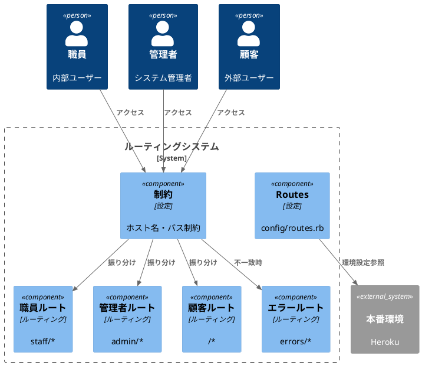

# 作業履歴 2017-01-24

## 概要

2017-01-24の作業内容をまとめています。このジャーナルでは、ルーティング機能の実装に関する作業を記録しています。主にホスト名による制約とパス設定、顧客向けルーティングの追加を行いました。

## ルーティング構成図



## 作業内容

### ルーティング機能の実装

アプリケーションのルーティング機能を実装するため、ホスト名による制約とパス設定、顧客向けルーティングの追加を行いました。これにより、同一アプリケーション内で職員、管理者、顧客向けの異なるインターフェースを提供できるようになりました。

#### 変更点の概要

1. ホスト名による制約の実装
   - 環境ごとのホスト名設定
   - 職員・管理者・顧客向けの異なるホスト名とパス設定

2. 顧客向けルーティングの追加
   - 顧客用のルートパスの設定
   - 顧客向け機能へのルーティング設定

3. ルーティングテストの追加
   - 各種ルーティングの動作確認テスト
   - 制約機能のテスト

#### 技術的詳細

- `constraints`を使用したホスト名による制約の実装
- 環境変数を活用した本番環境のURL設定
- RSpecを使用したルーティングテストの実装

## コミット: 5403c7a

### メッセージ

```
本番環境URL設定修正
```

### 変更されたファイル

- M	config/environments/production.rb

### 変更内容

```diff
commit 5403c7a926bbd38f5ec1131b2d871c12b2ea3a83
Author: k2works <kakimomokuri@gmail.com>
Date:   Tue Jan 24 19:16:44 2017 +0900

    本番環境URL設定修正

diff --git a/config/environments/production.rb b/config/environments/production.rb
index a736dfc..383c65c 100644
--- a/config/environments/production.rb
+++ b/config/environments/production.rb
@@ -85,8 +85,8 @@ Rails.application.configure do
   config.active_record.dump_schema_after_migration = false

   config.baukis_kai = {
-      staff: { host: ENV["PRD_URL"] , path: '' },
+      staff: { host: ENV["PRD_URL"] , path: 'staff' },
       admin: { host: ENV["PRD_URL"], path: 'admin' },
-      customer: { host: ENV["PRD_URL"], path: 'mypage' }
+      customer: { host: ENV["PRD_URL"], path: '' }
   }
 end

```

## コミット: a883770

### メッセージ

```
顧客ルーティング追加 #5
```

### 変更されたファイル

- M	README.md
- M	config/routes.rb

### 変更内容

```diff
commit a88377093a29f4534d398d5a8b1bc8752d4da5d4
Author: k2works <kakimomokuri@gmail.com>
Date:   Tue Jan 24 19:08:37 2017 +0900

    顧客ルーティング追加 #5

diff --git a/README.md b/README.md
index 9044bc9..d55146e 100644
--- a/README.md
+++ b/README.md
@@ -413,6 +413,7 @@ git push heroku master

 #### 演習問題
 + ルーティングテスト追加
++ 顧客ルーティング追加

 ### レコードの表示、新規作成、更新、削除
 ### String Parameters
diff --git a/config/routes.rb b/config/routes.rb
index 832d9a0..40f135b 100644
--- a/config/routes.rb
+++ b/config/routes.rb
@@ -51,11 +51,13 @@ Rails.application.routes.draw do
     end
   end

-  namespace :customer, path: '' do
-    root 'top#index'
-    get 'article/index'
-    get 'campaign/index'
-    get 'campaign_submit', to: 'campaign#submit'
+  constraints host: config[:customer][:host] do
+    namespace :customer, path: config[:customer][:path] do
+      root 'top#index'
+      get 'article/index'
+      get 'campaign/index'
+      get 'campaign_submit', to: 'campaign#submit'
+    end
   end

   root 'errors#routing_error'

```

## コミット: 6f6c80d

### メッセージ

```
ルーティングテスト追加 #5
```

### 変更されたファイル

- M	README.md
- M	config/routes.rb
- M	spec/routing/hostname_constraints_spec.rb

### 変更内容

```diff
commit 6f6c80d10230b50c50809d5f52dfc75e1d834dfe
Author: k2works <kakimomokuri@gmail.com>
Date:   Tue Jan 24 19:07:32 2017 +0900

    ルーティングテスト追加 #5

diff --git a/README.md b/README.md
index d1777b6..9044bc9 100644
--- a/README.md
+++ b/README.md
@@ -412,6 +412,7 @@ git push heroku master
 + ルーティングのテスト

 #### 演習問題
++ ルーティングテスト追加

 ### レコードの表示、新規作成、更新、削除
 ### String Parameters
diff --git a/config/routes.rb b/config/routes.rb
index 9964be8..832d9a0 100644
--- a/config/routes.rb
+++ b/config/routes.rb
@@ -19,10 +19,10 @@
 #      admin_staff_members GET    /admin/staff(.:format)        admin/staff_members#index {:host=>"0.0.0.0"}
 #                          POST   /admin/staff(.:format)        admin/staff_members#create {:host=>"0.0.0.0"}
 #   new_admin_staff_member GET    /admin/staff/new(.:format)    admin/staff_members#new {:host=>"0.0.0.0"}
-#            customer_root GET    /                             customer/top#index
-#   customer_article_index GET    /article/index(.:format)      customer/article#index
-#  customer_campaign_index GET    /campaign/index(.:format)     customer/campaign#index
-# customer_campaign_submit GET    /campaign_submit(.:format)    customer/campaign#submit
+#            customer_root GET    /                             customer/top#index {:host=>"0.0.0.0"}
+#   customer_article_index GET    /article/index(.:format)      customer/article#index {:host=>"0.0.0.0"}
+#  customer_campaign_index GET    /campaign/index(.:format)     customer/campaign#index {:host=>"0.0.0.0"}
+# customer_campaign_submit GET    /campaign_submit(.:format)    customer/campaign#submit {:host=>"0.0.0.0"}
 #                     root GET    /                             errors#routing_error
 #                          GET    /*anything(.:format)          errors#routing_error
 #
diff --git a/spec/routing/hostname_constraints_spec.rb b/spec/routing/hostname_constraints_spec.rb
index ea44667..cad8334 100644
--- a/spec/routing/hostname_constraints_spec.rb
+++ b/spec/routing/hostname_constraints_spec.rb
@@ -20,6 +20,15 @@ describe 'Routes' do
                                      )
   end

+  # 顧客トップページ
+  it 'should route customer top page' do
+    expect(get: 'http://baukis-kai.example.com').to route_to(
+                                                              host: 'baukis-kai.example.com',
+                                                              controller: 'customer/top',
+                                                              action: 'index'
+                                                          )
+  end
+
   # ホスト名が対象外ならerrors/not_foundへ
   it 'should route errors/not_found giving exempt host' do
     expect(get: 'http://foo.example.com').to route_to(

```

## コミット: 20e671b

### メッセージ

```
ルーティングのテスト #5
```

### 変更されたファイル

- M	README.md
- M	config/environments/test.rb
- A	spec/routing/hostname_constraints_spec.rb

### 変更内容

```diff
commit 20e671b3717463e3dcc84d783295822d28e49309
Author: k2works <kakimomokuri@gmail.com>
Date:   Tue Jan 24 19:03:28 2017 +0900

    ルーティングのテスト #5

diff --git a/README.md b/README.md
index 2cb0fbe..d1777b6 100644
--- a/README.md
+++ b/README.md
@@ -409,6 +409,7 @@ git push heroku master
 #### 制約
 + Rails.application.config
 + ホスト名による制約
++ ルーティングのテスト

 #### 演習問題

diff --git a/config/environments/test.rb b/config/environments/test.rb
index 30587ef..27275c7 100644
--- a/config/environments/test.rb
+++ b/config/environments/test.rb
@@ -39,4 +39,10 @@ Rails.application.configure do

   # Raises error for missing translations
   # config.action_view.raise_on_missing_translations = true
+
+  config.baukis_kai = {
+      staff: { host: 'baukis-kai.example.com', path: 'staff' },
+      admin: { host: 'baukis-kai.example.com', path: 'admin' },
+      customer: { host: 'baukis-kai.example.com', path: '' }
+  }
 end
diff --git a/spec/routing/hostname_constraints_spec.rb b/spec/routing/hostname_constraints_spec.rb
new file mode 100644
index 0000000..ea44667
--- /dev/null
+++ b/spec/routing/hostname_constraints_spec.rb
@@ -0,0 +1,39 @@
+require 'rails_helper'
+
+#ルーティング
+describe 'Routes' do
+  # 職員トップページ
+  it 'should route staff top page' do
+    expect(get: 'http://baukis-kai.example.com/staff').to route_to(
+                                         host: 'baukis-kai.example.com',
+                                         controller: 'staff/top',
+                                         action: 'index'
+                                     )
+  end
+
+  # 管理者ログインフォーム
+  it 'should route administrator login form' do
+    expect(get: 'http://baukis-kai.example.com/admin/login').to route_to(
+                                         host: 'baukis-kai.example.com',
+                                         controller: 'admin/sessions',
+                                         action: 'new'
+                                     )
+  end
+
+  # ホスト名が対象外ならerrors/not_foundへ
+  it 'should route errors/not_found giving exempt host' do
+    expect(get: 'http://foo.example.com').to route_to(
+                                                controller: 'errors',
+                                                action: 'routing_error'
+                                            )
+  end
+
+  # 存在しないパスならerrors/not_foundへ
+  it 'should route errors/not_found giving a path that does not exist' do
+    expect(get: 'http://baukis-kai.example.com/xyz').to route_to(
+                                             controller: 'errors',
+                                             action: 'routing_error',
+                                             anything: 'xyz'
+                                         )
+  end
+end
\ No newline at end of file

```

## コミット: 8ed9a47

### メッセージ

```
ホスト名による制約 #5
```

### 変更されたファイル

- M	README.md
- M	config/routes.rb

### 変更内容

```diff
commit 8ed9a47b66cf2fb16d01ea3da120f50d0aa79ce1
Author: k2works <kakimomokuri@gmail.com>
Date:   Tue Jan 24 18:35:58 2017 +0900

    ホスト名による制約 #5

diff --git a/README.md b/README.md
index fb26e50..2cb0fbe 100644
--- a/README.md
+++ b/README.md
@@ -408,6 +408,7 @@ git push heroku master

 #### 制約
 + Rails.application.config
++ ホスト名による制約

 #### 演習問題

diff --git a/config/routes.rb b/config/routes.rb
index 1218c0c..9964be8 100644
--- a/config/routes.rb
+++ b/config/routes.rb
@@ -1,51 +1,54 @@
 # == Route Map
 #
-#                   Prefix Verb   URI Pattern                     Controller#Action
-#     errors_routing_error GET    /errors/routing_error(.:format) errors#routing_error
-#               staff_root GET    /staff(.:format)                staff/top#index
-#              staff_login GET    /staff/login(.:format)          staff/sessions#new
-#            staff_session POST   /staff/session(.:format)        staff/sessions#create
-#                          DELETE /staff/session(.:format)        staff/sessions#destroy
-#        new_staff_account GET    /staff/account/new(.:format)    staff/accounts#new
-#       edit_staff_account GET    /staff/account/edit(.:format)   staff/accounts#edit
-#            staff_account GET    /staff/account(.:format)        staff/accounts#show
-#                          PATCH  /staff/account(.:format)        staff/accounts#update
-#                          PUT    /staff/account(.:format)        staff/accounts#update
-#                          DELETE /staff/account(.:format)        staff/accounts#destroy
-#                          POST   /staff/account(.:format)        staff/accounts#create
-#               admin_root GET    /admin(.:format)                admin/top#index
-#              admin_login GET    /admin/login(.:format)          admin/sessions#new
-#            admin_session POST   /admin/session(.:format)        admin/sessions#create
-#                          DELETE /admin/session(.:format)        admin/sessions#destroy
-#      admin_staff_members GET    /admin/staff(.:format)          admin/staff_members#index
-#                          POST   /admin/staff(.:format)          admin/staff_members#create
-#   new_admin_staff_member GET    /admin/staff/new(.:format)      admin/staff_members#new
-#            customer_root GET    /                               customer/top#index
-#   customer_article_index GET    /article/index(.:format)        customer/article#index
-#  customer_campaign_index GET    /campaign/index(.:format)       customer/campaign#index
-# customer_campaign_submit GET    /campaign_submit(.:format)      customer/campaign#submit
-#                     root GET    /                               errors#routing_error
-#                          GET    /*anything(.:format)            errors#routing_error
+#                   Prefix Verb   URI Pattern                   Controller#Action
+#               staff_root GET    /staff(.:format)              staff/top#index {:host=>"0.0.0.0"}
+#              staff_login GET    /staff/login(.:format)        staff/sessions#new {:host=>"0.0.0.0"}
+#            staff_session DELETE /staff/session(.:format)      staff/sessions#destroy {:host=>"0.0.0.0"}
+#                          POST   /staff/session(.:format)      staff/sessions#create {:host=>"0.0.0.0"}
+#        new_staff_account GET    /staff/account/new(.:format)  staff/accounts#new {:host=>"0.0.0.0", :execpt=>[:new, :create, :destroy]}
+#       edit_staff_account GET    /staff/account/edit(.:format) staff/accounts#edit {:host=>"0.0.0.0", :execpt=>[:new, :create, :destroy]}
+#            staff_account GET    /staff/account(.:format)      staff/accounts#show {:host=>"0.0.0.0", :execpt=>[:new, :create, :destroy]}
+#                          PATCH  /staff/account(.:format)      staff/accounts#update {:host=>"0.0.0.0", :execpt=>[:new, :create, :destroy]}
+#                          PUT    /staff/account(.:format)      staff/accounts#update {:host=>"0.0.0.0", :execpt=>[:new, :create, :destroy]}
+#                          DELETE /staff/account(.:format)      staff/accounts#destroy {:host=>"0.0.0.0", :execpt=>[:new, :create, :destroy]}
+#                          POST   /staff/account(.:format)      staff/accounts#create {:host=>"0.0.0.0", :execpt=>[:new, :create, :destroy]}
+#               admin_root GET    /admin(.:format)              admin/top#index {:host=>"0.0.0.0"}
+#              admin_login GET    /admin/login(.:format)        admin/sessions#new {:host=>"0.0.0.0"}
+#            admin_session DELETE /admin/session(.:format)      admin/sessions#destroy {:host=>"0.0.0.0"}
+#                          POST   /admin/session(.:format)      admin/sessions#create {:host=>"0.0.0.0"}
+#      admin_staff_members GET    /admin/staff(.:format)        admin/staff_members#index {:host=>"0.0.0.0"}
+#                          POST   /admin/staff(.:format)        admin/staff_members#create {:host=>"0.0.0.0"}
+#   new_admin_staff_member GET    /admin/staff/new(.:format)    admin/staff_members#new {:host=>"0.0.0.0"}
+#            customer_root GET    /                             customer/top#index
+#   customer_article_index GET    /article/index(.:format)      customer/article#index
+#  customer_campaign_index GET    /campaign/index(.:format)     customer/campaign#index
+# customer_campaign_submit GET    /campaign_submit(.:format)    customer/campaign#submit
+#                     root GET    /                             errors#routing_error
+#                          GET    /*anything(.:format)          errors#routing_error
 #

 Rails.application.routes.draw do
-  get 'errors/routing_error'
+  config = Rails.application.config.baukis_kai

   concern :session_path do
     get    'login'   => 'sessions#new', as: :login
     resource :session, only: [:create, :destroy]
   end

-  namespace :staff do
-    root   'top#index'
-    concerns :session_path
-    resource :account, execpt: [:new, :create, :destroy]
+  constraints host: config[:staff][:host] do
+    namespace :staff, path: config[:staff][:path] do
+      root   'top#index'
+      concerns :session_path
+      resource :account, execpt: [:new, :create, :destroy]
+    end
   end

-  namespace :admin do
-    root 'top#index'
-    concerns :session_path
-    resources :staff_members, only: [:index, :new, :create], path: 'staff'
+  constraints host: config[:admin][:host] do
+    namespace :admin, path: config[:admin][:path]  do
+      root 'top#index'
+      concerns :session_path
+      resources :staff_members, only: [:index, :new, :create], path: 'staff'
+    end
   end

   namespace :customer, path: '' do

```

## コミット: fbe55af

### メッセージ

```
Rails.application.config #5
```

### 変更されたファイル

- M	README.md
- M	config/environments/development.rb

### 変更内容

```diff
commit fbe55afc237a27516bdafeebc6843f601086433d
Author: k2works <kakimomokuri@gmail.com>
Date:   Tue Jan 24 18:26:16 2017 +0900

    Rails.application.config #5

diff --git a/README.md b/README.md
index 00db3d2..fb26e50 100644
--- a/README.md
+++ b/README.md
@@ -407,6 +407,8 @@ git push heroku master
 + resourceメソッドのオプション

 #### 制約
++ Rails.application.config
+
 #### 演習問題

 ### レコードの表示、新規作成、更新、削除
diff --git a/config/environments/development.rb b/config/environments/development.rb
index 4b808ab..c6f4df0 100644
--- a/config/environments/development.rb
+++ b/config/environments/development.rb
@@ -53,9 +53,9 @@ Rails.application.configure do
   config.file_watcher = ActiveSupport::EventedFileUpdateChecker

   config.baukis_kai = {
-      staff: { host: '0.0.0.0', path: '' },
+      staff: { host: '0.0.0.0', path: 'staff' },
       admin: { host: '0.0.0.0', path: 'admin' },
-      customer: { host: '0.0.0.0', path: 'mypage' }
+      customer: { host: '0.0.0.0', path: '' }
   }

   config.middleware.insert_after ActionDispatch::Static, Rack::LiveReload

```

## コミット: 2fec845

### メッセージ

```
resourceメソッドのオプション #5
```

### 変更されたファイル

- M	README.md
- M	config/routes.rb

### 変更内容

```diff
commit 2fec845703ea2ecabbc9183ab17b54d1ff6e1efb
Author: k2works <kakimomokuri@gmail.com>
Date:   Tue Jan 24 18:20:50 2017 +0900

    resourceメソッドのオプション #5

diff --git a/README.md b/README.md
index b6694f4..00db3d2 100644
--- a/README.md
+++ b/README.md
@@ -404,6 +404,7 @@ git push heroku master
 #### 単数リソース
 + 単数リソースの６つの基本アクション
 + resourceメソッド
++ resourceメソッドのオプション

 #### 制約
 #### 演習問題
diff --git a/config/routes.rb b/config/routes.rb
index 3f94d16..1218c0c 100644
--- a/config/routes.rb
+++ b/config/routes.rb
@@ -33,14 +33,13 @@ Rails.application.routes.draw do

   concern :session_path do
     get    'login'   => 'sessions#new', as: :login
-    post   'session' => 'sessions#create', as: :session
-    delete 'session' => 'sessions#destroy'
+    resource :session, only: [:create, :destroy]
   end

   namespace :staff do
     root   'top#index'
     concerns :session_path
-    resource :account
+    resource :account, execpt: [:new, :create, :destroy]
   end

   namespace :admin do

```

## コミット: d9d913e

### メッセージ

```
resourceメソッド #5
```

### 変更されたファイル

- M	README.md
- M	config/routes.rb

### 変更内容

```diff
commit d9d913e2b243a996cdcf62ce364b9a40a0cdb3bc
Author: k2works <kakimomokuri@gmail.com>
Date:   Tue Jan 24 18:17:30 2017 +0900

    resourceメソッド #5

diff --git a/README.md b/README.md
index 7b39947..b6694f4 100644
--- a/README.md
+++ b/README.md
@@ -402,6 +402,9 @@ git push heroku master
 + resourcesメソッドのオプション

 #### 単数リソース
++ 単数リソースの６つの基本アクション
++ resourceメソッド
+
 #### 制約
 #### 演習問題

diff --git a/config/routes.rb b/config/routes.rb
index f9f3ff6..3f94d16 100644
--- a/config/routes.rb
+++ b/config/routes.rb
@@ -6,6 +6,13 @@
 #              staff_login GET    /staff/login(.:format)          staff/sessions#new
 #            staff_session POST   /staff/session(.:format)        staff/sessions#create
 #                          DELETE /staff/session(.:format)        staff/sessions#destroy
+#        new_staff_account GET    /staff/account/new(.:format)    staff/accounts#new
+#       edit_staff_account GET    /staff/account/edit(.:format)   staff/accounts#edit
+#            staff_account GET    /staff/account(.:format)        staff/accounts#show
+#                          PATCH  /staff/account(.:format)        staff/accounts#update
+#                          PUT    /staff/account(.:format)        staff/accounts#update
+#                          DELETE /staff/account(.:format)        staff/accounts#destroy
+#                          POST   /staff/account(.:format)        staff/accounts#create
 #               admin_root GET    /admin(.:format)                admin/top#index
 #              admin_login GET    /admin/login(.:format)          admin/sessions#new
 #            admin_session POST   /admin/session(.:format)        admin/sessions#create
@@ -33,6 +40,7 @@ Rails.application.routes.draw do
   namespace :staff do
     root   'top#index'
     concerns :session_path
+    resource :account
   end

   namespace :admin do

```

## コミット: 4807b7a

### メッセージ

```
resourcesメソッドのオプション #5
```

### 変更されたファイル

- M	README.md
- M	config/routes.rb

### 変更内容

```diff
commit 4807b7aa5d45e56fb807f76f496bd2c24d8478db
Author: k2works <kakimomokuri@gmail.com>
Date:   Tue Jan 24 18:13:30 2017 +0900

    resourcesメソッドのオプション #5

diff --git a/README.md b/README.md
index fcd1b36..7b39947 100644
--- a/README.md
+++ b/README.md
@@ -399,6 +399,7 @@ git push heroku master
 + ルーティングの分類
 + resourcesメソッド
 + リンクの設置
++ resourcesメソッドのオプション

 #### 単数リソース
 #### 制約
diff --git a/config/routes.rb b/config/routes.rb
index e6e2bde..f9f3ff6 100644
--- a/config/routes.rb
+++ b/config/routes.rb
@@ -1,29 +1,24 @@
 # == Route Map
 #
-#                   Prefix Verb   URI Pattern                             Controller#Action
-#     errors_routing_error GET    /errors/routing_error(.:format)         errors#routing_error
-#               staff_root GET    /staff(.:format)                        staff/top#index
-#              staff_login GET    /staff/login(.:format)                  staff/sessions#new
-#            staff_session POST   /staff/session(.:format)                staff/sessions#create
-#                          DELETE /staff/session(.:format)                staff/sessions#destroy
-#               admin_root GET    /admin(.:format)                        admin/top#index
-#              admin_login GET    /admin/login(.:format)                  admin/sessions#new
-#            admin_session POST   /admin/session(.:format)                admin/sessions#create
-#                          DELETE /admin/session(.:format)                admin/sessions#destroy
-#      admin_staff_members GET    /admin/staff_members(.:format)          admin/staff_members#index
-#                          POST   /admin/staff_members(.:format)          admin/staff_members#create
-#   new_admin_staff_member GET    /admin/staff_members/new(.:format)      admin/staff_members#new
-#  edit_admin_staff_member GET    /admin/staff_members/:id/edit(.:format) admin/staff_members#edit
-#       admin_staff_member GET    /admin/staff_members/:id(.:format)      admin/staff_members#show
-#                          PATCH  /admin/staff_members/:id(.:format)      admin/staff_members#update
-#                          PUT    /admin/staff_members/:id(.:format)      admin/staff_members#update
-#                          DELETE /admin/staff_members/:id(.:format)      admin/staff_members#destroy
-#            customer_root GET    /                                       customer/top#index
-#   customer_article_index GET    /article/index(.:format)                customer/article#index
-#  customer_campaign_index GET    /campaign/index(.:format)               customer/campaign#index
-# customer_campaign_submit GET    /campaign_submit(.:format)              customer/campaign#submit
-#                     root GET    /                                       errors#routing_error
-#                          GET    /*anything(.:format)                    errors#routing_error
+#                   Prefix Verb   URI Pattern                     Controller#Action
+#     errors_routing_error GET    /errors/routing_error(.:format) errors#routing_error
+#               staff_root GET    /staff(.:format)                staff/top#index
+#              staff_login GET    /staff/login(.:format)          staff/sessions#new
+#            staff_session POST   /staff/session(.:format)        staff/sessions#create
+#                          DELETE /staff/session(.:format)        staff/sessions#destroy
+#               admin_root GET    /admin(.:format)                admin/top#index
+#              admin_login GET    /admin/login(.:format)          admin/sessions#new
+#            admin_session POST   /admin/session(.:format)        admin/sessions#create
+#                          DELETE /admin/session(.:format)        admin/sessions#destroy
+#      admin_staff_members GET    /admin/staff(.:format)          admin/staff_members#index
+#                          POST   /admin/staff(.:format)          admin/staff_members#create
+#   new_admin_staff_member GET    /admin/staff/new(.:format)      admin/staff_members#new
+#            customer_root GET    /                               customer/top#index
+#   customer_article_index GET    /article/index(.:format)        customer/article#index
+#  customer_campaign_index GET    /campaign/index(.:format)       customer/campaign#index
+# customer_campaign_submit GET    /campaign_submit(.:format)      customer/campaign#submit
+#                     root GET    /                               errors#routing_error
+#                          GET    /*anything(.:format)            errors#routing_error
 #

 Rails.application.routes.draw do
@@ -43,7 +38,7 @@ Rails.application.routes.draw do
   namespace :admin do
     root 'top#index'
     concerns :session_path
-    resources :staff_members
+    resources :staff_members, only: [:index, :new, :create], path: 'staff'
   end

   namespace :customer, path: '' do

```

## コミット: 9cd9364

### メッセージ

```
リンクの設置 #5
```

### 変更されたファイル

- M	README.md
- A	app/assets/stylesheets/pages/_dashboard.scss
- M	app/controllers/admin/top_controller.rb
- A	app/views/admin/top/dashboard.html.erb
- M	config/locales/views/views.yml

### 変更内容

```diff
commit 9cd9364b9878332bbdd6f49586a7eff9d181759c
Author: k2works <kakimomokuri@gmail.com>
Date:   Tue Jan 24 18:09:43 2017 +0900

    リンクの設置 #5

diff --git a/README.md b/README.md
index 92952df..fcd1b36 100644
--- a/README.md
+++ b/README.md
@@ -398,7 +398,7 @@ git push heroku master
 + ７つの基本アクション
 + ルーティングの分類
 + resourcesメソッド
-
++ リンクの設置

 #### 単数リソース
 #### 制約
diff --git a/app/assets/stylesheets/pages/_dashboard.scss b/app/assets/stylesheets/pages/_dashboard.scss
new file mode 100644
index 0000000..49e912f
--- /dev/null
+++ b/app/assets/stylesheets/pages/_dashboard.scss
@@ -0,0 +1,10 @@
+@charset 'utf-8';
+
+// =====================
+// ダッシュボードページ固有のスタイル
+// =====================
+
+.DashBoard {
+  &__menu {
+  }
+}
diff --git a/app/controllers/admin/top_controller.rb b/app/controllers/admin/top_controller.rb
index e90d00d..82acd05 100644
--- a/app/controllers/admin/top_controller.rb
+++ b/app/controllers/admin/top_controller.rb
@@ -1,5 +1,9 @@
 class Admin::TopController < Admin::Base
   def index
-    render action: 'index'
+    if current_administrator
+      render action: 'dashboard'
+    else
+      render action: 'index'
+    end
   end
 end
diff --git a/app/views/admin/top/dashboard.html.erb b/app/views/admin/top/dashboard.html.erb
new file mode 100644
index 0000000..c0f7ba2
--- /dev/null
+++ b/app/views/admin/top/dashboard.html.erb
@@ -0,0 +1,10 @@
+<% @title = t('.title') %>
+<section class="Section">
+  <h1 class="Admin__title"><%= @title %></h1>
+</section>
+
+<section class="Section l-column DashBoard">
+  <ul class="DashBoard__menu">
+    <li><%= link_to t('.admin_staff_members'), :admin_staff_members, class: 'btn btn-default' %></li>
+  </ul>
+</section>
\ No newline at end of file
diff --git a/config/locales/views/views.yml b/config/locales/views/views.yml
index aecaea0..e5a5b6e 100644
--- a/config/locales/views/views.yml
+++ b/config/locales/views/views.yml
@@ -14,4 +14,8 @@ ja:
         logout: 'ログアウト'
     sessions:
       new:
-        submit: 'ログイン'
\ No newline at end of file
+        submit: 'ログイン'
+    top:
+      dashboard:
+        title: 'ダッシュボード'
+        admin_staff_members: '職員管理'
\ No newline at end of file

```

### 構造変更


## コミット: ed140e6

### メッセージ

```
resourcesメソッド #5
```

### 変更されたファイル

- M	README.md
- M	config/routes.rb

### 変更内容

```diff
commit ed140e6c37ed75888dbb3e9716426136f0b23abf
Author: k2works <kakimomokuri@gmail.com>
Date:   Tue Jan 24 17:46:40 2017 +0900

    resourcesメソッド #5

diff --git a/README.md b/README.md
index 73bb55e..92952df 100644
--- a/README.md
+++ b/README.md
@@ -395,6 +395,11 @@ git push heroku master
 + 名前空間

 #### リソースベースのルーティング
++ ７つの基本アクション
++ ルーティングの分類
++ resourcesメソッド
+
+
 #### 単数リソース
 #### 制約
 #### 演習問題
diff --git a/config/routes.rb b/config/routes.rb
index 34803eb..e6e2bde 100644
--- a/config/routes.rb
+++ b/config/routes.rb
@@ -1,21 +1,29 @@
 # == Route Map
 #
-#                   Prefix Verb   URI Pattern                     Controller#Action
-#     errors_routing_error GET    /errors/routing_error(.:format) errors#routing_error
-#               staff_root GET    /staff(.:format)                staff/top#index
-#              staff_login GET    /staff/login(.:format)          staff/sessions#new
-#            staff_session POST   /staff/session(.:format)        staff/sessions#create
-#                          DELETE /staff/session(.:format)        staff/sessions#destroy
-#               admin_root GET    /admin(.:format)                admin/top#index
-#              admin_login GET    /admin/login(.:format)          admin/sessions#new
-#            admin_session POST   /admin/session(.:format)        admin/sessions#create
-#                          DELETE /admin/session(.:format)        admin/sessions#destroy
-#            customer_root GET    /                               customer/top#index
-#   customer_article_index GET    /article/index(.:format)        customer/article#index
-#  customer_campaign_index GET    /campaign/index(.:format)       customer/campaign#index
-# customer_campaign_submit GET    /campaign_submit(.:format)      customer/campaign#submit
-#                     root GET    /                               errors#routing_error
-#                          GET    /*anything(.:format)            errors#routing_error
+#                   Prefix Verb   URI Pattern                             Controller#Action
+#     errors_routing_error GET    /errors/routing_error(.:format)         errors#routing_error
+#               staff_root GET    /staff(.:format)                        staff/top#index
+#              staff_login GET    /staff/login(.:format)                  staff/sessions#new
+#            staff_session POST   /staff/session(.:format)                staff/sessions#create
+#                          DELETE /staff/session(.:format)                staff/sessions#destroy
+#               admin_root GET    /admin(.:format)                        admin/top#index
+#              admin_login GET    /admin/login(.:format)                  admin/sessions#new
+#            admin_session POST   /admin/session(.:format)                admin/sessions#create
+#                          DELETE /admin/session(.:format)                admin/sessions#destroy
+#      admin_staff_members GET    /admin/staff_members(.:format)          admin/staff_members#index
+#                          POST   /admin/staff_members(.:format)          admin/staff_members#create
+#   new_admin_staff_member GET    /admin/staff_members/new(.:format)      admin/staff_members#new
+#  edit_admin_staff_member GET    /admin/staff_members/:id/edit(.:format) admin/staff_members#edit
+#       admin_staff_member GET    /admin/staff_members/:id(.:format)      admin/staff_members#show
+#                          PATCH  /admin/staff_members/:id(.:format)      admin/staff_members#update
+#                          PUT    /admin/staff_members/:id(.:format)      admin/staff_members#update
+#                          DELETE /admin/staff_members/:id(.:format)      admin/staff_members#destroy
+#            customer_root GET    /                                       customer/top#index
+#   customer_article_index GET    /article/index(.:format)                customer/article#index
+#  customer_campaign_index GET    /campaign/index(.:format)               customer/campaign#index
+# customer_campaign_submit GET    /campaign_submit(.:format)              customer/campaign#submit
+#                     root GET    /                                       errors#routing_error
+#                          GET    /*anything(.:format)                    errors#routing_error
 #

 Rails.application.routes.draw do
@@ -35,6 +43,7 @@ Rails.application.routes.draw do
   namespace :admin do
     root 'top#index'
     concerns :session_path
+    resources :staff_members
   end

   namespace :customer, path: '' do

```

## コミット: 302bd71

### メッセージ

```
名前空間 #5
```

### 変更されたファイル

- M	.idea/.generators
- M	README.md
- M	baukis-kai.iml
- M	config/routes.rb

### 変更内容

```diff
commit 302bd71c58baf7f92e45fb401c9db2230fd51e96
Author: k2works <kakimomokuri@gmail.com>
Date:   Tue Jan 24 17:39:00 2017 +0900

    名前空間 #5

diff --git a/.idea/.generators b/.idea/.generators
index 1618976..8e11556 100644
--- a/.idea/.generators
+++ b/.idea/.generators
@@ -5,4 +5,4 @@ You are allowed to:
 2. Remove generators
 3. Add installed generators
 To add new installed generators automatically delete this file and reload the project.
---><GeneratorsGroup><Generator name="active_record:migration" /><Generator name="active_record:model" /><Generator name="active_record:observer" /><Generator name="active_record:session_migration" /><Generator name="controller" /><Generator name="erb:controller" /><Generator name="erb:mailer" /><Generator name="erb:scaffold" /><Generator name="generator" /><Generator name="helper" /><Generator name="integration_test" /><Generator name="mailer" /><Generator name="metal" /><Generator name="migration" /><Generator name="model" /><Generator name="model_subclass" /><Generator name="observer" /><Generator name="performance_test" /><Generator name="plugin" /><Generator name="resource" /><Generator name="scaffold" /><Generator name="scaffold_controller" /><Generator name="session_migration" /><Generator name="stylesheets" /><Generator name="test_unit:controller" /><Generator name="test_unit:helper" /><Generator name="test_unit:integration" /><Generator name="test_unit:mailer" /><Generator name="test_unit:model" /><Generator name="test_unit:observer" /><Generator name="test_unit:performance" /><Generator name="test_unit:plugin" /><Generator name="test_unit:scaffold" /></GeneratorsGroup></Settings>
+--><GeneratorsGroup><Generator name="annotate:install" /><Generator name="assets" /><Generator name="channel" /><Generator name="coffee:assets" /><Generator name="controller" /><Generator name="erd:install" /><Generator name="factory_girl:model" /><Generator name="generator" /><Generator name="helper" /><Generator name="i18n" /><Generator name="i18n_locale" /><Generator name="i18n_translation" /><Generator name="integration_test" /><Generator name="jbuilder" /><Generator name="job" /><Generator name="js:assets" /><Generator name="mailer" /><Generator name="migration" /><Generator name="model" /><Generator name="rack:dev-mark:install" /><Generator name="resource" /><Generator name="rspec:controller" /><Generator name="rspec:feature" /><Generator name="rspec:helper" /><Generator name="rspec:install" /><Generator name="rspec:integration" /><Generator name="rspec:job" /><Generator name="rspec:mailer" /><Generator name="rspec:model" /><Generator name="rspec:observer" /><Generator name="rspec:request" /><Generator name="rspec:scaffold" /><Generator name="rspec:view" /><Generator name="scaffold" /><Generator name="scaffold_controller" /><Generator name="task" /><Generator name="test_unit:controller" /><Generator name="test_unit:generator" /><Generator name="test_unit:helper" /><Generator name="test_unit:integration" /><Generator name="test_unit:job" /><Generator name="test_unit:mailer" /><Generator name="test_unit:model" /><Generator name="test_unit:plugin" /><Generator name="test_unit:scaffold" /></GeneratorsGroup></Settings>
diff --git a/README.md b/README.md
index 356cf15..73bb55e 100644
--- a/README.md
+++ b/README.md
@@ -391,6 +391,9 @@ git push heroku master

 ### ルーティング
 #### ルーティングの基礎知識
++ アクション単位のルーティング
++ 名前空間
+
 #### リソースベースのルーティング
 #### 単数リソース
 #### 制約
diff --git a/baukis-kai.iml b/baukis-kai.iml
index 9a38e68..7d95f8d 100644
--- a/baukis-kai.iml
+++ b/baukis-kai.iml
@@ -20,127 +20,133 @@
       <excludeFolder url="file://$MODULE_DIR$/tmp" />
       <excludeFolder url="file://$MODULE_DIR$/vendor/bundle" />
     </content>
-    <orderEntry type="jdk" jdkName="Remote:ruby-2.4.0-p0" jdkType="RUBY_SDK" />
+    <orderEntry type="jdk" jdkName="rbenv: 2.4.0" jdkType="RUBY_SDK" />
     <orderEntry type="sourceFolder" forTests="false" />
-    <orderEntry type="library" scope="PROVIDED" name="actioncable (v5.0.1, Remote:ruby-2.4.0-p0) [gem]" level="application" />
-    <orderEntry type="library" scope="PROVIDED" name="actionmailer (v5.0.1, Remote:ruby-2.4.0-p0) [gem]" level="application" />
-    <orderEntry type="library" scope="PROVIDED" name="actionpack (v5.0.1, Remote:ruby-2.4.0-p0) [gem]" level="application" />
-    <orderEntry type="library" scope="PROVIDED" name="actionview (v5.0.1, Remote:ruby-2.4.0-p0) [gem]" level="application" />
-    <orderEntry type="library" scope="PROVIDED" name="activejob (v5.0.1, Remote:ruby-2.4.0-p0) [gem]" level="application" />
-    <orderEntry type="library" scope="PROVIDED" name="activemodel (v5.0.1, Remote:ruby-2.4.0-p0) [gem]" level="application" />
-    <orderEntry type="library" scope="PROVIDED" name="activerecord (v5.0.1, Remote:ruby-2.4.0-p0) [gem]" level="application" />
-    <orderEntry type="library" scope="PROVIDED" name="activesupport (v5.0.1, Remote:ruby-2.4.0-p0) [gem]" level="application" />
-    <orderEntry type="library" scope="PROVIDED" name="addressable (v2.5.0, Remote:ruby-2.4.0-p0) [gem]" level="application" />
-    <orderEntry type="library" scope="PROVIDED" name="annotate (v2.6.5, Remote:ruby-2.4.0-p0) [gem]" level="application" />
-    <orderEntry type="library" scope="PROVIDED" name="arel (v7.1.4, Remote:ruby-2.4.0-p0) [gem]" level="application" />
-    <orderEntry type="library" scope="PROVIDED" name="better_errors (v2.1.1, Remote:ruby-2.4.0-p0) [gem]" level="application" />
-    <orderEntry type="library" scope="PROVIDED" name="binding_of_caller (v0.7.2, Remote:ruby-2.4.0-p0) [gem]" level="application" />
-    <orderEntry type="library" scope="PROVIDED" name="builder (v3.2.2, Remote:ruby-2.4.0-p0) [gem]" level="application" />
-    <orderEntry type="library" scope="PROVIDED" name="bundler (v1.13.7, Remote:ruby-2.4.0-p0) [gem]" level="application" />
-    <orderEntry type="library" scope="PROVIDED" name="byebug (v9.0.6, Remote:ruby-2.4.0-p0) [gem]" level="application" />
-    <orderEntry type="library" scope="PROVIDED" name="capybara (v2.5.0, Remote:ruby-2.4.0-p0) [gem]" level="application" />
-    <orderEntry type="library" scope="PROVIDED" name="capybara-screenshot (v1.0.14, Remote:ruby-2.4.0-p0) [gem]" level="application" />
-    <orderEntry type="library" scope="PROVIDED" name="capybara-webkit (v1.11.1, Remote:ruby-2.4.0-p0) [gem]" level="application" />
-    <orderEntry type="library" scope="PROVIDED" name="childprocess (v0.5.9, Remote:ruby-2.4.0-p0) [gem]" level="application" />
-    <orderEntry type="library" scope="PROVIDED" name="choice (v0.2.0, Remote:ruby-2.4.0-p0) [gem]" level="application" />
-    <orderEntry type="library" scope="PROVIDED" name="coderay (v1.1.1, Remote:ruby-2.4.0-p0) [gem]" level="application" />
-    <orderEntry type="library" scope="PROVIDED" name="coffee-rails (v4.2.1, Remote:ruby-2.4.0-p0) [gem]" level="application" />
-    <orderEntry type="library" scope="PROVIDED" name="coffee-script (v2.4.1, Remote:ruby-2.4.0-p0) [gem]" level="application" />
-    <orderEntry type="library" scope="PROVIDED" name="coffee-script-source (v1.12.2, Remote:ruby-2.4.0-p0) [gem]" level="application" />
-    <orderEntry type="library" scope="PROVIDED" name="concurrent-ruby (v1.0.4, Remote:ruby-2.4.0-p0) [gem]" level="application" />
-    <orderEntry type="library" scope="PROVIDED" name="database_cleaner (v1.3.0, Remote:ruby-2.4.0-p0) [gem]" level="application" />
-    <orderEntry type="library" scope="PROVIDED" name="debase (v0.2.1, Remote:ruby-2.4.0-p0) [gem]" level="application" />
-    <orderEntry type="library" scope="PROVIDED" name="debase-ruby_core_source (v0.9.6, Remote:ruby-2.4.0-p0) [gem]" level="application" />
-    <orderEntry type="library" scope="PROVIDED" name="debug_inspector (v0.0.2, Remote:ruby-2.4.0-p0) [gem]" level="application" />
-    <orderEntry type="library" scope="PROVIDED" name="diff-lcs (v1.2.5, Remote:ruby-2.4.0-p0) [gem]" level="application" />
-    <orderEntry type="library" scope="PROVIDED" name="em-websocket (v0.5.1, Remote:ruby-2.4.0-p0) [gem]" level="application" />
-    <orderEntry type="library" scope="PROVIDED" name="enum_help (v0.0.16, Remote:ruby-2.4.0-p0) [gem]" level="application" />
-    <orderEntry type="library" scope="PROVIDED" name="erubis (v2.7.0, Remote:ruby-2.4.0-p0) [gem]" level="application" />
-    <orderEntry type="library" scope="PROVIDED" name="eventmachine (v1.2.1, Remote:ruby-2.4.0-p0) [gem]" level="application" />
-    <orderEntry type="library" scope="PROVIDED" name="execjs (v2.7.0, Remote:ruby-2.4.0-p0) [gem]" level="application" />
-    <orderEntry type="library" scope="PROVIDED" name="factory_girl (v4.8.0, Remote:ruby-2.4.0-p0) [gem]" level="application" />
-    <orderEntry type="library" scope="PROVIDED" name="factory_girl_rails (v4.8.0, Remote:ruby-2.4.0-p0) [gem]" level="application" />
-    <orderEntry type="library" scope="PROVIDED" name="faker (v1.4.3, Remote:ruby-2.4.0-p0) [gem]" level="application" />
-    <orderEntry type="library" scope="PROVIDED" name="ffi (v1.9.14, Remote:ruby-2.4.0-p0) [gem]" level="application" />
-    <orderEntry type="library" scope="PROVIDED" name="font-awesome-rails (v4.7.0.1, Remote:ruby-2.4.0-p0) [gem]" level="application" />
-    <orderEntry type="library" scope="PROVIDED" name="formatador (v0.2.5, Remote:ruby-2.4.0-p0) [gem]" level="application" />
-    <orderEntry type="library" scope="PROVIDED" name="globalid (v0.3.7, Remote:ruby-2.4.0-p0) [gem]" level="application" />
-    <orderEntry type="library" scope="PROVIDED" name="guard (v2.14.0, Remote:ruby-2.4.0-p0) [gem]" level="application" />
-    <orderEntry type="library" scope="PROVIDED" name="guard-compat (v1.2.1, Remote:ruby-2.4.0-p0) [gem]" level="application" />
-    <orderEntry type="library" scope="PROVIDED" name="guard-livereload (v2.5.2, Remote:ruby-2.4.0-p0) [gem]" level="application" />
-    <orderEntry type="library" scope="PROVIDED" name="http_parser.rb (v0.6.0, Remote:ruby-2.4.0-p0) [gem]" level="application" />
-    <orderEntry type="library" scope="PROVIDED" name="i18n (v0.7.0, Remote:ruby-2.4.0-p0) [gem]" level="application" />
-    <orderEntry type="library" scope="PROVIDED" name="i18n_generators (v2.1.1, Remote:ruby-2.4.0-p0) [gem]" level="application" />
-    <orderEntry type="library" scope="PROVIDED" name="jbuilder (v2.6.1, Remote:ruby-2.4.0-p0) [gem]" level="application" />
-    <orderEntry type="library" scope="PROVIDED" name="jquery-rails (v4.2.2, Remote:ruby-2.4.0-p0) [gem]" level="application" />
-    <orderEntry type="library" scope="PROVIDED" name="launchy (v2.4.3, Remote:ruby-2.4.0-p0) [gem]" level="application" />
-    <orderEntry type="library" scope="PROVIDED" name="listen (v3.0.8, Remote:ruby-2.4.0-p0) [gem]" level="application" />
-    <orderEntry type="library" scope="PROVIDED" name="loofah (v2.0.3, Remote:ruby-2.4.0-p0) [gem]" level="application" />
-    <orderEntry type="library" scope="PROVIDED" name="lumberjack (v1.0.11, Remote:ruby-2.4.0-p0) [gem]" level="application" />
-    <orderEntry type="library" scope="PROVIDED" name="mail (v2.6.4, Remote:ruby-2.4.0-p0) [gem]" level="application" />
-    <orderEntry type="library" scope="PROVIDED" name="method_source (v0.8.2, Remote:ruby-2.4.0-p0) [gem]" level="application" />
-    <orderEntry type="library" scope="PROVIDED" name="migration_comments (v0.4.1, Remote:ruby-2.4.0-p0) [gem]" level="application" />
-    <orderEntry type="library" scope="PROVIDED" name="mime-types (v3.1, Remote:ruby-2.4.0-p0) [gem]" level="application" />
-    <orderEntry type="library" scope="PROVIDED" name="mime-types-data (v3.2016.0521, Remote:ruby-2.4.0-p0) [gem]" level="application" />
-    <orderEntry type="library" scope="PROVIDED" name="mini_portile2 (v2.1.0, Remote:ruby-2.4.0-p0) [gem]" level="application" />
-    <orderEntry type="library" scope="PROVIDED" name="minitest (v5.10.1, Remote:ruby-2.4.0-p0) [gem]" level="application" />
-    <orderEntry type="library" scope="PROVIDED" name="multi_json (v1.12.1, Remote:ruby-2.4.0-p0) [gem]" level="application" />
-    <orderEntry type="library" scope="PROVIDED" name="mysql2 (v0.4.5, Remote:ruby-2.4.0-p0) [gem]" level="application" />
-    <orderEntry type="library" scope="PROVIDED" name="nenv (v0.3.0, Remote:ruby-2.4.0-p0) [gem]" level="application" />
-    <orderEntry type="library" scope="PROVIDED" name="nio4r (v1.2.1, Remote:ruby-2.4.0-p0) [gem]" level="application" />
-    <orderEntry type="library" scope="PROVIDED" name="nokogiri (v1.7.0.1, Remote:ruby-2.4.0-p0) [gem]" level="application" />
-    <orderEntry type="library" scope="PROVIDED" name="notiffany (v0.1.1, Remote:ruby-2.4.0-p0) [gem]" level="application" />
-    <orderEntry type="library" scope="PROVIDED" name="pg (v0.19.0, Remote:ruby-2.4.0-p0) [gem]" level="application" />
-    <orderEntry type="library" scope="PROVIDED" name="pry (v0.10.4, Remote:ruby-2.4.0-p0) [gem]" level="application" />
-    <orderEntry type="library" scope="PROVIDED" name="public_suffix (v2.0.5, Remote:ruby-2.4.0-p0) [gem]" level="application" />
-    <orderEntry type="library" scope="PROVIDED" name="puma (v3.6.2, Remote:ruby-2.4.0-p0) [gem]" level="application" />
-    <orderEntry type="library" scope="PROVIDED" name="rack (v2.0.1, Remote:ruby-2.4.0-p0) [gem]" level="application" />
-    <orderEntry type="library" scope="PROVIDED" name="rack-dev-mark (v0.7.5, Remote:ruby-2.4.0-p0) [gem]" level="application" />
-    <orderEntry type="library" scope="PROVIDED" name="rack-livereload (v0.3.16, Remote:ruby-2.4.0-p0) [gem]" level="application" />
-    <orderEntry type="library" scope="PROVIDED" name="rack-test (v0.6.3, Remote:ruby-2.4.0-p0) [gem]" level="application" />
-    <orderEntry type="library" scope="PROVIDED" name="rails (v5.0.1, Remote:ruby-2.4.0-p0) [gem]" level="application" />
-    <orderEntry type="library" scope="PROVIDED" name="rails-dom-testing (v2.0.2, Remote:ruby-2.4.0-p0) [gem]" level="application" />
-    <orderEntry type="library" scope="PROVIDED" name="rails-erd (v1.5.0, Remote:ruby-2.4.0-p0) [gem]" level="application" />
-    <orderEntry type="library" scope="PROVIDED" name="rails-html-sanitizer (v1.0.3, Remote:ruby-2.4.0-p0) [gem]" level="application" />
-    <orderEntry type="library" scope="PROVIDED" name="rails_12factor (v0.0.3, Remote:ruby-2.4.0-p0) [gem]" level="application" />
-    <orderEntry type="library" scope="PROVIDED" name="rails_serve_static_assets (v0.0.5, Remote:ruby-2.4.0-p0) [gem]" level="application" />
-    <orderEntry type="library" scope="PROVIDED" name="rails_stdout_logging (v0.0.5, Remote:ruby-2.4.0-p0) [gem]" level="application" />
-    <orderEntry type="library" scope="PROVIDED" name="railties (v5.0.1, Remote:ruby-2.4.0-p0) [gem]" level="application" />
-    <orderEntry type="library" scope="PROVIDED" name="rake (v12.0.0, Remote:ruby-2.4.0-p0) [gem]" level="application" />
-    <orderEntry type="library" scope="PROVIDED" name="rb-fsevent (v0.9.8, Remote:ruby-2.4.0-p0) [gem]" level="application" />
-    <orderEntry type="library" scope="PROVIDED" name="rb-inotify (v0.9.7, Remote:ruby-2.4.0-p0) [gem]" level="application" />
-    <orderEntry type="library" scope="PROVIDED" name="rspec-core (v3.5.4, Remote:ruby-2.4.0-p0) [gem]" level="application" />
-    <orderEntry type="library" scope="PROVIDED" name="rspec-expectations (v3.5.0, Remote:ruby-2.4.0-p0) [gem]" level="application" />
-    <orderEntry type="library" scope="PROVIDED" name="rspec-mocks (v3.5.0, Remote:ruby-2.4.0-p0) [gem]" level="application" />
-    <orderEntry type="library" scope="PROVIDED" name="rspec-rails (v3.5.2, Remote:ruby-2.4.0-p0) [gem]" level="application" />
-    <orderEntry type="library" scope="PROVIDED" name="rspec-support (v3.5.0, Remote:ruby-2.4.0-p0) [gem]" level="application" />
-    <orderEntry type="library" scope="PROVIDED" name="ruby-graphviz (v1.2.2, Remote:ruby-2.4.0-p0) [gem]" level="application" />
-    <orderEntry type="library" scope="PROVIDED" name="rubyzip (v1.2.0, Remote:ruby-2.4.0-p0) [gem]" level="application" />
-    <orderEntry type="library" scope="PROVIDED" name="sass (v3.4.23, Remote:ruby-2.4.0-p0) [gem]" level="application" />
-    <orderEntry type="library" scope="PROVIDED" name="sass-rails (v5.0.6, Remote:ruby-2.4.0-p0) [gem]" level="application" />
-    <orderEntry type="library" scope="PROVIDED" name="selenium-webdriver (v3.0.5, Remote:ruby-2.4.0-p0) [gem]" level="application" />
-    <orderEntry type="library" scope="PROVIDED" name="shellany (v0.0.1, Remote:ruby-2.4.0-p0) [gem]" level="application" />
-    <orderEntry type="library" scope="PROVIDED" name="shoulda-matchers (v2.6.2, Remote:ruby-2.4.0-p0) [gem]" level="application" />
-    <orderEntry type="library" scope="PROVIDED" name="slop (v3.6.0, Remote:ruby-2.4.0-p0) [gem]" level="application" />
-    <orderEntry type="library" scope="PROVIDED" name="spring (v2.0.0, Remote:ruby-2.4.0-p0) [gem]" level="application" />
-    <orderEntry type="library" scope="PROVIDED" name="spring-commands-rspec (v1.0.4, Remote:ruby-2.4.0-p0) [gem]" level="application" />
-    <orderEntry type="library" scope="PROVIDED" name="spring-watcher-listen (v2.0.1, Remote:ruby-2.4.0-p0) [gem]" level="application" />
-    <orderEntry type="library" scope="PROVIDED" name="sprockets (v3.7.1, Remote:ruby-2.4.0-p0) [gem]" level="application" />
-    <orderEntry type="library" scope="PROVIDED" name="sprockets-rails (v3.2.0, Remote:ruby-2.4.0-p0) [gem]" level="application" />
-    <orderEntry type="library" scope="PROVIDED" name="sqlite3 (v1.3.12, Remote:ruby-2.4.0-p0) [gem]" level="application" />
-    <orderEntry type="library" scope="PROVIDED" name="thor (v0.19.4, Remote:ruby-2.4.0-p0) [gem]" level="application" />
-    <orderEntry type="library" scope="PROVIDED" name="thread_safe (v0.3.5, Remote:ruby-2.4.0-p0) [gem]" level="application" />
-    <orderEntry type="library" scope="PROVIDED" name="tilt (v2.0.5, Remote:ruby-2.4.0-p0) [gem]" level="application" />
-    <orderEntry type="library" scope="PROVIDED" name="turbolinks (v5.0.1, Remote:ruby-2.4.0-p0) [gem]" level="application" />
-    <orderEntry type="library" scope="PROVIDED" name="turbolinks-source (v5.0.0, Remote:ruby-2.4.0-p0) [gem]" level="application" />
-    <orderEntry type="library" scope="PROVIDED" name="tzinfo (v1.2.2, Remote:ruby-2.4.0-p0) [gem]" level="application" />
-    <orderEntry type="library" scope="PROVIDED" name="uglifier (v3.0.4, Remote:ruby-2.4.0-p0) [gem]" level="application" />
-    <orderEntry type="library" scope="PROVIDED" name="web-console (v3.4.0, Remote:ruby-2.4.0-p0) [gem]" level="application" />
-    <orderEntry type="library" scope="PROVIDED" name="websocket (v1.2.3, Remote:ruby-2.4.0-p0) [gem]" level="application" />
-    <orderEntry type="library" scope="PROVIDED" name="websocket-driver (v0.6.4, Remote:ruby-2.4.0-p0) [gem]" level="application" />
-    <orderEntry type="library" scope="PROVIDED" name="websocket-extensions (v0.1.2, Remote:ruby-2.4.0-p0) [gem]" level="application" />
-    <orderEntry type="library" scope="PROVIDED" name="xpath (v2.0.0, Remote:ruby-2.4.0-p0) [gem]" level="application" />
-    <orderEntry type="library" scope="PROVIDED" name="yard (v0.9.7, Remote:ruby-2.4.0-p0) [gem]" level="application" />
+    <orderEntry type="library" scope="PROVIDED" name="actioncable (v5.0.1, rbenv: 2.4.0) [gem]" level="application" />
+    <orderEntry type="library" scope="PROVIDED" name="actionmailer (v5.0.1, rbenv: 2.4.0) [gem]" level="application" />
+    <orderEntry type="library" scope="PROVIDED" name="actionpack (v5.0.1, rbenv: 2.4.0) [gem]" level="application" />
+    <orderEntry type="library" scope="PROVIDED" name="actionview (v5.0.1, rbenv: 2.4.0) [gem]" level="application" />
+    <orderEntry type="library" scope="PROVIDED" name="activejob (v5.0.1, rbenv: 2.4.0) [gem]" level="application" />
+    <orderEntry type="library" scope="PROVIDED" name="activemodel (v5.0.1, rbenv: 2.4.0) [gem]" level="application" />
+    <orderEntry type="library" scope="PROVIDED" name="activerecord (v5.0.1, rbenv: 2.4.0) [gem]" level="application" />
+    <orderEntry type="library" scope="PROVIDED" name="activesupport (v5.0.1, rbenv: 2.4.0) [gem]" level="application" />
+    <orderEntry type="library" scope="PROVIDED" name="addressable (v2.5.0, rbenv: 2.4.0) [gem]" level="application" />
+    <orderEntry type="library" scope="PROVIDED" name="annotate (v2.6.5, rbenv: 2.4.0) [gem]" level="application" />
+    <orderEntry type="library" scope="PROVIDED" name="arel (v7.1.4, rbenv: 2.4.0) [gem]" level="application" />
+    <orderEntry type="library" scope="PROVIDED" name="autoprefixer-rails (v6.6.1, rbenv: 2.4.0) [gem]" level="application" />
+    <orderEntry type="library" scope="PROVIDED" name="bcrypt (v3.1.11, rbenv: 2.4.0) [gem]" level="application" />
+    <orderEntry type="library" scope="PROVIDED" name="better_errors (v2.1.1, rbenv: 2.4.0) [gem]" level="application" />
+    <orderEntry type="library" scope="PROVIDED" name="binding_of_caller (v0.7.2, rbenv: 2.4.0) [gem]" level="application" />
+    <orderEntry type="library" scope="PROVIDED" name="bootstrap-sass (v3.3.7, rbenv: 2.4.0) [gem]" level="application" />
+    <orderEntry type="library" scope="PROVIDED" name="bootstrap_form (v2.5.3, rbenv: 2.4.0) [gem]" level="application" />
+    <orderEntry type="library" scope="PROVIDED" name="builder (v3.2.2, rbenv: 2.4.0) [gem]" level="application" />
+    <orderEntry type="library" scope="PROVIDED" name="bundler (v1.13.7, rbenv: 2.4.0) [gem]" level="application" />
+    <orderEntry type="library" scope="PROVIDED" name="byebug (v9.0.6, rbenv: 2.4.0) [gem]" level="application" />
+    <orderEntry type="library" scope="PROVIDED" name="capybara (v2.5.0, rbenv: 2.4.0) [gem]" level="application" />
+    <orderEntry type="library" scope="PROVIDED" name="capybara-screenshot (v1.0.14, rbenv: 2.4.0) [gem]" level="application" />
+    <orderEntry type="library" scope="PROVIDED" name="capybara-webkit (v1.11.1, rbenv: 2.4.0) [gem]" level="application" />
+    <orderEntry type="library" scope="PROVIDED" name="childprocess (v0.5.9, rbenv: 2.4.0) [gem]" level="application" />
+    <orderEntry type="library" scope="PROVIDED" name="choice (v0.2.0, rbenv: 2.4.0) [gem]" level="application" />
+    <orderEntry type="library" scope="PROVIDED" name="coderay (v1.1.1, rbenv: 2.4.0) [gem]" level="application" />
+    <orderEntry type="library" scope="PROVIDED" name="coffee-rails (v4.2.1, rbenv: 2.4.0) [gem]" level="application" />
+    <orderEntry type="library" scope="PROVIDED" name="coffee-script (v2.4.1, rbenv: 2.4.0) [gem]" level="application" />
+    <orderEntry type="library" scope="PROVIDED" name="coffee-script-source (v1.12.2, rbenv: 2.4.0) [gem]" level="application" />
+    <orderEntry type="library" scope="PROVIDED" name="concurrent-ruby (v1.0.4, rbenv: 2.4.0) [gem]" level="application" />
+    <orderEntry type="library" scope="PROVIDED" name="database_cleaner (v1.3.0, rbenv: 2.4.0) [gem]" level="application" />
+    <orderEntry type="library" scope="PROVIDED" name="debase (v0.2.1, rbenv: 2.4.0) [gem]" level="application" />
+    <orderEntry type="library" scope="PROVIDED" name="debase-ruby_core_source (v0.9.6, rbenv: 2.4.0) [gem]" level="application" />
+    <orderEntry type="library" scope="PROVIDED" name="debug_inspector (v0.0.2, rbenv: 2.4.0) [gem]" level="application" />
+    <orderEntry type="library" scope="PROVIDED" name="diff-lcs (v1.2.5, rbenv: 2.4.0) [gem]" level="application" />
+    <orderEntry type="library" scope="PROVIDED" name="dotenv (v2.1.2, rbenv: 2.4.0) [gem]" level="application" />
+    <orderEntry type="library" scope="PROVIDED" name="dotenv-rails (v2.1.2, rbenv: 2.4.0) [gem]" level="application" />
+    <orderEntry type="library" scope="PROVIDED" name="em-websocket (v0.5.1, rbenv: 2.4.0) [gem]" level="application" />
+    <orderEntry type="library" scope="PROVIDED" name="enum_help (v0.0.16, rbenv: 2.4.0) [gem]" level="application" />
+    <orderEntry type="library" scope="PROVIDED" name="erubis (v2.7.0, rbenv: 2.4.0) [gem]" level="application" />
+    <orderEntry type="library" scope="PROVIDED" name="eventmachine (v1.2.1, rbenv: 2.4.0) [gem]" level="application" />
+    <orderEntry type="library" scope="PROVIDED" name="execjs (v2.7.0, rbenv: 2.4.0) [gem]" level="application" />
+    <orderEntry type="library" scope="PROVIDED" name="factory_girl (v4.8.0, rbenv: 2.4.0) [gem]" level="application" />
+    <orderEntry type="library" scope="PROVIDED" name="factory_girl_rails (v4.8.0, rbenv: 2.4.0) [gem]" level="application" />
+    <orderEntry type="library" scope="PROVIDED" name="faker (v1.4.3, rbenv: 2.4.0) [gem]" level="application" />
+    <orderEntry type="library" scope="PROVIDED" name="ffi (v1.9.14, rbenv: 2.4.0) [gem]" level="application" />
+    <orderEntry type="library" scope="PROVIDED" name="font-awesome-rails (v4.7.0.1, rbenv: 2.4.0) [gem]" level="application" />
+    <orderEntry type="library" scope="PROVIDED" name="formatador (v0.2.5, rbenv: 2.4.0) [gem]" level="application" />
+    <orderEntry type="library" scope="PROVIDED" name="globalid (v0.3.7, rbenv: 2.4.0) [gem]" level="application" />
+    <orderEntry type="library" scope="PROVIDED" name="guard (v2.14.0, rbenv: 2.4.0) [gem]" level="application" />
+    <orderEntry type="library" scope="PROVIDED" name="guard-compat (v1.2.1, rbenv: 2.4.0) [gem]" level="application" />
+    <orderEntry type="library" scope="PROVIDED" name="guard-livereload (v2.5.2, rbenv: 2.4.0) [gem]" level="application" />
+    <orderEntry type="library" scope="PROVIDED" name="http_parser.rb (v0.6.0, rbenv: 2.4.0) [gem]" level="application" />
+    <orderEntry type="library" scope="PROVIDED" name="i18n (v0.7.0, rbenv: 2.4.0) [gem]" level="application" />
+    <orderEntry type="library" scope="PROVIDED" name="i18n_generators (v2.1.1, rbenv: 2.4.0) [gem]" level="application" />
+    <orderEntry type="library" scope="PROVIDED" name="jbuilder (v2.6.1, rbenv: 2.4.0) [gem]" level="application" />
+    <orderEntry type="library" scope="PROVIDED" name="jquery-rails (v4.2.2, rbenv: 2.4.0) [gem]" level="application" />
+    <orderEntry type="library" scope="PROVIDED" name="launchy (v2.4.3, rbenv: 2.4.0) [gem]" level="application" />
+    <orderEntry type="library" scope="PROVIDED" name="listen (v3.0.8, rbenv: 2.4.0) [gem]" level="application" />
+    <orderEntry type="library" scope="PROVIDED" name="loofah (v2.0.3, rbenv: 2.4.0) [gem]" level="application" />
+    <orderEntry type="library" scope="PROVIDED" name="lumberjack (v1.0.11, rbenv: 2.4.0) [gem]" level="application" />
+    <orderEntry type="library" scope="PROVIDED" name="mail (v2.6.4, rbenv: 2.4.0) [gem]" level="application" />
+    <orderEntry type="library" scope="PROVIDED" name="method_source (v0.8.2, rbenv: 2.4.0) [gem]" level="application" />
+    <orderEntry type="library" scope="PROVIDED" name="migration_comments (v0.4.1, rbenv: 2.4.0) [gem]" level="application" />
+    <orderEntry type="library" scope="PROVIDED" name="mime-types (v3.1, rbenv: 2.4.0) [gem]" level="application" />
+    <orderEntry type="library" scope="PROVIDED" name="mime-types-data (v3.2016.0521, rbenv: 2.4.0) [gem]" level="application" />
+    <orderEntry type="library" scope="PROVIDED" name="mini_portile2 (v2.1.0, rbenv: 2.4.0) [gem]" level="application" />
+    <orderEntry type="library" scope="PROVIDED" name="minitest (v5.10.1, rbenv: 2.4.0) [gem]" level="application" />
+    <orderEntry type="library" scope="PROVIDED" name="multi_json (v1.12.1, rbenv: 2.4.0) [gem]" level="application" />
+    <orderEntry type="library" scope="PROVIDED" name="mysql2 (v0.4.5, rbenv: 2.4.0) [gem]" level="application" />
+    <orderEntry type="library" scope="PROVIDED" name="nenv (v0.3.0, rbenv: 2.4.0) [gem]" level="application" />
+    <orderEntry type="library" scope="PROVIDED" name="nio4r (v1.2.1, rbenv: 2.4.0) [gem]" level="application" />
+    <orderEntry type="library" scope="PROVIDED" name="nokogiri (v1.7.0.1, rbenv: 2.4.0) [gem]" level="application" />
+    <orderEntry type="library" scope="PROVIDED" name="notiffany (v0.1.1, rbenv: 2.4.0) [gem]" level="application" />
+    <orderEntry type="library" scope="PROVIDED" name="pg (v0.19.0, rbenv: 2.4.0) [gem]" level="application" />
+    <orderEntry type="library" scope="PROVIDED" name="pry (v0.10.4, rbenv: 2.4.0) [gem]" level="application" />
+    <orderEntry type="library" scope="PROVIDED" name="public_suffix (v2.0.5, rbenv: 2.4.0) [gem]" level="application" />
+    <orderEntry type="library" scope="PROVIDED" name="puma (v3.6.2, rbenv: 2.4.0) [gem]" level="application" />
+    <orderEntry type="library" scope="PROVIDED" name="rack (v2.0.1, rbenv: 2.4.0) [gem]" level="application" />
+    <orderEntry type="library" scope="PROVIDED" name="rack-dev-mark (v0.7.5, rbenv: 2.4.0) [gem]" level="application" />
+    <orderEntry type="library" scope="PROVIDED" name="rack-livereload (v0.3.16, rbenv: 2.4.0) [gem]" level="application" />
+    <orderEntry type="library" scope="PROVIDED" name="rack-test (v0.6.3, rbenv: 2.4.0) [gem]" level="application" />
+    <orderEntry type="library" scope="PROVIDED" name="rails (v5.0.1, rbenv: 2.4.0) [gem]" level="application" />
+    <orderEntry type="library" scope="PROVIDED" name="rails-dom-testing (v2.0.2, rbenv: 2.4.0) [gem]" level="application" />
+    <orderEntry type="library" scope="PROVIDED" name="rails-erd (v1.5.0, rbenv: 2.4.0) [gem]" level="application" />
+    <orderEntry type="library" scope="PROVIDED" name="rails-html-sanitizer (v1.0.3, rbenv: 2.4.0) [gem]" level="application" />
+    <orderEntry type="library" scope="PROVIDED" name="rails_12factor (v0.0.3, rbenv: 2.4.0) [gem]" level="application" />
+    <orderEntry type="library" scope="PROVIDED" name="rails_serve_static_assets (v0.0.5, rbenv: 2.4.0) [gem]" level="application" />
+    <orderEntry type="library" scope="PROVIDED" name="rails_stdout_logging (v0.0.5, rbenv: 2.4.0) [gem]" level="application" />
+    <orderEntry type="library" scope="PROVIDED" name="railties (v5.0.1, rbenv: 2.4.0) [gem]" level="application" />
+    <orderEntry type="library" scope="PROVIDED" name="rake (v12.0.0, rbenv: 2.4.0) [gem]" level="application" />
+    <orderEntry type="library" scope="PROVIDED" name="rb-fsevent (v0.9.8, rbenv: 2.4.0) [gem]" level="application" />
+    <orderEntry type="library" scope="PROVIDED" name="rb-inotify (v0.9.7, rbenv: 2.4.0) [gem]" level="application" />
+    <orderEntry type="library" scope="PROVIDED" name="rspec-core (v3.5.4, rbenv: 2.4.0) [gem]" level="application" />
+    <orderEntry type="library" scope="PROVIDED" name="rspec-expectations (v3.5.0, rbenv: 2.4.0) [gem]" level="application" />
+    <orderEntry type="library" scope="PROVIDED" name="rspec-mocks (v3.5.0, rbenv: 2.4.0) [gem]" level="application" />
+    <orderEntry type="library" scope="PROVIDED" name="rspec-rails (v3.5.2, rbenv: 2.4.0) [gem]" level="application" />
+    <orderEntry type="library" scope="PROVIDED" name="rspec-support (v3.5.0, rbenv: 2.4.0) [gem]" level="application" />
+    <orderEntry type="library" scope="PROVIDED" name="ruby-graphviz (v1.2.2, rbenv: 2.4.0) [gem]" level="application" />
+    <orderEntry type="library" scope="PROVIDED" name="rubyzip (v1.2.0, rbenv: 2.4.0) [gem]" level="application" />
+    <orderEntry type="library" scope="PROVIDED" name="sass (v3.4.23, rbenv: 2.4.0) [gem]" level="application" />
+    <orderEntry type="library" scope="PROVIDED" name="sass-rails (v5.0.6, rbenv: 2.4.0) [gem]" level="application" />
+    <orderEntry type="library" scope="PROVIDED" name="selenium-webdriver (v3.0.5, rbenv: 2.4.0) [gem]" level="application" />
+    <orderEntry type="library" scope="PROVIDED" name="shellany (v0.0.1, rbenv: 2.4.0) [gem]" level="application" />
+    <orderEntry type="library" scope="PROVIDED" name="shoulda-matchers (v2.6.2, rbenv: 2.4.0) [gem]" level="application" />
+    <orderEntry type="library" scope="PROVIDED" name="slop (v3.6.0, rbenv: 2.4.0) [gem]" level="application" />
+    <orderEntry type="library" scope="PROVIDED" name="spring (v2.0.0, rbenv: 2.4.0) [gem]" level="application" />
+    <orderEntry type="library" scope="PROVIDED" name="spring-commands-rspec (v1.0.4, rbenv: 2.4.0) [gem]" level="application" />
+    <orderEntry type="library" scope="PROVIDED" name="spring-watcher-listen (v2.0.1, rbenv: 2.4.0) [gem]" level="application" />
+    <orderEntry type="library" scope="PROVIDED" name="sprockets (v3.7.1, rbenv: 2.4.0) [gem]" level="application" />
+    <orderEntry type="library" scope="PROVIDED" name="sprockets-rails (v3.2.0, rbenv: 2.4.0) [gem]" level="application" />
+    <orderEntry type="library" scope="PROVIDED" name="sqlite3 (v1.3.12, rbenv: 2.4.0) [gem]" level="application" />
+    <orderEntry type="library" scope="PROVIDED" name="thor (v0.19.4, rbenv: 2.4.0) [gem]" level="application" />
+    <orderEntry type="library" scope="PROVIDED" name="thread_safe (v0.3.5, rbenv: 2.4.0) [gem]" level="application" />
+    <orderEntry type="library" scope="PROVIDED" name="tilt (v2.0.5, rbenv: 2.4.0) [gem]" level="application" />
+    <orderEntry type="library" scope="PROVIDED" name="turbolinks (v5.0.1, rbenv: 2.4.0) [gem]" level="application" />
+    <orderEntry type="library" scope="PROVIDED" name="turbolinks-source (v5.0.0, rbenv: 2.4.0) [gem]" level="application" />
+    <orderEntry type="library" scope="PROVIDED" name="tzinfo (v1.2.2, rbenv: 2.4.0) [gem]" level="application" />
+    <orderEntry type="library" scope="PROVIDED" name="uglifier (v3.0.4, rbenv: 2.4.0) [gem]" level="application" />
+    <orderEntry type="library" scope="PROVIDED" name="web-console (v3.4.0, rbenv: 2.4.0) [gem]" level="application" />
+    <orderEntry type="library" scope="PROVIDED" name="websocket (v1.2.3, rbenv: 2.4.0) [gem]" level="application" />
+    <orderEntry type="library" scope="PROVIDED" name="websocket-driver (v0.6.4, rbenv: 2.4.0) [gem]" level="application" />
+    <orderEntry type="library" scope="PROVIDED" name="websocket-extensions (v0.1.2, rbenv: 2.4.0) [gem]" level="application" />
+    <orderEntry type="library" scope="PROVIDED" name="xpath (v2.0.0, rbenv: 2.4.0) [gem]" level="application" />
+    <orderEntry type="library" scope="PROVIDED" name="yard (v0.9.7, rbenv: 2.4.0) [gem]" level="application" />
   </component>
   <component name="RModuleSettingsStorage">
     <LOAD_PATH number="0" />
diff --git a/config/routes.rb b/config/routes.rb
index 59a0d54..34803eb 100644
--- a/config/routes.rb
+++ b/config/routes.rb
@@ -1,41 +1,43 @@
 # == Route Map
 #
-#                   Prefix Verb   URI Pattern                         Controller#Action
-#     errors_routing_error GET    /errors/routing_error(.:format)     errors#routing_error
-#               staff_root GET    /staff(.:format)                    staff/top#index
-#              staff_login GET    /staff/login(.:format)              staff/sessions#new
-#            staff_session POST   /staff/session(.:format)            staff/sessions#create
-#                          DELETE /staff/session(.:format)            staff/sessions#destroy
-#               admin_root GET    /admin(.:format)                    admin/top#index
-#              admin_login GET    /admin/login(.:format)              admin/sessions#new
-#            admin_session POST   /admin/session(.:format)            admin/sessions#create
-#                          DELETE /admin/session(.:format)            admin/sessions#destroy
-#            customer_root GET    /customer(.:format)                 customer/top#index
-#   customer_article_index GET    /customer/article/index(.:format)   customer/article#index
-#  customer_campaign_index GET    /customer/campaign/index(.:format)  customer/campaign#index
-# customer_campaign_submit GET    /customer/campaign_submit(.:format) customer/campaign#submit
-#                     root GET    /                                   errors#routing_error
-#                          GET    /*anything(.:format)                errors#routing_error
+#                   Prefix Verb   URI Pattern                     Controller#Action
+#     errors_routing_error GET    /errors/routing_error(.:format) errors#routing_error
+#               staff_root GET    /staff(.:format)                staff/top#index
+#              staff_login GET    /staff/login(.:format)          staff/sessions#new
+#            staff_session POST   /staff/session(.:format)        staff/sessions#create
+#                          DELETE /staff/session(.:format)        staff/sessions#destroy
+#               admin_root GET    /admin(.:format)                admin/top#index
+#              admin_login GET    /admin/login(.:format)          admin/sessions#new
+#            admin_session POST   /admin/session(.:format)        admin/sessions#create
+#                          DELETE /admin/session(.:format)        admin/sessions#destroy
+#            customer_root GET    /                               customer/top#index
+#   customer_article_index GET    /article/index(.:format)        customer/article#index
+#  customer_campaign_index GET    /campaign/index(.:format)       customer/campaign#index
+# customer_campaign_submit GET    /campaign_submit(.:format)      customer/campaign#submit
+#                     root GET    /                               errors#routing_error
+#                          GET    /*anything(.:format)            errors#routing_error
 #

 Rails.application.routes.draw do
   get 'errors/routing_error'

-  namespace :staff do
-    root   'top#index'
+  concern :session_path do
     get    'login'   => 'sessions#new', as: :login
     post   'session' => 'sessions#create', as: :session
     delete 'session' => 'sessions#destroy'
   end

+  namespace :staff do
+    root   'top#index'
+    concerns :session_path
+  end
+
   namespace :admin do
     root 'top#index'
-    get    'login'   => 'sessions#new', as: :login
-    post   'session' => 'sessions#create', as: :session
-    delete 'session' => 'sessions#destroy'
+    concerns :session_path
   end

-  namespace :customer do
+  namespace :customer, path: '' do
     root 'top#index'
     get 'article/index'
     get 'campaign/index'

```

## コミット: 346c5cd

### メッセージ

```
ルーティング #5
```

### 変更されたファイル

- M	.idea/.generators
- M	README.md
- M	baukis-kai.iml

### 変更内容

```diff
commit 346c5cddd818d2b5c7f66ff9f7dde733a353d6dc
Author: k2works <kakimomokuri@gmail.com>
Date:   Tue Jan 24 17:18:40 2017 +0900

    ルーティング #5

diff --git a/.idea/.generators b/.idea/.generators
index 8e11556..1618976 100644
--- a/.idea/.generators
+++ b/.idea/.generators
@@ -5,4 +5,4 @@ You are allowed to:
 2. Remove generators
 3. Add installed generators
 To add new installed generators automatically delete this file and reload the project.
---><GeneratorsGroup><Generator name="annotate:install" /><Generator name="assets" /><Generator name="channel" /><Generator name="coffee:assets" /><Generator name="controller" /><Generator name="erd:install" /><Generator name="factory_girl:model" /><Generator name="generator" /><Generator name="helper" /><Generator name="i18n" /><Generator name="i18n_locale" /><Generator name="i18n_translation" /><Generator name="integration_test" /><Generator name="jbuilder" /><Generator name="job" /><Generator name="js:assets" /><Generator name="mailer" /><Generator name="migration" /><Generator name="model" /><Generator name="rack:dev-mark:install" /><Generator name="resource" /><Generator name="rspec:controller" /><Generator name="rspec:feature" /><Generator name="rspec:helper" /><Generator name="rspec:install" /><Generator name="rspec:integration" /><Generator name="rspec:job" /><Generator name="rspec:mailer" /><Generator name="rspec:model" /><Generator name="rspec:observer" /><Generator name="rspec:request" /><Generator name="rspec:scaffold" /><Generator name="rspec:view" /><Generator name="scaffold" /><Generator name="scaffold_controller" /><Generator name="task" /><Generator name="test_unit:controller" /><Generator name="test_unit:generator" /><Generator name="test_unit:helper" /><Generator name="test_unit:integration" /><Generator name="test_unit:job" /><Generator name="test_unit:mailer" /><Generator name="test_unit:model" /><Generator name="test_unit:plugin" /><Generator name="test_unit:scaffold" /></GeneratorsGroup></Settings>
+--><GeneratorsGroup><Generator name="active_record:migration" /><Generator name="active_record:model" /><Generator name="active_record:observer" /><Generator name="active_record:session_migration" /><Generator name="controller" /><Generator name="erb:controller" /><Generator name="erb:mailer" /><Generator name="erb:scaffold" /><Generator name="generator" /><Generator name="helper" /><Generator name="integration_test" /><Generator name="mailer" /><Generator name="metal" /><Generator name="migration" /><Generator name="model" /><Generator name="model_subclass" /><Generator name="observer" /><Generator name="performance_test" /><Generator name="plugin" /><Generator name="resource" /><Generator name="scaffold" /><Generator name="scaffold_controller" /><Generator name="session_migration" /><Generator name="stylesheets" /><Generator name="test_unit:controller" /><Generator name="test_unit:helper" /><Generator name="test_unit:integration" /><Generator name="test_unit:mailer" /><Generator name="test_unit:model" /><Generator name="test_unit:observer" /><Generator name="test_unit:performance" /><Generator name="test_unit:plugin" /><Generator name="test_unit:scaffold" /></GeneratorsGroup></Settings>
diff --git a/README.md b/README.md
index d8e0b6e..356cf15 100644
--- a/README.md
+++ b/README.md
@@ -390,6 +390,12 @@ git push heroku master
 + i18nの設定と適用

 ### ルーティング
+#### ルーティングの基礎知識
+#### リソースベースのルーティング
+#### 単数リソース
+#### 制約
+#### 演習問題
+
 ### レコードの表示、新規作成、更新、削除
 ### String Parameters
 ### アクセス制御
diff --git a/baukis-kai.iml b/baukis-kai.iml
index 7d95f8d..9a38e68 100644
--- a/baukis-kai.iml
+++ b/baukis-kai.iml
@@ -20,133 +20,127 @@
       <excludeFolder url="file://$MODULE_DIR$/tmp" />
       <excludeFolder url="file://$MODULE_DIR$/vendor/bundle" />
     </content>
-    <orderEntry type="jdk" jdkName="rbenv: 2.4.0" jdkType="RUBY_SDK" />
+    <orderEntry type="jdk" jdkName="Remote:ruby-2.4.0-p0" jdkType="RUBY_SDK" />
     <orderEntry type="sourceFolder" forTests="false" />
-    <orderEntry type="library" scope="PROVIDED" name="actioncable (v5.0.1, rbenv: 2.4.0) [gem]" level="application" />
-    <orderEntry type="library" scope="PROVIDED" name="actionmailer (v5.0.1, rbenv: 2.4.0) [gem]" level="application" />
-    <orderEntry type="library" scope="PROVIDED" name="actionpack (v5.0.1, rbenv: 2.4.0) [gem]" level="application" />
-    <orderEntry type="library" scope="PROVIDED" name="actionview (v5.0.1, rbenv: 2.4.0) [gem]" level="application" />
-    <orderEntry type="library" scope="PROVIDED" name="activejob (v5.0.1, rbenv: 2.4.0) [gem]" level="application" />
-    <orderEntry type="library" scope="PROVIDED" name="activemodel (v5.0.1, rbenv: 2.4.0) [gem]" level="application" />
-    <orderEntry type="library" scope="PROVIDED" name="activerecord (v5.0.1, rbenv: 2.4.0) [gem]" level="application" />
-    <orderEntry type="library" scope="PROVIDED" name="activesupport (v5.0.1, rbenv: 2.4.0) [gem]" level="application" />
-    <orderEntry type="library" scope="PROVIDED" name="addressable (v2.5.0, rbenv: 2.4.0) [gem]" level="application" />
-    <orderEntry type="library" scope="PROVIDED" name="annotate (v2.6.5, rbenv: 2.4.0) [gem]" level="application" />
-    <orderEntry type="library" scope="PROVIDED" name="arel (v7.1.4, rbenv: 2.4.0) [gem]" level="application" />
-    <orderEntry type="library" scope="PROVIDED" name="autoprefixer-rails (v6.6.1, rbenv: 2.4.0) [gem]" level="application" />
-    <orderEntry type="library" scope="PROVIDED" name="bcrypt (v3.1.11, rbenv: 2.4.0) [gem]" level="application" />
-    <orderEntry type="library" scope="PROVIDED" name="better_errors (v2.1.1, rbenv: 2.4.0) [gem]" level="application" />
-    <orderEntry type="library" scope="PROVIDED" name="binding_of_caller (v0.7.2, rbenv: 2.4.0) [gem]" level="application" />
-    <orderEntry type="library" scope="PROVIDED" name="bootstrap-sass (v3.3.7, rbenv: 2.4.0) [gem]" level="application" />
-    <orderEntry type="library" scope="PROVIDED" name="bootstrap_form (v2.5.3, rbenv: 2.4.0) [gem]" level="application" />
-    <orderEntry type="library" scope="PROVIDED" name="builder (v3.2.2, rbenv: 2.4.0) [gem]" level="application" />
-    <orderEntry type="library" scope="PROVIDED" name="bundler (v1.13.7, rbenv: 2.4.0) [gem]" level="application" />
-    <orderEntry type="library" scope="PROVIDED" name="byebug (v9.0.6, rbenv: 2.4.0) [gem]" level="application" />
-    <orderEntry type="library" scope="PROVIDED" name="capybara (v2.5.0, rbenv: 2.4.0) [gem]" level="application" />
-    <orderEntry type="library" scope="PROVIDED" name="capybara-screenshot (v1.0.14, rbenv: 2.4.0) [gem]" level="application" />
-    <orderEntry type="library" scope="PROVIDED" name="capybara-webkit (v1.11.1, rbenv: 2.4.0) [gem]" level="application" />
-    <orderEntry type="library" scope="PROVIDED" name="childprocess (v0.5.9, rbenv: 2.4.0) [gem]" level="application" />
-    <orderEntry type="library" scope="PROVIDED" name="choice (v0.2.0, rbenv: 2.4.0) [gem]" level="application" />
-    <orderEntry type="library" scope="PROVIDED" name="coderay (v1.1.1, rbenv: 2.4.0) [gem]" level="application" />
-    <orderEntry type="library" scope="PROVIDED" name="coffee-rails (v4.2.1, rbenv: 2.4.0) [gem]" level="application" />
-    <orderEntry type="library" scope="PROVIDED" name="coffee-script (v2.4.1, rbenv: 2.4.0) [gem]" level="application" />
-    <orderEntry type="library" scope="PROVIDED" name="coffee-script-source (v1.12.2, rbenv: 2.4.0) [gem]" level="application" />
-    <orderEntry type="library" scope="PROVIDED" name="concurrent-ruby (v1.0.4, rbenv: 2.4.0) [gem]" level="application" />
-    <orderEntry type="library" scope="PROVIDED" name="database_cleaner (v1.3.0, rbenv: 2.4.0) [gem]" level="application" />
-    <orderEntry type="library" scope="PROVIDED" name="debase (v0.2.1, rbenv: 2.4.0) [gem]" level="application" />
-    <orderEntry type="library" scope="PROVIDED" name="debase-ruby_core_source (v0.9.6, rbenv: 2.4.0) [gem]" level="application" />
-    <orderEntry type="library" scope="PROVIDED" name="debug_inspector (v0.0.2, rbenv: 2.4.0) [gem]" level="application" />
-    <orderEntry type="library" scope="PROVIDED" name="diff-lcs (v1.2.5, rbenv: 2.4.0) [gem]" level="application" />
-    <orderEntry type="library" scope="PROVIDED" name="dotenv (v2.1.2, rbenv: 2.4.0) [gem]" level="application" />
-    <orderEntry type="library" scope="PROVIDED" name="dotenv-rails (v2.1.2, rbenv: 2.4.0) [gem]" level="application" />
-    <orderEntry type="library" scope="PROVIDED" name="em-websocket (v0.5.1, rbenv: 2.4.0) [gem]" level="application" />
-    <orderEntry type="library" scope="PROVIDED" name="enum_help (v0.0.16, rbenv: 2.4.0) [gem]" level="application" />
-    <orderEntry type="library" scope="PROVIDED" name="erubis (v2.7.0, rbenv: 2.4.0) [gem]" level="application" />
-    <orderEntry type="library" scope="PROVIDED" name="eventmachine (v1.2.1, rbenv: 2.4.0) [gem]" level="application" />
-    <orderEntry type="library" scope="PROVIDED" name="execjs (v2.7.0, rbenv: 2.4.0) [gem]" level="application" />
-    <orderEntry type="library" scope="PROVIDED" name="factory_girl (v4.8.0, rbenv: 2.4.0) [gem]" level="application" />
-    <orderEntry type="library" scope="PROVIDED" name="factory_girl_rails (v4.8.0, rbenv: 2.4.0) [gem]" level="application" />
-    <orderEntry type="library" scope="PROVIDED" name="faker (v1.4.3, rbenv: 2.4.0) [gem]" level="application" />
-    <orderEntry type="library" scope="PROVIDED" name="ffi (v1.9.14, rbenv: 2.4.0) [gem]" level="application" />
-    <orderEntry type="library" scope="PROVIDED" name="font-awesome-rails (v4.7.0.1, rbenv: 2.4.0) [gem]" level="application" />
-    <orderEntry type="library" scope="PROVIDED" name="formatador (v0.2.5, rbenv: 2.4.0) [gem]" level="application" />
-    <orderEntry type="library" scope="PROVIDED" name="globalid (v0.3.7, rbenv: 2.4.0) [gem]" level="application" />
-    <orderEntry type="library" scope="PROVIDED" name="guard (v2.14.0, rbenv: 2.4.0) [gem]" level="application" />
-    <orderEntry type="library" scope="PROVIDED" name="guard-compat (v1.2.1, rbenv: 2.4.0) [gem]" level="application" />
-    <orderEntry type="library" scope="PROVIDED" name="guard-livereload (v2.5.2, rbenv: 2.4.0) [gem]" level="application" />
-    <orderEntry type="library" scope="PROVIDED" name="http_parser.rb (v0.6.0, rbenv: 2.4.0) [gem]" level="application" />
-    <orderEntry type="library" scope="PROVIDED" name="i18n (v0.7.0, rbenv: 2.4.0) [gem]" level="application" />
-    <orderEntry type="library" scope="PROVIDED" name="i18n_generators (v2.1.1, rbenv: 2.4.0) [gem]" level="application" />
-    <orderEntry type="library" scope="PROVIDED" name="jbuilder (v2.6.1, rbenv: 2.4.0) [gem]" level="application" />
-    <orderEntry type="library" scope="PROVIDED" name="jquery-rails (v4.2.2, rbenv: 2.4.0) [gem]" level="application" />
-    <orderEntry type="library" scope="PROVIDED" name="launchy (v2.4.3, rbenv: 2.4.0) [gem]" level="application" />
-    <orderEntry type="library" scope="PROVIDED" name="listen (v3.0.8, rbenv: 2.4.0) [gem]" level="application" />
-    <orderEntry type="library" scope="PROVIDED" name="loofah (v2.0.3, rbenv: 2.4.0) [gem]" level="application" />
-    <orderEntry type="library" scope="PROVIDED" name="lumberjack (v1.0.11, rbenv: 2.4.0) [gem]" level="application" />
-    <orderEntry type="library" scope="PROVIDED" name="mail (v2.6.4, rbenv: 2.4.0) [gem]" level="application" />
-    <orderEntry type="library" scope="PROVIDED" name="method_source (v0.8.2, rbenv: 2.4.0) [gem]" level="application" />
-    <orderEntry type="library" scope="PROVIDED" name="migration_comments (v0.4.1, rbenv: 2.4.0) [gem]" level="application" />
-    <orderEntry type="library" scope="PROVIDED" name="mime-types (v3.1, rbenv: 2.4.0) [gem]" level="application" />
-    <orderEntry type="library" scope="PROVIDED" name="mime-types-data (v3.2016.0521, rbenv: 2.4.0) [gem]" level="application" />
-    <orderEntry type="library" scope="PROVIDED" name="mini_portile2 (v2.1.0, rbenv: 2.4.0) [gem]" level="application" />
-    <orderEntry type="library" scope="PROVIDED" name="minitest (v5.10.1, rbenv: 2.4.0) [gem]" level="application" />
-    <orderEntry type="library" scope="PROVIDED" name="multi_json (v1.12.1, rbenv: 2.4.0) [gem]" level="application" />
-    <orderEntry type="library" scope="PROVIDED" name="mysql2 (v0.4.5, rbenv: 2.4.0) [gem]" level="application" />
-    <orderEntry type="library" scope="PROVIDED" name="nenv (v0.3.0, rbenv: 2.4.0) [gem]" level="application" />
-    <orderEntry type="library" scope="PROVIDED" name="nio4r (v1.2.1, rbenv: 2.4.0) [gem]" level="application" />
-    <orderEntry type="library" scope="PROVIDED" name="nokogiri (v1.7.0.1, rbenv: 2.4.0) [gem]" level="application" />
-    <orderEntry type="library" scope="PROVIDED" name="notiffany (v0.1.1, rbenv: 2.4.0) [gem]" level="application" />
-    <orderEntry type="library" scope="PROVIDED" name="pg (v0.19.0, rbenv: 2.4.0) [gem]" level="application" />
-    <orderEntry type="library" scope="PROVIDED" name="pry (v0.10.4, rbenv: 2.4.0) [gem]" level="application" />
-    <orderEntry type="library" scope="PROVIDED" name="public_suffix (v2.0.5, rbenv: 2.4.0) [gem]" level="application" />
-    <orderEntry type="library" scope="PROVIDED" name="puma (v3.6.2, rbenv: 2.4.0) [gem]" level="application" />
-    <orderEntry type="library" scope="PROVIDED" name="rack (v2.0.1, rbenv: 2.4.0) [gem]" level="application" />
-    <orderEntry type="library" scope="PROVIDED" name="rack-dev-mark (v0.7.5, rbenv: 2.4.0) [gem]" level="application" />
-    <orderEntry type="library" scope="PROVIDED" name="rack-livereload (v0.3.16, rbenv: 2.4.0) [gem]" level="application" />
-    <orderEntry type="library" scope="PROVIDED" name="rack-test (v0.6.3, rbenv: 2.4.0) [gem]" level="application" />
-    <orderEntry type="library" scope="PROVIDED" name="rails (v5.0.1, rbenv: 2.4.0) [gem]" level="application" />
-    <orderEntry type="library" scope="PROVIDED" name="rails-dom-testing (v2.0.2, rbenv: 2.4.0) [gem]" level="application" />
-    <orderEntry type="library" scope="PROVIDED" name="rails-erd (v1.5.0, rbenv: 2.4.0) [gem]" level="application" />
-    <orderEntry type="library" scope="PROVIDED" name="rails-html-sanitizer (v1.0.3, rbenv: 2.4.0) [gem]" level="application" />
-    <orderEntry type="library" scope="PROVIDED" name="rails_12factor (v0.0.3, rbenv: 2.4.0) [gem]" level="application" />
-    <orderEntry type="library" scope="PROVIDED" name="rails_serve_static_assets (v0.0.5, rbenv: 2.4.0) [gem]" level="application" />
-    <orderEntry type="library" scope="PROVIDED" name="rails_stdout_logging (v0.0.5, rbenv: 2.4.0) [gem]" level="application" />
-    <orderEntry type="library" scope="PROVIDED" name="railties (v5.0.1, rbenv: 2.4.0) [gem]" level="application" />
-    <orderEntry type="library" scope="PROVIDED" name="rake (v12.0.0, rbenv: 2.4.0) [gem]" level="application" />
-    <orderEntry type="library" scope="PROVIDED" name="rb-fsevent (v0.9.8, rbenv: 2.4.0) [gem]" level="application" />
-    <orderEntry type="library" scope="PROVIDED" name="rb-inotify (v0.9.7, rbenv: 2.4.0) [gem]" level="application" />
-    <orderEntry type="library" scope="PROVIDED" name="rspec-core (v3.5.4, rbenv: 2.4.0) [gem]" level="application" />
-    <orderEntry type="library" scope="PROVIDED" name="rspec-expectations (v3.5.0, rbenv: 2.4.0) [gem]" level="application" />
-    <orderEntry type="library" scope="PROVIDED" name="rspec-mocks (v3.5.0, rbenv: 2.4.0) [gem]" level="application" />
-    <orderEntry type="library" scope="PROVIDED" name="rspec-rails (v3.5.2, rbenv: 2.4.0) [gem]" level="application" />
-    <orderEntry type="library" scope="PROVIDED" name="rspec-support (v3.5.0, rbenv: 2.4.0) [gem]" level="application" />
-    <orderEntry type="library" scope="PROVIDED" name="ruby-graphviz (v1.2.2, rbenv: 2.4.0) [gem]" level="application" />
-    <orderEntry type="library" scope="PROVIDED" name="rubyzip (v1.2.0, rbenv: 2.4.0) [gem]" level="application" />
-    <orderEntry type="library" scope="PROVIDED" name="sass (v3.4.23, rbenv: 2.4.0) [gem]" level="application" />
-    <orderEntry type="library" scope="PROVIDED" name="sass-rails (v5.0.6, rbenv: 2.4.0) [gem]" level="application" />
-    <orderEntry type="library" scope="PROVIDED" name="selenium-webdriver (v3.0.5, rbenv: 2.4.0) [gem]" level="application" />
-    <orderEntry type="library" scope="PROVIDED" name="shellany (v0.0.1, rbenv: 2.4.0) [gem]" level="application" />
-    <orderEntry type="library" scope="PROVIDED" name="shoulda-matchers (v2.6.2, rbenv: 2.4.0) [gem]" level="application" />
-    <orderEntry type="library" scope="PROVIDED" name="slop (v3.6.0, rbenv: 2.4.0) [gem]" level="application" />
-    <orderEntry type="library" scope="PROVIDED" name="spring (v2.0.0, rbenv: 2.4.0) [gem]" level="application" />
-    <orderEntry type="library" scope="PROVIDED" name="spring-commands-rspec (v1.0.4, rbenv: 2.4.0) [gem]" level="application" />
-    <orderEntry type="library" scope="PROVIDED" name="spring-watcher-listen (v2.0.1, rbenv: 2.4.0) [gem]" level="application" />
-    <orderEntry type="library" scope="PROVIDED" name="sprockets (v3.7.1, rbenv: 2.4.0) [gem]" level="application" />
-    <orderEntry type="library" scope="PROVIDED" name="sprockets-rails (v3.2.0, rbenv: 2.4.0) [gem]" level="application" />
-    <orderEntry type="library" scope="PROVIDED" name="sqlite3 (v1.3.12, rbenv: 2.4.0) [gem]" level="application" />
-    <orderEntry type="library" scope="PROVIDED" name="thor (v0.19.4, rbenv: 2.4.0) [gem]" level="application" />
-    <orderEntry type="library" scope="PROVIDED" name="thread_safe (v0.3.5, rbenv: 2.4.0) [gem]" level="application" />
-    <orderEntry type="library" scope="PROVIDED" name="tilt (v2.0.5, rbenv: 2.4.0) [gem]" level="application" />
-    <orderEntry type="library" scope="PROVIDED" name="turbolinks (v5.0.1, rbenv: 2.4.0) [gem]" level="application" />
-    <orderEntry type="library" scope="PROVIDED" name="turbolinks-source (v5.0.0, rbenv: 2.4.0) [gem]" level="application" />
-    <orderEntry type="library" scope="PROVIDED" name="tzinfo (v1.2.2, rbenv: 2.4.0) [gem]" level="application" />
-    <orderEntry type="library" scope="PROVIDED" name="uglifier (v3.0.4, rbenv: 2.4.0) [gem]" level="application" />
-    <orderEntry type="library" scope="PROVIDED" name="web-console (v3.4.0, rbenv: 2.4.0) [gem]" level="application" />
-    <orderEntry type="library" scope="PROVIDED" name="websocket (v1.2.3, rbenv: 2.4.0) [gem]" level="application" />
-    <orderEntry type="library" scope="PROVIDED" name="websocket-driver (v0.6.4, rbenv: 2.4.0) [gem]" level="application" />
-    <orderEntry type="library" scope="PROVIDED" name="websocket-extensions (v0.1.2, rbenv: 2.4.0) [gem]" level="application" />
-    <orderEntry type="library" scope="PROVIDED" name="xpath (v2.0.0, rbenv: 2.4.0) [gem]" level="application" />
-    <orderEntry type="library" scope="PROVIDED" name="yard (v0.9.7, rbenv: 2.4.0) [gem]" level="application" />
+    <orderEntry type="library" scope="PROVIDED" name="actioncable (v5.0.1, Remote:ruby-2.4.0-p0) [gem]" level="application" />
+    <orderEntry type="library" scope="PROVIDED" name="actionmailer (v5.0.1, Remote:ruby-2.4.0-p0) [gem]" level="application" />
+    <orderEntry type="library" scope="PROVIDED" name="actionpack (v5.0.1, Remote:ruby-2.4.0-p0) [gem]" level="application" />
+    <orderEntry type="library" scope="PROVIDED" name="actionview (v5.0.1, Remote:ruby-2.4.0-p0) [gem]" level="application" />
+    <orderEntry type="library" scope="PROVIDED" name="activejob (v5.0.1, Remote:ruby-2.4.0-p0) [gem]" level="application" />
+    <orderEntry type="library" scope="PROVIDED" name="activemodel (v5.0.1, Remote:ruby-2.4.0-p0) [gem]" level="application" />
+    <orderEntry type="library" scope="PROVIDED" name="activerecord (v5.0.1, Remote:ruby-2.4.0-p0) [gem]" level="application" />
+    <orderEntry type="library" scope="PROVIDED" name="activesupport (v5.0.1, Remote:ruby-2.4.0-p0) [gem]" level="application" />
+    <orderEntry type="library" scope="PROVIDED" name="addressable (v2.5.0, Remote:ruby-2.4.0-p0) [gem]" level="application" />
+    <orderEntry type="library" scope="PROVIDED" name="annotate (v2.6.5, Remote:ruby-2.4.0-p0) [gem]" level="application" />
+    <orderEntry type="library" scope="PROVIDED" name="arel (v7.1.4, Remote:ruby-2.4.0-p0) [gem]" level="application" />
+    <orderEntry type="library" scope="PROVIDED" name="better_errors (v2.1.1, Remote:ruby-2.4.0-p0) [gem]" level="application" />
+    <orderEntry type="library" scope="PROVIDED" name="binding_of_caller (v0.7.2, Remote:ruby-2.4.0-p0) [gem]" level="application" />
+    <orderEntry type="library" scope="PROVIDED" name="builder (v3.2.2, Remote:ruby-2.4.0-p0) [gem]" level="application" />
+    <orderEntry type="library" scope="PROVIDED" name="bundler (v1.13.7, Remote:ruby-2.4.0-p0) [gem]" level="application" />
+    <orderEntry type="library" scope="PROVIDED" name="byebug (v9.0.6, Remote:ruby-2.4.0-p0) [gem]" level="application" />
+    <orderEntry type="library" scope="PROVIDED" name="capybara (v2.5.0, Remote:ruby-2.4.0-p0) [gem]" level="application" />
+    <orderEntry type="library" scope="PROVIDED" name="capybara-screenshot (v1.0.14, Remote:ruby-2.4.0-p0) [gem]" level="application" />
+    <orderEntry type="library" scope="PROVIDED" name="capybara-webkit (v1.11.1, Remote:ruby-2.4.0-p0) [gem]" level="application" />
+    <orderEntry type="library" scope="PROVIDED" name="childprocess (v0.5.9, Remote:ruby-2.4.0-p0) [gem]" level="application" />
+    <orderEntry type="library" scope="PROVIDED" name="choice (v0.2.0, Remote:ruby-2.4.0-p0) [gem]" level="application" />
+    <orderEntry type="library" scope="PROVIDED" name="coderay (v1.1.1, Remote:ruby-2.4.0-p0) [gem]" level="application" />
+    <orderEntry type="library" scope="PROVIDED" name="coffee-rails (v4.2.1, Remote:ruby-2.4.0-p0) [gem]" level="application" />
+    <orderEntry type="library" scope="PROVIDED" name="coffee-script (v2.4.1, Remote:ruby-2.4.0-p0) [gem]" level="application" />
+    <orderEntry type="library" scope="PROVIDED" name="coffee-script-source (v1.12.2, Remote:ruby-2.4.0-p0) [gem]" level="application" />
+    <orderEntry type="library" scope="PROVIDED" name="concurrent-ruby (v1.0.4, Remote:ruby-2.4.0-p0) [gem]" level="application" />
+    <orderEntry type="library" scope="PROVIDED" name="database_cleaner (v1.3.0, Remote:ruby-2.4.0-p0) [gem]" level="application" />
+    <orderEntry type="library" scope="PROVIDED" name="debase (v0.2.1, Remote:ruby-2.4.0-p0) [gem]" level="application" />
+    <orderEntry type="library" scope="PROVIDED" name="debase-ruby_core_source (v0.9.6, Remote:ruby-2.4.0-p0) [gem]" level="application" />
+    <orderEntry type="library" scope="PROVIDED" name="debug_inspector (v0.0.2, Remote:ruby-2.4.0-p0) [gem]" level="application" />
+    <orderEntry type="library" scope="PROVIDED" name="diff-lcs (v1.2.5, Remote:ruby-2.4.0-p0) [gem]" level="application" />
+    <orderEntry type="library" scope="PROVIDED" name="em-websocket (v0.5.1, Remote:ruby-2.4.0-p0) [gem]" level="application" />
+    <orderEntry type="library" scope="PROVIDED" name="enum_help (v0.0.16, Remote:ruby-2.4.0-p0) [gem]" level="application" />
+    <orderEntry type="library" scope="PROVIDED" name="erubis (v2.7.0, Remote:ruby-2.4.0-p0) [gem]" level="application" />
+    <orderEntry type="library" scope="PROVIDED" name="eventmachine (v1.2.1, Remote:ruby-2.4.0-p0) [gem]" level="application" />
+    <orderEntry type="library" scope="PROVIDED" name="execjs (v2.7.0, Remote:ruby-2.4.0-p0) [gem]" level="application" />
+    <orderEntry type="library" scope="PROVIDED" name="factory_girl (v4.8.0, Remote:ruby-2.4.0-p0) [gem]" level="application" />
+    <orderEntry type="library" scope="PROVIDED" name="factory_girl_rails (v4.8.0, Remote:ruby-2.4.0-p0) [gem]" level="application" />
+    <orderEntry type="library" scope="PROVIDED" name="faker (v1.4.3, Remote:ruby-2.4.0-p0) [gem]" level="application" />
+    <orderEntry type="library" scope="PROVIDED" name="ffi (v1.9.14, Remote:ruby-2.4.0-p0) [gem]" level="application" />
+    <orderEntry type="library" scope="PROVIDED" name="font-awesome-rails (v4.7.0.1, Remote:ruby-2.4.0-p0) [gem]" level="application" />
+    <orderEntry type="library" scope="PROVIDED" name="formatador (v0.2.5, Remote:ruby-2.4.0-p0) [gem]" level="application" />
+    <orderEntry type="library" scope="PROVIDED" name="globalid (v0.3.7, Remote:ruby-2.4.0-p0) [gem]" level="application" />
+    <orderEntry type="library" scope="PROVIDED" name="guard (v2.14.0, Remote:ruby-2.4.0-p0) [gem]" level="application" />
+    <orderEntry type="library" scope="PROVIDED" name="guard-compat (v1.2.1, Remote:ruby-2.4.0-p0) [gem]" level="application" />
+    <orderEntry type="library" scope="PROVIDED" name="guard-livereload (v2.5.2, Remote:ruby-2.4.0-p0) [gem]" level="application" />
+    <orderEntry type="library" scope="PROVIDED" name="http_parser.rb (v0.6.0, Remote:ruby-2.4.0-p0) [gem]" level="application" />
+    <orderEntry type="library" scope="PROVIDED" name="i18n (v0.7.0, Remote:ruby-2.4.0-p0) [gem]" level="application" />
+    <orderEntry type="library" scope="PROVIDED" name="i18n_generators (v2.1.1, Remote:ruby-2.4.0-p0) [gem]" level="application" />
+    <orderEntry type="library" scope="PROVIDED" name="jbuilder (v2.6.1, Remote:ruby-2.4.0-p0) [gem]" level="application" />
+    <orderEntry type="library" scope="PROVIDED" name="jquery-rails (v4.2.2, Remote:ruby-2.4.0-p0) [gem]" level="application" />
+    <orderEntry type="library" scope="PROVIDED" name="launchy (v2.4.3, Remote:ruby-2.4.0-p0) [gem]" level="application" />
+    <orderEntry type="library" scope="PROVIDED" name="listen (v3.0.8, Remote:ruby-2.4.0-p0) [gem]" level="application" />
+    <orderEntry type="library" scope="PROVIDED" name="loofah (v2.0.3, Remote:ruby-2.4.0-p0) [gem]" level="application" />
+    <orderEntry type="library" scope="PROVIDED" name="lumberjack (v1.0.11, Remote:ruby-2.4.0-p0) [gem]" level="application" />
+    <orderEntry type="library" scope="PROVIDED" name="mail (v2.6.4, Remote:ruby-2.4.0-p0) [gem]" level="application" />
+    <orderEntry type="library" scope="PROVIDED" name="method_source (v0.8.2, Remote:ruby-2.4.0-p0) [gem]" level="application" />
+    <orderEntry type="library" scope="PROVIDED" name="migration_comments (v0.4.1, Remote:ruby-2.4.0-p0) [gem]" level="application" />
+    <orderEntry type="library" scope="PROVIDED" name="mime-types (v3.1, Remote:ruby-2.4.0-p0) [gem]" level="application" />
+    <orderEntry type="library" scope="PROVIDED" name="mime-types-data (v3.2016.0521, Remote:ruby-2.4.0-p0) [gem]" level="application" />
+    <orderEntry type="library" scope="PROVIDED" name="mini_portile2 (v2.1.0, Remote:ruby-2.4.0-p0) [gem]" level="application" />
+    <orderEntry type="library" scope="PROVIDED" name="minitest (v5.10.1, Remote:ruby-2.4.0-p0) [gem]" level="application" />
+    <orderEntry type="library" scope="PROVIDED" name="multi_json (v1.12.1, Remote:ruby-2.4.0-p0) [gem]" level="application" />
+    <orderEntry type="library" scope="PROVIDED" name="mysql2 (v0.4.5, Remote:ruby-2.4.0-p0) [gem]" level="application" />
+    <orderEntry type="library" scope="PROVIDED" name="nenv (v0.3.0, Remote:ruby-2.4.0-p0) [gem]" level="application" />
+    <orderEntry type="library" scope="PROVIDED" name="nio4r (v1.2.1, Remote:ruby-2.4.0-p0) [gem]" level="application" />
+    <orderEntry type="library" scope="PROVIDED" name="nokogiri (v1.7.0.1, Remote:ruby-2.4.0-p0) [gem]" level="application" />
+    <orderEntry type="library" scope="PROVIDED" name="notiffany (v0.1.1, Remote:ruby-2.4.0-p0) [gem]" level="application" />
+    <orderEntry type="library" scope="PROVIDED" name="pg (v0.19.0, Remote:ruby-2.4.0-p0) [gem]" level="application" />
+    <orderEntry type="library" scope="PROVIDED" name="pry (v0.10.4, Remote:ruby-2.4.0-p0) [gem]" level="application" />
+    <orderEntry type="library" scope="PROVIDED" name="public_suffix (v2.0.5, Remote:ruby-2.4.0-p0) [gem]" level="application" />
+    <orderEntry type="library" scope="PROVIDED" name="puma (v3.6.2, Remote:ruby-2.4.0-p0) [gem]" level="application" />
+    <orderEntry type="library" scope="PROVIDED" name="rack (v2.0.1, Remote:ruby-2.4.0-p0) [gem]" level="application" />
+    <orderEntry type="library" scope="PROVIDED" name="rack-dev-mark (v0.7.5, Remote:ruby-2.4.0-p0) [gem]" level="application" />
+    <orderEntry type="library" scope="PROVIDED" name="rack-livereload (v0.3.16, Remote:ruby-2.4.0-p0) [gem]" level="application" />
+    <orderEntry type="library" scope="PROVIDED" name="rack-test (v0.6.3, Remote:ruby-2.4.0-p0) [gem]" level="application" />
+    <orderEntry type="library" scope="PROVIDED" name="rails (v5.0.1, Remote:ruby-2.4.0-p0) [gem]" level="application" />
+    <orderEntry type="library" scope="PROVIDED" name="rails-dom-testing (v2.0.2, Remote:ruby-2.4.0-p0) [gem]" level="application" />
+    <orderEntry type="library" scope="PROVIDED" name="rails-erd (v1.5.0, Remote:ruby-2.4.0-p0) [gem]" level="application" />
+    <orderEntry type="library" scope="PROVIDED" name="rails-html-sanitizer (v1.0.3, Remote:ruby-2.4.0-p0) [gem]" level="application" />
+    <orderEntry type="library" scope="PROVIDED" name="rails_12factor (v0.0.3, Remote:ruby-2.4.0-p0) [gem]" level="application" />
+    <orderEntry type="library" scope="PROVIDED" name="rails_serve_static_assets (v0.0.5, Remote:ruby-2.4.0-p0) [gem]" level="application" />
+    <orderEntry type="library" scope="PROVIDED" name="rails_stdout_logging (v0.0.5, Remote:ruby-2.4.0-p0) [gem]" level="application" />
+    <orderEntry type="library" scope="PROVIDED" name="railties (v5.0.1, Remote:ruby-2.4.0-p0) [gem]" level="application" />
+    <orderEntry type="library" scope="PROVIDED" name="rake (v12.0.0, Remote:ruby-2.4.0-p0) [gem]" level="application" />
+    <orderEntry type="library" scope="PROVIDED" name="rb-fsevent (v0.9.8, Remote:ruby-2.4.0-p0) [gem]" level="application" />
+    <orderEntry type="library" scope="PROVIDED" name="rb-inotify (v0.9.7, Remote:ruby-2.4.0-p0) [gem]" level="application" />
+    <orderEntry type="library" scope="PROVIDED" name="rspec-core (v3.5.4, Remote:ruby-2.4.0-p0) [gem]" level="application" />
+    <orderEntry type="library" scope="PROVIDED" name="rspec-expectations (v3.5.0, Remote:ruby-2.4.0-p0) [gem]" level="application" />
+    <orderEntry type="library" scope="PROVIDED" name="rspec-mocks (v3.5.0, Remote:ruby-2.4.0-p0) [gem]" level="application" />
+    <orderEntry type="library" scope="PROVIDED" name="rspec-rails (v3.5.2, Remote:ruby-2.4.0-p0) [gem]" level="application" />
+    <orderEntry type="library" scope="PROVIDED" name="rspec-support (v3.5.0, Remote:ruby-2.4.0-p0) [gem]" level="application" />
+    <orderEntry type="library" scope="PROVIDED" name="ruby-graphviz (v1.2.2, Remote:ruby-2.4.0-p0) [gem]" level="application" />
+    <orderEntry type="library" scope="PROVIDED" name="rubyzip (v1.2.0, Remote:ruby-2.4.0-p0) [gem]" level="application" />
+    <orderEntry type="library" scope="PROVIDED" name="sass (v3.4.23, Remote:ruby-2.4.0-p0) [gem]" level="application" />
+    <orderEntry type="library" scope="PROVIDED" name="sass-rails (v5.0.6, Remote:ruby-2.4.0-p0) [gem]" level="application" />
+    <orderEntry type="library" scope="PROVIDED" name="selenium-webdriver (v3.0.5, Remote:ruby-2.4.0-p0) [gem]" level="application" />
+    <orderEntry type="library" scope="PROVIDED" name="shellany (v0.0.1, Remote:ruby-2.4.0-p0) [gem]" level="application" />
+    <orderEntry type="library" scope="PROVIDED" name="shoulda-matchers (v2.6.2, Remote:ruby-2.4.0-p0) [gem]" level="application" />
+    <orderEntry type="library" scope="PROVIDED" name="slop (v3.6.0, Remote:ruby-2.4.0-p0) [gem]" level="application" />
+    <orderEntry type="library" scope="PROVIDED" name="spring (v2.0.0, Remote:ruby-2.4.0-p0) [gem]" level="application" />
+    <orderEntry type="library" scope="PROVIDED" name="spring-commands-rspec (v1.0.4, Remote:ruby-2.4.0-p0) [gem]" level="application" />
+    <orderEntry type="library" scope="PROVIDED" name="spring-watcher-listen (v2.0.1, Remote:ruby-2.4.0-p0) [gem]" level="application" />
+    <orderEntry type="library" scope="PROVIDED" name="sprockets (v3.7.1, Remote:ruby-2.4.0-p0) [gem]" level="application" />
+    <orderEntry type="library" scope="PROVIDED" name="sprockets-rails (v3.2.0, Remote:ruby-2.4.0-p0) [gem]" level="application" />
+    <orderEntry type="library" scope="PROVIDED" name="sqlite3 (v1.3.12, Remote:ruby-2.4.0-p0) [gem]" level="application" />
+    <orderEntry type="library" scope="PROVIDED" name="thor (v0.19.4, Remote:ruby-2.4.0-p0) [gem]" level="application" />
+    <orderEntry type="library" scope="PROVIDED" name="thread_safe (v0.3.5, Remote:ruby-2.4.0-p0) [gem]" level="application" />
+    <orderEntry type="library" scope="PROVIDED" name="tilt (v2.0.5, Remote:ruby-2.4.0-p0) [gem]" level="application" />
+    <orderEntry type="library" scope="PROVIDED" name="turbolinks (v5.0.1, Remote:ruby-2.4.0-p0) [gem]" level="application" />
+    <orderEntry type="library" scope="PROVIDED" name="turbolinks-source (v5.0.0, Remote:ruby-2.4.0-p0) [gem]" level="application" />
+    <orderEntry type="library" scope="PROVIDED" name="tzinfo (v1.2.2, Remote:ruby-2.4.0-p0) [gem]" level="application" />
+    <orderEntry type="library" scope="PROVIDED" name="uglifier (v3.0.4, Remote:ruby-2.4.0-p0) [gem]" level="application" />
+    <orderEntry type="library" scope="PROVIDED" name="web-console (v3.4.0, Remote:ruby-2.4.0-p0) [gem]" level="application" />
+    <orderEntry type="library" scope="PROVIDED" name="websocket (v1.2.3, Remote:ruby-2.4.0-p0) [gem]" level="application" />
+    <orderEntry type="library" scope="PROVIDED" name="websocket-driver (v0.6.4, Remote:ruby-2.4.0-p0) [gem]" level="application" />
+    <orderEntry type="library" scope="PROVIDED" name="websocket-extensions (v0.1.2, Remote:ruby-2.4.0-p0) [gem]" level="application" />
+    <orderEntry type="library" scope="PROVIDED" name="xpath (v2.0.0, Remote:ruby-2.4.0-p0) [gem]" level="application" />
+    <orderEntry type="library" scope="PROVIDED" name="yard (v0.9.7, Remote:ruby-2.4.0-p0) [gem]" level="application" />
   </component>
   <component name="RModuleSettingsStorage">
     <LOAD_PATH number="0" />

```
