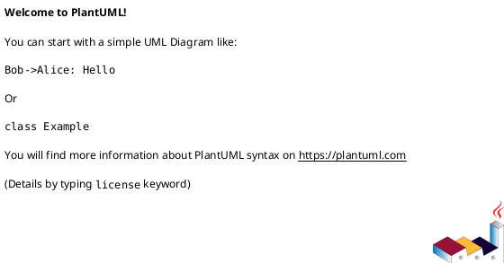

# 作業履歴 2017-01-26

## 概要

2017-01-26の作業内容をまとめています。

## コミット: 2b5e45b

### メッセージ

```
準備作業 #6
```

### 変更されたファイル

- M	README.md
- M	Vagrantfile
- A	app/controllers/admin/staff_members_controller.rb
- M	db/seed/development/staff_members.rb

### 変更内容

```diff
commit 2b5e45b7d74df238ca0a5249d1bda69ff96c2a75
Author: k2works <kakimomokuri@gmail.com>
Date:   Thu Jan 26 20:31:28 2017 +0900

    準備作業 #6

diff --git a/README.md b/README.md
index 13c60e6..02f72a7 100644
--- a/README.md
+++ b/README.md
@@ -417,6 +417,8 @@ git push heroku master
 
 ### レコードの表示、新規作成、更新、削除
 #### 管理者による職員アカウント管理機能（前編）
++ 準備作業
+
 #### 管理者による職員アカウント管理機能（後編）
 
 ### String Parameters
diff --git a/Vagrantfile b/Vagrantfile
index 70088df..b27838b 100644
--- a/Vagrantfile
+++ b/Vagrantfile
@@ -11,6 +11,7 @@ Vagrant.configure("2") do |config|
   config.vm.network :forwarded_port, guest:5432, host:5432, id:"postgresql"
   config.vm.network :forwarded_port, guest:6379, host:6379, id:"redis"
   config.vm.network :forwarded_port, guest:27017, host:27017, id:"mongodb"
+  config.vm.network :forwarded_port, guest:8080, host:8080, id:"jenkins"
   config.vm.network :private_network, ip:"127.0.0.1"
 
   config.vm.synced_folder ".", "/vagrant", mount_options: ['dmode=777','fmode=777']
diff --git a/app/controllers/admin/staff_members_controller.rb b/app/controllers/admin/staff_members_controller.rb
new file mode 100644
index 0000000..a9b32b3
--- /dev/null
+++ b/app/controllers/admin/staff_members_controller.rb
@@ -0,0 +1,2 @@
+class Admin::StaffMembersController < ApplicationController
+end
diff --git a/db/seed/development/staff_members.rb b/db/seed/development/staff_members.rb
index 7156a40..1be8731 100644
--- a/db/seed/development/staff_members.rb
+++ b/db/seed/development/staff_members.rb
@@ -6,4 +6,36 @@ StaffMember.create(
                given_name_kana: 'タロウ',
                password: 'password',
                start_date: Date.today
-)
\ No newline at end of file
+)
+
+family_name = %w{
+  佐藤:サトウ:sato
+  鈴木:スズキ:suzuki
+  高橋:タカハシ:takahashi
+  田中:タナカ:tanaka
+}
+
+given_name = %w{
+  二郎:ジロウ:jiro
+  三郎:サブロウ:saburo
+  松子:マツコ:matsuko
+  竹子:タケコ:takeko
+  梅子:ウメコ:umeko
+}
+
+20.times do |n|
+  fn = family_name[n % 4].split(':')
+  gn = given_name[n % 5].split(':')
+
+  StaffMember.create!(
+                 email: "#{fn[2]}.#{gn[2]}@example.com",
+                 family_name: fn[0],
+                 given_name: gn[0],
+                 family_name_kana: fn[1],
+                 given_name_kana: gn[1],
+                 password: 'password',
+                 start_date: (100 - n).days.ago.to_date,
+                 end_date: n == 0 ? Date.today : nil,
+                 suspended: n == 1
+  )
+end
\ No newline at end of file

```

### 構造変更



## コミット: de2bd83

### メッセージ

```
DB接続設定修正
```

### 変更されたファイル

- M	config/database.yml

### 変更内容

```diff
commit de2bd834ae4d2af773151b0c5250e4df57b7b504
Author: k2works <kakimomokuri@gmail.com>
Date:   Thu Jan 26 20:20:20 2017 +0900

    DB接続設定修正

diff --git a/config/database.yml b/config/database.yml
index 0c4a245..aaf01f7 100644
--- a/config/database.yml
+++ b/config/database.yml
@@ -55,6 +55,8 @@ production:
   # For details on connection pooling, see rails configuration guide
   # http://guides.rubyonrails.org/configuring.html#database-pooling
   pool: <%= ENV.fetch("RAILS_MAX_THREADS") { 5 } %>
-  url: <%= ENV['DATABASE_URL'] %>
-  port: <%= ENV['PORT'] %>
+  username: postgres
+  password: password
+  host: 127.0.0.1
+  database: baukis-kai_production
 

```

## コミット: 752f872

### メッセージ

```
レコードの表示、新規作成、更新、削除 #6
```

### 変更されたファイル

- M	README.md

### 変更内容

```diff
commit 752f872c577dbf411b3350bc55baa30f963488ef
Author: k2works <kakimomokuri@gmail.com>
Date:   Thu Jan 26 18:21:04 2017 +0900

    レコードの表示、新規作成、更新、削除 #6

diff --git a/README.md b/README.md
index d55146e..13c60e6 100644
--- a/README.md
+++ b/README.md
@@ -416,6 +416,9 @@ git push heroku master
 + 顧客ルーティング追加
 
 ### レコードの表示、新規作成、更新、削除
+#### 管理者による職員アカウント管理機能（前編）
+#### 管理者による職員アカウント管理機能（後編）
+
 ### String Parameters
 ### アクセス制御
 ### モデル間の関連付け

```

