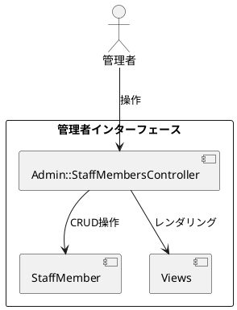
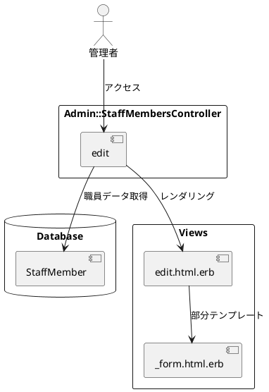
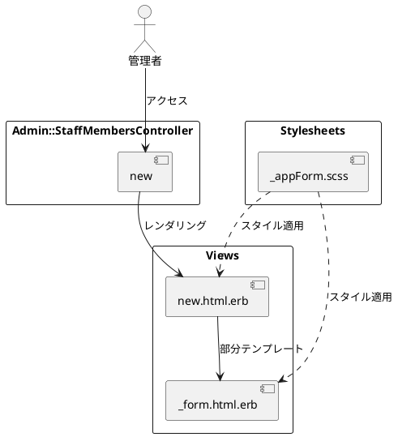
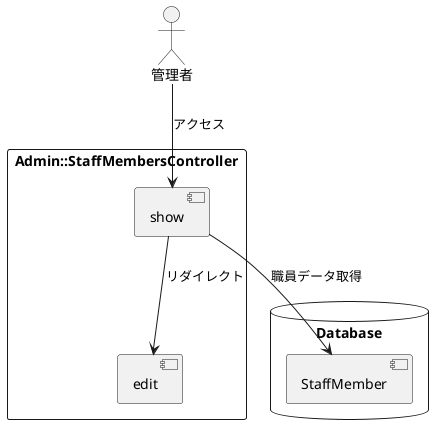

# 作業履歴 2017-01-27

## 概要

2017-01-27の作業内容をまとめています。この日は管理者による職員アカウント管理機能の実装を進め、CRUD操作の基本となるアクションを実装しました。

### 関連ユースケース

- **A-003**: 職員アカウント作成 - 管理者が新規職員アカウントを作成する
- **A-004**: 職員アカウント編集 - 管理者が既存の職員アカウント情報を編集する

### システム構成上の位置づけ

この実装は管理者インターフェースの一部であり、システムアーキテクチャにおける以下の部分に関連しています：



## コミット: 4ac6dee

### メッセージ

```
editアクション #6
```

### 変更されたファイル

- M	README.md
- M	app/assets/stylesheets/components/_appForm.scss
- M	app/controllers/admin/staff_members_controller.rb
- M	app/views/admin/staff_members/_form.html.erb
- A	app/views/admin/staff_members/edit.html.erb

### 概要

このコミットでは、職員アカウント管理機能の編集機能（editアクション）を実装しました。既存の職員情報を編集するためのフォームとコントローラアクションが追加されています。これはユースケース**A-004**（職員アカウント編集）の一部を実現するものです。

### 変更内容

```diff
commit 4ac6dee5f5942ec909093a3568132483d8c8fed7
Author: k2works <kakimomokuri@gmail.com>
Date:   Fri Jan 27 19:06:35 2017 +0900

    editアクション #6

diff --git a/README.md b/README.md
index 43f1b68..b870c87 100644
--- a/README.md
+++ b/README.md
@@ -421,6 +421,7 @@ git push heroku master
 + indexアクション
 + showアクション
 + newアクション
++ editアクション

 #### 管理者による職員アカウント管理機能（後編）

diff --git a/app/assets/stylesheets/components/_appForm.scss b/app/assets/stylesheets/components/_appForm.scss
index 3512925..65bcc4e 100644
--- a/app/assets/stylesheets/components/_appForm.scss
+++ b/app/assets/stylesheets/components/_appForm.scss
@@ -38,5 +38,4 @@
       padding: $wide $very_wide;
     }
   }
-
 }
\ No newline at end of file
diff --git a/app/controllers/admin/staff_members_controller.rb b/app/controllers/admin/staff_members_controller.rb
index d1c7130..e98c10d 100644
--- a/app/controllers/admin/staff_members_controller.rb
+++ b/app/controllers/admin/staff_members_controller.rb
@@ -11,4 +11,8 @@ class Admin::StaffMembersController < Admin::Base
   def new
     @staff_member = StaffMember.new
   end
+
+  def edit
+    @staff_member = StaffMember.find(params[:id])
+  end
 end
diff --git a/app/views/admin/staff_members/_form.html.erb b/app/views/admin/staff_members/_form.html.erb
index e897fcd..613e220 100644
--- a/app/views/admin/staff_members/_form.html.erb
+++ b/app/views/admin/staff_members/_form.html.erb
@@ -1,14 +1,16 @@
 <div class="AppForm__notes">
-  <span class="mark"></span>印の付いた項目は入力必須です。
+  <span class="AppForm__notes--mark">*</span>印の付いた項目は入力必須です。
 </div>
 <div>
   <%= f.label :email, t('activerecord.attributes.staff_member.email'), class: 'AppForm__label required' %>
   <%= f.text_field :email, hide_label: true, size: 32, required: true %>
 </div>
+<% if f.object.new_record? %>
 <div>
   <%= f.label :password, t('activerecord.attributes.staff_member.hashed_password'), class: 'AppForm__label required' %>
   <%= f.password_field :pasword, hide_label: true, size:32, required: true %>
 </div>
+<% end %>
 <div>
   <%= f.label :family_name, '氏名', class: 'required' %>
   <%= f.text_field :family_name, hide_label: true, required: true %>
diff --git a/app/views/admin/staff_members/edit.html.erb b/app/views/admin/staff_members/edit.html.erb
new file mode 100644
index 0000000..322228d
--- /dev/null
+++ b/app/views/admin/staff_members/edit.html.erb
@@ -0,0 +1,17 @@
+<% @title = '職員アカウントの編集' %>
+<section class="Section">
+  <h1 class="Admin__title"><%= @title %></h1>
+</section>
+
+<section class="Section l-column AppForm">
+
+  <div class="AppForm__generic-form">
+    <%= bootstrap_form_for [ :admin, @staff_member ] do |f| %>
+        <%= render 'form', f: f %>
+        <div class="AppForm__buttons">
+          <%= f.submit '更新' %>
+          <%= link_to 'キャンセル', :admin_staff_members %>
+        </div>
+    <% end %>
+  </div>
+</section>

```

### 構造変更

このコミットでは、職員編集機能のためのビューとコントローラアクションが追加されました。



## コミット: 6897556

### メッセージ

```
newアクション #6
```

### 変更されたファイル

- M	README.md
- A	app/assets/stylesheets/components/_appForm.scss
- M	app/assets/stylesheets/main.scss
- M	app/controllers/admin/staff_members_controller.rb
- A	app/views/admin/staff_members/_form.html.erb
- A	app/views/admin/staff_members/new.html.erb

### 概要

このコミットでは、職員アカウント管理機能の新規作成機能（newアクション）を実装しました。新しい職員を登録するためのフォームとコントローラアクションが追加されています。また、フォームのスタイルを定義するための_appForm.scssファイルも作成されました。これはユースケース**A-003**（職員アカウント作成）の一部を実現するものです。

### 変更内容

```diff
commit 6897556d6d3b97556542c81db078fa3a4aee7a76
Author: k2works <kakimomokuri@gmail.com>
Date:   Fri Jan 27 18:55:05 2017 +0900

    newアクション #6

diff --git a/README.md b/README.md
index 5f4ca3d..43f1b68 100644
--- a/README.md
+++ b/README.md
@@ -420,6 +420,7 @@ git push heroku master
 + 準備作業
 + indexアクション
 + showアクション
++ newアクション

 #### 管理者による職員アカウント管理機能（後編）

diff --git a/app/assets/stylesheets/components/_appForm.scss b/app/assets/stylesheets/components/_appForm.scss
new file mode 100644
index 0000000..3512925
--- /dev/null
+++ b/app/assets/stylesheets/components/_appForm.scss
@@ -0,0 +1,42 @@
+// =====================
+// ApplicationForm
+// ---------------------
+// アプリケーション用フォーム
+// =====================
+
+
+.AppForm {
+  &__generic-form {
+    width: 480px;
+    margin: $very_wide auto;
+    padding: $very_wide;
+    border-radius: $wide;
+    border: solid 4px $dark_magenta;
+    background-color: $very_light_gray;
+    }
+  &__notes {
+    text-align: right;
+    font-size: $small;
+    span.mark { color: $red }
+  }
+  &__label {
+    display: block;
+    padding: $moderate 0;
+  }
+  label {
+    &.required:after {
+      content: '*';
+      padding-left: $narrow;
+      color: $red;
+    }
+    input[type='checkbox']+label { display: inline-block }
+    input[type='radio']+label { display: inline-block }
+  }
+  &__buttons {
+    text-align: center;
+    input[type='submit'] {
+      padding: $wide $very_wide;
+    }
+  }
+
+}
\ No newline at end of file
diff --git a/app/assets/stylesheets/main.scss b/app/assets/stylesheets/main.scss
index 42ba8dc..741293f 100644
--- a/app/assets/stylesheets/main.scss
+++ b/app/assets/stylesheets/main.scss
@@ -69,6 +69,7 @@

 // フォーム
 @import "./components/form";
+@import "./components/appForm";

 //font-awesome
 @import "font-awesome";
diff --git a/app/controllers/admin/staff_members_controller.rb b/app/controllers/admin/staff_members_controller.rb
index 77506f7..d1c7130 100644
--- a/app/controllers/admin/staff_members_controller.rb
+++ b/app/controllers/admin/staff_members_controller.rb
@@ -7,4 +7,8 @@ class Admin::StaffMembersController < Admin::Base
     staff_member = StaffMember.find(params[:id])
     redirect_to [ :edit, :admin, staff_member ]
   end
+
+  def new
+    @staff_member = StaffMember.new
+  end
 end
diff --git a/app/views/admin/staff_members/_form.html.erb b/app/views/admin/staff_members/_form.html.erb
new file mode 100644
index 0000000..e897fcd
--- /dev/null
+++ b/app/views/admin/staff_members/_form.html.erb
@@ -0,0 +1,33 @@
+<div class="AppForm__notes">
+  <span class="mark"></span>印の付いた項目は入力必須です。
+</div>
+<div>
+  <%= f.label :email, t('activerecord.attributes.staff_member.email'), class: 'AppForm__label required' %>
+  <%= f.text_field :email, hide_label: true, size: 32, required: true %>
+</div>
+<div>
+  <%= f.label :password, t('activerecord.attributes.staff_member.hashed_password'), class: 'AppForm__label required' %>
+  <%= f.password_field :pasword, hide_label: true, size:32, required: true %>
+</div>
+<div>
+  <%= f.label :family_name, '氏名', class: 'required' %>
+  <%= f.text_field :family_name, hide_label: true, required: true %>
+  <%= f.text_field :given_name, hide_label: true, required: true %>
+</div>
+<div>
+  <%= f.label :family_name_kana, 'フリガナ', class: 'required' %>
+  <%= f.text_field :family_name_kana, hide_label: true, required: true %>
+  <%= f.text_field :given_name_kana, hide_label: true, required: true %>
+</div>
+<div>
+  <%= f.label :start_date, t('activerecord.attributes.staff_member.start_date'), class: 'AppForm__label required' %>
+  <%= f.text_field :start_date, hide_label: true, required: true %>
+</div>
+<div>
+  <%= f.label :end_date, t('activerecord.attributes.staff_member.end_date') %>
+  <%= f.text_field :end_date ,hide_label: true %>
+</div>
+<div class="check-box">
+  <%= f.label :suspended, 'アカウント停止' %>
+  <%= f.check_box :suspended ,hide_label: true %>
+</div>
\ No newline at end of file
diff --git a/app/views/admin/staff_members/new.html.erb b/app/views/admin/staff_members/new.html.erb
new file mode 100644
index 0000000..2bfa195
--- /dev/null
+++ b/app/views/admin/staff_members/new.html.erb
@@ -0,0 +1,17 @@
+<% @title = '職員の新規登録' %>
+<section class="Section">
+  <h1 class="Admin__title"><%= @title %></h1>
+</section>
+
+<section class="Section l-column AppForm">
+
+  <div class="AppForm__generic-form">
+    <%= bootstrap_form_for [ :admin, @staff_member ] do |f| %>
+    <%= render 'form', f: f %>
+        <div class="AppForm__buttons">
+          <%= f.submit '登録' %>
+          <%= link_to 'キャンセル', :admin_staff_members %>
+        </div>
+    <% end %>
+  </div>
+</section>

```

### 構造変更

このコミットでは、職員新規登録機能のためのビューとコントローラアクションが追加されました。また、フォームのスタイルを定義するCSSも実装されています。



## コミット: 08f6f9c

### メッセージ

```
showアクション #6
```

### 変更されたファイル

- M	README.md
- M	app/controllers/admin/staff_members_controller.rb

### 概要

このコミットでは、職員アカウント管理機能の詳細表示機能（showアクション）を実装しました。ただし、実際の実装では詳細表示ページは作成せず、編集ページにリダイレクトする形式を採用しています。これにより、詳細表示と編集を一元化し、ユーザーインターフェースをシンプルにしています。これはユースケース**A-004**（職員アカウント編集）の一部を実現するものです。

### 変更内容

```diff
commit 08f6f9cadf41f5ead575e133a3b049d4aad3e1e9
Author: k2works <kakimomokuri@gmail.com>
Date:   Fri Jan 27 17:25:12 2017 +0900

    showアクション #6

diff --git a/README.md b/README.md
index 122dfdf..5f4ca3d 100644
--- a/README.md
+++ b/README.md
@@ -419,6 +419,7 @@ git push heroku master
 #### 管理者による職員アカウント管理機能（前編）
 + 準備作業
 + indexアクション
++ showアクション

 #### 管理者による職員アカウント管理機能（後編）

diff --git a/app/controllers/admin/staff_members_controller.rb b/app/controllers/admin/staff_members_controller.rb
index 0d7a7c2..77506f7 100644
--- a/app/controllers/admin/staff_members_controller.rb
+++ b/app/controllers/admin/staff_members_controller.rb
@@ -2,4 +2,9 @@ class Admin::StaffMembersController < Admin::Base
   def index
     @staff_members = StaffMember.order(:family_name_kana, :given_name_kana)
   end
+
+  def show
+    staff_member = StaffMember.find(params[:id])
+    redirect_to [ :edit, :admin, staff_member ]
+  end
 end

```

### 構造変更

このコミットでは、職員詳細表示機能のためのコントローラアクションが追加されましたが、実際には編集ページへのリダイレクトを行う実装となっています。



## コミット: aef2849

### メッセージ

```
indexアクション #6
```

### 変更されたファイル

- M	README.md
- A	app/assets/stylesheets/components/common/_table.scss
- M	app/assets/stylesheets/main.scss
- M	app/controllers/admin/staff_members_controller.rb
- A	app/views/admin/staff_members/index.html.erb
- M	config/routes.rb

### 概要

このコミットでは、職員アカウント管理機能の一覧表示機能（indexアクション）を実装しました。職員の一覧を表示するためのテーブルスタイルとビューテンプレートが追加されています。また、ルーティングも更新され、職員管理のための全RESTfulアクションが有効になりました。これはユースケース**A-003**と**A-004**の基盤となる機能を提供するものです。

### 変更内容

```diff
commit aef28493f8bd370ee29cda3ed2bd04f5e42dd940
Author: k2works <kakimomokuri@gmail.com>
Date:   Fri Jan 27 17:22:31 2017 +0900

    indexアクション #6

diff --git a/README.md b/README.md
index 02f72a7..122dfdf 100644
--- a/README.md
+++ b/README.md
@@ -418,6 +418,7 @@ git push heroku master
 ### レコードの表示、新規作成、更新、削除
 #### 管理者による職員アカウント管理機能（前編）
 + 準備作業
++ indexアクション

 #### 管理者による職員アカウント管理機能（後編）

diff --git a/app/assets/stylesheets/components/common/_table.scss b/app/assets/stylesheets/components/common/_table.scss
new file mode 100644
index 0000000..bf7656b
--- /dev/null
+++ b/app/assets/stylesheets/components/common/_table.scss
@@ -0,0 +1,53 @@
+@charset 'utf-8';
+
+// =====================
+// Table
+// ---------------------
+// 共通テーブル
+// =====================
+
+.Table {
+  width: 90%;
+  margin: 0 auto;
+
+  &__links {
+    text-align: right;
+    padding: $moderate;
+  }
+
+  &__body {
+    margin: $moderate auto 0;
+    border: solid $moderate $very_dark_magenta;
+  }
+
+  &__th {
+    background-color: $dark_gray;
+    color: $very_light_gray;
+    padding: $narrow;
+    text-align: center;
+  }
+
+  &__td { padding: $narrow }
+
+  &--email { font-family: monospace }
+
+  &--date {
+    font-family: monospace;
+    text-align: center;
+  }
+
+  &--boolean { text-align: center }
+
+  &--actions {
+    text-align: center;
+    color: $dark_gray;
+  }
+
+  &--listing {
+    width: 100%;
+    tr:nth-child(even) { background-color: $very_light_gray }
+    tr:nth-child(odd) { background-color: $light_gray }
+  }
+}
+
+
diff --git a/app/assets/stylesheets/main.scss b/app/assets/stylesheets/main.scss
index c3e124a..42ba8dc 100644
--- a/app/assets/stylesheets/main.scss
+++ b/app/assets/stylesheets/main.scss
@@ -47,6 +47,9 @@
 // エラー
 @import "./components/common/errors";

+// テーブル
+@import "./components/common/table";
+
 // Others
 //----------------------------
 // ブログ抜粋
diff --git a/app/controllers/admin/staff_members_controller.rb b/app/controllers/admin/staff_members_controller.rb
index a9b32b3..0d7a7c2 100644
--- a/app/controllers/admin/staff_members_controller.rb
+++ b/app/controllers/admin/staff_members_controller.rb
@@ -1,2 +1,5 @@
-class Admin::StaffMembersController < ApplicationController
+class Admin::StaffMembersController < Admin::Base
+  def index
+    @staff_members = StaffMember.order(:family_name_kana, :given_name_kana)
+  end
 end
diff --git a/app/views/admin/staff_members/index.html.erb b/app/views/admin/staff_members/index.html.erb
new file mode 100644
index 0000000..4109326
--- /dev/null
+++ b/app/views/admin/staff_members/index.html.erb
@@ -0,0 +1,43 @@
+<% @title = '職員管理' %>
+<section class="Section">
+  <h1 class="Admin__title"><%= @title %></h1>
+</section>
+
+<section class="Section l-column Table">
+  <div class="Table__links">
+    <%= link_to '新規登録', :new_admin_staff_member, class: 'btn btn-default' %>
+  </div>
+
+  <table class="Table__body Table--listing">
+    <tr class="Table__tr">
+      <th class="Table__th">氏名</th>
+      <th class="Table__th">フリガナ</th>
+      <th class="Table__th">メールアドレス</th>
+      <th class="Table__th">開始日</th>
+      <th class="Table__th">終了日</th>
+      <th class="Table__th">停止フラグ</th>
+      <th class="Table__th">アクション</th>
+    </tr>
+    <% @staff_members.each do |m| %>
+        <tr  class="Table__tr">
+          <td class="Table__td"><%= m.family_name %> <%= m.given_name %></td>
+          <td class="Table__td"><%= m.family_name_kana %> <%= m.given_name_kana %></td>
+          <td class="Table__td Table--email"><%= m.email %></td>
+          <td class="Table__td Table--date"><%= m.start_date %></td>
+          <td class="Table__td Table--date"><%= m.end_date %></td>
+          <td class="Table__td Table--boolean">
+            <%= m.suspended? ? raw('&#x2611;') : raw('&#x2610;') %>
+          </td>
+          <td class="Table__td Table--actions">
+            <%= link_to '編集', [ :edit, :admin, m ], class: 'btn btn-default btn-xs' %> |
+            <%= link_to '削除', [ :admin, m ], method: :delete,
+                        data: { confirm: '本当に削除しますか?'}, class: 'btn btn-default btn-xs' %>
+          </td>
+        </tr>
+    <% end %>
+  </table>
+
+  <div class="Table__links">
+    <%= link_to '新規登録', :new_admin_staff_member, class: 'btn btn-default' %>
+  </div>
+</section>
diff --git a/config/routes.rb b/config/routes.rb
index 40f135b..7133f04 100644
--- a/config/routes.rb
+++ b/config/routes.rb
@@ -47,7 +47,7 @@ Rails.application.routes.draw do
     namespace :admin, path: config[:admin][:path]  do
       root 'top#index'
       concerns :session_path
-      resources :staff_members, only: [:index, :new, :create], path: 'staff'
+      resources :staff_members, path: 'staff'
     end
   end


```

### 構造変更

このコミットでは、職員一覧表示機能のためのビューとコントローラアクション、およびテーブルスタイルが追加されました。また、ルーティングも更新され、職員管理のための全RESTfulアクションが有効になりました。

```plantuml
@startuml "職員一覧表示機能"
actor "管理者" as Admin
rectangle "Admin::StaffMembersController" {
  [index] as IndexAction
}
database "Database" {
  [StaffMember]
}
rectangle "Views" {
  [index.html.erb]
}
rectangle "Stylesheets" {
  [_table.scss]
}
rectangle "Routes" {
  [resources :staff_members]
}

Admin --> IndexAction : アクセス
IndexAction --> StaffMember : 職員データ取得
IndexAction --> index.html.erb : レンダリング
_table.scss ..> index.html.erb : スタイル適用
resources :staff_members --> IndexAction : ルーティング
@enduml
```
