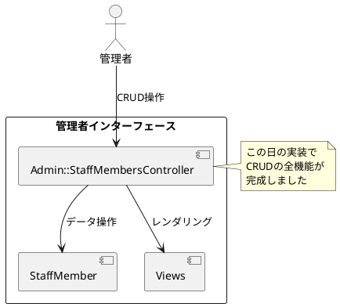
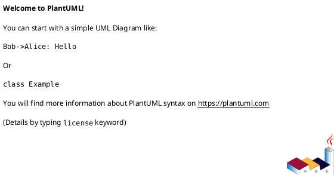

# 作業履歴 2017-01-28

## 概要

2017-01-28の作業内容をまとめています。この日は主に管理者による職員アカウント管理機能の実装を完了させ、createアクション、updateアクション、destroyアクションを実装しました。また、UI調整やバグ修正も行いました。

### 関連ユースケース

- **A-003**: 職員アカウント作成 - 管理者が新規職員アカウントを作成する
- **A-004**: 職員アカウント編集 - 管理者が既存の職員アカウント情報を編集する
- **A-005**: 職員アカウント停止/再開 - 管理者が職員アカウントの停止または再開を行う

### システム構成上の位置づけ

この実装は管理者インターフェースの一部であり、システムアーキテクチャにおける以下の部分に関連しています：



## コミット: a493db5

### メッセージ

```
メッセージ表示位置調整
```

### 変更されたファイル

- M	app/assets/stylesheets/components/parts/_flash.scss
- M	app/views/admin/shared/_header.html.erb
- M	app/views/staff/shared/_header.html.erb

### 変更内容

```diff
commit a493db5f5940badc99d916541e2f1f16547f79f4
Author: k2works <kakimomokuri@gmail.com>
Date:   Sat Jan 28 15:33:07 2017 +0900

    メッセージ表示位置調整

diff --git a/app/assets/stylesheets/components/parts/_flash.scss b/app/assets/stylesheets/components/parts/_flash.scss
index ab416bb..92b4cd8 100644
--- a/app/assets/stylesheets/components/parts/_flash.scss
+++ b/app/assets/stylesheets/components/parts/_flash.scss
@@ -4,7 +4,7 @@
   display: inline-block;
   padding: $narrow $moderate;
   margin: 0 $wide;
-  font-size: $tiny;
+  font-size: $normal;
   color: $very_light_gray;

   &__notice {
diff --git a/app/views/admin/shared/_header.html.erb b/app/views/admin/shared/_header.html.erb
index 299226e..afecf20 100644
--- a/app/views/admin/shared/_header.html.erb
+++ b/app/views/admin/shared/_header.html.erb
@@ -4,13 +4,13 @@
   </div>
   <div class="Header__head">
     <h1 class="logo"><%= link_to('BAUKIS KAI', admin_root_url, class:'logo logo--admin') %></h1>
+  </div>

-    <div class="Flash">
-      <%= content_tag(:span, flash.notice, class: 'Flash__notice') if flash.notice %>
-      <%= content_tag(:span, flash.alert, class: 'Flash__alert') if flash.alert %>
-    </div>
-
+  <div class="Flash">
+    <%= content_tag(:span, flash.notice, class: 'Flash__notice') if flash.notice %>
+    <%= content_tag(:span, flash.alert, class: 'Flash__alert') if flash.alert %>
   </div>
+
   <nav class="Header__body SpMenu">
     <ul class="Menu">
       <li class="Menu__item"><a href="#"></a></li>
diff --git a/app/views/staff/shared/_header.html.erb b/app/views/staff/shared/_header.html.erb
index ea9128a..0e430e2 100644
--- a/app/views/staff/shared/_header.html.erb
+++ b/app/views/staff/shared/_header.html.erb
@@ -4,13 +4,13 @@
   </div>
   <div class="Header__head">
     <h1 class="logo"><%= link_to('BAUKIS KAI', staff_root_url, class:'logo logo--staff') %></h1>
+  </div>

-    <div class="Flash">
-      <%= content_tag(:span, flash.notice, class: 'Flash__notice') if flash.notice %>
-      <%= content_tag(:span, flash.alert, class: 'Flash__alert') if flash.alert %>
-    </div>
-
+  <div class="Flash">
+    <%= content_tag(:span, flash.notice, class: 'Flash__notice') if flash.notice %>
+    <%= content_tag(:span, flash.alert, class: 'Flash__alert') if flash.alert %>
   </div>
+
   <nav class="Header__body SpMenu">
     <ul class="Menu">
       <li class="Menu__item"><a href="#"></a></li>

```

## コミット: f12be02

### メッセージ

```
管理者画面ヘッダーカラー変更
```

### 変更されたファイル

- M	app/assets/stylesheets/pages/_admin.scss

### 変更内容

```diff
commit f12be02bfe050218d50070cfffb1aa36d2e6029e
Author: k2works <kakimomokuri@gmail.com>
Date:   Sat Jan 28 15:19:44 2017 +0900

    管理者画面ヘッダーカラー変更

diff --git a/app/assets/stylesheets/pages/_admin.scss b/app/assets/stylesheets/pages/_admin.scss
index 8937028..5b939fe 100644
--- a/app/assets/stylesheets/pages/_admin.scss
+++ b/app/assets/stylesheets/pages/_admin.scss
@@ -36,7 +36,7 @@ html, body {

   &__header {
     padding: $moderate;
-    background-color: $very_dark_magenta;
+    background-color: $dark_magenta;
     color: $very_light_gray;
     span.logo-mark {
       font-weight: bold;

```

## コミット: 433d142

### メッセージ

```
ログアウト時にアカウントが非表示にならない不具合を修正
```

### 変更されたファイル

- M	app/views/staff/shared/_header.html.erb

### 変更内容

```diff
commit 433d142acf2c76192da9b9b8da4df0dce39304cc
Author: k2works <kakimomokuri@gmail.com>
Date:   Sat Jan 28 15:08:34 2017 +0900

    ログアウト時にアカウントが非表示にならない不具合を修正

diff --git a/app/views/staff/shared/_header.html.erb b/app/views/staff/shared/_header.html.erb
index 2661b7d..ea9128a 100644
--- a/app/views/staff/shared/_header.html.erb
+++ b/app/views/staff/shared/_header.html.erb
@@ -22,5 +22,8 @@
         link_to t('staff.shared.header.login'), :staff_login, class: 'btn btn-default'
       end
     %>
-  <%= link_to t('staff.shared.header.account'), (:staff_account if current_staff_member) , class: 'btn btn-default' %>
+  <%= if current_staff_member
+        link_to t('staff.shared.header.account'), :staff_account , class: 'btn btn-default'
+      end
+  %>
 </header>
\ No newline at end of file

```

## コミット: b699d9e

### メッセージ

```
画面表示不具合修正
```

### 変更されたファイル

- M	app/assets/stylesheets/components/common/_table.scss
- M	app/views/admin/staff_members/new.html.erb
- M	app/views/staff/accounts/edit.html.erb
- M	app/views/staff/top/index.html.erb
- M	config/routes.rb

### 変更内容

```diff
commit b699d9ed54a562b269c28a83965b76b8eef3233c
Author: k2works <kakimomokuri@gmail.com>
Date:   Sat Jan 28 14:58:02 2017 +0900

    画面表示不具合修正

diff --git a/app/assets/stylesheets/components/common/_table.scss b/app/assets/stylesheets/components/common/_table.scss
index 86bfb1c..0c75320 100644
--- a/app/assets/stylesheets/components/common/_table.scss
+++ b/app/assets/stylesheets/components/common/_table.scss
@@ -48,6 +48,7 @@

     &--actions {
       color: $dark_gray;
+      text-align: center;
     }

     &--center {
diff --git a/app/views/admin/staff_members/new.html.erb b/app/views/admin/staff_members/new.html.erb
index 06fed3c..fdc2ab3 100644
--- a/app/views/admin/staff_members/new.html.erb
+++ b/app/views/admin/staff_members/new.html.erb
@@ -4,13 +4,12 @@
 </section>

 <section class="Section l-column AppForm">
-
-  <div class="AppForm__generic-form">
+  <div class="AppForm__generic-form AdminAppForm__generic-form">
     <%= bootstrap_form_for [ :admin, @staff_member ] do |f| %>
     <%= render 'form', f: f %>
         <div class="AppForm__buttons">
-          <%= f.submit t('.create') %>
-          <%= link_to t('.cancel'), :admin_staff_members %>
+          <%= f.submit t('.create') ,class: 'btn btn-default btn-lg'%>
+          <%= link_to t('.cancel'), :admin_staff_members ,class: 'btn btn-default btn-lg'%>
         </div>
     <% end %>
   </div>
diff --git a/app/views/staff/accounts/edit.html.erb b/app/views/staff/accounts/edit.html.erb
index ab6aef6..c60ac2e 100644
--- a/app/views/staff/accounts/edit.html.erb
+++ b/app/views/staff/accounts/edit.html.erb
@@ -8,8 +8,8 @@
     <%= bootstrap_form_for @staff_member, url: :staff_account do |f| %>
         <%= render 'form', f: f %>
         <div class="AppForm__buttons">
-          <%= f.submit t('.update') %>
-          <%= link_to t('.cancel'), :admin_staff_members %>
+          <%= f.submit t('.update'),class: 'btn btn-default btn-lg' %>
+          <%= link_to t('.cancel'), :staff_account, class: 'btn btn-default btn-lg' %>
         </div>
     <% end %>
   </div>
diff --git a/app/views/staff/top/index.html.erb b/app/views/staff/top/index.html.erb
index f510527..2d675aa 100644
--- a/app/views/staff/top/index.html.erb
+++ b/app/views/staff/top/index.html.erb
@@ -8,6 +8,10 @@
     <h2 class="sectionLabel">お知らせ</h2>
   </div>
   <ol class="NewsList">
+    <li class="NewsList__item">
+      <time class="NewsList__head" datatime="2017-1-28">2017.1.28</time>
+      <span class="NewsList__body">アカウント情報編集機能を追加</span>
+    </li>
     <li class="NewsList__item">
       <time class="NewsList__head" datatime="2017-1-21">2017.1.21</time>
       <span class="NewsList__body">ログイン機能を追加</span>
diff --git a/config/routes.rb b/config/routes.rb
index 4673828..8cf125f 100644
--- a/config/routes.rb
+++ b/config/routes.rb
@@ -39,7 +39,7 @@ Rails.application.routes.draw do
     namespace :staff, path: config[:staff][:path] do
       root   'top#index'
       concerns :session_path
-      resource :account, only: [:update]
+      resource :account, only: [:show, :edit, :update]
     end
   end


```

## コミット: be80ecf

### メッセージ

```
updateアクションのテスト #7
```

### 変更されたファイル

- M	README.md
- M	config/routes.rb
- A	spec/controllers/staff/accounts_controller_spec.rb

### 変更内容

```diff
commit be80ecf04ab2cc56080f035e025dd56859967de7
Author: k2works <kakimomokuri@gmail.com>
Date:   Sat Jan 28 14:31:32 2017 +0900

    updateアクションのテスト #7

diff --git a/README.md b/README.md
index 81b29bd..e6134fc 100644
--- a/README.md
+++ b/README.md
@@ -438,6 +438,7 @@ git push heroku master
 + showアクション
 + editアクション
 + updateアクション
++ updateアクションのテスト

 ### アクセス制御
 ### モデル間の関連付け
diff --git a/config/routes.rb b/config/routes.rb
index 7133f04..4673828 100644
--- a/config/routes.rb
+++ b/config/routes.rb
@@ -39,7 +39,7 @@ Rails.application.routes.draw do
     namespace :staff, path: config[:staff][:path] do
       root   'top#index'
       concerns :session_path
-      resource :account, execpt: [:new, :create, :destroy]
+      resource :account, only: [:update]
     end
   end

diff --git a/spec/controllers/staff/accounts_controller_spec.rb b/spec/controllers/staff/accounts_controller_spec.rb
new file mode 100644
index 0000000..e147715
--- /dev/null
+++ b/spec/controllers/staff/accounts_controller_spec.rb
@@ -0,0 +1,34 @@
+require 'rails_helper'
+
+describe Staff::AccountsController do
+  describe '#update' do
+    let(:params_hash) { attributes_for(:staff_member) }
+    let(:staff_member) { create(:staff_member) }
+
+    before do
+      session[:staff_member_id] = staff_member.id
+    end
+
+    # email属性を変更する
+    it 'should update email attributes' do
+      params_hash.merge!(email: 'test@example.com')
+      patch :update, id: staff_member.id, staff_member: params_hash
+      staff_member.reload
+      expect(staff_member.email).to eq('test@example.com')
+    end
+
+    # 例外ActionController::ParameterMissingが発生
+    it 'should throw ActionController::ParameterMissing exception' do
+      bypass_rescue
+      expect { patch :update, id: staff_member.id}.to raise_error(ActionController::ParameterMissing)
+    end
+
+    # end_dateの値は書き換え不可
+    it 'should writable end_data value' do
+      params_hash.merge!(end_date: Date.tomorrow)
+      expect {
+        patch :update, id: staff_member.id, staff_member: params_hash
+      }.not_to change { staff_member.end_date }
+    end
+  end
+end

```

### 構造変更



## コミット: 0a01f98

### メッセージ

```
updateアクション #7
```

### 変更されたファイル

- M	README.md
- M	app/controllers/staff/accounts_controller.rb
- M	config/locales/controllers/ja.yml

### 変更内容

```diff
commit 0a01f987c6ff5507224625222cdf9df67acfc5dd
Author: k2works <kakimomokuri@gmail.com>
Date:   Sat Jan 28 13:49:30 2017 +0900

    updateアクション #7

diff --git a/README.md b/README.md
index 848e791..81b29bd 100644
--- a/README.md
+++ b/README.md
@@ -437,6 +437,7 @@ git push heroku master
 #### 職員自身によるアカウント管理機能
 + showアクション
 + editアクション
++ updateアクション

 ### アクセス制御
 ### モデル間の関連付け
diff --git a/app/controllers/staff/accounts_controller.rb b/app/controllers/staff/accounts_controller.rb
index 878d1aa..449f282 100644
--- a/app/controllers/staff/accounts_controller.rb
+++ b/app/controllers/staff/accounts_controller.rb
@@ -6,4 +6,26 @@ class Staff::AccountsController < Staff::Base
   def edit
     @staff_member = current_staff_member
   end
+
+  def update
+    @staff_member = current_staff_member
+    @staff_member.assign_attributes(staff_member_params)
+    if @staff_member.save
+      flash.notice = t('.flash_success')
+      redirect_to :staff_account
+    else
+      render action: 'edit'
+    end
+  end
+
+  private
+  def staff_member_params
+    params.require(:staff_member).permit(
+                                     :email,
+                                     :family_name,
+                                     :given_name,
+                                     :family_name_kana,
+                                     :given_name_kana
+    )
+  end
 end
diff --git a/config/locales/controllers/ja.yml b/config/locales/controllers/ja.yml
index 12a95c4..974bbfb 100644
--- a/config/locales/controllers/ja.yml
+++ b/config/locales/controllers/ja.yml
@@ -1,4 +1,8 @@
 ja:
+  staff:
+    accounts:
+      update:
+        flash_success: 'アカウント情報を更新しました。'
   admin:
     staff_members:
       create:

```

### 構造変更


## コミット: e16486b

### メッセージ

```
editアクション #7
```

### 変更されたファイル

- M	README.md
- A	app/assets/stylesheets/components/_adminAppForm.scss
- M	app/assets/stylesheets/components/_appForm.scss
- A	app/assets/stylesheets/components/_staffAppForm.scss
- M	app/assets/stylesheets/main.scss
- M	app/controllers/staff/accounts_controller.rb
- M	app/views/admin/staff_members/edit.html.erb
- A	app/views/staff/accounts/_form.html.erb
- A	app/views/staff/accounts/edit.html.erb
- M	config/locales/views/ja.yml

### 変更内容

```diff
commit e16486bb0969a504d19ce5c6c1ad5e320592251d
Author: k2works <kakimomokuri@gmail.com>
Date:   Sat Jan 28 13:44:09 2017 +0900

    editアクション #7

diff --git a/README.md b/README.md
index 122a5b6..848e791 100644
--- a/README.md
+++ b/README.md
@@ -436,6 +436,7 @@ git push heroku master

 #### 職員自身によるアカウント管理機能
 + showアクション
++ editアクション

 ### アクセス制御
 ### モデル間の関連付け
diff --git a/app/assets/stylesheets/components/_adminAppForm.scss b/app/assets/stylesheets/components/_adminAppForm.scss
new file mode 100644
index 0000000..f7f5ea1
--- /dev/null
+++ b/app/assets/stylesheets/components/_adminAppForm.scss
@@ -0,0 +1,12 @@
+// =====================
+// AdminApplicationForm
+// ---------------------
+// 管理者用アプリケーション用フォーム
+// =====================
+
+
+.AdminAppForm {
+  &__generic-form {
+    border: solid 4px $dark_magenta;
+    }
+}
\ No newline at end of file
diff --git a/app/assets/stylesheets/components/_appForm.scss b/app/assets/stylesheets/components/_appForm.scss
index 65bcc4e..a6b23f4 100644
--- a/app/assets/stylesheets/components/_appForm.scss
+++ b/app/assets/stylesheets/components/_appForm.scss
@@ -11,7 +11,6 @@
     margin: $very_wide auto;
     padding: $very_wide;
     border-radius: $wide;
-    border: solid 4px $dark_magenta;
     background-color: $very_light_gray;
     }
   &__notes {
diff --git a/app/assets/stylesheets/components/_staffAppForm.scss b/app/assets/stylesheets/components/_staffAppForm.scss
new file mode 100644
index 0000000..8ec6c59
--- /dev/null
+++ b/app/assets/stylesheets/components/_staffAppForm.scss
@@ -0,0 +1,12 @@
+// =====================
+// StaffApplicationForm
+// ---------------------
+// 職員用アプリケーション用フォーム
+// =====================
+
+
+.StaffAppForm {
+  &__generic-form {
+    border: solid 4px $dark_cyan;
+    }
+}
\ No newline at end of file
diff --git a/app/assets/stylesheets/main.scss b/app/assets/stylesheets/main.scss
index e4b9282..c994463 100644
--- a/app/assets/stylesheets/main.scss
+++ b/app/assets/stylesheets/main.scss
@@ -70,6 +70,8 @@
 // フォーム
 @import "./components/form";
 @import "./components/appForm";
+@import "./components/adminAppForm";
+@import "./components/staffAppForm";

 // テーブル
 @import "./components/adminTable";
diff --git a/app/controllers/staff/accounts_controller.rb b/app/controllers/staff/accounts_controller.rb
index 4e2ec0f..878d1aa 100644
--- a/app/controllers/staff/accounts_controller.rb
+++ b/app/controllers/staff/accounts_controller.rb
@@ -2,4 +2,8 @@ class Staff::AccountsController < Staff::Base
   def show
     @staff_member = current_staff_member
   end
+
+  def edit
+    @staff_member = current_staff_member
+  end
 end
diff --git a/app/views/admin/staff_members/edit.html.erb b/app/views/admin/staff_members/edit.html.erb
index 11700f0..42104a8 100644
--- a/app/views/admin/staff_members/edit.html.erb
+++ b/app/views/admin/staff_members/edit.html.erb
@@ -4,8 +4,7 @@
 </section>

 <section class="Section l-column AppForm">
-
-  <div class="AppForm__generic-form">
+  <div class="AppForm__generic-form AdminAppForm__generic-form">
     <%= bootstrap_form_for [ :admin, @staff_member ] do |f| %>
         <%= render 'form', f: f %>
         <div class="AppForm__buttons">
diff --git a/app/views/staff/accounts/_form.html.erb b/app/views/staff/accounts/_form.html.erb
new file mode 100644
index 0000000..ebbcca0
--- /dev/null
+++ b/app/views/staff/accounts/_form.html.erb
@@ -0,0 +1,17 @@
+<div class="AppForm__notes">
+  <span class="AppForm__notes--mark">*</span>印の付いた項目は入力必須です。
+</div>
+<div>
+  <%= f.label :email, t('activerecord.attributes.staff_member.email'), class: 'AppForm__label required' %>
+  <%= f.text_field :email, hide_label: true, size: 32, required: true %>
+</div>
+<div>
+  <%= f.label :family_name, '氏名', class: 'required' %>
+  <%= f.text_field :family_name, hide_label: true, required: true %>
+  <%= f.text_field :given_name, hide_label: true, required: true %>
+</div>
+<div>
+  <%= f.label :family_name_kana, 'フリガナ', class: 'required' %>
+  <%= f.text_field :family_name_kana, hide_label: true, required: true %>
+  <%= f.text_field :given_name_kana, hide_label: true, required: true %>
+</div>
\ No newline at end of file
diff --git a/app/views/staff/accounts/edit.html.erb b/app/views/staff/accounts/edit.html.erb
new file mode 100644
index 0000000..ab6aef6
--- /dev/null
+++ b/app/views/staff/accounts/edit.html.erb
@@ -0,0 +1,16 @@
+<% @title = t('.title') %>
+<section class="Section">
+  <h1 class="Staff__title"><%= @title %></h1>
+</section>
+
+<section class="Section l-column AppForm">
+  <div class="AppForm__generic-form StaffAppForm__generic-form">
+    <%= bootstrap_form_for @staff_member, url: :staff_account do |f| %>
+        <%= render 'form', f: f %>
+        <div class="AppForm__buttons">
+          <%= f.submit t('.update') %>
+          <%= link_to t('.cancel'), :admin_staff_members %>
+        </div>
+    <% end %>
+  </div>
+</section>
diff --git a/config/locales/views/ja.yml b/config/locales/views/ja.yml
index ae8bf52..5f970cb 100644
--- a/config/locales/views/ja.yml
+++ b/config/locales/views/ja.yml
@@ -16,6 +16,10 @@ ja:
         kana: 'フリガナ'
         email: 'メールアドレス'
         start_date: '開始日'
+      edit:
+        title: 'アカウント情報編集'
+        update: '更新'
+        cancel: 'キャンセル'
   admin:
     shared:
       header:

```

### 構造変更


## コミット: bf26593

### メッセージ

```
showアクション #7
```

### 変更されたファイル

- M	README.md
- A	app/assets/stylesheets/components/_adminTable.scss
- A	app/assets/stylesheets/components/_staffTable.scss
- M	app/assets/stylesheets/components/common/_table.scss
- M	app/assets/stylesheets/main.scss
- M	app/assets/stylesheets/pages/_staff.scss
- A	app/controllers/staff/accounts_controller.rb
- M	app/views/admin/staff_members/index.html.erb
- A	app/views/staff/accounts/show.html.erb
- M	app/views/staff/shared/_header.html.erb
- M	config/locales/views/ja.yml

### 変更内容

```diff
commit bf26593fa9bfdbe69751e5c3923286605d3d8ec8
Author: k2works <kakimomokuri@gmail.com>
Date:   Sat Jan 28 13:18:50 2017 +0900

    showアクション #7

diff --git a/README.md b/README.md
index c453201..122a5b6 100644
--- a/README.md
+++ b/README.md
@@ -434,6 +434,9 @@ git push heroku master
 + コントローラのテスト
 + 400 Bad Request

+#### 職員自身によるアカウント管理機能
++ showアクション
+
 ### アクセス制御
 ### モデル間の関連付け
 ### 値の正規化とバリデーション
diff --git a/app/assets/stylesheets/components/_adminTable.scss b/app/assets/stylesheets/components/_adminTable.scss
new file mode 100644
index 0000000..d855212
--- /dev/null
+++ b/app/assets/stylesheets/components/_adminTable.scss
@@ -0,0 +1,6 @@
+.AdminTable {
+  &__body {
+    margin: $moderate auto 0;
+    border: solid $moderate $very_dark_magenta;
+  }
+}
\ No newline at end of file
diff --git a/app/assets/stylesheets/components/_staffTable.scss b/app/assets/stylesheets/components/_staffTable.scss
new file mode 100644
index 0000000..b359e1e
--- /dev/null
+++ b/app/assets/stylesheets/components/_staffTable.scss
@@ -0,0 +1,6 @@
+.StaffTable {
+  &__body {
+    margin: $moderate auto 0;
+    border: solid $moderate $very_dark_cyan;
+  }
+}
\ No newline at end of file
diff --git a/app/assets/stylesheets/components/common/_table.scss b/app/assets/stylesheets/components/common/_table.scss
index 4d7ace1..86bfb1c 100644
--- a/app/assets/stylesheets/components/common/_table.scss
+++ b/app/assets/stylesheets/components/common/_table.scss
@@ -16,14 +16,17 @@
   }

   &__body {
-    margin: $moderate auto 0;
-    border: solid $moderate $very_dark_magenta;
-
     &--listing {
       width: 100%;
       tr:nth-child(even) { background-color: $very_light_gray }
       tr:nth-child(odd) { background-color: $light_gray }
     }
+
+    &--attributes {
+      width: 100%;
+      th { padding-right: $moderate; width: 200px }
+      td { background-color: $very_light_gray }
+    }
   }

   &__th {
@@ -39,15 +42,17 @@

     &--date {
       font-family: monospace;
-      text-align: center;
     }

     &--boolean { text-align: center }

     &--actions {
-      text-align: center;
       color: $dark_gray;
     }
+
+    &--center {
+      text-align: center;
+    }
   }
 }

diff --git a/app/assets/stylesheets/main.scss b/app/assets/stylesheets/main.scss
index 741293f..e4b9282 100644
--- a/app/assets/stylesheets/main.scss
+++ b/app/assets/stylesheets/main.scss
@@ -71,6 +71,10 @@
 @import "./components/form";
 @import "./components/appForm";

+// テーブル
+@import "./components/adminTable";
+@import "./components/staffTable";
+
 //font-awesome
 @import "font-awesome";
 //BootStrap
diff --git a/app/assets/stylesheets/pages/_staff.scss b/app/assets/stylesheets/pages/_staff.scss
index 2252acd..0efcba8 100644
--- a/app/assets/stylesheets/pages/_staff.scss
+++ b/app/assets/stylesheets/pages/_staff.scss
@@ -42,6 +42,10 @@ html, body {
     span.logo-mark {
       font-weight: bold;
     }
+    a {
+      float: right;
+      margin-left: $wide
+    }
   }

   &__footer {
diff --git a/app/controllers/staff/accounts_controller.rb b/app/controllers/staff/accounts_controller.rb
new file mode 100644
index 0000000..4e2ec0f
--- /dev/null
+++ b/app/controllers/staff/accounts_controller.rb
@@ -0,0 +1,5 @@
+class Staff::AccountsController < Staff::Base
+  def show
+    @staff_member = current_staff_member
+  end
+end
diff --git a/app/views/admin/staff_members/index.html.erb b/app/views/admin/staff_members/index.html.erb
index 6551486..69e5487 100644
--- a/app/views/admin/staff_members/index.html.erb
+++ b/app/views/admin/staff_members/index.html.erb
@@ -8,7 +8,7 @@
     <%= link_to t('.new'), :new_admin_staff_member, class: 'btn btn-default' %>
   </div>

-  <table class="Table__body Table__body--listing">
+  <table class="Table__body Table__body--listing AdminTable__body">
     <tr class="Table__tr">
       <th class="Table__th"><%= t('.full_name') %></th>
       <th class="Table__th"><%= t('.kana') %></th>
@@ -23,8 +23,8 @@
           <td class="Table__td"><%= m.family_name %> <%= m.given_name %></td>
           <td class="Table__td"><%= m.family_name_kana %> <%= m.given_name_kana %></td>
           <td class="Table__td Table__td--email"><%= m.email %></td>
-          <td class="Table__td Table__td--date"><%= m.start_date %></td>
-          <td class="Table__td Table__td--date"><%= m.end_date %></td>
+          <td class="Table__td Table__td--date Table__td--center"><%= m.start_date %></td>
+          <td class="Table__td Table__td--date Table__td--center"><%= m.end_date %></td>
           <td class="Table__td Table__td--boolean">
             <%= m.suspended? ? raw('&#x2611;') : raw('&#x2610;') %>
           </td>
diff --git a/app/views/staff/accounts/show.html.erb b/app/views/staff/accounts/show.html.erb
new file mode 100644
index 0000000..d286219
--- /dev/null
+++ b/app/views/staff/accounts/show.html.erb
@@ -0,0 +1,39 @@
+<% @title = t('.title') %>
+<section class="Section">
+  <h1 class="Staff__title"><%= @title %></h1>
+</section>
+
+<section class="Section l-column Table StaffTable">
+  <div class="Table__links">
+    <%= link_to t('.edit'), :edit_staff_account, class: 'btn btn-default' %>
+  </div>
+
+  <table class="Table__body Table__body--attributes StaffTable__body">
+    <tr class="Table__tr">
+      <th class="Table__th"><%= t('.full_name') %></th>
+      <td>
+        <%= @staff_member.family_name %>
+        <%= @staff_member.given_name %>
+      </td>
+    </tr>
+    <tr class="Table__tr">
+      <th class="Table__th"><%= t('.kana') %></th>
+      <td>
+        <%= @staff_member.family_name_kana %>
+        <%= @staff_member.given_name_kana %>
+      </td>
+    </tr>
+    <tr class="Table__tr">
+      <th class="Table__th"><%= t('.email') %></th>
+      <td class="Table__td--email">
+        <%= @staff_member.email %>
+      </td>
+    </tr>
+    <tr>
+      <th class="Table__th"><%= t('.start_date') %></th>
+      <td class="Table__td--date">
+        <%= @staff_member.start_date.strftime('%Y/%m/%d') %>
+      </td>
+    </tr>
+  </table>
+</section>
\ No newline at end of file
diff --git a/app/views/staff/shared/_header.html.erb b/app/views/staff/shared/_header.html.erb
index 96aa3d6..2661b7d 100644
--- a/app/views/staff/shared/_header.html.erb
+++ b/app/views/staff/shared/_header.html.erb
@@ -22,4 +22,5 @@
         link_to t('staff.shared.header.login'), :staff_login, class: 'btn btn-default'
       end
     %>
+  <%= link_to t('staff.shared.header.account'), (:staff_account if current_staff_member) , class: 'btn btn-default' %>
 </header>
\ No newline at end of file
diff --git a/config/locales/views/ja.yml b/config/locales/views/ja.yml
index 1337f88..ae8bf52 100644
--- a/config/locales/views/ja.yml
+++ b/config/locales/views/ja.yml
@@ -4,9 +4,18 @@ ja:
       header:
         login: 'ログイン'
         logout: 'ログアウト'
+        account: 'アカウント'
     sessions:
       new:
         submit: 'ログイン'
+    accounts:
+      show:
+        title: 'アカウント情報'
+        edit: 'アカウント情報編集'
+        full_name: '氏名'
+        kana: 'フリガナ'
+        email: 'メールアドレス'
+        start_date: '開始日'
   admin:
     shared:
       header:

```

### 構造変更


## コミット: dcd8044

### メッセージ

```
400 Bad Request #7
```

### 変更されたファイル

- M	README.md
- M	app/controllers/admin/staff_members_controller.rb
- M	app/controllers/concerns/error_handlers.rb
- A	app/views/errors/bad_request.html.erb

### 変更内容

```diff
commit dcd8044a309b5dab0e339f341e21cddec446fa57
Author: k2works <kakimomokuri@gmail.com>
Date:   Sat Jan 28 11:43:38 2017 +0900

    400 Bad Request #7

diff --git a/README.md b/README.md
index c95084c..c453201 100644
--- a/README.md
+++ b/README.md
@@ -429,8 +429,10 @@ git push heroku master
 + destroyアクション

 ### String Parameters
+#### String Parameters
 + マスアサインメント脆弱性
 + コントローラのテスト
++ 400 Bad Request

 ### アクセス制御
 ### モデル間の関連付け
diff --git a/app/controllers/admin/staff_members_controller.rb b/app/controllers/admin/staff_members_controller.rb
index eebd532..36c889b 100644
--- a/app/controllers/admin/staff_members_controller.rb
+++ b/app/controllers/admin/staff_members_controller.rb
@@ -45,7 +45,6 @@ class Admin::StaffMembersController < Admin::Base
   end

   private
-
   def staff_member_params
     params.require(:staff_member).permit(
                                      :email,
diff --git a/app/controllers/concerns/error_handlers.rb b/app/controllers/concerns/error_handlers.rb
index b13f356..f0a871a 100644
--- a/app/controllers/concerns/error_handlers.rb
+++ b/app/controllers/concerns/error_handlers.rb
@@ -3,6 +3,7 @@ module ErrorHandlers

   included do
     rescue_from Exception, with: :rescue500
+    rescue_from ActionController::ParameterMissing, with: :rescue400
     rescue_from ApplicationController::Forbidden, with: :rescue403
     rescue_from ApplicationController::IpAddressRejected, with: :rescue403
     rescue_from ActionController::RoutingError, with: :rescue404
@@ -10,6 +11,11 @@ module ErrorHandlers
   end

   private
+  def rescue400(e)
+    @exception = e
+    render 'errors/bad_request', status: 400
+  end
+
   def rescue404(e)
     @exception = e
     render 'errors/not_found', status: 404
diff --git a/app/views/errors/bad_request.html.erb b/app/views/errors/bad_request.html.erb
new file mode 100644
index 0000000..d96a51e
--- /dev/null
+++ b/app/views/errors/bad_request.html.erb
@@ -0,0 +1,4 @@
+<div class="Error__box">
+  <h1>400 Bad Request</h1>
+  <p>不正な要求です。</p>
+</div>
\ No newline at end of file

```

### 構造変更


## コミット: 3ac67eb

### メッセージ

```
コントローラのテスト #7
```

### 変更されたファイル

- M	README.md
- A	spec/controllers/admin/staff_masters_controller_spec.rb

### 変更内容

```diff
commit 3ac67ebaf9040dc8b6087e500c323c7545e271ff
Author: k2works <kakimomokuri@gmail.com>
Date:   Sat Jan 28 11:26:15 2017 +0900

    コントローラのテスト #7

diff --git a/README.md b/README.md
index 5ef10a0..c95084c 100644
--- a/README.md
+++ b/README.md
@@ -430,6 +430,7 @@ git push heroku master

 ### String Parameters
 + マスアサインメント脆弱性
++ コントローラのテスト

 ### アクセス制御
 ### モデル間の関連付け
diff --git a/spec/controllers/admin/staff_masters_controller_spec.rb b/spec/controllers/admin/staff_masters_controller_spec.rb
new file mode 100644
index 0000000..93f0b30
--- /dev/null
+++ b/spec/controllers/admin/staff_masters_controller_spec.rb
@@ -0,0 +1,40 @@
+require 'rails_helper'
+
+describe Admin::StaffMembersController do
+  let(:params_hash) { attributes_for(:staff_member) }
+
+  describe '#create' do
+    # 職員一覧ページにリダイレクト
+    it 'should redirect to StaffMember index page' do
+      post :create, staff_member: params_hash
+      expect(response).to redirect_to(admin_staff_members_url)
+    end
+
+    # 例外ActionController::ParameterMissingが発生
+    it 'should raise ActionController::ParameterMissing exception' do
+      bypass_rescue
+      expect { post :create}.to raise_error(ActionController::ParameterMissing)
+    end
+  end
+
+  describe '#update' do
+    let(:staff_member) { create(:staff_member) }
+
+    # suspendedフラグをセットする
+    it 'should set suspended flag' do
+      params_hash.merge!(suspended: true)
+      patch :update, id: staff_member.id, staff_member: params_hash
+      staff_member.reload
+      expect(staff_member).to be_suspended
+    end
+
+    # hashed_passwordの値は書き換え不可
+    it 'should not rewrite hashed_password' do
+      params_hash.delete(:password)
+      params_hash.merge!(hashed_password: 'x')
+      expect {
+      patch :update, id: staff_member.id, staff_member: params_hash
+      }.not_to change { staff_member.hashed_password.to_s }
+    end
+  end
+end

```

### 構造変更


## コミット: 53da6b0

### メッセージ

```
マスアサインメント脆弱性 #7
```

### 変更されたファイル

- M	README.md
- M	app/controllers/admin/staff_members_controller.rb
- M	config/application.rb

### 変更内容

```diff
commit 53da6b016ceaa74f41c1496e5227096f7afbcfeb
Author: k2works <kakimomokuri@gmail.com>
Date:   Sat Jan 28 10:43:41 2017 +0900

    マスアサインメント脆弱性 #7

diff --git a/README.md b/README.md
index 69a0739..5ef10a0 100644
--- a/README.md
+++ b/README.md
@@ -429,6 +429,8 @@ git push heroku master
 + destroyアクション

 ### String Parameters
++ マスアサインメント脆弱性
+
 ### アクセス制御
 ### モデル間の関連付け
 ### 値の正規化とバリデーション
diff --git a/app/controllers/admin/staff_members_controller.rb b/app/controllers/admin/staff_members_controller.rb
index 888d840..eebd532 100644
--- a/app/controllers/admin/staff_members_controller.rb
+++ b/app/controllers/admin/staff_members_controller.rb
@@ -17,7 +17,7 @@ class Admin::StaffMembersController < Admin::Base
   end

   def create
-    @staff_member = StaffMember.new(params[:staff_member])
+    @staff_member = StaffMember.new(staff_member_params)
     if @staff_member.save
       flash.notice = t('.flash_success')
       redirect_to :admin_staff_members
@@ -28,7 +28,7 @@ class Admin::StaffMembersController < Admin::Base

   def update
     @staff_member = StaffMember.find(params[:id])
-    @staff_member.assign_attributes(params[:staff_member])
+    @staff_member.assign_attributes(staff_member_params)
     if @staff_member.save
       flash.notice = t('.flash_success')
       redirect_to :admin_staff_members
@@ -43,4 +43,21 @@ class Admin::StaffMembersController < Admin::Base
     flash.notice = t('.flash_success')
     redirect_to :admin_staff_members
   end
+
+  private
+
+  def staff_member_params
+    params.require(:staff_member).permit(
+                                     :email,
+                                     :password,
+                                     :family_name,
+                                     :given_name,
+                                     :family_name_kana,
+                                     :given_name_kana,
+                                     :start_date,
+                                     :end_date,
+                                     :suspended
+    )
+  end
+
 end
diff --git a/config/application.rb b/config/application.rb
index df9f07e..ed333f7 100644
--- a/config/application.rb
+++ b/config/application.rb
@@ -11,6 +11,5 @@ module BaukisKai
     # Settings in config/environments/* take precedence over those specified here.
     # Application configuration should go into files in config/initializers
     # -- all .rb files in that directory are automatically loaded.
-    config.action_controller.permit_all_parameters = true
   end
 end

```

### 構造変更


## コミット: e1379d9

### メッセージ

```
管理者トップページ更新
```

### 変更されたファイル

- M	app/views/admin/top/index.html.erb
- M	config/locales/views/ja.yml

### 変更内容

```diff
commit e1379d9a274357ffcd526f452c80d7dbf0e2c55e
Author: k2works <kakimomokuri@gmail.com>
Date:   Sat Jan 28 10:25:37 2017 +0900

    管理者トップページ更新

diff --git a/app/views/admin/top/index.html.erb b/app/views/admin/top/index.html.erb
index fa3f9a8..fd80f1d 100644
--- a/app/views/admin/top/index.html.erb
+++ b/app/views/admin/top/index.html.erb
@@ -1,4 +1,4 @@
-<% @title = '管理者トップページ' %>
+<% @title = t('.title') %>
 <section class="Section">
   <h1 class="Admin__title"><%= @title %></h1>
 </section>
@@ -8,6 +8,10 @@
     <h2 class="sectionLabel">お知らせ</h2>
   </div>
   <ol class="NewsList">
+    <li class="NewsList__item">
+      <time class="NewsList__head" datatime="2017-1-28">2017.1.28</time>
+      <span class="NewsList__body">職員管理機能を追加</span>
+    </li>
     <li class="NewsList__item">
       <time class="NewsList__head" datatime="2017-1-21">2017.1.21</time>
       <span class="NewsList__body">ログイン機能を追加</span>
diff --git a/config/locales/views/ja.yml b/config/locales/views/ja.yml
index b9dd418..1337f88 100644
--- a/config/locales/views/ja.yml
+++ b/config/locales/views/ja.yml
@@ -16,6 +16,8 @@ ja:
       new:
         submit: 'ログイン'
     top:
+      index:
+        title: '管理者トップページ'
       dashboard:
         title: 'ダッシュボード'
         admin_staff_members: '職員管理'

```

## コミット: 8ea02f1

### メッセージ

```
i18nファイル名変更
```

### 変更されたファイル


### 変更内容

```diff
commit 8ea02f191c44b133e7669e2e72ff5aa6f3fe96e1
Author: k2works <kakimomokuri@gmail.com>
Date:   Sat Jan 28 10:16:25 2017 +0900

    i18nファイル名変更

diff --git a/config/locales/models/models.yml b/config/locales/models/ja.yml
similarity index 100%
rename from config/locales/models/models.yml
rename to config/locales/models/ja.yml
diff --git a/config/locales/views/views.yml b/config/locales/views/ja.yml
similarity index 100%
rename from config/locales/views/views.yml
rename to config/locales/views/ja.yml

```

## コミット: 0488bd9

### メッセージ

```
職員アカウントコントローラリファクタリング
```

### 変更されたファイル

- M	app/controllers/admin/staff_members_controller.rb
- A	config/locales/controllers/ja.yml

### 変更内容

```diff
commit 0488bd90c14cd231c9e6d8fc7617aedeb5a3bf8c
Author: k2works <kakimomokuri@gmail.com>
Date:   Sat Jan 28 10:13:37 2017 +0900

    職員アカウントコントローラリファクタリング

diff --git a/app/controllers/admin/staff_members_controller.rb b/app/controllers/admin/staff_members_controller.rb
index d8641a6..888d840 100644
--- a/app/controllers/admin/staff_members_controller.rb
+++ b/app/controllers/admin/staff_members_controller.rb
@@ -19,7 +19,7 @@ class Admin::StaffMembersController < Admin::Base
   def create
     @staff_member = StaffMember.new(params[:staff_member])
     if @staff_member.save
-      flash.notice = '職員アカウントを新規登録しました。'
+      flash.notice = t('.flash_success')
       redirect_to :admin_staff_members
     else
       render action: 'new'
@@ -30,17 +30,17 @@ class Admin::StaffMembersController < Admin::Base
     @staff_member = StaffMember.find(params[:id])
     @staff_member.assign_attributes(params[:staff_member])
     if @staff_member.save
-      flash.notice = '職員アカウントを更新しました。'
+      flash.notice = t('.flash_success')
       redirect_to :admin_staff_members
     else
-      redner action: 'edit'
+      render action: 'edit'
     end
   end

   def destroy
     staff_member = StaffMember.find(params[:id])
     staff_member.destroy!
-    flash.notice = '職員アカウントを削除しました。'
+    flash.notice = t('.flash_success')
     redirect_to :admin_staff_members
   end
 end
diff --git a/config/locales/controllers/ja.yml b/config/locales/controllers/ja.yml
new file mode 100644
index 0000000..12a95c4
--- /dev/null
+++ b/config/locales/controllers/ja.yml
@@ -0,0 +1,9 @@
+ja:
+  admin:
+    staff_members:
+      create:
+        flash_success: '職員アカウントを新規登録しました。'
+      update:
+        flash_success: '職員アカウントを更新しました。'
+      destroy:
+        flash_success: '職員アカウントを削除しました。'
\ No newline at end of file

```

### 構造変更


## コミット: 55014ec

### メッセージ

```
職員アカウント編集ページリファクタリング
```

### 変更されたファイル

- M	app/views/admin/staff_members/edit.html.erb
- M	app/views/admin/staff_members/new.html.erb
- M	config/locales/views/views.yml

### 変更内容

```diff
commit 55014ec6110f624762f0bd505df5ad217cfed577
Author: k2works <kakimomokuri@gmail.com>
Date:   Sat Jan 28 09:36:55 2017 +0900

    職員アカウント編集ページリファクタリング

diff --git a/app/views/admin/staff_members/edit.html.erb b/app/views/admin/staff_members/edit.html.erb
index 322228d..11700f0 100644
--- a/app/views/admin/staff_members/edit.html.erb
+++ b/app/views/admin/staff_members/edit.html.erb
@@ -1,4 +1,4 @@
-<% @title = '職員アカウントの編集' %>
+<% @title = t('.title') %>
 <section class="Section">
   <h1 class="Admin__title"><%= @title %></h1>
 </section>
@@ -9,8 +9,8 @@
     <%= bootstrap_form_for [ :admin, @staff_member ] do |f| %>
         <%= render 'form', f: f %>
         <div class="AppForm__buttons">
-          <%= f.submit '更新' %>
-          <%= link_to 'キャンセル', :admin_staff_members %>
+          <%= f.submit t('.update') %>
+          <%= link_to t('.cancel'), :admin_staff_members %>
         </div>
     <% end %>
   </div>
diff --git a/app/views/admin/staff_members/new.html.erb b/app/views/admin/staff_members/new.html.erb
index bc239e3..06fed3c 100644
--- a/app/views/admin/staff_members/new.html.erb
+++ b/app/views/admin/staff_members/new.html.erb
@@ -9,7 +9,7 @@
     <%= bootstrap_form_for [ :admin, @staff_member ] do |f| %>
     <%= render 'form', f: f %>
         <div class="AppForm__buttons">
-          <%= f.submit t('.submit') %>
+          <%= f.submit t('.create') %>
           <%= link_to t('.cancel'), :admin_staff_members %>
         </div>
     <% end %>
diff --git a/config/locales/views/views.yml b/config/locales/views/views.yml
index 08b0516..b9dd418 100644
--- a/config/locales/views/views.yml
+++ b/config/locales/views/views.yml
@@ -35,5 +35,9 @@ ja:
         confirm: '本当に削除しますか?'
       new:
         title: '職員の新規登録'
-        submit: '登録'
+        create: '登録'
+        cancel: 'キャンセル'
+      edit:
+        title: '職員アカウントの編集'
+        update: '登録'
         cancel: 'キャンセル'
\ No newline at end of file

```

## コミット: 89b7e2d

### メッセージ

```
職員新規登録ページリファクタリング
```

### 変更されたファイル

- M	app/views/admin/staff_members/new.html.erb
- M	config/locales/views/views.yml

### 変更内容

```diff
commit 89b7e2d9402a6d55937db1664f885321d1ea1bb2
Author: k2works <kakimomokuri@gmail.com>
Date:   Sat Jan 28 09:33:24 2017 +0900

    職員新規登録ページリファクタリング

diff --git a/app/views/admin/staff_members/new.html.erb b/app/views/admin/staff_members/new.html.erb
index 2bfa195..bc239e3 100644
--- a/app/views/admin/staff_members/new.html.erb
+++ b/app/views/admin/staff_members/new.html.erb
@@ -1,4 +1,4 @@
-<% @title = '職員の新規登録' %>
+<% @title = t('.title') %>
 <section class="Section">
   <h1 class="Admin__title"><%= @title %></h1>
 </section>
@@ -9,8 +9,8 @@
     <%= bootstrap_form_for [ :admin, @staff_member ] do |f| %>
     <%= render 'form', f: f %>
         <div class="AppForm__buttons">
-          <%= f.submit '登録' %>
-          <%= link_to 'キャンセル', :admin_staff_members %>
+          <%= f.submit t('.submit') %>
+          <%= link_to t('.cancel'), :admin_staff_members %>
         </div>
     <% end %>
   </div>
diff --git a/config/locales/views/views.yml b/config/locales/views/views.yml
index fc41fc2..08b0516 100644
--- a/config/locales/views/views.yml
+++ b/config/locales/views/views.yml
@@ -32,4 +32,8 @@ ja:
         action: 'アクション'
         edit: '編集'
         delete: '削除'
-        confirm: '本当に削除しますか?'
\ No newline at end of file
+        confirm: '本当に削除しますか?'
+      new:
+        title: '職員の新規登録'
+        submit: '登録'
+        cancel: 'キャンセル'
\ No newline at end of file

```

## コミット: 1ae3165

### メッセージ

```
職員管理ページリファクタリング
```

### 変更されたファイル

- M	app/assets/stylesheets/components/common/_table.scss
- M	app/views/admin/staff_members/index.html.erb
- M	config/locales/views/views.yml

### 変更内容

```diff
commit 1ae3165bac2d16d5215934031d4620c79577b28c
Author: k2works <kakimomokuri@gmail.com>
Date:   Sat Jan 28 09:21:36 2017 +0900

    職員管理ページリファクタリング

diff --git a/app/assets/stylesheets/components/common/_table.scss b/app/assets/stylesheets/components/common/_table.scss
index bf7656b..4d7ace1 100644
--- a/app/assets/stylesheets/components/common/_table.scss
+++ b/app/assets/stylesheets/components/common/_table.scss
@@ -18,6 +18,12 @@
   &__body {
     margin: $moderate auto 0;
     border: solid $moderate $very_dark_magenta;
+
+    &--listing {
+      width: 100%;
+      tr:nth-child(even) { background-color: $very_light_gray }
+      tr:nth-child(odd) { background-color: $light_gray }
+    }
   }

   &__th {
@@ -27,26 +33,21 @@
     text-align: center;
   }

-  &__td { padding: $narrow }
-
-  &--email { font-family: monospace }
-
-  &--date {
-    font-family: monospace;
-    text-align: center;
-  }
+  &__td {
+    padding: $narrow;
+    &--email { font-family: monospace }

-  &--boolean { text-align: center }
+    &--date {
+      font-family: monospace;
+      text-align: center;
+    }

-  &--actions {
-    text-align: center;
-    color: $dark_gray;
-  }
+    &--boolean { text-align: center }

-  &--listing {
-    width: 100%;
-    tr:nth-child(even) { background-color: $very_light_gray }
-    tr:nth-child(odd) { background-color: $light_gray }
+    &--actions {
+      text-align: center;
+      color: $dark_gray;
+    }
   }
 }

diff --git a/app/views/admin/staff_members/index.html.erb b/app/views/admin/staff_members/index.html.erb
index 4109326..6551486 100644
--- a/app/views/admin/staff_members/index.html.erb
+++ b/app/views/admin/staff_members/index.html.erb
@@ -1,43 +1,43 @@
-<% @title = '職員管理' %>
+<% @title = t('.title') %>
 <section class="Section">
   <h1 class="Admin__title"><%= @title %></h1>
 </section>

 <section class="Section l-column Table">
   <div class="Table__links">
-    <%= link_to '新規登録', :new_admin_staff_member, class: 'btn btn-default' %>
+    <%= link_to t('.new'), :new_admin_staff_member, class: 'btn btn-default' %>
   </div>

-  <table class="Table__body Table--listing">
+  <table class="Table__body Table__body--listing">
     <tr class="Table__tr">
-      <th class="Table__th">氏名</th>
-      <th class="Table__th">フリガナ</th>
-      <th class="Table__th">メールアドレス</th>
-      <th class="Table__th">開始日</th>
-      <th class="Table__th">終了日</th>
-      <th class="Table__th">停止フラグ</th>
-      <th class="Table__th">アクション</th>
+      <th class="Table__th"><%= t('.full_name') %></th>
+      <th class="Table__th"><%= t('.kana') %></th>
+      <th class="Table__th"><%= t('.email') %></th>
+      <th class="Table__th"><%= t('.start_date') %></th>
+      <th class="Table__th"><%= t('.end_date') %></th>
+      <th class="Table__th"><%= t('.suspended') %></th>
+      <th class="Table__th"><%= t('.action') %></th>
     </tr>
     <% @staff_members.each do |m| %>
         <tr  class="Table__tr">
           <td class="Table__td"><%= m.family_name %> <%= m.given_name %></td>
           <td class="Table__td"><%= m.family_name_kana %> <%= m.given_name_kana %></td>
-          <td class="Table__td Table--email"><%= m.email %></td>
-          <td class="Table__td Table--date"><%= m.start_date %></td>
-          <td class="Table__td Table--date"><%= m.end_date %></td>
-          <td class="Table__td Table--boolean">
+          <td class="Table__td Table__td--email"><%= m.email %></td>
+          <td class="Table__td Table__td--date"><%= m.start_date %></td>
+          <td class="Table__td Table__td--date"><%= m.end_date %></td>
+          <td class="Table__td Table__td--boolean">
             <%= m.suspended? ? raw('&#x2611;') : raw('&#x2610;') %>
           </td>
-          <td class="Table__td Table--actions">
-            <%= link_to '編集', [ :edit, :admin, m ], class: 'btn btn-default btn-xs' %> |
-            <%= link_to '削除', [ :admin, m ], method: :delete,
-                        data: { confirm: '本当に削除しますか?'}, class: 'btn btn-default btn-xs' %>
+          <td class="Table__td Table__td--actions">
+            <%= link_to t('.edit'), [ :edit, :admin, m ], class: 'btn btn-default btn-xs' %> |
+            <%= link_to t('.delete'), [ :admin, m ], method: :delete,
+                        data: { confirm: t('.confirm')}, class: 'btn btn-default btn-xs' %>
           </td>
         </tr>
     <% end %>
   </table>

   <div class="Table__links">
-    <%= link_to '新規登録', :new_admin_staff_member, class: 'btn btn-default' %>
+    <%= link_to t('.new'), :new_admin_staff_member, class: 'btn btn-default' %>
   </div>
 </section>
diff --git a/config/locales/views/views.yml b/config/locales/views/views.yml
index e5a5b6e..fc41fc2 100644
--- a/config/locales/views/views.yml
+++ b/config/locales/views/views.yml
@@ -18,4 +18,18 @@ ja:
     top:
       dashboard:
         title: 'ダッシュボード'
-        admin_staff_members: '職員管理'
\ No newline at end of file
+        admin_staff_members: '職員管理'
+    staff_members:
+      index:
+        title: '職員管理'
+        new: '新規登録'
+        full_name: '氏名'
+        kana: 'フリガナ'
+        email: 'メールアドレス'
+        start_date: '開始日'
+        end_date: '終了日'
+        suspended: '停止フラグ'
+        action: 'アクション'
+        edit: '編集'
+        delete: '削除'
+        confirm: '本当に削除しますか?'
\ No newline at end of file

```

## コミット: 3d6d6d1

### メッセージ

```
destroyアクション #6
```

### 変更されたファイル

- M	README.md
- M	app/controllers/admin/staff_members_controller.rb

### 変更内容

```diff
commit 3d6d6d10d46dbc317930d550ed7bbf695ed5b0ab
Author: k2works <kakimomokuri@gmail.com>
Date:   Sat Jan 28 08:46:34 2017 +0900

    destroyアクション #6

diff --git a/README.md b/README.md
index 7af501b..69a0739 100644
--- a/README.md
+++ b/README.md
@@ -426,6 +426,7 @@ git push heroku master
 #### 管理者による職員アカウント管理機能（後編）
 + createアクション
 + updateアクション
++ destroyアクション

 ### String Parameters
 ### アクセス制御
diff --git a/app/controllers/admin/staff_members_controller.rb b/app/controllers/admin/staff_members_controller.rb
index ee62af1..d8641a6 100644
--- a/app/controllers/admin/staff_members_controller.rb
+++ b/app/controllers/admin/staff_members_controller.rb
@@ -36,4 +36,11 @@ class Admin::StaffMembersController < Admin::Base
       redner action: 'edit'
     end
   end
+
+  def destroy
+    staff_member = StaffMember.find(params[:id])
+    staff_member.destroy!
+    flash.notice = '職員アカウントを削除しました。'
+    redirect_to :admin_staff_members
+  end
 end

```

### 構造変更


## コミット: 829f422

### メッセージ

```
updateアクション #6
```

### 変更されたファイル

- M	README.md
- M	app/controllers/admin/staff_members_controller.rb

### 変更内容

```diff
commit 829f4224bdb29507d40ddedbdbe6063b417e61cc
Author: k2works <kakimomokuri@gmail.com>
Date:   Sat Jan 28 08:44:50 2017 +0900

    updateアクション #6

diff --git a/README.md b/README.md
index 928f11e..7af501b 100644
--- a/README.md
+++ b/README.md
@@ -425,6 +425,7 @@ git push heroku master

 #### 管理者による職員アカウント管理機能（後編）
 + createアクション
++ updateアクション

 ### String Parameters
 ### アクセス制御
diff --git a/app/controllers/admin/staff_members_controller.rb b/app/controllers/admin/staff_members_controller.rb
index bd338e8..ee62af1 100644
--- a/app/controllers/admin/staff_members_controller.rb
+++ b/app/controllers/admin/staff_members_controller.rb
@@ -25,4 +25,15 @@ class Admin::StaffMembersController < Admin::Base
       render action: 'new'
     end
   end
+
+  def update
+    @staff_member = StaffMember.find(params[:id])
+    @staff_member.assign_attributes(params[:staff_member])
+    if @staff_member.save
+      flash.notice = '職員アカウントを更新しました。'
+      redirect_to :admin_staff_members
+    else
+      redner action: 'edit'
+    end
+  end
 end

```

### 構造変更


## コミット: 4a3809e

### メッセージ

```
createアクション #6
```

### 変更されたファイル

- M	README.md
- M	app/controllers/admin/staff_members_controller.rb
- M	app/views/admin/staff_members/_form.html.erb
- M	config/application.rb

### 変更内容

```diff
commit 4a3809e8ef72336b47495ed06147f4b6a838efe1
Author: k2works <kakimomokuri@gmail.com>
Date:   Sat Jan 28 08:41:26 2017 +0900

    createアクション #6

diff --git a/README.md b/README.md
index b870c87..928f11e 100644
--- a/README.md
+++ b/README.md
@@ -424,6 +424,7 @@ git push heroku master
 + editアクション

 #### 管理者による職員アカウント管理機能（後編）
++ createアクション

 ### String Parameters
 ### アクセス制御
diff --git a/app/controllers/admin/staff_members_controller.rb b/app/controllers/admin/staff_members_controller.rb
index e98c10d..bd338e8 100644
--- a/app/controllers/admin/staff_members_controller.rb
+++ b/app/controllers/admin/staff_members_controller.rb
@@ -15,4 +15,14 @@ class Admin::StaffMembersController < Admin::Base
   def edit
     @staff_member = StaffMember.find(params[:id])
   end
+
+  def create
+    @staff_member = StaffMember.new(params[:staff_member])
+    if @staff_member.save
+      flash.notice = '職員アカウントを新規登録しました。'
+      redirect_to :admin_staff_members
+    else
+      render action: 'new'
+    end
+  end
 end
diff --git a/app/views/admin/staff_members/_form.html.erb b/app/views/admin/staff_members/_form.html.erb
index 613e220..0bc4fc4 100644
--- a/app/views/admin/staff_members/_form.html.erb
+++ b/app/views/admin/staff_members/_form.html.erb
@@ -8,7 +8,7 @@
 <% if f.object.new_record? %>
 <div>
   <%= f.label :password, t('activerecord.attributes.staff_member.hashed_password'), class: 'AppForm__label required' %>
-  <%= f.password_field :pasword, hide_label: true, size:32, required: true %>
+  <%= f.password_field :password, hide_label: true, size:32, required: true %>
 </div>
 <% end %>
 <div>
diff --git a/config/application.rb b/config/application.rb
index ed333f7..df9f07e 100644
--- a/config/application.rb
+++ b/config/application.rb
@@ -11,5 +11,6 @@ module BaukisKai
     # Settings in config/environments/* take precedence over those specified here.
     # Application configuration should go into files in config/initializers
     # -- all .rb files in that directory are automatically loaded.
+    config.action_controller.permit_all_parameters = true
   end
 end

```

### 構造変更


