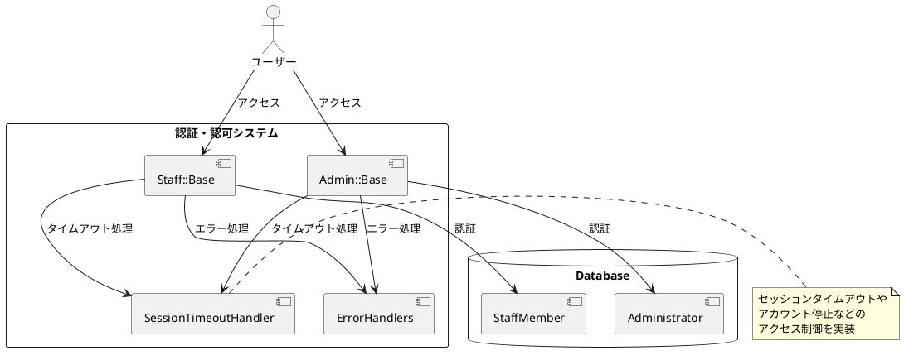
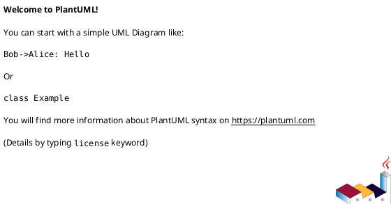

# 作業履歴 2017-01-30

## 概要

2017-01-30の作業内容をまとめています。この日はアクセス制御機能の実装を行いました。具体的には、ログイン状態のチェック、アカウントの有効性チェック、セッションタイムアウトなどの機能を実装しました。

### 関連ユースケース

- **S-001**: 職員ログイン - 職員がシステムにログインする
- **S-002**: 職員ログアウト - 職員がシステムからログアウトする
- **A-001**: 管理者ログイン - 管理者がシステムにログインする
- **A-002**: 管理者ログアウト - 管理者がシステムからログアウトする
- **A-005**: 職員アカウント停止/再開 - 管理者が職員アカウントの停止または再開を行う

### システム構成上の位置づけ

この実装はシステムのセキュリティ層に関わる部分であり、システムアーキテクチャにおける以下の部分に関連しています：



## コミット: 9537825

### メッセージ

```
アクセス制御 #8
```

### 変更されたファイル

- M	app/views/admin/top/index.html.erb
- M	app/views/staff/top/index.html.erb

### 変更内容

```diff
commit 953782572a061d800966137307c47695da223312
Author: k2works <kakimomokuri@gmail.com>
Date:   Mon Jan 30 19:07:00 2017 +0900

    アクセス制御 #8

diff --git a/app/views/admin/top/index.html.erb b/app/views/admin/top/index.html.erb
index fd80f1d..ddaa6df 100644
--- a/app/views/admin/top/index.html.erb
+++ b/app/views/admin/top/index.html.erb
@@ -8,6 +8,10 @@
     <h2 class="sectionLabel">お知らせ</h2>
   </div>
   <ol class="NewsList">
+    <li class="NewsList__item">
+      <time class="NewsList__head" datatime="2017-1-30">2017.1.30</time>
+      <span class="NewsList__body">アクセス制御の強化</span>
+    </li>
     <li class="NewsList__item">
       <time class="NewsList__head" datatime="2017-1-28">2017.1.28</time>
       <span class="NewsList__body">職員管理機能を追加</span>
diff --git a/app/views/staff/top/index.html.erb b/app/views/staff/top/index.html.erb
index 2d675aa..ce5a3b8 100644
--- a/app/views/staff/top/index.html.erb
+++ b/app/views/staff/top/index.html.erb
@@ -8,6 +8,10 @@
     <h2 class="sectionLabel">お知らせ</h2>
   </div>
   <ol class="NewsList">
+    <li class="NewsList__item">
+      <time class="NewsList__head" datatime="2017-1-30">2017.1.30</time>
+      <span class="NewsList__body">アクセス制御の強化</span>
+    </li>
     <li class="NewsList__item">
       <time class="NewsList__head" datatime="2017-1-28">2017.1.28</time>
       <span class="NewsList__body">アカウント情報編集機能を追加</span>

```

## コミット: 941f3eb

### メッセージ

```
リファクタリング
・メッセージ抽出
・管理者認証メソッド修正
```

### 変更されたファイル

- M	app/controllers/admin/base.rb
- M	app/controllers/admin/sessions_controller.rb
- M	app/controllers/staff/base.rb
- M	app/controllers/staff/sessions_controller.rb
- M	config/locales/controllers/ja.yml

### 変更内容

```diff
commit 941f3eb70b0c5ed7c3eebd7ae21e5a40106eb9b8
Author: k2works <kakimomokuri@gmail.com>
Date:   Mon Jan 30 19:04:10 2017 +0900

    リファクタリング

    ・メッセージ抽出
    ・管理者認証メソッド修正

diff --git a/app/controllers/admin/base.rb b/app/controllers/admin/base.rb
index f7beeb7..65e022f 100644
--- a/app/controllers/admin/base.rb
+++ b/app/controllers/admin/base.rb
@@ -24,7 +24,7 @@ class Admin::Base < ApplicationController
   def check_account
     if current_administrator && !current_administrator.active?
       session.delete(:administrator_id)
-      flash.alert = t('admin.base.check_account.flash_alert')
+      flash.alert = t('common.session.check_account.flash_alert')
       redirect_to :admin_root
     end
   end
@@ -37,7 +37,7 @@ class Admin::Base < ApplicationController
         session[:last_access_time] = Time.current
       else
         session.delete(:administrator_id)
-        flash.alert = t('admin.base.check_timeout.flash_alert')
+        flash.alert = t('common.session.check_timeout.flash_alert')
         redirect_to :admin_login
       end
     end
diff --git a/app/controllers/admin/sessions_controller.rb b/app/controllers/admin/sessions_controller.rb
index e5c8023..c7458bf 100644
--- a/app/controllers/admin/sessions_controller.rb
+++ b/app/controllers/admin/sessions_controller.rb
@@ -15,25 +15,25 @@ class Admin::SessionsController < Admin::Base
     if @form.email.present?
       administrator = Administrator.find_by(email_for_index: @form.email.downcase)
     end
-    if administrator
+    if Admin::Authenticator.new(administrator).authenticate(@form.password)
       if administrator.suspended?
-        flash.now.alert = 'アカウントが停止されています。'
+        flash.now.alert = t('common.session.create.alert_account')
         render action: 'new'
       else
         session[:administrator_id] = administrator.id
         session[:last_access_time] = Time.current
-        flash.notice = 'ログインしました。'
+        flash.notice = t('common.session.create.notice')
         redirect_to :admin_root
       end
     else
-      flash.now.alert = 'メールアドレスまたはパスワードが正しくありません。'
+      flash.now.alert = t('common.session.create.alert_mail_password')
       render action: 'new'
     end
   end

   def destroy
     session.delete(:administrator_id)
-    flash.notice = 'ログアウトしました。'
+    flash.notice = t('common.session.destroy.notice')
     redirect_to :admin_root
   end

diff --git a/app/controllers/staff/base.rb b/app/controllers/staff/base.rb
index cbf9a2e..83da20d 100644
--- a/app/controllers/staff/base.rb
+++ b/app/controllers/staff/base.rb
@@ -24,7 +24,7 @@ class Staff::Base < ApplicationController
   def check_account
     if current_staff_member && !current_staff_member.active?
       session.delete(:staff_member_id)
-      flash.alert = t('staff.base.check_account.flash_alert')
+      flash.alert = t('common.session.check_account.flash_alert')
       redirect_to :staff_root
     end
   end
@@ -37,7 +37,7 @@ class Staff::Base < ApplicationController
         session[:last_access_time] = Time.current
       else
         session.delete(:staff_member_id)
-        flash.alert = t('staff.base.check_timeout.flash_alert')
+        flash.alert = t('common.session.check_timeout.flash_alert')
         redirect_to :staff_login
       end
     end
diff --git a/app/controllers/staff/sessions_controller.rb b/app/controllers/staff/sessions_controller.rb
index ed10795..e08d450 100644
--- a/app/controllers/staff/sessions_controller.rb
+++ b/app/controllers/staff/sessions_controller.rb
@@ -16,19 +16,24 @@ class Staff::SessionsController < Staff::Base
       staff_member = StaffMember.find_by(email_for_index: @form.email.downcase)
     end
     if Staff::Authenticator.new(staff_member).authenticate(@form.password)
-      session[:staff_member_id] = staff_member.id
-      session[:last_access_time] = Time.current
-      flash.notice = 'ログインしました。'
-      redirect_to :staff_root
+      if staff_member.suspended?
+        flash.now.alert = t('common.session.create.alert_account')
+        render action: 'new'
+      else
+        session[:staff_member_id] = staff_member.id
+        session[:last_access_time] = Time.current
+        flash.notice =  t('common.session.create.notice')
+        redirect_to :staff_root
+      end
     else
-      flash.now.alert = 'メールアドレスまたはパスワードが正しくありません。'
+      flash.now.alert = t('common.session.create.alert_mail_password')
       render action: 'new'
     end
   end

   def destroy
     session.delete(:staff_member_id)
-    flash.notice = 'ログアウトしました。'
+    flash.notice = t('common.session.destroy.notice')
     redirect_to :staff_root
   end

diff --git a/config/locales/controllers/ja.yml b/config/locales/controllers/ja.yml
index 52eca0b..dd1b88a 100644
--- a/config/locales/controllers/ja.yml
+++ b/config/locales/controllers/ja.yml
@@ -1,12 +1,20 @@
 ja:
-  staff:
-    base:
-      authrize:
-        flash_alert: '職員としてログインしてください。'
+  common:
+    session:
+      create:
+        notice: 'ログインしました。'
+        alert_account: 'アカウントが停止されています。'
+        alert_mail_password: 'メールアドレスまたはパスワードが正しくありません。'
+      destroy:
+        notice: 'ログアウトしました。'
       check_account:
         flash_alert: 'アカウントが無効になりました。'
       check_timeout:
         flash_alert: 'セッションがタイム・アウトしました。'
+  staff:
+    base:
+      authrize:
+        flash_alert: '職員としてログインしてください。'
     accounts:
       update:
         flash_success: 'アカウント情報を更新しました。'
@@ -14,10 +22,6 @@ ja:
     base:
       authrize:
         flash_alert: '管理者としてログインしてください。'
-      check_account:
-        flash_alert: 'アカウントが無効になりました。'
-      check_timeout:
-        flash_alert: 'セッションがタイム・アウトしました。'
     staff_members:
       create:
         flash_success: '職員アカウントを新規登録しました。'

```

### 構造変更



## コミット: fe4b9ff

### メッセージ

```
演習問題 #8
```

### 変更されたファイル

- M	README.md
- M	app/controllers/admin/base.rb
- M	app/controllers/admin/sessions_controller.rb
- M	app/models/administrator.rb
- M	config/locales/controllers/ja.yml
- M	spec/controllers/admin/staff_masters_controller_spec.rb

### 変更内容

```diff
commit fe4b9ffa760eb7149de768b6c1031a75b59515c7
Author: k2works <kakimomokuri@gmail.com>
Date:   Mon Jan 30 18:44:24 2017 +0900

    演習問題 #8

diff --git a/README.md b/README.md
index bb38db0..ccfb611 100644
--- a/README.md
+++ b/README.md
@@ -458,6 +458,7 @@ git push heroku master

 #### 演習問題
 + テスト作成
++ 機能追加

 ### モデル間の関連付け
 ### 値の正規化とバリデーション
diff --git a/app/controllers/admin/base.rb b/app/controllers/admin/base.rb
index 2e2ff20..f7beeb7 100644
--- a/app/controllers/admin/base.rb
+++ b/app/controllers/admin/base.rb
@@ -1,5 +1,7 @@
 class Admin::Base < ApplicationController
   before_action :authorize
+  before_action :check_account
+  before_action :check_timeout

   private
   def current_administrator
@@ -18,4 +20,26 @@ class Admin::Base < ApplicationController
       redirect_to :admin_login
     end
   end
+
+  def check_account
+    if current_administrator && !current_administrator.active?
+      session.delete(:administrator_id)
+      flash.alert = t('admin.base.check_account.flash_alert')
+      redirect_to :admin_root
+    end
+  end
+
+  TIMEOUT = 60.minutes
+
+  def check_timeout
+    if current_administrator
+      if session[:last_access_time] >= TIMEOUT.ago
+        session[:last_access_time] = Time.current
+      else
+        session.delete(:administrator_id)
+        flash.alert = t('admin.base.check_timeout.flash_alert')
+        redirect_to :admin_login
+      end
+    end
+  end
 end
\ No newline at end of file
diff --git a/app/controllers/admin/sessions_controller.rb b/app/controllers/admin/sessions_controller.rb
index 2e1426b..e5c8023 100644
--- a/app/controllers/admin/sessions_controller.rb
+++ b/app/controllers/admin/sessions_controller.rb
@@ -21,6 +21,7 @@ class Admin::SessionsController < Admin::Base
         render action: 'new'
       else
         session[:administrator_id] = administrator.id
+        session[:last_access_time] = Time.current
         flash.notice = 'ログインしました。'
         redirect_to :admin_root
       end
diff --git a/app/models/administrator.rb b/app/models/administrator.rb
index 6ddd486..52332d4 100644
--- a/app/models/administrator.rb
+++ b/app/models/administrator.rb
@@ -27,4 +27,8 @@ class Administrator < ApplicationRecord
       self.hashed_password = nil
     end
   end
+
+  def active?
+    !suspended?
+  end
 end
diff --git a/config/locales/controllers/ja.yml b/config/locales/controllers/ja.yml
index a265c3d..52eca0b 100644
--- a/config/locales/controllers/ja.yml
+++ b/config/locales/controllers/ja.yml
@@ -14,6 +14,10 @@ ja:
     base:
       authrize:
         flash_alert: '管理者としてログインしてください。'
+      check_account:
+        flash_alert: 'アカウントが無効になりました。'
+      check_timeout:
+        flash_alert: 'セッションがタイム・アウトしました。'
     staff_members:
       create:
         flash_success: '職員アカウントを新規登録しました。'
diff --git a/spec/controllers/admin/staff_masters_controller_spec.rb b/spec/controllers/admin/staff_masters_controller_spec.rb
index c2dcde1..5f14598 100644
--- a/spec/controllers/admin/staff_masters_controller_spec.rb
+++ b/spec/controllers/admin/staff_masters_controller_spec.rb
@@ -10,6 +10,7 @@ describe Admin::StaffMembersController do

   before do
     session[:administrator_id] = administrator.id
+    session[:last_access_time] = 1.second.ago
   end

   describe '#create' do

```

### 構造変更


## コミット: 865b53a

### メッセージ

```
演習問題 #8
```

### 変更されたファイル

- M	README.md
- A	spec/controllers/admin/top_controller_spec.rb

### 変更内容

```diff
commit 865b53ac81ddd2709647c2778c5b20bbeb0fbbdd
Author: k2works <kakimomokuri@gmail.com>
Date:   Mon Jan 30 18:31:13 2017 +0900

    演習問題 #8

diff --git a/README.md b/README.md
index 9801d2d..bb38db0 100644
--- a/README.md
+++ b/README.md
@@ -457,6 +457,7 @@ git push heroku master
 + セッションタイムアウトのテスト

 #### 演習問題
++ テスト作成

 ### モデル間の関連付け
 ### 値の正規化とバリデーション
diff --git a/spec/controllers/admin/top_controller_spec.rb b/spec/controllers/admin/top_controller_spec.rb
new file mode 100644
index 0000000..ab43961
--- /dev/null
+++ b/spec/controllers/admin/top_controller_spec.rb
@@ -0,0 +1,28 @@
+require 'rails_helper'
+
+describe Admin::TopController, 'Before login' do
+  let(:administrator) { create(:administrator) }
+
+  before do
+    session[:administrator_id] = administrator.id
+    session[:last_access_time] = 1.second.ago
+  end
+
+  describe '#index' do
+    # 停止フラグがセットされたら強制的にログアウト
+    it 'should forced logout if suspended flag on' do
+      administrator.update_column(:suspended, true)
+      get :index
+      expect(session[:administrator_id]).to be_nil
+      expect(response).to redirect_to(admin_root_url)
+    end
+
+    # セッションタイムアウト
+    it 'should session timeout' do
+      session[:last_access_time] = Admin::Base::TIMEOUT.ago.advance(seconds: -1)
+      get :index
+      expect(session[:administrator_id]).to be_nil
+      expect(response).to redirect_to(admin_login_url)
+    end
+  end
+end
\ No newline at end of file

```

### 構造変更


## コミット: ec9610f

### メッセージ

```
セッションタイムアウトのテスト #8
```

### 変更されたファイル

- M	README.md
- M	spec/controllers/staff/top_controller_spec.rb

### 変更内容

```diff
commit ec9610fc1338b2914eb2390c915de427b8a08050
Author: k2works <kakimomokuri@gmail.com>
Date:   Mon Jan 30 18:25:09 2017 +0900

    セッションタイムアウトのテスト #8

diff --git a/README.md b/README.md
index 4ebdfdb..9801d2d 100644
--- a/README.md
+++ b/README.md
@@ -454,6 +454,7 @@ git push heroku master
 + 失敗するエグザンプルの修正
 + 共有エグザンプル
 + 強制ログアウトのテスト
++ セッションタイムアウトのテスト

 #### 演習問題

diff --git a/spec/controllers/staff/top_controller_spec.rb b/spec/controllers/staff/top_controller_spec.rb
index 3c12fe2..8f12e7c 100644
--- a/spec/controllers/staff/top_controller_spec.rb
+++ b/spec/controllers/staff/top_controller_spec.rb
@@ -22,5 +22,13 @@ describe Staff::TopController, 'Before login' do
       expect(session[:staff_member_id]).to be_nil
       expect(response).to redirect_to(staff_root_url)
     end
+
+    # セッションタイムアウト
+    it 'should session timeout' do
+      session[:last_access_time] = Staff::Base::TIMEOUT.ago.advance(seconds: -1)
+      get :index
+      expect(session[:staff_member_id]).to be_nil
+      expect(response).to redirect_to(staff_login_url)
+    end
   end
 end
\ No newline at end of file

```

### 構造変更


## コミット: 0193a67

### メッセージ

```
強制ログアウトのテスト #8
```

### 変更されたファイル

- M	.idea/.rakeTasks
- M	Gemfile
- M	Gemfile.lock
- M	README.md
- M	baukis-kai.iml
- A	spec/controllers/staff/top_controller_spec.rb

### 変更内容

```diff
commit 0193a67cb1b661b8452b4e79951d29f8cbf5714c
Author: k2works <kakimomokuri@gmail.com>
Date:   Mon Jan 30 18:20:55 2017 +0900

    強制ログアウトのテスト #8

diff --git a/.idea/.rakeTasks b/.idea/.rakeTasks
index 5b28e63..fdc289b 100644
--- a/.idea/.rakeTasks
+++ b/.idea/.rakeTasks
@@ -4,4 +4,4 @@ You are allowed to:
 1. Remove rake task
 2. Add existing rake tasks
 To add existing rake tasks automatically delete this file and reload the project.
---><RakeGroup description="" fullCmd="" taksId="rake"><RakeTask description="List versions of all Rails frameworks and the environment" fullCmd="about" taksId="about" /><RakeTask description="Add schema information (as comments) to model and fixture files" fullCmd="annotate_models" taksId="annotate_models" /><RakeTask description="Adds the route map to routes.rb" fullCmd="annotate_routes" taksId="annotate_routes" /><RakeGroup description="" fullCmd="" taksId="app"><RakeTask description="Applies the template supplied by LOCATION=(/path/to/template) or URL" fullCmd="app:template" taksId="template" /><RakeTask description="Update configs and some other initially generated files (or use just update:configs or update:bin)" fullCmd="app:update" taksId="update" /><RakeGroup description="" fullCmd="" taksId="templates"><RakeTask description="" fullCmd="app:templates:copy" taksId="copy" /></RakeGroup><RakeGroup description="" fullCmd="" taksId="update"><RakeTask description="" fullCmd="app:update:bin" taksId="bin" /><RakeTask description="" fullCmd="app:update:configs" taksId="configs" /><RakeTask description="" fullCmd="app:update:upgrade_guide_info" taksId="upgrade_guide_info" /></RakeGroup></RakeGroup><RakeGroup description="" fullCmd="" taksId="assets"><RakeTask description="Remove old compiled assets" fullCmd="assets:clean[keep]" taksId="clean[keep]" /><RakeTask description="Remove compiled assets" fullCmd="assets:clobber" taksId="clobber" /><RakeTask description="Load asset compile environment" fullCmd="assets:environment" taksId="environment" /><RakeTask description="Compile all the assets named in config.assets.precompile" fullCmd="assets:precompile" taksId="precompile" /><RakeTask description="" fullCmd="assets:clean" taksId="clean" /></RakeGroup><RakeGroup description="" fullCmd="" taksId="cache_digests"><RakeTask description="Lookup first-level dependencies for TEMPLATE (like messages/show or comments/_comment.html)" fullCmd="cache_digests:dependencies" taksId="dependencies" /><RakeTask description="Lookup nested dependencies for TEMPLATE (like messages/show or comments/_comment.html)" fullCmd="cache_digests:nested_dependencies" taksId="nested_dependencies" /></RakeGroup><RakeGroup description="" fullCmd="" taksId="db"><RakeTask description="Creates the database from DATABASE_URL or config/database.yml for the current RAILS_ENV (use db:create:all to create all databases in the config). Without RAILS_ENV or when RAILS_ENV is development, it defaults to creating the development and test databases" fullCmd="db:create" taksId="create" /><RakeTask description="Drops the database from DATABASE_URL or config/database.yml for the current RAILS_ENV (use db:drop:all to drop all databases in the config). Without RAILS_ENV or when RAILS_ENV is development, it defaults to dropping the development and test databases" fullCmd="db:drop" taksId="drop" /><RakeGroup description="" fullCmd="" taksId="environment"><RakeTask description="Set the environment value for the database" fullCmd="db:environment:set" taksId="set" /></RakeGroup><RakeGroup description="" fullCmd="" taksId="fixtures"><RakeTask description="Loads fixtures into the current environment's database" fullCmd="db:fixtures:load" taksId="load" /><RakeTask description="" fullCmd="db:fixtures:identify" taksId="identify" /></RakeGroup><RakeTask description="Migrate the database (options: VERSION=x, VERBOSE=false, SCOPE=blog)" fullCmd="db:migrate" taksId="migrate" /><RakeGroup description="" fullCmd="" taksId="migrate"><RakeTask description="Display status of migrations" fullCmd="db:migrate:status" taksId="status" /><RakeTask description="" fullCmd="db:migrate:change" taksId="change" /><RakeTask description="" fullCmd="db:migrate:down" taksId="down" /><RakeTask description="" fullCmd="db:migrate:redo" taksId="redo" /><RakeTask description="" fullCmd="db:migrate:reset" taksId="reset" /><RakeTask description="" fullCmd="db:migrate:up" taksId="up" /></RakeGroup><RakeTask description="Rolls the schema back to the previous version (specify steps w/ STEP=n)" fullCmd="db:rollback" taksId="rollback" /><RakeGroup description="" fullCmd="" taksId="schema"><RakeGroup description="" fullCmd="" taksId="cache"><RakeTask description="Clears a db/schema_cache.dump file" fullCmd="db:schema:cache:clear" taksId="clear" /><RakeTask description="Creates a db/schema_cache.dump file" fullCmd="db:schema:cache:dump" taksId="dump" /></RakeGroup><RakeTask description="Creates a db/schema.rb file that is portable against any DB supported by Active Record" fullCmd="db:schema:dump" taksId="dump" /><RakeTask description="Loads a schema.rb file into the database" fullCmd="db:schema:load" taksId="load" /><RakeTask description="" fullCmd="db:schema:load_if_ruby" taksId="load_if_ruby" /></RakeGroup><RakeTask description="Loads the seed data from db/seeds.rb" fullCmd="db:seed" taksId="seed" /><RakeTask description="Creates the database, loads the schema, and initializes with the seed data (use db:reset to also drop the database first)" fullCmd="db:setup" taksId="setup" /><RakeGroup description="" fullCmd="" taksId="structure"><RakeTask description="Dumps the database structure to db/structure.sql" fullCmd="db:structure:dump" taksId="dump" /><RakeTask description="Recreates the databases from the structure.sql file" fullCmd="db:structure:load" taksId="load" /><RakeTask description="" fullCmd="db:structure:load_if_sql" taksId="load_if_sql" /></RakeGroup><RakeTask description="Retrieves the current schema version number" fullCmd="db:version" taksId="version" /><RakeTask description="" fullCmd="db:_dump" taksId="_dump" /><RakeTask description="" fullCmd="db:abort_if_pending_migrations" taksId="abort_if_pending_migrations" /><RakeTask description="" fullCmd="db:charset" taksId="charset" /><RakeTask description="" fullCmd="db:check_protected_environments" taksId="check_protected_environments" /><RakeTask description="" fullCmd="db:collation" taksId="collation" /><RakeGroup description="" fullCmd="" taksId="create"><RakeTask description="" fullCmd="db:create:all" taksId="all" /></RakeGroup><RakeGroup description="" fullCmd="" taksId="drop"><RakeTask description="" fullCmd="db:drop:_unsafe" taksId="_unsafe" /><RakeTask description="" fullCmd="db:drop:all" taksId="all" /></RakeGroup><RakeTask description="" fullCmd="db:forward" taksId="forward" /><RakeTask description="" fullCmd="db:load_config" taksId="load_config" /><RakeTask description="" fullCmd="db:purge" taksId="purge" /><RakeGroup description="" fullCmd="" taksId="purge"><RakeTask description="" fullCmd="db:purge:all" taksId="all" /></RakeGroup><RakeTask description="" fullCmd="db:reset" taksId="reset" /><RakeGroup description="" fullCmd="" taksId="test"><RakeTask description="" fullCmd="db:test:clone" taksId="clone" /><RakeTask description="" fullCmd="db:test:clone_schema" taksId="clone_schema" /><RakeTask description="" fullCmd="db:test:clone_structure" taksId="clone_structure" /><RakeTask description="" fullCmd="db:test:deprecated" taksId="deprecated" /><RakeTask description="" fullCmd="db:test:load" taksId="load" /><RakeTask description="" fullCmd="db:test:load_schema" taksId="load_schema" /><RakeTask description="" fullCmd="db:test:load_structure" taksId="load_structure" /><RakeTask description="" fullCmd="db:test:prepare" taksId="prepare" /><RakeTask description="" fullCmd="db:test:purge" taksId="purge" /></RakeGroup></RakeGroup><RakeGroup description="" fullCmd="" taksId="dev"><RakeTask description="Toggle development mode caching on/off" fullCmd="dev:cache" taksId="cache" /></RakeGroup><RakeTask description="Generate an Entity-Relationship Diagram based on your models" fullCmd="erd" taksId="erd" /><RakeTask description="Print out all defined initializers in the order they are invoked by Rails" fullCmd="initializers" taksId="initializers" /><RakeGroup description="" fullCmd="" taksId="log"><RakeTask description="Truncates all/specified *.log files in log/ to zero bytes (specify which logs with LOGS=test,development)" fullCmd="log:clear" taksId="clear" /></RakeGroup><RakeTask description="Prints out your Rack middleware stack" fullCmd="middleware" taksId="middleware" /><RakeTask description="Enumerate all annotations (use notes:optimize, :fixme, :todo for focus)" fullCmd="notes" taksId="notes" /><RakeGroup description="" fullCmd="" taksId="notes"><RakeTask description="Enumerate a custom annotation, specify with ANNOTATION=CUSTOM" fullCmd="notes:custom" taksId="custom" /><RakeTask description="" fullCmd="notes:fixme" taksId="fixme" /><RakeTask description="" fullCmd="notes:optimize" taksId="optimize" /><RakeTask description="" fullCmd="notes:todo" taksId="todo" /></RakeGroup><RakeTask description="Remove schema information from model and fixture files" fullCmd="remove_annotation" taksId="remove_annotation" /><RakeTask description="Removes the route map from routes.rb" fullCmd="remove_routes" taksId="remove_routes" /><RakeTask description="Restart app by touching tmp/restart.txt" fullCmd="restart" taksId="restart" /><RakeTask description="Print out all defined routes in match order, with names" fullCmd="routes" taksId="routes" /><RakeTask description="Generate a cryptographically secure secret key (this is typically used to generate a secret for cookie sessions)" fullCmd="secret" taksId="secret" /><RakeTask description="Run all specs in spec directory (excluding plugin specs)" fullCmd="spec" taksId="spec" /><RakeGroup description="" fullCmd="" taksId="spec"><RakeTask description="Run the code examples in spec/models" fullCmd="spec:models" taksId="models" /><RakeTask description="Run the code examples in spec/services" fullCmd="spec:services" taksId="services" /><RakeTask description="" fullCmd="spec:prepare" taksId="prepare" /><RakeTask description="" fullCmd="spec:statsetup" taksId="statsetup" /></RakeGroup><RakeTask description="Report code statistics (KLOCs, etc) from the application or engine" fullCmd="stats" taksId="stats" /><RakeTask description="Runs all tests in test folder" fullCmd="test" taksId="test" /><RakeGroup description="" fullCmd="" taksId="test"><RakeTask description="Run tests quickly, but also reset db" fullCmd="test:db" taksId="db" /><RakeTask description="" fullCmd="test:controllers" taksId="controllers" /><RakeTask description="" fullCmd="test:functionals" taksId="functionals" /><RakeTask description="" fullCmd="test:generators" taksId="generators" /><RakeTask description="" fullCmd="test:helpers" taksId="helpers" /><RakeTask description="" fullCmd="test:integration" taksId="integration" /><RakeTask description="" fullCmd="test:jobs" taksId="jobs" /><RakeTask description="" fullCmd="test:mailers" taksId="mailers" /><RakeTask description="" fullCmd="test:models" taksId="models" /><RakeTask description="" fullCmd="test:prepare" taksId="prepare" /><RakeTask description="" fullCmd="test:run" taksId="run" /><RakeTask description="" fullCmd="test:units" taksId="units" /></RakeGroup><RakeGroup description="" fullCmd="" taksId="time"><RakeTask description="List all time zones, list by two-letter country code (`rails time:zones[US]`), or list by UTC offset (`rails time:zones[-8]`)" fullCmd="time:zones[country_or_offset]" taksId="zones[country_or_offset]" /><RakeTask description="" fullCmd="time:zones" taksId="zones" /><RakeGroup description="" fullCmd="" taksId="zones"><RakeTask description="" fullCmd="time:zones:all" taksId="all" /><RakeTask description="" fullCmd="time:zones:local" taksId="local" /><RakeTask description="" fullCmd="time:zones:us" taksId="us" /></RakeGroup></RakeGroup><RakeGroup description="" fullCmd="" taksId="tmp"><RakeTask description="Clear cache and socket files from tmp/ (narrow w/ tmp:cache:clear, tmp:sockets:clear)" fullCmd="tmp:clear" taksId="clear" /><RakeTask description="Creates tmp directories for cache, sockets, and pids" fullCmd="tmp:create" taksId="create" /><RakeGroup description="" fullCmd="" taksId="cache"><RakeTask description="" fullCmd="tmp:cache:clear" taksId="clear" /></RakeGroup><RakeGroup description="" fullCmd="" taksId="pids"><RakeTask description="" fullCmd="tmp:pids:clear" taksId="clear" /></RakeGroup><RakeGroup description="" fullCmd="" taksId="sockets"><RakeTask description="" fullCmd="tmp:sockets:clear" taksId="clear" /></RakeGroup></RakeGroup><RakeTask description="" fullCmd="default" taksId="default" /><RakeTask description="" fullCmd="environment" taksId="environment" /><RakeGroup description="" fullCmd="" taksId="erd"><RakeTask description="" fullCmd="erd:generate" taksId="generate" /><RakeTask description="" fullCmd="erd:load_models" taksId="load_models" /><RakeTask description="" fullCmd="erd:options" taksId="options" /></RakeGroup><RakeGroup description="" fullCmd="" taksId="rails"><RakeTask description="" fullCmd="rails:template" taksId="template" /><RakeGroup description="" fullCmd="" taksId="templates"><RakeTask description="" fullCmd="rails:templates:copy" taksId="copy" /></RakeGroup><RakeTask description="" fullCmd="rails:update" taksId="update" /><RakeGroup description="" fullCmd="" taksId="update"><RakeTask description="" fullCmd="rails:update:bin" taksId="bin" /><RakeTask description="" fullCmd="rails:update:configs" taksId="configs" /></RakeGroup></RakeGroup><RakeGroup description="" fullCmd="" taksId="railties"><RakeGroup description="" fullCmd="" taksId="install"><RakeTask description="" fullCmd="railties:install:migrations" taksId="migrations" /></RakeGroup></RakeGroup><RakeTask description="" fullCmd="set_annotation_options" taksId="set_annotation_options" /><RakeTask description="" fullCmd="tmp" taksId="tmp" /><RakeTask description="" fullCmd="tmp/cache" taksId="tmp/cache" /><RakeTask description="" fullCmd="tmp/cache/assets" taksId="tmp/cache/assets" /><RakeTask description="" fullCmd="tmp/pids" taksId="tmp/pids" /><RakeTask description="" fullCmd="tmp/sockets" taksId="tmp/sockets" /></RakeGroup></Settings>
+--><RakeGroup description="" fullCmd="" taksId="rake"><RakeTask description="List versions of all Rails frameworks and the environment" fullCmd="about" taksId="about" /><RakeTask description="Add schema information (as comments) to model and fixture files" fullCmd="annotate_models" taksId="annotate_models" /><RakeTask description="Adds the route map to routes.rb" fullCmd="annotate_routes" taksId="annotate_routes" /><RakeGroup description="" fullCmd="" taksId="app"><RakeTask description="Applies the template supplied by LOCATION=(/path/to/template) or URL" fullCmd="app:template" taksId="template" /><RakeTask description="Update configs and some other initially generated files (or use just update:configs or update:bin)" fullCmd="app:update" taksId="update" /><RakeGroup description="" fullCmd="" taksId="templates"><RakeTask description="" fullCmd="app:templates:copy" taksId="copy" /></RakeGroup><RakeGroup description="" fullCmd="" taksId="update"><RakeTask description="" fullCmd="app:update:bin" taksId="bin" /><RakeTask description="" fullCmd="app:update:configs" taksId="configs" /><RakeTask description="" fullCmd="app:update:upgrade_guide_info" taksId="upgrade_guide_info" /></RakeGroup></RakeGroup><RakeGroup description="" fullCmd="" taksId="assets"><RakeTask description="Remove old compiled assets" fullCmd="assets:clean[keep]" taksId="clean[keep]" /><RakeTask description="Remove compiled assets" fullCmd="assets:clobber" taksId="clobber" /><RakeTask description="Load asset compile environment" fullCmd="assets:environment" taksId="environment" /><RakeTask description="Compile all the assets named in config.assets.precompile" fullCmd="assets:precompile" taksId="precompile" /><RakeTask description="" fullCmd="assets:clean" taksId="clean" /></RakeGroup><RakeGroup description="" fullCmd="" taksId="cache_digests"><RakeTask description="Lookup first-level dependencies for TEMPLATE (like messages/show or comments/_comment.html)" fullCmd="cache_digests:dependencies" taksId="dependencies" /><RakeTask description="Lookup nested dependencies for TEMPLATE (like messages/show or comments/_comment.html)" fullCmd="cache_digests:nested_dependencies" taksId="nested_dependencies" /></RakeGroup><RakeGroup description="" fullCmd="" taksId="db"><RakeTask description="Creates the database from DATABASE_URL or config/database.yml for the current RAILS_ENV (use db:create:all to create all databases in the config). Without RAILS_ENV or when RAILS_ENV is development, it defaults to creating the development and test databases" fullCmd="db:create" taksId="create" /><RakeTask description="Drops the database from DATABASE_URL or config/database.yml for the current RAILS_ENV (use db:drop:all to drop all databases in the config). Without RAILS_ENV or when RAILS_ENV is development, it defaults to dropping the development and test databases" fullCmd="db:drop" taksId="drop" /><RakeGroup description="" fullCmd="" taksId="environment"><RakeTask description="Set the environment value for the database" fullCmd="db:environment:set" taksId="set" /></RakeGroup><RakeGroup description="" fullCmd="" taksId="fixtures"><RakeTask description="Loads fixtures into the current environment's database" fullCmd="db:fixtures:load" taksId="load" /><RakeTask description="" fullCmd="db:fixtures:identify" taksId="identify" /></RakeGroup><RakeTask description="Migrate the database (options: VERSION=x, VERBOSE=false, SCOPE=blog)" fullCmd="db:migrate" taksId="migrate" /><RakeGroup description="" fullCmd="" taksId="migrate"><RakeTask description="Display status of migrations" fullCmd="db:migrate:status" taksId="status" /><RakeTask description="" fullCmd="db:migrate:change" taksId="change" /><RakeTask description="" fullCmd="db:migrate:down" taksId="down" /><RakeTask description="" fullCmd="db:migrate:redo" taksId="redo" /><RakeTask description="" fullCmd="db:migrate:reset" taksId="reset" /><RakeTask description="" fullCmd="db:migrate:up" taksId="up" /></RakeGroup><RakeTask description="Rolls the schema back to the previous version (specify steps w/ STEP=n)" fullCmd="db:rollback" taksId="rollback" /><RakeGroup description="" fullCmd="" taksId="schema"><RakeGroup description="" fullCmd="" taksId="cache"><RakeTask description="Clears a db/schema_cache.dump file" fullCmd="db:schema:cache:clear" taksId="clear" /><RakeTask description="Creates a db/schema_cache.dump file" fullCmd="db:schema:cache:dump" taksId="dump" /></RakeGroup><RakeTask description="Creates a db/schema.rb file that is portable against any DB supported by Active Record" fullCmd="db:schema:dump" taksId="dump" /><RakeTask description="Loads a schema.rb file into the database" fullCmd="db:schema:load" taksId="load" /><RakeTask description="" fullCmd="db:schema:load_if_ruby" taksId="load_if_ruby" /></RakeGroup><RakeTask description="Loads the seed data from db/seeds.rb" fullCmd="db:seed" taksId="seed" /><RakeTask description="Creates the database, loads the schema, and initializes with the seed data (use db:reset to also drop the database first)" fullCmd="db:setup" taksId="setup" /><RakeGroup description="" fullCmd="" taksId="structure"><RakeTask description="Dumps the database structure to db/structure.sql" fullCmd="db:structure:dump" taksId="dump" /><RakeTask description="Recreates the databases from the structure.sql file" fullCmd="db:structure:load" taksId="load" /><RakeTask description="" fullCmd="db:structure:load_if_sql" taksId="load_if_sql" /></RakeGroup><RakeTask description="Retrieves the current schema version number" fullCmd="db:version" taksId="version" /><RakeTask description="" fullCmd="db:_dump" taksId="_dump" /><RakeTask description="" fullCmd="db:abort_if_pending_migrations" taksId="abort_if_pending_migrations" /><RakeTask description="" fullCmd="db:charset" taksId="charset" /><RakeTask description="" fullCmd="db:check_protected_environments" taksId="check_protected_environments" /><RakeTask description="" fullCmd="db:collation" taksId="collation" /><RakeGroup description="" fullCmd="" taksId="create"><RakeTask description="" fullCmd="db:create:all" taksId="all" /></RakeGroup><RakeGroup description="" fullCmd="" taksId="drop"><RakeTask description="" fullCmd="db:drop:_unsafe" taksId="_unsafe" /><RakeTask description="" fullCmd="db:drop:all" taksId="all" /></RakeGroup><RakeTask description="" fullCmd="db:forward" taksId="forward" /><RakeTask description="" fullCmd="db:load_config" taksId="load_config" /><RakeTask description="" fullCmd="db:purge" taksId="purge" /><RakeGroup description="" fullCmd="" taksId="purge"><RakeTask description="" fullCmd="db:purge:all" taksId="all" /></RakeGroup><RakeTask description="" fullCmd="db:reset" taksId="reset" /><RakeGroup description="" fullCmd="" taksId="test"><RakeTask description="" fullCmd="db:test:clone" taksId="clone" /><RakeTask description="" fullCmd="db:test:clone_schema" taksId="clone_schema" /><RakeTask description="" fullCmd="db:test:clone_structure" taksId="clone_structure" /><RakeTask description="" fullCmd="db:test:deprecated" taksId="deprecated" /><RakeTask description="" fullCmd="db:test:load" taksId="load" /><RakeTask description="" fullCmd="db:test:load_schema" taksId="load_schema" /><RakeTask description="" fullCmd="db:test:load_structure" taksId="load_structure" /><RakeTask description="" fullCmd="db:test:prepare" taksId="prepare" /><RakeTask description="" fullCmd="db:test:purge" taksId="purge" /></RakeGroup></RakeGroup><RakeGroup description="" fullCmd="" taksId="dev"><RakeTask description="Toggle development mode caching on/off" fullCmd="dev:cache" taksId="cache" /></RakeGroup><RakeTask description="Generate an Entity-Relationship Diagram based on your models" fullCmd="erd" taksId="erd" /><RakeTask description="Print out all defined initializers in the order they are invoked by Rails" fullCmd="initializers" taksId="initializers" /><RakeGroup description="" fullCmd="" taksId="log"><RakeTask description="Truncates all/specified *.log files in log/ to zero bytes (specify which logs with LOGS=test,development)" fullCmd="log:clear" taksId="clear" /></RakeGroup><RakeTask description="Prints out your Rack middleware stack" fullCmd="middleware" taksId="middleware" /><RakeTask description="Enumerate all annotations (use notes:optimize, :fixme, :todo for focus)" fullCmd="notes" taksId="notes" /><RakeGroup description="" fullCmd="" taksId="notes"><RakeTask description="Enumerate a custom annotation, specify with ANNOTATION=CUSTOM" fullCmd="notes:custom" taksId="custom" /><RakeTask description="" fullCmd="notes:fixme" taksId="fixme" /><RakeTask description="" fullCmd="notes:optimize" taksId="optimize" /><RakeTask description="" fullCmd="notes:todo" taksId="todo" /></RakeGroup><RakeTask description="Remove schema information from model and fixture files" fullCmd="remove_annotation" taksId="remove_annotation" /><RakeTask description="Removes the route map from routes.rb" fullCmd="remove_routes" taksId="remove_routes" /><RakeTask description="Restart app by touching tmp/restart.txt" fullCmd="restart" taksId="restart" /><RakeTask description="Print out all defined routes in match order, with names" fullCmd="routes" taksId="routes" /><RakeTask description="Generate a cryptographically secure secret key (this is typically used to generate a secret for cookie sessions)" fullCmd="secret" taksId="secret" /><RakeTask description="Run all specs in spec directory (excluding plugin specs)" fullCmd="spec" taksId="spec" /><RakeGroup description="" fullCmd="" taksId="spec"><RakeTask description="Run the code examples in spec/controllers" fullCmd="spec:controllers" taksId="controllers" /><RakeTask description="Run the code examples in spec/models" fullCmd="spec:models" taksId="models" /><RakeTask description="Run the code examples in spec/routing" fullCmd="spec:routing" taksId="routing" /><RakeTask description="Run the code examples in spec/services" fullCmd="spec:services" taksId="services" /><RakeTask description="" fullCmd="spec:prepare" taksId="prepare" /><RakeTask description="" fullCmd="spec:statsetup" taksId="statsetup" /></RakeGroup><RakeTask description="Report code statistics (KLOCs, etc) from the application or engine" fullCmd="stats" taksId="stats" /><RakeTask description="Runs all tests in test folder" fullCmd="test" taksId="test" /><RakeGroup description="" fullCmd="" taksId="test"><RakeTask description="Run tests quickly, but also reset db" fullCmd="test:db" taksId="db" /><RakeTask description="" fullCmd="test:controllers" taksId="controllers" /><RakeTask description="" fullCmd="test:functionals" taksId="functionals" /><RakeTask description="" fullCmd="test:generators" taksId="generators" /><RakeTask description="" fullCmd="test:helpers" taksId="helpers" /><RakeTask description="" fullCmd="test:integration" taksId="integration" /><RakeTask description="" fullCmd="test:jobs" taksId="jobs" /><RakeTask description="" fullCmd="test:mailers" taksId="mailers" /><RakeTask description="" fullCmd="test:models" taksId="models" /><RakeTask description="" fullCmd="test:prepare" taksId="prepare" /><RakeTask description="" fullCmd="test:run" taksId="run" /><RakeTask description="" fullCmd="test:units" taksId="units" /></RakeGroup><RakeGroup description="" fullCmd="" taksId="time"><RakeTask description="List all time zones, list by two-letter country code (`rails time:zones[US]`), or list by UTC offset (`rails time:zones[-8]`)" fullCmd="time:zones[country_or_offset]" taksId="zones[country_or_offset]" /><RakeTask description="" fullCmd="time:zones" taksId="zones" /><RakeGroup description="" fullCmd="" taksId="zones"><RakeTask description="" fullCmd="time:zones:all" taksId="all" /><RakeTask description="" fullCmd="time:zones:local" taksId="local" /><RakeTask description="" fullCmd="time:zones:us" taksId="us" /></RakeGroup></RakeGroup><RakeGroup description="" fullCmd="" taksId="tmp"><RakeTask description="Clear cache and socket files from tmp/ (narrow w/ tmp:cache:clear, tmp:sockets:clear)" fullCmd="tmp:clear" taksId="clear" /><RakeTask description="Creates tmp directories for cache, sockets, and pids" fullCmd="tmp:create" taksId="create" /><RakeGroup description="" fullCmd="" taksId="cache"><RakeTask description="" fullCmd="tmp:cache:clear" taksId="clear" /></RakeGroup><RakeGroup description="" fullCmd="" taksId="pids"><RakeTask description="" fullCmd="tmp:pids:clear" taksId="clear" /></RakeGroup><RakeGroup description="" fullCmd="" taksId="sockets"><RakeTask description="" fullCmd="tmp:sockets:clear" taksId="clear" /></RakeGroup></RakeGroup><RakeTask description="" fullCmd="default" taksId="default" /><RakeTask description="" fullCmd="environment" taksId="environment" /><RakeGroup description="" fullCmd="" taksId="erd"><RakeTask description="" fullCmd="erd:generate" taksId="generate" /><RakeTask description="" fullCmd="erd:load_models" taksId="load_models" /><RakeTask description="" fullCmd="erd:options" taksId="options" /></RakeGroup><RakeGroup description="" fullCmd="" taksId="rails"><RakeTask description="" fullCmd="rails:template" taksId="template" /><RakeGroup description="" fullCmd="" taksId="templates"><RakeTask description="" fullCmd="rails:templates:copy" taksId="copy" /></RakeGroup><RakeTask description="" fullCmd="rails:update" taksId="update" /><RakeGroup description="" fullCmd="" taksId="update"><RakeTask description="" fullCmd="rails:update:bin" taksId="bin" /><RakeTask description="" fullCmd="rails:update:configs" taksId="configs" /></RakeGroup></RakeGroup><RakeGroup description="" fullCmd="" taksId="railties"><RakeGroup description="" fullCmd="" taksId="install"><RakeTask description="" fullCmd="railties:install:migrations" taksId="migrations" /></RakeGroup></RakeGroup><RakeTask description="" fullCmd="set_annotation_options" taksId="set_annotation_options" /><RakeTask description="" fullCmd="tmp" taksId="tmp" /><RakeTask description="" fullCmd="tmp/cache" taksId="tmp/cache" /><RakeTask description="" fullCmd="tmp/cache/assets" taksId="tmp/cache/assets" /><RakeTask description="" fullCmd="tmp/pids" taksId="tmp/pids" /><RakeTask description="" fullCmd="tmp/sockets" taksId="tmp/sockets" /></RakeGroup></Settings>
diff --git a/Gemfile b/Gemfile
index 3ac01ff..e9ca58f 100644
--- a/Gemfile
+++ b/Gemfile
@@ -75,6 +75,7 @@ group :test do
   gem 'selenium-webdriver'
   gem 'shoulda-matchers', '~> 2.6.2'
   gem 'capybara-screenshot'
+  gem 'rails-controller-testing'
 end

 # Windows does not include zoneinfo files, so bundle the tzinfo-data gem
diff --git a/Gemfile.lock b/Gemfile.lock
index 46d4a3a..9fe802b 100644
--- a/Gemfile.lock
+++ b/Gemfile.lock
@@ -193,6 +193,10 @@ GEM
       bundler (>= 1.3.0, < 2.0)
       railties (= 5.0.1)
       sprockets-rails (>= 2.0.0)
+    rails-controller-testing (1.0.1)
+      actionpack (~> 5.x)
+      actionview (~> 5.x)
+      activesupport (~> 5.x)
     rails-dom-testing (2.0.2)
       activesupport (>= 4.2.0, < 6.0)
       nokogiri (~> 1.6)
@@ -325,6 +329,7 @@ DEPENDENCIES
   rack-dev-mark
   rack-livereload
   rails (~> 5.0.1)
+  rails-controller-testing
   rails-erd
   rails_12factor
   rspec-rails (~> 3.5)
diff --git a/README.md b/README.md
index b5ec3a3..4ebdfdb 100644
--- a/README.md
+++ b/README.md
@@ -453,6 +453,7 @@ git push heroku master
 #### アクセス制御のテスト
 + 失敗するエグザンプルの修正
 + 共有エグザンプル
++ 強制ログアウトのテスト

 #### 演習問題

diff --git a/baukis-kai.iml b/baukis-kai.iml
index 7d95f8d..a4ebc0d 100644
--- a/baukis-kai.iml
+++ b/baukis-kai.iml
@@ -105,6 +105,7 @@
     <orderEntry type="library" scope="PROVIDED" name="rack-livereload (v0.3.16, rbenv: 2.4.0) [gem]" level="application" />
     <orderEntry type="library" scope="PROVIDED" name="rack-test (v0.6.3, rbenv: 2.4.0) [gem]" level="application" />
     <orderEntry type="library" scope="PROVIDED" name="rails (v5.0.1, rbenv: 2.4.0) [gem]" level="application" />
+    <orderEntry type="library" scope="PROVIDED" name="rails-controller-testing (v1.0.1, rbenv: 2.4.0) [gem]" level="application" />
     <orderEntry type="library" scope="PROVIDED" name="rails-dom-testing (v2.0.2, rbenv: 2.4.0) [gem]" level="application" />
     <orderEntry type="library" scope="PROVIDED" name="rails-erd (v1.5.0, rbenv: 2.4.0) [gem]" level="application" />
     <orderEntry type="library" scope="PROVIDED" name="rails-html-sanitizer (v1.0.3, rbenv: 2.4.0) [gem]" level="application" />
diff --git a/spec/controllers/staff/top_controller_spec.rb b/spec/controllers/staff/top_controller_spec.rb
new file mode 100644
index 0000000..3c12fe2
--- /dev/null
+++ b/spec/controllers/staff/top_controller_spec.rb
@@ -0,0 +1,26 @@
+require 'rails_helper'
+
+describe Staff::TopController, 'Before login' do
+  let(:staff_member) { create(:staff_member) }
+
+  before do
+    session[:staff_member_id] = staff_member.id
+    session[:last_access_time] = 1.second.ago
+  end
+
+  describe '#index' do
+    # 通常はstaff/top/indexを表示
+    it 'should display staff/top/index' do
+      get :index
+      expect(response).to render_template('staff/top/index')
+    end
+
+    # 停止フラグがセットされたら強制的にログアウト
+    it 'should forced logout if suspended flag on' do
+      staff_member.update_column(:suspended, true)
+      get :index
+      expect(session[:staff_member_id]).to be_nil
+      expect(response).to redirect_to(staff_root_url)
+    end
+  end
+end
\ No newline at end of file

```

### 構造変更


## コミット: e7893a3

### メッセージ

```
共有エグザンプル #8
```

### 変更されたファイル

- M	README.md
- M	spec/controllers/admin/staff_masters_controller_spec.rb
- M	spec/controllers/staff/accounts_controller_spec.rb
- M	spec/rails_helper.rb
- A	spec/support/shared_examples_for_admin_controllers.rb
- A	spec/support/shared_examples_for_staff_controllers.rb

### 変更内容

```diff
commit e7893a36ad63c41890a5aeab3795693fa24e3c36
Author: k2works <kakimomokuri@gmail.com>
Date:   Mon Jan 30 18:12:01 2017 +0900

    共有エグザンプル #8

diff --git a/README.md b/README.md
index 2337222..b5ec3a3 100644
--- a/README.md
+++ b/README.md
@@ -452,6 +452,7 @@ git push heroku master

 #### アクセス制御のテスト
 + 失敗するエグザンプルの修正
++ 共有エグザンプル

 #### 演習問題

diff --git a/spec/controllers/admin/staff_masters_controller_spec.rb b/spec/controllers/admin/staff_masters_controller_spec.rb
index 8e2ea4e..c2dcde1 100644
--- a/spec/controllers/admin/staff_masters_controller_spec.rb
+++ b/spec/controllers/admin/staff_masters_controller_spec.rb
@@ -1,5 +1,9 @@
 require 'rails_helper'

+describe Admin::StaffMembersController, 'Before login' do
+  it_behaves_like 'a protected admin controller'
+end
+
 describe Admin::StaffMembersController do
   let(:params_hash) { attributes_for(:staff_member) }
   let(:administrator) { create(:administrator) }
diff --git a/spec/controllers/staff/accounts_controller_spec.rb b/spec/controllers/staff/accounts_controller_spec.rb
index 7b62865..cf7ce64 100644
--- a/spec/controllers/staff/accounts_controller_spec.rb
+++ b/spec/controllers/staff/accounts_controller_spec.rb
@@ -1,5 +1,9 @@
 require 'rails_helper'

+describe Staff::AccountsController, 'Before login' do
+  it_behaves_like 'a protected singular staff controller'
+end
+
 describe Staff::AccountsController do
   describe '#update' do
     let(:params_hash) { attributes_for(:staff_member) }
diff --git a/spec/rails_helper.rb b/spec/rails_helper.rb
index ad9274e..975dc23 100644
--- a/spec/rails_helper.rb
+++ b/spec/rails_helper.rb
@@ -20,7 +20,7 @@ require 'rspec/rails'
 # directory. Alternatively, in the individual `*_spec.rb` files, manually
 # require only the support files necessary.
 #
-# Dir[Rails.root.join('spec/support/**/*.rb')].each { |f| require f }
+Dir[Rails.root.join('spec/support/**/*.rb')].each { |f| require f }

 # Checks for pending migration and applies them before tests are run.
 # If you are not using ActiveRecord, you can remove this line.
diff --git a/spec/support/shared_examples_for_admin_controllers.rb b/spec/support/shared_examples_for_admin_controllers.rb
new file mode 100644
index 0000000..d788479
--- /dev/null
+++ b/spec/support/shared_examples_for_admin_controllers.rb
@@ -0,0 +1,27 @@
+shared_examples 'a protected admin controller' do
+  describe '#index' do
+    # ログインフォームにリダイレクト
+    it 'should redirect to login form' do
+      get :index
+      expect(response).to redirect_to(admin_login_url)
+    end
+  end
+
+  describe '#show' do
+    # ログインフォームにリダイレクト
+    it 'should redirect to login form' do
+      get :show, id: 1
+      expect(response).to redirect_to(admin_login_url)
+    end
+  end
+end
+
+shared_examples 'a protected singular admin controller' do
+  describe '#show' do
+    # ログインフォームにリダイレクト
+    it 'should redirect to login form' do
+      get :show
+      expect(response).to redirect_to(admin_login_url)
+    end
+  end
+end
\ No newline at end of file
diff --git a/spec/support/shared_examples_for_staff_controllers.rb b/spec/support/shared_examples_for_staff_controllers.rb
new file mode 100644
index 0000000..d4c14b8
--- /dev/null
+++ b/spec/support/shared_examples_for_staff_controllers.rb
@@ -0,0 +1,27 @@
+shared_examples 'a protected staff controller' do
+  describe '#index' do
+    # ログインフォームにリダイレクト
+    it 'should redirect to login form' do
+      get :index
+      expect(response).to redirect_to(staff_login_url)
+    end
+  end
+
+  describe '#show' do
+    # ログインフォームにリダイレクト
+    it 'should redirect to login form' do
+      get :show, id: 1
+      expect(response).to redirect_to(staff_login_url)
+    end
+  end
+end
+
+shared_examples 'a protected singular staff controller' do
+  describe '#show' do
+    # ログインフォームにリダイレクト
+    it 'should redirect to login form' do
+      get :show
+      expect(response).to redirect_to(staff_login_url)
+    end
+  end
+end
\ No newline at end of file

```

### 構造変更


## コミット: 2a61396

### メッセージ

```
失敗するエグザンプルの修正 #8
```

### 変更されたファイル

- M	README.md
- M	spec/controllers/admin/staff_masters_controller_spec.rb
- M	spec/controllers/staff/accounts_controller_spec.rb

### 変更内容

```diff
commit 2a6139653474341d87e9f5ee8a34db111266bbb3
Author: k2works <kakimomokuri@gmail.com>
Date:   Mon Jan 30 17:48:56 2017 +0900

    失敗するエグザンプルの修正 #8

diff --git a/README.md b/README.md
index a167d60..2337222 100644
--- a/README.md
+++ b/README.md
@@ -451,6 +451,8 @@ git push heroku master
 + セッションタイムアウト

 #### アクセス制御のテスト
++ 失敗するエグザンプルの修正
+
 #### 演習問題

 ### モデル間の関連付け
diff --git a/spec/controllers/admin/staff_masters_controller_spec.rb b/spec/controllers/admin/staff_masters_controller_spec.rb
index 93f0b30..8e2ea4e 100644
--- a/spec/controllers/admin/staff_masters_controller_spec.rb
+++ b/spec/controllers/admin/staff_masters_controller_spec.rb
@@ -2,6 +2,11 @@ require 'rails_helper'

 describe Admin::StaffMembersController do
   let(:params_hash) { attributes_for(:staff_member) }
+  let(:administrator) { create(:administrator) }
+
+  before do
+    session[:administrator_id] = administrator.id
+  end

   describe '#create' do
     # 職員一覧ページにリダイレクト
diff --git a/spec/controllers/staff/accounts_controller_spec.rb b/spec/controllers/staff/accounts_controller_spec.rb
index e147715..7b62865 100644
--- a/spec/controllers/staff/accounts_controller_spec.rb
+++ b/spec/controllers/staff/accounts_controller_spec.rb
@@ -7,6 +7,7 @@ describe Staff::AccountsController do

     before do
       session[:staff_member_id] = staff_member.id
+      session[:last_access_time] = 1.second.ago
     end

     # email属性を変更する

```

### 構造変更


## コミット: c471ed9

### メッセージ

```
セッションタイムアウト #8
```

### 変更されたファイル

- M	app/controllers/staff/base.rb
- M	config/locales/controllers/ja.yml

### 変更内容

```diff
commit c471ed97700d2694c08fb9aa5011c1fa4175b53d
Author: k2works <kakimomokuri@gmail.com>
Date:   Mon Jan 30 17:45:20 2017 +0900

    セッションタイムアウト #8

diff --git a/app/controllers/staff/base.rb b/app/controllers/staff/base.rb
index a2d9642..cbf9a2e 100644
--- a/app/controllers/staff/base.rb
+++ b/app/controllers/staff/base.rb
@@ -37,7 +37,7 @@ class Staff::Base < ApplicationController
         session[:last_access_time] = Time.current
       else
         session.delete(:staff_member_id)
-        flash.alert = 'セッションがタイム・アウトしました。'
+        flash.alert = t('staff.base.check_timeout.flash_alert')
         redirect_to :staff_login
       end
     end
diff --git a/config/locales/controllers/ja.yml b/config/locales/controllers/ja.yml
index 0e93353..a265c3d 100644
--- a/config/locales/controllers/ja.yml
+++ b/config/locales/controllers/ja.yml
@@ -5,6 +5,8 @@ ja:
         flash_alert: '職員としてログインしてください。'
       check_account:
         flash_alert: 'アカウントが無効になりました。'
+      check_timeout:
+        flash_alert: 'セッションがタイム・アウトしました。'
     accounts:
       update:
         flash_success: 'アカウント情報を更新しました。'

```

### 構造変更


## コミット: 9a4010e

### メッセージ

```
セッションタイムアウト #8
```

### 変更されたファイル

- M	README.md
- M	app/controllers/staff/base.rb
- M	app/controllers/staff/sessions_controller.rb

### 変更内容

```diff
commit 9a4010e86bd0726c52caa26b3352b511ae95f912
Author: k2works <kakimomokuri@gmail.com>
Date:   Mon Jan 30 17:39:36 2017 +0900

    セッションタイムアウト #8

diff --git a/README.md b/README.md
index 4718fe2..a167d60 100644
--- a/README.md
+++ b/README.md
@@ -448,6 +448,7 @@ git push heroku master

 #### アクセス制御の強化
 + 強制的ログアウト
++ セッションタイムアウト

 #### アクセス制御のテスト
 #### 演習問題
diff --git a/app/controllers/staff/base.rb b/app/controllers/staff/base.rb
index e6f0ac3..a2d9642 100644
--- a/app/controllers/staff/base.rb
+++ b/app/controllers/staff/base.rb
@@ -1,6 +1,7 @@
 class Staff::Base < ApplicationController
   before_action :authorize
   before_action :check_account
+  before_action :check_timeout

   private
   def current_staff_member
@@ -27,4 +28,18 @@ class Staff::Base < ApplicationController
       redirect_to :staff_root
     end
   end
+
+  TIMEOUT = 60.minutes
+
+  def check_timeout
+    if current_staff_member
+      if session[:last_access_time] >= TIMEOUT.ago
+        session[:last_access_time] = Time.current
+      else
+        session.delete(:staff_member_id)
+        flash.alert = 'セッションがタイム・アウトしました。'
+        redirect_to :staff_login
+      end
+    end
+  end
 end
\ No newline at end of file
diff --git a/app/controllers/staff/sessions_controller.rb b/app/controllers/staff/sessions_controller.rb
index c0c9466..ed10795 100644
--- a/app/controllers/staff/sessions_controller.rb
+++ b/app/controllers/staff/sessions_controller.rb
@@ -17,6 +17,7 @@ class Staff::SessionsController < Staff::Base
     end
     if Staff::Authenticator.new(staff_member).authenticate(@form.password)
       session[:staff_member_id] = staff_member.id
+      session[:last_access_time] = Time.current
       flash.notice = 'ログインしました。'
       redirect_to :staff_root
     else

```

### 構造変更


## コミット: 1155db5

### メッセージ

```
強制的ログアウト #8
```

### 変更されたファイル

- M	README.md
- M	app/controllers/staff/base.rb
- M	app/models/staff_member.rb
- M	config/locales/controllers/ja.yml

### 変更内容

```diff
commit 1155db5d212e7ace27ac8fa1d5885b45e15efe97
Author: k2works <kakimomokuri@gmail.com>
Date:   Mon Jan 30 17:31:40 2017 +0900

    強制的ログアウト #8

diff --git a/README.md b/README.md
index e2e8cfa..4718fe2 100644
--- a/README.md
+++ b/README.md
@@ -447,6 +447,8 @@ git push heroku master
 + 職員ページのアクセス制御

 #### アクセス制御の強化
++ 強制的ログアウト
+
 #### アクセス制御のテスト
 #### 演習問題

diff --git a/app/controllers/staff/base.rb b/app/controllers/staff/base.rb
index 6dd7d73..e6f0ac3 100644
--- a/app/controllers/staff/base.rb
+++ b/app/controllers/staff/base.rb
@@ -1,5 +1,6 @@
 class Staff::Base < ApplicationController
   before_action :authorize
+  before_action :check_account

   private
   def current_staff_member
@@ -18,4 +19,12 @@ class Staff::Base < ApplicationController
       redirect_to :staff_login
     end
   end
+
+  def check_account
+    if current_staff_member && !current_staff_member.active?
+      session.delete(:staff_member_id)
+      flash.alert = t('staff.base.check_account.flash_alert')
+      redirect_to :staff_root
+    end
+  end
 end
\ No newline at end of file
diff --git a/app/models/staff_member.rb b/app/models/staff_member.rb
index 85c873d..4f85737 100644
--- a/app/models/staff_member.rb
+++ b/app/models/staff_member.rb
@@ -34,4 +34,9 @@ class StaffMember < ApplicationRecord
       self.hashed_password = nil
     end
   end
+
+  def active?
+    !suspended? && start_date <= Date.today &&
+        (end_date.nil? || end_date > Date.today)
+  end
 end
diff --git a/config/locales/controllers/ja.yml b/config/locales/controllers/ja.yml
index 05673d5..0e93353 100644
--- a/config/locales/controllers/ja.yml
+++ b/config/locales/controllers/ja.yml
@@ -3,6 +3,8 @@ ja:
     base:
       authrize:
         flash_alert: '職員としてログインしてください。'
+      check_account:
+        flash_alert: 'アカウントが無効になりました。'
     accounts:
       update:
         flash_success: 'アカウント情報を更新しました。'

```

### 構造変更


## コミット: 5cb8a9f

### メッセージ

```
職員ページのアクセス制御 #8
```

### 変更されたファイル

- M	README.md
- M	app/controllers/staff/base.rb
- M	app/controllers/staff/sessions_controller.rb
- M	app/controllers/staff/top_controller.rb
- M	config/locales/controllers/ja.yml

### 変更内容

```diff
commit 5cb8a9f2dca4a033e2604947ad04322d12507d0e
Author: k2works <kakimomokuri@gmail.com>
Date:   Mon Jan 30 17:20:44 2017 +0900

    職員ページのアクセス制御 #8

diff --git a/README.md b/README.md
index 380ba3d..e2e8cfa 100644
--- a/README.md
+++ b/README.md
@@ -444,6 +444,7 @@ git push heroku master
 #### before_action
 + 管理者ページのアクセス制御
 + before_actionの継承
++ 職員ページのアクセス制御

 #### アクセス制御の強化
 #### アクセス制御のテスト
diff --git a/app/controllers/staff/base.rb b/app/controllers/staff/base.rb
index ecfda96..6dd7d73 100644
--- a/app/controllers/staff/base.rb
+++ b/app/controllers/staff/base.rb
@@ -1,4 +1,6 @@
 class Staff::Base < ApplicationController
+  before_action :authorize
+
   private
   def current_staff_member
     if session[:staff_member_id]
@@ -8,4 +10,12 @@ class Staff::Base < ApplicationController
   end

   helper_method :current_staff_member
+
+  private
+  def authorize
+    unless current_staff_member
+      flash.alert = t('staff.base.authrize.flash_alert')
+      redirect_to :staff_login
+    end
+  end
 end
\ No newline at end of file
diff --git a/app/controllers/staff/sessions_controller.rb b/app/controllers/staff/sessions_controller.rb
index db17793..c0c9466 100644
--- a/app/controllers/staff/sessions_controller.rb
+++ b/app/controllers/staff/sessions_controller.rb
@@ -1,4 +1,6 @@
 class Staff::SessionsController < Staff::Base
+  skip_before_action :authorize
+
   def new
     if current_staff_member
       redirect_to :staff_root
diff --git a/app/controllers/staff/top_controller.rb b/app/controllers/staff/top_controller.rb
index 6645b22..67c8a43 100644
--- a/app/controllers/staff/top_controller.rb
+++ b/app/controllers/staff/top_controller.rb
@@ -1,4 +1,6 @@
 class Staff::TopController < Staff::Base
+  skip_before_action :authorize
+
   def index
     render action: 'index'
   end
diff --git a/config/locales/controllers/ja.yml b/config/locales/controllers/ja.yml
index dfbdfde..05673d5 100644
--- a/config/locales/controllers/ja.yml
+++ b/config/locales/controllers/ja.yml
@@ -1,5 +1,8 @@
 ja:
   staff:
+    base:
+      authrize:
+        flash_alert: '職員としてログインしてください。'
     accounts:
       update:
         flash_success: 'アカウント情報を更新しました。'

```

### 構造変更


## コミット: 83dba80

### メッセージ

```
before_actionの継承 #8
```

### 変更されたファイル

- M	README.md
- M	app/controllers/admin/base.rb
- M	app/controllers/admin/sessions_controller.rb
- M	app/controllers/admin/staff_members_controller.rb
- M	app/controllers/admin/top_controller.rb
- M	config/locales/controllers/ja.yml

### 変更内容

```diff
commit 83dba80985fa4b6065cdc3d5d96eb57353650b6f
Author: k2works <kakimomokuri@gmail.com>
Date:   Mon Jan 30 17:14:28 2017 +0900

    before_actionの継承 #8

diff --git a/README.md b/README.md
index 77a506c..380ba3d 100644
--- a/README.md
+++ b/README.md
@@ -443,6 +443,7 @@ git push heroku master
 ### アクセス制御
 #### before_action
 + 管理者ページのアクセス制御
++ before_actionの継承

 #### アクセス制御の強化
 #### アクセス制御のテスト
diff --git a/app/controllers/admin/base.rb b/app/controllers/admin/base.rb
index 93ca28f..2e2ff20 100644
--- a/app/controllers/admin/base.rb
+++ b/app/controllers/admin/base.rb
@@ -1,4 +1,6 @@
 class Admin::Base < ApplicationController
+  before_action :authorize
+
   private
   def current_administrator
     if session[:administrator_id]
@@ -8,4 +10,12 @@ class Admin::Base < ApplicationController
   end

   helper_method :current_administrator
+
+  private
+  def authorize
+    unless current_administrator
+      flash.alert = t('admin.base.authrize.flash_alert')
+      redirect_to :admin_login
+    end
+  end
 end
\ No newline at end of file
diff --git a/app/controllers/admin/sessions_controller.rb b/app/controllers/admin/sessions_controller.rb
index dd15b5a..2e1426b 100644
--- a/app/controllers/admin/sessions_controller.rb
+++ b/app/controllers/admin/sessions_controller.rb
@@ -1,4 +1,6 @@
 class Admin::SessionsController < Admin::Base
+  skip_before_action :authorize
+
   def new
     if current_administrator
       redirect_to :admin_root
diff --git a/app/controllers/admin/staff_members_controller.rb b/app/controllers/admin/staff_members_controller.rb
index 0641c91..6cc46bc 100644
--- a/app/controllers/admin/staff_members_controller.rb
+++ b/app/controllers/admin/staff_members_controller.rb
@@ -1,5 +1,4 @@
 class Admin::StaffMembersController < Admin::Base
-  before_action :authorize

   def index
     @staff_members = StaffMember.order(:family_name_kana, :given_name_kana)
@@ -47,13 +46,6 @@ class Admin::StaffMembersController < Admin::Base
   end

   private
-  def authorize
-    unless current_administrator
-      flash.alert = t('.flash_alert')
-      redirect_to :admin_login
-    end
-  end
-
   def staff_member_params
     params.require(:staff_member).permit(
                                      :email,
diff --git a/app/controllers/admin/top_controller.rb b/app/controllers/admin/top_controller.rb
index 82acd05..0a16b2e 100644
--- a/app/controllers/admin/top_controller.rb
+++ b/app/controllers/admin/top_controller.rb
@@ -1,4 +1,6 @@
 class Admin::TopController < Admin::Base
+  skip_before_action :authorize
+
   def index
     if current_administrator
       render action: 'dashboard'
diff --git a/config/locales/controllers/ja.yml b/config/locales/controllers/ja.yml
index 229b654..dfbdfde 100644
--- a/config/locales/controllers/ja.yml
+++ b/config/locales/controllers/ja.yml
@@ -4,9 +4,10 @@ ja:
       update:
         flash_success: 'アカウント情報を更新しました。'
   admin:
-    staff_members:
-      index:
+    base:
+      authrize:
         flash_alert: '管理者としてログインしてください。'
+    staff_members:
       create:
         flash_success: '職員アカウントを新規登録しました。'
       update:

```

### 構造変更


## コミット: c9c5f16

### メッセージ

```
管理者ページのアクセス制御 #8
```

### 変更されたファイル

- M	README.md
- M	app/controllers/admin/staff_members_controller.rb
- M	config/locales/controllers/ja.yml

### 変更内容

```diff
commit c9c5f167d5812060266894242c5aecd1c5be96d0
Author: k2works <kakimomokuri@gmail.com>
Date:   Mon Jan 30 17:07:06 2017 +0900

    管理者ページのアクセス制御 #8

diff --git a/README.md b/README.md
index ed63b58..77a506c 100644
--- a/README.md
+++ b/README.md
@@ -442,6 +442,8 @@ git push heroku master

 ### アクセス制御
 #### before_action
++ 管理者ページのアクセス制御
+
 #### アクセス制御の強化
 #### アクセス制御のテスト
 #### 演習問題
diff --git a/app/controllers/admin/staff_members_controller.rb b/app/controllers/admin/staff_members_controller.rb
index 36c889b..0641c91 100644
--- a/app/controllers/admin/staff_members_controller.rb
+++ b/app/controllers/admin/staff_members_controller.rb
@@ -1,4 +1,6 @@
 class Admin::StaffMembersController < Admin::Base
+  before_action :authorize
+
   def index
     @staff_members = StaffMember.order(:family_name_kana, :given_name_kana)
   end
@@ -45,6 +47,13 @@ class Admin::StaffMembersController < Admin::Base
   end

   private
+  def authorize
+    unless current_administrator
+      flash.alert = t('.flash_alert')
+      redirect_to :admin_login
+    end
+  end
+
   def staff_member_params
     params.require(:staff_member).permit(
                                      :email,
diff --git a/config/locales/controllers/ja.yml b/config/locales/controllers/ja.yml
index 974bbfb..229b654 100644
--- a/config/locales/controllers/ja.yml
+++ b/config/locales/controllers/ja.yml
@@ -5,6 +5,8 @@ ja:
         flash_success: 'アカウント情報を更新しました。'
   admin:
     staff_members:
+      index:
+        flash_alert: '管理者としてログインしてください。'
       create:
         flash_success: '職員アカウントを新規登録しました。'
       update:

```

### 構造変更


## コミット: 11c20d3

### メッセージ

```
アクセス制御 #8
```

### 変更されたファイル

- M	README.md

### 変更内容

```diff
commit 11c20d3004a34c6a122898150ddb5cc743b95add
Author: k2works <kakimomokuri@gmail.com>
Date:   Mon Jan 30 16:53:45 2017 +0900

    アクセス制御 #8

diff --git a/README.md b/README.md
index e6134fc..ed63b58 100644
--- a/README.md
+++ b/README.md
@@ -441,6 +441,11 @@ git push heroku master
 + updateアクションのテスト

 ### アクセス制御
+#### before_action
+#### アクセス制御の強化
+#### アクセス制御のテスト
+#### 演習問題
+
 ### モデル間の関連付け
 ### 値の正規化とバリデーション
 ### プレゼンター

```
