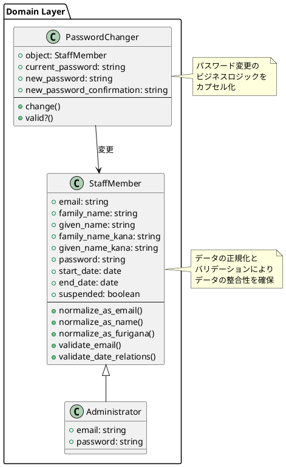
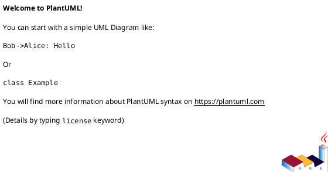

# 作業履歴 2017-01-31

## 概要

2017-01-31の作業内容をまとめています。この日は主にモデルオブジェクトの正規化とバリデーション機能の実装を行いました。また、職員が自分のパスワードを変更する機能も実装しました。

### 関連ユースケース

- **S-003**: 職員アカウント情報更新 - 職員が自身のアカウント情報を更新する
- **A-004**: 職員アカウント編集 - 管理者が既存の職員アカウント情報を編集する

### システム構成上の位置づけ

この実装はモデル層のデータ整合性を確保するための重要な部分であり、システムアーキテクチャにおける以下の部分に関連しています：



## コミット: e6fcb21

### メッセージ

```
正規化とバリデーションのテスト #10
```

### 変更されたファイル

- M	README.md
- M	app/models/staff_member.rb
- M	spec/models/staff_member_spec.rb

### 変更内容

```diff
commit e6fcb219d45a0176fefbd00fb6e837883c7ffb4a
Author: k2works <kakimomokuri@gmail.com>
Date:   Tue Jan 31 19:17:37 2017 +0900

    正規化とバリデーションのテスト #10

diff --git a/README.md b/README.md
index 6ccda17..59a3bb8 100644
--- a/README.md
+++ b/README.md
@@ -493,6 +493,7 @@ git push heroku master
 + 氏名とフリガナの正規化とバリデーション
 + 開始日と終了日のバリデーション
 + メールアドレスの正規化とバリデーション
++ 正規化とバリデーションのテスト

 #### 職員が自分のパスワードを変更する機能
 #### 演習問題
diff --git a/app/models/staff_member.rb b/app/models/staff_member.rb
index 93d6bea..c307f2b 100644
--- a/app/models/staff_member.rb
+++ b/app/models/staff_member.rb
@@ -28,7 +28,8 @@ class StaffMember < ApplicationRecord
   has_many :events, class_name: 'StaffEvent', dependent: :destroy

   before_validation do
-    self.email_for_index = normalize_as_email(email)
+    self.email = normalize_as_email(email)
+    self.email_for_index = email.downcase if email
     self.family_name = normalize_as_name(family_name)
     self.given_name = normalize_as_name(given_name)
     self.family_name_kana = normalize_as_furigana(family_name_kana)
diff --git a/spec/models/staff_member_spec.rb b/spec/models/staff_member_spec.rb
index 21f5c12..142b2d4 100644
--- a/spec/models/staff_member_spec.rb
+++ b/spec/models/staff_member_spec.rb
@@ -41,4 +41,65 @@ RSpec.describe StaffMember, type: :model do
       expect(member.hashed_password).to be_nil
     end
   end
+
+  describe 'normalization' do
+    # email前後の空白を除去
+    it 'remove spaces before and after email' do
+      member = create(:staff_member, email: ' test@example.com')
+      expect(member.email).to eq('test@example.com')
+    end
+
+    # emailに含まれる全角英数文字を半角に変換
+    it 'converts full-width alphanumeric characters included in email to half-width characters' do
+      member = create(:staff_member, email: 'ｔｅｓｔ＠ｅｘａｍｐｌｅ．ｃｏｍ')
+      expect(member.email).to eq('test@example.com')
+    end
+
+    # email前後の全角スペースを除去
+    it 'eliminates double-byte spaces before and after email' do
+      member = create(:staff_member, email: "\u{3000}test@example.com\u{3000}")
+      expect(member.email).to eq('test@example.com')
+    end
+
+    # family_name_kanaに含まれるひらがなをカタカナに変換
+    it 'converts hiragana contained in family_name_kana to katakana' do
+      member = create(:staff_member, family_name_kana: 'てすと')
+      expect(member.family_name_kana).to eq('テスト')
+    end
+
+    # family_name_kanaに含まれる半角カナを全角カナに変換
+    it 'convertd Hankaku Kana included in family_name_kana to Full-width Kana' do
+      member = create(:staff_member, family_name_kana: 'ﾃｽﾄ')
+      expect(member.family_name_kana).to eq('テスト')
+    end
+  end
+
+  describe 'validation' do
+    # @を2個含むemailは無効
+    it 'invalid email containing 2 @' do
+      memeber = build(:staff_member, email: 'test@@example.com')
+      expect(memeber).not_to be_valid
+    end
+
+    # 漢字を含むfamily_name_kanaは無効
+    it 'is invalid which family_name_kana including kanji' do
+      member = build(:staff_member, family_name_kana: '試験')
+      expect(member).not_to be_valid
+    end
+
+    # 長音符を含むfamily_name_kanaは無効
+    it 'is invalid which family_name_kana including long note' do
+      member = build(:staff_member, family_name_kana: 'エリー')
+      expect(member).to be_valid
+    end
+
+    # 他の職員のメールアドレスと重複したemailは無効
+    it 'is invalid email which duplicate email address of other staff' do
+      member1 = create(:staff_member)
+      member2 = build(:staff_member, email: member1.email)
+      expect(member2).not_to be_valid
+    end
+
+
+  end
 end

```

### 構造変更



## コミット: ee3cb0d

### メッセージ

```
メールアドレスの正規化とバリデーション #10
```

### 変更されたファイル

- M	README.md
- M	app/models/concerns/string_normalizer.rb
- M	app/models/staff_member.rb

### 変更内容

```diff
commit ee3cb0d9662c1d08e455fd7e064de791fe21241d
Author: k2works <kakimomokuri@gmail.com>
Date:   Tue Jan 31 18:36:30 2017 +0900

    メールアドレスの正規化とバリデーション #10

diff --git a/README.md b/README.md
index 48da51e..6ccda17 100644
--- a/README.md
+++ b/README.md
@@ -492,6 +492,7 @@ git push heroku master
 + 準備作業 
 + 氏名とフリガナの正規化とバリデーション
 + 開始日と終了日のバリデーション
++ メールアドレスの正規化とバリデーション

 #### 職員が自分のパスワードを変更する機能
 #### 演習問題
diff --git a/app/models/concerns/string_normalizer.rb b/app/models/concerns/string_normalizer.rb
index d329c2a..13a558b 100644
--- a/app/models/concerns/string_normalizer.rb
+++ b/app/models/concerns/string_normalizer.rb
@@ -3,6 +3,10 @@ require 'nkf'
 module StringNormalizer
   extend ActiveSupport::Concern

+  def normalize_as_email(text)
+    NKF.nkf('-w -Z1', text).strip if text
+  end
+
   def normalize_as_name(text)
     NKF.nkf('-w -Z1', text).strip if text
   end
diff --git a/app/models/staff_member.rb b/app/models/staff_member.rb
index 6488eba..93d6bea 100644
--- a/app/models/staff_member.rb
+++ b/app/models/staff_member.rb
@@ -28,7 +28,7 @@ class StaffMember < ApplicationRecord
   has_many :events, class_name: 'StaffEvent', dependent: :destroy

   before_validation do
-    self.email_for_index = email.downcase if email
+    self.email_for_index = normalize_as_email(email)
     self.family_name = normalize_as_name(family_name)
     self.given_name = normalize_as_name(given_name)
     self.family_name_kana = normalize_as_furigana(family_name_kana)
@@ -37,6 +37,7 @@ class StaffMember < ApplicationRecord

   KATAKANA_REGEXP = /\A[\p{katakana}\u{30fc}]+\z/

+  validates :email, presence: true, email: { alllow_blank: true }
   validates :family_name, :given_name, presence: true
   validates :family_name_kana, :given_name_kana, presence: true, format: { with: KATAKANA_REGEXP, allow_blank: true }
   validates :start_date, presence: true, date: {
@@ -50,6 +51,14 @@ class StaffMember < ApplicationRecord
       allow_blank: true
   }

+  validates :email_for_index, uniqueness: { allow_blank: true }
+  after_validation do
+    if errors.include?(:email_for_index)
+      errors.add(:email, :taken)
+      errors.delete(:email_for_index)
+    end
+  end
+
   def password=(raw_password)
     if raw_password.kind_of?(String)
       self.hashed_password = BCrypt::Password.create(raw_password)

```

### 構造変更


## コミット: a75dd48

### メッセージ

```
開始日と終了日のバリデーション #10
```

### 変更されたファイル

- M	README.md
- M	app/models/staff_member.rb

### 変更内容

```diff
commit a75dd485e0bf8bd01c8f0f3d99287180a90bcaba
Author: k2works <kakimomokuri@gmail.com>
Date:   Tue Jan 31 18:28:54 2017 +0900

    開始日と終了日のバリデーション #10

diff --git a/README.md b/README.md
index 1bbf57b..48da51e 100644
--- a/README.md
+++ b/README.md
@@ -491,6 +491,7 @@ git push heroku master
 + 値の正規化とバリデーション
 + 準備作業 
 + 氏名とフリガナの正規化とバリデーション
++ 開始日と終了日のバリデーション

 #### 職員が自分のパスワードを変更する機能
 #### 演習問題
diff --git a/app/models/staff_member.rb b/app/models/staff_member.rb
index b0a18cb..6488eba 100644
--- a/app/models/staff_member.rb
+++ b/app/models/staff_member.rb
@@ -39,6 +39,16 @@ class StaffMember < ApplicationRecord

   validates :family_name, :given_name, presence: true
   validates :family_name_kana, :given_name_kana, presence: true, format: { with: KATAKANA_REGEXP, allow_blank: true }
+  validates :start_date, presence: true, date: {
+      after_or_equal_to: Date.new(2000, 1, 1),
+      before: -> (obj) { 1.year.from_now.to_date },
+      allow_blank: true
+  }
+  validates :end_date, date: {
+      after: :start_date,
+      before: -> (obj) { 1.year.from_now.to_date },
+      allow_blank: true
+  }

   def password=(raw_password)
     if raw_password.kind_of?(String)

```

### 構造変更


## コミット: 368e307

### メッセージ

```
氏名とフリガナの正規化とバリデーション #10
```

### 変更されたファイル

- M	README.md
- A	app/models/concerns/string_normalizer.rb
- M	app/models/staff_member.rb

### 変更内容

```diff
commit 368e307a026e498e034ff66e4352261c35bbfdc5
Author: k2works <kakimomokuri@gmail.com>
Date:   Tue Jan 31 18:11:46 2017 +0900

    氏名とフリガナの正規化とバリデーション #10

diff --git a/README.md b/README.md
index 7c275d1..1bbf57b 100644
--- a/README.md
+++ b/README.md
@@ -490,6 +490,7 @@ git push heroku master
 #### モデルオブジェクトの正規化とバリデーション
 + 値の正規化とバリデーション
 + 準備作業 
++ 氏名とフリガナの正規化とバリデーション

 #### 職員が自分のパスワードを変更する機能
 #### 演習問題
diff --git a/app/models/concerns/string_normalizer.rb b/app/models/concerns/string_normalizer.rb
new file mode 100644
index 0000000..d329c2a
--- /dev/null
+++ b/app/models/concerns/string_normalizer.rb
@@ -0,0 +1,13 @@
+require 'nkf'
+
+module StringNormalizer
+  extend ActiveSupport::Concern
+
+  def normalize_as_name(text)
+    NKF.nkf('-w -Z1', text).strip if text
+  end
+
+  def normalize_as_furigana(text)
+    NKF.nkf('-w -Z1 --katakana', text).strip if text
+  end
+end
\ No newline at end of file
diff --git a/app/models/staff_member.rb b/app/models/staff_member.rb
index ded6c47..b0a18cb 100644
--- a/app/models/staff_member.rb
+++ b/app/models/staff_member.rb
@@ -23,12 +23,23 @@
 #

 class StaffMember < ApplicationRecord
+  include StringNormalizer
+
   has_many :events, class_name: 'StaffEvent', dependent: :destroy

   before_validation do
     self.email_for_index = email.downcase if email
+    self.family_name = normalize_as_name(family_name)
+    self.given_name = normalize_as_name(given_name)
+    self.family_name_kana = normalize_as_furigana(family_name_kana)
+    self.given_name_kana = normalize_as_furigana(given_name_kana)
   end

+  KATAKANA_REGEXP = /\A[\p{katakana}\u{30fc}]+\z/
+
+  validates :family_name, :given_name, presence: true
+  validates :family_name_kana, :given_name_kana, presence: true, format: { with: KATAKANA_REGEXP, allow_blank: true }
+
   def password=(raw_password)
     if raw_password.kind_of?(String)
       self.hashed_password = BCrypt::Password.create(raw_password)

```

### 構造変更


## コミット: 5dc3b39

### メッセージ

```
準備作業  #10
```

### 変更されたファイル

- M	Gemfile
- M	Gemfile.lock
- M	README.md
- M	app/assets/stylesheets/components/_appForm.scss
- M	baukis-kai.iml

### 変更内容

```diff
commit 5dc3b39a66fa2f36f8304bfa0100748b63112d8e
Author: k2works <kakimomokuri@gmail.com>
Date:   Tue Jan 31 17:57:06 2017 +0900

    準備作業  #10

diff --git a/Gemfile b/Gemfile
index 11ab6c0..3589aa0 100644
--- a/Gemfile
+++ b/Gemfile
@@ -88,4 +88,6 @@ gem 'enum_help'
 gem 'bootstrap-sass', '~> 3.3.6'
 gem 'bootstrap_form'
 gem 'dotenv-rails'
-gem 'kaminari', '~> 0.17.0'
\ No newline at end of file
+gem 'kaminari', '~> 0.17.0'
+gem 'date_validator', '~> 0.9.0'
+gem 'email_validator', '~> 1.6'
diff --git a/Gemfile.lock b/Gemfile.lock
index 45b3333..5196c22 100644
--- a/Gemfile.lock
+++ b/Gemfile.lock
@@ -84,6 +84,9 @@ GEM
     coffee-script-source (1.12.2)
     concurrent-ruby (1.0.4)
     database_cleaner (1.3.0)
+    date_validator (0.9.0)
+      activemodel
+      activesupport
     debase (0.2.1)
       debase-ruby_core_source
     debase-ruby_core_source (0.9.6)
@@ -96,6 +99,8 @@ GEM
     em-websocket (0.5.1)
       eventmachine (>= 0.12.9)
       http_parser.rb (~> 0.6.0)
+    email_validator (1.6.0)
+      activemodel
     enum_help (0.0.16)
     erubis (2.7.0)
     eventmachine (1.2.1)
@@ -313,8 +318,10 @@ DEPENDENCIES
   capybara-webkit
   coffee-rails (~> 4.2)
   database_cleaner (~> 1.3.0)
+  date_validator (~> 0.9.0)
   debase
   dotenv-rails
+  email_validator (~> 1.6)
   enum_help
   factory_girl_rails
   faker (~> 1.4.3)
diff --git a/README.md b/README.md
index 8f91fc6..7c275d1 100644
--- a/README.md
+++ b/README.md
@@ -488,6 +488,9 @@ git push heroku master

 ### 値の正規化とバリデーション
 #### モデルオブジェクトの正規化とバリデーション
++ 値の正規化とバリデーション
++ 準備作業 
+
 #### 職員が自分のパスワードを変更する機能
 #### 演習問題

diff --git a/app/assets/stylesheets/components/_appForm.scss b/app/assets/stylesheets/components/_appForm.scss
index a6b23f4..98aa757 100644
--- a/app/assets/stylesheets/components/_appForm.scss
+++ b/app/assets/stylesheets/components/_appForm.scss
@@ -37,4 +37,10 @@
       padding: $wide $very_wide;
     }
   }
+  &--field_with_errors {
+    display: inline;
+    padding: 0;
+    label { color: $red }
+    input { background-color: $pink }
+  }
 }
\ No newline at end of file
diff --git a/baukis-kai.iml b/baukis-kai.iml
index 441757e..9b5fa5f 100644
--- a/baukis-kai.iml
+++ b/baukis-kai.iml
@@ -53,6 +53,7 @@
     <orderEntry type="library" scope="PROVIDED" name="coffee-script-source (v1.12.2, rbenv: 2.4.0) [gem]" level="application" />
     <orderEntry type="library" scope="PROVIDED" name="concurrent-ruby (v1.0.4, rbenv: 2.4.0) [gem]" level="application" />
     <orderEntry type="library" scope="PROVIDED" name="database_cleaner (v1.3.0, rbenv: 2.4.0) [gem]" level="application" />
+    <orderEntry type="library" scope="PROVIDED" name="date_validator (v0.9.0, rbenv: 2.4.0) [gem]" level="application" />
     <orderEntry type="library" scope="PROVIDED" name="debase (v0.2.1, rbenv: 2.4.0) [gem]" level="application" />
     <orderEntry type="library" scope="PROVIDED" name="debase-ruby_core_source (v0.9.6, rbenv: 2.4.0) [gem]" level="application" />
     <orderEntry type="library" scope="PROVIDED" name="debug_inspector (v0.0.2, rbenv: 2.4.0) [gem]" level="application" />
@@ -60,6 +61,7 @@
     <orderEntry type="library" scope="PROVIDED" name="dotenv (v2.1.2, rbenv: 2.4.0) [gem]" level="application" />
     <orderEntry type="library" scope="PROVIDED" name="dotenv-rails (v2.1.2, rbenv: 2.4.0) [gem]" level="application" />
     <orderEntry type="library" scope="PROVIDED" name="em-websocket (v0.5.1, rbenv: 2.4.0) [gem]" level="application" />
+    <orderEntry type="library" scope="PROVIDED" name="email_validator (v1.6.0, rbenv: 2.4.0) [gem]" level="application" />
     <orderEntry type="library" scope="PROVIDED" name="enum_help (v0.0.16, rbenv: 2.4.0) [gem]" level="application" />
     <orderEntry type="library" scope="PROVIDED" name="erubis (v2.7.0, rbenv: 2.4.0) [gem]" level="application" />
     <orderEntry type="library" scope="PROVIDED" name="eventmachine (v1.2.1, rbenv: 2.4.0) [gem]" level="application" />

```

## コミット: e5cf080

### メッセージ

```
値の正規化とバリデーション #10
```

### 変更されたファイル

- M	README.md

### 変更内容

```diff
commit e5cf080a5fae2bb42e346edc8294210810f73370
Author: k2works <kakimomokuri@gmail.com>
Date:   Tue Jan 31 17:49:14 2017 +0900

    値の正規化とバリデーション #10

diff --git a/README.md b/README.md
index 814b44f..8f91fc6 100644
--- a/README.md
+++ b/README.md
@@ -487,6 +487,10 @@ git push heroku master
 #### 演習問題

 ### 値の正規化とバリデーション
+#### モデルオブジェクトの正規化とバリデーション
+#### 職員が自分のパスワードを変更する機能
+#### 演習問題
+
 ### プレゼンター
 ### jQueryとCoffeeScript
 ### 単一テーブ継承

```

## コミット: ee708f3

### メッセージ

```
モデル間の関連付け #9
```

### 変更されたファイル

- M	app/views/admin/top/index.html.erb

### 変更内容

```diff
commit ee708f3992a03c8187418abfbf032307004977a6
Author: k2works <kakimomokuri@gmail.com>
Date:   Tue Jan 31 17:11:34 2017 +0900

    モデル間の関連付け #9

diff --git a/app/views/admin/top/index.html.erb b/app/views/admin/top/index.html.erb
index ddaa6df..42c1b9f 100644
--- a/app/views/admin/top/index.html.erb
+++ b/app/views/admin/top/index.html.erb
@@ -8,6 +8,10 @@
     <h2 class="sectionLabel">お知らせ</h2>
   </div>
   <ol class="NewsList">
+    <li class="NewsList__item">
+      <time class="NewsList__head" datatime="2017-1-31">2017.1.31</time>
+      <span class="NewsList__body">職員イベント管理機能を追加</span>
+    </li>
     <li class="NewsList__item">
       <time class="NewsList__head" datatime="2017-1-30">2017.1.30</time>
       <span class="NewsList__body">アクセス制御の強化</span>

```

## コミット: f120454

### メッセージ

```
演習問題 #9
```

### 変更されたファイル

- M	app/controllers/admin/staff_members_controller.rb
- M	app/views/admin/staff_members/index.html.erb

### 変更内容

```diff
commit f1204547411ef909594b7dba49533a5aaa0df75d
Author: k2works <kakimomokuri@gmail.com>
Date:   Tue Jan 31 17:08:03 2017 +0900

    演習問題 #9

diff --git a/app/controllers/admin/staff_members_controller.rb b/app/controllers/admin/staff_members_controller.rb
index 6cc46bc..1855b32 100644
--- a/app/controllers/admin/staff_members_controller.rb
+++ b/app/controllers/admin/staff_members_controller.rb
@@ -1,7 +1,7 @@
 class Admin::StaffMembersController < Admin::Base

   def index
-    @staff_members = StaffMember.order(:family_name_kana, :given_name_kana)
+    @staff_members = StaffMember.order(:family_name_kana, :given_name_kana).page(params[:page])
   end

   def show
diff --git a/app/views/admin/staff_members/index.html.erb b/app/views/admin/staff_members/index.html.erb
index d8bf10e..e5fd15b 100644
--- a/app/views/admin/staff_members/index.html.erb
+++ b/app/views/admin/staff_members/index.html.erb
@@ -8,6 +8,8 @@
     <%= link_to t('.new'), :new_admin_staff_member, class: 'btn btn-default' %>
   </div>

+  <%= paginate @staff_members %>
+
   <table class="Table__body Table__body--listing AdminTable__body">
     <tr class="Table__tr">
       <th class="Table__th"><%= t('.full_name') %></th>
@@ -38,6 +40,8 @@
     <% end %>
   </table>

+  <%= paginate @staff_members %>
+
   <div class="Table__links">
     <%= link_to t('.new'), :new_admin_staff_member, class: 'btn btn-default' %>
   </div>

```

### 構造変更


## コミット: 235d645

### メッセージ

```
リファクタリング #9
```

### 変更されたファイル

- M	README.md
- M	app/controllers/admin/staff_events_controller.rb

### 変更内容

```diff
commit 235d6459e74726c088f14b3dfbb460a2d729312e
Author: k2works <kakimomokuri@gmail.com>
Date:   Tue Jan 31 17:03:25 2017 +0900

    リファクタリング #9

diff --git a/README.md b/README.md
index 8897fa3..814b44f 100644
--- a/README.md
+++ b/README.md
@@ -482,6 +482,7 @@ git push heroku master
 + Gemパッケージquiet_assets
 + N+1問題とは
 + includeメソッド
++ リファクタリング

 #### 演習問題

diff --git a/app/controllers/admin/staff_events_controller.rb b/app/controllers/admin/staff_events_controller.rb
index 663ef31..39ae2f6 100644
--- a/app/controllers/admin/staff_events_controller.rb
+++ b/app/controllers/admin/staff_events_controller.rb
@@ -2,11 +2,10 @@ class Admin::StaffEventsController < Admin::Base
   def index
     if params[:staff_member_id]
       @staff_member = StaffMember.find(params[:staff_member_id])
-      @events = @staff_member.events.order(occurred_at: :desc)
+      @events = @staff_member.events
     else
-      @events = StaffEvent.order(occurred_at: :desc)
+      @events = StaffEvent
     end
-    @events = @events.includes(:member)
-    @events = @events.page(params[:page])
+    @events = @events.order(occurred_at: :desc).includes(:member).page(params[:page])
   end
 end

```

### 構造変更


## コミット: 5e1920e

### メッセージ

```
includeメソッド #9
```

### 変更されたファイル

- M	README.md
- M	app/controllers/admin/staff_events_controller.rb

### 変更内容

```diff
commit 5e1920ec0125985373910e8ccdd9491879173344
Author: k2works <kakimomokuri@gmail.com>
Date:   Tue Jan 31 16:56:30 2017 +0900

    includeメソッド #9

diff --git a/README.md b/README.md
index b4834c4..8897fa3 100644
--- a/README.md
+++ b/README.md
@@ -479,6 +479,10 @@ git push heroku master
 + ページネーションのカスタマイズ

 #### N + 1問題
++ Gemパッケージquiet_assets
++ N+1問題とは
++ includeメソッド
+
 #### 演習問題

 ### 値の正規化とバリデーション
diff --git a/app/controllers/admin/staff_events_controller.rb b/app/controllers/admin/staff_events_controller.rb
index ea08a31..663ef31 100644
--- a/app/controllers/admin/staff_events_controller.rb
+++ b/app/controllers/admin/staff_events_controller.rb
@@ -6,6 +6,7 @@ class Admin::StaffEventsController < Admin::Base
     else
       @events = StaffEvent.order(occurred_at: :desc)
     end
+    @events = @events.includes(:member)
     @events = @events.page(params[:page])
   end
 end

```

### 構造変更


## コミット: 4b450a6

### メッセージ

```
ページネーションのカスタマイズ #9
```

### 変更されたファイル

- M	README.md
- A	app/assets/stylesheets/components/parts/_pagination.scss
- M	app/assets/stylesheets/main.scss
- M	app/views/kaminari/_first_page.html.erb
- M	app/views/kaminari/_last_page.html.erb
- M	app/views/kaminari/_next_page.html.erb
- M	app/views/kaminari/_paginator.html.erb

### 変更内容

```diff
commit 4b450a66f1a9f5a2fa98cc079ceeb6284ea3c8bf
Author: k2works <kakimomokuri@gmail.com>
Date:   Tue Jan 31 16:47:06 2017 +0900

    ページネーションのカスタマイズ #9

diff --git a/README.md b/README.md
index f8856c7..b4834c4 100644
--- a/README.md
+++ b/README.md
@@ -476,6 +476,7 @@ git push heroku master
 + Gemパッケージkaminari
 + indexアクションの修正
 + ERBテンプレートの修正
++ ページネーションのカスタマイズ

 #### N + 1問題
 #### 演習問題
diff --git a/app/assets/stylesheets/components/parts/_pagination.scss b/app/assets/stylesheets/components/parts/_pagination.scss
new file mode 100644
index 0000000..0305694
--- /dev/null
+++ b/app/assets/stylesheets/components/parts/_pagination.scss
@@ -0,0 +1,24 @@
+nav.pagination {
+  margin: $moderate 0;
+  padding: $moderate 0;
+  display: inline-block;
+  border-top: solid $very_light_gray 1px;
+  border-bottom: solid $very_light_gray 1px;
+  span.page, span.first, span.prev, span.next, span.last {
+    display: inline-block;
+    background-color: $light_gray;
+    padding: $narrow $moderate;
+    a {
+      text-decoration: none;
+    }
+  }
+  span.current {
+    background-color: $dark_gray;
+  }
+  span.disabled {
+    color: $gray;
+  }
+  span.gap {
+    background-color: transparent;
+  }
+}
\ No newline at end of file
diff --git a/app/assets/stylesheets/main.scss b/app/assets/stylesheets/main.scss
index c994463..76d692c 100644
--- a/app/assets/stylesheets/main.scss
+++ b/app/assets/stylesheets/main.scss
@@ -30,6 +30,9 @@
 // メッセージ
 @import "./components/parts/flash";

+// ページネーション
+@import "./components/parts/pagination";
+
 // Common
 //----------------------------
 // ヘッダー
diff --git a/app/views/kaminari/_first_page.html.erb b/app/views/kaminari/_first_page.html.erb
index 2682d34..e0ab4ab 100644
--- a/app/views/kaminari/_first_page.html.erb
+++ b/app/views/kaminari/_first_page.html.erb
@@ -7,5 +7,9 @@
     remote:        data-remote
 -%>
 <span class="first">
-  <%= link_to_unless current_page.first?, t('views.pagination.first').html_safe, url, :remote => remote %>
+  <%=
+    link_to_unless(current_page.first?, t('views.pagination.first').html_safe, url, :remote => remote) do |name|
+      content_tag(:span, name, class: 'disabled')
+    end
+  %>
 </span>
diff --git a/app/views/kaminari/_last_page.html.erb b/app/views/kaminari/_last_page.html.erb
index 53d6130..5b2dcf4 100644
--- a/app/views/kaminari/_last_page.html.erb
+++ b/app/views/kaminari/_last_page.html.erb
@@ -7,5 +7,9 @@
     remote:        data-remote
 -%>
 <span class="last">
-  <%= link_to_unless current_page.last?, t('views.pagination.last').html_safe, url, :remote => remote %>
+  <%=
+    link_to_unless(current_page.last?, t('views.pagination.last').html_safe, url, :remote => remote) do |name|
+      content_tag(:span, name, class: 'disabled')
+    end
+  %>
 </span>
diff --git a/app/views/kaminari/_next_page.html.erb b/app/views/kaminari/_next_page.html.erb
index 4fc2071..c83841d 100644
--- a/app/views/kaminari/_next_page.html.erb
+++ b/app/views/kaminari/_next_page.html.erb
@@ -7,5 +7,9 @@
     remote:        data-remote
 -%>
 <span class="next">
-  <%= link_to_unless current_page.last?, t('views.pagination.next').html_safe, url, :rel => 'next', :remote => remote %>
+  <%=
+    link_to_unless(current_page.last?, t('views.pagination.next').html_safe, url, :rel => 'next', :remote => remote) do |name|
+      content_tag(:span, name, class: 'disabled')
+    end
+  %>
 </span>
diff --git a/app/views/kaminari/_paginator.html.erb b/app/views/kaminari/_paginator.html.erb
index 4fb445f..a2056ac 100644
--- a/app/views/kaminari/_paginator.html.erb
+++ b/app/views/kaminari/_paginator.html.erb
@@ -8,8 +8,8 @@
 -%>
 <%= paginator.render do -%>
   <nav class="pagination">
-    <%= first_page_tag unless current_page.first? %>
-    <%= prev_page_tag unless current_page.first? %>
+    <%= first_page_tag %>
+    <%= prev_page_tag %>
     <% each_page do |page| -%>
       <% if page.left_outer? || page.right_outer? || page.inside_window? -%>
         <%= page_tag page %>
@@ -17,7 +17,7 @@
         <%= gap_tag %>
       <% end -%>
     <% end -%>
-    <%= next_page_tag unless current_page.last? %>
-    <%= last_page_tag unless current_page.last? %>
+    <%= next_page_tag %>
+    <%= last_page_tag %>
   </nav>
 <% end -%>

```

## コミット: d30ae1a

### メッセージ

```
ERBテンプレートの修正 #9
```

### 変更されたファイル

- M	Gemfile
- M	Gemfile.lock
- M	README.md
- M	app/views/admin/staff_events/index.html.erb
- M	app/views/kaminari/_first_page.html.erb
- M	app/views/kaminari/_gap.html.erb
- M	app/views/kaminari/_last_page.html.erb
- M	app/views/kaminari/_next_page.html.erb
- M	app/views/kaminari/_page.html.erb
- M	app/views/kaminari/_paginator.html.erb
- M	app/views/kaminari/_prev_page.html.erb
- M	baukis-kai.iml

### 変更内容

```diff
commit d30ae1a3d5013802c5fa5fe1fa6a8b61de3e2865
Author: k2works <kakimomokuri@gmail.com>
Date:   Tue Jan 31 16:30:06 2017 +0900

    ERBテンプレートの修正 #9

diff --git a/Gemfile b/Gemfile
index 5d0659e..11ab6c0 100644
--- a/Gemfile
+++ b/Gemfile
@@ -88,4 +88,4 @@ gem 'enum_help'
 gem 'bootstrap-sass', '~> 3.3.6'
 gem 'bootstrap_form'
 gem 'dotenv-rails'
-gem 'kaminari', '~> 0.16.3'
\ No newline at end of file
+gem 'kaminari', '~> 0.17.0'
\ No newline at end of file
diff --git a/Gemfile.lock b/Gemfile.lock
index d8e4512..45b3333 100644
--- a/Gemfile.lock
+++ b/Gemfile.lock
@@ -57,7 +57,7 @@ GEM
       autoprefixer-rails (>= 5.2.1)
       sass (>= 3.3.4)
     bootstrap_form (2.5.3)
-    builder (3.2.2)
+    builder (3.2.3)
     byebug (9.0.6)
     capybara (2.5.0)
       mime-types (>= 1.16)
@@ -140,7 +140,7 @@ GEM
       railties (>= 4.2.0)
       thor (>= 0.14, < 2.0)
     json (2.0.2)
-    kaminari (0.16.3)
+    kaminari (0.17.0)
       actionpack (>= 3.0.0)
       activesupport (>= 3.0.0)
     launchy (2.4.3)
@@ -323,7 +323,7 @@ DEPENDENCIES
   i18n_generators
   jbuilder (~> 2.5)
   jquery-rails
-  kaminari (~> 0.16.3)
+  kaminari (~> 0.17.0)
   launchy (~> 2.4.2)
   listen (~> 3.0.5)
   migration_comments
diff --git a/README.md b/README.md
index 6870eca..f8856c7 100644
--- a/README.md
+++ b/README.md
@@ -475,6 +475,7 @@ git push heroku master
 + シードデータの投入
 + Gemパッケージkaminari
 + indexアクションの修正
++ ERBテンプレートの修正

 #### N + 1問題
 #### 演習問題
diff --git a/app/views/admin/staff_events/index.html.erb b/app/views/admin/staff_events/index.html.erb
index 43fe679..d2736b4 100644
--- a/app/views/admin/staff_events/index.html.erb
+++ b/app/views/admin/staff_events/index.html.erb
@@ -15,6 +15,8 @@
     <%= link_to t('.admin_staff_members'), :admin_staff_members, class: 'btn btn-default' %>
   </div>

+  <%= paginate @events %>
+
   <table class="Table__body Table__body--listing AdminTable__body">
     <tr class="Table__tr">
       <% unless @staff_member %><th class="Table__th"><%= t('.full_name') %></th><% end %>
@@ -30,6 +32,8 @@
     <% end %>
   </table>

+  <%= paginate @events %>
+
   <div class="Table__links">
     <%= link_to t('.admin_staff_members'), :admin_staff_members, class: 'btn btn-default' %>
   </div>
diff --git a/app/views/kaminari/_first_page.html.erb b/app/views/kaminari/_first_page.html.erb
index bf23ff0..2682d34 100644
--- a/app/views/kaminari/_first_page.html.erb
+++ b/app/views/kaminari/_first_page.html.erb
@@ -1,3 +1,11 @@
-<li>
-  <%= link_to_unless current_page.first?, raw(t 'views.pagination.first'), url, :remote => remote %>
-</li>
+<%# Link to the "First" page
+  - available local variables
+    url:           url to the first page
+    current_page:  a page object for the currently displayed page
+    total_pages:   total number of pages
+    per_page:      number of items to fetch per page
+    remote:        data-remote
+-%>
+<span class="first">
+  <%= link_to_unless current_page.first?, t('views.pagination.first').html_safe, url, :remote => remote %>
+</span>
diff --git a/app/views/kaminari/_gap.html.erb b/app/views/kaminari/_gap.html.erb
index 6d3a149..bbb0f98 100644
--- a/app/views/kaminari/_gap.html.erb
+++ b/app/views/kaminari/_gap.html.erb
@@ -1,3 +1,8 @@
-<li class='disabled'>
-  <%= content_tag :a, raw(t 'views.pagination.truncate') %>
-</li>
+<%# Non-link tag that stands for skipped pages...
+  - available local variables
+    current_page:  a page object for the currently displayed page
+    total_pages:   total number of pages
+    per_page:      number of items to fetch per page
+    remote:        data-remote
+-%>
+<span class="page gap"><%= t('views.pagination.truncate').html_safe %></span>
diff --git a/app/views/kaminari/_last_page.html.erb b/app/views/kaminari/_last_page.html.erb
index fb619ea..53d6130 100644
--- a/app/views/kaminari/_last_page.html.erb
+++ b/app/views/kaminari/_last_page.html.erb
@@ -1,3 +1,11 @@
-<li>
-  <%= link_to_unless current_page.last?, raw(t 'views.pagination.last'), url, {:remote => remote} %>
-</li>
+<%# Link to the "Last" page
+  - available local variables
+    url:           url to the last page
+    current_page:  a page object for the currently displayed page
+    total_pages:   total number of pages
+    per_page:      number of items to fetch per page
+    remote:        data-remote
+-%>
+<span class="last">
+  <%= link_to_unless current_page.last?, t('views.pagination.last').html_safe, url, :remote => remote %>
+</span>
diff --git a/app/views/kaminari/_next_page.html.erb b/app/views/kaminari/_next_page.html.erb
index 15e10e4..4fc2071 100644
--- a/app/views/kaminari/_next_page.html.erb
+++ b/app/views/kaminari/_next_page.html.erb
@@ -1,3 +1,11 @@
-<li>
-  <%= link_to_unless current_page.last?, raw(t 'views.pagination.next'), url, :rel => 'next', :remote => remote %>
-</li>
+<%# Link to the "Next" page
+  - available local variables
+    url:           url to the next page
+    current_page:  a page object for the currently displayed page
+    total_pages:   total number of pages
+    per_page:      number of items to fetch per page
+    remote:        data-remote
+-%>
+<span class="next">
+  <%= link_to_unless current_page.last?, t('views.pagination.next').html_safe, url, :rel => 'next', :remote => remote %>
+</span>
diff --git a/app/views/kaminari/_page.html.erb b/app/views/kaminari/_page.html.erb
index 8028b45..582af7b 100644
--- a/app/views/kaminari/_page.html.erb
+++ b/app/views/kaminari/_page.html.erb
@@ -1,9 +1,12 @@
-<% if page.current? %>
-  <li class='active'>
-    <%= content_tag :a, page, remote: remote, rel: (page.next? ? 'next' : (page.prev? ? 'prev' : nil)) %>
-  </li>
-<% else %>
-  <li>
-    <%= link_to page, url, remote: remote, rel: (page.next? ? 'next' : (page.prev? ? 'prev' : nil)) %>
-  </li>
-<% end %>
+<%# Link showing page number
+  - available local variables
+    page:          a page object for "this" page
+    url:           url to this page
+    current_page:  a page object for the currently displayed page
+    total_pages:   total number of pages
+    per_page:      number of items to fetch per page
+    remote:        data-remote
+-%>
+<span class="page<%= ' current' if page.current? %>">
+  <%= link_to_unless page.current?, page, url, {:remote => remote, :rel => page.next? ? 'next' : page.prev? ? 'prev' : nil} %>
+</span>
diff --git a/app/views/kaminari/_paginator.html.erb b/app/views/kaminari/_paginator.html.erb
index 2c8757b..4fb445f 100644
--- a/app/views/kaminari/_paginator.html.erb
+++ b/app/views/kaminari/_paginator.html.erb
@@ -1,5 +1,13 @@
+<%# The container tag
+  - available local variables
+    current_page:  a page object for the currently displayed page
+    total_pages:   total number of pages
+    per_page:      number of items to fetch per page
+    remote:        data-remote
+    paginator:     the paginator that renders the pagination tags inside
+-%>
 <%= paginator.render do -%>
-  <ul class="pagination">
+  <nav class="pagination">
     <%= first_page_tag unless current_page.first? %>
     <%= prev_page_tag unless current_page.first? %>
     <% each_page do |page| -%>
@@ -11,5 +19,5 @@
     <% end -%>
     <%= next_page_tag unless current_page.last? %>
     <%= last_page_tag unless current_page.last? %>
-  </ul>
+  </nav>
 <% end -%>
diff --git a/app/views/kaminari/_prev_page.html.erb b/app/views/kaminari/_prev_page.html.erb
index d94a50a..9c4aff4 100644
--- a/app/views/kaminari/_prev_page.html.erb
+++ b/app/views/kaminari/_prev_page.html.erb
@@ -1,3 +1,11 @@
-<li>
-  <%= link_to_unless current_page.first?, raw(t 'views.pagination.previous'), url, :rel => 'prev', :remote => remote %>
-</li>
+<%# Link to the "Previous" page
+  - available local variables
+    url:           url to the previous page
+    current_page:  a page object for the currently displayed page
+    total_pages:   total number of pages
+    per_page:      number of items to fetch per page
+    remote:        data-remote
+-%>
+<span class="prev">
+  <%= link_to_unless current_page.first?, t('views.pagination.previous').html_safe, url, :rel => 'prev', :remote => remote %>
+</span>
diff --git a/baukis-kai.iml b/baukis-kai.iml
index 7ecc284..441757e 100644
--- a/baukis-kai.iml
+++ b/baukis-kai.iml
@@ -39,7 +39,7 @@
     <orderEntry type="library" scope="PROVIDED" name="binding_of_caller (v0.7.2, rbenv: 2.4.0) [gem]" level="application" />
     <orderEntry type="library" scope="PROVIDED" name="bootstrap-sass (v3.3.7, rbenv: 2.4.0) [gem]" level="application" />
     <orderEntry type="library" scope="PROVIDED" name="bootstrap_form (v2.5.3, rbenv: 2.4.0) [gem]" level="application" />
-    <orderEntry type="library" scope="PROVIDED" name="builder (v3.2.2, rbenv: 2.4.0) [gem]" level="application" />
+    <orderEntry type="library" scope="PROVIDED" name="builder (v3.2.3, rbenv: 2.4.0) [gem]" level="application" />
     <orderEntry type="library" scope="PROVIDED" name="bundler (v1.13.7, rbenv: 2.4.0) [gem]" level="application" />
     <orderEntry type="library" scope="PROVIDED" name="byebug (v9.0.6, rbenv: 2.4.0) [gem]" level="application" />
     <orderEntry type="library" scope="PROVIDED" name="capybara (v2.5.0, rbenv: 2.4.0) [gem]" level="application" />
@@ -79,7 +79,7 @@
     <orderEntry type="library" scope="PROVIDED" name="i18n_generators (v2.1.1, rbenv: 2.4.0) [gem]" level="application" />
     <orderEntry type="library" scope="PROVIDED" name="jbuilder (v2.6.1, rbenv: 2.4.0) [gem]" level="application" />
     <orderEntry type="library" scope="PROVIDED" name="jquery-rails (v4.2.2, rbenv: 2.4.0) [gem]" level="application" />
-    <orderEntry type="library" scope="PROVIDED" name="kaminari (v0.16.3, rbenv: 2.4.0) [gem]" level="application" />
+    <orderEntry type="library" scope="PROVIDED" name="kaminari (v0.17.0, rbenv: 2.4.0) [gem]" level="application" />
     <orderEntry type="library" scope="PROVIDED" name="launchy (v2.4.3, rbenv: 2.4.0) [gem]" level="application" />
     <orderEntry type="library" scope="PROVIDED" name="listen (v3.0.8, rbenv: 2.4.0) [gem]" level="application" />
     <orderEntry type="library" scope="PROVIDED" name="loofah (v2.0.3, rbenv: 2.4.0) [gem]" level="application" />

```

## コミット: ba7926b

### メッセージ

```
indexアクションの修正 #9
```

### 変更されたファイル

- M	README.md
- M	app/controllers/admin/staff_events_controller.rb

### 変更内容

```diff
commit ba7926be32602721663574cc6c7202f8a5575783
Author: k2works <kakimomokuri@gmail.com>
Date:   Tue Jan 31 16:18:32 2017 +0900

    indexアクションの修正 #9

diff --git a/README.md b/README.md
index 3880100..6870eca 100644
--- a/README.md
+++ b/README.md
@@ -474,6 +474,7 @@ git push heroku master
 #### ページネーション
 + シードデータの投入
 + Gemパッケージkaminari
++ indexアクションの修正

 #### N + 1問題
 #### 演習問題
diff --git a/app/controllers/admin/staff_events_controller.rb b/app/controllers/admin/staff_events_controller.rb
index f7b7dc8..ea08a31 100644
--- a/app/controllers/admin/staff_events_controller.rb
+++ b/app/controllers/admin/staff_events_controller.rb
@@ -6,5 +6,6 @@ class Admin::StaffEventsController < Admin::Base
     else
       @events = StaffEvent.order(occurred_at: :desc)
     end
+    @events = @events.page(params[:page])
   end
 end

```

### 構造変更


## コミット: c26bb36

### メッセージ

```
Gemパッケージkaminari #9
```

### 変更されたファイル

- M	.idea/.generators
- M	Gemfile
- M	Gemfile.lock
- M	README.md
- A	app/views/kaminari/_first_page.html.erb
- A	app/views/kaminari/_gap.html.erb
- A	app/views/kaminari/_last_page.html.erb
- A	app/views/kaminari/_next_page.html.erb
- A	app/views/kaminari/_page.html.erb
- A	app/views/kaminari/_paginator.html.erb
- A	app/views/kaminari/_prev_page.html.erb
- M	baukis-kai.iml
- A	config/initializers/kaminari_config.rb
- A	config/locales/views/paginate.ja.yml

### 変更内容

```diff
commit c26bb3653071c0a4f38123f5343054434ea8e6d2
Author: k2works <kakimomokuri@gmail.com>
Date:   Tue Jan 31 16:16:40 2017 +0900

    Gemパッケージkaminari #9

diff --git a/.idea/.generators b/.idea/.generators
index 8e11556..a68204b 100644
--- a/.idea/.generators
+++ b/.idea/.generators
@@ -5,4 +5,4 @@ You are allowed to:
 2. Remove generators
 3. Add installed generators
 To add new installed generators automatically delete this file and reload the project.
---><GeneratorsGroup><Generator name="annotate:install" /><Generator name="assets" /><Generator name="channel" /><Generator name="coffee:assets" /><Generator name="controller" /><Generator name="erd:install" /><Generator name="factory_girl:model" /><Generator name="generator" /><Generator name="helper" /><Generator name="i18n" /><Generator name="i18n_locale" /><Generator name="i18n_translation" /><Generator name="integration_test" /><Generator name="jbuilder" /><Generator name="job" /><Generator name="js:assets" /><Generator name="mailer" /><Generator name="migration" /><Generator name="model" /><Generator name="rack:dev-mark:install" /><Generator name="resource" /><Generator name="rspec:controller" /><Generator name="rspec:feature" /><Generator name="rspec:helper" /><Generator name="rspec:install" /><Generator name="rspec:integration" /><Generator name="rspec:job" /><Generator name="rspec:mailer" /><Generator name="rspec:model" /><Generator name="rspec:observer" /><Generator name="rspec:request" /><Generator name="rspec:scaffold" /><Generator name="rspec:view" /><Generator name="scaffold" /><Generator name="scaffold_controller" /><Generator name="task" /><Generator name="test_unit:controller" /><Generator name="test_unit:generator" /><Generator name="test_unit:helper" /><Generator name="test_unit:integration" /><Generator name="test_unit:job" /><Generator name="test_unit:mailer" /><Generator name="test_unit:model" /><Generator name="test_unit:plugin" /><Generator name="test_unit:scaffold" /></GeneratorsGroup></Settings>
+--><GeneratorsGroup><Generator name="annotate:install" /><Generator name="assets" /><Generator name="channel" /><Generator name="coffee:assets" /><Generator name="controller" /><Generator name="erd:install" /><Generator name="factory_girl:model" /><Generator name="generator" /><Generator name="helper" /><Generator name="i18n" /><Generator name="i18n_locale" /><Generator name="i18n_translation" /><Generator name="integration_test" /><Generator name="jbuilder" /><Generator name="job" /><Generator name="js:assets" /><Generator name="kaminari:config" /><Generator name="kaminari:views" /><Generator name="mailer" /><Generator name="migration" /><Generator name="model" /><Generator name="rack:dev-mark:install" /><Generator name="resource" /><Generator name="rspec:controller" /><Generator name="rspec:feature" /><Generator name="rspec:helper" /><Generator name="rspec:install" /><Generator name="rspec:integration" /><Generator name="rspec:job" /><Generator name="rspec:mailer" /><Generator name="rspec:model" /><Generator name="rspec:observer" /><Generator name="rspec:request" /><Generator name="rspec:scaffold" /><Generator name="rspec:view" /><Generator name="scaffold" /><Generator name="scaffold_controller" /><Generator name="task" /><Generator name="test_unit:controller" /><Generator name="test_unit:generator" /><Generator name="test_unit:helper" /><Generator name="test_unit:integration" /><Generator name="test_unit:job" /><Generator name="test_unit:mailer" /><Generator name="test_unit:model" /><Generator name="test_unit:plugin" /><Generator name="test_unit:scaffold" /></GeneratorsGroup></Settings>
diff --git a/Gemfile b/Gemfile
index e9ca58f..5d0659e 100644
--- a/Gemfile
+++ b/Gemfile
@@ -87,4 +87,5 @@ gem 'rack-dev-mark'
 gem 'enum_help'
 gem 'bootstrap-sass', '~> 3.3.6'
 gem 'bootstrap_form'
-gem 'dotenv-rails'
\ No newline at end of file
+gem 'dotenv-rails'
+gem 'kaminari', '~> 0.16.3'
\ No newline at end of file
diff --git a/Gemfile.lock b/Gemfile.lock
index 9fe802b..d8e4512 100644
--- a/Gemfile.lock
+++ b/Gemfile.lock
@@ -140,6 +140,9 @@ GEM
       railties (>= 4.2.0)
       thor (>= 0.14, < 2.0)
     json (2.0.2)
+    kaminari (0.16.3)
+      actionpack (>= 3.0.0)
+      activesupport (>= 3.0.0)
     launchy (2.4.3)
       addressable (~> 2.3)
     listen (3.0.8)
@@ -320,6 +323,7 @@ DEPENDENCIES
   i18n_generators
   jbuilder (~> 2.5)
   jquery-rails
+  kaminari (~> 0.16.3)
   launchy (~> 2.4.2)
   listen (~> 3.0.5)
   migration_comments
diff --git a/README.md b/README.md
index b7355b2..3880100 100644
--- a/README.md
+++ b/README.md
@@ -473,6 +473,7 @@ git push heroku master

 #### ページネーション
 + シードデータの投入
++ Gemパッケージkaminari

 #### N + 1問題
 #### 演習問題
diff --git a/app/views/kaminari/_first_page.html.erb b/app/views/kaminari/_first_page.html.erb
new file mode 100644
index 0000000..bf23ff0
--- /dev/null
+++ b/app/views/kaminari/_first_page.html.erb
@@ -0,0 +1,3 @@
+<li>
+  <%= link_to_unless current_page.first?, raw(t 'views.pagination.first'), url, :remote => remote %>
+</li>
diff --git a/app/views/kaminari/_gap.html.erb b/app/views/kaminari/_gap.html.erb
new file mode 100644
index 0000000..6d3a149
--- /dev/null
+++ b/app/views/kaminari/_gap.html.erb
@@ -0,0 +1,3 @@
+<li class='disabled'>
+  <%= content_tag :a, raw(t 'views.pagination.truncate') %>
+</li>
diff --git a/app/views/kaminari/_last_page.html.erb b/app/views/kaminari/_last_page.html.erb
new file mode 100644
index 0000000..fb619ea
--- /dev/null
+++ b/app/views/kaminari/_last_page.html.erb
@@ -0,0 +1,3 @@
+<li>
+  <%= link_to_unless current_page.last?, raw(t 'views.pagination.last'), url, {:remote => remote} %>
+</li>
diff --git a/app/views/kaminari/_next_page.html.erb b/app/views/kaminari/_next_page.html.erb
new file mode 100644
index 0000000..15e10e4
--- /dev/null
+++ b/app/views/kaminari/_next_page.html.erb
@@ -0,0 +1,3 @@
+<li>
+  <%= link_to_unless current_page.last?, raw(t 'views.pagination.next'), url, :rel => 'next', :remote => remote %>
+</li>
diff --git a/app/views/kaminari/_page.html.erb b/app/views/kaminari/_page.html.erb
new file mode 100644
index 0000000..8028b45
--- /dev/null
+++ b/app/views/kaminari/_page.html.erb
@@ -0,0 +1,9 @@
+<% if page.current? %>
+  <li class='active'>
+    <%= content_tag :a, page, remote: remote, rel: (page.next? ? 'next' : (page.prev? ? 'prev' : nil)) %>
+  </li>
+<% else %>
+  <li>
+    <%= link_to page, url, remote: remote, rel: (page.next? ? 'next' : (page.prev? ? 'prev' : nil)) %>
+  </li>
+<% end %>
diff --git a/app/views/kaminari/_paginator.html.erb b/app/views/kaminari/_paginator.html.erb
new file mode 100644
index 0000000..2c8757b
--- /dev/null
+++ b/app/views/kaminari/_paginator.html.erb
@@ -0,0 +1,15 @@
+<%= paginator.render do -%>
+  <ul class="pagination">
+    <%= first_page_tag unless current_page.first? %>
+    <%= prev_page_tag unless current_page.first? %>
+    <% each_page do |page| -%>
+      <% if page.left_outer? || page.right_outer? || page.inside_window? -%>
+        <%= page_tag page %>
+      <% elsif !page.was_truncated? -%>
+        <%= gap_tag %>
+      <% end -%>
+    <% end -%>
+    <%= next_page_tag unless current_page.last? %>
+    <%= last_page_tag unless current_page.last? %>
+  </ul>
+<% end -%>
diff --git a/app/views/kaminari/_prev_page.html.erb b/app/views/kaminari/_prev_page.html.erb
new file mode 100644
index 0000000..d94a50a
--- /dev/null
+++ b/app/views/kaminari/_prev_page.html.erb
@@ -0,0 +1,3 @@
+<li>
+  <%= link_to_unless current_page.first?, raw(t 'views.pagination.previous'), url, :rel => 'prev', :remote => remote %>
+</li>
diff --git a/baukis-kai.iml b/baukis-kai.iml
index a4ebc0d..7ecc284 100644
--- a/baukis-kai.iml
+++ b/baukis-kai.iml
@@ -79,6 +79,7 @@
     <orderEntry type="library" scope="PROVIDED" name="i18n_generators (v2.1.1, rbenv: 2.4.0) [gem]" level="application" />
     <orderEntry type="library" scope="PROVIDED" name="jbuilder (v2.6.1, rbenv: 2.4.0) [gem]" level="application" />
     <orderEntry type="library" scope="PROVIDED" name="jquery-rails (v4.2.2, rbenv: 2.4.0) [gem]" level="application" />
+    <orderEntry type="library" scope="PROVIDED" name="kaminari (v0.16.3, rbenv: 2.4.0) [gem]" level="application" />
     <orderEntry type="library" scope="PROVIDED" name="launchy (v2.4.3, rbenv: 2.4.0) [gem]" level="application" />
     <orderEntry type="library" scope="PROVIDED" name="listen (v3.0.8, rbenv: 2.4.0) [gem]" level="application" />
     <orderEntry type="library" scope="PROVIDED" name="loofah (v2.0.3, rbenv: 2.4.0) [gem]" level="application" />
diff --git a/config/initializers/kaminari_config.rb b/config/initializers/kaminari_config.rb
new file mode 100644
index 0000000..ed1fe79
--- /dev/null
+++ b/config/initializers/kaminari_config.rb
@@ -0,0 +1,10 @@
+Kaminari.configure do |config|
+  config.default_per_page = 10
+  # config.max_per_page = nil
+  # config.window = 4
+  # config.outer_window = 0
+  # config.left = 0
+  # config.right = 0
+  # config.page_method_name = :page
+  # config.param_name = :page
+end
diff --git a/config/locales/views/paginate.ja.yml b/config/locales/views/paginate.ja.yml
new file mode 100644
index 0000000..6dd4821
--- /dev/null
+++ b/config/locales/views/paginate.ja.yml
@@ -0,0 +1,8 @@
+ja:
+  views:
+    pagination:
+      first: 先頭
+      last: 末尾
+      previous: 前
+      next: 次
+      truncate: "..."
\ No newline at end of file

```

## コミット: 666fdc6

### メッセージ

```
シードデータの投入 #9
```

### 変更されたファイル

- M	README.md
- M	db/schema.rb
- A	db/seed/development/staff_events.rb
- M	db/seeds.rb

### 変更内容

```diff
commit 666fdc6b9b8a7843f90545ae48d982cd4312ce24
Author: k2works <kakimomokuri@gmail.com>
Date:   Tue Jan 31 15:53:40 2017 +0900

    シードデータの投入 #9

diff --git a/README.md b/README.md
index e01bc9a..b7355b2 100644
--- a/README.md
+++ b/README.md
@@ -472,6 +472,8 @@ git push heroku master
 + admin/staff_eventsコントローラ

 #### ページネーション
++ シードデータの投入
+
 #### N + 1問題
 #### 演習問題

diff --git a/db/schema.rb b/db/schema.rb
index 9780a2e..5bd9dd3 100644
--- a/db/schema.rb
+++ b/db/schema.rb
@@ -12,7 +12,7 @@

 ActiveRecord::Schema.define(version: 20170131041629) do

-  create_table "administrators", force: :cascade, options: "ENGINE=InnoDB DEFAULT CHARSET=utf8", comment: "管理者" do |t|
+  create_table "administrators", force: :cascade, comment: "管理者" do |t|
     t.string   "email",                           null: false, comment: "メールアドレス"
     t.string   "email_for_index",                 null: false, comment: "索引用メールアドレス"
     t.string   "hashed_password",                              comment: "パスワード"
@@ -22,7 +22,7 @@ ActiveRecord::Schema.define(version: 20170131041629) do
     t.index ["email_for_index"], name: "index_administrators_on_email_for_index", unique: true, using: :btree
   end

-  create_table "staff_events", force: :cascade, options: "ENGINE=InnoDB DEFAULT CHARSET=utf8", comment: "職員イベント" do |t|
+  create_table "staff_events", force: :cascade, comment: "職員イベント" do |t|
     t.integer  "staff_member_id", null: false, comment: "職員レコードへの外部キー"
     t.string   "type",            null: false, comment: "イベントタイプ"
     t.datetime "created_at",      null: false, comment: "発生時刻"
@@ -31,7 +31,7 @@ ActiveRecord::Schema.define(version: 20170131041629) do
     t.index ["staff_member_id"], name: "index_staff_events_on_staff_member_id", using: :btree
   end

-  create_table "staff_members", force: :cascade, options: "ENGINE=InnoDB DEFAULT CHARSET=utf8", comment: "職員" do |t|
+  create_table "staff_members", force: :cascade, comment: "職員" do |t|
     t.string   "email",                            null: false, comment: "メールアドレス"
     t.string   "email_for_index",                  null: false, comment: "索引用メールアドレス"
     t.string   "family_name",                      null: false, comment: "姓"
diff --git a/db/seed/development/staff_events.rb b/db/seed/development/staff_events.rb
new file mode 100644
index 0000000..992d308
--- /dev/null
+++ b/db/seed/development/staff_events.rb
@@ -0,0 +1,16 @@
+staff_members = StaffMember.all
+256.times do |n|
+  m = staff_members.sample
+  e = m.events.build
+  if m.active?
+    if n.even?
+      e.type = 'logged_in'
+    else
+      e.type = 'logged_out'
+    end
+  else
+    e.type = 'rejected'
+  end
+  e.occurred_at = (256 - n).hours.ago
+  e.save!
+end
\ No newline at end of file
diff --git a/db/seeds.rb b/db/seeds.rb
index aa5909a..f58b110 100644
--- a/db/seeds.rb
+++ b/db/seeds.rb
@@ -6,7 +6,7 @@

 #   movies = Movie.create([{ name: 'Star Wars' }, { name: 'Lord of the Rings' }])
 #   Character.create(name: 'Luke', movie: movies.first)
-table_names = %w(staff_members administrators)
+table_names = %w(staff_members administrators staff_events)
 table_names.each do |table_name|
   path = Rails.root.join('db','seed',Rails.env, "#{table_name}.rb")
   if File.exist?(path)

```

## コミット: 13d09b3

### メッセージ

```
admin/staff_eventsコントローラ #9
```

### 変更されたファイル

- M	README.md
- A	app/controllers/admin/staff_events_controller.rb
- M	app/models/staff_event.rb
- A	app/views/admin/staff_events/_event.html.erb
- A	app/views/admin/staff_events/index.html.erb
- M	config/locales/models/ja.yml
- M	config/locales/views/ja.yml
- M	config/routes.rb

### 変更内容

```diff
commit 13d09b37f643d721f564c2f027a811102e84075b
Author: k2works <kakimomokuri@gmail.com>
Date:   Tue Jan 31 15:45:34 2017 +0900

    admin/staff_eventsコントローラ #9

diff --git a/README.md b/README.md
index d01db1d..e01bc9a 100644
--- a/README.md
+++ b/README.md
@@ -469,6 +469,7 @@ git push heroku master

 #### ネストされたリソース
 + ネストされたリソースとは
++ admin/staff_eventsコントローラ

 #### ページネーション
 #### N + 1問題
diff --git a/app/controllers/admin/staff_events_controller.rb b/app/controllers/admin/staff_events_controller.rb
new file mode 100644
index 0000000..f7b7dc8
--- /dev/null
+++ b/app/controllers/admin/staff_events_controller.rb
@@ -0,0 +1,10 @@
+class Admin::StaffEventsController < Admin::Base
+  def index
+    if params[:staff_member_id]
+      @staff_member = StaffMember.find(params[:staff_member_id])
+      @events = @staff_member.events.order(occurred_at: :desc)
+    else
+      @events = StaffEvent.order(occurred_at: :desc)
+    end
+  end
+end
diff --git a/app/models/staff_event.rb b/app/models/staff_event.rb
index 286c6f1..d0198dc 100644
--- a/app/models/staff_event.rb
+++ b/app/models/staff_event.rb
@@ -18,5 +18,15 @@ class StaffEvent < ApplicationRecord
   self.inheritance_column = nil

   belongs_to :member, class_name: 'StaffMember', foreign_key: 'staff_member_id'
-  alias_attribute :occurred_at, :create_at
+  alias_attribute :occurred_at, :created_at
+
+  DESCRIPTIONS = {
+      logged_in: I18n.t('activerecord.attributes.staff_event.description.logged_in'),
+      logged_out: I18n.t('activerecord.attributes.staff_event.description.logged_out'),
+      rejected: I18n.t('activerecord.attributes.staff_event.description.rejected')
+  }
+
+  def description
+    DESCRIPTIONS[type.to_sym]
+  end
 end
diff --git a/app/views/admin/staff_events/_event.html.erb b/app/views/admin/staff_events/_event.html.erb
new file mode 100644
index 0000000..4d1b492
--- /dev/null
+++ b/app/views/admin/staff_events/_event.html.erb
@@ -0,0 +1,11 @@
+<tr class="Table__tr">
+  <% unless @staff_member %>
+  <td class="Table__td">
+    <%= link_to(event.member.family_name + event.member.given_name,[:admin, event.member, :staff_events]) %>
+  </td>
+  <% end %>
+  <td class="Table__td"><%= event.description %></td>
+  <td class="Table__td Table__td--date">
+    <%= event.occurred_at.strftime('%Y/%m/%d %H:%M:%S') %>
+  </td>
+</tr>
\ No newline at end of file
diff --git a/app/views/admin/staff_events/index.html.erb b/app/views/admin/staff_events/index.html.erb
new file mode 100644
index 0000000..43fe679
--- /dev/null
+++ b/app/views/admin/staff_events/index.html.erb
@@ -0,0 +1,36 @@
+<%
+  if @staff_member
+    full_name = @staff_member.family_name + @staff_member.given_name
+    @title = "#{full_name}さんの#{t('.title')}"
+  else
+    @title = t('.title')
+  end
+%>
+<section class="Section">
+  <h1 class="Admin__title"><%= @title %></h1>
+</section>
+
+<section class="Section l-column Table">
+  <div class="Table__links">
+    <%= link_to t('.admin_staff_members'), :admin_staff_members, class: 'btn btn-default' %>
+  </div>
+
+  <table class="Table__body Table__body--listing AdminTable__body">
+    <tr class="Table__tr">
+      <% unless @staff_member %><th class="Table__th"><%= t('.full_name') %></th><% end %>
+      <th class="Table__th"><%= t('.type') %></th>
+      <th class="Table__th"><%= t('.date_time') %></th>
+    </tr>
+    <%= render partial: 'event', collection: @events %>
+    <% if @events.empty? %>
+        <tr>
+          <%= content_tag(:td, t('.contents_not_record'),
+              colspan: @staff_member ? 2 : 3, style: 'text-align: center') %>
+        </tr>
+    <% end %>
+  </table>
+
+  <div class="Table__links">
+    <%= link_to t('.admin_staff_members'), :admin_staff_members, class: 'btn btn-default' %>
+  </div>
+</section>
diff --git a/config/locales/models/ja.yml b/config/locales/models/ja.yml
index 15cb668..3650d58 100644
--- a/config/locales/models/ja.yml
+++ b/config/locales/models/ja.yml
@@ -3,6 +3,7 @@ ja:
     models:
       administrator: 管理者
       staff_member: 職員
+      staff_event: 職員イベント

     attributes:
       administrator:
@@ -23,6 +24,14 @@ ja:
         start_date: 開始日
         suspended: 停止フラグ

+      staff_event:
+        member: 職員レコードへの外部キー
+        type: イベントタイプ
+        description:
+          logged_in: ログイン
+          logged_out: ログアウト
+          rejected: ログイン拒否
+
   activemodel:
     models:
       staff/login_form: 職員ログインフォーム
diff --git a/config/locales/views/ja.yml b/config/locales/views/ja.yml
index 51491a8..fedb909 100644
--- a/config/locales/views/ja.yml
+++ b/config/locales/views/ja.yml
@@ -57,4 +57,12 @@ ja:
       edit:
         title: '職員アカウントの編集'
         update: '登録'
-        cancel: 'キャンセル'
\ No newline at end of file
+        cancel: 'キャンセル'
+    staff_events:
+        index:
+          title: 'ログイン・ログアウト記録'
+          admin_staff_members: '職員一覧'
+          full_name: '氏名'
+          type: '種別'
+          date_time: '日時'
+          contents_not_record: '記録がありません'
\ No newline at end of file
diff --git a/config/routes.rb b/config/routes.rb
index 5124565..26ef1fa 100644
--- a/config/routes.rb
+++ b/config/routes.rb
@@ -32,6 +32,10 @@
 #

 Rails.application.routes.draw do
+  namespace :admin do
+    get 'staff_events/index'
+  end
+
   config = Rails.application.config.baukis_kai

   concern :session_path do

```

### 構造変更


## コミット: b5a7677

### メッセージ

```
ネストされたリソースとは #9
```

### 変更されたファイル

- M	README.md
- M	app/views/admin/staff_members/index.html.erb
- M	app/views/admin/top/dashboard.html.erb
- M	config/locales/views/ja.yml
- M	config/routes.rb

### 変更内容

```diff
commit b5a7677c69b9e39bf376cf5e95de05e968762c41
Author: k2works <kakimomokuri@gmail.com>
Date:   Tue Jan 31 14:18:07 2017 +0900

    ネストされたリソースとは #9

diff --git a/README.md b/README.md
index 6de3bcd..d01db1d 100644
--- a/README.md
+++ b/README.md
@@ -468,6 +468,8 @@ git push heroku master
 + イベントの記録

 #### ネストされたリソース
++ ネストされたリソースとは
+
 #### ページネーション
 #### N + 1問題
 #### 演習問題
diff --git a/app/views/admin/staff_members/index.html.erb b/app/views/admin/staff_members/index.html.erb
index 69e5487..d8bf10e 100644
--- a/app/views/admin/staff_members/index.html.erb
+++ b/app/views/admin/staff_members/index.html.erb
@@ -30,6 +30,7 @@
           </td>
           <td class="Table__td Table__td--actions">
             <%= link_to t('.edit'), [ :edit, :admin, m ], class: 'btn btn-default btn-xs' %> |
+            <%= link_to t('.events'), [ :admin, m, :staff_events ], class: 'btn btn-default btn-xs' %> |
             <%= link_to t('.delete'), [ :admin, m ], method: :delete,
                         data: { confirm: t('.confirm')}, class: 'btn btn-default btn-xs' %>
           </td>
diff --git a/app/views/admin/top/dashboard.html.erb b/app/views/admin/top/dashboard.html.erb
index c0f7ba2..892b73e 100644
--- a/app/views/admin/top/dashboard.html.erb
+++ b/app/views/admin/top/dashboard.html.erb
@@ -6,5 +6,6 @@
 <section class="Section l-column DashBoard">
   <ul class="DashBoard__menu">
     <li><%= link_to t('.admin_staff_members'), :admin_staff_members, class: 'btn btn-default' %></li>
+    <li><%= link_to t('.admin_staff_events'), :admin_staff_events, class: 'btn btn-default' %></li>
   </ul>
 </section>
\ No newline at end of file
diff --git a/config/locales/views/ja.yml b/config/locales/views/ja.yml
index 5f970cb..51491a8 100644
--- a/config/locales/views/ja.yml
+++ b/config/locales/views/ja.yml
@@ -34,6 +34,7 @@ ja:
       dashboard:
         title: 'ダッシュボード'
         admin_staff_members: '職員管理'
+        admin_staff_events: '職員のログイン・ログアウト記録'
     staff_members:
       index:
         title: '職員管理'
@@ -46,6 +47,7 @@ ja:
         suspended: '停止フラグ'
         action: 'アクション'
         edit: '編集'
+        events: 'Events'
         delete: '削除'
         confirm: '本当に削除しますか?'
       new:
diff --git a/config/routes.rb b/config/routes.rb
index 8cf125f..5124565 100644
--- a/config/routes.rb
+++ b/config/routes.rb
@@ -1,30 +1,34 @@
 # == Route Map
 #
-#                   Prefix Verb   URI Pattern                   Controller#Action
-#               staff_root GET    /staff(.:format)              staff/top#index {:host=>"0.0.0.0"}
-#              staff_login GET    /staff/login(.:format)        staff/sessions#new {:host=>"0.0.0.0"}
-#            staff_session DELETE /staff/session(.:format)      staff/sessions#destroy {:host=>"0.0.0.0"}
-#                          POST   /staff/session(.:format)      staff/sessions#create {:host=>"0.0.0.0"}
-#        new_staff_account GET    /staff/account/new(.:format)  staff/accounts#new {:host=>"0.0.0.0", :execpt=>[:new, :create, :destroy]}
-#       edit_staff_account GET    /staff/account/edit(.:format) staff/accounts#edit {:host=>"0.0.0.0", :execpt=>[:new, :create, :destroy]}
-#            staff_account GET    /staff/account(.:format)      staff/accounts#show {:host=>"0.0.0.0", :execpt=>[:new, :create, :destroy]}
-#                          PATCH  /staff/account(.:format)      staff/accounts#update {:host=>"0.0.0.0", :execpt=>[:new, :create, :destroy]}
-#                          PUT    /staff/account(.:format)      staff/accounts#update {:host=>"0.0.0.0", :execpt=>[:new, :create, :destroy]}
-#                          DELETE /staff/account(.:format)      staff/accounts#destroy {:host=>"0.0.0.0", :execpt=>[:new, :create, :destroy]}
-#                          POST   /staff/account(.:format)      staff/accounts#create {:host=>"0.0.0.0", :execpt=>[:new, :create, :destroy]}
-#               admin_root GET    /admin(.:format)              admin/top#index {:host=>"0.0.0.0"}
-#              admin_login GET    /admin/login(.:format)        admin/sessions#new {:host=>"0.0.0.0"}
-#            admin_session DELETE /admin/session(.:format)      admin/sessions#destroy {:host=>"0.0.0.0"}
-#                          POST   /admin/session(.:format)      admin/sessions#create {:host=>"0.0.0.0"}
-#      admin_staff_members GET    /admin/staff(.:format)        admin/staff_members#index {:host=>"0.0.0.0"}
-#                          POST   /admin/staff(.:format)        admin/staff_members#create {:host=>"0.0.0.0"}
-#   new_admin_staff_member GET    /admin/staff/new(.:format)    admin/staff_members#new {:host=>"0.0.0.0"}
-#            customer_root GET    /                             customer/top#index {:host=>"0.0.0.0"}
-#   customer_article_index GET    /article/index(.:format)      customer/article#index {:host=>"0.0.0.0"}
-#  customer_campaign_index GET    /campaign/index(.:format)     customer/campaign#index {:host=>"0.0.0.0"}
-# customer_campaign_submit GET    /campaign_submit(.:format)    customer/campaign#submit {:host=>"0.0.0.0"}
-#                     root GET    /                             errors#routing_error
-#                          GET    /*anything(.:format)          errors#routing_error
+#                          Prefix Verb   URI Pattern                                          Controller#Action
+#                      staff_root GET    /staff(.:format)                                     staff/top#index {:host=>"0.0.0.0"}
+#                     staff_login GET    /staff/login(.:format)                               staff/sessions#new {:host=>"0.0.0.0"}
+#                   staff_session DELETE /staff/session(.:format)                             staff/sessions#destroy {:host=>"0.0.0.0"}
+#                                 POST   /staff/session(.:format)                             staff/sessions#create {:host=>"0.0.0.0"}
+#              edit_staff_account GET    /staff/account/edit(.:format)                        staff/accounts#edit {:host=>"0.0.0.0"}
+#                   staff_account GET    /staff/account(.:format)                             staff/accounts#show {:host=>"0.0.0.0"}
+#                                 PATCH  /staff/account(.:format)                             staff/accounts#update {:host=>"0.0.0.0"}
+#                                 PUT    /staff/account(.:format)                             staff/accounts#update {:host=>"0.0.0.0"}
+#                      admin_root GET    /admin(.:format)                                     admin/top#index {:host=>"0.0.0.0"}
+#                     admin_login GET    /admin/login(.:format)                               admin/sessions#new {:host=>"0.0.0.0"}
+#                   admin_session DELETE /admin/session(.:format)                             admin/sessions#destroy {:host=>"0.0.0.0"}
+#                                 POST   /admin/session(.:format)                             admin/sessions#create {:host=>"0.0.0.0"}
+# admin_staff_member_staff_events GET    /admin/staff/:staff_member_id/staff_events(.:format) admin/staff_events#index {:host=>"0.0.0.0"}
+#             admin_staff_members GET    /admin/staff(.:format)                               admin/staff_members#index {:host=>"0.0.0.0"}
+#                                 POST   /admin/staff(.:format)                               admin/staff_members#create {:host=>"0.0.0.0"}
+#          new_admin_staff_member GET    /admin/staff/new(.:format)                           admin/staff_members#new {:host=>"0.0.0.0"}
+#         edit_admin_staff_member GET    /admin/staff/:id/edit(.:format)                      admin/staff_members#edit {:host=>"0.0.0.0"}
+#              admin_staff_member GET    /admin/staff/:id(.:format)                           admin/staff_members#show {:host=>"0.0.0.0"}
+#                                 PATCH  /admin/staff/:id(.:format)                           admin/staff_members#update {:host=>"0.0.0.0"}
+#                                 PUT    /admin/staff/:id(.:format)                           admin/staff_members#update {:host=>"0.0.0.0"}
+#                                 DELETE /admin/staff/:id(.:format)                           admin/staff_members#destroy {:host=>"0.0.0.0"}
+#              admin_staff_events GET    /admin/staff_events(.:format)                        admin/staff_events#index {:host=>"0.0.0.0"}
+#                   customer_root GET    /                                                    customer/top#index {:host=>"0.0.0.0"}
+#          customer_article_index GET    /article/index(.:format)                             customer/article#index {:host=>"0.0.0.0"}
+#         customer_campaign_index GET    /campaign/index(.:format)                            customer/campaign#index {:host=>"0.0.0.0"}
+#        customer_campaign_submit GET    /campaign_submit(.:format)                           customer/campaign#submit {:host=>"0.0.0.0"}
+#                            root GET    /                                                    errors#routing_error
+#                                 GET    /*anything(.:format)                                 errors#routing_error
 #

 Rails.application.routes.draw do
@@ -47,7 +51,10 @@ Rails.application.routes.draw do
     namespace :admin, path: config[:admin][:path]  do
       root 'top#index'
       concerns :session_path
-      resources :staff_members, path: 'staff'
+      resources :staff_members, path: 'staff' do
+        resources :staff_events, only: [:index]
+      end
+      resources :staff_events, only: [:index]
     end
   end


```

## コミット: dfec160

### メッセージ

```
イベントの記録 #9
```

### 変更されたファイル

- M	README.md
- M	app/controllers/staff/sessions_controller.rb

### 変更内容

```diff
commit dfec160ff3d18fdd1d8c12e1788593693ba9d8da
Author: k2works <kakimomokuri@gmail.com>
Date:   Tue Jan 31 14:06:09 2017 +0900

    イベントの記録 #9

diff --git a/README.md b/README.md
index 6ba704d..6de3bcd 100644
--- a/README.md
+++ b/README.md
@@ -465,6 +465,7 @@ git push heroku master
 + 一対他の関連付け
 + 外部キー制約
 + StaffEventモデルの追加
++ イベントの記録

 #### ネストされたリソース
 #### ページネーション
diff --git a/app/controllers/staff/sessions_controller.rb b/app/controllers/staff/sessions_controller.rb
index e08d450..b6dc29b 100644
--- a/app/controllers/staff/sessions_controller.rb
+++ b/app/controllers/staff/sessions_controller.rb
@@ -17,11 +17,13 @@ class Staff::SessionsController < Staff::Base
     end
     if Staff::Authenticator.new(staff_member).authenticate(@form.password)
       if staff_member.suspended?
+        staff_member.events.create!(type: 'rejected')
         flash.now.alert = t('common.session.create.alert_account')
         render action: 'new'
       else
         session[:staff_member_id] = staff_member.id
         session[:last_access_time] = Time.current
+        staff_member.events.create!(type: 'logged_in')
         flash.notice =  t('common.session.create.notice')
         redirect_to :staff_root
       end
@@ -32,6 +34,9 @@ class Staff::SessionsController < Staff::Base
   end

   def destroy
+    if current_staff_member
+      current_staff_member.events.create!(type: 'logged_out')
+    end
     session.delete(:staff_member_id)
     flash.notice = t('common.session.destroy.notice')
     redirect_to :staff_root

```

### 構造変更


## コミット: 138f84f

### メッセージ

```
StaffEventモデルの追加 #9
```

### 変更されたファイル

- M	README.md
- A	app/models/staff_event.rb
- M	app/models/staff_member.rb
- A	db/migrate/20170131041629_create_staff_events.rb
- M	db/schema.rb
- A	spec/factories/staff_events.rb
- A	spec/models/staff_event_spec.rb

### 変更内容

```diff
commit 138f84f24d7a358203cd7ede61e9806528360f23
Author: k2works <kakimomokuri@gmail.com>
Date:   Tue Jan 31 13:55:03 2017 +0900

    StaffEventモデルの追加 #9

diff --git a/README.md b/README.md
index f4f5e43..6ba704d 100644
--- a/README.md
+++ b/README.md
@@ -462,6 +462,10 @@ git push heroku master

 ### モデル間の関連付け
 #### モデル間の関連付け
++ 一対他の関連付け
++ 外部キー制約
++ StaffEventモデルの追加
+
 #### ネストされたリソース
 #### ページネーション
 #### N + 1問題
diff --git a/app/models/staff_event.rb b/app/models/staff_event.rb
new file mode 100644
index 0000000..286c6f1
--- /dev/null
+++ b/app/models/staff_event.rb
@@ -0,0 +1,22 @@
+# == Schema Information
+#
+# Table name: staff_events # 職員イベント
+#
+#  id              :integer          not null, primary key
+#  staff_member_id :integer          not null              # 職員レコードへの外部キー
+#  type            :string(255)      not null              # イベントタイプ
+#  created_at      :datetime         not null              # 発生時刻
+#
+# Indexes
+#
+#  index_staff_events_on_created_at                      (created_at)
+#  index_staff_events_on_staff_member_id                 (staff_member_id)
+#  index_staff_events_on_staff_member_id_and_created_at  (staff_member_id,created_at)
+#
+
+class StaffEvent < ApplicationRecord
+  self.inheritance_column = nil
+
+  belongs_to :member, class_name: 'StaffMember', foreign_key: 'staff_member_id'
+  alias_attribute :occurred_at, :create_at
+end
diff --git a/app/models/staff_member.rb b/app/models/staff_member.rb
index 4f85737..ded6c47 100644
--- a/app/models/staff_member.rb
+++ b/app/models/staff_member.rb
@@ -23,6 +23,8 @@
 #

 class StaffMember < ApplicationRecord
+  has_many :events, class_name: 'StaffEvent', dependent: :destroy
+
   before_validation do
     self.email_for_index = email.downcase if email
   end
diff --git a/db/migrate/20170131041629_create_staff_events.rb b/db/migrate/20170131041629_create_staff_events.rb
new file mode 100644
index 0000000..69b3094
--- /dev/null
+++ b/db/migrate/20170131041629_create_staff_events.rb
@@ -0,0 +1,13 @@
+class CreateStaffEvents < ActiveRecord::Migration[5.0]
+  def change
+    create_table :staff_events,comment:'職員イベント' do |t|
+      t.references :staff_member, null: false , comment:'職員レコードへの外部キー'
+      t.string :type, null: false, comment:'イベントタイプ'
+      t.datetime :created_at, null: false, comment:'発生時刻'
+    end
+
+    add_index :staff_events, :created_at
+    add_index :staff_events, [:staff_member_id, :created_at]
+    add_foreign_key :staff_events, :staff_members
+  end
+end
diff --git a/db/schema.rb b/db/schema.rb
index b5f43b8..9780a2e 100644
--- a/db/schema.rb
+++ b/db/schema.rb
@@ -10,33 +10,43 @@
 #
 # It's strongly recommended that you check this file into your version control system.

-ActiveRecord::Schema.define(version: 20170120000741) do
+ActiveRecord::Schema.define(version: 20170131041629) do

-  create_table "administrators", force: :cascade do |t|
-    t.string   "email",                           null: false
-    t.string   "email_for_index",                 null: false
-    t.string   "hashed_password"
-    t.boolean  "suspended",       default: false, null: false
+  create_table "administrators", force: :cascade, options: "ENGINE=InnoDB DEFAULT CHARSET=utf8", comment: "管理者" do |t|
+    t.string   "email",                           null: false, comment: "メールアドレス"
+    t.string   "email_for_index",                 null: false, comment: "索引用メールアドレス"
+    t.string   "hashed_password",                              comment: "パスワード"
+    t.boolean  "suspended",       default: false, null: false, comment: "停止フラグ"
     t.datetime "created_at",                      null: false
     t.datetime "updated_at",                      null: false
-    t.index ["email_for_index"], name: "index_administrators_on_email_for_index", unique: true
+    t.index ["email_for_index"], name: "index_administrators_on_email_for_index", unique: true, using: :btree
   end

-  create_table "staff_members", force: :cascade do |t|
-    t.string   "email",                            null: false
-    t.string   "email_for_index",                  null: false
-    t.string   "family_name",                      null: false
-    t.string   "given_name",                       null: false
-    t.string   "family_name_kana",                 null: false
-    t.string   "given_name_kana",                  null: false
-    t.string   "hashed_password"
-    t.date     "start_date",                       null: false
-    t.date     "end_date"
-    t.boolean  "suspended",        default: false, null: false
+  create_table "staff_events", force: :cascade, options: "ENGINE=InnoDB DEFAULT CHARSET=utf8", comment: "職員イベント" do |t|
+    t.integer  "staff_member_id", null: false, comment: "職員レコードへの外部キー"
+    t.string   "type",            null: false, comment: "イベントタイプ"
+    t.datetime "created_at",      null: false, comment: "発生時刻"
+    t.index ["created_at"], name: "index_staff_events_on_created_at", using: :btree
+    t.index ["staff_member_id", "created_at"], name: "index_staff_events_on_staff_member_id_and_created_at", using: :btree
+    t.index ["staff_member_id"], name: "index_staff_events_on_staff_member_id", using: :btree
+  end
+
+  create_table "staff_members", force: :cascade, options: "ENGINE=InnoDB DEFAULT CHARSET=utf8", comment: "職員" do |t|
+    t.string   "email",                            null: false, comment: "メールアドレス"
+    t.string   "email_for_index",                  null: false, comment: "索引用メールアドレス"
+    t.string   "family_name",                      null: false, comment: "姓"
+    t.string   "given_name",                       null: false, comment: "名"
+    t.string   "family_name_kana",                 null: false, comment: "姓（カナ）"
+    t.string   "given_name_kana",                  null: false, comment: "名（カナ）"
+    t.string   "hashed_password",                               comment: "パスワード"
+    t.date     "start_date",                       null: false, comment: "開始日"
+    t.date     "end_date",                                      comment: "終了日"
+    t.boolean  "suspended",        default: false, null: false, comment: "停止フラグ"
     t.datetime "created_at",                       null: false
     t.datetime "updated_at",                       null: false
-    t.index ["email_for_index"], name: "index_staff_members_on_email_for_index", unique: true
-    t.index ["family_name_kana", "given_name_kana"], name: "index_staff_members_on_family_name_kana_and_given_name_kana"
+    t.index ["email_for_index"], name: "index_staff_members_on_email_for_index", unique: true, using: :btree
+    t.index ["family_name_kana", "given_name_kana"], name: "index_staff_members_on_family_name_kana_and_given_name_kana", using: :btree
   end

+  add_foreign_key "staff_events", "staff_members"
 end
diff --git a/spec/factories/staff_events.rb b/spec/factories/staff_events.rb
new file mode 100644
index 0000000..adb108e
--- /dev/null
+++ b/spec/factories/staff_events.rb
@@ -0,0 +1,21 @@
+# == Schema Information
+#
+# Table name: staff_events # 職員イベント
+#
+#  id              :integer          not null, primary key
+#  staff_member_id :integer          not null              # 職員レコードへの外部キー
+#  type            :string(255)      not null              # イベントタイプ
+#  created_at      :datetime         not null              # 発生時刻
+#
+# Indexes
+#
+#  index_staff_events_on_created_at                      (created_at)
+#  index_staff_events_on_staff_member_id                 (staff_member_id)
+#  index_staff_events_on_staff_member_id_and_created_at  (staff_member_id,created_at)
+#
+
+FactoryGirl.define do
+  factory :staff_event do
+    
+  end
+end
diff --git a/spec/models/staff_event_spec.rb b/spec/models/staff_event_spec.rb
new file mode 100644
index 0000000..eb3795b
--- /dev/null
+++ b/spec/models/staff_event_spec.rb
@@ -0,0 +1,21 @@
+# == Schema Information
+#
+# Table name: staff_events # 職員イベント
+#
+#  id              :integer          not null, primary key
+#  staff_member_id :integer          not null              # 職員レコードへの外部キー
+#  type            :string(255)      not null              # イベントタイプ
+#  created_at      :datetime         not null              # 発生時刻
+#
+# Indexes
+#
+#  index_staff_events_on_created_at                      (created_at)
+#  index_staff_events_on_staff_member_id                 (staff_member_id)
+#  index_staff_events_on_staff_member_id_and_created_at  (staff_member_id,created_at)
+#
+
+require 'rails_helper'
+
+RSpec.describe StaffEvent, type: :model do
+  pending "add some examples to (or delete) #{__FILE__}"
+end

```

### 構造変更


## コミット: 52ba72a

### メッセージ

```
モデル間の関連付け #9
```

### 変更されたファイル

- M	README.md

### 変更内容

```diff
commit 52ba72aee1b969fbcd933f8b8e50046954f7ccaa
Author: k2works <kakimomokuri@gmail.com>
Date:   Tue Jan 31 13:07:34 2017 +0900

    モデル間の関連付け #9

diff --git a/README.md b/README.md
index ccfb611..f4f5e43 100644
--- a/README.md
+++ b/README.md
@@ -461,6 +461,12 @@ git push heroku master
 + 機能追加

 ### モデル間の関連付け
+#### モデル間の関連付け
+#### ネストされたリソース
+#### ページネーション
+#### N + 1問題
+#### 演習問題
+
 ### 値の正規化とバリデーション
 ### プレゼンター
 ### jQueryとCoffeeScript

```
