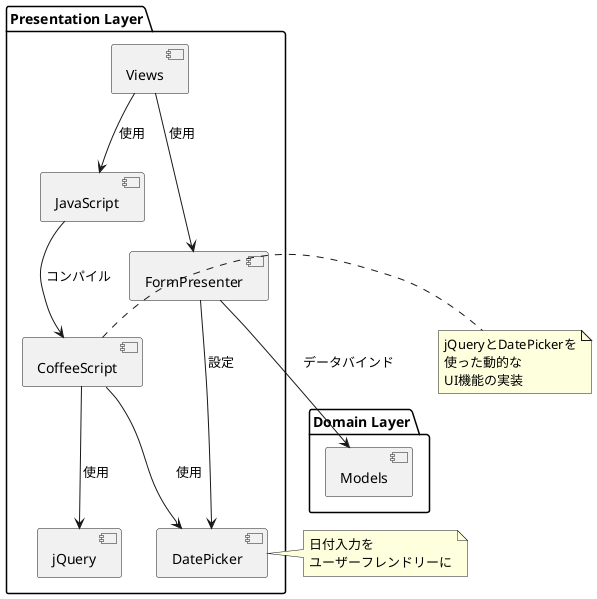
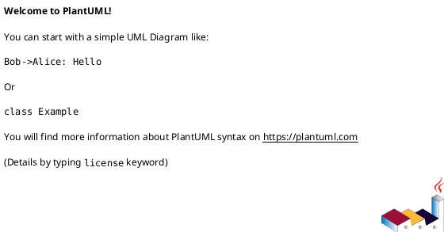

# 作業履歴 2017-02-02

## 概要

2017-02-02の作業内容をまとめています。この日は主にフロントエンド機能の強化を行いました。具体的には、jQueryとCoffeeScriptを使用したインタラクティブな機能の実装と、日付選択のためのDatepickerの導入を行いました。

### 関連ユースケース

- **S-003**: 職員アカウント情報更新 - 職員が自身のアカウント情報を更新する
- **A-003**: 職員アカウント作成 - 管理者が新規職員アカウントを作成する
- **A-004**: 職員アカウント編集 - 管理者が既存の職員アカウント情報を編集する

### システム構成上の位置づけ

この実装はプレゼンテーション層のユーザーインターフェース改善に関わる部分であり、システムアーキテクチャにおける以下の部分に関連しています：



## コミット: 1b81ab5

### メッセージ

```
jQueryとCoffeeScript #12
```

### 変更されたファイル

- M	app/views/admin/top/index.html.erb

### 変更内容

```diff
commit 1b81ab50fe6adc2c5933ec1e4c1796c9eda375fc
Author: k2works <kakimomokuri@gmail.com>
Date:   Thu Feb 2 19:22:24 2017 +0900

    jQueryとCoffeeScript #12

diff --git a/app/views/admin/top/index.html.erb b/app/views/admin/top/index.html.erb
index 42c1b9f..bf2408e 100644
--- a/app/views/admin/top/index.html.erb
+++ b/app/views/admin/top/index.html.erb
@@ -8,6 +8,10 @@
     <h2 class="sectionLabel">お知らせ</h2>
   </div>
   <ol class="NewsList">
+    <li class="NewsList__item">
+      <time class="NewsList__head" datatime="2017-2-2">2017.2.2</time>
+      <span class="NewsList__body">データピッカー機能追加</span>
+    </li>
     <li class="NewsList__item">
       <time class="NewsList__head" datatime="2017-1-31">2017.1.31</time>
       <span class="NewsList__body">職員イベント管理機能を追加</span>

```

## コミット: bd53628

### メッセージ

```
Datepickerの利用 #12
```

### 変更されたファイル

- M	Gemfile
- M	Gemfile.lock
- M	README.md
- M	app/assets/javascripts/admin.js
- M	app/assets/javascripts/customer.js
- A	app/assets/javascripts/shared/datepicker.coffee
- A	app/assets/javascripts/shared/datetimepicker.coffee
- M	app/assets/javascripts/staff.js
- M	app/assets/stylesheets/main.scss
- M	app/presenters/form_presenter.rb
- M	baukis-kai.iml

### 変更内容

```diff
commit bd53628c9cee0f3cb185ec0aa976587c2e0c6b92
Author: k2works <kakimomokuri@gmail.com>
Date:   Thu Feb 2 19:20:01 2017 +0900

    Datepickerの利用 #12

diff --git a/Gemfile b/Gemfile
index 2bd8d99..f932a45 100644
--- a/Gemfile
+++ b/Gemfile
@@ -92,3 +92,6 @@ gem 'kaminari', '~> 0.17.0'
 gem 'date_validator', '~> 0.9.0'
 gem 'email_validator', '~> 1.6'
 gem 'jquery-ui-rails', '~> 5.0', '>= 5.0.5'
+gem 'momentjs-rails'
+gem 'bootstrap3-datetimepicker-rails'
+
diff --git a/Gemfile.lock b/Gemfile.lock
index 1a540a8..ca95700 100644
--- a/Gemfile.lock
+++ b/Gemfile.lock
@@ -56,6 +56,8 @@ GEM
     bootstrap-sass (3.3.7)
       autoprefixer-rails (>= 5.2.1)
       sass (>= 3.3.4)
+    bootstrap3-datetimepicker-rails (4.17.43)
+      momentjs-rails (>= 2.8.1)
     bootstrap_form (2.5.3)
     builder (3.2.3)
     byebug (9.0.6)
@@ -168,6 +170,8 @@ GEM
     mime-types-data (3.2016.0521)
     mini_portile2 (2.1.0)
     minitest (5.10.1)
+    momentjs-rails (2.17.1)
+      railties (>= 3.1)
     multi_json (1.12.1)
     mysql2 (0.4.5)
     nenv (0.3.0)
@@ -313,6 +317,7 @@ DEPENDENCIES
   better_errors
   binding_of_caller
   bootstrap-sass (~> 3.3.6)
+  bootstrap3-datetimepicker-rails
   bootstrap_form
   byebug
   capybara (~> 2.5.0)
@@ -337,6 +342,7 @@ DEPENDENCIES
   launchy (~> 2.4.2)
   listen (~> 3.0.5)
   migration_comments
+  momentjs-rails
   mysql2 (>= 0.3.18, < 0.5)
   pg (~> 0.18)
   puma (~> 3.0)
diff --git a/README.md b/README.md
index 1dbb26d..ff0cb7d 100644
--- a/README.md
+++ b/README.md
@@ -540,6 +540,7 @@ git push heroku master

 #### Datapicker
 + 準備作業
++ Datepickerの利用

 ### 単一テーブ継承
 ### Capybara
diff --git a/app/assets/javascripts/admin.js b/app/assets/javascripts/admin.js
index a3621b1..46d0b8e 100644
--- a/app/assets/javascripts/admin.js
+++ b/app/assets/javascripts/admin.js
@@ -17,4 +17,7 @@
 //= require_tree ./shared
 //= require jquery-ui/datepicker
 //= require jquery-ui/datepicker-ja
+//= require moment
+//= require moment/ja
+//= require bootstrap-datetimepicker
 //= require_tree ./admin
diff --git a/app/assets/javascripts/customer.js b/app/assets/javascripts/customer.js
index 3745a51..2e0435d 100644
--- a/app/assets/javascripts/customer.js
+++ b/app/assets/javascripts/customer.js
@@ -15,6 +15,9 @@
 //= require turbolinks
 //= require bootstrap-sprockets
 //= require_tree ./shared
-//= require jquery-ui/datepicker
-//= require jquery-ui/datepicker-ja
+//= require moment
+//= require bootstrap-datetimepicker
+//= require moment
+//= require moment/ja
+//= require bootstrap-datetimepicker
 //= require_tree ./customer
diff --git a/app/assets/javascripts/shared/datepicker.coffee b/app/assets/javascripts/shared/datepicker.coffee
new file mode 100644
index 0000000..1e114ab
--- /dev/null
+++ b/app/assets/javascripts/shared/datepicker.coffee
@@ -0,0 +1,9 @@
+$(document).on "turbolinks:load", ->
+  do ->
+    d = new Date()
+    $.datepicker.setDefaults({
+      dateFormat: "yy-mm-dd",
+      minDate: new Date(2000, 1, 1),
+      maxDate: new Date(d.getFullYear() + 1, d.getMonth(), d.getDate() - 1)
+    })
+    $('.datepicker').datepicker()
diff --git a/app/assets/javascripts/shared/datetimepicker.coffee b/app/assets/javascripts/shared/datetimepicker.coffee
new file mode 100644
index 0000000..fc41bfe
--- /dev/null
+++ b/app/assets/javascripts/shared/datetimepicker.coffee
@@ -0,0 +1,5 @@
+$(document).on "turbolinks:load", ->
+  do ->
+    $(".datetimepicker").datetimepicker(
+      locale: 'ja'
+    )
diff --git a/app/assets/javascripts/staff.js b/app/assets/javascripts/staff.js
index f3e78e4..3d952ba 100644
--- a/app/assets/javascripts/staff.js
+++ b/app/assets/javascripts/staff.js
@@ -15,6 +15,9 @@
 //= require turbolinks
 //= require bootstrap-sprockets
 //= require_tree ./shared
-//= require jquery-ui/datepicker
-//= require jquery-ui/datepicker-ja
+//= require moment
+//= require bootstrap-datetimepicker
+//= require moment
+//= require moment/ja
+//= require bootstrap-datetimepicker
 //= require_tree ./staff
diff --git a/app/assets/stylesheets/main.scss b/app/assets/stylesheets/main.scss
index 154b8f1..c21d5c5 100644
--- a/app/assets/stylesheets/main.scss
+++ b/app/assets/stylesheets/main.scss
@@ -86,6 +86,7 @@
 //BootStrap
 @import "bootstrap-sprockets";
 @import "components/bootstrap-custom";
+@import 'bootstrap-datetimepicker';

 //jQuery
 @import "jquery-ui/datepicker";
diff --git a/app/presenters/form_presenter.rb b/app/presenters/form_presenter.rb
index 5be118f..b0527db 100644
--- a/app/presenters/form_presenter.rb
+++ b/app/presenters/form_presenter.rb
@@ -41,7 +41,13 @@ class FormPresenter
   def date_field_block(name, label_text, options = {})
     markup(:div, class: 'AppForm__input-block') do |m|
       m << decorated_label(name, label_text, options)
-      m << text_field(name, hide_label: true, class: options[:required] ? 'required' : nil)
+      if options[:class].kind_of?(String)
+        classes = options[:class].strip.split + ['datetimepicker']
+        options[:class] = classes.uniq.join(' ')
+      else
+        options[:class] = 'datetimepicker'
+      end
+      m << text_field(name, options.merge(hide_label: true))
     end
   end

diff --git a/baukis-kai.iml b/baukis-kai.iml
index eb66749..7df2722 100644
--- a/baukis-kai.iml
+++ b/baukis-kai.iml
@@ -38,6 +38,7 @@
     <orderEntry type="library" scope="PROVIDED" name="better_errors (v2.1.1, rbenv: 2.4.0) [gem]" level="application" />
     <orderEntry type="library" scope="PROVIDED" name="binding_of_caller (v0.7.2, rbenv: 2.4.0) [gem]" level="application" />
     <orderEntry type="library" scope="PROVIDED" name="bootstrap-sass (v3.3.7, rbenv: 2.4.0) [gem]" level="application" />
+    <orderEntry type="library" scope="PROVIDED" name="bootstrap3-datetimepicker-rails (v4.17.43, rbenv: 2.4.0) [gem]" level="application" />
     <orderEntry type="library" scope="PROVIDED" name="bootstrap_form (v2.5.3, rbenv: 2.4.0) [gem]" level="application" />
     <orderEntry type="library" scope="PROVIDED" name="builder (v3.2.3, rbenv: 2.4.0) [gem]" level="application" />
     <orderEntry type="library" scope="PROVIDED" name="bundler (v1.13.7, rbenv: 2.4.0) [gem]" level="application" />
@@ -94,6 +95,7 @@
     <orderEntry type="library" scope="PROVIDED" name="mime-types-data (v3.2016.0521, rbenv: 2.4.0) [gem]" level="application" />
     <orderEntry type="library" scope="PROVIDED" name="mini_portile2 (v2.1.0, rbenv: 2.4.0) [gem]" level="application" />
     <orderEntry type="library" scope="PROVIDED" name="minitest (v5.10.1, rbenv: 2.4.0) [gem]" level="application" />
+    <orderEntry type="library" scope="PROVIDED" name="momentjs-rails (v2.17.1, rbenv: 2.4.0) [gem]" level="application" />
     <orderEntry type="library" scope="PROVIDED" name="multi_json (v1.12.1, rbenv: 2.4.0) [gem]" level="application" />
     <orderEntry type="library" scope="PROVIDED" name="mysql2 (v0.4.5, rbenv: 2.4.0) [gem]" level="application" />
     <orderEntry type="library" scope="PROVIDED" name="nenv (v0.3.0, rbenv: 2.4.0) [gem]" level="application" />

```

## コミット: 041748c

### メッセージ

```
準備作業 #12
```

### 変更されたファイル

- M	Gemfile
- M	Gemfile.lock
- M	README.md
- M	app/assets/javascripts/admin.js
- M	app/assets/javascripts/customer.js
- M	app/assets/javascripts/staff.js
- M	app/assets/stylesheets/main.scss
- M	baukis-kai.iml

### 変更内容

```diff
commit 041748c7c62c72f67d739ed1df46a76adde6700b
Author: k2works <kakimomokuri@gmail.com>
Date:   Thu Feb 2 18:58:07 2017 +0900

    準備作業 #12

diff --git a/Gemfile b/Gemfile
index 3589aa0..2bd8d99 100644
--- a/Gemfile
+++ b/Gemfile
@@ -91,3 +91,4 @@ gem 'dotenv-rails'
 gem 'kaminari', '~> 0.17.0'
 gem 'date_validator', '~> 0.9.0'
 gem 'email_validator', '~> 1.6'
+gem 'jquery-ui-rails', '~> 5.0', '>= 5.0.5'
diff --git a/Gemfile.lock b/Gemfile.lock
index 5196c22..1a540a8 100644
--- a/Gemfile.lock
+++ b/Gemfile.lock
@@ -144,6 +144,8 @@ GEM
       rails-dom-testing (>= 1, < 3)
       railties (>= 4.2.0)
       thor (>= 0.14, < 2.0)
+    jquery-ui-rails (5.0.5)
+      railties (>= 3.2.16)
     json (2.0.2)
     kaminari (0.17.0)
       actionpack (>= 3.0.0)
@@ -330,6 +332,7 @@ DEPENDENCIES
   i18n_generators
   jbuilder (~> 2.5)
   jquery-rails
+  jquery-ui-rails (~> 5.0, >= 5.0.5)
   kaminari (~> 0.17.0)
   launchy (~> 2.4.2)
   listen (~> 3.0.5)
diff --git a/README.md b/README.md
index b6b811d..1dbb26d 100644
--- a/README.md
+++ b/README.md
@@ -539,6 +539,7 @@ git push heroku master
 + 入力フォームの有効・無効を切り替える

 #### Datapicker
++ 準備作業

 ### 単一テーブ継承
 ### Capybara
diff --git a/app/assets/javascripts/admin.js b/app/assets/javascripts/admin.js
index 4f525e5..a3621b1 100644
--- a/app/assets/javascripts/admin.js
+++ b/app/assets/javascripts/admin.js
@@ -15,4 +15,6 @@
 //= require turbolinks
 //= require bootstrap-sprockets
 //= require_tree ./shared
+//= require jquery-ui/datepicker
+//= require jquery-ui/datepicker-ja
 //= require_tree ./admin
diff --git a/app/assets/javascripts/customer.js b/app/assets/javascripts/customer.js
index 28299fd..3745a51 100644
--- a/app/assets/javascripts/customer.js
+++ b/app/assets/javascripts/customer.js
@@ -15,4 +15,6 @@
 //= require turbolinks
 //= require bootstrap-sprockets
 //= require_tree ./shared
+//= require jquery-ui/datepicker
+//= require jquery-ui/datepicker-ja
 //= require_tree ./customer
diff --git a/app/assets/javascripts/staff.js b/app/assets/javascripts/staff.js
index b6db3a7..f3e78e4 100644
--- a/app/assets/javascripts/staff.js
+++ b/app/assets/javascripts/staff.js
@@ -15,4 +15,6 @@
 //= require turbolinks
 //= require bootstrap-sprockets
 //= require_tree ./shared
+//= require jquery-ui/datepicker
+//= require jquery-ui/datepicker-ja
 //= require_tree ./staff
diff --git a/app/assets/stylesheets/main.scss b/app/assets/stylesheets/main.scss
index 76d692c..154b8f1 100644
--- a/app/assets/stylesheets/main.scss
+++ b/app/assets/stylesheets/main.scss
@@ -82,9 +82,13 @@

 //font-awesome
 @import "font-awesome";
+
 //BootStrap
 @import "bootstrap-sprockets";
 @import "components/bootstrap-custom";
+
+//jQuery
+@import "jquery-ui/datepicker";
 // ===========================
 // Pages
 // ===========================
diff --git a/baukis-kai.iml b/baukis-kai.iml
index 9b5fa5f..eb66749 100644
--- a/baukis-kai.iml
+++ b/baukis-kai.iml
@@ -81,6 +81,7 @@
     <orderEntry type="library" scope="PROVIDED" name="i18n_generators (v2.1.1, rbenv: 2.4.0) [gem]" level="application" />
     <orderEntry type="library" scope="PROVIDED" name="jbuilder (v2.6.1, rbenv: 2.4.0) [gem]" level="application" />
     <orderEntry type="library" scope="PROVIDED" name="jquery-rails (v4.2.2, rbenv: 2.4.0) [gem]" level="application" />
+    <orderEntry type="library" scope="PROVIDED" name="jquery-ui-rails (v5.0.5, rbenv: 2.4.0) [gem]" level="application" />
     <orderEntry type="library" scope="PROVIDED" name="kaminari (v0.17.0, rbenv: 2.4.0) [gem]" level="application" />
     <orderEntry type="library" scope="PROVIDED" name="launchy (v2.4.3, rbenv: 2.4.0) [gem]" level="application" />
     <orderEntry type="library" scope="PROVIDED" name="listen (v3.0.8, rbenv: 2.4.0) [gem]" level="application" />

```

## コミット: 90d8c4a

### メッセージ

```
入力フォームの有効・無効を切り替える #12
```

### 変更されたファイル

- M	README.md
- A	app/assets/javascripts/admin/staff_member_form.coffee
- M	app/presenters/admin/staff_member_form_presenter.rb
- M	app/views/admin/staff_members/_form.html.erb
- M	app/views/admin/staff_members/edit.html.erb

### 変更内容

```diff
commit 90d8c4a80a224cbb766f2c2e8f4bb4d9526a7006
Author: k2works <kakimomokuri@gmail.com>
Date:   Thu Feb 2 18:43:08 2017 +0900

    入力フォームの有効・無効を切り替える #12

diff --git a/README.md b/README.md
index d470c6e..b6b811d 100644
--- a/README.md
+++ b/README.md
@@ -536,6 +536,7 @@ git push heroku master
 ### jQueryとCoffeeScript
 #### jQueryとCoffeeScript
 + 準備作業
++ 入力フォームの有効・無効を切り替える

 #### Datapicker

diff --git a/app/assets/javascripts/admin/staff_member_form.coffee b/app/assets/javascripts/admin/staff_member_form.coffee
new file mode 100644
index 0000000..52b4456
--- /dev/null
+++ b/app/assets/javascripts/admin/staff_member_form.coffee
@@ -0,0 +1,22 @@
+$(document).on "turbolinks:load", ->
+  do ->
+    new StaffMemberForm
+
+class StaffMemberForm
+  constructor: ->
+    $('#enable-password-field').on
+      'click': handlePasswordInputFieldOn
+    $('#disable-password-field').on
+      'click': handlePasswordInputFieldOff
+
+  handlePasswordInputFieldOn = ->
+    $('#enable-password-field').hide()
+    $('#disable-password-field').show()
+    $('#staff_member_password').removeAttr('disabled')
+    $('label[for=staff_member_password]').addClass('required')
+
+  handlePasswordInputFieldOff = ->
+    $('#disable-password-field').hide()
+    $('#enable-password-field').show()
+    $('#staff_member_password').attr('disabled','disabled')
+    $('label[for=staff_member_password]').removeClass('required')
diff --git a/app/presenters/admin/staff_member_form_presenter.rb b/app/presenters/admin/staff_member_form_presenter.rb
index b5b7ac6..62b43d3 100644
--- a/app/presenters/admin/staff_member_form_presenter.rb
+++ b/app/presenters/admin/staff_member_form_presenter.rb
@@ -2,6 +2,13 @@ class Admin::StaffMemberFormPresenter < FormPresenter
   def password_field_block(name, label_text, options = {})
     if object.new_record?
       super(name, label_text,options)
+    else
+      markup(:div, class: 'AppForm__input-block') do |m|
+        m << decorated_label(name, label_text, options.merge(required: false))
+        m << password_field(name, options.merge(disabled: true).merge(hide_label: true))
+        m.button('変更する',type: 'button', id: 'enable-password-field', class: 'btn btn-warning btn-xs')
+        m.button('変更しない', type: 'button', id: 'disable-password-field',style: 'display: none', class: 'btn btn-primary btn-xs')
+      end
     end
   end

diff --git a/app/views/admin/staff_members/_form.html.erb b/app/views/admin/staff_members/_form.html.erb
index 2570e2b..9601706 100644
--- a/app/views/admin/staff_members/_form.html.erb
+++ b/app/views/admin/staff_members/_form.html.erb
@@ -3,7 +3,7 @@
   m << p.notes
   p.with_options(required: true) do |q|
     m << p.text_field_block(:email, t('activerecord.attributes.staff_member.email'),size:32)
-    m << p.password_field_block(:pasword,t('activerecord.attributes.staff_member.hashed_password'),size: 32)
+    m << p.password_field_block(:password,t('activerecord.attributes.staff_member.hashed_password'),size: 32)
     m << p.full_name_block(:family_name, :given_name, t('activerecord.attributes.staff_member.full_name'))
     m << p.full_name_block(:family_name_kana, :given_name_kana, t('activerecord.attributes.staff_member.full_name_kana'))
     m << p.date_field_block(:start_date,t('activerecord.attributes.staff_member.start_date'))
diff --git a/app/views/admin/staff_members/edit.html.erb b/app/views/admin/staff_members/edit.html.erb
index 42104a8..3dedba9 100644
--- a/app/views/admin/staff_members/edit.html.erb
+++ b/app/views/admin/staff_members/edit.html.erb
@@ -8,8 +8,8 @@
     <%= bootstrap_form_for [ :admin, @staff_member ] do |f| %>
         <%= render 'form', f: f %>
         <div class="AppForm__buttons">
-          <%= f.submit t('.update') %>
-          <%= link_to t('.cancel'), :admin_staff_members %>
+          <%= f.submit t('.update'),class: 'btn btn-default btn-lg' %>
+          <%= link_to t('.cancel'), :admin_staff_members,class: 'btn btn-default btn-lg' %>
         </div>
     <% end %>
   </div>

```

## コミット: 0dbe85e

### メッセージ

```
準備作業 #12
```

### 変更されたファイル

- M	README.md
- A	app/assets/javascripts/admin/.keep
- A	app/assets/javascripts/customer.js
- A	app/assets/javascripts/customer/.keep
- A	app/assets/javascripts/shared/.keep
- A	app/assets/javascripts/staff.js
- A	app/assets/javascripts/staff/.keep
- M	app/views/layouts/admin.html.erb
- M	app/views/layouts/customer.html.erb
- M	app/views/layouts/staff.html.erb
- M	config/initializers/assets.rb

### 変更内容

```diff
commit 0dbe85e0ae96e6eed158d6dd9b6111036aa45b9a
Author: k2works <kakimomokuri@gmail.com>
Date:   Thu Feb 2 17:24:28 2017 +0900

    準備作業 #12

diff --git a/README.md b/README.md
index b136562..d470c6e 100644
--- a/README.md
+++ b/README.md
@@ -535,6 +535,8 @@ git push heroku master

 ### jQueryとCoffeeScript
 #### jQueryとCoffeeScript
++ 準備作業
+
 #### Datapicker

 ### 単一テーブ継承
diff --git a/app/assets/javascripts/application.js b/app/assets/javascripts/admin.js
similarity index 93%
rename from app/assets/javascripts/application.js
rename to app/assets/javascripts/admin.js
index 759d92e..4f525e5 100644
--- a/app/assets/javascripts/application.js
+++ b/app/assets/javascripts/admin.js
@@ -14,4 +14,5 @@
 //= require jquery_ujs
 //= require turbolinks
 //= require bootstrap-sprockets
-//= require_tree .
+//= require_tree ./shared
+//= require_tree ./admin
diff --git a/app/assets/javascripts/admin/.keep b/app/assets/javascripts/admin/.keep
new file mode 100644
index 0000000..e69de29
diff --git a/app/assets/javascripts/customer.js b/app/assets/javascripts/customer.js
new file mode 100644
index 0000000..28299fd
--- /dev/null
+++ b/app/assets/javascripts/customer.js
@@ -0,0 +1,18 @@
+// This is a manifest file that'll be compiled into application.js, which will include all the files
+// listed below.
+//
+// Any JavaScript/Coffee file within this directory, lib/assets/javascripts, vendor/assets/javascripts,
+// or any plugin's vendor/assets/javascripts directory can be referenced here using a relative path.
+//
+// It's not advisable to add code directly here, but if you do, it'll appear at the bottom of the
+// compiled file. JavaScript code in this file should be added after the last require_* statement.
+//
+// Read Sprockets README (https://github.com/rails/sprockets#sprockets-directives) for details
+// about supported directives.
+//
+//= require jquery
+//= require jquery_ujs
+//= require turbolinks
+//= require bootstrap-sprockets
+//= require_tree ./shared
+//= require_tree ./customer
diff --git a/app/assets/javascripts/customer/.keep b/app/assets/javascripts/customer/.keep
new file mode 100644
index 0000000..e69de29
diff --git a/app/assets/javascripts/shared/.keep b/app/assets/javascripts/shared/.keep
new file mode 100644
index 0000000..e69de29
diff --git a/app/assets/javascripts/staff.js b/app/assets/javascripts/staff.js
new file mode 100644
index 0000000..b6db3a7
--- /dev/null
+++ b/app/assets/javascripts/staff.js
@@ -0,0 +1,18 @@
+// This is a manifest file that'll be compiled into application.js, which will include all the files
+// listed below.
+//
+// Any JavaScript/Coffee file within this directory, lib/assets/javascripts, vendor/assets/javascripts,
+// or any plugin's vendor/assets/javascripts directory can be referenced here using a relative path.
+//
+// It's not advisable to add code directly here, but if you do, it'll appear at the bottom of the
+// compiled file. JavaScript code in this file should be added after the last require_* statement.
+//
+// Read Sprockets README (https://github.com/rails/sprockets#sprockets-directives) for details
+// about supported directives.
+//
+//= require jquery
+//= require jquery_ujs
+//= require turbolinks
+//= require bootstrap-sprockets
+//= require_tree ./shared
+//= require_tree ./staff
diff --git a/app/assets/javascripts/staff/.keep b/app/assets/javascripts/staff/.keep
new file mode 100644
index 0000000..e69de29
diff --git a/app/views/layouts/admin.html.erb b/app/views/layouts/admin.html.erb
index 9ca8f85..88d2bab 100644
--- a/app/views/layouts/admin.html.erb
+++ b/app/views/layouts/admin.html.erb
@@ -5,6 +5,8 @@
   <meta name="description" content="">
   <meta name="viewport" content="width=device-width, initial-scale=1">
   <title><%= document_title %></title>
+  <%= stylesheet_link_tag    'application', media: 'all', 'data-turbolinks-track': 'reload' %>
+  <%= javascript_include_tag 'admin', 'data-turbolinks-track': 'reload' %>
   <%= csrf_meta_tags %>
 </head>

@@ -15,8 +17,6 @@
   <%= yield %>
   <%= render 'admin/shared/footer' %>
 </div>
-<%= stylesheet_link_tag    'application', media: 'all', 'data-turbolinks-track': 'reload' %>
-<%= javascript_include_tag 'application', 'data-turbolinks-track': 'reload' %>
 <script>
     imageSlide('Slide', 2);
 </script>
diff --git a/app/views/layouts/customer.html.erb b/app/views/layouts/customer.html.erb
index a1a4f25..404c4c2 100644
--- a/app/views/layouts/customer.html.erb
+++ b/app/views/layouts/customer.html.erb
@@ -5,6 +5,8 @@
   <meta name="description" content="">
   <meta name="viewport" content="width=device-width, initial-scale=1">
   <title><%= document_title %></title>
+  <%= stylesheet_link_tag    'application', media: 'all', 'data-turbolinks-track': 'reload' %>
+  <%= javascript_include_tag 'customer', 'data-turbolinks-track': 'reload' %>
   <%= csrf_meta_tags %>
 </head>

@@ -15,8 +17,6 @@
   <%= yield %>
   <%= render 'customer/shared/footer' %>
 </div>
-<%= stylesheet_link_tag    'application', media: 'all', 'data-turbolinks-track': 'reload' %>
-<%= javascript_include_tag 'application', 'data-turbolinks-track': 'reload' %>
 <script>
     imageSlide('Slide', 2);
 </script>
diff --git a/app/views/layouts/staff.html.erb b/app/views/layouts/staff.html.erb
index 39f318f..a354967 100644
--- a/app/views/layouts/staff.html.erb
+++ b/app/views/layouts/staff.html.erb
@@ -5,6 +5,8 @@
   <meta name="description" content="">
   <meta name="viewport" content="width=device-width, initial-scale=1">
   <title><%= document_title %></title>
+  <%= stylesheet_link_tag    'application', media: 'all', 'data-turbolinks-track': 'reload' %>
+  <%= javascript_include_tag 'staff', 'data-turbolinks-track': 'reload' %>
   <%= csrf_meta_tags %>
 </head>

@@ -15,8 +17,6 @@
   <%= yield %>
   <%= render 'staff/shared/footer' %>
 </div>
-<%= stylesheet_link_tag    'application', media: 'all', 'data-turbolinks-track': 'reload' %>
-<%= javascript_include_tag 'application', 'data-turbolinks-track': 'reload' %>
 <script>
     imageSlide('Slide', 2);
 </script>
diff --git a/config/initializers/assets.rb b/config/initializers/assets.rb
index ac8c972..87e894e 100644
--- a/config/initializers/assets.rb
+++ b/config/initializers/assets.rb
@@ -8,5 +8,5 @@ Rails.application.config.assets.version = '1.0'

 # Precompile additional assets.
 # application.js, application.css, and all non-JS/CSS in app/assets folder are already added.
-# Rails.application.config.assets.precompile += %w( staff.css )
+Rails.application.config.assets.precompile += %w( staff.js admin.js customer.js )
 Rails.application.config.assets.paths << Rails.root.join("app", "assets", "fonts")

```

## コミット: cc53d9f

### メッセージ

```
jQueryとCoffeeScript #12
```

### 変更されたファイル

- M	README.md

### 変更内容

```diff
commit cc53d9f4c2b44ef9da87d34062df0e51426f331d
Author: k2works <kakimomokuri@gmail.com>
Date:   Thu Feb 2 17:10:54 2017 +0900

    jQueryとCoffeeScript #12

diff --git a/README.md b/README.md
index 76d9886..b136562 100644
--- a/README.md
+++ b/README.md
@@ -534,6 +534,9 @@ git push heroku master
 #### 演習問題

 ### jQueryとCoffeeScript
+#### jQueryとCoffeeScript
+#### Datapicker
+
 ### 単一テーブ継承
 ### Capybara
 ### フォームオブジェクト

```

## コミット: ee6aace

### メッセージ

```
演習問題 #11
```

### 変更されたファイル

- M	app/presenters/admin/staff_member_presenter.rb
- M	app/views/admin/staff_members/index.html.erb

### 変更内容

```diff
commit ee6aace66dab0fded84d02783a5f45270bb43c2c
Author: k2works <kakimomokuri@gmail.com>
Date:   Thu Feb 2 17:04:24 2017 +0900

    演習問題 #11

diff --git a/app/presenters/admin/staff_member_presenter.rb b/app/presenters/admin/staff_member_presenter.rb
index 0cf37c8..1e69aa9 100644
--- a/app/presenters/admin/staff_member_presenter.rb
+++ b/app/presenters/admin/staff_member_presenter.rb
@@ -1,6 +1,14 @@
 class Admin::StaffMemberPresenter < ModelPresenter
   delegate :suspended?, to: :object

+  def full_name
+    object.family_name + ' ' + object.given_name
+  end
+
+  def full_name_kana
+    object.family_name_kana + ' ' + object.given_name_kana
+  end
+
   def suspended_mark
     suspended? ? raw('&#x2611;') : raw('&#x2610;')
   end
diff --git a/app/views/admin/staff_members/index.html.erb b/app/views/admin/staff_members/index.html.erb
index 95ee317..f3668b6 100644
--- a/app/views/admin/staff_members/index.html.erb
+++ b/app/views/admin/staff_members/index.html.erb
@@ -23,8 +23,8 @@
     <% @staff_members.each do |m| %>
         <% p = Admin::StaffMemberPresenter.new(m, self) %>
         <tr  class="Table__tr">
-          <td class="Table__td"><%= m.family_name %> <%= m.given_name %></td>
-          <td class="Table__td"><%= m.family_name_kana %> <%= m.given_name_kana %></td>
+          <td><%= p.full_name %></td>
+          <td><%= p.full_name_kana %></td>
           <td class="Table__td Table__td--email"><%= m.email %></td>
           <td class="Table__td Table__td--date Table__td--center"><%= m.start_date %></td>
           <td class="Table__td Table__td--date Table__td--center"><%= m.end_date %></td>

```

## コミット: 4b1c3dd

### メッセージ

```
パスワード変更フォームの改良 #11
```

### 変更されたファイル

- M	README.md
- M	app/views/staff/passwords/edit.html.erb

### 変更内容

```diff
commit 4b1c3dd047a88e81c441e42077619120ed8dca4a
Author: k2works <kakimomokuri@gmail.com>
Date:   Thu Feb 2 16:57:43 2017 +0900

    パスワード変更フォームの改良 #11

diff --git a/README.md b/README.md
index 6602d07..76d9886 100644
--- a/README.md
+++ b/README.md
@@ -529,6 +529,7 @@ git push heroku master
 + Errorsオブジェクト
 + エラーメッセージの設定
 + エラーメッセージの生成
++ パスワード変更フォームの改良

 #### 演習問題

diff --git a/app/views/staff/passwords/edit.html.erb b/app/views/staff/passwords/edit.html.erb
index 2679676..456ad56 100644
--- a/app/views/staff/passwords/edit.html.erb
+++ b/app/views/staff/passwords/edit.html.erb
@@ -6,15 +6,14 @@
 <section class="Section l-column AppForm">
   <div class="AppForm__generic-form StaffAppForm__generic-form">
     <%= bootstrap_form_for @change_password_form, url: :staff_password, method: :patch do |f| %>
-        <div>
-          <%= f.password_field :current_password, size: 32, require: true %>
-        </div>
-        <div>
-          <%= f.password_field :new_password, size: 32, require: true %>
-        </div>
-        <div>
-          <%= f.password_field :new_password_confirmation, size: 32, require: true %>
-        </div>
+        <%= markup do |m|
+          p = FormPresenter.new(f, self)
+          p.with_options(required: true, size: 32) do |q|
+            m << p.password_field_block(:current_password, t('activemodel.attributes.staff/change_password_form.current_password'))
+            m << p.password_field_block(:new_password, t('activemodel.attributes.staff/change_password_form.new_password'))
+            m << p.password_field_block(:new_password_confirmation, t('activemodel.attributes.staff/change_password_form.new_password_confirmation'))
+          end
+        end %>
         <div class="AppForm__buttons">
           <%= f.submit t('.submit'),class: 'btn btn-default btn-lg' %>
           <%= link_to t('.cancel'), :staff_account, class: 'btn btn-default btn-lg' %>

```

## コミット: c2f6333

### メッセージ

```
エラーメッセージの生成 #11
```

### 変更されたファイル

- M	README.md
- M	app/presenters/form_presenter.rb

### 変更内容

```diff
commit c2f6333b7eb18ab005e0a8ced6a85eb44c7c459c
Author: k2works <kakimomokuri@gmail.com>
Date:   Thu Feb 2 16:42:34 2017 +0900

    エラーメッセージの生成 #11

diff --git a/README.md b/README.md
index de1f145..6602d07 100644
--- a/README.md
+++ b/README.md
@@ -528,6 +528,7 @@ git push heroku master
 #### 入力エラーメッセージの生成
 + Errorsオブジェクト
 + エラーメッセージの設定
++ エラーメッセージの生成

 #### 演習問題

diff --git a/app/presenters/form_presenter.rb b/app/presenters/form_presenter.rb
index 016f17d..5be118f 100644
--- a/app/presenters/form_presenter.rb
+++ b/app/presenters/form_presenter.rb
@@ -45,6 +45,16 @@ class FormPresenter
     end
   end

+  def error_message_for(name)
+    markup do |m|
+      object.errors.full_messages_for(name).each do |message|
+        m.div(class: 'error-message') do |m|
+          m.text message
+        end
+      end
+    end
+  end
+
   private
   def decorated_label(name, label_text, options)
     label(name, label_text, class: options[:required] ? 'AppForm__label required' : 'AppForm__label')

```

## コミット: f257ae4

### メッセージ

```
エラーメッセージの設定 #11
```

### 変更されたファイル

- M	README.md
- M	config/locales/models/ja.yml

### 変更内容

```diff
commit f257ae43daee5206bcaeee68e1ce7b63dc8ae23a
Author: k2works <kakimomokuri@gmail.com>
Date:   Thu Feb 2 16:34:32 2017 +0900

    エラーメッセージの設定 #11

diff --git a/README.md b/README.md
index c6c0977..de1f145 100644
--- a/README.md
+++ b/README.md
@@ -526,6 +526,9 @@ git push heroku master
 + さらなる改善

 #### 入力エラーメッセージの生成
++ Errorsオブジェクト
++ エラーメッセージの設定
+
 #### 演習問題

 ### jQueryとCoffeeScript
diff --git a/config/locales/models/ja.yml b/config/locales/models/ja.yml
index 59e82a2..9f4947d 100644
--- a/config/locales/models/ja.yml
+++ b/config/locales/models/ja.yml
@@ -35,6 +35,20 @@ ja:
           logged_out: ログアウト
           rejected: ログイン拒否

+    errors:
+      models:
+        staff_member:
+          attributes:
+            email:
+              taken: が他の職員と重複しています
+              start_date:
+                after_or_equal_to: には2000年1月1日以降の日付を指定してください。
+                before: には1年後の日付より前の日付を指定してください。
+              end_date:
+                after_or_equal_to: には2000年1月1日以降の日付を指定してください。
+                before: には1年後の日付より前の日付を指定してください。
+                after: には開始日より後の日付を指定してください。
+
   activemodel:
     models:
       staff/login_form: 職員ログインフォーム

```

## コミット: cc1cd71

### メッセージ

```
さらなる改善 #11
```

### 変更されたファイル

- M	README.md
- M	app/helpers/application_helper.rb
- M	app/presenters/admin/staff_member_form_presenter.rb
- M	app/presenters/form_presenter.rb
- M	app/views/admin/staff_members/_form.html.erb

### 変更内容

```diff
commit cc1cd71e0e5fb528aea9bf42d822887d295dbf59
Author: k2works <kakimomokuri@gmail.com>
Date:   Thu Feb 2 16:24:15 2017 +0900

    さらなる改善 #11

diff --git a/README.md b/README.md
index edc601b..c6c0977 100644
--- a/README.md
+++ b/README.md
@@ -523,6 +523,7 @@ git push heroku master
 + 問題の所在
 + FormPresenterクラスの定義
 + フォームプレゼンターの利用
++ さらなる改善

 #### 入力エラーメッセージの生成
 #### 演習問題
diff --git a/app/helpers/application_helper.rb b/app/helpers/application_helper.rb
index b4a86ef..fcd0f75 100644
--- a/app/helpers/application_helper.rb
+++ b/app/helpers/application_helper.rb
@@ -1,4 +1,6 @@
 module ApplicationHelper
+  include HtmlBuilder
+
   def document_title
     if @title.present?
       "#{@title} - BaukisKai"
diff --git a/app/presenters/admin/staff_member_form_presenter.rb b/app/presenters/admin/staff_member_form_presenter.rb
index 58cff48..b5b7ac6 100644
--- a/app/presenters/admin/staff_member_form_presenter.rb
+++ b/app/presenters/admin/staff_member_form_presenter.rb
@@ -7,7 +7,7 @@ class Admin::StaffMemberFormPresenter < FormPresenter

   def full_name_block(name1, name2, label_text, options = {})
     markup(:dvi,class: 'AppForm__input-block') do |m|
-      m << label(name1, label_text ,class: options[:required] ? 'AppForm__label required' : 'AppForm__label')
+      m << decorated_label(name1, label_text, options)
       m << text_field(name1, hide_label: true, class: options[:required] ? 'required' : nil)
       m << text_field(name2, hide_label: true, class: options[:required] ? 'required' : nil)
     end
diff --git a/app/presenters/form_presenter.rb b/app/presenters/form_presenter.rb
index a3295ca..016f17d 100644
--- a/app/presenters/form_presenter.rb
+++ b/app/presenters/form_presenter.rb
@@ -26,22 +26,28 @@ class FormPresenter

   def text_field_block(name, label_text, options = {})
     markup(:div, class: 'AppForm__input-block') do |m|
-      m << label(name, label_text,class: options[:required] ? 'AppForm__label required' : 'AppForm__label')
+      m << decorated_label(name, label_text, options)
       m << text_field(name, hide_label: true, class: options[:required] ? 'required' : nil)
     end
   end

   def password_field_block(name, label_text, options = {})
     markup(:div, class: 'AppForm__input-block') do |m|
-      m << label(name, label_text, class: options[:required] ? 'AppForm__label required' : 'AppForm__label')
+      m << decorated_label(name, label_text, options)
       m << password_field(name, hide_label: true, class: options[:required] ? 'required' : nil)
     end
   end

   def date_field_block(name, label_text, options = {})
     markup(:div, class: 'AppForm__input-block') do |m|
-      m << label(name, label_text,class: options[:required] ? 'AppForm__label required' : 'AppForm__label')
+      m << decorated_label(name, label_text, options)
       m << text_field(name, hide_label: true, class: options[:required] ? 'required' : nil)
     end
   end
+
+  private
+  def decorated_label(name, label_text, options)
+    label(name, label_text, class: options[:required] ? 'AppForm__label required' : 'AppForm__label')
+  end
+
 end
\ No newline at end of file
diff --git a/app/views/admin/staff_members/_form.html.erb b/app/views/admin/staff_members/_form.html.erb
index c7e8c09..2570e2b 100644
--- a/app/views/admin/staff_members/_form.html.erb
+++ b/app/views/admin/staff_members/_form.html.erb
@@ -1,9 +1,13 @@
-<% p = Admin::StaffMemberFormPresenter.new(f, self) %>
-<%= p.notes %>
-<%= p.text_field_block(:email, t('activerecord.attributes.staff_member.email'),size:32,required: true) %>
-<%= p.password_field_block(:pasword,t('activerecord.attributes.staff_member.hashed_password'),size: 32, required: true) %>
-<%= p.full_name_block(:family_name, :given_name, t('activerecord.attributes.staff_member.full_name'), {required: true}) %>
-<%= p.full_name_block(:family_name_kana, :given_name_kana, t('activerecord.attributes.staff_member.full_name_kana'), {required: true}) %>
-<%= p.date_field_block(:start_date,t('activerecord.attributes.staff_member.start_date'),required: true) %>
-<%= p.date_field_block(:end_date,t('activerecord.attributes.staff_member.end_date') ) %>
-<%= p.check_boxes %>
\ No newline at end of file
+<%= markup do |m|
+  p = Admin::StaffMemberFormPresenter.new(f, self)
+  m << p.notes
+  p.with_options(required: true) do |q|
+    m << p.text_field_block(:email, t('activerecord.attributes.staff_member.email'),size:32)
+    m << p.password_field_block(:pasword,t('activerecord.attributes.staff_member.hashed_password'),size: 32)
+    m << p.full_name_block(:family_name, :given_name, t('activerecord.attributes.staff_member.full_name'))
+    m << p.full_name_block(:family_name_kana, :given_name_kana, t('activerecord.attributes.staff_member.full_name_kana'))
+    m << p.date_field_block(:start_date,t('activerecord.attributes.staff_member.start_date'))
+    m << p.date_field_block(:end_date,t('activerecord.attributes.staff_member.end_date'),required: false)
+  end
+  m << p.check_boxes
+end %>
\ No newline at end of file

```

## コミット: 7a01480

### メッセージ

```
フォームプレゼンターの利用 #11
```

### 変更されたファイル

- M	README.md
- M	app/assets/stylesheets/components/_appForm.scss
- A	app/presenters/admin/staff_member_form_presenter.rb
- M	app/presenters/form_presenter.rb
- M	app/views/admin/staff_members/_form.html.erb
- M	config/locales/models/ja.yml

### 変更内容

```diff
commit 7a01480a80dc1b700ba93ed0a46465972de29840
Author: k2works <kakimomokuri@gmail.com>
Date:   Thu Feb 2 16:10:34 2017 +0900

    フォームプレゼンターの利用 #11

diff --git a/README.md b/README.md
index 5118a64..edc601b 100644
--- a/README.md
+++ b/README.md
@@ -522,6 +522,7 @@ git push heroku master
 #### フォームプレゼンター
 + 問題の所在
 + FormPresenterクラスの定義
++ フォームプレゼンターの利用

 #### 入力エラーメッセージの生成
 #### 演習問題
diff --git a/app/assets/stylesheets/components/_appForm.scss b/app/assets/stylesheets/components/_appForm.scss
index 98aa757..a148bf7 100644
--- a/app/assets/stylesheets/components/_appForm.scss
+++ b/app/assets/stylesheets/components/_appForm.scss
@@ -43,4 +43,7 @@
     label { color: $red }
     input { background-color: $pink }
   }
+  &__input-block {
+    input { margin-right: $narrow * 2; }
+  }
 }
\ No newline at end of file
diff --git a/app/presenters/admin/staff_member_form_presenter.rb b/app/presenters/admin/staff_member_form_presenter.rb
new file mode 100644
index 0000000..58cff48
--- /dev/null
+++ b/app/presenters/admin/staff_member_form_presenter.rb
@@ -0,0 +1,22 @@
+class Admin::StaffMemberFormPresenter < FormPresenter
+  def password_field_block(name, label_text, options = {})
+    if object.new_record?
+      super(name, label_text,options)
+    end
+  end
+
+  def full_name_block(name1, name2, label_text, options = {})
+    markup(:dvi,class: 'AppForm__input-block') do |m|
+      m << label(name1, label_text ,class: options[:required] ? 'AppForm__label required' : 'AppForm__label')
+      m << text_field(name1, hide_label: true, class: options[:required] ? 'required' : nil)
+      m << text_field(name2, hide_label: true, class: options[:required] ? 'required' : nil)
+    end
+  end
+
+  def check_boxes
+    markup(:div, class: 'AppForm__input-block') do |m|
+      m << label(:suspended, I18n.t('activerecord.attributes.staff_member.suspended_on'))
+      m << check_box(:suspended)
+    end
+  end
+end
\ No newline at end of file
diff --git a/app/presenters/form_presenter.rb b/app/presenters/form_presenter.rb
index d9b7985..a3295ca 100644
--- a/app/presenters/form_presenter.rb
+++ b/app/presenters/form_presenter.rb
@@ -16,4 +16,32 @@ class FormPresenter
     @form_builder = form_builder
     @view_context = view_context
   end
+
+  def notes
+    markup(:div, class: 'AppForm__notes') do |m|
+      m.span '*', class: 'AppForm__notes--mark'
+      m.text '印の付いた項目は入力必須です。'
+    end
+  end
+
+  def text_field_block(name, label_text, options = {})
+    markup(:div, class: 'AppForm__input-block') do |m|
+      m << label(name, label_text,class: options[:required] ? 'AppForm__label required' : 'AppForm__label')
+      m << text_field(name, hide_label: true, class: options[:required] ? 'required' : nil)
+    end
+  end
+
+  def password_field_block(name, label_text, options = {})
+    markup(:div, class: 'AppForm__input-block') do |m|
+      m << label(name, label_text, class: options[:required] ? 'AppForm__label required' : 'AppForm__label')
+      m << password_field(name, hide_label: true, class: options[:required] ? 'required' : nil)
+    end
+  end
+
+  def date_field_block(name, label_text, options = {})
+    markup(:div, class: 'AppForm__input-block') do |m|
+      m << label(name, label_text,class: options[:required] ? 'AppForm__label required' : 'AppForm__label')
+      m << text_field(name, hide_label: true, class: options[:required] ? 'required' : nil)
+    end
+  end
 end
\ No newline at end of file
diff --git a/app/views/admin/staff_members/_form.html.erb b/app/views/admin/staff_members/_form.html.erb
index 0bc4fc4..c7e8c09 100644
--- a/app/views/admin/staff_members/_form.html.erb
+++ b/app/views/admin/staff_members/_form.html.erb
@@ -1,35 +1,9 @@
-<div class="AppForm__notes">
-  <span class="AppForm__notes--mark">*</span>印の付いた項目は入力必須です。
-</div>
-<div>
-  <%= f.label :email, t('activerecord.attributes.staff_member.email'), class: 'AppForm__label required' %>
-  <%= f.text_field :email, hide_label: true, size: 32, required: true %>
-</div>
-<% if f.object.new_record? %>
-<div>
-  <%= f.label :password, t('activerecord.attributes.staff_member.hashed_password'), class: 'AppForm__label required' %>
-  <%= f.password_field :password, hide_label: true, size:32, required: true %>
-</div>
-<% end %>
-<div>
-  <%= f.label :family_name, '氏名', class: 'required' %>
-  <%= f.text_field :family_name, hide_label: true, required: true %>
-  <%= f.text_field :given_name, hide_label: true, required: true %>
-</div>
-<div>
-  <%= f.label :family_name_kana, 'フリガナ', class: 'required' %>
-  <%= f.text_field :family_name_kana, hide_label: true, required: true %>
-  <%= f.text_field :given_name_kana, hide_label: true, required: true %>
-</div>
-<div>
-  <%= f.label :start_date, t('activerecord.attributes.staff_member.start_date'), class: 'AppForm__label required' %>
-  <%= f.text_field :start_date, hide_label: true, required: true %>
-</div>
-<div>
-  <%= f.label :end_date, t('activerecord.attributes.staff_member.end_date') %>
-  <%= f.text_field :end_date ,hide_label: true %>
-</div>
-<div class="check-box">
-  <%= f.label :suspended, 'アカウント停止' %>
-  <%= f.check_box :suspended ,hide_label: true %>
-</div>
\ No newline at end of file
+<% p = Admin::StaffMemberFormPresenter.new(f, self) %>
+<%= p.notes %>
+<%= p.text_field_block(:email, t('activerecord.attributes.staff_member.email'),size:32,required: true) %>
+<%= p.password_field_block(:pasword,t('activerecord.attributes.staff_member.hashed_password'),size: 32, required: true) %>
+<%= p.full_name_block(:family_name, :given_name, t('activerecord.attributes.staff_member.full_name'), {required: true}) %>
+<%= p.full_name_block(:family_name_kana, :given_name_kana, t('activerecord.attributes.staff_member.full_name_kana'), {required: true}) %>
+<%= p.date_field_block(:start_date,t('activerecord.attributes.staff_member.start_date'),required: true) %>
+<%= p.date_field_block(:end_date,t('activerecord.attributes.staff_member.end_date') ) %>
+<%= p.check_boxes %>
\ No newline at end of file
diff --git a/config/locales/models/ja.yml b/config/locales/models/ja.yml
index 77f47da..59e82a2 100644
--- a/config/locales/models/ja.yml
+++ b/config/locales/models/ja.yml
@@ -23,6 +23,9 @@ ja:
         hashed_password: パスワード
         start_date: 開始日
         suspended: 停止フラグ
+        full_name: 氏名
+        full_name_kana: フリガナ
+        suspended_on: アカウント停止

       staff_event:
         member: 職員レコードへの外部キー

```

## コミット: e5b5023

### メッセージ

```
FormPresenterクラスの定義 #11
```

### 変更されたファイル

- M	README.md
- A	app/presenters/form_presenter.rb
- M	app/presenters/model_presenter.rb

### 変更内容

```diff
commit e5b50232fac6eaaa6fd74baa19cccf076af3e544
Author: k2works <kakimomokuri@gmail.com>
Date:   Thu Feb 2 14:53:12 2017 +0900

    FormPresenterクラスの定義 #11

diff --git a/README.md b/README.md
index dab8f6f..5118a64 100644
--- a/README.md
+++ b/README.md
@@ -520,6 +520,9 @@ git push heroku master
 + StaffEventPresenter

 #### フォームプレゼンター
++ 問題の所在
++ FormPresenterクラスの定義
+
 #### 入力エラーメッセージの生成
 #### 演習問題

diff --git a/app/presenters/form_presenter.rb b/app/presenters/form_presenter.rb
new file mode 100644
index 0000000..d9b7985
--- /dev/null
+++ b/app/presenters/form_presenter.rb
@@ -0,0 +1,19 @@
+class FormPresenter
+  include HtmlBuilder
+
+  attr_reader :form_builder,
+              :view_context
+
+  delegate :label,
+           :text_field,
+           :password_field,
+           :check_box,
+           :radio_button,
+           :text_area,
+           :object, to: :form_builder
+
+  def initialize(form_builder, view_context)
+    @form_builder = form_builder
+    @view_context = view_context
+  end
+end
\ No newline at end of file
diff --git a/app/presenters/model_presenter.rb b/app/presenters/model_presenter.rb
index cd210db..d347ed8 100644
--- a/app/presenters/model_presenter.rb
+++ b/app/presenters/model_presenter.rb
@@ -1,8 +1,11 @@
 class ModelPresenter
   include HtmlBuilder

-  attr_reader :object, :view_context
-  delegate :raw, :link_to, to: :view_context
+  attr_reader :object,
+              :view_context
+
+  delegate :raw,
+           :link_to, to: :view_context

   def initialize(object, view_context)
     @object = object

```

### 構造変更



## コミット: 3320ce2

### メッセージ

```
StaffEventPresenter #11
```

### 変更されたファイル

- M	README.md
- M	app/lib/html_builder.rb
- A	app/presenters/admin/staff_event_presenter.rb
- M	app/presenters/model_presenter.rb
- D	app/views/admin/staff_events/_event.html.erb
- M	app/views/admin/staff_events/index.html.erb

### 変更内容

```diff
commit 3320ce26873b13d2fbf1af0e3dd12490ba7d1967
Author: k2works <kakimomokuri@gmail.com>
Date:   Thu Feb 2 14:45:17 2017 +0900

    StaffEventPresenter #11

diff --git a/README.md b/README.md
index 3fdcfcd..dab8f6f 100644
--- a/README.md
+++ b/README.md
@@ -516,6 +516,8 @@ git push heroku master
 #### HtmlBuilder
 + 問題の所在
 + HtmlBuilderモジュールの作成
++ markupメソッドの使用法
++ StaffEventPresenter

 #### フォームプレゼンター
 #### 入力エラーメッセージの生成
diff --git a/app/lib/html_builder.rb b/app/lib/html_builder.rb
index f543de3..2ee4a86 100644
--- a/app/lib/html_builder.rb
+++ b/app/lib/html_builder.rb
@@ -1,6 +1,6 @@
 module HtmlBuilder
   def markup(tag_name = nil, options = {})
-    root = Nokogiri::DocumentFragment.parse('')
+    root = Nokogiri::HTML::DocumentFragment.parse('')
     Nokogiri::HTML::Builder.with(root) do |doc|
       if tag_name
         doc.send(tag_name, options) do
diff --git a/app/presenters/admin/staff_event_presenter.rb b/app/presenters/admin/staff_event_presenter.rb
new file mode 100644
index 0000000..244c4a7
--- /dev/null
+++ b/app/presenters/admin/staff_event_presenter.rb
@@ -0,0 +1,18 @@
+class Admin::StaffEventPresenter < ModelPresenter
+  delegate :member, :description, :occurred_at, to: :object
+
+  def table_row
+    markup(:tr, class:'Table__tr') do |m|
+      unless view_context.instance_variable_get(:@staff_member)
+        m.td(class: 'Table__td') do
+          m << link_to(member.family_name + member.given_name,[:admin, member, :staff_events])
+        end
+        m.td description , class: 'Table__td'
+        m.td(class: 'Table__td Table__td--date') do
+          m.text occurred_at.strftime('%Y/%m/%d %H:%M:%S')
+        end
+      end
+    end
+  end
+
+end
\ No newline at end of file
diff --git a/app/presenters/model_presenter.rb b/app/presenters/model_presenter.rb
index 59e4a0d..cd210db 100644
--- a/app/presenters/model_presenter.rb
+++ b/app/presenters/model_presenter.rb
@@ -1,6 +1,8 @@
 class ModelPresenter
+  include HtmlBuilder
+
   attr_reader :object, :view_context
-  delegate :raw, to: :view_context
+  delegate :raw, :link_to, to: :view_context

   def initialize(object, view_context)
     @object = object
diff --git a/app/views/admin/staff_events/_event.html.erb b/app/views/admin/staff_events/_event.html.erb
deleted file mode 100644
index 4d1b492..0000000
--- a/app/views/admin/staff_events/_event.html.erb
+++ /dev/null
@@ -1,11 +0,0 @@
-<tr class="Table__tr">
-  <% unless @staff_member %>
-  <td class="Table__td">
-    <%= link_to(event.member.family_name + event.member.given_name,[:admin, event.member, :staff_events]) %>
-  </td>
-  <% end %>
-  <td class="Table__td"><%= event.description %></td>
-  <td class="Table__td Table__td--date">
-    <%= event.occurred_at.strftime('%Y/%m/%d %H:%M:%S') %>
-  </td>
-</tr>
\ No newline at end of file
diff --git a/app/views/admin/staff_events/index.html.erb b/app/views/admin/staff_events/index.html.erb
index d2736b4..cfca17e 100644
--- a/app/views/admin/staff_events/index.html.erb
+++ b/app/views/admin/staff_events/index.html.erb
@@ -23,7 +23,9 @@
       <th class="Table__th"><%= t('.type') %></th>
       <th class="Table__th"><%= t('.date_time') %></th>
     </tr>
-    <%= render partial: 'event', collection: @events %>
+    <% @events.each do |event| %>
+        <%= Admin::StaffEventPresenter.new(event, self).table_row %>
+    <% end %>
     <% if @events.empty? %>
         <tr>
           <%= content_tag(:td, t('.contents_not_record'),

```

### 構造変更


## コミット: 1c37e36

### メッセージ

```
HtmlBuilderモジュールの作成 #11
```

### 変更されたファイル

- M	README.md
- A	app/lib/html_builder.rb

### 変更内容

```diff
commit 1c37e365dfcde04bc6a4828f51ee40185e26ab96
Author: k2works <kakimomokuri@gmail.com>
Date:   Thu Feb 2 14:17:53 2017 +0900

    HtmlBuilderモジュールの作成 #11

diff --git a/README.md b/README.md
index 8b79979..3fdcfcd 100644
--- a/README.md
+++ b/README.md
@@ -514,6 +514,9 @@ git push heroku master
 + 委譲

 #### HtmlBuilder
++ 問題の所在
++ HtmlBuilderモジュールの作成
+
 #### フォームプレゼンター
 #### 入力エラーメッセージの生成
 #### 演習問題
diff --git a/app/lib/html_builder.rb b/app/lib/html_builder.rb
new file mode 100644
index 0000000..f543de3
--- /dev/null
+++ b/app/lib/html_builder.rb
@@ -0,0 +1,15 @@
+module HtmlBuilder
+  def markup(tag_name = nil, options = {})
+    root = Nokogiri::DocumentFragment.parse('')
+    Nokogiri::HTML::Builder.with(root) do |doc|
+      if tag_name
+        doc.send(tag_name, options) do
+          yield(doc)
+        end
+      else
+        yield(doc)
+      end
+    end
+    root.to_html.html_safe
+  end
+end
\ No newline at end of file

```

## コミット: e6da740

### メッセージ

```
委譲 #11
```

### 変更されたファイル

- M	README.md
- M	app/presenters/admin/staff_member_presenter.rb
- M	app/presenters/model_presenter.rb

### 変更内容

```diff
commit e6da740387d844b65201e347580bae55519ed024
Author: k2works <kakimomokuri@gmail.com>
Date:   Thu Feb 2 14:09:53 2017 +0900

    委譲 #11

diff --git a/README.md b/README.md
index 11e8581..8b79979 100644
--- a/README.md
+++ b/README.md
@@ -511,6 +511,7 @@ git push heroku master
 #### モデルプレゼンター
 + 問題の所在
 + プレゼンターとは
++ 委譲

 #### HtmlBuilder
 #### フォームプレゼンター
diff --git a/app/presenters/admin/staff_member_presenter.rb b/app/presenters/admin/staff_member_presenter.rb
index eeea58f..0cf37c8 100644
--- a/app/presenters/admin/staff_member_presenter.rb
+++ b/app/presenters/admin/staff_member_presenter.rb
@@ -1,8 +1,7 @@
 class Admin::StaffMemberPresenter < ModelPresenter
-  # 職員の停止フラグのOn/Offを表現する記号を返す。
-  #   On: BALLOT BOX WITH CHECk (U+2611)
-  #   Off: BALLOT BOX WITH CHECK (U+2610)
+  delegate :suspended?, to: :object
+
   def suspended_mark
-    object.suspended? ? view_context.raw('&#x2611;') : view_context.raw('&#x2610;')
+    suspended? ? raw('&#x2611;') : raw('&#x2610;')
   end
 end
\ No newline at end of file
diff --git a/app/presenters/model_presenter.rb b/app/presenters/model_presenter.rb
index 480617a..59e4a0d 100644
--- a/app/presenters/model_presenter.rb
+++ b/app/presenters/model_presenter.rb
@@ -1,5 +1,6 @@
 class ModelPresenter
   attr_reader :object, :view_context
+  delegate :raw, to: :view_context

   def initialize(object, view_context)
     @object = object

```

### 構造変更


## コミット: 2d55249

### メッセージ

```
プレゼンターとは #11
```

### 変更されたファイル

- M	README.md
- A	app/presenters/admin/staff_member_presenter.rb
- A	app/presenters/model_presenter.rb
- M	app/views/admin/staff_members/index.html.erb

### 変更内容

```diff
commit 2d5524966f1b67f3ab67d05c339b1876a0e4e403
Author: k2works <kakimomokuri@gmail.com>
Date:   Thu Feb 2 14:06:29 2017 +0900

    プレゼンターとは #11

diff --git a/README.md b/README.md
index 0f329a8..11e8581 100644
--- a/README.md
+++ b/README.md
@@ -509,6 +509,9 @@ git push heroku master

 ### プレゼンター
 #### モデルプレゼンター
++ 問題の所在
++ プレゼンターとは
+
 #### HtmlBuilder
 #### フォームプレゼンター
 #### 入力エラーメッセージの生成
diff --git a/app/presenters/admin/staff_member_presenter.rb b/app/presenters/admin/staff_member_presenter.rb
new file mode 100644
index 0000000..eeea58f
--- /dev/null
+++ b/app/presenters/admin/staff_member_presenter.rb
@@ -0,0 +1,8 @@
+class Admin::StaffMemberPresenter < ModelPresenter
+  # 職員の停止フラグのOn/Offを表現する記号を返す。
+  #   On: BALLOT BOX WITH CHECk (U+2611)
+  #   Off: BALLOT BOX WITH CHECK (U+2610)
+  def suspended_mark
+    object.suspended? ? view_context.raw('&#x2611;') : view_context.raw('&#x2610;')
+  end
+end
\ No newline at end of file
diff --git a/app/presenters/model_presenter.rb b/app/presenters/model_presenter.rb
new file mode 100644
index 0000000..480617a
--- /dev/null
+++ b/app/presenters/model_presenter.rb
@@ -0,0 +1,8 @@
+class ModelPresenter
+  attr_reader :object, :view_context
+
+  def initialize(object, view_context)
+    @object = object
+    @view_context = view_context
+  end
+end
\ No newline at end of file
diff --git a/app/views/admin/staff_members/index.html.erb b/app/views/admin/staff_members/index.html.erb
index e5fd15b..95ee317 100644
--- a/app/views/admin/staff_members/index.html.erb
+++ b/app/views/admin/staff_members/index.html.erb
@@ -21,6 +21,7 @@
       <th class="Table__th"><%= t('.action') %></th>
     </tr>
     <% @staff_members.each do |m| %>
+        <% p = Admin::StaffMemberPresenter.new(m, self) %>
         <tr  class="Table__tr">
           <td class="Table__td"><%= m.family_name %> <%= m.given_name %></td>
           <td class="Table__td"><%= m.family_name_kana %> <%= m.given_name_kana %></td>
@@ -28,7 +29,7 @@
           <td class="Table__td Table__td--date Table__td--center"><%= m.start_date %></td>
           <td class="Table__td Table__td--date Table__td--center"><%= m.end_date %></td>
           <td class="Table__td Table__td--boolean">
-            <%= m.suspended? ? raw('&#x2611;') : raw('&#x2610;') %>
+            <%= p.suspended_mark %>
           </td>
           <td class="Table__td Table__td--actions">
             <%= link_to t('.edit'), [ :edit, :admin, m ], class: 'btn btn-default btn-xs' %> |

```

### 構造変更


## コミット: a71dd98

### メッセージ

```
プレゼンター #11
```

### 変更されたファイル

- M	README.md

### 変更内容

```diff
commit a71dd981ac7effab5bb03168240fc77aa38536ea
Author: k2works <kakimomokuri@gmail.com>
Date:   Thu Feb 2 13:48:36 2017 +0900

    プレゼンター #11

diff --git a/README.md b/README.md
index 39b8df0..0f329a8 100644
--- a/README.md
+++ b/README.md
@@ -508,6 +508,12 @@ git push heroku master
 + バリデーション追加

 ### プレゼンター
+#### モデルプレゼンター
+#### HtmlBuilder
+#### フォームプレゼンター
+#### 入力エラーメッセージの生成
+#### 演習問題
+
 ### jQueryとCoffeeScript
 ### 単一テーブ継承
 ### Capybara

```

## コミット: d1c8951

### メッセージ

```
値の正規化とバリデーション #10
```

### 変更されたファイル

- M	app/views/staff/top/index.html.erb

### 変更内容

```diff
commit d1c89517bbf63716eb062a17b7c1160cd916f031
Author: k2works <kakimomokuri@gmail.com>
Date:   Thu Feb 2 13:45:50 2017 +0900

    値の正規化とバリデーション #10

diff --git a/app/views/staff/top/index.html.erb b/app/views/staff/top/index.html.erb
index ce5a3b8..12d9143 100644
--- a/app/views/staff/top/index.html.erb
+++ b/app/views/staff/top/index.html.erb
@@ -8,6 +8,10 @@
     <h2 class="sectionLabel">お知らせ</h2>
   </div>
   <ol class="NewsList">
+    <li class="NewsList__item">
+      <time class="NewsList__head" datatime="2017-2-2">2017.2.2</time>
+      <span class="NewsList__body">パスワード変更機能を追加</span>
+    </li>
     <li class="NewsList__item">
       <time class="NewsList__head" datatime="2017-1-30">2017.1.30</time>
       <span class="NewsList__body">アクセス制御の強化</span>

```

## コミット: d5e5ad9

### メッセージ

```
演習問題 #10
```

### 変更されたファイル

- M	README.md
- M	app/models/staff_member.rb

### 変更内容

```diff
commit d5e5ad90d32a4c5bb3ae1db10425a7b635294958
Author: k2works <kakimomokuri@gmail.com>
Date:   Thu Feb 2 13:43:37 2017 +0900

    演習問題 #10

diff --git a/README.md b/README.md
index 56c6186..39b8df0 100644
--- a/README.md
+++ b/README.md
@@ -505,6 +505,7 @@ git push heroku master

 #### 演習問題
 + テスト追加
++ バリデーション追加

 ### プレゼンター
 ### jQueryとCoffeeScript
diff --git a/app/models/staff_member.rb b/app/models/staff_member.rb
index c307f2b..e9c0e92 100644
--- a/app/models/staff_member.rb
+++ b/app/models/staff_member.rb
@@ -36,10 +36,11 @@ class StaffMember < ApplicationRecord
     self.given_name_kana = normalize_as_furigana(given_name_kana)
   end

+  HUMAN_NAME_REGEXP = /\A[p{han}\p{hiragana}\p{katakana}\u{30fc}\p{alpha}]+\z/
   KATAKANA_REGEXP = /\A[\p{katakana}\u{30fc}]+\z/

   validates :email, presence: true, email: { alllow_blank: true }
-  validates :family_name, :given_name, presence: true
+  validates :family_name, :given_name, presence: true, format: { with: HUMAN_NAME_REGEXP, allow_blank: true }
   validates :family_name_kana, :given_name_kana, presence: true, format: { with: KATAKANA_REGEXP, allow_blank: true }
   validates :start_date, presence: true, date: {
       after_or_equal_to: Date.new(2000, 1, 1),

```

### 構造変更


## コミット: 09640c8

### メッセージ

```
演習問題 #10
```

### 変更されたファイル

- M	README.md
- M	spec/models/staff_member_spec.rb

### 変更内容

```diff
commit 09640c8ff18163726c169168c198378884f6a8bb
Author: k2works <kakimomokuri@gmail.com>
Date:   Thu Feb 2 13:37:08 2017 +0900

    演習問題 #10

diff --git a/README.md b/README.md
index c74703e..56c6186 100644
--- a/README.md
+++ b/README.md
@@ -504,6 +504,7 @@ git push heroku master
 + バリデーション

 #### 演習問題
++ テスト追加

 ### プレゼンター
 ### jQueryとCoffeeScript
diff --git a/spec/models/staff_member_spec.rb b/spec/models/staff_member_spec.rb
index 142b2d4..4d72fe7 100644
--- a/spec/models/staff_member_spec.rb
+++ b/spec/models/staff_member_spec.rb
@@ -100,6 +100,16 @@ RSpec.describe StaffMember, type: :model do
       expect(member2).not_to be_valid
     end

+    # 漢字、ひらがな、カタカナ、アルファベット以外の文字を含まない
+    it 'does not include characters other than kanji, hiragana, katakana, and alphabet in family_name' do
+      member = build(:staff_member, family_name: '@@@')
+      expect(member).not_to be_valid
+    end
+
+    it 'does not include characters other than kanji, hiragana, katakana, and alphabet in given_name' do
+      member = build(:staff_member, given_name: '@@@')
+      expect(member).not_to be_valid
+    end

   end
 end

```

### 構造変更


## コミット: dd17e7c

### メッセージ

```
バリデーション #10
```

### 変更されたファイル

- M	README.md
- M	app/controllers/staff/passwords_controller.rb
- M	app/forms/staff/change_password_form.rb

### 変更内容

```diff
commit dd17e7c063bc908d8b62ccb123e268c209269f15
Author: k2works <kakimomokuri@gmail.com>
Date:   Thu Feb 2 13:23:33 2017 +0900

    バリデーション #10

diff --git a/README.md b/README.md
index 384af1c..c74703e 100644
--- a/README.md
+++ b/README.md
@@ -501,6 +501,7 @@ git push heroku master
 + showアクション
 + editアクション
 + updateアクション
++ バリデーション

 #### 演習問題

diff --git a/app/controllers/staff/passwords_controller.rb b/app/controllers/staff/passwords_controller.rb
index 05390eb..cf04051 100644
--- a/app/controllers/staff/passwords_controller.rb
+++ b/app/controllers/staff/passwords_controller.rb
@@ -10,11 +10,11 @@ class Staff::PasswordsController < Staff::Base
   def update
     @change_password_form = Staff::ChangePasswordForm.new(staff_member_params)
     @change_password_form.object = current_staff_member
-    if @change_password_form
+    if @change_password_form.save
       flash.notice = t('.flash_success')
       redirect_to :staff_account
     else
-      flash.new.alert = t('.flash_alert')
+      flash.now.alert = t('.flash_alert')
       render action: 'edit'
     end
   end
diff --git a/app/forms/staff/change_password_form.rb b/app/forms/staff/change_password_form.rb
index c5c9728..1894953 100644
--- a/app/forms/staff/change_password_form.rb
+++ b/app/forms/staff/change_password_form.rb
@@ -6,8 +6,18 @@ class Staff::ChangePasswordForm
                 :new_password,
                 :new_password_confirmation

+  validates :new_password, presence: true, confirmation: true
+
+  validate do
+    unless Staff::Authenticator.new(object).authenticate(current_password)
+      errors.add(:current_password)
+    end
+  end
+
   def save
-    object.password = new_password
-    object.save!
+    if valid?
+      object.password = new_password
+      object.save!
+    end
   end
 end
\ No newline at end of file

```

### 構造変更


## コミット: 6acf674

### メッセージ

```
updateアクション #10
```

### 変更されたファイル

- M	README.md
- M	app/controllers/staff/passwords_controller.rb
- M	config/locales/controllers/ja.yml

### 変更内容

```diff
commit 6acf674e5d57423097f526940b8cdfd4df977121
Author: k2works <kakimomokuri@gmail.com>
Date:   Thu Feb 2 13:08:45 2017 +0900

    updateアクション #10

diff --git a/README.md b/README.md
index 413d724..384af1c 100644
--- a/README.md
+++ b/README.md
@@ -500,6 +500,7 @@ git push heroku master
 + リンクの設置
 + showアクション
 + editアクション
++ updateアクション

 #### 演習問題

diff --git a/app/controllers/staff/passwords_controller.rb b/app/controllers/staff/passwords_controller.rb
index d529ad8..05390eb 100644
--- a/app/controllers/staff/passwords_controller.rb
+++ b/app/controllers/staff/passwords_controller.rb
@@ -6,4 +6,25 @@ class Staff::PasswordsController < Staff::Base
   def edit
     @change_password_form = Staff::ChangePasswordForm.new(object: current_staff_member)
   end
+
+  def update
+    @change_password_form = Staff::ChangePasswordForm.new(staff_member_params)
+    @change_password_form.object = current_staff_member
+    if @change_password_form
+      flash.notice = t('.flash_success')
+      redirect_to :staff_account
+    else
+      flash.new.alert = t('.flash_alert')
+      render action: 'edit'
+    end
+  end
+
+  private
+  def staff_member_params
+    params.require(:staff_change_password_form).permit(
+                                                   :current_password,
+                                                   :new_password,
+                                                   :new_password_confirmation
+    )
+  end
 end
diff --git a/config/locales/controllers/ja.yml b/config/locales/controllers/ja.yml
index dd1b88a..269cbec 100644
--- a/config/locales/controllers/ja.yml
+++ b/config/locales/controllers/ja.yml
@@ -18,6 +18,10 @@ ja:
     accounts:
       update:
         flash_success: 'アカウント情報を更新しました。'
+    passwords:
+      update:
+        flash_success: 'パスワードを変更しました。'
+        flash_alert: '入力に誤りがあります。'
   admin:
     base:
       authrize:

```

### 構造変更


## コミット: 41ac91c

### メッセージ

```
editアクション #10
```

### 変更されたファイル

- M	README.md
- M	app/controllers/staff/passwords_controller.rb
- A	app/forms/staff/change_password_form.rb
- A	app/views/staff/passwords/edit.html.erb
- M	config/locales/models/ja.yml
- M	config/locales/views/ja.yml

### 変更内容

```diff
commit 41ac91c4c4f4f29217c5f614f980490a1bc6366f
Author: k2works <kakimomokuri@gmail.com>
Date:   Thu Feb 2 12:58:41 2017 +0900

    editアクション #10

diff --git a/README.md b/README.md
index d670099..413d724 100644
--- a/README.md
+++ b/README.md
@@ -499,6 +499,7 @@ git push heroku master
 + ルーティングの設定
 + リンクの設置
 + showアクション
++ editアクション

 #### 演習問題

diff --git a/app/controllers/staff/passwords_controller.rb b/app/controllers/staff/passwords_controller.rb
index c39c27c..d529ad8 100644
--- a/app/controllers/staff/passwords_controller.rb
+++ b/app/controllers/staff/passwords_controller.rb
@@ -2,4 +2,8 @@ class Staff::PasswordsController < Staff::Base
   def show
     redirect_to :edit_staff_password
   end
+
+  def edit
+    @change_password_form = Staff::ChangePasswordForm.new(object: current_staff_member)
+  end
 end
diff --git a/app/forms/staff/change_password_form.rb b/app/forms/staff/change_password_form.rb
new file mode 100644
index 0000000..c5c9728
--- /dev/null
+++ b/app/forms/staff/change_password_form.rb
@@ -0,0 +1,13 @@
+class Staff::ChangePasswordForm
+  include ActiveModel::Model
+
+  attr_accessor :object,
+                :current_password,
+                :new_password,
+                :new_password_confirmation
+
+  def save
+    object.password = new_password
+    object.save!
+  end
+end
\ No newline at end of file
diff --git a/app/views/staff/passwords/edit.html.erb b/app/views/staff/passwords/edit.html.erb
new file mode 100644
index 0000000..2679676
--- /dev/null
+++ b/app/views/staff/passwords/edit.html.erb
@@ -0,0 +1,24 @@
+<% @title = t('.title') %>
+<section class="Section">
+  <h1 class="Staff__title"><%= @title %></h1>
+</section>
+
+<section class="Section l-column AppForm">
+  <div class="AppForm__generic-form StaffAppForm__generic-form">
+    <%= bootstrap_form_for @change_password_form, url: :staff_password, method: :patch do |f| %>
+        <div>
+          <%= f.password_field :current_password, size: 32, require: true %>
+        </div>
+        <div>
+          <%= f.password_field :new_password, size: 32, require: true %>
+        </div>
+        <div>
+          <%= f.password_field :new_password_confirmation, size: 32, require: true %>
+        </div>
+        <div class="AppForm__buttons">
+          <%= f.submit t('.submit'),class: 'btn btn-default btn-lg' %>
+          <%= link_to t('.cancel'), :staff_account, class: 'btn btn-default btn-lg' %>
+        </div>
+    <% end %>
+  </div>
+</section>
diff --git a/config/locales/models/ja.yml b/config/locales/models/ja.yml
index 3650d58..77f47da 100644
--- a/config/locales/models/ja.yml
+++ b/config/locales/models/ja.yml
@@ -35,12 +35,17 @@ ja:
   activemodel:
     models:
       staff/login_form: 職員ログインフォーム
+      staff/change_password_form: 職員パスワード変更フォーム
       admin/login_form: 管理者ログインフォーム

     attributes:
       staff/login_form:
         email: メールアドレス
         password: パスワード
+      staff/change_password_form:
+        current_password: 現在のパスワード
+        new_password: 新しいパスワード
+        new_password_confirmation: 新しいパスワード（確認）
       admin/login_form:
         email: メールアドレス
         password: パスワード
diff --git a/config/locales/views/ja.yml b/config/locales/views/ja.yml
index ceced60..0b00c41 100644
--- a/config/locales/views/ja.yml
+++ b/config/locales/views/ja.yml
@@ -22,6 +22,11 @@ ja:
         title: 'アカウント情報編集'
         update: '更新'
         cancel: 'キャンセル'
+    passwords:
+      edit:
+        title: 'パスワード変更'
+        submit: '変更'
+        cancel: 'キャンセル'
   admin:
     shared:
       header:

```

### 構造変更


## コミット: 34fb129

### メッセージ

```
showアクション #10
```

### 変更されたファイル

- M	README.md
- A	app/controllers/staff/passwords_controller.rb

### 変更内容

```diff
commit 34fb1291129b109a9d5629c021ed396ff884f6d1
Author: k2works <kakimomokuri@gmail.com>
Date:   Thu Feb 2 12:41:40 2017 +0900

    showアクション #10

diff --git a/README.md b/README.md
index 82adc1e..d670099 100644
--- a/README.md
+++ b/README.md
@@ -498,6 +498,7 @@ git push heroku master
 #### 職員が自分のパスワードを変更する機能
 + ルーティングの設定
 + リンクの設置
++ showアクション

 #### 演習問題

diff --git a/app/controllers/staff/passwords_controller.rb b/app/controllers/staff/passwords_controller.rb
new file mode 100644
index 0000000..c39c27c
--- /dev/null
+++ b/app/controllers/staff/passwords_controller.rb
@@ -0,0 +1,5 @@
+class Staff::PasswordsController < Staff::Base
+  def show
+    redirect_to :edit_staff_password
+  end
+end

```

### 構造変更


## コミット: fb9b5da

### メッセージ

```
リンクの設置 #10
```

### 変更されたファイル

- M	README.md
- M	app/assets/stylesheets/components/common/_table.scss
- M	app/views/staff/accounts/show.html.erb
- M	config/locales/views/ja.yml

### 変更内容

```diff
commit fb9b5da7735e47a7ae1e5f023607d20d94082f5e
Author: k2works <kakimomokuri@gmail.com>
Date:   Thu Feb 2 12:36:41 2017 +0900

    リンクの設置 #10

diff --git a/README.md b/README.md
index f3aed1e..82adc1e 100644
--- a/README.md
+++ b/README.md
@@ -497,6 +497,7 @@ git push heroku master

 #### 職員が自分のパスワードを変更する機能
 + ルーティングの設定
++ リンクの設置

 #### 演習問題

diff --git a/app/assets/stylesheets/components/common/_table.scss b/app/assets/stylesheets/components/common/_table.scss
index 0c75320..18a6b86 100644
--- a/app/assets/stylesheets/components/common/_table.scss
+++ b/app/assets/stylesheets/components/common/_table.scss
@@ -40,6 +40,8 @@
     padding: $narrow;
     &--email { font-family: monospace }

+    &--password { font-family: monospace }
+
     &--date {
       font-family: monospace;
     }
diff --git a/app/views/staff/accounts/show.html.erb b/app/views/staff/accounts/show.html.erb
index d286219..d87fd2b 100644
--- a/app/views/staff/accounts/show.html.erb
+++ b/app/views/staff/accounts/show.html.erb
@@ -6,6 +6,7 @@
 <section class="Section l-column Table StaffTable">
   <div class="Table__links">
     <%= link_to t('.edit'), :edit_staff_account, class: 'btn btn-default' %>
+    <%= link_to t('.password_edit'), :edit_staff_password, class: 'btn btn-default' %>
   </div>

   <table class="Table__body Table__body--attributes StaffTable__body">
@@ -29,6 +30,10 @@
         <%= @staff_member.email %>
       </td>
     </tr>
+    <tr class="Table__tr">
+      <th class="Table__th"><%= t('.password') %></th>
+      <td class="Table__td--password">*****************</td>
+    </tr>
     <tr>
       <th class="Table__th"><%= t('.start_date') %></th>
       <td class="Table__td--date">
diff --git a/config/locales/views/ja.yml b/config/locales/views/ja.yml
index fedb909..ceced60 100644
--- a/config/locales/views/ja.yml
+++ b/config/locales/views/ja.yml
@@ -12,9 +12,11 @@ ja:
       show:
         title: 'アカウント情報'
         edit: 'アカウント情報編集'
+        password_edit: 'パスワード変更'
         full_name: '氏名'
         kana: 'フリガナ'
         email: 'メールアドレス'
+        password: 'パスワード'
         start_date: '開始日'
       edit:
         title: 'アカウント情報編集'

```

## コミット: 8b5484c

### メッセージ

```
ルーティングの設定 #10
```

### 変更されたファイル

- M	README.md
- M	config/routes.rb

### 変更内容

```diff
commit 8b5484c54ee170e8b3f2bdc63b738e678378fbff
Author: k2works <kakimomokuri@gmail.com>
Date:   Thu Feb 2 12:28:29 2017 +0900

    ルーティングの設定 #10

diff --git a/README.md b/README.md
index 59a3bb8..f3aed1e 100644
--- a/README.md
+++ b/README.md
@@ -496,6 +496,8 @@ git push heroku master
 + 正規化とバリデーションのテスト

 #### 職員が自分のパスワードを変更する機能
++ ルーティングの設定
+
 #### 演習問題

 ### プレゼンター
diff --git a/config/routes.rb b/config/routes.rb
index 26ef1fa..3be854a 100644
--- a/config/routes.rb
+++ b/config/routes.rb
@@ -9,6 +9,10 @@
 #                   staff_account GET    /staff/account(.:format)                             staff/accounts#show {:host=>"0.0.0.0"}
 #                                 PATCH  /staff/account(.:format)                             staff/accounts#update {:host=>"0.0.0.0"}
 #                                 PUT    /staff/account(.:format)                             staff/accounts#update {:host=>"0.0.0.0"}
+#             edit_staff_password GET    /staff/password/edit(.:format)                       staff/passwords#edit {:host=>"0.0.0.0"}
+#                  staff_password GET    /staff/password(.:format)                            staff/passwords#show {:host=>"0.0.0.0"}
+#                                 PATCH  /staff/password(.:format)                            staff/passwords#update {:host=>"0.0.0.0"}
+#                                 PUT    /staff/password(.:format)                            staff/passwords#update {:host=>"0.0.0.0"}
 #                      admin_root GET    /admin(.:format)                                     admin/top#index {:host=>"0.0.0.0"}
 #                     admin_login GET    /admin/login(.:format)                               admin/sessions#new {:host=>"0.0.0.0"}
 #                   admin_session DELETE /admin/session(.:format)                             admin/sessions#destroy {:host=>"0.0.0.0"}
@@ -32,10 +36,6 @@
 #

 Rails.application.routes.draw do
-  namespace :admin do
-    get 'staff_events/index'
-  end
-
   config = Rails.application.config.baukis_kai

   concern :session_path do
@@ -48,6 +48,7 @@ Rails.application.routes.draw do
       root   'top#index'
       concerns :session_path
       resource :account, only: [:show, :edit, :update]
+      resource :password, only: [:show, :edit, :update]
     end
   end


```
