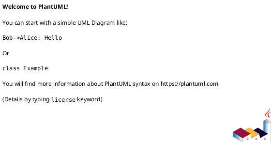

# 作業履歴 2017-02-03

## 概要

2017-02-03の作業内容をまとめています。

## コミット: 998fa88

### メッセージ

```
部分テンプレート郡の作成 #13
```

### 変更されたファイル

- M	.idea/.generators
- M	README.md
- M	app/assets/javascripts/customer.js
- M	app/assets/javascripts/staff.js
- A	app/assets/javascripts/staff/customer_form.coffee
- A	app/assets/javascripts/staff/datetimepicker.coffee
- M	app/presenters/form_presenter.rb
- M	app/presenters/staff/customer_form_presenter.rb
- A	app/views/staff/customers/_customer_fields.html.erb
- A	app/views/staff/customers/_form.html.erb
- A	app/views/staff/customers/_home_address_fields.html.erb
- A	app/views/staff/customers/_work_address_fields.html.erb
- M	app/views/staff/customers/edit.html.erb
- M	app/views/staff/customers/new.html.erb

### 変更内容

```diff
commit 998fa880b8daef5680005ca975b8adb1bd282666
Author: k2works <kakimomokuri@gmail.com>
Date:   Fri Feb 3 18:03:36 2017 +0900

    部分テンプレート郡の作成 #13

diff --git a/.idea/.generators b/.idea/.generators
index 1618976..a68204b 100644
--- a/.idea/.generators
+++ b/.idea/.generators
@@ -5,4 +5,4 @@ You are allowed to:
 2. Remove generators
 3. Add installed generators
 To add new installed generators automatically delete this file and reload the project.
---><GeneratorsGroup><Generator name="active_record:migration" /><Generator name="active_record:model" /><Generator name="active_record:observer" /><Generator name="active_record:session_migration" /><Generator name="controller" /><Generator name="erb:controller" /><Generator name="erb:mailer" /><Generator name="erb:scaffold" /><Generator name="generator" /><Generator name="helper" /><Generator name="integration_test" /><Generator name="mailer" /><Generator name="metal" /><Generator name="migration" /><Generator name="model" /><Generator name="model_subclass" /><Generator name="observer" /><Generator name="performance_test" /><Generator name="plugin" /><Generator name="resource" /><Generator name="scaffold" /><Generator name="scaffold_controller" /><Generator name="session_migration" /><Generator name="stylesheets" /><Generator name="test_unit:controller" /><Generator name="test_unit:helper" /><Generator name="test_unit:integration" /><Generator name="test_unit:mailer" /><Generator name="test_unit:model" /><Generator name="test_unit:observer" /><Generator name="test_unit:performance" /><Generator name="test_unit:plugin" /><Generator name="test_unit:scaffold" /></GeneratorsGroup></Settings>
+--><GeneratorsGroup><Generator name="annotate:install" /><Generator name="assets" /><Generator name="channel" /><Generator name="coffee:assets" /><Generator name="controller" /><Generator name="erd:install" /><Generator name="factory_girl:model" /><Generator name="generator" /><Generator name="helper" /><Generator name="i18n" /><Generator name="i18n_locale" /><Generator name="i18n_translation" /><Generator name="integration_test" /><Generator name="jbuilder" /><Generator name="job" /><Generator name="js:assets" /><Generator name="kaminari:config" /><Generator name="kaminari:views" /><Generator name="mailer" /><Generator name="migration" /><Generator name="model" /><Generator name="rack:dev-mark:install" /><Generator name="resource" /><Generator name="rspec:controller" /><Generator name="rspec:feature" /><Generator name="rspec:helper" /><Generator name="rspec:install" /><Generator name="rspec:integration" /><Generator name="rspec:job" /><Generator name="rspec:mailer" /><Generator name="rspec:model" /><Generator name="rspec:observer" /><Generator name="rspec:request" /><Generator name="rspec:scaffold" /><Generator name="rspec:view" /><Generator name="scaffold" /><Generator name="scaffold_controller" /><Generator name="task" /><Generator name="test_unit:controller" /><Generator name="test_unit:generator" /><Generator name="test_unit:helper" /><Generator name="test_unit:integration" /><Generator name="test_unit:job" /><Generator name="test_unit:mailer" /><Generator name="test_unit:model" /><Generator name="test_unit:plugin" /><Generator name="test_unit:scaffold" /></GeneratorsGroup></Settings>
diff --git a/README.md b/README.md
index a706763..23ad161 100644
--- a/README.md
+++ b/README.md
@@ -559,6 +559,7 @@ git push heroku master
 + new/editアクションの実装
 + フォームプレゼンターの作成
 + ERBテンプレート本体の作成
++ 部分テンプレート郡の作成
 
 #### 顧客アカウントの新規登録・更新・削除
 
diff --git a/app/assets/javascripts/customer.js b/app/assets/javascripts/customer.js
index 2e0435d..c8586cb 100644
--- a/app/assets/javascripts/customer.js
+++ b/app/assets/javascripts/customer.js
@@ -15,8 +15,8 @@
 //= require turbolinks
 //= require bootstrap-sprockets
 //= require_tree ./shared
-//= require moment
-//= require bootstrap-datetimepicker
+//= require jquery-ui/datepicker
+//= require jquery-ui/datepicker-ja
 //= require moment
 //= require moment/ja
 //= require bootstrap-datetimepicker
diff --git a/app/assets/javascripts/staff.js b/app/assets/javascripts/staff.js
index 3d952ba..a53eecd 100644
--- a/app/assets/javascripts/staff.js
+++ b/app/assets/javascripts/staff.js
@@ -15,8 +15,8 @@
 //= require turbolinks
 //= require bootstrap-sprockets
 //= require_tree ./shared
-//= require moment
-//= require bootstrap-datetimepicker
+//= require jquery-ui/datepicker
+//= require jquery-ui/datepicker-ja
 //= require moment
 //= require moment/ja
 //= require bootstrap-datetimepicker
diff --git a/app/assets/javascripts/staff/customer_form.coffee b/app/assets/javascripts/staff/customer_form.coffee
new file mode 100644
index 0000000..894aed5
--- /dev/null
+++ b/app/assets/javascripts/staff/customer_form.coffee
@@ -0,0 +1,22 @@
+$(document).on "turbolinks:load", ->
+  do ->
+    new CustomerForm
+
+class CustomerForm
+  constructor: ->
+    $('button#enable-password-field').on
+      'click': handlePasswordInputFieldOn
+    $('button#disable-password-field').on
+      'click': handlePasswordInputFieldOff
+
+  handlePasswordInputFieldOn = ->
+    $('#enable-password-field').hide()
+    $('#disable-password-field').show()
+    $('#form_customer_password').removeAttr('disabled')
+    $('label[for=form_customer_password]').addClass('required')
+
+  handlePasswordInputFieldOff = ->
+    $('#disable-password-field').hide()
+    $('#enable-password-field').show()
+    $('#form_customer_password').attr('disabled','disabled')
+    $('label[for=form_customer_password]').removeClass('required')
diff --git a/app/assets/javascripts/staff/datetimepicker.coffee b/app/assets/javascripts/staff/datetimepicker.coffee
new file mode 100644
index 0000000..6c368e4
--- /dev/null
+++ b/app/assets/javascripts/staff/datetimepicker.coffee
@@ -0,0 +1,6 @@
+$(document).on "turbolinks:load", ->
+  do ->
+    $(".birthday-picker").datetimepicker(
+      locale: 'ja'
+      format : 'YYYY-MM-DD'
+    )
diff --git a/app/presenters/form_presenter.rb b/app/presenters/form_presenter.rb
index 1a3c9bd..b825b9a 100644
--- a/app/presenters/form_presenter.rb
+++ b/app/presenters/form_presenter.rb
@@ -53,7 +53,6 @@ class FormPresenter
 
   def drop_down_list_block(name, label_text, choices, options ={})
     markup(:div, class: 'AppForm__input-block') do |m|
-      m << decorated_label(name, label_text, options)
       m << form_builder.select(name, choices, { include_blank: true }, options)
     end
   end
diff --git a/app/presenters/staff/customer_form_presenter.rb b/app/presenters/staff/customer_form_presenter.rb
index dc0a1bb..8fc0c0f 100644
--- a/app/presenters/staff/customer_form_presenter.rb
+++ b/app/presenters/staff/customer_form_presenter.rb
@@ -8,7 +8,7 @@ class Staff::CustomerFormPresenter < UserFormPresenter
       else
         options[:class] = 'birthday-picker'
       end
-      m << text_field(name, options)
+      m << text_field(name, options.merge(hide_label: true))
     end
   end
 
diff --git a/app/views/staff/customers/_customer_fields.html.erb b/app/views/staff/customers/_customer_fields.html.erb
new file mode 100644
index 0000000..a2871e1
--- /dev/null
+++ b/app/views/staff/customers/_customer_fields.html.erb
@@ -0,0 +1,13 @@
+<%= f.fields_for :customer, f.object.customer do |ff| %>
+<%= markup do |m|
+  p = Staff::CustomerFormPresenter.new(ff,self)
+  p.with_options(required: true) do |q|
+    m << q.text_field_block(:email, 'メールアドレス', size: 32)
+    m << q.password_field_block(:password, 'パスワード', size: 32)
+    m << q.full_name_block(:family_name, :given_name, '氏名')
+    m << q.full_name_block(:family_name_kana, :given_name_kana, 'フリガナ')
+  end
+  m << p.birthday_field_block(:birthday, '生年月日')
+  m << p.gender_field_block
+  end %>
+<% end %>
\ No newline at end of file
diff --git a/app/views/staff/customers/_form.html.erb b/app/views/staff/customers/_form.html.erb
new file mode 100644
index 0000000..533dd1e
--- /dev/null
+++ b/app/views/staff/customers/_form.html.erb
@@ -0,0 +1,13 @@
+<%= FormPresenter.new(f,self).notes %>
+<fieldset id="customer-fields">
+  <legend>基本情報</legend>
+  <%= render 'customer_fields', f: f %>
+</fieldset>
+<fieldset id="home-address-fields">
+  <legend>自宅住所</legend>
+  <%= render 'home_address_fields', f: f %>
+</fieldset>
+<fieldset id="work-address-fields">
+  <legend>勤務先</legend>
+  <%= render 'work_address_fields', f: f %>
+</fieldset>
diff --git a/app/views/staff/customers/_home_address_fields.html.erb b/app/views/staff/customers/_home_address_fields.html.erb
new file mode 100644
index 0000000..7ae752b
--- /dev/null
+++ b/app/views/staff/customers/_home_address_fields.html.erb
@@ -0,0 +1,12 @@
+<%= f.fields_for :home_address, f.object.customer.home_address do |ff| %>
+<%= markup do |m|
+  p = Staff::AddressFormPresenter.new(ff,self)
+  p.with_options(required: true) do |q|
+    m << q.postal_code_block(:postal_code, '郵便番号', size: 7)
+    m << q.drop_down_list_block(:prefecture, '都道府県',Address::PREFECTURE_NAMES)
+    m << q.text_field_block(:city, '市区町村', size: 16)
+    m << q.text_field_block(:address1, '町域、番地等', size: 40)
+  end
+  m << p.text_field_block(:address2, '建物名、部屋番号名', size: 40)
+end %>
+<% end %>
diff --git a/app/views/staff/customers/_work_address_fields.html.erb b/app/views/staff/customers/_work_address_fields.html.erb
new file mode 100644
index 0000000..f660f7d
--- /dev/null
+++ b/app/views/staff/customers/_work_address_fields.html.erb
@@ -0,0 +1,12 @@
+<%= f.fields_for :work_address, f.object.customer.work_address do |ff| %>
+    <%= markup do |m|
+      p = Staff::AddressFormPresenter.new(ff,self)
+      m << p.text_field_block(:company_name, '会社名', size: 40, required: true)
+      m << p.text_field_block(:division_name, '部署名', size: 40)
+      m << p.postal_code_block(:postal_code, '郵便番号', size: 7)
+      m << p.drop_down_list_block(:prefecture, '都道府県',Address::PREFECTURE_NAMES)
+      m << p.text_field_block(:city, '市区町村', size: 16)
+      m << p.text_field_block(:address1, '町域、番地等', size: 40)
+      m << p.text_field_block(:address2, '建物名、部屋番号名', size: 40)
+    end %>
+<% end %>
diff --git a/app/views/staff/customers/edit.html.erb b/app/views/staff/customers/edit.html.erb
index 33594d6..b534606 100644
--- a/app/views/staff/customers/edit.html.erb
+++ b/app/views/staff/customers/edit.html.erb
@@ -5,11 +5,11 @@
 
 <section class="Section l-column AppForm">
   <div class="AppForm__generic-form StaffAppForm__generic-form">
-    <%= bootstrap_form_for @customer_form, as: 'form' do |f| %>
+    <%= bootstrap_form_for @customer_form, as: 'form', url: [:staff, @customer_form.customer] do |f| %>
         <%= render 'form', f: f %>
         <div class="AppForm__buttons">
           <%= f.submit t('.update'),class: 'btn btn-default btn-lg' %>
-          <%= link_to t('.cancel'), :admin_staff_members,class: 'btn btn-default btn-lg' %>
+          <%= link_to t('.cancel'), :staff_customers,class: 'btn btn-default btn-lg' %>
         </div>
     <% end %>
   </div>
diff --git a/app/views/staff/customers/new.html.erb b/app/views/staff/customers/new.html.erb
index b97182e..eec2844 100644
--- a/app/views/staff/customers/new.html.erb
+++ b/app/views/staff/customers/new.html.erb
@@ -9,7 +9,7 @@
         <%= render 'form', f: f %>
         <div class="AppForm__buttons">
           <%= f.submit t('.create') ,class: 'btn btn-default btn-lg'%>
-          <%= link_to t('.cancel'), :admin_staff_members ,class: 'btn btn-default btn-lg'%>
+          <%= link_to t('.cancel'), :staff_customers ,class: 'btn btn-default btn-lg'%>
         </div>
     <% end %>
   </div>

```

## コミット: 8bf2d42

### メッセージ

```
ERBテンプレート本体の作成 #13
```

### 変更されたファイル

- M	README.md
- A	app/views/staff/customers/edit.html.erb
- A	app/views/staff/customers/new.html.erb
- M	config/locales/views/ja.yml

### 変更内容

```diff
commit 8bf2d426ce6c2f57360195fe871c4eee3345e136
Author: k2works <kakimomokuri@gmail.com>
Date:   Fri Feb 3 17:00:30 2017 +0900

    ERBテンプレート本体の作成 #13

diff --git a/README.md b/README.md
index 3386f1e..a706763 100644
--- a/README.md
+++ b/README.md
@@ -558,6 +558,7 @@ git push heroku master
 + フォームオブジェクトの作成
 + new/editアクションの実装
 + フォームプレゼンターの作成
++ ERBテンプレート本体の作成
 
 #### 顧客アカウントの新規登録・更新・削除
 
diff --git a/app/views/staff/customers/edit.html.erb b/app/views/staff/customers/edit.html.erb
new file mode 100644
index 0000000..33594d6
--- /dev/null
+++ b/app/views/staff/customers/edit.html.erb
@@ -0,0 +1,16 @@
+<% @title = t('.title') %>
+<section class="Section">
+  <h1 class="Staff__title"><%= @title %></h1>
+</section>
+
+<section class="Section l-column AppForm">
+  <div class="AppForm__generic-form StaffAppForm__generic-form">
+    <%= bootstrap_form_for @customer_form, as: 'form' do |f| %>
+        <%= render 'form', f: f %>
+        <div class="AppForm__buttons">
+          <%= f.submit t('.update'),class: 'btn btn-default btn-lg' %>
+          <%= link_to t('.cancel'), :admin_staff_members,class: 'btn btn-default btn-lg' %>
+        </div>
+    <% end %>
+  </div>
+</section>
diff --git a/app/views/staff/customers/new.html.erb b/app/views/staff/customers/new.html.erb
new file mode 100644
index 0000000..b97182e
--- /dev/null
+++ b/app/views/staff/customers/new.html.erb
@@ -0,0 +1,16 @@
+<% @title = t('.title') %>
+<section class="Section">
+  <h1 class="Staff__title"><%= @title %></h1>
+</section>
+
+<section class="Section l-column AppForm">
+  <div class="AppForm__generic-form StaffAppForm__generic-form">
+    <%= bootstrap_form_for @customer_form, as: 'form', url: :staff_customers do |f| %>
+        <%= render 'form', f: f %>
+        <div class="AppForm__buttons">
+          <%= f.submit t('.create') ,class: 'btn btn-default btn-lg'%>
+          <%= link_to t('.cancel'), :admin_staff_members ,class: 'btn btn-default btn-lg'%>
+        </div>
+    <% end %>
+  </div>
+</section>
diff --git a/config/locales/views/ja.yml b/config/locales/views/ja.yml
index b68c0f1..56c6d3a 100644
--- a/config/locales/views/ja.yml
+++ b/config/locales/views/ja.yml
@@ -30,6 +30,14 @@ ja:
         confirm: '本当に削除しますか?'
       show:
         title: '顧客詳細情報'
+      new:
+        title: '顧客の新規登録'
+        create: '登録'
+        cancel: 'キャンセル'
+      edit:
+        title: '顧客アカウントの編集'
+        update: '登録'
+        cancel: 'キャンセル'
     accounts:
       show:
         title: 'アカウント情報'

```

## コミット: fb79929

### メッセージ

```
フォームプレゼンターの作成 #13
```

### 変更されたファイル

- M	README.md
- M	app/presenters/admin/staff_member_form_presenter.rb
- M	app/presenters/form_presenter.rb
- A	app/presenters/staff/address_form_presenter.rb
- A	app/presenters/staff/customer_form_presenter.rb
- A	app/presenters/user_form_presenter.rb

### 変更内容

```diff
commit fb79929b02845dfed22bdfb211ebbcc1d93ae7a6
Author: k2works <kakimomokuri@gmail.com>
Date:   Fri Feb 3 16:51:46 2017 +0900

    フォームプレゼンターの作成 #13

diff --git a/README.md b/README.md
index 3545fd2..3386f1e 100644
--- a/README.md
+++ b/README.md
@@ -557,6 +557,7 @@ git push heroku master
 #### 顧客アカウントの新規登録・編集フォーム
 + フォームオブジェクトの作成
 + new/editアクションの実装
++ フォームプレゼンターの作成
 
 #### 顧客アカウントの新規登録・更新・削除
 
diff --git a/app/presenters/admin/staff_member_form_presenter.rb b/app/presenters/admin/staff_member_form_presenter.rb
index 62b43d3..8434d7b 100644
--- a/app/presenters/admin/staff_member_form_presenter.rb
+++ b/app/presenters/admin/staff_member_form_presenter.rb
@@ -1,25 +1,4 @@
-class Admin::StaffMemberFormPresenter < FormPresenter
-  def password_field_block(name, label_text, options = {})
-    if object.new_record?
-      super(name, label_text,options)
-    else
-      markup(:div, class: 'AppForm__input-block') do |m|
-        m << decorated_label(name, label_text, options.merge(required: false))
-        m << password_field(name, options.merge(disabled: true).merge(hide_label: true))
-        m.button('変更する',type: 'button', id: 'enable-password-field', class: 'btn btn-warning btn-xs')
-        m.button('変更しない', type: 'button', id: 'disable-password-field',style: 'display: none', class: 'btn btn-primary btn-xs')
-      end
-    end
-  end
-
-  def full_name_block(name1, name2, label_text, options = {})
-    markup(:dvi,class: 'AppForm__input-block') do |m|
-      m << decorated_label(name1, label_text, options)
-      m << text_field(name1, hide_label: true, class: options[:required] ? 'required' : nil)
-      m << text_field(name2, hide_label: true, class: options[:required] ? 'required' : nil)
-    end
-  end
-
+class Admin::StaffMemberFormPresenter < UserFormPresenter
   def check_boxes
     markup(:div, class: 'AppForm__input-block') do |m|
       m << label(:suspended, I18n.t('activerecord.attributes.staff_member.suspended_on'))
diff --git a/app/presenters/form_presenter.rb b/app/presenters/form_presenter.rb
index b0527db..1a3c9bd 100644
--- a/app/presenters/form_presenter.rb
+++ b/app/presenters/form_presenter.rb
@@ -51,6 +51,13 @@ class FormPresenter
     end
   end
 
+  def drop_down_list_block(name, label_text, choices, options ={})
+    markup(:div, class: 'AppForm__input-block') do |m|
+      m << decorated_label(name, label_text, options)
+      m << form_builder.select(name, choices, { include_blank: true }, options)
+    end
+  end
+
   def error_message_for(name)
     markup do |m|
       object.errors.full_messages_for(name).each do |message|
@@ -62,7 +69,7 @@ class FormPresenter
   end
 
   private
-  def decorated_label(name, label_text, options)
+  def decorated_label(name, label_text, options = {})
     label(name, label_text, class: options[:required] ? 'AppForm__label required' : 'AppForm__label')
   end
 
diff --git a/app/presenters/staff/address_form_presenter.rb b/app/presenters/staff/address_form_presenter.rb
new file mode 100644
index 0000000..2500e50
--- /dev/null
+++ b/app/presenters/staff/address_form_presenter.rb
@@ -0,0 +1,9 @@
+class Staff::AddressFormPresenter < FormPresenter
+  def postal_code_block(name, label_text, options)
+    markup(:div, class: 'AppForm__input-block') do |m|
+      m << decorated_label(name, label_text, options)
+      m << text_field(name, hide_label: true, class: options[:required] ? 'required' : nil)
+      m.span '(7桁の半角数字で入力してください。)', class: 'AppForm__notes'
+    end
+  end
+end
\ No newline at end of file
diff --git a/app/presenters/staff/customer_form_presenter.rb b/app/presenters/staff/customer_form_presenter.rb
new file mode 100644
index 0000000..dc0a1bb
--- /dev/null
+++ b/app/presenters/staff/customer_form_presenter.rb
@@ -0,0 +1,24 @@
+class Staff::CustomerFormPresenter < UserFormPresenter
+  def birthday_field_block(name, label_text, options = {})
+    markup(:div, class: 'AppForm__input-block') do |m|
+      m << decorated_label(name, label_text, options)
+      if options[:class].kind_of?(String)
+        classes = options[:class].strip.split + ['birthday-picker']
+        options[:class] = classes.uniq.join(' ')
+      else
+        options[:class] = 'birthday-picker'
+      end
+      m << text_field(name, options)
+    end
+  end
+
+  def gender_field_block
+    markup(:div, class: 'AppForm__input-block') do |m|
+      m << decorated_label(:gender, '性別')
+      m << radio_button(:gender, 'male')
+      m << label(:gender_male, '男性')
+      m << radio_button(:gender, 'female')
+      m << label(:gender_female, '女性')
+    end
+  end
+end
\ No newline at end of file
diff --git a/app/presenters/user_form_presenter.rb b/app/presenters/user_form_presenter.rb
new file mode 100644
index 0000000..1fcf987
--- /dev/null
+++ b/app/presenters/user_form_presenter.rb
@@ -0,0 +1,22 @@
+class UserFormPresenter < FormPresenter
+  def password_field_block(name, label_text, options = {})
+    if object.new_record?
+      super(name, label_text,options)
+    else
+      markup(:div, class: 'AppForm__input-block') do |m|
+        m << decorated_label(name, label_text, options.merge(required: false))
+        m << password_field(name, options.merge(disabled: true).merge(hide_label: true))
+        m.button('変更する',type: 'button', id: 'enable-password-field', class: 'btn btn-warning btn-xs')
+        m.button('変更しない', type: 'button', id: 'disable-password-field',style: 'display: none', class: 'btn btn-primary btn-xs')
+      end
+    end
+  end
+
+  def full_name_block(name1, name2, label_text, options = {})
+    markup(:dvi,class: 'AppForm__input-block') do |m|
+      m << decorated_label(name1, label_text, options)
+      m << text_field(name1, hide_label: true, class: options[:required] ? 'required' : nil)
+      m << text_field(name2, hide_label: true, class: options[:required] ? 'required' : nil)
+    end
+  end
+end
\ No newline at end of file

```

## コミット: 4735256

### メッセージ

```
new/editアクションの実装 #13
```

### 変更されたファイル

- M	README.md
- M	app/controllers/staff/customers_controller.rb

### 変更内容

```diff
commit 47352560ae6525d32b599de4f14549f263a52ecd
Author: k2works <kakimomokuri@gmail.com>
Date:   Fri Feb 3 16:31:06 2017 +0900

    new/editアクションの実装 #13

diff --git a/README.md b/README.md
index 18d4c33..3545fd2 100644
--- a/README.md
+++ b/README.md
@@ -556,6 +556,7 @@ git push heroku master
 
 #### 顧客アカウントの新規登録・編集フォーム
 + フォームオブジェクトの作成
++ new/editアクションの実装
 
 #### 顧客アカウントの新規登録・更新・削除
 
diff --git a/app/controllers/staff/customers_controller.rb b/app/controllers/staff/customers_controller.rb
index 3e2aa83..ffa88e4 100644
--- a/app/controllers/staff/customers_controller.rb
+++ b/app/controllers/staff/customers_controller.rb
@@ -6,4 +6,12 @@ class Staff::CustomersController < Staff::Base
   def show
     @customer = Customer.find(params[:id])
   end
+
+  def new
+    @customer_form = Staff::CustomerForm.new
+  end
+
+  def edit
+    @customer_form = Staff::CustomerForm.new(Customer.find(params[:id]))
+  end
 end

```

### 構造変更



## コミット: 8414483

### メッセージ

```
フォームオブジェクトの作成 #13
```

### 変更されたファイル

- M	README.md
- A	app/forms/staff/customer_form.rb

### 変更内容

```diff
commit 8414483a979aece6fd304a44f60d20ff69ebf613
Author: k2works <kakimomokuri@gmail.com>
Date:   Fri Feb 3 16:28:51 2017 +0900

    フォームオブジェクトの作成 #13

diff --git a/README.md b/README.md
index 5bb06ba..18d4c33 100644
--- a/README.md
+++ b/README.md
@@ -555,6 +555,8 @@ git push heroku master
 + 顧客アカウントの詳細表示
 
 #### 顧客アカウントの新規登録・編集フォーム
++ フォームオブジェクトの作成
+
 #### 顧客アカウントの新規登録・更新・削除
 
 ### Capybara
diff --git a/app/forms/staff/customer_form.rb b/app/forms/staff/customer_form.rb
new file mode 100644
index 0000000..3a7edae
--- /dev/null
+++ b/app/forms/staff/customer_form.rb
@@ -0,0 +1,13 @@
+class Staff::CustomerForm
+  include ActiveModel::Model
+
+  attr_accessor :customer
+  delegate :persisted?, to: :customer
+
+  def initialize(customer = nil)
+    @customer = customer
+    @customer ||= Customer.new(gender: 'male')
+    @customer.build_home_address unless @customer.home_address
+    @customer.build_work_address unless @customer.work_address
+  end
+end
\ No newline at end of file

```

## コミット: 2904b01

### メッセージ

```
顧客アカウントの詳細表示 #13
```

### 変更されたファイル

- M	README.md
- M	app/controllers/staff/customers_controller.rb
- M	app/presenters/model_presenter.rb
- A	app/presenters/staff/address_presenter.rb
- A	app/views/staff/customers/show.html.erb
- M	config/locales/views/ja.yml

### 変更内容

```diff
commit 2904b0189b662e5be0fe10015189c6071784c76e
Author: k2works <kakimomokuri@gmail.com>
Date:   Fri Feb 3 16:23:09 2017 +0900

    顧客アカウントの詳細表示 #13

diff --git a/README.md b/README.md
index 8aef379..5bb06ba 100644
--- a/README.md
+++ b/README.md
@@ -552,6 +552,7 @@ git push heroku master
 #### 顧客アカウントの一覧表示・詳細表示
 + シードデータの投入
 + 顧客アカウントの一覧表示
++ 顧客アカウントの詳細表示
 
 #### 顧客アカウントの新規登録・編集フォーム
 #### 顧客アカウントの新規登録・更新・削除
diff --git a/app/controllers/staff/customers_controller.rb b/app/controllers/staff/customers_controller.rb
index 5ce8976..3e2aa83 100644
--- a/app/controllers/staff/customers_controller.rb
+++ b/app/controllers/staff/customers_controller.rb
@@ -2,4 +2,8 @@ class Staff::CustomersController < Staff::Base
   def index
     @customers = Customer.order(:family_name_kana, :given_name_kana).page(params[:page])
   end
+
+  def show
+    @customer = Customer.find(params[:id])
+  end
 end
diff --git a/app/presenters/model_presenter.rb b/app/presenters/model_presenter.rb
index d347ed8..b81b79f 100644
--- a/app/presenters/model_presenter.rb
+++ b/app/presenters/model_presenter.rb
@@ -11,4 +11,12 @@ class ModelPresenter
     @object = object
     @view_context = view_context
   end
+
+  def created_at
+    object.created_at.try(:strftime, '%Y/%m/%d %H::%M::%S')
+  end
+
+  def updated_at
+    object.updated_at.try(:strftime, '%Y/%m/%d %H::%M::%S')
+  end
 end
\ No newline at end of file
diff --git a/app/presenters/staff/address_presenter.rb b/app/presenters/staff/address_presenter.rb
new file mode 100644
index 0000000..313757d
--- /dev/null
+++ b/app/presenters/staff/address_presenter.rb
@@ -0,0 +1,16 @@
+class Staff::AddressPresenter < ModelPresenter
+  delegate :prefecture,
+           :city,
+           :address1,
+           :address2,
+           :company_name,
+           :division_name, to: :object
+
+  def postal_code
+    if md = object.postal_code.match(/\A(\d{3})(\d{4})\z/)
+      md[1] + '-' + md[2]
+    else
+      object.postal_code
+    end
+  end
+end
\ No newline at end of file
diff --git a/app/views/staff/customers/show.html.erb b/app/views/staff/customers/show.html.erb
new file mode 100644
index 0000000..53cec0c
--- /dev/null
+++ b/app/views/staff/customers/show.html.erb
@@ -0,0 +1,37 @@
+<% @title = t('.title') %>
+<section class="Section">
+  <h1 class="Staff__title"><%= @title %></h1>
+</section>
+
+<section class="Section l-column Table StaffTable">
+  <table class="Table__body Table__body--attributes StaffTable__body">
+    <tr class="Table__tr"><th class="Table__th" colspan="2">基本情報</th></tr>
+    <% p1 = Staff::CustomerPresenter.new(@customer, self) %>
+    <tr class="Table__tr"><th class="Table__th">氏名</th><td><%= p1.full_name %></td></tr>
+    <tr class="Table__tr"><th class="Table__th">フリガナ</th><td><%= p1.full_name_kana %></td></tr>
+    <tr class="Table__tr"><th class="Table__th">生年月日</th><td class="Table__td--date"><%= p1.birthday %></td></tr>
+    <tr class="Table__tr"><th class="Table__th">性別</th><td><%= p1.gender %></td></tr>
+    <tr class="Table__tr"><th class="Table__th">登録日時</th><td class="Table__td--date"><%= p1.created_at %></td></tr>
+    <tr class="Table__tr"><th class="Table__th">更新日時</th><td class="Table__td--date"><%= p1.updated_at %></td></tr>
+    <% if @customer.home_address %>
+      <% p2 = Staff::AddressPresenter.new(@customer.home_address, self) %>
+      <tr class="Table__tr"><th class="Table__th" colspan="2">自宅住所</th></tr>
+      <tr class="Table__tr"><th class="Table__th">郵便番号</th><td><%= p2.postal_code %></td></tr>
+      <tr class="Table__tr"><th class="Table__th">都道府県</th><td><%= p2.prefecture %></td></tr>
+      <tr class="Table__tr"><th class="Table__th">市区町村</th><td><%= p2.city %></td></tr>
+      <tr class="Table__tr"><th class="Table__th">町域、番地等</th><td><%= p2.address1 %></td></tr>
+      <tr class="Table__tr"><th class="Table__th">建物名、部屋番号</th><td><%= p2.address2 %></td></tr>
+    <% end %>
+    <% if @customer.work_address %>
+        <% p3 = Staff::AddressPresenter.new(@customer.work_address, self) %>
+        <tr class="Table__tr"><th class="Table__th" colspan="2">勤務先</th></tr>
+        <tr class="Table__tr"><th class="Table__th">会社名</th><td><%= p3.company_name %></td></tr>
+        <tr class="Table__tr"><th class="Table__th">部署名</th><td><%= p3.division_name %></td></tr>
+        <tr class="Table__tr"><th class="Table__th">郵便番号</th><td><%= p3.postal_code %></td></tr>
+        <tr class="Table__tr"><th class="Table__th">都道府県</th><td><%= p3.prefecture %></td></tr>
+        <tr class="Table__tr"><th class="Table__th">市区町村</th><td><%= p3.city %></td></tr>
+        <tr class="Table__tr"><th class="Table__th">町域、番地等</th><td><%= p3.address1 %></td></tr>
+        <tr class="Table__tr"><th class="Table__th">建物名、部屋番号</th><td><%= p3.address2 %></td></tr>
+    <% end %>
+  </table>
+</section>
\ No newline at end of file
diff --git a/config/locales/views/ja.yml b/config/locales/views/ja.yml
index 7168d6a..b68c0f1 100644
--- a/config/locales/views/ja.yml
+++ b/config/locales/views/ja.yml
@@ -28,6 +28,8 @@ ja:
         edit: '編集'
         delete: '削除'
         confirm: '本当に削除しますか?'
+      show:
+        title: '顧客詳細情報'
     accounts:
       show:
         title: 'アカウント情報'

```

### 構造変更


## コミット: 40a126d

### メッセージ

```
顧客アカウントの一覧表示 #13
```

### 変更されたファイル

- M	README.md
- A	app/controllers/staff/customers_controller.rb
- M	app/controllers/staff/top_controller.rb
- M	app/models/customer.rb
- M	app/models/home_address.rb
- M	app/models/work_address.rb
- A	app/presenters/staff/customer_presenter.rb
- M	app/views/admin/staff_members/index.html.erb
- A	app/views/staff/customers/index.html.erb
- A	app/views/staff/top/dashboard.html.erb
- M	config/locales/views/ja.yml
- M	config/routes.rb
- M	db/migrate/20170203051643_create_customers.rb
- M	db/schema.rb
- M	spec/controllers/staff/top_controller_spec.rb
- M	spec/factories/customers.rb

### 変更内容

```diff
commit 40a126db6f49670477fd4cda9dff717e996c3a27
Author: k2works <kakimomokuri@gmail.com>
Date:   Fri Feb 3 15:40:50 2017 +0900

    顧客アカウントの一覧表示 #13

diff --git a/README.md b/README.md
index 8b2d632..8aef379 100644
--- a/README.md
+++ b/README.md
@@ -551,6 +551,7 @@ git push heroku master
 
 #### 顧客アカウントの一覧表示・詳細表示
 + シードデータの投入
++ 顧客アカウントの一覧表示
 
 #### 顧客アカウントの新規登録・編集フォーム
 #### 顧客アカウントの新規登録・更新・削除
diff --git a/app/controllers/staff/customers_controller.rb b/app/controllers/staff/customers_controller.rb
new file mode 100644
index 0000000..5ce8976
--- /dev/null
+++ b/app/controllers/staff/customers_controller.rb
@@ -0,0 +1,5 @@
+class Staff::CustomersController < Staff::Base
+  def index
+    @customers = Customer.order(:family_name_kana, :given_name_kana).page(params[:page])
+  end
+end
diff --git a/app/controllers/staff/top_controller.rb b/app/controllers/staff/top_controller.rb
index 67c8a43..091794c 100644
--- a/app/controllers/staff/top_controller.rb
+++ b/app/controllers/staff/top_controller.rb
@@ -2,6 +2,10 @@ class Staff::TopController < Staff::Base
   skip_before_action :authorize
 
   def index
-    render action: 'index'
+    if current_staff_member
+      render action: 'dashboard'
+    else
+      render action: 'index'
+    end
   end
 end
diff --git a/app/models/customer.rb b/app/models/customer.rb
index b688c24..04386e3 100644
--- a/app/models/customer.rb
+++ b/app/models/customer.rb
@@ -10,7 +10,7 @@
 #  family_name_kana :string(255)      not null              # 姓（カナ）
 #  given_name_kana  :string(255)      not null              # 名（カナ）
 #  gender           :string(255)                            # 性別
-#  birthday         :string(255)                            # 誕生日
+#  birthday         :date                                   # 誕生日
 #  hashed_password  :string(255)                            # パスワード
 #  created_at       :datetime         not null
 #  updated_at       :datetime         not null
diff --git a/app/models/home_address.rb b/app/models/home_address.rb
index b47baf2..0dc6aa5 100644
--- a/app/models/home_address.rb
+++ b/app/models/home_address.rb
@@ -1,2 +1,25 @@
+# == Schema Information
+#
+# Table name: addresses # 住所
+#
+#  id            :integer          not null, primary key
+#  customer_id   :integer          not null              # 顧客への外部キー
+#  type          :string(255)      not null              # 継承カラム
+#  postal_code   :string(255)      not null              # 郵便番号
+#  prefecture    :string(255)      not null              # 都道府県
+#  city          :string(255)      not null              # 市区町村
+#  address1      :string(255)      not null              # 町域・番地等
+#  address2      :string(255)      not null              # 建物名・部屋番号
+#  company_name  :string(255)      default(""), not null # 会社名
+#  division_name :string(255)      default(""), not null # 部署名
+#  created_at    :datetime         not null
+#  updated_at    :datetime         not null
+#
+# Indexes
+#
+#  index_addresses_on_customer_id           (customer_id)
+#  index_addresses_on_type_and_customer_id  (type,customer_id) UNIQUE
+#
+
 class HomeAddress < Address
-end
\ No newline at end of file
+end
diff --git a/app/models/work_address.rb b/app/models/work_address.rb
index 06af41d..93e332b 100644
--- a/app/models/work_address.rb
+++ b/app/models/work_address.rb
@@ -1,2 +1,25 @@
+# == Schema Information
+#
+# Table name: addresses # 住所
+#
+#  id            :integer          not null, primary key
+#  customer_id   :integer          not null              # 顧客への外部キー
+#  type          :string(255)      not null              # 継承カラム
+#  postal_code   :string(255)      not null              # 郵便番号
+#  prefecture    :string(255)      not null              # 都道府県
+#  city          :string(255)      not null              # 市区町村
+#  address1      :string(255)      not null              # 町域・番地等
+#  address2      :string(255)      not null              # 建物名・部屋番号
+#  company_name  :string(255)      default(""), not null # 会社名
+#  division_name :string(255)      default(""), not null # 部署名
+#  created_at    :datetime         not null
+#  updated_at    :datetime         not null
+#
+# Indexes
+#
+#  index_addresses_on_customer_id           (customer_id)
+#  index_addresses_on_type_and_customer_id  (type,customer_id) UNIQUE
+#
+
 class WorkAddress < Address
-end
\ No newline at end of file
+end
diff --git a/app/presenters/staff/customer_presenter.rb b/app/presenters/staff/customer_presenter.rb
new file mode 100644
index 0000000..dc698ec
--- /dev/null
+++ b/app/presenters/staff/customer_presenter.rb
@@ -0,0 +1,27 @@
+class Staff::CustomerPresenter < ModelPresenter
+  delegate :email, to: :object
+
+  def full_name
+    object.family_name + ' ' + object.given_name
+  end
+
+  def full_name_kana
+    object.family_name_kana + ' ' + object.given_name_kana
+  end
+
+  def birthday
+    return '' if object.birthday.blank?
+    object.birthday.strftime('%Y/%m/%d')
+  end
+
+  def gender
+    case object.gender
+      when 'male'
+        '男性'
+      when 'female'
+        '女性'
+      else
+        ''
+    end
+  end
+end
\ No newline at end of file
diff --git a/app/views/admin/staff_members/index.html.erb b/app/views/admin/staff_members/index.html.erb
index f3668b6..86a48f1 100644
--- a/app/views/admin/staff_members/index.html.erb
+++ b/app/views/admin/staff_members/index.html.erb
@@ -23,8 +23,8 @@
     <% @staff_members.each do |m| %>
         <% p = Admin::StaffMemberPresenter.new(m, self) %>
         <tr  class="Table__tr">
-          <td><%= p.full_name %></td>
-          <td><%= p.full_name_kana %></td>
+          <td class="Table__td"><%= p.full_name %></td>
+          <td class="Table__td"><%= p.full_name_kana %></td>
           <td class="Table__td Table__td--email"><%= m.email %></td>
           <td class="Table__td Table__td--date Table__td--center"><%= m.start_date %></td>
           <td class="Table__td Table__td--date Table__td--center"><%= m.end_date %></td>
diff --git a/app/views/staff/customers/index.html.erb b/app/views/staff/customers/index.html.erb
new file mode 100644
index 0000000..4978613
--- /dev/null
+++ b/app/views/staff/customers/index.html.erb
@@ -0,0 +1,45 @@
+<% @title = t('.title') %>
+<section class="Section">
+  <h1 class="Staff__title"><%= @title %></h1>
+</section>
+
+<section class="Section l-column Table">
+  <div class="Table__links">
+    <%= link_to t('.new'), :new_staff_customer, class: 'btn btn-default' %>
+  </div>
+
+  <%= paginate @customers %>
+
+  <table class="Table__body Table__body--listing StaffTable__body">
+    <tr class="Table__tr">
+      <th class="Table__th"><%= t('.full_name') %></th>
+      <th class="Table__th"><%= t('.kana') %></th>
+      <th class="Table__th"><%= t('.email') %></th>
+      <th class="Table__th"><%= t('.birthday') %></th>
+      <th class="Table__th"><%= t('.gender') %></th>
+      <th class="Table__th"><%= t('.action') %></th>
+    </tr>
+    <% @customers.each do |c| %>
+        <% p = Staff::CustomerPresenter.new(c, self) %>
+        <tr  class="Table__tr">
+          <td class="Table__td"><%= p.full_name %></td>
+          <td class="Table__td"><%= p.full_name_kana %></td>
+          <td class="Table__td Table__td--email"><%= p.email %></td>
+          <td class="Table__td Table__td--date Table__td--center"><%= p.birthday %></td>
+          <td class="Table__td"><%= p.gender %></td>
+          <td class="Table__td Table__td--actions">
+            <%= link_to t('.show'), [:staff, c ], class: 'btn btn-default btn-xs' %> |
+            <%= link_to t('.edit'), [:edit, :staff, c ], class: 'btn btn-default btn-xs' %> |
+            <%= link_to t('.delete'), [:staff, c ], method: :delete,
+                        data: { confirm: t('.confirm')}, class: 'btn btn-default btn-xs' %>
+          </td>
+        </tr>
+    <% end %>
+  </table>
+
+  <%= paginate @customers %>
+
+  <div class="Table__links">
+    <%= link_to t('.new'), :new_staff_customer, class: 'btn btn-default' %>
+  </div>
+</section>
\ No newline at end of file
diff --git a/app/views/staff/top/dashboard.html.erb b/app/views/staff/top/dashboard.html.erb
new file mode 100644
index 0000000..a7cd915
--- /dev/null
+++ b/app/views/staff/top/dashboard.html.erb
@@ -0,0 +1,10 @@
+<% @title = t('.title') %>
+<section class="Section">
+  <h1 class="Staff__title"><%= @title %></h1>
+</section>
+
+<section class="Section l-column DashBoard">
+  <ul class="DashBoard__menu">
+    <li><%= link_to t('.staff_customers'), :staff_customers, class: 'btn btn-default' %></li>
+  </ul>
+</section>
\ No newline at end of file
diff --git a/config/locales/views/ja.yml b/config/locales/views/ja.yml
index 0b00c41..7168d6a 100644
--- a/config/locales/views/ja.yml
+++ b/config/locales/views/ja.yml
@@ -8,6 +8,26 @@ ja:
     sessions:
       new:
         submit: 'ログイン'
+    top:
+      index:
+        title: '職員トップページ'
+      dashboard:
+        title: 'ダッシュボード'
+        staff_customers: '顧客管理'
+    customers:
+      index:
+        title: '顧客管理'
+        full_name: '氏名'
+        kana: 'フリガナ'
+        email: 'メールアドレス'
+        birthday: '生年月日'
+        gender: '性別'
+        action: 'アクション'
+        new: '新規登録'
+        show: '詳細'
+        edit: '編集'
+        delete: '削除'
+        confirm: '本当に削除しますか?'
     accounts:
       show:
         title: 'アカウント情報'
diff --git a/config/routes.rb b/config/routes.rb
index 3be854a..f0f1ae9 100644
--- a/config/routes.rb
+++ b/config/routes.rb
@@ -13,6 +13,14 @@
 #                  staff_password GET    /staff/password(.:format)                            staff/passwords#show {:host=>"0.0.0.0"}
 #                                 PATCH  /staff/password(.:format)                            staff/passwords#update {:host=>"0.0.0.0"}
 #                                 PUT    /staff/password(.:format)                            staff/passwords#update {:host=>"0.0.0.0"}
+#                 staff_customers GET    /staff/customers(.:format)                           staff/customers#index {:host=>"0.0.0.0"}
+#                                 POST   /staff/customers(.:format)                           staff/customers#create {:host=>"0.0.0.0"}
+#              new_staff_customer GET    /staff/customers/new(.:format)                       staff/customers#new {:host=>"0.0.0.0"}
+#             edit_staff_customer GET    /staff/customers/:id/edit(.:format)                  staff/customers#edit {:host=>"0.0.0.0"}
+#                  staff_customer GET    /staff/customers/:id(.:format)                       staff/customers#show {:host=>"0.0.0.0"}
+#                                 PATCH  /staff/customers/:id(.:format)                       staff/customers#update {:host=>"0.0.0.0"}
+#                                 PUT    /staff/customers/:id(.:format)                       staff/customers#update {:host=>"0.0.0.0"}
+#                                 DELETE /staff/customers/:id(.:format)                       staff/customers#destroy {:host=>"0.0.0.0"}
 #                      admin_root GET    /admin(.:format)                                     admin/top#index {:host=>"0.0.0.0"}
 #                     admin_login GET    /admin/login(.:format)                               admin/sessions#new {:host=>"0.0.0.0"}
 #                   admin_session DELETE /admin/session(.:format)                             admin/sessions#destroy {:host=>"0.0.0.0"}
@@ -49,6 +57,7 @@ Rails.application.routes.draw do
       concerns :session_path
       resource :account, only: [:show, :edit, :update]
       resource :password, only: [:show, :edit, :update]
+      resources :customers
     end
   end
 
diff --git a/db/migrate/20170203051643_create_customers.rb b/db/migrate/20170203051643_create_customers.rb
index 49f2df7..df6f8d1 100644
--- a/db/migrate/20170203051643_create_customers.rb
+++ b/db/migrate/20170203051643_create_customers.rb
@@ -8,7 +8,7 @@ class CreateCustomers < ActiveRecord::Migration[5.0]
       t.string :family_name_kana, null: false, comment:'姓（カナ）'
       t.string :given_name_kana, null: false, comment:'名（カナ）'
       t.string :gender, comment:'性別'
-      t.string :birthday, comment:'誕生日'
+      t.date :birthday, comment:'誕生日'
       t.string :hashed_password, comment:'パスワード'
 
       t.timestamps
diff --git a/db/schema.rb b/db/schema.rb
index edc3e7e..36cea7d 100644
--- a/db/schema.rb
+++ b/db/schema.rb
@@ -46,7 +46,7 @@ ActiveRecord::Schema.define(version: 20170203051654) do
     t.string   "family_name_kana", null: false, comment: "姓（カナ）"
     t.string   "given_name_kana",  null: false, comment: "名（カナ）"
     t.string   "gender",                        comment: "性別"
-    t.string   "birthday",                      comment: "誕生日"
+    t.date     "birthday",                      comment: "誕生日"
     t.string   "hashed_password",               comment: "パスワード"
     t.datetime "created_at",       null: false
     t.datetime "updated_at",       null: false
diff --git a/spec/controllers/staff/top_controller_spec.rb b/spec/controllers/staff/top_controller_spec.rb
index 8f12e7c..c6663ca 100644
--- a/spec/controllers/staff/top_controller_spec.rb
+++ b/spec/controllers/staff/top_controller_spec.rb
@@ -9,10 +9,10 @@ describe Staff::TopController, 'Before login' do
   end
 
   describe '#index' do
-    # 通常はstaff/top/indexを表示
-    it 'should display staff/top/index' do
+    # 通常はstaff/top/dashboardを表示
+    it 'should display staff/top/dashboard' do
       get :index
-      expect(response).to render_template('staff/top/index')
+      expect(response).to render_template('staff/top/dashboard')
     end
 
     # 停止フラグがセットされたら強制的にログアウト
diff --git a/spec/factories/customers.rb b/spec/factories/customers.rb
index 2895e7f..98d55fd 100644
--- a/spec/factories/customers.rb
+++ b/spec/factories/customers.rb
@@ -10,7 +10,7 @@
 #  family_name_kana :string(255)      not null              # 姓（カナ）
 #  given_name_kana  :string(255)      not null              # 名（カナ）
 #  gender           :string(255)                            # 性別
-#  birthday         :string(255)                            # 誕生日
+#  birthday         :date                                   # 誕生日
 #  hashed_password  :string(255)                            # パスワード
 #  created_at       :datetime         not null
 #  updated_at       :datetime         not null

```

### 構造変更


## コミット: 6d8df6b

### メッセージ

```
シードデータの投入 #13
```

### 変更されたファイル

- M	README.md
- M	db/schema.rb
- A	db/seed/development/customers.rb
- M	db/seeds.rb

### 変更内容

```diff
commit 6d8df6bba268547ba17eba239d90cd129398dae4
Author: k2works <kakimomokuri@gmail.com>
Date:   Fri Feb 3 14:57:42 2017 +0900

    シードデータの投入 #13

diff --git a/README.md b/README.md
index 9bbec3c..8b2d632 100644
--- a/README.md
+++ b/README.md
@@ -550,6 +550,8 @@ git push heroku master
 + 顧客関連モデル群の初期実装
 
 #### 顧客アカウントの一覧表示・詳細表示
++ シードデータの投入
+
 #### 顧客アカウントの新規登録・編集フォーム
 #### 顧客アカウントの新規登録・更新・削除
 
diff --git a/db/schema.rb b/db/schema.rb
index 6d16dd3..edc3e7e 100644
--- a/db/schema.rb
+++ b/db/schema.rb
@@ -12,7 +12,7 @@
 
 ActiveRecord::Schema.define(version: 20170203051654) do
 
-  create_table "addresses", force: :cascade, options: "ENGINE=InnoDB DEFAULT CHARSET=utf8", comment: "住所" do |t|
+  create_table "addresses", force: :cascade,  comment: "住所" do |t|
     t.integer  "customer_id",                null: false, comment: "顧客への外部キー"
     t.string   "type",                       null: false, comment: "継承カラム"
     t.string   "postal_code",                null: false, comment: "郵便番号"
@@ -28,7 +28,7 @@ ActiveRecord::Schema.define(version: 20170203051654) do
     t.index ["type", "customer_id"], name: "index_addresses_on_type_and_customer_id", unique: true, using: :btree
   end
 
-  create_table "administrators", force: :cascade, options: "ENGINE=InnoDB DEFAULT CHARSET=utf8", comment: "管理者" do |t|
+  create_table "administrators", force: :cascade,  comment: "管理者" do |t|
     t.string   "email",                           null: false, comment: "メールアドレス"
     t.string   "email_for_index",                 null: false, comment: "索引用メールアドレス"
     t.string   "hashed_password",                              comment: "パスワード"
@@ -38,7 +38,7 @@ ActiveRecord::Schema.define(version: 20170203051654) do
     t.index ["email_for_index"], name: "index_administrators_on_email_for_index", unique: true, using: :btree
   end
 
-  create_table "customers", force: :cascade, options: "ENGINE=InnoDB DEFAULT CHARSET=utf8", comment: "顧客" do |t|
+  create_table "customers", force: :cascade,  comment: "顧客" do |t|
     t.string   "email",            null: false, comment: "メールアドレス"
     t.string   "email_for_index",  null: false, comment: "顧客用メールアドレス"
     t.string   "family_name",      null: false, comment: "姓"
@@ -54,7 +54,7 @@ ActiveRecord::Schema.define(version: 20170203051654) do
     t.index ["family_name_kana", "given_name_kana"], name: "index_customers_on_family_name_kana_and_given_name_kana", using: :btree
   end
 
-  create_table "staff_events", force: :cascade, options: "ENGINE=InnoDB DEFAULT CHARSET=utf8", comment: "職員イベント" do |t|
+  create_table "staff_events", force: :cascade,  comment: "職員イベント" do |t|
     t.integer  "staff_member_id", null: false, comment: "職員レコードへの外部キー"
     t.string   "type",            null: false, comment: "イベントタイプ"
     t.datetime "created_at",      null: false, comment: "発生時刻"
@@ -63,7 +63,7 @@ ActiveRecord::Schema.define(version: 20170203051654) do
     t.index ["staff_member_id"], name: "index_staff_events_on_staff_member_id", using: :btree
   end
 
-  create_table "staff_members", force: :cascade, options: "ENGINE=InnoDB DEFAULT CHARSET=utf8", comment: "職員" do |t|
+  create_table "staff_members", force: :cascade,  comment: "職員" do |t|
     t.string   "email",                            null: false, comment: "メールアドレス"
     t.string   "email_for_index",                  null: false, comment: "索引用メールアドレス"
     t.string   "family_name",                      null: false, comment: "姓"
diff --git a/db/seed/development/customers.rb b/db/seed/development/customers.rb
new file mode 100644
index 0000000..1440187
--- /dev/null
+++ b/db/seed/development/customers.rb
@@ -0,0 +1,64 @@
+city_names = %w(青巻市 赤巻市 黄巻市)
+
+family_names = %w{
+  佐藤:サトウ:sato
+  鈴木:スズキ:suzuki
+  高橋:タカハシ:takahashi
+  田中:タナカ:tanaka
+  渡辺:ワタナベ:watanabe
+  伊藤:イトウ:ito
+  山本:ヤマモト:yamamoto
+  中村:ナカムラ:nakamura
+  小林:コバヤシ:kobayashi
+  加藤:カトウ:kato
+}
+
+given_names = %w{
+  一郎:イチロウ:ichiro
+  二郎:ジロウ:jiro
+  三郎:サブロウ:saburo
+  四郎:シロウ:shiro
+  五郎:ゴロウ:goro
+  松子:マツコ:matsuko
+  竹子:タケコ:takeko
+  梅子:ウメコ:umeko
+  鶴子:ツルコ:tsuruko
+  亀子:カメコ:kameko
+}
+
+company_names = %w(OIAX ABC XYZ)
+
+10.times do |n|
+  10.times do |m|
+    fn = family_names[n].split(':')
+    gn = given_names[m].split(':')
+
+    c = Customer.create!(
+        email: "#{fn[2]}.#{gn[2]}@example.jp",
+        family_name: fn[0],
+        given_name: gn[0],
+        family_name_kana: fn[1],
+        given_name_kana: gn[1],
+        password: 'password',
+        birthday: 60.years.ago.advance(seconds: rand(40.years)).to_date,
+        gender: m < 5 ? 'male' : 'female'
+    )
+    c.create_home_address!(
+        postal_code: sprintf('%07d', rand(10000000)),
+        prefecture: Address::PREFECTURE_NAMES.sample,
+        city: city_names.sample,
+        address1: '開発1-2-3',
+        address2: 'レイルズハイツ301号室'
+    )
+    if m % 3 == 0
+      c.create_work_address!(
+          postal_code: sprintf('%07d', rand(10000000)),
+          prefecture: Address::PREFECTURE_NAMES.sample,
+          city: city_names.sample,
+          address1: '試験4-5-6',
+          address2: 'ルビービル2F',
+          company_name: company_names.sample
+      )
+    end
+  end
+end
\ No newline at end of file
diff --git a/db/seeds.rb b/db/seeds.rb
index f58b110..1de7b86 100644
--- a/db/seeds.rb
+++ b/db/seeds.rb
@@ -6,7 +6,7 @@
 
 #   movies = Movie.create([{ name: 'Star Wars' }, { name: 'Lord of the Rings' }])
 #   Character.create(name: 'Luke', movie: movies.first)
-table_names = %w(staff_members administrators staff_events)
+table_names = %w(staff_members administrators staff_events customers)
 table_names.each do |table_name|
   path = Rails.root.join('db','seed',Rails.env, "#{table_name}.rb")
   if File.exist?(path)

```

## コミット: 3c3bf9e

### メッセージ

```
顧客関連モデル群の初期実装 #13
```

### 変更されたファイル

- M	README.md
- M	app/models/address.rb
- M	app/models/customer.rb
- A	app/models/home_address.rb
- A	app/models/work_address.rb

### 変更内容

```diff
commit 3c3bf9eb56e3b959db6e13855d4921f24ccbd972
Author: k2works <kakimomokuri@gmail.com>
Date:   Fri Feb 3 14:47:40 2017 +0900

    顧客関連モデル群の初期実装 #13

diff --git a/README.md b/README.md
index f2ae519..9bbec3c 100644
--- a/README.md
+++ b/README.md
@@ -547,6 +547,7 @@ git push heroku master
 + 顧客管理のためのデータベース設計
 + 単一テーブル継承とは
 + 顧客関連テーブル群の作成
++ 顧客関連モデル群の初期実装
 
 #### 顧客アカウントの一覧表示・詳細表示
 #### 顧客アカウントの新規登録・編集フォーム
diff --git a/app/models/address.rb b/app/models/address.rb
index 71dcc7a..fd01b80 100644
--- a/app/models/address.rb
+++ b/app/models/address.rb
@@ -22,4 +22,18 @@
 #
 
 class Address < ApplicationRecord
+  belongs_to :customer
+
+  PREFECTURE_NAMES = %w(
+    北海道
+    青森県 岩手県 宮城県 秋田県 山形県 福島県
+    茨城県 栃木県 群馬県 埼玉県 千葉県 東京都 神奈川県
+    新潟県 富山県 石川県 福井県 山梨県 長野県 岐阜県 静岡県 愛知県
+    三重県 滋賀県 京都府 大阪府 兵庫県 奈良県 和歌山県
+    鳥取県 島根県 岡山県 広島県 山口県
+    徳島県 香川県 愛媛県 高知県
+    福岡県 佐賀県 長崎県 熊本県 大分県 宮崎県 鹿児島県
+    沖縄県
+    日本国外
+  )
 end
diff --git a/app/models/customer.rb b/app/models/customer.rb
index 6a2be80..b688c24 100644
--- a/app/models/customer.rb
+++ b/app/models/customer.rb
@@ -22,4 +22,17 @@
 #
 
 class Customer < ApplicationRecord
+  has_one :home_address, dependent: :destroy
+  has_one :work_address, dependent: :destroy
+  before_validation do
+    self.email_for_index = email.downcase if email
+  end
+
+  def password=(raw_password)
+    if raw_password.kind_of?(String)
+      self.hashed_password = BCrypt::Password.create(raw_password)
+    elsif raw_password.nil?
+      self.hashed_password = nil
+    end
+  end
 end
diff --git a/app/models/home_address.rb b/app/models/home_address.rb
new file mode 100644
index 0000000..b47baf2
--- /dev/null
+++ b/app/models/home_address.rb
@@ -0,0 +1,2 @@
+class HomeAddress < Address
+end
\ No newline at end of file
diff --git a/app/models/work_address.rb b/app/models/work_address.rb
new file mode 100644
index 0000000..06af41d
--- /dev/null
+++ b/app/models/work_address.rb
@@ -0,0 +1,2 @@
+class WorkAddress < Address
+end
\ No newline at end of file

```

### 構造変更


## コミット: eb7506f

### メッセージ

```
顧客関連テーブル群の作成 #13
```

### 変更されたファイル

- M	README.md
- A	app/models/address.rb
- A	app/models/customer.rb
- A	db/migrate/20170203051643_create_customers.rb
- A	db/migrate/20170203051654_create_addresses.rb
- M	db/schema.rb
- A	spec/factories/addresses.rb
- A	spec/factories/customers.rb

### 変更内容

```diff
commit eb7506f4f56f01b88ac68b74010fe868ed39acb3
Author: k2works <kakimomokuri@gmail.com>
Date:   Fri Feb 3 14:37:40 2017 +0900

    顧客関連テーブル群の作成 #13

diff --git a/README.md b/README.md
index afdc1b9..f2ae519 100644
--- a/README.md
+++ b/README.md
@@ -544,6 +544,10 @@ git push heroku master
 
 ### 単一テーブ継承
 #### 単一テーブル継承
++ 顧客管理のためのデータベース設計
++ 単一テーブル継承とは
++ 顧客関連テーブル群の作成
+
 #### 顧客アカウントの一覧表示・詳細表示
 #### 顧客アカウントの新規登録・編集フォーム
 #### 顧客アカウントの新規登録・更新・削除
diff --git a/app/models/address.rb b/app/models/address.rb
new file mode 100644
index 0000000..71dcc7a
--- /dev/null
+++ b/app/models/address.rb
@@ -0,0 +1,25 @@
+# == Schema Information
+#
+# Table name: addresses # 住所
+#
+#  id            :integer          not null, primary key
+#  customer_id   :integer          not null              # 顧客への外部キー
+#  type          :string(255)      not null              # 継承カラム
+#  postal_code   :string(255)      not null              # 郵便番号
+#  prefecture    :string(255)      not null              # 都道府県
+#  city          :string(255)      not null              # 市区町村
+#  address1      :string(255)      not null              # 町域・番地等
+#  address2      :string(255)      not null              # 建物名・部屋番号
+#  company_name  :string(255)      default(""), not null # 会社名
+#  division_name :string(255)      default(""), not null # 部署名
+#  created_at    :datetime         not null
+#  updated_at    :datetime         not null
+#
+# Indexes
+#
+#  index_addresses_on_customer_id           (customer_id)
+#  index_addresses_on_type_and_customer_id  (type,customer_id) UNIQUE
+#
+
+class Address < ApplicationRecord
+end
diff --git a/app/models/customer.rb b/app/models/customer.rb
new file mode 100644
index 0000000..6a2be80
--- /dev/null
+++ b/app/models/customer.rb
@@ -0,0 +1,25 @@
+# == Schema Information
+#
+# Table name: customers # 顧客
+#
+#  id               :integer          not null, primary key
+#  email            :string(255)      not null              # メールアドレス
+#  email_for_index  :string(255)      not null              # 顧客用メールアドレス
+#  family_name      :string(255)      not null              # 姓
+#  given_name       :string(255)      not null              # 名
+#  family_name_kana :string(255)      not null              # 姓（カナ）
+#  given_name_kana  :string(255)      not null              # 名（カナ）
+#  gender           :string(255)                            # 性別
+#  birthday         :string(255)                            # 誕生日
+#  hashed_password  :string(255)                            # パスワード
+#  created_at       :datetime         not null
+#  updated_at       :datetime         not null
+#
+# Indexes
+#
+#  index_customers_on_email_for_index                       (email_for_index) UNIQUE
+#  index_customers_on_family_name_kana_and_given_name_kana  (family_name_kana,given_name_kana)
+#
+
+class Customer < ApplicationRecord
+end
diff --git a/db/migrate/20170203051643_create_customers.rb b/db/migrate/20170203051643_create_customers.rb
new file mode 100644
index 0000000..49f2df7
--- /dev/null
+++ b/db/migrate/20170203051643_create_customers.rb
@@ -0,0 +1,20 @@
+class CreateCustomers < ActiveRecord::Migration[5.0]
+  def change
+    create_table :customers,comment:'顧客' do |t|
+      t.string :email, null: false, comment:'メールアドレス'
+      t.string :email_for_index, null: false, comment:'顧客用メールアドレス'
+      t.string :family_name, null: false, comment:'姓'
+      t.string :given_name, null: false, comment:'名'
+      t.string :family_name_kana, null: false, comment:'姓（カナ）'
+      t.string :given_name_kana, null: false, comment:'名（カナ）'
+      t.string :gender, comment:'性別'
+      t.string :birthday, comment:'誕生日'
+      t.string :hashed_password, comment:'パスワード'
+
+      t.timestamps
+    end
+
+    add_index :customers, :email_for_index, unique: true
+    add_index :customers, [:family_name_kana, :given_name_kana]
+  end
+end
diff --git a/db/migrate/20170203051654_create_addresses.rb b/db/migrate/20170203051654_create_addresses.rb
new file mode 100644
index 0000000..e2da587
--- /dev/null
+++ b/db/migrate/20170203051654_create_addresses.rb
@@ -0,0 +1,20 @@
+class CreateAddresses < ActiveRecord::Migration[5.0]
+  def change
+    create_table :addresses,comment:'住所' do |t|
+      t.references :customer, null: false, comment:'顧客への外部キー'
+      t.string :type, null: false, comment:'継承カラム'
+      t.string :postal_code, null: false, comment:'郵便番号'
+      t.string :prefecture, null: false, comment:'都道府県'
+      t.string :city, null: false, comment:'市区町村'
+      t.string :address1, null: false, comment:'町域・番地等'
+      t.string :address2, null: false, comment:'建物名・部屋番号'
+      t.string :company_name, null: false, default: '', comment:'会社名'
+      t.string :division_name, null: false, default: '', comment:'部署名'
+
+      t.timestamps
+    end
+
+    add_index :addresses, [:type, :customer_id], unique: true
+    add_foreign_key :addresses, :customers
+  end
+end
diff --git a/db/schema.rb b/db/schema.rb
index 5bd9dd3..6d16dd3 100644
--- a/db/schema.rb
+++ b/db/schema.rb
@@ -10,9 +10,25 @@
 #
 # It's strongly recommended that you check this file into your version control system.
 
-ActiveRecord::Schema.define(version: 20170131041629) do
+ActiveRecord::Schema.define(version: 20170203051654) do
 
-  create_table "administrators", force: :cascade, comment: "管理者" do |t|
+  create_table "addresses", force: :cascade, options: "ENGINE=InnoDB DEFAULT CHARSET=utf8", comment: "住所" do |t|
+    t.integer  "customer_id",                null: false, comment: "顧客への外部キー"
+    t.string   "type",                       null: false, comment: "継承カラム"
+    t.string   "postal_code",                null: false, comment: "郵便番号"
+    t.string   "prefecture",                 null: false, comment: "都道府県"
+    t.string   "city",                       null: false, comment: "市区町村"
+    t.string   "address1",                   null: false, comment: "町域・番地等"
+    t.string   "address2",                   null: false, comment: "建物名・部屋番号"
+    t.string   "company_name",  default: "", null: false, comment: "会社名"
+    t.string   "division_name", default: "", null: false, comment: "部署名"
+    t.datetime "created_at",                 null: false
+    t.datetime "updated_at",                 null: false
+    t.index ["customer_id"], name: "index_addresses_on_customer_id", using: :btree
+    t.index ["type", "customer_id"], name: "index_addresses_on_type_and_customer_id", unique: true, using: :btree
+  end
+
+  create_table "administrators", force: :cascade, options: "ENGINE=InnoDB DEFAULT CHARSET=utf8", comment: "管理者" do |t|
     t.string   "email",                           null: false, comment: "メールアドレス"
     t.string   "email_for_index",                 null: false, comment: "索引用メールアドレス"
     t.string   "hashed_password",                              comment: "パスワード"
@@ -22,7 +38,23 @@ ActiveRecord::Schema.define(version: 20170131041629) do
     t.index ["email_for_index"], name: "index_administrators_on_email_for_index", unique: true, using: :btree
   end
 
-  create_table "staff_events", force: :cascade, comment: "職員イベント" do |t|
+  create_table "customers", force: :cascade, options: "ENGINE=InnoDB DEFAULT CHARSET=utf8", comment: "顧客" do |t|
+    t.string   "email",            null: false, comment: "メールアドレス"
+    t.string   "email_for_index",  null: false, comment: "顧客用メールアドレス"
+    t.string   "family_name",      null: false, comment: "姓"
+    t.string   "given_name",       null: false, comment: "名"
+    t.string   "family_name_kana", null: false, comment: "姓（カナ）"
+    t.string   "given_name_kana",  null: false, comment: "名（カナ）"
+    t.string   "gender",                        comment: "性別"
+    t.string   "birthday",                      comment: "誕生日"
+    t.string   "hashed_password",               comment: "パスワード"
+    t.datetime "created_at",       null: false
+    t.datetime "updated_at",       null: false
+    t.index ["email_for_index"], name: "index_customers_on_email_for_index", unique: true, using: :btree
+    t.index ["family_name_kana", "given_name_kana"], name: "index_customers_on_family_name_kana_and_given_name_kana", using: :btree
+  end
+
+  create_table "staff_events", force: :cascade, options: "ENGINE=InnoDB DEFAULT CHARSET=utf8", comment: "職員イベント" do |t|
     t.integer  "staff_member_id", null: false, comment: "職員レコードへの外部キー"
     t.string   "type",            null: false, comment: "イベントタイプ"
     t.datetime "created_at",      null: false, comment: "発生時刻"
@@ -31,7 +63,7 @@ ActiveRecord::Schema.define(version: 20170131041629) do
     t.index ["staff_member_id"], name: "index_staff_events_on_staff_member_id", using: :btree
   end
 
-  create_table "staff_members", force: :cascade, comment: "職員" do |t|
+  create_table "staff_members", force: :cascade, options: "ENGINE=InnoDB DEFAULT CHARSET=utf8", comment: "職員" do |t|
     t.string   "email",                            null: false, comment: "メールアドレス"
     t.string   "email_for_index",                  null: false, comment: "索引用メールアドレス"
     t.string   "family_name",                      null: false, comment: "姓"
@@ -48,5 +80,6 @@ ActiveRecord::Schema.define(version: 20170131041629) do
     t.index ["family_name_kana", "given_name_kana"], name: "index_staff_members_on_family_name_kana_and_given_name_kana", using: :btree
   end
 
+  add_foreign_key "addresses", "customers"
   add_foreign_key "staff_events", "staff_members"
 end
diff --git a/spec/factories/addresses.rb b/spec/factories/addresses.rb
new file mode 100644
index 0000000..8b961d6
--- /dev/null
+++ b/spec/factories/addresses.rb
@@ -0,0 +1,28 @@
+# == Schema Information
+#
+# Table name: addresses # 住所
+#
+#  id            :integer          not null, primary key
+#  customer_id   :integer          not null              # 顧客への外部キー
+#  type          :string(255)      not null              # 継承カラム
+#  postal_code   :string(255)      not null              # 郵便番号
+#  prefecture    :string(255)      not null              # 都道府県
+#  city          :string(255)      not null              # 市区町村
+#  address1      :string(255)      not null              # 町域・番地等
+#  address2      :string(255)      not null              # 建物名・部屋番号
+#  company_name  :string(255)      default(""), not null # 会社名
+#  division_name :string(255)      default(""), not null # 部署名
+#  created_at    :datetime         not null
+#  updated_at    :datetime         not null
+#
+# Indexes
+#
+#  index_addresses_on_customer_id           (customer_id)
+#  index_addresses_on_type_and_customer_id  (type,customer_id) UNIQUE
+#
+
+FactoryGirl.define do
+  factory :address do
+    
+  end
+end
diff --git a/spec/factories/customers.rb b/spec/factories/customers.rb
new file mode 100644
index 0000000..2895e7f
--- /dev/null
+++ b/spec/factories/customers.rb
@@ -0,0 +1,28 @@
+# == Schema Information
+#
+# Table name: customers # 顧客
+#
+#  id               :integer          not null, primary key
+#  email            :string(255)      not null              # メールアドレス
+#  email_for_index  :string(255)      not null              # 顧客用メールアドレス
+#  family_name      :string(255)      not null              # 姓
+#  given_name       :string(255)      not null              # 名
+#  family_name_kana :string(255)      not null              # 姓（カナ）
+#  given_name_kana  :string(255)      not null              # 名（カナ）
+#  gender           :string(255)                            # 性別
+#  birthday         :string(255)                            # 誕生日
+#  hashed_password  :string(255)                            # パスワード
+#  created_at       :datetime         not null
+#  updated_at       :datetime         not null
+#
+# Indexes
+#
+#  index_customers_on_email_for_index                       (email_for_index) UNIQUE
+#  index_customers_on_family_name_kana_and_given_name_kana  (family_name_kana,given_name_kana)
+#
+
+FactoryGirl.define do
+  factory :customer do
+    
+  end
+end

```

### 構造変更


## コミット: 3409385

### メッセージ

```
単一テーブル継承 #13
```

### 変更されたファイル

- M	.idea/.generators
- M	README.md

### 変更内容

```diff
commit 34093855f8043428a2ff7d86c0b8caa534652bcc
Author: k2works <kakimomokuri@gmail.com>
Date:   Fri Feb 3 14:14:30 2017 +0900

    単一テーブル継承 #13

diff --git a/.idea/.generators b/.idea/.generators
index a68204b..1618976 100644
--- a/.idea/.generators
+++ b/.idea/.generators
@@ -5,4 +5,4 @@ You are allowed to:
 2. Remove generators
 3. Add installed generators
 To add new installed generators automatically delete this file and reload the project.
---><GeneratorsGroup><Generator name="annotate:install" /><Generator name="assets" /><Generator name="channel" /><Generator name="coffee:assets" /><Generator name="controller" /><Generator name="erd:install" /><Generator name="factory_girl:model" /><Generator name="generator" /><Generator name="helper" /><Generator name="i18n" /><Generator name="i18n_locale" /><Generator name="i18n_translation" /><Generator name="integration_test" /><Generator name="jbuilder" /><Generator name="job" /><Generator name="js:assets" /><Generator name="kaminari:config" /><Generator name="kaminari:views" /><Generator name="mailer" /><Generator name="migration" /><Generator name="model" /><Generator name="rack:dev-mark:install" /><Generator name="resource" /><Generator name="rspec:controller" /><Generator name="rspec:feature" /><Generator name="rspec:helper" /><Generator name="rspec:install" /><Generator name="rspec:integration" /><Generator name="rspec:job" /><Generator name="rspec:mailer" /><Generator name="rspec:model" /><Generator name="rspec:observer" /><Generator name="rspec:request" /><Generator name="rspec:scaffold" /><Generator name="rspec:view" /><Generator name="scaffold" /><Generator name="scaffold_controller" /><Generator name="task" /><Generator name="test_unit:controller" /><Generator name="test_unit:generator" /><Generator name="test_unit:helper" /><Generator name="test_unit:integration" /><Generator name="test_unit:job" /><Generator name="test_unit:mailer" /><Generator name="test_unit:model" /><Generator name="test_unit:plugin" /><Generator name="test_unit:scaffold" /></GeneratorsGroup></Settings>
+--><GeneratorsGroup><Generator name="active_record:migration" /><Generator name="active_record:model" /><Generator name="active_record:observer" /><Generator name="active_record:session_migration" /><Generator name="controller" /><Generator name="erb:controller" /><Generator name="erb:mailer" /><Generator name="erb:scaffold" /><Generator name="generator" /><Generator name="helper" /><Generator name="integration_test" /><Generator name="mailer" /><Generator name="metal" /><Generator name="migration" /><Generator name="model" /><Generator name="model_subclass" /><Generator name="observer" /><Generator name="performance_test" /><Generator name="plugin" /><Generator name="resource" /><Generator name="scaffold" /><Generator name="scaffold_controller" /><Generator name="session_migration" /><Generator name="stylesheets" /><Generator name="test_unit:controller" /><Generator name="test_unit:helper" /><Generator name="test_unit:integration" /><Generator name="test_unit:mailer" /><Generator name="test_unit:model" /><Generator name="test_unit:observer" /><Generator name="test_unit:performance" /><Generator name="test_unit:plugin" /><Generator name="test_unit:scaffold" /></GeneratorsGroup></Settings>
diff --git a/README.md b/README.md
index ff0cb7d..afdc1b9 100644
--- a/README.md
+++ b/README.md
@@ -543,6 +543,11 @@ git push heroku master
 + Datepickerの利用
 
 ### 単一テーブ継承
+#### 単一テーブル継承
+#### 顧客アカウントの一覧表示・詳細表示
+#### 顧客アカウントの新規登録・編集フォーム
+#### 顧客アカウントの新規登録・更新・削除
+
 ### Capybara
 ### フォームオブジェクト
 ### 検索フォーム

```

