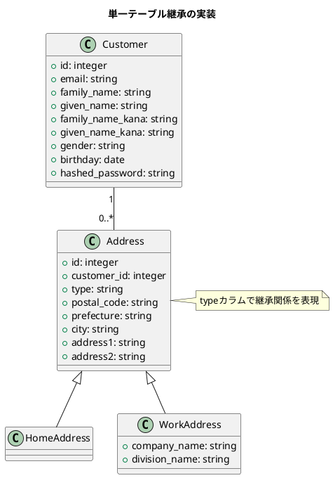
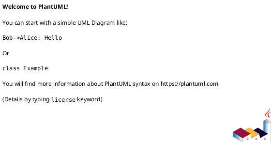

# 作業履歴 2017-02-04

## 概要

2017-02-04の作業内容をまとめています。この日は主に「単一テーブル継承」機能の実装と、JavaScriptの読み込み不具合修正を行いました。

### 実装内容の説明

#### 単一テーブル継承（Single Table Inheritance）

単一テーブル継承は、オブジェクト指向プログラミングの継承概念をデータベースに適用する手法です。この実装により、顧客関連の情報（住所や電話番号など）を効率的に管理できるようになりました。



#### JavaScriptの読み込み不具合修正

各インターフェース（管理者、職員、顧客）のJavaScriptファイルで共通ライブラリの読み込みが正しく行われるよう修正しました。

### アーキテクチャとの関連

この実装は、[アーキテクチャ概要](../アーキテクチャ概要.md)の「5. 主要なデータモデル」セクションに記載されている顧客、住所、電話番号のモデル関連を実現するものです。特に以下の部分に関連しています：

```
Customer ||--o{ HomeAddress
Customer ||--o{ WorkAddress
Customer ||--o{ Phone
```

### ユースケースとの関連

この実装は、[ユースケース](../ユースケース.md)の「3.2. 顧客管理」セクションに記載されている以下のユースケースをサポートします：

- S-004: 顧客情報登録
- S-005: 顧客情報検索
- S-006: 顧客情報更新

## コミット: 6d1204e

### メッセージ

```
単一テーブ継承 #13
```

### 変更されたファイル

- M	app/views/staff/top/index.html.erb

### 変更内容

```diff
commit 6d1204e22a968fad40ca1750e7f6ce79ac996656
Author: k2works <kakimomokuri@gmail.com>
Date:   Sat Feb 4 15:33:12 2017 +0900

    単一テーブ継承 #13

diff --git a/app/views/staff/top/index.html.erb b/app/views/staff/top/index.html.erb
index 12d9143..cda3f0f 100644
--- a/app/views/staff/top/index.html.erb
+++ b/app/views/staff/top/index.html.erb
@@ -8,6 +8,10 @@
     <h2 class="sectionLabel">お知らせ</h2>
   </div>
   <ol class="NewsList">
+    <li class="NewsList__item">
+      <time class="NewsList__head" datatime="2017-2-4">2017.2.4</time>
+      <span class="NewsList__body">顧客管理機能を追加</span>
+    </li>
     <li class="NewsList__item">
       <time class="NewsList__head" datatime="2017-2-2">2017.2.2</time>
       <span class="NewsList__body">パスワード変更機能を追加</span>

```

## コミット: 423c08a

### メッセージ

```
Merge branch 'wip'
```

### 変更されたファイル


### 変更内容

```diff
commit 423c08ab0ec62d6e038d6e9d1afc576a2203b643
Merge: 1b81ab5 d4c2acb
Author: k2works <kakimomokuri@gmail.com>
Date:   Sat Feb 4 15:31:20 2017 +0900

    Merge branch 'wip'


```

## コミット: d4c2acb

### メッセージ

```
javascript読み込み不具合修正
```

### 変更されたファイル

- M	app/assets/javascripts/admin.js
- M	app/assets/javascripts/customer.js
- M	app/assets/javascripts/staff.js

### 変更内容

```diff
commit d4c2acba426a968d6e1f36957a25b6f072c58bcd
Author: k2works <kakimomokuri@gmail.com>
Date:   Sat Feb 4 15:30:54 2017 +0900

    javascript読み込み不具合修正

diff --git a/app/assets/javascripts/admin.js b/app/assets/javascripts/admin.js
index 46d0b8e..9c88f37 100644
--- a/app/assets/javascripts/admin.js
+++ b/app/assets/javascripts/admin.js
@@ -14,6 +14,7 @@
 //= require jquery_ujs
 //= require turbolinks
 //= require bootstrap-sprockets
+//= require_tree ./lib
 //= require_tree ./shared
 //= require jquery-ui/datepicker
 //= require jquery-ui/datepicker-ja
diff --git a/app/assets/javascripts/customer.js b/app/assets/javascripts/customer.js
index c8586cb..32e4a67 100644
--- a/app/assets/javascripts/customer.js
+++ b/app/assets/javascripts/customer.js
@@ -14,6 +14,7 @@
 //= require jquery_ujs
 //= require turbolinks
 //= require bootstrap-sprockets
+//= require_tree ./lib
 //= require_tree ./shared
 //= require jquery-ui/datepicker
 //= require jquery-ui/datepicker-ja
diff --git a/app/assets/javascripts/main.js b/app/assets/javascripts/shared/main.js
similarity index 81%
rename from app/assets/javascripts/main.js
rename to app/assets/javascripts/shared/main.js
index ffd10d2..9343c80 100644
--- a/app/assets/javascripts/main.js
+++ b/app/assets/javascripts/shared/main.js
@@ -1,26 +1,30 @@
 /* main.js */

 /* メニュー */
-(function(){
-    function toggle(targetDOM, _className, callback) {
-        var className = ' '+_className;
-        return function(e) {
-            if(targetDOM.className.indexOf(_className)>-1) {
-                targetDOM.className = targetDOM.className.replace(className, '');
-            } else {
-                targetDOM.className += className;
+(function() {
+    $(document).on("turbolinks:load", function() {
+        return (function(){
+            function toggle(targetDOM, _className, callback) {
+                var className = ' '+_className;
+                return function(e) {
+                    if(targetDOM.className.indexOf(_className)>-1) {
+                        targetDOM.className = targetDOM.className.replace(className, '');
+                    } else {
+                        targetDOM.className += className;
+                    }
+                }
             }
-        }
-    }
-    var menuButton = document.getElementById('menu-button'),
-        wrapper = document.getElementById('wrapper'),
-        overlay = document.getElementById('overlay'),
-        toggleMenu = toggle(wrapper, 'isOpened');
+            var menuButton = document.getElementById('menu-button'),
+                wrapper = document.getElementById('wrapper'),
+                overlay = document.getElementById('overlay'),
+                toggleMenu = toggle(wrapper, 'isOpened');

-    menuButton.addEventListener('click', toggleMenu, false);
-    overlay.addEventListener('click', toggleMenu, false);
+            menuButton.addEventListener('click', toggleMenu, false);
+            overlay.addEventListener('click', toggleMenu, false);

-}());
+        }());
+    });
+}).call(this);

 /* 画像スライダー */
 // @param {string} id - ラッパー要素のid
diff --git a/app/assets/javascripts/staff.js b/app/assets/javascripts/staff.js
index a53eecd..aa1bf0e 100644
--- a/app/assets/javascripts/staff.js
+++ b/app/assets/javascripts/staff.js
@@ -14,6 +14,7 @@
 //= require jquery_ujs
 //= require turbolinks
 //= require bootstrap-sprockets
+//= require_tree ./lib
 //= require_tree ./shared
 //= require jquery-ui/datepicker
 //= require jquery-ui/datepicker-ja

```

## コミット: 0222844

### メッセージ

```
i18n設定追加
```

### 変更されたファイル

- M	app/views/staff/customers/_customer_fields.html.erb
- M	app/views/staff/customers/_form.html.erb
- M	app/views/staff/customers/_home_address_fields.html.erb
- M	app/views/staff/customers/_work_address_fields.html.erb
- M	app/views/staff/customers/show.html.erb
- M	config/locales/models/ja.yml
- M	config/locales/views/ja.yml

### 変更内容

```diff
commit 0222844e278cae2ec58547831ef4678df1953ac8
Author: k2works <kakimomokuri@gmail.com>
Date:   Sat Feb 4 15:09:13 2017 +0900

    i18n設定追加

diff --git a/app/views/staff/customers/_customer_fields.html.erb b/app/views/staff/customers/_customer_fields.html.erb
index a2871e1..cb1bc77 100644
--- a/app/views/staff/customers/_customer_fields.html.erb
+++ b/app/views/staff/customers/_customer_fields.html.erb
@@ -2,12 +2,12 @@
 <%= markup do |m|
   p = Staff::CustomerFormPresenter.new(ff,self)
   p.with_options(required: true) do |q|
-    m << q.text_field_block(:email, 'メールアドレス', size: 32)
-    m << q.password_field_block(:password, 'パスワード', size: 32)
-    m << q.full_name_block(:family_name, :given_name, '氏名')
-    m << q.full_name_block(:family_name_kana, :given_name_kana, 'フリガナ')
+    m << q.text_field_block(:email, t('activerecord.attributes.customer.email'), size: 32)
+    m << q.password_field_block(:password, t('activerecord.attributes.customer.hashed_password'), size: 32)
+    m << q.full_name_block(:family_name, :given_name, t('activerecord.attributes.customer.full_name'))
+    m << q.full_name_block(:family_name_kana, :given_name_kana, t('activerecord.attributes.customer.full_name'))
   end
-  m << p.birthday_field_block(:birthday, '生年月日')
+  m << p.birthday_field_block(:birthday, t('activerecord.attributes.customer.birthday'))
   m << p.gender_field_block
   end %>
 <% end %>
\ No newline at end of file
diff --git a/app/views/staff/customers/_form.html.erb b/app/views/staff/customers/_form.html.erb
index 533dd1e..011332c 100644
--- a/app/views/staff/customers/_form.html.erb
+++ b/app/views/staff/customers/_form.html.erb
@@ -1,13 +1,13 @@
 <%= FormPresenter.new(f,self).notes %>
 <fieldset id="customer-fields">
-  <legend>基本情報</legend>
+  <legend><%= t('staff.customers.new.basic_info') %></legend>
   <%= render 'customer_fields', f: f %>
 </fieldset>
 <fieldset id="home-address-fields">
-  <legend>自宅住所</legend>
+  <legend><%= t('staff.customers.new.home_address') %></legend>
   <%= render 'home_address_fields', f: f %>
 </fieldset>
 <fieldset id="work-address-fields">
-  <legend>勤務先</legend>
+  <legend><%= t('staff.customers.new.work_address') %></legend>
   <%= render 'work_address_fields', f: f %>
 </fieldset>
diff --git a/app/views/staff/customers/_home_address_fields.html.erb b/app/views/staff/customers/_home_address_fields.html.erb
index 7ae752b..0efe6ee 100644
--- a/app/views/staff/customers/_home_address_fields.html.erb
+++ b/app/views/staff/customers/_home_address_fields.html.erb
@@ -2,11 +2,11 @@
 <%= markup do |m|
   p = Staff::AddressFormPresenter.new(ff,self)
   p.with_options(required: true) do |q|
-    m << q.postal_code_block(:postal_code, '郵便番号', size: 7)
-    m << q.drop_down_list_block(:prefecture, '都道府県',Address::PREFECTURE_NAMES)
-    m << q.text_field_block(:city, '市区町村', size: 16)
-    m << q.text_field_block(:address1, '町域、番地等', size: 40)
+    m << q.postal_code_block(:postal_code, t('activerecord.attributes.home_address.postal_code'), size: 7)
+    m << q.drop_down_list_block(:prefecture, t('activerecord.attributes.home_address.prefecture'),Address::PREFECTURE_NAMES)
+    m << q.text_field_block(:city, t('activerecord.attributes.home_address.city'), size: 16)
+    m << q.text_field_block(:address1, t('activerecord.attributes.home_address.address1'), size: 40)
   end
-  m << p.text_field_block(:address2, '建物名、部屋番号名', size: 40)
+  m << p.text_field_block(:address2, t('activerecord.attributes.home_address.address2'), size: 40)
 end %>
 <% end %>
diff --git a/app/views/staff/customers/_work_address_fields.html.erb b/app/views/staff/customers/_work_address_fields.html.erb
index f660f7d..102516e 100644
--- a/app/views/staff/customers/_work_address_fields.html.erb
+++ b/app/views/staff/customers/_work_address_fields.html.erb
@@ -1,12 +1,12 @@
 <%= f.fields_for :work_address, f.object.customer.work_address do |ff| %>
     <%= markup do |m|
       p = Staff::AddressFormPresenter.new(ff,self)
-      m << p.text_field_block(:company_name, '会社名', size: 40, required: true)
-      m << p.text_field_block(:division_name, '部署名', size: 40)
-      m << p.postal_code_block(:postal_code, '郵便番号', size: 7)
-      m << p.drop_down_list_block(:prefecture, '都道府県',Address::PREFECTURE_NAMES)
-      m << p.text_field_block(:city, '市区町村', size: 16)
-      m << p.text_field_block(:address1, '町域、番地等', size: 40)
-      m << p.text_field_block(:address2, '建物名、部屋番号名', size: 40)
+      m << p.text_field_block(:company_name, t('activerecord.attributes.work_address.company_name'), size: 40, required: true)
+      m << p.text_field_block(:division_name, t('activerecord.attributes.work_address.division_name'), size: 40)
+      m << p.postal_code_block(:postal_code, t('activerecord.attributes.work_address.postal_code'), size: 7)
+      m << p.drop_down_list_block(:prefecture, t('activerecord.attributes.work_address.prefecture'),Address::PREFECTURE_NAMES)
+      m << p.text_field_block(:city, t('activerecord.attributes.work_address.city'), size: 16)
+      m << p.text_field_block(:address1, t('activerecord.attributes.work_address.address1'), size: 40)
+      m << p.text_field_block(:address2, t('activerecord.attributes.work_address.address2'), size: 40)
     end %>
 <% end %>
diff --git a/app/views/staff/customers/show.html.erb b/app/views/staff/customers/show.html.erb
index 53cec0c..0b78d96 100644
--- a/app/views/staff/customers/show.html.erb
+++ b/app/views/staff/customers/show.html.erb
@@ -5,33 +5,33 @@

 <section class="Section l-column Table StaffTable">
   <table class="Table__body Table__body--attributes StaffTable__body">
-    <tr class="Table__tr"><th class="Table__th" colspan="2">基本情報</th></tr>
+    <tr class="Table__tr"><th class="Table__th" colspan="2"><%= t('.basic_info') %></th></tr>
     <% p1 = Staff::CustomerPresenter.new(@customer, self) %>
-    <tr class="Table__tr"><th class="Table__th">氏名</th><td><%= p1.full_name %></td></tr>
-    <tr class="Table__tr"><th class="Table__th">フリガナ</th><td><%= p1.full_name_kana %></td></tr>
-    <tr class="Table__tr"><th class="Table__th">生年月日</th><td class="Table__td--date"><%= p1.birthday %></td></tr>
-    <tr class="Table__tr"><th class="Table__th">性別</th><td><%= p1.gender %></td></tr>
-    <tr class="Table__tr"><th class="Table__th">登録日時</th><td class="Table__td--date"><%= p1.created_at %></td></tr>
-    <tr class="Table__tr"><th class="Table__th">更新日時</th><td class="Table__td--date"><%= p1.updated_at %></td></tr>
+    <tr class="Table__tr"><th class="Table__th"><%= t('.full_name') %></th><td><%= p1.full_name %></td></tr>
+    <tr class="Table__tr"><th class="Table__th"><%= t('.full_name_kana') %></th><td><%= p1.full_name_kana %></td></tr>
+    <tr class="Table__tr"><th class="Table__th"><%= t('.birthday') %></th><td class="Table__td--date"><%= p1.birthday %></td></tr>
+    <tr class="Table__tr"><th class="Table__th"><%= t('.gender') %></th><td><%= p1.gender %></td></tr>
+    <tr class="Table__tr"><th class="Table__th"><%= t('.create_at') %></th><td class="Table__td--date"><%= p1.created_at %></td></tr>
+    <tr class="Table__tr"><th class="Table__th"><%= t('.update_at')%></th><td class="Table__td--date"><%= p1.updated_at %></td></tr>
     <% if @customer.home_address %>
       <% p2 = Staff::AddressPresenter.new(@customer.home_address, self) %>
-      <tr class="Table__tr"><th class="Table__th" colspan="2">自宅住所</th></tr>
-      <tr class="Table__tr"><th class="Table__th">郵便番号</th><td><%= p2.postal_code %></td></tr>
-      <tr class="Table__tr"><th class="Table__th">都道府県</th><td><%= p2.prefecture %></td></tr>
-      <tr class="Table__tr"><th class="Table__th">市区町村</th><td><%= p2.city %></td></tr>
-      <tr class="Table__tr"><th class="Table__th">町域、番地等</th><td><%= p2.address1 %></td></tr>
-      <tr class="Table__tr"><th class="Table__th">建物名、部屋番号</th><td><%= p2.address2 %></td></tr>
+      <tr class="Table__tr"><th class="Table__th" colspan="2"><%= t('.home_address') %></th></tr>
+      <tr class="Table__tr"><th class="Table__th"><%= t('.home_address_postal_code') %></th><td><%= p2.postal_code %></td></tr>
+      <tr class="Table__tr"><th class="Table__th"><%= t('.home_address_prefecture') %></th><td><%= p2.prefecture %></td></tr>
+      <tr class="Table__tr"><th class="Table__th"><%= t('.home_address_city') %></th><td><%= p2.city %></td></tr>
+      <tr class="Table__tr"><th class="Table__th"><%= t('.home_address_address1') %></th><td><%= p2.address1 %></td></tr>
+      <tr class="Table__tr"><th class="Table__th"><%= t('.home_address_address2') %></th><td><%= p2.address2 %></td></tr>
     <% end %>
     <% if @customer.work_address %>
         <% p3 = Staff::AddressPresenter.new(@customer.work_address, self) %>
-        <tr class="Table__tr"><th class="Table__th" colspan="2">勤務先</th></tr>
-        <tr class="Table__tr"><th class="Table__th">会社名</th><td><%= p3.company_name %></td></tr>
-        <tr class="Table__tr"><th class="Table__th">部署名</th><td><%= p3.division_name %></td></tr>
-        <tr class="Table__tr"><th class="Table__th">郵便番号</th><td><%= p3.postal_code %></td></tr>
-        <tr class="Table__tr"><th class="Table__th">都道府県</th><td><%= p3.prefecture %></td></tr>
-        <tr class="Table__tr"><th class="Table__th">市区町村</th><td><%= p3.city %></td></tr>
-        <tr class="Table__tr"><th class="Table__th">町域、番地等</th><td><%= p3.address1 %></td></tr>
-        <tr class="Table__tr"><th class="Table__th">建物名、部屋番号</th><td><%= p3.address2 %></td></tr>
+        <tr class="Table__tr"><th class="Table__th" colspan="2"><%= t('.work_address') %></th></tr>
+        <tr class="Table__tr"><th class="Table__th"><%= t('.work_address_company_name') %></th><td><%= p3.company_name %></td></tr>
+        <tr class="Table__tr"><th class="Table__th"><%= t('.work_address_division_name') %></th><td><%= p3.division_name %></td></tr>
+        <tr class="Table__tr"><th class="Table__th"><%= t('.work_address_postal_code') %></th><td><%= p3.postal_code %></td></tr>
+        <tr class="Table__tr"><th class="Table__th"><%= t('.work_address_prefecture')%></th><td><%= p3.prefecture %></td></tr>
+        <tr class="Table__tr"><th class="Table__th"><%= t('.work_address_city') %></th><td><%= p3.city %></td></tr>
+        <tr class="Table__tr"><th class="Table__th"><%= t('.work_address_address1') %></th><td><%= p3.address1 %></td></tr>
+        <tr class="Table__tr"><th class="Table__th"><%= t('.work_address_address2') %></th><td><%= p3.address2 %></td></tr>
     <% end %>
   </table>
 </section>
\ No newline at end of file
diff --git a/config/locales/models/ja.yml b/config/locales/models/ja.yml
index 9f4947d..b4eafec 100644
--- a/config/locales/models/ja.yml
+++ b/config/locales/models/ja.yml
@@ -4,6 +4,8 @@ ja:
       administrator: 管理者
       staff_member: 職員
       staff_event: 職員イベント
+      customer: 顧客
+      address: 住所

     attributes:
       administrator:
@@ -35,6 +37,46 @@ ja:
           logged_out: ログアウト
           rejected: ログイン拒否

+      customer:
+        email: メールアドレス
+        email_for_index: 顧客用メールアドレス
+        family_name: 姓
+        given_name: 名
+        family_name_kana: 姓（カナ）
+        given_name_kana: 名（カナ）
+        gender: 性別
+        birthday: 誕生日
+        hashed_password: パスワード
+        home_address: 自宅住所
+        work_address: 勤務先
+        full_name: 氏名
+        full_name_kana: フリガナ
+
+      address:
+        postal_code: 郵便番号
+        prefecture: 都道府県
+        city: 市区町村
+        address1: 町域・番地等
+        address2: 建物名・部屋番号
+        company_name: 会社名
+        division_name: 部署名
+
+      home_address:
+        postal_code: 郵便番号
+        prefecture: 都道府県
+        city: 市区町村
+        address1: 町域・番地等
+        address2: 建物名・部屋番号
+
+      work_address:
+        postal_code: 郵便番号
+        prefecture: 都道府県
+        city: 市区町村
+        address1: 町域・番地等
+        address2: 建物名・部屋番号
+        company_name: 会社名
+        division_name: 部署名
+
     errors:
       models:
         staff_member:
diff --git a/config/locales/views/ja.yml b/config/locales/views/ja.yml
index 56c6d3a..01db59a 100644
--- a/config/locales/views/ja.yml
+++ b/config/locales/views/ja.yml
@@ -30,8 +30,32 @@ ja:
         confirm: '本当に削除しますか?'
       show:
         title: '顧客詳細情報'
+        basic_info: '基本情報'
+        home_address: '自宅住所'
+        work_address: '勤務先'
+        full_name: '氏名'
+        full_name_kana: 'フリガナ'
+        birthday: '生年月日'
+        gender: '性別'
+        create_at: '登録日時'
+        update_at: '更新日時'
+        home_address_postal_code: '郵便番号'
+        home_address_prefecture: '都道府県'
+        home_address_city: '市区町村'
+        home_address_address1: '町域、番地等'
+        home_address_address2: '建物名、部屋番号'
+        work_address_company_name: '会社名'
+        work_address_division_name: '部署名'
+        work_address_postal_code: '郵便番号'
+        work_address_prefecture: '都道府県'
+        work_address_city: '市区町村'
+        work_address_address1: '町域、番地等'
+        work_address_address2: '建物名、部屋番号'
       new:
         title: '顧客の新規登録'
+        basic_info: '基本情報'
+        home_address: '自宅住所'
+        work_address: '勤務先'
         create: '登録'
         cancel: 'キャンセル'
       edit:

```

## コミット: c7ef32d

### メッセージ

```
destroyアクションの実装 #13
```

### 変更されたファイル

- M	README.md
- M	app/controllers/staff/customers_controller.rb
- M	config/locales/controllers/ja.yml

### 変更内容

```diff
commit c7ef32daf2bc5d710073f6e169ca2df3e7445e07
Author: k2works <kakimomokuri@gmail.com>
Date:   Sat Feb 4 14:08:02 2017 +0900

    destroyアクションの実装 #13

diff --git a/README.md b/README.md
index 6d5229b..ef5ff0b 100644
--- a/README.md
+++ b/README.md
@@ -564,6 +564,7 @@ git push heroku master
 #### 顧客アカウントの新規登録・更新・削除
 + フォームオブジェクトの拡張
 + create/updateアクションの実装
++ destroyアクションの実装

 ### Capybara
 ### フォームオブジェクト
diff --git a/app/controllers/staff/customers_controller.rb b/app/controllers/staff/customers_controller.rb
index 6207a88..3969abe 100644
--- a/app/controllers/staff/customers_controller.rb
+++ b/app/controllers/staff/customers_controller.rb
@@ -38,4 +38,11 @@ class Staff::CustomersController < Staff::Base
       render action: 'edit'
     end
   end
+
+  def destroy
+    customer = Customer.find(params[:id])
+    customer.destroy!
+    flash.notice = t('.flash_notice')
+    redirect_to :staff_customers
+  end
 end
diff --git a/config/locales/controllers/ja.yml b/config/locales/controllers/ja.yml
index bbfe3ee..b400f59 100644
--- a/config/locales/controllers/ja.yml
+++ b/config/locales/controllers/ja.yml
@@ -29,6 +29,8 @@ ja:
       update:
         flash_notice: '顧客を更新しました。'
         flash_alert: '入力に誤りがあります。'
+      destroy:
+        flash_notice: '顧客をアカウントを削除しました。'
   admin:
     base:
       authrize:

```

### 構造変更



## コミット: c77696c

### メッセージ

```
create/updateアクションの実装 #13
```

### 変更されたファイル

- M	README.md
- M	app/controllers/staff/customers_controller.rb
- M	app/forms/staff/customer_form.rb
- M	config/locales/controllers/ja.yml

### 変更内容

```diff
commit c77696cfeb66c72ff280f5b4695f051377179c63
Author: k2works <kakimomokuri@gmail.com>
Date:   Sat Feb 4 14:02:05 2017 +0900

    create/updateアクションの実装 #13

diff --git a/README.md b/README.md
index efc01d4..6d5229b 100644
--- a/README.md
+++ b/README.md
@@ -563,6 +563,7 @@ git push heroku master

 #### 顧客アカウントの新規登録・更新・削除
 + フォームオブジェクトの拡張
++ create/updateアクションの実装

 ### Capybara
 ### フォームオブジェクト
diff --git a/app/controllers/staff/customers_controller.rb b/app/controllers/staff/customers_controller.rb
index ffa88e4..6207a88 100644
--- a/app/controllers/staff/customers_controller.rb
+++ b/app/controllers/staff/customers_controller.rb
@@ -14,4 +14,28 @@ class Staff::CustomersController < Staff::Base
   def edit
     @customer_form = Staff::CustomerForm.new(Customer.find(params[:id]))
   end
+
+  def create
+    @customer_form = Staff::CustomerForm.new
+    @customer_form.assign_attributes(params[:form])
+    if @customer_form.save
+      flash.notice = t('.flash_notice')
+      redirect_to action: 'index'
+    else
+      flash.now.alert = t('.flash_alert')
+      render action: 'new'
+    end
+  end
+
+  def update
+    @customer_form = Staff::CustomerForm.new(Customer.find(params[:id]))
+    @customer_form.assign_attributes(params[:form])
+    if @customer_form.save
+      flash.notice = t('.flash_notice')
+      redirect_to action: 'index'
+    else
+      flash.now.alert = t('.flash_alert')
+      render action: 'edit'
+    end
+  end
 end
diff --git a/app/forms/staff/customer_form.rb b/app/forms/staff/customer_form.rb
index 2c43187..69dc6e2 100644
--- a/app/forms/staff/customer_form.rb
+++ b/app/forms/staff/customer_form.rb
@@ -14,7 +14,7 @@ class Staff::CustomerForm
   def assign_attributes(params = {})
     @params = params

-    customer.assign_attributes(customer_parmas)
+    customer.assign_attributes(customer_params)
     customer.home_address.assign_attributes(home_address_params)
     customer.work_address.assign_attributes(work_address_params)
   end
diff --git a/config/locales/controllers/ja.yml b/config/locales/controllers/ja.yml
index 269cbec..bbfe3ee 100644
--- a/config/locales/controllers/ja.yml
+++ b/config/locales/controllers/ja.yml
@@ -22,6 +22,13 @@ ja:
       update:
         flash_success: 'パスワードを変更しました。'
         flash_alert: '入力に誤りがあります。'
+    customers:
+      create:
+        flash_notice: '顧客を追加しました。'
+        flash_alert: '入力に誤りがあります。'
+      update:
+        flash_notice: '顧客を更新しました。'
+        flash_alert: '入力に誤りがあります。'
   admin:
     base:
       authrize:

```

### 構造変更


## コミット: 223cdfb

### メッセージ

```
フォームオブジェクトの拡張 #13
```

### 変更されたファイル

- M	README.md
- M	app/forms/staff/customer_form.rb

### 変更内容

```diff
commit 223cdfb88204178f64f8a2f8debd18494333f3be
Author: k2works <kakimomokuri@gmail.com>
Date:   Sat Feb 4 13:44:17 2017 +0900

    フォームオブジェクトの拡張 #13

diff --git a/README.md b/README.md
index 23ad161..efc01d4 100644
--- a/README.md
+++ b/README.md
@@ -562,6 +562,7 @@ git push heroku master
 + 部分テンプレート郡の作成

 #### 顧客アカウントの新規登録・更新・削除
++ フォームオブジェクトの拡張

 ### Capybara
 ### フォームオブジェクト
diff --git a/app/forms/staff/customer_form.rb b/app/forms/staff/customer_form.rb
index 3a7edae..2c43187 100644
--- a/app/forms/staff/customer_form.rb
+++ b/app/forms/staff/customer_form.rb
@@ -10,4 +10,56 @@ class Staff::CustomerForm
     @customer.build_home_address unless @customer.home_address
     @customer.build_work_address unless @customer.work_address
   end
+
+  def assign_attributes(params = {})
+    @params = params
+
+    customer.assign_attributes(customer_parmas)
+    customer.home_address.assign_attributes(home_address_params)
+    customer.work_address.assign_attributes(work_address_params)
+  end
+
+  def save
+    ActiveRecord::Base.transaction do
+      customer.save!
+      customer.home_address.save!
+      customer.work_address.save!
+    end
+  end
+
+  private
+  def customer_params
+    @params.require(:customer).permit(
+                                  :email,
+                                  :password,
+                                  :family_name,
+                                  :given_name,
+                                  :family_name_kana,
+                                  :given_name_kana,
+                                  :birthday,
+                                  :gender
+    )
+  end
+
+  def home_address_params
+    @params.require(:home_address).permit(
+                                     :postal_code,
+                                     :prefecture,
+                                     :city,
+                                     :address1,
+                                     :address2,
+    )
+  end
+
+  def work_address_params
+    @params.require(:work_address).permit(
+                                      :postal_code,
+                                      :prefecture,
+                                      :city,
+                                      :address1,
+                                      :address2,
+                                      :company_name,
+                                      :division_name
+    )
+  end
 end
\ No newline at end of file

```
