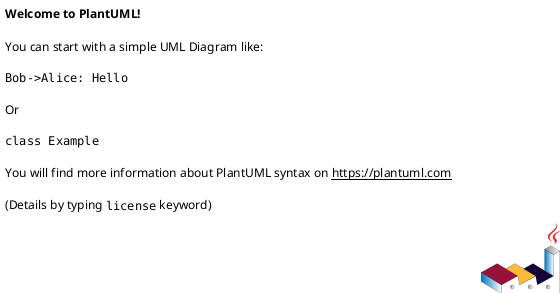

# 作業履歴 2017-02-06

## 概要

2017-02-06の作業内容をまとめています。

## コミット: a2f9e37

### メッセージ

```
顧客詳細ページへの電話番号の表示 #15
```

### 変更されたファイル

- A	app/models/phone.rb
- A	db/migrate/20170206085929_create_phones.rb
- A	spec/factories/phones.rb

### 変更内容

```diff
commit a2f9e37965f00d1ebe55bf0a2cfc959c9d07ede7
Author: k2works <kakimomokuri@gmail.com>
Date:   Mon Feb 6 20:19:37 2017 +0900

    顧客詳細ページへの電話番号の表示 #15

diff --git a/app/models/phone.rb b/app/models/phone.rb
new file mode 100644
index 0000000..386e689
--- /dev/null
+++ b/app/models/phone.rb
@@ -0,0 +1,37 @@
+# == Schema Information
+#
+# Table name: phones # 電話
+#
+#  id               :integer          not null, primary key
+#  customer_id      :integer          not null               # 顧客への外部キー
+#  address_id       :integer                                 # 住所への外部キー
+#  number           :string(255)      not null               # 電話番号
+#  number_for_index :string(255)      not null               # 索引用電話番号
+#  primary          :boolean          default("0"), not null # 優先フラグ
+#  created_at       :datetime         not null
+#  updated_at       :datetime         not null
+#
+# Indexes
+#
+#  index_phones_on_address_id        (address_id)
+#  index_phones_on_customer_id       (customer_id)
+#  index_phones_on_number_for_index  (number_for_index)
+#
+
+class Phone < ApplicationRecord
+  include StringNormalizer
+
+  belongs_to :customer
+  belongs_to :address
+
+  before_validation do
+    self.number = normalize_as_phone_number(number)
+    self.number_for_index = number.gsub(/\D/, '') if number
+  end
+
+  before_create do
+    self.customer = address.customer if address
+  end
+
+  validates :number, presence: true, format: { with: /\A\+?\d+(-\d+)*\z/, allow_blank: true }
+end
diff --git a/db/migrate/20170206085929_create_phones.rb b/db/migrate/20170206085929_create_phones.rb
new file mode 100644
index 0000000..f9f0714
--- /dev/null
+++ b/db/migrate/20170206085929_create_phones.rb
@@ -0,0 +1,17 @@
+class CreatePhones < ActiveRecord::Migration[5.0]
+  def change
+    create_table :phones,comment:'電話' do |t|
+      t.references :customer, null: false, comment: '顧客への外部キー'
+      t.references :address, comment: '住所への外部キー'
+      t.string :number, null: false, comment: '電話番号'
+      t.string :number_for_index, null: false, comment: '索引用電話番号'
+      t.boolean :primary,   null: false, default: false, comment: '優先フラグ'
+
+      t.timestamps
+    end
+
+    add_index :phones, :number_for_index
+    add_foreign_key :phones, :customers
+    add_foreign_key :phones, :addresses
+  end
+end
diff --git a/spec/factories/phones.rb b/spec/factories/phones.rb
new file mode 100644
index 0000000..4ef34b3
--- /dev/null
+++ b/spec/factories/phones.rb
@@ -0,0 +1,25 @@
+# == Schema Information
+#
+# Table name: phones # 電話
+#
+#  id               :integer          not null, primary key
+#  customer_id      :integer          not null               # 顧客への外部キー
+#  address_id       :integer                                 # 住所への外部キー
+#  number           :string(255)      not null               # 電話番号
+#  number_for_index :string(255)      not null               # 索引用電話番号
+#  primary          :boolean          default("0"), not null # 優先フラグ
+#  created_at       :datetime         not null
+#  updated_at       :datetime         not null
+#
+# Indexes
+#
+#  index_phones_on_address_id        (address_id)
+#  index_phones_on_customer_id       (customer_id)
+#  index_phones_on_number_for_index  (number_for_index)
+#
+
+FactoryGirl.define do
+  factory :phone do
+    
+  end
+end

```

### 構造変更



## コミット: 4a6edde

### メッセージ

```
顧客詳細ページへの電話番号の表示 #15
```

### 変更されたファイル

- M	README.md
- M	app/presenters/staff/address_presenter.rb
- M	app/presenters/staff/customer_presenter.rb
- M	app/views/staff/customers/show.html.erb
- M	config/locales/views/ja.yml

### 変更内容

```diff
commit 4a6edde7fe2a709574d77e797aa7263ba0963fe7
Author: k2works <kakimomokuri@gmail.com>
Date:   Mon Feb 6 20:18:31 2017 +0900

    顧客詳細ページへの電話番号の表示 #15

diff --git a/README.md b/README.md
index 55df9b9..43aae6a 100644
--- a/README.md
+++ b/README.md
@@ -594,6 +594,7 @@ git push heroku master
 + 電話番号管理機能の仕様
 + phonesテーブルとPhoneモデル
 + 顧客、自宅住所、勤務先との関連付け
++ 顧客詳細ページへの電話番号の表示
 
 #### 顧客電話番号の管理（２）
 #### 演習問題 
diff --git a/app/presenters/staff/address_presenter.rb b/app/presenters/staff/address_presenter.rb
index 313757d..e633329 100644
--- a/app/presenters/staff/address_presenter.rb
+++ b/app/presenters/staff/address_presenter.rb
@@ -13,4 +13,8 @@ class Staff::AddressPresenter < ModelPresenter
       object.postal_code
     end
   end
+
+  def phones
+    object.phones.map(&:number)
+  end
 end
\ No newline at end of file
diff --git a/app/presenters/staff/customer_presenter.rb b/app/presenters/staff/customer_presenter.rb
index dc698ec..c699b87 100644
--- a/app/presenters/staff/customer_presenter.rb
+++ b/app/presenters/staff/customer_presenter.rb
@@ -24,4 +24,8 @@ class Staff::CustomerPresenter < ModelPresenter
         ''
     end
   end
+
+  def personal_phones
+    object.personal_phones.map(&:number)
+  end
 end
\ No newline at end of file
diff --git a/app/views/staff/customers/show.html.erb b/app/views/staff/customers/show.html.erb
index 0b78d96..67ffbe8 100644
--- a/app/views/staff/customers/show.html.erb
+++ b/app/views/staff/customers/show.html.erb
@@ -13,14 +13,18 @@
     <tr class="Table__tr"><th class="Table__th"><%= t('.gender') %></th><td><%= p1.gender %></td></tr>
     <tr class="Table__tr"><th class="Table__th"><%= t('.create_at') %></th><td class="Table__td--date"><%= p1.created_at %></td></tr>
     <tr class="Table__tr"><th class="Table__th"><%= t('.update_at')%></th><td class="Table__td--date"><%= p1.updated_at %></td></tr>
+    <tr class="Table__tr"><th class="Table__th"><%= t('.personal_phones_1') %></th><td><%= p1.personal_phones[0] %></td></tr>
+    <tr class="Table__tr"><th class="Table__th"><%= t('.personal_phones_2') %></th><td><%= p1.personal_phones[1] %></td></tr>
     <% if @customer.home_address %>
       <% p2 = Staff::AddressPresenter.new(@customer.home_address, self) %>
-      <tr class="Table__tr"><th class="Table__th" colspan="2"><%= t('.home_address') %></th></tr>
-      <tr class="Table__tr"><th class="Table__th"><%= t('.home_address_postal_code') %></th><td><%= p2.postal_code %></td></tr>
-      <tr class="Table__tr"><th class="Table__th"><%= t('.home_address_prefecture') %></th><td><%= p2.prefecture %></td></tr>
-      <tr class="Table__tr"><th class="Table__th"><%= t('.home_address_city') %></th><td><%= p2.city %></td></tr>
-      <tr class="Table__tr"><th class="Table__th"><%= t('.home_address_address1') %></th><td><%= p2.address1 %></td></tr>
-      <tr class="Table__tr"><th class="Table__th"><%= t('.home_address_address2') %></th><td><%= p2.address2 %></td></tr>
+        <tr class="Table__tr"><th class="Table__th" colspan="2"><%= t('.home_address') %></th></tr>
+        <tr class="Table__tr"><th class="Table__th"><%= t('.home_address_postal_code') %></th><td><%= p2.postal_code %></td></tr>
+        <tr class="Table__tr"><th class="Table__th"><%= t('.home_address_prefecture') %></th><td><%= p2.prefecture %></td></tr>
+        <tr class="Table__tr"><th class="Table__th"><%= t('.home_address_city') %></th><td><%= p2.city %></td></tr>
+        <tr class="Table__tr"><th class="Table__th"><%= t('.home_address_address1') %></th><td><%= p2.address1 %></td></tr>
+        <tr class="Table__tr"><th class="Table__th"><%= t('.home_address_address2') %></th><td><%= p2.address2 %></td></tr>
+        <tr class="Table__tr"><th class="Table__th"><%= t('.home_address_phones_1') %></th><td><%= p2.phones[0] %></td></tr>
+        <tr class="Table__tr"><th class="Table__th"><%= t('.home_address_phones_2') %></th><td><%= p2.phones[1] %></td></tr>
     <% end %>
     <% if @customer.work_address %>
         <% p3 = Staff::AddressPresenter.new(@customer.work_address, self) %>
@@ -32,6 +36,8 @@
         <tr class="Table__tr"><th class="Table__th"><%= t('.work_address_city') %></th><td><%= p3.city %></td></tr>
         <tr class="Table__tr"><th class="Table__th"><%= t('.work_address_address1') %></th><td><%= p3.address1 %></td></tr>
         <tr class="Table__tr"><th class="Table__th"><%= t('.work_address_address2') %></th><td><%= p3.address2 %></td></tr>
-    <% end %>
+        <tr class="Table__tr"><th class="Table__th"><%= t('.work_address_phones_1') %></th><td><%= p3.phones[0] %></td></tr>
+        <tr class="Table__tr"><th class="Table__th"><%= t('.work_address_phones_2') %></th><td><%= p3.phones[1] %></td></tr>
+  <% end %>
   </table>
 </section>
\ No newline at end of file
diff --git a/config/locales/views/ja.yml b/config/locales/views/ja.yml
index a0d1b6b..446ccfa 100644
--- a/config/locales/views/ja.yml
+++ b/config/locales/views/ja.yml
@@ -39,11 +39,15 @@ ja:
         gender: '性別'
         create_at: '登録日時'
         update_at: '更新日時'
+        personal_phones_1: '個人電話番号（１）'
+        personal_phones_2: '個人電話番号（２）'
         home_address_postal_code: '郵便番号'
         home_address_prefecture: '都道府県'
         home_address_city: '市区町村'
         home_address_address1: '町域、番地等'
         home_address_address2: '建物名、部屋番号'
+        home_address_phones_1: '自宅電話番号（１）'
+        home_address_phones_2: '自宅電話番号（２）'
         work_address_company_name: '会社名'
         work_address_division_name: '部署名'
         work_address_postal_code: '郵便番号'
@@ -51,6 +55,8 @@ ja:
         work_address_city: '市区町村'
         work_address_address1: '町域、番地等'
         work_address_address2: '建物名、部屋番号'
+        work_address_phones_1: '勤務先電話番号（１）'
+        work_address_phones_2: '勤務先電話番号（２）'
       new:
         title: '顧客の新規登録'
         basic_info: '基本情報'

```

## コミット: c30c834

### メッセージ

```
顧客、自宅住所、勤務先との関連付け #15
```

### 変更されたファイル

- M	README.md
- M	app/models/address.rb
- M	app/models/customer.rb
- M	db/schema.rb
- M	db/seed/development/customers.rb

### 変更内容

```diff
commit c30c834fee5cbcee30a796013bc554bae3ccbac6
Author: k2works <kakimomokuri@gmail.com>
Date:   Mon Feb 6 20:07:05 2017 +0900

    顧客、自宅住所、勤務先との関連付け #15

diff --git a/README.md b/README.md
index 8daea5e..55df9b9 100644
--- a/README.md
+++ b/README.md
@@ -593,6 +593,7 @@ git push heroku master
 #### 顧客電話番号の管理（１） 
 + 電話番号管理機能の仕様
 + phonesテーブルとPhoneモデル
++ 顧客、自宅住所、勤務先との関連付け
 
 #### 顧客電話番号の管理（２）
 #### 演習問題 
diff --git a/app/models/address.rb b/app/models/address.rb
index e4133f5..b8ab123 100644
--- a/app/models/address.rb
+++ b/app/models/address.rb
@@ -25,6 +25,7 @@ class Address < ApplicationRecord
   include StringNormalizer
 
   belongs_to :customer
+  has_many :phones, -> { order(:id) }, dependent: :destroy, autosave: true
 
   before_validation do
     self.postal_code = normalize_as_postal_code(postal_code)
diff --git a/app/models/customer.rb b/app/models/customer.rb
index 3a480d3..423e927 100644
--- a/app/models/customer.rb
+++ b/app/models/customer.rb
@@ -28,6 +28,8 @@ class Customer < ApplicationRecord
 
   has_one :home_address, dependent: :destroy, autosave: true
   has_one :work_address, dependent: :destroy, autosave: true
+  has_many :phones, dependent: :destroy
+  has_many :personal_phones, -> { where(address_id: nil).order(:id) },class_name: 'Phone', autosave: true
 
   validates :gender, inclusion: { in: %w(male female), allow_blank: true }
   validates :birthday, date: {
diff --git a/db/schema.rb b/db/schema.rb
index f0ee063..7285822 100644
--- a/db/schema.rb
+++ b/db/schema.rb
@@ -54,14 +54,14 @@ ActiveRecord::Schema.define(version: 20170206085929) do
     t.index ["family_name_kana", "given_name_kana"], name: "index_customers_on_family_name_kana_and_given_name_kana", using: :btree
   end
 
-  create_table "phones", force: :cascade,  comment: "電話" do |t|
-    t.integer  "customer_id",      null: false
-    t.integer  "address_id"
-    t.string   "number",           null: false, comment: "電話番号"
-    t.string   "number_for_index", null: false, comment: "索引用電話番号"
-    t.boolean  "primary",          null: false, comment: "優先フラグ"
-    t.datetime "created_at",       null: false
-    t.datetime "updated_at",       null: false
+  create_table "phones", force: :cascade, comment: "電話" do |t|
+    t.integer  "customer_id",                      null: false, comment: "顧客への外部キー"
+    t.integer  "address_id",                                    comment: "住所への外部キー"
+    t.string   "number",                           null: false, comment: "電話番号"
+    t.string   "number_for_index",                 null: false, comment: "索引用電話番号"
+    t.boolean  "primary",          default: false, null: false, comment: "優先フラグ"
+    t.datetime "created_at",                       null: false
+    t.datetime "updated_at",                       null: false
     t.index ["address_id"], name: "index_phones_on_address_id", using: :btree
     t.index ["customer_id"], name: "index_phones_on_customer_id", using: :btree
     t.index ["number_for_index"], name: "index_phones_on_number_for_index", using: :btree
diff --git a/db/seed/development/customers.rb b/db/seed/development/customers.rb
index 1440187..674ffe3 100644
--- a/db/seed/development/customers.rb
+++ b/db/seed/development/customers.rb
@@ -43,6 +43,9 @@ company_names = %w(OIAX ABC XYZ)
         birthday: 60.years.ago.advance(seconds: rand(40.years)).to_date,
         gender: m < 5 ? 'male' : 'female'
     )
+    if m % 2 == 0
+      c.personal_phones.create!(number: sprintf('090-0000-%04d', n * 10 + m))
+    end
     c.create_home_address!(
         postal_code: sprintf('%07d', rand(10000000)),
         prefecture: Address::PREFECTURE_NAMES.sample,
@@ -50,6 +53,9 @@ company_names = %w(OIAX ABC XYZ)
         address1: '開発1-2-3',
         address2: 'レイルズハイツ301号室'
     )
+    if m % 10 == 0
+      c.home_address.phones.create!(number: sprintf('03-0000-%04d', n))
+    end
     if m % 3 == 0
       c.create_work_address!(
           postal_code: sprintf('%07d', rand(10000000)),

```

### 構造変更


## コミット: 72fc059

### メッセージ

```
phonesテーブルとPhoneモデル #15
```

### 変更されたファイル

- M	README.md
- M	app/models/concerns/string_normalizer.rb
- M	db/schema.rb

### 変更内容

```diff
commit 72fc0598f7a531afcd284d2859ba4cc1614d97c9
Author: k2works <kakimomokuri@gmail.com>
Date:   Mon Feb 6 18:28:21 2017 +0900

    phonesテーブルとPhoneモデル #15

diff --git a/README.md b/README.md
index 2bb5293..8daea5e 100644
--- a/README.md
+++ b/README.md
@@ -591,6 +591,9 @@ git push heroku master
 + Capybaraによるテスト
 
 #### 顧客電話番号の管理（１） 
++ 電話番号管理機能の仕様
++ phonesテーブルとPhoneモデル
+
 #### 顧客電話番号の管理（２）
 #### 演習問題 
 
diff --git a/app/models/concerns/string_normalizer.rb b/app/models/concerns/string_normalizer.rb
index f036970..c19131e 100644
--- a/app/models/concerns/string_normalizer.rb
+++ b/app/models/concerns/string_normalizer.rb
@@ -18,4 +18,8 @@ module StringNormalizer
   def normalize_as_postal_code(text)
     NKF.nkf('-w -Z1', text).strip.gsub(/-/, '') if text
   end
+
+  def normalize_as_phone_number(text)
+    NKF.nkf('-w -Z1', text).strip if text
+  end
 end
\ No newline at end of file
diff --git a/db/schema.rb b/db/schema.rb
index 36cea7d..f0ee063 100644
--- a/db/schema.rb
+++ b/db/schema.rb
@@ -10,7 +10,7 @@
 #
 # It's strongly recommended that you check this file into your version control system.
 
-ActiveRecord::Schema.define(version: 20170203051654) do
+ActiveRecord::Schema.define(version: 20170206085929) do
 
   create_table "addresses", force: :cascade,  comment: "住所" do |t|
     t.integer  "customer_id",                null: false, comment: "顧客への外部キー"
@@ -54,6 +54,19 @@ ActiveRecord::Schema.define(version: 20170203051654) do
     t.index ["family_name_kana", "given_name_kana"], name: "index_customers_on_family_name_kana_and_given_name_kana", using: :btree
   end
 
+  create_table "phones", force: :cascade,  comment: "電話" do |t|
+    t.integer  "customer_id",      null: false
+    t.integer  "address_id"
+    t.string   "number",           null: false, comment: "電話番号"
+    t.string   "number_for_index", null: false, comment: "索引用電話番号"
+    t.boolean  "primary",          null: false, comment: "優先フラグ"
+    t.datetime "created_at",       null: false
+    t.datetime "updated_at",       null: false
+    t.index ["address_id"], name: "index_phones_on_address_id", using: :btree
+    t.index ["customer_id"], name: "index_phones_on_customer_id", using: :btree
+    t.index ["number_for_index"], name: "index_phones_on_number_for_index", using: :btree
+  end
+
   create_table "staff_events", force: :cascade,  comment: "職員イベント" do |t|
     t.integer  "staff_member_id", null: false, comment: "職員レコードへの外部キー"
     t.string   "type",            null: false, comment: "イベントタイプ"
@@ -81,5 +94,7 @@ ActiveRecord::Schema.define(version: 20170203051654) do
   end
 
   add_foreign_key "addresses", "customers"
+  add_foreign_key "phones", "addresses"
+  add_foreign_key "phones", "customers"
   add_foreign_key "staff_events", "staff_members"
 end

```

### 構造変更


## コミット: b31d234

### メッセージ

```
Capybaraによるテスト #15
```

### 変更されたファイル

- M	README.md
- M	spec/features/staff/customer_management_spec.rb

### 変更内容

```diff
commit b31d2343979641b463fda02113339e5d217a816a
Author: k2works <kakimomokuri@gmail.com>
Date:   Mon Feb 6 17:57:01 2017 +0900

    Capybaraによるテスト #15

diff --git a/README.md b/README.md
index 28c33ce..2bb5293 100644
--- a/README.md
+++ b/README.md
@@ -588,6 +588,7 @@ git push heroku master
 #### 自宅住所と勤務先の任意入力
 + フィールドの有効化・無効化
 + フォームオブジェクトの修正
++ Capybaraによるテスト
 
 #### 顧客電話番号の管理（１） 
 #### 顧客電話番号の管理（２）
diff --git a/spec/features/staff/customer_management_spec.rb b/spec/features/staff/customer_management_spec.rb
index a03060c..0f4ca36 100644
--- a/spec/features/staff/customer_management_spec.rb
+++ b/spec/features/staff/customer_management_spec.rb
@@ -11,6 +11,28 @@ feature 'Customer management by staff' do
     login_as_staff_member(staff_member)
   end
 
+  # 職員が顧客（基本情報のみ）を登録する
+  scenario 'Employees register customers (only basic information)' do
+    click_link I18n.t('staff.top.dashboard.staff_customers')
+    first('.Table__links').click_link I18n.t('staff.customers.index.new')
+    fill_in I18n.t('activerecord.attributes.customer.email'), with: 'test@example.jp'
+    fill_in I18n.t('activerecord.attributes.customer.hashed_password'), with: 'pw'
+    fill_in 'form_customer_family_name', with: '試験'
+    fill_in 'form_customer_given_name', with: '花子'
+    fill_in 'form_customer_family_name_kana', with: 'シケン'
+    fill_in 'form_customer_given_name_kana', with: 'ハナコ'
+    fill_in I18n.t('activerecord.attributes.customer.birthday'), with: '1970-01-01'
+    choose '女性'
+    click_button I18n.t('staff.customers.new.create')
+
+    new_customer = Customer.order(:id).last
+    expect(new_customer.email).to eq('test@example.jp')
+    expect(new_customer.birthday).to eq(Date.new(1970,1,1))
+    expect(new_customer.gender).to eq('female')
+    expect(new_customer.home_address).to be_nil
+    expect(new_customer.work_address).to be_nil
+  end
+
   # 職員が顧客、自宅住所、勤務先を更新する
   scenario 'Staff update customer, home address, work place' do
     click_link I18n.t('staff.top.dashboard.staff_customers')
@@ -34,7 +56,6 @@ feature 'Customer management by staff' do
   # 職員が顧客、自宅住所、勤務先を登録する
   scenario 'Employees register customer, home address, work place' do
     click_link I18n.t('staff.top.dashboard.staff_customers')
-
     first('.Table__links').click_link I18n.t('staff.customers.index.new')
 
     fill_in I18n.t('activerecord.attributes.customer.email'), with: 'test@example.jp'
@@ -45,6 +66,7 @@ feature 'Customer management by staff' do
     fill_in 'form_customer_given_name_kana', with: 'ハナコ'
     fill_in I18n.t('activerecord.attributes.customer.birthday'), with: '1970-01-01'
     choose '女性'
+    check I18n.t('staff.customers.new.home_address_inputs')
     within('fieldset#home-address-fields') do
       fill_in I18n.t('activerecord.attributes.home_address.postal_code'), with: '1000001'
       select '東京都', from: I18n.t('activerecord.attributes.home_address.prefecture')
@@ -52,6 +74,7 @@ feature 'Customer management by staff' do
       fill_in I18n.t('activerecord.attributes.home_address.address1'), with: '千代田1-1-1'
       fill_in I18n.t('activerecord.attributes.home_address.address2'), with: ''
     end
+    check I18n.t('staff.customers.new.work_address_inputs')
     within('fieldset#work-address-fields') do
       fill_in I18n.t('activerecord.attributes.work_address.company_name'), with: 'テスト'
       fill_in I18n.t('activerecord.attributes.work_address.division_name'), with: ''

```

## コミット: 4735944

### メッセージ

```
フォームオブジェクトの修正 #15
```

### 変更されたファイル

- M	README.md
- M	app/forms/staff/customer_form.rb
- M	app/views/staff/customers/_customer_fields.html.erb

### 変更内容

```diff
commit 4735944789ccf6f18da9f2fc56aec8274e11d6f1
Author: k2works <kakimomokuri@gmail.com>
Date:   Mon Feb 6 17:51:21 2017 +0900

    フォームオブジェクトの修正 #15

diff --git a/README.md b/README.md
index 72e323f..28c33ce 100644
--- a/README.md
+++ b/README.md
@@ -587,6 +587,7 @@ git push heroku master
 ### フォームオブジェクト
 #### 自宅住所と勤務先の任意入力
 + フィールドの有効化・無効化
++ フォームオブジェクトの修正
 
 #### 顧客電話番号の管理（１） 
 #### 顧客電話番号の管理（２）
diff --git a/app/forms/staff/customer_form.rb b/app/forms/staff/customer_form.rb
index d4f493e..acc92b9 100644
--- a/app/forms/staff/customer_form.rb
+++ b/app/forms/staff/customer_form.rb
@@ -15,10 +15,20 @@ class Staff::CustomerForm
 
   def assign_attributes(params = {})
     @params = params
+    self.inputs_home_address = params[:inputs_home_address] == '1'
+    self.inputs_work_address = params[:inputs_work_address] == '1'
 
     customer.assign_attributes(customer_params)
-    customer.home_address.assign_attributes(home_address_params)
-    customer.work_address.assign_attributes(work_address_params)
+    if inputs_home_address
+      customer.home_address.assign_attributes(home_address_params)
+    else
+      customer.home_address.mark_for_destruction
+    end
+    if inputs_work_address
+      customer.work_address.assign_attributes(work_address_params)
+    else
+      customer.work_address.mark_for_destruction
+    end
   end
 
   private
diff --git a/app/views/staff/customers/_customer_fields.html.erb b/app/views/staff/customers/_customer_fields.html.erb
index cb1bc77..ea4eb7f 100644
--- a/app/views/staff/customers/_customer_fields.html.erb
+++ b/app/views/staff/customers/_customer_fields.html.erb
@@ -5,7 +5,7 @@
     m << q.text_field_block(:email, t('activerecord.attributes.customer.email'), size: 32)
     m << q.password_field_block(:password, t('activerecord.attributes.customer.hashed_password'), size: 32)
     m << q.full_name_block(:family_name, :given_name, t('activerecord.attributes.customer.full_name'))
-    m << q.full_name_block(:family_name_kana, :given_name_kana, t('activerecord.attributes.customer.full_name'))
+    m << q.full_name_block(:family_name_kana, :given_name_kana, t('activerecord.attributes.customer.full_name_kana'))
   end
   m << p.birthday_field_block(:birthday, t('activerecord.attributes.customer.birthday'))
   m << p.gender_field_block

```

## コミット: 631ce6c

### メッセージ

```
フィールドの有効化・無効化 #15
```

### 変更されたファイル

- M	README.md
- M	app/assets/javascripts/admin/staff_member_form.coffee
- M	app/assets/javascripts/staff/customer_form.coffee
- M	app/forms/staff/customer_form.rb
- M	app/presenters/user_form_presenter.rb
- M	app/views/admin/staff_members/edit.html.erb
- M	app/views/admin/staff_members/new.html.erb
- M	app/views/staff/customers/_form.html.erb
- M	app/views/staff/customers/edit.html.erb
- M	app/views/staff/customers/new.html.erb
- M	config/locales/views/ja.yml

### 変更内容

```diff
commit 631ce6c3ae1b205c13d2777c78145e2a8cd1746e
Author: k2works <kakimomokuri@gmail.com>
Date:   Mon Feb 6 17:27:32 2017 +0900

    フィールドの有効化・無効化 #15

diff --git a/README.md b/README.md
index 5ad36cd..72e323f 100644
--- a/README.md
+++ b/README.md
@@ -586,6 +586,8 @@ git push heroku master
 
 ### フォームオブジェクト
 #### 自宅住所と勤務先の任意入力
++ フィールドの有効化・無効化
+
 #### 顧客電話番号の管理（１） 
 #### 顧客電話番号の管理（２）
 #### 演習問題 
diff --git a/app/assets/javascripts/admin/staff_member_form.coffee b/app/assets/javascripts/admin/staff_member_form.coffee
index 52b4456..ef60797 100644
--- a/app/assets/javascripts/admin/staff_member_form.coffee
+++ b/app/assets/javascripts/admin/staff_member_form.coffee
@@ -4,19 +4,19 @@ $(document).on "turbolinks:load", ->
 
 class StaffMemberForm
   constructor: ->
-    $('#enable-password-field').on
+    $('.AppForm__customer_form #is-enable-password-field').on
       'click': handlePasswordInputFieldOn
-    $('#disable-password-field').on
+    $('.AppForm__customer_form #is-disable-password-field').on
       'click': handlePasswordInputFieldOff
 
   handlePasswordInputFieldOn = ->
-    $('#enable-password-field').hide()
-    $('#disable-password-field').show()
+    $('#is-enable-password-field').hide()
+    $('#is-disable-password-field').show()
     $('#staff_member_password').removeAttr('disabled')
     $('label[for=staff_member_password]').addClass('required')
 
   handlePasswordInputFieldOff = ->
-    $('#disable-password-field').hide()
-    $('#enable-password-field').show()
+    $('#is-disable-password-field').hide()
+    $('#is-enable-password-field').show()
     $('#staff_member_password').attr('disabled','disabled')
     $('label[for=staff_member_password]').removeClass('required')
diff --git a/app/assets/javascripts/staff/customer_form.coffee b/app/assets/javascripts/staff/customer_form.coffee
index 894aed5..1d09d38 100644
--- a/app/assets/javascripts/staff/customer_form.coffee
+++ b/app/assets/javascripts/staff/customer_form.coffee
@@ -4,19 +4,37 @@ $(document).on "turbolinks:load", ->
 
 class CustomerForm
   constructor: ->
-    $('button#enable-password-field').on
+    $('.AppForm__customer-form #is-enable-password-field').on
       'click': handlePasswordInputFieldOn
-    $('button#disable-password-field').on
+    $('.AppForm__customer-form #is-disable-password-field').on
       'click': handlePasswordInputFieldOff
+    toggleHomeAddressFields()
+    toggleWorkAddressFields()
+    $('.AppForm__customer-form input#form_inputs_home_address').on
+      'click' : handleHomeAddressFields
+    $('.AppForm__customer-form input#form_inputs_work_address').on
+      'click' : handleWorkAddrssFields
 
   handlePasswordInputFieldOn = ->
-    $('#enable-password-field').hide()
-    $('#disable-password-field').show()
+    $('#is-enable-password-field').hide()
+    $('#is-disable-password-field').show()
     $('#form_customer_password').removeAttr('disabled')
     $('label[for=form_customer_password]').addClass('required')
-
   handlePasswordInputFieldOff = ->
-    $('#disable-password-field').hide()
-    $('#enable-password-field').show()
+    $('#is-disable-password-field').hide()
+    $('#is-enable-password-field').show()
     $('#form_customer_password').attr('disabled','disabled')
     $('label[for=form_customer_password]').removeClass('required')
+  handleHomeAddressFields = ->
+    toggleHomeAddressFields()
+  handleWorkAddrssFields = ->
+    toggleWorkAddressFields()
+
+  toggleHomeAddressFields = ->
+    checked = $('input#form_inputs_home_address').prop('checked')
+    $('fieldset#home-address-fields input').prop('disabled', !checked)
+    $('fieldset#home-address-fields select').prop('disabled', !checked)
+  toggleWorkAddressFields = ->
+    checked = $('input#form_inputs_work_address').prop('checked')
+    $('fieldset#work-address-fields input').prop('disabled', !checked)
+    $('fieldset#work-address-fields select').prop('disabled', !checked)
\ No newline at end of file
diff --git a/app/forms/staff/customer_form.rb b/app/forms/staff/customer_form.rb
index 271fd36..d4f493e 100644
--- a/app/forms/staff/customer_form.rb
+++ b/app/forms/staff/customer_form.rb
@@ -1,12 +1,14 @@
 class Staff::CustomerForm
   include ActiveModel::Model
 
-  attr_accessor :customer
+  attr_accessor :customer, :inputs_home_address, :inputs_work_address
   delegate :persisted?, :save, to: :customer
 
   def initialize(customer = nil)
     @customer = customer
     @customer ||= Customer.new(gender: 'male')
+    self.inputs_home_address = @customer.home_address.present?
+    self.inputs_work_address = @customer.work_address.present?
     @customer.build_home_address unless @customer.home_address
     @customer.build_work_address unless @customer.work_address
   end
diff --git a/app/presenters/user_form_presenter.rb b/app/presenters/user_form_presenter.rb
index 1fcf987..1528dfc 100644
--- a/app/presenters/user_form_presenter.rb
+++ b/app/presenters/user_form_presenter.rb
@@ -6,8 +6,8 @@ class UserFormPresenter < FormPresenter
       markup(:div, class: 'AppForm__input-block') do |m|
         m << decorated_label(name, label_text, options.merge(required: false))
         m << password_field(name, options.merge(disabled: true).merge(hide_label: true))
-        m.button('変更する',type: 'button', id: 'enable-password-field', class: 'btn btn-warning btn-xs')
-        m.button('変更しない', type: 'button', id: 'disable-password-field',style: 'display: none', class: 'btn btn-primary btn-xs')
+        m.button('変更する',type: 'button', id: 'is-enable-password-field', class: 'btn btn-warning btn-xs')
+        m.button('変更しない', type: 'button', id: 'is-disable-password-field',style: 'display: none', class: 'btn btn-primary btn-xs')
       end
     end
   end
diff --git a/app/views/admin/staff_members/edit.html.erb b/app/views/admin/staff_members/edit.html.erb
index 3dedba9..039c1f1 100644
--- a/app/views/admin/staff_members/edit.html.erb
+++ b/app/views/admin/staff_members/edit.html.erb
@@ -4,7 +4,7 @@
 </section>
 
 <section class="Section l-column AppForm">
-  <div class="AppForm__generic-form AdminAppForm__generic-form">
+  <div class="AppForm__generic-form AdminAppForm__generic-form AppForm__customer_form">
     <%= bootstrap_form_for [ :admin, @staff_member ] do |f| %>
         <%= render 'form', f: f %>
         <div class="AppForm__buttons">
diff --git a/app/views/admin/staff_members/new.html.erb b/app/views/admin/staff_members/new.html.erb
index fdc2ab3..6f206a5 100644
--- a/app/views/admin/staff_members/new.html.erb
+++ b/app/views/admin/staff_members/new.html.erb
@@ -4,7 +4,7 @@
 </section>
 
 <section class="Section l-column AppForm">
-  <div class="AppForm__generic-form AdminAppForm__generic-form">
+  <div class="AppForm__generic-form AdminAppForm__generic-form AppForm__customer_form">
     <%= bootstrap_form_for [ :admin, @staff_member ] do |f| %>
     <%= render 'form', f: f %>
         <div class="AppForm__buttons">
diff --git a/app/views/staff/customers/_form.html.erb b/app/views/staff/customers/_form.html.erb
index 011332c..80eb496 100644
--- a/app/views/staff/customers/_form.html.erb
+++ b/app/views/staff/customers/_form.html.erb
@@ -3,10 +3,16 @@
   <legend><%= t('staff.customers.new.basic_info') %></legend>
   <%= render 'customer_fields', f: f %>
 </fieldset>
+<div>
+  <%= f.check_box :inputs_home_address, label: t('staff.customers.new.home_address_inputs')  %>
+</div>
 <fieldset id="home-address-fields">
   <legend><%= t('staff.customers.new.home_address') %></legend>
   <%= render 'home_address_fields', f: f %>
 </fieldset>
+<div>
+  <%= f.check_box :inputs_work_address, label: t('staff.customers.new.work_address_inputs') %>
+</div>
 <fieldset id="work-address-fields">
   <legend><%= t('staff.customers.new.work_address') %></legend>
   <%= render 'work_address_fields', f: f %>
diff --git a/app/views/staff/customers/edit.html.erb b/app/views/staff/customers/edit.html.erb
index b534606..9f24172 100644
--- a/app/views/staff/customers/edit.html.erb
+++ b/app/views/staff/customers/edit.html.erb
@@ -4,7 +4,7 @@
 </section>
 
 <section class="Section l-column AppForm">
-  <div class="AppForm__generic-form StaffAppForm__generic-form">
+  <div class="AppForm__generic-form StaffAppForm__generic-form AppForm__customer-form">
     <%= bootstrap_form_for @customer_form, as: 'form', url: [:staff, @customer_form.customer] do |f| %>
         <%= render 'form', f: f %>
         <div class="AppForm__buttons">
diff --git a/app/views/staff/customers/new.html.erb b/app/views/staff/customers/new.html.erb
index eec2844..4514a82 100644
--- a/app/views/staff/customers/new.html.erb
+++ b/app/views/staff/customers/new.html.erb
@@ -4,7 +4,7 @@
 </section>
 
 <section class="Section l-column AppForm">
-  <div class="AppForm__generic-form StaffAppForm__generic-form">
+  <div class="AppForm__generic-form StaffAppForm__generic-form AppForm__customer-form">
     <%= bootstrap_form_for @customer_form, as: 'form', url: :staff_customers do |f| %>
         <%= render 'form', f: f %>
         <div class="AppForm__buttons">
diff --git a/config/locales/views/ja.yml b/config/locales/views/ja.yml
index 398aa73..a0d1b6b 100644
--- a/config/locales/views/ja.yml
+++ b/config/locales/views/ja.yml
@@ -55,7 +55,9 @@ ja:
         title: '顧客の新規登録'
         basic_info: '基本情報'
         home_address: '自宅住所'
+        home_address_inputs: '自宅住所を入力する'
         work_address: '勤務先'
+        work_address_inputs: '勤務先を入力する'
         create: '登録'
         cancel: 'キャンセル'
       edit:

```

## コミット: ac215c0

### メッセージ

```
フォームオブジェクト #15
```

### 変更されたファイル

- M	README.md
- M	baukis-kai.iml

### 変更内容

```diff
commit ac215c05f588f52cf2aaf9c83357ec1674653234
Author: k2works <kakimomokuri@gmail.com>
Date:   Mon Feb 6 16:29:44 2017 +0900

    フォームオブジェクト #15

diff --git a/README.md b/README.md
index 5a8fc26..5ad36cd 100644
--- a/README.md
+++ b/README.md
@@ -585,6 +585,11 @@ git push heroku master
 + PasswordHolderモジュールの抽出
 
 ### フォームオブジェクト
+#### 自宅住所と勤務先の任意入力
+#### 顧客電話番号の管理（１） 
+#### 顧客電話番号の管理（２）
+#### 演習問題 
+
 ### 検索フォーム
 **[⬆ back to top](#構成)**
 
diff --git a/baukis-kai.iml b/baukis-kai.iml
index 008ed4e..7961602 100644
--- a/baukis-kai.iml
+++ b/baukis-kai.iml
@@ -43,9 +43,9 @@
     <orderEntry type="library" scope="PROVIDED" name="builder (v3.2.3, rbenv: 2.4.0) [gem]" level="application" />
     <orderEntry type="library" scope="PROVIDED" name="bundler (v1.13.7, rbenv: 2.4.0) [gem]" level="application" />
     <orderEntry type="library" scope="PROVIDED" name="byebug (v9.0.6, rbenv: 2.4.0) [gem]" level="application" />
-    <orderEntry type="library" scope="PROVIDED" name="capybara (v2.5.0, rbenv: 2.4.0) [gem]" level="application" />
+    <orderEntry type="library" scope="PROVIDED" name="capybara (v2.12.0, rbenv: 2.4.0) [gem]" level="application" />
     <orderEntry type="library" scope="PROVIDED" name="capybara-screenshot (v1.0.14, rbenv: 2.4.0) [gem]" level="application" />
-    <orderEntry type="library" scope="PROVIDED" name="capybara-webkit (v1.11.1, rbenv: 2.4.0) [gem]" level="application" />
+    <orderEntry type="library" scope="PROVIDED" name="capybara-webkit (v1.12.0, rbenv: 2.4.0) [gem]" level="application" />
     <orderEntry type="library" scope="PROVIDED" name="childprocess (v0.5.9, rbenv: 2.4.0) [gem]" level="application" />
     <orderEntry type="library" scope="PROVIDED" name="choice (v0.2.0, rbenv: 2.4.0) [gem]" level="application" />
     <orderEntry type="library" scope="PROVIDED" name="coderay (v1.1.1, rbenv: 2.4.0) [gem]" level="application" />

```

## コミット: a84aa17

### メッセージ

```
Merge branch 'wip'
```

### 変更されたファイル


### 変更内容

```diff
commit a84aa1792f508a4b7c1e1bb500a16f6effe1b834
Merge: 6d1204e a5f2cd9
Author: k2works <kakimomokuri@gmail.com>
Date:   Mon Feb 6 16:24:58 2017 +0900

    Merge branch 'wip'


```

## コミット: a5f2cd9

### メッセージ

```
PasswordHolderモジュールの抽出 #14
```

### 変更されたファイル

- M	README.md
- A	app/controllers/concerns/password_holder.rb
- M	app/models/administrator.rb
- M	app/models/customer.rb
- M	app/models/staff_member.rb

### 変更内容

```diff
commit a5f2cd901f08389aefbfb843baa841afcd4498b7
Author: k2works <kakimomokuri@gmail.com>
Date:   Mon Feb 6 16:24:24 2017 +0900

    PasswordHolderモジュールの抽出 #14

diff --git a/README.md b/README.md
index c7e684d..5a8fc26 100644
--- a/README.md
+++ b/README.md
@@ -582,6 +582,7 @@ git push heroku master
 #### ActiveSupport::Concernによるコード共有
 + PersonalNameHolderモジュールの抽出
 + EmailHolderモジュールの抽出
++ PasswordHolderモジュールの抽出
 
 ### フォームオブジェクト
 ### 検索フォーム
diff --git a/app/controllers/concerns/password_holder.rb b/app/controllers/concerns/password_holder.rb
new file mode 100644
index 0000000..560a1fd
--- /dev/null
+++ b/app/controllers/concerns/password_holder.rb
@@ -0,0 +1,11 @@
+module PasswordHolder
+  extend ActiveSupport::Concern
+
+  def password=(raw_password)
+    if raw_password.kind_of?(String)
+      self.hashed_password = BCrypt::Password.create(raw_password)
+    elsif raw_password.nil?
+      self.hashed_password = nil
+    end
+  end
+end
\ No newline at end of file
diff --git a/app/models/administrator.rb b/app/models/administrator.rb
index f88be8b..a6d32d4 100644
--- a/app/models/administrator.rb
+++ b/app/models/administrator.rb
@@ -17,14 +17,7 @@
 
 class Administrator < ApplicationRecord
   include EmailHolder
-
-  def password=(raw_password)
-    if raw_password.kind_of?(String)
-      self.hashed_password = BCrypt::Password.create(raw_password)
-    elsif raw_password.nil?
-      self.hashed_password = nil
-    end
-  end
+  include PasswordHolder
 
   def active?
     !suspended?
diff --git a/app/models/customer.rb b/app/models/customer.rb
index 12dc7d5..3a480d3 100644
--- a/app/models/customer.rb
+++ b/app/models/customer.rb
@@ -24,6 +24,7 @@
 class Customer < ApplicationRecord
   include EmailHolder
   include PersonalNameHolder
+  include PasswordHolder
 
   has_one :home_address, dependent: :destroy, autosave: true
   has_one :work_address, dependent: :destroy, autosave: true
@@ -34,12 +35,4 @@ class Customer < ApplicationRecord
       before: ->(obj) { Date.today },
       allow_blank: true
   }
-
-  def password=(raw_password)
-    if raw_password.kind_of?(String)
-      self.hashed_password = BCrypt::Password.create(raw_password)
-    elsif raw_password.nil?
-      self.hashed_password = nil
-    end
-  end
 end
diff --git a/app/models/staff_member.rb b/app/models/staff_member.rb
index 956375b..a6f0230 100644
--- a/app/models/staff_member.rb
+++ b/app/models/staff_member.rb
@@ -25,6 +25,7 @@
 class StaffMember < ApplicationRecord
   include EmailHolder
   include PersonalNameHolder
+  include PasswordHolder
 
   has_many :events, class_name: 'StaffEvent', dependent: :destroy
 
@@ -39,14 +40,6 @@ class StaffMember < ApplicationRecord
       allow_blank: true
   }
 
-  def password=(raw_password)
-    if raw_password.kind_of?(String)
-      self.hashed_password = BCrypt::Password.create(raw_password)
-    elsif raw_password.nil?
-      self.hashed_password = nil
-    end
-  end
-
   def active?
     !suspended? && start_date <= Date.today &&
         (end_date.nil? || end_date > Date.today)

```

### 構造変更


## コミット: b69c01b

### メッセージ

```
EmailHolderモジュールの抽出 #14
```

### 変更されたファイル

- M	README.md
- A	app/controllers/concerns/email_holder.rb
- M	app/models/administrator.rb
- M	app/models/customer.rb
- M	app/models/staff_member.rb

### 変更内容

```diff
commit b69c01b5e2237461335b22a86f4fd81d15b2a357
Author: k2works <kakimomokuri@gmail.com>
Date:   Mon Feb 6 16:19:58 2017 +0900

    EmailHolderモジュールの抽出 #14

diff --git a/README.md b/README.md
index e4dd7bc..c7e684d 100644
--- a/README.md
+++ b/README.md
@@ -581,6 +581,7 @@ git push heroku master
 
 #### ActiveSupport::Concernによるコード共有
 + PersonalNameHolderモジュールの抽出
++ EmailHolderモジュールの抽出
 
 ### フォームオブジェクト
 ### 検索フォーム
diff --git a/app/controllers/concerns/email_holder.rb b/app/controllers/concerns/email_holder.rb
new file mode 100644
index 0000000..8f636f7
--- /dev/null
+++ b/app/controllers/concerns/email_holder.rb
@@ -0,0 +1,22 @@
+module EmailHolder
+  extend ActiveSupport::Concern
+
+  included do
+    include StringNormalizer
+
+    before_validation do
+      self.email = normalize_as_email(email)
+      self.email_for_index = email.downcase if email
+    end
+
+    validates :email, presence: true, email: { alllow_blank: true }
+    validates :email_for_index, uniqueness: { allow_blank: true }
+
+    after_validation do
+      if errors.include?(:email_for_index)
+        errors.add(:email, :taken)
+        errors.delete(:email_for_index)
+      end
+    end
+  end
+end
\ No newline at end of file
diff --git a/app/models/administrator.rb b/app/models/administrator.rb
index 52332d4..f88be8b 100644
--- a/app/models/administrator.rb
+++ b/app/models/administrator.rb
@@ -16,9 +16,7 @@
 #
 
 class Administrator < ApplicationRecord
-  before_validation do
-    self.email_for_index = email.downcase if email
-  end
+  include EmailHolder
 
   def password=(raw_password)
     if raw_password.kind_of?(String)
diff --git a/app/models/customer.rb b/app/models/customer.rb
index 67ff67a..12dc7d5 100644
--- a/app/models/customer.rb
+++ b/app/models/customer.rb
@@ -22,13 +22,11 @@
 #
 
 class Customer < ApplicationRecord
+  include EmailHolder
   include PersonalNameHolder
 
   has_one :home_address, dependent: :destroy, autosave: true
   has_one :work_address, dependent: :destroy, autosave: true
-  before_validation do
-    self.email_for_index = email.downcase if email
-  end
 
   validates :gender, inclusion: { in: %w(male female), allow_blank: true }
   validates :birthday, date: {
diff --git a/app/models/staff_member.rb b/app/models/staff_member.rb
index 35c13e5..956375b 100644
--- a/app/models/staff_member.rb
+++ b/app/models/staff_member.rb
@@ -23,17 +23,11 @@
 #
 
 class StaffMember < ApplicationRecord
-  include StringNormalizer
+  include EmailHolder
   include PersonalNameHolder
 
   has_many :events, class_name: 'StaffEvent', dependent: :destroy
 
-  before_validation do
-    self.email = normalize_as_email(email)
-    self.email_for_index = email.downcase if email
-  end
-
-  validates :email, presence: true, email: { alllow_blank: true }
   validates :start_date, presence: true, date: {
       after_or_equal_to: Date.new(2000, 1, 1),
       before: -> (obj) { 1.year.from_now.to_date },
@@ -45,14 +39,6 @@ class StaffMember < ApplicationRecord
       allow_blank: true
   }
 
-  validates :email_for_index, uniqueness: { allow_blank: true }
-  after_validation do
-    if errors.include?(:email_for_index)
-      errors.add(:email, :taken)
-      errors.delete(:email_for_index)
-    end
-  end
-
   def password=(raw_password)
     if raw_password.kind_of?(String)
       self.hashed_password = BCrypt::Password.create(raw_password)

```

### 構造変更


## コミット: 1ce0a35

### メッセージ

```
PersonalNameHolderモジュールの抽出 #14
```

### 変更されたファイル

- M	README.md
- A	app/controllers/concerns/personal_name_holder.rb
- M	app/models/customer.rb
- M	app/models/staff_member.rb

### 変更内容

```diff
commit 1ce0a3568f8a901910f656ef578792265972a2b7
Author: k2works <kakimomokuri@gmail.com>
Date:   Mon Feb 6 16:10:11 2017 +0900

    PersonalNameHolderモジュールの抽出 #14

diff --git a/README.md b/README.md
index 2acd2cf..e4dd7bc 100644
--- a/README.md
+++ b/README.md
@@ -580,6 +580,7 @@ git push heroku master
 + autosaveオプションによる処理の簡素化
 
 #### ActiveSupport::Concernによるコード共有
++ PersonalNameHolderモジュールの抽出
 
 ### フォームオブジェクト
 ### 検索フォーム
diff --git a/app/controllers/concerns/personal_name_holder.rb b/app/controllers/concerns/personal_name_holder.rb
new file mode 100644
index 0000000..9c1a472
--- /dev/null
+++ b/app/controllers/concerns/personal_name_holder.rb
@@ -0,0 +1,20 @@
+module PersonalNameHolder
+  extend ActiveSupport::Concern
+
+  HUMAN_NAME_REGEXP = /\A[p{han}\p{hiragana}\p{katakana}\u{30fc}\p{alpha}]+\z/
+  KATAKANA_REGEXP = /\A[\p{katakana}\u{30fc}]+\z/
+
+  included do
+    include StringNormalizer
+
+    before_validation do
+      self.family_name = normalize_as_name(family_name)
+      self.given_name = normalize_as_name(given_name)
+      self.family_name_kana = normalize_as_furigana(family_name_kana)
+      self.given_name_kana = normalize_as_furigana(given_name_kana)
+    end
+
+    validates :family_name, :given_name, presence: true, format: { with: HUMAN_NAME_REGEXP, allow_blank: true }
+    validates :family_name_kana, :given_name_kana, presence: true, format: { with: KATAKANA_REGEXP, allow_blank: true }
+  end
+end
\ No newline at end of file
diff --git a/app/models/customer.rb b/app/models/customer.rb
index f91be55..67ff67a 100644
--- a/app/models/customer.rb
+++ b/app/models/customer.rb
@@ -22,6 +22,8 @@
 #
 
 class Customer < ApplicationRecord
+  include PersonalNameHolder
+
   has_one :home_address, dependent: :destroy, autosave: true
   has_one :work_address, dependent: :destroy, autosave: true
   before_validation do
diff --git a/app/models/staff_member.rb b/app/models/staff_member.rb
index e9c0e92..35c13e5 100644
--- a/app/models/staff_member.rb
+++ b/app/models/staff_member.rb
@@ -24,24 +24,16 @@
 
 class StaffMember < ApplicationRecord
   include StringNormalizer
+  include PersonalNameHolder
 
   has_many :events, class_name: 'StaffEvent', dependent: :destroy
 
   before_validation do
     self.email = normalize_as_email(email)
     self.email_for_index = email.downcase if email
-    self.family_name = normalize_as_name(family_name)
-    self.given_name = normalize_as_name(given_name)
-    self.family_name_kana = normalize_as_furigana(family_name_kana)
-    self.given_name_kana = normalize_as_furigana(given_name_kana)
   end
 
-  HUMAN_NAME_REGEXP = /\A[p{han}\p{hiragana}\p{katakana}\u{30fc}\p{alpha}]+\z/
-  KATAKANA_REGEXP = /\A[\p{katakana}\u{30fc}]+\z/
-
   validates :email, presence: true, email: { alllow_blank: true }
-  validates :family_name, :given_name, presence: true, format: { with: HUMAN_NAME_REGEXP, allow_blank: true }
-  validates :family_name_kana, :given_name_kana, presence: true, format: { with: KATAKANA_REGEXP, allow_blank: true }
   validates :start_date, presence: true, date: {
       after_or_equal_to: Date.new(2000, 1, 1),
       before: -> (obj) { 1.year.from_now.to_date },

```

### 構造変更


## コミット: f01cc5c

### メッセージ

```
autosaveオプションによる処理の簡素化 #14
```

### 変更されたファイル

- M	README.md
- M	app/forms/staff/customer_form.rb
- M	app/models/customer.rb

### 変更内容

```diff
commit f01cc5c394dd8defaf1a1f7a2251b9f2959be9c9
Author: k2works <kakimomokuri@gmail.com>
Date:   Mon Feb 6 15:57:58 2017 +0900

    autosaveオプションによる処理の簡素化 #14

diff --git a/README.md b/README.md
index a8ac2bc..2acd2cf 100644
--- a/README.md
+++ b/README.md
@@ -577,6 +577,7 @@ git push heroku master
 + モデルオブジェクトにおける値の正規化とバリデーション
 + フォームオブジェクトにおけるバリエーションの実施
 + バリデーションのテスト
++ autosaveオプションによる処理の簡素化
 
 #### ActiveSupport::Concernによるコード共有
 
diff --git a/app/forms/staff/customer_form.rb b/app/forms/staff/customer_form.rb
index 351a5ce..271fd36 100644
--- a/app/forms/staff/customer_form.rb
+++ b/app/forms/staff/customer_form.rb
@@ -2,7 +2,7 @@ class Staff::CustomerForm
   include ActiveModel::Model
 
   attr_accessor :customer
-  delegate :persisted?, to: :customer
+  delegate :persisted?, :save, to: :customer
 
   def initialize(customer = nil)
     @customer = customer
@@ -19,20 +19,6 @@ class Staff::CustomerForm
     customer.work_address.assign_attributes(work_address_params)
   end
 
-  def valid?
-    [ customer, customer.home_address, customer.work_address ].map(&:valid?).all?
-  end
-
-  def save
-    ActiveRecord::Base.transaction do
-      if valid?
-        customer.save!
-        customer.home_address.save!
-        customer.work_address.save!
-      end
-    end
-  end
-
   private
   def customer_params
     @params.require(:customer).permit(
diff --git a/app/models/customer.rb b/app/models/customer.rb
index e8c43a8..f91be55 100644
--- a/app/models/customer.rb
+++ b/app/models/customer.rb
@@ -22,8 +22,8 @@
 #
 
 class Customer < ApplicationRecord
-  has_one :home_address, dependent: :destroy
-  has_one :work_address, dependent: :destroy
+  has_one :home_address, dependent: :destroy, autosave: true
+  has_one :work_address, dependent: :destroy, autosave: true
   before_validation do
     self.email_for_index = email.downcase if email
   end

```

### 構造変更


## コミット: 014dfb6

### メッセージ

```
バリデーションのテスト #14
```

### 変更されたファイル

- M	README.md

### 変更内容

```diff
commit 014dfb67b3c5d6e4c269255fcd2c7694cea1efca
Author: k2works <kakimomokuri@gmail.com>
Date:   Mon Feb 6 15:52:02 2017 +0900

    バリデーションのテスト #14

diff --git a/README.md b/README.md
index bb05cb2..a8ac2bc 100644
--- a/README.md
+++ b/README.md
@@ -576,6 +576,7 @@ git push heroku master
 #### 顧客アカウント新規登録・更新機能の改良
 + モデルオブジェクトにおける値の正規化とバリデーション
 + フォームオブジェクトにおけるバリエーションの実施
++ バリデーションのテスト
 
 #### ActiveSupport::Concernによるコード共有
 
diff --git a/spec/features/staff/customer_nanagement_spec.rb b/spec/features/staff/customer_management_spec.rb
similarity index 83%
rename from spec/features/staff/customer_nanagement_spec.rb
rename to spec/features/staff/customer_management_spec.rb
index 1d853aa..a03060c 100644
--- a/spec/features/staff/customer_nanagement_spec.rb
+++ b/spec/features/staff/customer_management_spec.rb
@@ -14,7 +14,6 @@ feature 'Customer management by staff' do
   # 職員が顧客、自宅住所、勤務先を更新する
   scenario 'Staff update customer, home address, work place' do
     click_link I18n.t('staff.top.dashboard.staff_customers')
-
     first('table.Table__body--listing').click_link I18n.t('staff.customers.index.edit')
 
     fill_in I18n.t('activerecord.attributes.customer.email'), with: 'test@example.jp'
@@ -71,4 +70,19 @@ feature 'Customer management by staff' do
     expect(new_customer.home_address.postal_code).to eq('1000001')
     expect(new_customer.work_address.company_name).to eq('テスト')
   end
+
+  # 職員が生年月日と自宅の郵便番号に無効な値を入力する
+  scenario 'Employees enter invalid values for birth date and home postal code' do
+    click_link I18n.t('staff.top.dashboard.staff_customers')
+    first('table.Table__body--listing').click_link I18n.t('staff.customers.index.edit')
+
+    fill_in I18n.t('activerecord.attributes.customer.birthday'), with: '2100-01-01'
+    within('fieldset#home-address-fields') do
+      fill_in I18n.t('activerecord.attributes.home_address.postal_code'), with: 'XYZ'
+    end
+    click_button I18n.t('staff.customers.edit.update')
+
+    expect(page).to have_css('header span.Flash__alert')
+    expect(page).to have_css('.has-error span.help-block')
+  end
 end
\ No newline at end of file

```

## コミット: 23f580b

### メッセージ

```
フォームオブジェクトにおけるバリエーションの実施 #14
```

### 変更されたファイル

- M	README.md
- M	app/forms/staff/customer_form.rb

### 変更内容

```diff
commit 23f580bdf6e7dcc1873398615dd839b051094d94
Author: k2works <kakimomokuri@gmail.com>
Date:   Mon Feb 6 15:37:09 2017 +0900

    フォームオブジェクトにおけるバリエーションの実施 #14

diff --git a/README.md b/README.md
index 1a6a544..bb05cb2 100644
--- a/README.md
+++ b/README.md
@@ -575,6 +575,7 @@ git push heroku master
 
 #### 顧客アカウント新規登録・更新機能の改良
 + モデルオブジェクトにおける値の正規化とバリデーション
++ フォームオブジェクトにおけるバリエーションの実施
 
 #### ActiveSupport::Concernによるコード共有
 
diff --git a/app/forms/staff/customer_form.rb b/app/forms/staff/customer_form.rb
index 69dc6e2..351a5ce 100644
--- a/app/forms/staff/customer_form.rb
+++ b/app/forms/staff/customer_form.rb
@@ -19,11 +19,17 @@ class Staff::CustomerForm
     customer.work_address.assign_attributes(work_address_params)
   end
 
+  def valid?
+    [ customer, customer.home_address, customer.work_address ].map(&:valid?).all?
+  end
+
   def save
     ActiveRecord::Base.transaction do
-      customer.save!
-      customer.home_address.save!
-      customer.work_address.save!
+      if valid?
+        customer.save!
+        customer.home_address.save!
+        customer.work_address.save!
+      end
     end
   end
 

```

## コミット: 621abf2

### メッセージ

```
モデルオブジェクトにおける値の正規化とバリデーション #14
```

### 変更されたファイル

- M	README.md
- M	app/models/address.rb
- M	app/models/concerns/string_normalizer.rb
- M	app/models/customer.rb
- M	app/models/home_address.rb
- M	app/models/work_address.rb
- M	config/locales/models/ja.yml
- M	spec/factories/addresses.rb
- M	spec/features/staff/customer_nanagement_spec.rb

### 変更内容

```diff
commit 621abf2875583495da05d1fd27a6d236536e7521
Author: k2works <kakimomokuri@gmail.com>
Date:   Mon Feb 6 15:02:41 2017 +0900

    モデルオブジェクトにおける値の正規化とバリデーション #14

diff --git a/README.md b/README.md
index 6a4246f..1a6a544 100644
--- a/README.md
+++ b/README.md
@@ -574,6 +574,8 @@ git push heroku master
 + 顧客アカウント新規登録機能のテスト
 
 #### 顧客アカウント新規登録・更新機能の改良
++ モデルオブジェクトにおける値の正規化とバリデーション
+
 #### ActiveSupport::Concernによるコード共有
 
 ### フォームオブジェクト
diff --git a/app/models/address.rb b/app/models/address.rb
index fd01b80..e4133f5 100644
--- a/app/models/address.rb
+++ b/app/models/address.rb
@@ -22,8 +22,17 @@
 #
 
 class Address < ApplicationRecord
+  include StringNormalizer
+
   belongs_to :customer
 
+  before_validation do
+    self.postal_code = normalize_as_postal_code(postal_code)
+    self.city = normalize_as_name(city)
+    self.address1 = normalize_as_name(address1)
+    self.address2 = normalize_as_name(address2)
+  end
+
   PREFECTURE_NAMES = %w(
     北海道
     青森県 岩手県 宮城県 秋田県 山形県 福島県
@@ -36,4 +45,7 @@ class Address < ApplicationRecord
     沖縄県
     日本国外
   )
+
+  validates :postal_code, format: { with: /\A\d{7}\z/, allow_blank: true }
+  validates :prefecture, inclusion: { in: PREFECTURE_NAMES, allow_blank: true }
 end
diff --git a/app/models/concerns/string_normalizer.rb b/app/models/concerns/string_normalizer.rb
index 13a558b..f036970 100644
--- a/app/models/concerns/string_normalizer.rb
+++ b/app/models/concerns/string_normalizer.rb
@@ -14,4 +14,8 @@ module StringNormalizer
   def normalize_as_furigana(text)
     NKF.nkf('-w -Z1 --katakana', text).strip if text
   end
+
+  def normalize_as_postal_code(text)
+    NKF.nkf('-w -Z1', text).strip.gsub(/-/, '') if text
+  end
 end
\ No newline at end of file
diff --git a/app/models/customer.rb b/app/models/customer.rb
index 04386e3..e8c43a8 100644
--- a/app/models/customer.rb
+++ b/app/models/customer.rb
@@ -28,6 +28,13 @@ class Customer < ApplicationRecord
     self.email_for_index = email.downcase if email
   end
 
+  validates :gender, inclusion: { in: %w(male female), allow_blank: true }
+  validates :birthday, date: {
+      after: Date.new(1900,1,1),
+      before: ->(obj) { Date.today },
+      allow_blank: true
+  }
+
   def password=(raw_password)
     if raw_password.kind_of?(String)
       self.hashed_password = BCrypt::Password.create(raw_password)
diff --git a/app/models/home_address.rb b/app/models/home_address.rb
index 0dc6aa5..fd3aa3e 100644
--- a/app/models/home_address.rb
+++ b/app/models/home_address.rb
@@ -22,4 +22,6 @@
 #
 
 class HomeAddress < Address
+  validates :postal_code, :prefecture, :city, :address1, presence: true
+  validates :company_name, :division_name, absence: true
 end
diff --git a/app/models/work_address.rb b/app/models/work_address.rb
index 93e332b..de8d396 100644
--- a/app/models/work_address.rb
+++ b/app/models/work_address.rb
@@ -22,4 +22,10 @@
 #
 
 class WorkAddress < Address
+  before_validation do
+    self.company_name = normalize_as_name(company_name)
+    self.division_name = normalize_as_name(division_name)
+  end
+
+  validates :company_name, presence: true
 end
diff --git a/config/locales/models/ja.yml b/config/locales/models/ja.yml
index b4eafec..cf31ec0 100644
--- a/config/locales/models/ja.yml
+++ b/config/locales/models/ja.yml
@@ -90,6 +90,15 @@ ja:
                 after_or_equal_to: には2000年1月1日以降の日付を指定してください。
                 before: には1年後の日付より前の日付を指定してください。
                 after: には開始日より後の日付を指定してください。
+                after: には開始日より後の日付を指定してください。
+
+        customer:
+          attributes:
+            email:
+              taken: が他の顧客と重複しています
+              birthday:
+                after_or_equal_to: には1900年1月1日以降の日時を指定してください。
+                before: が未来の日付です。
 
   activemodel:
     models:
diff --git a/spec/factories/addresses.rb b/spec/factories/addresses.rb
index 2a866b7..076c809 100644
--- a/spec/factories/addresses.rb
+++ b/spec/factories/addresses.rb
@@ -23,7 +23,7 @@
 
 FactoryGirl.define do
   factory :home_address do
-    postal_code '10000000'
+    postal_code '1000000'
     prefecture '東京都'
     city '千代田区'
     address1 '試験1-1-1'
@@ -33,7 +33,7 @@ FactoryGirl.define do
   factory :work_address do
     company_name 'テスト'
     division_name '開発部'
-    postal_code '10500000'
+    postal_code '1050000'
     prefecture '東京都'
     city '港区'
     address1 '試験1-1-1'
diff --git a/spec/features/staff/customer_nanagement_spec.rb b/spec/features/staff/customer_nanagement_spec.rb
index ae8a741..1d853aa 100644
--- a/spec/features/staff/customer_nanagement_spec.rb
+++ b/spec/features/staff/customer_nanagement_spec.rb
@@ -19,7 +19,7 @@ feature 'Customer management by staff' do
 
     fill_in I18n.t('activerecord.attributes.customer.email'), with: 'test@example.jp'
     within('fieldset#home-address-fields') do
-      fill_in I18n.t('activerecord.attributes.home_address.postal_code'), with: '99999999'
+      fill_in I18n.t('activerecord.attributes.home_address.postal_code'), with: '9999999'
     end
     within('fieldset#work-address-fields') do
       fill_in I18n.t('activerecord.attributes.work_address.company_name'), with: 'テスト'
@@ -28,7 +28,7 @@ feature 'Customer management by staff' do
 
     customer.reload
     expect(customer.email).to eq('test@example.jp')
-    expect(customer.home_address.postal_code).to eq('99999999')
+    expect(customer.home_address.postal_code).to eq('9999999')
     expect(customer.work_address.company_name).to eq('テスト')
   end
 

```

### 構造変更


## コミット: d5c3d36

### メッセージ

```
顧客アカウント新規登録機能のテスト #14
```

### 変更されたファイル

- M	README.md
- M	spec/features/staff/customer_nanagement_spec.rb

### 変更内容

```diff
commit d5c3d36235d0bd14a007afd2aad6c91acc406de7
Author: k2works <kakimomokuri@gmail.com>
Date:   Mon Feb 6 14:39:27 2017 +0900

    顧客アカウント新規登録機能のテスト #14

diff --git a/README.md b/README.md
index effb203..6a4246f 100644
--- a/README.md
+++ b/README.md
@@ -571,6 +571,7 @@ git push heroku master
 + Capybaraとは
 + 準備作業
 + 顧客アカウント更新機能のテスト
++ 顧客アカウント新規登録機能のテスト
 
 #### 顧客アカウント新規登録・更新機能の改良
 #### ActiveSupport::Concernによるコード共有
diff --git a/spec/features/staff/customer_nanagement_spec.rb b/spec/features/staff/customer_nanagement_spec.rb
index fc8c27b..ae8a741 100644
--- a/spec/features/staff/customer_nanagement_spec.rb
+++ b/spec/features/staff/customer_nanagement_spec.rb
@@ -31,4 +31,44 @@ feature 'Customer management by staff' do
     expect(customer.home_address.postal_code).to eq('99999999')
     expect(customer.work_address.company_name).to eq('テスト')
   end
+
+  # 職員が顧客、自宅住所、勤務先を登録する
+  scenario 'Employees register customer, home address, work place' do
+    click_link I18n.t('staff.top.dashboard.staff_customers')
+
+    first('.Table__links').click_link I18n.t('staff.customers.index.new')
+
+    fill_in I18n.t('activerecord.attributes.customer.email'), with: 'test@example.jp'
+    fill_in I18n.t('activerecord.attributes.customer.hashed_password'), with: 'pw'
+    fill_in 'form_customer_family_name', with: '試験'
+    fill_in 'form_customer_given_name', with: '花子'
+    fill_in 'form_customer_family_name_kana', with: 'シケン'
+    fill_in 'form_customer_given_name_kana', with: 'ハナコ'
+    fill_in I18n.t('activerecord.attributes.customer.birthday'), with: '1970-01-01'
+    choose '女性'
+    within('fieldset#home-address-fields') do
+      fill_in I18n.t('activerecord.attributes.home_address.postal_code'), with: '1000001'
+      select '東京都', from: I18n.t('activerecord.attributes.home_address.prefecture')
+      fill_in I18n.t('activerecord.attributes.home_address.city'), with: '千代田区'
+      fill_in I18n.t('activerecord.attributes.home_address.address1'), with: '千代田1-1-1'
+      fill_in I18n.t('activerecord.attributes.home_address.address2'), with: ''
+    end
+    within('fieldset#work-address-fields') do
+      fill_in I18n.t('activerecord.attributes.work_address.company_name'), with: 'テスト'
+      fill_in I18n.t('activerecord.attributes.work_address.division_name'), with: ''
+      fill_in I18n.t('activerecord.attributes.work_address.postal_code'), with: ''
+      select '', from: I18n.t('activerecord.attributes.work_address.prefecture')
+      fill_in I18n.t('activerecord.attributes.work_address.city'), with: ''
+      fill_in I18n.t('activerecord.attributes.work_address.address1'), with: ''
+      fill_in I18n.t('activerecord.attributes.work_address.address2'), with: ''
+    end
+    click_button I18n.t('staff.customers.new.create')
+
+    new_customer = Customer.order(:id).last
+    expect(new_customer.email).to eq('test@example.jp')
+    expect(new_customer.birthday).to eq(Date.new(1970,1,1))
+    expect(new_customer.gender).to eq('female')
+    expect(new_customer.home_address.postal_code).to eq('1000001')
+    expect(new_customer.work_address.company_name).to eq('テスト')
+  end
 end
\ No newline at end of file

```

## コミット: b002a0a

### メッセージ

```
顧客アカウント更新機能のテスト #14
```

### 変更されたファイル

- M	.idea/.generators
- M	.idea/.rakeTasks
- M	Gemfile
- M	Gemfile.lock
- M	README.md
- M	baukis-kai.iml
- M	config/locales/views/ja.yml
- A	spec/features/staff/customer_nanagement_spec.rb
- M	spec/rails_helper.rb
- M	spec/support/features_spec_helper.rb

### 変更内容

```diff
commit b002a0a6b1d65e55b3fdb1c827cf8e055ed93167
Author: k2works <kakimomokuri@gmail.com>
Date:   Mon Feb 6 14:13:18 2017 +0900

    顧客アカウント更新機能のテスト #14

diff --git a/.idea/.generators b/.idea/.generators
index a68204b..1618976 100644
--- a/.idea/.generators
+++ b/.idea/.generators
@@ -5,4 +5,4 @@ You are allowed to:
 2. Remove generators
 3. Add installed generators
 To add new installed generators automatically delete this file and reload the project.
---><GeneratorsGroup><Generator name="annotate:install" /><Generator name="assets" /><Generator name="channel" /><Generator name="coffee:assets" /><Generator name="controller" /><Generator name="erd:install" /><Generator name="factory_girl:model" /><Generator name="generator" /><Generator name="helper" /><Generator name="i18n" /><Generator name="i18n_locale" /><Generator name="i18n_translation" /><Generator name="integration_test" /><Generator name="jbuilder" /><Generator name="job" /><Generator name="js:assets" /><Generator name="kaminari:config" /><Generator name="kaminari:views" /><Generator name="mailer" /><Generator name="migration" /><Generator name="model" /><Generator name="rack:dev-mark:install" /><Generator name="resource" /><Generator name="rspec:controller" /><Generator name="rspec:feature" /><Generator name="rspec:helper" /><Generator name="rspec:install" /><Generator name="rspec:integration" /><Generator name="rspec:job" /><Generator name="rspec:mailer" /><Generator name="rspec:model" /><Generator name="rspec:observer" /><Generator name="rspec:request" /><Generator name="rspec:scaffold" /><Generator name="rspec:view" /><Generator name="scaffold" /><Generator name="scaffold_controller" /><Generator name="task" /><Generator name="test_unit:controller" /><Generator name="test_unit:generator" /><Generator name="test_unit:helper" /><Generator name="test_unit:integration" /><Generator name="test_unit:job" /><Generator name="test_unit:mailer" /><Generator name="test_unit:model" /><Generator name="test_unit:plugin" /><Generator name="test_unit:scaffold" /></GeneratorsGroup></Settings>
+--><GeneratorsGroup><Generator name="active_record:migration" /><Generator name="active_record:model" /><Generator name="active_record:observer" /><Generator name="active_record:session_migration" /><Generator name="controller" /><Generator name="erb:controller" /><Generator name="erb:mailer" /><Generator name="erb:scaffold" /><Generator name="generator" /><Generator name="helper" /><Generator name="integration_test" /><Generator name="mailer" /><Generator name="metal" /><Generator name="migration" /><Generator name="model" /><Generator name="model_subclass" /><Generator name="observer" /><Generator name="performance_test" /><Generator name="plugin" /><Generator name="resource" /><Generator name="scaffold" /><Generator name="scaffold_controller" /><Generator name="session_migration" /><Generator name="stylesheets" /><Generator name="test_unit:controller" /><Generator name="test_unit:helper" /><Generator name="test_unit:integration" /><Generator name="test_unit:mailer" /><Generator name="test_unit:model" /><Generator name="test_unit:observer" /><Generator name="test_unit:performance" /><Generator name="test_unit:plugin" /><Generator name="test_unit:scaffold" /></GeneratorsGroup></Settings>
diff --git a/.idea/.rakeTasks b/.idea/.rakeTasks
index fdc289b..435f846 100644
--- a/.idea/.rakeTasks
+++ b/.idea/.rakeTasks
@@ -4,4 +4,4 @@ You are allowed to:
 1. Remove rake task
 2. Add existing rake tasks
 To add existing rake tasks automatically delete this file and reload the project.
---><RakeGroup description="" fullCmd="" taksId="rake"><RakeTask description="List versions of all Rails frameworks and the environment" fullCmd="about" taksId="about" /><RakeTask description="Add schema information (as comments) to model and fixture files" fullCmd="annotate_models" taksId="annotate_models" /><RakeTask description="Adds the route map to routes.rb" fullCmd="annotate_routes" taksId="annotate_routes" /><RakeGroup description="" fullCmd="" taksId="app"><RakeTask description="Applies the template supplied by LOCATION=(/path/to/template) or URL" fullCmd="app:template" taksId="template" /><RakeTask description="Update configs and some other initially generated files (or use just update:configs or update:bin)" fullCmd="app:update" taksId="update" /><RakeGroup description="" fullCmd="" taksId="templates"><RakeTask description="" fullCmd="app:templates:copy" taksId="copy" /></RakeGroup><RakeGroup description="" fullCmd="" taksId="update"><RakeTask description="" fullCmd="app:update:bin" taksId="bin" /><RakeTask description="" fullCmd="app:update:configs" taksId="configs" /><RakeTask description="" fullCmd="app:update:upgrade_guide_info" taksId="upgrade_guide_info" /></RakeGroup></RakeGroup><RakeGroup description="" fullCmd="" taksId="assets"><RakeTask description="Remove old compiled assets" fullCmd="assets:clean[keep]" taksId="clean[keep]" /><RakeTask description="Remove compiled assets" fullCmd="assets:clobber" taksId="clobber" /><RakeTask description="Load asset compile environment" fullCmd="assets:environment" taksId="environment" /><RakeTask description="Compile all the assets named in config.assets.precompile" fullCmd="assets:precompile" taksId="precompile" /><RakeTask description="" fullCmd="assets:clean" taksId="clean" /></RakeGroup><RakeGroup description="" fullCmd="" taksId="cache_digests"><RakeTask description="Lookup first-level dependencies for TEMPLATE (like messages/show or comments/_comment.html)" fullCmd="cache_digests:dependencies" taksId="dependencies" /><RakeTask description="Lookup nested dependencies for TEMPLATE (like messages/show or comments/_comment.html)" fullCmd="cache_digests:nested_dependencies" taksId="nested_dependencies" /></RakeGroup><RakeGroup description="" fullCmd="" taksId="db"><RakeTask description="Creates the database from DATABASE_URL or config/database.yml for the current RAILS_ENV (use db:create:all to create all databases in the config). Without RAILS_ENV or when RAILS_ENV is development, it defaults to creating the development and test databases" fullCmd="db:create" taksId="create" /><RakeTask description="Drops the database from DATABASE_URL or config/database.yml for the current RAILS_ENV (use db:drop:all to drop all databases in the config). Without RAILS_ENV or when RAILS_ENV is development, it defaults to dropping the development and test databases" fullCmd="db:drop" taksId="drop" /><RakeGroup description="" fullCmd="" taksId="environment"><RakeTask description="Set the environment value for the database" fullCmd="db:environment:set" taksId="set" /></RakeGroup><RakeGroup description="" fullCmd="" taksId="fixtures"><RakeTask description="Loads fixtures into the current environment's database" fullCmd="db:fixtures:load" taksId="load" /><RakeTask description="" fullCmd="db:fixtures:identify" taksId="identify" /></RakeGroup><RakeTask description="Migrate the database (options: VERSION=x, VERBOSE=false, SCOPE=blog)" fullCmd="db:migrate" taksId="migrate" /><RakeGroup description="" fullCmd="" taksId="migrate"><RakeTask description="Display status of migrations" fullCmd="db:migrate:status" taksId="status" /><RakeTask description="" fullCmd="db:migrate:change" taksId="change" /><RakeTask description="" fullCmd="db:migrate:down" taksId="down" /><RakeTask description="" fullCmd="db:migrate:redo" taksId="redo" /><RakeTask description="" fullCmd="db:migrate:reset" taksId="reset" /><RakeTask description="" fullCmd="db:migrate:up" taksId="up" /></RakeGroup><RakeTask description="Rolls the schema back to the previous version (specify steps w/ STEP=n)" fullCmd="db:rollback" taksId="rollback" /><RakeGroup description="" fullCmd="" taksId="schema"><RakeGroup description="" fullCmd="" taksId="cache"><RakeTask description="Clears a db/schema_cache.dump file" fullCmd="db:schema:cache:clear" taksId="clear" /><RakeTask description="Creates a db/schema_cache.dump file" fullCmd="db:schema:cache:dump" taksId="dump" /></RakeGroup><RakeTask description="Creates a db/schema.rb file that is portable against any DB supported by Active Record" fullCmd="db:schema:dump" taksId="dump" /><RakeTask description="Loads a schema.rb file into the database" fullCmd="db:schema:load" taksId="load" /><RakeTask description="" fullCmd="db:schema:load_if_ruby" taksId="load_if_ruby" /></RakeGroup><RakeTask description="Loads the seed data from db/seeds.rb" fullCmd="db:seed" taksId="seed" /><RakeTask description="Creates the database, loads the schema, and initializes with the seed data (use db:reset to also drop the database first)" fullCmd="db:setup" taksId="setup" /><RakeGroup description="" fullCmd="" taksId="structure"><RakeTask description="Dumps the database structure to db/structure.sql" fullCmd="db:structure:dump" taksId="dump" /><RakeTask description="Recreates the databases from the structure.sql file" fullCmd="db:structure:load" taksId="load" /><RakeTask description="" fullCmd="db:structure:load_if_sql" taksId="load_if_sql" /></RakeGroup><RakeTask description="Retrieves the current schema version number" fullCmd="db:version" taksId="version" /><RakeTask description="" fullCmd="db:_dump" taksId="_dump" /><RakeTask description="" fullCmd="db:abort_if_pending_migrations" taksId="abort_if_pending_migrations" /><RakeTask description="" fullCmd="db:charset" taksId="charset" /><RakeTask description="" fullCmd="db:check_protected_environments" taksId="check_protected_environments" /><RakeTask description="" fullCmd="db:collation" taksId="collation" /><RakeGroup description="" fullCmd="" taksId="create"><RakeTask description="" fullCmd="db:create:all" taksId="all" /></RakeGroup><RakeGroup description="" fullCmd="" taksId="drop"><RakeTask description="" fullCmd="db:drop:_unsafe" taksId="_unsafe" /><RakeTask description="" fullCmd="db:drop:all" taksId="all" /></RakeGroup><RakeTask description="" fullCmd="db:forward" taksId="forward" /><RakeTask description="" fullCmd="db:load_config" taksId="load_config" /><RakeTask description="" fullCmd="db:purge" taksId="purge" /><RakeGroup description="" fullCmd="" taksId="purge"><RakeTask description="" fullCmd="db:purge:all" taksId="all" /></RakeGroup><RakeTask description="" fullCmd="db:reset" taksId="reset" /><RakeGroup description="" fullCmd="" taksId="test"><RakeTask description="" fullCmd="db:test:clone" taksId="clone" /><RakeTask description="" fullCmd="db:test:clone_schema" taksId="clone_schema" /><RakeTask description="" fullCmd="db:test:clone_structure" taksId="clone_structure" /><RakeTask description="" fullCmd="db:test:deprecated" taksId="deprecated" /><RakeTask description="" fullCmd="db:test:load" taksId="load" /><RakeTask description="" fullCmd="db:test:load_schema" taksId="load_schema" /><RakeTask description="" fullCmd="db:test:load_structure" taksId="load_structure" /><RakeTask description="" fullCmd="db:test:prepare" taksId="prepare" /><RakeTask description="" fullCmd="db:test:purge" taksId="purge" /></RakeGroup></RakeGroup><RakeGroup description="" fullCmd="" taksId="dev"><RakeTask description="Toggle development mode caching on/off" fullCmd="dev:cache" taksId="cache" /></RakeGroup><RakeTask description="Generate an Entity-Relationship Diagram based on your models" fullCmd="erd" taksId="erd" /><RakeTask description="Print out all defined initializers in the order they are invoked by Rails" fullCmd="initializers" taksId="initializers" /><RakeGroup description="" fullCmd="" taksId="log"><RakeTask description="Truncates all/specified *.log files in log/ to zero bytes (specify which logs with LOGS=test,development)" fullCmd="log:clear" taksId="clear" /></RakeGroup><RakeTask description="Prints out your Rack middleware stack" fullCmd="middleware" taksId="middleware" /><RakeTask description="Enumerate all annotations (use notes:optimize, :fixme, :todo for focus)" fullCmd="notes" taksId="notes" /><RakeGroup description="" fullCmd="" taksId="notes"><RakeTask description="Enumerate a custom annotation, specify with ANNOTATION=CUSTOM" fullCmd="notes:custom" taksId="custom" /><RakeTask description="" fullCmd="notes:fixme" taksId="fixme" /><RakeTask description="" fullCmd="notes:optimize" taksId="optimize" /><RakeTask description="" fullCmd="notes:todo" taksId="todo" /></RakeGroup><RakeTask description="Remove schema information from model and fixture files" fullCmd="remove_annotation" taksId="remove_annotation" /><RakeTask description="Removes the route map from routes.rb" fullCmd="remove_routes" taksId="remove_routes" /><RakeTask description="Restart app by touching tmp/restart.txt" fullCmd="restart" taksId="restart" /><RakeTask description="Print out all defined routes in match order, with names" fullCmd="routes" taksId="routes" /><RakeTask description="Generate a cryptographically secure secret key (this is typically used to generate a secret for cookie sessions)" fullCmd="secret" taksId="secret" /><RakeTask description="Run all specs in spec directory (excluding plugin specs)" fullCmd="spec" taksId="spec" /><RakeGroup description="" fullCmd="" taksId="spec"><RakeTask description="Run the code examples in spec/controllers" fullCmd="spec:controllers" taksId="controllers" /><RakeTask description="Run the code examples in spec/models" fullCmd="spec:models" taksId="models" /><RakeTask description="Run the code examples in spec/routing" fullCmd="spec:routing" taksId="routing" /><RakeTask description="Run the code examples in spec/services" fullCmd="spec:services" taksId="services" /><RakeTask description="" fullCmd="spec:prepare" taksId="prepare" /><RakeTask description="" fullCmd="spec:statsetup" taksId="statsetup" /></RakeGroup><RakeTask description="Report code statistics (KLOCs, etc) from the application or engine" fullCmd="stats" taksId="stats" /><RakeTask description="Runs all tests in test folder" fullCmd="test" taksId="test" /><RakeGroup description="" fullCmd="" taksId="test"><RakeTask description="Run tests quickly, but also reset db" fullCmd="test:db" taksId="db" /><RakeTask description="" fullCmd="test:controllers" taksId="controllers" /><RakeTask description="" fullCmd="test:functionals" taksId="functionals" /><RakeTask description="" fullCmd="test:generators" taksId="generators" /><RakeTask description="" fullCmd="test:helpers" taksId="helpers" /><RakeTask description="" fullCmd="test:integration" taksId="integration" /><RakeTask description="" fullCmd="test:jobs" taksId="jobs" /><RakeTask description="" fullCmd="test:mailers" taksId="mailers" /><RakeTask description="" fullCmd="test:models" taksId="models" /><RakeTask description="" fullCmd="test:prepare" taksId="prepare" /><RakeTask description="" fullCmd="test:run" taksId="run" /><RakeTask description="" fullCmd="test:units" taksId="units" /></RakeGroup><RakeGroup description="" fullCmd="" taksId="time"><RakeTask description="List all time zones, list by two-letter country code (`rails time:zones[US]`), or list by UTC offset (`rails time:zones[-8]`)" fullCmd="time:zones[country_or_offset]" taksId="zones[country_or_offset]" /><RakeTask description="" fullCmd="time:zones" taksId="zones" /><RakeGroup description="" fullCmd="" taksId="zones"><RakeTask description="" fullCmd="time:zones:all" taksId="all" /><RakeTask description="" fullCmd="time:zones:local" taksId="local" /><RakeTask description="" fullCmd="time:zones:us" taksId="us" /></RakeGroup></RakeGroup><RakeGroup description="" fullCmd="" taksId="tmp"><RakeTask description="Clear cache and socket files from tmp/ (narrow w/ tmp:cache:clear, tmp:sockets:clear)" fullCmd="tmp:clear" taksId="clear" /><RakeTask description="Creates tmp directories for cache, sockets, and pids" fullCmd="tmp:create" taksId="create" /><RakeGroup description="" fullCmd="" taksId="cache"><RakeTask description="" fullCmd="tmp:cache:clear" taksId="clear" /></RakeGroup><RakeGroup description="" fullCmd="" taksId="pids"><RakeTask description="" fullCmd="tmp:pids:clear" taksId="clear" /></RakeGroup><RakeGroup description="" fullCmd="" taksId="sockets"><RakeTask description="" fullCmd="tmp:sockets:clear" taksId="clear" /></RakeGroup></RakeGroup><RakeTask description="" fullCmd="default" taksId="default" /><RakeTask description="" fullCmd="environment" taksId="environment" /><RakeGroup description="" fullCmd="" taksId="erd"><RakeTask description="" fullCmd="erd:generate" taksId="generate" /><RakeTask description="" fullCmd="erd:load_models" taksId="load_models" /><RakeTask description="" fullCmd="erd:options" taksId="options" /></RakeGroup><RakeGroup description="" fullCmd="" taksId="rails"><RakeTask description="" fullCmd="rails:template" taksId="template" /><RakeGroup description="" fullCmd="" taksId="templates"><RakeTask description="" fullCmd="rails:templates:copy" taksId="copy" /></RakeGroup><RakeTask description="" fullCmd="rails:update" taksId="update" /><RakeGroup description="" fullCmd="" taksId="update"><RakeTask description="" fullCmd="rails:update:bin" taksId="bin" /><RakeTask description="" fullCmd="rails:update:configs" taksId="configs" /></RakeGroup></RakeGroup><RakeGroup description="" fullCmd="" taksId="railties"><RakeGroup description="" fullCmd="" taksId="install"><RakeTask description="" fullCmd="railties:install:migrations" taksId="migrations" /></RakeGroup></RakeGroup><RakeTask description="" fullCmd="set_annotation_options" taksId="set_annotation_options" /><RakeTask description="" fullCmd="tmp" taksId="tmp" /><RakeTask description="" fullCmd="tmp/cache" taksId="tmp/cache" /><RakeTask description="" fullCmd="tmp/cache/assets" taksId="tmp/cache/assets" /><RakeTask description="" fullCmd="tmp/pids" taksId="tmp/pids" /><RakeTask description="" fullCmd="tmp/sockets" taksId="tmp/sockets" /></RakeGroup></Settings>
+--><RakeGroup description="" fullCmd="" taksId="rake"><RakeTask description="List versions of all Rails frameworks and the environment" fullCmd="about" taksId="about" /><RakeTask description="Add schema information (as comments) to model and fixture files" fullCmd="annotate_models" taksId="annotate_models" /><RakeTask description="Adds the route map to routes.rb" fullCmd="annotate_routes" taksId="annotate_routes" /><RakeGroup description="" fullCmd="" taksId="app"><RakeTask description="Applies the template supplied by LOCATION=(/path/to/template) or URL" fullCmd="app:template" taksId="template" /><RakeTask description="Update configs and some other initially generated files (or use just update:configs or update:bin)" fullCmd="app:update" taksId="update" /><RakeGroup description="" fullCmd="" taksId="templates"><RakeTask description="" fullCmd="app:templates:copy" taksId="copy" /></RakeGroup><RakeGroup description="" fullCmd="" taksId="update"><RakeTask description="" fullCmd="app:update:bin" taksId="bin" /><RakeTask description="" fullCmd="app:update:configs" taksId="configs" /><RakeTask description="" fullCmd="app:update:upgrade_guide_info" taksId="upgrade_guide_info" /></RakeGroup></RakeGroup><RakeGroup description="" fullCmd="" taksId="assets"><RakeTask description="Remove old compiled assets" fullCmd="assets:clean[keep]" taksId="clean[keep]" /><RakeTask description="Remove compiled assets" fullCmd="assets:clobber" taksId="clobber" /><RakeTask description="Load asset compile environment" fullCmd="assets:environment" taksId="environment" /><RakeTask description="Compile all the assets named in config.assets.precompile" fullCmd="assets:precompile" taksId="precompile" /><RakeTask description="" fullCmd="assets:clean" taksId="clean" /></RakeGroup><RakeGroup description="" fullCmd="" taksId="cache_digests"><RakeTask description="Lookup first-level dependencies for TEMPLATE (like messages/show or comments/_comment.html)" fullCmd="cache_digests:dependencies" taksId="dependencies" /><RakeTask description="Lookup nested dependencies for TEMPLATE (like messages/show or comments/_comment.html)" fullCmd="cache_digests:nested_dependencies" taksId="nested_dependencies" /></RakeGroup><RakeGroup description="" fullCmd="" taksId="db"><RakeTask description="Creates the database from DATABASE_URL or config/database.yml for the current RAILS_ENV (use db:create:all to create all databases in the config). Without RAILS_ENV or when RAILS_ENV is development, it defaults to creating the development and test databases" fullCmd="db:create" taksId="create" /><RakeTask description="Drops the database from DATABASE_URL or config/database.yml for the current RAILS_ENV (use db:drop:all to drop all databases in the config). Without RAILS_ENV or when RAILS_ENV is development, it defaults to dropping the development and test databases" fullCmd="db:drop" taksId="drop" /><RakeGroup description="" fullCmd="" taksId="environment"><RakeTask description="Set the environment value for the database" fullCmd="db:environment:set" taksId="set" /></RakeGroup><RakeGroup description="" fullCmd="" taksId="fixtures"><RakeTask description="Loads fixtures into the current environment's database" fullCmd="db:fixtures:load" taksId="load" /><RakeTask description="" fullCmd="db:fixtures:identify" taksId="identify" /></RakeGroup><RakeTask description="Migrate the database (options: VERSION=x, VERBOSE=false, SCOPE=blog)" fullCmd="db:migrate" taksId="migrate" /><RakeGroup description="" fullCmd="" taksId="migrate"><RakeTask description="Display status of migrations" fullCmd="db:migrate:status" taksId="status" /><RakeTask description="" fullCmd="db:migrate:change" taksId="change" /><RakeTask description="" fullCmd="db:migrate:down" taksId="down" /><RakeTask description="" fullCmd="db:migrate:redo" taksId="redo" /><RakeTask description="" fullCmd="db:migrate:reset" taksId="reset" /><RakeTask description="" fullCmd="db:migrate:up" taksId="up" /></RakeGroup><RakeTask description="Rolls the schema back to the previous version (specify steps w/ STEP=n)" fullCmd="db:rollback" taksId="rollback" /><RakeGroup description="" fullCmd="" taksId="schema"><RakeGroup description="" fullCmd="" taksId="cache"><RakeTask description="Clears a db/schema_cache.dump file" fullCmd="db:schema:cache:clear" taksId="clear" /><RakeTask description="Creates a db/schema_cache.dump file" fullCmd="db:schema:cache:dump" taksId="dump" /></RakeGroup><RakeTask description="Creates a db/schema.rb file that is portable against any DB supported by Active Record" fullCmd="db:schema:dump" taksId="dump" /><RakeTask description="Loads a schema.rb file into the database" fullCmd="db:schema:load" taksId="load" /><RakeTask description="" fullCmd="db:schema:load_if_ruby" taksId="load_if_ruby" /></RakeGroup><RakeTask description="Loads the seed data from db/seeds.rb" fullCmd="db:seed" taksId="seed" /><RakeTask description="Creates the database, loads the schema, and initializes with the seed data (use db:reset to also drop the database first)" fullCmd="db:setup" taksId="setup" /><RakeGroup description="" fullCmd="" taksId="structure"><RakeTask description="Dumps the database structure to db/structure.sql" fullCmd="db:structure:dump" taksId="dump" /><RakeTask description="Recreates the databases from the structure.sql file" fullCmd="db:structure:load" taksId="load" /><RakeTask description="" fullCmd="db:structure:load_if_sql" taksId="load_if_sql" /></RakeGroup><RakeTask description="Retrieves the current schema version number" fullCmd="db:version" taksId="version" /><RakeTask description="" fullCmd="db:_dump" taksId="_dump" /><RakeTask description="" fullCmd="db:abort_if_pending_migrations" taksId="abort_if_pending_migrations" /><RakeTask description="" fullCmd="db:charset" taksId="charset" /><RakeTask description="" fullCmd="db:check_protected_environments" taksId="check_protected_environments" /><RakeTask description="" fullCmd="db:collation" taksId="collation" /><RakeGroup description="" fullCmd="" taksId="create"><RakeTask description="" fullCmd="db:create:all" taksId="all" /></RakeGroup><RakeGroup description="" fullCmd="" taksId="drop"><RakeTask description="" fullCmd="db:drop:_unsafe" taksId="_unsafe" /><RakeTask description="" fullCmd="db:drop:all" taksId="all" /></RakeGroup><RakeTask description="" fullCmd="db:forward" taksId="forward" /><RakeTask description="" fullCmd="db:load_config" taksId="load_config" /><RakeTask description="" fullCmd="db:purge" taksId="purge" /><RakeGroup description="" fullCmd="" taksId="purge"><RakeTask description="" fullCmd="db:purge:all" taksId="all" /></RakeGroup><RakeTask description="" fullCmd="db:reset" taksId="reset" /><RakeGroup description="" fullCmd="" taksId="test"><RakeTask description="" fullCmd="db:test:clone" taksId="clone" /><RakeTask description="" fullCmd="db:test:clone_schema" taksId="clone_schema" /><RakeTask description="" fullCmd="db:test:clone_structure" taksId="clone_structure" /><RakeTask description="" fullCmd="db:test:deprecated" taksId="deprecated" /><RakeTask description="" fullCmd="db:test:load" taksId="load" /><RakeTask description="" fullCmd="db:test:load_schema" taksId="load_schema" /><RakeTask description="" fullCmd="db:test:load_structure" taksId="load_structure" /><RakeTask description="" fullCmd="db:test:prepare" taksId="prepare" /><RakeTask description="" fullCmd="db:test:purge" taksId="purge" /></RakeGroup></RakeGroup><RakeGroup description="" fullCmd="" taksId="dev"><RakeTask description="Toggle development mode caching on/off" fullCmd="dev:cache" taksId="cache" /></RakeGroup><RakeTask description="Generate an Entity-Relationship Diagram based on your models" fullCmd="erd" taksId="erd" /><RakeTask description="Print out all defined initializers in the order they are invoked by Rails" fullCmd="initializers" taksId="initializers" /><RakeGroup description="" fullCmd="" taksId="log"><RakeTask description="Truncates all/specified *.log files in log/ to zero bytes (specify which logs with LOGS=test,development)" fullCmd="log:clear" taksId="clear" /></RakeGroup><RakeTask description="Prints out your Rack middleware stack" fullCmd="middleware" taksId="middleware" /><RakeTask description="Enumerate all annotations (use notes:optimize, :fixme, :todo for focus)" fullCmd="notes" taksId="notes" /><RakeGroup description="" fullCmd="" taksId="notes"><RakeTask description="Enumerate a custom annotation, specify with ANNOTATION=CUSTOM" fullCmd="notes:custom" taksId="custom" /><RakeTask description="" fullCmd="notes:fixme" taksId="fixme" /><RakeTask description="" fullCmd="notes:optimize" taksId="optimize" /><RakeTask description="" fullCmd="notes:todo" taksId="todo" /></RakeGroup><RakeTask description="Remove schema information from model and fixture files" fullCmd="remove_annotation" taksId="remove_annotation" /><RakeTask description="Removes the route map from routes.rb" fullCmd="remove_routes" taksId="remove_routes" /><RakeTask description="Restart app by touching tmp/restart.txt" fullCmd="restart" taksId="restart" /><RakeTask description="Print out all defined routes in match order, with names" fullCmd="routes" taksId="routes" /><RakeTask description="Generate a cryptographically secure secret key (this is typically used to generate a secret for cookie sessions)" fullCmd="secret" taksId="secret" /><RakeTask description="Run all specs in spec directory (excluding plugin specs)" fullCmd="spec" taksId="spec" /><RakeGroup description="" fullCmd="" taksId="spec"><RakeTask description="Run the code examples in spec/controllers" fullCmd="spec:controllers" taksId="controllers" /><RakeTask description="Run the code examples in spec/features" fullCmd="spec:features" taksId="features" /><RakeTask description="Run the code examples in spec/models" fullCmd="spec:models" taksId="models" /><RakeTask description="Run the code examples in spec/routing" fullCmd="spec:routing" taksId="routing" /><RakeTask description="Run the code examples in spec/services" fullCmd="spec:services" taksId="services" /><RakeTask description="" fullCmd="spec:prepare" taksId="prepare" /><RakeTask description="" fullCmd="spec:statsetup" taksId="statsetup" /></RakeGroup><RakeTask description="Report code statistics (KLOCs, etc) from the application or engine" fullCmd="stats" taksId="stats" /><RakeTask description="Runs all tests in test folder" fullCmd="test" taksId="test" /><RakeGroup description="" fullCmd="" taksId="test"><RakeTask description="Run tests quickly, but also reset db" fullCmd="test:db" taksId="db" /><RakeTask description="" fullCmd="test:controllers" taksId="controllers" /><RakeTask description="" fullCmd="test:functionals" taksId="functionals" /><RakeTask description="" fullCmd="test:generators" taksId="generators" /><RakeTask description="" fullCmd="test:helpers" taksId="helpers" /><RakeTask description="" fullCmd="test:integration" taksId="integration" /><RakeTask description="" fullCmd="test:jobs" taksId="jobs" /><RakeTask description="" fullCmd="test:mailers" taksId="mailers" /><RakeTask description="" fullCmd="test:models" taksId="models" /><RakeTask description="" fullCmd="test:prepare" taksId="prepare" /><RakeTask description="" fullCmd="test:run" taksId="run" /><RakeTask description="" fullCmd="test:units" taksId="units" /></RakeGroup><RakeGroup description="" fullCmd="" taksId="time"><RakeTask description="List all time zones, list by two-letter country code (`rails time:zones[US]`), or list by UTC offset (`rails time:zones[-8]`)" fullCmd="time:zones[country_or_offset]" taksId="zones[country_or_offset]" /><RakeTask description="" fullCmd="time:zones" taksId="zones" /><RakeGroup description="" fullCmd="" taksId="zones"><RakeTask description="" fullCmd="time:zones:all" taksId="all" /><RakeTask description="" fullCmd="time:zones:local" taksId="local" /><RakeTask description="" fullCmd="time:zones:us" taksId="us" /></RakeGroup></RakeGroup><RakeGroup description="" fullCmd="" taksId="tmp"><RakeTask description="Clear cache and socket files from tmp/ (narrow w/ tmp:cache:clear, tmp:sockets:clear)" fullCmd="tmp:clear" taksId="clear" /><RakeTask description="Creates tmp directories for cache, sockets, and pids" fullCmd="tmp:create" taksId="create" /><RakeGroup description="" fullCmd="" taksId="cache"><RakeTask description="" fullCmd="tmp:cache:clear" taksId="clear" /></RakeGroup><RakeGroup description="" fullCmd="" taksId="pids"><RakeTask description="" fullCmd="tmp:pids:clear" taksId="clear" /></RakeGroup><RakeGroup description="" fullCmd="" taksId="sockets"><RakeTask description="" fullCmd="tmp:sockets:clear" taksId="clear" /></RakeGroup></RakeGroup><RakeTask description="" fullCmd="default" taksId="default" /><RakeTask description="" fullCmd="environment" taksId="environment" /><RakeGroup description="" fullCmd="" taksId="erd"><RakeTask description="" fullCmd="erd:generate" taksId="generate" /><RakeTask description="" fullCmd="erd:load_models" taksId="load_models" /><RakeTask description="" fullCmd="erd:options" taksId="options" /></RakeGroup><RakeGroup description="" fullCmd="" taksId="rails"><RakeTask description="" fullCmd="rails:template" taksId="template" /><RakeGroup description="" fullCmd="" taksId="templates"><RakeTask description="" fullCmd="rails:templates:copy" taksId="copy" /></RakeGroup><RakeTask description="" fullCmd="rails:update" taksId="update" /><RakeGroup description="" fullCmd="" taksId="update"><RakeTask description="" fullCmd="rails:update:bin" taksId="bin" /><RakeTask description="" fullCmd="rails:update:configs" taksId="configs" /></RakeGroup></RakeGroup><RakeGroup description="" fullCmd="" taksId="railties"><RakeGroup description="" fullCmd="" taksId="install"><RakeTask description="" fullCmd="railties:install:migrations" taksId="migrations" /></RakeGroup></RakeGroup><RakeTask description="" fullCmd="set_annotation_options" taksId="set_annotation_options" /><RakeTask description="" fullCmd="tmp" taksId="tmp" /><RakeTask description="" fullCmd="tmp/cache" taksId="tmp/cache" /><RakeTask description="" fullCmd="tmp/cache/assets" taksId="tmp/cache/assets" /><RakeTask description="" fullCmd="tmp/pids" taksId="tmp/pids" /><RakeTask description="" fullCmd="tmp/sockets" taksId="tmp/sockets" /></RakeGroup></Settings>
diff --git a/Gemfile b/Gemfile
index f932a45..4da1b83 100644
--- a/Gemfile
+++ b/Gemfile
@@ -68,7 +68,7 @@ end
 
 group :test do
   gem 'faker', '~> 1.4.3'
-  gem 'capybara', '~> 2.5.0'
+  gem 'capybara', '~> 2.8'
   gem 'capybara-webkit'
   gem 'database_cleaner', '~> 1.3.0'
   gem 'launchy', '~> 2.4.2'
diff --git a/Gemfile.lock b/Gemfile.lock
index ca95700..2610cc3 100644
--- a/Gemfile.lock
+++ b/Gemfile.lock
@@ -61,7 +61,8 @@ GEM
     bootstrap_form (2.5.3)
     builder (3.2.3)
     byebug (9.0.6)
-    capybara (2.5.0)
+    capybara (2.12.0)
+      addressable
       mime-types (>= 1.16)
       nokogiri (>= 1.3.3)
       rack (>= 1.0.0)
@@ -70,8 +71,8 @@ GEM
     capybara-screenshot (1.0.14)
       capybara (>= 1.0, < 3)
       launchy
-    capybara-webkit (1.11.1)
-      capybara (>= 2.3.0, < 2.8.0)
+    capybara-webkit (1.12.0)
+      capybara (>= 2.3.0, < 2.13.0)
       json
     childprocess (0.5.9)
       ffi (~> 1.0, >= 1.0.11)
@@ -148,7 +149,7 @@ GEM
       thor (>= 0.14, < 2.0)
     jquery-ui-rails (5.0.5)
       railties (>= 3.2.16)
-    json (2.0.2)
+    json (2.0.3)
     kaminari (0.17.0)
       actionpack (>= 3.0.0)
       activesupport (>= 3.0.0)
@@ -320,7 +321,7 @@ DEPENDENCIES
   bootstrap3-datetimepicker-rails
   bootstrap_form
   byebug
-  capybara (~> 2.5.0)
+  capybara (~> 2.8)
   capybara-screenshot
   capybara-webkit
   coffee-rails (~> 4.2)
diff --git a/README.md b/README.md
index 98acbab..effb203 100644
--- a/README.md
+++ b/README.md
@@ -570,6 +570,7 @@ git push heroku master
 #### Capybara
 + Capybaraとは
 + 準備作業
++ 顧客アカウント更新機能のテスト
 
 #### 顧客アカウント新規登録・更新機能の改良
 #### ActiveSupport::Concernによるコード共有
diff --git a/baukis-kai.iml b/baukis-kai.iml
index 7df2722..008ed4e 100644
--- a/baukis-kai.iml
+++ b/baukis-kai.iml
@@ -83,6 +83,7 @@
     <orderEntry type="library" scope="PROVIDED" name="jbuilder (v2.6.1, rbenv: 2.4.0) [gem]" level="application" />
     <orderEntry type="library" scope="PROVIDED" name="jquery-rails (v4.2.2, rbenv: 2.4.0) [gem]" level="application" />
     <orderEntry type="library" scope="PROVIDED" name="jquery-ui-rails (v5.0.5, rbenv: 2.4.0) [gem]" level="application" />
+    <orderEntry type="library" scope="PROVIDED" name="json (v2.0.3, rbenv: 2.4.0) [gem]" level="application" />
     <orderEntry type="library" scope="PROVIDED" name="kaminari (v0.17.0, rbenv: 2.4.0) [gem]" level="application" />
     <orderEntry type="library" scope="PROVIDED" name="launchy (v2.4.3, rbenv: 2.4.0) [gem]" level="application" />
     <orderEntry type="library" scope="PROVIDED" name="listen (v3.0.8, rbenv: 2.4.0) [gem]" level="application" />
diff --git a/config/locales/views/ja.yml b/config/locales/views/ja.yml
index 01db59a..398aa73 100644
--- a/config/locales/views/ja.yml
+++ b/config/locales/views/ja.yml
@@ -60,7 +60,7 @@ ja:
         cancel: 'キャンセル'
       edit:
         title: '顧客アカウントの編集'
-        update: '登録'
+        update: '更新'
         cancel: 'キャンセル'
     accounts:
       show:
diff --git a/spec/features/staff/customer_nanagement_spec.rb b/spec/features/staff/customer_nanagement_spec.rb
new file mode 100644
index 0000000..fc8c27b
--- /dev/null
+++ b/spec/features/staff/customer_nanagement_spec.rb
@@ -0,0 +1,34 @@
+require 'rails_helper'
+
+# 職員による顧客管理
+feature 'Customer management by staff' do
+  include FeaturesSpecHelper
+  let(:staff_member) { create(:staff_member) }
+  let!(:customer) { create(:customer) }
+
+  before do
+    switch_namespace(:staff)
+    login_as_staff_member(staff_member)
+  end
+
+  # 職員が顧客、自宅住所、勤務先を更新する
+  scenario 'Staff update customer, home address, work place' do
+    click_link I18n.t('staff.top.dashboard.staff_customers')
+
+    first('table.Table__body--listing').click_link I18n.t('staff.customers.index.edit')
+
+    fill_in I18n.t('activerecord.attributes.customer.email'), with: 'test@example.jp'
+    within('fieldset#home-address-fields') do
+      fill_in I18n.t('activerecord.attributes.home_address.postal_code'), with: '99999999'
+    end
+    within('fieldset#work-address-fields') do
+      fill_in I18n.t('activerecord.attributes.work_address.company_name'), with: 'テスト'
+    end
+    click_button I18n.t('staff.customers.edit.update')
+
+    customer.reload
+    expect(customer.email).to eq('test@example.jp')
+    expect(customer.home_address.postal_code).to eq('99999999')
+    expect(customer.work_address.company_name).to eq('テスト')
+  end
+end
\ No newline at end of file
diff --git a/spec/rails_helper.rb b/spec/rails_helper.rb
index 975dc23..8e3f5b2 100644
--- a/spec/rails_helper.rb
+++ b/spec/rails_helper.rb
@@ -22,6 +22,8 @@ require 'rspec/rails'
 #
 Dir[Rails.root.join('spec/support/**/*.rb')].each { |f| require f }
 
+Capybara.javascript_driver = :webkit
+
 # Checks for pending migration and applies them before tests are run.
 # If you are not using ActiveRecord, you can remove this line.
 ActiveRecord::Migration.maintain_test_schema!
diff --git a/spec/support/features_spec_helper.rb b/spec/support/features_spec_helper.rb
index d993975..54314d5 100644
--- a/spec/support/features_spec_helper.rb
+++ b/spec/support/features_spec_helper.rb
@@ -1,12 +1,12 @@
 module FeaturesSpecHelper
-  def swith_namespace(namespace)
+  def switch_namespace(namespace)
     config = Rails.application.config.baukis_kai
-    Capybara.app_host = 'http://' + config[:namespace][:host]
+    Capybara.app_host = 'http://' + config[namespace][:host]
   end
 
   def login_as_staff_member(staff_member, password = 'pw')
     visit staff_login_path
-    within('#Login--staff') do
+    within('.Login--staff') do
       fill_in I18n.t('activemodel.attributes.staff/login_form.email'), with: staff_member.email
       fill_in I18n.t('activemodel.attributes.staff/login_form.password'), with: password
       click_button I18n.t('staff.sessions.new.submit')

```

## コミット: ce1c09a

### メッセージ

```
準備作業 #14
```

### 変更されたファイル

- M	README.md
- M	spec/factories/addresses.rb
- M	spec/factories/customers.rb
- A	spec/support/features_spec_helper.rb

### 変更内容

```diff
commit ce1c09aab7f7c9217b5e2db416b4b7e0ebef5805
Author: k2works <kakimomokuri@gmail.com>
Date:   Mon Feb 6 13:19:39 2017 +0900

    準備作業 #14

diff --git a/README.md b/README.md
index fb9bb3f..98acbab 100644
--- a/README.md
+++ b/README.md
@@ -568,6 +568,9 @@ git push heroku master
 
 ### Capybara
 #### Capybara
++ Capybaraとは
++ 準備作業
+
 #### 顧客アカウント新規登録・更新機能の改良
 #### ActiveSupport::Concernによるコード共有
 
diff --git a/spec/factories/addresses.rb b/spec/factories/addresses.rb
index 8b961d6..2a866b7 100644
--- a/spec/factories/addresses.rb
+++ b/spec/factories/addresses.rb
@@ -22,7 +22,21 @@
 #
 
 FactoryGirl.define do
-  factory :address do
-    
+  factory :home_address do
+    postal_code '10000000'
+    prefecture '東京都'
+    city '千代田区'
+    address1 '試験1-1-1'
+    address2 ''
+  end
+
+  factory :work_address do
+    company_name 'テスト'
+    division_name '開発部'
+    postal_code '10500000'
+    prefecture '東京都'
+    city '港区'
+    address1 '試験1-1-1'
+    address2 ''
   end
 end
diff --git a/spec/factories/customers.rb b/spec/factories/customers.rb
index 98d55fd..9cec838 100644
--- a/spec/factories/customers.rb
+++ b/spec/factories/customers.rb
@@ -23,6 +23,15 @@
 
 FactoryGirl.define do
   factory :customer do
-    
+    sequence(:email) { |n| "member#{n}@example.jp"}
+    family_name '山田'
+    given_name '太郎'
+    family_name_kana 'ヤマダ'
+    given_name_kana 'タロウ'
+    password 'pw'
+    birthday Date.new(1970,1,1)
+    gender 'male'
+    association :home_address, strategy: :build
+    association :work_address, strategy: :build
   end
 end
diff --git a/spec/support/features_spec_helper.rb b/spec/support/features_spec_helper.rb
new file mode 100644
index 0000000..d993975
--- /dev/null
+++ b/spec/support/features_spec_helper.rb
@@ -0,0 +1,15 @@
+module FeaturesSpecHelper
+  def swith_namespace(namespace)
+    config = Rails.application.config.baukis_kai
+    Capybara.app_host = 'http://' + config[:namespace][:host]
+  end
+
+  def login_as_staff_member(staff_member, password = 'pw')
+    visit staff_login_path
+    within('#Login--staff') do
+      fill_in I18n.t('activemodel.attributes.staff/login_form.email'), with: staff_member.email
+      fill_in I18n.t('activemodel.attributes.staff/login_form.password'), with: password
+      click_button I18n.t('staff.sessions.new.submit')
+    end
+  end
+end
\ No newline at end of file

```

## コミット: a15c7f3

### メッセージ

```
Capybara #14
```

### 変更されたファイル

- M	README.md

### 変更内容

```diff
commit a15c7f3653a460a2fdec8b7fb9c317b21e5228e0
Author: k2works <kakimomokuri@gmail.com>
Date:   Mon Feb 6 12:59:23 2017 +0900

    Capybara #14

diff --git a/README.md b/README.md
index ef5ff0b..fb9bb3f 100644
--- a/README.md
+++ b/README.md
@@ -567,6 +567,10 @@ git push heroku master
 + destroyアクションの実装
 
 ### Capybara
+#### Capybara
+#### 顧客アカウント新規登録・更新機能の改良
+#### ActiveSupport::Concernによるコード共有
+
 ### フォームオブジェクト
 ### 検索フォーム
 **[⬆ back to top](#構成)**

```

