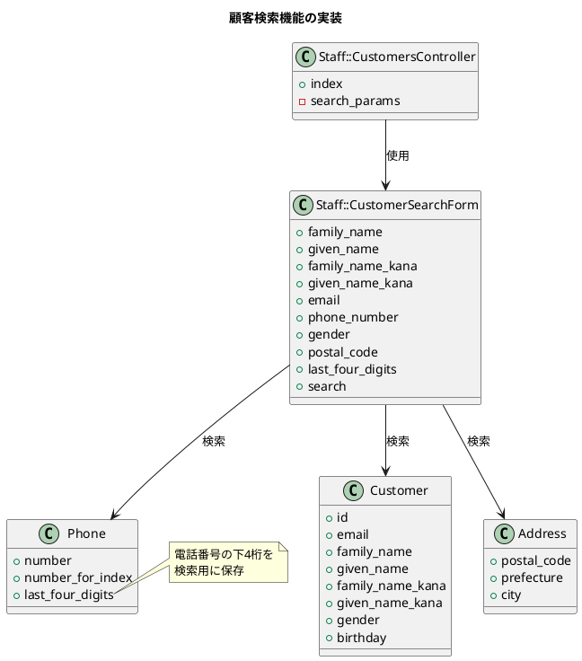
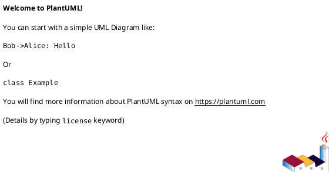

# 作業履歴 2017-02-07

## 概要

2017-02-07の作業内容をまとめています。この日は主に「顧客検索機能」の実装を行いました。

### 実装内容の説明

#### 顧客検索機能

職員が顧客情報を効率的に検索できるよう、複数の条件を組み合わせた検索機能を実装しました。検索条件には氏名、メールアドレス、電話番号、性別、郵便番号、住所などが含まれます。特に電話番号の下4桁による検索機能は、顧客からの問い合わせ時に素早く顧客を特定するのに役立ちます。



#### 検索条件の拡張

基本的な検索機能に加えて、以下の検索条件を追加実装しました：
1. 性別による検索
2. 郵便番号による検索
3. 電話番号の下4桁による検索

特に電話番号の下4桁検索は、顧客が自分の電話番号の下4桁だけを覚えている場合に便利な機能です。

### アーキテクチャとの関連

この実装は、[アーキテクチャ概要](../アーキテクチャ概要.md)の「5. 主要なデータモデル」および「7.2 フォームオブジェクト」セクションに関連しています。特に以下の部分を実現するものです：

```
Customer ||--o{ Phone
Customer ||--o{ HomeAddress
Customer ||--o{ WorkAddress
```

フォームオブジェクトパターンを使用して、検索フォームの入力値の処理と検索ロジックをカプセル化しています。

### ユースケースとの関連

この実装は、[ユースケース](../ユースケース.md)の「3.2. 顧客管理」セクションに記載されている以下のユースケースを実現するものです：

- S-005: 顧客情報検索

ユースケース説明：
> 職員が顧客情報を検索する
> 
> 基本フロー：
> 1. 顧客検索フォームにアクセス
> 2. 検索条件（名前、メールアドレス、電話番号など）を入力
> 3. 検索を実行
> 4. 検索結果を表示

## コミット: 4164c10

### メッセージ

```
検索フォーム #16
```

### 変更されたファイル

- M	app/views/staff/top/index.html.erb

### 変更内容

```diff
commit 4164c10009555a020e64ebb596984335d50c8a22
Author: k2works <kakimomokuri@gmail.com>
Date:   Tue Feb 7 16:36:30 2017 +0900

    検索フォーム #16

diff --git a/app/views/staff/top/index.html.erb b/app/views/staff/top/index.html.erb
index 3bf7df0..4adfc9f 100644
--- a/app/views/staff/top/index.html.erb
+++ b/app/views/staff/top/index.html.erb
@@ -8,6 +8,10 @@
     <h2 class="sectionLabel">お知らせ</h2>
   </div>
   <ol class="NewsList">
+    <li class="NewsList__item">
+      <time class="NewsList__head" datatime="2017-2-7">2017.2.7</time>
+      <span class="NewsList__body">顧客検索機能を追加</span>
+    </li>
     <li class="NewsList__item">
       <time class="NewsList__head" datatime="2017-2-7">2017.2.7</time>
       <span class="NewsList__body">顧客電話番号管理機能を追加</span>

```

## コミット: f613d25

### メッセージ

```
検索条件に電話番号下４桁を追加 #16
```

### 変更されたファイル

- M	README.md
- M	app/controllers/staff/customers_controller.rb
- M	app/forms/staff/customer_search_form.rb
- M	app/models/phone.rb
- M	app/views/staff/customers/_search_form.html.erb
- M	config/locales/models/ja.yml
- A	db/migrate/20170207070920_alter_phones2.rb
- A	db/migrate/20170207071612_update_phones1.rb
- M	db/schema.rb
- M	spec/factories/phones.rb

### 変更内容

```diff
commit f613d25648e6f0363e8d499e6d2d4e21b678a383
Author: k2works <kakimomokuri@gmail.com>
Date:   Tue Feb 7 16:31:09 2017 +0900

    検索条件に電話番号下４桁を追加 #16

diff --git a/README.md b/README.md
index b76583b..18c6f37 100644
--- a/README.md
+++ b/README.md
@@ -621,6 +621,7 @@ git push heroku master
 #### 演習問題
 + 検索条件に性別を追加 
 + 検索条件に郵便番号を追加
++ 検索条件に電話番号下４桁を追加

 **[⬆ back to top](#構成)**

diff --git a/app/controllers/staff/customers_controller.rb b/app/controllers/staff/customers_controller.rb
index c9b3ccf..6342b22 100644
--- a/app/controllers/staff/customers_controller.rb
+++ b/app/controllers/staff/customers_controller.rb
@@ -64,7 +64,8 @@ class Staff::CustomersController < Staff::Base
         :city,
         :phone_number,
         :gender,
-        :postal_code
+        :postal_code,
+        :last_four_digits
     )
   end

diff --git a/app/forms/staff/customer_search_form.rb b/app/forms/staff/customer_search_form.rb
index 0d2991a..6a46821 100644
--- a/app/forms/staff/customer_search_form.rb
+++ b/app/forms/staff/customer_search_form.rb
@@ -12,7 +12,8 @@ class Staff::CustomerSearchForm
                 :city,
                 :phone_number,
                 :gender,
-                :postal_code
+                :postal_code,
+                :last_four_digits

   def search
     normalize_values
@@ -49,8 +50,14 @@ class Staff::CustomerSearchForm
       end
     end

-    if phone_number.present?
-      rel = rel.joins(:phones).where('phones.number_for_index' => phone_number)
+    if phone_number.present? || last_four_digits.present?
+      rel = rel.joins(:phones)
+      if phone_number.present?
+        rel = rel.where('phones.number_for_index' => phone_number)
+      end
+      if last_four_digits.present?
+        rel = rel.where('phones.last_four_digits' => last_four_digits)
+      end
     end

     rel.order(:family_name_kana, :given_name_kana)
diff --git a/app/models/phone.rb b/app/models/phone.rb
index 386e689..94e92f9 100644
--- a/app/models/phone.rb
+++ b/app/models/phone.rb
@@ -10,11 +10,13 @@
 #  primary          :boolean          default("0"), not null # 優先フラグ
 #  created_at       :datetime         not null
 #  updated_at       :datetime         not null
+#  last_four_digits :string(255)                             # 電話番号下４桁
 #
 # Indexes
 #
 #  index_phones_on_address_id        (address_id)
 #  index_phones_on_customer_id       (customer_id)
+#  index_phones_on_last_four_digits  (last_four_digits)
 #  index_phones_on_number_for_index  (number_for_index)
 #

@@ -27,6 +29,9 @@ class Phone < ApplicationRecord
   before_validation do
     self.number = normalize_as_phone_number(number)
     self.number_for_index = number.gsub(/\D/, '') if number
+    if number_for_index && number_for_index.size >= 4
+      self.last_four_digits = number_for_index[-4, 4]
+    end
   end

   before_create do
diff --git a/app/views/staff/customers/_search_form.html.erb b/app/views/staff/customers/_search_form.html.erb
index 08e0875..43ff1f4 100644
--- a/app/views/staff/customers/_search_form.html.erb
+++ b/app/views/staff/customers/_search_form.html.erb
@@ -17,6 +17,7 @@
       m.br
       m << p.text_field_block(:postal_code, t('activerecord.attributes.address.postal_code')+':', size: 7)
       m << p.text_field_block(:phone_number, t('activerecord.attributes.phone.number')+':')
+      m << p.text_field_block(:last_four_digits, t('activerecord.attributes.phone.last_four_digits')+':', size: 4)
       m << f.submit(t('staff.shared.search.submit'))
       end %>
 <% end %>
\ No newline at end of file
diff --git a/config/locales/models/ja.yml b/config/locales/models/ja.yml
index 013f874..612676c 100644
--- a/config/locales/models/ja.yml
+++ b/config/locales/models/ja.yml
@@ -85,6 +85,7 @@ ja:
         number: 電話番号
         number_for_index: 索引用電話番号
         primary: 優先
+        last_four_digits: 電話番号下４桁

     errors:
       models:
diff --git a/db/migrate/20170207070920_alter_phones2.rb b/db/migrate/20170207070920_alter_phones2.rb
new file mode 100644
index 0000000..611faf3
--- /dev/null
+++ b/db/migrate/20170207070920_alter_phones2.rb
@@ -0,0 +1,7 @@
+class AlterPhones2 < ActiveRecord::Migration[5.0]
+  def change
+    add_column :phones, :last_four_digits, :string, comment: '電話番号下４桁'
+
+    add_index :phones, :last_four_digits
+  end
+end
diff --git a/db/migrate/20170207071612_update_phones1.rb b/db/migrate/20170207071612_update_phones1.rb
new file mode 100644
index 0000000..7cfd27b
--- /dev/null
+++ b/db/migrate/20170207071612_update_phones1.rb
@@ -0,0 +1,19 @@
+class UpdatePhones1 < ActiveRecord::Migration[5.0]
+  def up
+    if Rails.env != 'test'
+      execute(%q{
+      UPDATE phones SET last_four_digits =
+        SUBSTR(number_for_index, LENGTH(number_for_index) - 3)
+        WHERE number_for_index IS NOT NULL AND LENGTH(number_for_index) >= 4
+    })
+    end
+  end
+
+  def down
+    if Rails.env != 'test'
+      execute(%q{
+      UPDATE phones SET last_four_digits = NULL
+    })
+    end
+  end
+end
diff --git a/db/schema.rb b/db/schema.rb
index c644c07..218066a 100644
--- a/db/schema.rb
+++ b/db/schema.rb
@@ -10,109 +10,107 @@
 #
 # It's strongly recommended that you check this file into your version control system.

-ActiveRecord::Schema.define(version: 20170207064811) do
+ActiveRecord::Schema.define(version: 20170207071612) do

-  create_table "addresses", force: :cascade, comment: "住所" do |t|
-    t.integer  "customer_id",                null: false, comment: "顧客への外部キー"
-    t.string   "type",                       null: false, comment: "継承カラム"
-    t.string   "postal_code",                null: false, comment: "郵便番号"
-    t.string   "prefecture",                 null: false, comment: "都道府県"
-    t.string   "city",                       null: false, comment: "市区町村"
-    t.string   "address1",                   null: false, comment: "町域・番地等"
-    t.string   "address2",                   null: false, comment: "建物名・部屋番号"
-    t.string   "company_name",  default: "", null: false, comment: "会社名"
-    t.string   "division_name", default: "", null: false, comment: "部署名"
+  create_table "addresses", force: :cascade do |t|
+    t.integer  "customer_id",                null: false
+    t.string   "type",                       null: false
+    t.string   "postal_code",                null: false
+    t.string   "prefecture",                 null: false
+    t.string   "city",                       null: false
+    t.string   "address1",                   null: false
+    t.string   "address2",                   null: false
+    t.string   "company_name",  default: "", null: false
+    t.string   "division_name", default: "", null: false
     t.datetime "created_at",                 null: false
     t.datetime "updated_at",                 null: false
-    t.index ["city"], name: "index_addresses_on_city", using: :btree
-    t.index ["customer_id"], name: "index_addresses_on_customer_id", using: :btree
-    t.index ["postal_code"], name: "index_addresses_on_postal_code", using: :btree
-    t.index ["prefecture", "city"], name: "index_addresses_on_prefecture_and_city", using: :btree
-    t.index ["type", "city"], name: "index_addresses_on_type_and_city", using: :btree
-    t.index ["type", "customer_id"], name: "index_addresses_on_type_and_customer_id", unique: true, using: :btree
-    t.index ["type", "prefecture", "city"], name: "index_addresses_on_type_and_prefecture_and_city", using: :btree
+    t.index ["city"], name: "index_addresses_on_city"
+    t.index ["customer_id"], name: "index_addresses_on_customer_id"
+    t.index ["postal_code"], name: "index_addresses_on_postal_code"
+    t.index ["prefecture", "city"], name: "index_addresses_on_prefecture_and_city"
+    t.index ["type", "city"], name: "index_addresses_on_type_and_city"
+    t.index ["type", "customer_id"], name: "index_addresses_on_type_and_customer_id", unique: true
+    t.index ["type", "prefecture", "city"], name: "index_addresses_on_type_and_prefecture_and_city"
   end

-  create_table "administrators", force: :cascade, comment: "管理者" do |t|
-    t.string   "email",                           null: false, comment: "メールアドレス"
-    t.string   "email_for_index",                 null: false, comment: "索引用メールアドレス"
-    t.string   "hashed_password",                              comment: "パスワード"
-    t.boolean  "suspended",       default: false, null: false, comment: "停止フラグ"
+  create_table "administrators", force: :cascade do |t|
+    t.string   "email",                           null: false
+    t.string   "email_for_index",                 null: false
+    t.string   "hashed_password"
+    t.boolean  "suspended",       default: false, null: false
     t.datetime "created_at",                      null: false
     t.datetime "updated_at",                      null: false
-    t.index ["email_for_index"], name: "index_administrators_on_email_for_index", unique: true, using: :btree
+    t.index ["email_for_index"], name: "index_administrators_on_email_for_index", unique: true
   end

-  create_table "customers", force: :cascade, comment: "顧客" do |t|
-    t.string   "email",            null: false, comment: "メールアドレス"
-    t.string   "email_for_index",  null: false, comment: "顧客用メールアドレス"
-    t.string   "family_name",      null: false, comment: "姓"
-    t.string   "given_name",       null: false, comment: "名"
-    t.string   "family_name_kana", null: false, comment: "姓（カナ）"
-    t.string   "given_name_kana",  null: false, comment: "名（カナ）"
-    t.string   "gender",                        comment: "性別"
-    t.date     "birthday",                      comment: "誕生日"
-    t.string   "hashed_password",               comment: "パスワード"
+  create_table "customers", force: :cascade do |t|
+    t.string   "email",            null: false
+    t.string   "email_for_index",  null: false
+    t.string   "family_name",      null: false
+    t.string   "given_name",       null: false
+    t.string   "family_name_kana", null: false
+    t.string   "given_name_kana",  null: false
+    t.string   "gender"
+    t.date     "birthday"
+    t.string   "hashed_password"
     t.datetime "created_at",       null: false
     t.datetime "updated_at",       null: false
-    t.integer  "birth_year",                    comment: "誕生年"
-    t.integer  "birth_month",                   comment: "誕生月"
-    t.integer  "birth_mday",                    comment: "誕生日"
-    t.index ["birth_mday", "family_name_kana", "given_name_kana"], name: "index_customers_on_birth_mday_and_furigana", using: :btree
-    t.index ["birth_mday", "given_name_kana"], name: "index_customers_on_birth_mday_and_given_name_kana", using: :btree
-    t.index ["birth_month", "birth_mday"], name: "index_customers_on_birth_month_and_birth_mday", using: :btree
-    t.index ["birth_month", "family_name_kana", "given_name_kana"], name: "index_customers_on_birth_month_and_furigana", using: :btree
-    t.index ["birth_month", "given_name_kana"], name: "index_customers_on_birth_month_and_given_name_kana", using: :btree
-    t.index ["birth_year", "birth_month", "birth_mday"], name: "index_customers_on_birth_year_and_birth_month_and_birth_mday", using: :btree
-    t.index ["birth_year", "family_name_kana", "given_name_kana"], name: "index_customers_on_birth_year_and_furigana", using: :btree
-    t.index ["birth_year", "given_name_kana"], name: "index_customers_on_birth_year_and_given_name_kana", using: :btree
-    t.index ["email_for_index"], name: "index_customers_on_email_for_index", unique: true, using: :btree
-    t.index ["family_name_kana", "given_name_kana"], name: "index_customers_on_family_name_kana_and_given_name_kana", using: :btree
-    t.index ["gender", "family_name_kana", "given_name_kana"], name: "index_customers_on_gender_and_furigana", using: :btree
-    t.index ["given_name_kana"], name: "index_customers_on_given_name_kana", using: :btree
+    t.integer  "birth_year"
+    t.integer  "birth_month"
+    t.integer  "birth_mday"
+    t.index ["birth_mday", "family_name_kana", "given_name_kana"], name: "index_customers_on_birth_mday_and_furigana"
+    t.index ["birth_mday", "given_name_kana"], name: "index_customers_on_birth_mday_and_given_name_kana"
+    t.index ["birth_month", "birth_mday"], name: "index_customers_on_birth_month_and_birth_mday"
+    t.index ["birth_month", "family_name_kana", "given_name_kana"], name: "index_customers_on_birth_month_and_furigana"
+    t.index ["birth_month", "given_name_kana"], name: "index_customers_on_birth_month_and_given_name_kana"
+    t.index ["birth_year", "birth_month", "birth_mday"], name: "index_customers_on_birth_year_and_birth_month_and_birth_mday"
+    t.index ["birth_year", "family_name_kana", "given_name_kana"], name: "index_customers_on_birth_year_and_furigana"
+    t.index ["birth_year", "given_name_kana"], name: "index_customers_on_birth_year_and_given_name_kana"
+    t.index ["email_for_index"], name: "index_customers_on_email_for_index", unique: true
+    t.index ["family_name_kana", "given_name_kana"], name: "index_customers_on_family_name_kana_and_given_name_kana"
+    t.index ["gender", "family_name_kana", "given_name_kana"], name: "index_customers_on_gender_and_furigana"
+    t.index ["given_name_kana"], name: "index_customers_on_given_name_kana"
   end

-  create_table "phones", force: :cascade, comment: "電話" do |t|
-    t.integer  "customer_id",                      null: false, comment: "顧客への外部キー"
-    t.integer  "address_id",                                    comment: "住所への外部キー"
-    t.string   "number",                           null: false, comment: "電話番号"
-    t.string   "number_for_index",                 null: false, comment: "索引用電話番号"
-    t.boolean  "primary",          default: false, null: false, comment: "優先フラグ"
+  create_table "phones", force: :cascade do |t|
+    t.integer  "customer_id",                      null: false
+    t.integer  "address_id"
+    t.string   "number",                           null: false
+    t.string   "number_for_index",                 null: false
+    t.boolean  "primary",          default: false, null: false
     t.datetime "created_at",                       null: false
     t.datetime "updated_at",                       null: false
-    t.index ["address_id"], name: "index_phones_on_address_id", using: :btree
-    t.index ["customer_id"], name: "index_phones_on_customer_id", using: :btree
-    t.index ["number_for_index"], name: "index_phones_on_number_for_index", using: :btree
+    t.string   "last_four_digits"
+    t.index ["address_id"], name: "index_phones_on_address_id"
+    t.index ["customer_id"], name: "index_phones_on_customer_id"
+    t.index ["last_four_digits"], name: "index_phones_on_last_four_digits"
+    t.index ["number_for_index"], name: "index_phones_on_number_for_index"
   end

-  create_table "staff_events", force: :cascade, comment: "職員イベント" do |t|
-    t.integer  "staff_member_id", null: false, comment: "職員レコードへの外部キー"
-    t.string   "type",            null: false, comment: "イベントタイプ"
-    t.datetime "created_at",      null: false, comment: "発生時刻"
-    t.index ["created_at"], name: "index_staff_events_on_created_at", using: :btree
-    t.index ["staff_member_id", "created_at"], name: "index_staff_events_on_staff_member_id_and_created_at", using: :btree
-    t.index ["staff_member_id"], name: "index_staff_events_on_staff_member_id", using: :btree
+  create_table "staff_events", force: :cascade do |t|
+    t.integer  "staff_member_id", null: false
+    t.string   "type",            null: false
+    t.datetime "created_at",      null: false
+    t.index ["created_at"], name: "index_staff_events_on_created_at"
+    t.index ["staff_member_id", "created_at"], name: "index_staff_events_on_staff_member_id_and_created_at"
+    t.index ["staff_member_id"], name: "index_staff_events_on_staff_member_id"
   end

-  create_table "staff_members", force: :cascade, comment: "職員" do |t|
-    t.string   "email",                            null: false, comment: "メールアドレス"
-    t.string   "email_for_index",                  null: false, comment: "索引用メールアドレス"
-    t.string   "family_name",                      null: false, comment: "姓"
-    t.string   "given_name",                       null: false, comment: "名"
-    t.string   "family_name_kana",                 null: false, comment: "姓（カナ）"
-    t.string   "given_name_kana",                  null: false, comment: "名（カナ）"
-    t.string   "hashed_password",                               comment: "パスワード"
-    t.date     "start_date",                       null: false, comment: "開始日"
-    t.date     "end_date",                                      comment: "終了日"
-    t.boolean  "suspended",        default: false, null: false, comment: "停止フラグ"
+  create_table "staff_members", force: :cascade do |t|
+    t.string   "email",                            null: false
+    t.string   "email_for_index",                  null: false
+    t.string   "family_name",                      null: false
+    t.string   "given_name",                       null: false
+    t.string   "family_name_kana",                 null: false
+    t.string   "given_name_kana",                  null: false
+    t.string   "hashed_password"
+    t.date     "start_date",                       null: false
+    t.date     "end_date"
+    t.boolean  "suspended",        default: false, null: false
     t.datetime "created_at",                       null: false
     t.datetime "updated_at",                       null: false
-    t.index ["email_for_index"], name: "index_staff_members_on_email_for_index", unique: true, using: :btree
-    t.index ["family_name_kana", "given_name_kana"], name: "index_staff_members_on_family_name_kana_and_given_name_kana", using: :btree
+    t.index ["email_for_index"], name: "index_staff_members_on_email_for_index", unique: true
+    t.index ["family_name_kana", "given_name_kana"], name: "index_staff_members_on_family_name_kana_and_given_name_kana"
   end

-  add_foreign_key "addresses", "customers"
-  add_foreign_key "phones", "addresses"
-  add_foreign_key "phones", "customers"
-  add_foreign_key "staff_events", "staff_members"
 end
diff --git a/spec/factories/phones.rb b/spec/factories/phones.rb
index 4ef34b3..694da4d 100644
--- a/spec/factories/phones.rb
+++ b/spec/factories/phones.rb
@@ -10,11 +10,13 @@
 #  primary          :boolean          default("0"), not null # 優先フラグ
 #  created_at       :datetime         not null
 #  updated_at       :datetime         not null
+#  last_four_digits :string(255)                             # 電話番号下４桁
 #
 # Indexes
 #
 #  index_phones_on_address_id        (address_id)
 #  index_phones_on_customer_id       (customer_id)
+#  index_phones_on_last_four_digits  (last_four_digits)
 #  index_phones_on_number_for_index  (number_for_index)
 #


```

### 構造変更



## コミット: 47e1f46

### メッセージ

```
演習問題 #16
```

### 変更されたファイル

- M	README.md
- M	app/controllers/staff/customers_controller.rb
- M	app/forms/staff/customer_search_form.rb
- M	app/models/address.rb
- M	app/models/home_address.rb
- M	app/models/work_address.rb
- M	app/views/staff/customers/_search_form.html.erb
- A	db/migrate/20170207064811_alter_addresses2.rb
- M	db/schema.rb
- M	spec/factories/addresses.rb

### 変更内容

```diff
commit 47e1f4645af5a9f618c7ef6b8870df37bc1445b4
Author: k2works <kakimomokuri@gmail.com>
Date:   Tue Feb 7 16:06:04 2017 +0900

    演習問題 #16

diff --git a/README.md b/README.md
index 7a9f2f1..b76583b 100644
--- a/README.md
+++ b/README.md
@@ -620,6 +620,7 @@ git push heroku master

 #### 演習問題
 + 検索条件に性別を追加 
++ 検索条件に郵便番号を追加

 **[⬆ back to top](#構成)**

diff --git a/app/controllers/staff/customers_controller.rb b/app/controllers/staff/customers_controller.rb
index ea2433a..c9b3ccf 100644
--- a/app/controllers/staff/customers_controller.rb
+++ b/app/controllers/staff/customers_controller.rb
@@ -63,7 +63,8 @@ class Staff::CustomersController < Staff::Base
         :prefecture,
         :city,
         :phone_number,
-        :gender
+        :gender,
+        :postal_code
     )
   end

diff --git a/app/forms/staff/customer_search_form.rb b/app/forms/staff/customer_search_form.rb
index 10480fc..0d2991a 100644
--- a/app/forms/staff/customer_search_form.rb
+++ b/app/forms/staff/customer_search_form.rb
@@ -11,7 +11,8 @@ class Staff::CustomerSearchForm
                 :prefecture,
                 :city,
                 :phone_number,
-                :gender
+                :gender,
+                :postal_code

   def search
     normalize_values
@@ -28,7 +29,7 @@ class Staff::CustomerSearchForm
     rel = rel.where(birth_mday: birth_mday) if birth_mday.present?
     rel = rel.where(gender: gender) if gender.present?

-    if prefecture.present? || city.present?
+    if prefecture.present? || city.present? || postal_code.present?
       case address_type
         when 'home'
           rel = rel.joins(:home_address)
@@ -43,6 +44,9 @@ class Staff::CustomerSearchForm
         rel = rel.where('addresses.prefecture' => prefecture)
       end
       rel = rel.where('addresses.city' => city) if city.present?
+      if postal_code.present?
+        rel = rel.where('addresses.postal_code' => postal_code)
+      end
     end

     if phone_number.present?
@@ -58,5 +62,6 @@ class Staff::CustomerSearchForm
     self.given_name_kana = normalize_as_furigana(given_name_kana)
     self.city = normalize_as_name(city)
     self.phone_number = normalize_as_phone_number(phone_number).try(:gsub,/\D/, '')
+    self.postal_code = normalize_as_postal_code(postal_code)
   end
 end
\ No newline at end of file
diff --git a/app/models/address.rb b/app/models/address.rb
index f7db6f8..503bf41 100644
--- a/app/models/address.rb
+++ b/app/models/address.rb
@@ -19,6 +19,7 @@
 #
 #  index_addresses_on_city                          (city)
 #  index_addresses_on_customer_id                   (customer_id)
+#  index_addresses_on_postal_code                   (postal_code)
 #  index_addresses_on_prefecture_and_city           (prefecture,city)
 #  index_addresses_on_type_and_city                 (type,city)
 #  index_addresses_on_type_and_customer_id          (type,customer_id) UNIQUE
diff --git a/app/models/home_address.rb b/app/models/home_address.rb
index da88407..7cf7676 100644
--- a/app/models/home_address.rb
+++ b/app/models/home_address.rb
@@ -19,6 +19,7 @@
 #
 #  index_addresses_on_city                          (city)
 #  index_addresses_on_customer_id                   (customer_id)
+#  index_addresses_on_postal_code                   (postal_code)
 #  index_addresses_on_prefecture_and_city           (prefecture,city)
 #  index_addresses_on_type_and_city                 (type,city)
 #  index_addresses_on_type_and_customer_id          (type,customer_id) UNIQUE
diff --git a/app/models/work_address.rb b/app/models/work_address.rb
index 0ba0773..50e0455 100644
--- a/app/models/work_address.rb
+++ b/app/models/work_address.rb
@@ -19,6 +19,7 @@
 #
 #  index_addresses_on_city                          (city)
 #  index_addresses_on_customer_id                   (customer_id)
+#  index_addresses_on_postal_code                   (postal_code)
 #  index_addresses_on_prefecture_and_city           (prefecture,city)
 #  index_addresses_on_type_and_city                 (type,city)
 #  index_addresses_on_type_and_customer_id          (type,customer_id) UNIQUE
diff --git a/app/views/staff/customers/_search_form.html.erb b/app/views/staff/customers/_search_form.html.erb
index da3070a..08e0875 100644
--- a/app/views/staff/customers/_search_form.html.erb
+++ b/app/views/staff/customers/_search_form.html.erb
@@ -15,6 +15,7 @@
       m << p.drop_down_list_block(:prefecture, t('activerecord.attributes.address.prefecture')+':', Address::PREFECTURE_NAMES)
       m << p.text_field_block(:city, t('activerecord.attributes.address.city'))
       m.br
+      m << p.text_field_block(:postal_code, t('activerecord.attributes.address.postal_code')+':', size: 7)
       m << p.text_field_block(:phone_number, t('activerecord.attributes.phone.number')+':')
       m << f.submit(t('staff.shared.search.submit'))
       end %>
diff --git a/db/migrate/20170207064811_alter_addresses2.rb b/db/migrate/20170207064811_alter_addresses2.rb
new file mode 100644
index 0000000..3362e3f
--- /dev/null
+++ b/db/migrate/20170207064811_alter_addresses2.rb
@@ -0,0 +1,5 @@
+class AlterAddresses2 < ActiveRecord::Migration[5.0]
+  def change
+    add_index :addresses, :postal_code
+  end
+end
diff --git a/db/schema.rb b/db/schema.rb
index 80706d9..c644c07 100644
--- a/db/schema.rb
+++ b/db/schema.rb
@@ -10,9 +10,9 @@
 #
 # It's strongly recommended that you check this file into your version control system.

-ActiveRecord::Schema.define(version: 20170207063552) do
+ActiveRecord::Schema.define(version: 20170207064811) do

-  create_table "addresses", force: :cascade, options: "ENGINE=InnoDB DEFAULT CHARSET=utf8", comment: "住所" do |t|
+  create_table "addresses", force: :cascade, comment: "住所" do |t|
     t.integer  "customer_id",                null: false, comment: "顧客への外部キー"
     t.string   "type",                       null: false, comment: "継承カラム"
     t.string   "postal_code",                null: false, comment: "郵便番号"
@@ -26,13 +26,14 @@ ActiveRecord::Schema.define(version: 20170207063552) do
     t.datetime "updated_at",                 null: false
     t.index ["city"], name: "index_addresses_on_city", using: :btree
     t.index ["customer_id"], name: "index_addresses_on_customer_id", using: :btree
+    t.index ["postal_code"], name: "index_addresses_on_postal_code", using: :btree
     t.index ["prefecture", "city"], name: "index_addresses_on_prefecture_and_city", using: :btree
     t.index ["type", "city"], name: "index_addresses_on_type_and_city", using: :btree
     t.index ["type", "customer_id"], name: "index_addresses_on_type_and_customer_id", unique: true, using: :btree
     t.index ["type", "prefecture", "city"], name: "index_addresses_on_type_and_prefecture_and_city", using: :btree
   end

-  create_table "administrators", force: :cascade, options: "ENGINE=InnoDB DEFAULT CHARSET=utf8", comment: "管理者" do |t|
+  create_table "administrators", force: :cascade, comment: "管理者" do |t|
     t.string   "email",                           null: false, comment: "メールアドレス"
     t.string   "email_for_index",                 null: false, comment: "索引用メールアドレス"
     t.string   "hashed_password",                              comment: "パスワード"
@@ -42,7 +43,7 @@ ActiveRecord::Schema.define(version: 20170207063552) do
     t.index ["email_for_index"], name: "index_administrators_on_email_for_index", unique: true, using: :btree
   end

-  create_table "customers", force: :cascade, options: "ENGINE=InnoDB DEFAULT CHARSET=utf8", comment: "顧客" do |t|
+  create_table "customers", force: :cascade, comment: "顧客" do |t|
     t.string   "email",            null: false, comment: "メールアドレス"
     t.string   "email_for_index",  null: false, comment: "顧客用メールアドレス"
     t.string   "family_name",      null: false, comment: "姓"
@@ -71,7 +72,7 @@ ActiveRecord::Schema.define(version: 20170207063552) do
     t.index ["given_name_kana"], name: "index_customers_on_given_name_kana", using: :btree
   end

-  create_table "phones", force: :cascade, options: "ENGINE=InnoDB DEFAULT CHARSET=utf8", comment: "電話" do |t|
+  create_table "phones", force: :cascade, comment: "電話" do |t|
     t.integer  "customer_id",                      null: false, comment: "顧客への外部キー"
     t.integer  "address_id",                                    comment: "住所への外部キー"
     t.string   "number",                           null: false, comment: "電話番号"
@@ -84,7 +85,7 @@ ActiveRecord::Schema.define(version: 20170207063552) do
     t.index ["number_for_index"], name: "index_phones_on_number_for_index", using: :btree
   end

-  create_table "staff_events", force: :cascade, options: "ENGINE=InnoDB DEFAULT CHARSET=utf8", comment: "職員イベント" do |t|
+  create_table "staff_events", force: :cascade, comment: "職員イベント" do |t|
     t.integer  "staff_member_id", null: false, comment: "職員レコードへの外部キー"
     t.string   "type",            null: false, comment: "イベントタイプ"
     t.datetime "created_at",      null: false, comment: "発生時刻"
@@ -93,7 +94,7 @@ ActiveRecord::Schema.define(version: 20170207063552) do
     t.index ["staff_member_id"], name: "index_staff_events_on_staff_member_id", using: :btree
   end

-  create_table "staff_members", force: :cascade, options: "ENGINE=InnoDB DEFAULT CHARSET=utf8", comment: "職員" do |t|
+  create_table "staff_members", force: :cascade, comment: "職員" do |t|
     t.string   "email",                            null: false, comment: "メールアドレス"
     t.string   "email_for_index",                  null: false, comment: "索引用メールアドレス"
     t.string   "family_name",                      null: false, comment: "姓"
diff --git a/spec/factories/addresses.rb b/spec/factories/addresses.rb
index 39737ae..ecbdc13 100644
--- a/spec/factories/addresses.rb
+++ b/spec/factories/addresses.rb
@@ -19,6 +19,7 @@
 #
 #  index_addresses_on_city                          (city)
 #  index_addresses_on_customer_id                   (customer_id)
+#  index_addresses_on_postal_code                   (postal_code)
 #  index_addresses_on_prefecture_and_city           (prefecture,city)
 #  index_addresses_on_type_and_city                 (type,city)
 #  index_addresses_on_type_and_customer_id          (type,customer_id) UNIQUE

```

### 構造変更


## コミット: a474c1a

### メッセージ

```
演習問題 #16
```

### 変更されたファイル

- M	README.md
- M	app/controllers/staff/customers_controller.rb
- M	app/forms/staff/customer_search_form.rb
- M	app/models/customer.rb
- M	app/views/staff/customers/_search_form.html.erb
- M	config/locales/views/ja.yml
- A	db/migrate/20170207063552_alter_customer2.rb
- M	db/schema.rb
- M	spec/factories/customers.rb

### 変更内容

```diff
commit a474c1af5ddd5a02e05a792224b2035d5fbbfd53
Author: k2works <kakimomokuri@gmail.com>
Date:   Tue Feb 7 15:47:00 2017 +0900

    演習問題 #16

diff --git a/README.md b/README.md
index 77a1a03..7a9f2f1 100644
--- a/README.md
+++ b/README.md
@@ -619,6 +619,7 @@ git push heroku master
 + 検索文字列の正規化

 #### 演習問題
++ 検索条件に性別を追加 

 **[⬆ back to top](#構成)**

diff --git a/app/controllers/staff/customers_controller.rb b/app/controllers/staff/customers_controller.rb
index b004ad4..ea2433a 100644
--- a/app/controllers/staff/customers_controller.rb
+++ b/app/controllers/staff/customers_controller.rb
@@ -62,7 +62,8 @@ class Staff::CustomersController < Staff::Base
         :address_type,
         :prefecture,
         :city,
-        :phone_number
+        :phone_number,
+        :gender
     )
   end

diff --git a/app/forms/staff/customer_search_form.rb b/app/forms/staff/customer_search_form.rb
index c63fcf1..10480fc 100644
--- a/app/forms/staff/customer_search_form.rb
+++ b/app/forms/staff/customer_search_form.rb
@@ -10,7 +10,8 @@ class Staff::CustomerSearchForm
                 :address_type,
                 :prefecture,
                 :city,
-                :phone_number
+                :phone_number,
+                :gender

   def search
     normalize_values
@@ -25,6 +26,7 @@ class Staff::CustomerSearchForm
     rel = rel.where(birth_year: birth_year) if birth_year.present?
     rel = rel.where(birth_month: birth_month) if birth_month.present?
     rel = rel.where(birth_mday: birth_mday) if birth_mday.present?
+    rel = rel.where(gender: gender) if gender.present?

     if prefecture.present? || city.present?
       case address_type
diff --git a/app/models/customer.rb b/app/models/customer.rb
index 30f20ba..68bac7c 100644
--- a/app/models/customer.rb
+++ b/app/models/customer.rb
@@ -30,6 +30,7 @@
 #  index_customers_on_birth_year_and_given_name_kana             (birth_year,given_name_kana)
 #  index_customers_on_email_for_index                            (email_for_index) UNIQUE
 #  index_customers_on_family_name_kana_and_given_name_kana       (family_name_kana,given_name_kana)
+#  index_customers_on_gender_and_furigana                        (gender,family_name_kana,given_name_kana)
 #  index_customers_on_given_name_kana                            (given_name_kana)
 #

diff --git a/app/views/staff/customers/_search_form.html.erb b/app/views/staff/customers/_search_form.html.erb
index 3c51099..da3070a 100644
--- a/app/views/staff/customers/_search_form.html.erb
+++ b/app/views/staff/customers/_search_form.html.erb
@@ -7,6 +7,7 @@
       m << p.drop_down_list_block(:birth_year, t('activerecord.attributes.customer.birthday') ,(1900..Time.current.year).to_a.reverse)
       m << p.drop_down_list_block(:birth_month, t('activerecord.attributes.customer.birth_month'),1..12)
       m << p.drop_down_list_block(:birth_mday, t('activerecord.attributes.customer.birth_mday'),1..31)
+      m << p.drop_down_list_block(:gender, t('activerecord.attributes.customer.gender'),[[t('staff.shared.search.gender.male'),'male'],[t('staff.shared.search.gender.female'),'female']])
       m.br
       m.div do
         m << p.drop_down_list_block(:address_type, t('staff.shared.search.address_type.range')+':',[ [t('staff.shared.search.address_type.home'),'home'],[t('staff.shared.search.address_type.work'),'work']])
diff --git a/config/locales/views/ja.yml b/config/locales/views/ja.yml
index bb05948..5ac1a8e 100644
--- a/config/locales/views/ja.yml
+++ b/config/locales/views/ja.yml
@@ -10,6 +10,9 @@ ja:
           range: '住所の検索範囲'
           home: '自宅住所のみ'
           work: '勤務先のみ'
+        gender:
+          male: '男性'
+          female: '女性'
         submit: '検索'
     sessions:
       new:
diff --git a/db/migrate/20170207063552_alter_customer2.rb b/db/migrate/20170207063552_alter_customer2.rb
new file mode 100644
index 0000000..a54b0e1
--- /dev/null
+++ b/db/migrate/20170207063552_alter_customer2.rb
@@ -0,0 +1,5 @@
+class AlterCustomer2 < ActiveRecord::Migration[5.0]
+  def change
+    add_index :customers, [:gender, :family_name_kana, :given_name_kana], name: 'index_customers_on_gender_and_furigana'
+  end
+end
diff --git a/db/schema.rb b/db/schema.rb
index 7678b16..80706d9 100644
--- a/db/schema.rb
+++ b/db/schema.rb
@@ -10,9 +10,9 @@
 #
 # It's strongly recommended that you check this file into your version control system.

-ActiveRecord::Schema.define(version: 20170207044130) do
+ActiveRecord::Schema.define(version: 20170207063552) do

-  create_table "addresses", force: :cascade, comment: "住所" do |t|
+  create_table "addresses", force: :cascade, options: "ENGINE=InnoDB DEFAULT CHARSET=utf8", comment: "住所" do |t|
     t.integer  "customer_id",                null: false, comment: "顧客への外部キー"
     t.string   "type",                       null: false, comment: "継承カラム"
     t.string   "postal_code",                null: false, comment: "郵便番号"
@@ -32,7 +32,7 @@ ActiveRecord::Schema.define(version: 20170207044130) do
     t.index ["type", "prefecture", "city"], name: "index_addresses_on_type_and_prefecture_and_city", using: :btree
   end

-  create_table "administrators", force: :cascade,  comment: "管理者" do |t|
+  create_table "administrators", force: :cascade, options: "ENGINE=InnoDB DEFAULT CHARSET=utf8", comment: "管理者" do |t|
     t.string   "email",                           null: false, comment: "メールアドレス"
     t.string   "email_for_index",                 null: false, comment: "索引用メールアドレス"
     t.string   "hashed_password",                              comment: "パスワード"
@@ -42,7 +42,7 @@ ActiveRecord::Schema.define(version: 20170207044130) do
     t.index ["email_for_index"], name: "index_administrators_on_email_for_index", unique: true, using: :btree
   end

-  create_table "customers", force: :cascade,  comment: "顧客" do |t|
+  create_table "customers", force: :cascade, options: "ENGINE=InnoDB DEFAULT CHARSET=utf8", comment: "顧客" do |t|
     t.string   "email",            null: false, comment: "メールアドレス"
     t.string   "email_for_index",  null: false, comment: "顧客用メールアドレス"
     t.string   "family_name",      null: false, comment: "姓"
@@ -67,10 +67,11 @@ ActiveRecord::Schema.define(version: 20170207044130) do
     t.index ["birth_year", "given_name_kana"], name: "index_customers_on_birth_year_and_given_name_kana", using: :btree
     t.index ["email_for_index"], name: "index_customers_on_email_for_index", unique: true, using: :btree
     t.index ["family_name_kana", "given_name_kana"], name: "index_customers_on_family_name_kana_and_given_name_kana", using: :btree
+    t.index ["gender", "family_name_kana", "given_name_kana"], name: "index_customers_on_gender_and_furigana", using: :btree
     t.index ["given_name_kana"], name: "index_customers_on_given_name_kana", using: :btree
   end

-  create_table "phones", force: :cascade,  comment: "電話" do |t|
+  create_table "phones", force: :cascade, options: "ENGINE=InnoDB DEFAULT CHARSET=utf8", comment: "電話" do |t|
     t.integer  "customer_id",                      null: false, comment: "顧客への外部キー"
     t.integer  "address_id",                                    comment: "住所への外部キー"
     t.string   "number",                           null: false, comment: "電話番号"
@@ -83,7 +84,7 @@ ActiveRecord::Schema.define(version: 20170207044130) do
     t.index ["number_for_index"], name: "index_phones_on_number_for_index", using: :btree
   end

-  create_table "staff_events", force: :cascade,  comment: "職員イベント" do |t|
+  create_table "staff_events", force: :cascade, options: "ENGINE=InnoDB DEFAULT CHARSET=utf8", comment: "職員イベント" do |t|
     t.integer  "staff_member_id", null: false, comment: "職員レコードへの外部キー"
     t.string   "type",            null: false, comment: "イベントタイプ"
     t.datetime "created_at",      null: false, comment: "発生時刻"
@@ -92,7 +93,7 @@ ActiveRecord::Schema.define(version: 20170207044130) do
     t.index ["staff_member_id"], name: "index_staff_events_on_staff_member_id", using: :btree
   end

-  create_table "staff_members", force: :cascade,  comment: "職員" do |t|
+  create_table "staff_members", force: :cascade, options: "ENGINE=InnoDB DEFAULT CHARSET=utf8", comment: "職員" do |t|
     t.string   "email",                            null: false, comment: "メールアドレス"
     t.string   "email_for_index",                  null: false, comment: "索引用メールアドレス"
     t.string   "family_name",                      null: false, comment: "姓"
diff --git a/spec/factories/customers.rb b/spec/factories/customers.rb
index 3e9abab..9b0a9cd 100644
--- a/spec/factories/customers.rb
+++ b/spec/factories/customers.rb
@@ -30,6 +30,7 @@
 #  index_customers_on_birth_year_and_given_name_kana             (birth_year,given_name_kana)
 #  index_customers_on_email_for_index                            (email_for_index) UNIQUE
 #  index_customers_on_family_name_kana_and_given_name_kana       (family_name_kana,given_name_kana)
+#  index_customers_on_gender_and_furigana                        (gender,family_name_kana,given_name_kana)
 #  index_customers_on_given_name_kana                            (given_name_kana)
 #


```

### 構造変更


## コミット: c07f4d4

### メッセージ

```
検索文字列の正規化 #16
```

### 変更されたファイル

- M	README.md
- M	app/forms/staff/customer_search_form.rb

### 変更内容

```diff
commit c07f4d40750afbb257493d7d74b0bd35f5109f39
Author: k2works <kakimomokuri@gmail.com>
Date:   Tue Feb 7 15:30:47 2017 +0900

    検索文字列の正規化 #16

diff --git a/README.md b/README.md
index d602654..77a1a03 100644
--- a/README.md
+++ b/README.md
@@ -616,6 +616,7 @@ git push heroku master
 + indexアクションの修正
 + フォームオブジェクトの修正（１）
 + フォームオブジェクトの修正（２）
++ 検索文字列の正規化

 #### 演習問題

diff --git a/app/forms/staff/customer_search_form.rb b/app/forms/staff/customer_search_form.rb
index 1500017..c63fcf1 100644
--- a/app/forms/staff/customer_search_form.rb
+++ b/app/forms/staff/customer_search_form.rb
@@ -1,5 +1,6 @@
 class Staff::CustomerSearchForm
   include ActiveModel::Model
+  include StringNormalizer

   attr_accessor :family_name_kana,
                 :given_name_kana,
@@ -12,6 +13,8 @@ class Staff::CustomerSearchForm
                 :phone_number

   def search
+    normalize_values
+
     rel = Customer
     if family_name_kana.present?
       rel = rel.where(family_name_kana: family_name_kana)
@@ -46,4 +49,12 @@ class Staff::CustomerSearchForm

     rel.order(:family_name_kana, :given_name_kana)
   end
+
+  private
+  def normalize_values
+    self.family_name_kana = normalize_as_furigana(family_name_kana)
+    self.given_name_kana = normalize_as_furigana(given_name_kana)
+    self.city = normalize_as_name(city)
+    self.phone_number = normalize_as_phone_number(phone_number).try(:gsub,/\D/, '')
+  end
 end
\ No newline at end of file

```

## コミット: 5d85223

### メッセージ

```
フォームオブジェクトの修正（２） #16
```

### 変更されたファイル

- M	README.md
- M	app/controllers/staff/customers_controller.rb
- M	app/forms/staff/customer_search_form.rb
- M	app/models/customer.rb

### 変更内容

```diff
commit 5d852237c6d67c1ce52c62d44edb2f7fc9aa5050
Author: k2works <kakimomokuri@gmail.com>
Date:   Tue Feb 7 15:25:22 2017 +0900

    フォームオブジェクトの修正（２） #16

diff --git a/README.md b/README.md
index fff94bb..d602654 100644
--- a/README.md
+++ b/README.md
@@ -615,6 +615,7 @@ git push heroku master
 #### 検索機能の実装
 + indexアクションの修正
 + フォームオブジェクトの修正（１）
++ フォームオブジェクトの修正（２）

 #### 演習問題

diff --git a/app/controllers/staff/customers_controller.rb b/app/controllers/staff/customers_controller.rb
index c840c22..b004ad4 100644
--- a/app/controllers/staff/customers_controller.rb
+++ b/app/controllers/staff/customers_controller.rb
@@ -1,6 +1,10 @@
 class Staff::CustomersController < Staff::Base
   def index
-    @search_form = Staff::CustomerSearchForm.new(search_params)
+    if params[:search].nil?
+      @search_form = Staff::CustomerSearchForm.new
+    else
+      @search_form = Staff::CustomerSearchForm.new(search_params)
+    end
     @customers = @search_form.search.page(params[:page])
   end

diff --git a/app/forms/staff/customer_search_form.rb b/app/forms/staff/customer_search_form.rb
index f48f500..1500017 100644
--- a/app/forms/staff/customer_search_form.rb
+++ b/app/forms/staff/customer_search_form.rb
@@ -23,6 +23,27 @@ class Staff::CustomerSearchForm
     rel = rel.where(birth_month: birth_month) if birth_month.present?
     rel = rel.where(birth_mday: birth_mday) if birth_mday.present?

+    if prefecture.present? || city.present?
+      case address_type
+        when 'home'
+          rel = rel.joins(:home_address)
+        when 'work'
+          rel = rel.joins(:work_address)
+        when ''
+          rel = rel.joins(:addresses)
+        else
+          raise
+      end
+      if prefecture.present?
+        rel = rel.where('addresses.prefecture' => prefecture)
+      end
+      rel = rel.where('addresses.city' => city) if city.present?
+    end
+
+    if phone_number.present?
+      rel = rel.joins(:phones).where('phones.number_for_index' => phone_number)
+    end
+
     rel.order(:family_name_kana, :given_name_kana)
   end
 end
\ No newline at end of file
diff --git a/app/models/customer.rb b/app/models/customer.rb
index eec9620..30f20ba 100644
--- a/app/models/customer.rb
+++ b/app/models/customer.rb
@@ -38,8 +38,9 @@ class Customer < ApplicationRecord
   include PersonalNameHolder
   include PasswordHolder

-  has_one :home_address, dependent: :destroy, autosave: true
-  has_one :work_address, dependent: :destroy, autosave: true
+  has_many :addresses, dependent: :destroy
+  has_one :home_address, autosave: true
+  has_one :work_address, autosave: true
   has_many :phones, dependent: :destroy
   has_many :personal_phones, -> { where(address_id: nil).order(:id) },class_name: 'Phone', autosave: true


```

### 構造変更


## コミット: 32560b5

### メッセージ

```
フォームオブジェクトの修正（１） #16
```

### 変更されたファイル

- M	README.md
- M	app/controllers/staff/customers_controller.rb
- M	app/forms/staff/customer_search_form.rb

### 変更内容

```diff
commit 32560b5a95213209dc73ac10606ca897d03117ad
Author: k2works <kakimomokuri@gmail.com>
Date:   Tue Feb 7 15:07:22 2017 +0900

    フォームオブジェクトの修正（１） #16

diff --git a/README.md b/README.md
index 11acab2..fff94bb 100644
--- a/README.md
+++ b/README.md
@@ -614,6 +614,7 @@ git push heroku master

 #### 検索機能の実装
 + indexアクションの修正
++ フォームオブジェクトの修正（１）

 #### 演習問題

diff --git a/app/controllers/staff/customers_controller.rb b/app/controllers/staff/customers_controller.rb
index 842cd2d..c840c22 100644
--- a/app/controllers/staff/customers_controller.rb
+++ b/app/controllers/staff/customers_controller.rb
@@ -1,6 +1,6 @@
 class Staff::CustomersController < Staff::Base
   def index
-    @search_form = Staff::CustomerSearchForm.new(params[:search])
+    @search_form = Staff::CustomerSearchForm.new(search_params)
     @customers = @search_form.search.page(params[:page])
   end

@@ -46,4 +46,20 @@ class Staff::CustomersController < Staff::Base
     flash.notice = t('.flash_notice')
     redirect_to :staff_customers
   end
+
+  private
+  def search_params
+    params.require(:search).permit(
+        :family_name_kana,
+        :given_name_kana,
+        :birth_year,
+        :birth_month,
+        :birth_mday,
+        :address_type,
+        :prefecture,
+        :city,
+        :phone_number
+    )
+  end
+
 end
diff --git a/app/forms/staff/customer_search_form.rb b/app/forms/staff/customer_search_form.rb
index 696c289..f48f500 100644
--- a/app/forms/staff/customer_search_form.rb
+++ b/app/forms/staff/customer_search_form.rb
@@ -10,4 +10,19 @@ class Staff::CustomerSearchForm
                 :prefecture,
                 :city,
                 :phone_number
+
+  def search
+    rel = Customer
+    if family_name_kana.present?
+      rel = rel.where(family_name_kana: family_name_kana)
+    end
+    if given_name_kana.present?
+      rel = rel.where(given_name_kana: given_name_kana)
+    end
+    rel = rel.where(birth_year: birth_year) if birth_year.present?
+    rel = rel.where(birth_month: birth_month) if birth_month.present?
+    rel = rel.where(birth_mday: birth_mday) if birth_mday.present?
+
+    rel.order(:family_name_kana, :given_name_kana)
+  end
 end
\ No newline at end of file

```

### 構造変更


## コミット: e18b0a1

### メッセージ

```
indexアクションの修正 #16
```

### 変更されたファイル

- M	README.md
- M	app/controllers/staff/customers_controller.rb

### 変更内容

```diff
commit e18b0a1b46bf48c78a9a98c59da5189bb60a8765
Author: k2works <kakimomokuri@gmail.com>
Date:   Tue Feb 7 14:56:55 2017 +0900

    indexアクションの修正 #16

diff --git a/README.md b/README.md
index 6e17a88..11acab2 100644
--- a/README.md
+++ b/README.md
@@ -613,6 +613,8 @@ git push heroku master
 + 検索フォームの表示

 #### 検索機能の実装
++ indexアクションの修正
+
 #### 演習問題

 **[⬆ back to top](#構成)**
diff --git a/app/controllers/staff/customers_controller.rb b/app/controllers/staff/customers_controller.rb
index 6568707..842cd2d 100644
--- a/app/controllers/staff/customers_controller.rb
+++ b/app/controllers/staff/customers_controller.rb
@@ -1,7 +1,7 @@
 class Staff::CustomersController < Staff::Base
   def index
-    @search_form = Staff::CustomerSearchForm.new
-    @customers = Customer.order(:family_name_kana, :given_name_kana).page(params[:page])
+    @search_form = Staff::CustomerSearchForm.new(params[:search])
+    @customers = @search_form.search.page(params[:page])
   end

   def show

```

### 構造変更


## コミット: be04433

### メッセージ

```
検索フォームの表示 #16
```

### 変更されたファイル

- M	README.md
- M	app/assets/stylesheets/components/_appForm.scss
- M	app/controllers/staff/customers_controller.rb
- A	app/forms/staff/customer_search_form.rb
- M	app/presenters/form_presenter.rb
- A	app/views/staff/customers/_search_form.html.erb
- M	app/views/staff/customers/index.html.erb
- M	config/locales/models/ja.yml
- M	config/locales/views/ja.yml

### 変更内容

```diff
commit be0443324730070ff8f009336d08821de76e7642
Author: k2works <kakimomokuri@gmail.com>
Date:   Tue Feb 7 14:53:26 2017 +0900

    検索フォームの表示 #16

diff --git a/README.md b/README.md
index ae630b8..6e17a88 100644
--- a/README.md
+++ b/README.md
@@ -610,6 +610,7 @@ git push heroku master
 + 顧客検索機能の仕様
 + データベーススキーマの見直し
 + 誕生日、誕生月、誕生日の設定
++ 検索フォームの表示

 #### 検索機能の実装
 #### 演習問題
diff --git a/app/assets/stylesheets/components/_appForm.scss b/app/assets/stylesheets/components/_appForm.scss
index a148bf7..591163e 100644
--- a/app/assets/stylesheets/components/_appForm.scss
+++ b/app/assets/stylesheets/components/_appForm.scss
@@ -46,4 +46,14 @@
   &__input-block {
     input { margin-right: $narrow * 2; }
   }
+  &__search {
+    padding: $wide;
+    border: solid $dark_gray 1px;
+    background-color: $very_light_gray;
+    div {
+      display: inline-block;
+      margin-right: $moderate $very_wide $moderate 0;
+      label { margin-right: $moderate }
+    }
+  }
 }
\ No newline at end of file
diff --git a/app/controllers/staff/customers_controller.rb b/app/controllers/staff/customers_controller.rb
index 3969abe..6568707 100644
--- a/app/controllers/staff/customers_controller.rb
+++ b/app/controllers/staff/customers_controller.rb
@@ -1,5 +1,6 @@
 class Staff::CustomersController < Staff::Base
   def index
+    @search_form = Staff::CustomerSearchForm.new
     @customers = Customer.order(:family_name_kana, :given_name_kana).page(params[:page])
   end

diff --git a/app/forms/staff/customer_search_form.rb b/app/forms/staff/customer_search_form.rb
new file mode 100644
index 0000000..696c289
--- /dev/null
+++ b/app/forms/staff/customer_search_form.rb
@@ -0,0 +1,13 @@
+class Staff::CustomerSearchForm
+  include ActiveModel::Model
+
+  attr_accessor :family_name_kana,
+                :given_name_kana,
+                :birth_year,
+                :birth_month,
+                :birth_mday,
+                :address_type,
+                :prefecture,
+                :city,
+                :phone_number
+end
\ No newline at end of file
diff --git a/app/presenters/form_presenter.rb b/app/presenters/form_presenter.rb
index 2695a43..545467e 100644
--- a/app/presenters/form_presenter.rb
+++ b/app/presenters/form_presenter.rb
@@ -53,7 +53,7 @@ class FormPresenter

   def drop_down_list_block(name, label_text, choices, options ={})
     markup(:div, class: 'AppForm__input-block') do |m|
-      m << form_builder.select(name, choices, { include_blank: true }, options)
+      m << form_builder.select(name, choices, options.merge(include_blank: true).merge(label: label_text))
     end
   end

diff --git a/app/views/staff/customers/_search_form.html.erb b/app/views/staff/customers/_search_form.html.erb
new file mode 100644
index 0000000..3c51099
--- /dev/null
+++ b/app/views/staff/customers/_search_form.html.erb
@@ -0,0 +1,20 @@
+<%= bootstrap_form_for @search_form, as: 'search', url: :staff_customers, html: { method: :get, class: 'AppForm__search' } ,layout: :inline do |f| %>
+    <%= markup do |m|
+      p = FormPresenter.new(f, self)
+      m << p.text_field_block(:family_name_kana, t('activerecord.attributes.customer.family_name_kana'))
+      m << p.text_field_block(:given_name_kana, t('activerecord.attributes.customer.given_name_kana'))
+      m.br
+      m << p.drop_down_list_block(:birth_year, t('activerecord.attributes.customer.birthday') ,(1900..Time.current.year).to_a.reverse)
+      m << p.drop_down_list_block(:birth_month, t('activerecord.attributes.customer.birth_month'),1..12)
+      m << p.drop_down_list_block(:birth_mday, t('activerecord.attributes.customer.birth_mday'),1..31)
+      m.br
+      m.div do
+        m << p.drop_down_list_block(:address_type, t('staff.shared.search.address_type.range')+':',[ [t('staff.shared.search.address_type.home'),'home'],[t('staff.shared.search.address_type.work'),'work']])
+      end
+      m << p.drop_down_list_block(:prefecture, t('activerecord.attributes.address.prefecture')+':', Address::PREFECTURE_NAMES)
+      m << p.text_field_block(:city, t('activerecord.attributes.address.city'))
+      m.br
+      m << p.text_field_block(:phone_number, t('activerecord.attributes.phone.number')+':')
+      m << f.submit(t('staff.shared.search.submit'))
+      end %>
+<% end %>
\ No newline at end of file
diff --git a/app/views/staff/customers/index.html.erb b/app/views/staff/customers/index.html.erb
index 4978613..2fd20aa 100644
--- a/app/views/staff/customers/index.html.erb
+++ b/app/views/staff/customers/index.html.erb
@@ -8,6 +8,8 @@
     <%= link_to t('.new'), :new_staff_customer, class: 'btn btn-default' %>
   </div>

+  <%= render 'search_form' %>
+
   <%= paginate @customers %>

   <table class="Table__body Table__body--listing StaffTable__body">
diff --git a/config/locales/models/ja.yml b/config/locales/models/ja.yml
index b5c2b2f..013f874 100644
--- a/config/locales/models/ja.yml
+++ b/config/locales/models/ja.yml
@@ -52,6 +52,9 @@ ja:
         work_address: 勤務先
         full_name: 氏名
         full_name_kana: フリガナ
+        birth_year: 誕生年
+        birth_month: 誕生月
+        birth_mday: 誕生日

       address:
         postal_code: 郵便番号
diff --git a/config/locales/views/ja.yml b/config/locales/views/ja.yml
index 446ccfa..bb05948 100644
--- a/config/locales/views/ja.yml
+++ b/config/locales/views/ja.yml
@@ -5,6 +5,12 @@ ja:
         login: 'ログイン'
         logout: 'ログアウト'
         account: 'アカウント'
+      search:
+        address_type:
+          range: '住所の検索範囲'
+          home: '自宅住所のみ'
+          work: '勤務先のみ'
+        submit: '検索'
     sessions:
       new:
         submit: 'ログイン'

```

### 構造変更


## コミット: e6b074a

### メッセージ

```
誕生日、誕生月、誕生日の設定 #16
```

### 変更されたファイル

- M	README.md
- M	app/models/customer.rb
- A	db/migrate/20170207044130_update_customer1.rb
- M	db/schema.rb
- M	spec/factories/customers.rb

### 変更内容

```diff
commit e6b074a50a4ca45810701f790dc5c5fdf708378f
Author: k2works <kakimomokuri@gmail.com>
Date:   Tue Feb 7 13:56:12 2017 +0900

    誕生日、誕生月、誕生日の設定 #16

diff --git a/README.md b/README.md
index eb6c484..ae630b8 100644
--- a/README.md
+++ b/README.md
@@ -609,6 +609,7 @@ git push heroku master
 #### 顧客検索フォーム
 + 顧客検索機能の仕様
 + データベーススキーマの見直し
++ 誕生日、誕生月、誕生日の設定

 #### 検索機能の実装
 #### 演習問題
diff --git a/app/models/customer.rb b/app/models/customer.rb
index 55327ae..eec9620 100644
--- a/app/models/customer.rb
+++ b/app/models/customer.rb
@@ -14,9 +14,9 @@
 #  hashed_password  :string(255)                            # パスワード
 #  created_at       :datetime         not null
 #  updated_at       :datetime         not null
-#  birth_year       :integer                                # 誕生日年
-#  birth_month      :integer                                # 誕生日月
-#  birth_mday       :integer                                # 誕生日日
+#  birth_year       :integer                                # 誕生年
+#  birth_month      :integer                                # 誕生月
+#  birth_mday       :integer                                # 誕生日
 #
 # Indexes
 #
@@ -49,4 +49,12 @@ class Customer < ApplicationRecord
       before: ->(obj) { Date.today },
       allow_blank: true
   }
+
+  before_save do
+    if birthday
+      self.birth_year = birthday.year
+      self.birth_month = birthday.month
+      self.birth_mday = birthday.mday
+    end
+  end
 end
diff --git a/db/migrate/20170207044130_update_customer1.rb b/db/migrate/20170207044130_update_customer1.rb
new file mode 100644
index 0000000..5d6ecfb
--- /dev/null
+++ b/db/migrate/20170207044130_update_customer1.rb
@@ -0,0 +1,22 @@
+class UpdateCustomer1 < ActiveRecord::Migration[5.0]
+  def up
+    if Rails.env != 'test'
+      execute(%q{
+      UPDATE customers SET birth_year = EXTRACT(YEAR FROM birthday),
+       birth_month = EXTRACT(MONTH FROM birthday),
+       birth_mday = EXTRACT(DAY FROM birthday)
+       WHERE birthday IS NOT NULL
+    })
+    end
+  end
+
+  def down
+    if Rails.env != 'test'
+      execute(%q{
+      UPDATE customers SET birth_year = NULL,
+       birth_month = NULL,
+       birth_mday = NULL
+    })
+    end
+  end
+end
diff --git a/db/schema.rb b/db/schema.rb
index 8c5917b..7678b16 100644
--- a/db/schema.rb
+++ b/db/schema.rb
@@ -10,9 +10,9 @@
 #
 # It's strongly recommended that you check this file into your version control system.

-ActiveRecord::Schema.define(version: 20170207042122) do
+ActiveRecord::Schema.define(version: 20170207044130) do

-  create_table "addresses", force: :cascade, options: "ENGINE=InnoDB DEFAULT CHARSET=utf8", comment: "住所" do |t|
+  create_table "addresses", force: :cascade, comment: "住所" do |t|
     t.integer  "customer_id",                null: false, comment: "顧客への外部キー"
     t.string   "type",                       null: false, comment: "継承カラム"
     t.string   "postal_code",                null: false, comment: "郵便番号"
@@ -32,7 +32,7 @@ ActiveRecord::Schema.define(version: 20170207042122) do
     t.index ["type", "prefecture", "city"], name: "index_addresses_on_type_and_prefecture_and_city", using: :btree
   end

-  create_table "administrators", force: :cascade, options: "ENGINE=InnoDB DEFAULT CHARSET=utf8", comment: "管理者" do |t|
+  create_table "administrators", force: :cascade,  comment: "管理者" do |t|
     t.string   "email",                           null: false, comment: "メールアドレス"
     t.string   "email_for_index",                 null: false, comment: "索引用メールアドレス"
     t.string   "hashed_password",                              comment: "パスワード"
@@ -42,7 +42,7 @@ ActiveRecord::Schema.define(version: 20170207042122) do
     t.index ["email_for_index"], name: "index_administrators_on_email_for_index", unique: true, using: :btree
   end

-  create_table "customers", force: :cascade, options: "ENGINE=InnoDB DEFAULT CHARSET=utf8", comment: "顧客" do |t|
+  create_table "customers", force: :cascade,  comment: "顧客" do |t|
     t.string   "email",            null: false, comment: "メールアドレス"
     t.string   "email_for_index",  null: false, comment: "顧客用メールアドレス"
     t.string   "family_name",      null: false, comment: "姓"
@@ -70,7 +70,7 @@ ActiveRecord::Schema.define(version: 20170207042122) do
     t.index ["given_name_kana"], name: "index_customers_on_given_name_kana", using: :btree
   end

-  create_table "phones", force: :cascade, options: "ENGINE=InnoDB DEFAULT CHARSET=utf8", comment: "電話" do |t|
+  create_table "phones", force: :cascade,  comment: "電話" do |t|
     t.integer  "customer_id",                      null: false, comment: "顧客への外部キー"
     t.integer  "address_id",                                    comment: "住所への外部キー"
     t.string   "number",                           null: false, comment: "電話番号"
@@ -83,7 +83,7 @@ ActiveRecord::Schema.define(version: 20170207042122) do
     t.index ["number_for_index"], name: "index_phones_on_number_for_index", using: :btree
   end

-  create_table "staff_events", force: :cascade, options: "ENGINE=InnoDB DEFAULT CHARSET=utf8", comment: "職員イベント" do |t|
+  create_table "staff_events", force: :cascade,  comment: "職員イベント" do |t|
     t.integer  "staff_member_id", null: false, comment: "職員レコードへの外部キー"
     t.string   "type",            null: false, comment: "イベントタイプ"
     t.datetime "created_at",      null: false, comment: "発生時刻"
@@ -92,7 +92,7 @@ ActiveRecord::Schema.define(version: 20170207042122) do
     t.index ["staff_member_id"], name: "index_staff_events_on_staff_member_id", using: :btree
   end

-  create_table "staff_members", force: :cascade, options: "ENGINE=InnoDB DEFAULT CHARSET=utf8", comment: "職員" do |t|
+  create_table "staff_members", force: :cascade,  comment: "職員" do |t|
     t.string   "email",                            null: false, comment: "メールアドレス"
     t.string   "email_for_index",                  null: false, comment: "索引用メールアドレス"
     t.string   "family_name",                      null: false, comment: "姓"
diff --git a/spec/factories/customers.rb b/spec/factories/customers.rb
index 185b72d..3e9abab 100644
--- a/spec/factories/customers.rb
+++ b/spec/factories/customers.rb
@@ -14,9 +14,9 @@
 #  hashed_password  :string(255)                            # パスワード
 #  created_at       :datetime         not null
 #  updated_at       :datetime         not null
-#  birth_year       :integer                                # 誕生日（年）
-#  birth_month      :integer                                # 誕生日（月）
-#  birth_mday       :integer                                # 誕生日（日）
+#  birth_year       :integer                                # 誕生年
+#  birth_month      :integer                                # 誕生月
+#  birth_mday       :integer                                # 誕生日
 #
 # Indexes
 #

```

### 構造変更


## コミット: 419b461

### メッセージ

```
データベーススキーマの見直し #16
```

### 変更されたファイル

- M	README.md
- M	app/models/address.rb
- M	app/models/customer.rb
- M	app/models/home_address.rb
- M	app/models/work_address.rb
- A	db/migrate/20170207042109_alter_customers1.rb
- A	db/migrate/20170207042122_alter_addresses1.rb
- M	db/schema.rb
- M	spec/factories/addresses.rb
- M	spec/factories/customers.rb

### 変更内容

```diff
commit 419b461a6a5649ade66b1f19a813dd9a5b8451e2
Author: k2works <kakimomokuri@gmail.com>
Date:   Tue Feb 7 13:32:38 2017 +0900

    データベーススキーマの見直し #16

diff --git a/README.md b/README.md
index c678175..eb6c484 100644
--- a/README.md
+++ b/README.md
@@ -607,6 +607,9 @@ git push heroku master

 ### 検索フォーム
 #### 顧客検索フォーム
++ 顧客検索機能の仕様
++ データベーススキーマの見直し
+
 #### 検索機能の実装
 #### 演習問題

diff --git a/app/models/address.rb b/app/models/address.rb
index b8ab123..f7db6f8 100644
--- a/app/models/address.rb
+++ b/app/models/address.rb
@@ -17,8 +17,12 @@
 #
 # Indexes
 #
-#  index_addresses_on_customer_id           (customer_id)
-#  index_addresses_on_type_and_customer_id  (type,customer_id) UNIQUE
+#  index_addresses_on_city                          (city)
+#  index_addresses_on_customer_id                   (customer_id)
+#  index_addresses_on_prefecture_and_city           (prefecture,city)
+#  index_addresses_on_type_and_city                 (type,city)
+#  index_addresses_on_type_and_customer_id          (type,customer_id) UNIQUE
+#  index_addresses_on_type_and_prefecture_and_city  (type,prefecture,city)
 #

 class Address < ApplicationRecord
diff --git a/app/models/customer.rb b/app/models/customer.rb
index 423e927..55327ae 100644
--- a/app/models/customer.rb
+++ b/app/models/customer.rb
@@ -14,11 +14,23 @@
 #  hashed_password  :string(255)                            # パスワード
 #  created_at       :datetime         not null
 #  updated_at       :datetime         not null
+#  birth_year       :integer                                # 誕生日年
+#  birth_month      :integer                                # 誕生日月
+#  birth_mday       :integer                                # 誕生日日
 #
 # Indexes
 #
-#  index_customers_on_email_for_index                       (email_for_index) UNIQUE
-#  index_customers_on_family_name_kana_and_given_name_kana  (family_name_kana,given_name_kana)
+#  index_customers_on_birth_mday_and_furigana                    (birth_mday,family_name_kana,given_name_kana)
+#  index_customers_on_birth_mday_and_given_name_kana             (birth_mday,given_name_kana)
+#  index_customers_on_birth_month_and_birth_mday                 (birth_month,birth_mday)
+#  index_customers_on_birth_month_and_furigana                   (birth_month,family_name_kana,given_name_kana)
+#  index_customers_on_birth_month_and_given_name_kana            (birth_month,given_name_kana)
+#  index_customers_on_birth_year_and_birth_month_and_birth_mday  (birth_year,birth_month,birth_mday)
+#  index_customers_on_birth_year_and_furigana                    (birth_year,family_name_kana,given_name_kana)
+#  index_customers_on_birth_year_and_given_name_kana             (birth_year,given_name_kana)
+#  index_customers_on_email_for_index                            (email_for_index) UNIQUE
+#  index_customers_on_family_name_kana_and_given_name_kana       (family_name_kana,given_name_kana)
+#  index_customers_on_given_name_kana                            (given_name_kana)
 #

 class Customer < ApplicationRecord
diff --git a/app/models/home_address.rb b/app/models/home_address.rb
index fd3aa3e..da88407 100644
--- a/app/models/home_address.rb
+++ b/app/models/home_address.rb
@@ -17,8 +17,12 @@
 #
 # Indexes
 #
-#  index_addresses_on_customer_id           (customer_id)
-#  index_addresses_on_type_and_customer_id  (type,customer_id) UNIQUE
+#  index_addresses_on_city                          (city)
+#  index_addresses_on_customer_id                   (customer_id)
+#  index_addresses_on_prefecture_and_city           (prefecture,city)
+#  index_addresses_on_type_and_city                 (type,city)
+#  index_addresses_on_type_and_customer_id          (type,customer_id) UNIQUE
+#  index_addresses_on_type_and_prefecture_and_city  (type,prefecture,city)
 #

 class HomeAddress < Address
diff --git a/app/models/work_address.rb b/app/models/work_address.rb
index de8d396..0ba0773 100644
--- a/app/models/work_address.rb
+++ b/app/models/work_address.rb
@@ -17,8 +17,12 @@
 #
 # Indexes
 #
-#  index_addresses_on_customer_id           (customer_id)
-#  index_addresses_on_type_and_customer_id  (type,customer_id) UNIQUE
+#  index_addresses_on_city                          (city)
+#  index_addresses_on_customer_id                   (customer_id)
+#  index_addresses_on_prefecture_and_city           (prefecture,city)
+#  index_addresses_on_type_and_city                 (type,city)
+#  index_addresses_on_type_and_customer_id          (type,customer_id) UNIQUE
+#  index_addresses_on_type_and_prefecture_and_city  (type,prefecture,city)
 #

 class WorkAddress < Address
diff --git a/db/migrate/20170207042109_alter_customers1.rb b/db/migrate/20170207042109_alter_customers1.rb
new file mode 100644
index 0000000..1e0ffe5
--- /dev/null
+++ b/db/migrate/20170207042109_alter_customers1.rb
@@ -0,0 +1,17 @@
+class AlterCustomers1 < ActiveRecord::Migration[5.0]
+  def change
+    add_column :customers, :birth_year, :integer, comment:'誕生年'
+    add_column :customers, :birth_month, :integer, comment:'誕生月'
+    add_column :customers, :birth_mday, :integer, comment:'誕生日'
+
+    add_index :customers, [ :birth_year, :birth_month, :birth_mday ]
+    add_index :customers, [ :birth_month, :birth_mday ]
+    add_index :customers, :given_name_kana
+    add_index :customers, [ :birth_year, :family_name_kana, :given_name_kana ], name: 'index_customers_on_birth_year_and_furigana'
+    add_index :customers, [ :birth_year, :given_name_kana ]
+    add_index :customers, [ :birth_month, :family_name_kana, :given_name_kana ], name: 'index_customers_on_birth_month_and_furigana'
+    add_index :customers, [ :birth_month, :given_name_kana ]
+    add_index :customers, [ :birth_mday, :family_name_kana, :given_name_kana ], name: 'index_customers_on_birth_mday_and_furigana'
+    add_index :customers, [ :birth_mday, :given_name_kana ]
+  end
+end
diff --git a/db/migrate/20170207042122_alter_addresses1.rb b/db/migrate/20170207042122_alter_addresses1.rb
new file mode 100644
index 0000000..a295639
--- /dev/null
+++ b/db/migrate/20170207042122_alter_addresses1.rb
@@ -0,0 +1,8 @@
+class AlterAddresses1 < ActiveRecord::Migration[5.0]
+  def change
+    add_index :addresses, [ :type, :prefecture, :city ]
+    add_index :addresses, [ :type, :city ]
+    add_index :addresses, [ :prefecture, :city ]
+    add_index :addresses, :city
+  end
+end
diff --git a/db/schema.rb b/db/schema.rb
index 7285822..8c5917b 100644
--- a/db/schema.rb
+++ b/db/schema.rb
@@ -10,9 +10,9 @@
 #
 # It's strongly recommended that you check this file into your version control system.

-ActiveRecord::Schema.define(version: 20170206085929) do
+ActiveRecord::Schema.define(version: 20170207042122) do

-  create_table "addresses", force: :cascade,  comment: "住所" do |t|
+  create_table "addresses", force: :cascade, options: "ENGINE=InnoDB DEFAULT CHARSET=utf8", comment: "住所" do |t|
     t.integer  "customer_id",                null: false, comment: "顧客への外部キー"
     t.string   "type",                       null: false, comment: "継承カラム"
     t.string   "postal_code",                null: false, comment: "郵便番号"
@@ -24,11 +24,15 @@ ActiveRecord::Schema.define(version: 20170206085929) do
     t.string   "division_name", default: "", null: false, comment: "部署名"
     t.datetime "created_at",                 null: false
     t.datetime "updated_at",                 null: false
+    t.index ["city"], name: "index_addresses_on_city", using: :btree
     t.index ["customer_id"], name: "index_addresses_on_customer_id", using: :btree
+    t.index ["prefecture", "city"], name: "index_addresses_on_prefecture_and_city", using: :btree
+    t.index ["type", "city"], name: "index_addresses_on_type_and_city", using: :btree
     t.index ["type", "customer_id"], name: "index_addresses_on_type_and_customer_id", unique: true, using: :btree
+    t.index ["type", "prefecture", "city"], name: "index_addresses_on_type_and_prefecture_and_city", using: :btree
   end

-  create_table "administrators", force: :cascade,  comment: "管理者" do |t|
+  create_table "administrators", force: :cascade, options: "ENGINE=InnoDB DEFAULT CHARSET=utf8", comment: "管理者" do |t|
     t.string   "email",                           null: false, comment: "メールアドレス"
     t.string   "email_for_index",                 null: false, comment: "索引用メールアドレス"
     t.string   "hashed_password",                              comment: "パスワード"
@@ -38,7 +42,7 @@ ActiveRecord::Schema.define(version: 20170206085929) do
     t.index ["email_for_index"], name: "index_administrators_on_email_for_index", unique: true, using: :btree
   end

-  create_table "customers", force: :cascade,  comment: "顧客" do |t|
+  create_table "customers", force: :cascade, options: "ENGINE=InnoDB DEFAULT CHARSET=utf8", comment: "顧客" do |t|
     t.string   "email",            null: false, comment: "メールアドレス"
     t.string   "email_for_index",  null: false, comment: "顧客用メールアドレス"
     t.string   "family_name",      null: false, comment: "姓"
@@ -50,11 +54,23 @@ ActiveRecord::Schema.define(version: 20170206085929) do
     t.string   "hashed_password",               comment: "パスワード"
     t.datetime "created_at",       null: false
     t.datetime "updated_at",       null: false
+    t.integer  "birth_year",                    comment: "誕生年"
+    t.integer  "birth_month",                   comment: "誕生月"
+    t.integer  "birth_mday",                    comment: "誕生日"
+    t.index ["birth_mday", "family_name_kana", "given_name_kana"], name: "index_customers_on_birth_mday_and_furigana", using: :btree
+    t.index ["birth_mday", "given_name_kana"], name: "index_customers_on_birth_mday_and_given_name_kana", using: :btree
+    t.index ["birth_month", "birth_mday"], name: "index_customers_on_birth_month_and_birth_mday", using: :btree
+    t.index ["birth_month", "family_name_kana", "given_name_kana"], name: "index_customers_on_birth_month_and_furigana", using: :btree
+    t.index ["birth_month", "given_name_kana"], name: "index_customers_on_birth_month_and_given_name_kana", using: :btree
+    t.index ["birth_year", "birth_month", "birth_mday"], name: "index_customers_on_birth_year_and_birth_month_and_birth_mday", using: :btree
+    t.index ["birth_year", "family_name_kana", "given_name_kana"], name: "index_customers_on_birth_year_and_furigana", using: :btree
+    t.index ["birth_year", "given_name_kana"], name: "index_customers_on_birth_year_and_given_name_kana", using: :btree
     t.index ["email_for_index"], name: "index_customers_on_email_for_index", unique: true, using: :btree
     t.index ["family_name_kana", "given_name_kana"], name: "index_customers_on_family_name_kana_and_given_name_kana", using: :btree
+    t.index ["given_name_kana"], name: "index_customers_on_given_name_kana", using: :btree
   end

-  create_table "phones", force: :cascade, comment: "電話" do |t|
+  create_table "phones", force: :cascade, options: "ENGINE=InnoDB DEFAULT CHARSET=utf8", comment: "電話" do |t|
     t.integer  "customer_id",                      null: false, comment: "顧客への外部キー"
     t.integer  "address_id",                                    comment: "住所への外部キー"
     t.string   "number",                           null: false, comment: "電話番号"
@@ -67,7 +83,7 @@ ActiveRecord::Schema.define(version: 20170206085929) do
     t.index ["number_for_index"], name: "index_phones_on_number_for_index", using: :btree
   end

-  create_table "staff_events", force: :cascade,  comment: "職員イベント" do |t|
+  create_table "staff_events", force: :cascade, options: "ENGINE=InnoDB DEFAULT CHARSET=utf8", comment: "職員イベント" do |t|
     t.integer  "staff_member_id", null: false, comment: "職員レコードへの外部キー"
     t.string   "type",            null: false, comment: "イベントタイプ"
     t.datetime "created_at",      null: false, comment: "発生時刻"
@@ -76,7 +92,7 @@ ActiveRecord::Schema.define(version: 20170206085929) do
     t.index ["staff_member_id"], name: "index_staff_events_on_staff_member_id", using: :btree
   end

-  create_table "staff_members", force: :cascade,  comment: "職員" do |t|
+  create_table "staff_members", force: :cascade, options: "ENGINE=InnoDB DEFAULT CHARSET=utf8", comment: "職員" do |t|
     t.string   "email",                            null: false, comment: "メールアドレス"
     t.string   "email_for_index",                  null: false, comment: "索引用メールアドレス"
     t.string   "family_name",                      null: false, comment: "姓"
diff --git a/spec/factories/addresses.rb b/spec/factories/addresses.rb
index 076c809..39737ae 100644
--- a/spec/factories/addresses.rb
+++ b/spec/factories/addresses.rb
@@ -17,8 +17,12 @@
 #
 # Indexes
 #
-#  index_addresses_on_customer_id           (customer_id)
-#  index_addresses_on_type_and_customer_id  (type,customer_id) UNIQUE
+#  index_addresses_on_city                          (city)
+#  index_addresses_on_customer_id                   (customer_id)
+#  index_addresses_on_prefecture_and_city           (prefecture,city)
+#  index_addresses_on_type_and_city                 (type,city)
+#  index_addresses_on_type_and_customer_id          (type,customer_id) UNIQUE
+#  index_addresses_on_type_and_prefecture_and_city  (type,prefecture,city)
 #

 FactoryGirl.define do
diff --git a/spec/factories/customers.rb b/spec/factories/customers.rb
index 9cec838..185b72d 100644
--- a/spec/factories/customers.rb
+++ b/spec/factories/customers.rb
@@ -14,11 +14,23 @@
 #  hashed_password  :string(255)                            # パスワード
 #  created_at       :datetime         not null
 #  updated_at       :datetime         not null
+#  birth_year       :integer                                # 誕生日（年）
+#  birth_month      :integer                                # 誕生日（月）
+#  birth_mday       :integer                                # 誕生日（日）
 #
 # Indexes
 #
-#  index_customers_on_email_for_index                       (email_for_index) UNIQUE
-#  index_customers_on_family_name_kana_and_given_name_kana  (family_name_kana,given_name_kana)
+#  index_customers_on_birth_mday_and_furigana                    (birth_mday,family_name_kana,given_name_kana)
+#  index_customers_on_birth_mday_and_given_name_kana             (birth_mday,given_name_kana)
+#  index_customers_on_birth_month_and_birth_mday                 (birth_month,birth_mday)
+#  index_customers_on_birth_month_and_furigana                   (birth_month,family_name_kana,given_name_kana)
+#  index_customers_on_birth_month_and_given_name_kana            (birth_month,given_name_kana)
+#  index_customers_on_birth_year_and_birth_month_and_birth_mday  (birth_year,birth_month,birth_mday)
+#  index_customers_on_birth_year_and_furigana                    (birth_year,family_name_kana,given_name_kana)
+#  index_customers_on_birth_year_and_given_name_kana             (birth_year,given_name_kana)
+#  index_customers_on_email_for_index                            (email_for_index) UNIQUE
+#  index_customers_on_family_name_kana_and_given_name_kana       (family_name_kana,given_name_kana)
+#  index_customers_on_given_name_kana                            (given_name_kana)
 #

 FactoryGirl.define do

```

### 構造変更


## コミット: fe94bbc

### メッセージ

```
検索フォーム #16
```

### 変更されたファイル

- M	README.md

### 変更内容

```diff
commit fe94bbcb979f2e2186a4cddacd63146bbbd12e8c
Author: k2works <kakimomokuri@gmail.com>
Date:   Tue Feb 7 13:18:11 2017 +0900

    検索フォーム #16

diff --git a/README.md b/README.md
index 05708e9..c678175 100644
--- a/README.md
+++ b/README.md
@@ -606,6 +606,10 @@ git push heroku master
 + 勤務先電話番号の新規登録、更新、削除

 ### 検索フォーム
+#### 顧客検索フォーム
+#### 検索機能の実装
+#### 演習問題
+
 **[⬆ back to top](#構成)**

 # 参照 #

```

## コミット: 3d93787

### メッセージ

```
フォームオブジェクト #15
```

### 変更されたファイル

- M	app/views/staff/top/index.html.erb

### 変更内容

```diff
commit 3d937870417ca43530577df2dc3c9a6b66b76ec7
Author: k2works <kakimomokuri@gmail.com>
Date:   Tue Feb 7 13:09:48 2017 +0900

    フォームオブジェクト #15

diff --git a/app/views/staff/top/index.html.erb b/app/views/staff/top/index.html.erb
index cda3f0f..3bf7df0 100644
--- a/app/views/staff/top/index.html.erb
+++ b/app/views/staff/top/index.html.erb
@@ -8,6 +8,10 @@
     <h2 class="sectionLabel">お知らせ</h2>
   </div>
   <ol class="NewsList">
+    <li class="NewsList__item">
+      <time class="NewsList__head" datatime="2017-2-7">2017.2.7</time>
+      <span class="NewsList__body">顧客電話番号管理機能を追加</span>
+    </li>
     <li class="NewsList__item">
       <time class="NewsList__head" datatime="2017-2-4">2017.2.4</time>
       <span class="NewsList__body">顧客管理機能を追加</span>

```

## コミット: 0322718

### メッセージ

```
勤務先電話番号の新規登録、更新、削除 #15
```

### 変更されたファイル

- M	README.md
- M	app/forms/staff/customer_form.rb
- M	app/views/staff/customers/_work_address_fields.html.erb

### 変更内容

```diff
commit 032271828bbbdbad0ee7302d82a64cd49124caa1
Author: k2works <kakimomokuri@gmail.com>
Date:   Tue Feb 7 13:07:45 2017 +0900

    勤務先電話番号の新規登録、更新、削除 #15

diff --git a/README.md b/README.md
index 79db94d..05708e9 100644
--- a/README.md
+++ b/README.md
@@ -603,6 +603,7 @@ git push heroku master

 #### 演習問題 
 + 受け入れテスト作成
++ 勤務先電話番号の新規登録、更新、削除

 ### 検索フォーム
 **[⬆ back to top](#構成)**
diff --git a/app/forms/staff/customer_form.rb b/app/forms/staff/customer_form.rb
index b66b14d..89ca635 100644
--- a/app/forms/staff/customer_form.rb
+++ b/app/forms/staff/customer_form.rb
@@ -17,6 +17,9 @@ class Staff::CustomerForm
     (2 - @customer.home_address.phones.size).times do
       @customer.home_address.phones.build
     end
+    (2 - @customer.work_address.phones.size).times do
+      @customer.work_address.phones.build
+    end
   end

   def assign_attributes(params = {})
@@ -53,6 +56,16 @@ class Staff::CustomerForm
     end
     if inputs_work_address
       customer.work_address.assign_attributes(work_address_params)
+
+      phones = phone_params(:work_address).fetch(:phones)
+      customer.work_address.phones.size.times do |index|
+        attributes = phones[index.to_s]
+        if attributes && attributes[:number].present?
+          customer.work_address.phones[index].assign_attributes(attributes)
+        else
+          customer.work_address.phones[index].mark_for_destruction
+        end
+      end
     else
       customer.work_address.mark_for_destruction
     end
diff --git a/app/views/staff/customers/_work_address_fields.html.erb b/app/views/staff/customers/_work_address_fields.html.erb
index 102516e..b9e6cd3 100644
--- a/app/views/staff/customers/_work_address_fields.html.erb
+++ b/app/views/staff/customers/_work_address_fields.html.erb
@@ -8,5 +8,12 @@
       m << p.text_field_block(:city, t('activerecord.attributes.work_address.city'), size: 16)
       m << p.text_field_block(:address1, t('activerecord.attributes.work_address.address1'), size: 40)
       m << p.text_field_block(:address2, t('activerecord.attributes.work_address.address2'), size: 40)
+      m.div(class: 'FormApp__input-block') do
+        m.ol do
+          p.object.phones.each_with_index do |phone, index|
+            m << render('phone_fields', f: ff, phone: phone, index: index)
+          end
+        end
+      end
     end %>
 <% end %>

```

## コミット: 1131f65

### メッセージ

```
受け入れテスト作成 #15
```

### 変更されたファイル

- M	README.md
- M	app/assets/javascripts/staff/customer_form.coffee
- M	spec/features/staff/customer_management_spec.rb
- M	spec/features/staff/phone_management_spec.rb

### 変更内容

```diff
commit 1131f654b47bf3571a9b14157df46cdb756064ee
Author: k2works <kakimomokuri@gmail.com>
Date:   Tue Feb 7 13:01:29 2017 +0900

    受け入れテスト作成 #15

diff --git a/README.md b/README.md
index ab05df6..79db94d 100644
--- a/README.md
+++ b/README.md
@@ -602,6 +602,7 @@ git push heroku master
 + 自宅電話番号の新規登録、更新、削除

 #### 演習問題 
++ 受け入れテスト作成

 ### 検索フォーム
 **[⬆ back to top](#構成)**
diff --git a/app/assets/javascripts/staff/customer_form.coffee b/app/assets/javascripts/staff/customer_form.coffee
index 1d09d38..1c4bf5a 100644
--- a/app/assets/javascripts/staff/customer_form.coffee
+++ b/app/assets/javascripts/staff/customer_form.coffee
@@ -34,7 +34,9 @@ class CustomerForm
     checked = $('input#form_inputs_home_address').prop('checked')
     $('fieldset#home-address-fields input').prop('disabled', !checked)
     $('fieldset#home-address-fields select').prop('disabled', !checked)
+    $('fieldset#home-address-fields').toggle(checked)
   toggleWorkAddressFields = ->
     checked = $('input#form_inputs_work_address').prop('checked')
     $('fieldset#work-address-fields input').prop('disabled', !checked)
-    $('fieldset#work-address-fields select').prop('disabled', !checked)
\ No newline at end of file
+    $('fieldset#work-address-fields select').prop('disabled', !checked)
+    $('fieldset#work-address-fields').toggle(checked)
\ No newline at end of file
diff --git a/spec/features/staff/customer_management_spec.rb b/spec/features/staff/customer_management_spec.rb
index 0f4ca36..8aac7ee 100644
--- a/spec/features/staff/customer_management_spec.rb
+++ b/spec/features/staff/customer_management_spec.rb
@@ -108,4 +108,20 @@ feature 'Customer management by staff' do
     expect(page).to have_css('header span.Flash__alert')
     expect(page).to have_css('.has-error span.help-block')
   end
+
+  # 職員が勤務先データのない既存顧客に会社名の情報を追加する
+  scenario 'Staff add company name information to existing customers that do not have work data' do
+    customer.work_address.destroy
+    click_link I18n.t('staff.top.dashboard.staff_customers')
+    first('table.Table__body--listing').click_link I18n.t('staff.customers.index.edit')
+
+    check I18n.t('staff.customers.new.work_address_inputs')
+    within('fieldset#work-address-fields') do
+      fill_in I18n.t('activerecord.attributes.work_address.company_name'), with: 'テスト'
+    end
+    click_button I18n.t('staff.customers.edit.update')
+
+    customer.reload
+    expect(customer.work_address.company_name).to eq('テスト')
+  end
 end
\ No newline at end of file
diff --git a/spec/features/staff/phone_management_spec.rb b/spec/features/staff/phone_management_spec.rb
index 3c4ec3d..99935f2 100644
--- a/spec/features/staff/phone_management_spec.rb
+++ b/spec/features/staff/phone_management_spec.rb
@@ -38,4 +38,18 @@ feature 'Customer telephone number management by staff' do
     expect(customer.home_address.phones.size).to eq(1)
     expect(customer.home_address.phones[0].number).to eq('090-9999-9999')
   end
+
+  # 職員が顧客の勤務先電話番号を追加する
+  scenario "The staff adds the customer's work phone number" do
+    click_link I18n.t('staff.top.dashboard.staff_customers')
+    first('table.Table__body--listing').click_link I18n.t('staff.customers.index.edit')
+
+    fill_in 'form_work_address_phones_0_number', with: '03-9999-9999'
+    check 'form_work_address_phones_0_primary'
+    click_button I18n.t('staff.customers.edit.update')
+
+    customer.reload
+    expect(customer.work_address.phones.size).to eq(1)
+    expect(customer.work_address.phones[0].number).to eq('03-9999-9999')
+  end
 end
\ No newline at end of file

```

## コミット: ff3e2e2

### メッセージ

```
自宅電話番号の新規登録、更新、削除 #15
```

### 変更されたファイル

- M	README.md
- M	app/forms/staff/customer_form.rb
- M	app/views/staff/customers/_home_address_fields.html.erb
- M	spec/features/staff/phone_management_spec.rb

### 変更内容

```diff
commit ff3e2e2f057581a37a7a39ee545befaf0c4d5dd0
Author: k2works <kakimomokuri@gmail.com>
Date:   Tue Feb 7 12:47:49 2017 +0900

    自宅電話番号の新規登録、更新、削除 #15

diff --git a/README.md b/README.md
index d0120c4..ab05df6 100644
--- a/README.md
+++ b/README.md
@@ -599,6 +599,7 @@ git push heroku master
 #### 顧客電話番号の管理（２）
 + 個人電話番号の入力欄表示
 + 個人電話番号の新規登録、更新、削除
++ 自宅電話番号の新規登録、更新、削除

 #### 演習問題 

diff --git a/app/forms/staff/customer_form.rb b/app/forms/staff/customer_form.rb
index 8b0845f..b66b14d 100644
--- a/app/forms/staff/customer_form.rb
+++ b/app/forms/staff/customer_form.rb
@@ -14,6 +14,9 @@ class Staff::CustomerForm
     self.inputs_work_address = @customer.work_address.present?
     @customer.build_home_address unless @customer.home_address
     @customer.build_work_address unless @customer.work_address
+    (2 - @customer.home_address.phones.size).times do
+      @customer.home_address.phones.build
+    end
   end

   def assign_attributes(params = {})
@@ -35,6 +38,16 @@ class Staff::CustomerForm

     if inputs_home_address
       customer.home_address.assign_attributes(home_address_params)
+
+      phones = phone_params(:home_address).fetch(:phones)
+      customer.home_address.phones.size.times do |index|
+        attributes = phones[index.to_s]
+        if attributes && attributes[:number].present?
+          customer.home_address.phones[index].assign_attributes(attributes)
+        else
+          customer.home_address.phones[index].mark_for_destruction
+        end
+      end
     else
       customer.home_address.mark_for_destruction
     end
diff --git a/app/views/staff/customers/_home_address_fields.html.erb b/app/views/staff/customers/_home_address_fields.html.erb
index 0efe6ee..23aa061 100644
--- a/app/views/staff/customers/_home_address_fields.html.erb
+++ b/app/views/staff/customers/_home_address_fields.html.erb
@@ -8,5 +8,12 @@
     m << q.text_field_block(:address1, t('activerecord.attributes.home_address.address1'), size: 40)
   end
   m << p.text_field_block(:address2, t('activerecord.attributes.home_address.address2'), size: 40)
+  m.div(class: 'FormApp__input-block') do
+    m.ol do
+      p.object.phones.each_with_index do |phone, index|
+        m << render('phone_fields', f: ff, phone: phone, index: index)
+        end
+      end
+    end
 end %>
 <% end %>
diff --git a/spec/features/staff/phone_management_spec.rb b/spec/features/staff/phone_management_spec.rb
index 878d9ce..3c4ec3d 100644
--- a/spec/features/staff/phone_management_spec.rb
+++ b/spec/features/staff/phone_management_spec.rb
@@ -24,4 +24,18 @@ feature 'Customer telephone number management by staff' do
     expect(customer.personal_phones.size).to eq(1)
     expect(customer.personal_phones[0].number).to eq('090-9999-9999')
   end
+
+  # 職員が顧客の自宅電話番号を追加する
+  scenario "The staff adds the customer's home phone number" do
+    click_link I18n.t('staff.top.dashboard.staff_customers')
+    first('table.Table__body--listing').click_link I18n.t('staff.customers.index.edit')
+
+    fill_in 'form_home_address_phones_0_number', with: '090-9999-9999'
+    check 'form_home_address_phones_0_primary'
+    click_button I18n.t('staff.customers.edit.update')
+
+    customer.reload
+    expect(customer.home_address.phones.size).to eq(1)
+    expect(customer.home_address.phones[0].number).to eq('090-9999-9999')
+  end
 end
\ No newline at end of file

```

## コミット: 20fc0ef

### メッセージ

```
個人電話番号の新規登録、更新、削除 #15
```

### 変更されたファイル

- M	README.md
- M	app/forms/staff/customer_form.rb
- A	spec/features/staff/phone_management_spec.rb

### 変更内容

```diff
commit 20fc0ef59d3155d8906d8a7b75196cce7f3703d6
Author: k2works <kakimomokuri@gmail.com>
Date:   Tue Feb 7 12:21:22 2017 +0900

    個人電話番号の新規登録、更新、削除 #15

diff --git a/README.md b/README.md
index 6747cf6..d0120c4 100644
--- a/README.md
+++ b/README.md
@@ -598,6 +598,7 @@ git push heroku master

 #### 顧客電話番号の管理（２）
 + 個人電話番号の入力欄表示
++ 個人電話番号の新規登録、更新、削除

 #### 演習問題 

diff --git a/app/forms/staff/customer_form.rb b/app/forms/staff/customer_form.rb
index ca5ed03..8b0845f 100644
--- a/app/forms/staff/customer_form.rb
+++ b/app/forms/staff/customer_form.rb
@@ -22,6 +22,17 @@ class Staff::CustomerForm
     self.inputs_work_address = params[:inputs_work_address] == '1'

     customer.assign_attributes(customer_params)
+
+    phones = phone_params(:customer).fetch(:phones)
+    customer.personal_phones.size.times do |index|
+      attributes = phones[index.to_s]
+      if attributes && attributes[:number].present?
+        customer.personal_phones[index].assign_attributes(attributes)
+      else
+        customer.personal_phones[index].mark_for_destruction
+      end
+    end
+
     if inputs_home_address
       customer.home_address.assign_attributes(home_address_params)
     else
@@ -69,4 +80,8 @@ class Staff::CustomerForm
                                       :division_name
     )
   end
+
+  def phone_params(record_name)
+    @params.require(record_name).permit(phones: [ :number, :primary ])
+  end
 end
\ No newline at end of file
diff --git a/spec/features/staff/phone_management_spec.rb b/spec/features/staff/phone_management_spec.rb
new file mode 100644
index 0000000..878d9ce
--- /dev/null
+++ b/spec/features/staff/phone_management_spec.rb
@@ -0,0 +1,27 @@
+require 'rails_helper'
+
+# 職員による顧客電話番号管理
+feature 'Customer telephone number management by staff' do
+  include FeaturesSpecHelper
+  let(:staff_member) { create(:staff_member) }
+  let!(:customer) { create(:customer) }
+
+  before do
+    switch_namespace(:staff)
+    login_as_staff_member(staff_member)
+  end
+
+  # 職員が顧客の電話番号を追加する
+  scenario "The staff adds the customer's phone number" do
+    click_link I18n.t('staff.top.dashboard.staff_customers')
+    first('table.Table__body--listing').click_link I18n.t('staff.customers.index.edit')
+
+    fill_in 'form_customer_phones_0_number', with: '090-9999-9999'
+    check 'form_customer_phones_0_primary'
+    click_button I18n.t('staff.customers.edit.update')
+
+    customer.reload
+    expect(customer.personal_phones.size).to eq(1)
+    expect(customer.personal_phones[0].number).to eq('090-9999-9999')
+  end
+end
\ No newline at end of file

```

## コミット: 052c0ad

### メッセージ

```
個人電話番号の入力欄表示 #15
```

### 変更されたファイル

- M	README.md
- M	app/forms/staff/customer_form.rb
- M	app/presenters/form_presenter.rb
- M	app/views/staff/customers/_customer_fields.html.erb
- A	app/views/staff/customers/_phone_fields.html.erb
- M	config/locales/models/ja.yml

### 変更内容

```diff
commit 052c0ad6c930fef79ef9c99909ecd302815b4217
Author: k2works <kakimomokuri@gmail.com>
Date:   Tue Feb 7 11:12:52 2017 +0900

    個人電話番号の入力欄表示 #15

diff --git a/README.md b/README.md
index 43aae6a..6747cf6 100644
--- a/README.md
+++ b/README.md
@@ -597,6 +597,8 @@ git push heroku master
 + 顧客詳細ページへの電話番号の表示

 #### 顧客電話番号の管理（２）
++ 個人電話番号の入力欄表示
+
 #### 演習問題 

 ### 検索フォーム
diff --git a/app/forms/staff/customer_form.rb b/app/forms/staff/customer_form.rb
index acc92b9..ca5ed03 100644
--- a/app/forms/staff/customer_form.rb
+++ b/app/forms/staff/customer_form.rb
@@ -7,6 +7,9 @@ class Staff::CustomerForm
   def initialize(customer = nil)
     @customer = customer
     @customer ||= Customer.new(gender: 'male')
+    (2 - @customer.personal_phones.size).times do
+      @customer.personal_phones.build
+    end
     self.inputs_home_address = @customer.home_address.present?
     self.inputs_work_address = @customer.work_address.present?
     @customer.build_home_address unless @customer.home_address
diff --git a/app/presenters/form_presenter.rb b/app/presenters/form_presenter.rb
index b825b9a..2695a43 100644
--- a/app/presenters/form_presenter.rb
+++ b/app/presenters/form_presenter.rb
@@ -67,7 +67,6 @@ class FormPresenter
     end
   end

-  private
   def decorated_label(name, label_text, options = {})
     label(name, label_text, class: options[:required] ? 'AppForm__label required' : 'AppForm__label')
   end
diff --git a/app/views/staff/customers/_customer_fields.html.erb b/app/views/staff/customers/_customer_fields.html.erb
index ea4eb7f..702879f 100644
--- a/app/views/staff/customers/_customer_fields.html.erb
+++ b/app/views/staff/customers/_customer_fields.html.erb
@@ -9,5 +9,12 @@
   end
   m << p.birthday_field_block(:birthday, t('activerecord.attributes.customer.birthday'))
   m << p.gender_field_block
+  m.div(class: 'AppForm__input-block') do
+    m.ol do
+      p.object.personal_phones.each_with_index do |phone, index|
+        m << render('phone_fields', f: ff, phone: phone, index: index)
+      end
+    end
+  end
   end %>
 <% end %>
\ No newline at end of file
diff --git a/app/views/staff/customers/_phone_fields.html.erb b/app/views/staff/customers/_phone_fields.html.erb
new file mode 100644
index 0000000..a5f6749
--- /dev/null
+++ b/app/views/staff/customers/_phone_fields.html.erb
@@ -0,0 +1,6 @@
+<%= f.fields_for :phones, phone, index: index do |ff| %>
+    <%= markup(:li) do |m|
+      m << ff.text_field(:number, skip_required: true)
+      m << ff.check_box(:primary, label: t('activerecord.attributes.phone.primary'))
+      end %>
+<% end %>
\ No newline at end of file
diff --git a/config/locales/models/ja.yml b/config/locales/models/ja.yml
index cf31ec0..b5c2b2f 100644
--- a/config/locales/models/ja.yml
+++ b/config/locales/models/ja.yml
@@ -46,6 +46,7 @@ ja:
         given_name_kana: 名（カナ）
         gender: 性別
         birthday: 誕生日
+        personal_phone: 電話番号
         hashed_password: パスワード
         home_address: 自宅住所
         work_address: 勤務先
@@ -77,6 +78,11 @@ ja:
         company_name: 会社名
         division_name: 部署名

+      phone:
+        number: 電話番号
+        number_for_index: 索引用電話番号
+        primary: 優先
+
     errors:
       models:
         staff_member:

```
