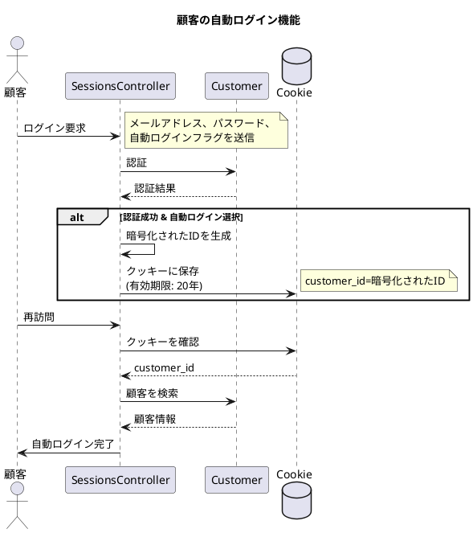
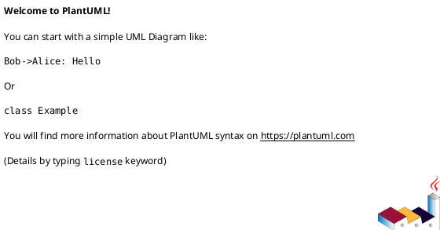

# 作業履歴 2017-02-09

## 概要

2017-02-09の作業内容をまとめています。この日は主に「顧客の自動ログイン機能」の実装を行いました。

### 実装内容の説明

#### 顧客の自動ログイン機能

顧客がシステムを再訪問した際に、毎回ログイン情報を入力する手間を省くため、「次回から自動でログイン」機能を実装しました。この機能は、顧客が明示的に選択した場合にのみ有効になります。実装にはクッキーを使用し、セキュリティを考慮して暗号化されたIDをクッキーに保存します。



#### クッキーの値とセキュリティ

セキュリティを確保するため、クッキーには顧客IDをそのまま保存するのではなく、SHA1ハッシュ関数を使用して暗号化した値を保存します。また、クッキーの有効期限は20年と長期に設定し、顧客が明示的にログアウトするまで自動ログインが機能するようにしています。

#### テストの実装

自動ログイン機能の信頼性を確保するため、以下のテストを実装しました：
1. クッキーに正しい形式の値が保存されることを確認するテスト
2. クッキーの有効期限が適切に設定されていることを確認するテスト

### アーキテクチャとの関連

この実装は、[アーキテクチャ概要](../アーキテクチャ概要.md)の「8. 認証・認可システム」セクションに関連しています。特に以下の部分を拡張するものです：

```
[Customer::SessionsController] --> [Customer]: authenticate
[Customer] --> [Customer::BaseController]: current_customer
```

顧客認証の仕組みに、クッキーを使用した自動ログイン機能を追加することで、ユーザー体験を向上させています。

### ユースケースとの関連

この実装は、[ユースケース](../ユースケース.md)の「4.1. アカウント管理」セクションに記載されている以下のユースケースを拡張するものです：

- C-002: 顧客ログイン

ユースケースの基本フローに「次回から自動でログイン」のオプションを追加し、顧客が選択した場合はクッキーを使用して認証情報を保持するようになりました。これにより、顧客は再訪問時に自動的にログイン状態となり、利便性が向上します。

## コミット: cabf2d2

### メッセージ

```
クッキーの有効期限テスト #29
```

### 変更されたファイル

- M	README.md
- M	spec/controllers/customer/session_controller_spec.rb

### 変更内容

```diff
commit cabf2d238f82761d8f40a1b265ff72295fd5e964
Author: k2works <kakimomokuri@gmail.com>
Date:   Thu Feb 9 18:19:14 2017 +0900

    クッキーの有効期限テスト #29

diff --git a/README.md b/README.md
index 8ac8ad5..caffe50 100644
--- a/README.md
+++ b/README.md
@@ -637,6 +637,7 @@ git push heroku master

 #### RSpecによるテスト
 + クッキーの値のテスト
++ クッキーの有効期限テスト

 ### IPアドレスによるアクセス制限
 #### IPアドレスによるアクセス制限
diff --git a/spec/controllers/customer/session_controller_spec.rb b/spec/controllers/customer/session_controller_spec.rb
index 6025c2f..5a0f323 100644
--- a/spec/controllers/customer/session_controller_spec.rb
+++ b/spec/controllers/customer/session_controller_spec.rb
@@ -24,6 +24,9 @@ describe Customer::SessionsController do

       expect(session).not_to have_key(:customer_id)
       expect(response.cookies['customer_id']).to match(/[0-9a-f]{40}\z/)
+
+      cookies = response.request.env['action_dispatch.cookies'].instance_variable_get(:@set_cookies)
+      expect(cookies['customer_id'][:expires]).to be > 19.years.from_now
     end
   end
 end
\ No newline at end of file

```

### 構造変更



## コミット: 4eed4f8

### メッセージ

```
クッキーの値のテスト #29
```

### 変更されたファイル

- M	README.md
- M	app/controllers/customer/sessions_controller.rb
- A	spec/controllers/customer/session_controller_spec.rb

### 変更内容

```diff
commit 4eed4f812bf206710c68d6505d9b2518633a4d62
Author: k2works <kakimomokuri@gmail.com>
Date:   Thu Feb 9 18:15:18 2017 +0900

    クッキーの値のテスト #29

diff --git a/README.md b/README.md
index 9325084..8ac8ad5 100644
--- a/README.md
+++ b/README.md
@@ -636,6 +636,7 @@ git push heroku master
 + 動作確認

 #### RSpecによるテスト
++ クッキーの値のテスト

 ### IPアドレスによるアクセス制限
 #### IPアドレスによるアクセス制限
diff --git a/app/controllers/customer/sessions_controller.rb b/app/controllers/customer/sessions_controller.rb
index 62555e9..aee14f1 100644
--- a/app/controllers/customer/sessions_controller.rb
+++ b/app/controllers/customer/sessions_controller.rb
@@ -41,7 +41,8 @@ class Customer::SessionsController < Customer::Base
   def post_params
     params.require(:customer_login_form).permit(
         :email,
-        :password
+        :password,
+        :remember_me
     )
   end
 end
diff --git a/spec/controllers/customer/session_controller_spec.rb b/spec/controllers/customer/session_controller_spec.rb
new file mode 100644
index 0000000..6025c2f
--- /dev/null
+++ b/spec/controllers/customer/session_controller_spec.rb
@@ -0,0 +1,29 @@
+require 'rails_helper'
+
+describe Customer::SessionsController do
+  describe '#create' do
+    let(:customer) { create(:customer, password: 'password') }
+
+    # [次回から自動でログインする]にチェックせずログイン
+    it 'Do not check "次回から自動でログインする" Login' do
+      post :create, customer_login_form: {
+          email: customer.email,
+          password: 'password'
+      }
+      expect(session[:customer_id]).to eq(customer.id)
+      expect(response.cookies).not_to have_key('custoemr_id')
+    end
+
+    # [次回から自動でログインする]にチェックしてログイン
+    it 'Do check "次回から自動でログインする" Login' do
+      post :create, customer_login_form: {
+          email: customer.email,
+          password: 'password',
+          remember_me: '1'
+      }
+
+      expect(session).not_to have_key(:customer_id)
+      expect(response.cookies['customer_id']).to match(/[0-9a-f]{40}\z/)
+    end
+  end
+end
\ No newline at end of file

```

### 構造変更


## コミット: 7b0c7ec

### メッセージ

```
コントローラの修正 #29
```

### 変更されたファイル

- M	README.md
- M	app/controllers/customer/base.rb
- M	app/controllers/customer/sessions_controller.rb

### 変更内容

```diff
commit 7b0c7ec1da8b6f90d6e710831e3c9c3f82c41f24
Author: k2works <kakimomokuri@gmail.com>
Date:   Thu Feb 9 17:58:51 2017 +0900

    コントローラの修正 #29

diff --git a/README.md b/README.md
index bdb8194..9325084 100644
--- a/README.md
+++ b/README.md
@@ -632,6 +632,8 @@ git push heroku master

 #### 自動ログイン機能の追加
 + ビューの修正
++ コントローラの修正
++ 動作確認

 #### RSpecによるテスト

diff --git a/app/controllers/customer/base.rb b/app/controllers/customer/base.rb
index c95c283..2fd598b 100644
--- a/app/controllers/customer/base.rb
+++ b/app/controllers/customer/base.rb
@@ -3,8 +3,8 @@ class Customer::Base < ApplicationController

   private
   def current_customer
-    if session[:customer_id]
-      @current_customer ||= Customer.find_by(id: session[:customer_id])
+    if customer_id = cookies.signed[:customer_id] || session[:customer_id]
+      @current_customer ||= Customer.find_by(id: customer_id)
     end
   end

diff --git a/app/controllers/customer/sessions_controller.rb b/app/controllers/customer/sessions_controller.rb
index 3394e51..62555e9 100644
--- a/app/controllers/customer/sessions_controller.rb
+++ b/app/controllers/customer/sessions_controller.rb
@@ -16,7 +16,12 @@ class Customer::SessionsController < Customer::Base
       customer = Customer.find_by(email_for_index: @form.email.downcase)
     end
     if Customer::Authenticator.new(customer).authenticate(@form.password)
-      session[:customer_id] = customer.id
+      if @form.remember_me?
+        cookies.permanent.signed[:customer_id] = customer.id
+      else
+        cookies.delete(:customer_id)
+        session[:customer_id] = customer.id
+      end
       flash.notice = t('common.session.create.notice')
       redirect_to :customer_root
     else
@@ -26,6 +31,7 @@ class Customer::SessionsController < Customer::Base
   end

   def destroy
+    cookies.delete(:customer_id)
     session.delete(:customer_id)
     flash.notice = t('common.session.destroy.notice')
     redirect_to :customer_login

```

### 構造変更


## コミット: d205c43

### メッセージ

```
ビューの修正 #29
```

### 変更されたファイル

- M	README.md
- M	app/forms/customer/login_form.rb
- M	app/views/customer/sessions/new.html.erb
- M	config/locales/views/ja.yml

### 変更内容

```diff
commit d205c43ec864aad4b2cbc67cd7d60e296b3d55b2
Author: k2works <kakimomokuri@gmail.com>
Date:   Thu Feb 9 17:47:23 2017 +0900

    ビューの修正 #29

diff --git a/README.md b/README.md
index f47bb33..bdb8194 100644
--- a/README.md
+++ b/README.md
@@ -631,6 +631,8 @@ git push heroku master
 + サービスオブジェクト

 #### 自動ログイン機能の追加
++ ビューの修正
+
 #### RSpecによるテスト

 ### IPアドレスによるアクセス制限
diff --git a/app/forms/customer/login_form.rb b/app/forms/customer/login_form.rb
index 1feb6e1..a0e2ef5 100644
--- a/app/forms/customer/login_form.rb
+++ b/app/forms/customer/login_form.rb
@@ -1,5 +1,9 @@
 class Customer::LoginForm
   include ActiveModel::Model

-  attr_accessor :email, :password
+  attr_accessor :email, :password, :remember_me
+
+  def remember_me?
+    remember_me == '1'
+  end
 end
\ No newline at end of file
diff --git a/app/views/customer/sessions/new.html.erb b/app/views/customer/sessions/new.html.erb
index 38e9d48..4d7bdc3 100644
--- a/app/views/customer/sessions/new.html.erb
+++ b/app/views/customer/sessions/new.html.erb
@@ -16,6 +16,9 @@
           <div>
             <%= f.password_field :password %>
           </div>
+          <div>
+            <%= f.check_box :remember_me, label: t('.remember') %>
+          </div>
           <div>
             <%= f.submit t '.submit' %>
           </div>
diff --git a/config/locales/views/ja.yml b/config/locales/views/ja.yml
index 2429038..7b1fcee 100644
--- a/config/locales/views/ja.yml
+++ b/config/locales/views/ja.yml
@@ -156,6 +156,7 @@ ja:
       new:
         title: 'ログイン'
         submit: 'ログイン'
+        remember: '次回から自動でログインする'
     top:
       dashboard:
         title: 'ダッシュボード'
\ No newline at end of file

```

## コミット: d801d1c

### メッセージ

```
サービスオブジェクト #29
```

### 変更されたファイル

- M	README.md
- M	app/assets/stylesheets/main.scss
- M	app/assets/stylesheets/pages/_customer.scss
- M	app/controllers/customer/article_controller.rb
- M	app/controllers/customer/base.rb
- M	app/controllers/customer/campaign_controller.rb
- M	app/controllers/customer/sessions_controller.rb
- M	app/controllers/customer/top_controller.rb
- A	app/services/customer/authenticator.rb
- M	app/views/customer/sessions/new.html.erb
- M	app/views/customer/shared/_header_login.html.erb
- A	app/views/customer/top/dashboard.html.erb
- M	config/locales/views/ja.yml

### 変更内容

```diff
commit d801d1c3217355fd1e741e3663b66d17afed5a50
Author: k2works <kakimomokuri@gmail.com>
Date:   Thu Feb 9 17:39:37 2017 +0900

    サービスオブジェクト #29

diff --git a/README.md b/README.md
index 4aa2842..f47bb33 100644
--- a/README.md
+++ b/README.md
@@ -628,6 +628,7 @@ git push heroku master
 + ルーティング
 + コントローラ
 + ビュー
++ サービスオブジェクト

 #### 自動ログイン機能の追加
 #### RSpecによるテスト
diff --git a/app/assets/stylesheets/main.scss b/app/assets/stylesheets/main.scss
index c21d5c5..82d9d5f 100644
--- a/app/assets/stylesheets/main.scss
+++ b/app/assets/stylesheets/main.scss
@@ -97,6 +97,7 @@
 @import "pages/customer/index";
 @import "pages/customer/campaign";
 @import "pages/customer/article";
+@import "pages/customer";

 // Staff
 @import "pages/staff";
diff --git a/app/assets/stylesheets/pages/_customer.scss b/app/assets/stylesheets/pages/_customer.scss
index 468e113..c101d73 100644
--- a/app/assets/stylesheets/pages/_customer.scss
+++ b/app/assets/stylesheets/pages/_customer.scss
@@ -30,13 +30,13 @@ html, body {
     padding: $moderate * 1.5 $moderate;
     font-size: $large;
     font-weight: normal;
-    background-color: $very_dark_magenta;
+    background-color: $very_dark_yellow;
     color: $light_gray;
   }

   &__header {
     padding: $moderate;
-    background-color: $dark_magenta;
+    background-color: $dark_yellow;
     color: $very_light_gray;
     span.logo-mark {
       font-weight: bold;
diff --git a/app/controllers/customer/article_controller.rb b/app/controllers/customer/article_controller.rb
index 3631c55..0355f89 100644
--- a/app/controllers/customer/article_controller.rb
+++ b/app/controllers/customer/article_controller.rb
@@ -1,4 +1,4 @@
-class Customer::ArticleController < ApplicationController
+class Customer::ArticleController < Customer::Base
   def index
   end
 end
\ No newline at end of file
diff --git a/app/controllers/customer/base.rb b/app/controllers/customer/base.rb
index d714b08..c95c283 100644
--- a/app/controllers/customer/base.rb
+++ b/app/controllers/customer/base.rb
@@ -4,7 +4,7 @@ class Customer::Base < ApplicationController
   private
   def current_customer
     if session[:customer_id]
-      @current_customer ||= Customer.find_by(id: session[:cutomer_id])
+      @current_customer ||= Customer.find_by(id: session[:customer_id])
     end
   end

diff --git a/app/controllers/customer/campaign_controller.rb b/app/controllers/customer/campaign_controller.rb
index 897f1f3..e852bae 100644
--- a/app/controllers/customer/campaign_controller.rb
+++ b/app/controllers/customer/campaign_controller.rb
@@ -1,4 +1,4 @@
-class Customer::CampaignController < ApplicationController
+class Customer::CampaignController < Customer::Base
   def index
   end

diff --git a/app/controllers/customer/sessions_controller.rb b/app/controllers/customer/sessions_controller.rb
index 993e180..3394e51 100644
--- a/app/controllers/customer/sessions_controller.rb
+++ b/app/controllers/customer/sessions_controller.rb
@@ -10,10 +10,10 @@ class Customer::SessionsController < Customer::Base
     end
   end

-  def crete
-    @form = Customer::LoginForm.new(params[:customer_login_form])
+  def create
+    @form = Customer::LoginForm.new(post_params)
     if @form.email.present?
-      customer = Customer.find_by(email_for_inde: @form.email.downcase)
+      customer = Customer.find_by(email_for_index: @form.email.downcase)
     end
     if Customer::Authenticator.new(customer).authenticate(@form.password)
       session[:customer_id] = customer.id
@@ -28,6 +28,14 @@ class Customer::SessionsController < Customer::Base
   def destroy
     session.delete(:customer_id)
     flash.notice = t('common.session.destroy.notice')
-    redirect_to :customer_root
+    redirect_to :customer_login
+  end
+
+  private
+  def post_params
+    params.require(:customer_login_form).permit(
+        :email,
+        :password
+    )
   end
 end
diff --git a/app/controllers/customer/top_controller.rb b/app/controllers/customer/top_controller.rb
index 013788c..7083b1d 100644
--- a/app/controllers/customer/top_controller.rb
+++ b/app/controllers/customer/top_controller.rb
@@ -2,6 +2,10 @@ class Customer::TopController < Customer::Base
   skip_before_action :authorize

   def index
-    render action: 'index'
+    if current_customer
+      render action: 'dashboard'
+    else
+      render action: 'index'
+    end
   end
 end
diff --git a/app/services/customer/authenticator.rb b/app/services/customer/authenticator.rb
new file mode 100644
index 0000000..517d2c3
--- /dev/null
+++ b/app/services/customer/authenticator.rb
@@ -0,0 +1,11 @@
+class Customer::Authenticator
+  def initialize(customer)
+    @customer = customer
+  end
+
+  def authenticate(raw_password)
+    @customer &&
+        @customer.hashed_password &&
+        BCrypt::Password.new(@customer.hashed_password) == raw_password
+  end
+end
\ No newline at end of file
diff --git a/app/views/customer/sessions/new.html.erb b/app/views/customer/sessions/new.html.erb
index f199010..38e9d48 100644
--- a/app/views/customer/sessions/new.html.erb
+++ b/app/views/customer/sessions/new.html.erb
@@ -2,6 +2,12 @@
 <section class="Section l-column">
   <div class="Login Login--customer">
     <h1 class="Login__head"><%= @title %></h1>
+
+    <div class="Flash">
+      <%= content_tag(:span, flash.notice, class: 'Flash__notice') if flash.notice %>
+      <%= content_tag(:span, flash.alert, class: 'Flash__alert') if flash.alert %>
+    </div>
+
     <div class="Login__body">
       <%= bootstrap_form_for @form, url: :customer_session do |f| %>
           <div>
diff --git a/app/views/customer/shared/_header_login.html.erb b/app/views/customer/shared/_header_login.html.erb
index fecb5a6..d957b92 100644
--- a/app/views/customer/shared/_header_login.html.erb
+++ b/app/views/customer/shared/_header_login.html.erb
@@ -17,9 +17,9 @@
     </ul>
   </nav>
   <%= if current_customer
-        link_to t('customer.shared.header.logout'), :admin_session, method: :delete, class: 'btn btn-default'
+        link_to t('customer.shared.header.logout'), :customer_session, method: :delete, class: 'btn btn-default'
       else
-        link_to t('customer.shared.header.login'), :admin_login, class: 'btn btn-default'
+        link_to t('customer.shared.header.login'), :customer_login, class: 'btn btn-default'
       end
   %>
 </header>
\ No newline at end of file
diff --git a/app/views/customer/top/dashboard.html.erb b/app/views/customer/top/dashboard.html.erb
new file mode 100644
index 0000000..6aa1334
--- /dev/null
+++ b/app/views/customer/top/dashboard.html.erb
@@ -0,0 +1,16 @@
+<% @title = t('.title') %>
+<section class="Section">
+  <h1 class="Customer__title"><%= @title %></h1>
+</section>
+
+<section class="Section l-column DashBoard">
+  <div class="Section__head">
+    <h2 class="sectionLabel">お知らせ</h2>
+  </div>
+  <ol class="NewsList">
+    <li class="NewsList__item">
+      <time class="NewsList__head" datatime="2017-2-9">2017.2.9</time>
+      <span class="NewsList__body">顧客ログイン・ログアウト機能追加</span>
+    </li>
+  </ol>
+</section>
\ No newline at end of file
diff --git a/config/locales/views/ja.yml b/config/locales/views/ja.yml
index 08a8945..2429038 100644
--- a/config/locales/views/ja.yml
+++ b/config/locales/views/ja.yml
@@ -150,9 +150,12 @@ ja:
   customer:
     shared:
       header:
-        login: 'Login'
-        logout: 'Logout'
+        login: 'ログイン'
+        logout: 'ログアウト'
     sessions:
       new:
         title: 'ログイン'
-        submit: 'ログイン'
\ No newline at end of file
+        submit: 'ログイン'
+    top:
+      dashboard:
+        title: 'ダッシュボード'
\ No newline at end of file

```

### 構造変更


## コミット: 9b86839

### メッセージ

```
ビュー #29
```

### 変更されたファイル

- M	README.md
- M	app/assets/stylesheets/base/_variables.scss
- A	app/assets/stylesheets/pages/_customer.scss
- M	app/assets/stylesheets/pages/_login.scss
- A	app/forms/customer/login_form.rb
- M	app/views/admin/sessions/new.html.erb
- M	app/views/admin/shared/_footer.html.erb
- A	app/views/customer/sessions/new.html.erb
- M	app/views/customer/shared/_footer.html.erb
- A	app/views/customer/shared/_footer_login.html.erb
- M	app/views/customer/shared/_header.html.erb
- A	app/views/customer/shared/_header_login.html.erb
- M	app/views/layouts/customer.html.erb
- M	app/views/staff/sessions/new.html.erb
- M	config/locales/models/ja.yml
- M	config/locales/views/ja.yml

### 変更内容

```diff
commit 9b86839fc0db6c435e66b4e31748467694eba16e
Author: k2works <kakimomokuri@gmail.com>
Date:   Thu Feb 9 16:39:28 2017 +0900

    ビュー #29

diff --git a/README.md b/README.md
index 3f4db64..4aa2842 100644
--- a/README.md
+++ b/README.md
@@ -627,6 +627,7 @@ git push heroku master
 #### 顧客のログイン・ログアウト機能
 + ルーティング
 + コントローラ
++ ビュー

 #### 自動ログイン機能の追加
 #### RSpecによるテスト
diff --git a/app/assets/stylesheets/base/_variables.scss b/app/assets/stylesheets/base/_variables.scss
index 13563ca..d79c276 100644
--- a/app/assets/stylesheets/base/_variables.scss
+++ b/app/assets/stylesheets/base/_variables.scss
@@ -47,6 +47,11 @@ $very_dark_cyan: darken($dark_cyan, 25%);
 $dark_magenta: #884488;
 $very_dark_magenta: darken($dark_magenta, 25%);

+/* イエロー系 */
+
+$dark_yellow: #888844;
+$very_dark_yellow: darken($dark_yellow, 25%);
+
 /* 赤系 */
 $red: #cc0000;
 $pink: #ffcccc;
diff --git a/app/assets/stylesheets/pages/_customer.scss b/app/assets/stylesheets/pages/_customer.scss
new file mode 100644
index 0000000..468e113
--- /dev/null
+++ b/app/assets/stylesheets/pages/_customer.scss
@@ -0,0 +1,62 @@
+@charset 'utf-8';
+
+// =====================
+// 顧客ページ固有のスタイル
+// =====================
+
+
+html, body {
+  margin: 0;
+  padding: 0;
+  height: 100%;
+}
+
+.Header__head {
+  text-align: left;
+}
+
+.Customer {
+  &__wrapper {
+    position: relative;
+    box-sizing: border-box;
+    min-height: 100%;
+    margin: 0 auto;
+    padding-bottom: ($wide + $moderate) * 2 + $standard_line_height;
+    background-color: $gray;
+  }
+
+  &__title {
+    margin: 0;
+    padding: $moderate * 1.5 $moderate;
+    font-size: $large;
+    font-weight: normal;
+    background-color: $very_dark_magenta;
+    color: $light_gray;
+  }
+
+  &__header {
+    padding: $moderate;
+    background-color: $dark_magenta;
+    color: $very_light_gray;
+    span.logo-mark {
+      font-weight: bold;
+    }
+  }
+
+  &__footer {
+    bottom: 0;
+    position: absolute;
+    width: 100%;
+    background-color: $dark_gray;
+    color: $very_light_gray;
+    p {
+      text-align: center;
+      padding: $moderate;
+      margin: 0;
+    }
+  }
+}
+
+.logo--customer {
+  color: $color-white;
+}
diff --git a/app/assets/stylesheets/pages/_login.scss b/app/assets/stylesheets/pages/_login.scss
index 72fc3e8..f86b2a9 100644
--- a/app/assets/stylesheets/pages/_login.scss
+++ b/app/assets/stylesheets/pages/_login.scss
@@ -19,6 +19,9 @@
   &--admin {
     border: solid 4px $dark_magenta;
   }
+  &--customer {
+    border: solid 4px $dark_yellow;
+  }

   background-color: $very_light_gray;

diff --git a/app/forms/customer/login_form.rb b/app/forms/customer/login_form.rb
new file mode 100644
index 0000000..1feb6e1
--- /dev/null
+++ b/app/forms/customer/login_form.rb
@@ -0,0 +1,5 @@
+class Customer::LoginForm
+  include ActiveModel::Model
+
+  attr_accessor :email, :password
+end
\ No newline at end of file
diff --git a/app/views/admin/sessions/new.html.erb b/app/views/admin/sessions/new.html.erb
index a33ec06..a053234 100644
--- a/app/views/admin/sessions/new.html.erb
+++ b/app/views/admin/sessions/new.html.erb
@@ -1,4 +1,4 @@
-<% @title = 'ログイン' %>
+<% @title = t('.title') %>
 <section class="Section l-column">
   <div class="Login Login--admin">
     <h1 class="Login__head"><%= @title %></h1>
diff --git a/app/views/admin/shared/_footer.html.erb b/app/views/admin/shared/_footer.html.erb
index e3c34d8..3fb42b5 100644
--- a/app/views/admin/shared/_footer.html.erb
+++ b/app/views/admin/shared/_footer.html.erb
@@ -1,7 +1,7 @@
 <footer class="Footer Admin__footer">
   <div class="l-row l-column">
     <div class="Footer__head">
-      <%= link_to('BAUKIS KAI', staff_root_url, class:'logo') %>
+      <%= link_to('BAUKIS KAI', admin_root_url, class:'logo') %>
       <ul class="Menu Menu--sub">
         <li><a href="#" class="Menu__item"></a></li>
       </ul>
diff --git a/app/views/customer/sessions/new.html.erb b/app/views/customer/sessions/new.html.erb
new file mode 100644
index 0000000..f199010
--- /dev/null
+++ b/app/views/customer/sessions/new.html.erb
@@ -0,0 +1,19 @@
+<% @title = t('.title') %>
+<section class="Section l-column">
+  <div class="Login Login--customer">
+    <h1 class="Login__head"><%= @title %></h1>
+    <div class="Login__body">
+      <%= bootstrap_form_for @form, url: :customer_session do |f| %>
+          <div>
+            <%= f.text_field :email %>
+          </div>
+          <div>
+            <%= f.password_field :password %>
+          </div>
+          <div>
+            <%= f.submit t '.submit' %>
+          </div>
+      <% end %>
+    </div>
+  </div>
+</section>
\ No newline at end of file
diff --git a/app/views/customer/shared/_footer.html.erb b/app/views/customer/shared/_footer.html.erb
index 46d3707..e57987c 100644
--- a/app/views/customer/shared/_footer.html.erb
+++ b/app/views/customer/shared/_footer.html.erb
@@ -1,13 +1,14 @@
 <footer class="Footer">
   <div class="l-row l-column">
     <div class="Footer__head">
-      <%= link_to('BAUKIS KAI', staff_root_url, class:'logo') %>
+      <%= link_to('BAUKIS KAI', customer_root_url, class:'logo') %>
       <ul class="Menu Menu--sub">
         <li><a href="#" class="Menu__item">Services</a></li>
         <li><a href="#" class="Menu__item">Work</a></li>
         <li><a href="#" class="Menu__item">About us</a></li>
         <li><%= link_to('Blog', customer_article_index_url,class:"Menu__item") %></li>
         <li><a href="#" class="Menu__item">Contact</a></li>
+        <li><%= link_to('Login', customer_login_url,class:"Menu__item") %></li>
       </ul>
     </div>
     <div class="Footer__body">
diff --git a/app/views/customer/shared/_footer_login.html.erb b/app/views/customer/shared/_footer_login.html.erb
new file mode 100644
index 0000000..dd87033
--- /dev/null
+++ b/app/views/customer/shared/_footer_login.html.erb
@@ -0,0 +1,13 @@
+<footer class="Footer Customer__footer">
+  <div class="l-row l-column">
+    <div class="Footer__head">
+      <%= link_to('BAUKIS KAI', customer_root_url, class:'logo') %>
+      <ul class="Menu Menu--sub">
+        <li><a href="#" class="Menu__item"></a></li>
+      </ul>
+    </div>
+    <div class="Footer__body">
+      <p>Powered by BAUKIS KAI &copy; 2014 k2works</p>
+    </div>
+  </div>
+</footer>
\ No newline at end of file
diff --git a/app/views/customer/shared/_header.html.erb b/app/views/customer/shared/_header.html.erb
index ae88d5d..05d8bc0 100644
--- a/app/views/customer/shared/_header.html.erb
+++ b/app/views/customer/shared/_header.html.erb
@@ -12,6 +12,7 @@
       <li class="Menu__item"><a href="#">About</a></li>
       <li class="Menu__item"><%= link_to('Blog', customer_article_index_url) %></li>
       <li class="Menu__item"><a href="#">Contact</a></li>
+      <li class="Menu__item"><%= link_to('Login', customer_login_url) %></li>
     </ul>
   </nav>
 </header>
\ No newline at end of file
diff --git a/app/views/customer/shared/_header_login.html.erb b/app/views/customer/shared/_header_login.html.erb
new file mode 100644
index 0000000..fecb5a6
--- /dev/null
+++ b/app/views/customer/shared/_header_login.html.erb
@@ -0,0 +1,25 @@
+<header class="Header Customer__header">
+  <div id="menu-button" class="Header__button">
+    <%= fa_icon 'bars' %>
+  </div>
+  <div class="Header__head">
+    <h1 class="logo"><%= link_to('BAUKIS KAI', customer_root_url, class:'logo logo--customer') %></h1>
+  </div>
+
+  <div class="Flash">
+    <%= content_tag(:span, flash.notice, class: 'Flash__notice') if flash.notice %>
+    <%= content_tag(:span, flash.alert, class: 'Flash__alert') if flash.alert %>
+  </div>
+
+  <nav class="Header__body SpMenu">
+    <ul class="Menu">
+      <li class="Menu__item"><a href="#"></a></li>
+    </ul>
+  </nav>
+  <%= if current_customer
+        link_to t('customer.shared.header.logout'), :admin_session, method: :delete, class: 'btn btn-default'
+      else
+        link_to t('customer.shared.header.login'), :admin_login, class: 'btn btn-default'
+      end
+  %>
+</header>
\ No newline at end of file
diff --git a/app/views/layouts/customer.html.erb b/app/views/layouts/customer.html.erb
index 404c4c2..b8368e8 100644
--- a/app/views/layouts/customer.html.erb
+++ b/app/views/layouts/customer.html.erb
@@ -13,9 +13,11 @@
 <body>
 <div id="wrapper" class="SpMenu__wrapper">
   <div id="overlay" class="SpMenu__overlay"></div>
-  <%= render 'customer/shared/header' %>
+  <% header = current_customer ? 'header_login' : 'header' %>
+  <% footer = current_customer ? 'footer_login' : 'footer' %>
+  <%= render "customer/shared/#{header}" %>
   <%= yield %>
-  <%= render 'customer/shared/footer' %>
+  <%= render "customer/shared/#{footer}" %>
 </div>
 <script>
     imageSlide('Slide', 2);
diff --git a/app/views/staff/sessions/new.html.erb b/app/views/staff/sessions/new.html.erb
index 8479cef..07c6517 100644
--- a/app/views/staff/sessions/new.html.erb
+++ b/app/views/staff/sessions/new.html.erb
@@ -1,4 +1,4 @@
-<% @title = 'ログイン' %>
+<% @title = t('.title') %>
 <section class="Section l-column">
   <div class="Login Login--staff">
     <h1 class="Login__head"><%= @title %></h1>
diff --git a/config/locales/models/ja.yml b/config/locales/models/ja.yml
index 612676c..b52d1db 100644
--- a/config/locales/models/ja.yml
+++ b/config/locales/models/ja.yml
@@ -115,6 +115,7 @@ ja:
       staff/login_form: 職員ログインフォーム
       staff/change_password_form: 職員パスワード変更フォーム
       admin/login_form: 管理者ログインフォーム
+      customer/login_form: 顧客ログインフォーム

     attributes:
       staff/login_form:
@@ -127,3 +128,6 @@ ja:
       admin/login_form:
         email: メールアドレス
         password: パスワード
+      customer/login_form:
+        email: メールアドレス
+        password: パスワード
diff --git a/config/locales/views/ja.yml b/config/locales/views/ja.yml
index 5ac1a8e..08a8945 100644
--- a/config/locales/views/ja.yml
+++ b/config/locales/views/ja.yml
@@ -16,6 +16,7 @@ ja:
         submit: '検索'
     sessions:
       new:
+        title: 'ログイン'
         submit: 'ログイン'
     top:
       index:
@@ -105,6 +106,7 @@ ja:
         logout: 'ログアウト'
     sessions:
       new:
+        title: 'ログイン'
         submit: 'ログイン'
     top:
       index:
@@ -143,4 +145,14 @@ ja:
           full_name: '氏名'
           type: '種別'
           date_time: '日時'
-          contents_not_record: '記録がありません'
\ No newline at end of file
+          contents_not_record: '記録がありません'
+
+  customer:
+    shared:
+      header:
+        login: 'Login'
+        logout: 'Logout'
+    sessions:
+      new:
+        title: 'ログイン'
+        submit: 'ログイン'
\ No newline at end of file

```

## コミット: 6862ae8

### メッセージ

```
コントローラ #29
```

### 変更されたファイル

- M	README.md
- A	app/controllers/customer/base.rb
- A	app/controllers/customer/sessions_controller.rb
- M	app/controllers/customer/top_controller.rb
- M	config/locales/controllers/ja.yml

### 変更内容

```diff
commit 6862ae8a1af4d4162c169ad9ca5a2ce7dd7b4ca8
Author: k2works <kakimomokuri@gmail.com>
Date:   Thu Feb 9 15:13:26 2017 +0900

    コントローラ #29

diff --git a/README.md b/README.md
index b52a5e7..3f4db64 100644
--- a/README.md
+++ b/README.md
@@ -626,6 +626,7 @@ git push heroku master
 ### 次回から自動でログイン
 #### 顧客のログイン・ログアウト機能
 + ルーティング
++ コントローラ

 #### 自動ログイン機能の追加
 #### RSpecによるテスト
diff --git a/app/controllers/customer/base.rb b/app/controllers/customer/base.rb
new file mode 100644
index 0000000..d714b08
--- /dev/null
+++ b/app/controllers/customer/base.rb
@@ -0,0 +1,18 @@
+class Customer::Base < ApplicationController
+  before_action :authorize
+
+  private
+  def current_customer
+    if session[:customer_id]
+      @current_customer ||= Customer.find_by(id: session[:cutomer_id])
+    end
+  end
+
+  helper_method :current_customer
+
+  def authorize
+    unless current_customer
+      flash.alert = t('customer.base.authrize.flash_alert')
+    end
+  end
+end
\ No newline at end of file
diff --git a/app/controllers/customer/sessions_controller.rb b/app/controllers/customer/sessions_controller.rb
new file mode 100644
index 0000000..993e180
--- /dev/null
+++ b/app/controllers/customer/sessions_controller.rb
@@ -0,0 +1,33 @@
+class Customer::SessionsController < Customer::Base
+  skip_before_action :authorize
+
+  def new
+    if current_customer
+      redirect_to :customer_root
+    else
+      @form = Customer::LoginForm.new
+      render action: 'new'
+    end
+  end
+
+  def crete
+    @form = Customer::LoginForm.new(params[:customer_login_form])
+    if @form.email.present?
+      customer = Customer.find_by(email_for_inde: @form.email.downcase)
+    end
+    if Customer::Authenticator.new(customer).authenticate(@form.password)
+      session[:customer_id] = customer.id
+      flash.notice = t('common.session.create.notice')
+      redirect_to :customer_root
+    else
+      flash.now.alert = t('common.session.create.alert_mail_password')
+      render action: 'new'
+    end
+  end
+
+  def destroy
+    session.delete(:customer_id)
+    flash.notice = t('common.session.destroy.notice')
+    redirect_to :customer_root
+  end
+end
diff --git a/app/controllers/customer/top_controller.rb b/app/controllers/customer/top_controller.rb
index 9fc6012..013788c 100644
--- a/app/controllers/customer/top_controller.rb
+++ b/app/controllers/customer/top_controller.rb
@@ -1,4 +1,6 @@
-class Customer::TopController < ApplicationController
+class Customer::TopController < Customer::Base
+  skip_before_action :authorize
+
   def index
     render action: 'index'
   end
diff --git a/config/locales/controllers/ja.yml b/config/locales/controllers/ja.yml
index b400f59..8555c0e 100644
--- a/config/locales/controllers/ja.yml
+++ b/config/locales/controllers/ja.yml
@@ -41,4 +41,8 @@ ja:
       update:
         flash_success: '職員アカウントを更新しました。'
       destroy:
-        flash_success: '職員アカウントを削除しました。'
\ No newline at end of file
+        flash_success: '職員アカウントを削除しました。'
+  customer:
+    base:
+      authrize:
+        flash_alert: 'ログインしてください。'
\ No newline at end of file

```

### 構造変更


## コミット: 5352ad5

### メッセージ

```
ルーティング #29
```

### 変更されたファイル

- M	README.md
- M	config/routes.rb

### 変更内容

```diff
commit 5352ad579983fbcc3e34b515ca567de0d9e3211c
Author: k2works <kakimomokuri@gmail.com>
Date:   Thu Feb 9 14:39:08 2017 +0900

    ルーティング #29

diff --git a/README.md b/README.md
index 5e01860..b52a5e7 100644
--- a/README.md
+++ b/README.md
@@ -625,6 +625,8 @@ git push heroku master

 ### 次回から自動でログイン
 #### 顧客のログイン・ログアウト機能
++ ルーティング
+
 #### 自動ログイン機能の追加
 #### RSpecによるテスト

diff --git a/config/routes.rb b/config/routes.rb
index f0f1ae9..ce8228f 100644
--- a/config/routes.rb
+++ b/config/routes.rb
@@ -39,6 +39,9 @@
 #          customer_article_index GET    /article/index(.:format)                             customer/article#index {:host=>"0.0.0.0"}
 #         customer_campaign_index GET    /campaign/index(.:format)                            customer/campaign#index {:host=>"0.0.0.0"}
 #        customer_campaign_submit GET    /campaign_submit(.:format)                           customer/campaign#submit {:host=>"0.0.0.0"}
+#                  customer_login GET    /login(.:format)                                     customer/sessions#new {:host=>"0.0.0.0"}
+#                customer_session DELETE /session(.:format)                                   customer/sessions#destroy {:host=>"0.0.0.0"}
+#                                 POST   /session(.:format)                                   customer/sessions#create {:host=>"0.0.0.0"}
 #                            root GET    /                                                    errors#routing_error
 #                                 GET    /*anything(.:format)                                 errors#routing_error
 #
@@ -78,6 +81,8 @@ Rails.application.routes.draw do
       get 'article/index'
       get 'campaign/index'
       get 'campaign_submit', to: 'campaign#submit'
+      get 'login' => 'sessions#new', as: :login
+      resource :session, only: [ :create, :destroy ]
     end
   end


```

## コミット: 977c96a

### メッセージ

```
機能拡張編
```

### 変更されたファイル

- M	README.md

### 変更内容

```diff
commit 977c96a4afebbd8d005b532d2d316b150c84cccd
Author: k2works <kakimomokuri@gmail.com>
Date:   Thu Feb 9 14:22:14 2017 +0900

    機能拡張編

diff --git a/README.md b/README.md
index 18c6f37..5e01860 100644
--- a/README.md
+++ b/README.md
@@ -623,6 +623,48 @@ git push heroku master
 + 検索条件に郵便番号を追加
 + 検索条件に電話番号下４桁を追加

+### 次回から自動でログイン
+#### 顧客のログイン・ログアウト機能
+#### 自動ログイン機能の追加
+#### RSpecによるテスト
+
+### IPアドレスによるアクセス制限
+#### IPアドレスによるアクセス制限
+#### 許可IPアドレスの管理
+#### 演習問題
+
+### 多対多の関連付け
+#### 多対多の関連付け
+#### プログラム管理機能（前編）
+#### パフォーマンス改善
+
+### 複雑なフォーム
+#### プログラム管理機能（後編）
+#### プログラム申し込み機能
+
+### トランザクションと排他的ロック
+#### プログラム一覧表示・詳細表示機能（顧客向け)
+#### プログラム申し込み機能
+
+### フォームの確認画面 
+#### 顧客自身によるアカウント管理機能
+#### 確認画面
+#### 演習問題
+
+### Ajax
+#### 顧客向け問い合わせフォーム
+#### 問い合わせ到着の通知
+ 
+### ツリー構造
+#### 問い合わせの一覧表示と削除
+#### メッセージツリーの表示
+
+### タグ付け
+#### 問い合わせの返信機能
+#### メッセージのタグ付け
+#### 一意制約と排他的ロック
+#### 演習問題  
+
 **[⬆ back to top](#構成)**

 # 参照 #

```
