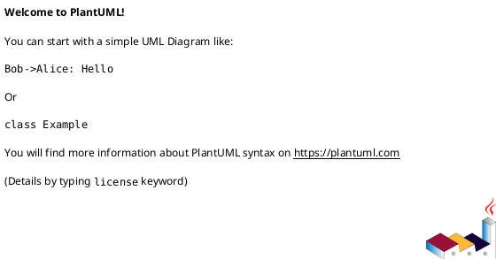

# 作業履歴 2017-02-10

## 概要

2017-02-10の作業内容をまとめています。

## コミット: 698d99c

### メッセージ

```
許可IPアドレスの一括削除 #28
```

### 変更されたファイル

- M	README.md
- M	app/controllers/admin/allowed_sources_controller.rb
- A	app/services/admin/allowed_sources_deleter.rb
- M	app/views/admin/allowed_sources/index.html.erb
- M	config/locales/controllers/ja.yml

### 変更内容

```diff
commit 698d99c761059d878c16102f32c4e809628b6151
Author: k2works <kakimomokuri@gmail.com>
Date:   Fri Feb 10 21:39:54 2017 +0900

    許可IPアドレスの一括削除 #28

diff --git a/README.md b/README.md
index 60478cd..a0749af 100644
--- a/README.md
+++ b/README.md
@@ -655,6 +655,7 @@ git push heroku master
 + 許可IPアドレスの新規登録フォーム
 + 許可IPアドレスの追加
 + 許可IPアドレスの一括削除フォーム
++ 許可IPアドレスの一括削除
 
 #### 演習問題
 
diff --git a/app/controllers/admin/allowed_sources_controller.rb b/app/controllers/admin/allowed_sources_controller.rb
index 6745e01..bb03a41 100644
--- a/app/controllers/admin/allowed_sources_controller.rb
+++ b/app/controllers/admin/allowed_sources_controller.rb
@@ -17,6 +17,13 @@ class Admin::AllowedSourcesController < Admin::Base
     end
   end
 
+  def delete
+    if Admin::AllowedSourcesDeleter.new.delete(allowed_sources_params(params[:form]))
+      flash.notice = t('.flash_notice')
+    end
+    redirect_to action: 'index'
+  end
+
   private
   def allowed_source_params
     params.require(:allowed_source).permit(:octet1,
@@ -24,4 +31,15 @@ class Admin::AllowedSourcesController < Admin::Base
                                            :octet3,
                                            :last_octet)
   end
+
+  def allowed_sources_params(form)
+    arr = Array.new
+    form[:allowed_sources].each do |v|
+      h = Hash.new
+      h.store(:id,form[:allowed_sources][v].permit([:id,:_destroy]).to_h[:id])
+      h.store(:_destroy,form[:allowed_sources][v].permit([:id,:_destroy]).to_h[:_destroy])
+      arr << h
+    end
+    arr
+  end
 end
diff --git a/app/services/admin/allowed_sources_deleter.rb b/app/services/admin/allowed_sources_deleter.rb
new file mode 100644
index 0000000..c720e1d
--- /dev/null
+++ b/app/services/admin/allowed_sources_deleter.rb
@@ -0,0 +1,13 @@
+class Admin::AllowedSourcesDeleter
+  def delete(params)
+    ids = []
+    params.each do |hash|
+      if hash[:_destroy] == '1'
+        ids << hash[:id]
+      end
+    end
+    if ids.present?
+      AllowedSource.where(namespace: 'staff', id: ids).delete_all
+    end
+  end
+end
\ No newline at end of file
diff --git a/app/views/admin/allowed_sources/index.html.erb b/app/views/admin/allowed_sources/index.html.erb
index c4ebc36..c2a993f 100644
--- a/app/views/admin/allowed_sources/index.html.erb
+++ b/app/views/admin/allowed_sources/index.html.erb
@@ -16,7 +16,7 @@
           </tr>
           <% @allowed_sources.each_with_index do |s, index| %>
               <% p = Admin::AllowedSourcePresenter.new(s, self) %>
-              <%= f.fields_for :@allowed_sources, s, index: index do |ff| %>
+              <%= f.fields_for :allowed_sources, s, index: index do |ff| %>
                   <%= ff.hidden_field :id %>
                   <tr  class="Table__tr">
                     <td class="Table__td Table__td--action Table__td--center"><%= ff.check_box :_destroy ,label:''%></td>
@@ -33,5 +33,4 @@
         </div>
     <% end %>
   </div>
-</section>
-
+</section>
\ No newline at end of file
diff --git a/config/locales/controllers/ja.yml b/config/locales/controllers/ja.yml
index 484e11b..2faa88c 100644
--- a/config/locales/controllers/ja.yml
+++ b/config/locales/controllers/ja.yml
@@ -46,6 +46,8 @@ ja:
       create:
         flash_notice: '許可IPアドレスを追加しました。'
         flash_alert: '許可IPアドレスの値が正しくありません。'
+      delete:
+        flash_notice: '許可IPアドレスを削除しました。'
 
   customer:
     base:

```

### 構造変更



## コミット: bf9f1c3

### メッセージ

```
許可IPアドレスの一括削除フォーム #28
```

### 変更されたファイル

- M	README.md
- M	app/models/allowed_source.rb
- M	app/views/admin/allowed_sources/_new_allowed_source.html.erb
- M	app/views/admin/allowed_sources/index.html.erb
- M	config/locales/views/ja.yml

### 変更内容

```diff
commit bf9f1c3603d8340ab97cb984a33d2c7b296e33e3
Author: k2works <kakimomokuri@gmail.com>
Date:   Fri Feb 10 18:00:37 2017 +0900

    許可IPアドレスの一括削除フォーム #28

diff --git a/README.md b/README.md
index b35bf73..60478cd 100644
--- a/README.md
+++ b/README.md
@@ -654,6 +654,7 @@ git push heroku master
 + 許可IPアドレスの一覧表示
 + 許可IPアドレスの新規登録フォーム
 + 許可IPアドレスの追加
++ 許可IPアドレスの一括削除フォーム
 
 #### 演習問題
 
diff --git a/app/models/allowed_source.rb b/app/models/allowed_source.rb
index 10c6f60..7a1154d 100644
--- a/app/models/allowed_source.rb
+++ b/app/models/allowed_source.rb
@@ -18,7 +18,7 @@
 #
 
 class AllowedSource < ApplicationRecord
-  attr_accessor :last_octet
+  attr_accessor :last_octet, :_destroy
 
   before_validation do
     if last_octet
diff --git a/app/views/admin/allowed_sources/_new_allowed_source.html.erb b/app/views/admin/allowed_sources/_new_allowed_source.html.erb
index a024b99..c7d281e 100644
--- a/app/views/admin/allowed_sources/_new_allowed_source.html.erb
+++ b/app/views/admin/allowed_sources/_new_allowed_source.html.erb
@@ -5,6 +5,6 @@
   <%= f.text_field(:octet2, size:3, hide_label:true) %>
   <%= f.text_field(:octet3, size:3, hide_label:true) %>
   <%= f.text_field(:last_octet, size:3, hide_label:true) %>
-  <%= f.submit t('admin.allowed_sources.index.submit'), inline: true %>
+  <%= f.submit t('admin.allowed_sources.new_allowed_source.submit'), inline: true %>
 </div>
 <% end %>
\ No newline at end of file
diff --git a/app/views/admin/allowed_sources/index.html.erb b/app/views/admin/allowed_sources/index.html.erb
index 4b2721d..c4ebc36 100644
--- a/app/views/admin/allowed_sources/index.html.erb
+++ b/app/views/admin/allowed_sources/index.html.erb
@@ -6,22 +6,32 @@
 <section class="Section l-column AppForm">
   <div class="AppForm__generic-form AdminAppForm__generic-form AppForm__customer_form">
     <%= render 'new_allowed_source' %>
-  </div>
-</section>
-
 
-<section class="Section l-column Table">
-  <table class="Table__body Table__body--listing AdminTable__body">
-    <tr class="Table__tr">
-      <th class="Table__th"><%= t('.ip_address') %></th>
-      <th class="Table__th"><%= t('.created_at') %></th>
-    </tr>
-    <% @allowed_sources.each do |s| %>
-        <% p = Admin::AllowedSourcePresenter.new(s, self) %>
-        <tr  class="Table__tr">
-          <td class="Table__td Table__td--ip Table__td--center"><%= p.ip_address %></td>
-          <td class="Table__td Table__td--date Table__td--center"><%= p.created_at %></td>
-        </tr>
+    <%= bootstrap_form_for :form, url: :delete_admin_allowed_sources, method: :delete do |f| %>
+        <table class="Table__body Table__body--listing AdminTable__body">
+          <tr class="Table__tr">
+            <th class="Table__th"><%= t('.delete') %></th>
+            <th class="Table__th"><%= t('.ip_address') %></th>
+            <th class="Table__th"><%= t('.created_at') %></th>
+          </tr>
+          <% @allowed_sources.each_with_index do |s, index| %>
+              <% p = Admin::AllowedSourcePresenter.new(s, self) %>
+              <%= f.fields_for :@allowed_sources, s, index: index do |ff| %>
+                  <%= ff.hidden_field :id %>
+                  <tr  class="Table__tr">
+                    <td class="Table__td Table__td--action Table__td--center"><%= ff.check_box :_destroy ,label:''%></td>
+                    <td class="Table__td Table__td--ip Table__td--center"><%= p.ip_address %></td>
+                    <td class="Table__td Table__td--date Table__td--center"><%= p.created_at %></td>
+                  </tr>
+              <% end %>
+          <% end %>
+        </table>
+        <div>
+          <%= f.submit t('.submit'),
+                       data: { confirmed: t('.confirm')}
+          %>
+        </div>
     <% end %>
-  </table>
+  </div>
 </section>
+
diff --git a/config/locales/views/ja.yml b/config/locales/views/ja.yml
index 17a4243..07e17d1 100644
--- a/config/locales/views/ja.yml
+++ b/config/locales/views/ja.yml
@@ -150,9 +150,13 @@ ja:
     allowed_sources:
         index:
           title: '許可IPアドレス一覧'
+          delete: '削除'
           ip_address: 'IPアドレス'
           created_at: '作成日時'
           form_label: '新規許可IPアドレス'
+          submit: 'チェックしたIPアドレスを削除'
+          confirm: '本当に削除しますか。'
+        new_allowed_source:
           submit: '追加'
 
   customer:

```

### 構造変更


## コミット: 8cf338b

### メッセージ

```
許可IPアドレスの追加 #28
```

### 変更されたファイル

- M	README.md
- M	app/controllers/admin/allowed_sources_controller.rb
- M	app/models/allowed_source.rb
- M	config/locales/controllers/ja.yml

### 変更内容

```diff
commit 8cf338b152d52233de9c20b00c5663e0d2522157
Author: k2works <kakimomokuri@gmail.com>
Date:   Fri Feb 10 17:32:11 2017 +0900

    許可IPアドレスの追加 #28

diff --git a/README.md b/README.md
index 80e4e13..b35bf73 100644
--- a/README.md
+++ b/README.md
@@ -653,6 +653,7 @@ git push heroku master
 + ルーティング
 + 許可IPアドレスの一覧表示
 + 許可IPアドレスの新規登録フォーム
++ 許可IPアドレスの追加
 
 #### 演習問題
 
diff --git a/app/controllers/admin/allowed_sources_controller.rb b/app/controllers/admin/allowed_sources_controller.rb
index bfef319..6745e01 100644
--- a/app/controllers/admin/allowed_sources_controller.rb
+++ b/app/controllers/admin/allowed_sources_controller.rb
@@ -3,4 +3,25 @@ class Admin::AllowedSourcesController < Admin::Base
     @allowed_sources = AllowedSource.order(:octet1, :octet2, :octet3, :octet4)
     @new_allowed_source = AllowedSource.new
   end
+
+  def create
+    @new_allowed_source = AllowedSource.new(allowed_source_params)
+    @new_allowed_source.namespace = 'staff'
+    if @new_allowed_source.save
+      flash.notice = t('.flash_notice')
+      redirect_to action: 'index'
+    else
+      @allowed_sources = AllowedSource.order(:octet1, :octet2, :octet3, :octet4)
+      flash.now.alert = t('.flash_alert')
+      render action: 'index'
+    end
+  end
+
+  private
+  def allowed_source_params
+    params.require(:allowed_source).permit(:octet1,
+                                           :octet2,
+                                           :octet3,
+                                           :last_octet)
+  end
 end
diff --git a/app/models/allowed_source.rb b/app/models/allowed_source.rb
index 2d2bf38..10c6f60 100644
--- a/app/models/allowed_source.rb
+++ b/app/models/allowed_source.rb
@@ -20,12 +20,34 @@
 class AllowedSource < ApplicationRecord
   attr_accessor :last_octet
 
+  before_validation do
+    if last_octet
+      self.last_octet.strip!
+      if last_octet == '*'
+        self.octet4 = 0
+        self.wildcard = true
+      else
+        self.octet4 = last_octet
+      end
+    end
+  end
+
   validates :octet1, :octet2, :octet3, :octet4,
             presence: true,
             numericality: { only_integer: true, allow_blank: true },
             inclusion: { in: 0..255, allow_blank: true }
   validates :octet4,
             uniqueness: { scope: [ :octet1, :octet2, :octet3 ], allow_blank: true }
+  validates :last_octet,
+            inclusion: { in: (0..255).to_a.map(&:to_s) + ['*'], allow_blank: true }
+
+  after_validation do
+    if last_octet
+      errors[:octet4].each do |message|
+        errors.add(:last_octet, message)
+      end
+    end
+  end
 
   def ip_address=(ip_address)
     octets = ip_address.split('.')
diff --git a/config/locales/controllers/ja.yml b/config/locales/controllers/ja.yml
index 8555c0e..484e11b 100644
--- a/config/locales/controllers/ja.yml
+++ b/config/locales/controllers/ja.yml
@@ -42,6 +42,11 @@ ja:
         flash_success: '職員アカウントを更新しました。'
       destroy:
         flash_success: '職員アカウントを削除しました。'
+    allowed_sources:
+      create:
+        flash_notice: '許可IPアドレスを追加しました。'
+        flash_alert: '許可IPアドレスの値が正しくありません。'
+
   customer:
     base:
       authrize:

```

### 構造変更


## コミット: bb43b5f

### メッセージ

```
失敗するテストを修正
```

### 変更されたファイル

- M	spec/controllers/staff/top_controller_spec.rb
- M	spec/models/allowed_source_spec.rb

### 変更内容

```diff
commit bb43b5ff0cc68561f0853a6c5834d97313f36dc5
Author: k2works <kakimomokuri@gmail.com>
Date:   Fri Feb 10 17:14:08 2017 +0900

    失敗するテストを修正

diff --git a/spec/controllers/staff/top_controller_spec.rb b/spec/controllers/staff/top_controller_spec.rb
index 43e54c2..2c3a094 100644
--- a/spec/controllers/staff/top_controller_spec.rb
+++ b/spec/controllers/staff/top_controller_spec.rb
@@ -6,7 +6,7 @@ describe Staff::TopController, 'Before login' do
   # IPアドレスによるアクセス制限
   describe 'access restriction by IP address' do
     before do
-      Rails.application.config.baukis_kai[:restrict_ip_address] = true
+      Rails.application.config.baukis_kai[:restrict_ip_addresses] = true
     end
 
     # 許可
@@ -28,7 +28,7 @@ describe Staff::TopController, 'Before login' do
     end
 
     after do
-      Rails.application.config.baukis_kai[:restrict_ip_address] = false
+      Rails.application.config.baukis_kai[:restrict_ip_addresses] = false
     end
   end
 end
diff --git a/spec/models/allowed_source_spec.rb b/spec/models/allowed_source_spec.rb
index 5ee54e3..a134be0 100644
--- a/spec/models/allowed_source_spec.rb
+++ b/spec/models/allowed_source_spec.rb
@@ -58,7 +58,7 @@ RSpec.describe AllowedSource, type: :model do
 
   describe '.include?' do
     before do
-      Rails.application.config.baukis_kai[:restrict_ip_address] = true
+      Rails.application.config.baukis_kai[:restrict_ip_addresses] = true
       AllowedSource.create!(namespace: 'staff', ip_address: '127.0.0.1')
       AllowedSource.create!(namespace: 'staff', ip_address: '192.168.0.*')
     end

```

### 構造変更


## コミット: c1ba997

### メッセージ

```
許可IPアドレスの新規登録フォーム #28
```

### 変更されたファイル

- M	README.md
- M	app/controllers/admin/allowed_sources_controller.rb
- M	app/models/allowed_source.rb
- A	app/views/admin/allowed_sources/_new_allowed_source.html.erb
- M	app/views/admin/allowed_sources/index.html.erb
- M	config/locales/views/ja.yml

### 変更内容

```diff
commit c1ba99743331c02dcf6b426aff2061d5b9d3de6c
Author: k2works <kakimomokuri@gmail.com>
Date:   Fri Feb 10 17:11:59 2017 +0900

    許可IPアドレスの新規登録フォーム #28

diff --git a/README.md b/README.md
index e650284..80e4e13 100644
--- a/README.md
+++ b/README.md
@@ -652,6 +652,7 @@ git push heroku master
 + 仕様
 + ルーティング
 + 許可IPアドレスの一覧表示
++ 許可IPアドレスの新規登録フォーム
 
 #### 演習問題
 
diff --git a/app/controllers/admin/allowed_sources_controller.rb b/app/controllers/admin/allowed_sources_controller.rb
index b03ef30..bfef319 100644
--- a/app/controllers/admin/allowed_sources_controller.rb
+++ b/app/controllers/admin/allowed_sources_controller.rb
@@ -1,5 +1,6 @@
 class Admin::AllowedSourcesController < Admin::Base
   def index
     @allowed_sources = AllowedSource.order(:octet1, :octet2, :octet3, :octet4)
+    @new_allowed_source = AllowedSource.new
   end
 end
diff --git a/app/models/allowed_source.rb b/app/models/allowed_source.rb
index 6f6e932..2d2bf38 100644
--- a/app/models/allowed_source.rb
+++ b/app/models/allowed_source.rb
@@ -18,6 +18,8 @@
 #
 
 class AllowedSource < ApplicationRecord
+  attr_accessor :last_octet
+
   validates :octet1, :octet2, :octet3, :octet4,
             presence: true,
             numericality: { only_integer: true, allow_blank: true },
diff --git a/app/views/admin/allowed_sources/_new_allowed_source.html.erb b/app/views/admin/allowed_sources/_new_allowed_source.html.erb
new file mode 100644
index 0000000..a024b99
--- /dev/null
+++ b/app/views/admin/allowed_sources/_new_allowed_source.html.erb
@@ -0,0 +1,10 @@
+<%= bootstrap_form_for [:admin, @new_allowed_source],layout: :inline do |f| %>
+<div>
+  <%= f.label(:octet1, t('admin.allowed_sources.index.form_label')) %>
+  <%= f.text_field(:octet1, size:3, hide_label:true) %>
+  <%= f.text_field(:octet2, size:3, hide_label:true) %>
+  <%= f.text_field(:octet3, size:3, hide_label:true) %>
+  <%= f.text_field(:last_octet, size:3, hide_label:true) %>
+  <%= f.submit t('admin.allowed_sources.index.submit'), inline: true %>
+</div>
+<% end %>
\ No newline at end of file
diff --git a/app/views/admin/allowed_sources/index.html.erb b/app/views/admin/allowed_sources/index.html.erb
index 06bd291..4b2721d 100644
--- a/app/views/admin/allowed_sources/index.html.erb
+++ b/app/views/admin/allowed_sources/index.html.erb
@@ -3,6 +3,13 @@
   <h1 class="Admin__title"><%= @title %></h1>
 </section>
 
+<section class="Section l-column AppForm">
+  <div class="AppForm__generic-form AdminAppForm__generic-form AppForm__customer_form">
+    <%= render 'new_allowed_source' %>
+  </div>
+</section>
+
+
 <section class="Section l-column Table">
   <table class="Table__body Table__body--listing AdminTable__body">
     <tr class="Table__tr">
diff --git a/config/locales/views/ja.yml b/config/locales/views/ja.yml
index f7660fe..17a4243 100644
--- a/config/locales/views/ja.yml
+++ b/config/locales/views/ja.yml
@@ -152,6 +152,8 @@ ja:
           title: '許可IPアドレス一覧'
           ip_address: 'IPアドレス'
           created_at: '作成日時'
+          form_label: '新規許可IPアドレス'
+          submit: '追加'
 
   customer:
     shared:

```

### 構造変更


## コミット: adb273f

### メッセージ

```
許可IPアドレスの一覧表示 #28
```

### 変更されたファイル

- M	README.md
- M	app/assets/stylesheets/components/common/_table.scss
- A	app/controllers/admin/allowed_sources_controller.rb
- M	app/presenters/admin/allowed_source_presenter.rb
- M	app/views/admin/allowed_sources/index.html.erb
- M	app/views/admin/top/dashboard.html.erb
- M	config/locales/views/ja.yml

### 変更内容

```diff
commit adb273f627728201818a3aba85be81648ff72506
Author: k2works <kakimomokuri@gmail.com>
Date:   Fri Feb 10 16:48:06 2017 +0900

    許可IPアドレスの一覧表示 #28

diff --git a/README.md b/README.md
index 5176018..e650284 100644
--- a/README.md
+++ b/README.md
@@ -651,6 +651,7 @@ git push heroku master
 #### 許可IPアドレスの管理
 + 仕様
 + ルーティング
++ 許可IPアドレスの一覧表示
 
 #### 演習問題
 
diff --git a/app/assets/stylesheets/components/common/_table.scss b/app/assets/stylesheets/components/common/_table.scss
index 18a6b86..56ebb47 100644
--- a/app/assets/stylesheets/components/common/_table.scss
+++ b/app/assets/stylesheets/components/common/_table.scss
@@ -56,6 +56,10 @@
     &--center {
       text-align: center;
     }
+
+    &--ip {
+      font-family: monospace;
+    }
   }
 }
 
diff --git a/app/controllers/admin/allowed_sources_controller.rb b/app/controllers/admin/allowed_sources_controller.rb
new file mode 100644
index 0000000..b03ef30
--- /dev/null
+++ b/app/controllers/admin/allowed_sources_controller.rb
@@ -0,0 +1,5 @@
+class Admin::AllowedSourcesController < Admin::Base
+  def index
+    @allowed_sources = AllowedSource.order(:octet1, :octet2, :octet3, :octet4)
+  end
+end
diff --git a/app/presenters/admin/allowed_source_presenter.rb b/app/presenters/admin/allowed_source_presenter.rb
index e69de29..d2a6466 100644
--- a/app/presenters/admin/allowed_source_presenter.rb
+++ b/app/presenters/admin/allowed_source_presenter.rb
@@ -0,0 +1,11 @@
+class Admin::AllowedSourcePresenter < ModelPresenter
+  delegate :octet1,
+           :octet2,
+           :octet3,
+           :octet4,
+           :wildcard?, to: :object
+
+  def ip_address
+    [ octet1, octet2, octet3, wildcard? ? '*' : octet4 ].join('.')
+  end
+end
\ No newline at end of file
diff --git a/app/views/admin/allowed_sources/index.html.erb b/app/views/admin/allowed_sources/index.html.erb
index e69de29..06bd291 100644
--- a/app/views/admin/allowed_sources/index.html.erb
+++ b/app/views/admin/allowed_sources/index.html.erb
@@ -0,0 +1,20 @@
+<% @title = t('.title') %>
+<section class="Section">
+  <h1 class="Admin__title"><%= @title %></h1>
+</section>
+
+<section class="Section l-column Table">
+  <table class="Table__body Table__body--listing AdminTable__body">
+    <tr class="Table__tr">
+      <th class="Table__th"><%= t('.ip_address') %></th>
+      <th class="Table__th"><%= t('.created_at') %></th>
+    </tr>
+    <% @allowed_sources.each do |s| %>
+        <% p = Admin::AllowedSourcePresenter.new(s, self) %>
+        <tr  class="Table__tr">
+          <td class="Table__td Table__td--ip Table__td--center"><%= p.ip_address %></td>
+          <td class="Table__td Table__td--date Table__td--center"><%= p.created_at %></td>
+        </tr>
+    <% end %>
+  </table>
+</section>
diff --git a/app/views/admin/top/dashboard.html.erb b/app/views/admin/top/dashboard.html.erb
index 892b73e..d763422 100644
--- a/app/views/admin/top/dashboard.html.erb
+++ b/app/views/admin/top/dashboard.html.erb
@@ -7,5 +7,6 @@
   <ul class="DashBoard__menu">
     <li><%= link_to t('.admin_staff_members'), :admin_staff_members, class: 'btn btn-default' %></li>
     <li><%= link_to t('.admin_staff_events'), :admin_staff_events, class: 'btn btn-default' %></li>
+    <li><%= link_to t('.allowed_sources'), :admin_allowed_sources, class: 'btn btn-default' %></li>
   </ul>
 </section>
\ No newline at end of file
diff --git a/config/locales/views/ja.yml b/config/locales/views/ja.yml
index 7b1fcee..f7660fe 100644
--- a/config/locales/views/ja.yml
+++ b/config/locales/views/ja.yml
@@ -115,6 +115,7 @@ ja:
         title: 'ダッシュボード'
         admin_staff_members: '職員管理'
         admin_staff_events: '職員のログイン・ログアウト記録'
+        allowed_sources: '許可IPアドレス管理'
     staff_members:
       index:
         title: '職員管理'
@@ -146,6 +147,11 @@ ja:
           type: '種別'
           date_time: '日時'
           contents_not_record: '記録がありません'
+    allowed_sources:
+        index:
+          title: '許可IPアドレス一覧'
+          ip_address: 'IPアドレス'
+          created_at: '作成日時'
 
   customer:
     shared:

```

### 構造変更


## コミット: f74e916

### メッセージ

```
ルーティング #28
```

### 変更されたファイル

- M	README.md
- A	app/presenters/admin/allowed_source_presenter.rb
- A	app/views/admin/allowed_sources/index.html.erb
- M	config/routes.rb

### 変更内容

```diff
commit f74e9163733703c2195d649837e95113c7a70601
Author: k2works <kakimomokuri@gmail.com>
Date:   Fri Feb 10 16:46:06 2017 +0900

    ルーティング #28

diff --git a/README.md b/README.md
index 5191403..5176018 100644
--- a/README.md
+++ b/README.md
@@ -649,6 +649,9 @@ git push heroku master
 + 動作確認
 
 #### 許可IPアドレスの管理
++ 仕様
++ ルーティング
+
 #### 演習問題
 
 ### 多対多の関連付け
diff --git a/app/presenters/admin/allowed_source_presenter.rb b/app/presenters/admin/allowed_source_presenter.rb
new file mode 100644
index 0000000..e69de29
diff --git a/app/views/admin/allowed_sources/index.html.erb b/app/views/admin/allowed_sources/index.html.erb
new file mode 100644
index 0000000..e69de29
diff --git a/config/routes.rb b/config/routes.rb
index ce8228f..dd9124e 100644
--- a/config/routes.rb
+++ b/config/routes.rb
@@ -35,6 +35,9 @@
 #                                 PUT    /admin/staff/:id(.:format)                           admin/staff_members#update {:host=>"0.0.0.0"}
 #                                 DELETE /admin/staff/:id(.:format)                           admin/staff_members#destroy {:host=>"0.0.0.0"}
 #              admin_staff_events GET    /admin/staff_events(.:format)                        admin/staff_events#index {:host=>"0.0.0.0"}
+#    delete_admin_allowed_sources DELETE /admin/allowed_sources/delete(.:format)              admin/allowed_sources#delete {:host=>"0.0.0.0"}
+#           admin_allowed_sources GET    /admin/allowed_sources(.:format)                     admin/allowed_sources#index {:host=>"0.0.0.0"}
+#                                 POST   /admin/allowed_sources(.:format)                     admin/allowed_sources#create {:host=>"0.0.0.0"}
 #                   customer_root GET    /                                                    customer/top#index {:host=>"0.0.0.0"}
 #          customer_article_index GET    /article/index(.:format)                             customer/article#index {:host=>"0.0.0.0"}
 #         customer_campaign_index GET    /campaign/index(.:format)                            customer/campaign#index {:host=>"0.0.0.0"}
@@ -72,6 +75,9 @@ Rails.application.routes.draw do
         resources :staff_events, only: [:index]
       end
       resources :staff_events, only: [:index]
+      resources :allowed_sources, only: [ :index, :create ] do
+        delete :delete, on: :collection
+      end
     end
   end
 

```

## コミット: 8875ff8

### メッセージ

```
動作確認 #28
```

### 変更されたファイル

- M	README.md
- M	app/models/allowed_source.rb
- M	config/environments/development.rb

### 変更内容

```diff
commit 8875ff87642fc2987348581d738bd14e870d4b8a
Author: k2works <kakimomokuri@gmail.com>
Date:   Fri Feb 10 16:08:47 2017 +0900

    動作確認 #28

diff --git a/README.md b/README.md
index c3d5987..5191403 100644
--- a/README.md
+++ b/README.md
@@ -646,6 +646,7 @@ git push heroku master
 + AllowedSourceモデル
 + クラスメソッドinclude?
 + コントローラ修正
++ 動作確認
 
 #### 許可IPアドレスの管理
 #### 演習問題
diff --git a/app/models/allowed_source.rb b/app/models/allowed_source.rb
index edbf78f..6f6e932 100644
--- a/app/models/allowed_source.rb
+++ b/app/models/allowed_source.rb
@@ -40,7 +40,7 @@ class AllowedSource < ApplicationRecord
 
   class << self
     def include?(namespace, ip_address)
-      !Rails.application.config.baukis_kai[:restrict_ip_address] ||
+      !Rails.application.config.baukis_kai[:restrict_ip_addresses] ||
           where(namespace: namespace).where(options_for(ip_address)).exists?
     end
 
diff --git a/config/environments/development.rb b/config/environments/development.rb
index bac6336..63bc608 100644
--- a/config/environments/development.rb
+++ b/config/environments/development.rb
@@ -56,7 +56,7 @@ Rails.application.configure do
       staff: { host: '0.0.0.0', path: 'staff' },
       admin: { host: '0.0.0.0', path: 'admin' },
       customer: { host: '0.0.0.0', path: '' },
-      restrict_ip_addresses: true
+      restrict_ip_addresses: false
   }
 
   config.middleware.insert_after ActionDispatch::Static, Rack::LiveReload

```

### 構造変更


## コミット: 8b87779

### メッセージ

```
コントローラ修正 #28
```

### 変更されたファイル

- M	README.md
- M	app/controllers/staff/base.rb
- M	spec/controllers/staff/top_controller_spec.rb

### 変更内容

```diff
commit 8b8777905999b1a63f3978fa4c281d15b74519da
Author: k2works <kakimomokuri@gmail.com>
Date:   Fri Feb 10 15:55:33 2017 +0900

    コントローラ修正 #28

diff --git a/README.md b/README.md
index 13e9c19..c3d5987 100644
--- a/README.md
+++ b/README.md
@@ -645,6 +645,7 @@ git push heroku master
 + 準備作業
 + AllowedSourceモデル
 + クラスメソッドinclude?
++ コントローラ修正
 
 #### 許可IPアドレスの管理
 #### 演習問題
diff --git a/app/controllers/staff/base.rb b/app/controllers/staff/base.rb
index 83da20d..ad5e718 100644
--- a/app/controllers/staff/base.rb
+++ b/app/controllers/staff/base.rb
@@ -1,4 +1,5 @@
 class Staff::Base < ApplicationController
+  before_action :check_source_ip_address
   before_action :authorize
   before_action :check_account
   before_action :check_timeout
@@ -13,6 +14,10 @@ class Staff::Base < ApplicationController
 
   helper_method :current_staff_member
 
+  def check_source_ip_address
+    raise IpAddressRejected unless AllowedSource.include?('staff', request.ip)
+  end
+
   private
   def authorize
     unless current_staff_member
diff --git a/spec/controllers/staff/top_controller_spec.rb b/spec/controllers/staff/top_controller_spec.rb
index c6663ca..43e54c2 100644
--- a/spec/controllers/staff/top_controller_spec.rb
+++ b/spec/controllers/staff/top_controller_spec.rb
@@ -3,6 +3,39 @@ require 'rails_helper'
 describe Staff::TopController, 'Before login' do
   let(:staff_member) { create(:staff_member) }
 
+  # IPアドレスによるアクセス制限
+  describe 'access restriction by IP address' do
+    before do
+      Rails.application.config.baukis_kai[:restrict_ip_address] = true
+    end
+
+    # 許可
+    context 'with authorization' do
+      it 'rendered top page' do
+        AllowedSource.create!(namespace: 'staff', ip_address: '0.0.0.0')
+        get :index
+        expect(response).to render_template('staff/top/index')
+      end
+    end
+
+    # 拒否
+    context 'with rejection' do
+      it 'rendered error page' do
+        AllowedSource.create!(namespace: 'staff', ip_address: '192.168.0.*')
+        get :index
+        expect(response).to render_template('errors/forbidden')
+      end
+    end
+
+    after do
+      Rails.application.config.baukis_kai[:restrict_ip_address] = false
+    end
+  end
+end
+
+describe Staff::TopController, 'After login' do
+  let(:staff_member) { create(:staff_member) }
+
   before do
     session[:staff_member_id] = staff_member.id
     session[:last_access_time] = 1.second.ago

```

### 構造変更


## コミット: c8668e9

### メッセージ

```
クラスメソッドinclude? #28
```

### 変更されたファイル

- M	README.md
- M	app/models/allowed_source.rb
- M	spec/models/allowed_source_spec.rb

### 変更内容

```diff
commit c8668e973b6acee142a036c4736866c85a810b07
Author: k2works <kakimomokuri@gmail.com>
Date:   Fri Feb 10 15:55:09 2017 +0900

    クラスメソッドinclude? #28

diff --git a/README.md b/README.md
index d550d51..13e9c19 100644
--- a/README.md
+++ b/README.md
@@ -644,6 +644,7 @@ git push heroku master
 + 仕様
 + 準備作業
 + AllowedSourceモデル
++ クラスメソッドinclude?
 
 #### 許可IPアドレスの管理
 #### 演習問題
diff --git a/app/models/allowed_source.rb b/app/models/allowed_source.rb
index 29de05a..edbf78f 100644
--- a/app/models/allowed_source.rb
+++ b/app/models/allowed_source.rb
@@ -37,4 +37,21 @@ class AllowedSource < ApplicationRecord
       self.octet4 = octets[3]
     end
   end
+
+  class << self
+    def include?(namespace, ip_address)
+      !Rails.application.config.baukis_kai[:restrict_ip_address] ||
+          where(namespace: namespace).where(options_for(ip_address)).exists?
+    end
+
+    private
+    def options_for(ip_address)
+      octets = ip_address.split('.')
+      condition = %Q{
+        octet1 = ? AND octet2 = ? AND octet3 = ?
+        AND ((octet4 = ? AND wildcard = ?) OR wildcard = ?)
+        }.gsub(/\s+/, ' ').strip
+      [condition, *octets, false, true]
+    end
+  end
 end
diff --git a/spec/models/allowed_source_spec.rb b/spec/models/allowed_source_spec.rb
index 81ee342..5ee54e3 100644
--- a/spec/models/allowed_source_spec.rb
+++ b/spec/models/allowed_source_spec.rb
@@ -22,31 +22,66 @@ require 'rails_helper'
 RSpec.describe AllowedSource, type: :model do
   describe '#ip_address=' do
     # 引数に"127.0.0.1"を与えた場合
-    example 'When "127.0.0.1" is given as an argument' do
-      src = AllowedSource.new(namespace: 'staff', ip_address: '127.0.0.1')
-      expect(src.octet1).to eq(127)
-      expect(src.octet2).to eq(0)
-      expect(src.octet3).to eq(0)
-      expect(src.octet4).to eq(1)
-      expect(src).not_to be_wildcard
-      expect(src).to be_valid
+    context 'when "127.0.0.1" is given as an argument' do
+      it 'is valid address' do
+        src = AllowedSource.new(namespace: 'staff', ip_address: '127.0.0.1')
+        expect(src.octet1).to eq(127)
+        expect(src.octet2).to eq(0)
+        expect(src.octet3).to eq(0)
+        expect(src.octet4).to eq(1)
+        expect(src).not_to be_wildcard
+        expect(src).to be_valid
+      end
     end
 
     # 引数に"192.168.0.*"を与えた場合
-    example 'When "192.168.0.*" is given as an argument' do
-      src = AllowedSource.new(namespace: 'staff', ip_address: '192.168.0.*')
-      expect(src.octet1).to eq(192)
-      expect(src.octet2).to eq(168)
-      expect(src.octet3).to eq(0)
-      expect(src.octet4).to eq(0)
-      expect(src).to be_wildcard
-      expect(src).to be_valid
+    context 'when "192.168.0.*" is given as an argument' do
+      it 'is valid address' do
+        src = AllowedSource.new(namespace: 'staff', ip_address: '192.168.0.*')
+        expect(src.octet1).to eq(192)
+        expect(src.octet2).to eq(168)
+        expect(src.octet3).to eq(0)
+        expect(src.octet4).to eq(0)
+        expect(src).to be_wildcard
+        expect(src).to be_valid
+      end
     end
 
     # 引数に不正な文字列を与えた場合
-    example 'When an invalid character string is given as an argument' do
-      src = AllowedSource.new(namespace: 'staff', ip_address: 'A.B.C.D')
-      expect(src).not_to be_valid
+    context 'when an invalid character string is given as an argument' do
+      it 'is not valid address' do
+        src = AllowedSource.new(namespace: 'staff', ip_address: 'A.B.C.D')
+        expect(src).not_to be_valid
+      end
+    end
+  end
+
+  describe '.include?' do
+    before do
+      Rails.application.config.baukis_kai[:restrict_ip_address] = true
+      AllowedSource.create!(namespace: 'staff', ip_address: '127.0.0.1')
+      AllowedSource.create!(namespace: 'staff', ip_address: '192.168.0.*')
+    end
+
+    # マッチしない場合
+    context 'when it does not match' do
+      it 'does not exit records' do
+        expect(AllowedSource.include?('staff', '192.168.1.1')).to be_falsey
+      end
+    end
+
+    # 全オクテットがマッチする場合
+    context 'when all octets match' do
+      it 'does exit records' do
+        expect(AllowedSource.include?('staff', '127.0.0.1')).to be_truthy
+      end
+    end
+
+    # *付きのAllowedSourceにマッチする場合
+    context 'when matching with AllowedSource with *' do
+      it 'dose exit records' do
+        expect(AllowedSource.include?('staff', '192.168.0.100')).to be_truthy
+      end
     end
   end
 end

```

### 構造変更


## コミット: 074b839

### メッセージ

```
AllowedSourceモデル #28
```

### 変更されたファイル

- M	README.md
- A	app/models/allowed_source.rb
- A	db/migrate/20170210034614_create_allowed_sources.rb
- M	db/schema.rb
- A	spec/factories/allowed_sources.rb
- A	spec/models/allowed_source_spec.rb

### 変更内容

```diff
commit 074b839871e80d85d0400e455c60e22c641770aa
Author: k2works <kakimomokuri@gmail.com>
Date:   Fri Feb 10 14:18:59 2017 +0900

    AllowedSourceモデル #28

diff --git a/README.md b/README.md
index 2339dcd..d550d51 100644
--- a/README.md
+++ b/README.md
@@ -643,6 +643,7 @@ git push heroku master
 #### IPアドレスによるアクセス制限
 + 仕様
 + 準備作業
++ AllowedSourceモデル
 
 #### 許可IPアドレスの管理
 #### 演習問題
diff --git a/app/models/allowed_source.rb b/app/models/allowed_source.rb
new file mode 100644
index 0000000..29de05a
--- /dev/null
+++ b/app/models/allowed_source.rb
@@ -0,0 +1,40 @@
+# == Schema Information
+#
+# Table name: allowed_sources # IPアドレス制限
+#
+#  id         :integer          not null, primary key
+#  namespace  :string(255)      not null               # 名前空間
+#  octet1     :integer          not null               # 第１オクテット
+#  octet2     :integer          not null               # 第２オクテット
+#  octet3     :integer          not null               # 第３オクテット
+#  octet4     :integer          not null               # 第４オクテット
+#  wildcard   :boolean          default("0"), not null # ワイルドカード
+#  created_at :datetime         not null
+#  updated_at :datetime         not null
+#
+# Indexes
+#
+#  index_allowed_sources_on_namespace_and_octets  (namespace,octet1,octet2,octet3,octet4) UNIQUE
+#
+
+class AllowedSource < ApplicationRecord
+  validates :octet1, :octet2, :octet3, :octet4,
+            presence: true,
+            numericality: { only_integer: true, allow_blank: true },
+            inclusion: { in: 0..255, allow_blank: true }
+  validates :octet4,
+            uniqueness: { scope: [ :octet1, :octet2, :octet3 ], allow_blank: true }
+
+  def ip_address=(ip_address)
+    octets = ip_address.split('.')
+    self.octet1 = octets[0]
+    self.octet2 = octets[1]
+    self.octet3 = octets[2]
+    if octets[3] == '*'
+      self.octet4 = 0
+      self.wildcard = true
+    else
+      self.octet4 = octets[3]
+    end
+  end
+end
diff --git a/db/migrate/20170210034614_create_allowed_sources.rb b/db/migrate/20170210034614_create_allowed_sources.rb
new file mode 100644
index 0000000..cac6b34
--- /dev/null
+++ b/db/migrate/20170210034614_create_allowed_sources.rb
@@ -0,0 +1,16 @@
+class CreateAllowedSources < ActiveRecord::Migration[5.0]
+  def change
+    create_table :allowed_sources,options: 'ROW_FORMAT=DYNAMIC',comment:'IPアドレス制限' do |t|
+      t.string :namespace, null: false, comment:'名前空間'
+      t.integer :octet1, null: false, comment:'第１オクテット'
+      t.integer :octet2, null: false, comment:'第２オクテット'
+      t.integer :octet3, null: false, comment:'第３オクテット'
+      t.integer :octet4, null: false, comment:'第４オクテット'
+      t.boolean :wildcard, null: false, default: false, comment:'ワイルドカード'
+
+      t.timestamps
+    end
+
+    add_index :allowed_sources, [ :namespace, :octet1, :octet2, :octet3, :octet4 ], unique: true, name: 'index_allowed_sources_on_namespace_and_octets'
+  end
+end
diff --git a/db/schema.rb b/db/schema.rb
index 218066a..e6570d9 100644
--- a/db/schema.rb
+++ b/db/schema.rb
@@ -10,107 +10,123 @@
 #
 # It's strongly recommended that you check this file into your version control system.
 
-ActiveRecord::Schema.define(version: 20170207071612) do
+ActiveRecord::Schema.define(version: 20170210034614) do
 
-  create_table "addresses", force: :cascade do |t|
-    t.integer  "customer_id",                null: false
-    t.string   "type",                       null: false
-    t.string   "postal_code",                null: false
-    t.string   "prefecture",                 null: false
-    t.string   "city",                       null: false
-    t.string   "address1",                   null: false
-    t.string   "address2",                   null: false
-    t.string   "company_name",  default: "", null: false
-    t.string   "division_name", default: "", null: false
+  create_table "addresses", force: :cascade, comment: "住所" do |t|
+    t.integer  "customer_id",                null: false, comment: "顧客への外部キー"
+    t.string   "type",                       null: false, comment: "継承カラム"
+    t.string   "postal_code",                null: false, comment: "郵便番号"
+    t.string   "prefecture",                 null: false, comment: "都道府県"
+    t.string   "city",                       null: false, comment: "市区町村"
+    t.string   "address1",                   null: false, comment: "町域・番地等"
+    t.string   "address2",                   null: false, comment: "建物名・部屋番号"
+    t.string   "company_name",  default: "", null: false, comment: "会社名"
+    t.string   "division_name", default: "", null: false, comment: "部署名"
     t.datetime "created_at",                 null: false
     t.datetime "updated_at",                 null: false
-    t.index ["city"], name: "index_addresses_on_city"
-    t.index ["customer_id"], name: "index_addresses_on_customer_id"
-    t.index ["postal_code"], name: "index_addresses_on_postal_code"
-    t.index ["prefecture", "city"], name: "index_addresses_on_prefecture_and_city"
-    t.index ["type", "city"], name: "index_addresses_on_type_and_city"
-    t.index ["type", "customer_id"], name: "index_addresses_on_type_and_customer_id", unique: true
-    t.index ["type", "prefecture", "city"], name: "index_addresses_on_type_and_prefecture_and_city"
+    t.index ["city"], name: "index_addresses_on_city", using: :btree
+    t.index ["customer_id"], name: "index_addresses_on_customer_id", using: :btree
+    t.index ["postal_code"], name: "index_addresses_on_postal_code", using: :btree
+    t.index ["prefecture", "city"], name: "index_addresses_on_prefecture_and_city", using: :btree
+    t.index ["type", "city"], name: "index_addresses_on_type_and_city", using: :btree
+    t.index ["type", "customer_id"], name: "index_addresses_on_type_and_customer_id", unique: true, using: :btree
+    t.index ["type", "prefecture", "city"], name: "index_addresses_on_type_and_prefecture_and_city", using: :btree
   end
 
-  create_table "administrators", force: :cascade do |t|
-    t.string   "email",                           null: false
-    t.string   "email_for_index",                 null: false
-    t.string   "hashed_password"
-    t.boolean  "suspended",       default: false, null: false
+  create_table "administrators", force: :cascade, comment: "管理者" do |t|
+    t.string   "email",                           null: false, comment: "メールアドレス"
+    t.string   "email_for_index",                 null: false, comment: "索引用メールアドレス"
+    t.string   "hashed_password",                              comment: "パスワード"
+    t.boolean  "suspended",       default: false, null: false, comment: "停止フラグ"
     t.datetime "created_at",                      null: false
     t.datetime "updated_at",                      null: false
-    t.index ["email_for_index"], name: "index_administrators_on_email_for_index", unique: true
+    t.index ["email_for_index"], name: "index_administrators_on_email_for_index", unique: true, using: :btree
   end
 
-  create_table "customers", force: :cascade do |t|
-    t.string   "email",            null: false
-    t.string   "email_for_index",  null: false
-    t.string   "family_name",      null: false
-    t.string   "given_name",       null: false
-    t.string   "family_name_kana", null: false
-    t.string   "given_name_kana",  null: false
-    t.string   "gender"
-    t.date     "birthday"
-    t.string   "hashed_password"
+  create_table "allowed_sources", force: :cascade, comment: "IPアドレス制限" do |t|
+    t.string   "namespace",                  null: false, comment: "名前空間"
+    t.integer  "octet1",                     null: false, comment: "第１オクテット"
+    t.integer  "octet2",                     null: false, comment: "第２オクテット"
+    t.integer  "octet3",                     null: false, comment: "第３オクテット"
+    t.integer  "octet4",                     null: false, comment: "第４オクテット"
+    t.boolean  "wildcard",   default: false, null: false, comment: "ワイルドカード"
+    t.datetime "created_at",                 null: false
+    t.datetime "updated_at",                 null: false
+    t.index ["namespace", "octet1", "octet2", "octet3", "octet4"], name: "index_allowed_sources_on_namespace_and_octets", unique: true, using: :btree
+  end
+
+  create_table "customers", force: :cascade, comment: "顧客" do |t|
+    t.string   "email",            null: false, comment: "メールアドレス"
+    t.string   "email_for_index",  null: false, comment: "顧客用メールアドレス"
+    t.string   "family_name",      null: false, comment: "姓"
+    t.string   "given_name",       null: false, comment: "名"
+    t.string   "family_name_kana", null: false, comment: "姓（カナ）"
+    t.string   "given_name_kana",  null: false, comment: "名（カナ）"
+    t.string   "gender",                        comment: "性別"
+    t.date     "birthday",                      comment: "誕生日"
+    t.string   "hashed_password",               comment: "パスワード"
     t.datetime "created_at",       null: false
     t.datetime "updated_at",       null: false
-    t.integer  "birth_year"
-    t.integer  "birth_month"
-    t.integer  "birth_mday"
-    t.index ["birth_mday", "family_name_kana", "given_name_kana"], name: "index_customers_on_birth_mday_and_furigana"
-    t.index ["birth_mday", "given_name_kana"], name: "index_customers_on_birth_mday_and_given_name_kana"
-    t.index ["birth_month", "birth_mday"], name: "index_customers_on_birth_month_and_birth_mday"
-    t.index ["birth_month", "family_name_kana", "given_name_kana"], name: "index_customers_on_birth_month_and_furigana"
-    t.index ["birth_month", "given_name_kana"], name: "index_customers_on_birth_month_and_given_name_kana"
-    t.index ["birth_year", "birth_month", "birth_mday"], name: "index_customers_on_birth_year_and_birth_month_and_birth_mday"
-    t.index ["birth_year", "family_name_kana", "given_name_kana"], name: "index_customers_on_birth_year_and_furigana"
-    t.index ["birth_year", "given_name_kana"], name: "index_customers_on_birth_year_and_given_name_kana"
-    t.index ["email_for_index"], name: "index_customers_on_email_for_index", unique: true
-    t.index ["family_name_kana", "given_name_kana"], name: "index_customers_on_family_name_kana_and_given_name_kana"
-    t.index ["gender", "family_name_kana", "given_name_kana"], name: "index_customers_on_gender_and_furigana"
-    t.index ["given_name_kana"], name: "index_customers_on_given_name_kana"
+    t.integer  "birth_year",                    comment: "誕生年"
+    t.integer  "birth_month",                   comment: "誕生月"
+    t.integer  "birth_mday",                    comment: "誕生日"
+    t.index ["birth_mday", "family_name_kana", "given_name_kana"], name: "index_customers_on_birth_mday_and_furigana", using: :btree
+    t.index ["birth_mday", "given_name_kana"], name: "index_customers_on_birth_mday_and_given_name_kana", using: :btree
+    t.index ["birth_month", "birth_mday"], name: "index_customers_on_birth_month_and_birth_mday", using: :btree
+    t.index ["birth_month", "family_name_kana", "given_name_kana"], name: "index_customers_on_birth_month_and_furigana", using: :btree
+    t.index ["birth_month", "given_name_kana"], name: "index_customers_on_birth_month_and_given_name_kana", using: :btree
+    t.index ["birth_year", "birth_month", "birth_mday"], name: "index_customers_on_birth_year_and_birth_month_and_birth_mday", using: :btree
+    t.index ["birth_year", "family_name_kana", "given_name_kana"], name: "index_customers_on_birth_year_and_furigana", using: :btree
+    t.index ["birth_year", "given_name_kana"], name: "index_customers_on_birth_year_and_given_name_kana", using: :btree
+    t.index ["email_for_index"], name: "index_customers_on_email_for_index", unique: true, using: :btree
+    t.index ["family_name_kana", "given_name_kana"], name: "index_customers_on_family_name_kana_and_given_name_kana", using: :btree
+    t.index ["gender", "family_name_kana", "given_name_kana"], name: "index_customers_on_gender_and_furigana", using: :btree
+    t.index ["given_name_kana"], name: "index_customers_on_given_name_kana", using: :btree
   end
 
-  create_table "phones", force: :cascade do |t|
-    t.integer  "customer_id",                      null: false
-    t.integer  "address_id"
-    t.string   "number",                           null: false
-    t.string   "number_for_index",                 null: false
-    t.boolean  "primary",          default: false, null: false
+  create_table "phones", force: :cascade, comment: "電話" do |t|
+    t.integer  "customer_id",                      null: false, comment: "顧客への外部キー"
+    t.integer  "address_id",                                    comment: "住所への外部キー"
+    t.string   "number",                           null: false, comment: "電話番号"
+    t.string   "number_for_index",                 null: false, comment: "索引用電話番号"
+    t.boolean  "primary",          default: false, null: false, comment: "優先フラグ"
     t.datetime "created_at",                       null: false
     t.datetime "updated_at",                       null: false
-    t.string   "last_four_digits"
-    t.index ["address_id"], name: "index_phones_on_address_id"
-    t.index ["customer_id"], name: "index_phones_on_customer_id"
-    t.index ["last_four_digits"], name: "index_phones_on_last_four_digits"
-    t.index ["number_for_index"], name: "index_phones_on_number_for_index"
+    t.string   "last_four_digits",                              comment: "電話番号下４桁"
+    t.index ["address_id"], name: "index_phones_on_address_id", using: :btree
+    t.index ["customer_id"], name: "index_phones_on_customer_id", using: :btree
+    t.index ["last_four_digits"], name: "index_phones_on_last_four_digits", using: :btree
+    t.index ["number_for_index"], name: "index_phones_on_number_for_index", using: :btree
   end
 
-  create_table "staff_events", force: :cascade do |t|
-    t.integer  "staff_member_id", null: false
-    t.string   "type",            null: false
-    t.datetime "created_at",      null: false
-    t.index ["created_at"], name: "index_staff_events_on_created_at"
-    t.index ["staff_member_id", "created_at"], name: "index_staff_events_on_staff_member_id_and_created_at"
-    t.index ["staff_member_id"], name: "index_staff_events_on_staff_member_id"
+  create_table "staff_events", force: :cascade, comment: "職員イベント" do |t|
+    t.integer  "staff_member_id", null: false, comment: "職員レコードへの外部キー"
+    t.string   "type",            null: false, comment: "イベントタイプ"
+    t.datetime "created_at",      null: false, comment: "発生時刻"
+    t.index ["created_at"], name: "index_staff_events_on_created_at", using: :btree
+    t.index ["staff_member_id", "created_at"], name: "index_staff_events_on_staff_member_id_and_created_at", using: :btree
+    t.index ["staff_member_id"], name: "index_staff_events_on_staff_member_id", using: :btree
   end
 
-  create_table "staff_members", force: :cascade do |t|
-    t.string   "email",                            null: false
-    t.string   "email_for_index",                  null: false
-    t.string   "family_name",                      null: false
-    t.string   "given_name",                       null: false
-    t.string   "family_name_kana",                 null: false
-    t.string   "given_name_kana",                  null: false
-    t.string   "hashed_password"
-    t.date     "start_date",                       null: false
-    t.date     "end_date"
-    t.boolean  "suspended",        default: false, null: false
+  create_table "staff_members", force: :cascade, comment: "職員" do |t|
+    t.string   "email",                            null: false, comment: "メールアドレス"
+    t.string   "email_for_index",                  null: false, comment: "索引用メールアドレス"
+    t.string   "family_name",                      null: false, comment: "姓"
+    t.string   "given_name",                       null: false, comment: "名"
+    t.string   "family_name_kana",                 null: false, comment: "姓（カナ）"
+    t.string   "given_name_kana",                  null: false, comment: "名（カナ）"
+    t.string   "hashed_password",                               comment: "パスワード"
+    t.date     "start_date",                       null: false, comment: "開始日"
+    t.date     "end_date",                                      comment: "終了日"
+    t.boolean  "suspended",        default: false, null: false, comment: "停止フラグ"
     t.datetime "created_at",                       null: false
     t.datetime "updated_at",                       null: false
-    t.index ["email_for_index"], name: "index_staff_members_on_email_for_index", unique: true
-    t.index ["family_name_kana", "given_name_kana"], name: "index_staff_members_on_family_name_kana_and_given_name_kana"
+    t.index ["email_for_index"], name: "index_staff_members_on_email_for_index", unique: true, using: :btree
+    t.index ["family_name_kana", "given_name_kana"], name: "index_staff_members_on_family_name_kana_and_given_name_kana", using: :btree
   end
 
+  add_foreign_key "addresses", "customers"
+  add_foreign_key "phones", "addresses"
+  add_foreign_key "phones", "customers"
+  add_foreign_key "staff_events", "staff_members"
 end
diff --git a/spec/factories/allowed_sources.rb b/spec/factories/allowed_sources.rb
new file mode 100644
index 0000000..3e60c02
--- /dev/null
+++ b/spec/factories/allowed_sources.rb
@@ -0,0 +1,24 @@
+# == Schema Information
+#
+# Table name: allowed_sources # IPアドレス制限
+#
+#  id         :integer          not null, primary key
+#  namespace  :string(255)      not null               # 名前空間
+#  octet1     :integer          not null               # 第１オクテット
+#  octet2     :integer          not null               # 第２オクテット
+#  octet3     :integer          not null               # 第３オクテット
+#  octet4     :integer          not null               # 第４オクテット
+#  wildcard   :boolean          default("0"), not null # ワイルドカード
+#  created_at :datetime         not null
+#  updated_at :datetime         not null
+#
+# Indexes
+#
+#  index_allowed_sources_on_namespace_and_octets  (namespace,octet1,octet2,octet3,octet4) UNIQUE
+#
+
+FactoryGirl.define do
+  factory :allowed_source do
+    
+  end
+end
diff --git a/spec/models/allowed_source_spec.rb b/spec/models/allowed_source_spec.rb
new file mode 100644
index 0000000..81ee342
--- /dev/null
+++ b/spec/models/allowed_source_spec.rb
@@ -0,0 +1,52 @@
+# == Schema Information
+#
+# Table name: allowed_sources # IPアドレス制限
+#
+#  id         :integer          not null, primary key
+#  namespace  :string(255)      not null               # 名前空間
+#  octet1     :integer          not null               # 第１オクテット
+#  octet2     :integer          not null               # 第２オクテット
+#  octet3     :integer          not null               # 第３オクテット
+#  octet4     :integer          not null               # 第４オクテット
+#  wildcard   :boolean          default("0"), not null # ワイルドカード
+#  created_at :datetime         not null
+#  updated_at :datetime         not null
+#
+# Indexes
+#
+#  index_allowed_sources_on_namespace_and_octets  (namespace,octet1,octet2,octet3,octet4) UNIQUE
+#
+
+require 'rails_helper'
+
+RSpec.describe AllowedSource, type: :model do
+  describe '#ip_address=' do
+    # 引数に"127.0.0.1"を与えた場合
+    example 'When "127.0.0.1" is given as an argument' do
+      src = AllowedSource.new(namespace: 'staff', ip_address: '127.0.0.1')
+      expect(src.octet1).to eq(127)
+      expect(src.octet2).to eq(0)
+      expect(src.octet3).to eq(0)
+      expect(src.octet4).to eq(1)
+      expect(src).not_to be_wildcard
+      expect(src).to be_valid
+    end
+
+    # 引数に"192.168.0.*"を与えた場合
+    example 'When "192.168.0.*" is given as an argument' do
+      src = AllowedSource.new(namespace: 'staff', ip_address: '192.168.0.*')
+      expect(src.octet1).to eq(192)
+      expect(src.octet2).to eq(168)
+      expect(src.octet3).to eq(0)
+      expect(src.octet4).to eq(0)
+      expect(src).to be_wildcard
+      expect(src).to be_valid
+    end
+
+    # 引数に不正な文字列を与えた場合
+    example 'When an invalid character string is given as an argument' do
+      src = AllowedSource.new(namespace: 'staff', ip_address: 'A.B.C.D')
+      expect(src).not_to be_valid
+    end
+  end
+end

```

### 構造変更


## コミット: bde141b

### メッセージ

```
準備作業 #28
```

### 変更されたファイル

- M	README.md
- M	app/controllers/application_controller.rb
- M	app/controllers/concerns/error_handlers.rb
- M	config/environments/development.rb

### 変更内容

```diff
commit bde141bfef09846f53252fe6e56786ca4d47cbc5
Author: k2works <kakimomokuri@gmail.com>
Date:   Fri Feb 10 14:17:09 2017 +0900

    準備作業 #28

diff --git a/README.md b/README.md
index caffe50..2339dcd 100644
--- a/README.md
+++ b/README.md
@@ -641,6 +641,9 @@ git push heroku master
 
 ### IPアドレスによるアクセス制限
 #### IPアドレスによるアクセス制限
++ 仕様
++ 準備作業
+
 #### 許可IPアドレスの管理
 #### 演習問題
 
diff --git a/app/controllers/application_controller.rb b/app/controllers/application_controller.rb
index fb5507f..d1ed053 100644
--- a/app/controllers/application_controller.rb
+++ b/app/controllers/application_controller.rb
@@ -7,6 +7,8 @@ class ApplicationController < ActionController::Base
   class IpAddressRejected < ActionController::ActionControllerError; end
 
   include ErrorHandlers if Rails.env.production?
+  rescue_from ApplicationController::Forbidden, with: :rescue403
+  rescue_from ApplicationController::IpAddressRejected, with: :rescue403
 
   private
   def set_layout
@@ -17,4 +19,9 @@ class ApplicationController < ActionController::Base
     end
   end
 
+  def rescue403(e)
+    @exception = e
+    render 'errors/forbidden', status: 403
+  end
+
 end
diff --git a/app/controllers/concerns/error_handlers.rb b/app/controllers/concerns/error_handlers.rb
index f0a871a..09ca974 100644
--- a/app/controllers/concerns/error_handlers.rb
+++ b/app/controllers/concerns/error_handlers.rb
@@ -4,8 +4,6 @@ module ErrorHandlers
   included do
     rescue_from Exception, with: :rescue500
     rescue_from ActionController::ParameterMissing, with: :rescue400
-    rescue_from ApplicationController::Forbidden, with: :rescue403
-    rescue_from ApplicationController::IpAddressRejected, with: :rescue403
     rescue_from ActionController::RoutingError, with: :rescue404
     rescue_from ActiveRecord::RecordNotFound, with: :rescue404
   end
@@ -21,11 +19,6 @@ module ErrorHandlers
     render 'errors/not_found', status: 404
   end
 
-  def rescue403(e)
-    @exception = e
-    render 'errors/forbidden', status: 403
-  end
-
   def rescue500(e)
     @exception = e
     render 'errors/internal_server_error', status: 500
diff --git a/config/environments/development.rb b/config/environments/development.rb
index c6f4df0..bac6336 100644
--- a/config/environments/development.rb
+++ b/config/environments/development.rb
@@ -55,7 +55,8 @@ Rails.application.configure do
   config.baukis_kai = {
       staff: { host: '0.0.0.0', path: 'staff' },
       admin: { host: '0.0.0.0', path: 'admin' },
-      customer: { host: '0.0.0.0', path: '' }
+      customer: { host: '0.0.0.0', path: '' },
+      restrict_ip_addresses: true
   }
 
   config.middleware.insert_after ActionDispatch::Static, Rack::LiveReload

```

### 構造変更


