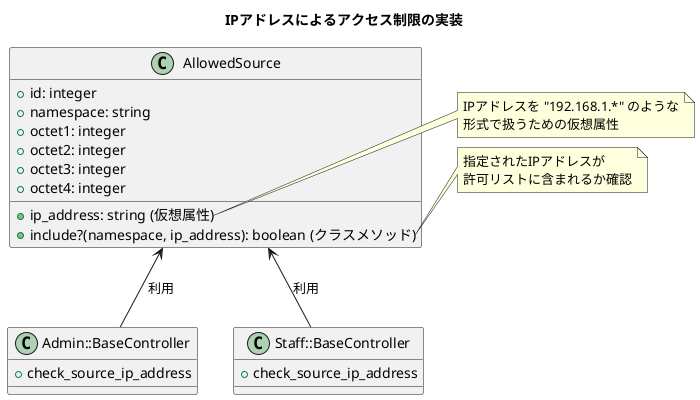

# 作業履歴 2017-02-13

## 概要

2017-02-13の作業内容をまとめています。この日は主に「IPアドレスによるアクセス制限」機能の実装を行いました。

### 実装内容の説明

#### IPアドレスによるアクセス制限

セキュリティ強化のため、特定のIPアドレスからのみ管理者インターフェースにアクセスできるよう制限する機能を実装しました。これにより、不正アクセスのリスクを低減し、システムのセキュリティを向上させています。



#### 許可IPアドレスの管理機能

管理者が許可するIPアドレスを追加・削除できる管理機能も実装しました。これにより、システム管理者は柔軟にアクセス制限を設定できます。

### アーキテクチャとの関連

この実装は、[アーキテクチャ概要](../アーキテクチャ概要.md)の「8. 認証・認可システム」および「10. 開発ガイドライン」セクションに関連しています。特に以下の部分を強化するものです：

```
1. **名前空間の分離**: 各インターフェース（スタッフ、顧客、管理者）のコードは名前空間で明確に分離する
...
4. **アクセス制御**: 適切なアクセス制御によりセキュリティを確保する
```

### ユースケースとの関連

この実装は、[ユースケース](../ユースケース.md)の「5.3. システム管理」セクションに記載されている以下のユースケースを実現するものです：

- A-007: アクセス制限IPアドレス管理

このユースケースでは、管理者がアクセス許可するIPアドレスを管理できることが要件として定義されています。

## コミット: fb7a1a1

### メッセージ

```
許可IPアドレスの管理 #28
```

### 変更されたファイル

- M	app/views/admin/top/index.html.erb
- M	config/environments/production.rb
- M	db/migrate/20170210034614_create_allowed_sources.rb
- A	db/seed/development/allowed_sources.rb
- A	db/seed/production/allowed_sources.rb
- M	db/seeds.rb

### 変更内容

```diff
commit fb7a1a1ff6cccfc207c779e1fd9a226319daeff3
Author: k2works <kakimomokuri@gmail.com>
Date:   Mon Feb 13 18:51:43 2017 +0900

    許可IPアドレスの管理 #28

diff --git a/app/views/admin/top/index.html.erb b/app/views/admin/top/index.html.erb
index bf2408e..4547f6c 100644
--- a/app/views/admin/top/index.html.erb
+++ b/app/views/admin/top/index.html.erb
@@ -8,6 +8,10 @@
     <h2 class="sectionLabel">お知らせ</h2>
   </div>
   <ol class="NewsList">
+    <li class="NewsList__item">
+      <time class="NewsList__head" datatime="2017-2-13">2017.2.13</time>
+      <span class="NewsList__body">IPアクセス制限機能追加</span>
+    </li>
     <li class="NewsList__item">
       <time class="NewsList__head" datatime="2017-2-2">2017.2.2</time>
       <span class="NewsList__body">データピッカー機能追加</span>
diff --git a/config/environments/production.rb b/config/environments/production.rb
index 383c65c..5e2244c 100644
--- a/config/environments/production.rb
+++ b/config/environments/production.rb
@@ -87,6 +87,7 @@ Rails.application.configure do
   config.baukis_kai = {
       staff: { host: ENV["PRD_URL"] , path: 'staff' },
       admin: { host: ENV["PRD_URL"], path: 'admin' },
-      customer: { host: ENV["PRD_URL"], path: '' }
+      customer: { host: ENV["PRD_URL"], path: '' },
+      restrict_ip_addresses: ENV["RESTRICT_IP"]
   }
 end
diff --git a/db/migrate/20170210034614_create_allowed_sources.rb b/db/migrate/20170210034614_create_allowed_sources.rb
index cac6b34..e6bcda0 100644
--- a/db/migrate/20170210034614_create_allowed_sources.rb
+++ b/db/migrate/20170210034614_create_allowed_sources.rb
@@ -1,6 +1,6 @@
 class CreateAllowedSources < ActiveRecord::Migration[5.0]
   def change
-    create_table :allowed_sources,options: 'ROW_FORMAT=DYNAMIC',comment:'IPアドレス制限' do |t|
+    create_table :allowed_sources, comment:'IPアドレス制限' do |t|
       t.string :namespace, null: false, comment:'名前空間'
       t.integer :octet1, null: false, comment:'第１オクテット'
       t.integer :octet2, null: false, comment:'第２オクテット'
diff --git a/db/seed/development/allowed_sources.rb b/db/seed/development/allowed_sources.rb
new file mode 100644
index 0000000..541d445
--- /dev/null
+++ b/db/seed/development/allowed_sources.rb
@@ -0,0 +1,2 @@
+AllowedSource.create(namespace: 'admin', ip_address: '127.0.0.1')
+AllowedSource.create(namespace: 'staff', ip_address: '127.0.0.*')
\ No newline at end of file
diff --git a/db/seed/production/allowed_sources.rb b/db/seed/production/allowed_sources.rb
new file mode 100644
index 0000000..541d445
--- /dev/null
+++ b/db/seed/production/allowed_sources.rb
@@ -0,0 +1,2 @@
+AllowedSource.create(namespace: 'admin', ip_address: '127.0.0.1')
+AllowedSource.create(namespace: 'staff', ip_address: '127.0.0.*')
\ No newline at end of file
diff --git a/db/seeds.rb b/db/seeds.rb
index 1de7b86..4b2cd20 100644
--- a/db/seeds.rb
+++ b/db/seeds.rb
@@ -6,7 +6,7 @@

 #   movies = Movie.create([{ name: 'Star Wars' }, { name: 'Lord of the Rings' }])
 #   Character.create(name: 'Luke', movie: movies.first)
-table_names = %w(staff_members administrators staff_events customers)
+table_names = %w(staff_members administrators staff_events customers allowed_sources)
 table_names.each do |table_name|
   path = Rails.root.join('db','seed',Rails.env, "#{table_name}.rb")
   if File.exist?(path)

```

## コミット: c5cc390

### メッセージ

```
管理者ページに対するIPアクセス制限機能追加 #28
```

### 変更されたファイル

- M	README.md

### 変更内容

```diff
commit c5cc390ce3e82909ebac4ecd7c729b23ffdb6829
Author: k2works <kakimomokuri@gmail.com>
Date:   Mon Feb 13 18:50:38 2017 +0900

    管理者ページに対するIPアクセス制限機能追加 #28

diff --git a/README.md b/README.md
index fbf896e..dd7a38b 100644
--- a/README.md
+++ b/README.md
@@ -659,6 +659,7 @@ git push heroku master

 #### 演習問題
 + 管理者ページに対するIPアクセス制限（テスト）
++ 管理者ページに対するIPアクセス制限機能追加

 ### 多対多の関連付け
 #### 多対多の関連付け

```

## コミット: d97e34f

### メッセージ

```
管理者ページに対するIPアクセス制限機能追加 #28
```

### 変更されたファイル

- M	app/controllers/admin/base.rb

### 変更内容

```diff
commit d97e34f44ac1e00fdc1b338603afed16216070d2
Author: k2works <kakimomokuri@gmail.com>
Date:   Mon Feb 13 18:50:20 2017 +0900

    管理者ページに対するIPアクセス制限機能追加 #28

diff --git a/app/controllers/admin/base.rb b/app/controllers/admin/base.rb
index 65e022f..a69969f 100644
--- a/app/controllers/admin/base.rb
+++ b/app/controllers/admin/base.rb
@@ -1,4 +1,5 @@
 class Admin::Base < ApplicationController
+  before_action :check_source_ip_address
   before_action :authorize
   before_action :check_account
   before_action :check_timeout
@@ -13,6 +14,10 @@ class Admin::Base < ApplicationController

   helper_method :current_administrator

+  def check_source_ip_address
+    raise IpAddressRejected unless AllowedSource.include?('admin',request.ip)
+  end
+
   private
   def authorize
     unless current_administrator

```

### 構造変更


## コミット: 67d016b

### メッセージ

```
管理者ページに対するIPアクセス制限（テスト） #28
```

### 変更されたファイル

- M	README.md
- M	spec/controllers/admin/top_controller_spec.rb

### 変更内容

```diff
commit 67d016b0bca9ccdb85aa6bc48d5acbca4ea2ac6f
Author: k2works <kakimomokuri@gmail.com>
Date:   Mon Feb 13 17:47:30 2017 +0900

    管理者ページに対するIPアクセス制限（テスト） #28

diff --git a/README.md b/README.md
index a0749af..fbf896e 100644
--- a/README.md
+++ b/README.md
@@ -658,6 +658,7 @@ git push heroku master
 + 許可IPアドレスの一括削除

 #### 演習問題
++ 管理者ページに対するIPアクセス制限（テスト）

 ### 多対多の関連付け
 #### 多対多の関連付け
diff --git a/spec/controllers/admin/top_controller_spec.rb b/spec/controllers/admin/top_controller_spec.rb
index ab43961..55e040d 100644
--- a/spec/controllers/admin/top_controller_spec.rb
+++ b/spec/controllers/admin/top_controller_spec.rb
@@ -3,6 +3,39 @@ require 'rails_helper'
 describe Admin::TopController, 'Before login' do
   let(:administrator) { create(:administrator) }

+  # IPアドレスによるアクセス制限
+  describe 'access restriction by IP address' do
+    before do
+      Rails.application.config.baukis_kai[:restrict_ip_addresses] = true
+    end
+
+    # 許可
+    context 'with authorization' do
+      it 'rendered top page' do
+        AllowedSource.create!(namespace: 'admin', ip_address: '0.0.0.0')
+        get :index
+        expect(response).to render_template('admin/top/index')
+      end
+    end
+
+    # 拒否
+    context 'with rejection' do
+      it 'rendered error page' do
+        AllowedSource.create!(namespace: 'admin', ip_address: '192.168.0.*')
+        get :index
+        expect(response).to render_template('errors/forbidden')
+      end
+    end
+
+    after do
+      Rails.application.config.baukis_kai[:restrict_ip_addresses] = false
+    end
+  end
+end
+
+describe Admin::TopController, 'After login' do
+  let(:administrator) { create(:administrator) }
+
   before do
     session[:administrator_id] = administrator.id
     session[:last_access_time] = 1.second.ago

```

### 構造変更


