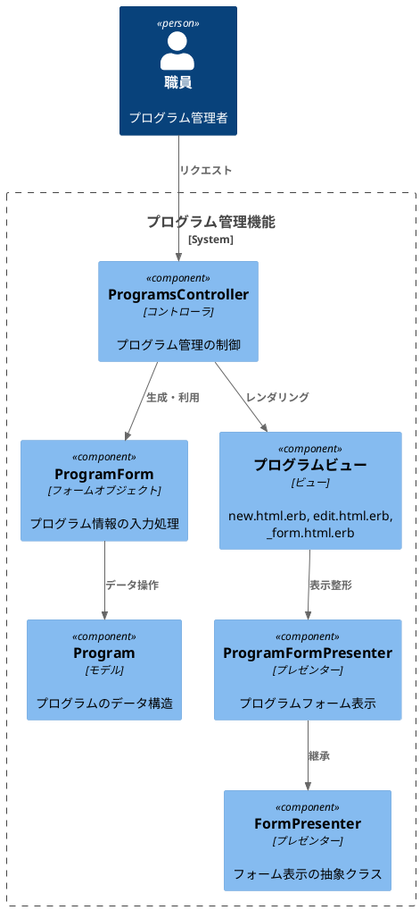
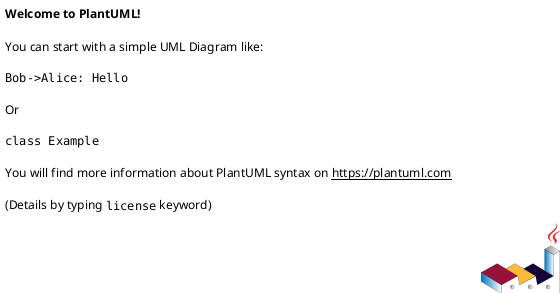

# 作業履歴 2017-02-14

## 概要

2017-02-14の作業内容をまとめています。このジャーナルでは、プログラム管理機能の実装に関する作業を記録しています。主にプログラムの新規登録・編集フォームの実装を行いました。

## プログラム管理機能の構成図



## 作業内容

### プログラム管理機能の実装

職員がプログラム（イベントやセミナーなど）を管理するための機能を実装しました。今回は特に、プログラムの新規登録と編集のためのフォーム機能に焦点を当てています。

#### 変更点の概要

1. フォームオブジェクトの導入
   - `Staff::ProgramForm` クラスを作成し、複雑なフォーム処理をカプセル化
   - 日付と時刻の分離・結合処理を実装

2. プレゼンターの拡張
   - `ProgramFormPresenter` クラスを作成し、フォーム表示を整形
   - 既存の `FormPresenter` クラスを拡張

3. ビューの実装
   - 新規登録・編集用のビューテンプレートを作成
   - 部分テンプレートを活用して共通部分を共有

#### 技術的詳細

- フォームオブジェクトパターンを使用して複雑なフォーム処理を分離
- プレゼンターパターンを使用してビューロジックを分離
- 日付と時刻の入力を分けて、使いやすいUIを実現
- ActiveModel::Modelを使用して、モデルのようにフォームオブジェクトを扱えるように実装

## コミット: d980c7f

### メッセージ

```
プログラムの新規登録・編集フォーム #26
```

### 変更されたファイル

- M	README.md
- M	app/controllers/staff/programs_controller.rb
- A	app/forms/staff/program_form.rb
- M	app/models/program.rb
- M	app/presenters/form_presenter.rb
- A	app/presenters/staff/program_form_presenter.rb
- A	app/views/staff/programs/_form.html.erb
- A	app/views/staff/programs/edit.html.erb
- A	app/views/staff/programs/new.html.erb
- M	config/locales/views/ja.yml

### 変更内容

```diff
commit d980c7fc0a748c7d3606038ef76a9cac3d2084ba
Author: k2works <kakimomokuri@gmail.com>
Date:   Tue Feb 14 19:41:37 2017 +0900

    プログラムの新規登録・編集フォーム #26

diff --git a/README.md b/README.md
index c74a2a4..5100173 100644
--- a/README.md
+++ b/README.md
@@ -681,6 +681,9 @@ git push heroku master

 ### 複雑なフォーム
 #### プログラム管理機能（後編）
++ プログラムの新規登録・更新フォームの仕様
++ プログラムの新規登録・編集フォーム
+
 #### プログラム申し込み機能

 ### トランザクションと排他的ロック
diff --git a/app/controllers/staff/programs_controller.rb b/app/controllers/staff/programs_controller.rb
index 88fe271..980bf48 100644
--- a/app/controllers/staff/programs_controller.rb
+++ b/app/controllers/staff/programs_controller.rb
@@ -6,4 +6,12 @@ class Staff::ProgramsController < Staff::Base
   def show
     @program = Program.listing.find(params[:id])
   end
+
+  def new
+    @program_form = Staff::ProgramForm.new
+  end
+
+  def edit
+    @program_form = Staff::ProgramForm.new(Program.find(params[:id]))
+  end
 end
diff --git a/app/forms/staff/program_form.rb b/app/forms/staff/program_form.rb
new file mode 100644
index 0000000..ef147e2
--- /dev/null
+++ b/app/forms/staff/program_form.rb
@@ -0,0 +1,28 @@
+class Staff::ProgramForm
+  include ActiveModel::Model
+
+  attr_accessor :program
+  delegate :persisted?,
+           :save, to: :program
+
+  def initialize(progaram = nil)
+    @program = progaram
+    @program ||= Program.new
+    if @program.application_start_time
+      @program.application_start_date = @program.application_start_time.to_date.to_s
+      @program.application_start_hour = sprintf('%02d', @program.application_start_time.hour)
+      @program.application_start_minute = sprintf('%02d', @program.application_start_time.min)
+    else
+      @program.application_start_hour = '09'
+      @program.application_start_minute = '00'
+    end
+    if @program.application_end_time
+      @program.application_end_date = @program.application_end_time.to_date.to_s
+      @program.application_end_hour = sprintf('%02d', @program.application_end_time.hour)
+      @program.application_end_minute = sprintf('%02d', @program.application_end_time.min)
+    else
+      @program.application_end_hour = '17'
+      @program.application_end_minute = '00'
+    end
+  end
+end
\ No newline at end of file
diff --git a/app/models/program.rb b/app/models/program.rb
index 2edf22a..46c9dd1 100644
--- a/app/models/program.rb
+++ b/app/models/program.rb
@@ -24,6 +24,13 @@ class Program < ApplicationRecord
   has_many :applicants, through: :entries, source: :customer
   belongs_to :registrant, class_name: 'StaffMember'

+  attr_accessor :application_start_date,
+                :application_start_hour,
+                :application_start_minute,
+                :application_end_date,
+                :application_end_hour,
+                :application_end_minute
+
   scope :listing, -> {
     joins('LEFT JOIN entries ON programs.id = entries.program_id')
         .select('programs.*, COUNT(entries.id) AS number_of_applicants')
diff --git a/app/presenters/form_presenter.rb b/app/presenters/form_presenter.rb
index 545467e..88c57e2 100644
--- a/app/presenters/form_presenter.rb
+++ b/app/presenters/form_presenter.rb
@@ -28,9 +28,24 @@ class FormPresenter
     markup(:div, class: 'AppForm__input-block') do |m|
       m << decorated_label(name, label_text, options)
       m << text_field(name, hide_label: true, class: options[:required] ? 'required' : nil)
+      if options[:maxlength]
+        m.span "(#{options[:maxlength]}文字以内)", class: 'instruction'
+      end
     end
   end

+  def number_field_block(name, label_text, options = {})
+    markup(:div) do |m|
+      m << decorated_label(name, label_text, options)
+      m << form_builder.number_field(name, options.merge(skip_label: true))
+      if options[:max]
+        max = view_context.number_with_delimiter(options[:max].to_i)
+        m.span "(最大値： #{max})", class: 'instruction'
+      end
+    end
+
+  end
+
   def password_field_block(name, label_text, options = {})
     markup(:div, class: 'AppForm__input-block') do |m|
       m << decorated_label(name, label_text, options)
diff --git a/app/presenters/staff/program_form_presenter.rb b/app/presenters/staff/program_form_presenter.rb
new file mode 100644
index 0000000..491dd3e
--- /dev/null
+++ b/app/presenters/staff/program_form_presenter.rb
@@ -0,0 +1,27 @@
+class Staff::ProgramFormPresenter < FormPresenter
+  def description
+    markup(:div, class: 'AppForm__input-block') do |m|
+      m << decorated_label(:description, I18n.t('staff.programs.form.show'), required: true)
+      m << text_area(:description, hide_label: true, row: 6, style: 'width: 454px')
+      m.span '(800文字以内)', class: 'instruction', style: 'float: right'
+    end
+  end
+
+  def datetime_field_block(name, label_text, options = {})
+    instruction = options.delete(:instruction)
+    markup(:div, class: 'AppForm__input-block') do |m|
+      m << decorated_label("#{name}_date", label_text, options)
+      if options[:class].kind_of?(String)
+        classes = options[:class].strip.split + [ 'datetimepicker' ]
+        options[:class] = classes.uniq.join(' ')
+      else
+        options[:class] = 'datetimepicker'
+      end
+      m << text_field("#{name}_date", options.merge(hide_label: true))
+      m << form_builder.select("#{name}_hour", ('00'..'23').to_a, skip_label: true)
+      m << ':'
+      m << form_builder.select("#{name}_minute", ('00'..'59').to_a, skip_label: true)
+      m.span "(#{instruction})", class: 'instruction' if instruction
+    end
+  end
+end
\ No newline at end of file
diff --git a/app/views/staff/programs/_form.html.erb b/app/views/staff/programs/_form.html.erb
new file mode 100644
index 0000000..c52cffe
--- /dev/null
+++ b/app/views/staff/programs/_form.html.erb
@@ -0,0 +1,16 @@
+<%= f.fields_for :program, f.object.program do |ff| %>
+<%= markup do |m|
+  p = Staff::ProgramFormPresenter.new(ff, self)
+  m << p.notes
+  p.with_options(required: true) do |q|
+    m << q.text_field_block(:title, I18n.t('staff.programs.form.title'), maxlength: 32)
+    m << q.datetime_field_block(:application_start, I18n.t('staff.programs.form.program_start'), instruction: I18n.t('staff.programs.form.program_start_instruction'))
+    m << q.datetime_field_block(:application_end, I18n.t('staff.programs.form.program_end'), instruction: I18n.t('staff.programs.form.program_end_instruction'))
+  end
+  p.with_options(size: 6) do |q|
+    m << q.number_field_block(:min_number_of_participants,I18n.t('staff.programs.form.program_min_entry'), max: 1000)
+    m << q.number_field_block(:max_number_of_participants,I18n.t('staff.programs.form.program_max_entry'), max: 1000)
+  end
+  m << p.description
+  end %>
+<% end %>
\ No newline at end of file
diff --git a/app/views/staff/programs/edit.html.erb b/app/views/staff/programs/edit.html.erb
new file mode 100644
index 0000000..fbc2dca
--- /dev/null
+++ b/app/views/staff/programs/edit.html.erb
@@ -0,0 +1,16 @@
+<% @title = t('.title') %>
+<section class="Section">
+  <h1 class="Staff__title"><%= @title %></h1>
+</section>
+
+<section class="Section l-column AppForm">
+  <div class="AppForm__generic-form StaffAppForm__generic-form AppForm__customer-form">
+    <%= bootstrap_form_for @program_form, as: 'form', url: [:staff, @program_form.program ] do |f| %>
+        <%= render 'form', f: f %>
+        <div class="AppForm__buttons">
+          <%= f.submit t('.update') ,class: 'btn btn-default btn-lg'%>
+          <%= link_to t('.cancel'), :staff_programs ,class: 'btn btn-default btn-lg'%>
+        </div>
+    <% end %>
+  </div>
+</section>
diff --git a/app/views/staff/programs/new.html.erb b/app/views/staff/programs/new.html.erb
new file mode 100644
index 0000000..a4f3a46
--- /dev/null
+++ b/app/views/staff/programs/new.html.erb
@@ -0,0 +1,16 @@
+<% @title = t('.title') %>
+<section class="Section">
+  <h1 class="Staff__title"><%= @title %></h1>
+</section>
+
+<section class="Section l-column AppForm">
+  <div class="AppForm__generic-form StaffAppForm__generic-form AppForm__customer-form">
+    <%= bootstrap_form_for @program_form, as: 'form', url: :staff_programs do |f| %>
+        <%= render 'form', f: f %>
+        <div class="AppForm__buttons">
+          <%= f.submit t('.create') ,class: 'btn btn-default btn-lg'%>
+          <%= link_to t('.cancel'), :staff_programs ,class: 'btn btn-default btn-lg'%>
+        </div>
+    <% end %>
+  </div>
+</section>
diff --git a/config/locales/views/ja.yml b/config/locales/views/ja.yml
index 8217fe9..280d466 100644
--- a/config/locales/views/ja.yml
+++ b/config/locales/views/ja.yml
@@ -121,10 +121,26 @@ ja:
         program_max_entry: '最大参観者数'
         program_entry_count: '申し込み件数'
         program_staff: '登録職員'
+      new:
+        title: 'プログラムの新規登録'
+        create: '登録'
+        cancel: 'キャンセル'
+      edit:
+        title: 'プログラムの編集'
+        update: '更新'
+        cancel: 'キャンセル'
       form:
         show: '詳細'
         edit: '編集'
         delete: '削除'
+        title: 'タイトル'
+        program_start: '申し込み開始日時'
+        program_start_instruction: '現在から1年後まで'
+        program_end: '申し込み終了日時'
+        program_end_instruction: '開始日時から90日後まで'
+        program_min_entry: '最小参加者数'
+        program_max_entry: '最大参観者数'
+
   admin:
     shared:
       header:

```

### 構造変更



## コミット: ebecfd6

### メッセージ

```
テーブルの左結合(LEFT JOIN) #27
```

### 変更されたファイル

- M	README.md
- M	app/models/program.rb

### 変更内容

```diff
commit ebecfd6de8e26647e9b89feb39d6382808750bbe
Author: k2works <kakimomokuri@gmail.com>
Date:   Tue Feb 14 18:36:09 2017 +0900

    テーブルの左結合(LEFT JOIN) #27

diff --git a/README.md b/README.md
index 7ac388b..c74a2a4 100644
--- a/README.md
+++ b/README.md
@@ -677,6 +677,7 @@ git push heroku master
 + スコープの定義
 + 編集対象の変更による改善
 + テーブルの内部結合(INNER JOIN)
++ テーブルの左結合(LEFT JOIN)

 ### 複雑なフォーム
 #### プログラム管理機能（後編）
diff --git a/app/models/program.rb b/app/models/program.rb
index ac5e61f..2edf22a 100644
--- a/app/models/program.rb
+++ b/app/models/program.rb
@@ -25,7 +25,7 @@ class Program < ApplicationRecord
   belongs_to :registrant, class_name: 'StaffMember'

   scope :listing, -> {
-    joins(:entries)
+    joins('LEFT JOIN entries ON programs.id = entries.program_id')
         .select('programs.*, COUNT(entries.id) AS number_of_applicants')
         .group('programs.id')
         .order(application_start_time: :desc)

```

### 構造変更


## コミット: 0119800

### メッセージ

```
テーブルの内部結合(INNER JOIN) #27
```

### 変更されたファイル

- M	README.md
- M	app/controllers/staff/programs_controller.rb
- M	app/models/program.rb
- M	app/presenters/staff/program_presenter.rb

### 変更内容

```diff
commit 0119800f1b83121dba9cc9fae0125e414401b991
Author: k2works <kakimomokuri@gmail.com>
Date:   Tue Feb 14 18:34:09 2017 +0900

    テーブルの内部結合(INNER JOIN) #27

diff --git a/README.md b/README.md
index 563f1da..7ac388b 100644
--- a/README.md
+++ b/README.md
@@ -676,6 +676,7 @@ git push heroku master
 + includesメソッドによる改善
 + スコープの定義
 + 編集対象の変更による改善
++ テーブルの内部結合(INNER JOIN)

 ### 複雑なフォーム
 #### プログラム管理機能（後編）
diff --git a/app/controllers/staff/programs_controller.rb b/app/controllers/staff/programs_controller.rb
index 2053134..88fe271 100644
--- a/app/controllers/staff/programs_controller.rb
+++ b/app/controllers/staff/programs_controller.rb
@@ -4,6 +4,6 @@ class Staff::ProgramsController < Staff::Base
   end

   def show
-    @program = Program.find(params[:id])
+    @program = Program.listing.find(params[:id])
   end
 end
diff --git a/app/models/program.rb b/app/models/program.rb
index 802d487..ac5e61f 100644
--- a/app/models/program.rb
+++ b/app/models/program.rb
@@ -25,6 +25,10 @@ class Program < ApplicationRecord
   belongs_to :registrant, class_name: 'StaffMember'

   scope :listing, -> {
-    order(application_start_time: :desc).includes(:registrant)
+    joins(:entries)
+        .select('programs.*, COUNT(entries.id) AS number_of_applicants')
+        .group('programs.id')
+        .order(application_start_time: :desc)
+        .includes(:registrant)
   }
 end
diff --git a/app/presenters/staff/program_presenter.rb b/app/presenters/staff/program_presenter.rb
index 9af7a53..a3847ab 100644
--- a/app/presenters/staff/program_presenter.rb
+++ b/app/presenters/staff/program_presenter.rb
@@ -23,7 +23,7 @@ class Staff::ProgramPresenter < ModelPresenter
   end

   def number_of_applicants
-    number_with_delimiter(object.entries.count)
+    number_with_delimiter(object.number_of_applicants)
   end

   def registrant

```

### 構造変更


## コミット: de89b06

### メッセージ

```
編集対象の変更による改善 #27
```

### 変更されたファイル

- M	README.md
- M	app/presenters/staff/program_presenter.rb

### 変更内容

```diff
commit de89b06c8bb4c4e3a4482d31b4896acdd03f6600
Author: k2works <kakimomokuri@gmail.com>
Date:   Tue Feb 14 18:26:59 2017 +0900

    編集対象の変更による改善 #27

diff --git a/README.md b/README.md
index 6c59a80..563f1da 100644
--- a/README.md
+++ b/README.md
@@ -675,6 +675,7 @@ git push heroku master
 + プログラム一覧表所機能のベンチマーク測定
 + includesメソッドによる改善
 + スコープの定義
++ 編集対象の変更による改善

 ### 複雑なフォーム
 #### プログラム管理機能（後編）
diff --git a/app/presenters/staff/program_presenter.rb b/app/presenters/staff/program_presenter.rb
index a46d511..9af7a53 100644
--- a/app/presenters/staff/program_presenter.rb
+++ b/app/presenters/staff/program_presenter.rb
@@ -23,7 +23,7 @@ class Staff::ProgramPresenter < ModelPresenter
   end

   def number_of_applicants
-    number_with_delimiter(object.applicants.count)
+    number_with_delimiter(object.entries.count)
   end

   def registrant

```

## コミット: 0e61a5c

### メッセージ

```
スコープの定義 #27
```

### 変更されたファイル

- M	README.md
- M	app/controllers/staff/programs_controller.rb
- M	app/models/program.rb

### 変更内容

```diff
commit 0e61a5cefa8c709e6fd89c58d74c9a8c1e03bc6d
Author: k2works <kakimomokuri@gmail.com>
Date:   Tue Feb 14 18:24:11 2017 +0900

    スコープの定義 #27

diff --git a/README.md b/README.md
index e36f33f..6c59a80 100644
--- a/README.md
+++ b/README.md
@@ -674,6 +674,7 @@ git push heroku master
 + ベンチマーク測定の準備
 + プログラム一覧表所機能のベンチマーク測定
 + includesメソッドによる改善
++ スコープの定義

 ### 複雑なフォーム
 #### プログラム管理機能（後編）
diff --git a/app/controllers/staff/programs_controller.rb b/app/controllers/staff/programs_controller.rb
index bfda027..2053134 100644
--- a/app/controllers/staff/programs_controller.rb
+++ b/app/controllers/staff/programs_controller.rb
@@ -1,6 +1,6 @@
 class Staff::ProgramsController < Staff::Base
   def index
-    @programs = Program.order(application_start_time: :desc).includes(:registrant).page(params[:page])
+    @programs = Program.listing.page(params[:page])
   end

   def show
diff --git a/app/models/program.rb b/app/models/program.rb
index 96125eb..802d487 100644
--- a/app/models/program.rb
+++ b/app/models/program.rb
@@ -23,4 +23,8 @@ class Program < ApplicationRecord
   has_many :entries, dependent: :destroy
   has_many :applicants, through: :entries, source: :customer
   belongs_to :registrant, class_name: 'StaffMember'
+
+  scope :listing, -> {
+    order(application_start_time: :desc).includes(:registrant)
+  }
 end

```

### 構造変更


## コミット: c2e4f02

### メッセージ

```
includesメソッドによる改善  #27
```

### 変更されたファイル

- M	README.md
- M	app/controllers/staff/programs_controller.rb

### 変更内容

```diff
commit c2e4f02bfbccbf1681e06d76770fadd36606af8b
Author: k2works <kakimomokuri@gmail.com>
Date:   Tue Feb 14 18:21:00 2017 +0900

    includesメソッドによる改善  #27

diff --git a/README.md b/README.md
index 1ca0316..e36f33f 100644
--- a/README.md
+++ b/README.md
@@ -673,6 +673,7 @@ git push heroku master
 #### パフォーマンス改善
 + ベンチマーク測定の準備
 + プログラム一覧表所機能のベンチマーク測定
++ includesメソッドによる改善

 ### 複雑なフォーム
 #### プログラム管理機能（後編）
diff --git a/app/controllers/staff/programs_controller.rb b/app/controllers/staff/programs_controller.rb
index 77ee323..bfda027 100644
--- a/app/controllers/staff/programs_controller.rb
+++ b/app/controllers/staff/programs_controller.rb
@@ -1,6 +1,6 @@
 class Staff::ProgramsController < Staff::Base
   def index
-    @programs = Program.order(application_start_time: :desc).page(params[:page])
+    @programs = Program.order(application_start_time: :desc).includes(:registrant).page(params[:page])
   end

   def show

```

### 構造変更


## コミット: 9548433

### メッセージ

```
プログラム一覧表所機能のベンチマーク測定  #27
```

### 変更されたファイル

- M	README.md
- M	spec/factories/programs.rb
- A	spec/features/staff/program_management_spec.rb

### 変更内容

```diff
commit 954843309325d9fb08d3844ad264b97a4ce2a0c4
Author: k2works <kakimomokuri@gmail.com>
Date:   Tue Feb 14 18:18:05 2017 +0900

    プログラム一覧表所機能のベンチマーク測定  #27

diff --git a/README.md b/README.md
index fe7a4f2..1ca0316 100644
--- a/README.md
+++ b/README.md
@@ -672,6 +672,7 @@ git push heroku master

 #### パフォーマンス改善
 + ベンチマーク測定の準備
++ プログラム一覧表所機能のベンチマーク測定

 ### 複雑なフォーム
 #### プログラム管理機能（後編）
diff --git a/spec/factories/programs.rb b/spec/factories/programs.rb
index 5819c1c..a14ab17 100644
--- a/spec/factories/programs.rb
+++ b/spec/factories/programs.rb
@@ -21,6 +21,12 @@

 FactoryGirl.define do
   factory :program do
-    
+    title 'Title'
+    description 'Description'
+    application_start_time { 5.days.ago.midnight }
+    application_end_time { 2.days.from_now.midnight }
+    min_number_of_participants 5
+    max_number_of_participants 10
+    registrant { create(:staff_member) }
   end
 end
diff --git a/spec/features/staff/program_management_spec.rb b/spec/features/staff/program_management_spec.rb
new file mode 100644
index 0000000..9131037
--- /dev/null
+++ b/spec/features/staff/program_management_spec.rb
@@ -0,0 +1,37 @@
+require 'rails_helper'
+
+# プログラム管理機能
+feature 'Program management function', :performace do
+  include FeaturesSpecHelper
+  include PerformanceSpecHelper
+  let(:staff_member) { create(:staff_member) }
+
+  before do
+    20.times do |n|
+      p  = create(:program, application_start_time: n.days.ago.midnight)
+      if n < 2
+        p.applicants << create(:customer)
+        p.applicants << create(:customer)
+      end
+    end
+
+    switch_namespace(:staff)
+    login_as_staff_member(staff_member)
+  end
+
+  # プログラム一覧
+  scenario 'Program list' do |example|
+    visit staff_programs_path
+    expect(page).to have_css('h1', text: I18n.t('staff.programs.index.title'))
+
+    elapsed = Benchmark.realtime do
+      100.times do
+        visit staff_programs_path
+      end
+    end
+
+    write_to_performance_log(example, elapsed)
+    expect(elapsed).to be < 100.0
+  end
+
+end
\ No newline at end of file

```

## コミット: 48490a4

### メッセージ

```
ベンチマーク測定の準備  #27
```

### 変更されたファイル

- M	README.md
- M	spec/rails_helper.rb
- A	spec/support/performance_spec_helper.rb

### 変更内容

```diff
commit 48490a47002a893bfeb96946afc8d744907592d7
Author: k2works <kakimomokuri@gmail.com>
Date:   Tue Feb 14 18:03:39 2017 +0900

    ベンチマーク測定の準備  #27

diff --git a/README.md b/README.md
index 08b8c41..fe7a4f2 100644
--- a/README.md
+++ b/README.md
@@ -671,6 +671,7 @@ git push heroku master
 + プログラムの詳細表示

 #### パフォーマンス改善
++ ベンチマーク測定の準備

 ### 複雑なフォーム
 #### プログラム管理機能（後編）
diff --git a/spec/rails_helper.rb b/spec/rails_helper.rb
index 8e3f5b2..52a3101 100644
--- a/spec/rails_helper.rb
+++ b/spec/rails_helper.rb
@@ -52,6 +52,8 @@ RSpec.configure do |config|
   # https://relishapp.com/rspec/rspec-rails/docs
   config.infer_spec_type_from_file_location!

+  config.filter_run_excluding :performance => true
+
   # Filter lines from Rails gems in backtraces.
   config.filter_rails_from_backtrace!
   # arbitrary gems may also be filtered via:
@@ -62,4 +64,14 @@ RSpec.configure do |config|
   config.before(:suite) do
     FactoryGirl.reload
   end
+
+  config.before(performance: true) do
+    ActionController::Base.perform_caching = true
+    ActiveSupport::Dependencies.mechanism = :require
+    Rails.logger.level = ActiveSupport::Logger::INFO
+  end
+
+  config.after do
+    Rails.application.config.baukis_kai[:restrict_ip_addresses] = false
+  end
 end
diff --git a/spec/support/performance_spec_helper.rb b/spec/support/performance_spec_helper.rb
new file mode 100644
index 0000000..278510d
--- /dev/null
+++ b/spec/support/performance_spec_helper.rb
@@ -0,0 +1,8 @@
+module PerformanceSpecHelper
+  def write_to_performance_log(example, elapsed)
+    @logger ||= ActiveSupport::Logger.new(
+                                         Rails.root.join('log', 'performance_spec.log'))
+    message = example.metadata[:example_group][:full_description] + '/' + example.description
+    @logger.info sprintf('%s -- Elapsed: %2.3f seconds', message, elapsed)
+  end
+end
\ No newline at end of file

```

## コミット: eda6965

### メッセージ

```
プログラムの詳細表示  #27
```

### 変更されたファイル

- M	README.md
- M	app/assets/stylesheets/components/common/_table.scss
- M	app/controllers/staff/customers_controller.rb
- M	app/controllers/staff/programs_controller.rb
- A	app/views/staff/programs/show.html.erb
- M	config/locales/views/ja.yml

### 変更内容

```diff
commit eda6965670d643c856b82cea8a03f263fb5b5895
Author: k2works <kakimomokuri@gmail.com>
Date:   Tue Feb 14 17:53:12 2017 +0900

    プログラムの詳細表示  #27

diff --git a/README.md b/README.md
index 6d26deb..08b8c41 100644
--- a/README.md
+++ b/README.md
@@ -668,6 +668,7 @@ git push heroku master

 #### プログラム管理機能（前編）
 + プログラムの一覧表示 
++ プログラムの詳細表示

 #### パフォーマンス改善

diff --git a/app/assets/stylesheets/components/common/_table.scss b/app/assets/stylesheets/components/common/_table.scss
index 8523b0f..66813e4 100644
--- a/app/assets/stylesheets/components/common/_table.scss
+++ b/app/assets/stylesheets/components/common/_table.scss
@@ -27,6 +27,12 @@
       th { padding-right: $moderate; width: 200px }
       td { background-color: $very_light_gray }
     }
+
+    &--description {
+      margin: $wide;
+      padding: $wide;
+      background-color: $very_light_gray;
+    }
   }

   &__th {
diff --git a/app/controllers/staff/customers_controller.rb b/app/controllers/staff/customers_controller.rb
index 9757ef6..6342b22 100644
--- a/app/controllers/staff/customers_controller.rb
+++ b/app/controllers/staff/customers_controller.rb
@@ -5,7 +5,7 @@ class Staff::CustomersController < Staff::Base
     else
       @search_form = Staff::CustomerSearchForm.new(search_params)
     end
-    @programs = @search_form.search.page(params[:page])
+    @customers = @search_form.search.page(params[:page])
   end

   def show
diff --git a/app/controllers/staff/programs_controller.rb b/app/controllers/staff/programs_controller.rb
index b9c11ac..77ee323 100644
--- a/app/controllers/staff/programs_controller.rb
+++ b/app/controllers/staff/programs_controller.rb
@@ -2,4 +2,8 @@ class Staff::ProgramsController < Staff::Base
   def index
     @programs = Program.order(application_start_time: :desc).page(params[:page])
   end
+
+  def show
+    @program = Program.find(params[:id])
+  end
 end
diff --git a/app/views/staff/programs/show.html.erb b/app/views/staff/programs/show.html.erb
new file mode 100644
index 0000000..8d7ee85
--- /dev/null
+++ b/app/views/staff/programs/show.html.erb
@@ -0,0 +1,19 @@
+<% @title = t('.title') %>
+<section class="Section">
+  <h1 class="Staff__title"><%= @title %></h1>
+</section>
+
+<section class="Section l-column Table StaffTable">
+  <table class="Table__body Table__body--attributes StaffTable__body">
+    <% p = Staff::ProgramPresenter.new(@program, self) %>
+    <tr class="Table__tr"><th class="Table__th"><%= t('.program_tiile') %></th><td><%= p.title %></td></tr>
+    <tr class="Table__tr"><th class="Table__th"><%= t('.program_start') %></th><td class="Table__td--date"><%= p.application_start_time %></td></tr>
+    <tr class="Table__tr"><th class="Table__th"><%= t('.program_end') %></th><td class="Table__td--date"><%= p.application_end_time %></td></tr>
+    <tr class="Table__tr"><th class="Table__th"><%= t('.program_min_entry') %></th><td class="Table__td--numeric"><%= p.min_number_of_participants %></td></tr>
+    <tr class="Table__tr"><th class="Table__th"><%= t('.program_max_entry') %></th><td class="Table__td--numeric"><%= p.max_number_of_participants %></td></tr>
+    <tr class="Table__tr"><th class="Table__th"><%= t('.program_entry_count')%></th><td class="Table__td--numeric"><%= p.number_of_applicants %></td></tr>
+    <tr class="Table__tr"><th class="Table__th"><%= t('.program_staff') %></th><td><%= p.registrant %></td></tr>
+  </table>
+
+  <div class="Table__body--description"><%= @program.description %></div>
+</section>
\ No newline at end of file
diff --git a/config/locales/views/ja.yml b/config/locales/views/ja.yml
index e1c3095..8217fe9 100644
--- a/config/locales/views/ja.yml
+++ b/config/locales/views/ja.yml
@@ -112,6 +112,15 @@ ja:
         program_entry_count: '申し込み件数'
         program_staff: '登録職員'
         action: 'アクション'
+      show:
+        title: 'プログラム詳細情報'
+        program_tiile: 'タイトル'
+        program_start: '申し込み開始日時'
+        program_end: '申し込み終了日時'
+        program_min_entry: '最小参加者数'
+        program_max_entry: '最大参観者数'
+        program_entry_count: '申し込み件数'
+        program_staff: '登録職員'
       form:
         show: '詳細'
         edit: '編集'

```

### 構造変更


## コミット: 41724c0

### メッセージ

```
プログラムの一覧表示  #27
```

### 変更されたファイル

- M	README.md
- M	app/assets/stylesheets/components/common/_table.scss
- M	app/controllers/staff/customers_controller.rb
- A	app/controllers/staff/programs_controller.rb
- A	app/presenters/staff/program_presenter.rb
- A	app/views/staff/programs/_program.html.erb
- A	app/views/staff/programs/index.html.erb
- M	app/views/staff/top/dashboard.html.erb
- M	config/locales/views/ja.yml
- M	config/routes.rb

### 変更内容

```diff
commit 41724c0ba2bd6c1ae63e729283e4a823d2f19cfa
Author: k2works <kakimomokuri@gmail.com>
Date:   Tue Feb 14 17:38:19 2017 +0900

    プログラムの一覧表示  #27

diff --git a/README.md b/README.md
index 00383a1..6d26deb 100644
--- a/README.md
+++ b/README.md
@@ -667,6 +667,8 @@ git push heroku master
 + データベース設計

 #### プログラム管理機能（前編）
++ プログラムの一覧表示 
+
 #### パフォーマンス改善

 ### 複雑なフォーム
diff --git a/app/assets/stylesheets/components/common/_table.scss b/app/assets/stylesheets/components/common/_table.scss
index 56ebb47..8523b0f 100644
--- a/app/assets/stylesheets/components/common/_table.scss
+++ b/app/assets/stylesheets/components/common/_table.scss
@@ -60,6 +60,10 @@
     &--ip {
       font-family: monospace;
     }
+
+    &--numeric {
+      text-align: right;
+    }
   }
 }

diff --git a/app/controllers/staff/customers_controller.rb b/app/controllers/staff/customers_controller.rb
index 6342b22..9757ef6 100644
--- a/app/controllers/staff/customers_controller.rb
+++ b/app/controllers/staff/customers_controller.rb
@@ -5,7 +5,7 @@ class Staff::CustomersController < Staff::Base
     else
       @search_form = Staff::CustomerSearchForm.new(search_params)
     end
-    @customers = @search_form.search.page(params[:page])
+    @programs = @search_form.search.page(params[:page])
   end

   def show
diff --git a/app/controllers/staff/programs_controller.rb b/app/controllers/staff/programs_controller.rb
new file mode 100644
index 0000000..b9c11ac
--- /dev/null
+++ b/app/controllers/staff/programs_controller.rb
@@ -0,0 +1,5 @@
+class Staff::ProgramsController < Staff::Base
+  def index
+    @programs = Program.order(application_start_time: :desc).page(params[:page])
+  end
+end
diff --git a/app/presenters/staff/program_presenter.rb b/app/presenters/staff/program_presenter.rb
new file mode 100644
index 0000000..a46d511
--- /dev/null
+++ b/app/presenters/staff/program_presenter.rb
@@ -0,0 +1,32 @@
+class Staff::ProgramPresenter < ModelPresenter
+  delegate :title, :description, to: :object
+  delegate :number_with_delimiter, to: :view_context
+
+  def application_start_time
+    object.application_start_time.strftime('%Y-%m-%d %H:%M')
+  end
+
+  def application_end_time
+    object.application_end_time.strftime('%Y-%m-%d %H:%M')
+  end
+
+  def max_number_of_participants
+    if object.max_number_of_participants
+      number_with_delimiter(object.max_number_of_participants)
+    end
+  end
+
+  def min_number_of_participants
+    if object.min_number_of_participants
+      number_with_delimiter(object.min_number_of_participants)
+    end
+  end
+
+  def number_of_applicants
+    number_with_delimiter(object.applicants.count)
+  end
+
+  def registrant
+    object.registrant.family_name + ' ' + object.registrant.given_name
+  end
+end
\ No newline at end of file
diff --git a/app/views/staff/programs/_program.html.erb b/app/views/staff/programs/_program.html.erb
new file mode 100644
index 0000000..91c2b43
--- /dev/null
+++ b/app/views/staff/programs/_program.html.erb
@@ -0,0 +1,15 @@
+<% p = Staff::ProgramPresenter.new(program, self) %>
+<tr class="Table__tr">
+  <td class="Table__td"><%= p.title %></td>
+  <td class="Table__td--date"><%= p.application_start_time %></td>
+  <td class="Table__td--date"><%= p.application_end_time %></td>
+  <td class="Table__td--numeric"><%= p.min_number_of_participants %></td>
+  <td class="Table__td--numeric"><%= p.max_number_of_participants %></td>
+  <td class="Table__td--numeric"><%= p.number_of_applicants %></td>
+  <td class="Table__td"><%= p.registrant %></td>
+  <td class="Table__td--action">
+    <%= link_to t('staff.programs.form.show'), [ :staff, program ], class: 'btn btn-default btn-xs' %>
+    <%= link_to t('staff.programs.form.edit'), [ :edit, :staff, program ], class: 'btn btn-default btn-xs' %>
+    <%= link_to t('staff.programs.form.delete'), [ :staff, program ], method: :delete, data: { confirm: '本当に削除しますか？'}, class: 'btn btn-default btn-xs' %>
+  </td>
+</tr>
\ No newline at end of file
diff --git a/app/views/staff/programs/index.html.erb b/app/views/staff/programs/index.html.erb
new file mode 100644
index 0000000..6b480a7
--- /dev/null
+++ b/app/views/staff/programs/index.html.erb
@@ -0,0 +1,32 @@
+<% @title = t('.title') %>
+<section class="Section">
+  <h1 class="Staff__title"><%= @title %></h1>
+</section>
+
+<section class="Section l-column Table">
+  <div class="Table__links">
+    <%= link_to t('.new'), :new_staff_program, class: 'btn btn-default' %>
+  </div>
+
+  <%= paginate @programs %>
+
+  <table class="Table__body Table__body--listing StaffTable__body">
+    <tr class="Table__tr">
+      <th class="Table__th"><%= t('.program_tiile') %></th>
+      <th class="Table__th"><%= t('.program_start') %></th>
+      <th class="Table__th"><%= t('.program_end') %></th>
+      <th class="Table__th"><%= t('.program_min_entry') %></th>
+      <th class="Table__th"><%= t('.program_max_entry') %></th>
+      <th class="Table__th"><%= t('.program_entry_count') %></th>
+      <th class="Table__th"><%= t('.program_staff') %></th>
+      <th class="Table__th"><%= t('.action') %></th>
+    </tr>
+    <%= render partial: 'program', collection: @programs %>
+  </table>
+
+  <%= paginate @programs %>
+
+  <div class="Table__links">
+    <%= link_to t('.new'), :new_staff_program, class: 'btn btn-default' %>
+  </div>
+</section>
\ No newline at end of file
diff --git a/app/views/staff/top/dashboard.html.erb b/app/views/staff/top/dashboard.html.erb
index a7cd915..432d6a8 100644
--- a/app/views/staff/top/dashboard.html.erb
+++ b/app/views/staff/top/dashboard.html.erb
@@ -6,5 +6,6 @@
 <section class="Section l-column DashBoard">
   <ul class="DashBoard__menu">
     <li><%= link_to t('.staff_customers'), :staff_customers, class: 'btn btn-default' %></li>
+    <li><%= link_to t('.staff_programs'), :staff_programs, class: 'btn btn-default' %></li>
   </ul>
 </section>
\ No newline at end of file
diff --git a/config/locales/views/ja.yml b/config/locales/views/ja.yml
index 07e17d1..e1c3095 100644
--- a/config/locales/views/ja.yml
+++ b/config/locales/views/ja.yml
@@ -24,6 +24,7 @@ ja:
       dashboard:
         title: 'ダッシュボード'
         staff_customers: '顧客管理'
+        staff_programs: 'プログラム管理'
     customers:
       index:
         title: '顧客管理'
@@ -99,6 +100,22 @@ ja:
         title: 'パスワード変更'
         submit: '変更'
         cancel: 'キャンセル'
+    programs:
+      index:
+        title: 'プログラム管理'
+        new: '新規登録'
+        program_tiile: 'タイトル'
+        program_start: '申し込み開始日時'
+        program_end: '申し込み終了日時'
+        program_min_entry: '最小参加者数'
+        program_max_entry: '最大参観者数'
+        program_entry_count: '申し込み件数'
+        program_staff: '登録職員'
+        action: 'アクション'
+      form:
+        show: '詳細'
+        edit: '編集'
+        delete: '削除'
   admin:
     shared:
       header:
diff --git a/config/routes.rb b/config/routes.rb
index dd9124e..1fe6a8a 100644
--- a/config/routes.rb
+++ b/config/routes.rb
@@ -21,6 +21,14 @@
 #                                 PATCH  /staff/customers/:id(.:format)                       staff/customers#update {:host=>"0.0.0.0"}
 #                                 PUT    /staff/customers/:id(.:format)                       staff/customers#update {:host=>"0.0.0.0"}
 #                                 DELETE /staff/customers/:id(.:format)                       staff/customers#destroy {:host=>"0.0.0.0"}
+#                  staff_programs GET    /staff/programs(.:format)                            staff/programs#index {:host=>"0.0.0.0"}
+#                                 POST   /staff/programs(.:format)                            staff/programs#create {:host=>"0.0.0.0"}
+#               new_staff_program GET    /staff/programs/new(.:format)                        staff/programs#new {:host=>"0.0.0.0"}
+#              edit_staff_program GET    /staff/programs/:id/edit(.:format)                   staff/programs#edit {:host=>"0.0.0.0"}
+#                   staff_program GET    /staff/programs/:id(.:format)                        staff/programs#show {:host=>"0.0.0.0"}
+#                                 PATCH  /staff/programs/:id(.:format)                        staff/programs#update {:host=>"0.0.0.0"}
+#                                 PUT    /staff/programs/:id(.:format)                        staff/programs#update {:host=>"0.0.0.0"}
+#                                 DELETE /staff/programs/:id(.:format)                        staff/programs#destroy {:host=>"0.0.0.0"}
 #                      admin_root GET    /admin(.:format)                                     admin/top#index {:host=>"0.0.0.0"}
 #                     admin_login GET    /admin/login(.:format)                               admin/sessions#new {:host=>"0.0.0.0"}
 #                   admin_session DELETE /admin/session(.:format)                             admin/sessions#destroy {:host=>"0.0.0.0"}
@@ -64,6 +72,7 @@ Rails.application.routes.draw do
       resource :account, only: [:show, :edit, :update]
       resource :password, only: [:show, :edit, :update]
       resources :customers
+      resources :programs
     end
   end


```

### 構造変更


## コミット: 73626b5

### メッセージ

```
データベース設計 #27
```

### 変更されたファイル

- M	db/migrate/20170203051643_create_customers.rb
- M	db/migrate/20170203051654_create_addresses.rb
- M	db/migrate/20170206085929_create_phones.rb
- M	db/migrate/20170207042109_alter_customers1.rb
- M	db/migrate/20170214071032_create_entries.rb

### 変更内容

```diff
commit 73626b572e92229054b5a8f38e709b854fc8e3ca
Author: k2works <kakimomokuri@gmail.com>
Date:   Tue Feb 14 17:26:11 2017 +0900

    データベース設計 #27

diff --git a/db/migrate/20170203051643_create_customers.rb b/db/migrate/20170203051643_create_customers.rb
index df6f8d1..ad396e4 100644
--- a/db/migrate/20170203051643_create_customers.rb
+++ b/db/migrate/20170203051643_create_customers.rb
@@ -1,6 +1,6 @@
 class CreateCustomers < ActiveRecord::Migration[5.0]
   def change
-    create_table :customers,comment:'顧客' do |t|
+    create_table :programs, comment:'顧客' do |t|
       t.string :email, null: false, comment:'メールアドレス'
       t.string :email_for_index, null: false, comment:'顧客用メールアドレス'
       t.string :family_name, null: false, comment:'姓'
diff --git a/db/migrate/20170203051654_create_addresses.rb b/db/migrate/20170203051654_create_addresses.rb
index e2da587..5d824f1 100644
--- a/db/migrate/20170203051654_create_addresses.rb
+++ b/db/migrate/20170203051654_create_addresses.rb
@@ -15,6 +15,6 @@ class CreateAddresses < ActiveRecord::Migration[5.0]
     end

     add_index :addresses, [:type, :customer_id], unique: true
-    add_foreign_key :addresses, :customers
+    add_foreign_key :addresses, :programs
   end
 end
diff --git a/db/migrate/20170206085929_create_phones.rb b/db/migrate/20170206085929_create_phones.rb
index f9f0714..bb8c001 100644
--- a/db/migrate/20170206085929_create_phones.rb
+++ b/db/migrate/20170206085929_create_phones.rb
@@ -11,7 +11,7 @@ class CreatePhones < ActiveRecord::Migration[5.0]
     end

     add_index :phones, :number_for_index
-    add_foreign_key :phones, :customers
+    add_foreign_key :phones, :programs
     add_foreign_key :phones, :addresses
   end
 end
diff --git a/db/migrate/20170207042109_alter_customers1.rb b/db/migrate/20170207042109_alter_customers1.rb
index 1e0ffe5..49f274b 100644
--- a/db/migrate/20170207042109_alter_customers1.rb
+++ b/db/migrate/20170207042109_alter_customers1.rb
@@ -1,8 +1,8 @@
 class AlterCustomers1 < ActiveRecord::Migration[5.0]
   def change
-    add_column :customers, :birth_year, :integer, comment:'誕生年'
-    add_column :customers, :birth_month, :integer, comment:'誕生月'
-    add_column :customers, :birth_mday, :integer, comment:'誕生日'
+    add_column :programs, :birth_year, :integer, comment:'誕生年'
+    add_column :programs, :birth_month, :integer, comment:'誕生月'
+    add_column :programs, :birth_mday, :integer, comment:'誕生日'

     add_index :customers, [ :birth_year, :birth_month, :birth_mday ]
     add_index :customers, [ :birth_month, :birth_mday ]
diff --git a/db/migrate/20170214071032_create_entries.rb b/db/migrate/20170214071032_create_entries.rb
index 312fce7..d8c4042 100644
--- a/db/migrate/20170214071032_create_entries.rb
+++ b/db/migrate/20170214071032_create_entries.rb
@@ -11,6 +11,6 @@ class CreateEntries < ActiveRecord::Migration[5.0]

     add_index :entries, [ :program_id, :customer_id ], unique: true
     add_foreign_key :entries, :programs
-    add_foreign_key :entries, :customers
+    add_foreign_key :entries, :programs
   end
 end

```

## コミット: e0e433b

### メッセージ

```
データベース設計 #27
```

### 変更されたファイル

- M	README.md
- M	app/controllers/admin/staff_members_controller.rb
- M	app/models/customer.rb
- A	app/models/entry.rb
- A	app/models/program.rb
- M	app/models/staff_member.rb
- M	config/locales/controllers/ja.yml
- A	db/migrate/20170214071011_create_programs.rb
- A	db/migrate/20170214071032_create_entries.rb
- M	db/schema.rb
- A	db/seed/development/entries.rb
- A	db/seed/development/programs.rb
- M	db/seeds.rb
- A	spec/factories/entries.rb
- A	spec/factories/programs.rb

### 変更内容

```diff
commit e0e433b3a86c330a8a66d603ffec5c704d982ff1
Author: k2works <kakimomokuri@gmail.com>
Date:   Tue Feb 14 16:58:15 2017 +0900

    データベース設計 #27

diff --git a/README.md b/README.md
index dd7a38b..00383a1 100644
--- a/README.md
+++ b/README.md
@@ -663,6 +663,9 @@ git push heroku master

 ### 多対多の関連付け
 #### 多対多の関連付け
++ プログラム管理機能の概要
++ データベース設計
+
 #### プログラム管理機能（前編）
 #### パフォーマンス改善

diff --git a/app/controllers/admin/staff_members_controller.rb b/app/controllers/admin/staff_members_controller.rb
index 1855b32..e38e3f3 100644
--- a/app/controllers/admin/staff_members_controller.rb
+++ b/app/controllers/admin/staff_members_controller.rb
@@ -40,8 +40,12 @@ class Admin::StaffMembersController < Admin::Base

   def destroy
     staff_member = StaffMember.find(params[:id])
-    staff_member.destroy!
-    flash.notice = t('.flash_success')
+    if staff_member.deletable?
+      staff_member.destroy!
+      flash.notice = t('.flash_success')
+    else
+      flash.alert = t('.flash_alert')
+    end
     redirect_to :admin_staff_members
   end

diff --git a/app/models/customer.rb b/app/models/customer.rb
index 68bac7c..6e802b2 100644
--- a/app/models/customer.rb
+++ b/app/models/customer.rb
@@ -44,6 +44,8 @@ class Customer < ApplicationRecord
   has_one :work_address, autosave: true
   has_many :phones, dependent: :destroy
   has_many :personal_phones, -> { where(address_id: nil).order(:id) },class_name: 'Phone', autosave: true
+  has_many :entries, dependent: :destroy
+  has_many :programs, through: :entries

   validates :gender, inclusion: { in: %w(male female), allow_blank: true }
   validates :birthday, date: {
diff --git a/app/models/entry.rb b/app/models/entry.rb
new file mode 100644
index 0000000..8448da6
--- /dev/null
+++ b/app/models/entry.rb
@@ -0,0 +1,23 @@
+# == Schema Information
+#
+# Table name: entries # 申し込み
+#
+#  id          :integer          not null, primary key
+#  program_id  :integer          not null
+#  customer_id :integer          not null
+#  approved    :boolean          default("0"), not null # 承認済みフラグ
+#  canceled    :boolean          default("0"), not null # 取り消しフラグ
+#  created_at  :datetime         not null
+#  updated_at  :datetime         not null
+#
+# Indexes
+#
+#  index_entries_on_customer_id                 (customer_id)
+#  index_entries_on_program_id                  (program_id)
+#  index_entries_on_program_id_and_customer_id  (program_id,customer_id) UNIQUE
+#
+
+class Entry < ApplicationRecord
+  belongs_to :program
+  belongs_to :customer
+end
diff --git a/app/models/program.rb b/app/models/program.rb
new file mode 100644
index 0000000..96125eb
--- /dev/null
+++ b/app/models/program.rb
@@ -0,0 +1,26 @@
+# == Schema Information
+#
+# Table name: programs # プログラム
+#
+#  id                         :integer          not null, primary key
+#  registrant_id              :integer          not null              # 登録職員（外部キー）
+#  title                      :string(255)      not null              # タイトル
+#  description                :text(65535)                            # 説明
+#  application_start_time     :datetime         not null              # 申し込み開始日
+#  application_end_time       :datetime         not null              # 申し込み終了日
+#  min_number_of_participants :integer                                # 最小参観者数
+#  max_number_of_participants :integer                                # 最大参観者数
+#  created_at                 :datetime         not null
+#  updated_at                 :datetime         not null
+#
+# Indexes
+#
+#  index_programs_on_application_start_time  (application_start_time)
+#  index_programs_on_registrant_id           (registrant_id)
+#
+
+class Program < ApplicationRecord
+  has_many :entries, dependent: :destroy
+  has_many :applicants, through: :entries, source: :customer
+  belongs_to :registrant, class_name: 'StaffMember'
+end
diff --git a/app/models/staff_member.rb b/app/models/staff_member.rb
index a6f0230..51e7549 100644
--- a/app/models/staff_member.rb
+++ b/app/models/staff_member.rb
@@ -28,6 +28,7 @@ class StaffMember < ApplicationRecord
   include PasswordHolder

   has_many :events, class_name: 'StaffEvent', dependent: :destroy
+  has_many :programs, foreign_key: 'registrant_id', dependent: :restrict_with_exception

   validates :start_date, presence: true, date: {
       after_or_equal_to: Date.new(2000, 1, 1),
@@ -44,4 +45,8 @@ class StaffMember < ApplicationRecord
     !suspended? && start_date <= Date.today &&
         (end_date.nil? || end_date > Date.today)
   end
+
+  def deletable?
+    programs.empty?
+  end
 end
diff --git a/config/locales/controllers/ja.yml b/config/locales/controllers/ja.yml
index 2faa88c..54638d6 100644
--- a/config/locales/controllers/ja.yml
+++ b/config/locales/controllers/ja.yml
@@ -42,6 +42,7 @@ ja:
         flash_success: '職員アカウントを更新しました。'
       destroy:
         flash_success: '職員アカウントを削除しました。'
+        flash_alert: 'この職員アカウントは削除できません。'
     allowed_sources:
       create:
         flash_notice: '許可IPアドレスを追加しました。'
diff --git a/db/migrate/20170214071011_create_programs.rb b/db/migrate/20170214071011_create_programs.rb
new file mode 100644
index 0000000..957aa9a
--- /dev/null
+++ b/db/migrate/20170214071011_create_programs.rb
@@ -0,0 +1,19 @@
+class CreatePrograms < ActiveRecord::Migration[5.0]
+  def change
+    create_table :programs, comment: 'プログラム' do |t|
+      t.integer :registrant_id, null: false, comment: '登録職員（外部キー）'
+      t.string :title, null: false, comment: 'タイトル'
+      t.text :description, comment: '説明'
+      t.datetime :application_start_time, null: false, comment: '申し込み開始日'
+      t.datetime :application_end_time, null: false, comment: '申し込み終了日'
+      t.integer :min_number_of_participants, comment: '最小参観者数'
+      t.integer :max_number_of_participants, comment: '最大参観者数'
+
+      t.timestamps
+    end
+
+    add_index :programs, :registrant_id
+    add_index :programs, :application_start_time
+    add_foreign_key :programs, :staff_members, column: 'registrant_id'
+  end
+end
diff --git a/db/migrate/20170214071032_create_entries.rb b/db/migrate/20170214071032_create_entries.rb
new file mode 100644
index 0000000..312fce7
--- /dev/null
+++ b/db/migrate/20170214071032_create_entries.rb
@@ -0,0 +1,16 @@
+class CreateEntries < ActiveRecord::Migration[5.0]
+  def change
+    create_table :entries, comment:'申し込み' do |t|
+      t.references :program, null: false
+      t.references :customer, null: false
+      t.boolean :approved, null: false, default: false, comment: '承認済みフラグ'
+      t.boolean :canceled, null: false, default: false, comment: '取り消しフラグ'
+
+      t.timestamps
+    end
+
+    add_index :entries, [ :program_id, :customer_id ], unique: true
+    add_foreign_key :entries, :programs
+    add_foreign_key :entries, :customers
+  end
+end
diff --git a/db/schema.rb b/db/schema.rb
index e6570d9..ea83be8 100644
--- a/db/schema.rb
+++ b/db/schema.rb
@@ -10,7 +10,7 @@
 #
 # It's strongly recommended that you check this file into your version control system.

-ActiveRecord::Schema.define(version: 20170210034614) do
+ActiveRecord::Schema.define(version: 20170214071032) do

   create_table "addresses", force: :cascade, comment: "住所" do |t|
     t.integer  "customer_id",                null: false, comment: "顧客への外部キー"
@@ -84,6 +84,18 @@ ActiveRecord::Schema.define(version: 20170210034614) do
     t.index ["given_name_kana"], name: "index_customers_on_given_name_kana", using: :btree
   end

+  create_table "entries", force: :cascade, comment: "申し込み" do |t|
+    t.integer  "program_id",                  null: false
+    t.integer  "customer_id",                 null: false
+    t.boolean  "approved",    default: false, null: false, comment: "承認済みフラグ"
+    t.boolean  "canceled",    default: false, null: false, comment: "取り消しフラグ"
+    t.datetime "created_at",                  null: false
+    t.datetime "updated_at",                  null: false
+    t.index ["customer_id"], name: "index_entries_on_customer_id", using: :btree
+    t.index ["program_id", "customer_id"], name: "index_entries_on_program_id_and_customer_id", unique: true, using: :btree
+    t.index ["program_id"], name: "index_entries_on_program_id", using: :btree
+  end
+
   create_table "phones", force: :cascade, comment: "電話" do |t|
     t.integer  "customer_id",                      null: false, comment: "顧客への外部キー"
     t.integer  "address_id",                                    comment: "住所への外部キー"
@@ -99,6 +111,20 @@ ActiveRecord::Schema.define(version: 20170210034614) do
     t.index ["number_for_index"], name: "index_phones_on_number_for_index", using: :btree
   end

+  create_table "programs", force: :cascade, comment: "プログラム" do |t|
+    t.integer  "registrant_id",                            null: false, comment: "登録職員（外部キー）"
+    t.string   "title",                                    null: false, comment: "タイトル"
+    t.text     "description",                limit: 65535,              comment: "説明"
+    t.datetime "application_start_time",                   null: false, comment: "申し込み開始日"
+    t.datetime "application_end_time",                     null: false, comment: "申し込み終了日"
+    t.integer  "min_number_of_participants",                            comment: "最小参観者数"
+    t.integer  "max_number_of_participants",                            comment: "最大参観者数"
+    t.datetime "created_at",                               null: false
+    t.datetime "updated_at",                               null: false
+    t.index ["application_start_time"], name: "index_programs_on_application_start_time", using: :btree
+    t.index ["registrant_id"], name: "index_programs_on_registrant_id", using: :btree
+  end
+
   create_table "staff_events", force: :cascade, comment: "職員イベント" do |t|
     t.integer  "staff_member_id", null: false, comment: "職員レコードへの外部キー"
     t.string   "type",            null: false, comment: "イベントタイプ"
@@ -126,7 +152,10 @@ ActiveRecord::Schema.define(version: 20170210034614) do
   end

   add_foreign_key "addresses", "customers"
+  add_foreign_key "entries", "customers"
+  add_foreign_key "entries", "programs"
   add_foreign_key "phones", "addresses"
   add_foreign_key "phones", "customers"
+  add_foreign_key "programs", "staff_members", column: "registrant_id"
   add_foreign_key "staff_events", "staff_members"
 end
diff --git a/db/seed/development/entries.rb b/db/seed/development/entries.rb
new file mode 100644
index 0000000..def0066
--- /dev/null
+++ b/db/seed/development/entries.rb
@@ -0,0 +1,6 @@
+programs = Program.where(['application_start_time < ?', Time.current])
+programs.order(id: :desc).limit(3).each_with_index do |p, i|
+  Customer.order(:id).limit((i + 1) * 5).each do |c|
+    p.applicants << c
+  end
+end
\ No newline at end of file
diff --git a/db/seed/development/programs.rb b/db/seed/development/programs.rb
new file mode 100644
index 0000000..ce3c032
--- /dev/null
+++ b/db/seed/development/programs.rb
@@ -0,0 +1,12 @@
+staff_members = StaffMember.order(:id)
+
+20.times do |n|
+  t = (18 - n).weeks.ago.midnight
+  Program.create!(
+             title: "プログラム No.#{n + 1}",
+             description: "会員向け特別プログラムです。" * 10,
+             application_start_time: t,
+             application_end_time: t.advance(days: 7),
+             registrant: staff_members.sample
+  )
+end
\ No newline at end of file
diff --git a/db/seeds.rb b/db/seeds.rb
index 4b2cd20..3f0d536 100644
--- a/db/seeds.rb
+++ b/db/seeds.rb
@@ -6,7 +6,7 @@

 #   movies = Movie.create([{ name: 'Star Wars' }, { name: 'Lord of the Rings' }])
 #   Character.create(name: 'Luke', movie: movies.first)
-table_names = %w(staff_members administrators staff_events customers allowed_sources)
+table_names = %w(staff_members administrators staff_events customers allowed_sources programs entries)
 table_names.each do |table_name|
   path = Rails.root.join('db','seed',Rails.env, "#{table_name}.rb")
   if File.exist?(path)
diff --git a/spec/factories/entries.rb b/spec/factories/entries.rb
new file mode 100644
index 0000000..00ccc05
--- /dev/null
+++ b/spec/factories/entries.rb
@@ -0,0 +1,24 @@
+# == Schema Information
+#
+# Table name: entries # 申し込み
+#
+#  id          :integer          not null, primary key
+#  program_id  :integer          not null
+#  customer_id :integer          not null
+#  approved    :boolean          default("0"), not null # 承認済みフラグ
+#  canceled    :boolean          default("0"), not null # 取り消しフラグ
+#  created_at  :datetime         not null
+#  updated_at  :datetime         not null
+#
+# Indexes
+#
+#  index_entries_on_customer_id                 (customer_id)
+#  index_entries_on_program_id                  (program_id)
+#  index_entries_on_program_id_and_customer_id  (program_id,customer_id) UNIQUE
+#
+
+FactoryGirl.define do
+  factory :entry do
+    
+  end
+end
diff --git a/spec/factories/programs.rb b/spec/factories/programs.rb
new file mode 100644
index 0000000..5819c1c
--- /dev/null
+++ b/spec/factories/programs.rb
@@ -0,0 +1,26 @@
+# == Schema Information
+#
+# Table name: programs # プログラム
+#
+#  id                         :integer          not null, primary key
+#  registrant_id              :integer          not null              # 登録職員（外部キー）
+#  title                      :string(255)      not null              # タイトル
+#  description                :text(65535)                            # 説明
+#  application_start_time     :datetime         not null              # 申し込み開始日
+#  application_end_time       :datetime         not null              # 申し込み終了日
+#  min_number_of_participants :integer                                # 最小参観者数
+#  max_number_of_participants :integer                                # 最大参観者数
+#  created_at                 :datetime         not null
+#  updated_at                 :datetime         not null
+#
+# Indexes
+#
+#  index_programs_on_application_start_time  (application_start_time)
+#  index_programs_on_registrant_id           (registrant_id)
+#
+
+FactoryGirl.define do
+  factory :program do
+    
+  end
+end

```

### 構造変更


