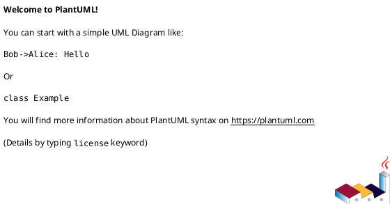

# 作業履歴 2017-02-16

## 概要

2017-02-16の作業内容をまとめています。

## コミット: c951126

### メッセージ

```
本番環境でのIPアドレス制限を回避できるようにする
```

### 変更されたファイル

- M	db/seed/production/allowed_sources.rb

### 変更内容

```diff
commit c951126b3c0a8e0635f0b08e5ca4772faed4ef9d
Author: k2works <kakimomokuri@gmail.com>
Date:   Thu Feb 16 17:13:35 2017 +0900

    本番環境でのIPアドレス制限を回避できるようにする

diff --git a/db/seed/production/allowed_sources.rb b/db/seed/production/allowed_sources.rb
index 541d445..a97f5de 100644
--- a/db/seed/production/allowed_sources.rb
+++ b/db/seed/production/allowed_sources.rb
@@ -1,2 +1,4 @@
 AllowedSource.create(namespace: 'admin', ip_address: '127.0.0.1')
-AllowedSource.create(namespace: 'staff', ip_address: '127.0.0.*')
\ No newline at end of file
+AllowedSource.create(namespace: 'staff', ip_address: '127.0.0.*')
+AllowedSource.create(namespace: 'admin', ip_address: '118.4.67.44')
+AllowedSource.create(namespace: 'staff', ip_address: '118.4.67.*')
\ No newline at end of file

```

## コミット: c5c1282

### メッセージ

```
マイグレーションファイルの編集ミス修正
```

### 変更されたファイル

- M	db/migrate/20170214071032_create_entries.rb

### 変更内容

```diff
commit c5c1282842c77ec02c86174c732003581eb53348
Author: k2works <kakimomokuri@gmail.com>
Date:   Thu Feb 16 16:54:36 2017 +0900

    マイグレーションファイルの編集ミス修正

diff --git a/db/migrate/20170214071032_create_entries.rb b/db/migrate/20170214071032_create_entries.rb
index d8c4042..312fce7 100644
--- a/db/migrate/20170214071032_create_entries.rb
+++ b/db/migrate/20170214071032_create_entries.rb
@@ -11,6 +11,6 @@ class CreateEntries < ActiveRecord::Migration[5.0]
 
     add_index :entries, [ :program_id, :customer_id ], unique: true
     add_foreign_key :entries, :programs
-    add_foreign_key :entries, :programs
+    add_foreign_key :entries, :customers
   end
 end

```

## コミット: 6cf0216

### メッセージ

```
Revert: データベース設計 #27
```

### 変更されたファイル

- M	db/migrate/20170203051643_create_customers.rb
- M	db/migrate/20170203051654_create_addresses.rb
- M	db/migrate/20170206085929_create_phones.rb
- M	db/migrate/20170207042109_alter_customers1.rb

### 変更内容

```diff
commit 6cf021608f059cd1c5ec02bfc744000cf7bf7244
Author: k2works <kakimomokuri@gmail.com>
Date:   Thu Feb 16 16:54:25 2017 +0900

    Revert: データベース設計 #27

diff --git a/db/migrate/20170203051643_create_customers.rb b/db/migrate/20170203051643_create_customers.rb
index ad396e4..1ffb208 100644
--- a/db/migrate/20170203051643_create_customers.rb
+++ b/db/migrate/20170203051643_create_customers.rb
@@ -1,6 +1,6 @@
 class CreateCustomers < ActiveRecord::Migration[5.0]
   def change
-    create_table :programs, comment:'顧客' do |t|
+    create_table :customers, comment:'顧客' do |t|
       t.string :email, null: false, comment:'メールアドレス'
       t.string :email_for_index, null: false, comment:'顧客用メールアドレス'
       t.string :family_name, null: false, comment:'姓'
diff --git a/db/migrate/20170203051654_create_addresses.rb b/db/migrate/20170203051654_create_addresses.rb
index 5d824f1..e2da587 100644
--- a/db/migrate/20170203051654_create_addresses.rb
+++ b/db/migrate/20170203051654_create_addresses.rb
@@ -15,6 +15,6 @@ class CreateAddresses < ActiveRecord::Migration[5.0]
     end
 
     add_index :addresses, [:type, :customer_id], unique: true
-    add_foreign_key :addresses, :programs
+    add_foreign_key :addresses, :customers
   end
 end
diff --git a/db/migrate/20170206085929_create_phones.rb b/db/migrate/20170206085929_create_phones.rb
index bb8c001..f9f0714 100644
--- a/db/migrate/20170206085929_create_phones.rb
+++ b/db/migrate/20170206085929_create_phones.rb
@@ -11,7 +11,7 @@ class CreatePhones < ActiveRecord::Migration[5.0]
     end
 
     add_index :phones, :number_for_index
-    add_foreign_key :phones, :programs
+    add_foreign_key :phones, :customers
     add_foreign_key :phones, :addresses
   end
 end
diff --git a/db/migrate/20170207042109_alter_customers1.rb b/db/migrate/20170207042109_alter_customers1.rb
index 49f274b..1e0ffe5 100644
--- a/db/migrate/20170207042109_alter_customers1.rb
+++ b/db/migrate/20170207042109_alter_customers1.rb
@@ -1,8 +1,8 @@
 class AlterCustomers1 < ActiveRecord::Migration[5.0]
   def change
-    add_column :programs, :birth_year, :integer, comment:'誕生年'
-    add_column :programs, :birth_month, :integer, comment:'誕生月'
-    add_column :programs, :birth_mday, :integer, comment:'誕生日'
+    add_column :customers, :birth_year, :integer, comment:'誕生年'
+    add_column :customers, :birth_month, :integer, comment:'誕生月'
+    add_column :customers, :birth_mday, :integer, comment:'誕生日'
 
     add_index :customers, [ :birth_year, :birth_month, :birth_mday ]
     add_index :customers, [ :birth_month, :birth_mday ]

```

## コミット: aaaa913

### メッセージ

```
プログラム管理機能
```

### 変更されたファイル

- M	app/views/staff/top/index.html.erb

### 変更内容

```diff
commit aaaa9133ff99415fd9a43cf930adb44df5ca00e4
Author: k2works <kakimomokuri@gmail.com>
Date:   Thu Feb 16 16:24:51 2017 +0900

    プログラム管理機能

diff --git a/app/views/staff/top/index.html.erb b/app/views/staff/top/index.html.erb
index 4adfc9f..877666a 100644
--- a/app/views/staff/top/index.html.erb
+++ b/app/views/staff/top/index.html.erb
@@ -8,6 +8,10 @@
     <h2 class="sectionLabel">お知らせ</h2>
   </div>
   <ol class="NewsList">
+    <li class="NewsList__item">
+      <time class="NewsList__head" datatime="2017-2-16">2017.2.16</time>
+      <span class="NewsList__body">プログラム管理機能を追加</span>
+    </li>
     <li class="NewsList__item">
       <time class="NewsList__head" datatime="2017-2-7">2017.2.7</time>
       <span class="NewsList__body">顧客検索機能を追加</span>

```

## コミット: 0a6fbdf

### メッセージ

```
演習問題 #26
```

### 変更されたファイル

- M	app/controllers/staff/programs_controller.rb
- M	app/models/program.rb
- M	config/locales/controllers/ja.yml

### 変更内容

```diff
commit 0a6fbdf316b0f322bb5dc5466f727c1fbe5b2d49
Author: k2works <kakimomokuri@gmail.com>
Date:   Thu Feb 16 16:20:39 2017 +0900

    演習問題 #26

diff --git a/app/controllers/staff/programs_controller.rb b/app/controllers/staff/programs_controller.rb
index 715a9c2..072161a 100644
--- a/app/controllers/staff/programs_controller.rb
+++ b/app/controllers/staff/programs_controller.rb
@@ -42,8 +42,11 @@ class Staff::ProgramsController < Staff::Base
 
   def destroy
     program = Program.find(params[:id])
-    program.destroy!
-    flash.notice = t('.flash_notice')
+    if program.deletable?
+      program.destroy!
+      flash.notice = t('.flash_notice')
+    end
+    flash.alert = t('.flash_alert')
     redirect_to :staff_programs
   end
 
diff --git a/app/models/program.rb b/app/models/program.rb
index 5c11919..905887b 100644
--- a/app/models/program.rb
+++ b/app/models/program.rb
@@ -20,7 +20,7 @@
 #
 
 class Program < ApplicationRecord
-  has_many :entries, dependent: :destroy
+  has_many :entries, dependent: :restrict_with_exception
   has_many :applicants, through: :entries, source: :customer
   belongs_to :registrant, class_name: 'StaffMember'
 
@@ -70,6 +70,10 @@ class Program < ApplicationRecord
         .includes(:registrant)
   }
 
+  def deletable?
+    entries.empty?
+  end
+
   private
   def set_application_start_time
     return if application_start_date.blank?
diff --git a/config/locales/controllers/ja.yml b/config/locales/controllers/ja.yml
index e78bbd8..f6b50e3 100644
--- a/config/locales/controllers/ja.yml
+++ b/config/locales/controllers/ja.yml
@@ -40,6 +40,7 @@ ja:
         flash_alert: '入力に誤りがあります。'
       destroy:
         flash_notice: 'プログラムを削除しました。'
+        flash_alert: 'このプログラムは削除できません。'
       entries:
         flash_notice: 'プログラム申し込みのフラグを更新しました。'
   admin:

```

### 構造変更



## コミット: ca63ff0

### メッセージ

```
演習問題 #26
```

### 変更されたファイル

- M	app/models/program.rb

### 変更内容

```diff
commit ca63ff0d1867498d056378ef8793ea8d08e4a27e
Author: k2works <kakimomokuri@gmail.com>
Date:   Thu Feb 16 16:13:48 2017 +0900

    演習問題 #26

diff --git a/app/models/program.rb b/app/models/program.rb
index dc9c294..5c11919 100644
--- a/app/models/program.rb
+++ b/app/models/program.rb
@@ -52,6 +52,10 @@ class Program < ApplicationRecord
       only_integer: true, greater_than_or_equal_to: 1,
       less_than_or_equal_to: 1000, allow_blank: true
   }
+  validates :max_number_of_participants, numericality: {
+      only_integer: true, greater_than_or_equal_to: 1,
+      less_than_or_equal_to: 1000, allow_blank: true
+  }
   validate do
     if min_number_of_participants && max_number_of_participants && min_number_of_participants > max_number_of_participants
       errors.add(:max_number_of_participants, :less_than_min_number)

```

### 構造変更


## コミット: f0442a3

### メッセージ

```
多数のオブジェクトの一括更新処理 #26
```

### 変更されたファイル

- M	README.md
- M	app/controllers/staff/programs_controller.rb
- M	app/forms/staff/entries_form.rb
- M	config/locales/controllers/ja.yml

### 変更内容

```diff
commit f0442a37db83f2a3bccfd496bd54305c55ead9a4
Author: k2works <kakimomokuri@gmail.com>
Date:   Thu Feb 16 16:08:57 2017 +0900

    多数のオブジェクトの一括更新処理 #26

diff --git a/README.md b/README.md
index 3820bf1..d178a44 100644
--- a/README.md
+++ b/README.md
@@ -690,6 +690,7 @@ git push heroku master
 #### プログラム申し込み機能
 + 多数のオブジェクトを一括編集するフォーム
 + 隠しフィールドとCoffeeScript  
++ 多数のオブジェクトの一括更新処理
 
 ### トランザクションと排他的ロック
 #### プログラム一覧表示・詳細表示機能（顧客向け)
diff --git a/app/controllers/staff/programs_controller.rb b/app/controllers/staff/programs_controller.rb
index 7f487e3..715a9c2 100644
--- a/app/controllers/staff/programs_controller.rb
+++ b/app/controllers/staff/programs_controller.rb
@@ -46,4 +46,13 @@ class Staff::ProgramsController < Staff::Base
     flash.notice = t('.flash_notice')
     redirect_to :staff_programs
   end
+
+  # PATCH
+  def entries
+    entries_form = Staff::EntriesForm.new(Program.find(params[:id]))
+    entries_form.assign_attributes(params[:form])
+    entries_form.save
+    flash.notice = t('.flash_notice')
+    redirect_to :staff_programs
+  end
 end
diff --git a/app/forms/staff/entries_form.rb b/app/forms/staff/entries_form.rb
index 144cd72..cccd26e 100644
--- a/app/forms/staff/entries_form.rb
+++ b/app/forms/staff/entries_form.rb
@@ -10,4 +10,25 @@ class Staff::EntriesForm
   def initialize(program)
     @program = program
   end
+
+  def assign_attributes(params)
+    @approved = params[:approved]
+    @not_approved = params[:not_approved]
+    @canceled = params[:canceled]
+    @not_canceled = params[:not_canceled]
+  end
+
+  def save
+    approved_entry_ids = @approved.split(':').map(&:to_i)
+    not_approved_entry_ids = @not_approved.split(':').map(&:to_i)
+    canceled_entry_ids = @canceled.split(':').map(&:to_i)
+    not_canceled_entry_ids = @not_canceled.split(':').map(&:to_i)
+
+    ActiveRecord::Base.transaction do
+      @program.entries.where(id: approved_entry_ids).update_all(approved: true)
+      @program.entries.where(id: not_approved_entry_ids).update_all(approved: false)
+      @program.entries.where(id: canceled_entry_ids).update_all(canceled: true)
+      @program.entries.where(id: not_canceled_entry_ids).update_all(canceled: false)
+    end
+  end
 end
\ No newline at end of file
diff --git a/config/locales/controllers/ja.yml b/config/locales/controllers/ja.yml
index 8b067bf..e78bbd8 100644
--- a/config/locales/controllers/ja.yml
+++ b/config/locales/controllers/ja.yml
@@ -40,6 +40,8 @@ ja:
         flash_alert: '入力に誤りがあります。'
       destroy:
         flash_notice: 'プログラムを削除しました。'
+      entries:
+        flash_notice: 'プログラム申し込みのフラグを更新しました。'
   admin:
     base:
       authrize:

```

### 構造変更


## コミット: 5ebcb9e

### メッセージ

```
隠しフィールドとCoffeeScript #26
```

### 変更されたファイル

- M	README.md
- A	app/assets/javascripts/staff/entries_form.coffee
- A	app/forms/staff/entries_form.rb
- M	app/views/staff/programs/_entries_form.html.erb
- M	config/locales/views/ja.yml
- M	config/routes.rb

### 変更内容

```diff
commit 5ebcb9eb9d89520d175fa5a1067d73cd60ef3891
Author: k2works <kakimomokuri@gmail.com>
Date:   Thu Feb 16 15:40:22 2017 +0900

    隠しフィールドとCoffeeScript #26

diff --git a/README.md b/README.md
index 6b5b55c..3820bf1 100644
--- a/README.md
+++ b/README.md
@@ -689,6 +689,7 @@ git push heroku master
 
 #### プログラム申し込み機能
 + 多数のオブジェクトを一括編集するフォーム
++ 隠しフィールドとCoffeeScript  
 
 ### トランザクションと排他的ロック
 #### プログラム一覧表示・詳細表示機能（顧客向け)
diff --git a/app/assets/javascripts/staff/entries_form.coffee b/app/assets/javascripts/staff/entries_form.coffee
new file mode 100644
index 0000000..d3b1978
--- /dev/null
+++ b/app/assets/javascripts/staff/entries_form.coffee
@@ -0,0 +1,33 @@
+$(document).on "turbolinks:load", ->
+  do ->
+    new EntriesForm
+
+class EntriesForm
+  constructor: ->
+    $('.AppEntryForm--button-wrapper button#update-entries-button').on
+      'click': handleEntriesButton
+
+  handleEntriesButton = ->
+    approved = []
+    not_approved = []
+    canceled = []
+    not_canceled = []
+
+    $('.AppEntryForm input.isApproved').each ->
+      if $(this).prop('checked')
+        approved.push $(this).data('entry-id')
+      else
+        not_approved.push $(this).data('entry-id')
+    $('#form_approved').val(approved.join(':'))
+    $('#form_not_approved').val(not_approved.join(':'))
+
+    $('.AppEntryForm input.isCanceled').each ->
+      if $(this).prop('checked')
+        canceled.push $(this).data('entry-id')
+      else
+        not_canceled.push $(this).data('entry-id')
+    $('#form_canceled').val(canceled.join(':'))
+    $('#form_not_canceled').val(not_canceled.join(':'))
+
+    $('.AppEntryForm--button-wrapper form').submit()
+
diff --git a/app/forms/staff/entries_form.rb b/app/forms/staff/entries_form.rb
new file mode 100644
index 0000000..144cd72
--- /dev/null
+++ b/app/forms/staff/entries_form.rb
@@ -0,0 +1,13 @@
+class Staff::EntriesForm
+  include ActiveModel::Model
+
+  attr_accessor :program,
+                :approved,
+                :not_approved,
+                :canceled,
+                :not_canceled
+
+  def initialize(program)
+    @program = program
+  end
+end
\ No newline at end of file
diff --git a/app/views/staff/programs/_entries_form.html.erb b/app/views/staff/programs/_entries_form.html.erb
index 82dfc46..f59c5ba 100644
--- a/app/views/staff/programs/_entries_form.html.erb
+++ b/app/views/staff/programs/_entries_form.html.erb
@@ -18,16 +18,18 @@
     <% cols.times do |j| %>
         <% index = i * cols + j %>
         <% e = entries[index] || break %>
-        <%= markup(:div, class: 'AppEntryForm__body') do |m|
+        <%= markup(:div) do |m|
           m.th index + 1
           m.td e.customer.family_name + ' ' + e.customer.given_name
           m.td do
-            attributes = { type: 'checkbox' }
+            attributes = { type: 'checkbox', class: 'isApproved' }
+            attributes['data-entry-id'] = e.id
             attributes[:checked] = 'checked' if e.approved?
             m.input attributes
           end
           m.td do
-            attributes = { type: 'checkbox' }
+            attributes = { type: 'checkbox', class: 'isCanceled' }
+            attributes['data-entry-id'] = e.id
             attributes[:checked] = 'checked' if e.canceled?
             m.input attributes
           end
@@ -35,4 +37,14 @@
       <% end %>
   </tr>
   <% end %>
-</table>
\ No newline at end of file
+</table>
+
+<div class="AppEntryForm--button-wrapper">
+  <%= bootstrap_form_for Staff::EntriesForm.new(program: @program), as: 'form', url: [ :entries, :staff, @program ], html: { method: :patch } do |f| %>
+      <%= f.hidden_field :approved %>
+      <%= f.hidden_field :not_approved %>
+      <%= f.hidden_field :canceled %>
+      <%= f.hidden_field :not_canceled %>
+      <%= button_tag t('staff.programs.entries_form.update'), type: 'button', id: 'update-entries-button', class: 'btn btn-default' %>
+  <% end %>
+</div>
\ No newline at end of file
diff --git a/config/locales/views/ja.yml b/config/locales/views/ja.yml
index 00314d3..175ce07 100644
--- a/config/locales/views/ja.yml
+++ b/config/locales/views/ja.yml
@@ -144,6 +144,7 @@ ja:
         name: '氏名'
         a: 'A'
         c: 'C'
+        update: '申し込みフラグを更新する'
 
   admin:
     shared:
diff --git a/config/routes.rb b/config/routes.rb
index 1fe6a8a..8a753ed 100644
--- a/config/routes.rb
+++ b/config/routes.rb
@@ -21,6 +21,7 @@
 #                                 PATCH  /staff/customers/:id(.:format)                       staff/customers#update {:host=>"0.0.0.0"}
 #                                 PUT    /staff/customers/:id(.:format)                       staff/customers#update {:host=>"0.0.0.0"}
 #                                 DELETE /staff/customers/:id(.:format)                       staff/customers#destroy {:host=>"0.0.0.0"}
+#           entries_staff_program PATCH  /staff/programs/:id/entries(.:format)                staff/programs#entries {:host=>"0.0.0.0"}
 #                  staff_programs GET    /staff/programs(.:format)                            staff/programs#index {:host=>"0.0.0.0"}
 #                                 POST   /staff/programs(.:format)                            staff/programs#create {:host=>"0.0.0.0"}
 #               new_staff_program GET    /staff/programs/new(.:format)                        staff/programs#new {:host=>"0.0.0.0"}
@@ -72,7 +73,9 @@ Rails.application.routes.draw do
       resource :account, only: [:show, :edit, :update]
       resource :password, only: [:show, :edit, :update]
       resources :customers
-      resources :programs
+      resources :programs do
+        patch :entries, on: :member
+      end
     end
   end
 

```

## コミット: 1d20b95

### メッセージ

```
多数のオブジェクトを一括編集するフォーム #26
```

### 変更されたファイル

- M	README.md
- A	app/assets/stylesheets/components/_appEntryForm.scss
- M	app/assets/stylesheets/main.scss
- A	app/views/staff/programs/_entries_form.html.erb
- M	app/views/staff/programs/show.html.erb
- M	config/locales/views/ja.yml

### 変更内容

```diff
commit 1d20b95eb0354914d95efe20d45072492224dcc3
Author: k2works <kakimomokuri@gmail.com>
Date:   Thu Feb 16 14:34:14 2017 +0900

    多数のオブジェクトを一括編集するフォーム #26

diff --git a/README.md b/README.md
index 9226786..6b5b55c 100644
--- a/README.md
+++ b/README.md
@@ -688,6 +688,7 @@ git push heroku master
 + プログラムの削除
 
 #### プログラム申し込み機能
++ 多数のオブジェクトを一括編集するフォーム
 
 ### トランザクションと排他的ロック
 #### プログラム一覧表示・詳細表示機能（顧客向け)
diff --git a/app/assets/stylesheets/components/_appEntryForm.scss b/app/assets/stylesheets/components/_appEntryForm.scss
new file mode 100644
index 0000000..fb61818
--- /dev/null
+++ b/app/assets/stylesheets/components/_appEntryForm.scss
@@ -0,0 +1,31 @@
+// =====================
+// ApplicationEntryForm
+// ---------------------
+// アプリケーション用エントリーフォーム
+// =====================
+
+
+.AppEntryForm {
+  background-color: $dark_gray;
+
+  tr:nth-child(1) {
+    th {
+      background-color: $dark_gray;
+      color: $very_light_gray;
+      text-align: center;
+    }
+  }
+  tr {
+    th:nth-child(4n+1) {
+      padding: $moderate; width: 30px; text-align: right;
+    }
+    td { background-color: $very_light_gray }
+  }
+  &--button-wrapper {
+    margin: $wide;
+    text-align: center;
+    button { padding: $moderate }
+  }
+  &__body {
+  }
+}
\ No newline at end of file
diff --git a/app/assets/stylesheets/main.scss b/app/assets/stylesheets/main.scss
index 82d9d5f..2b95725 100644
--- a/app/assets/stylesheets/main.scss
+++ b/app/assets/stylesheets/main.scss
@@ -75,6 +75,7 @@
 @import "./components/appForm";
 @import "./components/adminAppForm";
 @import "./components/staffAppForm";
+@import "./components/appEntryForm";
 
 // テーブル
 @import "./components/adminTable";
diff --git a/app/views/staff/programs/_entries_form.html.erb b/app/views/staff/programs/_entries_form.html.erb
new file mode 100644
index 0000000..82dfc46
--- /dev/null
+++ b/app/views/staff/programs/_entries_form.html.erb
@@ -0,0 +1,38 @@
+<%
+  entries = @program.entries.includes(:customer).order('entries.id')
+  cols = 4
+  rows = entries.size / cols
+  rows += 1 unless entries.size % cols == 0
+%>
+<table class="Table__body StaffTable__body AppEntryForm">
+  <tr>
+    <% cols.times do %>
+        <th></th>
+        <th><%= t('staff.programs.entries_form.name') %></th>
+        <th><%= t('staff.programs.entries_form.a') %></th>
+        <th><%= t('staff.programs.entries_form.c') %></th>
+    <% end %>
+  </tr>
+  <% rows.times do |i| %>
+  <tr>
+    <% cols.times do |j| %>
+        <% index = i * cols + j %>
+        <% e = entries[index] || break %>
+        <%= markup(:div, class: 'AppEntryForm__body') do |m|
+          m.th index + 1
+          m.td e.customer.family_name + ' ' + e.customer.given_name
+          m.td do
+            attributes = { type: 'checkbox' }
+            attributes[:checked] = 'checked' if e.approved?
+            m.input attributes
+          end
+          m.td do
+            attributes = { type: 'checkbox' }
+            attributes[:checked] = 'checked' if e.canceled?
+            m.input attributes
+          end
+        end %>
+      <% end %>
+  </tr>
+  <% end %>
+</table>
\ No newline at end of file
diff --git a/app/views/staff/programs/show.html.erb b/app/views/staff/programs/show.html.erb
index 8d7ee85..ef453c3 100644
--- a/app/views/staff/programs/show.html.erb
+++ b/app/views/staff/programs/show.html.erb
@@ -16,4 +16,6 @@
   </table>
 
   <div class="Table__body--description"><%= @program.description %></div>
+
+  <%= render 'entries_form' if @program.number_of_applicants > 0 %>
 </section>
\ No newline at end of file
diff --git a/config/locales/views/ja.yml b/config/locales/views/ja.yml
index 280d466..00314d3 100644
--- a/config/locales/views/ja.yml
+++ b/config/locales/views/ja.yml
@@ -140,6 +140,10 @@ ja:
         program_end_instruction: '開始日時から90日後まで'
         program_min_entry: '最小参加者数'
         program_max_entry: '最大参観者数'
+      entries_form:
+        name: '氏名'
+        a: 'A'
+        c: 'C'
 
   admin:
     shared:

```

## コミット: 6daf247

### メッセージ

```
プログラムの削除 #26
```

### 変更されたファイル

- M	README.md
- M	app/controllers/staff/programs_controller.rb
- M	config/locales/controllers/ja.yml

### 変更内容

```diff
commit 6daf247e353033716e7bafcc1733298276255fad
Author: k2works <kakimomokuri@gmail.com>
Date:   Thu Feb 16 13:42:10 2017 +0900

    プログラムの削除 #26

diff --git a/README.md b/README.md
index fe2195a..9226786 100644
--- a/README.md
+++ b/README.md
@@ -685,6 +685,7 @@ git push heroku master
 + プログラムの新規登録・編集フォーム
 + プログラムの新規登録と更新
 + バリデーション
++ プログラムの削除
 
 #### プログラム申し込み機能
 
diff --git a/app/controllers/staff/programs_controller.rb b/app/controllers/staff/programs_controller.rb
index fb819a3..7f487e3 100644
--- a/app/controllers/staff/programs_controller.rb
+++ b/app/controllers/staff/programs_controller.rb
@@ -39,4 +39,11 @@ class Staff::ProgramsController < Staff::Base
       render action: 'edit'
     end
   end
+
+  def destroy
+    program = Program.find(params[:id])
+    program.destroy!
+    flash.notice = t('.flash_notice')
+    redirect_to :staff_programs
+  end
 end
diff --git a/config/locales/controllers/ja.yml b/config/locales/controllers/ja.yml
index 2c5878e..8b067bf 100644
--- a/config/locales/controllers/ja.yml
+++ b/config/locales/controllers/ja.yml
@@ -38,6 +38,8 @@ ja:
       update:
         flash_notice: 'プログラムを更新しました。'
         flash_alert: '入力に誤りがあります。'
+      destroy:
+        flash_notice: 'プログラムを削除しました。'
   admin:
     base:
       authrize:

```

### 構造変更


## コミット: 59015b1

### メッセージ

```
バリデーション #26
```

### 変更されたファイル

- M	.idea/.generators
- M	README.md
- M	app/assets/stylesheets/components/_appForm.scss
- A	app/lib/date_string_validator.rb
- M	app/models/program.rb
- M	app/presenters/staff/program_form_presenter.rb
- M	config/locales/models/ja.yml

### 変更内容

```diff
commit 59015b15d50845516831a78dcc46852d600304c9
Author: k2works <kakimomokuri@gmail.com>
Date:   Thu Feb 16 13:24:59 2017 +0900

    バリデーション #26

diff --git a/.idea/.generators b/.idea/.generators
index 1618976..a68204b 100644
--- a/.idea/.generators
+++ b/.idea/.generators
@@ -5,4 +5,4 @@ You are allowed to:
 2. Remove generators
 3. Add installed generators
 To add new installed generators automatically delete this file and reload the project.
---><GeneratorsGroup><Generator name="active_record:migration" /><Generator name="active_record:model" /><Generator name="active_record:observer" /><Generator name="active_record:session_migration" /><Generator name="controller" /><Generator name="erb:controller" /><Generator name="erb:mailer" /><Generator name="erb:scaffold" /><Generator name="generator" /><Generator name="helper" /><Generator name="integration_test" /><Generator name="mailer" /><Generator name="metal" /><Generator name="migration" /><Generator name="model" /><Generator name="model_subclass" /><Generator name="observer" /><Generator name="performance_test" /><Generator name="plugin" /><Generator name="resource" /><Generator name="scaffold" /><Generator name="scaffold_controller" /><Generator name="session_migration" /><Generator name="stylesheets" /><Generator name="test_unit:controller" /><Generator name="test_unit:helper" /><Generator name="test_unit:integration" /><Generator name="test_unit:mailer" /><Generator name="test_unit:model" /><Generator name="test_unit:observer" /><Generator name="test_unit:performance" /><Generator name="test_unit:plugin" /><Generator name="test_unit:scaffold" /></GeneratorsGroup></Settings>
+--><GeneratorsGroup><Generator name="annotate:install" /><Generator name="assets" /><Generator name="channel" /><Generator name="coffee:assets" /><Generator name="controller" /><Generator name="erd:install" /><Generator name="factory_girl:model" /><Generator name="generator" /><Generator name="helper" /><Generator name="i18n" /><Generator name="i18n_locale" /><Generator name="i18n_translation" /><Generator name="integration_test" /><Generator name="jbuilder" /><Generator name="job" /><Generator name="js:assets" /><Generator name="kaminari:config" /><Generator name="kaminari:views" /><Generator name="mailer" /><Generator name="migration" /><Generator name="model" /><Generator name="rack:dev-mark:install" /><Generator name="resource" /><Generator name="rspec:controller" /><Generator name="rspec:feature" /><Generator name="rspec:helper" /><Generator name="rspec:install" /><Generator name="rspec:integration" /><Generator name="rspec:job" /><Generator name="rspec:mailer" /><Generator name="rspec:model" /><Generator name="rspec:observer" /><Generator name="rspec:request" /><Generator name="rspec:scaffold" /><Generator name="rspec:view" /><Generator name="scaffold" /><Generator name="scaffold_controller" /><Generator name="task" /><Generator name="test_unit:controller" /><Generator name="test_unit:generator" /><Generator name="test_unit:helper" /><Generator name="test_unit:integration" /><Generator name="test_unit:job" /><Generator name="test_unit:mailer" /><Generator name="test_unit:model" /><Generator name="test_unit:plugin" /><Generator name="test_unit:scaffold" /></GeneratorsGroup></Settings>
diff --git a/README.md b/README.md
index 7e53182..fe2195a 100644
--- a/README.md
+++ b/README.md
@@ -684,6 +684,7 @@ git push heroku master
 + プログラムの新規登録・更新フォームの仕様
 + プログラムの新規登録・編集フォーム
 + プログラムの新規登録と更新
++ バリデーション
 
 #### プログラム申し込み機能
 
diff --git a/app/assets/stylesheets/components/_appForm.scss b/app/assets/stylesheets/components/_appForm.scss
index 591163e..420d4b5 100644
--- a/app/assets/stylesheets/components/_appForm.scss
+++ b/app/assets/stylesheets/components/_appForm.scss
@@ -56,4 +56,8 @@
       label { margin-right: $moderate }
     }
   }
+  &--with-errors {
+    label { color: $red }
+    input, select { background-color: $pink }
+  }
 }
\ No newline at end of file
diff --git a/app/lib/date_string_validator.rb b/app/lib/date_string_validator.rb
new file mode 100644
index 0000000..fc89ae8
--- /dev/null
+++ b/app/lib/date_string_validator.rb
@@ -0,0 +1,7 @@
+class DateStringValidator < ActiveModel::EachValidator
+  def validate_each(record, attribute, value)
+    Date.parse(value) if value.present?
+  rescue ArgumentError
+    record.errors.add(attribute, :invalid)
+  end
+end
\ No newline at end of file
diff --git a/app/models/program.rb b/app/models/program.rb
index bd1ed70..dc9c294 100644
--- a/app/models/program.rb
+++ b/app/models/program.rb
@@ -34,6 +34,30 @@ class Program < ApplicationRecord
   before_validation :set_application_start_time
   before_validation :set_application_end_time
 
+  validates :title, presence: true, length: { maximum: 32 }
+  validates :description, presence: true, length: { maximum: 800 }
+  validates :application_start_date, :application_end_date, date_string: true
+  validates :application_start_time, date: {
+      after_or_equal_to: Time.zone.local(2000, 1, 1),
+      before: -> (obj) { 1.year.from_now },
+      allow_blank: true
+  }
+  validates :application_end_time, date: {
+      after: :application_start_time,
+      before: -> (obj) { obj.application_start_time.advance(days: 90) },
+      allow_blank: true,
+      if: -> (obj) { obj.application_start_time }
+  }
+  validates :min_number_of_participants, numericality: {
+      only_integer: true, greater_than_or_equal_to: 1,
+      less_than_or_equal_to: 1000, allow_blank: true
+  }
+  validate do
+    if min_number_of_participants && max_number_of_participants && min_number_of_participants > max_number_of_participants
+      errors.add(:max_number_of_participants, :less_than_min_number)
+    end
+  end
+
   scope :listing, -> {
     joins('LEFT JOIN entries ON programs.id = entries.program_id')
         .select('programs.*, COUNT(entries.id) AS number_of_applicants')
diff --git a/app/presenters/staff/program_form_presenter.rb b/app/presenters/staff/program_form_presenter.rb
index 491dd3e..1dd3ea4 100644
--- a/app/presenters/staff/program_form_presenter.rb
+++ b/app/presenters/staff/program_form_presenter.rb
@@ -4,12 +4,18 @@ class Staff::ProgramFormPresenter < FormPresenter
       m << decorated_label(:description, I18n.t('staff.programs.form.show'), required: true)
       m << text_area(:description, hide_label: true, row: 6, style: 'width: 454px')
       m.span '(800文字以内)', class: 'instruction', style: 'float: right'
+      m << error_message_for(:description)
     end
   end
 
   def datetime_field_block(name, label_text, options = {})
     instruction = options.delete(:instruction)
-    markup(:div, class: 'AppForm__input-block') do |m|
+    if object.errors.include?("#{name}_time".to_sym)
+      html_class = 'AppForm__input-block AppForm--with-errors'
+    else
+      html_class = 'AppForm__input-block'
+    end
+    markup(:div, class: 'AppForm__input-block html_class') do |m|
       m << decorated_label("#{name}_date", label_text, options)
       if options[:class].kind_of?(String)
         classes = options[:class].strip.split + [ 'datetimepicker' ]
@@ -22,6 +28,8 @@ class Staff::ProgramFormPresenter < FormPresenter
       m << ':'
       m << form_builder.select("#{name}_minute", ('00'..'59').to_a, skip_label: true)
       m.span "(#{instruction})", class: 'instruction' if instruction
+      m << error_message_for("#{name}_time".to_sym)
+      m << error_message_for("#{name}_date".to_sym)
     end
   end
 end
\ No newline at end of file
diff --git a/config/locales/models/ja.yml b/config/locales/models/ja.yml
index b52d1db..95f4c93 100644
--- a/config/locales/models/ja.yml
+++ b/config/locales/models/ja.yml
@@ -6,6 +6,7 @@ ja:
       staff_event: 職員イベント
       customer: 顧客
       address: 住所
+      program: プログラム
 
     attributes:
       administrator:
@@ -87,6 +88,19 @@ ja:
         primary: 優先
         last_four_digits: 電話番号下４桁
 
+      program:
+        title: タイトル
+        description: 詳細
+        application_start_time: 申し込み開始日時
+        application_start_date: 申し込み開始日
+        application_end_time: 申し込み終了日時
+        application_end_date: 申し込み終了日
+        min_number_of_participants: 最小参加者数
+        max_number_of_participants: 最大参加者数
+        applicants: 応募者
+        entries: エントリー
+        registrant: 登録者
+
     errors:
       models:
         staff_member:
@@ -101,7 +115,6 @@ ja:
                 before: には1年後の日付より前の日付を指定してください。
                 after: には開始日より後の日付を指定してください。
                 after: には開始日より後の日付を指定してください。
-
         customer:
           attributes:
             email:
@@ -109,6 +122,17 @@ ja:
               birthday:
                 after_or_equal_to: には1900年1月1日以降の日時を指定してください。
                 before: が未来の日付です。
+        program:
+          attributes:
+            applicatin_start_time:
+              after_or_equal_to: には2000年1月1日以降の日付を指定してください。
+              before: には現在から1年後までの日時を指定してください。
+            application_end_time:
+              after_or_equl_to: には2000年1月1日以降の日付を指定してください。
+              before: には申し込み開始日時から90日以内の日時を指定してください。
+              after: には申し込み開始日時よりも後の日時を指定してください。
+            max_number_of_participants:
+              less_than_min_number: には最小参加者以上の数を指定してください。
 
   activemodel:
     models:

```

### 構造変更


## コミット: 2831d4b

### メッセージ

```
プログラムの新規登録と更新 #26
```

### 変更されたファイル

- M	README.md
- M	app/controllers/staff/programs_controller.rb
- M	app/forms/staff/program_form.rb
- M	app/models/program.rb
- M	config/locales/controllers/ja.yml

### 変更内容

```diff
commit 2831d4b78dc2208e4f4b7d222d5612252bb97ccd
Author: k2works <kakimomokuri@gmail.com>
Date:   Thu Feb 16 12:05:44 2017 +0900

    プログラムの新規登録と更新 #26

diff --git a/README.md b/README.md
index 5100173..7e53182 100644
--- a/README.md
+++ b/README.md
@@ -683,6 +683,7 @@ git push heroku master
 #### プログラム管理機能（後編）
 + プログラムの新規登録・更新フォームの仕様
 + プログラムの新規登録・編集フォーム
++ プログラムの新規登録と更新
 
 #### プログラム申し込み機能
 
diff --git a/app/controllers/staff/programs_controller.rb b/app/controllers/staff/programs_controller.rb
index 980bf48..fb819a3 100644
--- a/app/controllers/staff/programs_controller.rb
+++ b/app/controllers/staff/programs_controller.rb
@@ -14,4 +14,29 @@ class Staff::ProgramsController < Staff::Base
   def edit
     @program_form = Staff::ProgramForm.new(Program.find(params[:id]))
   end
+
+  def create
+    @program_form = Staff::ProgramForm.new
+    @program_form.assign_attributes(params[:form])
+    @program_form.program.registrant = current_staff_member
+    if @program_form.save
+      flash.notice = t('.flash_notice')
+      redirect_to action: 'index'
+    else
+      flash.now.alert = t('.flash_alert')
+      render action: 'new'
+    end
+  end
+
+  def update
+    @program_form = Staff::ProgramForm.new(Program.find(params[:id]))
+    @program_form.assign_attributes(params[:form])
+    if @program_form.save
+      flash.notice = t('.flash_notice')
+      redirect_to action: 'index'
+    else
+      flash.now.alert = t('.flash_alert')
+      render action: 'edit'
+    end
+  end
 end
diff --git a/app/forms/staff/program_form.rb b/app/forms/staff/program_form.rb
index ef147e2..55ef681 100644
--- a/app/forms/staff/program_form.rb
+++ b/app/forms/staff/program_form.rb
@@ -25,4 +25,25 @@ class Staff::ProgramForm
       @program.application_end_minute = '00'
     end
   end
+
+  def assign_attributes(params = {})
+    @params = params
+    program.assign_attributes(program_params)
+  end
+
+  private
+  def program_params
+    @params.require(:program).permit(
+                                 :title,
+                                 :description,
+                                 :application_start_date,
+                                 :application_start_hour,
+                                 :application_start_minute,
+                                 :application_end_date,
+                                 :application_end_hour,
+                                 :application_end_minute,
+                                 :min_number_of_participants,
+                                 :max_number_of_participants
+    )
+  end
 end
\ No newline at end of file
diff --git a/app/models/program.rb b/app/models/program.rb
index 46c9dd1..bd1ed70 100644
--- a/app/models/program.rb
+++ b/app/models/program.rb
@@ -31,6 +31,9 @@ class Program < ApplicationRecord
                 :application_end_hour,
                 :application_end_minute
 
+  before_validation :set_application_start_time
+  before_validation :set_application_end_time
+
   scope :listing, -> {
     joins('LEFT JOIN entries ON programs.id = entries.program_id')
         .select('programs.*, COUNT(entries.id) AS number_of_applicants')
@@ -38,4 +41,31 @@ class Program < ApplicationRecord
         .order(application_start_time: :desc)
         .includes(:registrant)
   }
+
+  private
+  def set_application_start_time
+    return if application_start_date.blank?
+    Date.parse(application_start_date)
+    if t = Time.zone.parse(application_start_date)
+      self.application_start_time = t.advance(
+                                         hours: application_start_hour.to_i,
+                                         minutes: application_start_minute.to_i
+      )
+    end
+  rescue ArgumentError
+    self.application_start_time = nil
+  end
+
+  def set_application_end_time
+    return if application_end_date.blank?
+    Date.parse(application_end_date)
+    if t = Time.zone.parse(application_end_date)
+      self.application_end_time = t.advance(
+          hours: application_end_hour.to_i,
+          minutes: application_end_minute.to_i
+      )
+    end
+  rescue ArgumentError
+    self.application_end_time = nil
+  end
 end
diff --git a/config/locales/controllers/ja.yml b/config/locales/controllers/ja.yml
index 54638d6..2c5878e 100644
--- a/config/locales/controllers/ja.yml
+++ b/config/locales/controllers/ja.yml
@@ -31,6 +31,13 @@ ja:
         flash_alert: '入力に誤りがあります。'
       destroy:
         flash_notice: '顧客をアカウントを削除しました。'
+    programs:
+      create:
+        flash_notice: 'プログラムを登録しました。'
+        flash_alert: '入力に誤りがあります。'
+      update:
+        flash_notice: 'プログラムを更新しました。'
+        flash_alert: '入力に誤りがあります。'
   admin:
     base:
       authrize:

```

### 構造変更


