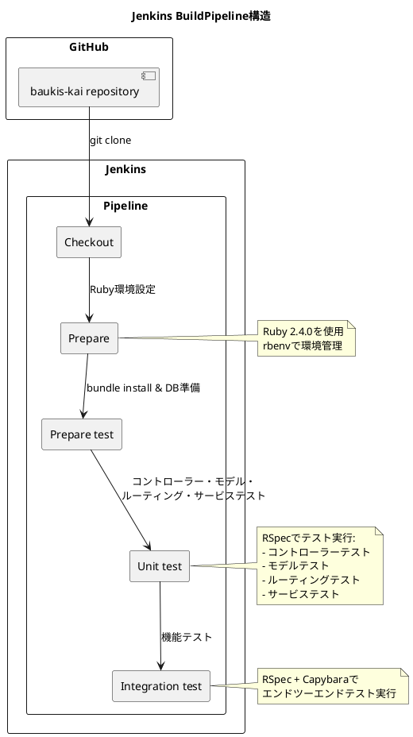

# 作業履歴 2017-02-20

## 概要

2017-02-20の作業内容をまとめています。このジャーナルでは、JenkinsのBuildPipelineに対応するための設定ファイルの追加を行いました。

## コミット: 5bf3ad4 - Jenkins BuildPipeline対応

### 概要
継続的インテグレーション（CI）環境を整備するため、Jenkinsのビルドパイプラインを設定しました。これにより、コードの変更が自動的にテストされ、品質を維持することができます。

### 技術的詳細
- Jenkinsfileを新規作成し、ビルドパイプラインの設定を定義
- パイプラインは以下のステージで構成:
  1. Checkout: GitHubからコードを取得
  2. Prepare: Ruby環境のセットアップ（rbenv使用、Ruby 2.4.0）
  3. Prepare test: 依存関係のインストールとテストDBの準備
  4. Unit test: コントローラー、モデル、ルーティング、サービスのユニットテスト実行
  5. Integration test: 統合テスト（機能テスト）の実行

### 変更されたファイル
- A	Jenkinsfile (新規追加)

### 変更内容

```diff
commit 5bf3ad49e159213652ad85b884564aa7d38a3588
Author: k2works <kakimomokuri@gmail.com>
Date:   Mon Feb 20 18:19:42 2017 +0900

    Jenkins BuildPipeline対応

diff --git a/Jenkinsfile b/Jenkinsfile
new file mode 100644
index 0000000..098e206
--- /dev/null
+++ b/Jenkinsfile
@@ -0,0 +1,24 @@
+node('master') {
+
+  stage 'Checkout'
+  git url: 'https://github.com/k2works/baukis-kai.git'
+
+  stage 'Prepare'
+  env.PATH = '/usr/local/bin:$HOME/.rbenv/shims:$HOME/.rbenv/bin:$PATH'
+  sh 'eval "$(rbenv init -)"'
+  sh 'rbenv local 2.4.0'
+
+  stage 'Prepare test'
+  sh "bundle install"
+  sh "bundle exec rake db:migrate"
+  sh "bundle exec rake db:test:prepare"
+
+  stage "Unit test"
+  sh "bundle exec rspec spec/controllers/*_spec.rb"
+  sh "bundle exec rspec spec/models/*_spec.rb"
+  sh "bundle exec rspec spec/routing/*_spec.rb"
+  sh "bundle exec rspec spec/services/*_spec.rb"
+
+  stage "Integration test"
+  sh "bundle exec rspec spec/features/*_spec.rb"
+}
```

### CI/CDパイプラインの構造


