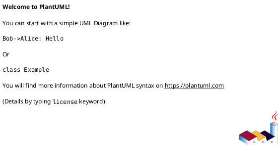

# 作業履歴 2017-03-17

## 概要

2017-03-17の作業内容をまとめています。

## コミット: 22c4d8e

### メッセージ

```
フォームの確認画面  #24
```

### 変更されたファイル

- M	app/views/customer/top/dashboard.html.erb
- M	app/views/staff/top/index.html.erb

### 変更内容

```diff
commit 22c4d8e82e0a2a07d34ac1eb6f4ba9ce4c5cb9d9
Author: k2works <kakimomokuri@gmail.com>
Date:   Fri Mar 17 18:39:20 2017 +0900

    フォームの確認画面  #24

diff --git a/app/views/customer/top/dashboard.html.erb b/app/views/customer/top/dashboard.html.erb
index fd60d28..ead0c5c 100644
--- a/app/views/customer/top/dashboard.html.erb
+++ b/app/views/customer/top/dashboard.html.erb
@@ -8,6 +8,10 @@
     <h2 class="sectionLabel">お知らせ</h2>
   </div>
   <ol class="NewsList">
+    <li class="NewsList__item">
+      <time class="NewsList__head" datatime="2017-3-17">2017.3.17</time>
+      <span class="NewsList__body">顧客自身によるアカウント管理機能追加</span>
+    </li>
     <li class="NewsList__item">
       <time class="NewsList__head" datatime="2017-3-17">2017.3.17</time>
       <span class="NewsList__body">プログラム申し込み機能追加</span>
diff --git a/app/views/staff/top/index.html.erb b/app/views/staff/top/index.html.erb
index 877666a..c0973b1 100644
--- a/app/views/staff/top/index.html.erb
+++ b/app/views/staff/top/index.html.erb
@@ -8,6 +8,10 @@
     <h2 class="sectionLabel">お知らせ</h2>
   </div>
   <ol class="NewsList">
+    <li class="NewsList__item">
+      <time class="NewsList__head" datatime="2017-3-17">2017.3.17</time>
+      <span class="NewsList__body">アカウント情報編集機能を改善</span>
+    </li>
     <li class="NewsList__item">
       <time class="NewsList__head" datatime="2017-2-16">2017.2.16</time>
       <span class="NewsList__body">プログラム管理機能を追加</span>

```

## コミット: f61e351

### メッセージ

```
職員が自分のアカウントを編集する機能に関するCapybaraによるテストを作成 #24
```

### 変更されたファイル

- M	README.md
- A	spec/features/staff/account_management_spec.rb

### 変更内容

```diff
commit f61e351caf90cf87121bd763f5c88b49d37793bd
Author: k2works <kakimomokuri@gmail.com>
Date:   Fri Mar 17 18:36:08 2017 +0900

    職員が自分のアカウントを編集する機能に関するCapybaraによるテストを作成 #24

diff --git a/README.md b/README.md
index 33304ad..3e956b6 100644
--- a/README.md
+++ b/README.md
@@ -726,6 +726,7 @@ git push heroku master
 #### 演習問題
 + 職員が自分のアカウントを編集する機能に確認画面用を追加
 + 機能追加により失敗するテストの修正
++ 職員が自分のアカウントを編集する機能に関するCapybaraによるテストを作成
 
 ### Ajax
 #### 顧客向け問い合わせフォーム
diff --git a/spec/features/staff/account_management_spec.rb b/spec/features/staff/account_management_spec.rb
new file mode 100644
index 0000000..fef8918
--- /dev/null
+++ b/spec/features/staff/account_management_spec.rb
@@ -0,0 +1,34 @@
+require 'rails_helper'
+
+feature '職員による自分自身のアカウント管理' do
+  include FeaturesSpecHelper
+  let(:staff_member) { create(:staff_member) }
+
+  before do
+    switch_namespace(:staff)
+    login_as_staff_member(staff_member)
+    click_link I18n.t('staff.shared.header.account')
+    click_link I18n.t('staff.accounts.show.edit')
+  end
+
+  scenario '職員がメールアドレス、氏名、フリガナを更新する' do
+    fill_in I18n.t('activerecord.attributes.staff_member.email'), with: 'test@oiax.jp'
+    fill_in 'staff_member_family_name', with: '試験'
+    fill_in 'staff_member_given_name', with: '花子'
+    fill_in 'staff_member_family_name_kana', with: 'シケン'
+    fill_in 'staff_member_given_name_kana', with: 'ハナコ'
+    click_button I18n.t('staff.accounts.edit.confirm')
+    click_button I18n.t('staff.accounts.confirm.update')
+
+    staff_member.reload
+    expect(staff_member.email).to eq('test@oiax.jp')
+    expect(staff_member.family_name).to eq('試験')
+    expect(staff_member.given_name_kana).to eq('ハナコ')
+  end
+
+  scenario '職員がメールアドレスに無効な値を入力する' do
+    fill_in I18n.t('activerecord.attributes.staff_member.email'), with: 'test@@oiax.jp'
+    click_button I18n.t('staff.accounts.edit.confirm')
+    expect(page).to have_css('.has-error span.help-block')
+  end
+end
\ No newline at end of file

```

## コミット: c89c40d

### メッセージ

```
機能追加により失敗するテストの修正 #24
```

### 変更されたファイル

- M	README.md
- M	spec/controllers/staff/accounts_controller_spec.rb

### 変更内容

```diff
commit c89c40d0829c19911bd1df5571596e371124f700
Author: k2works <kakimomokuri@gmail.com>
Date:   Fri Mar 17 18:17:50 2017 +0900

    機能追加により失敗するテストの修正 #24

diff --git a/README.md b/README.md
index b7ade4f..33304ad 100644
--- a/README.md
+++ b/README.md
@@ -725,6 +725,7 @@ git push heroku master
 
 #### 演習問題
 + 職員が自分のアカウントを編集する機能に確認画面用を追加
++ 機能追加により失敗するテストの修正
 
 ### Ajax
 #### 顧客向け問い合わせフォーム
diff --git a/spec/controllers/staff/accounts_controller_spec.rb b/spec/controllers/staff/accounts_controller_spec.rb
index cf7ce64..bdce4d8 100644
--- a/spec/controllers/staff/accounts_controller_spec.rb
+++ b/spec/controllers/staff/accounts_controller_spec.rb
@@ -17,7 +17,7 @@ describe Staff::AccountsController do
     # email属性を変更する
     it 'should update email attributes' do
       params_hash.merge!(email: 'test@example.com')
-      patch :update, id: staff_member.id, staff_member: params_hash
+      patch :update, id: staff_member.id, staff_member: params_hash, commit: '更新'
       staff_member.reload
       expect(staff_member.email).to eq('test@example.com')
     end
@@ -25,14 +25,14 @@ describe Staff::AccountsController do
     # 例外ActionController::ParameterMissingが発生
     it 'should throw ActionController::ParameterMissing exception' do
       bypass_rescue
-      expect { patch :update, id: staff_member.id}.to raise_error(ActionController::ParameterMissing)
+      expect { patch :update, id: staff_member.id, commit: '更新'}.to raise_error(ActionController::ParameterMissing)
     end
 
     # end_dateの値は書き換え不可
     it 'should writable end_data value' do
       params_hash.merge!(end_date: Date.tomorrow)
       expect {
-        patch :update, id: staff_member.id, staff_member: params_hash
+        patch :update, id: staff_member.id, staff_member: params_hash, commit: '更新'
       }.not_to change { staff_member.end_date }
     end
   end

```

### 構造変更



## コミット: 85a2dea

### メッセージ

```
職員が自分のアカウントを編集する機能に確認画面用を追加 #24
```

### 変更されたファイル

- M	app/controllers/staff/accounts_controller.rb
- A	app/views/staff/accounts/_confirming_form.html.erb
- A	app/views/staff/accounts/confirm.html.erb
- M	app/views/staff/accounts/edit.html.erb
- M	config/locales/views/ja.yml
- M	config/routes.rb

### 変更内容

```diff
commit 85a2deaeed286efedf31d1d8eff7ec4fc37a88fc
Author: k2works <kakimomokuri@gmail.com>
Date:   Fri Mar 17 18:13:26 2017 +0900

    職員が自分のアカウントを編集する機能に確認画面用を追加 #24

diff --git a/app/controllers/staff/accounts_controller.rb b/app/controllers/staff/accounts_controller.rb
index 449f282..1b5b3ba 100644
--- a/app/controllers/staff/accounts_controller.rb
+++ b/app/controllers/staff/accounts_controller.rb
@@ -7,12 +7,26 @@ class Staff::AccountsController < Staff::Base
     @staff_member = current_staff_member
   end
 
+  def confirm
+    @staff_member = current_staff_member
+    @staff_member.assign_attributes(staff_member_params)
+    if @staff_member.valid?
+      render action: 'confirm'
+    else
+      render action: 'edit'
+    end
+  end
+
   def update
     @staff_member = current_staff_member
     @staff_member.assign_attributes(staff_member_params)
-    if @staff_member.save
-      flash.notice = t('.flash_success')
-      redirect_to :staff_account
+    if params[:commit]
+      if @staff_member.save
+        flash.notice = t('.flash_success')
+        redirect_to :staff_account
+      else
+        render action: 'edit'
+      end
     else
       render action: 'edit'
     end
diff --git a/app/views/staff/accounts/_confirming_form.html.erb b/app/views/staff/accounts/_confirming_form.html.erb
new file mode 100644
index 0000000..9229e00
--- /dev/null
+++ b/app/views/staff/accounts/_confirming_form.html.erb
@@ -0,0 +1,8 @@
+<%= markup do |m|
+  p = ConfirmingUserFormPresenter.new(f, self)
+  p.with_options(required: true) do |q|
+    m << q.text_field_block(:email, t('activerecord.attributes.staff_member.email'))
+    m << q.full_name_block(:family_name, :given_name, '氏名')
+    m << q.full_name_block(:family_name_kana, :given_name_kana, 'フリガナ')
+  end
+end %>
\ No newline at end of file
diff --git a/app/views/staff/accounts/confirm.html.erb b/app/views/staff/accounts/confirm.html.erb
new file mode 100644
index 0000000..c7960d8
--- /dev/null
+++ b/app/views/staff/accounts/confirm.html.erb
@@ -0,0 +1,17 @@
+<% @title = t('.title') %>
+<section class="Section">
+  <h1 class="Staff__title"><%= @title %></h1>
+</section>
+
+<section class="Section l-column AppForm">
+  <div class="AppForm__generic-form CustomerAppForm__generic-form AppForm__customer-form AppForm--isConfirmed">
+    <%= bootstrap_form_for @staff_member, url: :staff_account do |f| %>
+        <p><%= t('.confirm_message')%></p>
+        <%= render 'confirming_form', f: f %>
+        <div class="AppForm__buttons">
+          <%= f.submit t('.update'),class: 'btn btn-default btn-lg' %>
+          <%= f.submit t('.correct'), name: 'correct', class: 'btn btn-default btn-lg' %>
+        </div>
+    <% end %>
+  </div>
+</section>
diff --git a/app/views/staff/accounts/edit.html.erb b/app/views/staff/accounts/edit.html.erb
index c60ac2e..ed7746f 100644
--- a/app/views/staff/accounts/edit.html.erb
+++ b/app/views/staff/accounts/edit.html.erb
@@ -5,10 +5,10 @@
 
 <section class="Section l-column AppForm">
   <div class="AppForm__generic-form StaffAppForm__generic-form">
-    <%= bootstrap_form_for @staff_member, url: :staff_account do |f| %>
+    <%= bootstrap_form_for @staff_member, url: :confirm_staff_account do |f| %>
         <%= render 'form', f: f %>
         <div class="AppForm__buttons">
-          <%= f.submit t('.update'),class: 'btn btn-default btn-lg' %>
+          <%= f.submit t('.confirm'),class: 'btn btn-default btn-lg' %>
           <%= link_to t('.cancel'), :staff_account, class: 'btn btn-default btn-lg' %>
         </div>
     <% end %>
diff --git a/config/locales/views/ja.yml b/config/locales/views/ja.yml
index 7e19903..8e2bd2b 100644
--- a/config/locales/views/ja.yml
+++ b/config/locales/views/ja.yml
@@ -93,8 +93,14 @@ ja:
         start_date: '開始日'
       edit:
         title: 'アカウント情報編集'
+        confirm: '確認画面へ進む'
         update: '更新'
         cancel: 'キャンセル'
+      confirm:
+        title: 'アカウントの更新（確認）'
+        confirm_message: '以下の内容でアカウントを更新します。よろしいですか？'
+        update: '更新'
+        correct: '訂正'
     passwords:
       edit:
         title: 'パスワード変更'
diff --git a/config/routes.rb b/config/routes.rb
index e003496..ab71ca9 100644
--- a/config/routes.rb
+++ b/config/routes.rb
@@ -79,7 +79,9 @@ Rails.application.routes.draw do
     namespace :staff, path: config[:staff][:path] do
       root   'top#index'
       concerns :session_path
-      resource :account, only: [:show, :edit, :update]
+      resource :account, only: [:show, :edit, :update] do
+        patch :confirm
+      end
       resource :password, only: [:show, :edit, :update]
       resources :customers
       resources :programs do

```

### 構造変更


## コミット: 8c50d92

### メッセージ

```
不要ルーティングの削除
```

### 変更されたファイル

- M	README.md
- M	config/routes.rb

### 変更内容

```diff
commit 8c50d92232da1dc01e27a5403e02d64f42ae119a
Author: k2works <kakimomokuri@gmail.com>
Date:   Fri Mar 17 17:58:37 2017 +0900

    不要ルーティングの削除

diff --git a/README.md b/README.md
index a80e7e8..b7ade4f 100644
--- a/README.md
+++ b/README.md
@@ -724,6 +724,7 @@ git push heroku master
 + Capybaraによるテスト
 
 #### 演習問題
++ 職員が自分のアカウントを編集する機能に確認画面用を追加
 
 ### Ajax
 #### 顧客向け問い合わせフォーム
diff --git a/config/routes.rb b/config/routes.rb
index 170bc41..e003496 100644
--- a/config/routes.rb
+++ b/config/routes.rb
@@ -1,9 +1,6 @@
 # == Route Map
 #
 #                          Prefix Verb   URI Pattern                                          Controller#Action
-#         customer_entries_create GET    /customer/entries/create(.:format)                   customer/entries#create
-#         customer_programs_index GET    /customer/programs/index(.:format)                   customer/programs#index
-#          customer_programs_show GET    /customer/programs/show(.:format)                    customer/programs#show
 #                      staff_root GET    /staff(.:format)                                     staff/top#index {:host=>"0.0.0.0"}
 #                     staff_login GET    /staff/login(.:format)                               staff/sessions#new {:host=>"0.0.0.0"}
 #                   staff_session DELETE /staff/session(.:format)                             staff/sessions#destroy {:host=>"0.0.0.0"}
@@ -71,18 +68,6 @@
 #
 
 Rails.application.routes.draw do
-  namespace :customer do
-    get 'entries/create'
-  end
-
-  namespace :customer do
-    get 'programs/index'
-  end
-
-  namespace :customer do
-    get 'programs/show'
-  end
-
   config = Rails.application.config.baukis_kai
 
   concern :session_path do

```

## コミット: 47a8374

### メッセージ

```
Capybaraによるテスト #24
```

### 変更されたファイル

- M	README.md
- A	spec/features/customer/account_management_spec.rb
- M	spec/support/features_spec_helper.rb

### 変更内容

```diff
commit 47a83749a8df70eafa3f2c1067907c95d1b10058
Author: k2works <kakimomokuri@gmail.com>
Date:   Fri Mar 17 17:51:38 2017 +0900

    Capybaraによるテスト #24

diff --git a/README.md b/README.md
index ff398fd..a80e7e8 100644
--- a/README.md
+++ b/README.md
@@ -721,6 +721,7 @@ git push heroku master
 + 確認画面の本実装
 + CoffeeScriptの修正
 + 訂正ボタン
++ Capybaraによるテスト
 
 #### 演習問題
 
diff --git a/spec/features/customer/account_management_spec.rb b/spec/features/customer/account_management_spec.rb
new file mode 100644
index 0000000..f497df1
--- /dev/null
+++ b/spec/features/customer/account_management_spec.rb
@@ -0,0 +1,43 @@
+require 'rails_helper'
+
+feature '顧客によるアカウント管理' do
+  include FeaturesSpecHelper
+  let(:customer) { create(:customer) }
+
+  before do
+    switch_namespace(:customer)
+    login_as_customer(customer)
+    click_link I18n.t('customer.shared.header.account')
+    click_link I18n.t('customer.accounts.show.edit')
+  end
+
+  scenario '顧客が基本情報、自宅住所、勤務先を更新する' do
+    fill_in I18n.t('activerecord.attributes.customer.birthday'), with: '1980-04-01'
+    within('fieldset#home-address-fields') do
+      fill_in I18n.t('activerecord.attributes.home_address.postal_code'), with: '9999999'
+    end
+    click_button I18n.t('customer.accounts.edit.confirm')
+    click_button I18n.t('customer.accounts.confirm.correct')
+    within('fieldset#work-address-fields') do
+      fill_in I18n.t('activerecord.attributes.work_address.company_name'), with: 'テスト'
+    end
+    click_button I18n.t('customer.accounts.edit.confirm')
+    click_button I18n.t('customer.accounts.edit.update')
+
+    customer.reload
+    expect(customer.birthday).to eq(Date.new(1980,4,1))
+    expect(customer.home_address.postal_code).to eq('9999999')
+    expect(customer.work_address.company_name).to eq('テスト')
+  end
+
+  scenario '顧客が生年月日と自宅の郵便番号に無効な値を入力する' do
+    fill_in I18n.t('activerecord.attributes.customer.birthday'), with: '2100-01-01'
+    within('fieldset#home-address-fields') do
+      fill_in I18n.t('activerecord.attributes.home_address.postal_code'), with: 'XYZ'
+    end
+    click_button I18n.t('customer.accounts.edit.confirm')
+
+    expect(page).to have_css('header span.Flash__alert')
+    expect(page).to have_css('.has-error span.help-block')
+  end
+end
\ No newline at end of file
diff --git a/spec/support/features_spec_helper.rb b/spec/support/features_spec_helper.rb
index 54314d5..c17fb25 100644
--- a/spec/support/features_spec_helper.rb
+++ b/spec/support/features_spec_helper.rb
@@ -12,4 +12,13 @@ module FeaturesSpecHelper
       click_button I18n.t('staff.sessions.new.submit')
     end
   end
+
+  def login_as_customer(customer, password = 'pw')
+    visit customer_login_path
+    within('.Login--customer') do
+      fill_in I18n.t('activemodel.attributes.customer/login_form.email'), with: customer.email
+      fill_in I18n.t('activemodel.attributes.customer/login_form.password'), with: password
+      click_button I18n.t('customer.sessions.new.submit')
+    end
+  end
 end
\ No newline at end of file

```

## コミット: 6fbc436

### メッセージ

```
訂正ボタン #24
```

### 変更されたファイル

- M	README.md
- M	app/controllers/customer/accounts_controller.rb
- M	app/forms/customer/account_form.rb

### 変更内容

```diff
commit 6fbc436b4b27d691d44421dadc29413a13534433
Author: k2works <kakimomokuri@gmail.com>
Date:   Fri Mar 17 17:00:29 2017 +0900

    訂正ボタン #24

diff --git a/README.md b/README.md
index bb54ab8..ff398fd 100644
--- a/README.md
+++ b/README.md
@@ -720,6 +720,7 @@ git push heroku master
 + 確認画面用プレゼンターの作成
 + 確認画面の本実装
 + CoffeeScriptの修正
++ 訂正ボタン
 
 #### 演習問題
 
diff --git a/app/controllers/customer/accounts_controller.rb b/app/controllers/customer/accounts_controller.rb
index e9dc219..9e383c7 100644
--- a/app/controllers/customer/accounts_controller.rb
+++ b/app/controllers/customer/accounts_controller.rb
@@ -10,11 +10,15 @@ class Customer::AccountsController < Customer::Base
   def update
     @customer_form = Customer::AccountForm.new(current_customer)
     @customer_form.assign_attributes(params[:form])
-    if @customer_form.save
-      flash.notice = t('.flash_notice')
-      redirect_to :staff_account
+    if params[:commit]
+      if @customer_form.save
+        flash.notice = t('.flash_notice')
+        redirect_to :staff_account
+      else
+        flash.now.alert = t('.flash_alert')
+        render action: 'edit'
+      end
     else
-      flash.now.alert = t('.flash_alert')
       render action: 'edit'
     end
   end
diff --git a/app/forms/customer/account_form.rb b/app/forms/customer/account_form.rb
index 6aed1f5..23a98e1 100644
--- a/app/forms/customer/account_form.rb
+++ b/app/forms/customer/account_form.rb
@@ -23,8 +23,8 @@ class Customer::AccountForm
 
   def assign_attributes(params = {})
     @params = params
-    self.inputs_home_address = params[:inputs_home_address] == '1'
-    self.inputs_work_address = params[:inputs_work_address] == '1'
+    self.inputs_home_address = params[:inputs_home_address].in? [ '1', 'true']
+    self.inputs_work_address = params[:inputs_work_address].in? [ '1', 'true']
 
     customer.assign_attributes(customer_params)
 

```

### 構造変更


## コミット: 8d64ce4

### メッセージ

```
CoffeeScriptの修正 #24
```

### 変更されたファイル

- M	README.md
- M	app/assets/javascripts/customer/account_form.coffee
- M	app/assets/stylesheets/components/_appForm.scss
- M	app/views/customer/accounts/confirm.html.erb

### 変更内容

```diff
commit 8d64ce429cd7e24ddd31e49104c517b814ae4521
Author: k2works <kakimomokuri@gmail.com>
Date:   Fri Mar 17 16:52:48 2017 +0900

    CoffeeScriptの修正 #24

diff --git a/README.md b/README.md
index d8a8cde..bb54ab8 100644
--- a/README.md
+++ b/README.md
@@ -719,6 +719,7 @@ git push heroku master
 + 確認画面の仮実装
 + 確認画面用プレゼンターの作成
 + 確認画面の本実装
++ CoffeeScriptの修正
 
 #### 演習問題
 
diff --git a/app/assets/javascripts/customer/account_form.coffee b/app/assets/javascripts/customer/account_form.coffee
index 0db2be2..2e5cac4 100644
--- a/app/assets/javascripts/customer/account_form.coffee
+++ b/app/assets/javascripts/customer/account_form.coffee
@@ -17,11 +17,13 @@ class AccountForm
     toggleWorkAddressFields()
 
   toggleHomeAddressFields = ->
+    return if $('.AppForm--isConfirmed').length
     checked = $('input#form_inputs_home_address').prop('checked')
     $('fieldset#home-address-fields input').prop('disabled', !checked)
     $('fieldset#home-address-fields select').prop('disabled', !checked)
     $('fieldset#home-address-fields').toggle(checked)
   toggleWorkAddressFields = ->
+    return if $('.AppForm--isConfirmed').length
     checked = $('input#form_inputs_work_address').prop('checked')
     $('fieldset#work-address-fields input').prop('disabled', !checked)
     $('fieldset#work-address-fields select').prop('disabled', !checked)
diff --git a/app/assets/stylesheets/components/_appForm.scss b/app/assets/stylesheets/components/_appForm.scss
index ae48fe4..0c5ecf2 100644
--- a/app/assets/stylesheets/components/_appForm.scss
+++ b/app/assets/stylesheets/components/_appForm.scss
@@ -63,4 +63,5 @@
   &--field-value { margin-left: $wide; font-weight: bold;}
   &--readonly { color: $dark_gray; }
   &--field-value { font-weight: bold; }
+  &--isConfirmed {}
 }
\ No newline at end of file
diff --git a/app/views/customer/accounts/confirm.html.erb b/app/views/customer/accounts/confirm.html.erb
index 64ce9a4..743918e 100644
--- a/app/views/customer/accounts/confirm.html.erb
+++ b/app/views/customer/accounts/confirm.html.erb
@@ -4,7 +4,7 @@
 </section>
 
 <section class="Section l-column AppForm">
-  <div class="AppForm__generic-form CustomerAppForm__generic-form AppForm__customer-form">
+  <div class="AppForm__generic-form CustomerAppForm__generic-form AppForm__customer-form AppForm--isConfirmed">
     <%= bootstrap_form_for @customer_form, as: 'form', url: :customer_account do |f| %>
         <p><%= t('.confirm_message')%></p>
         <%= render 'confirming_form', f: f %>

```

## コミット: dbe81c9

### メッセージ

```
確認画面の本実装 #24
```

### 変更されたファイル

- M	README.md
- M	app/assets/javascripts/customer/account_form.coffee
- M	app/assets/stylesheets/components/_appForm.scss
- M	app/presenters/confirming_form_presenter.rb
- M	app/presenters/confirming_user_form_presenter.rb
- M	app/presenters/customer/confirming_address_form_presenter.rb
- M	app/presenters/customer/confirming_customer_form_presenter.rb
- A	app/views/customer/accounts/_confirming_form.html.erb
- A	app/views/customer/accounts/_confirming_phone_fields.html.erb
- M	app/views/customer/accounts/_customer_fields.html.erb
- M	app/views/customer/accounts/_form.html.erb
- M	app/views/customer/accounts/_home_address_fields.html.erb
- M	app/views/customer/accounts/_work_address_fields.html.erb
- M	app/views/customer/accounts/confirm.html.erb

### 変更内容

```diff
commit dbe81c982dee60110305308051be0d38f6370050
Author: k2works <kakimomokuri@gmail.com>
Date:   Fri Mar 17 16:37:22 2017 +0900

    確認画面の本実装 #24

diff --git a/README.md b/README.md
index 269c058..d8a8cde 100644
--- a/README.md
+++ b/README.md
@@ -718,6 +718,7 @@ git push heroku master
 + 編集フォームの修正
 + 確認画面の仮実装
 + 確認画面用プレゼンターの作成
++ 確認画面の本実装
 
 #### 演習問題
 
diff --git a/app/assets/javascripts/customer/account_form.coffee b/app/assets/javascripts/customer/account_form.coffee
index 3db60a7..0db2be2 100644
--- a/app/assets/javascripts/customer/account_form.coffee
+++ b/app/assets/javascripts/customer/account_form.coffee
@@ -4,6 +4,8 @@ $(document).on "turbolinks:load", ->
 
 class AccountForm
   constructor: ->
+    toggleHomeAddressFields()
+    toggleWorkAddressFields()
     $('.AppForm__customer-form input#form_inputs_home_address').on
       'click' : handleHomeAddressFields
     $('.AppForm__customer-form input#form_inputs_work_address').on
diff --git a/app/assets/stylesheets/components/_appForm.scss b/app/assets/stylesheets/components/_appForm.scss
index 420d4b5..ae48fe4 100644
--- a/app/assets/stylesheets/components/_appForm.scss
+++ b/app/assets/stylesheets/components/_appForm.scss
@@ -60,4 +60,7 @@
     label { color: $red }
     input, select { background-color: $pink }
   }
+  &--field-value { margin-left: $wide; font-weight: bold;}
+  &--readonly { color: $dark_gray; }
+  &--field-value { font-weight: bold; }
 }
\ No newline at end of file
diff --git a/app/presenters/confirming_form_presenter.rb b/app/presenters/confirming_form_presenter.rb
index 8fc536d..8811aaf 100644
--- a/app/presenters/confirming_form_presenter.rb
+++ b/app/presenters/confirming_form_presenter.rb
@@ -2,7 +2,7 @@ class ConfirmingFormPresenter
   include HtmlBuilder
 
   attr_reader :form_builder, :view_context
-  delegate :lable, :hidden_field, :object, to: :form_builder
+  delegate :label, :hidden_field, :object, to: :form_builder
 
   def initialize(form_builder, view_context)
     @form_builder = form_builder
@@ -13,9 +13,9 @@ class ConfirmingFormPresenter
     markup(:div) do |m|
       m << decorated_label(name, label_text, options)
       if options[:disabled]
-        m.div(object.send(name), class: 'field-value readonly')
+        m.div(object.send(name), class: 'AppForm--field-value AppForm--readonly')
       else
-        m.div(object.send(name), class: 'field-value')
+        m.div(object.send(name), class: 'AppForm--field-value')
         m << hidden_field(name, options)
       end
     end
@@ -24,7 +24,7 @@ class ConfirmingFormPresenter
   def drop_down_list_block(name, label_text, choices, options = {})
     markup(:div, class: 'AppForm__input-block') do |m|
       m << decorated_label(name, label_text, options)
-      m.div(object.send(name), class: 'field-value')
+      m.div(object.send(name), class: 'AppForm--field-value')
       m << hidden_field(name, options)
     end
   end
diff --git a/app/presenters/confirming_user_form_presenter.rb b/app/presenters/confirming_user_form_presenter.rb
index 942ef51..5ff1923 100644
--- a/app/presenters/confirming_user_form_presenter.rb
+++ b/app/presenters/confirming_user_form_presenter.rb
@@ -2,7 +2,7 @@ class ConfirmingUserFormPresenter < ConfirmingFormPresenter
   def full_name_block(name1, name2, label_text, options = {})
     markup(:div, class: 'AppForm__input-block') do |m|
       m << decorated_label(name1, label_text, options)
-      m.div(object.send(name1) + ' ' + object.send(name2), class: 'field-value')
+      m.div(object.send(name1) + ' ' + object.send(name2), class: 'AppForm--field-value')
       m << hidden_field(name1)
       m << hidden_field(name2)
     end
diff --git a/app/presenters/customer/confirming_address_form_presenter.rb b/app/presenters/customer/confirming_address_form_presenter.rb
index 5693127..8cda7e5 100644
--- a/app/presenters/customer/confirming_address_form_presenter.rb
+++ b/app/presenters/customer/confirming_address_form_presenter.rb
@@ -2,7 +2,7 @@ class Customer::ConfirmingAddressFormPresenter < ConfirmingFormPresenter
   def postal_code_block(name, label_text, options)
     markup(:div, class: 'AppForm__input-block') do |m|
       m << decorated_label(name, label_text, options)
-      m.div(object.send(name), class: 'field-value')
+      m.div(object.send(name), class: 'AppForm--field-value')
       m << hidden_field(name, options)
     end
   end
diff --git a/app/presenters/customer/confirming_customer_form_presenter.rb b/app/presenters/customer/confirming_customer_form_presenter.rb
index d96f350..a35590c 100644
--- a/app/presenters/customer/confirming_customer_form_presenter.rb
+++ b/app/presenters/customer/confirming_customer_form_presenter.rb
@@ -2,7 +2,7 @@ class Customer::ConfirmingCustomerFormPresenter < ConfirmingUserFormPresenter
   def birthday_field_block(name, label_text, options = {})
     markup(:div, class: 'AppForm__input-block') do |m|
       m << decorated_label(name, label_text, options)
-      m.div(object.send(name), class: 'field-value')
+      m.div(object.send(name), class: 'AppForm--field-value')
       m << hidden_field(name)
     end
   end
@@ -10,8 +10,8 @@ class Customer::ConfirmingCustomerFormPresenter < ConfirmingUserFormPresenter
   def gender_field_block
     markup(:div, class: 'AppForm__input-block') do |m|
       m << decorated_label(:gender, '性別')
-      m.div(object.gender == 'male' ? '男性' : '女性', class: 'field-value')
-      m << hidden_field
+      m.div(object.gender == 'male' ? '男性' : '女性', class: 'AppForm--field-value')
+      m << hidden_field(:gender)
     end
   end
 end
\ No newline at end of file
diff --git a/app/views/customer/accounts/_confirming_form.html.erb b/app/views/customer/accounts/_confirming_form.html.erb
new file mode 100644
index 0000000..650862f
--- /dev/null
+++ b/app/views/customer/accounts/_confirming_form.html.erb
@@ -0,0 +1,22 @@
+<fieldset id="customer-fields">
+  <legend><%= t('staff.customers.new.basic_info') %></legend>
+  <%= render 'customer_fields', f: f, confirming: true %>
+</fieldset>
+<% if f.object.inputs_home_address %>
+    <div>
+      <%= f.hidden_field :inputs_home_address %>
+    </div>
+    <fieldset id="home-address-fields">
+      <legend><%= t('staff.customers.new.home_address') %></legend>
+      <%= render 'home_address_fields', f: f, confirming: true %>
+    </fieldset>
+<% end %>
+<% if f.object.inputs_work_address %>
+    <div>
+      <%= f.hidden_field :inputs_work_address %>
+    </div>
+    <fieldset id="work-address-fields">
+      <legend><%= t('staff.customers.new.work_address') %></legend>
+      <%= render 'work_address_fields', f: f, confirming: true %>
+    </fieldset>
+<% end %>
\ No newline at end of file
diff --git a/app/views/customer/accounts/_confirming_phone_fields.html.erb b/app/views/customer/accounts/_confirming_phone_fields.html.erb
new file mode 100644
index 0000000..16c63b9
--- /dev/null
+++ b/app/views/customer/accounts/_confirming_phone_fields.html.erb
@@ -0,0 +1,9 @@
+<%= f.fields_for :phones, phone, index: index do |ff| %>
+<%= markup(:li) do |m|
+  text = ff.object.number
+  text += '(優先)' if ff.object.primary?
+  m.span(text, class: 'field-value')
+  m << ff.hidden_field(:number)
+  m << ff.hidden_field(:primary)
+  end %>
+<% end %>
\ No newline at end of file
diff --git a/app/views/customer/accounts/_customer_fields.html.erb b/app/views/customer/accounts/_customer_fields.html.erb
index 24ceba4..add1296 100644
--- a/app/views/customer/accounts/_customer_fields.html.erb
+++ b/app/views/customer/accounts/_customer_fields.html.erb
@@ -1,6 +1,6 @@
 <%= f.fields_for :customer, f.object.customer do |ff| %>
 <%= markup do |m|
-  p = Staff::CustomerFormPresenter.new(ff,self)
+  p = confirming ? Customer::ConfirmingCustomerFormPresenter.new(ff, self) : Staff::CustomerFormPresenter.new(ff, self)
   p.with_options(required: true) do |q|
     m << q.text_field_block(:email, t('activerecord.attributes.customer.email'), size: 32)
     m << q.full_name_block(:family_name, :given_name, t('activerecord.attributes.customer.full_name'))
@@ -11,7 +11,11 @@
   m.div(class: 'AppForm__input-block') do
     m.ol do
       p.object.personal_phones.each_with_index do |phone, index|
-        m << render('phone_fields', f: ff, phone: phone, index: index)
+        if confirming
+          m << render('confirming_phone_fields', f: ff, phone: phone, index: index)
+        else
+          m << render('phone_fields', f: ff, phone: phone, index: index)
+        end
       end
     end
   end
diff --git a/app/views/customer/accounts/_form.html.erb b/app/views/customer/accounts/_form.html.erb
index 80eb496..a6b0f9d 100644
--- a/app/views/customer/accounts/_form.html.erb
+++ b/app/views/customer/accounts/_form.html.erb
@@ -1,19 +1,19 @@
 <%= FormPresenter.new(f,self).notes %>
 <fieldset id="customer-fields">
   <legend><%= t('staff.customers.new.basic_info') %></legend>
-  <%= render 'customer_fields', f: f %>
+  <%= render 'customer_fields', f: f, confirming: false %>
 </fieldset>
 <div>
   <%= f.check_box :inputs_home_address, label: t('staff.customers.new.home_address_inputs')  %>
 </div>
 <fieldset id="home-address-fields">
   <legend><%= t('staff.customers.new.home_address') %></legend>
-  <%= render 'home_address_fields', f: f %>
+  <%= render 'home_address_fields', f: f, confirming: false %>
 </fieldset>
 <div>
   <%= f.check_box :inputs_work_address, label: t('staff.customers.new.work_address_inputs') %>
 </div>
 <fieldset id="work-address-fields">
   <legend><%= t('staff.customers.new.work_address') %></legend>
-  <%= render 'work_address_fields', f: f %>
+  <%= render 'work_address_fields', f: f, confirming: false %>
 </fieldset>
diff --git a/app/views/customer/accounts/_home_address_fields.html.erb b/app/views/customer/accounts/_home_address_fields.html.erb
index 23aa061..2776012 100644
--- a/app/views/customer/accounts/_home_address_fields.html.erb
+++ b/app/views/customer/accounts/_home_address_fields.html.erb
@@ -1,6 +1,6 @@
 <%= f.fields_for :home_address, f.object.customer.home_address do |ff| %>
 <%= markup do |m|
-  p = Staff::AddressFormPresenter.new(ff,self)
+  p = confirming ? Customer::ConfirmingAddressFormPresenter.new(ff, self) : Staff::AddressFormPresenter.new(ff, self)
   p.with_options(required: true) do |q|
     m << q.postal_code_block(:postal_code, t('activerecord.attributes.home_address.postal_code'), size: 7)
     m << q.drop_down_list_block(:prefecture, t('activerecord.attributes.home_address.prefecture'),Address::PREFECTURE_NAMES)
@@ -11,9 +11,13 @@
   m.div(class: 'FormApp__input-block') do
     m.ol do
       p.object.phones.each_with_index do |phone, index|
-        m << render('phone_fields', f: ff, phone: phone, index: index)
+        if confirming
+          m << render('confirming_phone_fields', f: ff, phone: phone, index: index)
+        else
+          m << render('phone_fields', f: ff, phone: phone, index: index)
         end
       end
     end
+  end
 end %>
 <% end %>
diff --git a/app/views/customer/accounts/_work_address_fields.html.erb b/app/views/customer/accounts/_work_address_fields.html.erb
index b9e6cd3..d34f93e 100644
--- a/app/views/customer/accounts/_work_address_fields.html.erb
+++ b/app/views/customer/accounts/_work_address_fields.html.erb
@@ -1,6 +1,6 @@
 <%= f.fields_for :work_address, f.object.customer.work_address do |ff| %>
     <%= markup do |m|
-      p = Staff::AddressFormPresenter.new(ff,self)
+      p = confirming ? Customer::ConfirmingAddressFormPresenter.new(ff, self) : Staff::AddressFormPresenter.new(ff,self)
       m << p.text_field_block(:company_name, t('activerecord.attributes.work_address.company_name'), size: 40, required: true)
       m << p.text_field_block(:division_name, t('activerecord.attributes.work_address.division_name'), size: 40)
       m << p.postal_code_block(:postal_code, t('activerecord.attributes.work_address.postal_code'), size: 7)
@@ -11,7 +11,11 @@
       m.div(class: 'FormApp__input-block') do
         m.ol do
           p.object.phones.each_with_index do |phone, index|
-            m << render('phone_fields', f: ff, phone: phone, index: index)
+            if confirming
+              m << render('confirming_phone_fields', f: ff, phone: phone, index: index)
+            else
+              m << render('phone_fields', f: ff, phone: phone, index: index)
+            end
           end
         end
       end
diff --git a/app/views/customer/accounts/confirm.html.erb b/app/views/customer/accounts/confirm.html.erb
index 5b2c3d7..64ce9a4 100644
--- a/app/views/customer/accounts/confirm.html.erb
+++ b/app/views/customer/accounts/confirm.html.erb
@@ -1,3 +1,4 @@
+<% @title = t('.title') %>
 <section class="Section">
   <h1 class="Customer__title"><%= @title %></h1>
 </section>
@@ -6,7 +7,7 @@
   <div class="AppForm__generic-form CustomerAppForm__generic-form AppForm__customer-form">
     <%= bootstrap_form_for @customer_form, as: 'form', url: :customer_account do |f| %>
         <p><%= t('.confirm_message')%></p>
-        <%= render 'form', f: f %>
+        <%= render 'confirming_form', f: f %>
         <div class="AppForm__buttons">
           <%= f.submit t('.update'),class: 'btn btn-default btn-lg' %>
           <%= f.submit t('.correct'), name: 'correct', class: 'btn btn-default btn-lg' %>

```

## コミット: 7554c69

### メッセージ

```
確認画面用プレゼンターの作成 #24
```

### 変更されたファイル

- M	README.md
- A	app/presenters/confirming_form_presenter.rb
- A	app/presenters/confirming_user_form_presenter.rb
- A	app/presenters/customer/confirming_address_form_presenter.rb
- A	app/presenters/customer/confirming_customer_form_presenter.rb

### 変更内容

```diff
commit 7554c69713ab8351afff65a8688452514484fbad
Author: k2works <kakimomokuri@gmail.com>
Date:   Fri Mar 17 15:19:49 2017 +0900

    確認画面用プレゼンターの作成 #24

diff --git a/README.md b/README.md
index 6bde6a1..269c058 100644
--- a/README.md
+++ b/README.md
@@ -717,6 +717,7 @@ git push heroku master
 + ルーティング
 + 編集フォームの修正
 + 確認画面の仮実装
++ 確認画面用プレゼンターの作成
 
 #### 演習問題
 
diff --git a/app/presenters/confirming_form_presenter.rb b/app/presenters/confirming_form_presenter.rb
new file mode 100644
index 0000000..8fc536d
--- /dev/null
+++ b/app/presenters/confirming_form_presenter.rb
@@ -0,0 +1,35 @@
+class ConfirmingFormPresenter
+  include HtmlBuilder
+
+  attr_reader :form_builder, :view_context
+  delegate :lable, :hidden_field, :object, to: :form_builder
+
+  def initialize(form_builder, view_context)
+    @form_builder = form_builder
+    @view_context = view_context
+  end
+
+  def text_field_block(name, label_text, options = {})
+    markup(:div) do |m|
+      m << decorated_label(name, label_text, options)
+      if options[:disabled]
+        m.div(object.send(name), class: 'field-value readonly')
+      else
+        m.div(object.send(name), class: 'field-value')
+        m << hidden_field(name, options)
+      end
+    end
+  end
+
+  def drop_down_list_block(name, label_text, choices, options = {})
+    markup(:div, class: 'AppForm__input-block') do |m|
+      m << decorated_label(name, label_text, options)
+      m.div(object.send(name), class: 'field-value')
+      m << hidden_field(name, options)
+    end
+  end
+
+  def decorated_label(name, label_text, options = {})
+    label(name, label_text)
+  end
+end
\ No newline at end of file
diff --git a/app/presenters/confirming_user_form_presenter.rb b/app/presenters/confirming_user_form_presenter.rb
new file mode 100644
index 0000000..942ef51
--- /dev/null
+++ b/app/presenters/confirming_user_form_presenter.rb
@@ -0,0 +1,10 @@
+class ConfirmingUserFormPresenter < ConfirmingFormPresenter
+  def full_name_block(name1, name2, label_text, options = {})
+    markup(:div, class: 'AppForm__input-block') do |m|
+      m << decorated_label(name1, label_text, options)
+      m.div(object.send(name1) + ' ' + object.send(name2), class: 'field-value')
+      m << hidden_field(name1)
+      m << hidden_field(name2)
+    end
+  end
+end
\ No newline at end of file
diff --git a/app/presenters/customer/confirming_address_form_presenter.rb b/app/presenters/customer/confirming_address_form_presenter.rb
new file mode 100644
index 0000000..5693127
--- /dev/null
+++ b/app/presenters/customer/confirming_address_form_presenter.rb
@@ -0,0 +1,9 @@
+class Customer::ConfirmingAddressFormPresenter < ConfirmingFormPresenter
+  def postal_code_block(name, label_text, options)
+    markup(:div, class: 'AppForm__input-block') do |m|
+      m << decorated_label(name, label_text, options)
+      m.div(object.send(name), class: 'field-value')
+      m << hidden_field(name, options)
+    end
+  end
+end
\ No newline at end of file
diff --git a/app/presenters/customer/confirming_customer_form_presenter.rb b/app/presenters/customer/confirming_customer_form_presenter.rb
new file mode 100644
index 0000000..d96f350
--- /dev/null
+++ b/app/presenters/customer/confirming_customer_form_presenter.rb
@@ -0,0 +1,17 @@
+class Customer::ConfirmingCustomerFormPresenter < ConfirmingUserFormPresenter
+  def birthday_field_block(name, label_text, options = {})
+    markup(:div, class: 'AppForm__input-block') do |m|
+      m << decorated_label(name, label_text, options)
+      m.div(object.send(name), class: 'field-value')
+      m << hidden_field(name)
+    end
+  end
+
+  def gender_field_block
+    markup(:div, class: 'AppForm__input-block') do |m|
+      m << decorated_label(:gender, '性別')
+      m.div(object.gender == 'male' ? '男性' : '女性', class: 'field-value')
+      m << hidden_field
+    end
+  end
+end
\ No newline at end of file

```

## コミット: 5d1bb3a

### メッセージ

```
確認画面の仮実装 #24
```

### 変更されたファイル

- M	README.md
- M	app/controllers/customer/accounts_controller.rb
- M	app/forms/customer/account_form.rb
- A	app/views/customer/accounts/confirm.html.erb
- M	config/locales/controllers/ja.yml
- M	config/locales/views/ja.yml

### 変更内容

```diff
commit 5d1bb3a632f7abd4b4c32514f15cc4644331464b
Author: k2works <kakimomokuri@gmail.com>
Date:   Fri Mar 17 14:45:49 2017 +0900

    確認画面の仮実装 #24

diff --git a/README.md b/README.md
index 651f73b..6bde6a1 100644
--- a/README.md
+++ b/README.md
@@ -716,6 +716,7 @@ git push heroku master
 #### 確認画面
 + ルーティング
 + 編集フォームの修正
++ 確認画面の仮実装
 
 #### 演習問題
 
diff --git a/app/controllers/customer/accounts_controller.rb b/app/controllers/customer/accounts_controller.rb
index e964c59..e9dc219 100644
--- a/app/controllers/customer/accounts_controller.rb
+++ b/app/controllers/customer/accounts_controller.rb
@@ -18,4 +18,16 @@ class Customer::AccountsController < Customer::Base
       render action: 'edit'
     end
   end
+
+  # PATCH
+  def confirm
+    @customer_form = Customer::AccountForm.new(current_customer)
+    @customer_form.assign_attributes(params[:form])
+    if @customer_form.valid?
+      render action: 'confirm'
+    else
+      flash.now.alert = t('.flash_alert')
+      render action: 'edit'
+    end
+  end
 end
diff --git a/app/forms/customer/account_form.rb b/app/forms/customer/account_form.rb
index 42dd17d..6aed1f5 100644
--- a/app/forms/customer/account_form.rb
+++ b/app/forms/customer/account_form.rb
@@ -2,7 +2,7 @@ class Customer::AccountForm
   include ActiveModel::Model
 
   attr_accessor :customer, :inputs_home_address, :inputs_work_address
-  delegate :persisted?, :save, to: :customer
+  delegate :persisted?, :valid?, :save, to: :customer
 
   def initialize(customer)
     @customer = customer
diff --git a/app/views/customer/accounts/confirm.html.erb b/app/views/customer/accounts/confirm.html.erb
new file mode 100644
index 0000000..5b2c3d7
--- /dev/null
+++ b/app/views/customer/accounts/confirm.html.erb
@@ -0,0 +1,16 @@
+<section class="Section">
+  <h1 class="Customer__title"><%= @title %></h1>
+</section>
+
+<section class="Section l-column AppForm">
+  <div class="AppForm__generic-form CustomerAppForm__generic-form AppForm__customer-form">
+    <%= bootstrap_form_for @customer_form, as: 'form', url: :customer_account do |f| %>
+        <p><%= t('.confirm_message')%></p>
+        <%= render 'form', f: f %>
+        <div class="AppForm__buttons">
+          <%= f.submit t('.update'),class: 'btn btn-default btn-lg' %>
+          <%= f.submit t('.correct'), name: 'correct', class: 'btn btn-default btn-lg' %>
+        </div>
+    <% end %>
+  </div>
+</section>
diff --git a/config/locales/controllers/ja.yml b/config/locales/controllers/ja.yml
index 3d7309e..0da1ba1 100644
--- a/config/locales/controllers/ja.yml
+++ b/config/locales/controllers/ja.yml
@@ -77,3 +77,5 @@ ja:
       update:
         flash_notice: 'アカウント情報を更新しました。'
         flash_alert: '入力に誤りがあります。'
+      confirm:
+        flash_alert: '入力に誤りがあります。'
diff --git a/config/locales/views/ja.yml b/config/locales/views/ja.yml
index 714130d..7e19903 100644
--- a/config/locales/views/ja.yml
+++ b/config/locales/views/ja.yml
@@ -279,4 +279,9 @@ ja:
         title: 'アカウントの編集'
         confirm: '確認画面へ進む'
         update: '更新'
-        cancel: 'キャンセル'
\ No newline at end of file
+        cancel: 'キャンセル'
+      confirm:
+        title: 'アカウントの更新（確認）'
+        confirm_message: '以下の内容でアカウントを更新します。よろしいですか？'
+        update: '更新'
+        correct: '訂正'
\ No newline at end of file

```

### 構造変更


## コミット: 476f49a

### メッセージ

```
編集フォームの修正 #24
```

### 変更されたファイル

- M	README.md
- M	app/views/customer/accounts/edit.html.erb
- M	config/locales/views/ja.yml

### 変更内容

```diff
commit 476f49adffb81b6f4f51239a440067f57df0500f
Author: k2works <kakimomokuri@gmail.com>
Date:   Fri Mar 17 14:25:10 2017 +0900

    編集フォームの修正 #24

diff --git a/README.md b/README.md
index 2202f59..651f73b 100644
--- a/README.md
+++ b/README.md
@@ -715,6 +715,7 @@ git push heroku master
 
 #### 確認画面
 + ルーティング
++ 編集フォームの修正
 
 #### 演習問題
 
diff --git a/app/views/customer/accounts/edit.html.erb b/app/views/customer/accounts/edit.html.erb
index a169648..8ad70cc 100644
--- a/app/views/customer/accounts/edit.html.erb
+++ b/app/views/customer/accounts/edit.html.erb
@@ -5,10 +5,10 @@
 
 <section class="Section l-column AppForm">
   <div class="AppForm__generic-form CustomerAppForm__generic-form AppForm__customer-form">
-    <%= bootstrap_form_for @customer_form, as: 'form', url: :customer_account do |f| %>
+    <%= bootstrap_form_for @customer_form, as: 'form', url: :confirm_customer_account do |f| %>
         <%= render 'form', f: f %>
         <div class="AppForm__buttons">
-          <%= f.submit t('.update'),class: 'btn btn-default btn-lg' %>
+          <%= f.submit t('.confirm'),class: 'btn btn-default btn-lg' %>
           <%= link_to t('.cancel'), :customer_account,class: 'btn btn-default btn-lg' %>
         </div>
     <% end %>
diff --git a/config/locales/views/ja.yml b/config/locales/views/ja.yml
index f414caf..714130d 100644
--- a/config/locales/views/ja.yml
+++ b/config/locales/views/ja.yml
@@ -277,5 +277,6 @@ ja:
         edit: '編集'
       edit:
         title: 'アカウントの編集'
+        confirm: '確認画面へ進む'
         update: '更新'
         cancel: 'キャンセル'
\ No newline at end of file

```

## コミット: 3146c73

### メッセージ

```
ルーティング #24
```

### 変更されたファイル

- M	README.md
- M	config/routes.rb

### 変更内容

```diff
commit 3146c736dd8faad1394e159a8ca52bcb93c9ce1d
Author: k2works <kakimomokuri@gmail.com>
Date:   Fri Mar 17 14:17:59 2017 +0900

    ルーティング #24

diff --git a/README.md b/README.md
index a4c205b..2202f59 100644
--- a/README.md
+++ b/README.md
@@ -714,6 +714,8 @@ git push heroku master
 + アカウント編集機能
 
 #### 確認画面
++ ルーティング
+
 #### 演習問題
 
 ### Ajax
diff --git a/config/routes.rb b/config/routes.rb
index ee7c8e3..170bc41 100644
--- a/config/routes.rb
+++ b/config/routes.rb
@@ -57,6 +57,7 @@
 #                  customer_login GET    /login(.:format)                                     customer/sessions#new {:host=>"0.0.0.0"}
 #                customer_session DELETE /session(.:format)                                   customer/sessions#destroy {:host=>"0.0.0.0"}
 #                                 POST   /session(.:format)                                   customer/sessions#create {:host=>"0.0.0.0"}
+#        confirm_customer_account PATCH  /account/confirm(.:format)                           customer/accounts#confirm {:host=>"0.0.0.0"}
 #           edit_customer_account GET    /account/edit(.:format)                              customer/accounts#edit {:host=>"0.0.0.0"}
 #                customer_account GET    /account(.:format)                                   customer/accounts#show {:host=>"0.0.0.0"}
 #                                 PATCH  /account(.:format)                                   customer/accounts#update {:host=>"0.0.0.0"}
@@ -124,7 +125,9 @@ Rails.application.routes.draw do
       get 'campaign_submit', to: 'campaign#submit'
       get 'login' => 'sessions#new', as: :login
       resource :session, only: [ :create, :destroy ]
-      resource :account, except: [ :new, :create, :destroy ]
+      resource :account, except: [ :new, :create, :destroy ] do
+        patch :confirm
+      end
       resources :programs, only: [ :index, :show ] do
         resources :entries, only: [ :create ] do
           patch :cancel, on: :member

```

## コミット: a60faf5

### メッセージ

```
アカウント編集機能 #24
```

### 変更されたファイル

- M	README.md
- A	app/assets/javascripts/customer/account_form.coffee
- A	app/assets/stylesheets/components/_customerAppForm.scss
- M	app/assets/stylesheets/main.scss
- M	app/controllers/customer/accounts_controller.rb
- A	app/forms/customer/account_form.rb
- A	app/views/customer/accounts/_customer_fields.html.erb
- A	app/views/customer/accounts/_form.html.erb
- A	app/views/customer/accounts/_home_address_fields.html.erb
- A	app/views/customer/accounts/_phone_fields.html.erb
- A	app/views/customer/accounts/_work_address_fields.html.erb
- A	app/views/customer/accounts/edit.html.erb
- M	app/views/customer/accounts/show.html.erb
- M	config/locales/controllers/ja.yml
- M	config/locales/views/ja.yml

### 変更内容

```diff
commit a60faf5434ad3744b5c19653ca4ba312d9502bc9
Author: k2works <kakimomokuri@gmail.com>
Date:   Fri Mar 17 14:13:06 2017 +0900

    アカウント編集機能 #24

diff --git a/README.md b/README.md
index b6e2467..a4c205b 100644
--- a/README.md
+++ b/README.md
@@ -711,6 +711,7 @@ git push heroku master
 + ルーティング
 + 顧客トップページの修正
 + アカウント詳細表示
++ アカウント編集機能
 
 #### 確認画面
 #### 演習問題
diff --git a/app/assets/javascripts/customer/account_form.coffee b/app/assets/javascripts/customer/account_form.coffee
new file mode 100644
index 0000000..3db60a7
--- /dev/null
+++ b/app/assets/javascripts/customer/account_form.coffee
@@ -0,0 +1,26 @@
+$(document).on "turbolinks:load", ->
+  do ->
+    new AccountForm
+
+class AccountForm
+  constructor: ->
+    $('.AppForm__customer-form input#form_inputs_home_address').on
+      'click' : handleHomeAddressFields
+    $('.AppForm__customer-form input#form_inputs_work_address').on
+      'click' : handleWorkAddrssFields
+
+  handleHomeAddressFields = ->
+    toggleHomeAddressFields()
+  handleWorkAddrssFields = ->
+    toggleWorkAddressFields()
+
+  toggleHomeAddressFields = ->
+    checked = $('input#form_inputs_home_address').prop('checked')
+    $('fieldset#home-address-fields input').prop('disabled', !checked)
+    $('fieldset#home-address-fields select').prop('disabled', !checked)
+    $('fieldset#home-address-fields').toggle(checked)
+  toggleWorkAddressFields = ->
+    checked = $('input#form_inputs_work_address').prop('checked')
+    $('fieldset#work-address-fields input').prop('disabled', !checked)
+    $('fieldset#work-address-fields select').prop('disabled', !checked)
+    $('fieldset#work-address-fields').toggle(checked)
\ No newline at end of file
diff --git a/app/assets/stylesheets/components/_customerAppForm.scss b/app/assets/stylesheets/components/_customerAppForm.scss
new file mode 100644
index 0000000..eea83d8
--- /dev/null
+++ b/app/assets/stylesheets/components/_customerAppForm.scss
@@ -0,0 +1,12 @@
+// =====================
+// CustomerApplicationForm
+// ---------------------
+// 顧客用アプリケーション用フォーム
+// =====================
+
+
+.CustomerAppForm {
+  &__generic-form {
+    border: solid 4px $dark_yellow;
+    }
+}
\ No newline at end of file
diff --git a/app/assets/stylesheets/main.scss b/app/assets/stylesheets/main.scss
index 6293d9d..b0f45e1 100644
--- a/app/assets/stylesheets/main.scss
+++ b/app/assets/stylesheets/main.scss
@@ -75,6 +75,7 @@
 @import "./components/appForm";
 @import "./components/adminAppForm";
 @import "./components/staffAppForm";
+@import "./components/customerAppForm";
 @import "./components/appEntryForm";
 
 // テーブル
diff --git a/app/controllers/customer/accounts_controller.rb b/app/controllers/customer/accounts_controller.rb
index e6d6b32..e964c59 100644
--- a/app/controllers/customer/accounts_controller.rb
+++ b/app/controllers/customer/accounts_controller.rb
@@ -2,4 +2,20 @@ class Customer::AccountsController < Customer::Base
   def show
     @customer = current_customer
   end
+
+  def edit
+    @customer_form = Customer::AccountForm.new(current_customer)
+  end
+
+  def update
+    @customer_form = Customer::AccountForm.new(current_customer)
+    @customer_form.assign_attributes(params[:form])
+    if @customer_form.save
+      flash.notice = t('.flash_notice')
+      redirect_to :staff_account
+    else
+      flash.now.alert = t('.flash_alert')
+      render action: 'edit'
+    end
+  end
 end
diff --git a/app/forms/customer/account_form.rb b/app/forms/customer/account_form.rb
new file mode 100644
index 0000000..42dd17d
--- /dev/null
+++ b/app/forms/customer/account_form.rb
@@ -0,0 +1,110 @@
+class Customer::AccountForm
+  include ActiveModel::Model
+
+  attr_accessor :customer, :inputs_home_address, :inputs_work_address
+  delegate :persisted?, :save, to: :customer
+
+  def initialize(customer)
+    @customer = customer
+    (2 - @customer.personal_phones.size).times do
+      @customer.personal_phones.build
+    end
+    self.inputs_home_address = @customer.home_address.present?
+    self.inputs_work_address = @customer.work_address.present?
+    @customer.build_home_address unless @customer.home_address
+    @customer.build_work_address unless @customer.work_address
+    (2 - @customer.home_address.phones.size).times do
+      @customer.home_address.phones.build
+    end
+    (2 - @customer.work_address.phones.size).times do
+      @customer.work_address.phones.build
+    end
+  end
+
+  def assign_attributes(params = {})
+    @params = params
+    self.inputs_home_address = params[:inputs_home_address] == '1'
+    self.inputs_work_address = params[:inputs_work_address] == '1'
+
+    customer.assign_attributes(customer_params)
+
+    phones = phone_params(:customer).fetch(:phones)
+    customer.personal_phones.size.times do |index|
+      attributes = phones[index.to_s]
+      if attributes && attributes[:number].present?
+        customer.personal_phones[index].assign_attributes(attributes)
+      else
+        customer.personal_phones[index].mark_for_destruction
+      end
+    end
+
+    if inputs_home_address
+      customer.home_address.assign_attributes(home_address_params)
+
+      phones = phone_params(:home_address).fetch(:phones)
+      customer.home_address.phones.size.times do |index|
+        attributes = phones[index.to_s]
+        if attributes && attributes[:number].present?
+          customer.home_address.phones[index].assign_attributes(attributes)
+        else
+          customer.home_address.phones[index].mark_for_destruction
+        end
+      end
+    else
+      customer.home_address.mark_for_destruction
+    end
+    if inputs_work_address
+      customer.work_address.assign_attributes(work_address_params)
+
+      phones = phone_params(:work_address).fetch(:phones)
+      customer.work_address.phones.size.times do |index|
+        attributes = phones[index.to_s]
+        if attributes && attributes[:number].present?
+          customer.work_address.phones[index].assign_attributes(attributes)
+        else
+          customer.work_address.phones[index].mark_for_destruction
+        end
+      end
+    else
+      customer.work_address.mark_for_destruction
+    end
+  end
+
+  private
+  def customer_params
+    @params.require(:customer).permit(
+                                  :family_name,
+                                  :given_name,
+                                  :family_name_kana,
+                                  :given_name_kana,
+                                  :birthday,
+                                  :gender
+    )
+  end
+
+  def home_address_params
+    @params.require(:home_address).permit(
+                                     :postal_code,
+                                     :prefecture,
+                                     :city,
+                                     :address1,
+                                     :address2,
+    )
+  end
+
+  def work_address_params
+    @params.require(:work_address).permit(
+                                      :postal_code,
+                                      :prefecture,
+                                      :city,
+                                      :address1,
+                                      :address2,
+                                      :company_name,
+                                      :division_name
+    )
+  end
+
+  def phone_params(record_name)
+    @params.require(record_name).permit(phones: [ :number, :primary ])
+  end
+end
\ No newline at end of file
diff --git a/app/views/customer/accounts/_customer_fields.html.erb b/app/views/customer/accounts/_customer_fields.html.erb
new file mode 100644
index 0000000..24ceba4
--- /dev/null
+++ b/app/views/customer/accounts/_customer_fields.html.erb
@@ -0,0 +1,19 @@
+<%= f.fields_for :customer, f.object.customer do |ff| %>
+<%= markup do |m|
+  p = Staff::CustomerFormPresenter.new(ff,self)
+  p.with_options(required: true) do |q|
+    m << q.text_field_block(:email, t('activerecord.attributes.customer.email'), size: 32)
+    m << q.full_name_block(:family_name, :given_name, t('activerecord.attributes.customer.full_name'))
+    m << q.full_name_block(:family_name_kana, :given_name_kana, t('activerecord.attributes.customer.full_name_kana'))
+  end
+  m << p.birthday_field_block(:birthday, t('activerecord.attributes.customer.birthday'))
+  m << p.gender_field_block
+  m.div(class: 'AppForm__input-block') do
+    m.ol do
+      p.object.personal_phones.each_with_index do |phone, index|
+        m << render('phone_fields', f: ff, phone: phone, index: index)
+      end
+    end
+  end
+  end %>
+<% end %>
\ No newline at end of file
diff --git a/app/views/customer/accounts/_form.html.erb b/app/views/customer/accounts/_form.html.erb
new file mode 100644
index 0000000..80eb496
--- /dev/null
+++ b/app/views/customer/accounts/_form.html.erb
@@ -0,0 +1,19 @@
+<%= FormPresenter.new(f,self).notes %>
+<fieldset id="customer-fields">
+  <legend><%= t('staff.customers.new.basic_info') %></legend>
+  <%= render 'customer_fields', f: f %>
+</fieldset>
+<div>
+  <%= f.check_box :inputs_home_address, label: t('staff.customers.new.home_address_inputs')  %>
+</div>
+<fieldset id="home-address-fields">
+  <legend><%= t('staff.customers.new.home_address') %></legend>
+  <%= render 'home_address_fields', f: f %>
+</fieldset>
+<div>
+  <%= f.check_box :inputs_work_address, label: t('staff.customers.new.work_address_inputs') %>
+</div>
+<fieldset id="work-address-fields">
+  <legend><%= t('staff.customers.new.work_address') %></legend>
+  <%= render 'work_address_fields', f: f %>
+</fieldset>
diff --git a/app/views/customer/accounts/_home_address_fields.html.erb b/app/views/customer/accounts/_home_address_fields.html.erb
new file mode 100644
index 0000000..23aa061
--- /dev/null
+++ b/app/views/customer/accounts/_home_address_fields.html.erb
@@ -0,0 +1,19 @@
+<%= f.fields_for :home_address, f.object.customer.home_address do |ff| %>
+<%= markup do |m|
+  p = Staff::AddressFormPresenter.new(ff,self)
+  p.with_options(required: true) do |q|
+    m << q.postal_code_block(:postal_code, t('activerecord.attributes.home_address.postal_code'), size: 7)
+    m << q.drop_down_list_block(:prefecture, t('activerecord.attributes.home_address.prefecture'),Address::PREFECTURE_NAMES)
+    m << q.text_field_block(:city, t('activerecord.attributes.home_address.city'), size: 16)
+    m << q.text_field_block(:address1, t('activerecord.attributes.home_address.address1'), size: 40)
+  end
+  m << p.text_field_block(:address2, t('activerecord.attributes.home_address.address2'), size: 40)
+  m.div(class: 'FormApp__input-block') do
+    m.ol do
+      p.object.phones.each_with_index do |phone, index|
+        m << render('phone_fields', f: ff, phone: phone, index: index)
+        end
+      end
+    end
+end %>
+<% end %>
diff --git a/app/views/customer/accounts/_phone_fields.html.erb b/app/views/customer/accounts/_phone_fields.html.erb
new file mode 100644
index 0000000..a5f6749
--- /dev/null
+++ b/app/views/customer/accounts/_phone_fields.html.erb
@@ -0,0 +1,6 @@
+<%= f.fields_for :phones, phone, index: index do |ff| %>
+    <%= markup(:li) do |m|
+      m << ff.text_field(:number, skip_required: true)
+      m << ff.check_box(:primary, label: t('activerecord.attributes.phone.primary'))
+      end %>
+<% end %>
\ No newline at end of file
diff --git a/app/views/customer/accounts/_work_address_fields.html.erb b/app/views/customer/accounts/_work_address_fields.html.erb
new file mode 100644
index 0000000..b9e6cd3
--- /dev/null
+++ b/app/views/customer/accounts/_work_address_fields.html.erb
@@ -0,0 +1,19 @@
+<%= f.fields_for :work_address, f.object.customer.work_address do |ff| %>
+    <%= markup do |m|
+      p = Staff::AddressFormPresenter.new(ff,self)
+      m << p.text_field_block(:company_name, t('activerecord.attributes.work_address.company_name'), size: 40, required: true)
+      m << p.text_field_block(:division_name, t('activerecord.attributes.work_address.division_name'), size: 40)
+      m << p.postal_code_block(:postal_code, t('activerecord.attributes.work_address.postal_code'), size: 7)
+      m << p.drop_down_list_block(:prefecture, t('activerecord.attributes.work_address.prefecture'),Address::PREFECTURE_NAMES)
+      m << p.text_field_block(:city, t('activerecord.attributes.work_address.city'), size: 16)
+      m << p.text_field_block(:address1, t('activerecord.attributes.work_address.address1'), size: 40)
+      m << p.text_field_block(:address2, t('activerecord.attributes.work_address.address2'), size: 40)
+      m.div(class: 'FormApp__input-block') do
+        m.ol do
+          p.object.phones.each_with_index do |phone, index|
+            m << render('phone_fields', f: ff, phone: phone, index: index)
+          end
+        end
+      end
+    end %>
+<% end %>
diff --git a/app/views/customer/accounts/edit.html.erb b/app/views/customer/accounts/edit.html.erb
new file mode 100644
index 0000000..a169648
--- /dev/null
+++ b/app/views/customer/accounts/edit.html.erb
@@ -0,0 +1,16 @@
+<% @title = t('.title') %>
+<section class="Section">
+  <h1 class="Customer__title"><%= @title %></h1>
+</section>
+
+<section class="Section l-column AppForm">
+  <div class="AppForm__generic-form CustomerAppForm__generic-form AppForm__customer-form">
+    <%= bootstrap_form_for @customer_form, as: 'form', url: :customer_account do |f| %>
+        <%= render 'form', f: f %>
+        <div class="AppForm__buttons">
+          <%= f.submit t('.update'),class: 'btn btn-default btn-lg' %>
+          <%= link_to t('.cancel'), :customer_account,class: 'btn btn-default btn-lg' %>
+        </div>
+    <% end %>
+  </div>
+</section>
diff --git a/app/views/customer/accounts/show.html.erb b/app/views/customer/accounts/show.html.erb
index 469002d..5bbb464 100644
--- a/app/views/customer/accounts/show.html.erb
+++ b/app/views/customer/accounts/show.html.erb
@@ -1,9 +1,12 @@
 <% @title = t('.title') %>
 <section class="Section">
-  <h1 class="Staff__title"><%= @title %></h1>
+  <h1 class="Customer__title"><%= @title %></h1>
 </section>
 
 <section class="Section l-column Table StaffTable">
+  <div class="Table__links">
+    <%= link_to t('.edit'), :edit_customer_account , class: 'btn btn-default' %>
+  </div>
   <table class="Table__body Table__body--attributes StaffTable__body">
     <tr class="Table__tr"><th class="Table__th" colspan="2"><%= t('.basic_info') %></th></tr>
     <% p1 = Staff::CustomerPresenter.new(@customer, self) %>
diff --git a/config/locales/controllers/ja.yml b/config/locales/controllers/ja.yml
index facc37e..3d7309e 100644
--- a/config/locales/controllers/ja.yml
+++ b/config/locales/controllers/ja.yml
@@ -72,4 +72,8 @@ ja:
         flash_alert: 'プログラムへの申込者数が上限に達しました。'
         flash_alert_close: 'プログラムの申し込み期限が終了しました。'
       cancel:
-        flash_notice: 'プログラムへの申込みをキャンセルしました。'
\ No newline at end of file
+        flash_notice: 'プログラムへの申込みをキャンセルしました。'
+    accounts:
+      update:
+        flash_notice: 'アカウント情報を更新しました。'
+        flash_alert: '入力に誤りがあります。'
diff --git a/config/locales/views/ja.yml b/config/locales/views/ja.yml
index b57c221..f414caf 100644
--- a/config/locales/views/ja.yml
+++ b/config/locales/views/ja.yml
@@ -246,7 +246,7 @@ ja:
         confirm: '本当に申し込みますか？'
     accounts:
       show:
-        title: '顧客詳細情報'
+        title: 'アカウント情報'
         basic_info: '基本情報'
         home_address: '自宅住所'
         work_address: '勤務先'
@@ -273,4 +273,9 @@ ja:
         work_address_address1: '町域、番地等'
         work_address_address2: '建物名、部屋番号'
         work_address_phones_1: '勤務先電話番号（１）'
-        work_address_phones_2: '勤務先電話番号（２）'
\ No newline at end of file
+        work_address_phones_2: '勤務先電話番号（２）'
+        edit: '編集'
+      edit:
+        title: 'アカウントの編集'
+        update: '更新'
+        cancel: 'キャンセル'
\ No newline at end of file

```

### 構造変更


## コミット: 9c56504

### メッセージ

```
アカウント詳細表示 #24
```

### 変更されたファイル

- M	README.md
- A	app/controllers/customer/accounts_controller.rb
- A	app/views/customer/accounts/show.html.erb
- M	config/locales/views/ja.yml

### 変更内容

```diff
commit 9c565041849fe1a7f1683c5304cfb265d631eb03
Author: k2works <kakimomokuri@gmail.com>
Date:   Fri Mar 17 13:31:39 2017 +0900

    アカウント詳細表示 #24

diff --git a/README.md b/README.md
index 548c321..b6e2467 100644
--- a/README.md
+++ b/README.md
@@ -710,6 +710,7 @@ git push heroku master
 #### 顧客自身によるアカウント管理機能
 + ルーティング
 + 顧客トップページの修正
++ アカウント詳細表示
 
 #### 確認画面
 #### 演習問題
diff --git a/app/controllers/customer/accounts_controller.rb b/app/controllers/customer/accounts_controller.rb
new file mode 100644
index 0000000..e6d6b32
--- /dev/null
+++ b/app/controllers/customer/accounts_controller.rb
@@ -0,0 +1,5 @@
+class Customer::AccountsController < Customer::Base
+  def show
+    @customer = current_customer
+  end
+end
diff --git a/app/views/customer/accounts/show.html.erb b/app/views/customer/accounts/show.html.erb
new file mode 100644
index 0000000..469002d
--- /dev/null
+++ b/app/views/customer/accounts/show.html.erb
@@ -0,0 +1,41 @@
+<% @title = t('.title') %>
+<section class="Section">
+  <h1 class="Staff__title"><%= @title %></h1>
+</section>
+
+<section class="Section l-column Table StaffTable">
+  <table class="Table__body Table__body--attributes StaffTable__body">
+    <tr class="Table__tr"><th class="Table__th" colspan="2"><%= t('.basic_info') %></th></tr>
+    <% p1 = Staff::CustomerPresenter.new(@customer, self) %>
+    <tr class="Table__tr"><th class="Table__th"><%= t('.full_name') %></th><td><%= p1.full_name %></td></tr>
+    <tr class="Table__tr"><th class="Table__th"><%= t('.full_name_kana') %></th><td><%= p1.full_name_kana %></td></tr>
+    <tr class="Table__tr"><th class="Table__th"><%= t('.birthday') %></th><td class="Table__td--date"><%= p1.birthday %></td></tr>
+    <tr class="Table__tr"><th class="Table__th"><%= t('.gender') %></th><td><%= p1.gender %></td></tr>
+    <tr class="Table__tr"><th class="Table__th"><%= t('.personal_phones_1') %></th><td><%= p1.personal_phones[0] %></td></tr>
+    <tr class="Table__tr"><th class="Table__th"><%= t('.personal_phones_2') %></th><td><%= p1.personal_phones[1] %></td></tr>
+    <% if @customer.home_address %>
+        <% p2 = Staff::AddressPresenter.new(@customer.home_address, self) %>
+        <tr class="Table__tr"><th class="Table__th" colspan="2"><%= t('.home_address') %></th></tr>
+        <tr class="Table__tr"><th class="Table__th"><%= t('.home_address_postal_code') %></th><td><%= p2.postal_code %></td></tr>
+        <tr class="Table__tr"><th class="Table__th"><%= t('.home_address_prefecture') %></th><td><%= p2.prefecture %></td></tr>
+        <tr class="Table__tr"><th class="Table__th"><%= t('.home_address_city') %></th><td><%= p2.city %></td></tr>
+        <tr class="Table__tr"><th class="Table__th"><%= t('.home_address_address1') %></th><td><%= p2.address1 %></td></tr>
+        <tr class="Table__tr"><th class="Table__th"><%= t('.home_address_address2') %></th><td><%= p2.address2 %></td></tr>
+        <tr class="Table__tr"><th class="Table__th"><%= t('.home_address_phones_1') %></th><td><%= p2.phones[0] %></td></tr>
+        <tr class="Table__tr"><th class="Table__th"><%= t('.home_address_phones_2') %></th><td><%= p2.phones[1] %></td></tr>
+    <% end %>
+    <% if @customer.work_address %>
+        <% p3 = Staff::AddressPresenter.new(@customer.work_address, self) %>
+        <tr class="Table__tr"><th class="Table__th" colspan="2"><%= t('.work_address') %></th></tr>
+        <tr class="Table__tr"><th class="Table__th"><%= t('.work_address_company_name') %></th><td><%= p3.company_name %></td></tr>
+        <tr class="Table__tr"><th class="Table__th"><%= t('.work_address_division_name') %></th><td><%= p3.division_name %></td></tr>
+        <tr class="Table__tr"><th class="Table__th"><%= t('.work_address_postal_code') %></th><td><%= p3.postal_code %></td></tr>
+        <tr class="Table__tr"><th class="Table__th"><%= t('.work_address_prefecture')%></th><td><%= p3.prefecture %></td></tr>
+        <tr class="Table__tr"><th class="Table__th"><%= t('.work_address_city') %></th><td><%= p3.city %></td></tr>
+        <tr class="Table__tr"><th class="Table__th"><%= t('.work_address_address1') %></th><td><%= p3.address1 %></td></tr>
+        <tr class="Table__tr"><th class="Table__th"><%= t('.work_address_address2') %></th><td><%= p3.address2 %></td></tr>
+        <tr class="Table__tr"><th class="Table__th"><%= t('.work_address_phones_1') %></th><td><%= p3.phones[0] %></td></tr>
+        <tr class="Table__tr"><th class="Table__th"><%= t('.work_address_phones_2') %></th><td><%= p3.phones[1] %></td></tr>
+    <% end %>
+  </table>
+</section>
\ No newline at end of file
diff --git a/config/locales/views/ja.yml b/config/locales/views/ja.yml
index 23cb9c2..b57c221 100644
--- a/config/locales/views/ja.yml
+++ b/config/locales/views/ja.yml
@@ -243,4 +243,34 @@ ja:
         confirm_cancel: '本当にキャンセルしますか？'
         closed: '募集終了'
         apply: '申し込む'
-        confirm: '本当に申し込みますか？'
\ No newline at end of file
+        confirm: '本当に申し込みますか？'
+    accounts:
+      show:
+        title: '顧客詳細情報'
+        basic_info: '基本情報'
+        home_address: '自宅住所'
+        work_address: '勤務先'
+        full_name: '氏名'
+        full_name_kana: 'フリガナ'
+        birthday: '生年月日'
+        gender: '性別'
+        create_at: '登録日時'
+        update_at: '更新日時'
+        personal_phones_1: '個人電話番号（１）'
+        personal_phones_2: '個人電話番号（２）'
+        home_address_postal_code: '郵便番号'
+        home_address_prefecture: '都道府県'
+        home_address_city: '市区町村'
+        home_address_address1: '町域、番地等'
+        home_address_address2: '建物名、部屋番号'
+        home_address_phones_1: '自宅電話番号（１）'
+        home_address_phones_2: '自宅電話番号（２）'
+        work_address_company_name: '会社名'
+        work_address_division_name: '部署名'
+        work_address_postal_code: '郵便番号'
+        work_address_prefecture: '都道府県'
+        work_address_city: '市区町村'
+        work_address_address1: '町域、番地等'
+        work_address_address2: '建物名、部屋番号'
+        work_address_phones_1: '勤務先電話番号（１）'
+        work_address_phones_2: '勤務先電話番号（２）'
\ No newline at end of file

```

### 構造変更


## コミット: bcc4f1b

### メッセージ

```
顧客トップページの修正 #24
```

### 変更されたファイル

- M	README.md
- M	app/assets/stylesheets/components/common/_header.scss
- M	app/views/customer/shared/_header_login.html.erb
- M	config/locales/views/ja.yml

### 変更内容

```diff
commit bcc4f1b373144efe7e83f17e28e9b153a7e63dea
Author: k2works <kakimomokuri@gmail.com>
Date:   Fri Mar 17 13:11:49 2017 +0900

    顧客トップページの修正 #24

diff --git a/README.md b/README.md
index 27d50a1..548c321 100644
--- a/README.md
+++ b/README.md
@@ -709,6 +709,8 @@ git push heroku master
 ### フォームの確認画面 
 #### 顧客自身によるアカウント管理機能
 + ルーティング
++ 顧客トップページの修正
+
 #### 確認画面
 #### 演習問題
 
diff --git a/app/assets/stylesheets/components/common/_header.scss b/app/assets/stylesheets/components/common/_header.scss
index 2a68577..a91cc29 100644
--- a/app/assets/stylesheets/components/common/_header.scss
+++ b/app/assets/stylesheets/components/common/_header.scss
@@ -23,4 +23,7 @@
       font-size: 22px;
     }
   }
+  &__account {
+    margin-left: $wide;
+  }
 }
\ No newline at end of file
diff --git a/app/views/customer/shared/_header_login.html.erb b/app/views/customer/shared/_header_login.html.erb
index d957b92..0bc79c2 100644
--- a/app/views/customer/shared/_header_login.html.erb
+++ b/app/views/customer/shared/_header_login.html.erb
@@ -22,4 +22,5 @@
         link_to t('customer.shared.header.login'), :customer_login, class: 'btn btn-default'
       end
   %>
+  <%= link_to t('customer.shared.header.account'), :customer_account, class: 'btn btn-default Header__account' if current_customer %>
 </header>
\ No newline at end of file
diff --git a/config/locales/views/ja.yml b/config/locales/views/ja.yml
index 4084d1a..23cb9c2 100644
--- a/config/locales/views/ja.yml
+++ b/config/locales/views/ja.yml
@@ -211,6 +211,7 @@ ja:
       header:
         login: 'ログイン'
         logout: 'ログアウト'
+        account: 'アカウント'
     sessions:
       new:
         title: 'ログイン'

```

## コミット: 9f635a9

### メッセージ

```
ルーティング #24
```

### 変更されたファイル

- M	README.md
- M	config/routes.rb

### 変更内容

```diff
commit 9f635a9525593d2466393a1db44375197606e8b1
Author: k2works <kakimomokuri@gmail.com>
Date:   Fri Mar 17 12:51:21 2017 +0900

    ルーティング #24

diff --git a/README.md b/README.md
index cad918c..27d50a1 100644
--- a/README.md
+++ b/README.md
@@ -708,6 +708,7 @@ git push heroku master
 
 ### フォームの確認画面 
 #### 顧客自身によるアカウント管理機能
++ ルーティング
 #### 確認画面
 #### 演習問題
 
diff --git a/config/routes.rb b/config/routes.rb
index 829ed42..ee7c8e3 100644
--- a/config/routes.rb
+++ b/config/routes.rb
@@ -1,6 +1,9 @@
 # == Route Map
 #
 #                          Prefix Verb   URI Pattern                                          Controller#Action
+#         customer_entries_create GET    /customer/entries/create(.:format)                   customer/entries#create
+#         customer_programs_index GET    /customer/programs/index(.:format)                   customer/programs#index
+#          customer_programs_show GET    /customer/programs/show(.:format)                    customer/programs#show
 #                      staff_root GET    /staff(.:format)                                     staff/top#index {:host=>"0.0.0.0"}
 #                     staff_login GET    /staff/login(.:format)                               staff/sessions#new {:host=>"0.0.0.0"}
 #                   staff_session DELETE /staff/session(.:format)                             staff/sessions#destroy {:host=>"0.0.0.0"}
@@ -54,6 +57,12 @@
 #                  customer_login GET    /login(.:format)                                     customer/sessions#new {:host=>"0.0.0.0"}
 #                customer_session DELETE /session(.:format)                                   customer/sessions#destroy {:host=>"0.0.0.0"}
 #                                 POST   /session(.:format)                                   customer/sessions#create {:host=>"0.0.0.0"}
+#           edit_customer_account GET    /account/edit(.:format)                              customer/accounts#edit {:host=>"0.0.0.0"}
+#                customer_account GET    /account(.:format)                                   customer/accounts#show {:host=>"0.0.0.0"}
+#                                 PATCH  /account(.:format)                                   customer/accounts#update {:host=>"0.0.0.0"}
+#                                 PUT    /account(.:format)                                   customer/accounts#update {:host=>"0.0.0.0"}
+#   cancel_customer_program_entry PATCH  /programs/:program_id/entries/:id/cancel(.:format)   customer/entries#cancel {:host=>"0.0.0.0"}
+#        customer_program_entries POST   /programs/:program_id/entries(.:format)              customer/entries#create {:host=>"0.0.0.0"}
 #               customer_programs GET    /programs(.:format)                                  customer/programs#index {:host=>"0.0.0.0"}
 #                customer_program GET    /programs/:id(.:format)                              customer/programs#show {:host=>"0.0.0.0"}
 #                            root GET    /                                                    errors#routing_error
@@ -115,6 +124,7 @@ Rails.application.routes.draw do
       get 'campaign_submit', to: 'campaign#submit'
       get 'login' => 'sessions#new', as: :login
       resource :session, only: [ :create, :destroy ]
+      resource :account, except: [ :new, :create, :destroy ]
       resources :programs, only: [ :index, :show ] do
         resources :entries, only: [ :create ] do
           patch :cancel, on: :member

```

## コミット: b48c9a1

### メッセージ

```
トランザクションと排他的ロック #25
```

### 変更されたファイル

- M	app/views/customer/top/dashboard.html.erb

### 変更内容

```diff
commit b48c9a1cd9145150e646028709e20471b5dcaac7
Author: k2works <kakimomokuri@gmail.com>
Date:   Fri Mar 17 12:35:11 2017 +0900

    トランザクションと排他的ロック #25

diff --git a/app/views/customer/top/dashboard.html.erb b/app/views/customer/top/dashboard.html.erb
index 83a0f41..fd60d28 100644
--- a/app/views/customer/top/dashboard.html.erb
+++ b/app/views/customer/top/dashboard.html.erb
@@ -8,6 +8,10 @@
     <h2 class="sectionLabel">お知らせ</h2>
   </div>
   <ol class="NewsList">
+    <li class="NewsList__item">
+      <time class="NewsList__head" datatime="2017-3-17">2017.3.17</time>
+      <span class="NewsList__body">プログラム申し込み機能追加</span>
+    </li>
     <li class="NewsList__item">
       <time class="NewsList__head" datatime="2017-2-9">2017.2.9</time>
       <span class="NewsList__body">顧客ログイン・ログアウト機能追加</span>

```

## コミット: 1569069

### メッセージ

```
申し込みのキャンセル #25
```

### 変更されたファイル

- M	README.md
- M	app/controllers/customer/entries_controller.rb
- M	app/presenters/customer/program_presenter.rb
- M	config/locales/controllers/ja.yml
- M	config/locales/views/ja.yml

### 変更内容

```diff
commit 1569069f69cf3a283370394db1d768d8f2a0abc8
Author: k2works <kakimomokuri@gmail.com>
Date:   Fri Mar 17 12:31:15 2017 +0900

    申し込みのキャンセル #25

diff --git a/README.md b/README.md
index c648b7d..cad918c 100644
--- a/README.md
+++ b/README.md
@@ -704,6 +704,7 @@ git push heroku master
 + 申込みを受け付ける
 + 排他制御
 + プログラム申し込み機能の仕上げ
++ 申し込みのキャンセル
 
 ### フォームの確認画面 
 #### 顧客自身によるアカウント管理機能
diff --git a/app/controllers/customer/entries_controller.rb b/app/controllers/customer/entries_controller.rb
index 7951433..8de2e01 100644
--- a/app/controllers/customer/entries_controller.rb
+++ b/app/controllers/customer/entries_controller.rb
@@ -11,4 +11,13 @@ class Customer::EntriesController < Customer::Base
       end
     redirect_to [ :customer, program ]
   end
+
+  # PATCH
+  def cancel
+    program = Program.published.find(params[:program_id])
+    entry = program.entries.where(customer_id: current_customer.id).first!
+    entry.update_column(:canceled, true)
+    flash.notice = t('.flash_notice')
+    redirect_to [:customer, program ]
+  end
 end
diff --git a/app/presenters/customer/program_presenter.rb b/app/presenters/customer/program_presenter.rb
index da482cb..ec7ec6c 100644
--- a/app/presenters/customer/program_presenter.rb
+++ b/app/presenters/customer/program_presenter.rb
@@ -2,6 +2,7 @@ class Customer::ProgramPresenter < ModelPresenter
   delegate :title,
            :description, to: :object
   delegate :number_with_delimiter,
+           :current_customer,
            :button_to, to: :view_context
 
   def initialize(object, view_context)
@@ -26,8 +27,13 @@ class Customer::ProgramPresenter < ModelPresenter
   end
 
   def apply_or_cancel_button
-    closed = object.application_end_time < Time.current
-    label_text = closed ? I18n.t('customer.programs.show.closed') : I18n.t('customer.programs.show.apply')
-    button_to label_text, [ :customer, object, :entries ], disabled: closed, method: :post, class: 'btn btn-default', data: { confirm: I18n.t('customer.programs.show.confirm')}
+    if entry = object.entries.where(customer_id: current_customer.id).first
+      label_text = entry.canceled? ? I18n.t('customer.programs.show.canceled') : I18n.t('customer.programs.show.cancel')
+      button_to label_text, [ :cancel, :customer, object, entry ], disabled: entry.canceled?, method: :patch, class: 'btn btn-default', data: { confirm: I18n.t('customer.programs.show.confirm_cancel') }
+    else
+      closed = object.application_end_time < Time.current
+      label_text = closed ? I18n.t('customer.programs.show.closed') : I18n.t('customer.programs.show.apply')
+      button_to label_text, [ :customer, object, :entries ], disabled: closed, method: :post, class: 'btn btn-default', data: { confirm: I18n.t('customer.programs.show.confirm')}
+    end
   end
 end
\ No newline at end of file
diff --git a/config/locales/controllers/ja.yml b/config/locales/controllers/ja.yml
index 75054a5..facc37e 100644
--- a/config/locales/controllers/ja.yml
+++ b/config/locales/controllers/ja.yml
@@ -70,4 +70,6 @@ ja:
       create:
         flash_notice: 'プログラムに申し込みました。'
         flash_alert: 'プログラムへの申込者数が上限に達しました。'
-        flash_alert_close: 'プログラムの申し込み期限が終了しました。'
\ No newline at end of file
+        flash_alert_close: 'プログラムの申し込み期限が終了しました。'
+      cancel:
+        flash_notice: 'プログラムへの申込みをキャンセルしました。'
\ No newline at end of file
diff --git a/config/locales/views/ja.yml b/config/locales/views/ja.yml
index b7b7b1b..4084d1a 100644
--- a/config/locales/views/ja.yml
+++ b/config/locales/views/ja.yml
@@ -237,6 +237,9 @@ ja:
         program_end: '申し込み終了日時'
         program_min_entry: '最小参加者数'
         program_max_entry: '最大参観者数'
+        canceled: 'キャンセル済み'
+        cancel: 'キャンセルする'
+        confirm_cancel: '本当にキャンセルしますか？'
         closed: '募集終了'
         apply: '申し込む'
         confirm: '本当に申し込みますか？'
\ No newline at end of file

```

### 構造変更


## コミット: 954b550

### メッセージ

```
プログラム申し込み機能の仕上げ #25
```

### 変更されたファイル

- M	README.md
- M	app/controllers/customer/entries_controller.rb
- M	app/services/customer/entry_acceptor.rb
- M	config/locales/controllers/ja.yml

### 変更内容

```diff
commit 954b550a87d6a874091654ce91ea5d07e9a5c209
Author: k2works <kakimomokuri@gmail.com>
Date:   Fri Mar 17 12:11:50 2017 +0900

    プログラム申し込み機能の仕上げ #25

diff --git a/README.md b/README.md
index bad088c..c648b7d 100644
--- a/README.md
+++ b/README.md
@@ -703,6 +703,7 @@ git push heroku master
 + 「申し込む」ボタンの設置
 + 申込みを受け付ける
 + 排他制御
++ プログラム申し込み機能の仕上げ
 
 ### フォームの確認画面 
 #### 顧客自身によるアカウント管理機能
diff --git a/app/controllers/customer/entries_controller.rb b/app/controllers/customer/entries_controller.rb
index 987bacb..7951433 100644
--- a/app/controllers/customer/entries_controller.rb
+++ b/app/controllers/customer/entries_controller.rb
@@ -6,6 +6,8 @@ class Customer::EntriesController < Customer::Base
         flash.notice = t('.flash_notice')
       when :full
         flash.alert = t('.flash_alert')
+      when :closed
+        flash.alert =  t('.flash_alert_close')
       end
     redirect_to [ :customer, program ]
   end
diff --git a/app/services/customer/entry_acceptor.rb b/app/services/customer/entry_acceptor.rb
index 95870d4..14acf50 100644
--- a/app/services/customer/entry_acceptor.rb
+++ b/app/services/customer/entry_acceptor.rb
@@ -4,9 +4,13 @@ class Customer::EntryAcceptor
   end
 
   def accept(program)
+    raise if Time.current < program.application_start_time
+    return :closed if Time.current >= program.application_end_time
     ActiveRecord::Base.transaction do
       program.lock!
-      if max = program.max_number_of_participants
+      if program.entries.where(customer_id: @customer.id).exists?
+        return :accepted
+      elsif max = program.max_number_of_participants
         if program.entries.where(canceled: false).count < max
           program.entries.create!(customer: @customer)
           return :accepted
diff --git a/config/locales/controllers/ja.yml b/config/locales/controllers/ja.yml
index ea7b0af..75054a5 100644
--- a/config/locales/controllers/ja.yml
+++ b/config/locales/controllers/ja.yml
@@ -69,4 +69,5 @@ ja:
     entries:
       create:
         flash_notice: 'プログラムに申し込みました。'
-        flash_alert: 'プログラムへの申込者数が上限に達しました。'
\ No newline at end of file
+        flash_alert: 'プログラムへの申込者数が上限に達しました。'
+        flash_alert_close: 'プログラムの申し込み期限が終了しました。'
\ No newline at end of file

```

### 構造変更


## コミット: 2b2bac2

### メッセージ

```
排他制御 #25
```

### 変更されたファイル

- M	README.md
- M	app/services/customer/entry_acceptor.rb

### 変更内容

```diff
commit 2b2bac21b78c8e9ca99bf63846dffcece916bb1f
Author: k2works <kakimomokuri@gmail.com>
Date:   Fri Mar 17 11:48:13 2017 +0900

    排他制御 #25

diff --git a/README.md b/README.md
index c516ed6..bad088c 100644
--- a/README.md
+++ b/README.md
@@ -702,6 +702,7 @@ git push heroku master
 + 仕様の確認
 + 「申し込む」ボタンの設置
 + 申込みを受け付ける
++ 排他制御
 
 ### フォームの確認画面 
 #### 顧客自身によるアカウント管理機能
diff --git a/app/services/customer/entry_acceptor.rb b/app/services/customer/entry_acceptor.rb
index f5ad52c..95870d4 100644
--- a/app/services/customer/entry_acceptor.rb
+++ b/app/services/customer/entry_acceptor.rb
@@ -4,16 +4,19 @@ class Customer::EntryAcceptor
   end
 
   def accept(program)
-    if max = program.max_number_of_participants
-      if program.entries.where(canceled: false).count < max
+    ActiveRecord::Base.transaction do
+      program.lock!
+      if max = program.max_number_of_participants
+        if program.entries.where(canceled: false).count < max
+          program.entries.create!(customer: @customer)
+          return :accepted
+        else
+          return :full
+        end
+      else
         program.entries.create!(customer: @customer)
         return :accepted
-      else
-        return :full
       end
-    else
-      program.entries.create!(customer: @customer)
-      return :accepted
     end
   end
 end
\ No newline at end of file

```

### 構造変更


## コミット: 0c95ec6

### メッセージ

```
申込みを受け付ける #25
```

### 変更されたファイル

- M	README.md
- A	app/controllers/customer/entries_controller.rb
- A	app/services/customer/entry_acceptor.rb
- M	config/locales/controllers/ja.yml
- M	config/routes.rb

### 変更内容

```diff
commit 0c95ec6a6eb165af9bdcd8c7acf9e159001068d4
Author: k2works <kakimomokuri@gmail.com>
Date:   Fri Mar 17 11:40:36 2017 +0900

    申込みを受け付ける #25

diff --git a/README.md b/README.md
index 3c44fce..c516ed6 100644
--- a/README.md
+++ b/README.md
@@ -701,6 +701,7 @@ git push heroku master
 #### プログラム申し込み機能
 + 仕様の確認
 + 「申し込む」ボタンの設置
++ 申込みを受け付ける
 
 ### フォームの確認画面 
 #### 顧客自身によるアカウント管理機能
diff --git a/app/controllers/customer/entries_controller.rb b/app/controllers/customer/entries_controller.rb
new file mode 100644
index 0000000..987bacb
--- /dev/null
+++ b/app/controllers/customer/entries_controller.rb
@@ -0,0 +1,12 @@
+class Customer::EntriesController < Customer::Base
+  def create
+    program = Program.published.find(params[:program_id])
+    case Customer::EntryAcceptor.new(current_customer).accept(program)
+      when :accepted
+        flash.notice = t('.flash_notice')
+      when :full
+        flash.alert = t('.flash_alert')
+      end
+    redirect_to [ :customer, program ]
+  end
+end
diff --git a/app/services/customer/entry_acceptor.rb b/app/services/customer/entry_acceptor.rb
new file mode 100644
index 0000000..f5ad52c
--- /dev/null
+++ b/app/services/customer/entry_acceptor.rb
@@ -0,0 +1,19 @@
+class Customer::EntryAcceptor
+  def initialize(customer)
+    @customer = customer
+  end
+
+  def accept(program)
+    if max = program.max_number_of_participants
+      if program.entries.where(canceled: false).count < max
+        program.entries.create!(customer: @customer)
+        return :accepted
+      else
+        return :full
+      end
+    else
+      program.entries.create!(customer: @customer)
+      return :accepted
+    end
+  end
+end
\ No newline at end of file
diff --git a/config/locales/controllers/ja.yml b/config/locales/controllers/ja.yml
index f6b50e3..ea7b0af 100644
--- a/config/locales/controllers/ja.yml
+++ b/config/locales/controllers/ja.yml
@@ -65,4 +65,8 @@ ja:
   customer:
     base:
       authrize:
-        flash_alert: 'ログインしてください。'
\ No newline at end of file
+        flash_alert: 'ログインしてください。'
+    entries:
+      create:
+        flash_notice: 'プログラムに申し込みました。'
+        flash_alert: 'プログラムへの申込者数が上限に達しました。'
\ No newline at end of file
diff --git a/config/routes.rb b/config/routes.rb
index f9f2b3d..829ed42 100644
--- a/config/routes.rb
+++ b/config/routes.rb
@@ -61,6 +61,10 @@
 #
 
 Rails.application.routes.draw do
+  namespace :customer do
+    get 'entries/create'
+  end
+
   namespace :customer do
     get 'programs/index'
   end

```

### 構造変更


## コミット: ac3058e

### メッセージ

```
「申し込む」ボタンの設置 #25
```

### 変更されたファイル

- M	README.md
- M	app/presenters/customer/program_presenter.rb
- M	app/views/customer/programs/show.html.erb
- M	config/locales/views/ja.yml
- M	config/routes.rb

### 変更内容

```diff
commit ac3058e33d597933520183e8edf99ab73b0d74ae
Author: k2works <kakimomokuri@gmail.com>
Date:   Fri Mar 17 11:16:30 2017 +0900

    「申し込む」ボタンの設置 #25

diff --git a/README.md b/README.md
index f1e6f2b..3c44fce 100644
--- a/README.md
+++ b/README.md
@@ -699,6 +699,8 @@ git push heroku master
 + プログラムの一覧と詳細
 
 #### プログラム申し込み機能
++ 仕様の確認
++ 「申し込む」ボタンの設置
 
 ### フォームの確認画面 
 #### 顧客自身によるアカウント管理機能
diff --git a/app/presenters/customer/program_presenter.rb b/app/presenters/customer/program_presenter.rb
index 1e63019..da482cb 100644
--- a/app/presenters/customer/program_presenter.rb
+++ b/app/presenters/customer/program_presenter.rb
@@ -1,6 +1,8 @@
 class Customer::ProgramPresenter < ModelPresenter
-  delegate :title, :description, to: :object
-  delegate :number_with_delimiter, to: :view_context
+  delegate :title,
+           :description, to: :object
+  delegate :number_with_delimiter,
+           :button_to, to: :view_context
 
   def initialize(object, view_context)
     super
@@ -22,4 +24,10 @@ class Customer::ProgramPresenter < ModelPresenter
   def min_number_of_participants
     @delegated_presenter.min_number_of_participants
   end
+
+  def apply_or_cancel_button
+    closed = object.application_end_time < Time.current
+    label_text = closed ? I18n.t('customer.programs.show.closed') : I18n.t('customer.programs.show.apply')
+    button_to label_text, [ :customer, object, :entries ], disabled: closed, method: :post, class: 'btn btn-default', data: { confirm: I18n.t('customer.programs.show.confirm')}
+  end
 end
\ No newline at end of file
diff --git a/app/views/customer/programs/show.html.erb b/app/views/customer/programs/show.html.erb
index 4e603f1..243debe 100644
--- a/app/views/customer/programs/show.html.erb
+++ b/app/views/customer/programs/show.html.erb
@@ -14,4 +14,6 @@
   </table>
 
   <div class="Table__body--description"><%= @program.description %></div>
+
+  <div><%= p.apply_or_cancel_button %></div>
 </section>
diff --git a/config/locales/views/ja.yml b/config/locales/views/ja.yml
index c9e5a7a..b7b7b1b 100644
--- a/config/locales/views/ja.yml
+++ b/config/locales/views/ja.yml
@@ -236,4 +236,7 @@ ja:
         program_start: '申し込み開始日時'
         program_end: '申し込み終了日時'
         program_min_entry: '最小参加者数'
-        program_max_entry: '最大参観者数'
\ No newline at end of file
+        program_max_entry: '最大参観者数'
+        closed: '募集終了'
+        apply: '申し込む'
+        confirm: '本当に申し込みますか？'
\ No newline at end of file
diff --git a/config/routes.rb b/config/routes.rb
index 45c887c..f9f2b3d 100644
--- a/config/routes.rb
+++ b/config/routes.rb
@@ -111,7 +111,11 @@ Rails.application.routes.draw do
       get 'campaign_submit', to: 'campaign#submit'
       get 'login' => 'sessions#new', as: :login
       resource :session, only: [ :create, :destroy ]
-      resources :programs, only: [ :index, :show ]
+      resources :programs, only: [ :index, :show ] do
+        resources :entries, only: [ :create ] do
+          patch :cancel, on: :member
+        end
+      end
     end
   end
 

```

## コミット: da405c2

### メッセージ

```
プログラムの一覧と詳細 #25
```

### 変更されたファイル

- M	README.md
- A	app/assets/stylesheets/components/_customerTable.scss
- M	app/assets/stylesheets/main.scss
- A	app/controllers/customer/programs_controller.rb
- M	app/models/program.rb
- A	app/presenters/customer/program_presenter.rb
- A	app/views/customer/programs/_program.html.erb
- A	app/views/customer/programs/index.html.erb
- A	app/views/customer/programs/show.html.erb
- M	config/locales/views/ja.yml
- M	config/routes.rb

### 変更内容

```diff
commit da405c27febe1e5924f52348b344aaac7e89494e
Author: k2works <kakimomokuri@gmail.com>
Date:   Fri Mar 17 10:51:38 2017 +0900

    プログラムの一覧と詳細 #25

diff --git a/README.md b/README.md
index 31b1423..f1e6f2b 100644
--- a/README.md
+++ b/README.md
@@ -696,6 +696,7 @@ git push heroku master
 #### プログラム一覧表示・詳細表示機能（顧客向け)
 + ルーティング
 + 顧客トップページの修正
++ プログラムの一覧と詳細
 
 #### プログラム申し込み機能
 
diff --git a/app/assets/stylesheets/components/_customerTable.scss b/app/assets/stylesheets/components/_customerTable.scss
new file mode 100644
index 0000000..3d2d4b8
--- /dev/null
+++ b/app/assets/stylesheets/components/_customerTable.scss
@@ -0,0 +1,6 @@
+.CustomerTable {
+  &__body {
+    margin: $moderate auto 0;
+    border: solid $moderate $very_dark_yellow;
+  }
+}
\ No newline at end of file
diff --git a/app/assets/stylesheets/main.scss b/app/assets/stylesheets/main.scss
index 2b95725..6293d9d 100644
--- a/app/assets/stylesheets/main.scss
+++ b/app/assets/stylesheets/main.scss
@@ -80,6 +80,7 @@
 // テーブル
 @import "./components/adminTable";
 @import "./components/staffTable";
+@import "./components/customerTable";
 
 //font-awesome
 @import "font-awesome";
diff --git a/app/controllers/customer/programs_controller.rb b/app/controllers/customer/programs_controller.rb
new file mode 100644
index 0000000..0cf4a1e
--- /dev/null
+++ b/app/controllers/customer/programs_controller.rb
@@ -0,0 +1,9 @@
+class Customer::ProgramsController < Customer::Base
+  def index
+    @programs = Program.published.page(params[:page])
+  end
+
+  def show
+    @program = Program.published.find(params[:id])
+  end
+end
diff --git a/app/models/program.rb b/app/models/program.rb
index 905887b..bc3c1d7 100644
--- a/app/models/program.rb
+++ b/app/models/program.rb
@@ -69,6 +69,10 @@ class Program < ApplicationRecord
         .order(application_start_time: :desc)
         .includes(:registrant)
   }
+  scope :published, -> {
+    where('application_start_time <= ?', Time.current)
+    .order(application_start_time: :desc)
+  }
 
   def deletable?
     entries.empty?
diff --git a/app/presenters/customer/program_presenter.rb b/app/presenters/customer/program_presenter.rb
new file mode 100644
index 0000000..1e63019
--- /dev/null
+++ b/app/presenters/customer/program_presenter.rb
@@ -0,0 +1,25 @@
+class Customer::ProgramPresenter < ModelPresenter
+  delegate :title, :description, to: :object
+  delegate :number_with_delimiter, to: :view_context
+
+  def initialize(object, view_context)
+    super
+    @delegated_presenter = Staff::ProgramPresenter.new(@object, @view_context)
+  end
+
+  def application_start_time
+    @delegated_presenter.application_start_time
+  end
+
+  def application_end_time
+    @delegated_presenter.application_end_time
+  end
+
+  def max_number_of_participants
+    @delegated_presenter.max_number_of_participants
+  end
+
+  def min_number_of_participants
+    @delegated_presenter.min_number_of_participants
+  end
+end
\ No newline at end of file
diff --git a/app/views/customer/programs/_program.html.erb b/app/views/customer/programs/_program.html.erb
new file mode 100644
index 0000000..c1a9a33
--- /dev/null
+++ b/app/views/customer/programs/_program.html.erb
@@ -0,0 +1,11 @@
+<% p = Customer::ProgramPresenter.new(program, self) %>
+<tr class="Table__tr">
+  <td class="Table__td"><%= p.title %></td>
+  <td class="Table__td--date"><%= p.application_start_time %></td>
+  <td class="Table__td--date"><%= p.application_end_time %></td>
+  <td class="Table__td--numeric"><%= p.min_number_of_participants %></td>
+  <td class="Table__td--numeric"><%= p.max_number_of_participants %></td>
+  <td class="Table__td--action">
+    <%= link_to t('staff.programs.form.show'), [ :customer, program ], class: 'btn btn-default btn-xs' %>
+  </td>
+</tr>
\ No newline at end of file
diff --git a/app/views/customer/programs/index.html.erb b/app/views/customer/programs/index.html.erb
new file mode 100644
index 0000000..65da552
--- /dev/null
+++ b/app/views/customer/programs/index.html.erb
@@ -0,0 +1,22 @@
+<% @title = t('.title') %>
+<section class="Section">
+  <h1 class="Customer__title"><%= @title %></h1>
+</section>
+
+<section class="Section l-column Table">
+  <%= paginate @programs %>
+
+  <table class="Table__body Table__body--listing CustomerTable__body">
+    <tr class="Table__tr">
+      <th class="Table__th"><%= t('.program_tiile') %></th>
+      <th class="Table__th"><%= t('.program_start') %></th>
+      <th class="Table__th"><%= t('.program_end') %></th>
+      <th class="Table__th"><%= t('.program_min_entry') %></th>
+      <th class="Table__th"><%= t('.program_max_entry') %></th>
+      <th class="Table__th"><%= t('.action') %></th>
+    </tr>
+    <%= render partial: 'program', collection: @programs %>
+  </table>
+
+  <%= paginate @programs %>
+</section>
\ No newline at end of file
diff --git a/app/views/customer/programs/show.html.erb b/app/views/customer/programs/show.html.erb
new file mode 100644
index 0000000..4e603f1
--- /dev/null
+++ b/app/views/customer/programs/show.html.erb
@@ -0,0 +1,17 @@
+<% @title = t('.title') %>
+<section class="Section">
+  <h1 class="Staff__title"><%= @title %></h1>
+</section>
+
+<section class="Section l-column Table CustomerTable">
+  <table class="Table__body Table__body--attributes CustomerTable__body">
+    <% p = Customer::ProgramPresenter.new(@program, self) %>
+    <tr class="Table__tr"><th class="Table__th"><%= t('.program_tiile') %></th><td><%= p.title %></td></tr>
+    <tr class="Table__tr"><th class="Table__th"><%= t('.program_start') %></th><td class="Table__td--date"><%= p.application_start_time %></td></tr>
+    <tr class="Table__tr"><th class="Table__th"><%= t('.program_end') %></th><td class="Table__td--date"><%= p.application_end_time %></td></tr>
+    <tr class="Table__tr"><th class="Table__th"><%= t('.program_min_entry') %></th><td class="Table__td--numeric"><%= p.min_number_of_participants %></td></tr>
+    <tr class="Table__tr"><th class="Table__th"><%= t('.program_max_entry') %></th><td class="Table__td--numeric"><%= p.max_number_of_participants %></td></tr>
+  </table>
+
+  <div class="Table__body--description"><%= @program.description %></div>
+</section>
diff --git a/config/locales/views/ja.yml b/config/locales/views/ja.yml
index 95f102c..c9e5a7a 100644
--- a/config/locales/views/ja.yml
+++ b/config/locales/views/ja.yml
@@ -219,4 +219,21 @@ ja:
     top:
       dashboard:
         title: 'ダッシュボード'
-        customer_programs: 'プログラム一覧'
\ No newline at end of file
+        customer_programs: 'プログラム一覧'
+    programs:
+      index:
+        title: 'プログラム管理'
+        new: '新規登録'
+        program_tiile: 'タイトル'
+        program_start: '申し込み開始日時'
+        program_end: '申し込み終了日時'
+        program_min_entry: '最小参加者数'
+        program_max_entry: '最大参観者数'
+        action: 'アクション'
+      show:
+        title: 'プログラム詳細情報'
+        program_tiile: 'タイトル'
+        program_start: '申し込み開始日時'
+        program_end: '申し込み終了日時'
+        program_min_entry: '最小参加者数'
+        program_max_entry: '最大参観者数'
\ No newline at end of file
diff --git a/config/routes.rb b/config/routes.rb
index dd3aa14..45c887c 100644
--- a/config/routes.rb
+++ b/config/routes.rb
@@ -61,6 +61,14 @@
 #
 
 Rails.application.routes.draw do
+  namespace :customer do
+    get 'programs/index'
+  end
+
+  namespace :customer do
+    get 'programs/show'
+  end
+
   config = Rails.application.config.baukis_kai
 
   concern :session_path do

```

### 構造変更


## コミット: 248cbeb

### メッセージ

```
顧客トップページの修正 #25
```

### 変更されたファイル

- M	README.md
- M	app/views/customer/top/dashboard.html.erb
- M	config/locales/views/ja.yml

### 変更内容

```diff
commit 248cbeb85d8489e22be7d6eec1b63b911d8c317c
Author: k2works <kakimomokuri@gmail.com>
Date:   Fri Mar 17 09:41:18 2017 +0900

    顧客トップページの修正 #25

diff --git a/README.md b/README.md
index eea5c34..31b1423 100644
--- a/README.md
+++ b/README.md
@@ -695,6 +695,7 @@ git push heroku master
 ### トランザクションと排他的ロック
 #### プログラム一覧表示・詳細表示機能（顧客向け)
 + ルーティング
++ 顧客トップページの修正
 
 #### プログラム申し込み機能
 
diff --git a/app/views/customer/top/dashboard.html.erb b/app/views/customer/top/dashboard.html.erb
index 6aa1334..83a0f41 100644
--- a/app/views/customer/top/dashboard.html.erb
+++ b/app/views/customer/top/dashboard.html.erb
@@ -13,4 +13,10 @@
       <span class="NewsList__body">顧客ログイン・ログアウト機能追加</span>
     </li>
   </ol>
+</section>
+
+<section class="Section l-column DashBoard">
+  <ul class="DashBoard__menu">
+    <li><%= link_to t('.customer_programs'), :customer_programs, class: 'btn btn-default' %></li>
+  </ul>
 </section>
\ No newline at end of file
diff --git a/config/locales/views/ja.yml b/config/locales/views/ja.yml
index 175ce07..95f102c 100644
--- a/config/locales/views/ja.yml
+++ b/config/locales/views/ja.yml
@@ -218,4 +218,5 @@ ja:
         remember: '次回から自動でログインする'
     top:
       dashboard:
-        title: 'ダッシュボード'
\ No newline at end of file
+        title: 'ダッシュボード'
+        customer_programs: 'プログラム一覧'
\ No newline at end of file

```

## コミット: 8a01ab7

### メッセージ

```
ルーティング #25
```

### 変更されたファイル

- M	README.md
- M	config/routes.rb

### 変更内容

```diff
commit 8a01ab7c664ac41681ae5614016ed274e72a63a1
Author: k2works <kakimomokuri@gmail.com>
Date:   Fri Mar 17 09:30:00 2017 +0900

    ルーティング #25

diff --git a/README.md b/README.md
index d178a44..eea5c34 100644
--- a/README.md
+++ b/README.md
@@ -694,6 +694,8 @@ git push heroku master
 
 ### トランザクションと排他的ロック
 #### プログラム一覧表示・詳細表示機能（顧客向け)
++ ルーティング
+
 #### プログラム申し込み機能
 
 ### フォームの確認画面 
diff --git a/config/routes.rb b/config/routes.rb
index 8a753ed..dd3aa14 100644
--- a/config/routes.rb
+++ b/config/routes.rb
@@ -54,6 +54,8 @@
 #                  customer_login GET    /login(.:format)                                     customer/sessions#new {:host=>"0.0.0.0"}
 #                customer_session DELETE /session(.:format)                                   customer/sessions#destroy {:host=>"0.0.0.0"}
 #                                 POST   /session(.:format)                                   customer/sessions#create {:host=>"0.0.0.0"}
+#               customer_programs GET    /programs(.:format)                                  customer/programs#index {:host=>"0.0.0.0"}
+#                customer_program GET    /programs/:id(.:format)                              customer/programs#show {:host=>"0.0.0.0"}
 #                            root GET    /                                                    errors#routing_error
 #                                 GET    /*anything(.:format)                                 errors#routing_error
 #
@@ -101,6 +103,7 @@ Rails.application.routes.draw do
       get 'campaign_submit', to: 'campaign#submit'
       get 'login' => 'sessions#new', as: :login
       resource :session, only: [ :create, :destroy ]
+      resources :programs, only: [ :index, :show ]
     end
   end
 

```

