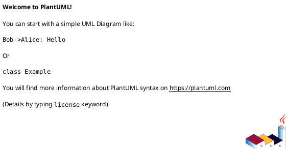

# 作業履歴 2017-03-18

## 概要

2017-03-18の作業内容をまとめています。

## コミット: ca2c3eb

### メッセージ

```
モデル間の関連付け #21
```

### 変更されたファイル

- M	README.md
- M	app/models/message.rb
- M	app/models/message_tag_link.rb
- M	app/models/tag.rb

### 変更内容

```diff
commit ca2c3eb4650d19e3eee9e35cf3659da8c061fe2c
Author: k2works <kakimomokuri@gmail.com>
Date:   Sat Mar 18 18:51:04 2017 +0900

    モデル間の関連付け #21

diff --git a/README.md b/README.md
index 5d17afe..480e469 100644
--- a/README.md
+++ b/README.md
@@ -771,6 +771,7 @@ git push heroku master
 
 #### メッセージのタグ付け
 + データベース設計
++ モデル間の関連付け
 
 #### 一意制約と排他的ロック
 #### 演習問題  
diff --git a/app/models/message.rb b/app/models/message.rb
index cade141..ecc8a44 100644
--- a/app/models/message.rb
+++ b/app/models/message.rb
@@ -35,6 +35,8 @@ class Message < ApplicationRecord
   belongs_to :staff_member
   belongs_to :root, class_name: 'Message', foreign_key: 'root_id'
   belongs_to :parent, class_name: 'Message', foreign_key: 'parent_id'
+  has_many :message_tag_links, dependent: :destroy
+  has_many :tags, -> { order(:value)}, through: :message_tag_links
 
   validates :subject, :body, presence: true
   validates :subject, length: { maximum: 80, allow_blank: true }
diff --git a/app/models/message_tag_link.rb b/app/models/message_tag_link.rb
index 2a52ae5..5b88619 100644
--- a/app/models/message_tag_link.rb
+++ b/app/models/message_tag_link.rb
@@ -14,4 +14,6 @@
 #
 
 class MessageTagLink < ApplicationRecord
+  belongs_to :message
+  belongs_to :tag
 end
diff --git a/app/models/tag.rb b/app/models/tag.rb
index c8071ee..2c83b3d 100644
--- a/app/models/tag.rb
+++ b/app/models/tag.rb
@@ -13,4 +13,6 @@
 #
 
 class Tag < ApplicationRecord
+  has_many :message_tag_links, dependent: :destroy
+  has_many :messages, through: :message_tag_links
 end

```

### 構造変更



## コミット: 3e42f39

### メッセージ

```
データベース設計 #21
```

### 変更されたファイル

- M	README.md
- M	app/models/customer_message.rb
- A	app/models/message_tag_link.rb
- M	app/models/staff_message.rb
- A	app/models/tag.rb
- A	db/migrate/20170318093346_create_tags.rb
- A	db/migrate/20170318093830_create_message_tag_links.rb
- M	db/schema.rb
- A	spec/factories/message_tag_links.rb
- A	spec/factories/tags.rb
- A	spec/models/message_tag_link_spec.rb
- A	spec/models/tag_spec.rb

### 変更内容

```diff
commit 3e42f393063a90bb58f016f74e1c4b031ee303de
Author: k2works <kakimomokuri@gmail.com>
Date:   Sat Mar 18 18:40:42 2017 +0900

    データベース設計 #21

diff --git a/README.md b/README.md
index 7097aa0..5d17afe 100644
--- a/README.md
+++ b/README.md
@@ -770,6 +770,8 @@ git push heroku master
 + 返信の送信
 
 #### メッセージのタグ付け
++ データベース設計
+
 #### 一意制約と排他的ロック
 #### 演習問題  
 
diff --git a/app/models/customer_message.rb b/app/models/customer_message.rb
index faeaa3f..ff7247a 100644
--- a/app/models/customer_message.rb
+++ b/app/models/customer_message.rb
@@ -1,3 +1,35 @@
+# == Schema Information
+#
+# Table name: messages # 問い合わせ
+#
+#  id              :integer          not null, primary key
+#  customer_id     :integer          not null
+#  staff_member_id :integer
+#  root_id         :integer                                   # Messageへの外部キー
+#  parent_id       :integer                                   # Messageへの外部キー
+#  type            :string(255)      not null                 # 継承カラム
+#  status          :string(255)      default("new"), not null # 状態（職員向け）
+#  subject         :string(255)      not null                 # 件名
+#  body            :text(65535)                               # 本文
+#  remarks         :text(65535)                               # 備考（職員向け）
+#  discarded       :boolean          default("0"), not null   # 顧客側の削除フラグ
+#  deleted         :boolean          default("0"), not null   # 職員側の削除フラグ
+#  created_at      :datetime         not null
+#  updated_at      :datetime         not null
+#
+# Indexes
+#
+#  fk_rails_aafcb31dbf                                         (parent_id)
+#  index_messages_on_c_d_s_c                                   (customer_id,deleted,status,created_at)
+#  index_messages_on_customer_id                               (customer_id)
+#  index_messages_on_customer_id_and_deleted_and_created_at    (customer_id,deleted,created_at)
+#  index_messages_on_customer_id_and_discarded_and_created_at  (customer_id,discarded,created_at)
+#  index_messages_on_root_id_and_deleted_and_created_at        (root_id,deleted,created_at)
+#  index_messages_on_staff_member_id                           (staff_member_id)
+#  index_messages_on_type_and_customer_id                      (type,customer_id)
+#  index_messages_on_type_and_staff_member_id                  (type,staff_member_id)
+#
+
 class CustomerMessage < Message
   scope :unprocessed, -> { where(status: 'new', deleted: false) }
-end
\ No newline at end of file
+end
diff --git a/app/models/message_tag_link.rb b/app/models/message_tag_link.rb
new file mode 100644
index 0000000..2a52ae5
--- /dev/null
+++ b/app/models/message_tag_link.rb
@@ -0,0 +1,17 @@
+# == Schema Information
+#
+# Table name: message_tag_links # タグリンクテーブル
+#
+#  id         :integer          not null, primary key
+#  message_id :integer          not null
+#  tag_id     :integer          not null
+#
+# Indexes
+#
+#  index_message_tag_links_on_message_id             (message_id)
+#  index_message_tag_links_on_message_id_and_tag_id  (message_id,tag_id) UNIQUE
+#  index_message_tag_links_on_tag_id                 (tag_id)
+#
+
+class MessageTagLink < ApplicationRecord
+end
diff --git a/app/models/staff_message.rb b/app/models/staff_message.rb
index 660acae..ae7b6ca 100644
--- a/app/models/staff_message.rb
+++ b/app/models/staff_message.rb
@@ -1,2 +1,34 @@
+# == Schema Information
+#
+# Table name: messages # 問い合わせ
+#
+#  id              :integer          not null, primary key
+#  customer_id     :integer          not null
+#  staff_member_id :integer
+#  root_id         :integer                                   # Messageへの外部キー
+#  parent_id       :integer                                   # Messageへの外部キー
+#  type            :string(255)      not null                 # 継承カラム
+#  status          :string(255)      default("new"), not null # 状態（職員向け）
+#  subject         :string(255)      not null                 # 件名
+#  body            :text(65535)                               # 本文
+#  remarks         :text(65535)                               # 備考（職員向け）
+#  discarded       :boolean          default("0"), not null   # 顧客側の削除フラグ
+#  deleted         :boolean          default("0"), not null   # 職員側の削除フラグ
+#  created_at      :datetime         not null
+#  updated_at      :datetime         not null
+#
+# Indexes
+#
+#  fk_rails_aafcb31dbf                                         (parent_id)
+#  index_messages_on_c_d_s_c                                   (customer_id,deleted,status,created_at)
+#  index_messages_on_customer_id                               (customer_id)
+#  index_messages_on_customer_id_and_deleted_and_created_at    (customer_id,deleted,created_at)
+#  index_messages_on_customer_id_and_discarded_and_created_at  (customer_id,discarded,created_at)
+#  index_messages_on_root_id_and_deleted_and_created_at        (root_id,deleted,created_at)
+#  index_messages_on_staff_member_id                           (staff_member_id)
+#  index_messages_on_type_and_customer_id                      (type,customer_id)
+#  index_messages_on_type_and_staff_member_id                  (type,staff_member_id)
+#
+
 class StaffMessage < Message
-end
\ No newline at end of file
+end
diff --git a/app/models/tag.rb b/app/models/tag.rb
new file mode 100644
index 0000000..c8071ee
--- /dev/null
+++ b/app/models/tag.rb
@@ -0,0 +1,16 @@
+# == Schema Information
+#
+# Table name: tags # タグ
+#
+#  id         :integer          not null, primary key
+#  value      :string(255)      not null
+#  created_at :datetime         not null
+#  updated_at :datetime         not null
+#
+# Indexes
+#
+#  index_tags_on_value  (value) UNIQUE
+#
+
+class Tag < ApplicationRecord
+end
diff --git a/db/migrate/20170318093346_create_tags.rb b/db/migrate/20170318093346_create_tags.rb
new file mode 100644
index 0000000..e991f75
--- /dev/null
+++ b/db/migrate/20170318093346_create_tags.rb
@@ -0,0 +1,10 @@
+class CreateTags < ActiveRecord::Migration[5.0]
+  def change
+    create_table :tags,comment:'タグ' do |t|
+      t.string :value, null: false, commet:'タグ値'
+      t.timestamps
+    end
+
+    add_index :tags, :value, unique:true
+  end
+end
diff --git a/db/migrate/20170318093830_create_message_tag_links.rb b/db/migrate/20170318093830_create_message_tag_links.rb
new file mode 100644
index 0000000..76e5255
--- /dev/null
+++ b/db/migrate/20170318093830_create_message_tag_links.rb
@@ -0,0 +1,10 @@
+class CreateMessageTagLinks < ActiveRecord::Migration[5.0]
+  def change
+    create_table :message_tag_links,comment:'タグリンクテーブル' do |t|
+      t.references :message, null: false
+      t.references :tag, null: false
+    end
+
+    add_index :message_tag_links, [ :message_id, :tag_id ], unique: true
+  end
+end
diff --git a/db/schema.rb b/db/schema.rb
index 35e4f1c..1086b9a 100644
--- a/db/schema.rb
+++ b/db/schema.rb
@@ -10,7 +10,7 @@
 #
 # It's strongly recommended that you check this file into your version control system.
 
-ActiveRecord::Schema.define(version: 20170318002915) do
+ActiveRecord::Schema.define(version: 20170318093830) do
 
   create_table "addresses", force: :cascade, comment: "住所" do |t|
     t.integer  "customer_id",                null: false, comment: "顧客への外部キー"
@@ -96,6 +96,14 @@ ActiveRecord::Schema.define(version: 20170318002915) do
     t.index ["program_id"], name: "index_entries_on_program_id", using: :btree
   end
 
+  create_table "message_tag_links", force: :cascade, comment: "タグリンクテーブル" do |t|
+    t.integer "message_id", null: false
+    t.integer "tag_id",     null: false
+    t.index ["message_id", "tag_id"], name: "index_message_tag_links_on_message_id_and_tag_id", unique: true, using: :btree
+    t.index ["message_id"], name: "index_message_tag_links_on_message_id", using: :btree
+    t.index ["tag_id"], name: "index_message_tag_links_on_tag_id", using: :btree
+  end
+
   create_table "messages", force: :cascade, comment: "問い合わせ" do |t|
     t.integer  "customer_id",                                   null: false
     t.integer  "staff_member_id"
@@ -176,6 +184,13 @@ ActiveRecord::Schema.define(version: 20170318002915) do
     t.index ["family_name_kana", "given_name_kana"], name: "index_staff_members_on_family_name_kana_and_given_name_kana", using: :btree
   end
 
+  create_table "tags", force: :cascade, comment: "タグ" do |t|
+    t.string   "value",      null: false
+    t.datetime "created_at", null: false
+    t.datetime "updated_at", null: false
+    t.index ["value"], name: "index_tags_on_value", unique: true, using: :btree
+  end
+
   add_foreign_key "addresses", "customers"
   add_foreign_key "entries", "customers"
   add_foreign_key "entries", "programs"
diff --git a/spec/factories/message_tag_links.rb b/spec/factories/message_tag_links.rb
new file mode 100644
index 0000000..013cedc
--- /dev/null
+++ b/spec/factories/message_tag_links.rb
@@ -0,0 +1,20 @@
+# == Schema Information
+#
+# Table name: message_tag_links # タグリンクテーブル
+#
+#  id         :integer          not null, primary key
+#  message_id :integer          not null
+#  tag_id     :integer          not null
+#
+# Indexes
+#
+#  index_message_tag_links_on_message_id             (message_id)
+#  index_message_tag_links_on_message_id_and_tag_id  (message_id,tag_id) UNIQUE
+#  index_message_tag_links_on_tag_id                 (tag_id)
+#
+
+FactoryGirl.define do
+  factory :message_tag_link do
+    
+  end
+end
diff --git a/spec/factories/tags.rb b/spec/factories/tags.rb
new file mode 100644
index 0000000..32a0e92
--- /dev/null
+++ b/spec/factories/tags.rb
@@ -0,0 +1,19 @@
+# == Schema Information
+#
+# Table name: tags # タグ
+#
+#  id         :integer          not null, primary key
+#  value      :string(255)      not null
+#  created_at :datetime         not null
+#  updated_at :datetime         not null
+#
+# Indexes
+#
+#  index_tags_on_value  (value) UNIQUE
+#
+
+FactoryGirl.define do
+  factory :tag do
+    
+  end
+end
diff --git a/spec/models/message_tag_link_spec.rb b/spec/models/message_tag_link_spec.rb
new file mode 100644
index 0000000..224b8c3
--- /dev/null
+++ b/spec/models/message_tag_link_spec.rb
@@ -0,0 +1,20 @@
+# == Schema Information
+#
+# Table name: message_tag_links # タグリンクテーブル
+#
+#  id         :integer          not null, primary key
+#  message_id :integer          not null
+#  tag_id     :integer          not null
+#
+# Indexes
+#
+#  index_message_tag_links_on_message_id             (message_id)
+#  index_message_tag_links_on_message_id_and_tag_id  (message_id,tag_id) UNIQUE
+#  index_message_tag_links_on_tag_id                 (tag_id)
+#
+
+require 'rails_helper'
+
+RSpec.describe MessageTagLink, type: :model do
+  pending "add some examples to (or delete) #{__FILE__}"
+end
diff --git a/spec/models/tag_spec.rb b/spec/models/tag_spec.rb
new file mode 100644
index 0000000..08d9a3a
--- /dev/null
+++ b/spec/models/tag_spec.rb
@@ -0,0 +1,19 @@
+# == Schema Information
+#
+# Table name: tags # タグ
+#
+#  id         :integer          not null, primary key
+#  value      :string(255)      not null
+#  created_at :datetime         not null
+#  updated_at :datetime         not null
+#
+# Indexes
+#
+#  index_tags_on_value  (value) UNIQUE
+#
+
+require 'rails_helper'
+
+RSpec.describe Tag, type: :model do
+  pending "add some examples to (or delete) #{__FILE__}"
+end

```

### 構造変更


## コミット: 47d7d65

### メッセージ

```
返信の送信 #21
```

### 変更されたファイル

- M	README.md
- M	app/controllers/staff/replies_controller.rb
- M	app/models/message.rb
- M	config/locales/controllers/ja.yml

### 変更内容

```diff
commit 47d7d658bfbf1c3fddcf2909da1b4f4b0a79f676
Author: k2works <kakimomokuri@gmail.com>
Date:   Sat Mar 18 18:31:28 2017 +0900

    返信の送信 #21

diff --git a/README.md b/README.md
index 00aa21c..7097aa0 100644
--- a/README.md
+++ b/README.md
@@ -767,6 +767,7 @@ git push heroku master
 + リンクの設置
 + 返信内容編集フォーム
 + 確認画面
++ 返信の送信
 
 #### メッセージのタグ付け
 #### 一意制約と排他的ロック
diff --git a/app/controllers/staff/replies_controller.rb b/app/controllers/staff/replies_controller.rb
index ca1f722..c7c7798 100644
--- a/app/controllers/staff/replies_controller.rb
+++ b/app/controllers/staff/replies_controller.rb
@@ -16,6 +16,23 @@ class Staff::RepliesController < Staff::Base
     end
   end
 
+  def create
+    @reply = StaffMessage.new(staff_message_params)
+    if params[:commit]
+      @reply.staff_member = current_staff_member
+      @reply.parent = @message
+      if @reply.save
+        flash.notice = t('.flash_notice')
+        redirect_to :outbound_staff_messages
+      else
+        flash.now.alert = t('.flash_alert')
+        render action: 'new'
+      end
+    else
+      render action: 'new'
+    end
+  end
+
   private
   def prepare_message
     @message = CustomerMessage.find(params[:message_id])
diff --git a/app/models/message.rb b/app/models/message.rb
index 4525b64..cade141 100644
--- a/app/models/message.rb
+++ b/app/models/message.rb
@@ -49,6 +49,13 @@ class Message < ApplicationRecord
 
   default_scope { order(created_at: :desc) }
 
+  before_validation do
+    if parent
+      self.root = parent.root || parent
+      self.customer = parent.customer
+    end
+  end
+
   attr_accessor :child_nodes
 
   def tree
diff --git a/config/locales/controllers/ja.yml b/config/locales/controllers/ja.yml
index 02399aa..a67b2aa 100644
--- a/config/locales/controllers/ja.yml
+++ b/config/locales/controllers/ja.yml
@@ -46,9 +46,12 @@ ja:
     messages:
       destroy:
         flash_notice: '問い合わせを削除しました。'
-    replieds:
+    replies:
       confirm:
         flash_notice: '入力に誤りがあります。'
+      create:
+        flash_notice: '問い合わせに返信しました。'
+        flash_alert: '入力に誤りがあります。'
 
   admin:
     base:

```

### 構造変更


## コミット: 8535a3b

### メッセージ

```
確認画面 #21
```

### 変更されたファイル

- M	README.md
- M	app/controllers/staff/replies_controller.rb
- A	app/views/staff/replies/_confirming_form.html.erb
- A	app/views/staff/replies/confirm.html.erb
- M	config/locales/controllers/ja.yml
- M	config/locales/views/ja.yml

### 変更内容

```diff
commit 8535a3b1dac2be6760952ade76335f6f871121c2
Author: k2works <kakimomokuri@gmail.com>
Date:   Sat Mar 18 18:20:32 2017 +0900

    確認画面 #21

diff --git a/README.md b/README.md
index d45a644..00aa21c 100644
--- a/README.md
+++ b/README.md
@@ -766,6 +766,7 @@ git push heroku master
 + ルーティング
 + リンクの設置
 + 返信内容編集フォーム
++ 確認画面
 
 #### メッセージのタグ付け
 #### 一意制約と排他的ロック
diff --git a/app/controllers/staff/replies_controller.rb b/app/controllers/staff/replies_controller.rb
index 108446e..ca1f722 100644
--- a/app/controllers/staff/replies_controller.rb
+++ b/app/controllers/staff/replies_controller.rb
@@ -5,8 +5,26 @@ class Staff::RepliesController < Staff::Base
     @reply = StaffMessage.new
   end
 
+  # POST
+  def confirm
+    @reply = StaffMessage.new(staff_message_params)
+    if @reply.valid?
+      render action: 'confirm'
+    else
+      flash.now.alert = t('.flash_notice')
+      render action: 'new'
+    end
+  end
+
   private
   def prepare_message
     @message = CustomerMessage.find(params[:message_id])
   end
+
+  def staff_message_params
+    params.require(:staff_message).permit(
+        :subject,
+        :body
+    )
+  end
 end
diff --git a/app/views/staff/replies/_confirming_form.html.erb b/app/views/staff/replies/_confirming_form.html.erb
new file mode 100644
index 0000000..0565e90
--- /dev/null
+++ b/app/views/staff/replies/_confirming_form.html.erb
@@ -0,0 +1,6 @@
+<%= markup(:div, id: 'confirming-panel') do |m|
+  p = ConfirmingFormPresenter.new(f, self)
+  m.div t('staff.replies.confirm.confirm_message')
+  m << p.text_field_block(:subject, t('activerecord.attributes.message.subject'))
+  m << p.text_area_block(:body, t('activerecord.attributes.message.body'))
+end %>
\ No newline at end of file
diff --git a/app/views/staff/replies/confirm.html.erb b/app/views/staff/replies/confirm.html.erb
new file mode 100644
index 0000000..a487e66
--- /dev/null
+++ b/app/views/staff/replies/confirm.html.erb
@@ -0,0 +1,18 @@
+<% @title = t('.title') %>
+<section class="Section">
+  <h1 class="Staff__title"><%= @title %></h1>
+</section>
+
+<section class="Section l-column AppForm">
+  <div class="AppForm__generic-form StaffAppForm__generic-form AppForm__customer-form">
+    <%= bootstrap_form_for @reply, url: staff_message_reply_path(@message) do |f| %>
+        <%= render 'confirming_form', f: f %>
+        <div class="AppForm__buttons">
+          <%= f.submit t('.send'),class: 'btn btn-default btn-lg' %>
+          <%= f.submit t('.correct'), name: 'correct', class: 'btn btn-default btn-lg' %>
+          <%= link_to t('.cancel'), :staff_messages, class: 'btn btn-default btn-lg' %>
+        </div>
+    <% end %>
+    <%= render 'message' %>
+  </div>
+</section>
\ No newline at end of file
diff --git a/config/locales/controllers/ja.yml b/config/locales/controllers/ja.yml
index 47e8297..02399aa 100644
--- a/config/locales/controllers/ja.yml
+++ b/config/locales/controllers/ja.yml
@@ -46,6 +46,9 @@ ja:
     messages:
       destroy:
         flash_notice: '問い合わせを削除しました。'
+    replieds:
+      confirm:
+        flash_notice: '入力に誤りがあります。'
 
   admin:
     base:
diff --git a/config/locales/views/ja.yml b/config/locales/views/ja.yml
index e69869c..f2a92dd 100644
--- a/config/locales/views/ja.yml
+++ b/config/locales/views/ja.yml
@@ -187,7 +187,12 @@ ja:
         sender: '送信者'
         subject: '件名'
         created_at: '作成日時'
-
+      confirm:
+        title: '問い合わせへの返信（確認）'
+        send: '送信'
+        correct: '訂正'
+        cancel: 'キャンセル'
+        confirm_message: '以下の内容で返信します。よろしいですか？'
 
   admin:
     shared:

```

### 構造変更


## コミット: 484df9b

### メッセージ

```
返信内容編集フォーム #21
```

### 変更されたファイル

- M	README.md
- A	app/controllers/staff/replies_controller.rb
- A	app/views/staff/replies/_form.html.erb
- A	app/views/staff/replies/_message.erb
- A	app/views/staff/replies/new.html.erb
- M	config/locales/views/ja.yml

### 変更内容

```diff
commit 484df9baf5c070f5bcf5bda2e48959774d5e7c6b
Author: k2works <kakimomokuri@gmail.com>
Date:   Sat Mar 18 17:57:16 2017 +0900

    返信内容編集フォーム #21

diff --git a/README.md b/README.md
index 5a9fb6a..d45a644 100644
--- a/README.md
+++ b/README.md
@@ -765,6 +765,7 @@ git push heroku master
 #### 問い合わせの返信機能
 + ルーティング
 + リンクの設置
++ 返信内容編集フォーム
 
 #### メッセージのタグ付け
 #### 一意制約と排他的ロック
diff --git a/app/controllers/staff/replies_controller.rb b/app/controllers/staff/replies_controller.rb
new file mode 100644
index 0000000..108446e
--- /dev/null
+++ b/app/controllers/staff/replies_controller.rb
@@ -0,0 +1,12 @@
+class Staff::RepliesController < Staff::Base
+  before_action :prepare_message
+
+  def new
+    @reply = StaffMessage.new
+  end
+
+  private
+  def prepare_message
+    @message = CustomerMessage.find(params[:message_id])
+  end
+end
diff --git a/app/views/staff/replies/_form.html.erb b/app/views/staff/replies/_form.html.erb
new file mode 100644
index 0000000..a678e0b
--- /dev/null
+++ b/app/views/staff/replies/_form.html.erb
@@ -0,0 +1,11 @@
+<%= markup do |m|
+  p = FormPresenter.new(f, self)
+  p.with_options(required: true) do |q|
+    m << q.text_field_block(:subject, t('activerecord.attributes.message.subject'), size: 40, maxlength: 80)
+    m.div(class: 'AppForm__input-block') do |m|
+      m << q.decorated_label(:body, t('activerecord.attributes.message.body'))
+      m << q.text_area(:body, rows: 6, style: 'widh: 45px')
+      m.span '(800文字以内)', class: 'instruction', style: 'float: rigth'
+    end
+  end
+end %>
\ No newline at end of file
diff --git a/app/views/staff/replies/_message.erb b/app/views/staff/replies/_message.erb
new file mode 100644
index 0000000..fbbb693
--- /dev/null
+++ b/app/views/staff/replies/_message.erb
@@ -0,0 +1,11 @@
+<% p = Staff::MessagePresenter.new(@message, self) %>
+<section class="Section l-column Table StaffTable">
+  <table class="Table__body Table__body--attributes StaffTable__body">
+    <% p = Staff::MessagePresenter.new(@message, self) %>
+    <tr class="Table__tr"><th class="Table__th"><%= t('staff.replies.new.sender') %></th><td><%= p.sender %></td></tr>
+    <tr class="Table__tr"><th class="Table__th"><%= t('staff.replies.new.subject') %></th><td><%= p.subject %></td></tr>
+    <tr class="Table__tr"><th class="Table__th"><%= t('staff.replies.new.created_at') %></th><td class="Table__td--date"><%= p.created_at %></td></tr>
+  </table>
+
+  <div class="Table__body--description"><%= p.formatted_body %></div>
+</section>
\ No newline at end of file
diff --git a/app/views/staff/replies/new.html.erb b/app/views/staff/replies/new.html.erb
new file mode 100644
index 0000000..0fbbe43
--- /dev/null
+++ b/app/views/staff/replies/new.html.erb
@@ -0,0 +1,17 @@
+<% @title = t('staff.replies.new.title') %>
+<section class="Section">
+  <h1 class="Staff__title"><%= @title %></h1>
+</section>
+
+<section class="Section l-column AppForm">
+  <div class="AppForm__generic-form StaffAppForm__generic-form AppForm__customer-form">
+    <%= bootstrap_form_for @reply, url: confirm_staff_message_reply_path(@message) do |f| %>
+        <%= render 'form', f: f %>
+        <div class="AppForm__buttons">
+          <%= f.submit t('staff.replies.new.confirm') ,class: 'btn btn-default btn-lg'%>
+          <%= link_to t('staff.replies.new.cancel'), :staff_programs ,class: 'btn btn-default btn-lg'%>
+        </div>
+    <% end %>
+    <%= render 'message' %>
+  </div>
+</section>
diff --git a/config/locales/views/ja.yml b/config/locales/views/ja.yml
index ba71b60..e69869c 100644
--- a/config/locales/views/ja.yml
+++ b/config/locales/views/ja.yml
@@ -179,6 +179,15 @@ ja:
         subject: '件名'
         created_at: '作成日時'
         reply: '返信する'
+    replies:
+      new:
+        title: '問い合わせへの返信'
+        confirm: '確認画面用へ進む'
+        cancel: 'キャンセル'
+        sender: '送信者'
+        subject: '件名'
+        created_at: '作成日時'
+
 
   admin:
     shared:

```

### 構造変更


## コミット: 1b76fe5

### メッセージ

```
リンクの設置 #21
```

### 変更されたファイル

- M	README.md
- M	app/views/staff/messages/show.html.erb
- M	config/locales/views/ja.yml

### 変更内容

```diff
commit 1b76fe5035535ccb762b72acd9a5fa1e7346d9cf
Author: k2works <kakimomokuri@gmail.com>
Date:   Sat Mar 18 17:29:04 2017 +0900

    リンクの設置 #21

diff --git a/README.md b/README.md
index 22de8f3..5a9fb6a 100644
--- a/README.md
+++ b/README.md
@@ -764,6 +764,7 @@ git push heroku master
 ### タグ付け
 #### 問い合わせの返信機能
 + ルーティング
++ リンクの設置
 
 #### メッセージのタグ付け
 #### 一意制約と排他的ロック
diff --git a/app/views/staff/messages/show.html.erb b/app/views/staff/messages/show.html.erb
index 3365cf5..bfc7d1a 100644
--- a/app/views/staff/messages/show.html.erb
+++ b/app/views/staff/messages/show.html.erb
@@ -5,6 +5,11 @@
 
 <section class="Section l-column Table StaffTable">
   <table class="Table__body Table__body--attributes StaffTable__body">
+    <% if @message.kind_of?(CustomerMessage) %>
+        <div class="Table__links">
+          <%= link_to t('.reply'), new_staff_message_reply_path(@message), class:'btn btn-default' %>
+        </div>
+    <% end %>
     <% p = Staff::MessagePresenter.new(@message, self) %>
     <tr class="Table__tr"><th class="Table__th"><%= t('.type') %></th><td><%= p.type %></td></tr>
     <tr class="Table__tr"><th class="Table__th"><%= t('.sender') %></th><td><%= p.sender %></td></tr>
diff --git a/config/locales/views/ja.yml b/config/locales/views/ja.yml
index 3151807..ba71b60 100644
--- a/config/locales/views/ja.yml
+++ b/config/locales/views/ja.yml
@@ -178,6 +178,7 @@ ja:
         receiver: '受信者'
         subject: '件名'
         created_at: '作成日時'
+        reply: '返信する'
 
   admin:
     shared:

```

## コミット: 64e42d9

### メッセージ

```
ルーティング #21
```

### 変更されたファイル

- M	README.md
- M	config/routes.rb

### 変更内容

```diff
commit 64e42d9f1448a40d1e1357ee96a5ea5d8f300080
Author: k2works <kakimomokuri@gmail.com>
Date:   Sat Mar 18 17:23:44 2017 +0900

    ルーティング #21

diff --git a/README.md b/README.md
index e813d90..22de8f3 100644
--- a/README.md
+++ b/README.md
@@ -763,6 +763,8 @@ git push heroku master
 
 ### タグ付け
 #### 問い合わせの返信機能
++ ルーティング
+
 #### メッセージのタグ付け
 #### 一意制約と排他的ロック
 #### 演習問題  
diff --git a/config/routes.rb b/config/routes.rb
index c0f31c5..089b548 100644
--- a/config/routes.rb
+++ b/config/routes.rb
@@ -35,6 +35,9 @@
 #         outbound_staff_messages GET    /staff/messages/outbound(.:format)                   staff/messages#outbound {:host=>"0.0.0.0"}
 #          deleted_staff_messages GET    /staff/messages/deleted(.:format)                    staff/messages#deleted {:host=>"0.0.0.0"}
 #            count_staff_messages GET    /staff/messages/count(.:format)                      staff/messages#count {:host=>"0.0.0.0"}
+#     confirm_staff_message_reply POST   /staff/messages/:message_id/reply/confirm(.:format)  staff/replies#confirm {:host=>"0.0.0.0"}
+#         new_staff_message_reply GET    /staff/messages/:message_id/reply/new(.:format)      staff/replies#new {:host=>"0.0.0.0"}
+#             staff_message_reply POST   /staff/messages/:message_id/reply(.:format)          staff/replies#create {:host=>"0.0.0.0"}
 #                  staff_messages GET    /staff/messages(.:format)                            staff/messages#index {:host=>"0.0.0.0"}
 #                   staff_message GET    /staff/messages/:id(.:format)                        staff/messages#show {:host=>"0.0.0.0"}
 #                                 DELETE /staff/messages/:id(.:format)                        staff/messages#destroy {:host=>"0.0.0.0"}
@@ -100,6 +103,9 @@ Rails.application.routes.draw do
       end
       resources :messages, only: [ :index, :show, :destroy ] do
         get :inbound, :outbound, :deleted, :count, on: :collection
+        resource :reply, only: [ :new, :create ] do
+          post :confirm
+        end
       end
     end
   end

```

## コミット: e44b817

### メッセージ

```
問い合わせの削除 #22
```

### 変更されたファイル

- M	README.md
- M	app/controllers/staff/messages_controller.rb
- M	config/locales/controllers/ja.yml

### 変更内容

```diff
commit e44b81757b72b71042af403569e0cfe08db9c946
Author: k2works <kakimomokuri@gmail.com>
Date:   Sat Mar 18 17:14:24 2017 +0900

    問い合わせの削除 #22

diff --git a/README.md b/README.md
index 613fd7f..e813d90 100644
--- a/README.md
+++ b/README.md
@@ -751,6 +751,7 @@ git push heroku master
 + メッセージ一覧
 + シードデータの投入
 + 動作確認
++ 問い合わせの削除
 
 #### メッセージツリーの表示
 + showアクション
diff --git a/app/controllers/staff/messages_controller.rb b/app/controllers/staff/messages_controller.rb
index 86d1289..641ebf1 100644
--- a/app/controllers/staff/messages_controller.rb
+++ b/app/controllers/staff/messages_controller.rb
@@ -31,4 +31,11 @@ class Staff::MessagesController < Staff::Base
   def show
     @message = Message.find(params[:id])
   end
+
+  def destroy
+    message = CustomerMessage.find(params[:id])
+    message.update_column(:deleted, true)
+    flash.notice = t('.flash_notice')
+    redirect_to :back
+  end
 end
diff --git a/config/locales/controllers/ja.yml b/config/locales/controllers/ja.yml
index 239cdf9..47e8297 100644
--- a/config/locales/controllers/ja.yml
+++ b/config/locales/controllers/ja.yml
@@ -43,6 +43,10 @@ ja:
         flash_alert: 'このプログラムは削除できません。'
       entries:
         flash_notice: 'プログラム申し込みのフラグを更新しました。'
+    messages:
+      destroy:
+        flash_notice: '問い合わせを削除しました。'
+
   admin:
     base:
       authrize:

```

### 構造変更


## コミット: b1895a9

### メッセージ

```
ツリー構造 #22
```

### 変更されたファイル

- M	app/views/staff/top/index.html.erb

### 変更内容

```diff
commit b1895a936b13eb32694273f77159f8e60e5f823b
Author: k2works <kakimomokuri@gmail.com>
Date:   Sat Mar 18 17:02:26 2017 +0900

    ツリー構造 #22

diff --git a/app/views/staff/top/index.html.erb b/app/views/staff/top/index.html.erb
index 6890631..5677faf 100644
--- a/app/views/staff/top/index.html.erb
+++ b/app/views/staff/top/index.html.erb
@@ -8,6 +8,10 @@
     <h2 class="sectionLabel">お知らせ</h2>
   </div>
   <ol class="NewsList">
+    <li class="NewsList__item">
+      <time class="NewsList__head" datatime="2017-3-18">2017.3.18</time>
+      <span class="NewsList__body">問い合わせの一覧表示と削除機能を追加</span>
+    </li>
     <li class="NewsList__item">
       <time class="NewsList__head" datatime="2017-3-18">2017.3.18</time>
       <span class="NewsList__body">問い合わせ到着の通知機能を追加</span>

```

## コミット: 9c9e2cd

### メッセージ

```
パフォーマンスの向上策 #22
```

### 変更されたファイル

- M	README.md
- A	app/lib/simple_tree.rb
- M	app/models/message.rb
- M	app/presenters/staff/message_presenter.rb

### 変更内容

```diff
commit 9c9e2cd25c2b965cfb03c4c5d378dff0680e2c29
Author: k2works <kakimomokuri@gmail.com>
Date:   Sat Mar 18 17:00:08 2017 +0900

    パフォーマンスの向上策 #22

diff --git a/README.md b/README.md
index d66ebbd..613fd7f 100644
--- a/README.md
+++ b/README.md
@@ -758,6 +758,7 @@ git push heroku master
 
 #### パフォーマンスチューニング
 + パフォーマンスの計測
++ パフォーマンスの向上策
 
 ### タグ付け
 #### 問い合わせの返信機能
diff --git a/app/lib/simple_tree.rb b/app/lib/simple_tree.rb
new file mode 100644
index 0000000..dfecf20
--- /dev/null
+++ b/app/lib/simple_tree.rb
@@ -0,0 +1,18 @@
+class SimpleTree
+  attr_reader :root, :nodes
+
+  def initialize(root, descendants)
+    @root = root
+    @descendants = descendants
+
+    @nodes = {}
+    ([ @root ] + @descendants).each do |d|
+      d.child_nodes = []
+      @nodes[d.id] = d
+    end
+
+    @descendants.each do |d|
+      @nodes[d.parent_id].child_nodes << @nodes[d.id]
+    end
+  end
+end
\ No newline at end of file
diff --git a/app/models/message.rb b/app/models/message.rb
index 32ce378..4525b64 100644
--- a/app/models/message.rb
+++ b/app/models/message.rb
@@ -35,7 +35,6 @@ class Message < ApplicationRecord
   belongs_to :staff_member
   belongs_to :root, class_name: 'Message', foreign_key: 'root_id'
   belongs_to :parent, class_name: 'Message', foreign_key: 'parent_id'
-  has_many :children, class_name: 'Message', foreign_key: 'parent_id'
 
   validates :subject, :body, presence: true
   validates :subject, length: { maximum: 80, allow_blank: true }
@@ -49,4 +48,13 @@ class Message < ApplicationRecord
   end
 
   default_scope { order(created_at: :desc) }
+
+  attr_accessor :child_nodes
+
+  def tree
+    return @tree if @tree
+    r = root || self
+    messages = Message.where(root_id: r.id).select(:id, :parent_id, :subject)
+    @tree = SimpleTree.new(r,messages)
+  end
 end
diff --git a/app/presenters/staff/message_presenter.rb b/app/presenters/staff/message_presenter.rb
index 98c5a29..0a77e7d 100644
--- a/app/presenters/staff/message_presenter.rb
+++ b/app/presenters/staff/message_presenter.rb
@@ -53,7 +53,7 @@ class Staff::MessagePresenter < ModelPresenter
   end
 
   def tree
-    expand(object.root || object)
+    expand(object.tree.root)
   end
 
   private
@@ -65,7 +65,7 @@ class Staff::MessagePresenter < ModelPresenter
         else
           m << link_to(node.subject, view_context.staff_message_path(node))
         end
-        node.children.each do |c|
+        node.child_nodes.each do |c|
           m << expand(c)
         end
       end

```

### 構造変更


## コミット: 73d442a

### メッセージ

```
パフォーマンスの計測 #22
```

### 変更されたファイル

- M	README.md
- M	spec/factories/messages.rb
- A	spec/features/staff/message_management_spec.rb

### 変更内容

```diff
commit 73d442a1574a2bdc6e2c6509948fbdba0ce34885
Author: k2works <kakimomokuri@gmail.com>
Date:   Sat Mar 18 16:45:22 2017 +0900

    パフォーマンスの計測 #22

diff --git a/README.md b/README.md
index be02577..d66ebbd 100644
--- a/README.md
+++ b/README.md
@@ -756,6 +756,9 @@ git push heroku master
 + showアクション
 + メッセージツリーの表示
 
+#### パフォーマンスチューニング
++ パフォーマンスの計測
+
 ### タグ付け
 #### 問い合わせの返信機能
 #### メッセージのタグ付け
diff --git a/spec/factories/messages.rb b/spec/factories/messages.rb
index d0bec84..374c483 100644
--- a/spec/factories/messages.rb
+++ b/spec/factories/messages.rb
@@ -31,7 +31,16 @@
 #
 
 FactoryGirl.define do
-  factory :message do
-    
+  factory :customer_message do
+    subject 'Subject'
+    body "Body.\nBody."
+    customer
+  end
+
+  factory :staff_message do
+    subject 'Subject'
+    body "Body.\nBody."
+    parent { FactoryGirl.create(:customer_message)}
+    staff_member
   end
 end
diff --git a/spec/features/staff/message_management_spec.rb b/spec/features/staff/message_management_spec.rb
new file mode 100644
index 0000000..763d243
--- /dev/null
+++ b/spec/features/staff/message_management_spec.rb
@@ -0,0 +1,34 @@
+require 'rails_helper'
+
+feature 'メッセージ管理機能' do
+  include FeaturesSpecHelper
+  include PerformanceSpecHelper
+  let(:staff_member) { create(:staff_member) }
+  let!(:root_message) { create(:customer_message, subject: 'Hello') }
+  let!(:reply1) { create(:staff_message, parent: root_message) }
+  let!(:message1) { create(:customer_message, parent: reply1) }
+  let!(:message2) { create(:customer_message, parent: reply1) }
+  let!(:reply2) { create(:staff_message, parent: message1) }
+  let!(:reply3) { create(:staff_message, parent: message1) }
+  let!(:message3) { create(:customer_message, parent: reply3) }
+
+  before do
+    switch_namespace(:staff)
+    login_as_staff_member(staff_member)
+  end
+
+  scenario 'メッセージツリーの表示', :performance do |example|
+    visit staff_message_path(message1)
+    expect(page).to have_css('h1', text: 'メッセージ詳細')
+    expect(page).to have_css('li a', text: 'Hello')
+
+    elapsed = Benchmark.realtime do
+      100.times do
+        visit staff_message_path(message1)
+      end
+    end
+
+    write_to_performance_log(example, elapsed)
+    expect(elapsed).to be < 100.0
+  end
+end
\ No newline at end of file

```

## コミット: b579141

### メッセージ

```
メッセージツリーの表示 #22
```

### 変更されたファイル

- M	README.md
- M	app/models/message.rb
- M	app/presenters/staff/message_presenter.rb
- M	app/views/staff/messages/show.html.erb
- M	db/seed/development/messages.rb

### 変更内容

```diff
commit b579141e185c625df0f56e486bffdd3c6b001090
Author: k2works <kakimomokuri@gmail.com>
Date:   Sat Mar 18 16:21:06 2017 +0900

    メッセージツリーの表示 #22

diff --git a/README.md b/README.md
index 30f1daa..be02577 100644
--- a/README.md
+++ b/README.md
@@ -754,6 +754,7 @@ git push heroku master
 
 #### メッセージツリーの表示
 + showアクション
++ メッセージツリーの表示
 
 ### タグ付け
 #### 問い合わせの返信機能
diff --git a/app/models/message.rb b/app/models/message.rb
index aa3668f..32ce378 100644
--- a/app/models/message.rb
+++ b/app/models/message.rb
@@ -35,6 +35,7 @@ class Message < ApplicationRecord
   belongs_to :staff_member
   belongs_to :root, class_name: 'Message', foreign_key: 'root_id'
   belongs_to :parent, class_name: 'Message', foreign_key: 'parent_id'
+  has_many :children, class_name: 'Message', foreign_key: 'parent_id'
 
   validates :subject, :body, presence: true
   validates :subject, length: { maximum: 80, allow_blank: true }
diff --git a/app/presenters/staff/message_presenter.rb b/app/presenters/staff/message_presenter.rb
index ff22f25..98c5a29 100644
--- a/app/presenters/staff/message_presenter.rb
+++ b/app/presenters/staff/message_presenter.rb
@@ -51,4 +51,24 @@ class Staff::MessagePresenter < ModelPresenter
   def formatted_body
     ERB::Util.html_escape(body).gsub(/\n/, '<br />').html_safe
   end
+
+  def tree
+    expand(object.root || object)
+  end
+
+  private
+  def expand(node)
+    markup(:ul) do |m|
+      m.li do
+        if node.id == object.id
+          m.strong(node.subject)
+        else
+          m << link_to(node.subject, view_context.staff_message_path(node))
+        end
+        node.children.each do |c|
+          m << expand(c)
+        end
+      end
+    end
+  end
 end
\ No newline at end of file
diff --git a/app/views/staff/messages/show.html.erb b/app/views/staff/messages/show.html.erb
index b87136d..3365cf5 100644
--- a/app/views/staff/messages/show.html.erb
+++ b/app/views/staff/messages/show.html.erb
@@ -13,5 +13,6 @@
     <tr class="Table__tr"><th class="Table__th"><%= t('.created_at') %></th><td class="Table__td--date"><%= p.created_at %></td></tr>
   </table>
 
+  <div class="tree"><%= p.tree %></div>
   <div class="Table__body--description"><%= p.formatted_body %></div>
 </section>
\ No newline at end of file
diff --git a/db/seed/development/messages.rb b/db/seed/development/messages.rb
index c3e3d2c..f4e81cb 100644
--- a/db/seed/development/messages.rb
+++ b/db/seed/development/messages.rb
@@ -6,7 +6,7 @@ s = 2.years.ago
   m = CustomerMessage.create!(
                          customer: customers.sample,
                          subject: 'これは問い合わせです。' * 4,
-                         body: 'これは問い合わせです。\n' * 8,
+                         body: "これは問い合わせです。\n" * 8,
                          created_at: s.advance(months: n)
   )
   r = StaffMessage.create!(

```

### 構造変更


## コミット: 17e096b

### メッセージ

```
showアクション #22
```

### 変更されたファイル

- M	README.md
- M	app/controllers/staff/messages_controller.rb
- M	app/presenters/staff/message_presenter.rb
- M	app/views/staff/messages/index.html.erb
- A	app/views/staff/messages/show.html.erb
- M	config/locales/views/ja.yml

### 変更内容

```diff
commit 17e096bfa82f0c9d4ad22ed948c384c46c924201
Author: k2works <kakimomokuri@gmail.com>
Date:   Sat Mar 18 16:05:15 2017 +0900

    showアクション #22

diff --git a/README.md b/README.md
index 5697be0..30f1daa 100644
--- a/README.md
+++ b/README.md
@@ -753,6 +753,7 @@ git push heroku master
 + 動作確認
 
 #### メッセージツリーの表示
++ showアクション
 
 ### タグ付け
 #### 問い合わせの返信機能
diff --git a/app/controllers/staff/messages_controller.rb b/app/controllers/staff/messages_controller.rb
index 22550ac..86d1289 100644
--- a/app/controllers/staff/messages_controller.rb
+++ b/app/controllers/staff/messages_controller.rb
@@ -27,4 +27,8 @@ class Staff::MessagesController < Staff::Base
   def count
     render text: CustomerMessage.unprocessed.count
   end
+
+  def show
+    @message = Message.find(params[:id])
+  end
 end
diff --git a/app/presenters/staff/message_presenter.rb b/app/presenters/staff/message_presenter.rb
index b342ebd..ff22f25 100644
--- a/app/presenters/staff/message_presenter.rb
+++ b/app/presenters/staff/message_presenter.rb
@@ -47,4 +47,8 @@ class Staff::MessagePresenter < ModelPresenter
       object.created_at.strftime('%Y/%m/%d %H:%M')
     end
   end
+
+  def formatted_body
+    ERB::Util.html_escape(body).gsub(/\n/, '<br />').html_safe
+  end
 end
\ No newline at end of file
diff --git a/app/views/staff/messages/index.html.erb b/app/views/staff/messages/index.html.erb
index 2c8e4cd..ceb696e 100644
--- a/app/views/staff/messages/index.html.erb
+++ b/app/views/staff/messages/index.html.erb
@@ -1,8 +1,8 @@
 <% @title = case params[:action]
-              when 'index'; t('customer.messages.index.title_index')
-              when 'inbound'; t('customer.messages.index.title_inbound')
-              when 'outbound'; t('customer.messages.index.title_outbound')
-              when 'deleted'; t('customer.messages.index.title_deleted')
+              when 'index'; t('staff.messages.index.title_index')
+              when 'inbound'; t('staff.messages.index.title_inbound')
+              when 'outbound'; t('staff.messages.index.title_outbound')
+              when 'deleted'; t('staff.messages.index.title_deleted')
               else; raise
             end
 %>
@@ -15,12 +15,12 @@
 
   <table class="Table__body Table__body--listing StaffTable__body">
     <tr class="Table__tr">
-      <th class="Table__th"><%= t('customer.messages.index.type') %></th>
-      <th class="Table__th"><%= t('customer.messages.index.sender') %></th>
-      <th class="Table__th"><%= t('customer.messages.index.receiver') %></th>
-      <th class="Table__th"><%= t('customer.messages.index.subject') %></th>
-      <th class="Table__th"><%= t('customer.messages.index.created_at') %></th>
-      <th class="Table__th"><%= t('customer.messages.index.action') %></th>
+      <th class="Table__th"><%= t('staff.messages.index.type') %></th>
+      <th class="Table__th"><%= t('staff.messages.index.sender') %></th>
+      <th class="Table__th"><%= t('staff.messages.index.receiver') %></th>
+      <th class="Table__th"><%= t('staff.messages.index.subject') %></th>
+      <th class="Table__th"><%= t('staff.messages.index.created_at') %></th>
+      <th class="Table__th"><%= t('staff.messages.index.action') %></th>
     </tr>
     <% @messages.each do |m| %>
         <% p = Staff::MessagePresenter.new(m, self) %>
@@ -31,8 +31,8 @@
           <td class="Table__td"><%= p.truncated_subject %></td>
           <td class="Table__td--date"><%= p.created_at %></td>
           <td class="Table__td--action">
-            <%= link_to t('customer.messages.index.detail'), staff_message_path(m), class: 'btn btn-default btn-xs' %>
-            <%= link_to_if m.kind_of?(CustomerMessage), t('customer.messages.index.delete'), staff_message_path(m), method: :delete, class: 'btn btn-default btn-xs' %>
+            <%= link_to t('staff.messages.index.detail'), staff_message_path(m), class: 'btn btn-default btn-xs' %>
+            <%= link_to_if m.kind_of?(CustomerMessage), t('staff.messages.index.delete'), staff_message_path(m), method: :delete, class: 'btn btn-default btn-xs' %>
           </td>
         </tr>
     <% end %>
diff --git a/app/views/staff/messages/show.html.erb b/app/views/staff/messages/show.html.erb
new file mode 100644
index 0000000..b87136d
--- /dev/null
+++ b/app/views/staff/messages/show.html.erb
@@ -0,0 +1,17 @@
+<% @title = t('.title') %>
+<section class="Section">
+  <h1 class="Staff__title"><%= @title %></h1>
+</section>
+
+<section class="Section l-column Table StaffTable">
+  <table class="Table__body Table__body--attributes StaffTable__body">
+    <% p = Staff::MessagePresenter.new(@message, self) %>
+    <tr class="Table__tr"><th class="Table__th"><%= t('.type') %></th><td><%= p.type %></td></tr>
+    <tr class="Table__tr"><th class="Table__th"><%= t('.sender') %></th><td><%= p.sender %></td></tr>
+    <tr class="Table__tr"><th class="Table__th"><%= t('.receiver') %></th><td><%= p.receiver %></td></tr>
+    <tr class="Table__tr"><th class="Table__th"><%= t('.subject') %></th><td><%= p.subject %></td></tr>
+    <tr class="Table__tr"><th class="Table__th"><%= t('.created_at') %></th><td class="Table__td--date"><%= p.created_at %></td></tr>
+  </table>
+
+  <div class="Table__body--description"><%= p.formatted_body %></div>
+</section>
\ No newline at end of file
diff --git a/config/locales/views/ja.yml b/config/locales/views/ja.yml
index 91cf7c5..3151807 100644
--- a/config/locales/views/ja.yml
+++ b/config/locales/views/ja.yml
@@ -157,6 +157,27 @@ ja:
         a: 'A'
         c: 'C'
         update: '申し込みフラグを更新する'
+    messages:
+      index:
+        title_index: '全メッセージ一覧'
+        title_inbound: '問い合わせ一覧'
+        title_outbound: '返信一覧'
+        title_deleted: 'メッセージ一覧（ゴミ箱）'
+        type: '種類'
+        sender: '送信者'
+        receiver: '受信者'
+        subject: '件名'
+        created_at: '作成日時'
+        action: 'アクション'
+        detail: '詳細'
+        delete: '削除'
+      show:
+        title: 'メッセージ詳細'
+        type: '種類'
+        sender: '送信者'
+        receiver: '受信者'
+        subject: '件名'
+        created_at: '作成日時'
 
   admin:
     shared:
@@ -307,17 +328,4 @@ ja:
         title: 'アカウントの更新（確認）'
         confirm_message: '以下の内容でアカウントを更新します。よろしいですか？'
         update: '送信'
-        correct: '訂正'
-      index:
-        title_index: '全メッセージ一覧'
-        title_inbound: '問い合わせ一覧'
-        title_outbound: '返信一覧'
-        title_deleted: 'メッセージ一覧（ゴミ箱）'
-        type: '種類'
-        sender: '送信者'
-        receiver: '受信者'
-        subject: '件名'
-        created_at: '作成日時'
-        action: 'アクション'
-        detail: '詳細'
-        delete: '削除'
\ No newline at end of file
+        correct: '訂正'
\ No newline at end of file

```

### 構造変更


## コミット: ba772ff

### メッセージ

```
動作確認 #22
```

### 変更されたファイル

- M	README.md
- M	app/presenters/staff/message_presenter.rb

### 変更内容

```diff
commit ba772ffb453b0691524da05cc791c3f562ef8129
Author: k2works <kakimomokuri@gmail.com>
Date:   Sat Mar 18 15:44:02 2017 +0900

    動作確認 #22

diff --git a/README.md b/README.md
index 2bb1332..5697be0 100644
--- a/README.md
+++ b/README.md
@@ -750,6 +750,7 @@ git push heroku master
 + リンクの設置
 + メッセージ一覧
 + シードデータの投入
++ 動作確認
 
 #### メッセージツリーの表示
 
diff --git a/app/presenters/staff/message_presenter.rb b/app/presenters/staff/message_presenter.rb
index 6e59d3d..b342ebd 100644
--- a/app/presenters/staff/message_presenter.rb
+++ b/app/presenters/staff/message_presenter.rb
@@ -5,7 +5,7 @@ class Staff::MessagePresenter < ModelPresenter
     case object
       when CustomerMessage
         '問い合わせ'
-      when StaffMember
+      when StaffMessage
         '返信'
       else
         raise
@@ -16,7 +16,7 @@ class Staff::MessagePresenter < ModelPresenter
     case object
       when CustomerMessage
         object.customer.family_name + ' ' + object.customer.given_name
-      when StaffMember
+      when StaffMessage
         object.staff_member.family_name + ' ' + object.staff_member.given_name
       else
         raise
@@ -27,7 +27,7 @@ class Staff::MessagePresenter < ModelPresenter
     case object
       when CustomerMessage
         ''
-      when StaffMember
+      when StaffMessage
         object.customer.family_name + ' ' + object.customer.given_name
       else
         raise

```

## コミット: 4702627

### メッセージ

```
シードデータの投入 #22
```

### 変更されたファイル

- M	README.md
- A	db/seed/development/messages.rb
- M	db/seeds.rb

### 変更内容

```diff
commit 4702627fde3ce64212b18eb427a3e788c6ed93af
Author: k2works <kakimomokuri@gmail.com>
Date:   Sat Mar 18 15:35:50 2017 +0900

    シードデータの投入 #22

diff --git a/README.md b/README.md
index 1580160..2bb1332 100644
--- a/README.md
+++ b/README.md
@@ -749,6 +749,7 @@ git push heroku master
 + ルーティング
 + リンクの設置
 + メッセージ一覧
++ シードデータの投入
 
 #### メッセージツリーの表示
 
diff --git a/db/seed/development/messages.rb b/db/seed/development/messages.rb
new file mode 100644
index 0000000..c3e3d2c
--- /dev/null
+++ b/db/seed/development/messages.rb
@@ -0,0 +1,50 @@
+customers = Customer.all
+staff_members = StaffMember.where(suspended: false).all
+
+s = 2.years.ago
+23.times do |n|
+  m = CustomerMessage.create!(
+                         customer: customers.sample,
+                         subject: 'これは問い合わせです。' * 4,
+                         body: 'これは問い合わせです。\n' * 8,
+                         created_at: s.advance(months: n)
+  )
+  r = StaffMessage.create!(
+                      customer: m.customer,
+                      staff_member: staff_members.sample,
+                      root: m,
+                      parent: m,
+                      subject: 'これは返信です。' * 4,
+                      body: "これは返信です。\n" * 8,
+                      created_at: s.advance(months: n, hours: 1)
+  )
+  if n % 6 == 0
+    m2 = CustomerMessage.create!(
+                            customer: r.customer,
+                            root: m,
+                            parent: r,
+                            subject: 'これは返信への返信です。',
+                            body: "これは返信への返信です。",
+                            created_at: s.advance(months: n, hours: 2)
+    )
+    StaffMessage.create!(
+                    customer: m2.customer,
+                    staff_member: staff_members.sample,
+                    root: m,
+                    parent: m2,
+                    subject: 'これは返信の返信への返信です。',
+                    body: "これは返信の返信への返信です。",
+                    created_at: s.advance(months: n, hours: 3)
+    )
+  end
+end
+
+s = 24.hours.ago
+8.times do |n|
+  CustomerMessage.create!(
+                     customer: customers.sample,
+                     subject: 'これは問い合わせです。' * 4,
+                     body: "これは問い合わせ。\n" * 8,
+                     created_at: s.advance(hours: n * 3)
+  )
+end
\ No newline at end of file
diff --git a/db/seeds.rb b/db/seeds.rb
index 3f0d536..beeaf0f 100644
--- a/db/seeds.rb
+++ b/db/seeds.rb
@@ -6,7 +6,7 @@
 
 #   movies = Movie.create([{ name: 'Star Wars' }, { name: 'Lord of the Rings' }])
 #   Character.create(name: 'Luke', movie: movies.first)
-table_names = %w(staff_members administrators staff_events customers allowed_sources programs entries)
+table_names = %w(staff_members administrators staff_events customers allowed_sources programs entries messages)
 table_names.each do |table_name|
   path = Rails.root.join('db','seed',Rails.env, "#{table_name}.rb")
   if File.exist?(path)

```

## コミット: 146393f

### メッセージ

```
メッセージ一覧 #22
```

### 変更されたファイル

- M	README.md
- M	app/controllers/staff/messages_controller.rb
- M	app/models/message.rb
- A	app/presenters/staff/message_presenter.rb
- A	app/views/staff/messages/index.html.erb
- M	config/locales/views/ja.yml

### 変更内容

```diff
commit 146393f6985a8c05b4f82b0afd751d48722fcfae
Author: k2works <kakimomokuri@gmail.com>
Date:   Sat Mar 18 15:11:32 2017 +0900

    メッセージ一覧 #22

diff --git a/README.md b/README.md
index d2e2090..1580160 100644
--- a/README.md
+++ b/README.md
@@ -748,6 +748,7 @@ git push heroku master
 #### 問い合わせの一覧表示と削除
 + ルーティング
 + リンクの設置
++ メッセージ一覧
 
 #### メッセージツリーの表示
 
diff --git a/app/controllers/staff/messages_controller.rb b/app/controllers/staff/messages_controller.rb
index 24f7336..22550ac 100644
--- a/app/controllers/staff/messages_controller.rb
+++ b/app/controllers/staff/messages_controller.rb
@@ -1,6 +1,28 @@
 class Staff::MessagesController < Staff::Base
   before_action :reject_non_xhr, only: [ :count ]
 
+  def index
+    @messages = Message.where(deleted: false).page(params[:page])
+  end
+
+  # GET
+  def inbound
+    @messages = CustomerMessage.where(deleted: false).page(params[:page])
+    render action: 'index'
+  end
+
+  # GET
+  def outbound
+    @messages = StaffMessage.where(deleted: false).page(params[:page])
+    render action: 'index'
+  end
+
+  # GET
+  def deleted
+    @messages = Message.where(deleted: true).page(params[:page])
+    render action: 'index'
+  end
+
   # GET
   def count
     render text: CustomerMessage.unprocessed.count
diff --git a/app/models/message.rb b/app/models/message.rb
index ac307fa..aa3668f 100644
--- a/app/models/message.rb
+++ b/app/models/message.rb
@@ -46,4 +46,6 @@ class Message < ApplicationRecord
       self.root = parent.root || parent
     end
   end
+
+  default_scope { order(created_at: :desc) }
 end
diff --git a/app/presenters/staff/message_presenter.rb b/app/presenters/staff/message_presenter.rb
new file mode 100644
index 0000000..6e59d3d
--- /dev/null
+++ b/app/presenters/staff/message_presenter.rb
@@ -0,0 +1,50 @@
+class Staff::MessagePresenter < ModelPresenter
+  delegate :subject, :body, to: :object
+
+  def type
+    case object
+      when CustomerMessage
+        '問い合わせ'
+      when StaffMember
+        '返信'
+      else
+        raise
+    end
+  end
+
+  def sender
+    case object
+      when CustomerMessage
+        object.customer.family_name + ' ' + object.customer.given_name
+      when StaffMember
+        object.staff_member.family_name + ' ' + object.staff_member.given_name
+      else
+        raise
+    end
+  end
+
+  def receiver
+    case object
+      when CustomerMessage
+        ''
+      when StaffMember
+        object.customer.family_name + ' ' + object.customer.given_name
+      else
+        raise
+    end
+  end
+
+  def truncated_subject
+    view_context.truncate(subject, length: 20)
+  end
+
+  def created_at
+    if object.created_at > Time.current.midnight
+      object.created_at.strftime('%H:%M:%S')
+    elsif object.created_at > 5.months.ago.beginning_of_month
+      object.created_at.strftime('%m/%d %H:%M')
+    else
+      object.created_at.strftime('%Y/%m/%d %H:%M')
+    end
+  end
+end
\ No newline at end of file
diff --git a/app/views/staff/messages/index.html.erb b/app/views/staff/messages/index.html.erb
new file mode 100644
index 0000000..2c8e4cd
--- /dev/null
+++ b/app/views/staff/messages/index.html.erb
@@ -0,0 +1,42 @@
+<% @title = case params[:action]
+              when 'index'; t('customer.messages.index.title_index')
+              when 'inbound'; t('customer.messages.index.title_inbound')
+              when 'outbound'; t('customer.messages.index.title_outbound')
+              when 'deleted'; t('customer.messages.index.title_deleted')
+              else; raise
+            end
+%>
+<section class="Section">
+  <h1 class="Staff__title"><%= @title %></h1>
+</section>
+
+<section class="Section l-column Table">
+  <%= paginate @messages %>
+
+  <table class="Table__body Table__body--listing StaffTable__body">
+    <tr class="Table__tr">
+      <th class="Table__th"><%= t('customer.messages.index.type') %></th>
+      <th class="Table__th"><%= t('customer.messages.index.sender') %></th>
+      <th class="Table__th"><%= t('customer.messages.index.receiver') %></th>
+      <th class="Table__th"><%= t('customer.messages.index.subject') %></th>
+      <th class="Table__th"><%= t('customer.messages.index.created_at') %></th>
+      <th class="Table__th"><%= t('customer.messages.index.action') %></th>
+    </tr>
+    <% @messages.each do |m| %>
+        <% p = Staff::MessagePresenter.new(m, self) %>
+        <tr class="Table__tr">
+          <td class="Table__td"><%= p.type %></td>
+          <td class="Table__td"><%= p.sender %></td>
+          <td class="Table__td"><%= p.receiver %></td>
+          <td class="Table__td"><%= p.truncated_subject %></td>
+          <td class="Table__td--date"><%= p.created_at %></td>
+          <td class="Table__td--action">
+            <%= link_to t('customer.messages.index.detail'), staff_message_path(m), class: 'btn btn-default btn-xs' %>
+            <%= link_to_if m.kind_of?(CustomerMessage), t('customer.messages.index.delete'), staff_message_path(m), method: :delete, class: 'btn btn-default btn-xs' %>
+          </td>
+        </tr>
+    <% end %>
+  </table>
+
+  <%= paginate @messages %>
+</section>
\ No newline at end of file
diff --git a/config/locales/views/ja.yml b/config/locales/views/ja.yml
index b8dace7..91cf7c5 100644
--- a/config/locales/views/ja.yml
+++ b/config/locales/views/ja.yml
@@ -307,4 +307,17 @@ ja:
         title: 'アカウントの更新（確認）'
         confirm_message: '以下の内容でアカウントを更新します。よろしいですか？'
         update: '送信'
-        correct: '訂正'
\ No newline at end of file
+        correct: '訂正'
+      index:
+        title_index: '全メッセージ一覧'
+        title_inbound: '問い合わせ一覧'
+        title_outbound: '返信一覧'
+        title_deleted: 'メッセージ一覧（ゴミ箱）'
+        type: '種類'
+        sender: '送信者'
+        receiver: '受信者'
+        subject: '件名'
+        created_at: '作成日時'
+        action: 'アクション'
+        detail: '詳細'
+        delete: '削除'
\ No newline at end of file

```

### 構造変更


## コミット: 61d1e52

### メッセージ

```
リンクの設置 #22
```

### 変更されたファイル

- M	README.md
- M	app/helpers/staff_helper.rb
- M	app/views/staff/top/dashboard.html.erb
- M	config/locales/views/ja.yml

### 変更内容

```diff
commit 61d1e52ec559aabc8ff397e209d72978fbf5cdbb
Author: k2works <kakimomokuri@gmail.com>
Date:   Sat Mar 18 14:21:45 2017 +0900

    リンクの設置 #22

diff --git a/README.md b/README.md
index 66c7098..d2e2090 100644
--- a/README.md
+++ b/README.md
@@ -747,6 +747,7 @@ git push heroku master
 ### ツリー構造
 #### 問い合わせの一覧表示と削除
 + ルーティング
++ リンクの設置
 
 #### メッセージツリーの表示
 
diff --git a/app/helpers/staff_helper.rb b/app/helpers/staff_helper.rb
index 8b02516..114b44e 100644
--- a/app/helpers/staff_helper.rb
+++ b/app/helpers/staff_helper.rb
@@ -3,8 +3,8 @@ module StaffHelper
 
   def number_of_unprocessed_messages
     markup do |m|
-      m.a({href: '#', class:'unprocessedMessages'}) do
-        m << '新規問い合わせ'
+      m.a({href: inbound_staff_messages_path, class:'unprocessedMessages'}) do
+        m << I18n.t('staff.top.dashboard.unprocessed_messages')
         if (c = CustomerMessage.unprocessed.count) > 0
           anchor_text = "(#{c})"
         else
diff --git a/app/views/staff/top/dashboard.html.erb b/app/views/staff/top/dashboard.html.erb
index 432d6a8..7a0a46c 100644
--- a/app/views/staff/top/dashboard.html.erb
+++ b/app/views/staff/top/dashboard.html.erb
@@ -7,5 +7,13 @@
   <ul class="DashBoard__menu">
     <li><%= link_to t('.staff_customers'), :staff_customers, class: 'btn btn-default' %></li>
     <li><%= link_to t('.staff_programs'), :staff_programs, class: 'btn btn-default' %></li>
+    <li><%= t('.messages') %>
+      <ul>
+        <li><%= link_to t('.inbound_staff_messages'), :inbound_staff_messages, class: 'btn btn-default' %></li>
+        <li><%= link_to t('.outbound_staff_messages'), :outbound_staff_messages, class: 'btn btn-default' %></li>
+        <li><%= link_to t('.staff_messages'), :staff_messages, class: 'btn btn-default' %></li>
+        <li><%= link_to t('.deleted_staff_messages'), :deleted_staff_messages, class: 'btn btn-default' %></li>
+      </ul>
+    </li>
   </ul>
 </section>
\ No newline at end of file
diff --git a/config/locales/views/ja.yml b/config/locales/views/ja.yml
index 4ab558b..b8dace7 100644
--- a/config/locales/views/ja.yml
+++ b/config/locales/views/ja.yml
@@ -25,6 +25,12 @@ ja:
         title: 'ダッシュボード'
         staff_customers: '顧客管理'
         staff_programs: 'プログラム管理'
+        unprocessed_messages: '新規問い合わせ'
+        messages: 'メッセージ管理'
+        inbound_staff_messages: '問い合わせ一覧'
+        outbound_staff_messages: '返信一覧'
+        staff_messages: '全メッセージ一覧'
+        deleted_staff_messages: 'ゴミ箱'
     customers:
       index:
         title: '顧客管理'

```

## コミット: 975d132

### メッセージ

```
ルーティング #22
```

### 変更されたファイル

- M	README.md
- M	config/routes.rb

### 変更内容

```diff
commit 975d132a7a69dc0b3747c44e66ac1d0f97355449
Author: k2works <kakimomokuri@gmail.com>
Date:   Sat Mar 18 14:01:48 2017 +0900

    ルーティング #22

diff --git a/README.md b/README.md
index d38de71..66c7098 100644
--- a/README.md
+++ b/README.md
@@ -746,6 +746,8 @@ git push heroku master
  
 ### ツリー構造
 #### 問い合わせの一覧表示と削除
++ ルーティング
+
 #### メッセージツリーの表示
 
 ### タグ付け
diff --git a/config/routes.rb b/config/routes.rb
index 791c1bb..c0f31c5 100644
--- a/config/routes.rb
+++ b/config/routes.rb
@@ -31,7 +31,13 @@
 #                                 PATCH  /staff/programs/:id(.:format)                        staff/programs#update {:host=>"0.0.0.0"}
 #                                 PUT    /staff/programs/:id(.:format)                        staff/programs#update {:host=>"0.0.0.0"}
 #                                 DELETE /staff/programs/:id(.:format)                        staff/programs#destroy {:host=>"0.0.0.0"}
+#          inbound_staff_messages GET    /staff/messages/inbound(.:format)                    staff/messages#inbound {:host=>"0.0.0.0"}
+#         outbound_staff_messages GET    /staff/messages/outbound(.:format)                   staff/messages#outbound {:host=>"0.0.0.0"}
+#          deleted_staff_messages GET    /staff/messages/deleted(.:format)                    staff/messages#deleted {:host=>"0.0.0.0"}
 #            count_staff_messages GET    /staff/messages/count(.:format)                      staff/messages#count {:host=>"0.0.0.0"}
+#                  staff_messages GET    /staff/messages(.:format)                            staff/messages#index {:host=>"0.0.0.0"}
+#                   staff_message GET    /staff/messages/:id(.:format)                        staff/messages#show {:host=>"0.0.0.0"}
+#                                 DELETE /staff/messages/:id(.:format)                        staff/messages#destroy {:host=>"0.0.0.0"}
 #                      admin_root GET    /admin(.:format)                                     admin/top#index {:host=>"0.0.0.0"}
 #                     admin_login GET    /admin/login(.:format)                               admin/sessions#new {:host=>"0.0.0.0"}
 #                   admin_session DELETE /admin/session(.:format)                             admin/sessions#destroy {:host=>"0.0.0.0"}
@@ -92,8 +98,8 @@ Rails.application.routes.draw do
       resources :programs do
         patch :entries, on: :member
       end
-      resources :messages, only: [] do
-        get :count, on: :collection
+      resources :messages, only: [ :index, :show, :destroy ] do
+        get :inbound, :outbound, :deleted, :count, on: :collection
       end
     end
   end

```

## コミット: 9a2bdcb

### メッセージ

```
Ajax #23
```

### 変更されたファイル

- M	app/views/customer/top/dashboard.html.erb
- M	app/views/staff/top/index.html.erb

### 変更内容

```diff
commit 9a2bdcbc7255ba53f24fcc604b97655c41cc6cba
Author: k2works <kakimomokuri@gmail.com>
Date:   Sat Mar 18 13:51:47 2017 +0900

    Ajax #23

diff --git a/app/views/customer/top/dashboard.html.erb b/app/views/customer/top/dashboard.html.erb
index ead0c5c..933e904 100644
--- a/app/views/customer/top/dashboard.html.erb
+++ b/app/views/customer/top/dashboard.html.erb
@@ -8,6 +8,10 @@
     <h2 class="sectionLabel">お知らせ</h2>
   </div>
   <ol class="NewsList">
+    <li class="NewsList__item">
+      <time class="NewsList__head" datatime="2017-3-18">2017.3.18</time>
+      <span class="NewsList__body">問い合わせ機能追加</span>
+    </li>
     <li class="NewsList__item">
       <time class="NewsList__head" datatime="2017-3-17">2017.3.17</time>
       <span class="NewsList__body">顧客自身によるアカウント管理機能追加</span>
diff --git a/app/views/staff/top/index.html.erb b/app/views/staff/top/index.html.erb
index c0973b1..6890631 100644
--- a/app/views/staff/top/index.html.erb
+++ b/app/views/staff/top/index.html.erb
@@ -8,6 +8,10 @@
     <h2 class="sectionLabel">お知らせ</h2>
   </div>
   <ol class="NewsList">
+    <li class="NewsList__item">
+      <time class="NewsList__head" datatime="2017-3-18">2017.3.18</time>
+      <span class="NewsList__body">問い合わせ到着の通知機能を追加</span>
+    </li>
     <li class="NewsList__item">
       <time class="NewsList__head" datatime="2017-3-17">2017.3.17</time>
       <span class="NewsList__body">アカウント情報編集機能を改善</span>

```

## コミット: 9d23faa

### メッセージ

```
アクセス制限 #23
```

### 変更されたファイル

- M	README.md
- M	app/controllers/application_controller.rb
- M	app/controllers/concerns/error_handlers.rb
- M	app/controllers/staff/messages_controller.rb

### 変更内容

```diff
commit 9d23faab5d08adb4e6076eaa5bf1705bd25adf0c
Author: k2works <kakimomokuri@gmail.com>
Date:   Sat Mar 18 13:46:36 2017 +0900

    アクセス制限 #23

diff --git a/README.md b/README.md
index cf9bc49..d38de71 100644
--- a/README.md
+++ b/README.md
@@ -742,6 +742,7 @@ git push heroku master
 + ルーティング
 + countアクション
 + Ajax
++ アクセス制限
  
 ### ツリー構造
 #### 問い合わせの一覧表示と削除
diff --git a/app/controllers/application_controller.rb b/app/controllers/application_controller.rb
index d1ed053..b5a081c 100644
--- a/app/controllers/application_controller.rb
+++ b/app/controllers/application_controller.rb
@@ -24,4 +24,8 @@ class ApplicationController < ActionController::Base
     render 'errors/forbidden', status: 403
   end
 
+  def reject_non_xhr
+    raise ActionController::BadRequest unless request.xhr?
+  end
+
 end
diff --git a/app/controllers/concerns/error_handlers.rb b/app/controllers/concerns/error_handlers.rb
index 09ca974..e215b42 100644
--- a/app/controllers/concerns/error_handlers.rb
+++ b/app/controllers/concerns/error_handlers.rb
@@ -3,6 +3,7 @@ module ErrorHandlers
 
   included do
     rescue_from Exception, with: :rescue500
+    rescue_from ActionController::BadRequest, with: :rescue400
     rescue_from ActionController::ParameterMissing, with: :rescue400
     rescue_from ActionController::RoutingError, with: :rescue404
     rescue_from ActiveRecord::RecordNotFound, with: :rescue404
diff --git a/app/controllers/staff/messages_controller.rb b/app/controllers/staff/messages_controller.rb
index b28f2aa..24f7336 100644
--- a/app/controllers/staff/messages_controller.rb
+++ b/app/controllers/staff/messages_controller.rb
@@ -1,4 +1,6 @@
 class Staff::MessagesController < Staff::Base
+  before_action :reject_non_xhr, only: [ :count ]
+
   # GET
   def count
     render text: CustomerMessage.unprocessed.count

```

### 構造変更


## コミット: aa8310b

### メッセージ

```
Ajax #23
```

### 変更されたファイル

- M	README.md
- A	app/assets/javascripts/staff/messages.coffee
- A	app/assets/javascripts/staff/paths.coffee.erb
- A	app/controllers/staff/messages_controller.rb
- M	config/initializers/assets.rb

### 変更内容

```diff
commit aa8310ba70d807be3a1b278235aff5f9a84bfbe5
Author: k2works <kakimomokuri@gmail.com>
Date:   Sat Mar 18 13:39:00 2017 +0900

    Ajax #23

diff --git a/README.md b/README.md
index 013c39c..cf9bc49 100644
--- a/README.md
+++ b/README.md
@@ -741,6 +741,7 @@ git push heroku master
 #### 問い合わせ到着の通知
 + ルーティング
 + countアクション
++ Ajax
  
 ### ツリー構造
 #### 問い合わせの一覧表示と削除
diff --git a/app/assets/javascripts/staff/messages.coffee b/app/assets/javascripts/staff/messages.coffee
new file mode 100644
index 0000000..c6f7f19
--- /dev/null
+++ b/app/assets/javascripts/staff/messages.coffee
@@ -0,0 +1,12 @@
+$(document).on "turbolinks:load", ->
+  do ->
+    new Message
+
+class Message
+  constructor: ->
+    if $('#number-of-unprocessed-messages').length
+      window.setInterval(update_number_of_unprocessed_messages, 100 * 60)
+
+  update_number_of_unprocessed_messages = ->
+    $.get window.paths.number_of_unprocessed_messages, (data) ->
+      $('#number-of-unprocessed-messages').text "(#{data})"
\ No newline at end of file
diff --git a/app/assets/javascripts/staff/paths.coffee.erb b/app/assets/javascripts/staff/paths.coffee.erb
new file mode 100644
index 0000000..b1a8104
--- /dev/null
+++ b/app/assets/javascripts/staff/paths.coffee.erb
@@ -0,0 +1,2 @@
+window.paths = new Object
+window.paths.number_of_unprocessed_messages = "<%= count_staff_messages_path %>"
\ No newline at end of file
diff --git a/app/controllers/staff/messages_controller.rb b/app/controllers/staff/messages_controller.rb
new file mode 100644
index 0000000..b28f2aa
--- /dev/null
+++ b/app/controllers/staff/messages_controller.rb
@@ -0,0 +1,6 @@
+class Staff::MessagesController < Staff::Base
+  # GET
+  def count
+    render text: CustomerMessage.unprocessed.count
+  end
+end
diff --git a/config/initializers/assets.rb b/config/initializers/assets.rb
index 87e894e..f9bd5a5 100644
--- a/config/initializers/assets.rb
+++ b/config/initializers/assets.rb
@@ -10,3 +10,5 @@ Rails.application.config.assets.version = '1.0'
 # application.js, application.css, and all non-JS/CSS in app/assets folder are already added.
 Rails.application.config.assets.precompile += %w( staff.js admin.js customer.js )
 Rails.application.config.assets.paths << Rails.root.join("app", "assets", "fonts")
+
+Sprockets::Context.send(:include, Rails.application.routes.url_helpers)
\ No newline at end of file

```

### 構造変更


## コミット: 20f71d4

### メッセージ

```
countアクション #23
```

### 変更されたファイル

- M	README.md
- M	app/assets/stylesheets/components/parts/_labels.scss
- A	app/helpers/staff_helper.rb
- M	app/models/customer_message.rb
- M	app/views/staff/shared/_header.html.erb

### 変更内容

```diff
commit 20f71d4b59339ccf68f04a6405af6e524c888274
Author: k2works <kakimomokuri@gmail.com>
Date:   Sat Mar 18 12:57:47 2017 +0900

    countアクション #23

diff --git a/README.md b/README.md
index e3c8c2a..013c39c 100644
--- a/README.md
+++ b/README.md
@@ -740,6 +740,7 @@ git push heroku master
 
 #### 問い合わせ到着の通知
 + ルーティング
++ countアクション
  
 ### ツリー構造
 #### 問い合わせの一覧表示と削除
diff --git a/app/assets/stylesheets/components/parts/_labels.scss b/app/assets/stylesheets/components/parts/_labels.scss
index 4ca79c0..cb293da 100644
--- a/app/assets/stylesheets/components/parts/_labels.scss
+++ b/app/assets/stylesheets/components/parts/_labels.scss
@@ -56,4 +56,8 @@
   padding: 40px 0 20px;
   font-weight: normal;
   font-size: 26px;
+}
+
+.unprocessedMessages {
+  color: $color-white;
 }
\ No newline at end of file
diff --git a/app/helpers/staff_helper.rb b/app/helpers/staff_helper.rb
new file mode 100644
index 0000000..8b02516
--- /dev/null
+++ b/app/helpers/staff_helper.rb
@@ -0,0 +1,17 @@
+module StaffHelper
+  include HtmlBuilder
+
+  def number_of_unprocessed_messages
+    markup do |m|
+      m.a({href: '#', class:'unprocessedMessages'}) do
+        m << '新規問い合わせ'
+        if (c = CustomerMessage.unprocessed.count) > 0
+          anchor_text = "(#{c})"
+        else
+          anchor_text = ''
+        end
+        m.span(anchor_text, id: 'number-of-unprocessed-messages')
+      end
+    end
+  end
+end
\ No newline at end of file
diff --git a/app/models/customer_message.rb b/app/models/customer_message.rb
index f7bb10f..faeaa3f 100644
--- a/app/models/customer_message.rb
+++ b/app/models/customer_message.rb
@@ -1,2 +1,3 @@
 class CustomerMessage < Message
+  scope :unprocessed, -> { where(status: 'new', deleted: false) }
 end
\ No newline at end of file
diff --git a/app/views/staff/shared/_header.html.erb b/app/views/staff/shared/_header.html.erb
index 0e430e2..a5d0864 100644
--- a/app/views/staff/shared/_header.html.erb
+++ b/app/views/staff/shared/_header.html.erb
@@ -16,14 +16,12 @@
       <li class="Menu__item"><a href="#"></a></li>
     </ul>
   </nav>
+  <%= number_of_unprocessed_messages if current_staff_member %>
   <%= if current_staff_member
         link_to t('staff.shared.header.logout'), :staff_session, method: :delete, class: 'btn btn-default'
       else
         link_to t('staff.shared.header.login'), :staff_login, class: 'btn btn-default'
       end
     %>
-  <%= if current_staff_member
-        link_to t('staff.shared.header.account'), :staff_account , class: 'btn btn-default'
-      end
-  %>
+  <%= link_to t('staff.shared.header.account'), :staff_account , class: 'btn btn-default' if current_staff_member %>
 </header>
\ No newline at end of file

```

### 構造変更


## コミット: 235b8ad

### メッセージ

```
ルーティング #23
```

### 変更されたファイル

- M	README.md
- M	config/routes.rb

### 変更内容

```diff
commit 235b8ad56a9dea08d294641d5dc1ace0052877a6
Author: k2works <kakimomokuri@gmail.com>
Date:   Sat Mar 18 12:42:54 2017 +0900

    ルーティング #23

diff --git a/README.md b/README.md
index f03ff72..e3c8c2a 100644
--- a/README.md
+++ b/README.md
@@ -739,6 +739,7 @@ git push heroku master
 + createアクション
 
 #### 問い合わせ到着の通知
++ ルーティング
  
 ### ツリー構造
 #### 問い合わせの一覧表示と削除
diff --git a/config/routes.rb b/config/routes.rb
index 775fea1..791c1bb 100644
--- a/config/routes.rb
+++ b/config/routes.rb
@@ -31,6 +31,7 @@
 #                                 PATCH  /staff/programs/:id(.:format)                        staff/programs#update {:host=>"0.0.0.0"}
 #                                 PUT    /staff/programs/:id(.:format)                        staff/programs#update {:host=>"0.0.0.0"}
 #                                 DELETE /staff/programs/:id(.:format)                        staff/programs#destroy {:host=>"0.0.0.0"}
+#            count_staff_messages GET    /staff/messages/count(.:format)                      staff/messages#count {:host=>"0.0.0.0"}
 #                      admin_root GET    /admin(.:format)                                     admin/top#index {:host=>"0.0.0.0"}
 #                     admin_login GET    /admin/login(.:format)                               admin/sessions#new {:host=>"0.0.0.0"}
 #                   admin_session DELETE /admin/session(.:format)                             admin/sessions#destroy {:host=>"0.0.0.0"}
@@ -72,10 +73,6 @@
 #
 
 Rails.application.routes.draw do
-  namespace :customer do
-    get 'messagges/new'
-  end
-
   config = Rails.application.config.baukis_kai
 
   concern :session_path do
@@ -95,6 +92,9 @@ Rails.application.routes.draw do
       resources :programs do
         patch :entries, on: :member
       end
+      resources :messages, only: [] do
+        get :count, on: :collection
+      end
     end
   end
 

```

## コミット: 367664c

### メッセージ

```
createアクション #23
```

### 変更されたファイル

- M	README.md
- M	app/controllers/customer/messages_controller.rb
- M	config/locales/controllers/ja.yml
- M	config/locales/views/ja.yml

### 変更内容

```diff
commit 367664cfe3ac22f48ea321b6addc0f8b6aa35257
Author: k2works <kakimomokuri@gmail.com>
Date:   Sat Mar 18 12:34:20 2017 +0900

    createアクション #23

diff --git a/README.md b/README.md
index 087cd37..f03ff72 100644
--- a/README.md
+++ b/README.md
@@ -736,6 +736,7 @@ git push heroku master
 + ルーティング
 + newアクション
 + confirmアクション
++ createアクション
 
 #### 問い合わせ到着の通知
  
diff --git a/app/controllers/customer/messages_controller.rb b/app/controllers/customer/messages_controller.rb
index 94afa9c..3b0c70e 100644
--- a/app/controllers/customer/messages_controller.rb
+++ b/app/controllers/customer/messages_controller.rb
@@ -14,6 +14,22 @@ class Customer::MessagesController < Customer::Base
     end
   end
 
+  def create
+    @message = CustomerMessage.new(customer_message_params)
+    if params[:commit]
+      @message.customer = current_customer
+      if @message.save
+        flash.notice = t('.flash_notice')
+        redirect_to :customer_root
+      else
+        flash.now.alert = t('.flash_alert')
+        render action: 'new'
+      end
+    else
+      render action: 'new'
+    end
+  end
+
   private
   def customer_message_params
     params.require(:customer_message).permit(
diff --git a/config/locales/controllers/ja.yml b/config/locales/controllers/ja.yml
index 055aaaf..239cdf9 100644
--- a/config/locales/controllers/ja.yml
+++ b/config/locales/controllers/ja.yml
@@ -82,4 +82,7 @@ ja:
     messages:
       confirm:
         flash_alert: '入力に誤りがあります。'
+      create:
+        flash_notice: '問い合わせを送信しました。'
+        flash_alert: '入力に誤りがあります。'
 
diff --git a/config/locales/views/ja.yml b/config/locales/views/ja.yml
index fe10849..4ab558b 100644
--- a/config/locales/views/ja.yml
+++ b/config/locales/views/ja.yml
@@ -300,5 +300,5 @@ ja:
       confirm:
         title: 'アカウントの更新（確認）'
         confirm_message: '以下の内容でアカウントを更新します。よろしいですか？'
-        update: '更新'
+        update: '送信'
         correct: '訂正'
\ No newline at end of file

```

### 構造変更


## コミット: 14f953c

### メッセージ

```
confirmアクション #23
```

### 変更されたファイル

- M	README.md
- M	app/controllers/customer/messages_controller.rb
- M	app/presenters/confirming_form_presenter.rb
- A	app/views/customer/messages/_confirming_form.html.erb
- A	app/views/customer/messages/confirm.html.erb
- M	app/views/customer/messages/new.html.erb
- M	config/locales/controllers/ja.yml
- M	config/locales/views/ja.yml

### 変更内容

```diff
commit 14f953c2585aee480e0ca390092cea634e9eb494
Author: k2works <kakimomokuri@gmail.com>
Date:   Sat Mar 18 12:28:34 2017 +0900

    confirmアクション #23

diff --git a/README.md b/README.md
index 85b69bc..087cd37 100644
--- a/README.md
+++ b/README.md
@@ -735,6 +735,7 @@ git push heroku master
 + バリデーション等
 + ルーティング
 + newアクション
++ confirmアクション
 
 #### 問い合わせ到着の通知
  
diff --git a/app/controllers/customer/messages_controller.rb b/app/controllers/customer/messages_controller.rb
index 0a614d9..94afa9c 100644
--- a/app/controllers/customer/messages_controller.rb
+++ b/app/controllers/customer/messages_controller.rb
@@ -2,4 +2,23 @@ class Customer::MessagesController < Customer::Base
   def new
     @message = CustomerMessage.new
   end
+
+  # POST
+  def confirm
+    @message = CustomerMessage.new(customer_message_params)
+    if @message.valid?
+      render action: 'confirm'
+    else
+      flash.now.alert = t('.flash_alert')
+      render action: 'new'
+    end
+  end
+
+  private
+  def customer_message_params
+    params.require(:customer_message).permit(
+        :subject,
+        :body
+    )
+  end
 end
diff --git a/app/presenters/confirming_form_presenter.rb b/app/presenters/confirming_form_presenter.rb
index 8811aaf..7c26499 100644
--- a/app/presenters/confirming_form_presenter.rb
+++ b/app/presenters/confirming_form_presenter.rb
@@ -29,6 +29,17 @@ class ConfirmingFormPresenter
     end
   end
 
+  def text_area_block(name, label_text, options = {})
+    markup(:div) do |m|
+      m << decorated_label(name, label_text, options)
+      value = object.send(name)
+      m.div(class: 'AppForm--field-value') do
+        m << ERB::Util.html_escape(value).gsub(/\n/, '<br />')
+      end
+      m << hidden_field(name, options)
+    end
+  end
+
   def decorated_label(name, label_text, options = {})
     label(name, label_text)
   end
diff --git a/app/views/customer/messages/_confirming_form.html.erb b/app/views/customer/messages/_confirming_form.html.erb
new file mode 100644
index 0000000..08a0d2f
--- /dev/null
+++ b/app/views/customer/messages/_confirming_form.html.erb
@@ -0,0 +1,6 @@
+<%= markup(:div, id: 'confirming-panel') do |m|
+  p = ConfirmingFormPresenter.new(f, self)
+  m.div t('customer.messages.confirm.confirm_message')
+  m << p.text_field_block(:subject, t('activerecord.attributes.message.subject'))
+  m << p.text_area_block(:body, t('activerecord.attributes.message.body'))
+end %>
\ No newline at end of file
diff --git a/app/views/customer/messages/confirm.html.erb b/app/views/customer/messages/confirm.html.erb
new file mode 100644
index 0000000..cfb52c7
--- /dev/null
+++ b/app/views/customer/messages/confirm.html.erb
@@ -0,0 +1,16 @@
+<% @title = t('.title') %>
+<section class="Section">
+  <h1 class="Customer__title"><%= @title %></h1>
+</section>
+
+<section class="Section l-column AppForm">
+  <div class="AppForm__generic-form CustomerAppForm__generic-form">
+    <%= bootstrap_form_for @message, url: :customer_messages do |f| %>
+        <%= render 'confirming_form', f: f %>
+        <div class="AppForm__buttons">
+          <%= f.submit t('.update'),class: 'btn btn-default btn-lg' %>
+          <%= f.submit t('.correct'), name: 'correct', class: 'btn btn-default btn-lg' %>
+        </div>
+    <% end %>
+  </div>
+</section>
\ No newline at end of file
diff --git a/app/views/customer/messages/new.html.erb b/app/views/customer/messages/new.html.erb
index 97c379e..5af5566 100644
--- a/app/views/customer/messages/new.html.erb
+++ b/app/views/customer/messages/new.html.erb
@@ -9,7 +9,7 @@
         <%= render 'form', f: f %>
         <div class="AppForm__buttons">
           <%= f.submit t('.submit') ,class: 'btn btn-default btn-lg'%>
-          <%= link_to t('.cancel'), :staff_programs ,class: 'btn btn-default btn-lg'%>
+          <%= link_to t('.cancel'), :customer_root ,class: 'btn btn-default btn-lg'%>
         </div>
     <% end %>
   </div>
diff --git a/config/locales/controllers/ja.yml b/config/locales/controllers/ja.yml
index 0da1ba1..055aaaf 100644
--- a/config/locales/controllers/ja.yml
+++ b/config/locales/controllers/ja.yml
@@ -79,3 +79,7 @@ ja:
         flash_alert: '入力に誤りがあります。'
       confirm:
         flash_alert: '入力に誤りがあります。'
+    messages:
+      confirm:
+        flash_alert: '入力に誤りがあります。'
+
diff --git a/config/locales/views/ja.yml b/config/locales/views/ja.yml
index b975297..fe10849 100644
--- a/config/locales/views/ja.yml
+++ b/config/locales/views/ja.yml
@@ -296,4 +296,9 @@ ja:
       new:
         title: '新規問い合わせ'
         submit: '確認画面へ進む'
-        cancel: 'キャンセル'
\ No newline at end of file
+        cancel: 'キャンセル'
+      confirm:
+        title: 'アカウントの更新（確認）'
+        confirm_message: '以下の内容でアカウントを更新します。よろしいですか？'
+        update: '更新'
+        correct: '訂正'
\ No newline at end of file

```

### 構造変更


## コミット: 8243f45

### メッセージ

```
newアクション #23
```

### 変更されたファイル

- M	README.md
- A	app/controllers/customer/messages_controller.rb
- M	app/models/message.rb
- A	app/views/customer/messages/_form.html.erb
- A	app/views/customer/messages/new.html.erb
- M	app/views/customer/shared/_header_login.html.erb
- M	config/locales/models/ja.yml
- M	config/locales/views/ja.yml
- M	config/routes.rb

### 変更内容

```diff
commit 8243f45c65bfc5662689723f5b699578ebf6d7af
Author: k2works <kakimomokuri@gmail.com>
Date:   Sat Mar 18 11:37:38 2017 +0900

    newアクション #23

diff --git a/README.md b/README.md
index 8aba67e..85b69bc 100644
--- a/README.md
+++ b/README.md
@@ -734,6 +734,7 @@ git push heroku master
 + モデル間の関連付け
 + バリデーション等
 + ルーティング
++ newアクション
 
 #### 問い合わせ到着の通知
  
diff --git a/app/controllers/customer/messages_controller.rb b/app/controllers/customer/messages_controller.rb
new file mode 100644
index 0000000..0a614d9
--- /dev/null
+++ b/app/controllers/customer/messages_controller.rb
@@ -0,0 +1,5 @@
+class Customer::MessagesController < Customer::Base
+  def new
+    @message = CustomerMessage.new
+  end
+end
diff --git a/app/models/message.rb b/app/models/message.rb
index f024258..ac307fa 100644
--- a/app/models/message.rb
+++ b/app/models/message.rb
@@ -37,8 +37,8 @@ class Message < ApplicationRecord
   belongs_to :parent, class_name: 'Message', foreign_key: 'parent_id'
 
   validates :subject, :body, presence: true
-  validates :subject, length: [ maximum: 80, allow_blank: true ]
-  validates :body, length: [ maximum: 800, allow_blank: true ]
+  validates :subject, length: { maximum: 80, allow_blank: true }
+  validates :body, length: { maximum: 800, allow_blank: true }
 
   before_create do
     if parent
diff --git a/app/views/customer/messages/_form.html.erb b/app/views/customer/messages/_form.html.erb
new file mode 100644
index 0000000..063ddc9
--- /dev/null
+++ b/app/views/customer/messages/_form.html.erb
@@ -0,0 +1,10 @@
+<%= markup do |m|
+  p = FormPresenter.new(f, self)
+  p.with_options(required: true) do |q|
+    m << q.text_field_block(:subject, t('activerecord.attributes.message.subject'), size: 40, maxlength: 80)
+    m.div(class: 'AppForm__input-block') do |m|
+      m << q.text_area(:body, rows: 6, style: 'with: 454px')
+      m.span '(800文字以内)', class: 'instruction', style: 'flaot; rigth'
+    end
+  end
+end %>
\ No newline at end of file
diff --git a/app/views/customer/messages/new.html.erb b/app/views/customer/messages/new.html.erb
new file mode 100644
index 0000000..97c379e
--- /dev/null
+++ b/app/views/customer/messages/new.html.erb
@@ -0,0 +1,16 @@
+<% @title = t('.title') %>
+<section class="Section">
+  <h1 class="Customer__title"><%= @title %></h1>
+</section>
+
+<section class="Section l-column AppForm">
+  <div class="AppForm__generic-form CustomerAppForm__generic-form">
+    <%= bootstrap_form_for @message, url: :confirm_customer_messages do |f| %>
+        <%= render 'form', f: f %>
+        <div class="AppForm__buttons">
+          <%= f.submit t('.submit') ,class: 'btn btn-default btn-lg'%>
+          <%= link_to t('.cancel'), :staff_programs ,class: 'btn btn-default btn-lg'%>
+        </div>
+    <% end %>
+  </div>
+</section>
diff --git a/app/views/customer/shared/_header_login.html.erb b/app/views/customer/shared/_header_login.html.erb
index 0bc79c2..7b44e98 100644
--- a/app/views/customer/shared/_header_login.html.erb
+++ b/app/views/customer/shared/_header_login.html.erb
@@ -23,4 +23,5 @@
       end
   %>
   <%= link_to t('customer.shared.header.account'), :customer_account, class: 'btn btn-default Header__account' if current_customer %>
+  <%= link_to t('customer.shared.header.message'), :new_customer_message, class: 'btn btn-default Header__account' if current_customer %>
 </header>
\ No newline at end of file
diff --git a/config/locales/models/ja.yml b/config/locales/models/ja.yml
index 95f4c93..d6f3d9e 100644
--- a/config/locales/models/ja.yml
+++ b/config/locales/models/ja.yml
@@ -7,6 +7,7 @@ ja:
       customer: 顧客
       address: 住所
       program: プログラム
+      message: 問い合わせ
 
     attributes:
       administrator:
@@ -101,6 +102,14 @@ ja:
         entries: エントリー
         registrant: 登録者
 
+      message:
+        status: 状態（職員向け）
+        subject: 件名
+        body: 本文
+        remarks: 備考（職員向け）
+        discarded: 顧客側の削除フラグ
+        deleted: 職員側の削除フラグ
+
     errors:
       models:
         staff_member:
diff --git a/config/locales/views/ja.yml b/config/locales/views/ja.yml
index 8e2bd2b..b975297 100644
--- a/config/locales/views/ja.yml
+++ b/config/locales/views/ja.yml
@@ -218,6 +218,7 @@ ja:
         login: 'ログイン'
         logout: 'ログアウト'
         account: 'アカウント'
+        message: '問い合わせ'
     sessions:
       new:
         title: 'ログイン'
@@ -290,4 +291,9 @@ ja:
         title: 'アカウントの更新（確認）'
         confirm_message: '以下の内容でアカウントを更新します。よろしいですか？'
         update: '更新'
-        correct: '訂正'
\ No newline at end of file
+        correct: '訂正'
+    messages:
+      new:
+        title: '新規問い合わせ'
+        submit: '確認画面へ進む'
+        cancel: 'キャンセル'
\ No newline at end of file
diff --git a/config/routes.rb b/config/routes.rb
index b36dc1e..775fea1 100644
--- a/config/routes.rb
+++ b/config/routes.rb
@@ -72,6 +72,10 @@
 #
 
 Rails.application.routes.draw do
+  namespace :customer do
+    get 'messagges/new'
+  end
+
   config = Rails.application.config.baukis_kai
 
   concern :session_path do

```

### 構造変更


## コミット: 6584a17

### メッセージ

```
ルーティング #23
```

### 変更されたファイル

- M	README.md
- M	config/routes.rb

### 変更内容

```diff
commit 6584a177c87ccbcff055a60a0f14f9fdbc830d45
Author: k2works <kakimomokuri@gmail.com>
Date:   Sat Mar 18 11:09:49 2017 +0900

    ルーティング #23

diff --git a/README.md b/README.md
index 2bd9094..8aba67e 100644
--- a/README.md
+++ b/README.md
@@ -733,6 +733,7 @@ git push heroku master
 + データベース設計
 + モデル間の関連付け
 + バリデーション等
++ ルーティング
 
 #### 問い合わせ到着の通知
  
diff --git a/config/routes.rb b/config/routes.rb
index ab71ca9..b36dc1e 100644
--- a/config/routes.rb
+++ b/config/routes.rb
@@ -5,6 +5,7 @@
 #                     staff_login GET    /staff/login(.:format)                               staff/sessions#new {:host=>"0.0.0.0"}
 #                   staff_session DELETE /staff/session(.:format)                             staff/sessions#destroy {:host=>"0.0.0.0"}
 #                                 POST   /staff/session(.:format)                             staff/sessions#create {:host=>"0.0.0.0"}
+#           confirm_staff_account PATCH  /staff/account/confirm(.:format)                     staff/accounts#confirm {:host=>"0.0.0.0"}
 #              edit_staff_account GET    /staff/account/edit(.:format)                        staff/accounts#edit {:host=>"0.0.0.0"}
 #                   staff_account GET    /staff/account(.:format)                             staff/accounts#show {:host=>"0.0.0.0"}
 #                                 PATCH  /staff/account(.:format)                             staff/accounts#update {:host=>"0.0.0.0"}
@@ -63,6 +64,9 @@
 #        customer_program_entries POST   /programs/:program_id/entries(.:format)              customer/entries#create {:host=>"0.0.0.0"}
 #               customer_programs GET    /programs(.:format)                                  customer/programs#index {:host=>"0.0.0.0"}
 #                customer_program GET    /programs/:id(.:format)                              customer/programs#show {:host=>"0.0.0.0"}
+#       confirm_customer_messages POST   /messages/confirm(.:format)                          customer/messages#confirm {:host=>"0.0.0.0"}
+#               customer_messages POST   /messages(.:format)                                  customer/messages#create {:host=>"0.0.0.0"}
+#            new_customer_message GET    /messages/new(.:format)                              customer/messages#new {:host=>"0.0.0.0"}
 #                            root GET    /                                                    errors#routing_error
 #                                 GET    /*anything(.:format)                                 errors#routing_error
 #
@@ -120,6 +124,9 @@ Rails.application.routes.draw do
           patch :cancel, on: :member
         end
       end
+      resources :messages, only: [ :new, :create ] do
+        post :confirm, on: :collection
+      end
     end
   end
 

```

## コミット: 5149a27

### メッセージ

```
バリデーション等 #23
```

### 変更されたファイル

- M	README.md
- M	app/models/message.rb

### 変更内容

```diff
commit 5149a279ce43f05f2bcacc713438b9fbfe51cc81
Author: k2works <kakimomokuri@gmail.com>
Date:   Sat Mar 18 11:06:59 2017 +0900

    バリデーション等 #23

diff --git a/README.md b/README.md
index c9d5647..2bd9094 100644
--- a/README.md
+++ b/README.md
@@ -732,6 +732,7 @@ git push heroku master
 #### 顧客向け問い合わせフォーム
 + データベース設計
 + モデル間の関連付け
++ バリデーション等
 
 #### 問い合わせ到着の通知
  
diff --git a/app/models/message.rb b/app/models/message.rb
index 6fee098..f024258 100644
--- a/app/models/message.rb
+++ b/app/models/message.rb
@@ -35,4 +35,15 @@ class Message < ApplicationRecord
   belongs_to :staff_member
   belongs_to :root, class_name: 'Message', foreign_key: 'root_id'
   belongs_to :parent, class_name: 'Message', foreign_key: 'parent_id'
+
+  validates :subject, :body, presence: true
+  validates :subject, length: [ maximum: 80, allow_blank: true ]
+  validates :body, length: [ maximum: 800, allow_blank: true ]
+
+  before_create do
+    if parent
+      self.customer = parent.customer
+      self.root = parent.root || parent
+    end
+  end
 end

```

### 構造変更


## コミット: 23455f6

### メッセージ

```
モデル間の関連付け #23
```

### 変更されたファイル

- M	app/models/customer.rb
- A	app/models/customer_message.rb
- M	app/models/message.rb
- A	app/models/staff_message.rb

### 変更内容

```diff
commit 23455f67ba96ed916db36e32d8d96801e074671e
Author: k2works <kakimomokuri@gmail.com>
Date:   Sat Mar 18 10:53:14 2017 +0900

    モデル間の関連付け #23

diff --git a/app/models/customer.rb b/app/models/customer.rb
index 6e802b2..1b01fa2 100644
--- a/app/models/customer.rb
+++ b/app/models/customer.rb
@@ -46,6 +46,9 @@ class Customer < ApplicationRecord
   has_many :personal_phones, -> { where(address_id: nil).order(:id) },class_name: 'Phone', autosave: true
   has_many :entries, dependent: :destroy
   has_many :programs, through: :entries
+  has_many :messages
+  has_many :outbound_messages, class_name: 'CustomerMessage', foreign_key: 'customer_id'
+  has_many :inbound_messages, class_name: 'StaffMember', foreign_key: 'customer_id'
 
   validates :gender, inclusion: { in: %w(male female), allow_blank: true }
   validates :birthday, date: {
diff --git a/app/models/customer_message.rb b/app/models/customer_message.rb
new file mode 100644
index 0000000..f7bb10f
--- /dev/null
+++ b/app/models/customer_message.rb
@@ -0,0 +1,2 @@
+class CustomerMessage < Message
+end
\ No newline at end of file
diff --git a/app/models/message.rb b/app/models/message.rb
index ae8222b..6fee098 100644
--- a/app/models/message.rb
+++ b/app/models/message.rb
@@ -31,4 +31,8 @@
 #
 
 class Message < ApplicationRecord
+  belongs_to :customer
+  belongs_to :staff_member
+  belongs_to :root, class_name: 'Message', foreign_key: 'root_id'
+  belongs_to :parent, class_name: 'Message', foreign_key: 'parent_id'
 end
diff --git a/app/models/staff_message.rb b/app/models/staff_message.rb
new file mode 100644
index 0000000..660acae
--- /dev/null
+++ b/app/models/staff_message.rb
@@ -0,0 +1,2 @@
+class StaffMessage < Message
+end
\ No newline at end of file

```

### 構造変更


## コミット: 20e7f75

### メッセージ

```
データベース設計 #23
```

### 変更されたファイル

- M	README.md
- A	app/models/message.rb
- A	db/migrate/20170318002915_create_messages.rb
- M	db/schema.rb
- A	spec/factories/messages.rb
- A	spec/models/message_spec.rb

### 変更内容

```diff
commit 20e7f75022295c157099c37ab20ab249569d5da7
Author: k2works <kakimomokuri@gmail.com>
Date:   Sat Mar 18 10:37:56 2017 +0900

    データベース設計 #23

diff --git a/README.md b/README.md
index 3e956b6..c9d5647 100644
--- a/README.md
+++ b/README.md
@@ -730,6 +730,9 @@ git push heroku master
 
 ### Ajax
 #### 顧客向け問い合わせフォーム
++ データベース設計
++ モデル間の関連付け
+
 #### 問い合わせ到着の通知
  
 ### ツリー構造
diff --git a/app/models/message.rb b/app/models/message.rb
new file mode 100644
index 0000000..ae8222b
--- /dev/null
+++ b/app/models/message.rb
@@ -0,0 +1,34 @@
+# == Schema Information
+#
+# Table name: messages # 問い合わせ
+#
+#  id              :integer          not null, primary key
+#  customer_id     :integer          not null
+#  staff_member_id :integer
+#  root_id         :integer                                   # Messageへの外部キー
+#  parent_id       :integer                                   # Messageへの外部キー
+#  type            :string(255)      not null                 # 継承カラム
+#  status          :string(255)      default("new"), not null # 状態（職員向け）
+#  subject         :string(255)      not null                 # 件名
+#  body            :text(65535)                               # 本文
+#  remarks         :text(65535)                               # 備考（職員向け）
+#  discarded       :boolean          default("0"), not null   # 顧客側の削除フラグ
+#  deleted         :boolean          default("0"), not null   # 職員側の削除フラグ
+#  created_at      :datetime         not null
+#  updated_at      :datetime         not null
+#
+# Indexes
+#
+#  fk_rails_aafcb31dbf                                         (parent_id)
+#  index_messages_on_c_d_s_c                                   (customer_id,deleted,status,created_at)
+#  index_messages_on_customer_id                               (customer_id)
+#  index_messages_on_customer_id_and_deleted_and_created_at    (customer_id,deleted,created_at)
+#  index_messages_on_customer_id_and_discarded_and_created_at  (customer_id,discarded,created_at)
+#  index_messages_on_root_id_and_deleted_and_created_at        (root_id,deleted,created_at)
+#  index_messages_on_staff_member_id                           (staff_member_id)
+#  index_messages_on_type_and_customer_id                      (type,customer_id)
+#  index_messages_on_type_and_staff_member_id                  (type,staff_member_id)
+#
+
+class Message < ApplicationRecord
+end
diff --git a/db/migrate/20170318002915_create_messages.rb b/db/migrate/20170318002915_create_messages.rb
new file mode 100644
index 0000000..8bd233d
--- /dev/null
+++ b/db/migrate/20170318002915_create_messages.rb
@@ -0,0 +1,30 @@
+class CreateMessages < ActiveRecord::Migration[5.0]
+  def change
+    create_table :messages,comment: '問い合わせ' do |t|
+      t.references :customer, null: false
+      t.references :staff_member
+      t.integer :root_id, comment: 'Messageへの外部キー'
+      t.integer :parent_id, comment: 'Messageへの外部キー'
+      t.string :type, null: false, comment: '継承カラム'
+      t.string :status, null: false, default: 'new', comment: '状態（職員向け）'
+      t.string :subject, null: false, comment: '件名'
+      t.text :body, comment: '本文'
+      t.text :remarks, comment: '備考（職員向け）'
+      t.boolean :discarded, null: false, default: false, comment: '顧客側の削除フラグ'
+      t.boolean :deleted, null: false, default: false, comment: '職員側の削除フラグ'
+
+      t.timestamps
+    end
+    add_index :messages, [ :type, :customer_id ]
+    add_index :messages, [ :customer_id, :discarded, :created_at ]
+    add_index :messages, [ :type, :staff_member_id ]
+    add_index :messages, [ :customer_id, :deleted, :created_at ]
+    add_index :messages, [ :customer_id, :deleted, :status, :created_at ], name: 'index_messages_on_c_d_s_c'
+    add_index :messages, [ :root_id, :deleted, :created_at ]
+
+    add_foreign_key :messages, :customers
+    add_foreign_key :messages, :staff_members
+    add_foreign_key :messages, :messages, column: 'root_id'
+    add_foreign_key :messages, :messages, column: 'parent_id'
+  end
+end
diff --git a/db/schema.rb b/db/schema.rb
index ea83be8..35e4f1c 100644
--- a/db/schema.rb
+++ b/db/schema.rb
@@ -10,7 +10,7 @@
 #
 # It's strongly recommended that you check this file into your version control system.
 
-ActiveRecord::Schema.define(version: 20170214071032) do
+ActiveRecord::Schema.define(version: 20170318002915) do
 
   create_table "addresses", force: :cascade, comment: "住所" do |t|
     t.integer  "customer_id",                null: false, comment: "顧客への外部キー"
@@ -96,6 +96,31 @@ ActiveRecord::Schema.define(version: 20170214071032) do
     t.index ["program_id"], name: "index_entries_on_program_id", using: :btree
   end
 
+  create_table "messages", force: :cascade, comment: "問い合わせ" do |t|
+    t.integer  "customer_id",                                   null: false
+    t.integer  "staff_member_id"
+    t.integer  "root_id",                                                    comment: "Messageへの外部キー"
+    t.integer  "parent_id",                                                  comment: "Messageへの外部キー"
+    t.string   "type",                                          null: false, comment: "継承カラム"
+    t.string   "status",                        default: "new", null: false, comment: "状態（職員向け）"
+    t.string   "subject",                                       null: false, comment: "件名"
+    t.text     "body",            limit: 65535,                              comment: "本文"
+    t.text     "remarks",         limit: 65535,                              comment: "備考（職員向け）"
+    t.boolean  "discarded",                     default: false, null: false, comment: "顧客側の削除フラグ"
+    t.boolean  "deleted",                       default: false, null: false, comment: "職員側の削除フラグ"
+    t.datetime "created_at",                                    null: false
+    t.datetime "updated_at",                                    null: false
+    t.index ["customer_id", "deleted", "created_at"], name: "index_messages_on_customer_id_and_deleted_and_created_at", using: :btree
+    t.index ["customer_id", "deleted", "status", "created_at"], name: "index_messages_on_c_d_s_c", using: :btree
+    t.index ["customer_id", "discarded", "created_at"], name: "index_messages_on_customer_id_and_discarded_and_created_at", using: :btree
+    t.index ["customer_id"], name: "index_messages_on_customer_id", using: :btree
+    t.index ["parent_id"], name: "fk_rails_aafcb31dbf", using: :btree
+    t.index ["root_id", "deleted", "created_at"], name: "index_messages_on_root_id_and_deleted_and_created_at", using: :btree
+    t.index ["staff_member_id"], name: "index_messages_on_staff_member_id", using: :btree
+    t.index ["type", "customer_id"], name: "index_messages_on_type_and_customer_id", using: :btree
+    t.index ["type", "staff_member_id"], name: "index_messages_on_type_and_staff_member_id", using: :btree
+  end
+
   create_table "phones", force: :cascade, comment: "電話" do |t|
     t.integer  "customer_id",                      null: false, comment: "顧客への外部キー"
     t.integer  "address_id",                                    comment: "住所への外部キー"
@@ -154,6 +179,10 @@ ActiveRecord::Schema.define(version: 20170214071032) do
   add_foreign_key "addresses", "customers"
   add_foreign_key "entries", "customers"
   add_foreign_key "entries", "programs"
+  add_foreign_key "messages", "customers"
+  add_foreign_key "messages", "messages", column: "parent_id"
+  add_foreign_key "messages", "messages", column: "root_id"
+  add_foreign_key "messages", "staff_members"
   add_foreign_key "phones", "addresses"
   add_foreign_key "phones", "customers"
   add_foreign_key "programs", "staff_members", column: "registrant_id"
diff --git a/spec/factories/messages.rb b/spec/factories/messages.rb
new file mode 100644
index 0000000..d0bec84
--- /dev/null
+++ b/spec/factories/messages.rb
@@ -0,0 +1,37 @@
+# == Schema Information
+#
+# Table name: messages # 問い合わせ
+#
+#  id              :integer          not null, primary key
+#  customer_id     :integer          not null
+#  staff_member_id :integer
+#  root_id         :integer                                   # Messageへの外部キー
+#  parent_id       :integer                                   # Messageへの外部キー
+#  type            :string(255)      not null                 # 継承カラム
+#  status          :string(255)      default("new"), not null # 状態（職員向け）
+#  subject         :string(255)      not null                 # 件名
+#  body            :text(65535)                               # 本文
+#  remarks         :text(65535)                               # 備考（職員向け）
+#  discarded       :boolean          default("0"), not null   # 顧客側の削除フラグ
+#  deleted         :boolean          default("0"), not null   # 職員側の削除フラグ
+#  created_at      :datetime         not null
+#  updated_at      :datetime         not null
+#
+# Indexes
+#
+#  fk_rails_aafcb31dbf                                         (parent_id)
+#  index_messages_on_c_d_s_c                                   (customer_id,deleted,status,created_at)
+#  index_messages_on_customer_id                               (customer_id)
+#  index_messages_on_customer_id_and_deleted_and_created_at    (customer_id,deleted,created_at)
+#  index_messages_on_customer_id_and_discarded_and_created_at  (customer_id,discarded,created_at)
+#  index_messages_on_root_id_and_deleted_and_created_at        (root_id,deleted,created_at)
+#  index_messages_on_staff_member_id                           (staff_member_id)
+#  index_messages_on_type_and_customer_id                      (type,customer_id)
+#  index_messages_on_type_and_staff_member_id                  (type,staff_member_id)
+#
+
+FactoryGirl.define do
+  factory :message do
+    
+  end
+end
diff --git a/spec/models/message_spec.rb b/spec/models/message_spec.rb
new file mode 100644
index 0000000..271a842
--- /dev/null
+++ b/spec/models/message_spec.rb
@@ -0,0 +1,37 @@
+# == Schema Information
+#
+# Table name: messages # 問い合わせ
+#
+#  id              :integer          not null, primary key
+#  customer_id     :integer          not null
+#  staff_member_id :integer
+#  root_id         :integer                                   # Messageへの外部キー
+#  parent_id       :integer                                   # Messageへの外部キー
+#  type            :string(255)      not null                 # 継承カラム
+#  status          :string(255)      default("new"), not null # 状態（職員向け）
+#  subject         :string(255)      not null                 # 件名
+#  body            :text(65535)                               # 本文
+#  remarks         :text(65535)                               # 備考（職員向け）
+#  discarded       :boolean          default("0"), not null   # 顧客側の削除フラグ
+#  deleted         :boolean          default("0"), not null   # 職員側の削除フラグ
+#  created_at      :datetime         not null
+#  updated_at      :datetime         not null
+#
+# Indexes
+#
+#  fk_rails_aafcb31dbf                                         (parent_id)
+#  index_messages_on_c_d_s_c                                   (customer_id,deleted,status,created_at)
+#  index_messages_on_customer_id                               (customer_id)
+#  index_messages_on_customer_id_and_deleted_and_created_at    (customer_id,deleted,created_at)
+#  index_messages_on_customer_id_and_discarded_and_created_at  (customer_id,discarded,created_at)
+#  index_messages_on_root_id_and_deleted_and_created_at        (root_id,deleted,created_at)
+#  index_messages_on_staff_member_id                           (staff_member_id)
+#  index_messages_on_type_and_customer_id                      (type,customer_id)
+#  index_messages_on_type_and_staff_member_id                  (type,staff_member_id)
+#
+
+require 'rails_helper'
+
+RSpec.describe Message, type: :model do
+  pending "add some examples to (or delete) #{__FILE__}"
+end

```

### 構造変更


