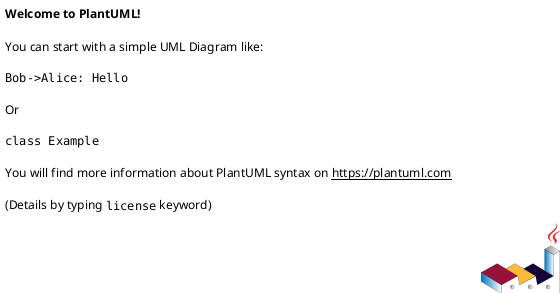

# 作業履歴 2017-03-25

## 概要

2017-03-25の作業内容をまとめています。

## コミット: 3a25da2

### メッセージ

```
staff/messagesコントローラ #21
```

### 変更されたファイル

- M	README.md
- M	app/controllers/staff/messages_controller.rb

### 変更内容

```diff
commit 3a25da28aee8e59eb7edd383f742b3e4e36fa0b0
Author: k2works <kakimomokuri@gmail.com>
Date:   Sat Mar 25 18:20:05 2017 +0900

    staff/messagesコントローラ #21

diff --git a/README.md b/README.md
index 5d11bd6..d9c1c78 100644
--- a/README.md
+++ b/README.md
@@ -782,6 +782,7 @@ git push heroku master
 + ルーティング
 + indexアクションの変更
 + リンクの設置
++ staff/messagesコントローラ
 
 #### 一意制約と排他的ロック
 #### 演習問題  
diff --git a/app/controllers/staff/messages_controller.rb b/app/controllers/staff/messages_controller.rb
index 8c8bddf..00b5e99 100644
--- a/app/controllers/staff/messages_controller.rb
+++ b/app/controllers/staff/messages_controller.rb
@@ -3,27 +3,32 @@ class Staff::MessagesController < Staff::Base
 
   def index
     @messages = Message.where(deleted: false).page(params[:page])
-    if params[:tag_id]
-      @messages = @messages.joins(:message_tag_links).where('message_tag_links.tag_id' => params[:tag_id])
-    end
+    narrow_down
     @messages = @messages.page(params[:page])
+    render action: 'index'
   end
 
   # GET
   def inbound
     @messages = CustomerMessage.where(deleted: false).page(params[:page])
+    narrow_down
+    @messages = @messages.page(params[:page])
     render action: 'index'
   end
 
   # GET
   def outbound
     @messages = StaffMessage.where(deleted: false).page(params[:page])
+    narrow_down
+    @messages = @messages.page(params[:page])
     render action: 'index'
   end
 
   # GET
   def deleted
     @messages = Message.where(deleted: true).page(params[:page])
+    narrow_down
+    @messages = @messages.page(params[:page])
     render action: 'index'
   end
 
@@ -55,4 +60,11 @@ class Staff::MessagesController < Staff::Base
     end
     render text: 'OK'
   end
+
+  private
+  def narrow_down
+    if params[:tag_id]
+      @messages = @messages.joins(:message_tag_links).where('message_tag_links.tag_id' => params[:tag_id])
+    end
+  end
 end

```

### 構造変更



## コミット: 40d84d3

### メッセージ

```
リンクの設置 #21
```

### 変更されたファイル

- M	README.md
- A	app/views/staff/messages/_links.html.erb
- M	app/views/staff/messages/index.html.erb
- M	app/views/staff/messages/show.html.erb
- M	config/locales/views/ja.yml

### 変更内容

```diff
commit 40d84d3d6982ec0faed3bb128cf2011078fffc2e
Author: k2works <kakimomokuri@gmail.com>
Date:   Sat Mar 25 18:15:10 2017 +0900

    リンクの設置 #21

diff --git a/README.md b/README.md
index 289b68b..5d11bd6 100644
--- a/README.md
+++ b/README.md
@@ -781,6 +781,7 @@ git push heroku master
 #### タグによるメッセージの絞込
 + ルーティング
 + indexアクションの変更
++ リンクの設置
 
 #### 一意制約と排他的ロック
 #### 演習問題  
diff --git a/app/views/staff/messages/_links.html.erb b/app/views/staff/messages/_links.html.erb
new file mode 100644
index 0000000..cbd6e03
--- /dev/null
+++ b/app/views/staff/messages/_links.html.erb
@@ -0,0 +1,9 @@
+<div class="links">
+  <%= link_to t('staff.messages.links.inboud_staff_messages'), :inbound_staff_messages, class:'btn btn-default btn-xs' %>
+  <%= link_to t('staff.messages.links.outbound_staff_messages'), :outbound_staff_messages, class:'btn btn-default btn-xs' %>
+  <%= link_to t('staff.messages.links.staff_messages'), :staff_messages, class:'btn btn-default btn-xs' %>
+  <%= link_to t('staff.messages.links.deleted_staff_messages'), :deleted_staff_messages, class:'btn btn-default btn-xs' %>
+  <% if @message.kind_of?(CustomerMessage) %>
+    <%= link_to t('staff.messages.links.replay'), new_staff_message_reply_path(@message), class:'btn btn-default btn-xs' %>
+  <% end %>
+</div>
\ No newline at end of file
diff --git a/app/views/staff/messages/index.html.erb b/app/views/staff/messages/index.html.erb
index 7a46542..29fcdac 100644
--- a/app/views/staff/messages/index.html.erb
+++ b/app/views/staff/messages/index.html.erb
@@ -11,6 +11,7 @@
 </section>
 
 <section class="Section l-column Table">
+  <%= render 'links'%>
   <%= paginate @messages %>
 
   <table class="Table__body Table__body--listing StaffTable__body">
diff --git a/app/views/staff/messages/show.html.erb b/app/views/staff/messages/show.html.erb
index 3cbc59b..a2d7653 100644
--- a/app/views/staff/messages/show.html.erb
+++ b/app/views/staff/messages/show.html.erb
@@ -4,6 +4,7 @@
 </section>
 
 <section class="Section l-column Table StaffTable">
+  <%= render 'links' %>
   <table class="Table__body Table__body--attributes StaffTable__body">
     <% if @message.kind_of?(CustomerMessage) %>
         <div class="Table__links">
diff --git a/config/locales/views/ja.yml b/config/locales/views/ja.yml
index f2a92dd..efba53a 100644
--- a/config/locales/views/ja.yml
+++ b/config/locales/views/ja.yml
@@ -179,6 +179,12 @@ ja:
         subject: '件名'
         created_at: '作成日時'
         reply: '返信する'
+      links:
+        inboud_staff_messages: '問い合わせ一覧'
+        outbound_staff_messages: '返信一覧'
+        staff_messages: '全メッセージ一覧'
+        deleted_staff_messages: 'ゴミ箱'
+        replay: '返信する'
     replies:
       new:
         title: '問い合わせへの返信'

```

## コミット: 70c3a8c

### メッセージ

```
indexアクションの変更 #21
```

### 変更されたファイル

- M	README.md
- A	app/assets/stylesheets/components/_tags.scss
- M	app/assets/stylesheets/main.scss
- M	app/controllers/staff/messages_controller.rb
- A	app/views/staff/messages/_tags.html.erb
- M	app/views/staff/messages/index.html.erb

### 変更内容

```diff
commit 70c3a8c5815e273fbd2c16ad773c732c62e819ef
Author: k2works <kakimomokuri@gmail.com>
Date:   Sat Mar 25 18:02:02 2017 +0900

    indexアクションの変更 #21

diff --git a/README.md b/README.md
index abf077e..289b68b 100644
--- a/README.md
+++ b/README.md
@@ -780,6 +780,7 @@ git push heroku master
 
 #### タグによるメッセージの絞込
 + ルーティング
++ indexアクションの変更
 
 #### 一意制約と排他的ロック
 #### 演習問題  
diff --git a/app/assets/stylesheets/components/_tags.scss b/app/assets/stylesheets/components/_tags.scss
new file mode 100644
index 0000000..49f0f7b
--- /dev/null
+++ b/app/assets/stylesheets/components/_tags.scss
@@ -0,0 +1,8 @@
+.Tags {
+  margin: $wide 0;
+  padding: $wide;
+  background-color: $very_light_gray;
+  &__current_tag {
+    font-weight: bold;
+  }
+}
\ No newline at end of file
diff --git a/app/assets/stylesheets/main.scss b/app/assets/stylesheets/main.scss
index 6a01807..1296dc4 100644
--- a/app/assets/stylesheets/main.scss
+++ b/app/assets/stylesheets/main.scss
@@ -83,6 +83,9 @@
 @import "./components/staffTable";
 @import "./components/customerTable";
 
+// タグ
+@import "./components/tags";
+
 //font-awesome
 @import "font-awesome";
 
diff --git a/app/controllers/staff/messages_controller.rb b/app/controllers/staff/messages_controller.rb
index 7e3768d..8c8bddf 100644
--- a/app/controllers/staff/messages_controller.rb
+++ b/app/controllers/staff/messages_controller.rb
@@ -3,6 +3,10 @@ class Staff::MessagesController < Staff::Base
 
   def index
     @messages = Message.where(deleted: false).page(params[:page])
+    if params[:tag_id]
+      @messages = @messages.joins(:message_tag_links).where('message_tag_links.tag_id' => params[:tag_id])
+    end
+    @messages = @messages.page(params[:page])
   end
 
   # GET
diff --git a/app/views/staff/messages/_tags.html.erb b/app/views/staff/messages/_tags.html.erb
new file mode 100644
index 0000000..14fda43
--- /dev/null
+++ b/app/views/staff/messages/_tags.html.erb
@@ -0,0 +1,10 @@
+<div class="Tags">
+  タグ:
+  <% Tag.all.each do |tag| %>
+      <% if tag.id == params[:tag_id].to_i %>
+          <span class="Tags__current_tag"><%= tag.value %></span>
+      <% else %>
+          <%= link_to tag.value, [ :staff, tag, :messages ] %>
+      <% end %>
+  <% end %>
+</div>
\ No newline at end of file
diff --git a/app/views/staff/messages/index.html.erb b/app/views/staff/messages/index.html.erb
index ceb696e..7a46542 100644
--- a/app/views/staff/messages/index.html.erb
+++ b/app/views/staff/messages/index.html.erb
@@ -39,4 +39,6 @@
   </table>
 
   <%= paginate @messages %>
+
+  <%= render 'tags' %>
 </section>
\ No newline at end of file

```

### 構造変更


## コミット: 9079487

### メッセージ

```
ルーティング #21
```

### 変更されたファイル

- M	README.md
- M	config/routes.rb

### 変更内容

```diff
commit 90794874b0c923e9af6c514d0902548e9b65af1a
Author: k2works <kakimomokuri@gmail.com>
Date:   Sat Mar 25 17:48:19 2017 +0900

    ルーティング #21

diff --git a/README.md b/README.md
index 0ab32e8..abf077e 100644
--- a/README.md
+++ b/README.md
@@ -778,6 +778,9 @@ git push heroku master
 + JavaScriptプログラムの改善
 + 照合順序の変更
 
+#### タグによるメッセージの絞込
++ ルーティング
+
 #### 一意制約と排他的ロック
 #### 演習問題  
 
diff --git a/config/routes.rb b/config/routes.rb
index e6360a5..3b44fdd 100644
--- a/config/routes.rb
+++ b/config/routes.rb
@@ -43,6 +43,10 @@
 #                  staff_messages GET    /staff/messages(.:format)                            staff/messages#index {:host=>"0.0.0.0"}
 #                   staff_message GET    /staff/messages/:id(.:format)                        staff/messages#show {:host=>"0.0.0.0"}
 #                                 DELETE /staff/messages/:id(.:format)                        staff/messages#destroy {:host=>"0.0.0.0"}
+#      inbound_staff_tag_messages GET    /staff/tags/:tag_id/messages/inbound(.:format)       staff/messages#inbound {:host=>"0.0.0.0"}
+#     outbound_staff_tag_messages GET    /staff/tags/:tag_id/messages/outbound(.:format)      staff/messages#outbound {:host=>"0.0.0.0"}
+#      deleted_staff_tag_messages GET    /staff/tags/:tag_id/messages/deleted(.:format)       staff/messages#deleted {:host=>"0.0.0.0"}
+#              staff_tag_messages GET    /staff/tags/:tag_id/messages(.:format)               staff/messages#index {:host=>"0.0.0.0"}
 #                      admin_root GET    /admin(.:format)                                     admin/top#index {:host=>"0.0.0.0"}
 #                     admin_login GET    /admin/login(.:format)                               admin/sessions#new {:host=>"0.0.0.0"}
 #                   admin_session DELETE /admin/session(.:format)                             admin/sessions#destroy {:host=>"0.0.0.0"}
@@ -111,6 +115,11 @@ Rails.application.routes.draw do
           post :confirm
         end
       end
+      resources :tags, only: [] do
+        resources :messages, only: [ :index ] do
+          get :inbound, :outbound, :deleted, on: :collection
+        end
+      end
     end
   end
 

```

## コミット: 1dc1b6a

### メッセージ

```
スキーママイグレーション不具合修正 #21
```

### 変更されたファイル

- M	db/schema.rb

### 変更内容

```diff
commit 1dc1b6a114bdbb66a162c2911f3be8814810f7bc
Author: k2works <kakimomokuri@gmail.com>
Date:   Sat Mar 25 17:41:17 2017 +0900

    スキーママイグレーション不具合修正 #21

diff --git a/db/schema.rb b/db/schema.rb
index 9788eac..0154c4b 100644
--- a/db/schema.rb
+++ b/db/schema.rb
@@ -12,7 +12,7 @@
 
 ActiveRecord::Schema.define(version: 20170325081203) do
 
-  create_table "addresses", force: :cascade, options: "ENGINE=InnoDB DEFAULT CHARSET=utf8", comment: "住所" do |t|
+  create_table "addresses", force: :cascade, comment: "住所" do |t|
     t.integer  "customer_id",                null: false, comment: "顧客への外部キー"
     t.string   "type",                       null: false, comment: "継承カラム"
     t.string   "postal_code",                null: false, comment: "郵便番号"
@@ -33,7 +33,7 @@ ActiveRecord::Schema.define(version: 20170325081203) do
     t.index ["type", "prefecture", "city"], name: "index_addresses_on_type_and_prefecture_and_city", using: :btree
   end
 
-  create_table "administrators", force: :cascade, options: "ENGINE=InnoDB DEFAULT CHARSET=utf8", comment: "管理者" do |t|
+  create_table "administrators", force: :cascade, comment: "管理者" do |t|
     t.string   "email",                           null: false, comment: "メールアドレス"
     t.string   "email_for_index",                 null: false, comment: "索引用メールアドレス"
     t.string   "hashed_password",                              comment: "パスワード"
@@ -43,7 +43,7 @@ ActiveRecord::Schema.define(version: 20170325081203) do
     t.index ["email_for_index"], name: "index_administrators_on_email_for_index", unique: true, using: :btree
   end
 
-  create_table "allowed_sources", force: :cascade, options: "ENGINE=InnoDB DEFAULT CHARSET=utf8", comment: "IPアドレス制限" do |t|
+  create_table "allowed_sources", force: :cascade, comment: "IPアドレス制限" do |t|
     t.string   "namespace",                  null: false, comment: "名前空間"
     t.integer  "octet1",                     null: false, comment: "第１オクテット"
     t.integer  "octet2",                     null: false, comment: "第２オクテット"
@@ -55,7 +55,7 @@ ActiveRecord::Schema.define(version: 20170325081203) do
     t.index ["namespace", "octet1", "octet2", "octet3", "octet4"], name: "index_allowed_sources_on_namespace_and_octets", unique: true, using: :btree
   end
 
-  create_table "customers", force: :cascade, options: "ENGINE=InnoDB DEFAULT CHARSET=utf8", comment: "顧客" do |t|
+  create_table "customers", force: :cascade, comment: "顧客" do |t|
     t.string   "email",            null: false, comment: "メールアドレス"
     t.string   "email_for_index",  null: false, comment: "顧客用メールアドレス"
     t.string   "family_name",      null: false, comment: "姓"
@@ -84,7 +84,7 @@ ActiveRecord::Schema.define(version: 20170325081203) do
     t.index ["given_name_kana"], name: "index_customers_on_given_name_kana", using: :btree
   end
 
-  create_table "entries", force: :cascade, options: "ENGINE=InnoDB DEFAULT CHARSET=utf8", comment: "申し込み" do |t|
+  create_table "entries", force: :cascade, comment: "申し込み" do |t|
     t.integer  "program_id",                  null: false
     t.integer  "customer_id",                 null: false
     t.boolean  "approved",    default: false, null: false, comment: "承認済みフラグ"
@@ -96,7 +96,7 @@ ActiveRecord::Schema.define(version: 20170325081203) do
     t.index ["program_id"], name: "index_entries_on_program_id", using: :btree
   end
 
-  create_table "message_tag_links", force: :cascade, options: "ENGINE=InnoDB DEFAULT CHARSET=utf8", comment: "タグリンクテーブル" do |t|
+  create_table "message_tag_links", force: :cascade, comment: "タグリンクテーブル" do |t|
     t.integer "message_id", null: false
     t.integer "tag_id",     null: false
     t.index ["message_id", "tag_id"], name: "index_message_tag_links_on_message_id_and_tag_id", unique: true, using: :btree
@@ -104,7 +104,7 @@ ActiveRecord::Schema.define(version: 20170325081203) do
     t.index ["tag_id"], name: "index_message_tag_links_on_tag_id", using: :btree
   end
 
-  create_table "messages", force: :cascade, options: "ENGINE=InnoDB DEFAULT CHARSET=utf8", comment: "問い合わせ" do |t|
+  create_table "messages", force: :cascade, comment: "問い合わせ" do |t|
     t.integer  "customer_id",                                   null: false
     t.integer  "staff_member_id"
     t.integer  "root_id",                                                    comment: "Messageへの外部キー"
@@ -129,7 +129,7 @@ ActiveRecord::Schema.define(version: 20170325081203) do
     t.index ["type", "staff_member_id"], name: "index_messages_on_type_and_staff_member_id", using: :btree
   end
 
-  create_table "phones", force: :cascade, options: "ENGINE=InnoDB DEFAULT CHARSET=utf8", comment: "電話" do |t|
+  create_table "phones", force: :cascade, comment: "電話" do |t|
     t.integer  "customer_id",                      null: false, comment: "顧客への外部キー"
     t.integer  "address_id",                                    comment: "住所への外部キー"
     t.string   "number",                           null: false, comment: "電話番号"
@@ -144,7 +144,7 @@ ActiveRecord::Schema.define(version: 20170325081203) do
     t.index ["number_for_index"], name: "index_phones_on_number_for_index", using: :btree
   end
 
-  create_table "programs", force: :cascade, options: "ENGINE=InnoDB DEFAULT CHARSET=utf8", comment: "プログラム" do |t|
+  create_table "programs", force: :cascade, comment: "プログラム" do |t|
     t.integer  "registrant_id",                            null: false, comment: "登録職員（外部キー）"
     t.string   "title",                                    null: false, comment: "タイトル"
     t.text     "description",                limit: 65535,              comment: "説明"
@@ -158,7 +158,7 @@ ActiveRecord::Schema.define(version: 20170325081203) do
     t.index ["registrant_id"], name: "index_programs_on_registrant_id", using: :btree
   end
 
-  create_table "staff_events", force: :cascade, options: "ENGINE=InnoDB DEFAULT CHARSET=utf8", comment: "職員イベント" do |t|
+  create_table "staff_events", force: :cascade, comment: "職員イベント" do |t|
     t.integer  "staff_member_id", null: false, comment: "職員レコードへの外部キー"
     t.string   "type",            null: false, comment: "イベントタイプ"
     t.datetime "created_at",      null: false, comment: "発生時刻"
@@ -167,7 +167,7 @@ ActiveRecord::Schema.define(version: 20170325081203) do
     t.index ["staff_member_id"], name: "index_staff_events_on_staff_member_id", using: :btree
   end
 
-  create_table "staff_members", force: :cascade, options: "ENGINE=InnoDB DEFAULT CHARSET=utf8", comment: "職員" do |t|
+  create_table "staff_members", force: :cascade, comment: "職員" do |t|
     t.string   "email",                            null: false, comment: "メールアドレス"
     t.string   "email_for_index",                  null: false, comment: "索引用メールアドレス"
     t.string   "family_name",                      null: false, comment: "姓"
@@ -184,7 +184,7 @@ ActiveRecord::Schema.define(version: 20170325081203) do
     t.index ["family_name_kana", "given_name_kana"], name: "index_staff_members_on_family_name_kana_and_given_name_kana", using: :btree
   end
 
-  create_table "tags", force: :cascade, options: "ENGINE=InnoDB DEFAULT CHARSET=utf8", comment: "タグ" do |t|
+  create_table "tags", force: :cascade, comment: "タグ" do |t|
     t.string   "value",      null: false
     t.datetime "created_at", null: false
     t.datetime "updated_at", null: false

```

## コミット: 80dd166

### メッセージ

```
タグの追加・削除の不具合修正 #21
```

### 変更されたファイル

- M	app/models/message.rb
- M	db/schema.rb

### 変更内容

```diff
commit 80dd166b08845b6576064a92d66278e9c809efe8
Author: k2works <kakimomokuri@gmail.com>
Date:   Sat Mar 25 17:38:04 2017 +0900

    タグの追加・削除の不具合修正 #21

diff --git a/app/models/message.rb b/app/models/message.rb
index 19e47e1..723f9f9 100644
--- a/app/models/message.rb
+++ b/app/models/message.rb
@@ -69,7 +69,7 @@ class Message < ApplicationRecord
 
   def add_tag(label)
     self.class.transaction do
-      tag = Tag.find_by_created_at(value: label)
+      tag = Tag.find_by(value: label)
       tag ||= Tag.create!(value: label)
       unless message_tag_links.where(tag_id: tag.id).exists?
         message_tag_links.create!(tag_id: tag.id)
diff --git a/db/schema.rb b/db/schema.rb
index 2ea53dd..9788eac 100644
--- a/db/schema.rb
+++ b/db/schema.rb
@@ -10,9 +10,9 @@
 #
 # It's strongly recommended that you check this file into your version control system.
 
-ActiveRecord::Schema.define(version: 20170318093830) do
+ActiveRecord::Schema.define(version: 20170325081203) do
 
-  create_table "addresses", force: :cascade, options: "ENGINE=InnoDB DEFAULT CHARSET=utf8 COLLATE=utf8_unicode_ci", comment: "住所" do |t|
+  create_table "addresses", force: :cascade, options: "ENGINE=InnoDB DEFAULT CHARSET=utf8", comment: "住所" do |t|
     t.integer  "customer_id",                null: false, comment: "顧客への外部キー"
     t.string   "type",                       null: false, comment: "継承カラム"
     t.string   "postal_code",                null: false, comment: "郵便番号"
@@ -33,7 +33,7 @@ ActiveRecord::Schema.define(version: 20170318093830) do
     t.index ["type", "prefecture", "city"], name: "index_addresses_on_type_and_prefecture_and_city", using: :btree
   end
 
-  create_table "administrators", force: :cascade, options: "ENGINE=InnoDB DEFAULT CHARSET=utf8 COLLATE=utf8_unicode_ci", comment: "管理者" do |t|
+  create_table "administrators", force: :cascade, options: "ENGINE=InnoDB DEFAULT CHARSET=utf8", comment: "管理者" do |t|
     t.string   "email",                           null: false, comment: "メールアドレス"
     t.string   "email_for_index",                 null: false, comment: "索引用メールアドレス"
     t.string   "hashed_password",                              comment: "パスワード"
@@ -43,7 +43,7 @@ ActiveRecord::Schema.define(version: 20170318093830) do
     t.index ["email_for_index"], name: "index_administrators_on_email_for_index", unique: true, using: :btree
   end
 
-  create_table "allowed_sources", force: :cascade, options: "ENGINE=InnoDB DEFAULT CHARSET=utf8 COLLATE=utf8_unicode_ci", comment: "IPアドレス制限" do |t|
+  create_table "allowed_sources", force: :cascade, options: "ENGINE=InnoDB DEFAULT CHARSET=utf8", comment: "IPアドレス制限" do |t|
     t.string   "namespace",                  null: false, comment: "名前空間"
     t.integer  "octet1",                     null: false, comment: "第１オクテット"
     t.integer  "octet2",                     null: false, comment: "第２オクテット"
@@ -55,7 +55,7 @@ ActiveRecord::Schema.define(version: 20170318093830) do
     t.index ["namespace", "octet1", "octet2", "octet3", "octet4"], name: "index_allowed_sources_on_namespace_and_octets", unique: true, using: :btree
   end
 
-  create_table "customers", force: :cascade, options: "ENGINE=InnoDB DEFAULT CHARSET=utf8 COLLATE=utf8_unicode_ci", comment: "顧客" do |t|
+  create_table "customers", force: :cascade, options: "ENGINE=InnoDB DEFAULT CHARSET=utf8", comment: "顧客" do |t|
     t.string   "email",            null: false, comment: "メールアドレス"
     t.string   "email_for_index",  null: false, comment: "顧客用メールアドレス"
     t.string   "family_name",      null: false, comment: "姓"
@@ -84,7 +84,7 @@ ActiveRecord::Schema.define(version: 20170318093830) do
     t.index ["given_name_kana"], name: "index_customers_on_given_name_kana", using: :btree
   end
 
-  create_table "entries", force: :cascade, options: "ENGINE=InnoDB DEFAULT CHARSET=utf8 COLLATE=utf8_unicode_ci", comment: "申し込み" do |t|
+  create_table "entries", force: :cascade, options: "ENGINE=InnoDB DEFAULT CHARSET=utf8", comment: "申し込み" do |t|
     t.integer  "program_id",                  null: false
     t.integer  "customer_id",                 null: false
     t.boolean  "approved",    default: false, null: false, comment: "承認済みフラグ"
@@ -96,7 +96,7 @@ ActiveRecord::Schema.define(version: 20170318093830) do
     t.index ["program_id"], name: "index_entries_on_program_id", using: :btree
   end
 
-  create_table "message_tag_links", force: :cascade, options: "ENGINE=InnoDB DEFAULT CHARSET=utf8 COLLATE=utf8_unicode_ci", comment: "タグリンクテーブル" do |t|
+  create_table "message_tag_links", force: :cascade, options: "ENGINE=InnoDB DEFAULT CHARSET=utf8", comment: "タグリンクテーブル" do |t|
     t.integer "message_id", null: false
     t.integer "tag_id",     null: false
     t.index ["message_id", "tag_id"], name: "index_message_tag_links_on_message_id_and_tag_id", unique: true, using: :btree
@@ -104,7 +104,7 @@ ActiveRecord::Schema.define(version: 20170318093830) do
     t.index ["tag_id"], name: "index_message_tag_links_on_tag_id", using: :btree
   end
 
-  create_table "messages", force: :cascade, options: "ENGINE=InnoDB DEFAULT CHARSET=utf8 COLLATE=utf8_unicode_ci", comment: "問い合わせ" do |t|
+  create_table "messages", force: :cascade, options: "ENGINE=InnoDB DEFAULT CHARSET=utf8", comment: "問い合わせ" do |t|
     t.integer  "customer_id",                                   null: false
     t.integer  "staff_member_id"
     t.integer  "root_id",                                                    comment: "Messageへの外部キー"
@@ -129,7 +129,7 @@ ActiveRecord::Schema.define(version: 20170318093830) do
     t.index ["type", "staff_member_id"], name: "index_messages_on_type_and_staff_member_id", using: :btree
   end
 
-  create_table "phones", force: :cascade, options: "ENGINE=InnoDB DEFAULT CHARSET=utf8 COLLATE=utf8_unicode_ci", comment: "電話" do |t|
+  create_table "phones", force: :cascade, options: "ENGINE=InnoDB DEFAULT CHARSET=utf8", comment: "電話" do |t|
     t.integer  "customer_id",                      null: false, comment: "顧客への外部キー"
     t.integer  "address_id",                                    comment: "住所への外部キー"
     t.string   "number",                           null: false, comment: "電話番号"
@@ -144,7 +144,7 @@ ActiveRecord::Schema.define(version: 20170318093830) do
     t.index ["number_for_index"], name: "index_phones_on_number_for_index", using: :btree
   end
 
-  create_table "programs", force: :cascade, options: "ENGINE=InnoDB DEFAULT CHARSET=utf8 COLLATE=utf8_unicode_ci", comment: "プログラム" do |t|
+  create_table "programs", force: :cascade, options: "ENGINE=InnoDB DEFAULT CHARSET=utf8", comment: "プログラム" do |t|
     t.integer  "registrant_id",                            null: false, comment: "登録職員（外部キー）"
     t.string   "title",                                    null: false, comment: "タイトル"
     t.text     "description",                limit: 65535,              comment: "説明"
@@ -158,7 +158,7 @@ ActiveRecord::Schema.define(version: 20170318093830) do
     t.index ["registrant_id"], name: "index_programs_on_registrant_id", using: :btree
   end
 
-  create_table "staff_events", force: :cascade, options: "ENGINE=InnoDB DEFAULT CHARSET=utf8 COLLATE=utf8_unicode_ci", comment: "職員イベント" do |t|
+  create_table "staff_events", force: :cascade, options: "ENGINE=InnoDB DEFAULT CHARSET=utf8", comment: "職員イベント" do |t|
     t.integer  "staff_member_id", null: false, comment: "職員レコードへの外部キー"
     t.string   "type",            null: false, comment: "イベントタイプ"
     t.datetime "created_at",      null: false, comment: "発生時刻"
@@ -167,7 +167,7 @@ ActiveRecord::Schema.define(version: 20170318093830) do
     t.index ["staff_member_id"], name: "index_staff_events_on_staff_member_id", using: :btree
   end
 
-  create_table "staff_members", force: :cascade, options: "ENGINE=InnoDB DEFAULT CHARSET=utf8 COLLATE=utf8_unicode_ci", comment: "職員" do |t|
+  create_table "staff_members", force: :cascade, options: "ENGINE=InnoDB DEFAULT CHARSET=utf8", comment: "職員" do |t|
     t.string   "email",                            null: false, comment: "メールアドレス"
     t.string   "email_for_index",                  null: false, comment: "索引用メールアドレス"
     t.string   "family_name",                      null: false, comment: "姓"
@@ -184,7 +184,7 @@ ActiveRecord::Schema.define(version: 20170318093830) do
     t.index ["family_name_kana", "given_name_kana"], name: "index_staff_members_on_family_name_kana_and_given_name_kana", using: :btree
   end
 
-  create_table "tags", force: :cascade, options: "ENGINE=InnoDB DEFAULT CHARSET=utf8 COLLATE=utf8_unicode_ci", comment: "タグ" do |t|
+  create_table "tags", force: :cascade, options: "ENGINE=InnoDB DEFAULT CHARSET=utf8", comment: "タグ" do |t|
     t.string   "value",      null: false
     t.datetime "created_at", null: false
     t.datetime "updated_at", null: false

```

### 構造変更


## コミット: e0ff568

### メッセージ

```
照合順序の変更 #21
```

### 変更されたファイル

- M	README.md
- M	config/database.yml
- A	db/migrate/20170325081203_change_collations.rb
- M	db/schema.rb

### 変更内容

```diff
commit e0ff56864f2f782ab7972a0aba81c5718f5c6b73
Author: k2works <kakimomokuri@gmail.com>
Date:   Sat Mar 25 17:21:29 2017 +0900

    照合順序の変更 #21

diff --git a/README.md b/README.md
index 00b29d6..0ab32e8 100644
--- a/README.md
+++ b/README.md
@@ -776,6 +776,7 @@ git push heroku master
 + タグの追加・削除インターフェース
 + タグの追加・削除
 + JavaScriptプログラムの改善
++ 照合順序の変更
 
 #### 一意制約と排他的ロック
 #### 演習問題  
diff --git a/config/database.yml b/config/database.yml
index aaf01f7..544640b 100644
--- a/config/database.yml
+++ b/config/database.yml
@@ -12,6 +12,7 @@
 default: &default
   adapter: mysql2
   encoding: utf8
+  collation: utf8_general_ci
   pool: 5
   username: root
   password: password
diff --git a/db/migrate/20170325081203_change_collations.rb b/db/migrate/20170325081203_change_collations.rb
new file mode 100644
index 0000000..55cf7d1
--- /dev/null
+++ b/db/migrate/20170325081203_change_collations.rb
@@ -0,0 +1,21 @@
+class ChangeCollations < ActiveRecord::Migration[5.0]
+  def up
+    if ActiveRecord::Base.connection.adapter_name == "Mysql2"
+      ActiveRecord::Base.connection.tables.each do |table|
+        execute(%Q{
+                    ALTER TABLE #{table} CONVERT TO CHARACTER SET utf8 COLLATE utf8_general_ci
+                })
+      end
+    end
+  end
+
+  def down
+    if ActiveRecord::Base.connection.adapter_name == "Mysql2"
+      ActiveRecord::Base.connection.tables.each do |table|
+        execute(%Q{
+                    ALTER TABLE #{table} CONVERT TO CHARACTER SET utf8 COLLATE utf8_unicode_ci
+                })
+      end
+    end
+  end
+end
diff --git a/db/schema.rb b/db/schema.rb
index 1086b9a..2ea53dd 100644
--- a/db/schema.rb
+++ b/db/schema.rb
@@ -12,7 +12,7 @@
 
 ActiveRecord::Schema.define(version: 20170318093830) do
 
-  create_table "addresses", force: :cascade, comment: "住所" do |t|
+  create_table "addresses", force: :cascade, options: "ENGINE=InnoDB DEFAULT CHARSET=utf8 COLLATE=utf8_unicode_ci", comment: "住所" do |t|
     t.integer  "customer_id",                null: false, comment: "顧客への外部キー"
     t.string   "type",                       null: false, comment: "継承カラム"
     t.string   "postal_code",                null: false, comment: "郵便番号"
@@ -33,7 +33,7 @@ ActiveRecord::Schema.define(version: 20170318093830) do
     t.index ["type", "prefecture", "city"], name: "index_addresses_on_type_and_prefecture_and_city", using: :btree
   end
 
-  create_table "administrators", force: :cascade, comment: "管理者" do |t|
+  create_table "administrators", force: :cascade, options: "ENGINE=InnoDB DEFAULT CHARSET=utf8 COLLATE=utf8_unicode_ci", comment: "管理者" do |t|
     t.string   "email",                           null: false, comment: "メールアドレス"
     t.string   "email_for_index",                 null: false, comment: "索引用メールアドレス"
     t.string   "hashed_password",                              comment: "パスワード"
@@ -43,7 +43,7 @@ ActiveRecord::Schema.define(version: 20170318093830) do
     t.index ["email_for_index"], name: "index_administrators_on_email_for_index", unique: true, using: :btree
   end
 
-  create_table "allowed_sources", force: :cascade, comment: "IPアドレス制限" do |t|
+  create_table "allowed_sources", force: :cascade, options: "ENGINE=InnoDB DEFAULT CHARSET=utf8 COLLATE=utf8_unicode_ci", comment: "IPアドレス制限" do |t|
     t.string   "namespace",                  null: false, comment: "名前空間"
     t.integer  "octet1",                     null: false, comment: "第１オクテット"
     t.integer  "octet2",                     null: false, comment: "第２オクテット"
@@ -55,7 +55,7 @@ ActiveRecord::Schema.define(version: 20170318093830) do
     t.index ["namespace", "octet1", "octet2", "octet3", "octet4"], name: "index_allowed_sources_on_namespace_and_octets", unique: true, using: :btree
   end
 
-  create_table "customers", force: :cascade, comment: "顧客" do |t|
+  create_table "customers", force: :cascade, options: "ENGINE=InnoDB DEFAULT CHARSET=utf8 COLLATE=utf8_unicode_ci", comment: "顧客" do |t|
     t.string   "email",            null: false, comment: "メールアドレス"
     t.string   "email_for_index",  null: false, comment: "顧客用メールアドレス"
     t.string   "family_name",      null: false, comment: "姓"
@@ -84,7 +84,7 @@ ActiveRecord::Schema.define(version: 20170318093830) do
     t.index ["given_name_kana"], name: "index_customers_on_given_name_kana", using: :btree
   end
 
-  create_table "entries", force: :cascade, comment: "申し込み" do |t|
+  create_table "entries", force: :cascade, options: "ENGINE=InnoDB DEFAULT CHARSET=utf8 COLLATE=utf8_unicode_ci", comment: "申し込み" do |t|
     t.integer  "program_id",                  null: false
     t.integer  "customer_id",                 null: false
     t.boolean  "approved",    default: false, null: false, comment: "承認済みフラグ"
@@ -96,7 +96,7 @@ ActiveRecord::Schema.define(version: 20170318093830) do
     t.index ["program_id"], name: "index_entries_on_program_id", using: :btree
   end
 
-  create_table "message_tag_links", force: :cascade, comment: "タグリンクテーブル" do |t|
+  create_table "message_tag_links", force: :cascade, options: "ENGINE=InnoDB DEFAULT CHARSET=utf8 COLLATE=utf8_unicode_ci", comment: "タグリンクテーブル" do |t|
     t.integer "message_id", null: false
     t.integer "tag_id",     null: false
     t.index ["message_id", "tag_id"], name: "index_message_tag_links_on_message_id_and_tag_id", unique: true, using: :btree
@@ -104,7 +104,7 @@ ActiveRecord::Schema.define(version: 20170318093830) do
     t.index ["tag_id"], name: "index_message_tag_links_on_tag_id", using: :btree
   end
 
-  create_table "messages", force: :cascade, comment: "問い合わせ" do |t|
+  create_table "messages", force: :cascade, options: "ENGINE=InnoDB DEFAULT CHARSET=utf8 COLLATE=utf8_unicode_ci", comment: "問い合わせ" do |t|
     t.integer  "customer_id",                                   null: false
     t.integer  "staff_member_id"
     t.integer  "root_id",                                                    comment: "Messageへの外部キー"
@@ -129,7 +129,7 @@ ActiveRecord::Schema.define(version: 20170318093830) do
     t.index ["type", "staff_member_id"], name: "index_messages_on_type_and_staff_member_id", using: :btree
   end
 
-  create_table "phones", force: :cascade, comment: "電話" do |t|
+  create_table "phones", force: :cascade, options: "ENGINE=InnoDB DEFAULT CHARSET=utf8 COLLATE=utf8_unicode_ci", comment: "電話" do |t|
     t.integer  "customer_id",                      null: false, comment: "顧客への外部キー"
     t.integer  "address_id",                                    comment: "住所への外部キー"
     t.string   "number",                           null: false, comment: "電話番号"
@@ -144,7 +144,7 @@ ActiveRecord::Schema.define(version: 20170318093830) do
     t.index ["number_for_index"], name: "index_phones_on_number_for_index", using: :btree
   end
 
-  create_table "programs", force: :cascade, comment: "プログラム" do |t|
+  create_table "programs", force: :cascade, options: "ENGINE=InnoDB DEFAULT CHARSET=utf8 COLLATE=utf8_unicode_ci", comment: "プログラム" do |t|
     t.integer  "registrant_id",                            null: false, comment: "登録職員（外部キー）"
     t.string   "title",                                    null: false, comment: "タイトル"
     t.text     "description",                limit: 65535,              comment: "説明"
@@ -158,7 +158,7 @@ ActiveRecord::Schema.define(version: 20170318093830) do
     t.index ["registrant_id"], name: "index_programs_on_registrant_id", using: :btree
   end
 
-  create_table "staff_events", force: :cascade, comment: "職員イベント" do |t|
+  create_table "staff_events", force: :cascade, options: "ENGINE=InnoDB DEFAULT CHARSET=utf8 COLLATE=utf8_unicode_ci", comment: "職員イベント" do |t|
     t.integer  "staff_member_id", null: false, comment: "職員レコードへの外部キー"
     t.string   "type",            null: false, comment: "イベントタイプ"
     t.datetime "created_at",      null: false, comment: "発生時刻"
@@ -167,7 +167,7 @@ ActiveRecord::Schema.define(version: 20170318093830) do
     t.index ["staff_member_id"], name: "index_staff_events_on_staff_member_id", using: :btree
   end
 
-  create_table "staff_members", force: :cascade, comment: "職員" do |t|
+  create_table "staff_members", force: :cascade, options: "ENGINE=InnoDB DEFAULT CHARSET=utf8 COLLATE=utf8_unicode_ci", comment: "職員" do |t|
     t.string   "email",                            null: false, comment: "メールアドレス"
     t.string   "email_for_index",                  null: false, comment: "索引用メールアドレス"
     t.string   "family_name",                      null: false, comment: "姓"
@@ -184,7 +184,7 @@ ActiveRecord::Schema.define(version: 20170318093830) do
     t.index ["family_name_kana", "given_name_kana"], name: "index_staff_members_on_family_name_kana_and_given_name_kana", using: :btree
   end
 
-  create_table "tags", force: :cascade, comment: "タグ" do |t|
+  create_table "tags", force: :cascade, options: "ENGINE=InnoDB DEFAULT CHARSET=utf8 COLLATE=utf8_unicode_ci", comment: "タグ" do |t|
     t.string   "value",      null: false
     t.datetime "created_at", null: false
     t.datetime "updated_at", null: false

```

## コミット: 4b6e490

### メッセージ

```
JavaScriptプログラムの改善 #21
```

### 変更されたファイル

- M	README.md
- M	app/assets/javascripts/staff/messages.coffee
- M	app/assets/javascripts/staff/paths.coffee.erb
- M	app/assets/javascripts/staff/tag-it.coffee

### 変更内容

```diff
commit 4b6e490065326cd194890c645250e5e4bf527015
Author: k2works <kakimomokuri@gmail.com>
Date:   Sat Mar 25 17:06:28 2017 +0900

    JavaScriptプログラムの改善 #21

diff --git a/README.md b/README.md
index fce025b..00b29d6 100644
--- a/README.md
+++ b/README.md
@@ -775,6 +775,7 @@ git push heroku master
 + Tag-itのインストール
 + タグの追加・削除インターフェース
 + タグの追加・削除
++ JavaScriptプログラムの改善
 
 #### 一意制約と排他的ロック
 #### 演習問題  
diff --git a/app/assets/javascripts/staff/messages.coffee b/app/assets/javascripts/staff/messages.coffee
index c6f7f19..85dbe8f 100644
--- a/app/assets/javascripts/staff/messages.coffee
+++ b/app/assets/javascripts/staff/messages.coffee
@@ -8,5 +8,5 @@ class Message
       window.setInterval(update_number_of_unprocessed_messages, 100 * 60)
 
   update_number_of_unprocessed_messages = ->
-    $.get window.paths.number_of_unprocessed_messages, (data) ->
+    $.get window.path_for("count_staff_messages"), (data) ->
       $('#number-of-unprocessed-messages').text "(#{data})"
\ No newline at end of file
diff --git a/app/assets/javascripts/staff/paths.coffee.erb b/app/assets/javascripts/staff/paths.coffee.erb
index 39cbdb5..e3965cc 100644
--- a/app/assets/javascripts/staff/paths.coffee.erb
+++ b/app/assets/javascripts/staff/paths.coffee.erb
@@ -1,3 +1,12 @@
-window.paths = new Object
-window.paths.number_of_unprocessed_messages = "<%= count_staff_messages_path %>"
-window.paths.staff_root = "<%= staff_root_path.sub(%r{/\z}, '') %>"
\ No newline at end of file
+window.named_paths = []
+<% %w(count_staff_messages tag_staff_message).each do |name| %>
+<% route = Rails.application.routes.named_routes[name] %>
+<%= "window.named_paths['#{name}'] = '#{route.path.spec.to_s}'\n" %>
+<% end %>
+
+window.path_for = (name, ids = {}) ->
+  path = window.named_paths[name]
+  path = path.replace(/\(\.:format\)$/, '')
+  for key, id of ids
+    path = path.replace(new RegExp(":#{key}\\b"), id)
+  path
\ No newline at end of file
diff --git a/app/assets/javascripts/staff/tag-it.coffee b/app/assets/javascripts/staff/tag-it.coffee
index 3024be0..29279d2 100644
--- a/app/assets/javascripts/staff/tag-it.coffee
+++ b/app/assets/javascripts/staff/tag-it.coffee
@@ -8,11 +8,11 @@ class TagIt
       afterTagAdded: (e, ui) ->
         unless ui.duringInitialization
           message_id = $("#tag-it").data('message-id')
-          path = "#{window.paths.staff_root}/messages/#{message_id}/tag"
+          path = window.path_for("tag_staff_message", { id: message_id })
           $.post(path, {label: ui.tagLabel})
       afterTagRemoved: (e, ui) ->
         unless ui.duringInitialization
           message_id = $("#tag-it").data('message-id')
-          path = "#{window.paths.staff_root}/messages/#{message_id}/tag"
+          path = window.path_for("tag_staff_message", { id: message_id})
           $.ajax(type: 'DELETE', url: path, data: { label: ui.tagLabel})
     )

```

## コミット: 5d9ae1a

### メッセージ

```
タグの追加・削除 #21
```

### 変更されたファイル

- M	README.md
- M	app/assets/javascripts/staff/paths.coffee.erb
- M	app/assets/javascripts/staff/tag-it.coffee
- M	app/controllers/staff/messages_controller.rb
- M	app/models/message.rb
- M	app/views/staff/messages/show.html.erb
- M	config/routes.rb

### 変更内容

```diff
commit 5d9ae1a10822d97729d643cc8c620f9dc140a0f0
Author: k2works <kakimomokuri@gmail.com>
Date:   Sat Mar 25 16:12:30 2017 +0900

    タグの追加・削除 #21

diff --git a/README.md b/README.md
index 138dd5f..fce025b 100644
--- a/README.md
+++ b/README.md
@@ -774,6 +774,7 @@ git push heroku master
 + モデル間の関連付け
 + Tag-itのインストール
 + タグの追加・削除インターフェース
++ タグの追加・削除
 
 #### 一意制約と排他的ロック
 #### 演習問題  
diff --git a/app/assets/javascripts/staff/paths.coffee.erb b/app/assets/javascripts/staff/paths.coffee.erb
index b1a8104..39cbdb5 100644
--- a/app/assets/javascripts/staff/paths.coffee.erb
+++ b/app/assets/javascripts/staff/paths.coffee.erb
@@ -1,2 +1,3 @@
 window.paths = new Object
-window.paths.number_of_unprocessed_messages = "<%= count_staff_messages_path %>"
\ No newline at end of file
+window.paths.number_of_unprocessed_messages = "<%= count_staff_messages_path %>"
+window.paths.staff_root = "<%= staff_root_path.sub(%r{/\z}, '') %>"
\ No newline at end of file
diff --git a/app/assets/javascripts/staff/tag-it.coffee b/app/assets/javascripts/staff/tag-it.coffee
index 2df1d97..3024be0 100644
--- a/app/assets/javascripts/staff/tag-it.coffee
+++ b/app/assets/javascripts/staff/tag-it.coffee
@@ -4,4 +4,15 @@ $(document).on "turbolinks:load", ->
 
 class TagIt
   constructor: ->
-    $("#tag-it").tagit()
+    $("#tag-it").tagit(
+      afterTagAdded: (e, ui) ->
+        unless ui.duringInitialization
+          message_id = $("#tag-it").data('message-id')
+          path = "#{window.paths.staff_root}/messages/#{message_id}/tag"
+          $.post(path, {label: ui.tagLabel})
+      afterTagRemoved: (e, ui) ->
+        unless ui.duringInitialization
+          message_id = $("#tag-it").data('message-id')
+          path = "#{window.paths.staff_root}/messages/#{message_id}/tag"
+          $.ajax(type: 'DELETE', url: path, data: { label: ui.tagLabel})
+    )
diff --git a/app/controllers/staff/messages_controller.rb b/app/controllers/staff/messages_controller.rb
index 641ebf1..7e3768d 100644
--- a/app/controllers/staff/messages_controller.rb
+++ b/app/controllers/staff/messages_controller.rb
@@ -38,4 +38,17 @@ class Staff::MessagesController < Staff::Base
     flash.notice = t('.flash_notice')
     redirect_to :back
   end
+
+  # POST/DELETE
+  def tag
+    message = CustomerMessage.find(params[:id])
+    if request.post?
+      message.add_tag(params[:label])
+    elsif request.delete?
+      message.remove_tag(params[:label])
+    else
+      raise
+    end
+    render text: 'OK'
+  end
 end
diff --git a/app/models/message.rb b/app/models/message.rb
index ecc8a44..19e47e1 100644
--- a/app/models/message.rb
+++ b/app/models/message.rb
@@ -66,4 +66,25 @@ class Message < ApplicationRecord
     messages = Message.where(root_id: r.id).select(:id, :parent_id, :subject)
     @tree = SimpleTree.new(r,messages)
   end
+
+  def add_tag(label)
+    self.class.transaction do
+      tag = Tag.find_by_created_at(value: label)
+      tag ||= Tag.create!(value: label)
+      unless message_tag_links.where(tag_id: tag.id).exists?
+        message_tag_links.create!(tag_id: tag.id)
+      end
+    end
+  end
+
+  def remove_tag(label)
+    self.class.transaction do
+      if tag = Tag.find_by(value: label)
+        message_tag_links.find_by(tag_id: tag.id).destroy
+        if tag.message_tag_links.empty?
+          tag.destroy
+        end
+      end
+    end
+  end
 end
diff --git a/app/views/staff/messages/show.html.erb b/app/views/staff/messages/show.html.erb
index 82cd9da..3cbc59b 100644
--- a/app/views/staff/messages/show.html.erb
+++ b/app/views/staff/messages/show.html.erb
@@ -19,7 +19,7 @@
     <tr class="Table__tr">
       <th  class="Table__th">タグ</th>
       <td>
-        <%= markup(:ul, id: 'tag-it') do |m|
+        <%= markup(:ul, id: 'tag-it', 'data-message-id' => @message.id) do |m|
           @message.tags.each do |tag|
             m.li tag.value
           end
diff --git a/config/routes.rb b/config/routes.rb
index 089b548..e6360a5 100644
--- a/config/routes.rb
+++ b/config/routes.rb
@@ -35,6 +35,8 @@
 #         outbound_staff_messages GET    /staff/messages/outbound(.:format)                   staff/messages#outbound {:host=>"0.0.0.0"}
 #          deleted_staff_messages GET    /staff/messages/deleted(.:format)                    staff/messages#deleted {:host=>"0.0.0.0"}
 #            count_staff_messages GET    /staff/messages/count(.:format)                      staff/messages#count {:host=>"0.0.0.0"}
+#               tag_staff_message POST   /staff/messages/:id/tag(.:format)                    staff/messages#tag {:host=>"0.0.0.0"}
+#                                 DELETE /staff/messages/:id/tag(.:format)                    staff/messages#tag {:host=>"0.0.0.0"}
 #     confirm_staff_message_reply POST   /staff/messages/:message_id/reply/confirm(.:format)  staff/replies#confirm {:host=>"0.0.0.0"}
 #         new_staff_message_reply GET    /staff/messages/:message_id/reply/new(.:format)      staff/replies#new {:host=>"0.0.0.0"}
 #             staff_message_reply POST   /staff/messages/:message_id/reply(.:format)          staff/replies#create {:host=>"0.0.0.0"}
@@ -103,6 +105,8 @@ Rails.application.routes.draw do
       end
       resources :messages, only: [ :index, :show, :destroy ] do
         get :inbound, :outbound, :deleted, :count, on: :collection
+        post :tag, on: :member
+        delete :tag, on: :member
         resource :reply, only: [ :new, :create ] do
           post :confirm
         end

```

### 構造変更


## コミット: 59ac04f

### メッセージ

```
タグの追加・削除インターフェース #21
```

### 変更されたファイル

- M	README.md
- M	app/views/staff/messages/show.html.erb

### 変更内容

```diff
commit 59ac04f28c872d0bc237048d6a31e6e27815f631
Author: k2works <kakimomokuri@gmail.com>
Date:   Sat Mar 25 15:40:22 2017 +0900

    タグの追加・削除インターフェース #21

diff --git a/README.md b/README.md
index eb6ea81..138dd5f 100644
--- a/README.md
+++ b/README.md
@@ -773,6 +773,7 @@ git push heroku master
 + データベース設計
 + モデル間の関連付け
 + Tag-itのインストール
++ タグの追加・削除インターフェース
 
 #### 一意制約と排他的ロック
 #### 演習問題  
diff --git a/app/views/staff/messages/show.html.erb b/app/views/staff/messages/show.html.erb
index bfc7d1a..82cd9da 100644
--- a/app/views/staff/messages/show.html.erb
+++ b/app/views/staff/messages/show.html.erb
@@ -16,6 +16,16 @@
     <tr class="Table__tr"><th class="Table__th"><%= t('.receiver') %></th><td><%= p.receiver %></td></tr>
     <tr class="Table__tr"><th class="Table__th"><%= t('.subject') %></th><td><%= p.subject %></td></tr>
     <tr class="Table__tr"><th class="Table__th"><%= t('.created_at') %></th><td class="Table__td--date"><%= p.created_at %></td></tr>
+    <tr class="Table__tr">
+      <th  class="Table__th">タグ</th>
+      <td>
+        <%= markup(:ul, id: 'tag-it') do |m|
+          @message.tags.each do |tag|
+            m.li tag.value
+          end
+        end %>
+      </td>
+    </tr>
   </table>
 
   <div class="tree"><%= p.tree %></div>

```

## コミット: 7899110

### メッセージ

```
Tag-itのインストール #21
```

### 変更されたファイル

- M	baukis-kai.iml

### 変更内容

```diff
commit 78991103ebaa0b8012bff6dd956ff73dfdd92a13
Author: k2works <kakimomokuri@gmail.com>
Date:   Sat Mar 25 15:29:28 2017 +0900

    Tag-itのインストール #21

diff --git a/baukis-kai.iml b/baukis-kai.iml
index 7961602..fe5c0f2 100644
--- a/baukis-kai.iml
+++ b/baukis-kai.iml
@@ -142,6 +142,7 @@
     <orderEntry type="library" scope="PROVIDED" name="sprockets (v3.7.1, rbenv: 2.4.0) [gem]" level="application" />
     <orderEntry type="library" scope="PROVIDED" name="sprockets-rails (v3.2.0, rbenv: 2.4.0) [gem]" level="application" />
     <orderEntry type="library" scope="PROVIDED" name="sqlite3 (v1.3.12, rbenv: 2.4.0) [gem]" level="application" />
+    <orderEntry type="library" scope="PROVIDED" name="tag-it-rails (v2.0.0, rbenv: 2.4.0) [gem]" level="application" />
     <orderEntry type="library" scope="PROVIDED" name="thor (v0.19.4, rbenv: 2.4.0) [gem]" level="application" />
     <orderEntry type="library" scope="PROVIDED" name="thread_safe (v0.3.5, rbenv: 2.4.0) [gem]" level="application" />
     <orderEntry type="library" scope="PROVIDED" name="tilt (v2.0.5, rbenv: 2.4.0) [gem]" level="application" />

```

## コミット: 9822a10

### メッセージ

```
Tag-itのインストール #21
```

### 変更されたファイル

- M	Gemfile
- M	Gemfile.lock
- M	README.md
- M	app/assets/javascripts/staff.js
- A	app/assets/javascripts/staff/tag-it.coffee
- M	app/assets/stylesheets/main.scss

### 変更内容

```diff
commit 9822a102b0c59ff3862fda2335cbfa6e7bb49e18
Author: k2works <kakimomokuri@gmail.com>
Date:   Sat Mar 25 15:29:15 2017 +0900

    Tag-itのインストール #21

diff --git a/Gemfile b/Gemfile
index 4da1b83..7d8acb2 100644
--- a/Gemfile
+++ b/Gemfile
@@ -94,4 +94,5 @@ gem 'email_validator', '~> 1.6'
 gem 'jquery-ui-rails', '~> 5.0', '>= 5.0.5'
 gem 'momentjs-rails'
 gem 'bootstrap3-datetimepicker-rails'
+gem 'tag-it-rails'
 
diff --git a/Gemfile.lock b/Gemfile.lock
index 2610cc3..ac11a7f 100644
--- a/Gemfile.lock
+++ b/Gemfile.lock
@@ -286,6 +286,9 @@ GEM
       activesupport (>= 4.0)
       sprockets (>= 3.0.0)
     sqlite3 (1.3.12)
+    tag-it-rails (2.0.0)
+      jquery-ui-rails
+      railties
     thor (0.19.4)
     thread_safe (0.3.5)
     tilt (2.0.5)
@@ -361,6 +364,7 @@ DEPENDENCIES
   spring-commands-rspec
   spring-watcher-listen (~> 2.0.0)
   sqlite3
+  tag-it-rails
   turbolinks (~> 5)
   tzinfo-data
   uglifier (>= 1.3.0)
diff --git a/README.md b/README.md
index 480e469..eb6ea81 100644
--- a/README.md
+++ b/README.md
@@ -772,6 +772,7 @@ git push heroku master
 #### メッセージのタグ付け
 + データベース設計
 + モデル間の関連付け
++ Tag-itのインストール
 
 #### 一意制約と排他的ロック
 #### 演習問題  
diff --git a/app/assets/javascripts/staff.js b/app/assets/javascripts/staff.js
index aa1bf0e..e746e87 100644
--- a/app/assets/javascripts/staff.js
+++ b/app/assets/javascripts/staff.js
@@ -20,5 +20,7 @@
 //= require jquery-ui/datepicker-ja
 //= require moment
 //= require moment/ja
+//= require jquery-ui
+//= require tag-it
 //= require bootstrap-datetimepicker
 //= require_tree ./staff
diff --git a/app/assets/javascripts/staff/tag-it.coffee b/app/assets/javascripts/staff/tag-it.coffee
new file mode 100644
index 0000000..2df1d97
--- /dev/null
+++ b/app/assets/javascripts/staff/tag-it.coffee
@@ -0,0 +1,7 @@
+$(document).on "turbolinks:load", ->
+  do ->
+    new TagIt
+
+class TagIt
+  constructor: ->
+    $("#tag-it").tagit()
diff --git a/app/assets/stylesheets/main.scss b/app/assets/stylesheets/main.scss
index b0f45e1..6a01807 100644
--- a/app/assets/stylesheets/main.scss
+++ b/app/assets/stylesheets/main.scss
@@ -93,6 +93,8 @@
 
 //jQuery
 @import "jquery-ui/datepicker";
+@import "jquery-ui";
+@import "jquery.tagit";
 // ===========================
 // Pages
 // ===========================

```

