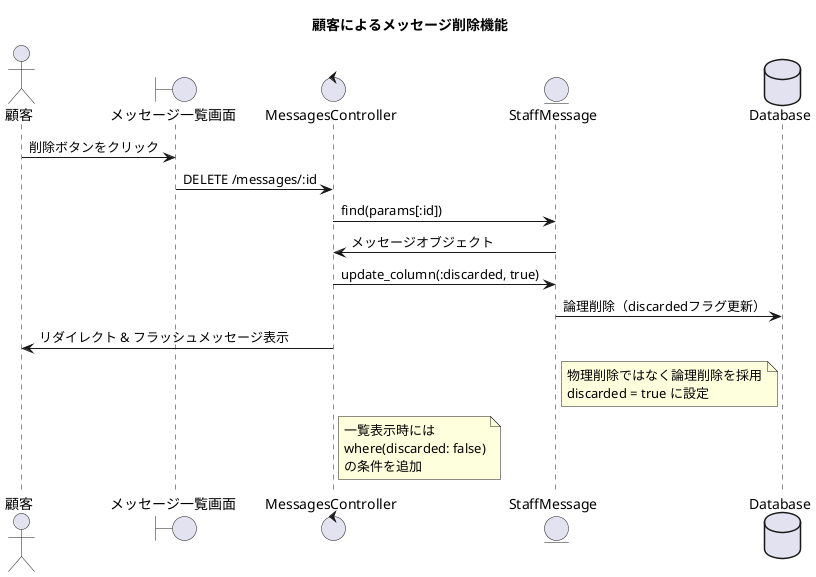
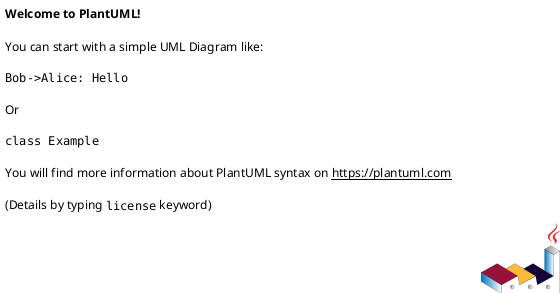
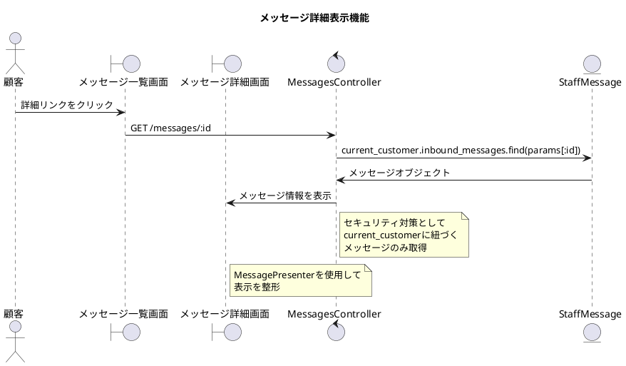
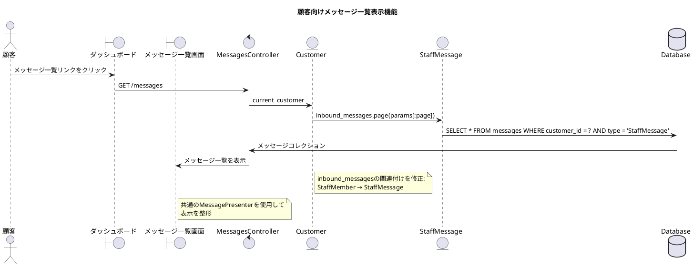
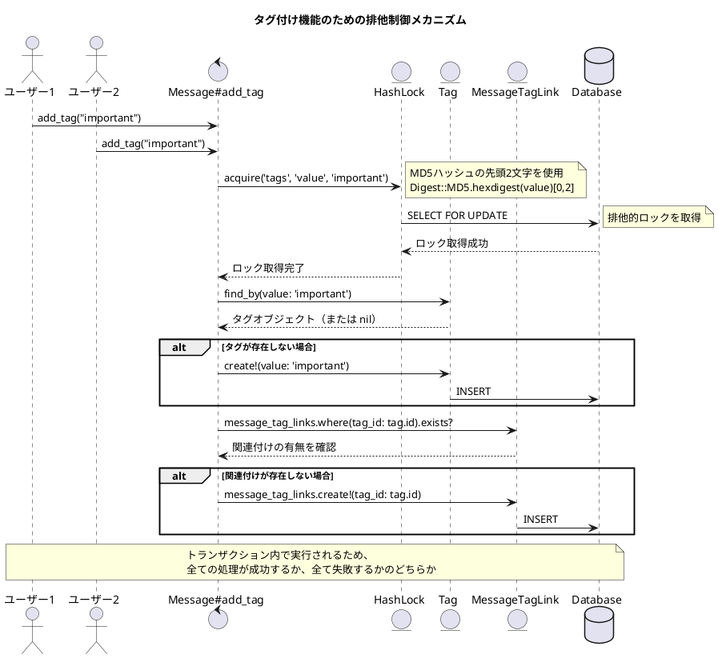

# 作業履歴 2017-03-27

## 概要

2017-03-27の作業内容をまとめています。このジャーナルでは、顧客向けメッセージ管理機能の拡張と改善を行いました。具体的には、顧客がメッセージを削除できる機能の追加、メッセージ詳細表示機能の実装、受信メッセージ一覧表示機能の実装などを行い、顧客とスタッフ間のコミュニケーション機能を強化しました。また、タグ付け機能における排他制御の問題を解決するための専用テーブルも実装しました。

## コミット: 026976f - 顧客によるメッセージ削除機能の実装

### 概要
顧客がメッセージを削除できる機能を実装しました。この機能により、顧客は受信したメッセージを必要に応じて削除することができます。実際には物理削除ではなく、`discarded`フラグを`true`に設定する論理削除を採用しています。

### 技術的詳細
- 顧客のメッセージ一覧画面に削除ボタンを追加
- `destroy`アクションを実装し、メッセージの`discarded`フラグを更新
- 一覧表示時に`discarded: false`の条件を追加して削除済みメッセージを非表示に
- 削除確認ダイアログと成功時のフラッシュメッセージを追加

### メッセージ

```
問3 #21
```

### 変更されたファイル

- M	README.md
- M	app/controllers/customer/messages_controller.rb
- M	app/views/customer/messages/index.html.erb
- M	config/locales/controllers/ja.yml
- M	config/locales/views/ja.yml
- M	config/routes.rb

### 構造変更



### 変更内容

```diff
commit 026976f2859694f60d7e26a25f2478fb6cd972dd
Author: k2works <kakimomokuri@gmail.com>
Date:   Mon Mar 27 18:58:56 2017 +0900

    問3 #21

diff --git a/README.md b/README.md
index 247365f..868fde6 100644
--- a/README.md
+++ b/README.md
@@ -791,6 +791,7 @@ git push heroku master
 #### 演習問題  
 + 問１
 + 問２
++ 問３


 **[⬆ back to top](#構成)**
diff --git a/app/controllers/customer/messages_controller.rb b/app/controllers/customer/messages_controller.rb
index f5e738a..2877f1e 100644
--- a/app/controllers/customer/messages_controller.rb
+++ b/app/controllers/customer/messages_controller.rb
@@ -1,6 +1,6 @@
 class Customer::MessagesController < Customer::Base
   def index
-    @messages = current_customer.inbound_messages.page(params[:page])
+    @messages = current_customer.inbound_messages.where(discarded: false).page(params[:page])
   end

   def show
@@ -38,6 +38,13 @@ class Customer::MessagesController < Customer::Base
     end
   end

+  def destroy
+    message = StaffMessage.find(params[:id])
+    message.update_column(:discarded, true)
+    flash.notice = t('.flash_notice')
+    redirect_to :back
+  end
+
   private
   def customer_message_params
     params.require(:customer_message).permit(
diff --git a/app/views/customer/messages/index.html.erb b/app/views/customer/messages/index.html.erb
index 66ca706..e6b43c0 100644
--- a/app/views/customer/messages/index.html.erb
+++ b/app/views/customer/messages/index.html.erb
@@ -20,6 +20,7 @@
           <td class="Table__td--date"><%= p.created_at %></td>
           <td class="Table__td--action">
             <%= link_to t('customer.messages.index.detail'), customer_message_path(m), class: 'btn btn-default btn-xs' %>
+            <%= link_to t('customer.messages.index.delete'), customer_message_path(m), method: :delete, data: { confirm: t('.delete_confirm')},class: 'btn btn-default btn-xs' %>
           </td>
         </tr>
     <% end %>
diff --git a/config/locales/controllers/ja.yml b/config/locales/controllers/ja.yml
index a67b2aa..4a4b989 100644
--- a/config/locales/controllers/ja.yml
+++ b/config/locales/controllers/ja.yml
@@ -95,4 +95,6 @@ ja:
       create:
         flash_notice: '問い合わせを送信しました。'
         flash_alert: '入力に誤りがあります。'
+      destroy:
+        flash_notice: 'メッセージを削除しました。'

diff --git a/config/locales/views/ja.yml b/config/locales/views/ja.yml
index 761bdf3..7428b9e 100644
--- a/config/locales/views/ja.yml
+++ b/config/locales/views/ja.yml
@@ -348,6 +348,8 @@ ja:
         created_at: '作成日時'
         action: 'アクション'
         detail: '詳細'
+        delete: '削除'
+        delete_confirm: '本当に削除しますか?'
       show:
         title: 'メッセージ詳細'
         sender: '送信者'
diff --git a/config/routes.rb b/config/routes.rb
index 3270c80..66b0ef3 100644
--- a/config/routes.rb
+++ b/config/routes.rb
@@ -85,6 +85,7 @@
 #                                 POST   /messages(.:format)                                  customer/messages#create {:host=>"0.0.0.0"}
 #            new_customer_message GET    /messages/new(.:format)                              customer/messages#new {:host=>"0.0.0.0"}
 #                customer_message GET    /messages/:id(.:format)                              customer/messages#show {:host=>"0.0.0.0"}
+#                                 DELETE /messages/:id(.:format)                              customer/messages#destroy {:host=>"0.0.0.0"}
 #                            root GET    /                                                    errors#routing_error
 #                                 GET    /*anything(.:format)                                 errors#routing_error
 #
@@ -155,7 +156,7 @@ Rails.application.routes.draw do
           patch :cancel, on: :member
         end
       end
-      resources :messages, only: [ :index, :show, :new, :create ] do
+      resources :messages, except: [ :edit, :update ] do
         post :confirm, on: :collection
       end
     end

```

### 構造変更



## コミット: 1ab342f - メッセージ詳細表示機能の実装

### 概要
顧客がメッセージの詳細を閲覧できる機能を実装しました。これにより、顧客は受信したメッセージの全文や詳細情報を確認することができます。また、メッセージ一覧画面から詳細画面へのナビゲーションも改善しました。

### 技術的詳細
- `show`アクションを実装し、顧客の受信メッセージを取得して表示
- メッセージ詳細表示用のビューテンプレートを新規作成
- メッセージ一覧画面に詳細ページへのリンクを追加
- スタイルの調整（Customer用のスタイルクラスを適用）
- 共通のMessagePresenterを使用してコードの重複を削減

### メッセージ

```
問2 #21
```

### 変更されたファイル

- M	README.md
- M	app/controllers/customer/messages_controller.rb
- M	app/views/customer/messages/index.html.erb
- A	app/views/customer/messages/show.html.erb
- M	app/views/staff/replies/_message.erb
- M	config/locales/views/ja.yml
- M	config/routes.rb

### 構造変更



### 変更内容

```diff
commit 1ab342f87ced4276136100728a1ef8982858e4c4
Author: k2works <kakimomokuri@gmail.com>
Date:   Mon Mar 27 18:40:22 2017 +0900

    問2 #21

diff --git a/README.md b/README.md
index a7d1c40..247365f 100644
--- a/README.md
+++ b/README.md
@@ -790,6 +790,8 @@ git push heroku master

 #### 演習問題  
 + 問１
++ 問２
+

 **[⬆ back to top](#構成)**

diff --git a/app/controllers/customer/messages_controller.rb b/app/controllers/customer/messages_controller.rb
index 5044849..f5e738a 100644
--- a/app/controllers/customer/messages_controller.rb
+++ b/app/controllers/customer/messages_controller.rb
@@ -3,6 +3,10 @@ class Customer::MessagesController < Customer::Base
     @messages = current_customer.inbound_messages.page(params[:page])
   end

+  def show
+    @message = current_customer.inbound_messages.find(params[:id])
+  end
+
   def new
     @message = CustomerMessage.new
   end
diff --git a/app/views/customer/messages/index.html.erb b/app/views/customer/messages/index.html.erb
index 130fd34..66ca706 100644
--- a/app/views/customer/messages/index.html.erb
+++ b/app/views/customer/messages/index.html.erb
@@ -1,15 +1,16 @@
 <section class="Section">
-  <h1 class="Staff__title"><%= @title %></h1>
+  <h1 class="Customer__title"><%= @title %></h1>
 </section>

 <section class="Section l-column Table">
   <%= paginate @messages %>

-  <table class="Table__body Table__body--listing StaffTable__body">
+  <table class="Table__body Table__body--listing CustomerTable__body">
     <tr class="Table__tr">
       <th class="Table__th"><%= t('customer.messages.index.sender') %></th>
       <th class="Table__th"><%= t('customer.messages.index.subject') %></th>
       <th class="Table__th"><%= t('customer.messages.index.created_at') %></th>
+      <th class="Table__th"><%= t('customer.messages.index.action') %></th>
     </tr>
     <% @messages.each do |m| %>
         <% p = MessagePresenter.new(m, self) %>
@@ -17,6 +18,9 @@
           <td class="Table__td"><%= p.sender %></td>
           <td class="Table__td"><%= p.truncated_subject %></td>
           <td class="Table__td--date"><%= p.created_at %></td>
+          <td class="Table__td--action">
+            <%= link_to t('customer.messages.index.detail'), customer_message_path(m), class: 'btn btn-default btn-xs' %>
+          </td>
         </tr>
     <% end %>
   </table>
diff --git a/app/views/customer/messages/show.html.erb b/app/views/customer/messages/show.html.erb
new file mode 100644
index 0000000..1fc6004
--- /dev/null
+++ b/app/views/customer/messages/show.html.erb
@@ -0,0 +1,14 @@
+<section class="Section">
+  <h1 class="Customer__title"><%= @title %></h1>
+</section>
+
+<section class="Section l-column Table CustomerTable">
+  <table class="Table__body Table__body--attributes CustomerTable__body">
+    <% p = MessagePresenter.new(@message, self) %>
+    <tr class="Table__tr"><th class="Table__th"><%= t('.sender') %></th><td><%= p.sender %></td></tr>
+    <tr class="Table__tr"><th class="Table__th"><%= t('.subject') %></th><td><%= p.subject %></td></tr>
+    <tr class="Table__tr"><th class="Table__th"><%= t('.created_at') %></th><td class="Table__td--date"><%= p.created_at %></td></tr>
+  </table>
+
+  <div class="Table__body--description"><%= p.formatted_body %></div>
+</section>
\ No newline at end of file
diff --git a/app/views/staff/replies/_message.erb b/app/views/staff/replies/_message.erb
index fbbb693..b6c7a5f 100644
--- a/app/views/staff/replies/_message.erb
+++ b/app/views/staff/replies/_message.erb
@@ -1,7 +1,7 @@
-<% p = Staff::MessagePresenter.new(@message, self) %>
+<% p = MessagePresenter.new(@message, self) %>
 <section class="Section l-column Table StaffTable">
   <table class="Table__body Table__body--attributes StaffTable__body">
-    <% p = Staff::MessagePresenter.new(@message, self) %>
+    <% p = MessagePresenter.new(@message, self) %>
     <tr class="Table__tr"><th class="Table__th"><%= t('staff.replies.new.sender') %></th><td><%= p.sender %></td></tr>
     <tr class="Table__tr"><th class="Table__th"><%= t('staff.replies.new.subject') %></th><td><%= p.subject %></td></tr>
     <tr class="Table__tr"><th class="Table__th"><%= t('staff.replies.new.created_at') %></th><td class="Table__td--date"><%= p.created_at %></td></tr>
diff --git a/config/locales/views/ja.yml b/config/locales/views/ja.yml
index 4aafbaf..761bdf3 100644
--- a/config/locales/views/ja.yml
+++ b/config/locales/views/ja.yml
@@ -346,6 +346,13 @@ ja:
         sender: '送信者'
         subject: '件名'
         created_at: '作成日時'
+        action: 'アクション'
+        detail: '詳細'
+      show:
+        title: 'メッセージ詳細'
+        sender: '送信者'
+        subject: '件名'
+        created_at: '作成日時'
       new:
         title: '新規問い合わせ'
         submit: '確認画面へ進む'
diff --git a/config/routes.rb b/config/routes.rb
index a63affc..3270c80 100644
--- a/config/routes.rb
+++ b/config/routes.rb
@@ -84,6 +84,7 @@
 #               customer_messages GET    /messages(.:format)                                  customer/messages#index {:host=>"0.0.0.0"}
 #                                 POST   /messages(.:format)                                  customer/messages#create {:host=>"0.0.0.0"}
 #            new_customer_message GET    /messages/new(.:format)                              customer/messages#new {:host=>"0.0.0.0"}
+#                customer_message GET    /messages/:id(.:format)                              customer/messages#show {:host=>"0.0.0.0"}
 #                            root GET    /                                                    errors#routing_error
 #                                 GET    /*anything(.:format)                                 errors#routing_error
 #
@@ -154,7 +155,7 @@ Rails.application.routes.draw do
           patch :cancel, on: :member
         end
       end
-      resources :messages, only: [ :index, :new, :create ] do
+      resources :messages, only: [ :index, :show, :new, :create ] do
         post :confirm, on: :collection
       end
     end

```

### 構造変更


## コミット: 346173e - 顧客向けメッセージ一覧表示機能の実装

### 概要
顧客が受信したメッセージの一覧を表示する機能を実装しました。これにより、顧客はスタッフから送られたメッセージを一覧で確認できるようになります。また、メッセージ関連のコードをリファクタリングし、スタッフ向けと顧客向けで共通のプレゼンターを使用するように改善しました。

### 技術的詳細
- `index`アクションを実装し、顧客の受信メッセージを取得してページネーション付きで表示
- 顧客モデルの`inbound_messages`関連付けを修正（`StaffMember`から`StaffMessage`に変更）
- メッセージ一覧表示用のビューテンプレートを新規作成
- 顧客ダッシュボードにメッセージ一覧へのリンクを追加
- スタッフ専用のMessagePresenterを共通のMessagePresenterにリファクタリング
- ルーティングを更新し、顧客がメッセージ一覧にアクセスできるように設定

### メッセージ

```
問1 #21
```

### 変更されたファイル

- M	README.md
- M	app/controllers/customer/messages_controller.rb
- M	app/models/customer.rb
- A	app/views/customer/messages/index.html.erb
- M	app/views/customer/top/dashboard.html.erb
- M	app/views/staff/messages/index.html.erb
- M	app/views/staff/messages/show.html.erb
- M	config/locales/views/ja.yml
- M	config/routes.rb

### 構造変更



### 変更内容

```diff
commit 346173e6d35656056ee64a02738f8aec563456e1
Author: k2works <kakimomokuri@gmail.com>
Date:   Mon Mar 27 18:25:09 2017 +0900

    問1 #21

diff --git a/README.md b/README.md
index 267bd7f..a7d1c40 100644
--- a/README.md
+++ b/README.md
@@ -789,6 +789,7 @@ git push heroku master
 + 排他制御のための専用テーブルを作る

 #### 演習問題  
++ 問１

 **[⬆ back to top](#構成)**

diff --git a/app/controllers/customer/messages_controller.rb b/app/controllers/customer/messages_controller.rb
index 3b0c70e..5044849 100644
--- a/app/controllers/customer/messages_controller.rb
+++ b/app/controllers/customer/messages_controller.rb
@@ -1,4 +1,8 @@
 class Customer::MessagesController < Customer::Base
+  def index
+    @messages = current_customer.inbound_messages.page(params[:page])
+  end
+
   def new
     @message = CustomerMessage.new
   end
diff --git a/app/models/customer.rb b/app/models/customer.rb
index 1b01fa2..6c97b91 100644
--- a/app/models/customer.rb
+++ b/app/models/customer.rb
@@ -48,7 +48,7 @@ class Customer < ApplicationRecord
   has_many :programs, through: :entries
   has_many :messages
   has_many :outbound_messages, class_name: 'CustomerMessage', foreign_key: 'customer_id'
-  has_many :inbound_messages, class_name: 'StaffMember', foreign_key: 'customer_id'
+  has_many :inbound_messages, class_name: 'StaffMessage', foreign_key: 'customer_id'

   validates :gender, inclusion: { in: %w(male female), allow_blank: true }
   validates :birthday, date: {
diff --git a/app/presenters/staff/message_presenter.rb b/app/presenters/message_presenter.rb
similarity index 97%
rename from app/presenters/staff/message_presenter.rb
rename to app/presenters/message_presenter.rb
index 0a77e7d..207ec97 100644
--- a/app/presenters/staff/message_presenter.rb
+++ b/app/presenters/message_presenter.rb
@@ -1,4 +1,4 @@
-class Staff::MessagePresenter < ModelPresenter
+class MessagePresenter < ModelPresenter
   delegate :subject, :body, to: :object

   def type
diff --git a/app/views/customer/messages/index.html.erb b/app/views/customer/messages/index.html.erb
new file mode 100644
index 0000000..130fd34
--- /dev/null
+++ b/app/views/customer/messages/index.html.erb
@@ -0,0 +1,25 @@
+<section class="Section">
+  <h1 class="Staff__title"><%= @title %></h1>
+</section>
+
+<section class="Section l-column Table">
+  <%= paginate @messages %>
+
+  <table class="Table__body Table__body--listing StaffTable__body">
+    <tr class="Table__tr">
+      <th class="Table__th"><%= t('customer.messages.index.sender') %></th>
+      <th class="Table__th"><%= t('customer.messages.index.subject') %></th>
+      <th class="Table__th"><%= t('customer.messages.index.created_at') %></th>
+    </tr>
+    <% @messages.each do |m| %>
+        <% p = MessagePresenter.new(m, self) %>
+        <tr class="Table__tr">
+          <td class="Table__td"><%= p.sender %></td>
+          <td class="Table__td"><%= p.truncated_subject %></td>
+          <td class="Table__td--date"><%= p.created_at %></td>
+        </tr>
+    <% end %>
+  </table>
+
+  <%= paginate @messages %>
+</section>
\ No newline at end of file
diff --git a/app/views/customer/top/dashboard.html.erb b/app/views/customer/top/dashboard.html.erb
index 933e904..c1db441 100644
--- a/app/views/customer/top/dashboard.html.erb
+++ b/app/views/customer/top/dashboard.html.erb
@@ -30,5 +30,6 @@
 <section class="Section l-column DashBoard">
   <ul class="DashBoard__menu">
     <li><%= link_to t('.customer_programs'), :customer_programs, class: 'btn btn-default' %></li>
+    <li><%= link_to t('.customer_messages'), :customer_messages, class: 'btn btn-default' %></li>
   </ul>
 </section>
\ No newline at end of file
diff --git a/app/views/staff/messages/index.html.erb b/app/views/staff/messages/index.html.erb
index 29fcdac..e97b4a1 100644
--- a/app/views/staff/messages/index.html.erb
+++ b/app/views/staff/messages/index.html.erb
@@ -24,7 +24,7 @@
       <th class="Table__th"><%= t('staff.messages.index.action') %></th>
     </tr>
     <% @messages.each do |m| %>
-        <% p = Staff::MessagePresenter.new(m, self) %>
+        <% p = MessagePresenter.new(m, self) %>
         <tr class="Table__tr">
           <td class="Table__td"><%= p.type %></td>
           <td class="Table__td"><%= p.sender %></td>
diff --git a/app/views/staff/messages/show.html.erb b/app/views/staff/messages/show.html.erb
index a2d7653..8dec7ec 100644
--- a/app/views/staff/messages/show.html.erb
+++ b/app/views/staff/messages/show.html.erb
@@ -11,7 +11,7 @@
           <%= link_to t('.reply'), new_staff_message_reply_path(@message), class:'btn btn-default' %>
         </div>
     <% end %>
-    <% p = Staff::MessagePresenter.new(@message, self) %>
+    <% p = MessagePresenter.new(@message, self) %>
     <tr class="Table__tr"><th class="Table__th"><%= t('.type') %></th><td><%= p.type %></td></tr>
     <tr class="Table__tr"><th class="Table__th"><%= t('.sender') %></th><td><%= p.sender %></td></tr>
     <tr class="Table__tr"><th class="Table__th"><%= t('.receiver') %></th><td><%= p.receiver %></td></tr>
diff --git a/config/locales/views/ja.yml b/config/locales/views/ja.yml
index efba53a..4aafbaf 100644
--- a/config/locales/views/ja.yml
+++ b/config/locales/views/ja.yml
@@ -276,6 +276,7 @@ ja:
       dashboard:
         title: 'ダッシュボード'
         customer_programs: 'プログラム一覧'
+        customer_messages: '受信メッセージ一覧'
     programs:
       index:
         title: 'プログラム管理'
@@ -341,6 +342,10 @@ ja:
         update: '更新'
         correct: '訂正'
     messages:
+      index:
+        sender: '送信者'
+        subject: '件名'
+        created_at: '作成日時'
       new:
         title: '新規問い合わせ'
         submit: '確認画面へ進む'
diff --git a/config/routes.rb b/config/routes.rb
index 3b44fdd..a63affc 100644
--- a/config/routes.rb
+++ b/config/routes.rb
@@ -81,7 +81,8 @@
 #               customer_programs GET    /programs(.:format)                                  customer/programs#index {:host=>"0.0.0.0"}
 #                customer_program GET    /programs/:id(.:format)                              customer/programs#show {:host=>"0.0.0.0"}
 #       confirm_customer_messages POST   /messages/confirm(.:format)                          customer/messages#confirm {:host=>"0.0.0.0"}
-#               customer_messages POST   /messages(.:format)                                  customer/messages#create {:host=>"0.0.0.0"}
+#               customer_messages GET    /messages(.:format)                                  customer/messages#index {:host=>"0.0.0.0"}
+#                                 POST   /messages(.:format)                                  customer/messages#create {:host=>"0.0.0.0"}
 #            new_customer_message GET    /messages/new(.:format)                              customer/messages#new {:host=>"0.0.0.0"}
 #                            root GET    /                                                    errors#routing_error
 #                                 GET    /*anything(.:format)                                 errors#routing_error
@@ -153,7 +154,7 @@ Rails.application.routes.draw do
           patch :cancel, on: :member
         end
       end
-      resources :messages, only: [ :new, :create ] do
+      resources :messages, only: [ :index, :new, :create ] do
         post :confirm, on: :collection
       end
     end

```

### 構造変更


## コミット: 6d6f908 - タグ付け機能のための排他制御の実装

### 概要
タグの追加・削除処理における競合状態（race condition）を解決するため、排他制御のための専用テーブル（HashLock）を実装しました。これにより、複数のユーザーが同時に同じタグを操作した場合でも、データの整合性が保たれるようになります。

### 技術的詳細
- 排他制御用の`hash_locks`テーブルを作成
- `HashLock`モデルを実装し、テーブル名・カラム名・キーの組み合わせによるロック機能を提供
- メッセージのタグ追加・削除メソッドにロック処理を追加
- MD5ハッシュの先頭2文字を使用して、256種類のロックキーを生成
- シードデータとして256個のロックレコードを事前に作成
- データベースのスキーマ設定を調整（照合順序の変更）

### メッセージ

```
排他制御のための専用テーブルを作る #21
```

### 変更されたファイル

- M	README.md
- A	app/models/hash_lock.rb
- M	app/models/message.rb
- A	db/migrate/20170327081649_create_hash_locks.rb
- M	db/schema.rb
- A	db/seed/hash_locks.rb
- M	db/seeds.rb
- A	spec/factories/hash_locks.rb
- A	spec/models/hash_lock_spec.rb

### 構造変更



### 変更内容

```diff
commit 6d6f908f7f88e6f6e55b268126497b0c5558365b
Author: k2works <kakimomokuri@gmail.com>
Date:   Mon Mar 27 17:37:42 2017 +0900

    排他制御のための専用テーブルを作る #21

diff --git a/README.md b/README.md
index d9c1c78..267bd7f 100644
--- a/README.md
+++ b/README.md
@@ -785,6 +785,9 @@ git push heroku master
 + staff/messagesコントローラ

 #### 一意制約と排他的ロック
++ 問題の所在
++ 排他制御のための専用テーブルを作る
+
 #### 演習問題  

 **[⬆ back to top](#構成)**
diff --git a/app/models/hash_lock.rb b/app/models/hash_lock.rb
new file mode 100644
index 0000000..432a9c5
--- /dev/null
+++ b/app/models/hash_lock.rb
@@ -0,0 +1,26 @@
+# == Schema Information
+#
+# Table name: hash_locks # 排他制御
+#
+#  id         :integer          not null, primary key
+#  table      :string(255)      not null              # テーブル
+#  column     :string(255)      not null              # カラム
+#  key        :string(255)      not null              # キー
+#  created_at :datetime         not null
+#  updated_at :datetime         not null
+#
+# Indexes
+#
+#  index_hash_locks_on_table_and_column_and_key  (table,column,key) UNIQUE
+#
+
+class HashLock < ApplicationRecord
+  class << self
+    def acquire(table, column, value)
+      HashLock.where(table: table,
+                     column: column,
+                     key: Digest::MD5.hexdigest(value)[0,2]
+      ).lock(true).first!
+    end
+  end
+end
diff --git a/app/models/message.rb b/app/models/message.rb
index 723f9f9..3364e95 100644
--- a/app/models/message.rb
+++ b/app/models/message.rb
@@ -69,6 +69,7 @@ class Message < ApplicationRecord

   def add_tag(label)
     self.class.transaction do
+      HashLock.acquire('tags','value',label)
       tag = Tag.find_by(value: label)
       tag ||= Tag.create!(value: label)
       unless message_tag_links.where(tag_id: tag.id).exists?
@@ -79,6 +80,7 @@ class Message < ApplicationRecord

   def remove_tag(label)
     self.class.transaction do
+      HashLock.acquire('tags','value',label)
       if tag = Tag.find_by(value: label)
         message_tag_links.find_by(tag_id: tag.id).destroy
         if tag.message_tag_links.empty?
diff --git a/db/migrate/20170327081649_create_hash_locks.rb b/db/migrate/20170327081649_create_hash_locks.rb
new file mode 100644
index 0000000..a3e5e56
--- /dev/null
+++ b/db/migrate/20170327081649_create_hash_locks.rb
@@ -0,0 +1,12 @@
+class CreateHashLocks < ActiveRecord::Migration[5.0]
+  def change
+    create_table :hash_locks, comment:'排他制御' do |t|
+      t.string :table, null: false, comment: 'テーブル'
+      t.string :column, null: false, comment: 'カラム'
+      t.string :key, null: false, comment: 'キー'
+      t.timestamps
+    end
+
+    add_index :hash_locks, [ :table, :column, :key ], unique: true
+  end
+end
diff --git a/db/schema.rb b/db/schema.rb
index 0154c4b..27f7a1c 100644
--- a/db/schema.rb
+++ b/db/schema.rb
@@ -10,9 +10,9 @@
 #
 # It's strongly recommended that you check this file into your version control system.

-ActiveRecord::Schema.define(version: 20170325081203) do
+ActiveRecord::Schema.define(version: 20170327081649) do

-  create_table "addresses", force: :cascade, comment: "住所" do |t|
+  create_table "addresses", force: :cascade, options: "ENGINE=InnoDB DEFAULT CHARSET=utf8", comment: "住所" do |t|
     t.integer  "customer_id",                null: false, comment: "顧客への外部キー"
     t.string   "type",                       null: false, comment: "継承カラム"
     t.string   "postal_code",                null: false, comment: "郵便番号"
@@ -33,7 +33,7 @@ ActiveRecord::Schema.define(version: 20170325081203) do
     t.index ["type", "prefecture", "city"], name: "index_addresses_on_type_and_prefecture_and_city", using: :btree
   end

-  create_table "administrators", force: :cascade, comment: "管理者" do |t|
+  create_table "administrators", force: :cascade, options: "ENGINE=InnoDB DEFAULT CHARSET=utf8", comment: "管理者" do |t|
     t.string   "email",                           null: false, comment: "メールアドレス"
     t.string   "email_for_index",                 null: false, comment: "索引用メールアドレス"
     t.string   "hashed_password",                              comment: "パスワード"
@@ -43,7 +43,7 @@ ActiveRecord::Schema.define(version: 20170325081203) do
     t.index ["email_for_index"], name: "index_administrators_on_email_for_index", unique: true, using: :btree
   end

-  create_table "allowed_sources", force: :cascade, comment: "IPアドレス制限" do |t|
+  create_table "allowed_sources", force: :cascade, options: "ENGINE=InnoDB DEFAULT CHARSET=utf8", comment: "IPアドレス制限" do |t|
     t.string   "namespace",                  null: false, comment: "名前空間"
     t.integer  "octet1",                     null: false, comment: "第１オクテット"
     t.integer  "octet2",                     null: false, comment: "第２オクテット"
@@ -55,7 +55,7 @@ ActiveRecord::Schema.define(version: 20170325081203) do
     t.index ["namespace", "octet1", "octet2", "octet3", "octet4"], name: "index_allowed_sources_on_namespace_and_octets", unique: true, using: :btree
   end

-  create_table "customers", force: :cascade, comment: "顧客" do |t|
+  create_table "customers", force: :cascade, options: "ENGINE=InnoDB DEFAULT CHARSET=utf8", comment: "顧客" do |t|
     t.string   "email",            null: false, comment: "メールアドレス"
     t.string   "email_for_index",  null: false, comment: "顧客用メールアドレス"
     t.string   "family_name",      null: false, comment: "姓"
@@ -84,7 +84,7 @@ ActiveRecord::Schema.define(version: 20170325081203) do
     t.index ["given_name_kana"], name: "index_customers_on_given_name_kana", using: :btree
   end

-  create_table "entries", force: :cascade, comment: "申し込み" do |t|
+  create_table "entries", force: :cascade, options: "ENGINE=InnoDB DEFAULT CHARSET=utf8", comment: "申し込み" do |t|
     t.integer  "program_id",                  null: false
     t.integer  "customer_id",                 null: false
     t.boolean  "approved",    default: false, null: false, comment: "承認済みフラグ"
@@ -96,7 +96,16 @@ ActiveRecord::Schema.define(version: 20170325081203) do
     t.index ["program_id"], name: "index_entries_on_program_id", using: :btree
   end

-  create_table "message_tag_links", force: :cascade, comment: "タグリンクテーブル" do |t|
+  create_table "hash_locks", force: :cascade, options: "ENGINE=InnoDB DEFAULT CHARSET=utf8", comment: "排他制御" do |t|
+    t.string   "table",      null: false, comment: "テーブル"
+    t.string   "column",     null: false, comment: "カラム"
+    t.string   "key",        null: false, comment: "キー"
+    t.datetime "created_at", null: false
+    t.datetime "updated_at", null: false
+    t.index ["table", "column", "key"], name: "index_hash_locks_on_table_and_column_and_key", unique: true, using: :btree
+  end
+
+  create_table "message_tag_links", force: :cascade, options: "ENGINE=InnoDB DEFAULT CHARSET=utf8", comment: "タグリンクテーブル" do |t|
     t.integer "message_id", null: false
     t.integer "tag_id",     null: false
     t.index ["message_id", "tag_id"], name: "index_message_tag_links_on_message_id_and_tag_id", unique: true, using: :btree
@@ -104,7 +113,7 @@ ActiveRecord::Schema.define(version: 20170325081203) do
     t.index ["tag_id"], name: "index_message_tag_links_on_tag_id", using: :btree
   end

-  create_table "messages", force: :cascade, comment: "問い合わせ" do |t|
+  create_table "messages", force: :cascade, options: "ENGINE=InnoDB DEFAULT CHARSET=utf8", comment: "問い合わせ" do |t|
     t.integer  "customer_id",                                   null: false
     t.integer  "staff_member_id"
     t.integer  "root_id",                                                    comment: "Messageへの外部キー"
@@ -129,7 +138,7 @@ ActiveRecord::Schema.define(version: 20170325081203) do
     t.index ["type", "staff_member_id"], name: "index_messages_on_type_and_staff_member_id", using: :btree
   end

-  create_table "phones", force: :cascade, comment: "電話" do |t|
+  create_table "phones", force: :cascade, options: "ENGINE=InnoDB DEFAULT CHARSET=utf8", comment: "電話" do |t|
     t.integer  "customer_id",                      null: false, comment: "顧客への外部キー"
     t.integer  "address_id",                                    comment: "住所への外部キー"
     t.string   "number",                           null: false, comment: "電話番号"
@@ -144,7 +153,7 @@ ActiveRecord::Schema.define(version: 20170325081203) do
     t.index ["number_for_index"], name: "index_phones_on_number_for_index", using: :btree
   end

-  create_table "programs", force: :cascade, comment: "プログラム" do |t|
+  create_table "programs", force: :cascade, options: "ENGINE=InnoDB DEFAULT CHARSET=utf8", comment: "プログラム" do |t|
     t.integer  "registrant_id",                            null: false, comment: "登録職員（外部キー）"
     t.string   "title",                                    null: false, comment: "タイトル"
     t.text     "description",                limit: 65535,              comment: "説明"
@@ -158,7 +167,7 @@ ActiveRecord::Schema.define(version: 20170325081203) do
     t.index ["registrant_id"], name: "index_programs_on_registrant_id", using: :btree
   end

-  create_table "staff_events", force: :cascade, comment: "職員イベント" do |t|
+  create_table "staff_events", force: :cascade, options: "ENGINE=InnoDB DEFAULT CHARSET=utf8", comment: "職員イベント" do |t|
     t.integer  "staff_member_id", null: false, comment: "職員レコードへの外部キー"
     t.string   "type",            null: false, comment: "イベントタイプ"
     t.datetime "created_at",      null: false, comment: "発生時刻"
@@ -167,7 +176,7 @@ ActiveRecord::Schema.define(version: 20170325081203) do
     t.index ["staff_member_id"], name: "index_staff_events_on_staff_member_id", using: :btree
   end

-  create_table "staff_members", force: :cascade, comment: "職員" do |t|
+  create_table "staff_members", force: :cascade, options: "ENGINE=InnoDB DEFAULT CHARSET=utf8", comment: "職員" do |t|
     t.string   "email",                            null: false, comment: "メールアドレス"
     t.string   "email_for_index",                  null: false, comment: "索引用メールアドレス"
     t.string   "family_name",                      null: false, comment: "姓"
@@ -184,7 +193,7 @@ ActiveRecord::Schema.define(version: 20170325081203) do
     t.index ["family_name_kana", "given_name_kana"], name: "index_staff_members_on_family_name_kana_and_given_name_kana", using: :btree
   end

-  create_table "tags", force: :cascade, comment: "タグ" do |t|
+  create_table "tags", force: :cascade, options: "ENGINE=InnoDB DEFAULT CHARSET=utf8", comment: "タグ" do |t|
     t.string   "value",      null: false
     t.datetime "created_at", null: false
     t.datetime "updated_at", null: false
diff --git a/db/seed/hash_locks.rb b/db/seed/hash_locks.rb
new file mode 100644
index 0000000..788a86b
--- /dev/null
+++ b/db/seed/hash_locks.rb
@@ -0,0 +1,3 @@
+256.times do |i|
+  HashLock.create!(table: 'tags', column: 'value', key: sprintf('%02x',i))
+end
\ No newline at end of file
diff --git a/db/seeds.rb b/db/seeds.rb
index beeaf0f..51e0dc6 100644
--- a/db/seeds.rb
+++ b/db/seeds.rb
@@ -6,6 +6,15 @@

 #   movies = Movie.create([{ name: 'Star Wars' }, { name: 'Lord of the Rings' }])
 #   Character.create(name: 'Luke', movie: movies.first)
+common_table_names = %w(hash_locks)
+common_table_names.each do |table_name|
+  path = Rails.root.join('db', 'seeds', "#{table_name}.rb")
+  if File.exist?(path)
+    puts "Creating #{table_name}...."
+    require(path)
+  end
+end
+
 table_names = %w(staff_members administrators staff_events customers allowed_sources programs entries messages)
 table_names.each do |table_name|
   path = Rails.root.join('db','seed',Rails.env, "#{table_name}.rb")
diff --git a/spec/factories/hash_locks.rb b/spec/factories/hash_locks.rb
new file mode 100644
index 0000000..3300220
--- /dev/null
+++ b/spec/factories/hash_locks.rb
@@ -0,0 +1,21 @@
+# == Schema Information
+#
+# Table name: hash_locks # 排他制御
+#
+#  id         :integer          not null, primary key
+#  table      :string(255)      not null              # テーブル
+#  column     :string(255)      not null              # カラム
+#  key        :string(255)      not null              # キー
+#  created_at :datetime         not null
+#  updated_at :datetime         not null
+#
+# Indexes
+#
+#  index_hash_locks_on_table_and_column_and_key  (table,column,key) UNIQUE
+#
+
+FactoryGirl.define do
+  factory :hash_lock do
+    
+  end
+end
diff --git a/spec/models/hash_lock_spec.rb b/spec/models/hash_lock_spec.rb
new file mode 100644
index 0000000..89576ad
--- /dev/null
+++ b/spec/models/hash_lock_spec.rb
@@ -0,0 +1,21 @@
+# == Schema Information
+#
+# Table name: hash_locks # 排他制御
+#
+#  id         :integer          not null, primary key
+#  table      :string(255)      not null              # テーブル
+#  column     :string(255)      not null              # カラム
+#  key        :string(255)      not null              # キー
+#  created_at :datetime         not null
+#  updated_at :datetime         not null
+#
+# Indexes
+#
+#  index_hash_locks_on_table_and_column_and_key  (table,column,key) UNIQUE
+#
+
+require 'rails_helper'
+
+RSpec.describe HashLock, type: :model do
+  pending "add some examples to (or delete) #{__FILE__}"
+end

```

### 構造変更


