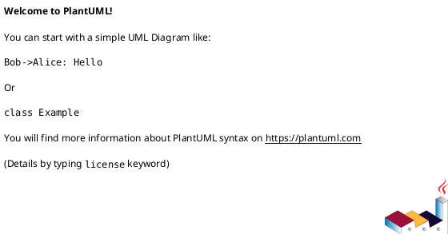

# 作業履歴 2017-03-28

## 概要

2017-03-28の作業内容をまとめています。

## コミット: a8091d0

### メッセージ

```
コメント返信機能
```

### 変更されたファイル

- M	app/views/customer/top/dashboard.html.erb
- M	app/views/staff/top/index.html.erb

### 変更内容

```diff
commit a8091d00ddbbd0cfee0f162da5f522e4e18503ad
Author: k2works <kakimomokuri@gmail.com>
Date:   Tue Mar 28 13:07:44 2017 +0900

    コメント返信機能

diff --git a/app/views/customer/top/dashboard.html.erb b/app/views/customer/top/dashboard.html.erb
index c1db441..a819b2a 100644
--- a/app/views/customer/top/dashboard.html.erb
+++ b/app/views/customer/top/dashboard.html.erb
@@ -8,6 +8,10 @@
     <h2 class="sectionLabel">お知らせ</h2>
   </div>
   <ol class="NewsList">
+    <li class="NewsList__item">
+      <time class="NewsList__head" datatime="2017-3-28">2017.3.28</time>
+      <span class="NewsList__body">問い合わせ返信機能を追加</span>
+    </li>
     <li class="NewsList__item">
       <time class="NewsList__head" datatime="2017-3-18">2017.3.18</time>
       <span class="NewsList__body">問い合わせ機能追加</span>
diff --git a/app/views/staff/top/index.html.erb b/app/views/staff/top/index.html.erb
index 5677faf..dee2081 100644
--- a/app/views/staff/top/index.html.erb
+++ b/app/views/staff/top/index.html.erb
@@ -8,6 +8,10 @@
     <h2 class="sectionLabel">お知らせ</h2>
   </div>
   <ol class="NewsList">
+    <li class="NewsList__item">
+      <time class="NewsList__head" datatime="2017-3-28">2017.3.28</time>
+      <span class="NewsList__body">問い合わせ返信機能を追加</span>
+    </li>
     <li class="NewsList__item">
       <time class="NewsList__head" datatime="2017-3-18">2017.3.18</time>
       <span class="NewsList__body">問い合わせの一覧表示と削除機能を追加</span>

```

## コミット: 616e47b

### メッセージ

```
問4 #21
```

### 変更されたファイル

- M	README.md
- A	app/controllers/customer/replies_controller.rb
- M	app/views/customer/messages/show.html.erb
- A	app/views/customer/replies/_confirming_form.html.erb
- A	app/views/customer/replies/_form.html.erb
- A	app/views/customer/replies/_message.erb
- A	app/views/customer/replies/confirm.html.erb
- A	app/views/customer/replies/new.html.erb
- M	config/locales/controllers/ja.yml
- M	config/locales/views/ja.yml
- M	config/routes.rb
- M	db/schema.rb

### 変更内容

```diff
commit 616e47baf9d21ef430a3ce9a14ecb6c62d982de0
Author: k2works <kakimomokuri@gmail.com>
Date:   Tue Mar 28 12:49:53 2017 +0900

    問4 #21

diff --git a/README.md b/README.md
index 868fde6..14a6731 100644
--- a/README.md
+++ b/README.md
@@ -792,7 +792,7 @@ git push heroku master
 + 問１
 + 問２
 + 問３
-
++ 問４
 
 **[⬆ back to top](#構成)**
 
diff --git a/app/controllers/customer/replies_controller.rb b/app/controllers/customer/replies_controller.rb
new file mode 100644
index 0000000..d6c2a7d
--- /dev/null
+++ b/app/controllers/customer/replies_controller.rb
@@ -0,0 +1,44 @@
+class Customer::RepliesController < Customer::Base
+  before_action :prepare_message
+
+  def new
+    @reply = CustomerMessage.new
+  end
+
+  # POST
+  def confirm
+    @reply = CustomerMessage.new(customer_message_params)
+    if @reply.valid?
+      render action: 'confirm'
+    else
+      flash.now.alert = t('.flash_alert')
+      render action: 'new'
+    end
+  end
+
+  def create
+    @reply = CustomerMessage.new(customer_message_params)
+    if params[:commit]
+      @reply.parent = @message
+      if @reply.save
+        flash.notice = t('.flash_notice')
+        redirect_to :customer_messages
+      else
+        flash.now.alert = t('.flash_alert')
+        render action: 'new'
+      end
+    else
+      render action: 'new'
+    end
+  end
+
+  private
+  def prepare_message
+    @message = StaffMessage.find(params[:message_id])
+  end
+
+  def customer_message_params
+    params.require(:customer_message).permit(:subject, :body)
+  end
+
+end
diff --git a/app/views/customer/messages/show.html.erb b/app/views/customer/messages/show.html.erb
index 1fc6004..72fe615 100644
--- a/app/views/customer/messages/show.html.erb
+++ b/app/views/customer/messages/show.html.erb
@@ -3,6 +3,9 @@
 </section>
 
 <section class="Section l-column Table CustomerTable">
+  <div class="Table__links">
+    <%= link_to t('.reply'), new_customer_message_reply_path(@message), class:'btn btn-default' %>
+  </div>
   <table class="Table__body Table__body--attributes CustomerTable__body">
     <% p = MessagePresenter.new(@message, self) %>
     <tr class="Table__tr"><th class="Table__th"><%= t('.sender') %></th><td><%= p.sender %></td></tr>
diff --git a/app/views/customer/replies/_confirming_form.html.erb b/app/views/customer/replies/_confirming_form.html.erb
new file mode 100644
index 0000000..1ae2ce7
--- /dev/null
+++ b/app/views/customer/replies/_confirming_form.html.erb
@@ -0,0 +1,6 @@
+<%= markup(:div, id: 'confirming-panel') do |m|
+  p = ConfirmingFormPresenter.new(f, self)
+  m.div t('customer.replies.confirm.confirm_message')
+  m << p.text_field_block(:subject, t('activerecord.attributes.message.subject'))
+  m << p.text_area_block(:body, t('activerecord.attributes.message.body'))
+end %>
\ No newline at end of file
diff --git a/app/views/customer/replies/_form.html.erb b/app/views/customer/replies/_form.html.erb
new file mode 100644
index 0000000..063ddc9
--- /dev/null
+++ b/app/views/customer/replies/_form.html.erb
@@ -0,0 +1,10 @@
+<%= markup do |m|
+  p = FormPresenter.new(f, self)
+  p.with_options(required: true) do |q|
+    m << q.text_field_block(:subject, t('activerecord.attributes.message.subject'), size: 40, maxlength: 80)
+    m.div(class: 'AppForm__input-block') do |m|
+      m << q.text_area(:body, rows: 6, style: 'with: 454px')
+      m.span '(800文字以内)', class: 'instruction', style: 'flaot; rigth'
+    end
+  end
+end %>
\ No newline at end of file
diff --git a/app/views/customer/replies/_message.erb b/app/views/customer/replies/_message.erb
new file mode 100644
index 0000000..24c01d8
--- /dev/null
+++ b/app/views/customer/replies/_message.erb
@@ -0,0 +1,11 @@
+<% p = MessagePresenter.new(@message, self) %>
+<section class="Section l-column Table StaffTable">
+  <table class="Table__body Table__body--attributes StaffTable__body">
+    <% p = MessagePresenter.new(@message, self) %>
+    <tr class="Table__tr"><th class="Table__th"><%= t('customer.replies.new.sender') %></th><td><%= p.sender %></td></tr>
+    <tr class="Table__tr"><th class="Table__th"><%= t('customer.replies.new.subject') %></th><td><%= p.subject %></td></tr>
+    <tr class="Table__tr"><th class="Table__th"><%= t('customer.replies.new.created_at') %></th><td class="Table__td--date"><%= p.created_at %></td></tr>
+  </table>
+
+  <div class="Table__body--description"><%= p.formatted_body %></div>
+</section>
\ No newline at end of file
diff --git a/app/views/customer/replies/confirm.html.erb b/app/views/customer/replies/confirm.html.erb
new file mode 100644
index 0000000..6d57333
--- /dev/null
+++ b/app/views/customer/replies/confirm.html.erb
@@ -0,0 +1,18 @@
+<% @title = t('.title') %>
+<section class="Section">
+  <h1 class="Staff__title"><%= @title %></h1>
+</section>
+
+<section class="Section l-column AppForm">
+  <div class="AppForm__generic-form StaffAppForm__generic-form AppForm__customer-form">
+    <%= bootstrap_form_for @reply, url: customer_message_reply_path(@message) do |f| %>
+        <%= render 'confirming_form', f: f %>
+        <div class="AppForm__buttons">
+          <%= f.submit t('.send'),class: 'btn btn-default btn-lg' %>
+          <%= f.submit t('.correct'), name: 'correct', class: 'btn btn-default btn-lg' %>
+          <%= link_to t('.cancel'), :customer_messages, class: 'btn btn-default btn-lg' %>
+        </div>
+    <% end %>
+    <%= render 'message' %>
+  </div>
+</section>
\ No newline at end of file
diff --git a/app/views/customer/replies/new.html.erb b/app/views/customer/replies/new.html.erb
new file mode 100644
index 0000000..f046c15
--- /dev/null
+++ b/app/views/customer/replies/new.html.erb
@@ -0,0 +1,17 @@
+<% @title = t('.title') %>
+<section class="Section">
+  <h1 class="Customer__title"><%= @title %></h1>
+</section>
+
+<section class="Section l-column AppForm">
+  <div class="AppForm__generic-form CustomerAppForm__generic-form">
+    <%= bootstrap_form_for @reply, url: confirm_customer_message_reply_path(@message) do |f| %>
+        <%= render 'form', f: f %>
+        <div class="AppForm__buttons">
+          <%= f.submit t('.submit') ,class: 'btn btn-default btn-lg'%>
+          <%= link_to t('.cancel'), :customer_root ,class: 'btn btn-default btn-lg'%>
+        </div>
+    <% end %>
+  </div>
+  <%= render 'message' %>
+</section>
diff --git a/config/locales/controllers/ja.yml b/config/locales/controllers/ja.yml
index 4a4b989..97ff6e3 100644
--- a/config/locales/controllers/ja.yml
+++ b/config/locales/controllers/ja.yml
@@ -97,4 +97,11 @@ ja:
         flash_alert: '入力に誤りがあります。'
       destroy:
         flash_notice: 'メッセージを削除しました。'
+    replies:
+      confirm:
+        flash_alert: '入力に誤りがあります。'
+      create:
+        flash_notice: 'メッセージ返信しました。'
+        flash_alert: '入力に誤りがあります。'
+
 
diff --git a/config/locales/views/ja.yml b/config/locales/views/ja.yml
index 7428b9e..94c8e8f 100644
--- a/config/locales/views/ja.yml
+++ b/config/locales/views/ja.yml
@@ -355,6 +355,7 @@ ja:
         sender: '送信者'
         subject: '件名'
         created_at: '作成日時'
+        reply: '回答する'
       new:
         title: '新規問い合わせ'
         submit: '確認画面へ進む'
@@ -363,4 +364,18 @@ ja:
         title: 'アカウントの更新（確認）'
         confirm_message: '以下の内容でアカウントを更新します。よろしいですか？'
         update: '送信'
-        correct: '訂正'
\ No newline at end of file
+        correct: '訂正'
+    replies:
+      new:
+        title: 'メッセージへの返信'
+        submit: '確認画面へ進む'
+        cancel: 'キャンセル'
+        sender: '送信者'
+        subject: '件名'
+        created_at: '作成日時'
+      confirm:
+        title: '問い合わせへの返信（確認）'
+        send: '送信'
+        correct: '訂正'
+        cancel: 'キャンセル'
+        confirm_message: '以下の内容で返信します。よろしいですか？'
\ No newline at end of file
diff --git a/config/routes.rb b/config/routes.rb
index 66b0ef3..1c70e53 100644
--- a/config/routes.rb
+++ b/config/routes.rb
@@ -81,6 +81,9 @@
 #               customer_programs GET    /programs(.:format)                                  customer/programs#index {:host=>"0.0.0.0"}
 #                customer_program GET    /programs/:id(.:format)                              customer/programs#show {:host=>"0.0.0.0"}
 #       confirm_customer_messages POST   /messages/confirm(.:format)                          customer/messages#confirm {:host=>"0.0.0.0"}
+#  confirm_customer_message_reply POST   /messages/:message_id/reply/confirm(.:format)        customer/replies#confirm {:host=>"0.0.0.0"}
+#      new_customer_message_reply GET    /messages/:message_id/reply/new(.:format)            customer/replies#new {:host=>"0.0.0.0"}
+#          customer_message_reply POST   /messages/:message_id/reply(.:format)                customer/replies#create {:host=>"0.0.0.0"}
 #               customer_messages GET    /messages(.:format)                                  customer/messages#index {:host=>"0.0.0.0"}
 #                                 POST   /messages(.:format)                                  customer/messages#create {:host=>"0.0.0.0"}
 #            new_customer_message GET    /messages/new(.:format)                              customer/messages#new {:host=>"0.0.0.0"}
@@ -158,6 +161,9 @@ Rails.application.routes.draw do
       end
       resources :messages, except: [ :edit, :update ] do
         post :confirm, on: :collection
+        resource :reply, only: [ :new, :create ] do
+          post :confirm
+        end
       end
     end
   end
diff --git a/db/schema.rb b/db/schema.rb
index 27f7a1c..14ca97f 100644
--- a/db/schema.rb
+++ b/db/schema.rb
@@ -12,7 +12,7 @@
 
 ActiveRecord::Schema.define(version: 20170327081649) do
 
-  create_table "addresses", force: :cascade, options: "ENGINE=InnoDB DEFAULT CHARSET=utf8", comment: "住所" do |t|
+  create_table "addresses", force: :cascade, comment: "住所" do |t|
     t.integer  "customer_id",                null: false, comment: "顧客への外部キー"
     t.string   "type",                       null: false, comment: "継承カラム"
     t.string   "postal_code",                null: false, comment: "郵便番号"
@@ -33,7 +33,7 @@ ActiveRecord::Schema.define(version: 20170327081649) do
     t.index ["type", "prefecture", "city"], name: "index_addresses_on_type_and_prefecture_and_city", using: :btree
   end
 
-  create_table "administrators", force: :cascade, options: "ENGINE=InnoDB DEFAULT CHARSET=utf8", comment: "管理者" do |t|
+  create_table "administrators", force: :cascade, comment: "管理者" do |t|
     t.string   "email",                           null: false, comment: "メールアドレス"
     t.string   "email_for_index",                 null: false, comment: "索引用メールアドレス"
     t.string   "hashed_password",                              comment: "パスワード"
@@ -43,7 +43,7 @@ ActiveRecord::Schema.define(version: 20170327081649) do
     t.index ["email_for_index"], name: "index_administrators_on_email_for_index", unique: true, using: :btree
   end
 
-  create_table "allowed_sources", force: :cascade, options: "ENGINE=InnoDB DEFAULT CHARSET=utf8", comment: "IPアドレス制限" do |t|
+  create_table "allowed_sources", force: :cascade, comment: "IPアドレス制限" do |t|
     t.string   "namespace",                  null: false, comment: "名前空間"
     t.integer  "octet1",                     null: false, comment: "第１オクテット"
     t.integer  "octet2",                     null: false, comment: "第２オクテット"
@@ -55,7 +55,7 @@ ActiveRecord::Schema.define(version: 20170327081649) do
     t.index ["namespace", "octet1", "octet2", "octet3", "octet4"], name: "index_allowed_sources_on_namespace_and_octets", unique: true, using: :btree
   end
 
-  create_table "customers", force: :cascade, options: "ENGINE=InnoDB DEFAULT CHARSET=utf8", comment: "顧客" do |t|
+  create_table "customers", force: :cascade, comment: "顧客" do |t|
     t.string   "email",            null: false, comment: "メールアドレス"
     t.string   "email_for_index",  null: false, comment: "顧客用メールアドレス"
     t.string   "family_name",      null: false, comment: "姓"
@@ -84,7 +84,7 @@ ActiveRecord::Schema.define(version: 20170327081649) do
     t.index ["given_name_kana"], name: "index_customers_on_given_name_kana", using: :btree
   end
 
-  create_table "entries", force: :cascade, options: "ENGINE=InnoDB DEFAULT CHARSET=utf8", comment: "申し込み" do |t|
+  create_table "entries", force: :cascade, comment: "申し込み" do |t|
     t.integer  "program_id",                  null: false
     t.integer  "customer_id",                 null: false
     t.boolean  "approved",    default: false, null: false, comment: "承認済みフラグ"
@@ -96,7 +96,7 @@ ActiveRecord::Schema.define(version: 20170327081649) do
     t.index ["program_id"], name: "index_entries_on_program_id", using: :btree
   end
 
-  create_table "hash_locks", force: :cascade, options: "ENGINE=InnoDB DEFAULT CHARSET=utf8", comment: "排他制御" do |t|
+  create_table "hash_locks", force: :cascade, comment: "排他制御" do |t|
     t.string   "table",      null: false, comment: "テーブル"
     t.string   "column",     null: false, comment: "カラム"
     t.string   "key",        null: false, comment: "キー"
@@ -105,7 +105,7 @@ ActiveRecord::Schema.define(version: 20170327081649) do
     t.index ["table", "column", "key"], name: "index_hash_locks_on_table_and_column_and_key", unique: true, using: :btree
   end
 
-  create_table "message_tag_links", force: :cascade, options: "ENGINE=InnoDB DEFAULT CHARSET=utf8", comment: "タグリンクテーブル" do |t|
+  create_table "message_tag_links", force: :cascade, comment: "タグリンクテーブル" do |t|
     t.integer "message_id", null: false
     t.integer "tag_id",     null: false
     t.index ["message_id", "tag_id"], name: "index_message_tag_links_on_message_id_and_tag_id", unique: true, using: :btree
@@ -113,7 +113,7 @@ ActiveRecord::Schema.define(version: 20170327081649) do
     t.index ["tag_id"], name: "index_message_tag_links_on_tag_id", using: :btree
   end
 
-  create_table "messages", force: :cascade, options: "ENGINE=InnoDB DEFAULT CHARSET=utf8", comment: "問い合わせ" do |t|
+  create_table "messages", force: :cascade, comment: "問い合わせ" do |t|
     t.integer  "customer_id",                                   null: false
     t.integer  "staff_member_id"
     t.integer  "root_id",                                                    comment: "Messageへの外部キー"
@@ -138,7 +138,7 @@ ActiveRecord::Schema.define(version: 20170327081649) do
     t.index ["type", "staff_member_id"], name: "index_messages_on_type_and_staff_member_id", using: :btree
   end
 
-  create_table "phones", force: :cascade, options: "ENGINE=InnoDB DEFAULT CHARSET=utf8", comment: "電話" do |t|
+  create_table "phones", force: :cascade, comment: "電話" do |t|
     t.integer  "customer_id",                      null: false, comment: "顧客への外部キー"
     t.integer  "address_id",                                    comment: "住所への外部キー"
     t.string   "number",                           null: false, comment: "電話番号"
@@ -153,7 +153,7 @@ ActiveRecord::Schema.define(version: 20170327081649) do
     t.index ["number_for_index"], name: "index_phones_on_number_for_index", using: :btree
   end
 
-  create_table "programs", force: :cascade, options: "ENGINE=InnoDB DEFAULT CHARSET=utf8", comment: "プログラム" do |t|
+  create_table "programs", force: :cascade, comment: "プログラム" do |t|
     t.integer  "registrant_id",                            null: false, comment: "登録職員（外部キー）"
     t.string   "title",                                    null: false, comment: "タイトル"
     t.text     "description",                limit: 65535,              comment: "説明"
@@ -167,7 +167,7 @@ ActiveRecord::Schema.define(version: 20170327081649) do
     t.index ["registrant_id"], name: "index_programs_on_registrant_id", using: :btree
   end
 
-  create_table "staff_events", force: :cascade, options: "ENGINE=InnoDB DEFAULT CHARSET=utf8", comment: "職員イベント" do |t|
+  create_table "staff_events", force: :cascade, comment: "職員イベント" do |t|
     t.integer  "staff_member_id", null: false, comment: "職員レコードへの外部キー"
     t.string   "type",            null: false, comment: "イベントタイプ"
     t.datetime "created_at",      null: false, comment: "発生時刻"
@@ -176,7 +176,7 @@ ActiveRecord::Schema.define(version: 20170327081649) do
     t.index ["staff_member_id"], name: "index_staff_events_on_staff_member_id", using: :btree
   end
 
-  create_table "staff_members", force: :cascade, options: "ENGINE=InnoDB DEFAULT CHARSET=utf8", comment: "職員" do |t|
+  create_table "staff_members", force: :cascade, comment: "職員" do |t|
     t.string   "email",                            null: false, comment: "メールアドレス"
     t.string   "email_for_index",                  null: false, comment: "索引用メールアドレス"
     t.string   "family_name",                      null: false, comment: "姓"
@@ -193,7 +193,7 @@ ActiveRecord::Schema.define(version: 20170327081649) do
     t.index ["family_name_kana", "given_name_kana"], name: "index_staff_members_on_family_name_kana_and_given_name_kana", using: :btree
   end
 
-  create_table "tags", force: :cascade, options: "ENGINE=InnoDB DEFAULT CHARSET=utf8", comment: "タグ" do |t|
+  create_table "tags", force: :cascade, comment: "タグ" do |t|
     t.string   "value",      null: false
     t.datetime "created_at", null: false
     t.datetime "updated_at", null: false

```

### 構造変更



