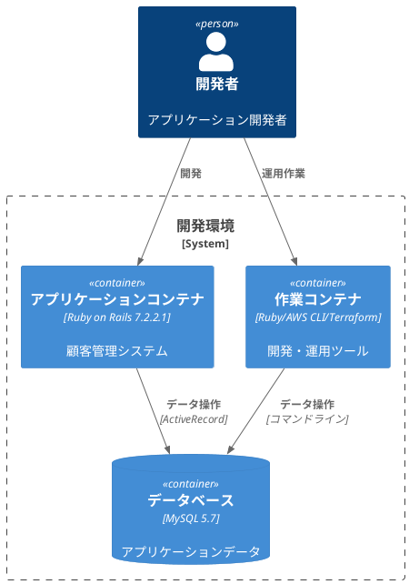

# 作業履歴 2025-05-10

## 概要

2025-05-10の作業内容をまとめています。このジャーナルでは、開発環境の改善とデータベーススキーマの最適化に関する作業を記録しています。

## 開発環境構成図



## 作業内容

### 開発コンテナの改善

開発環境の効率化と一貫性を確保するため、Docker環境の設定を見直しました。特に、作業用コンテナの追加とデータベーススキーマの最適化を行いました。

#### 変更点の概要

1. 作業用コンテナ（console）の追加
   - AWS CLI、Terraform、Packerなどの運用ツールを含む
   - 開発環境と本番環境の一貫性を確保

2. データベーススキーマの最適化
   - コメント部分の整理
   - インデックス設定の統一

## コミット: 750fb96

### メッセージ

```
chore:開発コンテナ修正
```

### 変更されたファイル

- M	db/schema.rb
- M	docker-compose.yml

### 変更内容

```diff
commit 750fb96d904d90c8dd77e59ed647d0a6f2aabf25
Author: k2works <kakimomokuri@gmail.com>
Date:   Sat May 10 13:36:59 2025 +0900

    chore:開発コンテナ修正

diff --git a/db/schema.rb b/db/schema.rb
index 14ca97f..04e130c 100644
--- a/db/schema.rb
+++ b/db/schema.rb
@@ -12,203 +12,192 @@

 ActiveRecord::Schema.define(version: 20170327081649) do

-  create_table "addresses", force: :cascade, comment: "住所" do |t|
-    t.integer  "customer_id",                null: false, comment: "顧客への外部キー"
-    t.string   "type",                       null: false, comment: "継承カラム"
-    t.string   "postal_code",                null: false, comment: "郵便番号"
-    t.string   "prefecture",                 null: false, comment: "都道府県"
-    t.string   "city",                       null: false, comment: "市区町村"
-    t.string   "address1",                   null: false, comment: "町域・番地等"
-    t.string   "address2",                   null: false, comment: "建物名・部屋番号"
-    t.string   "company_name",  default: "", null: false, comment: "会社名"
-    t.string   "division_name", default: "", null: false, comment: "部署名"
+  create_table "addresses", force: :cascade do |t|
+    t.integer  "customer_id",                null: false
+    t.string   "type",                       null: false
+    t.string   "postal_code",                null: false
+    t.string   "prefecture",                 null: false
+    t.string   "city",                       null: false
+    t.string   "address1",                   null: false
+    t.string   "address2",                   null: false
+    t.string   "company_name",  default: "", null: false
+    t.string   "division_name", default: "", null: false
     t.datetime "created_at",                 null: false
     t.datetime "updated_at",                 null: false
-    t.index ["city"], name: "index_addresses_on_city", using: :btree
-    t.index ["customer_id"], name: "index_addresses_on_customer_id", using: :btree
-    t.index ["postal_code"], name: "index_addresses_on_postal_code", using: :btree
-    t.index ["prefecture", "city"], name: "index_addresses_on_prefecture_and_city", using: :btree
-    t.index ["type", "city"], name: "index_addresses_on_type_and_city", using: :btree
-    t.index ["type", "customer_id"], name: "index_addresses_on_type_and_customer_id", unique: true, using: :btree
-    t.index ["type", "prefecture", "city"], name: "index_addresses_on_type_and_prefecture_and_city", using: :btree
+    t.index ["city"], name: "index_addresses_on_city"
+    t.index ["customer_id"], name: "index_addresses_on_customer_id"
+    t.index ["postal_code"], name: "index_addresses_on_postal_code"
+    t.index ["prefecture", "city"], name: "index_addresses_on_prefecture_and_city"
+    t.index ["type", "city"], name: "index_addresses_on_type_and_city"
+    t.index ["type", "customer_id"], name: "index_addresses_on_type_and_customer_id", unique: true
+    t.index ["type", "prefecture", "city"], name: "index_addresses_on_type_and_prefecture_and_city"
   end

-  create_table "administrators", force: :cascade, comment: "管理者" do |t|
-    t.string   "email",                           null: false, comment: "メールアドレス"
-    t.string   "email_for_index",                 null: false, comment: "索引用メールアドレス"
-    t.string   "hashed_password",                              comment: "パスワード"
-    t.boolean  "suspended",       default: false, null: false, comment: "停止フラグ"
+  create_table "administrators", force: :cascade do |t|
+    t.string   "email",                           null: false
+    t.string   "email_for_index",                 null: false
+    t.string   "hashed_password"
+    t.boolean  "suspended",       default: false, null: false
     t.datetime "created_at",                      null: false
     t.datetime "updated_at",                      null: false
-    t.index ["email_for_index"], name: "index_administrators_on_email_for_index", unique: true, using: :btree
+    t.index ["email_for_index"], name: "index_administrators_on_email_for_index", unique: true
   end

-  create_table "allowed_sources", force: :cascade, comment: "IPアドレス制限" do |t|
-    t.string   "namespace",                  null: false, comment: "名前空間"
-    t.integer  "octet1",                     null: false, comment: "第１オクテット"
-    t.integer  "octet2",                     null: false, comment: "第２オクテット"
-    t.integer  "octet3",                     null: false, comment: "第３オクテット"
-    t.integer  "octet4",                     null: false, comment: "第４オクテット"
-    t.boolean  "wildcard",   default: false, null: false, comment: "ワイルドカード"
+  create_table "allowed_sources", force: :cascade do |t|
+    t.string   "namespace",                  null: false
+    t.integer  "octet1",                     null: false
+    t.integer  "octet2",                     null: false
+    t.integer  "octet3",                     null: false
+    t.integer  "octet4",                     null: false
+    t.boolean  "wildcard",   default: false, null: false
     t.datetime "created_at",                 null: false
     t.datetime "updated_at",                 null: false
-    t.index ["namespace", "octet1", "octet2", "octet3", "octet4"], name: "index_allowed_sources_on_namespace_and_octets", unique: true, using: :btree
+    t.index ["namespace", "octet1", "octet2", "octet3", "octet4"], name: "index_allowed_sources_on_namespace_and_octets", unique: true
   end

-  create_table "customers", force: :cascade, comment: "顧客" do |t|
-    t.string   "email",            null: false, comment: "メールアドレス"
-    t.string   "email_for_index",  null: false, comment: "顧客用メールアドレス"
-    t.string   "family_name",      null: false, comment: "姓"
-    t.string   "given_name",       null: false, comment: "名"
-    t.string   "family_name_kana", null: false, comment: "姓（カナ）"
-    t.string   "given_name_kana",  null: false, comment: "名（カナ）"
-    t.string   "gender",                        comment: "性別"
-    t.date     "birthday",                      comment: "誕生日"
-    t.string   "hashed_password",               comment: "パスワード"
+  create_table "customers", force: :cascade do |t|
+    t.string   "email",            null: false
+    t.string   "email_for_index",  null: false
+    t.string   "family_name",      null: false
+    t.string   "given_name",       null: false
+    t.string   "family_name_kana", null: false
+    t.string   "given_name_kana",  null: false
+    t.string   "gender"
+    t.date     "birthday"
+    t.string   "hashed_password"
     t.datetime "created_at",       null: false
     t.datetime "updated_at",       null: false
-    t.integer  "birth_year",                    comment: "誕生年"
-    t.integer  "birth_month",                   comment: "誕生月"
-    t.integer  "birth_mday",                    comment: "誕生日"
-    t.index ["birth_mday", "family_name_kana", "given_name_kana"], name: "index_customers_on_birth_mday_and_furigana", using: :btree
-    t.index ["birth_mday", "given_name_kana"], name: "index_customers_on_birth_mday_and_given_name_kana", using: :btree
-    t.index ["birth_month", "birth_mday"], name: "index_customers_on_birth_month_and_birth_mday", using: :btree
-    t.index ["birth_month", "family_name_kana", "given_name_kana"], name: "index_customers_on_birth_month_and_furigana", using: :btree
-    t.index ["birth_month", "given_name_kana"], name: "index_customers_on_birth_month_and_given_name_kana", using: :btree
-    t.index ["birth_year", "birth_month", "birth_mday"], name: "index_customers_on_birth_year_and_birth_month_and_birth_mday", using: :btree
-    t.index ["birth_year", "family_name_kana", "given_name_kana"], name: "index_customers_on_birth_year_and_furigana", using: :btree
-    t.index ["birth_year", "given_name_kana"], name: "index_customers_on_birth_year_and_given_name_kana", using: :btree
-    t.index ["email_for_index"], name: "index_customers_on_email_for_index", unique: true, using: :btree
-    t.index ["family_name_kana", "given_name_kana"], name: "index_customers_on_family_name_kana_and_given_name_kana", using: :btree
-    t.index ["gender", "family_name_kana", "given_name_kana"], name: "index_customers_on_gender_and_furigana", using: :btree
-    t.index ["given_name_kana"], name: "index_customers_on_given_name_kana", using: :btree
+    t.integer  "birth_year"
+    t.integer  "birth_month"
+    t.integer  "birth_mday"
+    t.index ["birth_mday", "family_name_kana", "given_name_kana"], name: "index_customers_on_birth_mday_and_furigana"
+    t.index ["birth_mday", "given_name_kana"], name: "index_customers_on_birth_mday_and_given_name_kana"
+    t.index ["birth_month", "birth_mday"], name: "index_customers_on_birth_month_and_birth_mday"
+    t.index ["birth_month", "family_name_kana", "given_name_kana"], name: "index_customers_on_birth_month_and_furigana"
+    t.index ["birth_month", "given_name_kana"], name: "index_customers_on_birth_month_and_given_name_kana"
+    t.index ["birth_year", "birth_month", "birth_mday"], name: "index_customers_on_birth_year_and_birth_month_and_birth_mday"
+    t.index ["birth_year", "family_name_kana", "given_name_kana"], name: "index_customers_on_birth_year_and_furigana"
+    t.index ["birth_year", "given_name_kana"], name: "index_customers_on_birth_year_and_given_name_kana"
+    t.index ["email_for_index"], name: "index_customers_on_email_for_index", unique: true
+    t.index ["family_name_kana", "given_name_kana"], name: "index_customers_on_family_name_kana_and_given_name_kana"
+    t.index ["gender", "family_name_kana", "given_name_kana"], name: "index_customers_on_gender_and_furigana"
+    t.index ["given_name_kana"], name: "index_customers_on_given_name_kana"
   end

-  create_table "entries", force: :cascade, comment: "申し込み" do |t|
+  create_table "entries", force: :cascade do |t|
     t.integer  "program_id",                  null: false
     t.integer  "customer_id",                 null: false
-    t.boolean  "approved",    default: false, null: false, comment: "承認済みフラグ"
-    t.boolean  "canceled",    default: false, null: false, comment: "取り消しフラグ"
+    t.boolean  "approved",    default: false, null: false
+    t.boolean  "canceled",    default: false, null: false
     t.datetime "created_at",                  null: false
     t.datetime "updated_at",                  null: false
-    t.index ["customer_id"], name: "index_entries_on_customer_id", using: :btree
-    t.index ["program_id", "customer_id"], name: "index_entries_on_program_id_and_customer_id", unique: true, using: :btree
-    t.index ["program_id"], name: "index_entries_on_program_id", using: :btree
+    t.index ["customer_id"], name: "index_entries_on_customer_id"
+    t.index ["program_id", "customer_id"], name: "index_entries_on_program_id_and_customer_id", unique: true
+    t.index ["program_id"], name: "index_entries_on_program_id"
   end

-  create_table "hash_locks", force: :cascade, comment: "排他制御" do |t|
-    t.string   "table",      null: false, comment: "テーブル"
-    t.string   "column",     null: false, comment: "カラム"
-    t.string   "key",        null: false, comment: "キー"
+  create_table "hash_locks", force: :cascade do |t|
+    t.string   "table",      null: false
+    t.string   "column",     null: false
+    t.string   "key",        null: false
     t.datetime "created_at", null: false
     t.datetime "updated_at", null: false
-    t.index ["table", "column", "key"], name: "index_hash_locks_on_table_and_column_and_key", unique: true, using: :btree
+    t.index ["table", "column", "key"], name: "index_hash_locks_on_table_and_column_and_key", unique: true
   end

-  create_table "message_tag_links", force: :cascade, comment: "タグリンクテーブル" do |t|
+  create_table "message_tag_links", force: :cascade do |t|
     t.integer "message_id", null: false
     t.integer "tag_id",     null: false
-    t.index ["message_id", "tag_id"], name: "index_message_tag_links_on_message_id_and_tag_id", unique: true, using: :btree
-    t.index ["message_id"], name: "index_message_tag_links_on_message_id", using: :btree
-    t.index ["tag_id"], name: "index_message_tag_links_on_tag_id", using: :btree
+    t.index ["message_id", "tag_id"], name: "index_message_tag_links_on_message_id_and_tag_id", unique: true
+    t.index ["message_id"], name: "index_message_tag_links_on_message_id"
+    t.index ["tag_id"], name: "index_message_tag_links_on_tag_id"
   end

-  create_table "messages", force: :cascade, comment: "問い合わせ" do |t|
+  create_table "messages", force: :cascade do |t|
     t.integer  "customer_id",                                   null: false
     t.integer  "staff_member_id"
-    t.integer  "root_id",                                                    comment: "Messageへの外部キー"
-    t.integer  "parent_id",                                                  comment: "Messageへの外部キー"
-    t.string   "type",                                          null: false, comment: "継承カラム"
-    t.string   "status",                        default: "new", null: false, comment: "状態（職員向け）"
-    t.string   "subject",                                       null: false, comment: "件名"
-    t.text     "body",            limit: 65535,                              comment: "本文"
-    t.text     "remarks",         limit: 65535,                              comment: "備考（職員向け）"
-    t.boolean  "discarded",                     default: false, null: false, comment: "顧客側の削除フラグ"
-    t.boolean  "deleted",                       default: false, null: false, comment: "職員側の削除フラグ"
+    t.integer  "root_id"
+    t.integer  "parent_id"
+    t.string   "type",                                          null: false
+    t.string   "status",                        default: "new", null: false
+    t.string   "subject",                                       null: false
+    t.text     "body",            limit: 65535
+    t.text     "remarks",         limit: 65535
+    t.boolean  "discarded",                     default: false, null: false
+    t.boolean  "deleted",                       default: false, null: false
     t.datetime "created_at",                                    null: false
     t.datetime "updated_at",                                    null: false
-    t.index ["customer_id", "deleted", "created_at"], name: "index_messages_on_customer_id_and_deleted_and_created_at", using: :btree
-    t.index ["customer_id", "deleted", "status", "created_at"], name: "index_messages_on_c_d_s_c", using: :btree
-    t.index ["customer_id", "discarded", "created_at"], name: "index_messages_on_customer_id_and_discarded_and_created_at", using: :btree
-    t.index ["customer_id"], name: "index_messages_on_customer_id", using: :btree
-    t.index ["parent_id"], name: "fk_rails_aafcb31dbf", using: :btree
-    t.index ["root_id", "deleted", "created_at"], name: "index_messages_on_root_id_and_deleted_and_created_at", using: :btree
-    t.index ["staff_member_id"], name: "index_messages_on_staff_member_id", using: :btree
-    t.index ["type", "customer_id"], name: "index_messages_on_type_and_customer_id", using: :btree
-    t.index ["type", "staff_member_id"], name: "index_messages_on_type_and_staff_member_id", using: :btree
+    t.index ["customer_id", "deleted", "created_at"], name: "index_messages_on_customer_id_and_deleted_and_created_at"
+    t.index ["customer_id", "deleted", "status", "created_at"], name: "index_messages_on_c_d_s_c"
+    t.index ["customer_id", "discarded", "created_at"], name: "index_messages_on_customer_id_and_discarded_and_created_at"
+    t.index ["customer_id"], name: "index_messages_on_customer_id"
+    t.index ["parent_id"], name: "fk_rails_aafcb31dbf"
+    t.index ["root_id", "deleted", "created_at"], name: "index_messages_on_root_id_and_deleted_and_created_at"
+    t.index ["staff_member_id"], name: "index_messages_on_staff_member_id"
+    t.index ["type", "customer_id"], name: "index_messages_on_type_and_customer_id"
+    t.index ["type", "staff_member_id"], name: "index_messages_on_type_and_staff_member_id"
   end

-  create_table "phones", force: :cascade, comment: "電話" do |t|
-    t.integer  "customer_id",                      null: false, comment: "顧客への外部キー"
-    t.integer  "address_id",                                    comment: "住所への外部キー"
-    t.string   "number",                           null: false, comment: "電話番号"
-    t.string   "number_for_index",                 null: false, comment: "索引用電話番号"
-    t.boolean  "primary",          default: false, null: false, comment: "優先フラグ"
+  create_table "phones", force: :cascade do |t|
+    t.integer  "customer_id",                      null: false
+    t.integer  "address_id"
+    t.string   "number",                           null: false
+    t.string   "number_for_index",                 null: false
+    t.boolean  "primary",          default: false, null: false
     t.datetime "created_at",                       null: false
     t.datetime "updated_at",                       null: false
-    t.string   "last_four_digits",                              comment: "電話番号下４桁"
-    t.index ["address_id"], name: "index_phones_on_address_id", using: :btree
-    t.index ["customer_id"], name: "index_phones_on_customer_id", using: :btree
-    t.index ["last_four_digits"], name: "index_phones_on_last_four_digits", using: :btree
-    t.index ["number_for_index"], name: "index_phones_on_number_for_index", using: :btree
+    t.string   "last_four_digits"
+    t.index ["address_id"], name: "index_phones_on_address_id"
+    t.index ["customer_id"], name: "index_phones_on_customer_id"
+    t.index ["last_four_digits"], name: "index_phones_on_last_four_digits"
+    t.index ["number_for_index"], name: "index_phones_on_number_for_index"
   end

-  create_table "programs", force: :cascade, comment: "プログラム" do |t|
-    t.integer  "registrant_id",                            null: false, comment: "登録職員（外部キー）"
-    t.string   "title",                                    null: false, comment: "タイトル"
-    t.text     "description",                limit: 65535,              comment: "説明"
-    t.datetime "application_start_time",                   null: false, comment: "申し込み開始日"
-    t.datetime "application_end_time",                     null: false, comment: "申し込み終了日"
-    t.integer  "min_number_of_participants",                            comment: "最小参観者数"
-    t.integer  "max_number_of_participants",                            comment: "最大参観者数"
+  create_table "programs", force: :cascade do |t|
+    t.integer  "registrant_id",                            null: false
+    t.string   "title",                                    null: false
+    t.text     "description",                limit: 65535
+    t.datetime "application_start_time",                   null: false
+    t.datetime "application_end_time",                     null: false
+    t.integer  "min_number_of_participants"
+    t.integer  "max_number_of_participants"
     t.datetime "created_at",                               null: false
     t.datetime "updated_at",                               null: false
-    t.index ["application_start_time"], name: "index_programs_on_application_start_time", using: :btree
-    t.index ["registrant_id"], name: "index_programs_on_registrant_id", using: :btree
+    t.index ["application_start_time"], name: "index_programs_on_application_start_time"
+    t.index ["registrant_id"], name: "index_programs_on_registrant_id"
   end

-  create_table "staff_events", force: :cascade, comment: "職員イベント" do |t|
-    t.integer  "staff_member_id", null: false, comment: "職員レコードへの外部キー"
-    t.string   "type",            null: false, comment: "イベントタイプ"
-    t.datetime "created_at",      null: false, comment: "発生時刻"
-    t.index ["created_at"], name: "index_staff_events_on_created_at", using: :btree
-    t.index ["staff_member_id", "created_at"], name: "index_staff_events_on_staff_member_id_and_created_at", using: :btree
-    t.index ["staff_member_id"], name: "index_staff_events_on_staff_member_id", using: :btree
+  create_table "staff_events", force: :cascade do |t|
+    t.integer  "staff_member_id", null: false
+    t.string   "type",            null: false
+    t.datetime "created_at",      null: false
+    t.index ["created_at"], name: "index_staff_events_on_created_at"
+    t.index ["staff_member_id", "created_at"], name: "index_staff_events_on_staff_member_id_and_created_at"
+    t.index ["staff_member_id"], name: "index_staff_events_on_staff_member_id"
   end

-  create_table "staff_members", force: :cascade, comment: "職員" do |t|
-    t.string   "email",                            null: false, comment: "メールアドレス"
-    t.string   "email_for_index",                  null: false, comment: "索引用メールアドレス"
-    t.string   "family_name",                      null: false, comment: "姓"
-    t.string   "given_name",                       null: false, comment: "名"
-    t.string   "family_name_kana",                 null: false, comment: "姓（カナ）"
-    t.string   "given_name_kana",                  null: false, comment: "名（カナ）"
-    t.string   "hashed_password",                               comment: "パスワード"
-    t.date     "start_date",                       null: false, comment: "開始日"
-    t.date     "end_date",                                      comment: "終了日"
-    t.boolean  "suspended",        default: false, null: false, comment: "停止フラグ"
+  create_table "staff_members", force: :cascade do |t|
+    t.string   "email",                            null: false
+    t.string   "email_for_index",                  null: false
+    t.string   "family_name",                      null: false
+    t.string   "given_name",                       null: false
+    t.string   "family_name_kana",                 null: false
+    t.string   "given_name_kana",                  null: false
+    t.string   "hashed_password"
+    t.date     "start_date",                       null: false
+    t.date     "end_date"
+    t.boolean  "suspended",        default: false, null: false
     t.datetime "created_at",                       null: false
     t.datetime "updated_at",                       null: false
-    t.index ["email_for_index"], name: "index_staff_members_on_email_for_index", unique: true, using: :btree
-    t.index ["family_name_kana", "given_name_kana"], name: "index_staff_members_on_family_name_kana_and_given_name_kana", using: :btree
+    t.index ["email_for_index"], name: "index_staff_members_on_email_for_index", unique: true
+    t.index ["family_name_kana", "given_name_kana"], name: "index_staff_members_on_family_name_kana_and_given_name_kana"
   end

-  create_table "tags", force: :cascade, comment: "タグ" do |t|
+  create_table "tags", force: :cascade do |t|
     t.string   "value",      null: false
     t.datetime "created_at", null: false
     t.datetime "updated_at", null: false
-    t.index ["value"], name: "index_tags_on_value", unique: true, using: :btree
+    t.index ["value"], name: "index_tags_on_value", unique: true
   end

-  add_foreign_key "addresses", "customers"
-  add_foreign_key "entries", "customers"
-  add_foreign_key "entries", "programs"
-  add_foreign_key "messages", "customers"
-  add_foreign_key "messages", "messages", column: "parent_id"
-  add_foreign_key "messages", "messages", column: "root_id"
-  add_foreign_key "messages", "staff_members"
-  add_foreign_key "phones", "addresses"
-  add_foreign_key "phones", "customers"
-  add_foreign_key "programs", "staff_members", column: "registrant_id"
-  add_foreign_key "staff_events", "staff_members"
 end
diff --git a/docker-compose.yml b/docker-compose.yml
index d6064ce..60075e0 100644
--- a/docker-compose.yml
+++ b/docker-compose.yml
@@ -1,4 +1,3 @@
-version: '2'
 services:
   app:
     build:
@@ -13,6 +12,9 @@ services:
       MYSQL_DATABASE: app_development
     ports:
       - "3000:3000"
+    working_dir: /app
+    volumes:
+      - ./:/app
   db:
     image: mysql:5.7
     environment:
@@ -35,11 +37,12 @@ services:
       MYSQL_PASSWORD: pass
       MYSQL_DATABASE: app_development
     volumes:
-      - .:/srv
+      - ./:/srv
+    working_dir: /srv
     depends_on:
       - db
     stdin_open: true

 volumes:
   mysql-db:
-    driver: local
+    driver: local
\ No newline at end of file

```

## コミット: 5e7d60a

### メッセージ

```
build:作業コンテナ追加
```

### 変更されたファイル

- A	Dockerfile-console
- M	docker-compose.yml

### 変更内容

```diff
commit 5e7d60adbe97b6dd33ce89ac65f94355abc01282
Author: k2works <kakimomokuri@gmail.com>
Date:   Sat May 10 11:30:06 2025 +0900

    build:作業コンテナ追加

diff --git a/Dockerfile-console b/Dockerfile-console
new file mode 100644
index 0000000..f9c8976
--- /dev/null
+++ b/Dockerfile-console
@@ -0,0 +1,85 @@
+FROM baukis-kai
+
+# タイムゾーンの設定を非対話的に行うための環境変数
+ENV DEBIAN_FRONTEND=noninteractive
+ENV TZ=Asia/Tokyo
+
+# PATH変数に ~/.local/bin を追加
+ENV PATH="$PATH:/root/.local/bin"
+
+# バージョン指定
+ENV PACKER_VERSION=1.9.2
+ENV TERRAFORM_VERSION=1.6.6
+
+# 必要なパッケージのインストール
+RUN apt-get update && \
+    apt-get install -y \
+    curl \
+    unzip \
+    sudo \
+    ansible \
+    rsync \
+    vim \
+    && apt-get clean \
+    && rm -rf /var/lib/apt/lists/*
+
+# AWS CLIのインストール
+RUN curl "https://awscli.amazonaws.com/awscli-exe-linux-x86_64.zip" -o "awscliv2.zip" && \
+    unzip awscliv2.zip && \
+    sudo ./aws/install && \
+    rm -rf awscliv2.zip aws
+
+# EB CLIのインストール
+RUN curl -O https://bootstrap.pypa.io/pip/3.6/get-pip.py
+RUN python3 get-pip.py --user
+RUN ~/.local/bin/pip install awsebcli --upgrade --user
+
+# Packerのインストール
+RUN curl -fsSL https://releases.hashicorp.com/packer/${PACKER_VERSION}/packer_${PACKER_VERSION}_linux_amd64.zip -o packer.zip && \
+    unzip packer.zip -d /usr/local/bin && \
+    rm packer.zip
+
+# Terraformのインストール
+RUN curl -fsSL https://releases.hashicorp.com/terraform/${TERRAFORM_VERSION}/terraform_${TERRAFORM_VERSION}_linux_amd64.zip -o terraform.zip && \
+    unzip terraform.zip -d /usr/local/bin && \
+    rm terraform.zip
+
+# Ubuntu特有のEasyRSAパスを確認
+RUN apt-get update && apt-get install -y easy-rsa && \
+    EASYRSA_PATH=$(find /usr -name "easyrsa" -type f | head -1) && \
+    if [ -n "$EASYRSA_PATH" ]; then \
+    echo "Found EasyRSA at $EASYRSA_PATH"; \
+    EASYRSA_DIR=$(dirname $EASYRSA_PATH); \
+    mkdir -p /home/vscode/easy-rsa; \
+    cp -r $EASYRSA_DIR/* /home/vscode/easy-rsa/; \
+    else \
+    echo "EasyRSA not found in standard locations, downloading..."; \
+    mkdir -p /home/vscode/easy-rsa; \
+    wget -qO- https://github.com/OpenVPN/easy-rsa/releases/download/v3.1.5/EasyRSA-3.1.5.tgz | tar xz -C /home/vscode/easy-rsa/ --strip-components=1; \
+    fi && \
+    mkdir -p /home/vscode && \
+    useradd -m vscode || true && \
+    chown -R vscode:vscode /home/vscode/easy-rsa && \
+    chmod -R 755 /home/vscode/easy-rsa
+
+# ヘルパーコマンドの作成
+RUN echo '#!/bin/bash\necho "Checking for EasyRSA:"\nfind /usr -name "easyrsa" -type f\necho ""\necho "Checking for OpenSSL configs:"\nfind /usr -name "openssl-*.cnf"' > /usr/local/bin/check-easyrsa && \
+    chmod +x /usr/local/bin/check-easyrsa
+
+# Homebrewのインストール
+RUN apt-get update && apt-get install -y build-essential procps curl file git
+RUN /bin/bash -c "$(curl -fsSL https://raw.githubusercontent.com/Homebrew/install/HEAD/install.sh)" || true
+RUN echo 'eval "$(/home/linuxbrew/.linuxbrew/bin/brew shellenv)"' >> /root/.bashrc
+RUN eval "$(/home/linuxbrew/.linuxbrew/bin/brew shellenv)"
+ENV PATH="/home/linuxbrew/.linuxbrew/bin:${PATH}"
+
+# aws-vaultのインストール
+RUN /bin/bash -c "source /root/.bashrc && brew install aws-vault"
+
+# Bundle install
+WORKDIR /srv
+COPY Gemfile /srv/Gemfile
+COPY Gemfile.lock /srv/Gemfile.lock
+RUN ~/.rbenv/shims/bundle install
+
+SHELL ["/bin/bash", "-c"]
\ No newline at end of file
diff --git a/docker-compose.yml b/docker-compose.yml
index 1c4c872..d6064ce 100644
--- a/docker-compose.yml
+++ b/docker-compose.yml
@@ -27,7 +27,7 @@ services:
   console:
     build:
       context: .
-      dockerfile: Dockerfile-base
+      dockerfile: Dockerfile-console
     environment:
       MYSQL_HOST: db
       MYSQL_PORT: 3306

```
