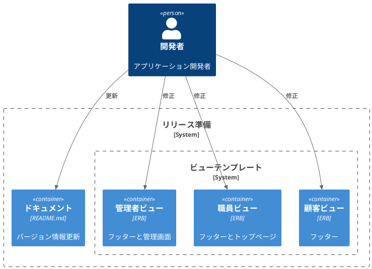
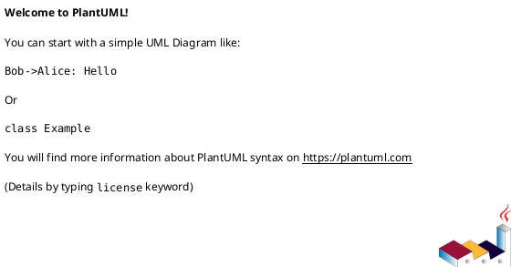

# 作業履歴 2025-06-08

## 概要

2025-06-08の作業内容をまとめています。このジャーナルでは、アプリケーションのリリース準備に関する作業を記録しています。主に、バージョン情報の更新とビューテンプレートの修正が行われました。

## リリース準備構成図



## 作業内容

### リリース準備

アプリケーションのリリースに向けて、ドキュメントとビューテンプレートの更新を行いました。特に、最新の技術スタック情報への更新と、ユーザーインターフェースの改善に焦点を当てました。

#### 変更点の概要

1. README.mdの更新
   - Ruby バージョンを 3.4.0 から 3.4.4 に更新
   - Rails 5 から Rails 7 へのアップグレード情報を追加
   - Docker バージョン情報の更新

2. ビューテンプレートの修正
   - 管理者、職員、顧客向けのフッターを更新
   - 管理者と職員のトップページを更新
   - 著作権表示の年を更新
   - お知らせ情報の追加

## コミット: 3d82042

### メッセージ

```
docs:リリース
```

### 変更されたファイル

- M	README.md

### 変更内容

```diff
commit 3d820420346e5e9947888ef37f25de18a05b9c32
Author: k2works <kakimomokuri@gmail.com>
Date:   Sun Jun 8 11:39:11 2025 +0900

    docs:リリース

diff --git a/README.md b/README.md
index 118d3f7..ce5f121 100644
--- a/README.md
+++ b/README.md
@@ -10,7 +10,7 @@ Rails5からRails7にアップグレードする
 # 前提 #
 | ソフトウェア   | バージョン   | 備考        |
 |:---------------|:--------|:------------|
-| ruby           | 3.4.0   |             |
+| ruby           | 3.4.4   |             |
 | rails          | 7.2.2.1 |             |
 | docker         | 28.1.1  |             |


```

## コミット: bd6d681

### メッセージ

```
docs:リリース
```

### 変更されたファイル

- M	README.md

### 変更内容

```diff
commit bd6d681b635320ab46bdab662b80a0096b734a3f
Author: k2works <kakimomokuri@gmail.com>
Date:   Sun Jun 8 11:31:46 2025 +0900

    docs:リリース

diff --git a/README.md b/README.md
index 0c30af0..118d3f7 100644
--- a/README.md
+++ b/README.md
@@ -5,13 +5,14 @@ Baukis 改
 # 目的 #
 [実践Ruby on Rails 4 現場のプロから学ぶ本格Webプログラミング](https://www.amazon.co.jp/%E5%AE%9F%E8%B7%B5Ruby-Rails-4-%E7%8F%BE%E5%A0%B4%E3%81%AE%E3%83%97%E3%83%AD%E3%81%8B%E3%82%89%E5%AD%A6%E3%81%B6%E6%9C%AC%E6%A0%BCWeb%E3%83%97%E3%83%AD%E3%82%B0%E3%83%A9%E3%83%9F%E3%83%B3%E3%82%B0-%E9%BB%92%E7%94%B0/dp/4844335928)をRails5での実装及びフロント部分にモダンCSS設計(BEM)を組み込む

+Rails5からRails7にアップグレードする
+
 # 前提 #
 | ソフトウェア   | バージョン   | 備考        |
 |:---------------|:--------|:------------|
 | ruby           | 3.4.0   |             |
 | rails          | 7.2.2.1 |             |
-| docker         | 1.12.5  |             |
-| docker-compose | 1.8.0   |             |
+| docker         | 28.1.1  |             |

 # 構成 #
 1. [アプリケーション環境構築](#アプリケーション環境構築)

```

## コミット: 9ac34db

### メッセージ

```
docs:リリース
```

### 変更されたファイル

- M	app/views/admin/shared/_footer.html.erb
- M	app/views/admin/top/index.html.erb
- M	app/views/customer/shared/_footer.html.erb
- M	app/views/staff/shared/_footer.html.erb
- M	app/views/staff/top/index.html.erb

### 変更内容

```diff
commit 9ac34dbf1e5c3d33a5fc00ccb9365bced81f988e
Author: k2works <kakimomokuri@gmail.com>
Date:   Sun Jun 8 11:29:55 2025 +0900

    docs:リリース

diff --git a/app/views/admin/shared/_footer.html.erb b/app/views/admin/shared/_footer.html.erb
index 3fb42b5..d135621 100644
--- a/app/views/admin/shared/_footer.html.erb
+++ b/app/views/admin/shared/_footer.html.erb
@@ -7,7 +7,7 @@
       </ul>
     </div>
     <div class="Footer__body">
-      <p>Powered by BAUKIS KAI &copy; 2014 k2works</p>
+      <p>Powered by BAUKIS KAI &copy; 2025 k2works</p>
     </div>
   </div>
 </footer>
\ No newline at end of file
diff --git a/app/views/admin/top/index.html.erb b/app/views/admin/top/index.html.erb
index 4547f6c..9446ed0 100644
--- a/app/views/admin/top/index.html.erb
+++ b/app/views/admin/top/index.html.erb
@@ -8,6 +8,10 @@
     <h2 class="sectionLabel">お知らせ</h2>
   </div>
   <ol class="NewsList">
+    <li class="NewsList__item">
+      <time class="NewsList__head" datatime="2025-6-6">2025.6.8</time>
+      <span class="NewsList__body">アプリケーションをバージョンアップ</span>
+    </li>
     <li class="NewsList__item">
       <time class="NewsList__head" datatime="2017-2-13">2017.2.13</time>
       <span class="NewsList__body">IPアクセス制限機能追加</span>
diff --git a/app/views/customer/shared/_footer.html.erb b/app/views/customer/shared/_footer.html.erb
index e57987c..3d2f84c 100644
--- a/app/views/customer/shared/_footer.html.erb
+++ b/app/views/customer/shared/_footer.html.erb
@@ -12,7 +12,7 @@
       </ul>
     </div>
     <div class="Footer__body">
-      <p>Powered by BAUKIS KAI &copy; 2014 k2works</p>
+      <p>Powered by BAUKIS KAI &copy; 2025 k2works</p>
       <p><a href="#">Legal Notice</a></p>
       <p><a href="#">Privacy policy</a></p>
     </div>
diff --git a/app/views/staff/shared/_footer.html.erb b/app/views/staff/shared/_footer.html.erb
index 042f4c7..4b48457 100644
--- a/app/views/staff/shared/_footer.html.erb
+++ b/app/views/staff/shared/_footer.html.erb
@@ -7,7 +7,7 @@
       </ul>
     </div>
     <div class="Footer__body">
-      <p>Powered by BAUKIS KAI &copy; 2014 k2works</p>
+      <p>Powered by BAUKIS KAI &copy; 2025 k2works</p>
     </div>
   </div>
 </footer>
\ No newline at end of file
diff --git a/app/views/staff/top/index.html.erb b/app/views/staff/top/index.html.erb
index dee2081..abc480e 100644
--- a/app/views/staff/top/index.html.erb
+++ b/app/views/staff/top/index.html.erb
@@ -8,6 +8,10 @@
     <h2 class="sectionLabel">お知らせ</h2>
   </div>
   <ol class="NewsList">
+    <li class="NewsList__item">
+      <time class="NewsList__head" datatime="2025-6-6">2025.6.8</time>
+      <span class="NewsList__body">アプリケーションをバージョンアップ</span>
+    </li>
     <li class="NewsList__item">
       <time class="NewsList__head" datatime="2017-3-28">2017.3.28</time>
       <span class="NewsList__body">問い合わせ返信機能を追加</span>

```

## コミット: 97b6cf1

### メッセージ

```
docs:README更新
```

### 変更されたファイル

- M	README.md

### 変更内容

```diff
commit 97b6cf1d239dd96e0872624bb5231156aa082cce
Author: k2works <kakimomokuri@gmail.com>
Date:   Sun Jun 8 11:28:53 2025 +0900

    docs:README更新

diff --git a/README.md b/README.md
index 7c335bc..0c30af0 100644
--- a/README.md
+++ b/README.md
@@ -1,17 +1,17 @@
 Baukis 改
 ===================
-[](https://circleci.com/gh/k2works/baukis-kai) [](https://codeclimate.com/github/k2works/baukis-kai) [](https://raw.githubusercontent.com/k2works/baukis-kai/master/MIT-LICENSE.txt)
+[](https://github.com/k2works/baukis-kai/actions) [](https://codeclimate.com/github/k2works/baukis-kai) [](https://raw.githubusercontent.com/k2works/baukis-kai/master/MIT-LICENSE.txt)

 # 目的 #
 [実践Ruby on Rails 4 現場のプロから学ぶ本格Webプログラミング](https://www.amazon.co.jp/%E5%AE%9F%E8%B7%B5Ruby-Rails-4-%E7%8F%BE%E5%A0%B4%E3%81%AE%E3%83%97%E3%83%AD%E3%81%8B%E3%82%89%E5%AD%A6%E3%81%B6%E6%9C%AC%E6%A0%BCWeb%E3%83%97%E3%83%AD%E3%82%B0%E3%83%A9%E3%83%9F%E3%83%B3%E3%82%B0-%E9%BB%92%E7%94%B0/dp/4844335928)をRails5での実装及びフロント部分にモダンCSS設計(BEM)を組み込む

 # 前提 #
 | ソフトウェア   | バージョン   | 備考        |
-|:---------------|:-------------|:------------|
-| ruby           |2.4.0    |             |
-| rails          |5.0.1    |             |
-| docker         |1.12.5    |             |
-| docker-compose |1.8.0    |             |
+|:---------------|:--------|:------------|
+| ruby           | 3.4.0   |             |
+| rails          | 7.2.2.1 |             |
+| docker         | 1.12.5  |             |
+| docker-compose | 1.8.0   |             |

 # 構成 #
 1. [アプリケーション環境構築](#アプリケーション環境構築)
@@ -61,6 +61,7 @@ docker compose up -d
 ### テスト環境のセットアップ
 + RSpecの初期設定
 + Factory Girlの初期設定
++ Factory Botに変更

 **[⬆ back to top](#構成)**


```

## コミット: 457a1cc

### メッセージ

```
Merge branch 'master' into develop
# Conflicts:
#	.gitignore
```

### 変更されたファイル


### 変更内容

```diff
commit 457a1ccfe6a3dab30cc9bf219a60eac6e0074b04
Merge: 25a525a 3428919
Author: k2works <kakimomokuri@gmail.com>
Date:   Sun Jun 8 11:10:20 2025 +0900

    Merge branch 'master' into develop

    # Conflicts:
    #       .gitignore


```

## コミット: 25a525a

### メッセージ

```
fix:単体テスト
```

### 変更されたファイル

- M	app/controllers/staff/customers_controller.rb
- M	app/forms/staff/customer_form.rb
- M	app/models/address.rb
- M	app/models/customer.rb
- M	app/models/phone.rb
- M	db/seed/development/customers.rb

### 変更内容

```diff
commit 25a525a22b11dd4605a968511d260fd54757e84f
Author: k2works <kakimomokuri@gmail.com>
Date:   Sun Jun 8 11:09:52 2025 +0900

    fix:単体テスト

diff --git a/app/controllers/staff/customers_controller.rb b/app/controllers/staff/customers_controller.rb
index 2414e30..6342b22 100644
--- a/app/controllers/staff/customers_controller.rb
+++ b/app/controllers/staff/customers_controller.rb
@@ -22,7 +22,7 @@ class Staff::CustomersController < Staff::Base

   def create
     @customer_form = Staff::CustomerForm.new
-    @customer_form.assign_attributes(params.require(:form))
+    @customer_form.assign_attributes(params[:form])
     if @customer_form.save
       flash.notice = t('.flash_notice')
       redirect_to action: 'index'
@@ -34,7 +34,7 @@ class Staff::CustomersController < Staff::Base

   def update
     @customer_form = Staff::CustomerForm.new(Customer.find(params[:id]))
-    @customer_form.assign_attributes(params.require(:form))
+    @customer_form.assign_attributes(params[:form])
     if @customer_form.save
       flash.notice = t('.flash_notice')
       redirect_to action: 'index'
diff --git a/app/forms/staff/customer_form.rb b/app/forms/staff/customer_form.rb
index af0ff3d..c002f20 100644
--- a/app/forms/staff/customer_form.rb
+++ b/app/forms/staff/customer_form.rb
@@ -6,14 +6,14 @@ class Staff::CustomerForm

   def initialize(customer = nil)
     @customer = customer
-    @customer ||= Customer.new(gender: 'male')
+    @customer ||= Customer.new(gender: 'mail')
     (2 - @customer.personal_phones.size).times do
       @customer.personal_phones.build
     end
     self.inputs_home_address = @customer.home_address.present?
     self.inputs_work_address = @customer.work_address.present?
-    @customer.build_home_address unless @customer.home_address
-    @customer.build_work_address unless @customer.work_address
+    @customer.build_home_address unless @customer.home_address.present?
+    @customer.build_work_address unless @customer.work_address.present?
     (2 - @customer.home_address.phones.size).times do
       @customer.home_address.phones.build
     end
@@ -24,12 +24,13 @@ class Staff::CustomerForm

   def assign_attributes(params = {})
     @params = params
-    self.inputs_home_address = params[:inputs_home_address] == '1'
-    self.inputs_work_address = params[:inputs_work_address] == '1'
+
+    self.inputs_home_address = (params[:inputs_home_address] == '1')
+    self.inputs_work_address = (params[:inputs_work_address] == '1')

     customer.assign_attributes(customer_params)

-    phones = phone_params(:customer)[:phones] || {}
+    phones = phone_params(:customer).fetch(:phones)
     customer.personal_phones.size.times do |index|
       attributes = phones[index.to_s]
       if attributes && attributes[:number].present?
@@ -42,7 +43,7 @@ class Staff::CustomerForm
     if inputs_home_address
       customer.home_address.assign_attributes(home_address_params)

-      phones = phone_params(:home_address)[:phones] || {}
+      phones = phone_params(:home_address).fetch(:phones)
       customer.home_address.phones.size.times do |index|
         attributes = phones[index.to_s]
         if attributes && attributes[:number].present?
@@ -54,10 +55,11 @@ class Staff::CustomerForm
     else
       customer.home_address.mark_for_destruction
     end
+
     if inputs_work_address
       customer.work_address.assign_attributes(work_address_params)

-      phones = phone_params(:work_address)[:phones] || {}
+      phones = phone_params(:work_address).fetch(:phones)
       customer.work_address.phones.size.times do |index|
         attributes = phones[index.to_s]
         if attributes && attributes[:number].present?
@@ -71,46 +73,31 @@ class Staff::CustomerForm
     end
   end

-  private
-  def customer_params
-    @params.require(:customer).permit(
-                                  :email,
-                                  :password,
-                                  :family_name,
-                                  :given_name,
-                                  :family_name_kana,
-                                  :given_name_kana,
-                                  :birthday,
-                                  :gender
-    )
+  def save
+    customer.save
   end

-  def home_address_params
-    @params.require(:home_address).permit(
-                                     :postal_code,
-                                     :prefecture,
-                                     :city,
-                                     :address1,
-                                     :address2,
-    )
+  private def customer_params
+    @params.require(:customer).except(:phones).permit(
+      :email, :password,
+      :family_name, :given_name, :family_name_kana, :given_name_kana,
+      :birthday, :gender)
   end

-  def work_address_params
-    @params.require(:work_address).permit(
-                                      :postal_code,
-                                      :prefecture,
-                                      :city,
-                                      :address1,
-                                      :address2,
-                                      :company_name,
-                                      :division_name
-    )
+  private def home_address_params
+    @params.require(:home_address).except(:phones).permit(
+      :postal_code, :prefecture, :city, :address1, :address2)
+  end
+
+  private def work_address_params
+    @params.require(:work_address).except(:phones).permit(
+      :postal_code, :prefecture, :city, :address1, :address2,
+      :company_name, :division_name)
   end

-  def phone_params(record_name)
-    @params.require(record_name).permit(phones: [ :number, :primary ])
-  rescue ActionController::ParameterMissing
-    # If the phones parameter is missing, return an empty hash with phones key
-    { phones: {} }
+  private def phone_params(record_name)
+    @params.require(record_name).slice(:phones).permit(
+      phones: [ :number, :primary ]
+    )
   end
-end
+end
\ No newline at end of file
diff --git a/app/models/address.rb b/app/models/address.rb
index 503bf41..44772e3 100644
--- a/app/models/address.rb
+++ b/app/models/address.rb
@@ -30,7 +30,10 @@ class Address < ApplicationRecord
   include StringNormalizer

   belongs_to :customer
-  has_many :phones, -> { order(:id) }, dependent: :destroy, autosave: true
+  has_many :phones,
+           -> { order(:id) },
+           dependent: :destroy,
+           autosave: true

   before_validation do
     self.postal_code = normalize_as_postal_code(postal_code)
@@ -49,8 +52,7 @@ class Address < ApplicationRecord
     徳島県 香川県 愛媛県 高知県
     福岡県 佐賀県 長崎県 熊本県 大分県 宮崎県 鹿児島県
     沖縄県
-    日本国外
-  )
+    日本国外)

   validates :postal_code, format: { with: /\A\d{7}\z/, allow_blank: true }
   validates :prefecture, inclusion: { in: PREFECTURE_NAMES, allow_blank: true }
diff --git a/app/models/customer.rb b/app/models/customer.rb
index 9497b11..d61ffce 100644
--- a/app/models/customer.rb
+++ b/app/models/customer.rb
@@ -33,28 +33,26 @@
 #  index_customers_on_gender_and_furigana                        (gender,family_name_kana,given_name_kana)
 #  index_customers_on_given_name_kana                            (given_name_kana)
 #
-
 class Customer < ApplicationRecord
+  include StringNormalizer
   include EmailHolder
   include PersonalNameHolder
   include PasswordHolder

   has_many :addresses, dependent: :destroy
-  has_one :home_address, class_name: 'HomeAddress', autosave: true
-  has_one :work_address, class_name: 'WorkAddress', autosave: true
+  has_one :home_address, autosave: true
+  has_one :work_address, autosave: true
   has_many :phones, dependent: :destroy
-  has_many :personal_phones, -> { where(address_id: nil).order(:id) },class_name: 'Phone', autosave: true
-  has_many :entries, dependent: :destroy
-  has_many :programs, through: :entries
-  has_many :messages
-  has_many :outbound_messages, class_name: 'CustomerMessage', foreign_key: 'customer_id'
-  has_many :inbound_messages, class_name: 'StaffMessage', foreign_key: 'customer_id'
+  has_many :personal_phones,
+           -> { where(address_id: nil).order(:id) },
+           class_name: 'Phone',
+           autosave: true

   validates :gender, inclusion: { in: %w(male female), allow_blank: true }
   validates :birthday, date: {
-      after: Date.new(1900,1,1),
-      before: ->(obj) { Date.today },
-      allow_blank: true
+    after: Date.new(1900, 1, 1),
+    before: ->(obj) { Date.today },
+    allow_blank: true
   }

   before_save do
@@ -64,4 +62,4 @@ class Customer < ApplicationRecord
       self.birth_mday = birthday.mday
     end
   end
-end
+end
\ No newline at end of file
diff --git a/app/models/phone.rb b/app/models/phone.rb
index 94e92f9..ea574df 100644
--- a/app/models/phone.rb
+++ b/app/models/phone.rb
@@ -23,20 +23,19 @@
 class Phone < ApplicationRecord
   include StringNormalizer

-  belongs_to :customer
-  belongs_to :address
+  belongs_to :customer, optional: true
+  belongs_to :address, optional: true

   before_validation do
     self.number = normalize_as_phone_number(number)
     self.number_for_index = number.gsub(/\D/, '') if number
-    if number_for_index && number_for_index.size >= 4
-      self.last_four_digits = number_for_index[-4, 4]
-    end
   end

   before_create do
     self.customer = address.customer if address
   end

-  validates :number, presence: true, format: { with: /\A\+?\d+(-\d+)*\z/, allow_blank: true }
-end
+  validates :number,
+            presence: true,
+            format: { with: /\A\+?\d+(-\d+)*\z/, allow_blank: true }
+end
\ No newline at end of file
diff --git a/db/seed/development/customers.rb b/db/seed/development/customers.rb
index 0d14c3f..8cd2548 100644
--- a/db/seed/development/customers.rb
+++ b/db/seed/development/customers.rb
@@ -26,44 +26,48 @@ given_names = %w{
   亀子:カメコ:kameko
 }

-company_names = %w(OIAX ABC XYZ)
+company_names = %w(BURDOCK CARROT SPINACH)

 10.times do |n|
   10.times do |m|
-    fn = family_names[n].split(':')
-    gn = given_names[m].split(':')
+    fn = family_names[n].split(":")
+    gn = given_names[m].split(":")

     c = Customer.create!(
-        email: "#{fn[2]}.#{gn[2]}-#{n}@example.jp",
-        family_name: fn[0],
-        given_name: gn[0],
-        family_name_kana: fn[1],
-        given_name_kana: gn[1],
-        password: 'password',
-        birthday: 60.years.ago.advance(seconds: rand(40.years)).to_date,
-        gender: m < 5 ? 'male' : 'female'
+      email: "#{fn[2]}.#{gn[2]}@example.jp",
+      family_name: fn[0],
+      given_name: gn[0],
+      family_name_kana: fn[1],
+      given_name_kana: gn[1],
+      password: "password",
+      birthday: 60.years.ago.advance(seconds: rand(40.years)).to_date,
+      gender: m < 5 ? "male" : "female"
     )
+
     if m % 2 == 0
-      c.personal_phones.create!(number: sprintf('090-0000-%04d', n * 10 + m))
+      c.personal_phones.create!(number: sprintf("090-0000-%04d", n * 10 + m))
     end
+
     c.create_home_address!(
-        postal_code: sprintf('%07d', rand(10000000)),
-        prefecture: Address::PREFECTURE_NAMES.sample,
-        city: city_names.sample,
-        address1: '開発1-2-3',
-        address2: 'レイルズハイツ301号室'
+      postal_code: sprintf("%07d", rand(10000000)),
+      prefecture: Address::PREFECTURE_NAMES.sample,
+      city: city_names.sample,
+      address1: "開発1-2-3",
+      address2: "レイルズハイツ301号室"
     )
+
     if m % 10 == 0
-      c.home_address.phones.create!(number: sprintf('03-0000-%04d', n))
+      c.home_address.phones.create!(number: sprintf("03-0000-%04d", n))
     end
+
     if m % 3 == 0
       c.create_work_address!(
-          postal_code: sprintf('%07d', rand(10000000)),
-          prefecture: Address::PREFECTURE_NAMES.sample,
-          city: city_names.sample,
-          address1: '試験4-5-6',
-          address2: 'ルビービル2F',
-          company_name: company_names.sample
+        postal_code: sprintf("%07d", rand(10000000)),
+        prefecture: Address::PREFECTURE_NAMES.sample,
+        city: city_names.sample,
+        address1: "試験4-5-6",
+        address2: "ルビービル2F",
+        company_name: company_names.sample
       )
     end
   end

```

### 構造変更


