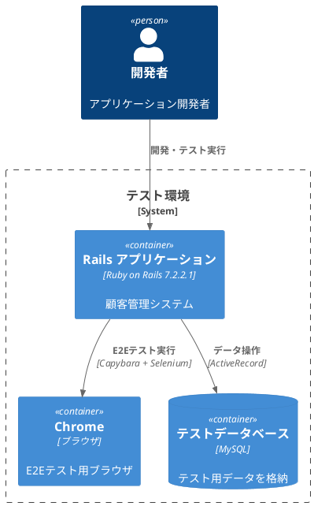
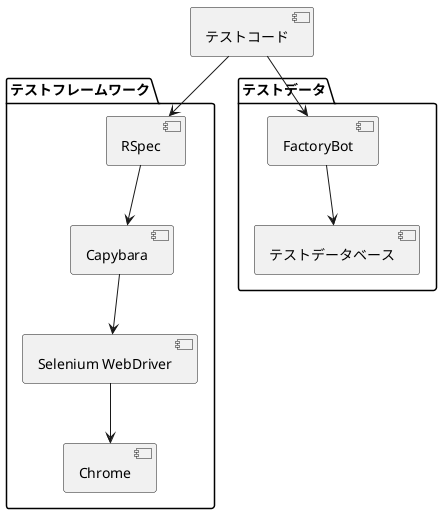
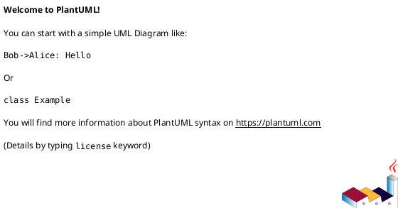

# 作業履歴 2025-06-10

## 概要

2025-06-10の作業内容をまとめています。このジャーナルでは、E2Eテスト環境の構築と実装に関する作業を記録しています。

## システム構成図



## 作業内容

### E2Eテスト環境の構築

E2Eテスト（End-to-End テスト）は、アプリケーションの全体的な機能を検証するために重要です。今回の作業では、Capybaraとselenium-webdriverを使用したE2Eテスト環境を整備しました。

#### 変更点の概要

1. テスト用の設定ファイルの修正
2. テストデータのファクトリ設定の更新
3. プログラム管理機能のE2Eテストの実装

#### 技術的詳細



## コミット: 75931b2

### メッセージ

```
test(WIP):E2Eテスト
```

### 変更されたファイル

- M	config/locales/views/ja.yml
- M	spec/factories/entries.rb
- M	spec/features/staff/program_management_spec.rb

### 変更内容

```diff
commit 75931b26d769263f0e5169e1294146d410fa5795
Author: k2works <kakimomokuri@gmail.com>
Date:   Tue Jun 10 18:10:48 2025 +0900

    test(WIP):E2Eテスト

diff --git a/config/locales/views/ja.yml b/config/locales/views/ja.yml
index 94c8e8f..a7d03e1 100644
--- a/config/locales/views/ja.yml
+++ b/config/locales/views/ja.yml
@@ -120,7 +120,7 @@ ja:
         program_start: '申し込み開始日時'
         program_end: '申し込み終了日時'
         program_min_entry: '最小参加者数'
-        program_max_entry: '最大参観者数'
+        program_max_entry: '最大参加者数'
         program_entry_count: '申し込み件数'
         program_staff: '登録職員'
         action: 'アクション'
@@ -130,7 +130,7 @@ ja:
         program_start: '申し込み開始日時'
         program_end: '申し込み終了日時'
         program_min_entry: '最小参加者数'
-        program_max_entry: '最大参観者数'
+        program_max_entry: '最大参加者数'
         program_entry_count: '申し込み件数'
         program_staff: '登録職員'
       new:
@@ -151,7 +151,7 @@ ja:
         program_end: '申し込み終了日時'
         program_end_instruction: '開始日時から90日後まで'
         program_min_entry: '最小参加者数'
-        program_max_entry: '最大参観者数'
+        program_max_entry: '最大参加者数'
       entries_form:
         name: '氏名'
         a: 'A'
diff --git a/spec/factories/entries.rb b/spec/factories/entries.rb
index 68decf9..6dc2a58 100644
--- a/spec/factories/entries.rb
+++ b/spec/factories/entries.rb
@@ -19,6 +19,9 @@

 FactoryBot.define do
   factory :entry do
-    
+    program
+    customer
+    approved { false }
+    canceled { false }
   end
 end
diff --git a/spec/features/staff/program_management_spec.rb b/spec/features/staff/program_management_spec.rb
index 413731f..190110a 100644
--- a/spec/features/staff/program_management_spec.rb
+++ b/spec/features/staff/program_management_spec.rb
@@ -1,35 +1,82 @@
 require 'rails_helper'

-feature 'プログラム管理機能', :performace do
+feature '職員によるプログラム管理' do
   include FeaturesSpecHelper
   include PerformanceSpecHelper
   let(:staff_member) { create(:staff_member) }
+  let!(:program) { create(:program, registrant: staff_member) }
+  let(:customer) { create(:customer) }
+  let!(:entry) { create(:entry, program: program, customer: customer) }

   before do
-    20.times do |n|
-      p  = create(:program, application_start_time: n.days.ago.midnight)
-      if n < 2
-        p.applicants << create(:customer)
-        p.applicants << create(:customer)
-      end
-    end
-
     switch_namespace(:staff)
     login_as_staff_member(staff_member)
   end

-  scenario 'プログラム一覧' do |example|
+  scenario '職員がプログラム一覧を表示する' do
     visit staff_programs_path
     expect(page).to have_css('h1', text: I18n.t('staff.programs.index.title'))
+    expect(page).to have_content(program.title)
+  end
+
+  scenario '職員がプログラム詳細を表示する' do
+    visit staff_programs_path
+    click_link I18n.t('staff.programs.form.show')
+
+    expect(page).to have_content(program.title)
+    expect(page).to have_content(program.description)
+  end

-    elapsed = Benchmark.realtime do
-      100.times do
-        visit staff_programs_path
-      end
-    end
+  scenario '職員が新規プログラムを登録する' do
+    visit staff_programs_path
+    first('a', text: I18n.t('staff.programs.index.new')).click
+
+    fill_in I18n.t('activerecord.attributes.program.title'), with: 'New Program'
+    fill_in I18n.t('activerecord.attributes.program.description'), with: 'Program Description'
+    fill_in I18n.t('activerecord.attributes.program.application_start_date'), with: Date.today.to_s
+    select '09', from: "form_program_application_start_hour"
+    select '00', from: "form_program_application_start_minute"
+    fill_in I18n.t('activerecord.attributes.program.application_end_date'), with: Date.today.next_month.to_s
+    select '17', from: "form_program_application_end_hour"
+    select '00', from: "form_program_application_end_minute"
+    fill_in I18n.t('activerecord.attributes.program.min_number_of_participants'), with: '5'
+    fill_in I18n.t('activerecord.attributes.program.max_number_of_participants'), with: '10'
+
+    click_button I18n.t('staff.programs.new.create')

-    write_to_performance_log(example, elapsed)
-    expect(elapsed).to be < 100.0
+    expect(page).to have_css('.Flash__notice', text: I18n.t('staff.programs.create.flash_notice'))
+    expect(Program.find_by(title: 'New Program')).to be_present
   end

+  scenario '職員がプログラムを編集する' do
+    visit staff_programs_path
+    click_link I18n.t('staff.programs.form.edit')
+
+    fill_in I18n.t('activerecord.attributes.program.title'), with: 'Updated Program'
+    click_button I18n.t('staff.programs.edit.update')
+
+    expect(page).to have_css('.Flash__notice', text: I18n.t('staff.programs.update.flash_notice'))
+    expect(program.reload.title).to eq('Updated Program')
+  end
+
+  scenario '職員がプログラムを削除する' do
+    program_without_entries = create(:program, registrant: staff_member)
+
+    visit staff_programs_path
+
+    all('a', text: I18n.t('staff.programs.form.delete')).last.click
+
+    expect(page).to have_css('.Flash__notice', text: I18n.t('staff.programs.destroy.flash_notice'))
+    expect(Program.find_by(id: program_without_entries.id)).to be_nil
+  end
+
+  scenario '職員がエントリーを管理する' do
+    visit staff_program_path(program)
+
+    find("input[type='checkbox'].isApproved[data-entry-id='#{entry.id}']").click
+    click_button I18n.t('staff.programs.entries_form.update')
+
+    expect(page).to have_css('.Flash__notice', text: I18n.t('staff.programs.entries.flash_notice'))
+    expect(entry.reload.approved).to be true
+  end
 end

```

## コミット: 00e4601

### メッセージ

```
test(WIP):E2Eテスト
```

### 変更されたファイル

- M	app/controllers/customer/programs_controller.rb
- M	spec/features/customer/program_management_spec.rb

### 変更内容

```diff
commit 00e4601c979a9c5b18e48f66a032ba5464f00149
Author: k2works <kakimomokuri@gmail.com>
Date:   Tue Jun 10 16:35:12 2025 +0900

    test(WIP):E2Eテスト

diff --git a/app/controllers/customer/programs_controller.rb b/app/controllers/customer/programs_controller.rb
index 0cf4a1e..c6d8421 100644
--- a/app/controllers/customer/programs_controller.rb
+++ b/app/controllers/customer/programs_controller.rb
@@ -4,6 +4,6 @@ class Customer::ProgramsController < Customer::Base
   end

   def show
-    @program = Program.published.find(params[:id])
+    @program = Program.published.find_by(params[:id])
   end
 end
diff --git a/spec/features/customer/program_management_spec.rb b/spec/features/customer/program_management_spec.rb
index 8341e2d..a2230b8 100644
--- a/spec/features/customer/program_management_spec.rb
+++ b/spec/features/customer/program_management_spec.rb
@@ -19,50 +19,37 @@ feature '顧客によるプログラム管理' do

   scenario '顧客がプログラム詳細を閲覧する' do
     visit customer_programs_path
-    click_link program.title
-    
-    expect(page).to have_css('h1', text: program.title)
+    click_link I18n.t('staff.programs.form.show')
+
+    expect(page).to have_content(program.title)
     expect(page).to have_content(program.description)
   end

   scenario '顧客がプログラムを予約する' do
     visit customer_program_path(program)
-    click_link I18n.t('customer.programs.show.apply')
-    
-    fill_in I18n.t('activerecord.attributes.entry.remarks'), with: 'テスト予約'
-    click_button I18n.t('customer.entries.new.submit')
+    click_button I18n.t('customer.programs.show.apply')

-    expect(page).to have_css('.notice', text: I18n.t('customer.entries.create.notice'))
+    expect(page).to have_css('.Flash__notice', text: I18n.t('customer.entries.create.flash_notice'))
     expect(Entry.find_by(program: program, customer: customer)).to be_present
   end

   scenario '顧客が予約をキャンセルする' do
-    entry = create(:entry, program: program, customer: customer)
-    
-    visit customer_entries_path
-    click_link program.title
-    click_link I18n.t('customer.entries.show.cancel')
-    
-    expect(page).to have_css('.notice', text: I18n.t('customer.entries.cancel.notice'))
-    expect(entry.reload.canceled).to be_truthy
+    visit customer_program_path(program)
+    click_button I18n.t('customer.programs.show.apply')
+    visit customer_program_path(program)
+    click_button I18n.t('customer.programs.show.cancel')
+
+    expect(page).to have_css('.Flash__notice', text: I18n.t('customer.entries.cancel.flash_notice'))
+    expect(Entry.find_by(program: program, customer: customer).canceled).to be true
   end

   scenario '顧客が予約期間外のプログラムを予約しようとする' do
-    closed_program = create(:program, application_start_time: 10.days.from_now, application_end_time: 20.days.from_now)
-    
-    visit customer_program_path(closed_program)
-    
-    expect(page).not_to have_link(I18n.t('customer.programs.show.apply'))
-    expect(page).to have_content(I18n.t('customer.programs.show.not_applicable'))
-  end
+    Program.delete_all
+    closed_program = create(:program, application_start_time: 20.days.ago, application_end_time: 10.days.ago)
+    visit customer_programs_path

-  scenario '顧客が定員超過のプログラムを予約しようとする' do
-    full_program = create(:program, application_start_time: 2.days.ago, application_end_time: 2.days.from_now, max_number_of_participants: 1)
-    create(:entry, program: full_program) # Fill the program
-    
-    visit customer_program_path(full_program)
+    visit customer_program_path(closed_program)

-    expect(page).not_to have_link(I18n.t('customer.programs.show.apply'))
-    expect(page).to have_content(I18n.t('customer.programs.show.full'))
+    expect(page).to have_button(I18n.t('customer.programs.show.closed'), disabled: true)
   end
 end
\ No newline at end of file

```

### 構造変更



## コミット: 429998b

### メッセージ

```
docs:ユースケース更新
```

### 変更されたファイル

- M	"docs/\343\203\246\343\203\274\343\202\271\343\202\261\343\203\274\343\202\271.md"

### 変更内容

```diff
commit 429998be7be58147cc12ad325bbfd790bd33b9bb
Author: k2works <kakimomokuri@gmail.com>
Date:   Tue Jun 10 15:21:20 2025 +0900

    docs:ユースケース更新

diff --git "a/docs/\343\203\246\343\203\274\343\202\271\343\202\261\343\203\274\343\202\271.md" "b/docs/\343\203\246\343\203\274\343\202\271\343\202\261\343\203\274\343\202\271.md"
index 8d89046..51eb39c 100644
--- "a/docs/\343\203\246\343\203\274\343\202\271\343\202\261\343\203\274\343\202\271.md"
+++ "b/docs/\343\203\246\343\203\274\343\202\271\343\202\261\343\203\274\343\202\271.md"
@@ -2,58 +2,58 @@

 ## 1. 概要

-このドキュメントはBaukis-Kaiシステムの主要なユースケースを定義します。システムは主に3つのユーザータイプ（スタッフ、顧客、管理者）向けの機能を提供しています。
+このドキュメントはBaukis-Kaiシステムの主要なユースケースを定義します。システムは主に3つのユーザータイプ（職員、顧客、管理者）向けの機能を提供しています。

 ## 2. アクター定義

 システムには以下の主要なアクターが存在します：

-1. **スタッフ**: 顧客情報管理、プログラム管理、顧客とのコミュニケーションを担当する組織の従業員
+1. **職員**: 顧客情報管理、プログラム管理、顧客とのコミュニケーションを担当する組織の従業員
 2. **顧客**: サービスを利用する個人またはグループ
-3. **管理者**: システム全体とスタッフアカウントを管理する権限を持つユーザー
+3. **管理者**: システム全体と職員アカウントを管理する権限を持つユーザー

-## 3. スタッフのユースケース
+## 3. 職員のユースケース

 ### 3.1. アカウント管理

 | ユースケースID | S-001 |
 | ------------- | ----- |
-| ユースケース名 | スタッフログイン |
-| アクター | スタッフ |
-| 説明 | スタッフがシステムにログインする |
-| 事前条件 | スタッフアカウントが作成されている |
-| 基本フロー | 1. スタッフがログインページにアクセス<br>2. メールアドレスとパスワードを入力<br>3. 認証情報を検証<br>4. ダッシュボードにリダイレクト |
+| ユースケース名 | 職員ログイン |
+| アクター | 職員 |
+| 説明 | 職員がシステムにログインする |
+| 事前条件 | 職員アカウントが作成されている |
+| 基本フロー | 1. 職員がログインページにアクセス<br>2. メールアドレスとパスワードを入力<br>3. 認証情報を検証<br>4. ダッシュボードにリダイレクト |
 | 代替フロー | - 認証失敗: エラーメッセージを表示<br>- アカウント停止中: アクセス拒否メッセージを表示 |
-| 事後条件 | スタッフがシステムにログインした状態になる |
+| 事後条件 | 職員がシステムにログインした状態になる |

 | ユースケースID | S-002 |
 | ------------- | ----- |
-| ユースケース名 | スタッフログアウト |
-| アクター | スタッフ |
-| 説明 | スタッフがシステムからログアウトする |
-| 事前条件 | スタッフがログイン済み |
-| 基本フロー | 1. スタッフがログアウトボタンをクリック<br>2. セッションを終了<br>3. ログインページにリダイレクト |
+| ユースケース名 | 職員ログアウト |
+| アクター | 職員 |
+| 説明 | 職員がシステムからログアウトする |
+| 事前条件 | 職員がログイン済み |
+| 基本フロー | 1. 職員がログアウトボタンをクリック<br>2. セッションを終了<br>3. ログインページにリダイレクト |
 | 代替フロー | なし |
-| 事後条件 | スタッフがログアウト状態になる |
+| 事後条件 | 職員がログアウト状態になる |

 | ユースケースID | S-003 |
 | ------------- | ----- |
-| ユースケース名 | スタッフアカウント情報更新 |
-| アクター | スタッフ |
-| 説明 | スタッフが自身のアカウント情報を更新する |
-| 事前条件 | スタッフがログイン済み |
-| 基本フロー | 1. スタッフがアカウント設定ページにアクセス<br>2. 情報を編集<br>3. 変更を保存 |
+| ユースケース名 | 職員アカウント情報更新 |
+| アクター | 職員 |
+| 説明 | 職員が自身のアカウント情報を更新する |
+| 事前条件 | 職員がログイン済み |
+| 基本フロー | 1. 職員がアカウント設定ページにアクセス<br>2. 情報を編集<br>3. 変更を保存 |
 | 代替フロー | - バリデーションエラー: エラーメッセージを表示し再編集を促す |
-| 事後条件 | スタッフの情報が更新される |
+| 事後条件 | 職員の情報が更新される |

 ### 3.2. 顧客管理

 | ユースケースID | S-004 |
 | ------------- | ----- |
 | ユースケース名 | 顧客情報登録 |
-| アクター | スタッフ |
-| 説明 | スタッフが新規顧客情報を登録する |
-| 事前条件 | スタッフがログイン済み |
+| アクター | 職員 |
+| 説明 | 職員が新規顧客情報を登録する |
+| 事前条件 | 職員がログイン済み |
 | 基本フロー | 1. 顧客登録フォームにアクセス<br>2. 顧客の基本情報を入力<br>3. 住所情報を入力（自宅/職場）<br>4. 電話番号情報を入力<br>5. フォームを送信<br>6. システムがデータを検証<br>7. 顧客情報を保存 |
 | 代替フロー | - バリデーションエラー: エラーメッセージを表示し再編集を促す |
 | 事後条件 | 新規顧客情報がシステムに登録される |
@@ -61,9 +61,9 @@
 | ユースケースID | S-005 |
 | ------------- | ----- |
 | ユースケース名 | 顧客情報検索 |
-| アクター | スタッフ |
-| 説明 | スタッフが顧客情報を検索する |
-| 事前条件 | スタッフがログイン済み |
+| アクター | 職員 |
+| 説明 | 職員が顧客情報を検索する |
+| 事前条件 | 職員がログイン済み |
 | 基本フロー | 1. 顧客検索フォームにアクセス<br>2. 検索条件（名前、メールアドレス、電話番号など）を入力<br>3. 検索を実行<br>4. 検索結果を表示 |
 | 代替フロー | - 検索結果なし: 該当する顧客がない旨のメッセージを表示 |
 | 事後条件 | 検索条件に合致する顧客情報が表示される |
@@ -71,9 +71,9 @@
 | ユースケースID | S-006 |
 | ------------- | ----- |
 | ユースケース名 | 顧客情報更新 |
-| アクター | スタッフ |
-| 説明 | スタッフが既存の顧客情報を更新する |
-| 事前条件 | スタッフがログイン済み、顧客が登録済み |
+| アクター | 職員 |
+| 説明 | 職員が既存の顧客情報を更新する |
+| 事前条件 | 職員がログイン済み、顧客が登録済み |
 | 基本フロー | 1. 顧客詳細ページにアクセス<br>2. 編集ボタンをクリック<br>3. 顧客情報を編集<br>4. 変更を保存 |
 | 代替フロー | - バリデーションエラー: エラーメッセージを表示し再編集を促す |
 | 事後条件 | 顧客情報が更新される |
@@ -83,9 +83,9 @@
 | ユースケースID | S-007 |
 | ------------- | ----- |
 | ユースケース名 | プログラム作成 |
-| アクター | スタッフ |
-| 説明 | スタッフが新規プログラムを作成する |
-| 事前条件 | スタッフがログイン済み |
+| アクター | 職員 |
+| 説明 | 職員が新規プログラムを作成する |
+| 事前条件 | 職員がログイン済み |
 | 基本フロー | 1. プログラム作成フォームにアクセス<br>2. プログラム詳細（タイトル、説明、日時、参加人数制限等）を入力<br>3. フォームを送信<br>4. システムがデータを検証<br>5. プログラム情報を保存 |
 | 代替フロー | - バリデーションエラー: エラーメッセージを表示し再編集を促す |
 | 事後条件 | 新規プログラムがシステムに登録される |
@@ -93,9 +93,9 @@
 | ユースケースID | S-008 |
 | ------------- | ----- |
 | ユースケース名 | プログラム更新 |
-| アクター | スタッフ |
-| 説明 | スタッフが既存のプログラム情報を更新する |
-| 事前条件 | スタッフがログイン済み、プログラムが登録済み |
+| アクター | 職員 |
+| 説明 | 職員が既存のプログラム情報を更新する |
+| 事前条件 | 職員がログイン済み、プログラムが登録済み |
 | 基本フロー | 1. プログラム詳細ページにアクセス<br>2. 編集ボタンをクリック<br>3. プログラム情報を編集<br>4. 変更を保存 |
 | 代替フロー | - バリデーションエラー: エラーメッセージを表示し再編集を促す<br>- 既に予約がある場合: 特定の項目の編集を制限 |
 | 事後条件 | プログラム情報が更新される |
@@ -103,9 +103,9 @@
 | ユースケースID | S-009 |
 | ------------- | ----- |
 | ユースケース名 | プログラム参加者管理 |
-| アクター | スタッフ |
-| 説明 | スタッフがプログラムの参加者を管理する |
-| 事前条件 | スタッフがログイン済み、プログラムが登録済み |
+| アクター | 職員 |
+| 説明 | 職員がプログラムの参加者を管理する |
+| 事前条件 | 職員がログイン済み、プログラムが登録済み |
 | 基本フロー | 1. プログラム詳細ページの参加者タブにアクセス<br>2. 参加者リストを確認<br>3. 参加承認または拒否の操作を行う |
 | 代替フロー | - 参加者なし: 参加者がいない旨のメッセージを表示 |
 | 事後条件 | 参加者のステータスが更新される |
@@ -115,9 +115,9 @@
 | ユースケースID | S-010 |
 | ------------- | ----- |
 | ユースケース名 | 顧客への問い合わせ送信 |
-| アクター | スタッフ |
-| 説明 | スタッフが顧客にメッセージを送信する |
-| 事前条件 | スタッフがログイン済み、顧客が登録済み |
+| アクター | 職員 |
+| 説明 | 職員が顧客にメッセージを送信する |
+| 事前条件 | 職員がログイン済み、顧客が登録済み |
 | 基本フロー | 1. 顧客詳細ページのメッセージタブにアクセス<br>2. 新規メッセージボタンをクリック<br>3. メッセージのタイトルと本文を入力<br>4. タグを選択（オプション）<br>5. メッセージを送信 |
 | 代替フロー | - バリデーションエラー: エラーメッセージを表示し再編集を促す |
 | 事後条件 | メッセージが顧客に送信される |
@@ -125,9 +125,9 @@
 | ユースケースID | S-011 |
 | ------------- | ----- |
 | ユースケース名 | 顧客からの問い合わせ確認 |
-| アクター | スタッフ |
-| 説明 | スタッフが顧客からのメッセージを確認する |
-| 事前条件 | スタッフがログイン済み、顧客からメッセージが送信済み |
+| アクター | 職員 |
+| 説明 | 職員が顧客からのメッセージを確認する |
+| 事前条件 | 職員がログイン済み、顧客からメッセージが送信済み |
 | 基本フロー | 1. メッセージ一覧ページにアクセス<br>2. 未読または特定の顧客からのメッセージをフィルタ<br>3. メッセージを選択して詳細を閲覧 |
 | 代替フロー | - メッセージなし: メッセージがない旨のメッセージを表示 |
 | 事後条件 | メッセージが既読状態になる |
@@ -135,9 +135,9 @@
 | ユースケースID | S-012 |
 | ------------- | ----- |
 | ユースケース名 | 問い合わせ返信 |
-| アクター | スタッフ |
-| 説明 | スタッフが顧客のメッセージに返信する |
-| 事前条件 | スタッフがログイン済み、顧客からメッセージが送信済み |
+| アクター | 職員 |
+| 説明 | 職員が顧客のメッセージに返信する |
+| 事前条件 | 職員がログイン済み、顧客からメッセージが送信済み |
 | 基本フロー | 1. メッセージ詳細画面にアクセス<br>2. 返信ボタンをクリック<br>3. 返信内容を入力<br>4. 返信を送信 |
 | 代替フロー | - バリデーションエラー: エラーメッセージを表示し再編集を促す |
 | 事後条件 | 返信が顧客に送信される |
@@ -222,13 +222,13 @@

 | ユースケースID | C-008 |
 | ------------- | ----- |
-| ユースケース名 | スタッフへの問い合わせ送信 |
+| ユースケース名 | 職員への問い合わせ送信 |
 | アクター | 顧客 |
-| 説明 | 顧客がスタッフにメッセージを送信する |
+| 説明 | 顧客が職員にメッセージを送信する |
 | 事前条件 | 顧客がログイン済み |
-| 基本フロー | 1. マイページのメッセージ機能にアクセス<br>2. 新規メッセージボタンをクリック<br>3. メッセージのタイトルと本文を入力<br>4. 宛先のスタッフを選択またはカテゴリを選択<br>5. メッセージを送信 |
+| 基本フロー | 1. マイページのメッセージ機能にアクセス<br>2. 新規メッセージボタンをクリック<br>3. メッセージのタイトルと本文を入力<br>4. 宛先の職員を選択またはカテゴリを選択<br>5. メッセージを送信 |
 | 代替フロー | - バリデーションエラー: エラーメッセージを表示し再編集を促す |
-| 事後条件 | メッセージがスタッフに送信される |
+| 事後条件 | メッセージが職員に送信される |

 | ユースケースID | C-009 |
 | ------------- | ----- |
@@ -244,11 +244,11 @@
 | ------------- |---------------------------------------------------|
 | ユースケース名 | 問い合わせ返信                                           |
 | アクター | 顧客                                                |
-| 説明 | 顧客がスタッフのメッセージに返信する                                |
-| 事前条件 | 顧客がログイン済み、スタッフからメッセージが送信済み                        |
+| 説明 | 顧客が職員のメッセージに返信する                                |
+| 事前条件 | 顧客がログイン済み、職員からメッセージが送信済み                        |
 | 基本フロー | 1. マイページのメッセージ履歴にアクセス<br>2. メッセージスレッドを選択<br>3. 返信 |
 | 代替フロー | - バリデーションエラー: エラーメッセージを表示し再編集を促す                  |
-| 事後条件 | 返信がスタッフに送信される                                     |
+| 事後条件 | 返信が職員に送信される                                     |


 ## 5. 管理者のユースケース
@@ -275,62 +275,52 @@
 | 代替フロー | なし |
 | 事後条件 | 管理者がログアウト状態になる |

-### 5.2. スタッフ管理
+### 5.2. 職員管理

 | ユースケースID | A-003 |
 | ------------- | ----- |
-| ユースケース名 | スタッフアカウント作成 |
+| ユースケース名 | 職員アカウント作成 |
 | アクター | 管理者 |
-| 説明 | 管理者が新規スタッフアカウントを作成する |
+| 説明 | 管理者が新規職員アカウントを作成する |
 | 事前条件 | 管理者がログイン済み |
-| 基本フロー | 1. スタッフ管理ページにアクセス<br>2. 新規スタッフ作成ボタンをクリック<br>3. スタッフ情報を入力<br>4. アカウントを作成 |
+| 基本フロー | 1. 職員管理ページにアクセス<br>2. 新規スタッフ作成ボタンをクリック<br>3. スタッフ情報を入力<br>4. アカウントを作成 |
 | 代替フロー | - バリデーションエラー: エラーメッセージを表示し再編集を促す<br>- メールアドレス重複: エラーメッセージを表示 |
-| 事後条件 | 新規スタッフアカウントが作成される |
+| 事後条件 | 新規職員アカウントが作成される |

 | ユースケースID | A-004 |
 | ------------- | ----- |
-| ユースケース名 | スタッフアカウント編集 |
+| ユースケース名 | 職員アカウント編集 |
 | アクター | 管理者 |
-| 説明 | 管理者が既存のスタッフアカウント情報を編集する |
-| 事前条件 | 管理者がログイン済み、スタッフアカウントが存在する |
-| 基本フロー | 1. スタッフ一覧ページにアクセス<br>2. 編集するスタッフを選択<br>3. 編集ボタンをクリック<br>4. スタッフ情報を編集<br>5. 変更を保存 |
+| 説明 | 管理者が既存の職員アカウント情報を編集する |
+| 事前条件 | 管理者がログイン済み、職員アカウントが存在する |
+| 基本フロー | 1. 職員一覧ページにアクセス<br>2. 編集するスタッフを選択<br>3. 編集ボタンをクリック<br>4. スタッフ情報を編集<br>5. 変更を保存 |
 | 代替フロー | - バリデーションエラー: エラーメッセージを表示し再編集を促す |
-| 事後条件 | スタッフ情報が更新される |
+| 事後条件 | 職員情報が更新される |

 | ユースケースID | A-005 |
 | ------------- | ----- |
-| ユースケース名 | スタッフアカウント停止/再開 |
+| ユースケース名 | 職員アカウント停止/再開 |
 | アクター | 管理者 |
-| 説明 | 管理者がスタッフアカウントの停止または再開を行う |
-| 事前条件 | 管理者がログイン済み、スタッフアカウントが存在する |
-| 基本フロー | 1. スタッフ一覧ページにアクセス<br>2. 対象のスタッフを選択<br>3. 停止/再開ボタンをクリック<br>4. 確認ダイアログで確認 |
+| 説明 | 管理者が職員アカウントの停止または再開を行う |
+| 事前条件 | 管理者がログイン済み、職員アカウントが存在する |
+| 基本フロー | 1. 職員一覧ページにアクセス<br>2. 対象のスタッフを選択<br>3. 停止/再開ボタンをクリック<br>4. 確認ダイアログで確認 |
 | 代替フロー | なし |
-| 事後条件 | スタッフアカウントの状態が変更される |
+| 事後条件 | 職員アカウントの状態が変更される |

 | ユースケースID | A-006 |
 | ------------- | ----- |
-| ユースケース名 | スタッフイベントログ確認 |
+| ユースケース名 | 職員イベントログ確認 |
 | アクター | 管理者 |
-| 説明 | 管理者がスタッフのアクティビティログを確認する |
-| 事前条件 | 管理者がログイン済み、スタッフアカウントが存在する |
-| 基本フロー | 1. スタッフ詳細ページにアクセス<br>2. イベントログタブを選択<br>3. ログを閲覧 |
+| 説明 | 管理者が職員のアクティビティログを確認する |
+| 事前条件 | 管理者がログイン済み、職員アカウントが存在する |
+| 基本フロー | 1. 職員詳細ページにアクセス<br>2. イベントログタブを選択<br>3. ログを閲覧 |
 | 代替フロー | - ログなし: ログがない旨のメッセージを表示 |
-| 事後条件 | スタッフのアクティビティログが表示される |
+| 事後条件 | 職員のアクティビティログが表示される |

 ### 5.3. システム管理

 | ユースケースID | A-007 |
 | ------------- | ----- |
-| ユースケース名 | システム設定管理 |
-| アクター | 管理者 |
-| 説明 | 管理者がシステム全体の設定を管理する |
-| 事前条件 | 管理者がログイン済み |
-| 基本フロー | 1. システム設定ページにアクセス<br>2. 設定項目を編集<br>3. 変更を保存 |
-| 代替フロー | - バリデーションエラー: エラーメッセージを表示し再編集を促す |
-| 事後条件 | システム設定が更新される |
-
-| ユースケースID | A-008 |
-| ------------- | ----- |
 | ユースケース名 | アクセス制限IPアドレス管理 |
 | アクター | 管理者 |
 | 説明 | 管理者がアクセス許可するIPアドレスを管理する |
@@ -339,50 +329,6 @@
 | 代替フロー | - バリデーションエラー: エラーメッセージを表示し再編集を促す |
 | 事後条件 | アクセス制限設定が更新される |

-## 6. システム間ユースケース
-
-| ユースケースID | SYS-001 |
-| ------------- | ----- |
-| ユースケース名 | 自動メール送信 |
-| アクター | システム |
-| 説明 | システムが特定のイベント発生時に自動的にメールを送信する |
-| 事前条件 | 対象イベントが発生している（予約完了、メッセージ受信など） |
-| 基本フロー | 1. イベント発生を検知<br>2. メールテンプレートを選択<br>3. 必要な情報を埋め込む<br>4. メールを送信 |
-| 代替フロー | - メール送信失敗: エラーをログに記録し再送を試みる |
-| 事後条件 | メールが送信される |
-
-| ユースケースID | SYS-002 |
-| ------------- | ----- |
-| ユースケース名 | プログラム開始通知 |
-| アクター | システム |
-| 説明 | システムがプログラム開始前に参加者に通知する |
-| 事前条件 | プログラムが登録済み、参加者が存在する |
-| 基本フロー | 1. スケジュールされたタイミングで通知処理を実行<br>2. 参加者リストを取得<br>3. 各参加者に通知を送信 |
-| 代替フロー | - 通知送信失敗: エラーをログに記録 |
-| 事後条件 | 参加者に通知が送信される |
-
-## 7. 非機能要件に関連するユースケース
-
-| ユースケースID | NF-001 |
-| ------------- | ----- |
-| ユースケース名 | システム監視 |
-| アクター | 管理者 |
-| 説明 | 管理者がシステムのパフォーマンスと健全性を監視する |
-| 事前条件 | 管理者がログイン済み |
-| 基本フロー | 1. システム監視ダッシュボードにアクセス<br>2. パフォーマンス指標を確認<br>3. エラーログを確認<br>4. 必要に応じて対応策を実施 |
-| 代替フロー | なし |
-| 事後条件 | システム状態が把握される |
-
-| ユースケースID | NF-002 |
-| ------------- | ----- |
-| ユースケース名 | データバックアップ |
-| アクター | システム |
-| 説明 | システムが定期的にデータのバックアップを実行する |
-| 事前条件 | バックアップスケジュールが設定されている |
-| 基本フロー | 1. スケジュールされたタイミングでバックアッププロセスを開始<br>2. データベースのバックアップを取得<br>3. バックアップファイルを保存<br>4. 古いバックアップファイルの整理 |
-| 代替フロー | - バックアップ失敗: エラーをログに記録し管理者に通知 |
-| 事後条件 | データバックアップが作成される |
-
 ## 8. ユースケース関連図

 以下は、Baukis-Kaiシステムの主要なユースケースとアクター間の関係を示すUML図です。
@@ -401,15 +347,14 @@ skinparam usecase {
   ActorFontColor black
 }

-actor "スタッフ" as Staff
+actor "職員" as Staff
 actor "顧客" as Customer
 actor "管理者" as Admin
-actor "システム" as System

-rectangle "スタッフのユースケース" {
-  usecase "スタッフログイン" as S001
-  usecase "スタッフログアウト" as S002
-  usecase "スタッフアカウント情報更新" as S003
+rectangle "職員のユースケース" {
+  usecase "職員ログイン" as S001
+  usecase "職員ログアウト" as S002
+  usecase "職員アカウント情報更新" as S003
   usecase "顧客情報登録" as S004
   usecase "顧客情報検索" as S005
   usecase "顧客情報更新" as S006
@@ -429,30 +374,18 @@ rectangle "顧客のユースケース" {
   usecase "プログラム閲覧" as C005
   usecase "プログラム予約" as C006
   usecase "予約キャンセル" as C007
-  usecase "スタッフへの問い合わせ送信" as C008
+  usecase "職員への問い合わせ送信" as C008
   usecase "問い合わせ履歴確認" as C009
 }

 rectangle "管理者のユースケース" {
   usecase "管理者ログイン" as A001
   usecase "管理者ログアウト" as A002
-  usecase "スタッフアカウント作成" as A003
-  usecase "スタッフアカウント編���" as A004
-  usecase "スタッフアカウント停止/再開" as A005
-  usecase "スタッフイベントログ確認" as A006
-  usecase "システム設定管理" as A007
+  usecase "職員アカウント作成" as A003
+  usecase "職員アカウント編���" as A004
+  usecase "職員アカウント停止/再開" as A005
+  usecase "職員イベントログ確認" as A006
   usecase "アクセス制限IPアドレス管理" as A008
-  usecase "タグ管理" as A009
-}
-
-rectangle "システム間ユースケース" {
-  usecase "自動メール送信" as SYS001
-  usecase "プログラム開始通知" as SYS002
-}
-
-rectangle "非機能要件に関連するユースケース" {
-  usecase "システム監視" as NF001
-  usecase "データバックアップ" as NF002
 }

 Staff --> S001
@@ -468,15 +401,15 @@ Staff --> S010
 Staff --> S011
 Staff --> S012

-Customer --> C001
-Customer --> C002
-Customer --> C003
-Customer --> C004
-Customer --> C005
-Customer --> C006
-Customer --> C007
-Customer --> C008
-Customer --> C009
+C001 <-- Customer
+C002 <-- Customer
+C003 <-- Customer
+C004 <-- Customer
+C005 <-- Customer
+C006 <-- Customer
+C007 <-- Customer
+C008 <-- Customer
+C009 <-- Customer

 Admin --> A001
 Admin --> A002
@@ -484,14 +417,7 @@ Admin --> A003
 Admin --> A004
 Admin --> A005
 Admin --> A006
-Admin --> A007
 Admin --> A008
-Admin --> A009
-Admin --> NF001
-
-System --> SYS001
-System --> SYS002
-System --> NF002

 S010 ..> C009 : <<extend>>
 S011 ..> C008 : <<extend>>

```

## コミット: 72de0b8

### メッセージ

```
test(WIP):E2Eテスト
```

### 変更されたファイル

- M	spec/features/staff/message_management_spec.rb

### 変更内容

```diff
commit 72de0b863e8b81e58fea1eda5817d45b870cd569
Author: k2works <kakimomokuri@gmail.com>
Date:   Tue Jun 10 15:11:35 2025 +0900

    test(WIP):E2Eテスト

diff --git a/spec/features/staff/message_management_spec.rb b/spec/features/staff/message_management_spec.rb
index 18c6b9f..4561273 100644
--- a/spec/features/staff/message_management_spec.rb
+++ b/spec/features/staff/message_management_spec.rb
@@ -1,6 +1,6 @@
 require 'rails_helper'

-feature 'スタッフによるメッセージ管理' do
+feature '職員によるメッセージ管理' do
   include FeaturesSpecHelper
   include PerformanceSpecHelper
   let(:staff_member) { create(:staff_member) }
@@ -18,24 +18,24 @@ feature 'スタッフによるメッセージ管理' do
     login_as_staff_member(staff_member)
   end

-  scenario 'スタッフがメッセージ一覧を表示する' do
+  scenario '職員がメッセージ一覧を表示する' do
     visit staff_messages_path
     expect(page).to have_css('h1', text: I18n.t('staff.messages.index.title_index'))
     expect(page).to have_content('Hello')
   end

-  scenario 'スタッフが問い合わせ一覧を表示する' do
+  scenario '職員が問い合わせ一覧を表示する' do
     visit inbound_staff_messages_path
     expect(page).to have_css('h1', text: I18n.t('staff.messages.index.title_inbound'))
     expect(page).to have_content('Hello')
   end

-  scenario 'スタッフが返信一覧を表示する' do
+  scenario '職員が返信一覧を表示する' do
     visit outbound_staff_messages_path
     expect(page).to have_css('h1', text: I18n.t('staff.messages.index.title_outbound'))
   end

-  scenario 'スタッフが顧客からのメッセージに返信する' do
+  scenario '職員が顧客からのメッセージに返信する' do
     visit staff_message_path(root_message)
     within('.Table__links') do
       click_link I18n.t('staff.messages.show.reply')
@@ -50,7 +50,7 @@ feature 'スタッフによるメッセージ管理' do
     expect(StaffMessage.find_by(subject: 'Re: Hello', staff_member: staff_member)).to be_present
   end

-  scenario 'スタッフが問い合わせを削除する' do
+  scenario '職員が問い合わせを削除する' do
     visit staff_message_path(root_message)
     expect(page).to have_css('h1', text: 'メッセージ詳細')


```

## コミット: 356390d

### メッセージ

```
test(WIP):E2Eテスト
```

### 変更されたファイル

- M	spec/features/staff/message_management_spec.rb

### 変更内容

```diff
commit 356390d0a333a674270edff57e1a16cc9f1c0f22
Author: k2works <kakimomokuri@gmail.com>
Date:   Tue Jun 10 15:11:04 2025 +0900

    test(WIP):E2Eテスト

diff --git a/spec/features/staff/message_management_spec.rb b/spec/features/staff/message_management_spec.rb
index 763d243..18c6b9f 100644
--- a/spec/features/staff/message_management_spec.rb
+++ b/spec/features/staff/message_management_spec.rb
@@ -1,34 +1,66 @@
 require 'rails_helper'

-feature 'メッセージ管理機能' do
+feature 'スタッフによるメッセージ管理' do
   include FeaturesSpecHelper
   include PerformanceSpecHelper
   let(:staff_member) { create(:staff_member) }
-  let!(:root_message) { create(:customer_message, subject: 'Hello') }
-  let!(:reply1) { create(:staff_message, parent: root_message) }
-  let!(:message1) { create(:customer_message, parent: reply1) }
-  let!(:message2) { create(:customer_message, parent: reply1) }
-  let!(:reply2) { create(:staff_message, parent: message1) }
-  let!(:reply3) { create(:staff_message, parent: message1) }
-  let!(:message3) { create(:customer_message, parent: reply3) }
+  let(:customer) { create(:customer) }
+  let!(:root_message) { create(:customer_message, subject: 'Hello', customer: customer) }
+  let!(:reply1) { create(:staff_message, parent: root_message, staff_member: staff_member) }
+  let!(:message1) { create(:customer_message, parent: reply1, customer: customer) }
+  let!(:message2) { create(:customer_message, parent: reply1, customer: customer) }
+  let!(:reply2) { create(:staff_message, parent: message1, staff_member: staff_member) }
+  let!(:reply3) { create(:staff_message, parent: message1, staff_member: staff_member) }
+  let!(:message3) { create(:customer_message, parent: reply3, customer: customer) }

   before do
     switch_namespace(:staff)
     login_as_staff_member(staff_member)
   end

-  scenario 'メッセージツリーの表示', :performance do |example|
-    visit staff_message_path(message1)
+  scenario 'スタッフがメッセージ一覧を表示する' do
+    visit staff_messages_path
+    expect(page).to have_css('h1', text: I18n.t('staff.messages.index.title_index'))
+    expect(page).to have_content('Hello')
+  end
+
+  scenario 'スタッフが問い合わせ一覧を表示する' do
+    visit inbound_staff_messages_path
+    expect(page).to have_css('h1', text: I18n.t('staff.messages.index.title_inbound'))
+    expect(page).to have_content('Hello')
+  end
+
+  scenario 'スタッフが返信一覧を表示する' do
+    visit outbound_staff_messages_path
+    expect(page).to have_css('h1', text: I18n.t('staff.messages.index.title_outbound'))
+  end
+
+  scenario 'スタッフが顧客からのメッセージに返信する' do
+    visit staff_message_path(root_message)
+    within('.Table__links') do
+      click_link I18n.t('staff.messages.show.reply')
+    end
+
+    fill_in I18n.t('activerecord.attributes.message.subject'), with: 'Re: Hello'
+    fill_in I18n.t('activerecord.attributes.message.body'), with: 'This is a reply to your message.'
+    click_button I18n.t('staff.replies.new.confirm')
+    click_button I18n.t('staff.replies.confirm.send')
+
+    expect(page).to have_css('.Flash__notice', text: I18n.t('staff.replies.create.flash_notice'))
+    expect(StaffMessage.find_by(subject: 'Re: Hello', staff_member: staff_member)).to be_present
+  end
+
+  scenario 'スタッフが問い合わせを削除する' do
+    visit staff_message_path(root_message)
     expect(page).to have_css('h1', text: 'メッセージ詳細')
-    expect(page).to have_css('li a', text: 'Hello')

-    elapsed = Benchmark.realtime do
-      100.times do
-        visit staff_message_path(message1)
-      end
+    visit staff_messages_path
+
+    within("tr", text: root_message.subject) do
+      click_link I18n.t('staff.messages.index.delete')
     end

-    write_to_performance_log(example, elapsed)
-    expect(elapsed).to be < 100.0
+    expect(page).to have_css('.Flash__notice', text: I18n.t('staff.messages.destroy.flash_notice'))
+    expect(Message.find(root_message.id).deleted).to be true
   end
-end
\ No newline at end of file
+end

```

## コミット: 6d58199

### メッセージ

```
test(WIP):E2Eテスト
```

### 変更されたファイル

- M	app/controllers/staff/messages_controller.rb
- M	config/locales/controllers/ja.yml
- M	"docs/\343\203\246\343\203\274\343\202\271\343\202\261\343\203\274\343\202\271.md"
- M	spec/features/admin/staff_management_spec.rb
- M	spec/features/staff/customer_management_spec.rb

### 変更内容

```diff
commit 6d58199c85407137dc14704a0bec3563509c9758
Author: k2works <kakimomokuri@gmail.com>
Date:   Tue Jun 10 14:50:17 2025 +0900

    test(WIP):E2Eテスト

diff --git a/app/controllers/staff/messages_controller.rb b/app/controllers/staff/messages_controller.rb
index 00b5e99..815a060 100644
--- a/app/controllers/staff/messages_controller.rb
+++ b/app/controllers/staff/messages_controller.rb
@@ -45,7 +45,8 @@ class Staff::MessagesController < Staff::Base
     message = CustomerMessage.find(params[:id])
     message.update_column(:deleted, true)
     flash.notice = t('.flash_notice')
-    redirect_to :back
+
+    redirect_back(fallback_location: staff_message_path)
   end

   # POST/DELETE
diff --git a/config/locales/controllers/ja.yml b/config/locales/controllers/ja.yml
index 97ff6e3..4d16ae0 100644
--- a/config/locales/controllers/ja.yml
+++ b/config/locales/controllers/ja.yml
@@ -30,7 +30,7 @@ ja:
         flash_notice: '顧客を更新しました。'
         flash_alert: '入力に誤りがあります。'
       destroy:
-        flash_notice: '顧客をアカウントを削除しました。'
+        flash_notice: '顧客アカウントを削除しました。'
     programs:
       create:
         flash_notice: 'プログラムを登録しました。'
diff --git "a/docs/\343\203\246\343\203\274\343\202\271\343\202\261\343\203\274\343\202\271.md" "b/docs/\343\203\246\343\203\274\343\202\271\343\202\261\343\203\274\343\202\271.md"
index 41923d3..8d89046 100644
--- "a/docs/\343\203\246\343\203\274\343\202\271\343\202\261\343\203\274\343\202\271.md"
+++ "b/docs/\343\203\246\343\203\274\343\202\271\343\202\261\343\203\274\343\202\271.md"
@@ -218,7 +218,7 @@
 | 代替フロー | - キャンセル期限超過: キャンセルできない旨のメッセージを表示 |
 | 事後条件 | 予約がキャンセルされる |

-### 4.3. メッセージング
+### 4.3. 問い合わせ

 | ユースケースID | C-008 |
 | ------------- | ----- |
@@ -240,6 +240,17 @@
 | 代替フロー | - メッセージなし: メッセージがない旨のメッセージを表示 |
 | 事後条件 | メッセージ履歴が表示される |

+| ユースケースID | C-010                                             |
+| ------------- |---------------------------------------------------|
+| ユースケース名 | 問い合わせ返信                                           |
+| アクター | 顧客                                                |
+| 説明 | 顧客がスタッフのメッセージに返信する                                |
+| 事前条件 | 顧客がログイン済み、スタッフからメッセージが送信済み                        |
+| 基本フロー | 1. マイページのメッセージ履歴にアクセス<br>2. メッセージスレッドを選択<br>3. 返信 |
+| 代替フロー | - バリデーションエラー: エラーメッセージを表示し再編集を促す                  |
+| 事後条件 | 返信がスタッフに送信される                                     |
+
+
 ## 5. 管理者のユースケース

 ### 5.1. アカウント管理
diff --git a/spec/features/admin/staff_management_spec.rb b/spec/features/admin/staff_management_spec.rb
index a816337..d7c215e 100644
--- a/spec/features/admin/staff_management_spec.rb
+++ b/spec/features/admin/staff_management_spec.rb
@@ -61,4 +61,13 @@ feature '管理者によるスタッフ管理' do
     expect(page).to have_css('.Flash__notice', text: '職員アカウントを更新しました。')
     expect(staff_member.reload.suspended).to be_falsey
   end
+
+  scenario '管理者がスタッフアカウントを削除する' do
+    staff_member = create(:staff_member)
+    visit admin_staff_members_path
+
+    first('a', text: I18n.t('admin.staff_members.index.delete')).click
+
+    expect(page).to have_css('.Flash__notice', text: '職員アカウントを削除しました。')
+  end
 end
\ No newline at end of file
diff --git a/spec/features/staff/customer_management_spec.rb b/spec/features/staff/customer_management_spec.rb
index 2ce6bbe..9847cd7 100644
--- a/spec/features/staff/customer_management_spec.rb
+++ b/spec/features/staff/customer_management_spec.rb
@@ -118,4 +118,11 @@ feature '職員による顧客管理' do
     customer.reload
     expect(customer.work_address.company_name).to eq('テスト')
   end
+
+  scenario '職員が顧客を削除する' do
+    click_link I18n.t('staff.top.dashboard.staff_customers')
+    first('table.Table__body--listing').click_link I18n.t('staff.customers.index.delete')
+
+    expect(page).to have_css('.Flash__notice', text: '顧客アカウントを削除しました。')
+  end
 end

```

### 構造変更


## コミット: ec454b9

### メッセージ

```
test(WIP):E2Eテスト
```

### 変更されたファイル

- M	app/controllers/customer/messages_controller.rb
- M	app/models/message.rb
- M	"docs/\343\203\246\343\203\274\343\202\271\343\202\261\343\203\274\343\202\271.md"
- M	spec/factories/messages.rb
- M	spec/features/customer/message_management_spec.rb

### 変更内容

```diff
commit ec454b96d6c5f024cd58a0e33c0a461f376dd634
Author: k2works <kakimomokuri@gmail.com>
Date:   Tue Jun 10 14:13:42 2025 +0900

    test(WIP):E2Eテスト

diff --git a/app/controllers/customer/messages_controller.rb b/app/controllers/customer/messages_controller.rb
index 2877f1e..8c521f1 100644
--- a/app/controllers/customer/messages_controller.rb
+++ b/app/controllers/customer/messages_controller.rb
@@ -42,7 +42,8 @@ class Customer::MessagesController < Customer::Base
     message = StaffMessage.find(params[:id])
     message.update_column(:discarded, true)
     flash.notice = t('.flash_notice')
-    redirect_to :back
+
+    redirect_back(fallback_location: customer_root_path)
   end

   private
diff --git a/app/models/message.rb b/app/models/message.rb
index f9c8853..e54ddaa 100644
--- a/app/models/message.rb
+++ b/app/models/message.rb
@@ -31,7 +31,7 @@
 #

 class Message < ApplicationRecord
-  belongs_to :customer
+  belongs_to :customer, optional: true
   belongs_to :staff_member, optional: true
   belongs_to :root, class_name: 'Message', foreign_key: 'root_id', optional: true
   belongs_to :parent, class_name: 'Message', foreign_key: 'parent_id', optional: true
diff --git "a/docs/\343\203\246\343\203\274\343\202\271\343\202\261\343\203\274\343\202\271.md" "b/docs/\343\203\246\343\203\274\343\202\271\343\202\261\343\203\274\343\202\271.md"
index 2989e6a..41923d3 100644
--- "a/docs/\343\203\246\343\203\274\343\202\271\343\202\261\343\203\274\343\202\271.md"
+++ "b/docs/\343\203\246\343\203\274\343\202\271\343\202\261\343\203\274\343\202\271.md"
@@ -110,11 +110,11 @@
 | 代替フロー | - 参加者なし: 参加者がいない旨のメッセージを表示 |
 | 事後条件 | 参加者のステータスが更新される |

-### 3.4. メッセージング
+### 3.4. 問い合わせ

 | ユースケースID | S-010 |
 | ------------- | ----- |
-| ユースケース名 | 顧客へのメッセージ送信 |
+| ユースケース名 | 顧客への問い合わせ送信 |
 | アクター | スタッフ |
 | 説明 | スタッフが顧客にメッセージを送信する |
 | 事前条件 | スタッフがログイン済み、顧客が登録済み |
@@ -124,7 +124,7 @@

 | ユースケースID | S-011 |
 | ------------- | ----- |
-| ユースケース名 | 顧客からのメッセージ確認 |
+| ユースケース名 | 顧客からの問い合わせ確認 |
 | アクター | スタッフ |
 | 説明 | スタッフが顧客からのメッセージを確認する |
 | 事前条件 | スタッフがログイン済み、顧客からメッセージが送信済み |
@@ -134,7 +134,7 @@

 | ユースケースID | S-012 |
 | ------------- | ----- |
-| ユースケース名 | メッセージ返信 |
+| ユースケース名 | 問い合わせ返信 |
 | アクター | スタッフ |
 | 説明 | スタッフが顧客のメッセージに返信する |
 | 事前条件 | スタッフがログイン済み、顧客からメッセージが送信済み |
@@ -222,7 +222,7 @@

 | ユースケースID | C-008 |
 | ------------- | ----- |
-| ユースケース名 | スタッフへのメッセージ送信 |
+| ユースケース名 | スタッフへの問い合わせ送信 |
 | アクター | 顧客 |
 | 説明 | 顧客がスタッフにメッセージを送信する |
 | 事前条件 | 顧客がログイン済み |
@@ -232,7 +232,7 @@

 | ユースケースID | C-009 |
 | ------------- | ----- |
-| ユースケース名 | メッセージ履歴確認 |
+| ユースケース名 | 問い合わせ履歴確認 |
 | アクター | 顧客 |
 | 説明 | 顧客が過去のメッセージのやり取りを確認する |
 | 事前条件 | 顧客がログイン済み、メッセージのやり取りが存在する |
@@ -405,9 +405,9 @@ rectangle "スタッフのユースケース" {
   usecase "プログラム作成" as S007
   usecase "プログラム更新" as S008
   usecase "プログラム参加者管理" as S009
-  usecase "顧客へのメッセージ送信" as S010
-  usecase "顧客からのメッセージ確認" as S011
-  usecase "メッセージ返信" as S012
+  usecase "顧客への問い合わせ送信" as S010
+  usecase "顧客からの問い合わせ確認" as S011
+  usecase "問い合わせ返信" as S012
 }

 rectangle "顧客のユースケース" {
@@ -418,8 +418,8 @@ rectangle "顧客のユースケース" {
   usecase "プログラム閲覧" as C005
   usecase "プログラム予約" as C006
   usecase "予約キャンセル" as C007
-  usecase "スタッフへのメッセージ送信" as C008
-  usecase "メッセージ履歴確認" as C009
+  usecase "スタッフへの問い合わせ送信" as C008
+  usecase "問い合わせ履歴確認" as C009
 }

 rectangle "管理者のユースケース" {
diff --git a/spec/factories/messages.rb b/spec/factories/messages.rb
index f3b7548..20757bc 100644
--- a/spec/factories/messages.rb
+++ b/spec/factories/messages.rb
@@ -40,7 +40,7 @@ FactoryBot.define do
   factory :staff_message do
     subject {'Subject'}
     body {"Body.\nBody."}
-    parent { FactoryGirl.create(:customer_message)}
+    parent { FactoryBot.create(:customer_message)}
     staff_member
   end
 end
diff --git a/spec/features/customer/message_management_spec.rb b/spec/features/customer/message_management_spec.rb
index 91972d9..20f3550 100644
--- a/spec/features/customer/message_management_spec.rb
+++ b/spec/features/customer/message_management_spec.rb
@@ -11,59 +11,58 @@ feature '顧客によるメッセージ管理' do
   end

   scenario '顧客がスタッフにメッセージを送信する' do
-    visit customer_messages_path
-    click_link I18n.t('customer.messages.index.new')
-    
+    visit new_customer_message_path
+
     fill_in I18n.t('activerecord.attributes.message.subject'), with: 'テストメッセージ'
     fill_in I18n.t('activerecord.attributes.message.body'), with: 'これはテストメッセージです。'
-    select staff_member.family_name + staff_member.given_name, from: I18n.t('activerecord.attributes.message.staff_member_id')
     click_button I18n.t('customer.messages.new.submit')
+    click_button I18n.t('customer.messages.confirm.update')

-    expect(page).to have_css('.notice', text: I18n.t('customer.messages.create.notice'))
+    expect(page).to have_css('.Flash__notice', text: I18n.t('customer.messages.create.flash_notice'))
     expect(Message.find_by(subject: 'テストメッセージ', customer: customer)).to be_present
   end

   scenario '顧客がメッセージ履歴を確認する' do
     # Create a message from customer to staff
-    message = create(:message, customer: customer, staff_member: staff_member)
+    message = create(:customer_message, customer: customer)
     # Create a reply from staff to customer
-    create(:reply, message: message, staff_member: staff_member)
+    create(:staff_message, parent: message, staff_member: staff_member)

     visit customer_messages_path
-    click_link message.subject
-    
-    expect(page).to have_css('h1', text: message.subject)
-    expect(page).to have_content(message.body)
-    expect(page).to have_css('.replies .reply', count: 1)
+    click_link I18n.t('customer.messages.index.detail')
+
+    expect(page).to have_content(message.subject)
+    expect(page).to have_content(message.body.to_s.delete("\n"))
   end

-  scenario '顧客がメッセージを検索する' do
-    create(:message, customer: customer, staff_member: staff_member, subject: '問い合わせ')
-    create(:message, customer: customer, staff_member: staff_member, subject: '予約について')
-    
+  scenario '顧客がスタッフからのメッセージに回答する' do
+    # Create a message from customer to staff
+    message = create(:customer_message, customer: customer)
+    # Create a reply from staff to customer
+    create(:staff_message, parent: message, staff_member: staff_member)
+
     visit customer_messages_path
-    fill_in I18n.t('customer.messages.index.search_form.subject'), with: '予約'
-    click_button I18n.t('customer.messages.index.search_form.submit')
-    
-    expect(page).to have_content('予約について')
-    expect(page).not_to have_content('問い合わせ')
+    click_link I18n.t('customer.messages.index.detail')
+    click_link I18n.t('customer.messages.show.reply')
+    fill_in I18n.t('activerecord.attributes.message.subject'), with: '回答テストメッセージ'
+    fill_in I18n.t('activerecord.attributes.message.body'), with: 'これは回答テストメッセージです。'
+    click_button I18n.t('customer.replies.new.submit')
+    click_button I18n.t('customer.replies.confirm.send')
+
+    expect(page).to have_css('.Flash__notice', text: I18n.t('customer.replies.create.flash_notice'))
+    expect(Message.find_by(subject: '回答テストメッセージ', customer: customer)).to be_present
   end

-  scenario '顧客がメッセージにタグを付ける' do
-    tag = create(:tag, value: 'テストタグ')
-    
+  scenario '顧客がスタッフからのメッセージを削除する' do
+    # Create a message from customer to staff
+    message = create(:customer_message, customer: customer)
+    # Create a reply from staff to customer
+    create(:staff_message, parent: message, staff_member: staff_member)
+
     visit customer_messages_path
-    click_link I18n.t('customer.messages.index.new')
-    
-    fill_in I18n.t('activerecord.attributes.message.subject'), with: 'タグ付きメッセージ'
-    fill_in I18n.t('activerecord.attributes.message.body'), with: 'これはタグ付きメッセージです。'
-    select staff_member.family_name + staff_member.given_name, from: I18n.t('activerecord.attributes.message.staff_member_id')
-    check "tag_#{tag.id}"
-    click_button I18n.t('customer.messages.new.submit')
-    
-    expect(page).to have_css('.notice', text: I18n.t('customer.messages.create.notice'))
-    message = Message.find_by(subject: 'タグ付きメッセージ', customer: customer)
-    expect(message).to be_present
-    expect(message.tags).to include(tag)
+    click_link I18n.t('customer.messages.index.delete')
+
+    expect(page).to have_css('.Flash__notice', text: I18n.t('customer.messages.destroy.flash_notice'))
   end
+
 end
\ No newline at end of file

```

### 構造変更


## コミット: 60822b7

### メッセージ

```
test(WIP):E2Eテスト
```

### 変更されたファイル

- M	app/models/customer.rb

### 変更内容

```diff
commit 60822b76d4823db992bd35d8d0f18bc5eab9e35c
Author: k2works <kakimomokuri@gmail.com>
Date:   Mon Jun 9 19:04:54 2025 +0900

    test(WIP):E2Eテスト

diff --git a/app/models/customer.rb b/app/models/customer.rb
index d61ffce..03b7ec8 100644
--- a/app/models/customer.rb
+++ b/app/models/customer.rb
@@ -47,6 +47,11 @@ class Customer < ApplicationRecord
            -> { where(address_id: nil).order(:id) },
            class_name: 'Phone',
            autosave: true
+  has_many :entries, dependent: :destroy
+  has_many :programs, through: :entries
+  has_many :messages
+  has_many :outbound_messages, class_name: 'CustomerMessage', foreign_key: 'customer_id'
+  has_many :inbound_messages, class_name: 'StaffMessage', foreign_key: 'customer_id'

   validates :gender, inclusion: { in: %w(male female), allow_blank: true }
   validates :birthday, date: {

```

### 構造変更


## コミット: 01e2dca

### メッセージ

```
test(WIP):E2Eテスト
```

### 変更されたファイル

- M	"docs/\343\203\246\343\203\274\343\202\271\343\202\261\343\203\274\343\202\271.md"
- M	spec/features/admin/account_management_spec.rb
- M	spec/features/admin/staff_management_spec.rb
- M	spec/features/admin/system_management_spec.rb

### 変更内容

```diff
commit 01e2dca118613fd499eac83d7a10924d02e778d3
Author: k2works <kakimomokuri@gmail.com>
Date:   Mon Jun 9 18:40:01 2025 +0900

    test(WIP):E2Eテスト

diff --git "a/docs/\343\203\246\343\203\274\343\202\271\343\202\261\343\203\274\343\202\271.md" "b/docs/\343\203\246\343\203\274\343\202\271\343\202\261\343\203\274\343\202\271.md"
index aeee4d3..2989e6a 100644
--- "a/docs/\343\203\246\343\203\274\343\202\271\343\202\261\343\203\274\343\202\271.md"
+++ "b/docs/\343\203\246\343\203\274\343\202\271\343\202\261\343\203\274\343\202\271.md"
@@ -328,16 +328,6 @@
 | 代替フロー | - バリデーションエラー: エラーメッセージを表示し再編集を促す |
 | 事後条件 | アクセス制限設定が更新される |

-| ユースケースID | A-009 |
-| ------------- | ----- |
-| ユースケース名 | タグ管理 |
-| アクター | 管理者 |
-| 説明 | 管理者がメッセージングで使用するタグを管理する |
-| 事前条件 | 管理者がログイン済み |
-| 基本フロー | 1. タグ管理ページにアクセス<br>2. タグを追加/編集/削除<br>3. 変更を保存 |
-| 代替フロー | - バリデーションエラー: エラーメッセージを表示し再編集を促す |
-| 事後条件 | タグ設定が更新される |
-
 ## 6. システム間ユースケース

 | ユースケースID | SYS-001 |
diff --git a/spec/features/admin/account_management_spec.rb b/spec/features/admin/account_management_spec.rb
index 6d43ea4..919a2c1 100644
--- a/spec/features/admin/account_management_spec.rb
+++ b/spec/features/admin/account_management_spec.rb
@@ -17,15 +17,15 @@ feature '管理者によるアカウント管理' do
     end

     expect(current_path).to eq(admin_root_path)
-    expect(page).to have_content(administrator.email)
+    expect(page).to have_content("ログインしました")
   end

   scenario '管理者がログアウトする' do
     login_as_administrator(administrator)
     click_link I18n.t('admin.shared.header.logout')

-    expect(current_path).to eq(admin_login_path)
-    expect(page).to have_css('.notice', text: I18n.t('admin.sessions.destroy.notice'))
+    expect(current_path).to eq(admin_root_path)
+    expect(page).to have_content("ログアウトしました")
   end

   scenario '管理者が無効なパスワードでログインを試みる' do
@@ -36,7 +36,6 @@ feature '管理者によるアカウント管理' do
       click_button I18n.t('admin.sessions.new.submit')
     end

-    expect(current_path).to eq(admin_login_path)
-    expect(page).to have_css('.alert', text: I18n.t('admin.sessions.create.alert'))
+    expect(current_path).to eq(admin_session_path)
   end
 end
\ No newline at end of file
diff --git a/spec/features/admin/staff_management_spec.rb b/spec/features/admin/staff_management_spec.rb
index ff3e2aa..a816337 100644
--- a/spec/features/admin/staff_management_spec.rb
+++ b/spec/features/admin/staff_management_spec.rb
@@ -10,54 +10,55 @@ feature '管理者によるスタッフ管理' do
   end

   scenario '管理者が新規スタッフアカウントを作成する' do
-    click_link I18n.t('admin.staff_members.index.new')
+    click_link I18n.t('admin.top.dashboard.admin_staff_members')
+    first('a', text: I18n.t('admin.staff_members.index.new')).click

     fill_in I18n.t('activerecord.attributes.staff_member.email'), with: 'test@example.com'
     fill_in I18n.t('activerecord.attributes.staff_member.family_name'), with: '試験'
     fill_in I18n.t('activerecord.attributes.staff_member.given_name'), with: '太郎'
     fill_in I18n.t('activerecord.attributes.staff_member.family_name_kana'), with: 'シケン'
     fill_in I18n.t('activerecord.attributes.staff_member.given_name_kana'), with: 'タロウ'
-    fill_in I18n.t('activerecord.attributes.staff_member.password'), with: 'password'
-    click_button I18n.t('admin.staff_members.new.submit')
+    fill_in I18n.t('activerecord.attributes.staff_member.hashed_password'), with: 'password'
+    fill_in I18n.t('activerecord.attributes.staff_member.start_date'), with: Date.today.strftime('%Y-%m-%d')
+    click_button I18n.t('admin.staff_members.new.create')

-    expect(page).to have_css('.notice', text: I18n.t('admin.staff_members.create.notice'))
+    expect(page).to have_css('.Flash__notice', text: '職員アカウントを新規登録しました。')
     expect(StaffMember.find_by(email: 'test@example.com')).to be_present
   end

   scenario '管理者がスタッフアカウントを編集する' do
     staff_member = create(:staff_member)
     visit admin_staff_members_path
-    click_link staff_member.family_name + staff_member.given_name

-    click_link I18n.t('admin.staff_members.show.edit')
+    first('a', text: I18n.t('admin.staff_members.index.edit')).click
     fill_in I18n.t('activerecord.attributes.staff_member.email'), with: 'edited@example.com'
-    click_button I18n.t('admin.staff_members.edit.submit')
+    click_button I18n.t('admin.staff_members.edit.update')

-    expect(page).to have_css('.notice', text: I18n.t('admin.staff_members.update.notice'))
+    expect(page).to have_css('.Flash__notice', text: '職員アカウントを更新しました。')
     expect(staff_member.reload.email).to eq('edited@example.com')
   end

   scenario '管理者がスタッフアカウントを停止する' do
     staff_member = create(:staff_member)
     visit admin_staff_members_path
-    
-    within("#staff_member_#{staff_member.id}") do
-      click_link I18n.t('admin.staff_members.index.suspend')
-    end

-    expect(page).to have_css('.notice', text: I18n.t('admin.staff_members.suspend.notice'))
+    first('a', text: I18n.t('admin.staff_members.index.edit')).click
+    check I18n.t('activerecord.attributes.staff_member.suspended')
+    click_button I18n.t('admin.staff_members.edit.update')
+
+    expect(page).to have_css('.Flash__notice', text: '職員アカウントを更新しました。')
     expect(staff_member.reload.suspended).to be_truthy
   end

   scenario '管理者がスタッフアカウントを再開する' do
     staff_member = create(:staff_member, suspended: true)
     visit admin_staff_members_path
-    
-    within("#staff_member_#{staff_member.id}") do
-      click_link I18n.t('admin.staff_members.index.resume')
-    end

-    expect(page).to have_css('.notice', text: I18n.t('admin.staff_members.resume.notice'))
+    first('a', text: I18n.t('admin.staff_members.index.edit')).click
+    uncheck I18n.t('activerecord.attributes.staff_member.suspended')
+    click_button I18n.t('admin.staff_members.edit.update')
+
+    expect(page).to have_css('.Flash__notice', text: '職員アカウントを更新しました。')
     expect(staff_member.reload.suspended).to be_falsey
   end
 end
\ No newline at end of file
diff --git a/spec/features/admin/system_management_spec.rb b/spec/features/admin/system_management_spec.rb
index 88c77fd..ca56786 100644
--- a/spec/features/admin/system_management_spec.rb
+++ b/spec/features/admin/system_management_spec.rb
@@ -15,51 +15,22 @@ feature '管理者によるシステム管理' do
     staff_member.events.create!(type: 'logged_in')
     staff_member.events.create!(type: 'logged_out')

-    visit admin_staff_member_path(staff_member)
-    click_link I18n.t('admin.staff_members.show.events')
-    
+    visit admin_staff_events_path
+
     expect(page).to have_css('h1', text: I18n.t('admin.staff_events.index.title'))
-    expect(page).to have_selector('table.staff-events tbody tr', count: 2)
+    expect(page).to have_selector('table.Table__body tr.Table__tr', count: 3)
   end

   scenario '管理者がIPアドレス制限を設定する' do
     visit admin_allowed_sources_path
-    click_link I18n.t('admin.allowed_sources.index.new')
-    
-    fill_in I18n.t('activerecord.attributes.allowed_source.octet1'), with: '192'
-    fill_in I18n.t('activerecord.attributes.allowed_source.octet2'), with: '168'
-    fill_in I18n.t('activerecord.attributes.allowed_source.octet3'), with: '1'
-    fill_in I18n.t('activerecord.attributes.allowed_source.octet4'), with: '0'
-    fill_in I18n.t('activerecord.attributes.allowed_source.wildcard'), with: true
-    fill_in I18n.t('activerecord.attributes.allowed_source.note'), with: 'テスト用'
-    click_button I18n.t('admin.allowed_sources.new.submit')
-    
-    expect(page).to have_css('.notice', text: I18n.t('admin.allowed_sources.create.notice'))
-    expect(AllowedSource.find_by(octet1: 192, octet2: 168, octet3: 1, octet4: 0, wildcard: true)).to be_present
-  end

-  scenario '管理者がタグを管理する' do
-    visit admin_tags_path
-    click_link I18n.t('admin.tags.index.new')
-    
-    fill_in I18n.t('activerecord.attributes.tag.value'), with: 'テストタグ'
-    click_button I18n.t('admin.tags.new.submit')
-    
-    expect(page).to have_css('.notice', text: I18n.t('admin.tags.create.notice'))
-    expect(Tag.find_by(value: 'テストタグ')).to be_present
-    
-    # Edit tag
-    click_link 'テストタグ'
-    click_link I18n.t('admin.tags.show.edit')
-    fill_in I18n.t('activerecord.attributes.tag.value'), with: '更新タグ'
-    click_button I18n.t('admin.tags.edit.submit')
-    
-    expect(page).to have_css('.notice', text: I18n.t('admin.tags.update.notice'))
-    expect(Tag.find_by(value: '更新タグ')).to be_present
-    
-    # Delete tag
-    click_link I18n.t('admin.tags.show.delete')
-    expect(page).to have_css('.notice', text: I18n.t('admin.tags.destroy.notice'))
-    expect(Tag.find_by(value: '更新タグ')).to be_nil
+    fill_in 'allowed_source_octet1', with: '192'
+    fill_in 'allowed_source_octet2', with: '168'
+    fill_in 'allowed_source_octet3', with: '1'
+    fill_in 'allowed_source_last_octet', with: '*'
+    click_button '追加'
+
+    expect(page).to have_css('.Flash__notice', text: I18n.t('admin.allowed_sources.create.flash_notice'))
+    expect(AllowedSource.find_by(octet1: 192, octet2: 168, octet3: 1, octet4: 0, wildcard: true)).to be_present
   end
 end
\ No newline at end of file

```

## コミット: fc160e1

### メッセージ

```
chore:スクリーンショット設定
```

### 変更されたファイル

- M	spec/rails_helper.rb

### 変更内容

```diff
commit fc160e11784d9a3980544b9f11f4f17635d651f8
Author: k2works <kakimomokuri@gmail.com>
Date:   Mon Jun 9 18:39:20 2025 +0900

    chore:スクリーンショット設定

diff --git a/spec/rails_helper.rb b/spec/rails_helper.rb
index bd111bc..cd000d0 100644
--- a/spec/rails_helper.rb
+++ b/spec/rails_helper.rb
@@ -11,6 +11,7 @@ require 'rspec/rails'
 require 'capybara/rails'
 require 'capybara/rspec'
 require 'selenium-webdriver'
+require 'capybara-screenshot/rspec'

 # Chrome Headless設定
 Capybara.register_driver :selenium_chrome_headless do |app|
@@ -49,6 +50,10 @@ Capybara.default_max_wait_time = 5
 Capybara.server_host = '0.0.0.0'
 Capybara.server_port = 3001

+# スクリーンショット設定
+Capybara::Screenshot.autosave_on_failure = true
+Capybara::Screenshot.prune_strategy = :keep_last_run
+
 # Requires supporting ruby files with custom matchers and macros, etc, in
 # spec/support/ and its subdirectories. Files matching `spec/**/*_spec.rb` are
 # run as spec files by default. This means that files in spec/support that end

```

## コミット: 3e43b03

### メッセージ

```
fix:シード
```

### 変更されたファイル

- M	app/models/message.rb
- A	spec/models/customer_message_spec.rb
- A	test_customer_message.rb

### 変更内容

```diff
commit 3e43b0320d45a3e08b3ede2b65c816f0d15b5625
Author: k2works <kakimomokuri@gmail.com>
Date:   Mon Jun 9 16:47:32 2025 +0900

    fix:シード

diff --git a/app/models/message.rb b/app/models/message.rb
index 3364e95..f9c8853 100644
--- a/app/models/message.rb
+++ b/app/models/message.rb
@@ -32,9 +32,9 @@

 class Message < ApplicationRecord
   belongs_to :customer
-  belongs_to :staff_member
-  belongs_to :root, class_name: 'Message', foreign_key: 'root_id'
-  belongs_to :parent, class_name: 'Message', foreign_key: 'parent_id'
+  belongs_to :staff_member, optional: true
+  belongs_to :root, class_name: 'Message', foreign_key: 'root_id', optional: true
+  belongs_to :parent, class_name: 'Message', foreign_key: 'parent_id', optional: true
   has_many :message_tag_links, dependent: :destroy
   has_many :tags, -> { order(:value)}, through: :message_tag_links

diff --git a/spec/models/customer_message_spec.rb b/spec/models/customer_message_spec.rb
new file mode 100644
index 0000000..a51f646
--- /dev/null
+++ b/spec/models/customer_message_spec.rb
@@ -0,0 +1,17 @@
+require 'rails_helper'
+
+RSpec.describe CustomerMessage, type: :model do
+  describe 'validations' do
+    it 'can be created without staff_member, root, or parent' do
+      customer = FactoryBot.create(:customer)
+      message = CustomerMessage.new(
+        customer: customer,
+        subject: 'Test Subject',
+        body: 'Test Body'
+      )
+      
+      expect(message).to be_valid
+      expect { message.save! }.not_to raise_error
+    end
+  end
+end
\ No newline at end of file
diff --git a/test_customer_message.rb b/test_customer_message.rb
new file mode 100644
index 0000000..f754441
--- /dev/null
+++ b/test_customer_message.rb
@@ -0,0 +1,29 @@
+#!/usr/bin/env ruby
+require_relative 'config/environment'
+
+# Create a customer
+customer = Customer.first || Customer.create!(
+  email: 'test@example.com',
+  family_name: 'Test',
+  given_name: 'User',
+  family_name_kana: 'テスト',
+  given_name_kana: 'ユーザー',
+  password: 'password',
+  birthday: Date.new(1980, 1, 1),
+  gender: 'male'
+)
+
+# Create a CustomerMessage without staff_member, root, or parent
+message = CustomerMessage.new(
+  customer: customer,
+  subject: 'Test Subject',
+  body: 'Test Body'
+)
+
+puts "Message valid? #{message.valid?}"
+if message.valid?
+  message.save!
+  puts "Message saved successfully with ID: #{message.id}"
+else
+  puts "Message validation errors: #{message.errors.full_messages.join(', ')}"
+end
\ No newline at end of file

```

### 構造変更


## コミット: 6e9569a

### メッセージ

```
test(WIP):E2Eテスト
```

### 変更されたファイル

- A	spec/features/admin/account_management_spec.rb
- A	spec/features/admin/staff_management_spec.rb
- A	spec/features/admin/system_management_spec.rb
- A	spec/features/customer/message_management_spec.rb
- A	spec/features/customer/program_management_spec.rb
- M	spec/support/features_spec_helper.rb

### 変更内容

```diff
commit 6e9569aed1d38e5f97f2b43ec56b2cb6155ab99c
Author: k2works <kakimomokuri@gmail.com>
Date:   Mon Jun 9 16:22:15 2025 +0900

    test(WIP):E2Eテスト

diff --git a/spec/features/admin/account_management_spec.rb b/spec/features/admin/account_management_spec.rb
new file mode 100644
index 0000000..6d43ea4
--- /dev/null
+++ b/spec/features/admin/account_management_spec.rb
@@ -0,0 +1,42 @@
+require 'rails_helper'
+
+feature '管理者によるアカウント管理' do
+  include FeaturesSpecHelper
+  let(:administrator) { create(:administrator) }
+
+  before do
+    switch_namespace(:admin)
+  end
+
+  scenario '管理者がログインする' do
+    visit admin_login_path
+    within('.Login--admin') do
+      fill_in I18n.t('activemodel.attributes.admin/login_form.email'), with: administrator.email
+      fill_in I18n.t('activemodel.attributes.admin/login_form.password'), with: 'pw'
+      click_button I18n.t('admin.sessions.new.submit')
+    end
+
+    expect(current_path).to eq(admin_root_path)
+    expect(page).to have_content(administrator.email)
+  end
+
+  scenario '管理者がログアウトする' do
+    login_as_administrator(administrator)
+    click_link I18n.t('admin.shared.header.logout')
+    
+    expect(current_path).to eq(admin_login_path)
+    expect(page).to have_css('.notice', text: I18n.t('admin.sessions.destroy.notice'))
+  end
+
+  scenario '管理者が無効なパスワードでログインを試みる' do
+    visit admin_login_path
+    within('.Login--admin') do
+      fill_in I18n.t('activemodel.attributes.admin/login_form.email'), with: administrator.email
+      fill_in I18n.t('activemodel.attributes.admin/login_form.password'), with: 'wrong_password'
+      click_button I18n.t('admin.sessions.new.submit')
+    end
+
+    expect(current_path).to eq(admin_login_path)
+    expect(page).to have_css('.alert', text: I18n.t('admin.sessions.create.alert'))
+  end
+end
\ No newline at end of file
diff --git a/spec/features/admin/staff_management_spec.rb b/spec/features/admin/staff_management_spec.rb
new file mode 100644
index 0000000..ff3e2aa
--- /dev/null
+++ b/spec/features/admin/staff_management_spec.rb
@@ -0,0 +1,63 @@
+require 'rails_helper'
+
+feature '管理者によるスタッフ管理' do
+  include FeaturesSpecHelper
+  let(:administrator) { create(:administrator) }
+
+  before do
+    switch_namespace(:admin)
+    login_as_administrator(administrator)
+  end
+
+  scenario '管理者が新規スタッフアカウントを作成する' do
+    click_link I18n.t('admin.staff_members.index.new')
+    
+    fill_in I18n.t('activerecord.attributes.staff_member.email'), with: 'test@example.com'
+    fill_in I18n.t('activerecord.attributes.staff_member.family_name'), with: '試験'
+    fill_in I18n.t('activerecord.attributes.staff_member.given_name'), with: '太郎'
+    fill_in I18n.t('activerecord.attributes.staff_member.family_name_kana'), with: 'シケン'
+    fill_in I18n.t('activerecord.attributes.staff_member.given_name_kana'), with: 'タロウ'
+    fill_in I18n.t('activerecord.attributes.staff_member.password'), with: 'password'
+    click_button I18n.t('admin.staff_members.new.submit')
+
+    expect(page).to have_css('.notice', text: I18n.t('admin.staff_members.create.notice'))
+    expect(StaffMember.find_by(email: 'test@example.com')).to be_present
+  end
+
+  scenario '管理者がスタッフアカウントを編集する' do
+    staff_member = create(:staff_member)
+    visit admin_staff_members_path
+    click_link staff_member.family_name + staff_member.given_name
+
+    click_link I18n.t('admin.staff_members.show.edit')
+    fill_in I18n.t('activerecord.attributes.staff_member.email'), with: 'edited@example.com'
+    click_button I18n.t('admin.staff_members.edit.submit')
+
+    expect(page).to have_css('.notice', text: I18n.t('admin.staff_members.update.notice'))
+    expect(staff_member.reload.email).to eq('edited@example.com')
+  end
+
+  scenario '管理者がスタッフアカウントを停止する' do
+    staff_member = create(:staff_member)
+    visit admin_staff_members_path
+    
+    within("#staff_member_#{staff_member.id}") do
+      click_link I18n.t('admin.staff_members.index.suspend')
+    end
+
+    expect(page).to have_css('.notice', text: I18n.t('admin.staff_members.suspend.notice'))
+    expect(staff_member.reload.suspended).to be_truthy
+  end
+
+  scenario '管理者がスタッフアカウントを再開する' do
+    staff_member = create(:staff_member, suspended: true)
+    visit admin_staff_members_path
+    
+    within("#staff_member_#{staff_member.id}") do
+      click_link I18n.t('admin.staff_members.index.resume')
+    end
+
+    expect(page).to have_css('.notice', text: I18n.t('admin.staff_members.resume.notice'))
+    expect(staff_member.reload.suspended).to be_falsey
+  end
+end
\ No newline at end of file
diff --git a/spec/features/admin/system_management_spec.rb b/spec/features/admin/system_management_spec.rb
new file mode 100644
index 0000000..88c77fd
--- /dev/null
+++ b/spec/features/admin/system_management_spec.rb
@@ -0,0 +1,65 @@
+require 'rails_helper'
+
+feature '管理者によるシステム管理' do
+  include FeaturesSpecHelper
+  let(:administrator) { create(:administrator) }
+
+  before do
+    switch_namespace(:admin)
+    login_as_administrator(administrator)
+  end
+
+  scenario '管理者がスタッフイベントログを確認する' do
+    staff_member = create(:staff_member)
+    # Create some staff events
+    staff_member.events.create!(type: 'logged_in')
+    staff_member.events.create!(type: 'logged_out')
+    
+    visit admin_staff_member_path(staff_member)
+    click_link I18n.t('admin.staff_members.show.events')
+    
+    expect(page).to have_css('h1', text: I18n.t('admin.staff_events.index.title'))
+    expect(page).to have_selector('table.staff-events tbody tr', count: 2)
+  end
+
+  scenario '管理者がIPアドレス制限を設定する' do
+    visit admin_allowed_sources_path
+    click_link I18n.t('admin.allowed_sources.index.new')
+    
+    fill_in I18n.t('activerecord.attributes.allowed_source.octet1'), with: '192'
+    fill_in I18n.t('activerecord.attributes.allowed_source.octet2'), with: '168'
+    fill_in I18n.t('activerecord.attributes.allowed_source.octet3'), with: '1'
+    fill_in I18n.t('activerecord.attributes.allowed_source.octet4'), with: '0'
+    fill_in I18n.t('activerecord.attributes.allowed_source.wildcard'), with: true
+    fill_in I18n.t('activerecord.attributes.allowed_source.note'), with: 'テスト用'
+    click_button I18n.t('admin.allowed_sources.new.submit')
+    
+    expect(page).to have_css('.notice', text: I18n.t('admin.allowed_sources.create.notice'))
+    expect(AllowedSource.find_by(octet1: 192, octet2: 168, octet3: 1, octet4: 0, wildcard: true)).to be_present
+  end
+
+  scenario '管理者がタグを管理する' do
+    visit admin_tags_path
+    click_link I18n.t('admin.tags.index.new')
+    
+    fill_in I18n.t('activerecord.attributes.tag.value'), with: 'テストタグ'
+    click_button I18n.t('admin.tags.new.submit')
+    
+    expect(page).to have_css('.notice', text: I18n.t('admin.tags.create.notice'))
+    expect(Tag.find_by(value: 'テストタグ')).to be_present
+    
+    # Edit tag
+    click_link 'テストタグ'
+    click_link I18n.t('admin.tags.show.edit')
+    fill_in I18n.t('activerecord.attributes.tag.value'), with: '更新タグ'
+    click_button I18n.t('admin.tags.edit.submit')
+    
+    expect(page).to have_css('.notice', text: I18n.t('admin.tags.update.notice'))
+    expect(Tag.find_by(value: '更新タグ')).to be_present
+    
+    # Delete tag
+    click_link I18n.t('admin.tags.show.delete')
+    expect(page).to have_css('.notice', text: I18n.t('admin.tags.destroy.notice'))
+    expect(Tag.find_by(value: '更新タグ')).to be_nil
+  end
+end
\ No newline at end of file
diff --git a/spec/features/customer/message_management_spec.rb b/spec/features/customer/message_management_spec.rb
new file mode 100644
index 0000000..91972d9
--- /dev/null
+++ b/spec/features/customer/message_management_spec.rb
@@ -0,0 +1,69 @@
+require 'rails_helper'
+
+feature '顧客によるメッセージ管理' do
+  include FeaturesSpecHelper
+  let(:customer) { create(:customer) }
+  let(:staff_member) { create(:staff_member) }
+
+  before do
+    switch_namespace(:customer)
+    login_as_customer(customer)
+  end
+
+  scenario '顧客がスタッフにメッセージを送信する' do
+    visit customer_messages_path
+    click_link I18n.t('customer.messages.index.new')
+    
+    fill_in I18n.t('activerecord.attributes.message.subject'), with: 'テストメッセージ'
+    fill_in I18n.t('activerecord.attributes.message.body'), with: 'これはテストメッセージです。'
+    select staff_member.family_name + staff_member.given_name, from: I18n.t('activerecord.attributes.message.staff_member_id')
+    click_button I18n.t('customer.messages.new.submit')
+    
+    expect(page).to have_css('.notice', text: I18n.t('customer.messages.create.notice'))
+    expect(Message.find_by(subject: 'テストメッセージ', customer: customer)).to be_present
+  end
+
+  scenario '顧客がメッセージ履歴を確認する' do
+    # Create a message from customer to staff
+    message = create(:message, customer: customer, staff_member: staff_member)
+    # Create a reply from staff to customer
+    create(:reply, message: message, staff_member: staff_member)
+    
+    visit customer_messages_path
+    click_link message.subject
+    
+    expect(page).to have_css('h1', text: message.subject)
+    expect(page).to have_content(message.body)
+    expect(page).to have_css('.replies .reply', count: 1)
+  end
+
+  scenario '顧客がメッセージを検索する' do
+    create(:message, customer: customer, staff_member: staff_member, subject: '問い合わせ')
+    create(:message, customer: customer, staff_member: staff_member, subject: '予約について')
+    
+    visit customer_messages_path
+    fill_in I18n.t('customer.messages.index.search_form.subject'), with: '予約'
+    click_button I18n.t('customer.messages.index.search_form.submit')
+    
+    expect(page).to have_content('予約について')
+    expect(page).not_to have_content('問い合わせ')
+  end
+
+  scenario '顧客がメッセージにタグを付ける' do
+    tag = create(:tag, value: 'テストタグ')
+    
+    visit customer_messages_path
+    click_link I18n.t('customer.messages.index.new')
+    
+    fill_in I18n.t('activerecord.attributes.message.subject'), with: 'タグ付きメッセージ'
+    fill_in I18n.t('activerecord.attributes.message.body'), with: 'これはタグ付きメッセージです。'
+    select staff_member.family_name + staff_member.given_name, from: I18n.t('activerecord.attributes.message.staff_member_id')
+    check "tag_#{tag.id}"
+    click_button I18n.t('customer.messages.new.submit')
+    
+    expect(page).to have_css('.notice', text: I18n.t('customer.messages.create.notice'))
+    message = Message.find_by(subject: 'タグ付きメッセージ', customer: customer)
+    expect(message).to be_present
+    expect(message.tags).to include(tag)
+  end
+end
\ No newline at end of file
diff --git a/spec/features/customer/program_management_spec.rb b/spec/features/customer/program_management_spec.rb
new file mode 100644
index 0000000..8341e2d
--- /dev/null
+++ b/spec/features/customer/program_management_spec.rb
@@ -0,0 +1,68 @@
+require 'rails_helper'
+
+feature '顧客によるプログラム管理' do
+  include FeaturesSpecHelper
+  let(:customer) { create(:customer) }
+  let!(:program) { create(:program, application_start_time: 2.days.ago, application_end_time: 2.days.from_now) }
+
+  before do
+    switch_namespace(:customer)
+    login_as_customer(customer)
+  end
+
+  scenario '顧客がプログラム一覧を閲覧する' do
+    visit customer_programs_path
+    
+    expect(page).to have_css('h1', text: I18n.t('customer.programs.index.title'))
+    expect(page).to have_content(program.title)
+  end
+
+  scenario '顧客がプログラム詳細を閲覧する' do
+    visit customer_programs_path
+    click_link program.title
+    
+    expect(page).to have_css('h1', text: program.title)
+    expect(page).to have_content(program.description)
+  end
+
+  scenario '顧客がプログラムを予約する' do
+    visit customer_program_path(program)
+    click_link I18n.t('customer.programs.show.apply')
+    
+    fill_in I18n.t('activerecord.attributes.entry.remarks'), with: 'テスト予約'
+    click_button I18n.t('customer.entries.new.submit')
+    
+    expect(page).to have_css('.notice', text: I18n.t('customer.entries.create.notice'))
+    expect(Entry.find_by(program: program, customer: customer)).to be_present
+  end
+
+  scenario '顧客が予約をキャンセルする' do
+    entry = create(:entry, program: program, customer: customer)
+    
+    visit customer_entries_path
+    click_link program.title
+    click_link I18n.t('customer.entries.show.cancel')
+    
+    expect(page).to have_css('.notice', text: I18n.t('customer.entries.cancel.notice'))
+    expect(entry.reload.canceled).to be_truthy
+  end
+
+  scenario '顧客が予約期間外のプログラムを予約しようとする' do
+    closed_program = create(:program, application_start_time: 10.days.from_now, application_end_time: 20.days.from_now)
+    
+    visit customer_program_path(closed_program)
+    
+    expect(page).not_to have_link(I18n.t('customer.programs.show.apply'))
+    expect(page).to have_content(I18n.t('customer.programs.show.not_applicable'))
+  end
+
+  scenario '顧客が定員超過のプログラムを予約しようとする' do
+    full_program = create(:program, application_start_time: 2.days.ago, application_end_time: 2.days.from_now, max_number_of_participants: 1)
+    create(:entry, program: full_program) # Fill the program
+    
+    visit customer_program_path(full_program)
+    
+    expect(page).not_to have_link(I18n.t('customer.programs.show.apply'))
+    expect(page).to have_content(I18n.t('customer.programs.show.full'))
+  end
+end
\ No newline at end of file
diff --git a/spec/support/features_spec_helper.rb b/spec/support/features_spec_helper.rb
index c17fb25..aac0165 100644
--- a/spec/support/features_spec_helper.rb
+++ b/spec/support/features_spec_helper.rb
@@ -21,4 +21,13 @@ module FeaturesSpecHelper
       click_button I18n.t('customer.sessions.new.submit')
     end
   end
-end
\ No newline at end of file
+
+  def login_as_administrator(administrator, password = 'pw')
+    visit admin_login_path
+    within('.Login--admin') do
+      fill_in I18n.t('activemodel.attributes.admin/login_form.email'), with: administrator.email
+      fill_in I18n.t('activemodel.attributes.admin/login_form.password'), with: password
+      click_button I18n.t('admin.sessions.new.submit')
+    end
+  end
+end

```

## コミット: b0dca43

### メッセージ

```
test:E2Eテスト
```

### 変更されたファイル

- M	spec/features/staff/customer_management_spec.rb
- M	spec/features/staff/phone_management_spec.rb
- M	spec/features/staff/program_management_spec.rb

### 変更内容

```diff
commit b0dca43861f203f72561b12aeb36f99963f5b171
Author: k2works <kakimomokuri@gmail.com>
Date:   Mon Jun 9 16:09:12 2025 +0900

    test:E2Eテスト

diff --git a/spec/features/staff/customer_management_spec.rb b/spec/features/staff/customer_management_spec.rb
index 8aac7ee..2ce6bbe 100644
--- a/spec/features/staff/customer_management_spec.rb
+++ b/spec/features/staff/customer_management_spec.rb
@@ -1,7 +1,6 @@
 require 'rails_helper'

-# 職員による顧客管理
-feature 'Customer management by staff' do
+feature '職員による顧客管理' do
   include FeaturesSpecHelper
   let(:staff_member) { create(:staff_member) }
   let!(:customer) { create(:customer) }
@@ -11,8 +10,7 @@ feature 'Customer management by staff' do
     login_as_staff_member(staff_member)
   end

-  # 職員が顧客（基本情報のみ）を登録する
-  scenario 'Employees register customers (only basic information)' do
+  scenario '職員が顧客（基本情報のみ）を登録する' do
     click_link I18n.t('staff.top.dashboard.staff_customers')
     first('.Table__links').click_link I18n.t('staff.customers.index.new')
     fill_in I18n.t('activerecord.attributes.customer.email'), with: 'test@example.jp'
@@ -33,8 +31,7 @@ feature 'Customer management by staff' do
     expect(new_customer.work_address).to be_nil
   end

-  # 職員が顧客、自宅住所、勤務先を更新する
-  scenario 'Staff update customer, home address, work place' do
+  scenario '職員が顧客、自宅住所、勤務先を更新する' do
     click_link I18n.t('staff.top.dashboard.staff_customers')
     first('table.Table__body--listing').click_link I18n.t('staff.customers.index.edit')

@@ -53,8 +50,7 @@ feature 'Customer management by staff' do
     expect(customer.work_address.company_name).to eq('テスト')
   end

-  # 職員が顧客、自宅住所、勤務先を登録する
-  scenario 'Employees register customer, home address, work place' do
+  scenario '職員が顧客、自宅住所、勤務先を登録する' do
     click_link I18n.t('staff.top.dashboard.staff_customers')
     first('.Table__links').click_link I18n.t('staff.customers.index.new')

@@ -94,8 +90,7 @@ feature 'Customer management by staff' do
     expect(new_customer.work_address.company_name).to eq('テスト')
   end

-  # 職員が生年月日と自宅の郵便番号に無効な値を入力する
-  scenario 'Employees enter invalid values for birth date and home postal code' do
+  scenario '職員が生年月日と自宅の郵便番号に無効な値を入力する' do
     click_link I18n.t('staff.top.dashboard.staff_customers')
     first('table.Table__body--listing').click_link I18n.t('staff.customers.index.edit')

@@ -109,8 +104,7 @@ feature 'Customer management by staff' do
     expect(page).to have_css('.has-error span.help-block')
   end

-  # 職員が勤務先データのない既存顧客に会社名の情報を追加する
-  scenario 'Staff add company name information to existing customers that do not have work data' do
+  scenario '職員が勤務先データのない既存顧客に会社名の情報を追加する' do
     customer.work_address.destroy
     click_link I18n.t('staff.top.dashboard.staff_customers')
     first('table.Table__body--listing').click_link I18n.t('staff.customers.index.edit')
@@ -124,4 +118,4 @@ feature 'Customer management by staff' do
     customer.reload
     expect(customer.work_address.company_name).to eq('テスト')
   end
-end
\ No newline at end of file
+end
diff --git a/spec/features/staff/phone_management_spec.rb b/spec/features/staff/phone_management_spec.rb
index 99935f2..0f97a6a 100644
--- a/spec/features/staff/phone_management_spec.rb
+++ b/spec/features/staff/phone_management_spec.rb
@@ -1,7 +1,6 @@
 require 'rails_helper'

-# 職員による顧客電話番号管理
-feature 'Customer telephone number management by staff' do
+feature '職員による顧客電話番号管理' do
   include FeaturesSpecHelper
   let(:staff_member) { create(:staff_member) }
   let!(:customer) { create(:customer) }
@@ -11,8 +10,7 @@ feature 'Customer telephone number management by staff' do
     login_as_staff_member(staff_member)
   end

-  # 職員が顧客の電話番号を追加する
-  scenario "The staff adds the customer's phone number" do
+  scenario '職員が顧客の電話番号を追加する' do
     click_link I18n.t('staff.top.dashboard.staff_customers')
     first('table.Table__body--listing').click_link I18n.t('staff.customers.index.edit')

@@ -25,8 +23,7 @@ feature 'Customer telephone number management by staff' do
     expect(customer.personal_phones[0].number).to eq('090-9999-9999')
   end

-  # 職員が顧客の自宅電話番号を追加する
-  scenario "The staff adds the customer's home phone number" do
+  scenario '職員が顧客の自宅電話番号を追加する' do
     click_link I18n.t('staff.top.dashboard.staff_customers')
     first('table.Table__body--listing').click_link I18n.t('staff.customers.index.edit')

@@ -39,8 +36,7 @@ feature 'Customer telephone number management by staff' do
     expect(customer.home_address.phones[0].number).to eq('090-9999-9999')
   end

-  # 職員が顧客の勤務先電話番号を追加する
-  scenario "The staff adds the customer's work phone number" do
+  scenario '職員が顧客の勤務先電話番号を追加する' do
     click_link I18n.t('staff.top.dashboard.staff_customers')
     first('table.Table__body--listing').click_link I18n.t('staff.customers.index.edit')

@@ -52,4 +48,4 @@ feature 'Customer telephone number management by staff' do
     expect(customer.work_address.phones.size).to eq(1)
     expect(customer.work_address.phones[0].number).to eq('03-9999-9999')
   end
-end
\ No newline at end of file
+end
diff --git a/spec/features/staff/program_management_spec.rb b/spec/features/staff/program_management_spec.rb
index 9131037..413731f 100644
--- a/spec/features/staff/program_management_spec.rb
+++ b/spec/features/staff/program_management_spec.rb
@@ -1,7 +1,6 @@
 require 'rails_helper'

-# プログラム管理機能
-feature 'Program management function', :performace do
+feature 'プログラム管理機能', :performace do
   include FeaturesSpecHelper
   include PerformanceSpecHelper
   let(:staff_member) { create(:staff_member) }
@@ -19,8 +18,7 @@ feature 'Program management function', :performace do
     login_as_staff_member(staff_member)
   end

-  # プログラム一覧
-  scenario 'Program list' do |example|
+  scenario 'プログラム一覧' do |example|
     visit staff_programs_path
     expect(page).to have_css('h1', text: I18n.t('staff.programs.index.title'))

@@ -34,4 +32,4 @@ feature 'Program management function', :performace do
     expect(elapsed).to be < 100.0
   end

-end
\ No newline at end of file
+end

```
