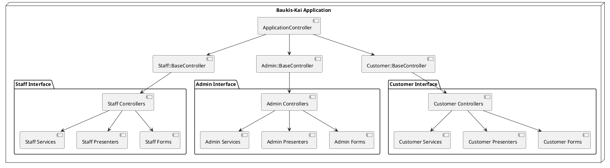
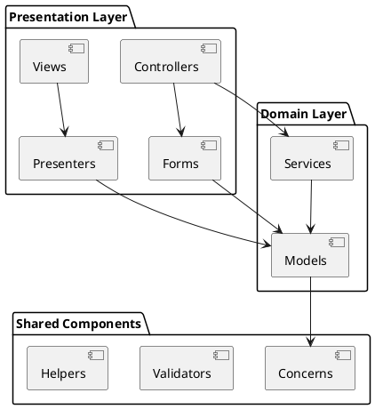
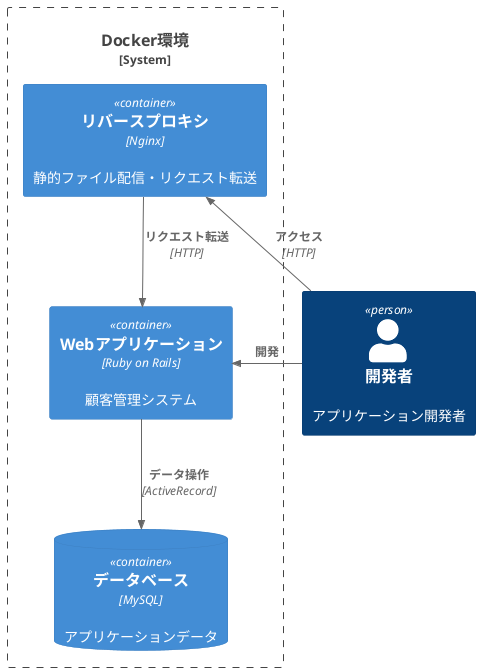
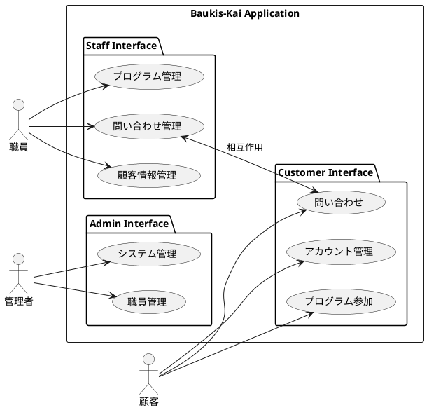
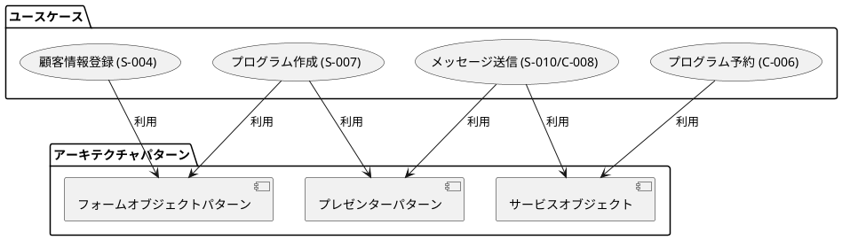

# Baukis-Kai アプリケーション実装サマリー

## 概要

このドキュメントは、Baukis-Kaiプロジェクトの開発ジャーナル（docs/journal）の内容をまとめたものです。Baukis-Kaiは顧客管理システムであり、スタッフによる顧客情報管理、顧客のプログラム予約管理、顧客とスタッフ間のメッセージング機能などを提供します。

## システム構成

Baukis-Kaiは以下の3つの主要なサブシステムで構成されています：

1. **スタッフインターフェース**: スタッフが顧客情報やプログラムを管理するためのインターフェース
2. **顧客インターフェース**: 顧客が自身の情報、予約、メッセージを管理するためのインターフェース
3. **管理者インターフェース**: システム全体とスタッフを管理するための管理者用インターフェース



## アーキテクチャ

Baukis-Kaiは拡張版MVCアーキテクチャに基づいており、以下の層に分かれています：

- **プレゼンテーション層**: Views, Controllers, Presenters, Forms
- **ドメイン層**: Models, Services
- **共通コンポーネント**: Concerns, Validators, Helpers



特徴的なアーキテクチャパターンとして以下が採用されています：

- **プレゼンターパターン**: ビューロジックを分離
- **フォームオブジェクトパターン**: 複雑なフォーム処理をカプセル化
- **サービスオブジェクト**: 複雑なビジネスロジックをカプセル化

## 開発タイムライン

### 2017年初期: 基盤構築フェーズ

- **Docker環境の構築** (2017-01-10)
  - Ruby 2.4ベースのDockerイメージ設定
  - MySQL、Nginxを含む開発環境の構築

- **認証・認可システムの実装**
  - スタッフ、管理者、顧客向けの認証機能
  - 権限管理と制御機能

### 2017年中期: 主要機能実装フェーズ

- **顧客管理機能の実装**
  - 顧客情報の登録・編集・検索機能
  - 顧客詳細表示機能

- **プログラム管理機能の実装** (2017-02-14)
  - プログラム（イベント・セミナー）の登録・編集機能
  - フォームオブジェクトとプレゼンターパターンの活用

- **予約管理機能の実装**
  - 顧客によるプログラム予約機能
  - スタッフによる予約管理機能

### 2017年後期: 拡張機能実装フェーズ

- **メッセージング機能の実装** (2017-03-27)
  - スタッフと顧客間のメッセージ交換機能
  - メッセージの削除・管理機能
  - タグ付け機能と排他制御

  ```plantuml
  @startuml
  title 顧客によるメッセージ削除機能

  actor "顧客" as Customer
  boundary "メッセージ一覧画面" as MessageList
  control "MessagesController" as Controller
  entity "StaffMessage" as Message
  database "Database" as DB

  Customer -> MessageList: 削除ボタンをクリック
  MessageList -> Controller: DELETE /messages/:id
  Controller -> Message: find(params[:id])
  Message -> Controller: メッセージオブジェクト
  Controller -> Message: update_column(:discarded, true)
  Message -> DB: 論理削除（discardedフラグ更新）
  Controller -> Customer: リダイレクト & フラッシュメッセージ表示

  note right of Message
    物理削除ではなく論理削除を採用
    discarded = true に設定
  end note

  note right of Controller
    一覧表示時には
    where(discarded: false)
    の条件を追加
  end note
  @enduml
  ```

### 2025年: ドキュメント整備フェーズ

- **システムドキュメントの作成** (2025-04-24)
  - アーキテクチャ概要ドキュメント
  - ユースケースドキュメント

## 主要技術スタック

- **バックエンド**: Ruby on Rails
- **データベース**: MySQL
- **フロントエンド**: HTML, CSS, JavaScript
- **開発環境**: Docker
- **デプロイ環境**: Heroku



## 特徴的な実装パターン

1. **拡張MVCアーキテクチャ**
   - プレゼンターによるビューロジックの分離
   - フォームオブジェクトによる複雑なフォーム処理の分離
   - サービスオブジェクトによるビジネスロジックの分離

   ```plantuml
   @startuml "Baukis-Kai プログラム管理機能"
   !include <C4/C4_Component>

   Person(staff, "職員", "プログラム管理者")

   System_Boundary(program_management, "プログラム管理機能") {
       Component(programs_controller, "ProgramsController", "コントローラ", "プログラム管理の制御")
       Component(program_form, "ProgramForm", "フォームオブジェクト", "プログラム情報の入力処理")
       Component(program_model, "Program", "モデル", "プログラムのデータ構造")
       Component(form_presenter, "FormPresenter", "プレゼンター", "フォーム表示の抽象クラス")
       Component(program_form_presenter, "ProgramFormPresenter", "プレゼンター", "プログラムフォーム表示")
       Component(program_views, "プログラムビュー", "ビュー", "new.html.erb, edit.html.erb, _form.html.erb")
   }

   Rel(staff, programs_controller, "リクエスト")
   Rel(programs_controller, program_form, "生成・利用")
   Rel(program_form, program_model, "データ操作")
   Rel(programs_controller, program_views, "レンダリング")
   Rel(program_views, program_form_presenter, "表示整形")
   Rel(program_form_presenter, form_presenter, "継承")

   @enduml
   ```

2. **名前空間による機能分離**
   - Staff, Admin, Customerの3つの名前空間で機能を分離
   - 各名前空間ごとに独立したコントローラ、ビュー、プレゼンターを実装

3. **ドメインモデルの充実**
   - 豊富なバリデーションとビジネスルールの実装
   - モデル間の関連付けによる複雑なデータ構造の表現

4. **UIの工夫**
   - プレゼンターによる一貫したUI表現
   - 複雑なフォーム入力の簡略化（日付と時刻の分離入力など）

## ユースケースとの関係

Baukis-Kaiの実装は、システムのユースケースを満たすように設計されています。以下に、主要な実装要素とユースケースの関係を示します。

### システム構成とユースケース

システムの3つの主要なサブシステムは、3つの主要なアクター（職員、顧客、管理者）のユースケースに直接対応しています：

1. **スタッフインターフェース**: 職員のユースケース（S-001〜S-012）をサポート
   - 顧客情報管理（S-004〜S-006）
   - プログラム管理（S-007〜S-009）
   - 問い合わせ管理（S-010〜S-012）

2. **顧客インターフェース**: 顧客のユースケース（C-001〜C-010）をサポート
   - アカウント管理（C-001〜C-004）
   - プログラム参加（C-005〜C-007）
   - 問い合わせ（C-008〜C-010）

3. **管理者インターフェース**: 管理者のユースケース（A-001〜A-007）をサポート
   - アカウント管理（A-001〜A-002）
   - 職員管理（A-003〜A-006）
   - システム管理（A-007）



### 開発タイムラインとユースケース

開発タイムラインの各フェーズは、特定のユースケースグループの実装に対応しています：

1. **基盤構築フェーズ（2017年初期）**:
   - 認証・認可システムの実装: S-001, S-002, C-001, C-002, C-003, A-001, A-002のユースケースに対応

2. **主要機能実装フェーズ（2017年中期）**:
   - 顧客管理機能: S-004, S-005, S-006のユースケースに対応
   - プログラム管理機能: S-007, S-008, S-009, C-005, C-006, C-007のユースケースに対応

3. **拡張機能実装フェーズ（2017年後期）**:
   - メッセージング機能: S-010, S-011, S-012, C-008, C-009, C-010のユースケースに対応

### アーキテクチャパターンとユースケース

採用されたアーキテクチャパターンは、特定のユースケース要件をサポートするために選択されました：

1. **プレゼンターパターン**: 
   - 複雑なビュー表示が必要なユースケース（S-005, S-007, C-005など）をサポート
   - 一貫したUI表現により、ユーザーエクスペリエンスを向上

2. **フォームオブジェクトパターン**:
   - 複雑なフォーム処理が必要なユースケース（S-004, S-007, C-001など）をサポート
   - 日付と時刻の分離入力など、ユーザーフレンドリーな入力方法を実現

3. **サービスオブジェクト**:
   - 複雑なビジネスロジックを含むユースケース（S-009, C-006など）をサポート
   - トランザクション処理や排他制御などの高度な処理を実現



### 実装例とユースケース

具体的な実装例とそれが満たすユースケースの関係：

1. **顧客によるメッセージ削除機能**:
   - 顧客の問い合わせ履歴確認（C-009）ユースケースの拡張機能
   - 論理削除を採用することで、データの整合性を保ちながらユーザーの要求を満たす

2. **プログラム管理機能**:
   - プログラム作成（S-007）とプログラム更新（S-008）のユースケースを実現
   - フォームオブジェクトとプレゼンターパターンを組み合わせて、複雑なフォーム処理を実現

3. **Docker環境構築**:
   - すべてのユースケースの基盤となる開発・実行環境を提供
   - 一貫した環境で開発・テスト・デプロイを可能にし、ユースケースの実装品質を向上

## まとめ

Baukis-Kaiプロジェクトは、顧客管理システムとして必要な機能を段階的に実装してきました。拡張MVCアーキテクチャを採用し、プレゼンターパターンやフォームオブジェクトパターンなどの設計パターンを活用することで、保守性と拡張性の高いシステムを実現しています。開発は2017年から始まり、2025年にかけて機能拡張とドキュメント整備が計画されています。

システムの実装は、明確に定義されたユースケースに基づいて設計されており、各コンポーネントとアーキテクチャパターンは特定のユースケース要件を満たすために選択されています。この設計アプローチにより、ユーザーのニーズに焦点を当てた機能的で使いやすいシステムが実現されています。
