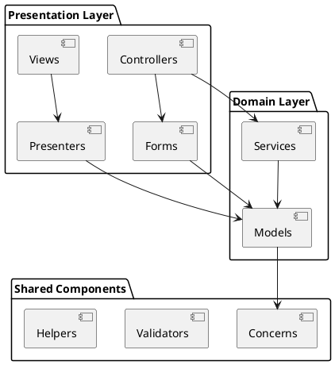
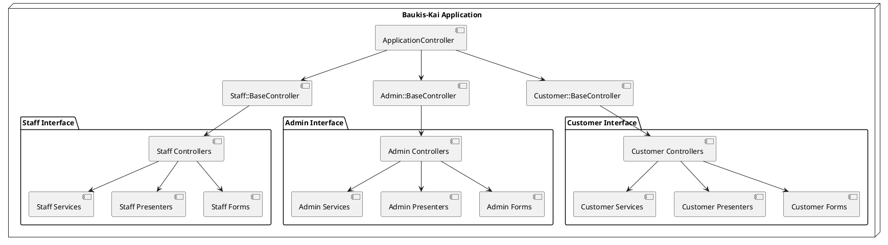
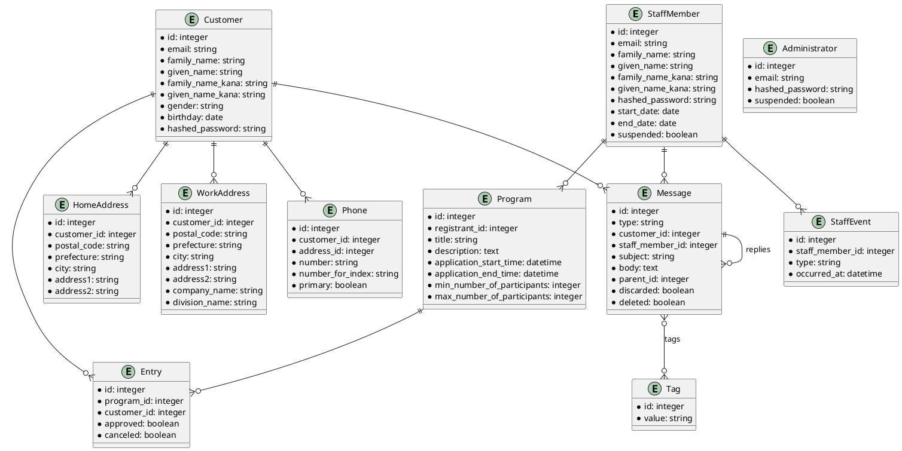
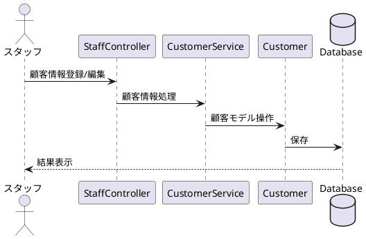
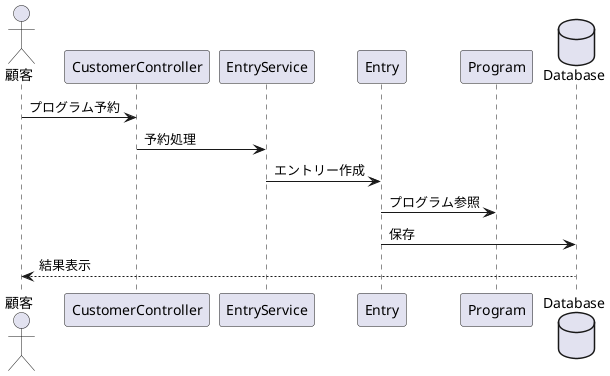
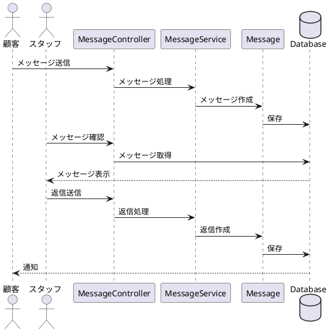
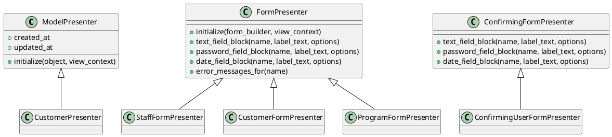
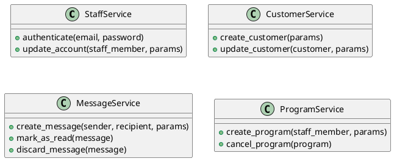
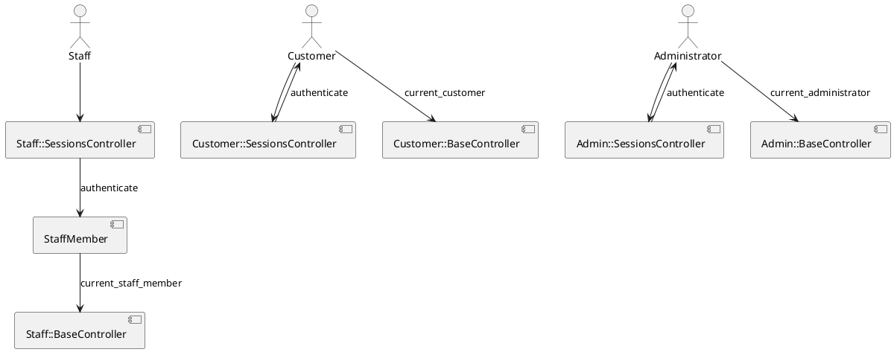
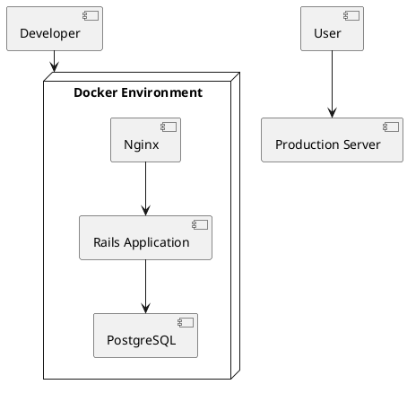

# Baukis-Kai システムアーキテクチャ概要

## 1. システム概要

Baukis-Kaiは顧客管理システムで、主に以下の機能を提供します:

- スタッフによる顧客情報管理
- 顧客のプログラム予約および参加管理
- 顧客とスタッフ間のメッセージングシステム
- 管理者によるスタッフ管理とシステム設定

## 2. システム構成

システムは以下の3つの主要なサブシステムに分かれています:

1. **スタッフインターフェース**: スタッフが顧客情報やプログラムを管理するためのインターフェース
2. **顧客インターフェース**: 顧客が自身の情報、予約、メッセージを管理するためのインターフェース
3. **管理者インターフェース**: システム全体とスタッフを管理するための管理者用インターフェース

## 3. アプリケーション層構造

Railsアプリケーションの拡張版MVCアーキテクチャに基づいており、以下の層に分かれています:

## 4. 名前空間とインターフェース構造

アプリケーションは名前空間を使用して3つのインターフェースを分離しています:

## 5. 主要なデータモデル

システムの主要なエンティティとその関係は以下の通りです:

## 6. 主要なビジネスフロー

### 6.1 顧客管理フロー

### 6.2 プログラム予約フロー

### 6.3 メッセージングフロー

## 7. アプリケーションの特徴的なパターン

### 7.1 Presenterパターン

モデルのデータを表示用に整形するPresenterパターンを採用しています。

### 7.2 Service層パターン

複雑なビジネスロジックをカプセル化するService層を導入しています。

## 8. 認証・認可システム

システムは独自の認証システムを実装しており、それぞれのインターフェースごとに分離されています。

## 9. 配置アーキテクチャ

Dockerを使用した開発・本番環境の構成:

## 10. 開発ガイドライン

1. **名前空間の分離**: 各インターフェース（スタッフ、顧客、管理者）のコードは名前空間で明確に分離する
2. **Presenterの活用**: 表示ロジックはPresenterに集約する
3. **サービスクラスの使用**: 複雑なビジネスロジックはServiceクラスに実装する
4. **Concernの活用**: 共通コードはConcernとして実装し、再利用性を高める
5. **独自バリデータ**: 特殊な検証ロジックは独自のバリデータとして実装する

## 11. テスト戦略

- モデルテスト: RSpecを使用したモデルの単体テスト
- コントローラテスト: コントローラの機能テスト
- システムテスト: Capybaraを使用したE2Eテスト
- ファクトリ: FactoryBotを使用したテストデータの生成

## 12. 将来の拡張性

システムは以下のような拡張を考慮して設計されています:

1. APIサポート: 将来のモバイルアプリケーション対応
2. 多言語対応: 国際化対応の拡張
3. 高度な分析・レポーティング機能の追加
