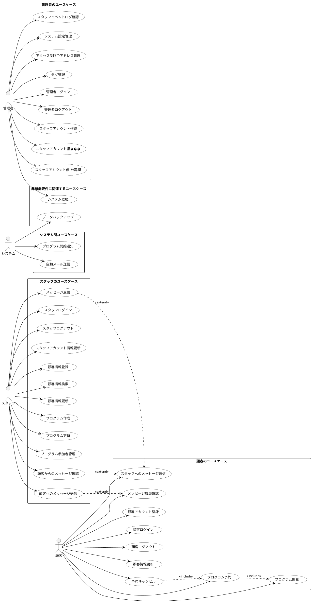

# Baukis-Kai システムユースケース

## 1. 概要

このドキュメントはBaukis-Kaiシステムの主要なユースケースを定義します。システムは主に3つのユーザータイプ（スタッフ、顧客、管理者）向けの機能を提供しています。

## 2. アクター定義

システムには以下の主要なアクターが存在します：

1. **スタッフ**: 顧客情報管理、プログラム管理、顧客とのコミュニケーションを担当する組織の従業員
2. **顧客**: サービスを利用する個人またはグループ
3. **管理者**: システム全体とスタッフアカウントを管理する権限を持つユーザー

## 3. スタッフのユースケース

### 3.1. アカウント管理

| ユースケースID | S-001 |
| ------------- | ----- |
| ユースケース名 | スタッフログイン |
| アクター | スタッフ |
| 説明 | スタッフがシステムにログインする |
| 事前条件 | スタッフアカウントが作成されている |
| 基本フロー | 1. スタッフがログインページにアクセス 2. メールアドレスとパスワードを入力 3. 認証情報を検証 4. ダッシュボードにリダイレクト |
| 代替フロー | - 認証失敗: エラーメッセージを表示 - アカウント停止中: アクセス拒否メッセージを表示 |
| 事後条件 | スタッフがシステムにログインした状態になる |

| ユースケースID | S-002 |
| ------------- | ----- |
| ユースケース名 | スタッフログアウト |
| アクター | スタッフ |
| 説明 | スタッフがシステムからログアウトする |
| 事前条件 | スタッフがログイン済み |
| 基本フロー | 1. スタッフがログアウトボタンをクリック 2. セッションを終了 3. ログインページにリダイレクト |
| 代替フロー | なし |
| 事後条件 | スタッフがログアウト状態になる |

| ユースケースID | S-003 |
| ------------- | ----- |
| ユースケース名 | スタッフアカウント情報更新 |
| アクター | スタッフ |
| 説明 | スタッフが自身のアカウント情報を更新する |
| 事前条件 | スタッフがログイン済み |
| 基本フロー | 1. スタッフがアカウント設定ページにアクセス 2. 情報を編集 3. 変更を保存 |
| 代替フロー | - バリデーションエラー: エラーメッセージを表示し再編集を促す |
| 事後条件 | スタッフの情報が更新される |

### 3.2. 顧客管理

| ユースケースID | S-004 |
| ------------- | ----- |
| ユースケース名 | 顧客情報登録 |
| アクター | スタッフ |
| 説明 | スタッフが新規顧客情報を登録する |
| 事前条件 | スタッフがログイン済み |
| 基本フロー | 1. 顧客登録フォームにアクセス 2. 顧客の基本情報を入力 3. 住所情報を入力（自宅/職場） 4. 電話番号情報を入力 5. フォームを送信 6. システムがデータを検証 7. 顧客情報を保存 |
| 代替フロー | - バリデーションエラー: エラーメッセージを表示し再編集を促す |
| 事後条件 | 新規顧客情報がシステムに登録される |

| ユースケースID | S-005 |
| ------------- | ----- |
| ユースケース名 | 顧客情報検索 |
| アクター | スタッフ |
| 説明 | スタッフが顧客情報を検索する |
| 事前条件 | スタッフがログイン済み |
| 基本フロー | 1. 顧客検索フォームにアクセス 2. 検索条件（名前、メールアドレス、電話番号など）を入力 3. 検索を実行 4. 検索結果を表示 |
| 代替フロー | - 検索結果なし: 該当する顧客がない旨のメッセージを表示 |
| 事後条件 | 検索条件に合致する顧客情報が表示される |

| ユースケースID | S-006 |
| ------------- | ----- |
| ユースケース名 | 顧客情報更新 |
| アクター | スタッフ |
| 説明 | スタッフが既存の顧客情報を更新する |
| 事前条件 | スタッフがログイン済み、顧客が登録済み |
| 基本フロー | 1. 顧客詳細ページにアクセス 2. 編集ボタンをクリック 3. 顧客情報を編集 4. 変更を保存 |
| 代替フロー | - バリデーションエラー: エラーメッセージを表示し再編集を促す |
| 事後条件 | 顧客情報が更新される |

### 3.3. プログラム管理

| ユースケースID | S-007 |
| ------------- | ----- |
| ユースケース名 | プログラム作成 |
| アクター | スタッフ |
| 説明 | スタッフが新規プログラムを作成する |
| 事前条件 | スタッフがログイン済み |
| 基本フロー | 1. プログラム作成フォームにアクセス 2. プログラム詳細（タイトル、説明、日時、参加人数制限等）を入力 3. フォームを送信 4. システムがデータを検証 5. プログラム情報を保存 |
| 代替フロー | - バリデーションエラー: エラーメッセージを表示し再編集を促す |
| 事後条件 | 新規プログラムがシステムに登録される |

| ユースケースID | S-008 |
| ------------- | ----- |
| ユースケース名 | プログラム更新 |
| アクター | スタッフ |
| 説明 | スタッフが既存のプログラム情報を更新する |
| 事前条件 | スタッフがログイン済み、プログラムが登録済み |
| 基本フロー | 1. プログラム詳細ページにアクセス 2. 編集ボタンをクリック 3. プログラム情報を編集 4. 変更を保存 |
| 代替フロー | - バリデーションエラー: エラーメッセージを表示し再編集を促す - 既に予約がある場合: 特定の項目の編集を制限 |
| 事後条件 | プログラム情報が更新される |

| ユースケースID | S-009 |
| ------------- | ----- |
| ユースケース名 | プログラム参加者管理 |
| アクター | スタッフ |
| 説明 | スタッフがプログラムの参加者を管理する |
| 事前条件 | スタッフがログイン済み、プログラムが登録済み |
| 基本フロー | 1. プログラム詳細ページの参加者タブにアクセス 2. 参加者リストを確認 3. 参加承認または拒否の操作を行う |
| 代替フロー | - 参加者なし: 参加者がいない旨のメッセージを表示 |
| 事後条件 | 参加者のステータスが更新される |

### 3.4. メッセージング

| ユースケースID | S-010 |
| ------------- | ----- |
| ユースケース名 | 顧客へのメッセージ送信 |
| アクター | スタッフ |
| 説明 | スタッフが顧客にメッセージを送信する |
| 事前条件 | スタッフがログイン済み、顧客が登録済み |
| 基本フロー | 1. 顧客詳細ページのメッセージタブにアクセス 2. 新規メッセージボタンをクリック 3. メッセージのタイトルと本文を入力 4. タグを選択（オプション） 5. メッセージを送信 |
| 代替フロー | - バリデーションエラー: エラーメッセージを表示し再編集を促す |
| 事後条件 | メッセージが顧客に送信される |

| ユースケースID | S-011 |
| ------------- | ----- |
| ユースケース名 | 顧客からのメッセージ確認 |
| アクター | スタッフ |
| 説明 | スタッフが顧客からのメッセージを確認する |
| 事前条件 | スタッフがログイン済み、顧客からメッセージが送信済み |
| 基本フロー | 1. メッセージ一覧ページにアクセス 2. 未読または特定の顧客からのメッセージをフィルタ 3. メッセージを選択して詳細を閲覧 |
| 代替フロー | - メッセージなし: メッセージがない旨のメッセージを表示 |
| 事後条件 | メッセージが既読状態になる |

| ユースケースID | S-012 |
| ------------- | ----- |
| ユースケース名 | メッセージ返信 |
| アクター | スタッフ |
| 説明 | スタッフが顧客のメッセージに返信する |
| 事前条件 | スタッフがログイン済み、顧客からメッセージが送信済み |
| 基本フロー | 1. メッセージ詳細画面にアクセス 2. 返信ボタンをクリック 3. 返信内容を入力 4. 返信を送信 |
| 代替フロー | - バリデーションエラー: エラーメッセージを表示し再編集を促す |
| 事後条件 | 返信が顧客に送信される |

## 4. 顧客のユースケース

### 4.1. アカウント管理

| ユースケースID | C-001 |
| ------------- | ----- |
| ユースケース名 | 顧客アカウント登録 |
| アクター | 顧客 |
| 説明 | 顧客が自らアカウントを登録する |
| 事前条件 | なし |
| 基本フロー | 1. 顧客がアカウント登録ページにアクセス 2. 基本情報を入力 3. メールアドレスとパスワードを設定 4. 登録を完了 |
| 代替フロー | - バリデーションエラー: エラーメッセージを表示し再編集を促す - メールアドレス重複: 既存アカウントを使用するよう促す |
| 事後条件 | 新規顧客アカウントが作成される |

| ユースケースID | C-002 |
| ------------- | ----- |
| ユースケース名 | 顧客ログイン |
| アクター | 顧客 |
| 説明 | 顧客がシステムにログインする |
| 事前条件 | 顧客アカウントが作成済み |
| 基本フロー | 1. 顧客がログインページにアクセス 2. メールアドレスとパスワードを入力 3. 認証情報を検証 4. マイページにリダイレクト |
| 代替フロー | - 認証失敗: エラーメッセージを表示 |
| 事後条件 | 顧客がログイン状態になる |

| ユースケースID | C-003 |
| ------------- | ----- |
| ユースケース名 | 顧客ログアウト |
| アクター | 顧客 |
| 説明 | 顧客がシステムからログアウトする |
| 事前条件 | 顧客がログイン済み |
| 基本フロー | 1. 顧客がログアウトボタンをクリック 2. セッションを終了 3. ホームページにリダイレクト |
| 代替フロー | なし |
| 事後条件 | 顧客がログアウト状態になる |

| ユースケースID | C-004 |
| ------------- | ----- |
| ユースケース名 | 顧客情報更新 |
| アクター | 顧客 |
| 説明 | 顧客が自身のアカウント情報を更新する |
| 事前条件 | 顧客がログイン済み |
| 基本フロー | 1. 顧客がマイページのアカウント設定にアクセス 2. 情報を編集 3. 変更を保存 |
| 代替フロー | - バリデーションエラー: エラーメッセージを表示し再編集を促す |
| 事後条件 | 顧客情報が更新される |

### 4.2. プログラム参加

| ユースケースID | C-005 |
| ------------- | ----- |
| ユースケース名 | プログラム閲覧 |
| アクター | 顧客 |
| 説明 | 顧客が利用可能なプログラムを閲覧する |
| 事前条件 | 顧客がログイン済み（オプション） |
| 基本フロー | 1. プログラム一覧ページにアクセス 2. プログラムをフィルタリング/ソート（オプション） 3. プログラム詳細を閲覧 |
| 代替フロー | - プログラムなし: 利用可能なプログラムがない旨のメッセージを表示 |
| 事後条件 | プログラム情報が表示される |

| ユースケースID | C-006 |
| ------------- | ----- |
| ユースケース名 | プログラム予約 |
| アクター | 顧客 |
| 説明 | 顧客がプログラムを予約する |
| 事前条件 | 顧客がログイン済み、予約可能なプログラムが存在する |
| 基本フロー | 1. プログラム詳細ページにアクセス 2. 予約ボタンをクリック 3. 予約情報を入力/確認 4. 予約を確定 |
| 代替フロー | - 定員超過: 予約できない旨のメッセージを表示 - 予約期間外: 予約できない旨のメッセージを表示 |
| 事後条件 | プログラムが予約され、エントリーが作成される |

| ユースケースID | C-007 |
| ------------- | ----- |
| ユースケース名 | 予約キャンセル |
| アクター | 顧客 |
| 説明 | 顧客が予約したプログラムをキャンセルする |
| 事前条件 | 顧客がログイン済み、プログラムを予約済み |
| 基本フロー | 1. マイページの予約一覧にアクセス 2. キャンセルするプログラムを選択 3. キャンセルボタンをクリック 4. キャンセルを確認 |
| 代替フロー | - キャンセル期限超過: キャンセルできない旨のメッセージを表示 |
| 事後条件 | 予約がキャンセルされる |

### 4.3. メッセージング

| ユースケースID | C-008 |
| ------------- | ----- |
| ユースケース名 | スタッフへのメッセージ送信 |
| アクター | 顧客 |
| 説明 | 顧客がスタッフにメッセージを送信する |
| 事前条件 | 顧客がログイン済み |
| 基本フロー | 1. マイページのメッセージ機能にアクセス 2. 新規メッセージボタンをクリック 3. メッセージのタイトルと本文を入力 4. 宛先のスタッフを選択またはカテゴリを選択 5. メッセージを送信 |
| 代替フロー | - バリデーションエラー: エラーメッセージを表示し再編集を促す |
| 事後条件 | メッセージがスタッフに送信される |

| ユースケースID | C-009 |
| ------------- | ----- |
| ユースケース名 | メッセージ履歴確認 |
| アクター | 顧客 |
| 説明 | 顧客が過去のメッセージのやり取りを確認する |
| 事前条件 | 顧客がログイン済み、メッセージのやり取りが存在する |
| 基本フロー | 1. マイページのメッセージ履歴にアクセス 2. メッセージスレッドを選択 3. やり取りの履歴を確認 |
| 代替フロー | - メッセージなし: メッセージがない旨のメッセージを表示 |
| 事後条件 | メッセージ履歴が表示される |

## 5. 管理者のユースケース

### 5.1. アカウント管理

| ユースケースID | A-001 |
| ------------- | ----- |
| ユースケース名 | 管理者ログイン |
| アクター | 管理者 |
| 説明 | 管理者がシステムにログインする |
| 事前条件 | 管理者アカウントが作成されている |
| 基本フロー | 1. 管理者がログインページにアクセス 2. メールアドレスとパスワードを入力 3. 認証情報を検証 4. 管理者ダッシュボードにリダイレクト |
| 代替フロー | - 認証失敗: エラーメッセージを表示 |
| 事後条件 | 管理者がログイン状態になる |

| ユースケースID | A-002 |
| ------------- | ----- |
| ユースケース名 | 管理者ログアウト |
| アクター | 管理者 |
| 説明 | 管理者がシステムからログアウトする |
| 事前条件 | 管理者がログイン済み |
| 基本フロー | 1. 管理者がログアウトボタンをクリック 2. セッションを終了 3. ログインページにリダイレクト |
| 代替フロー | なし |
| 事後条件 | 管理者がログアウト状態になる |

### 5.2. スタッフ管理

| ユースケースID | A-003 |
| ------------- | ----- |
| ユースケース名 | スタッフアカウント作成 |
| アクター | 管理者 |
| 説明 | 管理者が新規スタッフアカウントを作成する |
| 事前条件 | 管理者がログイン済み |
| 基本フロー | 1. スタッフ管理ページにアクセス 2. 新規スタッフ作成ボタンをクリック 3. スタッフ情報を入力 4. アカウントを作成 |
| 代替フロー | - バリデーションエラー: エラーメッセージを表示し再編集を促す - メールアドレス重複: エラーメッセージを表示 |
| 事後条件 | 新規スタッフアカウントが作成される |

| ユースケースID | A-004 |
| ------------- | ----- |
| ユースケース名 | スタッフアカウント編集 |
| アクター | 管理者 |
| 説明 | 管理者が既存のスタッフアカウント情報を編集する |
| 事前条件 | 管理者がログイン済み、スタッフアカウントが存在する |
| 基本フロー | 1. スタッフ一覧ページにアクセス 2. 編集するスタッフを選択 3. 編集ボタンをクリック 4. スタッフ情報を編集 5. 変更を保存 |
| 代替フロー | - バリデーションエラー: エラーメッセージを表示し再編集を促す |
| 事後条件 | スタッフ情報が更新される |

| ユースケースID | A-005 |
| ------------- | ----- |
| ユースケース名 | スタッフアカウント停止/再開 |
| アクター | 管理者 |
| 説明 | 管理者がスタッフアカウントの停止または再開を行う |
| 事前条件 | 管理者がログイン済み、スタッフアカウントが存在する |
| 基本フロー | 1. スタッフ一覧ページにアクセス 2. 対象のスタッフを選択 3. 停止/再開ボタンをクリック 4. 確認ダイアログで確認 |
| 代替フロー | なし |
| 事後条件 | スタッフアカウントの状態が変更される |

| ユースケースID | A-006 |
| ------------- | ----- |
| ユースケース名 | スタッフイベントログ確認 |
| アクター | 管理者 |
| 説明 | 管理者がスタッフのアクティビティログを確認する |
| 事前条件 | 管理者がログイン済み、スタッフアカウントが存在する |
| 基本フロー | 1. スタッフ詳細ページにアクセス 2. イベントログタブを選択 3. ログを閲覧 |
| 代替フロー | - ログなし: ログがない旨のメッセージを表示 |
| 事後条件 | スタッフのアクティビティログが表示される |

### 5.3. システム管理

| ユースケースID | A-007 |
| ------------- | ----- |
| ユースケース名 | システム設定管理 |
| アクター | 管理者 |
| 説明 | 管理者がシステム全体の設定を管理する |
| 事前条件 | 管理者がログイン済み |
| 基本フロー | 1. システム設定ページにアクセス 2. 設定項目を編集 3. 変更を保存 |
| 代替フロー | - バリデーションエラー: エラーメッセージを表示し再編集を促す |
| 事後条件 | システム設定が更新される |

| ユースケースID | A-008 |
| ------------- | ----- |
| ユースケース名 | アクセス制限IPアドレス管理 |
| アクター | 管理者 |
| 説明 | 管理者がアクセス許可するIPアドレスを管理する |
| 事前条件 | 管理者がログイン済み |
| 基本フロー | 1. IPアドレス制限設定ページにアクセス 2. 許可するIPアドレスを追加/編集/削除 3. 変更を保存 |
| 代替フロー | - バリデーションエラー: エラーメッセージを表示し再編集を促す |
| 事後条件 | アクセス制限設定が更新される |

## 6. システム間ユースケース

| ユースケースID | SYS-001 |
| ------------- | ----- |
| ユースケース名 | 自動メール送信 |
| アクター | システム |
| 説明 | システムが特定のイベント発生時に自動的にメールを送信する |
| 事前条件 | 対象イベントが発生している（予約完了、メッセージ受信など） |
| 基本フロー | 1. イベント発生を検知 2. メールテンプレートを選択 3. 必要な情報を埋め込む 4. メールを送信 |
| 代替フロー | - メール送信失敗: エラーをログに記録し再送を試みる |
| 事後条件 | メールが送信される |

| ユースケースID | SYS-002 |
| ------------- | ----- |
| ユースケース名 | プログラム開始通知 |
| アクター | システム |
| 説明 | システムがプログラム開始前に参加者に通知する |
| 事前条件 | プログラムが登録済み、参加者が存在する |
| 基本フロー | 1. スケジュールされたタイミングで通知処理を実行 2. 参加者リストを取得 3. 各参加者に通知を送信 |
| 代替フロー | - 通知送信失敗: エラーをログに記録 |
| 事後条件 | 参加者に通知が送信される |

## 7. 非機能要件に関連するユースケース

| ユースケースID | NF-001 |
| ------------- | ----- |
| ユースケース名 | システム監視 |
| アクター | 管理者 |
| 説明 | 管理者がシステムのパフォーマンスと健全性を監視する |
| 事前条件 | 管理者がログイン済み |
| 基本フロー | 1. システム監視ダッシュボードにアクセス 2. パフォーマンス指標を確認 3. エラーログを確認 4. 必要に応じて対応策を実施 |
| 代替フロー | なし |
| 事後条件 | システム状態が把握される |

| ユースケースID | NF-002 |
| ------------- | ----- |
| ユースケース名 | データバックアップ |
| アクター | システム |
| 説明 | システムが定期的にデータのバックアップを実行する |
| 事前条件 | バックアップスケジュールが設定されている |
| 基本フロー | 1. スケジュールされたタイミングでバックアッププロセスを開始 2. データベースのバックアップを取得 3. バックアップファイルを保存 4. 古いバックアップファイルの整理 |
| 代替フロー | - バックアップ失敗: エラーをログに記録し管理者に通知 |
| 事後条件 | データバックアップが作成される |

## 8. ユースケース関連図

以下は、Baukis-Kaiシステムの主要なユースケースとアクター間の関係を示すUML図です。

