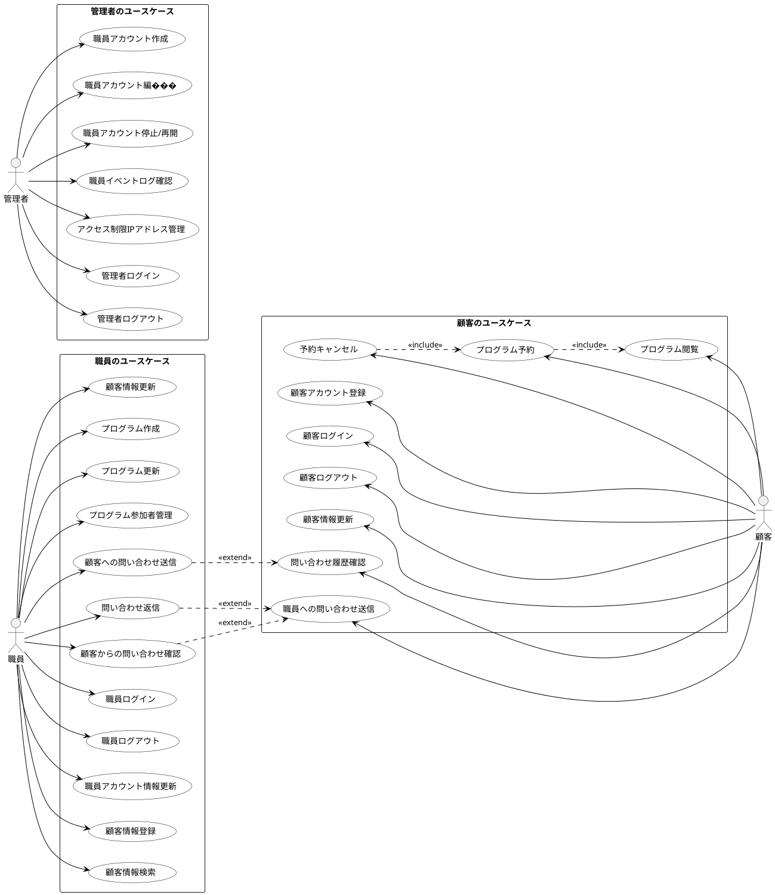

# Baukis-Kai システムユースケース

## 1. 概要

このドキュメントはBaukis-Kaiシステムの主要なユースケースを定義します。システムは主に3つのユーザータイプ（職員、顧客、管理者）向けの機能を提供しています。

## 2. アクター定義

システムには以下の主要なアクターが存在します：

1. **職員**: 顧客情報管理、プログラム管理、顧客とのコミュニケーションを担当する組織の従業員
2. **顧客**: サービスを利用する個人またはグループ
3. **管理者**: システム全体と職員アカウントを管理する権限を持つユーザー

## 3. 職員のユースケース

### 3.1. アカウント管理

| ユースケースID | S-001 |
| ------------- | ----- |
| ユースケース名 | 職員ログイン |
| アクター | 職員 |
| 説明 | 職員がシステムにログインする |
| 事前条件 | 職員アカウントが作成されている |
| 基本フロー | 1. 職員がログインページにアクセス 2. メールアドレスとパスワードを入力 3. 認証情報を検証 4. ダッシュボードにリダイレクト |
| 代替フロー | - 認証失敗: エラーメッセージを表示 - アカウント停止中: アクセス拒否メッセージを表示 |
| 事後条件 | 職員がシステムにログインした状態になる |

| ユースケースID | S-002 |
| ------------- | ----- |
| ユースケース名 | 職員ログアウト |
| アクター | 職員 |
| 説明 | 職員がシステムからログアウトする |
| 事前条件 | 職員がログイン済み |
| 基本フロー | 1. 職員がログアウトボタンをクリック 2. セッションを終了 3. ログインページにリダイレクト |
| 代替フロー | なし |
| 事後条件 | 職員がログアウト状態になる |

| ユースケースID | S-003 |
| ------------- | ----- |
| ユースケース名 | 職員アカウント情報更新 |
| アクター | 職員 |
| 説明 | 職員が自身のアカウント情報を更新する |
| 事前条件 | 職員がログイン済み |
| 基本フロー | 1. 職員がアカウント設定ページにアクセス 2. 情報を編集 3. 変更を保存 |
| 代替フロー | - バリデーションエラー: エラーメッセージを表示し再編集を促す |
| 事後条件 | 職員の情報が更新される |

### 3.2. 顧客管理

| ユースケースID | S-004 |
| ------------- | ----- |
| ユースケース名 | 顧客情報登録 |
| アクター | 職員 |
| 説明 | 職員が新規顧客情報を登録する |
| 事前条件 | 職員がログイン済み |
| 基本フロー | 1. 顧客登録フォームにアクセス 2. 顧客の基本情報を入力 3. 住所情報を入力（自宅/職場） 4. 電話番号情報を入力 5. フォームを送信 6. システムがデータを検証 7. 顧客情報を保存 |
| 代替フロー | - バリデーションエラー: エラーメッセージを表示し再編集を促す |
| 事後条件 | 新規顧客情報がシステムに登録される |

| ユースケースID | S-005 |
| ------------- | ----- |
| ユースケース名 | 顧客情報検索 |
| アクター | 職員 |
| 説明 | 職員が顧客情報を検索する |
| 事前条件 | 職員がログイン済み |
| 基本フロー | 1. 顧客検索フォームにアクセス 2. 検索条件（名前、メールアドレス、電話番号など）を入力 3. 検索を実行 4. 検索結果を表示 |
| 代替フロー | - 検索結果なし: 該当する顧客がない旨のメッセージを表示 |
| 事後条件 | 検索条件に合致する顧客情報が表示される |

| ユースケースID | S-006 |
| ------------- | ----- |
| ユースケース名 | 顧客情報更新 |
| アクター | 職員 |
| 説明 | 職員が既存の顧客情報を更新する |
| 事前条件 | 職員がログイン済み、顧客が登録済み |
| 基本フロー | 1. 顧客詳細ページにアクセス 2. 編集ボタンをクリック 3. 顧客情報を編集 4. 変更を保存 |
| 代替フロー | - バリデーションエラー: エラーメッセージを表示し再編集を促す |
| 事後条件 | 顧客情報が更新される |

### 3.3. プログラム管理

| ユースケースID | S-007 |
| ------------- | ----- |
| ユースケース名 | プログラム作成 |
| アクター | 職員 |
| 説明 | 職員が新規プログラムを作成する |
| 事前条件 | 職員がログイン済み |
| 基本フロー | 1. プログラム作成フォームにアクセス 2. プログラム詳細（タイトル、説明、日時、参加人数制限等）を入力 3. フォームを送信 4. システムがデータを検証 5. プログラム情報を保存 |
| 代替フロー | - バリデーションエラー: エラーメッセージを表示し再編集を促す |
| 事後条件 | 新規プログラムがシステムに登録される |

| ユースケースID | S-008 |
| ------------- | ----- |
| ユースケース名 | プログラム更新 |
| アクター | 職員 |
| 説明 | 職員が既存のプログラム情報を更新する |
| 事前条件 | 職員がログイン済み、プログラムが登録済み |
| 基本フロー | 1. プログラム詳細ページにアクセス 2. 編集ボタンをクリック 3. プログラム情報を編集 4. 変更を保存 |
| 代替フロー | - バリデーションエラー: エラーメッセージを表示し再編集を促す - 既に予約がある場合: 特定の項目の編集を制限 |
| 事後条件 | プログラム情報が更新される |

| ユースケースID | S-009 |
| ------------- | ----- |
| ユースケース名 | プログラム参加者管理 |
| アクター | 職員 |
| 説明 | 職員がプログラムの参加者を管理する |
| 事前条件 | 職員がログイン済み、プログラムが登録済み |
| 基本フロー | 1. プログラム詳細ページの参加者タブにアクセス 2. 参加者リストを確認 3. 参加承認または拒否の操作を行う |
| 代替フロー | - 参加者なし: 参加者がいない旨のメッセージを表示 |
| 事後条件 | 参加者のステータスが更新される |

### 3.4. 問い合わせ

| ユースケースID | S-010 |
| ------------- | ----- |
| ユースケース名 | 顧客への問い合わせ送信 |
| アクター | 職員 |
| 説明 | 職員が顧客にメッセージを送信する |
| 事前条件 | 職員がログイン済み、顧客が登録済み |
| 基本フロー | 1. 顧客詳細ページのメッセージタブにアクセス 2. 新規メッセージボタンをクリック 3. メッセージのタイトルと本文を入力 4. タグを選択（オプション） 5. メッセージを送信 |
| 代替フロー | - バリデーションエラー: エラーメッセージを表示し再編集を促す |
| 事後条件 | メッセージが顧客に送信される |

| ユースケースID | S-011 |
| ------------- | ----- |
| ユースケース名 | 顧客からの問い合わせ確認 |
| アクター | 職員 |
| 説明 | 職員が顧客からのメッセージを確認する |
| 事前条件 | 職員がログイン済み、顧客からメッセージが送信済み |
| 基本フロー | 1. メッセージ一覧ページにアクセス 2. 未読または特定の顧客からのメッセージをフィルタ 3. メッセージを選択して詳細を閲覧 |
| 代替フロー | - メッセージなし: メッセージがない旨のメッセージを表示 |
| 事後条件 | メッセージが既読状態になる |

| ユースケースID | S-012 |
| ------------- | ----- |
| ユースケース名 | 問い合わせ返信 |
| アクター | 職員 |
| 説明 | 職員が顧客のメッセージに返信する |
| 事前条件 | 職員がログイン済み、顧客からメッセージが送信済み |
| 基本フロー | 1. メッセージ詳細画面にアクセス 2. 返信ボタンをクリック 3. 返信内容を入力 4. 返信を送信 |
| 代替フロー | - バリデーションエラー: エラーメッセージを表示し再編集を促す |
| 事後条件 | 返信が顧客に送信される |

## 4. 顧客のユースケース

### 4.1. アカウント管理

| ユースケースID | C-001 |
| ------------- | ----- |
| ユースケース名 | 顧客アカウント登録 |
| アクター | 顧客 |
| 説明 | 顧客が自らアカウントを登録する |
| 事前条件 | なし |
| 基本フロー | 1. 顧客がアカウント登録ページにアクセス 2. 基本情報を入力 3. メールアドレスとパスワードを設定 4. 登録を完了 |
| 代替フロー | - バリデーションエラー: エラーメッセージを表示し再編集を促す - メールアドレス重複: 既存アカウントを使用するよう促す |
| 事後条件 | 新規顧客アカウントが作成される |

| ユースケースID | C-002 |
| ------------- | ----- |
| ユースケース名 | 顧客ログイン |
| アクター | 顧客 |
| 説明 | 顧客がシステムにログインする |
| 事前条件 | 顧客アカウントが作成済み |
| 基本フロー | 1. 顧客がログインページにアクセス 2. メールアドレスとパスワードを入力 3. 認証情報を検証 4. マイページにリダイレクト |
| 代替フロー | - 認証失敗: エラーメッセージを表示 |
| 事後条件 | 顧客がログイン状態になる |

| ユースケースID | C-003 |
| ------------- | ----- |
| ユースケース名 | 顧客ログアウト |
| アクター | 顧客 |
| 説明 | 顧客がシステムからログアウトする |
| 事前条件 | 顧客がログイン済み |
| 基本フロー | 1. 顧客がログアウトボタンをクリック 2. セッションを終了 3. ホームページにリダイレクト |
| 代替フロー | なし |
| 事後条件 | 顧客がログアウト状態になる |

| ユースケースID | C-004 |
| ------------- | ----- |
| ユースケース名 | 顧客情報更新 |
| アクター | 顧客 |
| 説明 | 顧客が自身のアカウント情報を更新する |
| 事前条件 | 顧客がログイン済み |
| 基本フロー | 1. 顧客がマイページのアカウント設定にアクセス 2. 情報を編集 3. 変更を保存 |
| 代替フロー | - バリデーションエラー: エラーメッセージを表示し再編集を促す |
| 事後条件 | 顧客情報が更新される |

### 4.2. プログラム参加

| ユースケースID | C-005 |
| ------------- | ----- |
| ユースケース名 | プログラム閲覧 |
| アクター | 顧客 |
| 説明 | 顧客が利用可能なプログラムを閲覧する |
| 事前条件 | 顧客がログイン済み（オプション） |
| 基本フロー | 1. プログラム一覧ページにアクセス 2. プログラムをフィルタリング/ソート（オプション） 3. プログラム詳細を閲覧 |
| 代替フロー | - プログラムなし: 利用可能なプログラムがない旨のメッセージを表示 |
| 事後条件 | プログラム情報が表示される |

| ユースケースID | C-006 |
| ------------- | ----- |
| ユースケース名 | プログラム予約 |
| アクター | 顧客 |
| 説明 | 顧客がプログラムを予約する |
| 事前条件 | 顧客がログイン済み、予約可能なプログラムが存在する |
| 基本フロー | 1. プログラム詳細ページにアクセス 2. 予約ボタンをクリック 3. 予約情報を入力/確認 4. 予約を確定 |
| 代替フロー | - 定員超過: 予約できない旨のメッセージを表示 - 予約期間外: 予約できない旨のメッセージを表示 |
| 事後条件 | プログラムが予約され、エントリーが作成される |

| ユースケースID | C-007 |
| ------------- | ----- |
| ユースケース名 | 予約キャンセル |
| アクター | 顧客 |
| 説明 | 顧客が予約したプログラムをキャンセルする |
| 事前条件 | 顧客がログイン済み、プログラムを予約済み |
| 基本フロー | 1. マイページの予約一覧にアクセス 2. キャンセルするプログラムを選択 3. キャンセルボタンをクリック 4. キャンセルを確認 |
| 代替フロー | - キャンセル期限超過: キャンセルできない旨のメッセージを表示 |
| 事後条件 | 予約がキャンセルされる |

### 4.3. 問い合わせ

| ユースケースID | C-008 |
| ------------- | ----- |
| ユースケース名 | 職員への問い合わせ送信 |
| アクター | 顧客 |
| 説明 | 顧客が職員にメッセージを送信する |
| 事前条件 | 顧客がログイン済み |
| 基本フロー | 1. マイページのメッセージ機能にアクセス 2. 新規メッセージボタンをクリック 3. メッセージのタイトルと本文を入力 4. 宛先の職員を選択またはカテゴリを選択 5. メッセージを送信 |
| 代替フロー | - バリデーションエラー: エラーメッセージを表示し再編集を促す |
| 事後条件 | メッセージが職員に送信される |

| ユースケースID | C-009 |
| ------------- | ----- |
| ユースケース名 | 問い合わせ履歴確認 |
| アクター | 顧客 |
| 説明 | 顧客が過去のメッセージのやり取りを確認する |
| 事前条件 | 顧客がログイン済み、メッセージのやり取りが存在する |
| 基本フロー | 1. マイページのメッセージ履歴にアクセス 2. メッセージスレッドを選択 3. やり取りの履歴を確認 |
| 代替フロー | - メッセージなし: メッセージがない旨のメッセージを表示 |
| 事後条件 | メッセージ履歴が表示される |

| ユースケースID | C-010                                             |
| ------------- |---------------------------------------------------|
| ユースケース名 | 問い合わせ返信                                           |
| アクター | 顧客                                                |
| 説明 | 顧客が職員のメッセージに返信する                                |
| 事前条件 | 顧客がログイン済み、職員からメッセージが送信済み                        |
| 基本フロー | 1. マイページのメッセージ履歴にアクセス 2. メッセージスレッドを選択 3. 返信 |
| 代替フロー | - バリデーションエラー: エラーメッセージを表示し再編集を促す                  |
| 事後条件 | 返信が職員に送信される                                     |

## 5. 管理者のユースケース

### 5.1. アカウント管理

| ユースケースID | A-001 |
| ------------- | ----- |
| ユースケース名 | 管理者ログイン |
| アクター | 管理者 |
| 説明 | 管理者がシステムにログインする |
| 事前条件 | 管理者アカウントが作成されている |
| 基本フロー | 1. 管理者がログインページにアクセス 2. メールアドレスとパスワードを入力 3. 認証情報を検証 4. 管理者ダッシュボードにリダイレクト |
| 代替フロー | - 認証失敗: エラーメッセージを表示 |
| 事後条件 | 管理者がログイン状態になる |

| ユースケースID | A-002 |
| ------------- | ----- |
| ユースケース名 | 管理者ログアウト |
| アクター | 管理者 |
| 説明 | 管理者がシステムからログアウトする |
| 事前条件 | 管理者がログイン済み |
| 基本フロー | 1. 管理者がログアウトボタンをクリック 2. セッションを終了 3. ログインページにリダイレクト |
| 代替フロー | なし |
| 事後条件 | 管理者がログアウト状態になる |

### 5.2. 職員管理

| ユースケースID | A-003 |
| ------------- | ----- |
| ユースケース名 | 職員アカウント作成 |
| アクター | 管理者 |
| 説明 | 管理者が新規職員アカウントを作成する |
| 事前条件 | 管理者がログイン済み |
| 基本フロー | 1. 職員管理ページにアクセス 2. 新規スタッフ作成ボタンをクリック 3. スタッフ情報を入力 4. アカウントを作成 |
| 代替フロー | - バリデーションエラー: エラーメッセージを表示し再編集を促す - メールアドレス重複: エラーメッセージを表示 |
| 事後条件 | 新規職員アカウントが作成される |

| ユースケースID | A-004 |
| ------------- | ----- |
| ユースケース名 | 職員アカウント編集 |
| アクター | 管理者 |
| 説明 | 管理者が既存の職員アカウント情報を編集する |
| 事前条件 | 管理者がログイン済み、職員アカウントが存在する |
| 基本フロー | 1. 職員一覧ページにアクセス 2. 編集するスタッフを選択 3. 編集ボタンをクリック 4. スタッフ情報を編集 5. 変更を保存 |
| 代替フロー | - バリデーションエラー: エラーメッセージを表示し再編集を促す |
| 事後条件 | 職員情報が更新される |

| ユースケースID | A-005 |
| ------------- | ----- |
| ユースケース名 | 職員アカウント停止/再開 |
| アクター | 管理者 |
| 説明 | 管理者が職員アカウントの停止または再開を行う |
| 事前条件 | 管理者がログイン済み、職員アカウントが存在する |
| 基本フロー | 1. 職員一覧ページにアクセス 2. 対象のスタッフを選択 3. 停止/再開ボタンをクリック 4. 確認ダイアログで確認 |
| 代替フロー | なし |
| 事後条件 | 職員アカウントの状態が変更される |

| ユースケースID | A-006 |
| ------------- | ----- |
| ユースケース名 | 職員イベントログ確認 |
| アクター | 管理者 |
| 説明 | 管理者が職員のアクティビティログを確認する |
| 事前条件 | 管理者がログイン済み、職員アカウントが存在する |
| 基本フロー | 1. 職員詳細ページにアクセス 2. イベントログタブを選択 3. ログを閲覧 |
| 代替フロー | - ログなし: ログがない旨のメッセージを表示 |
| 事後条件 | 職員のアクティビティログが表示される |

### 5.3. システム管理

| ユースケースID | A-007 |
| ------------- | ----- |
| ユースケース名 | アクセス制限IPアドレス管理 |
| アクター | 管理者 |
| 説明 | 管理者がアクセス許可するIPアドレスを管理する |
| 事前条件 | 管理者がログイン済み |
| 基本フロー | 1. IPアドレス制限設定ページにアクセス 2. 許可するIPアドレスを追加/編集/削除 3. 変更を保存 |
| 代替フロー | - バリデーションエラー: エラーメッセージを表示し再編集を促す |
| 事後条件 | アクセス制限設定が更新される |

## 8. ユースケース関連図

以下は、Baukis-Kaiシステムの主要なユースケースとアクター間の関係を示すUML図です。

